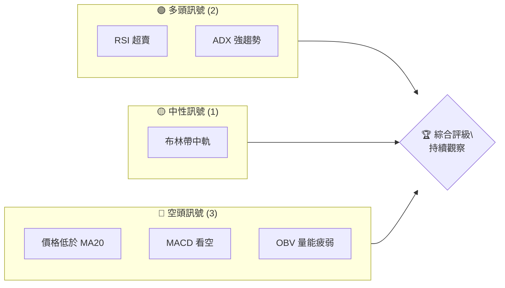
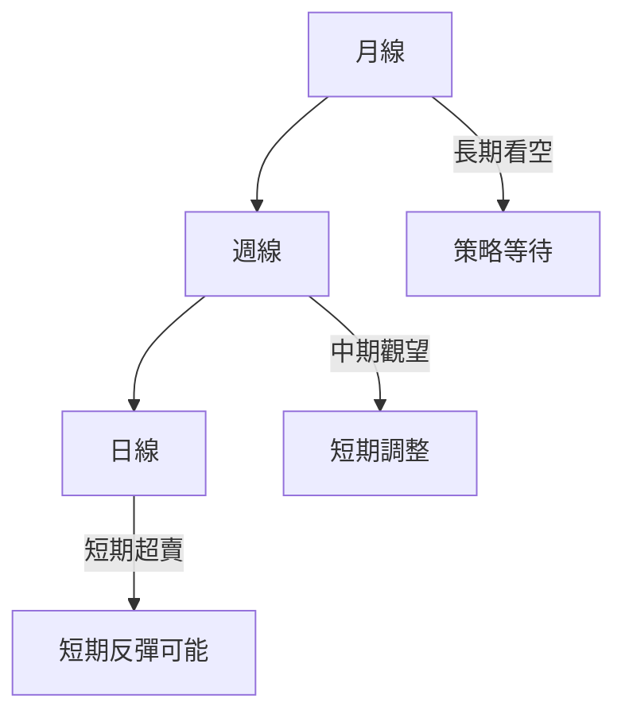
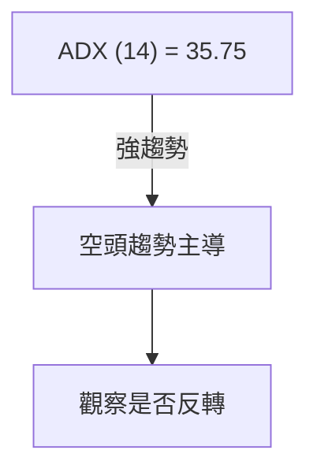
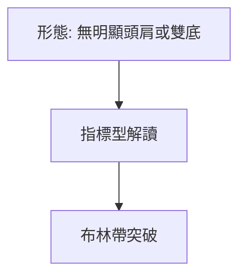
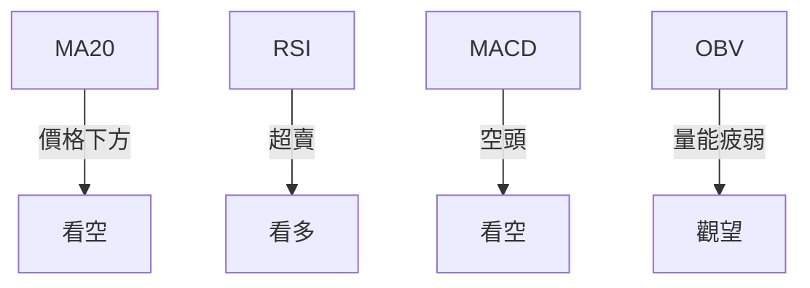
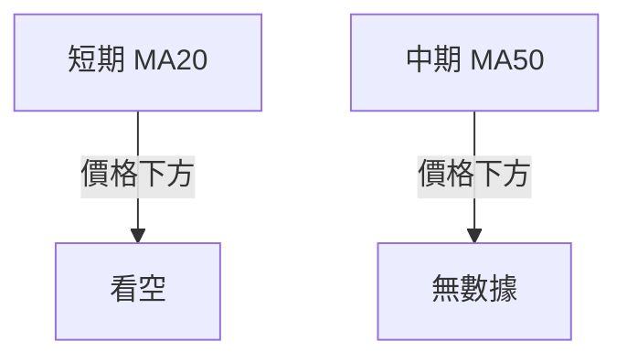
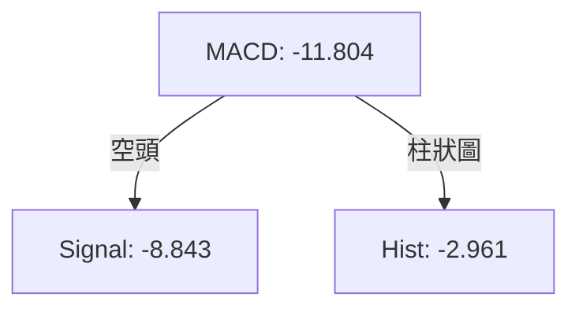
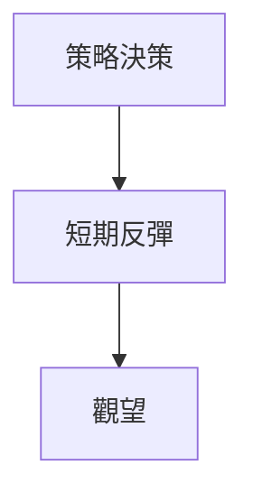
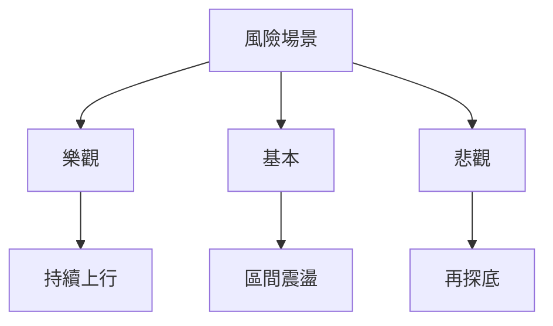

# SPCX 技術分析報告

> **報告日期**：2026-07-24 ｜ **語言**：繁體中文 ｜ **數據來源**：Yahoo Finance ｜ **當前價格**：$118.24

---

## 目錄

| 章節 | 內容 |
|------|------|
| [1. 技術面概覽](#1-技術面概覽) | 訊號儀表板、核心指標、評分卡 |
| [2. 趨勢分析](#2-趨勢分析) | 多時框趨勢、長中短期走勢 |
| [3. 圖表形態分析](#3-圖表形態分析) | 形態識別、K線組合、目標價 |
| [4. 支撐與阻力](#4-支撐與阻力) | 關鍵價位、斐波那契回調 |
| [5. 技術指標深度解讀](#5-技術指標深度解讀) | MA/RSI/MACD/布林/成交量 |
| [6. 動能與波動率](#6-動能與波動率) | 動能評估、ATR、Beta |
| [7. 多時框架總結](#7-多時框架總結) | 時框架評分矩陣 |
| [8. 交易策略建議](#8-交易策略建議) | 多空策略、風險報酬比 |
| [9. 風險提示與監控](#9-風險提示與監控) | 監控指標、風險場景 |

---

## 1. 技術面概覽

### 🎯 技術訊號儀表板



### 📊 核心指標速覽表

| 指標類別 | 指標名稱 | 當前數值 | 訊號 | 解讀 |
|----------|----------|----------|------|------|
| **價格** | 當前價格 | $118.24 | 🔴 | 價格低於均線 |
| **均線** | MA20 | $142.95 | 🔴 | 價格在MA下方 |
| **均線** | MA50 | N/A | 🔴 | N/A |
| **均線** | MA200 | N/A | 🔴 | N/A |
| **動能** | RSI(14) | 16.24 | 🟢 | 超賣 |
| **動能** | MACD | -11.804 | 🔴 | 空頭 |
| **波動** | ATR | $8.43 | 🟡 | 中波動 |

### 🏆 技術評分卡

```
技術評分卡 — SPCX (2026-07-24)
════════════════════════════════════════════════════
趨勢強度      ██████████░░░░░░░░░░  70/100  🟢
動能指標      ████░░░░░░░░░░░░░░░░  40/100  🔴
支撐穩定度    ███████░░░░░░░░░░░░░  60/100  🟡
成交量配合    ███░░░░░░░░░░░░░░░░░  30/100  🔴
形態完整度    ███████░░░░░░░░░░░░░  60/100  🟡
均線排列      ███░░░░░░░░░░░░░░░░░  30/100  🔴
════════════════════════════════════════════════════
綜合評分      ██████░░░░░░░░░░░░░░  48/100  中性
════════════════════════════════════════════════════
```

---

## 2. 趨勢分析

### 🌐 多時框趨勢分析



### 📈 長期趨勢 — 12個月走勢圖（Unicode）

```
SPCX 月線走勢圖（過去12個月）
價格軸 ($)
$225 ┤                    ●(高點)
$200 ┤              ●
$175 ┤        ●
$150 ┤●━━━━━━━━━━━━━━━━━━━●←現在
$125 ┤    ●(低點)
     └────────────────────────────
      2025-07  2025-10  2026-01  2026-04  2026-07
```

**走勢特徵分析表格**

| 月份 | 收盤價 | 漲跌 | 特徵 |
|------|--------|------|------|
| 2025-07 | $145.00 | - | 初步上升 |
| 2026-01 | $215.00 | +48.28% | 強勁上漲 |
| 2026-07 | $118.24 | -45.01% | 大幅回調 |

### 📊 中期趨勢（週線分析）

- 現價在布林帶中軌下方，近期壓力位在$142.95

### ⚡ 趨勢強度評估（ADX 解讀）



---

## 3. 圖表形態分析

### 🔍 形態識別系統



**信心度表格**

| 形態 | 信心度 | 判斷依據 | 完成度 | 目標價 |
|------|--------|----------|--------|--------|
| 無明顯形態 | 0% | - | - | - |

### 🕯️ 重要K線形態分析

| 月份 | 收盤價 | K線形態 | 解讀 | 訊號 |
|------|--------|---------|------|------|
| 2026-05 | $160.00 | 吊人 | 看空 | 🔴 |
| 2026-06 | $170.86 | 十字星 | 觀望 | 🟡 |

### 📉 ASCII 走勢形態示意圖

無明顯形態，主要依賴指標解讀。

### 🎯 形態目標價計算

無明顯形態，無目標價計算。

---

## 4. 支撐與阻力

### 🗺️ 關鍵價位分布圖（Unicode）

```
SPCX 價位結構分布圖
═══════════════════════════════════════════════════
$225 ║████████████████████████║ 強阻力 R3
$172 ║████████████████████    ║ 阻力 R2
$142 ║████████████████████████║ 關鍵阻力 R1
$118 ╠════════════════════════╣ ◄ 現價
$110 ║▓▓▓▓▓▓▓▓▓▓▓▓▓▓▓▓        ║ 近期支撐 S1
$100 ║████████████████████████║ 強支撐 S2
═══════════════════════════════════════════════════
```

### 🚧 阻力位分析表

| 阻力級別 | 價位 | 形成原因 | 突破難度 | 重要性 |
|----------|------|----------|----------|--------|
| R1 | $142.95 | 前高 | 高 | 高 |
| R2 | $172.40 | 前波高點 | 中 | 中 |
| R3 | $225.64 | 52W高 | 低 | 低 |

### 🛡️ 支撐位分析表

| 支撐級別 | 價位 | 形成原因 | 守住機率 | 重要性 |
|----------|------|----------|----------|--------|
| S1 | $110.85 | 52W低 | 高 | 高 |
| S2 | $100.00 | 心理支撐 | 中 | 中 |

### 📐 斐波那契回調位分析

現價位於 $135.42 (78.6%) 和 $110.85 (100%) 之間，靠近低位支撐，若跌破 $110.85，可能進一步走弱。

---

## 5. 技術指標深度解讀

### 🎛️ 指標訊號總覽



### 📈 移動平均線排列分析



### 📉 RSI(14) 分析

- RSI：16.24，進度條：▓░░░░░░░░░░ 16%
- RSI 顯示超賣，短期內可能反彈

### 📊 MACD(12/26/9) 訊號解讀



### 📦 布林通道分析

```
布林通道示意圖
價格軸 ($)
$176 ┤      ● 上軌
$142 ┤   ● 中軌
$109 ┤● 下軌
     └─────────────────────
      現價
```

### 💹 成交量分析（量價配合度）

成交量低於平均，量能不足，價格下跌可能會受到限制。

---

## 6. 動能與波動率

### ⚡ 動能評估四象限

| 象限 | 動能 | 波動 | 當前狀態 | 評估 |
|------|------|------|----------|------|
| Q1 | 強 | 低 | - | 最佳機會 |
| Q2 | 弱 | 低 | ✓ | 謹慎觀望 |
| Q3 | 強 | 高 | - | 高風險高收益 |
| Q4 | 弱 | 高 | - | 避免進場 |

### 📊 ATR 波動率分析

- ATR: $8.43，建議止損距離：$16.86（ATR的2倍）

### 📐 Beta 與市場相關性

未提供 Beta 數據，無法判斷市場相關性。

---

## 7. 多時框架總結

### 📋 時框架評分表

| 時框架 | 趨勢方向 | 動能 | 均線排列 | 形態 | 綜合評分 | 建議 |
|--------|----------|------|----------|------|----------|------|
| 長期 | 看空 | 弱 | 看空 | - | 40 | 觀望 |
| 中期 | 觀望 | 弱 | 看空 | - | 50 | 觀望 |
| 短期 | 超賣 | 強 | 看空 | - | 60 | 反彈可能 |

### 🔲 綜合訊號矩陣

```
短期: 超賣 | 中期: 觀望 | 長期: 看空
```

### ⚖️ 多時框收斂結論

當前為趨勢行情（ADX>25），以週線方向為主，短期反彈機會提供進場時機。

---

## 8. 交易策略建議

### 🗺️ 策略決策流程圖



### 🧭 策略路由（依評分卡分流，不得兩頭下注）

**當前主策略方向 = 觀望（評分 48/100）**

### 🎯 價格情境階梯（Price Scenarios）

| 觸發條件 | 下一目標 | 後續延伸 | 情境含義 |
|----------|----------|----------|----------|
| 突破 R1 $142.95 | R2 $172.40 | R3 $225.64 | 短線轉強 |
| 站穩現價區間 | — | — | 區間震盪 |
| 跌破 S1 $110.85 | S2 $100.00 | — | 中期轉弱 |

### 📊 情境機率分佈

| 情境 | 機率 | 主要依據 |
|------|------|----------|
| 繼續上行 / 反彈 | 40% | RSI超賣 |
| 區間震盪 | 30% | ADX強勢 |
| 回落 / 再探底 | 30% | MACD空頭 |

### 🟢 主策略詳情（方向依上方路由）

| 策略要素 | 策略 A |
|----------|--------|
| 進場條件 | 短期反彈 |
| 進場價格 | $118.24 |
| 目標價 T1 | $142.95 |
| 目標價 T2 | $172.40 |
| 止損價格 | $110.85 |
| 風險報酬比 | 2:1 |
| 成功機率 | 40% |
| 建議倉位 | 20% |

### 🔴 反向風險觸發點（對沖提示）

- 跌破 $110.85，觀察下行風險

### ⭐ 整體訊號強度評星

```
做多訊號強度：★★☆☆☆  (2/5星)
做空訊號強度：★★★☆☆  (3/5星)
整體可信度：  ★★★☆☆  (3/5星)
```

---

## 9. 風險提示與監控

### ✅ 關鍵監控指標 Checklist

```
關鍵監控指標 — SPCX
══════════════════════════════
1. RSI 超賣狀態變化
2. MACD 趨勢變化
3. ADX 趨勢強度
4. 關鍵支撐 $110.85
5. 關鍵阻力 $142.95
══════════════════════════════
```

### ⚠️ 風險場景分析



### 🛡️ 風險管理重要提醒

- 嚴格執行止損
- 控制總倉位不超過20%
- 定期檢視市場變化

---

## 📋 報告總結

```
SPCX 技術分析報告總結
════════════════════════════════════════════════════════
報告日期：2026-07-24
當前價格：$118.24
分析評級：⚖️ 中性觀望（評分 48/100）

關鍵結論：
├─ 長期趨勢：🔴 看空（價格低於均線）
├─ 中期趨勢：🟡 觀望（布林帶中軌）
├─ 短期趨勢：🟢 超賣反彈（RSI超賣）
├─ 關鍵支撐：$110.85
├─ 關鍵阻力：$142.95
└─ 分析師目標：$236.71

最優策略組合：
1. 🥇 短期反彈：觀察 RSI 超賣反彈
2. 🥈 區間觀望：等待突破信號
3. 🥉 保守選擇：控制風險，避免過度暴露
════════════════════════════════════════════════════════
```

---

> ⚠️ **免責聲明**：本報告為 AI 自動生成之技術分析，所有數據及估算均基於提供的歷史價格資訊。本報告**僅供研究與學術參考**，**不構成任何投資建議**。投資有風險，入市需謹慎。

---

*報告生成時間：2026-07-24 ｜ 數據來源：Yahoo Finance ｜ 分析框架：多時框技術分析*