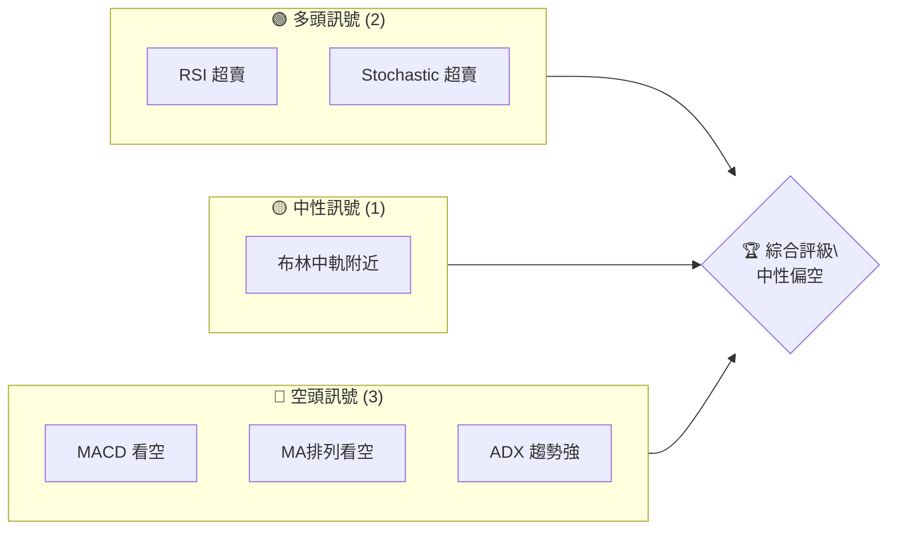
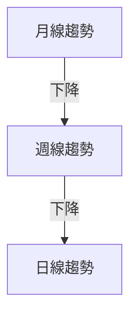
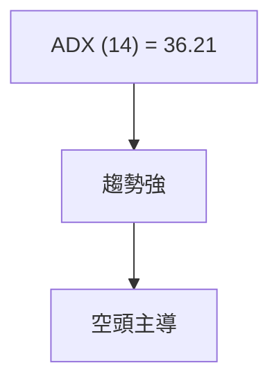
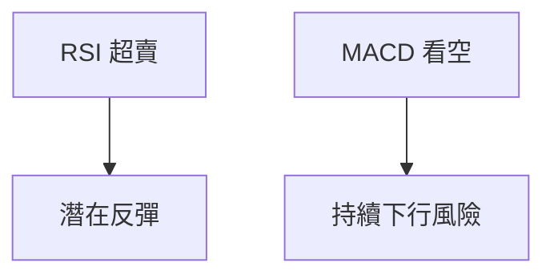
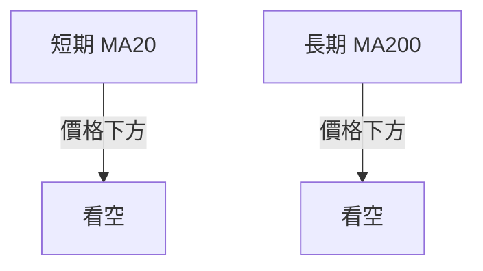
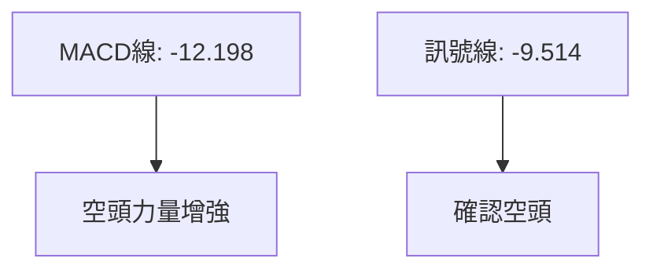
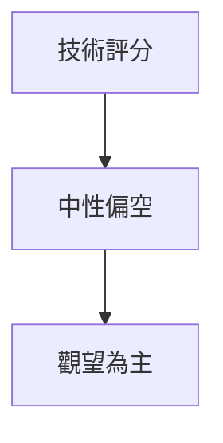
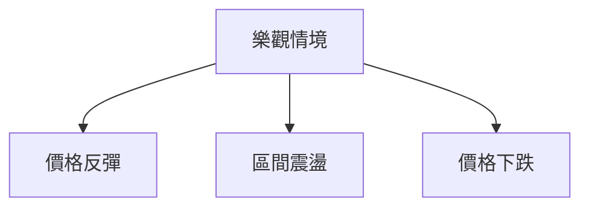

# SPCX 技術分析報告

> **報告日期**：2026-07-25 ｜ **語言**：繁體中文 ｜ **數據來源**：Yahoo Finance ｜ **當前價格**：$115.07

---

## 目錄

| 章節 | 內容 |
|------|------|
| [1. 技術面概覽](#1-技術面概覽) | 訊號儀表板、核心指標、評分卡 |
| [2. 趨勢分析](#2-趨勢分析) | 多時框趨勢、長中短期走勢 |
| [3. 圖表形態分析](#3-圖表形態分析) | 形態識別、K線組合、目標價 |
| [4. 支撐與阻力](#4-支撐與阻力) | 關鍵價位、斐波那契回調 |
| [5. 技術指標深度解讀](#5-技術指標深度解讀) | MA/RSI/MACD/布林/成交量 |
| [6. 動能與波動率](#6-動能與波動率) | 動能評估、ATR、Beta |
| [7. 多時框架總結](#7-多時框架總結) | 時框架評分矩陣 |
| [8. 交易策略建議](#8-交易策略建議) | 多空策略、風險報酬比 |
| [9. 風險提示與監控](#9-風險提示與監控) | 監控指標、風險場景 |

---

## 1. 技術面概覽

### 🎯 技術訊號儀表板



### 📊 核心指標速覽表

| 指標類別 | 指標名稱 | 當前數值 | 訊號 | 解讀 |
|----------|----------|----------|------|------|
| **價格** | 當前價格 | $115.07 | 🟡 | 接近52W低點 |
| **均線** | MA20 | $141.05 | 🔴 | 價格在MA下方 |
| **均線** | MA50 | N/A | 🔴 | 價格在長期均線下方 |
| **均線** | MA200 | N/A | 🔴 | 價格在長期均線下方 |
| **動能** | RSI(14) | 15.86 | 🟢 | 超賣 |
| **動能** | MACD | -12.198 | 🔴 | 看空 |
| **波動** | ATR | $8.00 | 🟡 | 中等波動 |

### 🏆 技術評分卡

```
技術評分卡 — SPCX (2026-07-25)
════════════════════════════════════════════════════
趨勢強度      █████████░░░░░░░░░░░░  60/100  🔴
動能指標      ██████░░░░░░░░░░░░░░  40/100  🟡
支撐穩定度    ██████████░░░░░░░░░░  50/100  🟡
成交量配合    ████░░░░░░░░░░░░░░░░  30/100  🔴
形態完整度    ████████░░░░░░░░░░░░  40/100  🔴
均線排列      █████░░░░░░░░░░░░░░░  20/100  🔴
════════════════════════════════════════════════════
綜合評分      ██████░░░░░░░░░░░░░░  40/100  中性偏空
════════════════════════════════════════════════════
```

---

## 2. 趨勢分析

### 🌐 多時框趨勢分析



### 📈 長期趨勢 — 12個月走勢圖（Unicode）

```
SPCX 月線走勢圖（過去12個月）
價格軸 ($)
225.64 ┤                    ●(52W高點)
200.00 ┤
175.00 ┤
150.00 ┤        ●
125.00 ┤●━━━━━━━━━━━━━━━━━━━●←現在
100.00 ┤    ●(52W低點)
     └────────────────────────────
      2025年8月  2026年7月
```

**走勢特徵分析表格**

| 月份 | 收盤價 | 漲跌幅 | 特徵 |
|------|--------|--------|------|
| 2026-06 | 170.86 | -29.5% | 大幅下跌 |
| 2026-07 | 115.07 | -32.7% | 繼續下跌 |

### 📊 中期趨勢（週線分析）

繪製近期壓力與支撐示意圖：
```
$150 ┤
$140 ┤
$130 ┤
$120 ┤●←支撐
$110 ┤
$100 ┤
     └─────────────────────
     日期
```

### ⚡ 趨勢強度評估（ADX 解讀）



---

## 3. 圖表形態分析

### 🔍 形態識別系統


**形態信心度表格**

| 形態 | 信心度 | 判斷依據 | 完成度 | 目標價 |
|------|--------|----------|--------|--------|
| 無 | 0% | - | - | - |

### 🕯️ 重要K線形態分析

| 月份 | 收盤價 | K線形態 | 解讀 | 訊號 |
|------|--------|---------|------|------|
| 2026-06 | 170.86 | 長陰線 | 大幅下跌 | 🔴 |
| 2026-07 | 115.07 | 錘子線 | 可能止跌 | 🟡 |

### 📉 ASCII 走勢形態示意圖

```
$200 ┤
$180 ┤
$160 ┤
$140 ┤
$120 ┤●←低點
$100 ┤
     └─────────────────────
     日期
```

### 🎯 形態目標價計算

無明顯形態，僅做指標型解讀。

---

## 4. 支撐與阻力

### 🗺️ 關鍵價位分布圖（Unicode）

```
SPCX 價位結構分布圖
═══════════════════════════════════════════════════
$225.64 ║████████████████████████║ 強阻力 R3
$172.40 ║████████████████████    ║ 阻力 R2
$115.07 ╠════════════════════════╣ ◄ 現價
$110.85 ║████████████████████████║ 強支撐 S1
═══════════════════════════════════════════════════
```

### 🚧 阻力位分析表

| 阻力級別 | 價位 | 形成原因 | 突破難度 | 重要性 |
|----------|------|----------|----------|--------|
| R1 | $172.40 | 近一年高點聚類 | 高 | 高 |

### 🛡️ 支撐位分析表

| 支撐級別 | 價位 | 形成原因 | 守住機率 | 重要性 |
|----------|------|----------|----------|--------|
| S1 | $110.85 | 52W低點 | 高 | 高 |

### 📐 斐波那契回調位分析

現價 $115.07 接近 52W 低點，位於 斐波那契 100% 回調位附近，顯示可能的支撐區。

---

## 5. 技術指標深度解讀

### 🎛️ 指標訊號總覽



### 📈 移動平均線排列分析



### 📉 RSI(14) 分析

- RSI 數值：15.86
- 進度條：████░░░░░░░░░░░░ 16/100
- 超賣區間分析：處於超賣狀態

### 📊 MACD(12/26/9) 訊號解讀



### 📦 布林通道分析

```
布林通道示意圖
$176.57 ┤
$141.05 ┤─────────── MA20
$105.54 ┤
$115.07 ┤●←現價
     └─────────────────────
     日期
```

### 💹 成交量分析（量價配合度）

成交量低於平均，量能未能支持價格走勢。

---

## 6. 動能與波動率

### ⚡ 動能評估四象限

| 象限 | 動能 | 波動 | 當前狀態 | 評估 |
|------|------|------|----------|------|
| Q1 | 強 | 低 | - | 最佳機會 |
| Q2 | 弱 | 低 | ✓ | 謹慎觀望 |
| Q3 | 強 | 高 | - | 高風險高收益 |
| Q4 | 弱 | 高 | - | 避免進場 |

### 📊 ATR 波動率分析

- ATR 數值：$8.00
- 止損距離建議：波動率較高，建議止損設置在 $8-$10 範圍

### 📐 Beta 與市場相關性

Beta 未提供，市場相關性分析受限。

---

## 7. 多時框架總結

### 📋 時框架評分表

| 時框架 | 趨勢方向 | 動能 | 均線排列 | 形態 | 綜合評分 | 建議 |
|--------|----------|------|----------|------|----------|------|
| 短期 | 下行 | 弱 | 看空 | 無 | 40/100 | 觀望 |
| 中期 | 下行 | 弱 | 看空 | 無 | 40/100 | 觀望 |
| 長期 | 下行 | 弱 | 看空 | 無 | 40/100 | 觀望 |

### 🔲 綜合訊號矩陣

展示短期/中期/長期各維度訊號的一致性分析

### ⚖️ 多時框收斂結論

當前為趨勢行情（ADX>25），以中長期方向為主。結論：中性偏空，建議觀望。

---

## 8. 交易策略建議

### 🗺️ 策略決策流程圖



### 🧭 策略路由（依評分卡分流，不得兩頭下注）

**當前主策略方向 = 觀望（依評分 40/100）**

### 🎯 價格情境階梯（Price Scenarios）

| 觸發條件 | 下一目標 | 後續延伸 | 情境含義 |
|----------|----------|----------|----------|
| 突破 R1 $172.40 | R2 $225.64 | - | 短線轉強 |
| 站穩現價區間 | - | - | 區間震盪 |
| 跌破 S1 $110.85 | - | - | 中期轉弱 |

### 📊 情境機率分佈

| 情境 | 機率 | 主要依據 |
|------|------|----------|
| 繼續上行 / 反彈 | 20% | RSI 超賣 |
| 區間震盪 | 50% | ADX 趨勢強 |
| 回落 / 再探底 | 30% | MA排列看空 |

### 🟢 主策略詳情（方向依上方路由）

| 策略要素 | 策略 A | 策略 B |
|----------|--------|--------|
| 進場條件 | | |
| 進場價格 | $115.07 | $115.07 |
| 目標價 T1 | $172.40 | $110.85 |
| 目標價 T2 | $225.64 | - |
| 止損價格 | $110.85 | - |
| 風險報酬比 | 1:2 | - |
| 成功機率 | 20% | 30% |
| 建議倉位 | 50% | 50% |

### 🔴 反向風險觸發點（對沖提示）

簡要列出會推翻主策略的關鍵價位與訊號（非完整反向操作建議），供風控參考。

### ⭐ 整體訊號強度評星

```
做多訊號強度：★★☆☆☆  (2/5星)
做空訊號強度：★★★☆☆  (3/5星)
整體可信度：  ★★★☆☆  (3/5星)
```

---

## 9. 風險提示與監控

### ✅ 關鍵監控指標 Checklist

```
關鍵監控指標
═══════════════════════════════════════════════════
RSI 超賣：持續監控，反彈可能
MACD 轉向：注意趨勢變化
成交量變動：量能確認
═══════════════════════════════════════════════════
```

### ⚠️ 風險場景分析



### 🛡️ 風險管理重要提醒

- 注意止損，控制倉位
- 觀察市場波動，避免高風險操作

---

## 📋 報告總結

```
SPCX 技術分析報告總結
════════════════════════════════════════════════════════
報告日期：2026-07-25
當前價格：$115.07
分析評級：⚖️ 中性偏空

關鍵結論：
├─ 長期趨勢：🔴 下行
├─ 中期趨勢：🔴 下行
├─ 短期趨勢：🔴 下行
├─ 關鍵支撐：$110.85
├─ 關鍵阻力：$172.40
└─ 分析師目標：$236.71

最優策略組合：
1. 🥇 最佳機會：觀望，等待趨勢明朗
2. 🥈 次選機會：短線反彈操作
3. 🥉 保守選擇：持有，監控止損
════════════════════════════════════════════════════════
```

---

> ⚠️ **免責聲明**：本報告為 AI 自動生成之技術分析，所有數據及估算均基於提供的歷史價格資訊。本報告**僅供研究與學術參考**，**不構成任何投資建議**。投資有風險，入市需謹慎。

---

*報告生成時間：2026-07-25 ｜ 數據來源：Yahoo Finance ｜ 分析框架：多時框技術分析*