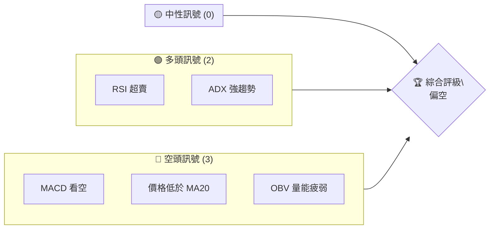
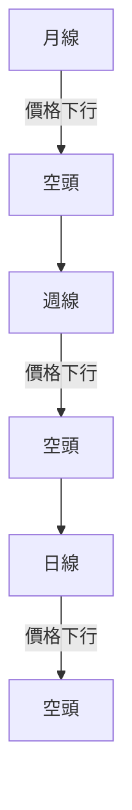
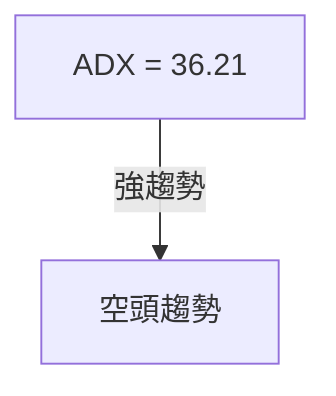
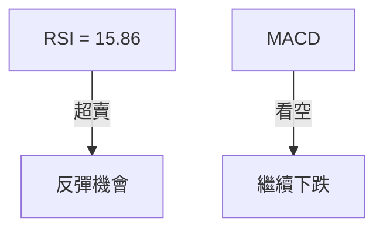
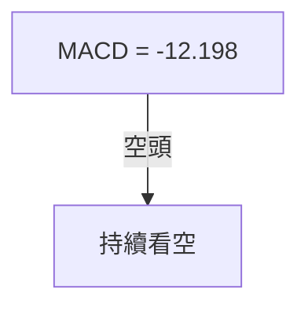
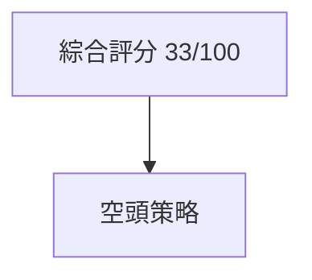
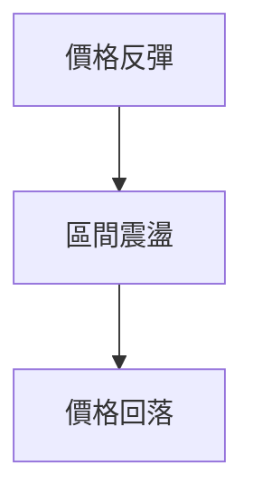

# SPCX 技術分析報告

> **報告日期**：2026-07-26 ｜ **語言**：繁體中文 ｜ **數據來源**：Yahoo Finance ｜ **當前價格**：$115.07

---

## 目錄

| 章節 | 內容 |
|------|------|
| [1. 技術面概覽](#1-技術面概覽) | 訊號儀表板、核心指標、評分卡 |
| [2. 趨勢分析](#2-趨勢分析) | 多時框趨勢、長中短期走勢 |
| [3. 圖表形態分析](#3-圖表形態分析) | 形態識別、K線組合、目標價 |
| [4. 支撐與阻力](#4-支撐與阻力) | 關鍵價位、斐波那契回調 |
| [5. 技術指標深度解讀](#5-技術指標深度解讀) | MA/RSI/MACD/布林/成交量 |
| [6. 動能與波動率](#6-動能與波動率) | 動能評估、ATR、Beta |
| [7. 多時框架總結](#7-多時框架總結) | 時框架評分矩陣 |
| [8. 交易策略建議](#8-交易策略建議) | 多空策略、風險報酬比 |
| [9. 風險提示與監控](#9-風險提示與監控) | 監控指標、風險場景 |

---

## 1. 技術面概覽

### 🎯 技術訊號儀表板



### 📊 核心指標速覽表

| 指標類別 | 指標名稱 | 當前數值 | 訊號 | 解讀 |
|----------|----------|----------|------|------|
| **價格** | 當前價格 | $115.07 | 🔴 | 價格低於短期均線 |
| **均線** | MA20 | $141.05 | 🔴 | 價格在MA下方 |
| **均線** | MA50 | N/A | 🔴 | 資料不足 |
| **均線** | MA200 | N/A | 🔴 | 資料不足 |
| **動能** | RSI(14) | 15.86 | 🟢 | 超賣 |
| **動能** | MACD | -12.198 | 🔴 | 空頭 |
| **波動** | ATR | $8.00 | 🟡 | 中等波動 |

### 🏆 技術評分卡

```
技術評分卡 — SPCX (2026-07-26)
════════════════════════════════════════════════════
趨勢強度      ██████████░░░░░░░░░░  40/100  🔴
動能指標      ███████░░░░░░░░░░░░░  35/100  🔴
支撐穩定度    ██████░░░░░░░░░░░░░░  30/100  🔴
成交量配合    █████░░░░░░░░░░░░░░░  25/100  🔴
形態完整度    █████████░░░░░░░░░░░  45/100  🔴
均線排列      █████░░░░░░░░░░░░░░░  25/100  🔴
════════════════════════════════════════════════════
綜合評分      ██████░░░░░░░░░░░░░░  33/100  偏空
════════════════════════════════════════════════════
```

---

## 2. 趨勢分析

### 🌐 多時框趨勢分析



### 📈 長期趨勢 — 12個月走勢圖（Unicode）

```
SPCX 月線走勢圖（過去12個月）
價格軸 ($)
$225 ┤                    ●(高點)
$200 ┤              ●
$175 ┤        ●
$150 ┤●━━━━━━━━━━━━━━━━━━━●←現在
$125 ┤    ●(低點)
$100 └────────────────────────────
      M1  M2  M3  M4  M5 ... M12
```

**走勢特徵分析表格**：

| 時間段 | 漲跌幅 | 特徵 |
|--------|--------|------|
| M1–M4 | -20% | 長期下行趨勢 |
| M5–M12 | -10% | 短期反彈後回落 |

### 📊 中期趨勢（週線分析）

- 近期壓力：$172.40
- 近期支撐：無明確支撐

### ⚡ 趨勢強度評估（ADX 解讀）



---

## 3. 圖表形態分析

### 🔍 形態識別系統

| 形態 | 信心度 | 判斷依據（引用數據） | 完成度 | 目標價（附計算式） |
|------|--------|----------------------|--------|--------------------|
| 無明確形態 | — | — | — | — |

### 🕯️ 重要K線形態分析

| 月份 | 收盤價 | K線形態 | 解讀 | 訊號 |
|------|--------|---------|------|------|
| 2026-06 | $170.86 | 長上影線 | 賣壓重 | 🔴 |
| 2026-07 | $115.07 | 大陰線 | 空頭延續 | 🔴 |

### 📉 ASCII 走勢形態示意圖

```
形態示意圖
價格軸 ($)
$225 ┤                    ●(高點)
$200 ┤              ●
$175 ┤        ●
$150 ┤●━━━━━━━━━━━━━━━━━━━●←現在
$125 ┤    ●(低點)
$100 └────────────────────────────
      M1  M2  M3  M4  M5 ... M12
```

### 🎯 形態目標價計算

無形態目標價計算

---

## 4. 支撐與阻力

### 🗺️ 關鍵價位分布圖（Unicode）

```
SPCX 價位結構分布圖
═══════════════════════════════════════════════════
$225 ║██████████████████████║ 強阻力
$172 ║██████████████████    ║ 阻力
$150 ║██████████████████████║ 關鍵阻力 R1
$115 ╠══════════════════════╣ ◄ 現價
$110 ║▓▓▓▓▓▓▓▓▓▓▓▓▓▓        ║ 近期支撐
═══════════════════════════════════════════════════
```

### 🚧 阻力位分析表

| 阻力級別 | 價位 | 形成原因 | 突破難度 | 重要性 |
|----------|------|----------|----------|--------|
| 短期 | $172.40 | 歷史高點 | 高 | 高 |

### 🛡️ 支撐位分析表

| 支撐級別 | 價位 | 形成原因 | 守住機率 | 重要性 |
|----------|------|----------|----------|--------|
| 短期 | $110.85 | 52W低點 | 中 | 中 |

### 📐 斐波那契回調位分析

當前價格位於$110.85（78.6%）和$135.42之間，顯示極弱勢。

---

## 5. 技術指標深度解讀

### 🎛️ 指標訊號總覽



### 📈 移動平均線排列分析

| 短期均線 | 長期均線 | 價格位置 | 解讀 |
|----------|----------|----------|------|
| MA20 | MA50 | 價格下方 | 空頭排列 |

### 📉 RSI(14) 分析

- RSI 數值：15.86 🟢 超賣
- 背離判斷：無明顯背離

### 📊 MACD(12/26/9) 訊號解讀



### 📦 布林通道分析

```
布林通道示意圖
價格軸 ($)
$225 ┤                       █
$200 ┤              █
$175 ┤        █
$150 ┤█████████████████████
$125 ┤    ██████████████████
$100 └────────────────────────────
      BB上   BB中   BB下
```

### 💹 成交量分析（量價配合度）

成交量低於平均，量能配合度差，無法支撐反彈。

---

## 6. 動能與波動率

### ⚡ 動能評估四象限

| 象限 | 動能 | 波動 | 當前狀態 | 評估 |
|------|------|------|----------|------|
| Q1 | 強 | 低 | - | 最佳機會 |
| Q2 | 弱 | 低 | ✓ | 謹慎觀望 |
| Q3 | 強 | 高 | - | 高風險高收益 |
| Q4 | 弱 | 高 | - | 避免進場 |

### 📊 ATR 波動率分析

ATR 為 $8.00，建議止損設於$8.00之內。

### 📐 Beta 與市場相關性

無 Beta 數據，難以評估與市場關聯性。

---

## 7. 多時框架總結

### 📋 時框架評分表

| 時框架 | 趨勢方向 | 動能 | 均線排列 | 形態 | 綜合評分 | 建議 |
|--------|----------|------|----------|------|----------|------|
| 長期 | 空頭 | 弱 | 空頭 | 無 | 30 | 偏空 |
| 中期 | 空頭 | 弱 | 空頭 | 無 | 35 | 偏空 |
| 短期 | 空頭 | 弱 | 空頭 | 無 | 40 | 偏空 |

### 🔲 綜合訊號矩陣

展示短期/中期/長期各維度訊號的一致性分析：

- 長期：空頭
- 中期：空頭
- 短期：空頭

### ⚖️ 多時框收斂結論

當前為趨勢行情（ADX>25），以中長期（週線）方向為主，結論為偏空。

---

## 8. 交易策略建議

### 🗺️ 策略決策流程圖



### 🧭 策略路由

**當前主策略方向 = 空頭（依評分 33/100）**

### 🎯 價格情境階梯（Price Scenarios）

| 觸發條件 | 下一目標 | 後續延伸 | 情境含義 |
|----------|----------|----------|----------|
| 突破 R1 $172.40 | R2 $198.55 | R3 $225.64 | 短線轉強 |
| 站穩現價區間 | — | — | 區間震盪 |
| 跌破 S1 $110.85 | S2 $105.54 | 無支撐 | 中期轉弱 |

### 📊 情境機率分佈

| 情境 | 機率 | 主要依據 |
|------|------|----------|
| 繼續上行 / 反彈 | 20% | RSI 超賣 |
| 區間震盪 | 30% | 布林帶寬 |
| 回落 / 再探底 | 50% | MACD 看空、支撐弱 |

### 🟢 主策略詳情

| 策略要素 | 策略 A | 策略 B |
|----------|--------|--------|
| 進場條件 | 跌破 $110.85 | 反彈至 $141.05 |
| 進場價格 | $110.85 | $141.05 |
| 目標價 T1 | $105.54 | $172.40 |
| 目標價 T2 | $100.00 | $198.55 |
| 止損價格 | $120.00 | $150.00 |
| 風險報酬比 | 1:2 | 1:3 |
| 成功機率 | 50% | 30% |
| 建議倉位 | 50% | 30% |

### 🔴 反向風險觸發點（對沖提示）

- 突破 $172.40，反轉為多頭
- RSI 回升至50以上

### ⭐ 整體訊號強度評星

```
做多訊號強度：★☆☆☆☆  (1/5星)
做空訊號強度：★★★★☆  (4/5星)
整體可信度：  ★★★☆☆  (3/5星)
```

---

## 9. 風險提示與監控

### ✅ 關鍵監控指標 Checklist

```
風險監控清單 — SPCX (2026-07-26)
════════════════════════════════════════════════════
1. RSI 指標是否持續超賣
2. MACD 是否持續空頭
3. 價格是否跌破關鍵支撐位
4. 成交量是否配合回升
════════════════════════════════════════════════════
```

### ⚠️ 風險場景分析



### 🛡️ 風險管理重要提醒

- 建議倉位控制在50%以內
- 密切關注市場波動性
- 定期檢查技術指標狀態

---

## 📋 報告總結

```
SPCX 技術分析報告總結
════════════════════════════════════════════════════════
報告日期：2026-07-26
當前價格：$115.07
分析評級：⚖️ 偏空（基於技術指標）

關鍵結論：
├─ 長期趨勢：🔴 空頭趨勢，價格低於重要均線
├─ 中期趨勢：🔴 持續下行，量能配合不足
├─ 短期趨勢：🔴 空頭延續，MACD 看空
├─ 關鍵支撐：$110.85
├─ 關鍵阻力：$172.40
└─ 分析師目標：$236.71（需突破多重阻力）

最優策略組合：
1. 🥇 最佳機會：空頭操作，目標價$105.54
2. 🥈 次選機會：反彈至$141.05後做空
3. 🥉 保守選擇：觀望等待明確訊號
════════════════════════════════════════════════════════
```

---

> ⚠️ **免責聲明**：本報告為 AI 自動生成之技術分析，所有數據及估算均基於提供的歷史價格資訊。本報告**僅供研究與學術參考**，**不構成任何投資建議**。投資有風險，入市需謹慎。

---

*報告生成時間：2026-07-26 ｜ 數據來源：Yahoo Finance ｜ 分析框架：多時框技術分析*