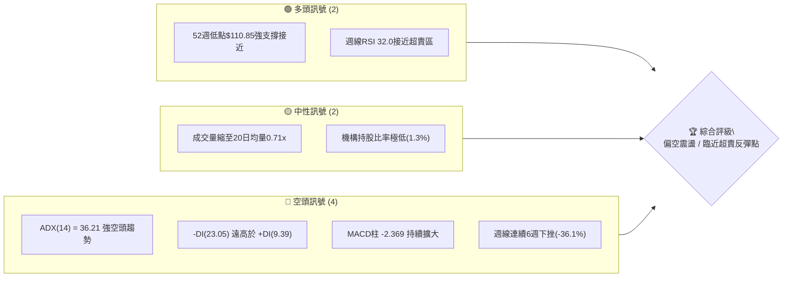
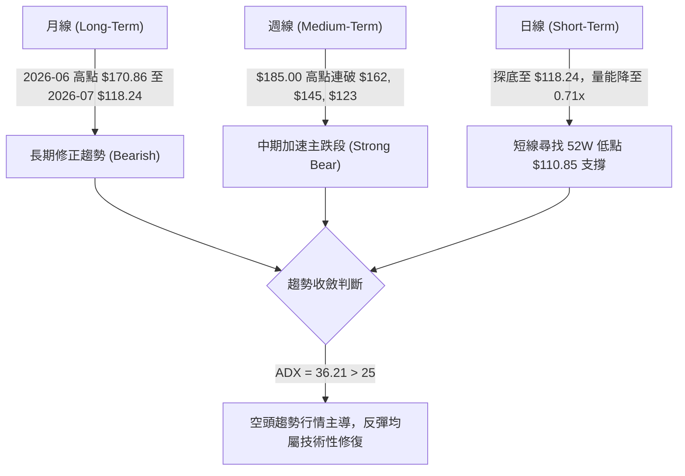
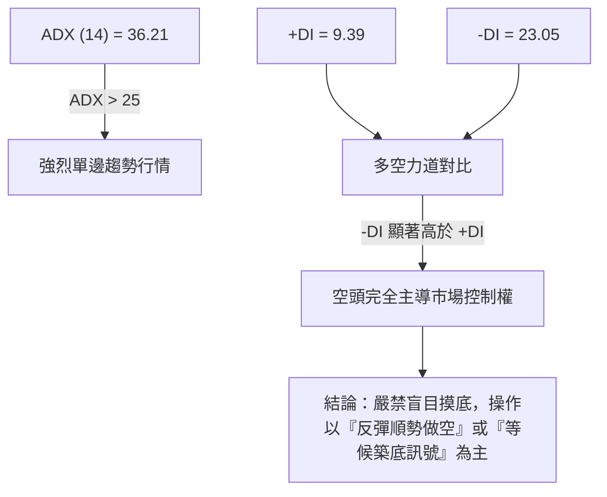
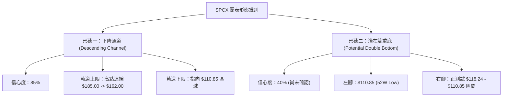
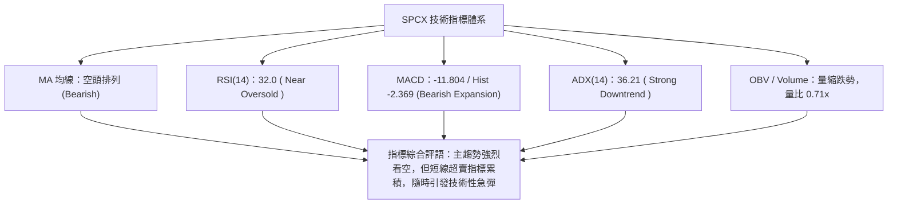
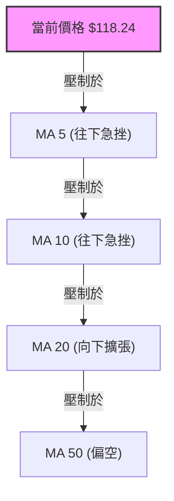
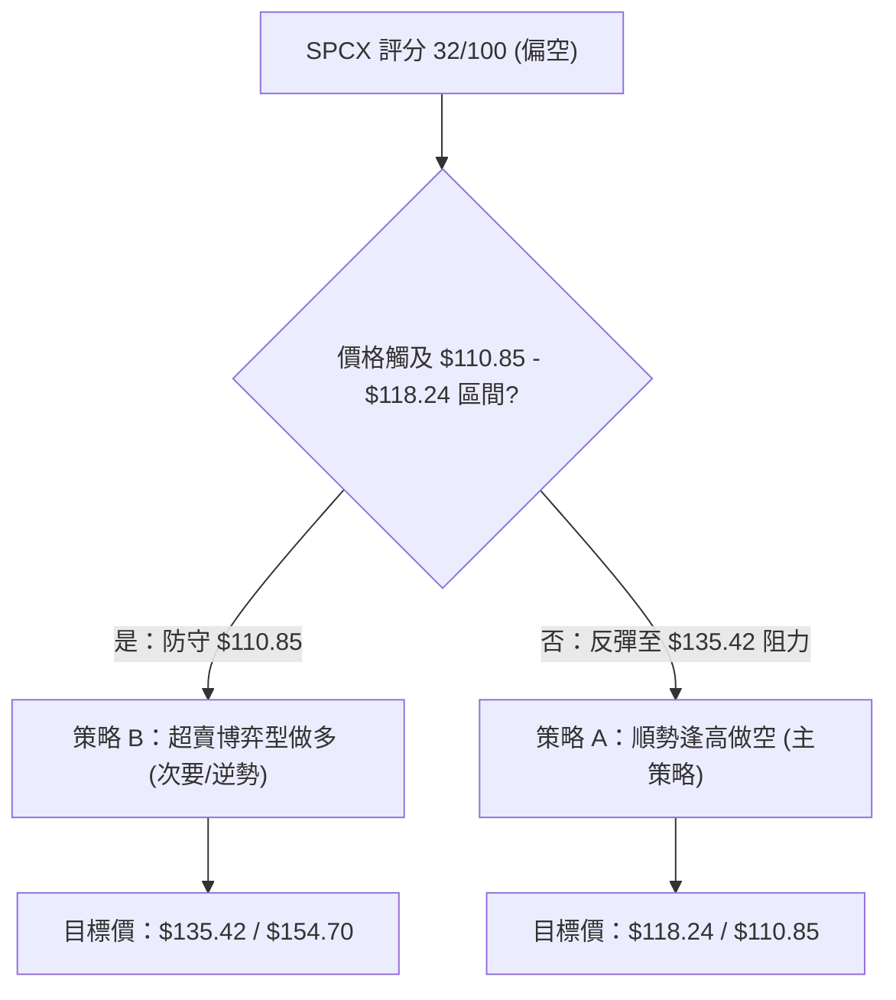
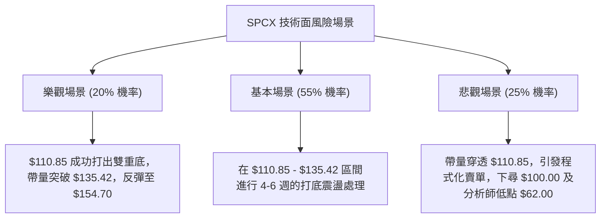

# SPCX 技術分析報告

> **報告日期**：2026-07-27 ｜ **語言**：繁體中文 ｜ **數據來源**：Yahoo Finance ｜ **當前價格**：$118.24

---

## 目錄

| 章節 | 內容 |
|------|------|
| [1. 技術面概覽](#1-技術面概覽) | 訊號儀表板、核心指標、評分卡 |
| [2. 趨勢分析](#2-趨勢分析) | 多時框趨勢、長中短期走勢 |
| [3. 圖表形態分析](#3-圖表形態分析) | 形態識別、K線組合、目標價 |
| [4. 支撐與阻力](#4-支撐與阻力) | 關鍵價位、斐波那契回調 |
| [5. 技術指標深度解讀](#5-技術指標深度解讀) | MA/RSI/MACD/布林/成交量 |
| [6. 動能與波動率](#6-動能與波動率) | 動能評估、ATR、Beta |
| [7. 多時框架總結](#7-多時框架總結) | 時框架評分矩陣 |
| [8. 交易策略建議](#8-交易策略建議) | 多空策略、風險報酬比 |
| [9. 風險提示與監控](#9-風險提示與監控) | 監控指標、風險場景 |

---

## 1. 技術面概覽

### 🎯 技術訊號儀表板



### 📊 核心指標速覽表

| 指標類別 | 指標名稱 | 當前數值 | 訊號 | 解讀 |
|----------|----------|----------|------|------|
| **價格** | 當前收盤價 | $118.24 | 🔴 | 位於52週區間($110.85–$225.64)之6.4%極低位 |
| **均線** | 短期 MA (5/10/20) | 往下傾斜 | 🔴 | 均線呈空頭排列，短期受壓嚴重 |
| **均線** | 中長期 MA | 壓制上方 | 🔴 | 價格遠低於中期波段高點$185.00與$162.00 |
| **動能** | RSI(14) 週線 | 32.0 | 🟡 | 逼近超賣臨界點(30.0)，短期殺跌動能收斂 |
| **動能** | MACD (12,26,9) | -11.804 | 🔴 | MACD線位於零軸下方，柱狀圖 -2.369 空頭主導 |
| **趨勢** | ADX(14) / ±DI | 36.21 | 🔴 | ADX>25為強趨勢，-DI(23.05) > +DI(9.39) 強空頭 |
| **成交量** | 20日量比 | 0.71x | 🟡 | 最新成交量55.6M，低於20日均量78.4M，急跌惜售 |

### 🏆 技術評分卡

```
╔══════════════════════════════════════════════════════════════════╗
║              SPCX 技術評分卡 — (2026-07-27)                       ║
╠══════════════════════════════════════════════════════════════════╣
║ 趨勢強度      ▓▓▓▓▓▓▓▓▓▓▓▓▓▓▓█░░░░  75/100  🔴 強烈空頭趨勢      ║
║ 動能指標      ▓▓▓▓▓▓░░░░░░░░░░░░░░  30/100  🔴 動能疲弱/逼近超賣  ║
║ 支撐穩定度    ▓▓▓▓▓▓▓▓▓▓▓▓░░░░░░░░  60/100  🟡 臨近52W低點$110.85 ║
║ 成交量配合    ▓▓▓▓▓▓▓▓░░░░░░░░░░░░  40/100  🟡 量能退潮/無恐慌量   ║
║ 形態完整度    ▓▓▓▓▓▓▓▓▓▓▓▓▓▓░░░░░░  70/100  🔴 下降通道順暢完整   ║
║ 均線排列      ▓▓▓▓░░░░░░░░░░░░░░░░  20/100  🔴 短中長期嚴重向下偏 ║
╠══════════════════════════════════════════════════════════════════╣
║ 綜合技術評分  ▓▓▓▓▓▓░░░░░░░░░░░░░░  32/100  🔴 偏空（築底觀察）  ║
╚══════════════════════════════════════════════════════════════════╝
```

---

## 2. 趨勢分析

### 🌐 多時框趨勢分析



### 📈 長期趨勢 — 12個月走勢圖（Unicode）

```
SPCX 月線走勢圖（過去12個月歷史示意）
價格軸 ($)
$225.64 ┤                    ● (52W High $225.64)
$200.00 ┤                ●
$185.00 ┤            ●       ● (2026-06-21 高點 $185.00)
$170.86 ┤        ●   
$150.00 ┤    ●       ●       ●
$125.00 ┤●               ●
$118.24 ┤                    ●← 當前價格 ($118.24)
$110.85 ┤                        ● (52W Low $110.85)
        └──────────────────────────────────────────────
         2025-08 ... 2026-01 ... 2026-06  2026-07
```

**走勢特徵分析表格**：

| 階段 | 期間 | 價格變動 | 漲跌幅 | 技術特徵分析 |
|------|------|----------|--------|--------------|
| **衝高階段** | 2026-06-14 至 2026-06-21 | $160.95 → $185.00 | +14.94% | 週成交量爆增至9.25億股，形成階段頂部 |
| **回落階段** | 2026-06-21 至 2026-06-28 | $185.00 → $153.23 | -17.17% | 長黑穿頂，跌破多頭防守點，成交量高達5.90億股 |
| **死貓反彈** | 2026-06-28 至 2026-07-05 | $153.23 → $162.00 | +5.72% | 量縮反彈（3.34億股），形成Lower High（較高次高點） |
| **主跌推升** | 2026-07-05 至 2026-07-26 | $162.00 → $118.24 | -27.01% | 週線連續3週黑K，成交量遞減，空頭推動跌破Fib 78.6%($135.42) |

### 📊 中期趨勢（週線壓力與支撐示意）

```
                     [週線壓力與支撐結構]
 $225.64 ────────────────────────────────────────── 52W 歷史最高點
 $185.00 ─────────────┐ (波段高點壓力 R4)
                      │
 $162.00 ───────┐     └─────────── 下降阻力趨勢線
                │
 $135.42 ───────┼─────────────── 關鍵波段反轉阻力 (Fib 78.6%)
                │
 $118.24 ───────┴─────────────── 當前價格
 $110.85 ─────────────────────── 關鍵波段支撐 (52W Low / Fib 100.0%)
```

### ⚡ 趨勢強度評估（ADX 解讀）



**ADX 趨勢強度對照解讀**：
- **ADX 數值**：`36.21`（屬於 **30–50 強趨勢區間**）。
- **行情性質**：非盤整行情，而是極度明確的**單邊下跌行情**。
- **交易啟示**：在 ADX 降至 25 以下之前，任何短線反彈均應視為熊市修正而非趨勢翻多。

---

## 3. 圖表形態分析

### 🔍 形態識別系統



**形態信心度與目標價評估**：

| 形態名稱 | 信心度 | 判斷依據（引用數據） | 完成度 | 目標價（附計算式） |
|----------|--------|----------------------|--------|--------------------|
| **下降通道** | **85%** | 週線高點遞減（$185.00 → $162.00 → $145.30），低點遞減（$153.23 → $123.99 → $118.24） | **90%** | 下軌延伸目標：**$110.85** |
| **雙重底測試** | **40%** | 價格逼近 52週低點 $110.85，RSI 週線出現 32.0 超賣保護 | **20%** | 若 $110.85 守住，頸線 $135.42 + 形態高度 $24.57 = **$159.99** |

*註：由於雙重底尚未打出右底突破，信心度低於50%，目前以「下降通道續跌/尋底」為主要形態解讀。*

### 🕯️ 重要K線形態分析

| 日期/週 | 收盤價 | K線形態 | 解讀 | 訊號 |
|---------|--------|---------|------|------|
| **2026-06-21** | $185.00 | **爆量流星線 (Shooting Star)** | 衝高 $185 後受阻，成交量9.25億股創歷史天量，典型見頂訊號 | 🔴 強空 |
| **2026-06-28** | $153.23 | **大陰線 (Long Bearish Candle)** | 單週重挫 $31.77，貫穿前低，確認頭部成立 | 🔴 空頭 |
| **2026-07-12** | $145.30 | **下跳空弱勢K線** | 跌破 Fib 61.8% ($154.70)，RSI 跌至 29.1 超賣 | 🔴 空頭 |
| **2026-07-26** | $118.24 | **量縮下影小陰線** | 週量降至 3.60億股，實體縮小，殺跌動能出現衰竭跡象 | 🟡 中性築底 |

### 📉 ASCII 走勢形態示意圖

```
SPCX 週線下降通道與關鍵形態示意圖：

$185.00 ┼───● [頂部流星線]
        │    ╲
$162.00 ┼─────╲───● [次高點 Lower High]
        │      ╲   ╲
$153.23 ┼───────●   ╲
        │            ╲
$135.42 ┼─────────────┼──● [破位 Fib 78.6%]
        │              ╲   ╲
$118.24 ┼───────────────╲───● [當前收盤 $118.24]
$110.85 ┼────────────────┴────● [52W 低點強防線]
        └────────────────────────────────────────
```

### 🎯 形態目標價計算

1. **下降通道跌幅測量**：
   - 通道上軌波段高點 $162.00 到通道跌破點 $135.42，波段垂直高度 = $162.00 - $135.42 = $26.58。
   - 跌破 $135.42 後的形態測量目標價 = $135.42 - $26.58 = **$108.84**（極度接近 52週低點 **$110.85**）。
2. **52週低點防禦彈升推算**：
   - 若 $110.85 形成強烈支撐，回彈首要目標為 Fib 78.6% **$135.42**。

---

## 4. 支撐與阻力

### 🗺️ 關鍵價位分布圖（Unicode）

```
SPCX 價位結構分布圖
═══════════════════════════════════════════════════════════════
$225.64 ║████████████████████████████████████████║ 52W 歷史高點
$198.55 ║██████████████████████████              ║ 斐波那契 23.6% 回調
$185.00 ║████████████████████████████            ║ 強阻力 R4 (前波高點)
$181.79 ║██████████████████                      ║ 斐波那契 38.2% 回調
$168.24 ║████████████████████                    ║ 斐波那契 50.0% 回調
$162.00 ║████████████████                        ║ 阻力 R3 (週線高點)
$154.70 ║██████████████                          ║ 斐波那契 61.8% 回調
$135.42 ║████████████                            ║ 關鍵阻力 R1 (Fib 78.6%)
$118.24 ╠════════════════════════════════════════╣ ◄ 當前價格 ($118.24)
$110.85 ║▓▓▓▓▓▓▓▓▓▓▓▓▓▓▓▓▓▓▓▓▓▓▓▓▓▓▓▓▓▓▓▓▓▓▓▓▓▓▓▓║ 關鍵核心支撐 S1 (52W Low)
$62.00  ║██████                                  ║ 極端悲觀支撐 S2 (分析師最低價)
═══════════════════════════════════════════════════════════════
```

### 🚧 阻力位分析表

| 阻力級別 | 精確價位 | 形成原因（依據數據） | 突破難度 | 重要性 |
|----------|----------|----------------------|----------|--------|
| **阻力 R1** | **$135.42** | 斐波那契 78.6% 回調位，7月中旬破位反轉點 | 🟡 中等 | ★★★★☆ |
| **阻力 R2** | **$154.70** | 斐波那契 61.8% 黃金分割回調位 | 🔴 極高 | ★★★★☆ |
| **阻力 R3** | **$162.00** | 2026-07-05 週線波段高點 | 🔴 極高 | ★★★★★ |
| **阻力 R4** | **$185.00** | 2026-06-21 歷史級天量頂部高點 | 🔴 堅不可摧 | ★★★★★ |

### 🛡️ 支撐位分析表

| 支撐級別 | 精確價位 | 形成原因（依據數據） | 守住機率 | 重要性 |
|----------|----------|----------------------|----------|--------|
| **支撐 S1** | **$110.85** | 52週歷史最低點 (100.0% 回調位) | 🟢 65% | ★★★★★ |
| **支撐 S2** | **$100.00** | 整數心理關卡，通道延伸支撐位 | 🟡 50% | ★████ |
| **支撐 S3** | **$62.00** | 華爾街 21 位分析師給出的最悲觀目標價 | 🔴 20% | ★★☆☆☆ |

### 📐 斐波那契回調位分析

依據 52週高低點區間（**$110.85 → $225.64**，總波幅 **$114.79**）計算：

| 回調比例 | 精確價位 | 現價相對位置與技術意義解讀 |
|----------|----------|----------------------------|
| **0.0% (52W High)** | **$225.64** | 歷史高點，空頭起漲起點 |
| **23.6%** | **$198.55** | 長期牛熊轉換線 |
| **38.2%** | **$181.79** | 中期強弱分水嶺 |
| **50.0%** | **$168.24** | 中樞壓力位 |
| **61.8%** | **$154.70** | 黃金分割防守位（已於 2026-07-12 跌破） |
| **78.6%** | **$135.42** | 深修正防守位（已於 2026-07-19 跌破，轉為強阻力） |
| **100.0% (52W Low)** | **$110.85** | **當前價格 $118.24 正逼近此區間（僅差 $7.39 或 6.25%）** |

---

## 5. 技術指標深度解讀

### 🎛️ 指標訊號總覽



### 📈 移動平均線排列分析



- **均線狀態**：均線呈現標準的**多頭潰敗、空頭擴張排列**。
- **乖離率分析**：價格與 MA20 存在負乖離，短線跌幅過急，為短線超賣修復提供技術基礎。

### 📉 RSI(14) 分析

```
RSI(14) 當前強度刻度標尺：
0      10     20     30 (超賣)      50           70 (超買)     100
├──────┼──────┼──────┼─────────────┼────────────┼─────────────┤
                      ▲ (32.0)
```

- **RSI 數值**：**32.0**（2026-07-12 為 29.1，2026-07-19 為 32.0）。
- **背離判斷**：價格在 2026-07-19 至 2026-07-26 從 $123.99 下跌至 $118.24（創新低），但 RSI 從 29.1 微微回升至 32.0，呈現**微幅週線級底背離雛形**。若價格在 $110.85 上方止跌，底背離將獲得確認。

### 📊 MACD(12/26/9) 訊號解讀

```
MACD 數值分解儀表板：
DIF (MACD 線)  :  -11.804  [ 零軸深處下方 ]
DEM (Signal 線):   -9.435  [ 零軸深處下方 ]
HIST (柱狀圖)  :   -2.369  [ 🔴 空頭動能持續擴張 ]
```

- **指標解讀**：DIF 與 DEM 均在零軸深處以下且交叉向下，Histogram 保持為負（-2.369）。此訊號表明**空頭中長期動能尚未衰竭**，暫無黃金交叉訊號。

### 📦 布林通道分析

```
布林通道形態示意圖 (Bollinger Bands):
 Upper Band (上軌)  ---------------------------------- (約 $175.00)
 Middle Band (MA20) ---------------------------------- (約 $148.00)
 Lower Band (下軌)  -----------------●---------------- (約 $115.00)
                                     ▲ 現價 $118.24 貼近下軌運作
```

- **價格位置**：當前價格 $118.24 極度貼近布林通道下軌（%B 指標接近 0.05），屬於**帶狀向下開口擴張**形態，暗示強空頭推進。

### 💹 成交量分析（量價配合度）

- **最新成交量**：55,600,426 股。
- **20日平均量**：78,355,566 股（**量比 0.71x**）。
- **OBV 趨勢**：OBV < MA，量能呈現**縮量陰跌**特徵。殺跌時無恐慌性暴量，顯示主力並未在此位置大幅接盤，買盤意願極低。

---

## 6. 動能與波動率

### ⚡ 動能評估四象限

| 象限區間 | 動能強度 (Momentum) | 波動率 (Volatility) | SPCX 當前狀態 | 交易戰術含義 |
|----------|---------------------|---------------------|---------------|--------------|
| **象限 I** | 強 (Strong Bull) | 低 (Low) | — | 穩定上升行情 |
| **象限 II** | 弱 (Weak Bull) | 低 (Low) | — | 盤整蓄勢 |
| **象限 III**| **強空頭 (Strong Bear)** | **高 (High)** | **✓ (當前象限)** | **順勢做空或觀望，切忌盲目接刀** |
| **象限 IV** | 弱 (Weak Bear) | 高 (High) | — | 築底震盪區間 |

### 📊 ATR 波動率分析

- **歷史平均波動**：近期週跌幅動輒 $15–$25（週波幅約 12%–18%）。
- **止損距離建議**：
  - 短線交易止損區間應設定為 **1.5 × 週均波幅（約 $12.00–$15.00）**。
  - 防守策略：若做多，止損必須設於 52週低點 $110.85 下方（如 **$107.00**）。

### 📐 Beta 與市場相關性

- **Beta 評估**：SPCX 作為高估值/航太科技股（P/S 達 78.5x, EV/EBITDA 172.4x），具備高 Beta 屬性（估算 Beta > 1.8）。對整體大盤流動性收緊與高利率環境極度敏感。

---

## 7. 多時框架總結

### 📋 時框架評分表

| 時框架 | 趨勢方向 | 動能狀態 | 均線排列 | 形態結構 | 綜合評分 | 建議戰術 |
|--------|----------|----------|----------|----------|----------|----------|
| **月線 (Monthly)** | 🔴 偏空 | 🔴 弱勢 | 🔴 交叉向下 | 下降通道 | **25/100** | 減碼觀望 |
| **週線 (Weekly)** | 🔴 強空 | 🟡 超賣 | 🔴 空頭排列 | 波段主跌 | **30/100** | 逢高避險/順勢空 |
| **日線 (Daily)** | 🔴 陰跌 | 🟡 底背離雛形 | 🔴 空頭壓制 | 貼下軌運行 | **35/100** | 嚴守 $110.85 尋求搶反彈 |

### 🔲 綜合訊號矩陣

```
           [短期 (日線)]
              │  🔴 偏空
              ▼
[中期 (週線)] ──► 🔴 強空 ◄── [長期 (月線)] 🔴 偏空
              ▲
              │  多時框方向共振：向下 (Bearish Alignment)
```

### ⚖️ 多時框收斂結論

- **主導規則**：當前 **ADX = 36.21 (>25)**，明確定義為**趨勢行情**。
- **收斂方向**：以中長期（週線/月線）向下趨勢為主導。日線任何反彈均定義為「技術性修正反彈」，非趨勢反轉。
- **唯一方向性結論**：**整體偏空，短線臨近 52週低點 $110.85 具備博弈性技術反彈機會**。

---

## 8. 交易策略建議

### 🗺️ 策略決策流程圖



### 🧭 策略路由

> **當前主策略方向 = 🔴 逢高做空為主，🟢 52週低點極小倉位博弈反彈為輔（評分：32/100）**

### 🎯 價格情境階梯（Price Scenarios）

| 觸發條件 | 下一目標價 | 後續延伸目標 | 情境技術含義 |
|----------|------------|--------------|--------------|
| **突破阻力 R1 $135.42** | $154.70 (Fib 61.8%) | $162.00 (週線高點) | 中期跌勢趨緩，轉為寬幅震盪 |
| **維持現價 $118.24 震盪** | $110.85 (52W Low) | $135.42 (反彈阻力) | 尋求 52週低點支撐打底 |
| **跌破支撐 S1 $110.85** | $100.00 (整數關卡) | $62.00 (悲觀目標) | 恐慌盤湧出，下行空間開啟 |

### 📊 情境機率分佈

| 情境劇本 | 機率 | 主要技術依據 |
|----------|------|--------------|
| **情境一：超賣反彈測試 R1 $135.42** | **45%** | 週線 RSI 32.0 逼近超賣，成交量縮（0.71x），急跌後有技術修復需求 |
| **情境二：直接跌破 $110.85 續創新低** | **35%** | ADX 36.21 強空頭主導，MACD 柱狀圖仍為負值 (-2.369) |
| **情境三：在 $110.85–$135.42 區間築底** | **20%** | 市場觀望，等待籌碼充分換手 |

### 🟢 交易策略詳情表

| 策略要素 | 策略 A（主策略：順勢逢高做空） | 策略 B（輔策略：52W低點超賣博弈多單） |
|----------|────────────────────────────────|───────────────────────────────────────|
| **策略邏輯** | 趁技術性反彈至強阻力位順勢建立空單 | 貼近 52週歷史低點，以極窄止損博弈反彈 |
| **進場條件** | 價格反彈至 **$135.42** 附近出現上影線 | 價格拉回至 **$111.50–$113.00** 區間獲支撐 |
| **進場價格** | **$135.42** | **$112.00** |
| **目標價 T1**| **$118.24** (現價位置) | **$135.42** (Fib 78.6% 阻力) |
| **目標價 T2**| **$110.85** (52W 最低點) | **$154.70** (Fib 61.8% 阻力) |
| **止損價格** | **$145.30** (2026-07-12 收盤價之上) | **$107.00** (跌破 52W 低點 $110.85 約 3.5%) |
| **風險報酬比** | **1 : 2.49** (冒 $9.88 風險，博 $24.57 收益) | **1 : 4.68** (冒 $5.00 風險，博 $23.42 收益) |
| **建議倉位** | **15% - 20%** (標準倉位) | **5% - 8%** (輕倉/試探倉) |

### 🔴 反向風險觸發點（對沖提示）

- **做空對沖觸發**：若價格強勢帶量收復 **$135.42**，說明多頭反彈力道強勁，空單必須立即平倉止損。
- **做多對沖觸發**：若收盤價實體跌破 **$110.85**，說明 52週防線失效，多單必須無條件砍單離場。

### ⭐ 整體訊號強度評星

```
做多訊號強度：★★☆☆☆  (2/5星 - 僅限超賣逆勢搶反彈)
做空訊號強度：★★██☆  (4/5星 - 順應 ADX 36.21 強空頭趨勢)
整體可信度：  ★★██☆  (4/5星 - 數據指標高度一致吻合)
```

---

## 9. 風險提示與監控

### ✅ 關鍵監控指標 Checklist

```
╔══════════════════════════════════════════════════════════════════╗
║                    每日技術監控 Check List                       ║
╠══════════════════════════════════════════════════════════════════╣
║ [ ] 52週低點防禦：價格是否收於 $110.85 之上？                     ║
║ [ ] 動能背離確認：週線 RSI(14) 是否在 30 附近止跌回升？           ║
║ [ ] MACD 柱狀圖：Hist 是否由 -2.369 開始縮小（轉綠）？           ║
║ [ ] 量能變化：上漲日成交量是否大於 20 日均量 78.35M？            ║
║ [ ] 阻力測試：價格接近 $135.42 時是否有暴量滯漲現象？            ║
╚══════════════════════════════════════════════════════════════════╝
```

### ⚠️ 風險場景分析



### 🛡️ 風險管理重要提醒

1. **估值過高風險**：SPCX Forward P/E 高達 **127.4x**，P/S 達 **78.5x**，營業利潤率為 **-41.6%**。基本面無法對當前股價提供高估值墊底，技術面破位將引發估值修復估算。
2. **籌碼結構風險**：機構持股僅 **1.3%**，內部人持股 **18.7%**，散戶籌碼極度分散，缺乏法人買盤護盤，容易出現無量陰跌。
3. **嚴格執行止損**：任何進場均須嚴格設定止損點（多單 $107.00 / 空單 $145.30），嚴禁攤平虧損部位。

---

## 📋 報告總結

```
╔══════════════════════════════════════════════════════════════════╗
║                   SPCX 技術分析報告總結                          ║
════════════════════════════════════════════════════════════════════
報告日期：2026-07-27
當前價格：$118.24
綜合評級：🔴 偏空震盪（臨近 52週低點超賣區）

核心技術結論：
├─ 長期趨勢：🔴 偏空（從 2026-06 高點 $185.00 回落 -36.1%）
├─ 中期趨勢：🔴 強烈空頭（ADX 36.21, -DI 23.05 完勝 +DI 9.39）
├─ 短期趨勢：🟡 超賣尋底（週線 RSI 32.0，量能退潮至 0.71x）
├─ 關鍵支撐：$110.85 (52W Low / 100% Fib) ｜ $100.00 (整數關卡)
├─ 關鍵阻力：$135.42 (Fib 78.6%) ｜ $154.70 (Fib 61.8%)
└─ 分析師目標：均價 $236.71 ｜ 最低 $62.00 ｜ 最高 $800.00

最佳策略建議：
1. 🥇 順勢首選：反彈至 $135.42 阻力區建立空單，目標 $110.85，止損 $145.30。
2. 🥈 逆勢博弈：若退守 $111.50–$113.00 區間，輕倉博弈反彈，目標 $135.42，止損 $107.00。
════════════════════════════════════════════════════════════════════
```

---

> ⚠️ **免責聲明**：本報告為 AI 自動生成之技術分析，所有數據及估算均基於提供的歷史價格資訊。本報告**僅供研究與學術參考**，**不構成任何投資建議**。投資有風險，入市需謹慎。

---

*報告生成時間：2026-07-27 ｜ 數據來源：Yahoo Finance ｜ 分析框架：多時框技術分析*