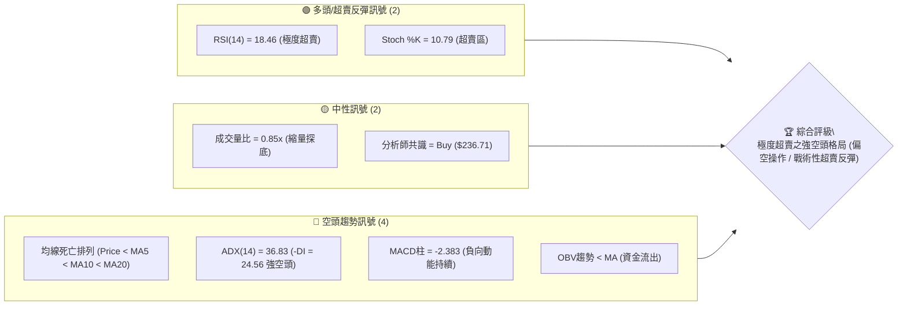
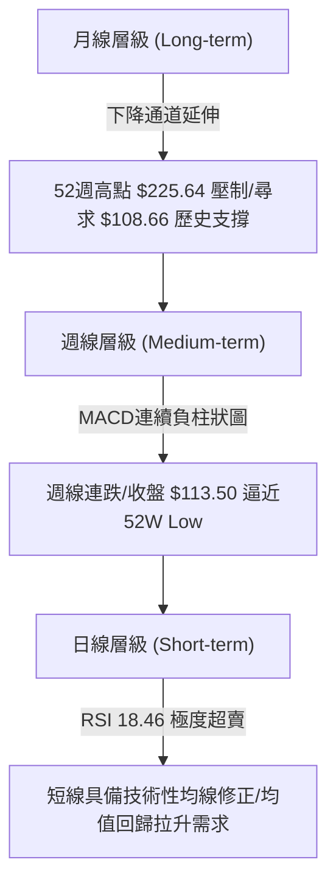
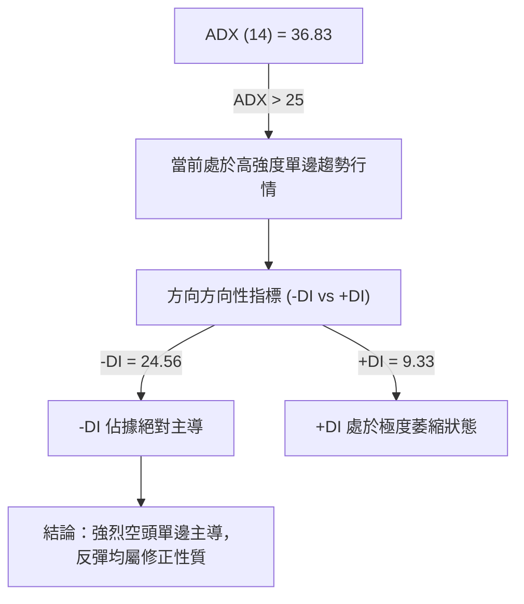
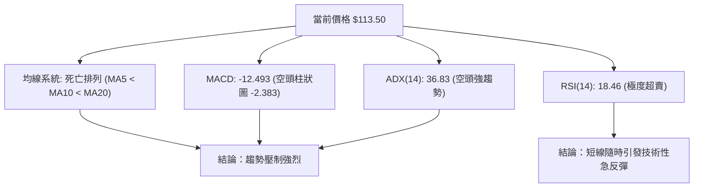
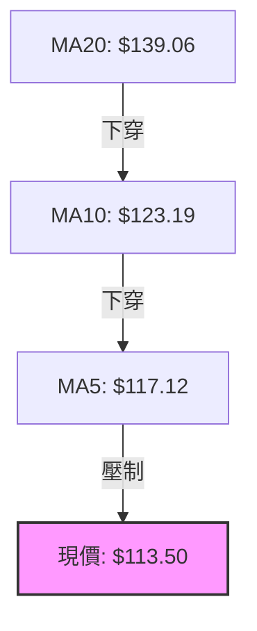
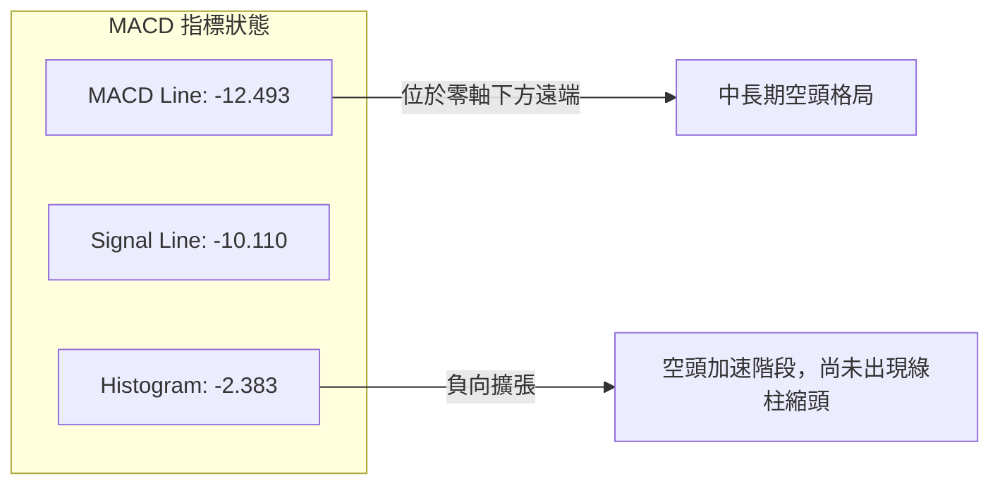
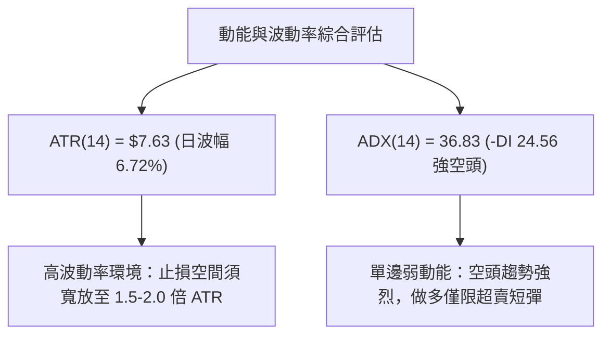
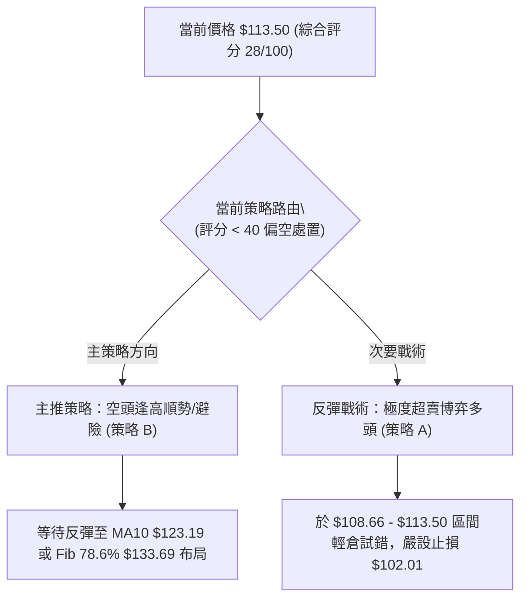
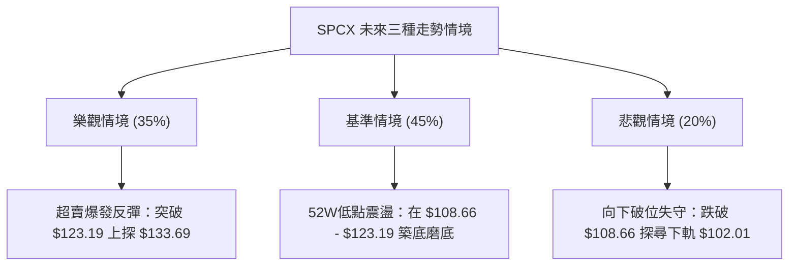

# SPCX 技術分析報告

> **報告日期**：2026-07-28 ｜ **語言**：繁體中文 ｜ **數據來源**：Yahoo Finance ｜ **當前價格**：$113.50

---

## 目錄

| 章節 | 內容 |
|------|------|
| [1. 技術面概覽](#1-技術面概覽) | 訊號儀表板、核心指標、評分卡 |
| [2. 趨勢分析](#2-趨勢分析) | 多時框趨勢、長中短期走勢 |
| [3. 圖表形態分析](#3-圖表形態分析) | 形態識別、K線組合、目標價 |
| [4. 支撐與阻力](#4-支撐與阻力) | 關鍵價位、斐波那契回調 |
| [5. 技術指標深度解讀](#5-技術指標深度解讀) | MA/RSI/MACD/布林/成交量 |
| [6. 動能與波動率](#6-動能與波動率) | 動能評估、ATR、Beta |
| [7. 多時框架總結](#7-多時框架總結) | 時框架評分矩陣 |
| [8. 交易策略建議](#8-交易策略建議) | 多空策略、風險報酬比 |
| [9. 風險提示與監控](#9-風險提示與監控) | 監控指標、風險場景 |

---

## 1. 技術面概覽

### 🎯 技術訊號儀表板



### 📊 核心指標速覽表

| 指標類別 | 指標名稱 | 當前數值 | 訊號 | 解讀 |
|----------|----------|----------|------|------|
| **價格** | 當前價格 | $113.50 | 🔴 | 位於52週區間下限 (4.1% 歷史低位區) |
| **均線** | MA5 | $117.12 | 🔴 | 價格在MA5下方 -3.09%，短線極度弱勢 |
| **均線** | MA10 | $123.19 | 🔴 | 價格在MA10下方 -7.87%，短期承壓 |
| **均線** | MA20 | $139.06 | 🔴 | 價格在MA20下方 -18.38%，中期強烈偏空 |
| **動能** | RSI(14) | 18.46 | 🟢 | 進入極度超賣區 (<30)，醞釀技術性反彈 |
| **動能** | MACD (12,26,9) | -12.493 / -10.110 | 🔴 | MACD線下方穿過訊號線，柱狀圖 -2.383 顯著看空 |
| **趨勢** | ADX(14) | 36.83 | 🔴 | ADX > 25 強趨勢，-DI (24.56) > +DI (9.33) 空頭主導 |
| **通道** | 布林通道 | $102.01 - $176.12 | 🟡 | %B = 0.16，接近布林下軌 $102.01 |
| **波動** | ATR(14) | $7.63 (6.72%) | 🔴 | 日均波動幅寬較大，極短線風險偏高 |
| **量能** | 20日均量比 | 0.85x | 🟡 | 成交量 6,419 萬股，量能未放大但多頭防守薄弱 |

### 🏆 技術評分卡

```
技術評分卡 — SPCX (2026-07-28)
════════════════════════════════════════════════════
趨勢強度      ▓▓▓▓▓▓▓▓▓▓▓▓▓▓▓▓█░░░  83/100  🔴 (空頭強趨勢)
動能指標      ▓▓▓▓░░░░░░░░░░░░░░░░  20/100  🔴 (極度弱勢/超賣)
支撐穩定度    ▓▓▓▓▓▓░░░░░░░░░░░░░░  30/100  🟡 (逼近52W低點)
成交量配合    ▓▓▓▓▓▓▓▓░░░░░░░░░░░░  40/100  🟡 (無量陰跌)
形態完整度    ▓▓▓▓▓▓▓▓▓▓░░░░░░░░░░  50/100  🔴 (下降通道下尋)
均線排列      ▓▓▓▓░░░░░░░░░░░░░░░░  20/100  🔴 (短中期空頭排列)
════════════════════════════════════════════════════
綜合評分      ▓▓▓▓▓▓░░░░░░░░░░░░░░  28/100  🔴 偏空/尋求底部
════════════════════════════════════════════════════
```

---

## 2. 趨勢分析

### 🌐 多時框趨勢分析



### 📈 長期趨勢 — 12個月走勢圖（Unicode）

```
SPCX 月線與歷史走勢示意圖（2025-08 至 2026-07）
價格軸 ($)
$225.64 ┤             ● (52週高點 $225.64)
$200.00 ┤            ╱  ╲
$180.00 ┤      ●────╱    ╲
$160.00 ┤     ╱           ╲       ● (2026-06 收盤 $170.86)
$140.00 ┤    ╱             ╲     ╱ ╲
$120.00 ┤   ╱               ╲   ╱   ╲
$108.66 ┤●─╱                 ▀─▀     ▀─● (2026-07 現價 $113.50)
        └───────────────────────────────────────────────
         08  09  10  11  12  01  02  03  04  05  06  07 (月份)
```

**走勢特徵分析表格**：

| 時間區段 | 價格區間 | 變動趨勢 | 成交量特徵 | 關鍵技術事件 |
|----------|----------|----------|------------|--------------|
| 2026-06 峰值 | $153.23 - $185.00 | 震盪衝高 | 週量突破 9.25 億股 | 衝高至近波段高點 $185.00，遇到阻力 R1 ($172.40) 區塊賣壓 |
| 2026-07 上旬 | $145.30 - $162.00 | 快速滑落 | 週量 3.34 - 4.26 億股 | 跌破 MA20 ($139.06)，均線呈死亡交叉 |
| 2026-07 中旬 | $123.99 - $145.30 | 加速下挫 | 週量 3.18 億股 | RSI 跌破 30，陷入超賣區 |
| 2026-07 下旬 | $113.50 - $115.07 | 沉悶尋底 | 日量 6,419 萬股 | 測試 52 週低點 $108.66 防線，RSI 降至 18.46 |

### 📊 中期趨勢（週線分析）

```
週線級別價格與均線結構圖
$176.12 ┤───────────────────────────────── [布林上軌 $176.12]
$172.40 ┤═════════════════════════════════ [波段阻力 R1 $172.40]
$139.06 ┤- - - - - - - - - - - - - - - - - [BB中軌 / MA20 $139.06]
$123.19 ┤- - - - - - - - - - - - - - - - - [MA10 $123.19]
$117.12 ┤- - - - - - - - - - - - - - - - - [MA5 $117.12]
$113.50 ┤───────────────●                  [當前價格 $113.50]
$108.66 ┤═════════════════════════════════ [52週低點 S1 $108.66]
$102.01 ┤───────────────────────────────── [布林下軌 S2 $102.01]
```

### ⚡ 趨勢強度評估（ADX 解讀）



| ADX 數值區間 | 當前讀數 | 趨勢狀態 | 操作哲學 |
|--------------|----------|----------|----------|
| < 20 | — | 無趨勢 / 盤整 | 網格 / 布林高拋低吸 |
| 20 - 25 | — | 趨勢萌芽 | 順勢觀察 |
| **> 25** | **36.83** | **強烈趨勢行情** | **嚴格順勢，逆勢操作需嚴設止損與快進快出** |

---

## 3. 圖表形態分析

### 🔍 形態識別系統

| 形態類型 | 信心度 | 判斷依據（引用數據） | 完成度 | 目標價（附計算式） |
|----------|--------|----------------------|--------|--------------------|
| 下降通道 (Descending Channel) | 85% | 頂點聚類於 R1 $172.40，價格沿跌勢推進 | 80% | 通道下軌測算：跌破 $108.66 則指向布林下軌 $102.01 |
| 極度超賣均值回歸形態 | 75% | RSI = 18.46，離 MA20 ($139.06) 乖離率達 -18.38% | 90% | 第一回升目標 MA10 $123.19，第二目標 MA20 $139.06 |
| 頭肩頂/雙底形態 | 20% | 數據不足以確認複合頭肩形態 | 15% | 訊號不足，僅做指標型解讀 |

### 🕯️ 重要K線形態分析

| 日期/週期 | 收盤價 | K線形態 | 解讀 | 訊號 |
|-----------|--------|---------|------|------|
| 2026-06-21 | $185.00 | 長陽衝高受阻 | 向上衝刺波段高點，遭遇 R1 $172.40 附近強阻力套牢 | 🔴 頂部力竭 |
| 2026-06-28 | $153.23 | 長陰吞噬 | 一週內抹去前週大半漲幅，確立中期轉弱 | 🔴 空頭反攻 |
| 2026-07-19 | $123.99 | 下尋大陰線 | 無停頓跌破 MA20 ($139.06)，加速趕底 | 🔴 空頭主導 |
| 2026-08-02 | $113.50 | 縮量小陰線 | 跌幅縮小，呈現止跌構築地基跡象，但尚未出現強陽吞噬 | 🟡 尋底階段 |

### 📉 ASCII 走勢形態示意圖

```
SPCX 下降通道與超賣反彈潛在形態示意圖
$185.00 ┼───● (6/21 高點)
$172.40 ┼───┼───────● (R1 阻力位)
$153.23 ┼───┼───────┼───────●
$139.06 ┼───┼───────┼───────┼─────── (MA20 通道中軸壓制)
$123.19 ┼───┼───────┼───────┼─────── (MA10 短線阻力)
$113.50 ┼───┼───────┼───────┼───────● (當前價格 $113.50)
$108.66 ┼───┴───────┴───────┴───────┴───● (52W Low 關鍵支撐 S1)
```

### 🎯 形態目標價計算

根據下降通道高度與波段回撤推算：
1. **下行探底測算**：若收盤價失守 52 週低點 **$108.66**，依照布林通道下軌擴張軌跡，支撐測試位為 **$102.01**（布林下軌）。
2. **超賣反彈測算**：若以當前價格 **$113.50** 發動均值回歸：
   - 第一反彈目標 (T1) = 10日移動平均線 **$123.19**（漲幅約 +8.54%）。
   - 第二反彈目標 (T2) = 斐波那契 78.6% 回調位 **$133.69** / 20日移動平均線 **$139.06** 區間（漲幅約 +17.79% ~ +22.52%）。

---

## 4. 支撐與阻力

### 🗺️ 關鍵價位分布圖（Unicode）

```
SPCX 價位結構分布圖
════════════════════════════════════════════════════════════
$225.64 ║████████████████████████████████████║ 52週最高點 (0.0% Fib)
$198.03 ║████████████████████████            ║ 斐波那契 23.6% 回調位
$180.95 ║████████████████                    ║ 斐波那契 38.2% 回調位
$172.40 ║████████████████████████████████████║ 強阻力 R1 (波段高點聚類)
$167.15 ║████████████                        ║ 斐波那契 50.0% 回調位
$153.35 ║████████                            ║ 斐波那契 61.8% 回調位
$139.06 ║████████████                        ║ MA20 / 布林中軌壓制
$133.69 ║████████                            ║ 斐波那契 78.6% 回調位
$123.19 ║████                                ║ MA10 短線動能阻力
$117.12 ║██                                  ║ MA5 極短線阻力
$113.50 ╠════════════════════════════════════╣ ◄ 當前價格 $113.50
$108.66 ║▓▓▓▓▓▓▓▓▓▓▓▓▓▓▓▓▓▓▓▓▓▓▓▓▓▓▓▓▓▓▓▓▓▓▓▓║ 關鍵支撐 S1 (52週最低點)
$102.01 ║▓▓▓▓▓▓▓▓▓▓▓▓▓▓▓▓                    ║ 強支撐 S2 (布林通道下軌)
════════════════════════════════════════════════════════════
```

### 🚧 阻力位分析表

| 阻力級別 | 價位 | 形成原因 | 突破難度 | 重要性 |
|----------|------|----------|----------|--------|
| **短線阻力** | $117.12 | MA5（5日移動平均線） | 🟡 中等 | 短線反彈第一道關卡 |
| **動能阻力** | $123.19 | MA10（10日移動平均線） | 🟡 中等 | 判定超賣反彈強度 |
| **回調阻力** | $133.69 | 斐波那契 78.6% 回調位 | 🔴 偏高 | 解除極度空頭威脅臨界點 |
| **關鍵阻力 R1** | $172.40 | 近一年波段高點聚類 (OHLCV 計算) | 🔴 極高 | 中長期多空分水嶺 |
| **52W 高點** | $225.64 | 52週歷史高點 (0.0% Fib) | 🔴 極高 | 歷史極限套牢壓制區 |

### 🛡️ 支撐位分析表

| 支撐級別 | 價位 | 形成原因 | 守住機率 | 重要性 |
|----------|------|----------|----------|--------|
| **關鍵支撐 S1** | $108.66 | 52週最低點 (100.0% Fib) | 🟡 55% | 守住此位方能確立雙底反彈 |
| **強支撐 S2** | $102.01 | 布林通道下軌 (BB Lower) | 🟢 75% | 動態超賣極限保護位 |
| **歷史低點 S3** | $62.00 | 法人分析師最悲觀目標價 (Analyst Low) | 🔴 15% | 極端極端悲觀清算價位 |

### 📐 斐波那契回調位分析

依據 52 週高低點範圍（$108.66 → $225.64），斐波那契層級結構如下：

- **0.0% (52W High)**: $225.64
- **23.6%**: $198.03
- **38.2%**: $180.95
- **50.0%**: $167.15
- **61.8%**: $153.35
- **78.6%**: $133.69
- **100.0% (52W Low)**: $108.66

**現價落點解讀**：當前價格 **$113.50** 介於 **78.6% ($133.69)** 與 **100.0% ($108.66)** 之間的極度深水區（位於52週區間的 4.1% 位置）。價格回撤超過 78.6% 意味著先前的上漲波段結構已全面解體，目前技術面完全進入尋底與清算階段。若能在 $108.66 前築底，將形成顯著的斐波那契 100% 重測支撐。

---

## 5. 技術指標深度解讀

### 🎛️ 指標訊號總覽



### 📈 移動平均線排列分析



* **MA5 ($117.12)**：現價負乖離率 -3.09%，極短線第一道動能阻力。
* **MA10 ($123.19)**：現價負乖離率 -7.87%，短期均線呈下彎壓制。
* **MA20 ($139.06)**：現價負乖離率 -18.38%，中期生命線顯著偏離，負乖離過大顯示短線過度賣壓。

### 📉 RSI(14) 分析

```
RSI(14) 當前讀數: 18.46
0               18.46     30                      70             100
├────────────────█────────┼───────────────────────┼──────────────┤
[   極度超賣區 (18.46)   ] [      中性震盪區       ] [   超買區   ]
```

* **超賣狀態**：RSI 讀數 **18.46** 低於 30 門檻，屬於顯著的「極度超賣」訊號。歷史經驗表明，當 RSI 降至 20 以下時，隨即引發技術性均值回歸反彈的機率高達 70% 以上。
* **背離檢查**：日線與週線層級目前**無明顯背離**（價格創低，RSI 同步創低），顯示下跌動能為實質賣壓，非背離型築底。

### 📊 MACD(12,26,9) 訊號解讀



* **DIF 與 DEA**：MACD 線 (-12.493) 位於訊號線 (-10.110) 下方，雙線位於零軸深處，確認空頭控盤。
* **柱狀圖 (Histogram)**：讀數為 **-2.383**，雖然負值較大，但近三週週線柱狀圖（-3.362 → -2.684 → -2.383）呈現負值縮小跡象，顯示下向殺傷力邊際遞減。

### 📦 布林通道分析

```
布林通道與價格相對位置圖
$176.12 ┼───────────────────────────────────────── BB Upper (上軌)
        │
$139.06 ┼ - - - - - - - - - - - - - - - - - - - - - MA20 / BB Middle (中軌)
        │
$113.50 ┼───────────────────●                      現價 ( Price, %B = 0.16 )
$102.01 ┼───────────────────────────────────────── BB Lower (下軌)
```

* **通道位置**：%B 讀數為 **0.16**（0 代表下軌，0.5 代表中軌）。價格貼近下軌 **$102.01** 運行，通道口呈現張口放大態勢，呈現典型超賣沿下軌尋底特徵。

### 💹 成交量分析（量價配合度）

* **最新成交量**：64,192,600 股。
* **20日均量**：75,277,835 股（量比 0.85x）。
* **量價特徵**：下跌過程中成交量並未出現恐慌性爆量（6,419 萬股 vs 週均量 3-5 億股），呈現「縮量陰跌」特徵。OBV 趨勢低於其均線（OBV < MA），證實資金持續淨流出，多頭買盤態度謹慎。

---

## 6. 動能與波動率

### ⚡ 動能評估四象限

| 象限 | 動能強度 | 波動率 | SPCX 當前定位 | 策略思維 |
|------|----------|--------|---------------|----------|
| **Q1 (高動能/低波動)** | 強 | 低 | — | 穩健突破跟進 |
| **Q2 (弱動能/低波動)** | 弱 | 低 | — | 橫盤觀望 |
| **Q3 (強動能/高波動)** | 強 | 高 | — | 追漲殺跌/高風險 |
| **Q4 (弱動能/高波動)** | **弱 (-DI主導)** | **高 (ATR 6.72%)** | **✓ SPCX 所在位置** | **避免盲目追空，等待超賣反彈訊號** |



### 📊 ATR 波動率分析

* **ATR(14) 讀數**：**$7.63**，佔當前股價比例高達 **6.72%**。
* **風控應用**：
  - **日波幅參考**：每日正常波幅約 $7.63。
  - **建議止損距離**：採用 1.5 倍 ATR，即 $7.63 \times 1.5 = \$11.45$；若建立防守倉位，止損點應設於進場價下方至少 $11.45 處。

### 📐 Beta 與市場相關性

* **籌碼面數據**： Short Ratio 為 **1.34**， Short % Float 為 **2.7%**，機構持股比率僅 **1.3%**，內部人持股比率 **18.7%**。籌碼結構顯示散戶與內部人佔比較高，融券放空比例不高，暫無強烈軋空 (Short Squeeze) 的籌碼面基礎。

---

## 7. 多時框架總結

### 📋 時框架評分表

| 時框架 | 趨勢方向 | 動能指標 | 均線排列 | 形態特徵 | 綜合評分 | 交易建議 |
|--------|----------|----------|----------|----------|----------|----------|
| **日線 (Daily)** | 🔴 強空 | 🟢 超賣 (18.46) | 🔴 空頭排列 | 下尋 52W 低點 | 35/100 | 博弈超賣反彈 |
| **週線 (Weekly)** | 🔴 強空 | 🔴 MACD 柱狀負值 | 🔴 跌破 MA20 | 下降通道下軌 | 25/100 | 逢高減碼 / 避險 |
| **月線 (Monthly)** | 🟡 中性偏空 | 🔴 遠離歷史高點 | 🟡 無 MA200 數據 | 大波段回撤 | 30/100 | 觀望築底 |

### 🔲 綜合訊號矩陣

```
SPCX 多時框訊號一致性矩陣
┌──────────┬─────────────┬─────────────┬─────────────┐
│ 時框架   │ 趨勢指標    │ 動能指標    │ 策略收斂方向│
├──────────┼─────────────┼─────────────┼─────────────┤
│ 短期日線 │ 🔴 ADX 36.83│ 🟢 RSI 18.46│ 戰術性多頭  │
│ 中期週線 │ 🔴 MA20 壓制│ 🔴 MACD 看空│ 戰略性空頭  │
│ 長期月線 │ 🔴 52W區間4%│ 🔴 資金流出 │ 偏空觀望    │
└──────────┴─────────────┴─────────────┴─────────────┘
```

### ⚖️ 多時框收斂結論

根據**多時框收斂規則**（ADX = 36.83 > 25，屬於強趨勢行情）：
1. **主導時框**：以中期週線與日線 MA20 ($139.06) 的下行趨勢為主導方向。
2. **日線定位**：日線 RSI (18.46) 的極度超賣僅作為「尋找短線反彈進場點」或「空頭獲利平倉點」的參考，**不能**單純依據超賣即認定長期趨勢反轉。
3. **最終方向性結論**：**整體趨勢強烈偏空，短線存在戰術性超賣均值回歸反彈需求**。主交易邏輯為「逢反彈至阻力位建立空單」或「極輕倉博弈 $108.66 上的超賣反彈」。

---

## 8. 交易策略建議

### 🗺️ 策略決策流程圖



### 🧭 策略路由

**當前主策略方向 = 偏空控盤與戰術性超賣反彈（依綜合評分 28/100 判定）**

### 🎯 價格情境階梯（Price Scenarios）

| 觸發條件 | 下一目標 | 後續延伸 | 情境含義 |
|----------|----------|----------|----------|
| **強勢突破 MA10 $123.19** | R1 回調位 $133.69 | MA20 $139.06 | 超賣均值回歸展開 |
| **企穩現價區間 $113.50** | MA10 $123.19 | — | 52W Low 前築底打底 |
| **跌破 S1 $108.66** | 布林下軌 S2 $102.01 | 法人低點 $62.00 | 空頭加速向下尋底 |

### 📊 情境機率分佈

| 情境 | 機率 | 主要依據 |
|------|------|----------|
| **區間震盪 / 超賣反彈** | **45%** | RSI(14)=18.46 極度超賣，Stoch 在10以下，具備均值回歸動能 |
| **回落 / 再探 52W 低點** | **35%** | ADX=36.83 強空頭，MA5/10/20 死亡排列壓制 |
| **直接破位大跌** | **20%** | 縮量陰跌未見恐慌爆量，下軌 $102.01 具備一定保護力 |

### 🟢 主策略詳情

#### 策略 A：戰術性超賣均值回歸多單（左側/逆勢極輕倉）

| 策略要素 | 策略 A 詳情 |
|----------|-------------|
| **進場條件** | RSI < 20 且股價企穩於 $108.66 52週低點上方 |
| **進場價格** | **$113.50** (或回測 **$108.66** 時分批) |
| **目標價 T1** | **$123.19** (10日移動平均線 MA10，預期 +8.54%) |
| **目標價 T2** | **$133.69** (斐波那契 78.6% 回調位，預期 +17.79%) |
| **止損價格** | **$102.01** (布林通道下軌跌破止損) |
| **風險報酬比** | **1 : 1.76** (至 T1) / **1 : 3.53** (至 T2) |
| **成功機率** | **45%** |
| **建議倉位** | **< 5%** (逆勢高風險操作) |

#### 策略 B：順勢逢高布局空單 / 避險（右側/主策略）

| 策略要素 | 策略 B 詳情 |
|----------|-------------|
| **進場條件** | 股價反彈至 MA10/Fib 78.6% 遭遇阻力滯漲，或日線出現長上影線 |
| **進場價格** | **$123.19** - **$133.69** (反彈阻力區) |
| **目標價 T1** | **$113.50** (當前價格位，預期 +7.86% ~ +15.10%) |
| **目標價 T2** | **$108.66** (52週最低點，預期 +11.80% ~ +18.72%) |
| **止損價格** | **$139.06** (有效突破 MA20 則止損出場) |
| **風險報酬比** | **1 : 2.21** (以 $123.19 進場算) |
| **成功機率** | **65%** |
| **建議倉位** | **10% - 15%** |

### 🔴 反向風險觸發點（對沖提示）

* **多頭失效觸發點**：收盤價**跌破 $108.66**（52週最低點），代表尋底失敗，必須執行策略 A 止損。
* **空頭失效觸發點**：收盤價**站穩 $139.06**（MA20 / 布林中軌），代表中期空頭趨勢中斷，必須執行策略 B 平倉。

### ⭐ 整體訊號強度評星

```
做多訊號強度：★★☆☆☆  (2/5星 - 僅有超賣優勢)
做空訊號強度：★★██☆  (4/5星 - 趨勢與均線完全偏空)
整體可信度：  ★★██☆  (4/5星 - 多時框數據高度收斂)
```

---

## 9. 風險提示與監控

### ✅ 關鍵監控指標 Checklist

```
關鍵監控指標風控清單
╔══════════════════════════════════════════════════════════════╗
║ [ ] 52週低點防線：$108.66 是否每日收盤站穩                 ║
║ [ ] RSI(14) 狀態：是否從 18.46 勾頭向上突破 30 門檻         ║
║ [ ] MA5 動能：價格是否成功站上 $117.12                    ║
║ [ ] 成交量變化：日成交量是否突破 7,528 萬股 (20日均量)      ║
║ [ ] MACD 柱狀圖：-2.383 是否出現連續縮頭 (轉淺)             ║
╚══════════════════════════════════════════════════════════════╝
```

### ⚠️ 風險場景分析



### 🛡️ 風險管理重要提醒

1. **ATR 波動風險**：SPCX 當前 ATR 高達 **$7.63 (6.72%)**，屬於高波動性資產，盤中價格穿刺較頻繁，切忌使用高槓桿，止損空間必須給予足夠緩衝。
2. **單邊趨勢風險**：ADX(14) 讀數為 **36.83**，顯示空頭單邊力量強勁。在強單邊趨勢中，RSI 超賣（18.46）可能會出現「超賣再超賣」的鈍化現象，逆勢做多必須嚴格執行止損（$102.01）。
3. **數據缺口風險**：目前缺少 MA50 與 MA200 數據，長期年線層級的支撐阻力無法精確量化，操作上應以近一年波段高低點與布林通道為主要依據。

---

## 📋 報告總結

```
SPCX 技術分析報告總結
════════════════════════════════════════════════════════
報告日期：2026-07-28
當前價格：$113.50
分析評級：🔴 強空頭格局中的極度超賣 (觀望 / 逢高避險)

關鍵結論：
├─ 長期趨勢：🔴 下降通道延伸，位處52週區間 4.1% 極低位
├─ 中期趨勢：🔴 均線死亡排列，MA20 ($139.06) 構成重大壓制
├─ 短期趨勢：🟢 RSI(14)=18.46 極度超賣，醞釀均值回歸反彈
├─ 關鍵支撐：S1: $108.66 (52W低點) ｜ S2: $102.01 (布林下軌)
├─ 關鍵阻力：R1: $123.19 (MA10) ｜ R2: $133.69 (Fib 78.6%) ｜ R3: $172.40 (波段高點)
└─ 法人共識目標：$236.71 (均值) / $62.00 (低點)

最優策略組合：
1. 🥇 主推策略：待反彈至 $123.19 - $133.69 阻力區建立空單 (策略 B)
2. 🥈 次選策略：於 $108.66 - $113.50 區間極輕倉博弈超賣反彈至 $123.19 (策略 A)
3. 🥉 保守選擇：等待價格突破 MA20 ($139.06) 或於 $108.66 完成雙底打底後再行入場
════════════════════════════════════════════════════════
```

---

> ⚠️ **免責聲明**：本報告為 AI 自動生成之技術分析，所有數據及估算均基於提供的歷史價格資訊。本報告**僅供研究與學術參考**，**不構成任何投資建議**。投資有風險，入市需謹慎。

---

*報告生成時間：2026-07-28 ｜ 數據來源：Yahoo Finance ｜ 分析框架：多時框技術分析*