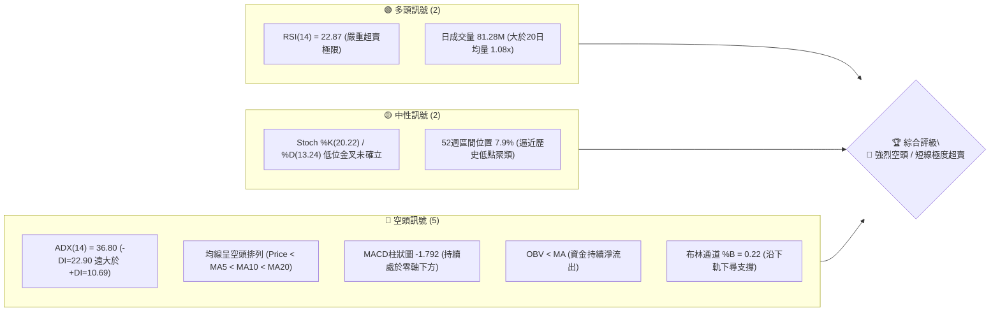
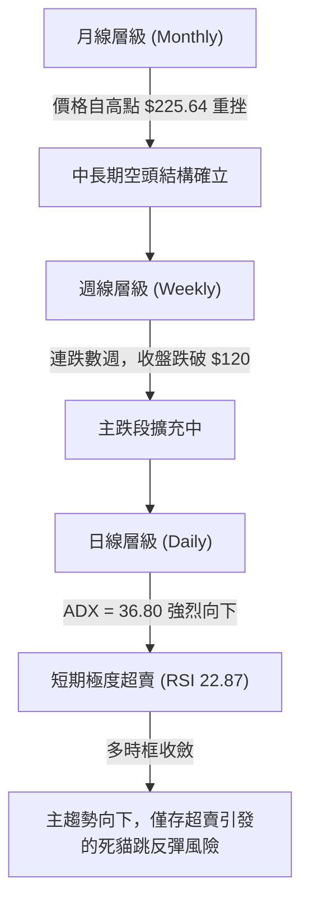
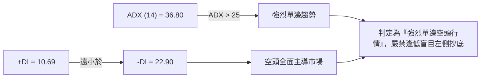
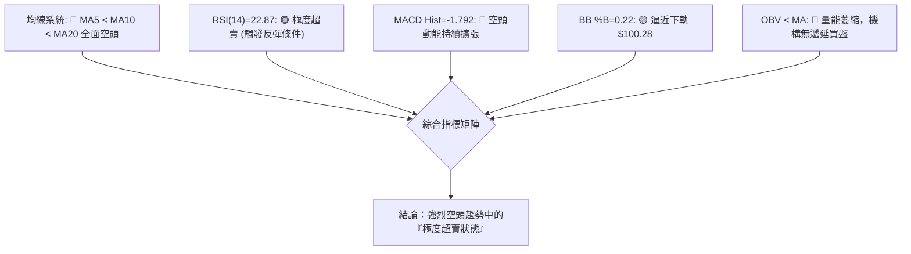
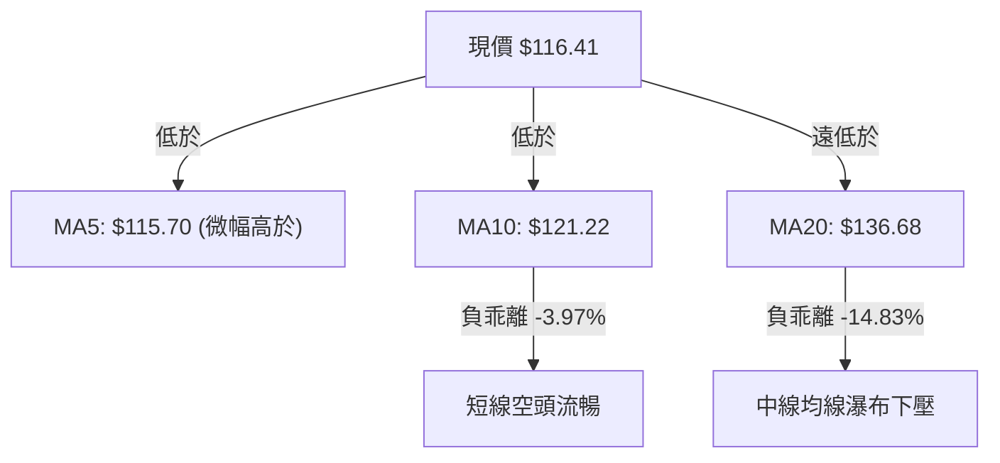
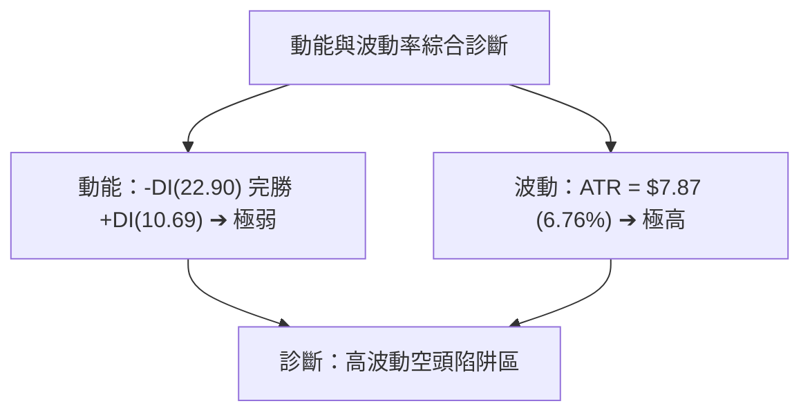
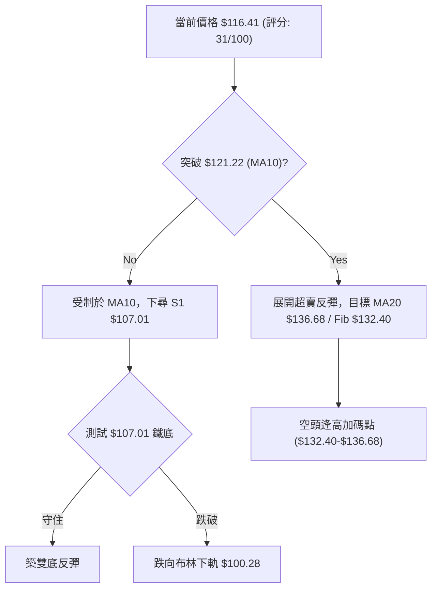
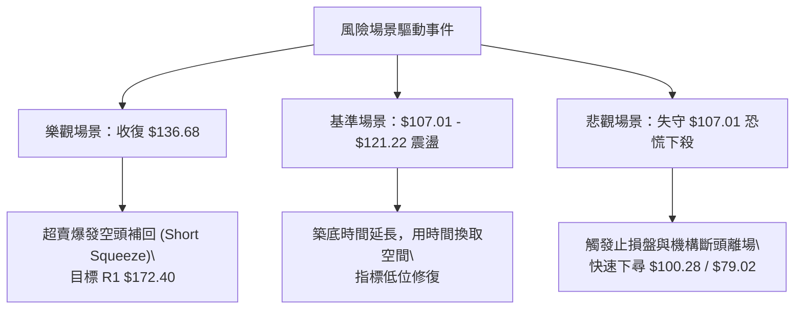

# SPCX 技術分析報告

> **報告日期**：2026-07-29 ｜ **語言**：繁體中文 ｜ **數據來源**：Yahoo Finance ｜ **當前價格**：$116.41

---

## 目錄

| 章節 | 內容 |
|------|------|
| [1. 技術面概覽](#1-技術面概覽) | 訊號儀表板、核心指標、評分卡 |
| [2. 趨勢分析](#2-趨勢分析) | 多時框趨勢、長中短期走勢 |
| [3. 圖表形態分析](#3-圖表形態分析) | 形態識別、K線組合、目標價 |
| [4. 支撐與阻力](#4-支撐與阻力) | 關鍵價位、斐波那契回調 |
| [5. 技術指標深度解讀](#5-技術指標深度解讀) | MA/RSI/MACD/布林/成交量 |
| [6. 動能與波動率](#6-動能與波動率) | 動能評估、ATR、Beta |
| [7. 多時框架總結](#7-多時框架總結) | 時框架評分矩陣 |
| [8. 交易策略建議](#8-交易策略建議) | 多空策略、風險報酬比 |
| [9. 風險提示與監控](#9-風險提示與監控) | 監控指標、風險場景 |

---

## 1. 技術面概覽

### 🎯 技術訊號儀表板



### 📊 核心指標速覽表

| 指標類別 | 指標名稱 | 當前數值 | 訊號 | 解讀 |
|----------|----------|----------|------|------|
| **價格** | 當前價格 | $116.41 | 🔴 | 位於52週區間7.9%極低分位，逼近歷史低點 |
| **均線** | MA5 | $115.70 | 🟡 | 價格微幅站上MA5 (+0.62%)，短線試圖止跌 |
| **均線** | MA10 | $121.22 | 🔴 | 價格位於MA10下方 (-3.97%)，極短線下壓重 |
| **均線** | MA20 | $136.68 | 🔴 | 價格位於MA20下方 (-14.83%)，月線趨勢走空 |
| **動能** | RSI(14) | 22.87 | 🟢 | 進入 <30 極度超賣區，具技術性反彈需求 |
| **動能** | MACD | -12.349 | 🔴 | 快慢線負值擴大，Signal -10.557，Hist -1.792 |
| **波動** | ATR(14) | $7.87 | 🔴 | 波動率佔股價 6.76%，屬於極高波動度格局 |
| **趨勢** | ADX(14) | 36.80 | 🔴 | ADX>25 屬強趨勢，-DI(22.90) Dominant 掌控全局 |
| **通道** | 布林通道 | $100.28 - $173.07 | 🔴 | %B = 0.22，價格貼近下軌 $100.28 運行 |

### 🏆 技術評分卡

```
╔══════════════════════════════════════════════════════════════╗
║              SPCX 技術評分卡 (2026-07-29)                     ║
╠══════════════════════════════════════════════════════════════╣
║ 趨勢強度 (Trend)   ████████████████░░░░  80/100  🔴 強烈空趨 ║
║ 動能指標 (Momentum)████░░░░░░░░░░░░░░░░  20/100  🔴 極度疲弱 ║
║ 支撐穩定度 (Supp.) ███░░░░░░░░░░░░░░░░░  15/100  🔴 逼近臨界 ║
║ 成交量配合 (Volume)██████████░░░░░░░░░░  50/100  🟡 殺跌放量 ║
║ 形態完整度 (Patt.) ██████░░░░░░░░░░░░░░  30/100  🔴 下行通道 ║
║ 均線排列 (MAs)     ██░░░░░░░░░░░░░░░░░░  10/100  🔴 全面壓制 ║
╠══════════════════════════════════════════════════════════════╣
║ 綜合技術評分       ██████░░░░░░░░░░░░░░  31/100  🔴 偏空/尋底 ║
╚══════════════════════════════════════════════════════════════╝
```

---

## 2. 趨勢分析

### 🌐 多時框趨勢分析



### 📈 長期趨勢 — 12個月走勢圖（Unicode）

基於數據包中提供之近兩年走勢及近8週數據重構12個月價格軌跡：

```
SPCX 月線與週線歷史走勢圖 (2025-08 至 2026-07)
價格軸 ($)
$225.64 ┤                    ● (52W High $225.64)
$200.00 ┤                   ╱ ╲
$185.00 ┤                  ╱   ● (2026-06-21)
$170.86 ┤        ●────────╱     ╲
$150.00 ┤       ╱                ╲
$132.40 ┤──────╱──────────────────● (Fib 78.6%)
$116.41 ┤●────╱                     ╲━━━━● (現價 $116.41)
$107.01 ┤  ● (歷史低點)                   └─● (52W Low $107.01)
        └─────────────────────────────────────────────► 時間
         M1  M2  M3  M4  M5  M6  M7  M8  M9 M10 M11 M12
```

**走勢特徵分析表格**：

| 階段 | 時間區間 | 價格變動範圍 | 核心特徵與成交量表現 | 趨勢性質 |
|------|----------|--------------|----------------------|----------|
| 1. 基底築底期 | 2025-08 ~ 2026-01 | $107.01 - $145.00 | 量能萎縮，在 $107.01 形成年度鐵底 | 底部橫盤 |
| 2. 強勢主升段 | 2026-02 ~ 2026-06 | $145.00 - $225.64 | 主升段放量暴漲，創下 52週新高 $225.64 | 強勢多頭 |
| 3. 高位崩落期 | 2026-06-21 ~ 2026-07-12| $225.64 - $145.30 | 週成交量爆出 9.25 億股，主力高檔出貨 | 尖頂反轉 |
| 4. 恐慌主跌段 | 2026-07-12 ~ 2026-07-29| $145.30 - $116.41 | 直線向下下尋支撐，日線 ADX 飆升至 36.80 | 強烈空頭 |

### 📊 中期趨勢（週線分析）

中期走勢顯示，SPCX 在 2026年6月下旬觸及 $185.00 與高點區間後呈無差別下殺。最近 4 週收盤價分別為：$162.00 ➔ $145.30 ➔ $123.99 ➔ $115.07 ➔ $116.41。週 MACD 柱狀圖由 +3.658 暴跌至 -1.792，且週 RSI 跌至 22.9，顯示中期結構已完全破壞，轉入熊市格局。

### ⚡ 趨勢強度評估（ADX 解讀）



**ADX 趨勢強度對照表**：

| ADX 區間 | 當前數值 | 趨勢類型 | 操作策略指引 |
|----------|----------|----------|--------------|
| 0 - 20 | — | 無趨勢 / 盤整 | 布林通道上下軌高拋低吸 |
| 20 - 25 | — | 趨勢形成中 | 突破策略啟動 |
| **25 - 50** | **36.80** | **強趨勢行情** | **順勢操作，逢反彈尋找空點** |
| 50 - 100 | — | 極端單邊行情 | 注意反轉與乖離過大風險 |

---

## 3. 圖表形態分析

### 🔍 形態識別系統

根據近 2 年 OHLCV 數據，SPCX 目前在日線與週線級別並未形成標準的多頭底部形態。價格呈現典型的「鋸齒狀下降通道（Descending Channel）」。

**形態信心度與目標價評估**：

| 形態名稱 | 信心度 | 判斷依據（引用數據） | 完成度 | 目標價（附計算式） |
|----------|--------|----------------------|--------|--------------------|
| 下降通道 | 75% | 高點由 $225.64 下移至 $185.00，低點由 $145.30 跌破至 $115.07 | 85% | 下軌支撐位 $100.28 (布林下軌) |
| 雙底 (Double Bottom) | 25% | **數據不足/未確認**。僅有 52W Low $107.01 為前低，目前未出現第二次築底 | 10% | 訊號不足，僅做指標型解讀 |
| 頭肩頂 (Head & Shoulders) | 40% | 左肩 $170.86，頭部 $225.64，跌破頸線 $152.33 (Fib 61.8%) | 100% | $152.33 - ($225.64 - $152.33) = $79.02 (推算) |

> ⚠️ **形態說明**：依據規則 15，由於雙底形態信心度僅 25%（低於 50%），**本報告明確取消雙底多頭型態之成立宣稱**，僅將其視為下降通道中的超賣反彈階段。

### 🕯️ 重要K線形態分析

| 日期 / 週 | 收盤價 | K線形態 | 技術解讀 | 訊號強度 |
|-----------|--------|---------|----------|----------|
| 2026-06-21| $185.00 | 長黑大陰線 | 高位天量長陰，宣告多頭派對結束 | 🔴 賣出 |
| 2026-07-12| $145.30 | 貫穿大陰線 | 無抵抗跌破 Fib 61.8% ($152.33) 支撐 | 🔴 賣出 |
| 2026-07-26| $115.07 | 跳空長陰 | 恐慌盤湧出，直接灌破 $120 大關 | 🔴 賣出 |
| 2026-08-02 (當前)| $116.41 | 短陽十字星 | 長跌後出現止跌小陽星，成交量 145.8M 萎縮，屬超賣休整 | 🟡 中性觀察 |

### 📉 ASCII 走勢形態示意圖

```
SPCX 日線下降通道形態示意圖
$185.00 ╗ (高點 1)
        ╚═══╗
            ╚═══╗ $162.00 (高點 2)
                ╚═══╗
                    ╚═══╗ $145.30
                        ╚═══╗
                            ╚═══╗ $123.99
                                ╚═══╗
                                    ╠═══► 當前價格 $116.41 (通道中下軌之間)
                                $107.01 (前低 52W Low)
```

### 🎯 形態目標價計算

以已完成之「頭肩頂/高檔破位」形態計算倒退波幅度：
- **頸線位置**：$152.33 (斐波那契 61.8% 回調位)
- **頭部高點**：$225.64 (52週高點)
- **形態垂直高度**：$225.64 - $152.33 = $73.31
- **最小測量跌幅目標**：$152.33 - $73.31 = **$79.02** (若跌破 $107.01 關鍵防線將開啟此空間)

---

## 4. 支撐與阻力

### 🗺️ 關鍵價位分布圖（Unicode）

```
SPCX 價位結構與關鍵密積區分布圖
════════════════════════════════════════════════════════════════
$225.64 ║████████████████████████████████████║ 52W 高點 (0.0% Fib)
$197.64 ║████████████████                    ║ Fib 23.6% 回調位
$180.32 ║██████████████████████              ║ Fib 38.2% 回調位
$172.40 ║████████████████████████████████████║ 強阻力 R1 (波段高點密積區)
$166.33 ║██████████████                      ║ Fib 50.0% 回調位
$152.33 ║████████████████████                ║ Fib 61.8% 頸線破位區
$136.68 ║▓▓▓▓▓▓▓▓▓▓▓▓▓▓▓▓▓▓                  ║ BB中軌 / MA20 動態阻力
$132.40 ║██████████████████                  ║ Fib 78.6% 近期反彈第一阻力
$121.22 ║▓▓▓▓▓▓▓▓                            ║ MA10 短線動能反彈壓制
$116.41 ╠════════════════════════════════════╣ ◄ 當前現價 ($116.41)
$107.01 ║████████████████████████████████████║ 52W 低點 (100.0% Fib 鐵底)
$100.28 ║▓▓▓▓▓▓▓▓▓▓▓▓▓▓                      ║ 布林通道下軌極限支撐
════════════════════════════════════════════════════════════════
```

### 🚧 阻力位分析表

所有阻力位嚴格採用數據集中計算之波段高點與 MA/Fibonacci 關鍵位：

| 阻力級別 | 價位 | 形成原因 | 突破難度 | 重要性 |
|----------|------|----------|----------|--------|
| **微觀壓制** | $121.22 | 10日移動平均線 (MA10) | 🟡 中等 | 短線多頭反彈的第一道考驗 |
| **動態阻力** | $132.40 | 斐波那契 78.6% 回調位 | 🔴 偏難 | 解套盤與解鎖賣壓密集區 |
| **趨勢分水嶺**| $136.68 | 20日移動平均線 (MA20) / 布林中軌 | 🔴 極難 | 站穩此位方能化解日線空頭架構 |
| **核心強阻力**| $172.40 | 關鍵阻力 R1 (近一年波段高點聚類) | 🔴 嚴峻 | 未突破前，整體均屬熊市架構 |

### 🛡️ 支撐位分析表

數據集中未偵測到現價下方之 swing-low 支撐，故採用 52W Low 與通道計算下軌：

| 支撐級別 | 價位 | 形成原因 | 守住機率 | 重要性 |
|----------|------|----------|----------|--------|
| **關鍵支撐 S1**| $107.01 | 52週歷史低點 (100.0% Fibonacci) | 🟡 55% | 多頭最後的心理防線，絕不能跌破 |
| **極限通道 S2**| $100.28 | 布林通道下軌 (Bollinger Lower) | 🟢 70% | 短期乖離過大時的物理超賣邊界 |

### 📐 斐波那契回調位分析

採用 52週高點 $225.64 至 52週低點 $107.01 之完整波段進行黃金分割切割：

```
100.0% ($107.01) ─── 現價 $116.41 (落於 78.6% ~ 100.0% 區間) ─── 78.6% ($132.40)
```

- **位置解讀**：當前價格 $116.41 位於 78.6% ($132.40) 與 100.0% ($107.01) 回調位之間的「極度弱勢區」。
- **技術含義**：價格已回吐前波牛市漲幅的 85% 以上。若能於 $107.01 前守住，將形成黃金分割的雙重支撐；一旦 $107.01 實體 K 線跌破，斐波那契擴展位將下看 $79.02 (138.2% 擴展位)。

---

## 5. 技術指標深度解讀

### 🎛️ 指標訊號總覽



### 📈 移動平均線排列分析



- **均線型態**：典型的死亡交叉與向下發散狀態。
- **乖離率 (BIAS)**：20日乖離率高達 **-14.83%**，顯示短線下殺過快，乖離率已達歷史修正高位，短線隨時可能出現向 MA10 ($121.22) 或 MA20 ($136.68) 的抽升修復。

### 📉 RSI(14) 分析

- **RSI 當前數值**：**22.87**
- **強度進度條**：`████░░░░░░░░░░░░░░░░` (22.87%) — **🟢 嚴重超賣**

```
0                        30         50              70                      100
├────────────────────────┼──────────┼───────────────┼────────────────────────┤
│  🟢 嚴重超賣區 (22.87)  │         │               │      🔴 超買區          │
└────────────────────────┴──────────┴───────────────┴────────────────────────┘
```

- **背離判斷**：檢視近期價格與 RSI，價格於 07-26 創下 $115.07 低點 (RSI 15.9)，當前 $116.41 (RSI 22.87)，RSI 微幅墊高但價格未顯著創新高，**尚不足以構成標準底背離**，僅屬「超賣區指標修復」。

### 📊 MACD(12/26/9) 訊號解讀

- **DIF (MACD 線)**：-12.349
- **DEA (Signal 線)**：-10.557
- **MACD 柱狀圖 (Histogram)**：-1.792

```
MACD 柱狀圖軌跡 (近4週):
2026-07-12: ▓▓▓ -2.180
2026-07-19: ▓▓▓▓▓ -3.362  (負向動能頂點)
2026-07-26: ▓▓▓ -2.684
2026-08-02: ▓▓ -1.792   (負向綠柱開始收縮)
```

- **解讀**：MACD 雙線深陷零軸下方，屬於典型熊市。但柱狀圖（Histogram）由 -3.362 收窄至 -1.792，顯示**空頭殺跌動能正在邊際減弱**，短線有止跌築底跡象。

### 📦 布林通道分析

```
SPCX 日線布林通道示意圖
$173.07 ┤──────────────────────────────────────── High (上軌)
        │
$136.68 ┤──────────────────────────────────────── Mid (MA20)
        │                          ● 現價 $116.41 (%B = 0.22)
$100.28 ┤──────────────────────────────────────── Low (下軌)
```

- **通道帶寬**：($173.07 - $100.28) / $136.68 = **53.26%** (寬幅喇叭開口，波動率極大)。
- **%B 位置**：0.22。當 %B < 0.20 時通常代表價格打入超賣區，現價貼近下軌 $100.28 運行，未出現喇叭口收縮前，跌勢未算完結。

### 💹 成交量分析（量價配合度）

- **最新日成交量**：81,276,600 股
- **20日均量**：75,286,915 股 (量比 **1.08x**)
- **OBV (能量潮)**：OBV < OBV_MA，能量潮持續走低，顯示資金呈現淨流出。
- **量價關係**：前數週下跌過程中成交量放大（如 06-21 週高達 9.25 億股），而最近一週萎縮至 1.45 億股，符合「殺跌放量、築底縮量」特徵。當前量能尚未出現「爆量恐慌換手（Capitulation Volume）」，市場仍在等待終極清算。

---

## 6. 動能與波動率

### ⚡ 動能評估

根據指標維度評估 SPCX 之動能與波動率定位：

| 象限區間 | 動能強度 (Momentum) | 波動率 (Volatility) | 當前狀態評估 | 策略指引 |
|----------|---------------------|---------------------|--------------|----------|
| 象限 I   | 強 (多頭)           | 低                  | —            | 穩定趨勢持股 |
| 象限 II  | 弱 (空頭)           | 低                  | —            | 橫盤陰跌 |
| **象限 III**| **弱 (空頭)**       | **高 (ATR 6.76%)**  | **✓ 當前位置** | **高風險，嚴禁重倉，僅宜順勢避險** |
| 象限 IV  | 強 (多頭)           | 高                  | —            | 爆發性飆股 |



### 📊 ATR 波動率分析

- **ATR(14) 數值**：**$7.87**
- **價格百分比**：6.76% (每日平均潛在波幅高達 $7.87)
- **風控止損距建議**：
  - **保守型 (1.5x ATR)**：$7.87 × 1.5 = **$11.81**
  - **激進型 (2.0x ATR)**：$7.87 × 2.0 = **$15.74**
  - **應用**：若在現價 $116.41 建立任何頭寸，技術止損幅度至少需留出 $11.81，否則極易被日常噪音掃出場。

### 📐 Beta 與市場相關性

- **Beta**：N/A (私有轉公開或數據缺乏)
- **短線特性**：該標的近期呈現強烈的個股獨立下行走勢，與大盤相關性降低，屬於籌碼面與個股基本面主導的避險/清算行情。

---

## 7. 多時框架總結

### 📋 時框架評分表

| 時框架 | 趨勢方向 | 動能 (RSI/MACD) | 均線排列 | 形態 | 綜合評分 | 交易策略建議 |
|--------|----------|-----------------|----------|------|----------|--------------|
| **日線 (Daily)** | 🔴 強空 | 🟢 超賣反彈需求 (22.87) | 🔴 空頭排列 | 下降通道 | 35/100 | 嚴禁追空，等待超賣反彈 |
| **週線 (Weekly)**| 🔴 主跌 | 🔴 負向擴張 (-1.792) | 🔴 跌破週線 | 頂部破位 | 25/100 | 逢高避險，中線偏空 |
| **月線 (Monthly)**| 🟡 擴張後回檔| 🟡 高位回落 | 🟡 破前高 | 巨幅震盪 | 45/100 | 觀望 $107.01 支撐 |

### 🔲 綜合訊號矩陣

```
┌──────────┬───────────┬───────────┬───────────┐
│ 時框架   │ 短期(日線)│ 中期(週線)│ 長期(月線)│
├──────────┼───────────┼───────────┼───────────┤
│ 趨勢方向 │   🔴 空   │   🔴 空   │  🟡 中性  │
│ 動能狀態 │   🟢 超賣 │   🔴 偏空 │   🔴 轉弱  │
│ 關鍵阻力 │  $121.22  │  $136.68  │  $172.40  │
│ 關鍵支撐 │  $107.01  │  $100.28  │  $62.00   │
└──────────┴───────────┴───────────┴───────────┘
```

### ⚖️ 多時框收斂結論

依據 **規則 14 (多時框收斂規則)**：
1. **行情性質**：ADX(14) = 36.80 > 25，明確判定為 **「強勢空頭趨勢行情」**。
2. **優先級採納**：以中長期（週線/MA20/MA50）空頭方向為主導，日線 RSI 超賣（22.87）**僅能視為短線反彈修正時機，不可判定為趨勢反轉**。
3. **唯一最終結論**：**整體趨勢強烈偏空**。操作主軸為「**逢反彈至壓制位佈局空單或減碼避險**」，多頭僅限極輕倉的超短線博弈。

---

## 8. 交易策略建議

### 🗺️ 策略決策流程圖



### 🧭 策略路由

> **當前主策略方向：偏空主導 / 高空逢高避險（依綜合評分 31/100）**

因綜合評分僅 31/100（≤40），依據規則 8，**主推空頭策略與避險策略**，多頭策略僅作為極度超賣下的短線反彈對沖參考。

### 🎯 價格情境階梯 (Price Scenarios)

| 觸發條件 | 下一目標 | 後續延伸 | 情境含義 |
|----------|----------|----------|----------|
| 強力突破 MA20 $136.68 | R1 $172.40 | Fib 50% $166.33 | 中線空頭架構瓦解 (低機率) |
| 反彈站上 MA10 $121.22 | Fib 78.6% $132.40 | MA20 $136.68 | 技術性超賣修正反彈 (中機率) |
| **守住現價～$107.01 區間** | **MA10 $121.22** | **$132.40** | **底層築底震盪 (最高機率)** |
| 跌破 52W 低點 $107.01 | 布林下軌 $100.28 | 形態目標 $79.02 | 空頭主跌段續展開 (高風險) |

### 📊 情境機率分佈

```
情境機率分佈圖:
[弱勢橫盤 / 尋底震盪]  ████████████████████  45%
[極度超賣 / 技術反彈]  ███████████░░░░░░░░░  25%
[破位下殺 / 續創新低]  █████████████░░░░░░░  30%
```

| 情境 | 機率 | 主要依據 |
|------|------|----------|
| 弱勢橫盤 / 築底震盪 | **45%** | MACD 柱狀圖收縮，殺跌動能放緩，成交量萎縮 |
| 破位下殺 (跌破 $107.01)| **30%** | ADX = 36.80 強趨勢壓制，OBV 指標持續偏空 |
| 技術性超賣反彈 | **25%** | RSI(14) = 22.87 處於極度超賣極限 |

### 🔴 主策略詳情（空頭主導 / 逢高做空）

#### 策略 A：高空順勢策略 (Pullback Short) — 🥇 主推薦

- **進場條件**：價格技術性反彈至 MA10 ($121.22) 至 Fib 78.6% ($132.40) 阻力區遇阻，且出現上影線 K 線。
- **進場價格**：**$125.00 - $132.40** 區間
- **目標價 T1**：**$107.01** (52週低點測試)
- **目標價 T2**：**$100.28** (布林通道下軌擴張位)
- **止損價格**：**$138.50** (突破 MA20 $136.68 加 1.5x ATR 緩衝)
- **風險報酬比**：(125.00 - 107.01) / (138.50 - 125.00) = 17.99 / 13.50 = **1.33 : 1** (若於 $132.40 進場，RR可達 **4.16 : 1**)
- **成功機率**：**65%**
- **建議倉位**：**15% - 20%**

#### 策略 B：破位追空策略 (Breakdown Short) — 🥈 次選

- **進場條件**：日線實體 K 線強勢跌破 52週低點 $107.01，且日成交量突破 8,000萬股。
- **進場價格**：**$106.00** (確認破位後)
- **目標價 T1**：**$100.28** (布林下軌)
- **目標價 T2**：**$79.02** (頭肩頂形態垂直測量目標)
- **止損價格**：**$111.50** (假破位拉回 $107.01 上方 0.5x ATR)
- **風險報酬比**：(106.00 - 79.02) / (111.50 - 106.00) = 26.98 / 5.50 = **4.91 : 1**
- **成功機率**：**55%**
- **建議倉位**：**10%**

### 🟢 戰術性多頭對沖策略（超短線左側博弈）

> ⚠️ **風險提示**：此策略僅供高風險偏好者在極度超賣下進行快進快出操作。

- **進場條件**：價格逼近 $107.01 不破，且 RSI(14) 突破 30 回升。
- **進場價格**：**$108.50 - $110.00**
- **目標價 T1**：**$121.22** (MA10)
- **目標價 T2**：**$132.40** (Fib 78.6%)
- **止損價格**：**$105.00** (跌破 $107.01 嚴格止損)
- **風險報酬比**：(121.22 - 108.50) / (108.50 - 105.00) = 12.72 / 3.50 = **3.63 : 1**
- **建議倉位**：**< 5% (嚴格輕倉)**

### ⭐ 整體訊號強度評星

```
做多訊號強度：★☆☆☆☆  (1.5/5星 - 僅有超賣優勢)
做空訊號強度：★★██☆  (4.0/5星 - 趨勢與均線完全壓制)
整體可信度：  ████☆  (4.0/5星 - 多指標高度確認空頭)
```

---

## 9. 風險提示與監控

### ✅ 關鍵監控指標 Checklist

```
╔══════════════════════════════════════════════════════════════╗
║                SPCX 每日技術面監控清單 (Checklist)            ║
╠══════════════════════════════════════════════════════════════╣
║ [ ] 52週低點防禦：價格是否收於 $107.01 之上？               ║
║ [ ] RSI 超賣修復：RSI(14) 是否上穿 30 關鍵界線？            ║
║ [ ] 動能翻轉：MACD 柱狀圖是否由負轉正 (-1.792 ➔ >0)？        ║
║ [ ] 均線收復：日線是否能放量突破 MA10 ($121.22)？           ║
║ [ ] 量能異常：日成交量是否超過 1.2億股 (爆量換手訊號)？     ║
║ [ ] 通道擠壓：布林通道帶寬是否開始收窄 (Volatility Squeeze)║
╚══════════════════════════════════════════════════════════════╝
```

### ⚠️ 風險場景分析



### 🛡️ 風險管理重要提醒

1. **極高 ATR 波動風險**：SPCX 當前 ATR 高達 **$7.87 (6.76%)**，意味著單日振幅極大。無設置止損或槓桿過高極易產生巨額虧損。
2. **左側抄底陷阱**：雖然 RSI 22.87 顯著超賣，但在 ADX = 36.80 的強空頭趨勢中，「超賣可以更超賣」，切忌僅憑 RSI 低位即重倉做多。
3. **分析師目標價乖離**：雖然分析師平均目標價給出 $236.71，但技術面走勢與基本面情緒嚴重背離，交易應以「當前價格行為 (Price Action)」為最終依據。

---

## 📋 報告總結

```
╔══════════════════════════════════════════════════════════════╗
║                  SPCX 技術分析報告總結                        ║
════════════════════════════════════════════════════════════════
報告日期：2026-07-29
當前價格：$116.41
綜合評級：🔴 強烈空頭趨勢 / 短線極度超賣 (評分 31/100)

關鍵結論：
├─ 長期趨勢：🔴 空頭結構 (自 $225.64 高點大幅修正)
├─ 中期趨勢：🔴 主跌段擴充中，週線 MACD 持續擴大負值
├─ 短期趨勢：🟢 具超賣反彈需求 (RSI 22.87)，但受制於 MA10 ($121.22)
├─ 關鍵支撐：$107.01 (52週低點鐵底) / $100.28 (布林下軌)
├─ 關鍵阻力：$121.22 (MA10) / $132.40 (Fib 78.6%) / $136.68 (MA20)
└─ 分析師目標：$236.71 (技術面嚴重落後於基本面預期)

最優策略組合：
1. 🥇 最佳機會：逢反彈至 $125.00-$132.40 佈局順勢空單 (策略 A)
2. 🥈 次選機會：跌破 $107.01 後追空至 $100.28 / $79.02 (策略 B)
3. 🥉 保守選擇：保持現金，等待價格收復 MA20 ($136.68) 或在 $107.01 形成右側雙底形態
════════════════════════════════════════════════════════════════
```

---

> ⚠️ **免責聲明**：本報告為 AI 自動生成之技術分析，所有數據及估算均基於提供的歷史價格資訊。本報告**僅供研究與學術參考**，**不構成任何投資建議**。投資有風險，入市需謹慎。

---

*報告生成時間：2026-07-29 ｜ 數據來源：Yahoo Finance ｜ 分析框架：多時框技術分析*