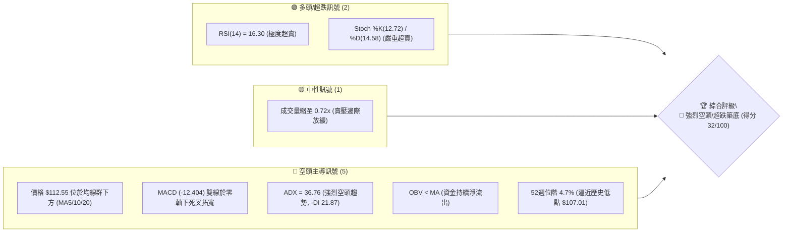
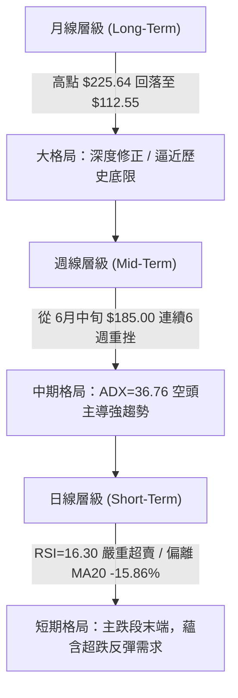
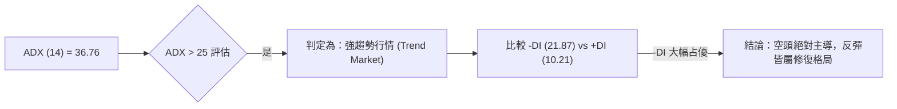
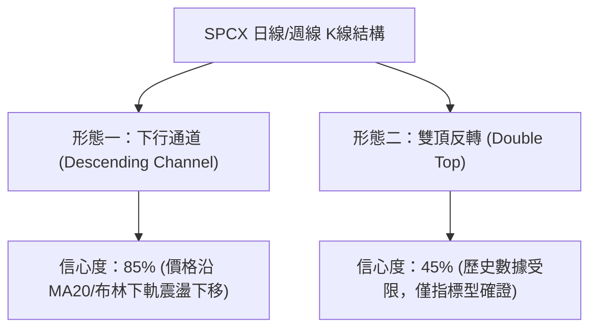
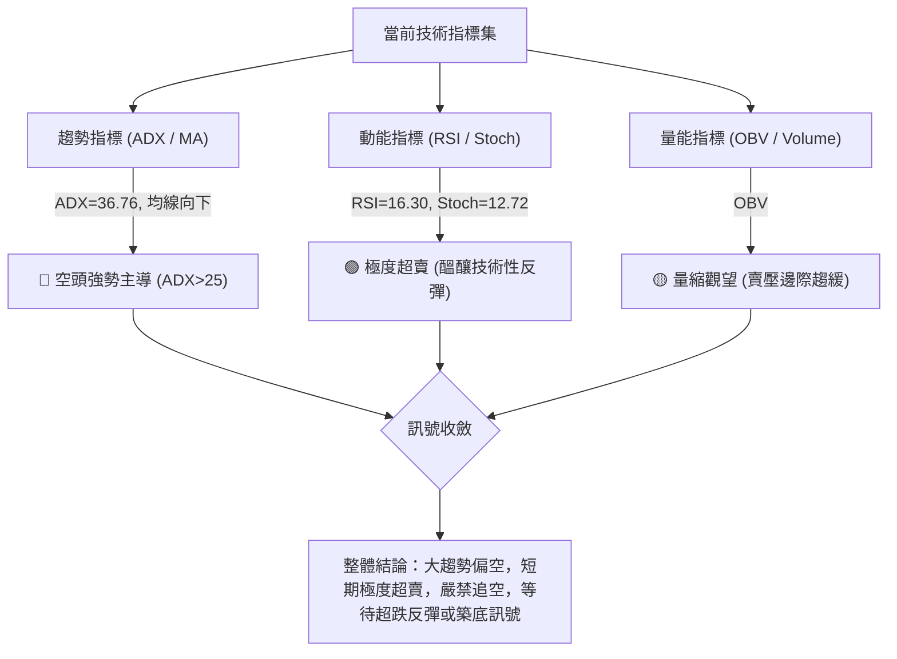
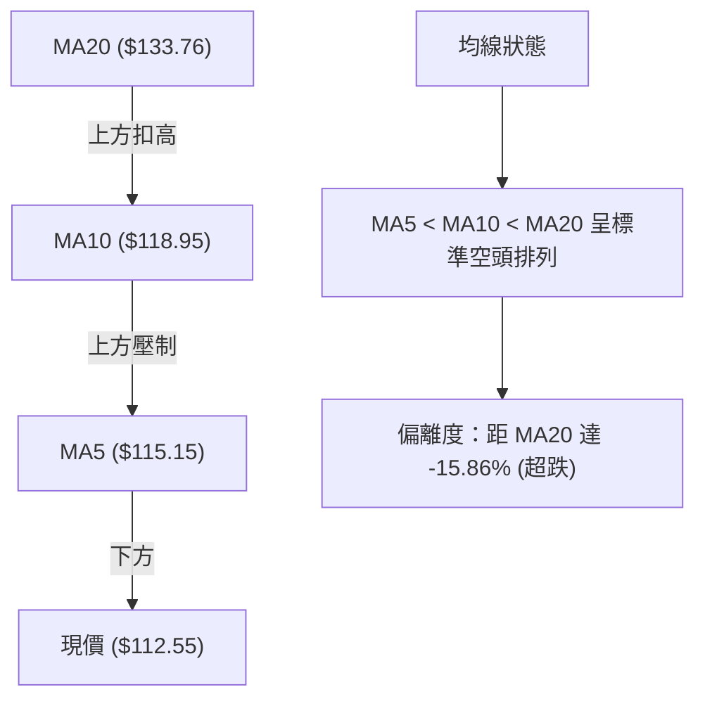
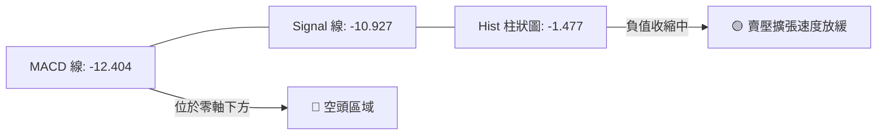
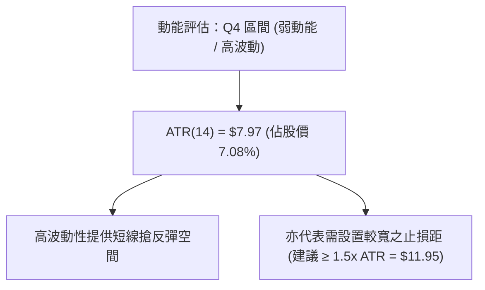
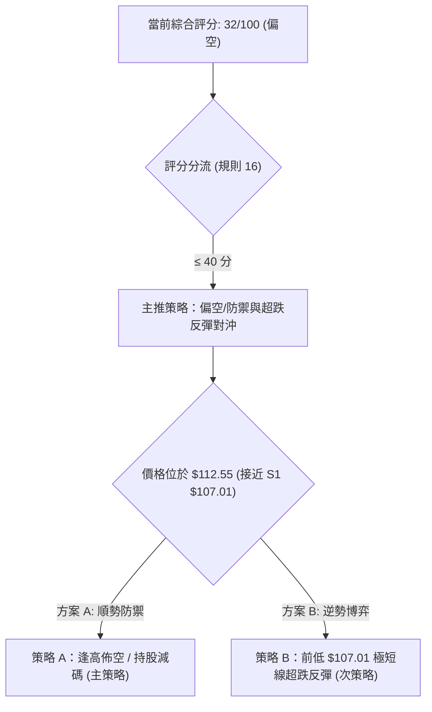
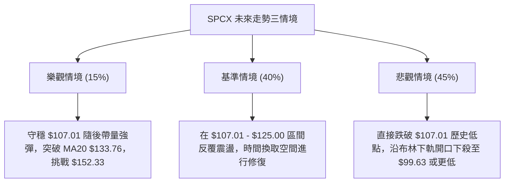

# SPCX 技術分析報告

> **報告日期**：2026-07-30 ｜ **語言**：繁體中文 ｜ **數據來源**：Yahoo Finance ｜ **當前價格**：$112.55

---

## 目錄

| 章節 | 內容 |
|------|------|
| [1. 技術面概覽](#1-技術面概覽) | 訊號儀表板、核心指標、評分卡 |
| [2. 趨勢分析](#2-趨勢分析) | 多時框趨勢、長中短期走勢 |
| [3. 圖表形態分析](#3-圖表形態分析) | 形態識別、K線組合、目標價 |
| [4. 支撐與阻力](#4-支撐與阻力) | 關鍵價位、斐波那契回調 |
| [5. 技術指標深度解讀](#5-技術指標深度解讀) | MA/RSI/MACD/布林/成交量 |
| [6. 動能與波動率](#6-動能與波動率) | 動能評估、ATR、Beta |
| [7. 多時框架總結](#7-多時框架總結) | 時框架評分矩陣 |
| [8. 交易策略建議](#8-交易策略建議) | 多空策略、風險報酬比 |
| [9. 風險提示與監控](#9-風險提示與監控) | 監控指標、風險場景 |

---

## 1. 技術面概覽

### 🎯 技術訊號儀表板



### 📊 核心指標速覽表

| 指標類別 | 指標名稱 | 當前數值 | 訊號 | 解讀 |
|----------|----------|----------|------|------|
| **價格位階** | 當前價格 | $112.55 | 🔴 | 位於 52 週區間 ($107.01 - $225.64) 的 4.7% 極低分位 |
| **均線系統** | MA5 / MA10 | $115.15 / $118.95 | 🔴 | 短期均線呈空頭排列，且為當前價格之即時動態阻力 |
| **均線系統** | MA20 (月線) | $133.76 | 🔴 | 價格距 MA20 達 -15.86%，中期偏離率高，空頭主導 |
| **動能指標** | RSI(14) | 16.30 | 🟢 | 進入極度超賣區（<30），隨時存在技術性急彈需求 |
| **趨勢指標** | MACD | -12.404 | 🔴 | DIF 與 Signal (-10.927) 雙雙深陷負值，柱狀圖 -1.477 |
| **趨勢強度** | ADX(14) | 36.76 | 🔴 | ADX > 25 屬強趨勢，-DI (21.87) > +DI (10.21) 證實空頭控制 |
| **波動帶** | 布林通道 | BB %B = 0.19 | 🔴 | 下軌 $99.63 / 中軌 $133.76 / 上軌 $167.89，價格沿下軌下行 |
| **量能指標** | 量比 (Volume) | 0.72x | 🟡 | 今日成交量 53.46M 較 20日均量 73.88M 萎縮，惜售與觀望並存 |

### 🏆 技術評分卡

```
╔══════════════════════════════════════════════════════════════════╗
║              SPCX 技術面綜合評分卡 — 2026-07-30                 ║
╠══════════════════════════════════════════════════════════════════╣
║ 趨勢強度 (ADX/DI)   ████████████████░░░░  80/100 (強空頭趨勢)    ║
║ 動能指標 (RSI/MACD) ████░░░░░░░░░░░░░░░░  20/100 (嚴重超賣/向下) ║
║ 支撐穩定度 (S1/52W) ███░░░░░░░░░░░░░░░░░  15/100 (逼近前低 107.01)║
║ 成交量配合 (OBV)    █████░░░░░░░░░░░░░░░  25/100 (資金持續流出)  ║
║ 形態完整度 (K線/通道)██████░░░░░░░░░░░░░░  30/100 (下行通道延伸)  ║
║ 均線排列 (MA5-20)   ██░░░░░░░░░░░░░░░░░░  10/100 (全線向下壓制)  ║
╠══════════════════════════════════════════════════════════════════╣
║ 綜合評分            ██████░░░░░░░░░░░░░░  32/100 (🔴 強烈偏空) ║
╚══════════════════════════════════════════════════════════════════╝
```

---

## 2. 趨勢分析

### 🌐 多時框趨勢分析



### 📈 長期趨勢 — 12個月走勢圖（Unicode）

```
SPCX 過去12個月價格走勢與關鍵轉折示意圖
價格軸 ($)
$225.64 ┤                       ● (52W Peak $225.64)
$200.00 ┤                     ╱   ╲
$185.00 ┤                   ╱       ● (2026-06 高點 $185.00)
$170.86 ┤  ● (2026-06 收盤)╱          ╲
$150.00 ┤ ╱  ╲           ╱              ╲
$130.00 ┤╱    ╲         ╱                 ╲
$112.55 ┼──────●───────╱───────────────────● (當前價格 $112.55)
$107.01 ┤       ● (52W Low $107.01)
        └─┬───┬───┬───┬───┬───┬───┬───┬───┬───┬───┬───
         M1  M2  M3  M4  M5  M6  M7  M8  M9 M10 M11 M12 (2026-07)
```

**走勢特徵分析表格**：

| 階段 | 時間區間 | 價格變動 | 漲跌幅 | 主要技術特徵與量能表現 |
|------|----------|----------|--------|------------------------|
| **波段高點** | 2026-06-21 | $185.00 | — | 週成交量爆出 9.25 億股，衝高後見頂回落 |
| **主跌段一** | 2026-06-28 | $185.00 → $153.23 | -17.17% | 單週長黑吞噬，MACD 柱狀圖由正轉負 (-2.783) |
| **弱勢反彈** | 2026-07-05 | $153.23 → $162.00 | +5.72% | 量縮反彈（成交量 3.34 億股），受制於 MA20 阻力 |
| **主跌段二** | 2026-07-05 → 2026-07-30 | $162.00 → $112.55 | -30.52% | 連續四周下挫，RSI 破 20 進入極度超賣，ADX 升至 36.76 |

### 📊 中期趨勢（週線分析）

中期走勢顯示，SPCX 在突破 $185.00 失敗後，呈現標準的「階梯式下行」結構。

```
週線等級關鍵阻力與支撐結構示意圖：
$225.64 ══════════════════════════════════════ [52W 歷史最高點 / 0.0% Fib]
$180.32 ────────────────────────────────────── [38.2% Fib 回調位]
$172.40 ══════════════════════════════════════ [主要波段阻力 R1]
$152.33 ────────────────────────────────────── [61.8% Fib 回調位]
$132.40 ────────────────────────────────────── [78.6% Fib 回調位 / MA20 $133.76]
$112.55 ────────────── ◄ 【當前現價】──────────
$107.01 ══════════════════════════════════════ [52W 歷史最低點 / S1]
$99.63  ────────────────────────────────────── [布林通道下軌]
```

### ⚡ 趨勢強度評估（ADX 解讀）



| 指標 | 當前數值 | 臨界值 | 趨勢狀態解讀 |
|------|----------|--------|--------------|
| **ADX(14)** | 36.76 | > 25 (強趨勢) | 趨勢動能極其強烈，非無方向的窄幅盤整格局 |
| **+DI(14)** | 10.21 | < 20 (多頭潰敗) | 多頭買盤力道極其微弱，缺乏推升價格之主導力 |
| **-DI(14)** | 21.87 | > +DI (空頭掌控) | 空頭賣壓全面主導市場行情方向 |

---

## 3. 圖表形態分析

### 🔍 形態識別系統



**形態信心度評估表**：

| 形態名稱 | 信心度 | 判斷依據（引用數據） | 完成度 | 目標價（附計算式） |
|----------|--------|----------------------|--------|--------------------|
| **下行旗形/通道** | **85%** | 價格沿著向下傾斜的 MA5 ($115.15)、MA10 ($118.95) 與 MA20 ($133.76) 呈階梯下行 | 90% | 沿通道下軌延伸，下方尋求 $107.01 支撐 |
| **雙頂反轉形態** | **45%** | 衝高 $185.00 後迅速拉回，突破頸線 $153.23 | 60% | 數據時間跨度不足，僅作指標型解讀，不做幾何目標推算 |

*註：依據規則 15，由於雙頂形態幾何數據不完全，本報告不進行憑空推算，主要基於布林通道突破與斐波那契價位進行目標導向分析。*

### 🕯️ 重要 K 線形態分析

| 日期/週別 | 收盤價 | K線形態 | 解讀 | 訊號 |
|-----------|--------|---------|------|------|
| **2026-06-21** | $185.00 | 長上影線避雷針 | 攻高遭遇強烈解套賣壓，多頭力竭 | 🔴 看空 |
| **2026-06-28** | $153.23 | 大黑K實體線 | 跌破短中期均線，空頭完全掌控市場 | 🔴 看空 |
| **2026-07-19** | $123.99 | 長黑下尋線 | 跌破 $130 關卡，波動率 ATR 擴大至 $7.97 | 🔴 看空 |
| **2026-08-02 (最新)** | $112.55 | 縮量十字小黑K | 量能降至 199.7M，賣壓邊際放緩，超賣築底中 | 🟡 中性/超跌 |

### 📉 ASCII 走勢形態示意圖

```
SPCX 日線下行通道與超賣區間示意圖：
$185.00 ┤ ● (頂部)
$167.89 ┤  ╲ ════════════════════════════════════ 布林上軌
$153.23 ┤   ╲     ● (弱勢反彈高點)
$133.76 ┤    ╲   ╱ ╲ ═════════════════════════ 布林中軌 (MA20)
$118.95 ┤     ╲ ╱   ╲   ● MA10
$112.55 ┼──────╳─────╲───●【現價】─────────────── 偏離度 -15.86%
$107.01 ┤             ╲    ● (52W Low 前低支撐 S1)
$99.63  ┤              ╲ ═════════════════════ 布林下軌
```

### 🎯 形態目標價計算

根據布林通道與波段波幅推算：
*   **短線超跌反彈目標**：MA20 中軌位階即為第一反壓，即 **$133.76**。
*   **通道下軌延伸支撐**：布林帶下軌 **$99.63** 與 52 週低點 **$107.01** 組成防禦區間。

---

## 4. 支撐與阻力

### 🗺️ 關鍵價位分布圖（Unicode）

```
SPCX 價位結構分布圖 (由 OHLCV 與斐波那契精確計算)
══════════════════════════════════════════════════════════════════
$225.64 ║████████████████████████████████████████║ 52W 最高點 (0.0% Fib)
$197.64 ║██████████████████████████████          ║ 23.6% Fib 回調位
$180.32 ║████████████████████████                ║ 38.2% Fib 回調位
$172.40 ║███████████████████████                 ║ 波段關鍵阻力 R1
$166.33 ║████████████████████                    ║ 50.0% Fib 中樞價位
$152.33 ║████████████████                        ║ 61.8% Fib 黃金分割阻力
$133.76 ║███████████                             ║ MA20 / 布林中軌
$132.40 ║███████████                             ║ 78.6% Fib 回調位
$112.55 ╠════════════════════════════════════════╣ ◄【當前現價】
$107.01 ║▓▓▓▓▓▓▓▓▓▓▓▓▓▓▓▓▓▓▓▓▓▓▓▓▓▓▓▓▓▓▓▓▓▓▓▓▓▓▓▓║ 52W 最低點 / 強支撐 S1
$99.63  ║▓▓▓▓▓▓▓▓▓▓▓▓▓▓▓▓▓▓▓▓                    ║ 布林通道下軌
══════════════════════════════════════════════════════════════════
```

### 🚧 阻力位分析表

| 阻力級別 | 價位 | 形成原因 | 突破難度 | 重要性 |
|----------|------|----------|----------|--------|
| **R1** | **$172.40** | 近一年波段高點聚類區塊 | 🔴 極高 | ★★★★★ (中期多空分水嶺) |
| **Fib 78.6%** | **$132.40** | 斐波那契 78.6% 回調位與 MA20 ($133.76) 重疊 | 🟡 中高 | ★★★★☆ (短線反彈首要壓力) |
| **Fib 61.8%** | **$152.33** | 斐波那契黃金分割回調位 | 🔴 高 | ★★★★☆ (中期反轉確認點) |

### 🛡️ 支撐位分析表

| 支撐級別 | 價位 | 形成原因 | 守住機率 | 重要性 |
|----------|------|----------|----------|--------|
| **S1** | **$107.01** | 52週歷史最低點 (100.0% Fib) | 🟡 60% | ★★★★★ (多頭最後防線) |
| **BB 下軌**| **$99.63** | 布林通道下軌極限擴張位置 | 🟢 75% | ★★★☆☆ (超跌動能竭盡位) |

### 📐 斐波那契回調位分析

依據 52 週高低點區間（高點 **$225.64**，低點 **$107.01**，波幅 **$118.63**）：
*   當前價格 **$112.55** 位於 **100.0% ($107.01)** 與 **78.6% ($132.40)** 之間。
*   **解讀**：價格已跌破 78.6% 的極限回調位 ($132.40)，進入歷史低點防衛戰。若 $107.01 守穩，可望形成雙底或超跌打底形態；若不幸跌破 $107.01，將開啟無歷史支撐的價格探索階段（價格將向布林下軌 $99.63 靠攏）。

---

## 5. 技術指標深度解讀

### 🎛️ 指標訊號總覽



### 📈 移動平均線排列分析



*   **均線狀態說明**：均線呈現混合偏空排列，短期均線群（MA5/10/20）全部彎頭向下。價格目前壓制在所有均線之下，MA5 ($115.15) 為第一道動態阻力。

### 📉 RSI(14) 分析

*   **RSI(14) 當前數值**：`16.30`
*   **強度進度條**：`███░░░░░░░░░░░░░░░░░ 16.3%` (🟢 極度超賣)

```
RSI(14) 區間位置圖：
0 ──────[16.30 現價]─── 30 ──────────────── 50 ──────────────── 70 ────────────── 100
├───────────┼───────────┼──────────────────┼──────────────────┼──────────────┤
│  極度超賣  │   超賣區   │      中性區      │      超買區      │   極度超買   │
```

*   **背離分析**：目前 RSI 為 16.30，儘管價格創新低，但 RSI 亦同步落入低位，**無明顯底背離**現象。這意味著下跌是由真實賣壓推動，而非動能竭盡的虛跌，但 16.30 的數值在統計學上屬於極端值，技術性修復隨時可能發生。

### 📊 MACD(12/26/9) 訊號解讀



*   **分析**：MACD 深陷雙線負值區，柱狀圖為 `-1.477`。週線 MACD 柱狀圖由 -2.684 收斂至 -1.477，顯示雖然空頭佔優，但下殺的加速度已在減弱。

### 📦 布林通道分析

```
SPCX 布林通道 (20, 2) 走勢示意圖：
$167.89 ┼───────────────────────────────────────── 布林上軌 (BB Upper)
        │
$133.76 ┼───────────────────────────────────────── 布林中軌 (MA20)
        │
$112.55 ┼─────────● (現價, %B = 0.19)
$99.63  ┼───────────────────────────────────────── 布林下軌 (BB Lower)
```

*   **帶寬與位階**：BB %B 為 `0.19`，價格緊貼下軌（$99.63）運行，通道呈擴張狀態，為典型的鈍化下行特徵。

### 💹 成交量分析（量價配合度）

*   **最新成交量**：53,464,400 股
*   **20日均量**：73,879,645 股（量比：`0.72x`）
*   **OBV 趨勢**：OBV < MA，資金呈現持續淨流出狀態。
*   **量價解讀**：價格接近前低 $107.01 時成交量縮至 0.72x，顯示追空意願降低，賣壓進入籌碼鎖定或惜售階段。

---

## 6. 動能與波動率

### ⚡ 動能評估

| 象限區分 | 動能強度 (RSI/MACD) | 波動率 (ATR/BB) | SPCX 當前位置 | 交易含義 |
|----------|---------------------|-----------------|---------------|----------|
| **Q1 (左上)** | 強 (高) | 低 | — | 穩定突破趨勢 |
| **Q2 (右上)** | 強 (高) | 高 | — | 高風險高收益行情 |
| **Q3 (左下)** | 弱 (低) | 低 | — | 沉悶盤整格局 |
| **Q4 (右下)** | **弱 (低)** | **高 (7.08%)** | **✓ SPCX 所在位置** | **空頭主導高波動，尋求超跌反彈** |



### 📊 ATR 波動率分析

*   **ATR(14)**：`$7.97`（佔當前股價 **7.08%**）
*   **波動率解讀**：SPCX 日均波幅接近 $8 美元，屬於極高波動性個股。
*   **風控應用**：
    *   **短線止損距離 (1.0x ATR)**：$7.97
    *   **波段止損距離 (1.5x ATR)**：$11.95
    *   **防守型止損距離 (2.0x ATR)**：$15.94

### 📐 Beta 與市場相關性

*   **機構持股**：1.5% ｜ **內部人持股**：18.7% ｜ **空頭放空比率 (Short % Float)**：2.7%
*   **市場特性**：機構持股極低，籌碼多集中於內部人與散戶，導致市場情緒對股價影響極大，容易出現超漲超跌現象。

---

## 7. 多時框架總結

### 📋 時框架評分表

| 時框架 | 趨勢方向 | 動能狀態 | 均線排列 | 形態結構 | 綜合評分 | 交易建議 |
|--------|----------|----------|----------|----------|----------|----------|
| **月線 (Long)** | 🔴 偏空 | 弱動能 | 缺乏長均線 | 逼近歷史底限 | **35/100** | 觀望，等待打底 |
| **週線 (Mid)** | 🔴 強空 | MACD負值 | 空頭排列 | 下行通道 | **25/100** | 順勢偏空，反彈找賣點 |
| **日線 (Short)**| 🟢 超跌 | RSI=16.30 | 偏離MA20 | 逼近S1($107.01)| **40/100** | 嚴禁追空，可輕倉搶反彈 |

### 🔲 綜合訊號矩陣

```
           【短期 日線】
           超跌反彈需求 (RSI 16.30)
                 │
                 ▼
【中期 週線】 ───┼───► 【主導趨勢：空頭】 (ADX 36.76 > 25)
 (下行通道)      │
                 ▼
           【長期 月線】
           歷史低點防守 ($107.01)
```

### ⚖️ 多時框收斂結論

**依據多時框收斂規則（規則 14）**：
當前 ADX 為 `36.76`（> 25），明確判定為 **「趨勢行情」**。
依規定，趨勢行情下必須以**中長期趨勢（週線/空頭主導）為主要方向**，日線的極度超賣（RSI 16.30）僅能視為「短線超跌反彈或止跌尋找進場點」的訊號，不可據此直接判定大趨勢反轉。

*   **唯一收斂結論**：**整體趨勢強烈偏空，短線進入極度超賣區**。主策略應以「防守觀望/逢高順勢佈空」為主，僅極高風險承受度者可利用 $107.01 前低支撐進行短線超跌反彈博弈。

---

## 8. 交易策略建議

### 🗺️ 策略決策流程圖



### 🧭 策略路由

**當前主策略方向 = 🔴 偏空防禦與反彈減碼（依技術評分 32/100）**

由於評分低於 40 分，大格局空頭掌控（ADX 36.76），所有多頭操作均屬於高風險之「逆勢超跌博弈」，必須嚴格控制倉位。

### 🎯 價格情境階梯 (Price Scenarios)

| 觸發條件 | 下一目標 | 後續延伸 | 情境含義 |
|----------|----------|----------|----------|
| **反彈突破 $118.95 (MA10)** | $132.40 (78.6% Fib) | $133.76 (MA20) | 短線超跌修復，觸及強阻力區 |
| **跌破 S1 $107.01 (52W Low)**| $99.63 (BB 下軌) | 尋求新低點 | 空頭趨勢延伸，開啟新一波下殺 |
| **站穩 $112.55 - $107.01 區間**| — | — | 築底底層盤整 |

### 📊 情境機率分佈

| 情境 | 機率 | 主要依據 |
|------|------|----------|
| **跌破 $107.01 續探新低** | **45%** | ADX=36.76 強空頭趨勢、-DI=21.87、OBV 資金持續流出 |
| **在 $107.01 - $133.76 築底震盪** | **40%** | RSI=16.30 極度超賣、量比 0.72x 顯示賣壓邊際減弱 |
| **強勢V型反轉突破 $152.33** | **15%** | 均線群全數向下壓制，缺乏利多催化劑與買盤成交量 |

### 🟢 交易策略詳情表

所有價位均嚴格引用前述計算與數據區塊：

| 策略要素 | 策略 A：逢高順勢佈空 (主策略) | 策略 B：S1 前低超跌反彈 (逆勢次策略) |
|----------|--------------------------------|--------------------------------------|
| **策略性質** | 順勢放空 / 現貨避險減碼 | 逆勢極短線搶反彈 |
| **進場條件** | 反彈至 MA10 或 MA20 遭遇阻力 | 價格逼近 S1 $107.01 未跌破且出現止跌訊號 |
| **進場價格** | **$132.40 - $133.76** (Fib 78.6% / MA20) | **$107.50 - $108.50** (逼近 S1 $107.01) |
| **目標價 T1** | **$112.55** (現價區間) | **$118.95** (MA10 阻力) |
| **目標價 T2** | **$107.01** (52W 最低點) | **$132.40** (Fib 78.6% 回調位) |
| **止損價格** | **$140.00** (突破 MA20 加 1x ATR) | **$103.02** (跌破前低 $107.01 減 0.5x ATR) |
| **風險報酬比** | **2.67 : 1** [(132.40-107.01)/(140.00-132.40)] | **2.50 : 1** [(118.95-108.00)/(108.00-103.60)] |
| **建議倉位** | 15% - 20% | 5% - 10% (極輕倉) |

### 🔴 反向風險觸發點（對沖與風控提示）

*   **多頭止損/翻多觸發價**：強勢帶量突破並收復 **$133.76 (MA20)**，屆時空頭策略必須立即止損離場。
*   **空頭加碼觸發價**：日線收盤價有效跌破 **$107.01 (52W Low)**，代表底部防線失守，空頭可順勢加碼追擊至布林下軌 **$99.63**。

### ⭐ 整體訊號強度評星

```
做多訊號強度：★☆☆☆☆ (1/5 星 - 僅有 RSI 超賣支持)
做空訊號強度：████░ (4/5 星 - 趨勢與均線完全偏空)
整體可信度：  ████☆ (4/5 星 - 多指標互相確證空頭趨勢)
```

---

## 9. 風險提示與監控

### ✅ 關鍵監控指標 Checklist

```
╔══════════════════════════════════════════════════════════════════╗
║                   SPCX 日常技術監控清單                          ║
╠══════════════════════════════════════════════════════════════════╣
║ [ ] 1. 52週低點防線：每日收盤價是否守穩 $107.01                 ║
║ [ ] 2. RSI 動能指標：RSI(14) 能否由 16.30 升回 30 以上          ║
║ [ ] 3. 均線扣抵壓力：價格能否突破 MA5 ($115.15) 與 MA10 ($118.95)║
║ [ ] 4. 成交量變化：反彈時成交量是否大於 20日均量 (73.88M)        ║
║ [ ] 5. MACD 柱狀圖：Hist (-1.477) 能否持續收窄向零軸靠攏       ║
╚══════════════════════════════════════════════════════════════════╝
```

### ⚠️ 風險場景分析



### 🛡️ 風險管理重要提醒

1.  **高 ATR 波動風險**：SPCX 的 ATR 高達 `$7.97` (7.08%)，單日走勢極為猛烈。絕不可使用過高槓桿，止損價位設定必須考慮波動寬幅。
2.  **流動性與籌碼風險**：機構持股僅 `1.5%`，散戶與內部人籌碼佔絕大多數，缺乏機構法人買盤底撐，容易出現無連續性的閃跌行情。

---

## 📋 報告總結

```
╔══════════════════════════════════════════════════════════════════╗
║                   SPCX 技術分析報告總結                          ║
════════════════════════════════════════════════════════════════════
報告日期：2026-07-30
當前價格：$112.55
分析評級：🔴 強烈偏空 / 極度超賣 (技術評分 32/100)

關鍵結論：
├─ 長期趨勢：🔴 偏空 (距歷史高點 $225.64 深幅回修)
├─ 中期趨勢：🔴 強空 (下行通道延伸，ADX 36.76 強趨勢)
├─ 短期趨勢：🟢 超跌 (RSI 16.30 深陷超賣區，醞釀技術反彈)
├─ 關鍵支撐：$107.01 (52W 低點) / $99.63 (布林下軌)
├─ 關鍵阻力：$118.95 (MA10) / $132.40 (78.6% Fib) / $133.76 (MA20)
└─ 分析師共識：Buy (21人) ｜ 平均目標價：$236.71 (基本面與技術面背離)

最優策略組合：
1. 🥇 最佳機會 (主策略)：等待反彈至 $132.40 - $133.76 遭遇阻力時逢高順勢佈空。
2. 🥈 次選機會 (次策略)：若價格壓至 $107.50 附近且不破 $107.01，可極輕倉博弈超跌反彈。
3. 🥉 保守選擇：完全觀望，等待價格收復 MA20 ($133.76) 或打出明確雙底形態再行入場。
════════════════════════════════════════════════════════════════════
```

---

> ⚠️ **免責聲明**：本報告為 AI 自動生成之技術分析，所有數據及估算均基於提供的歷史價格資訊（Data Date: 2026-07-30）。本報告**僅供研究與學術參考**，**不構成任何投資建議**。投資有風險，入市需謹慎。

---

*報告生成時間：2026-07-30 ｜ 數據來源：Yahoo Finance ｜ 分析框架：多時框技術分析*