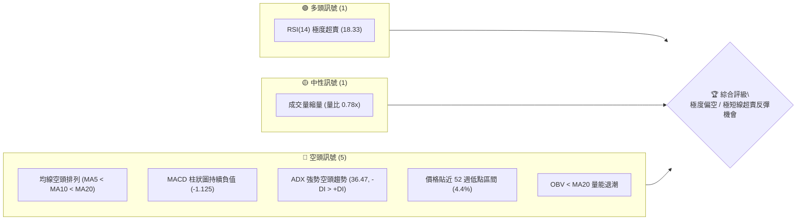
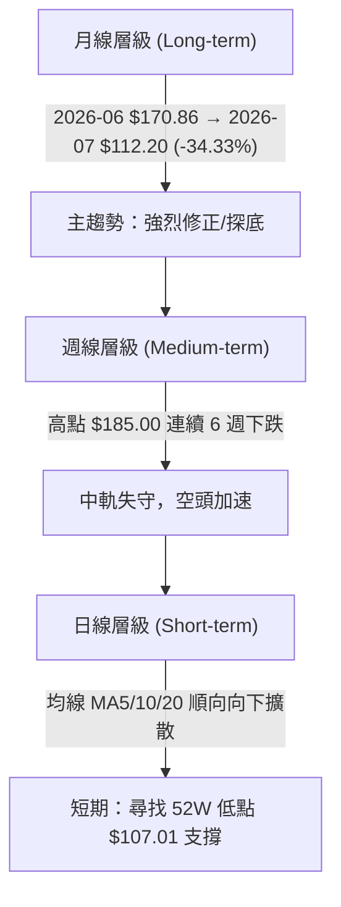
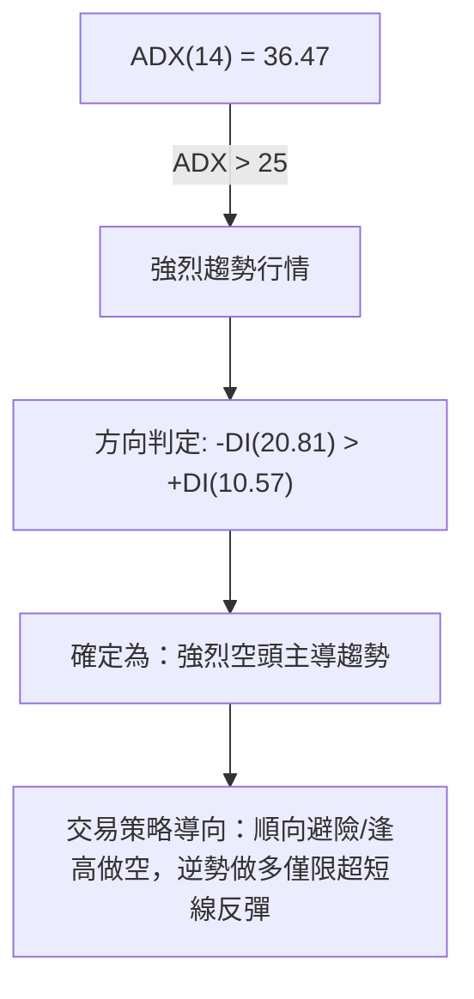
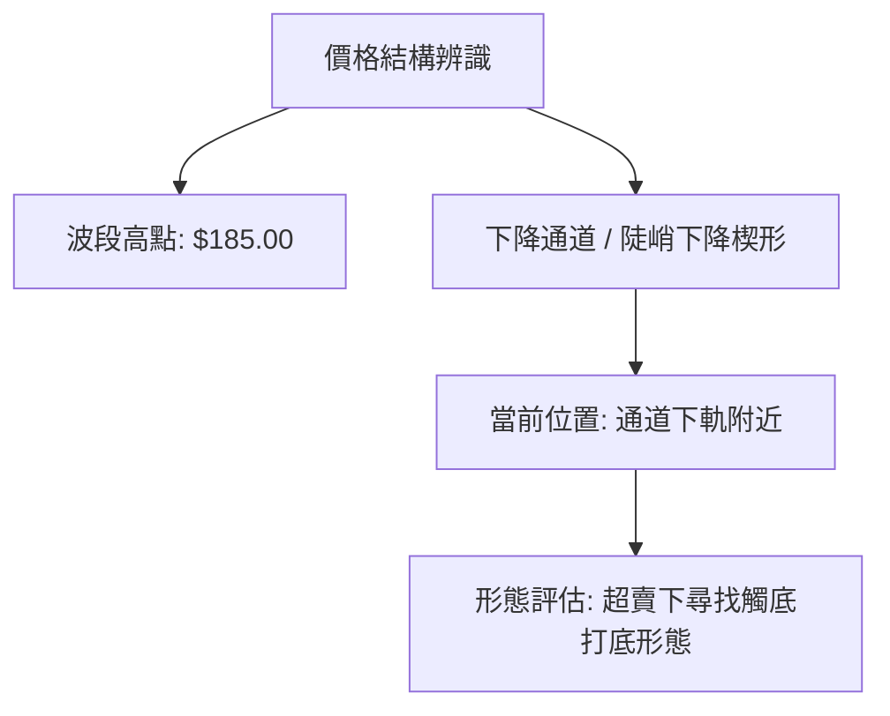
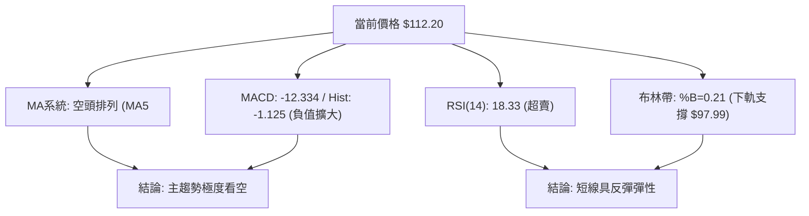
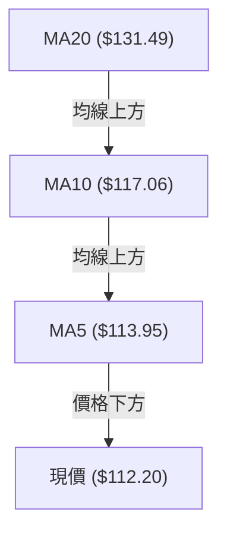
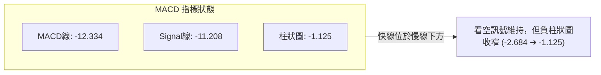
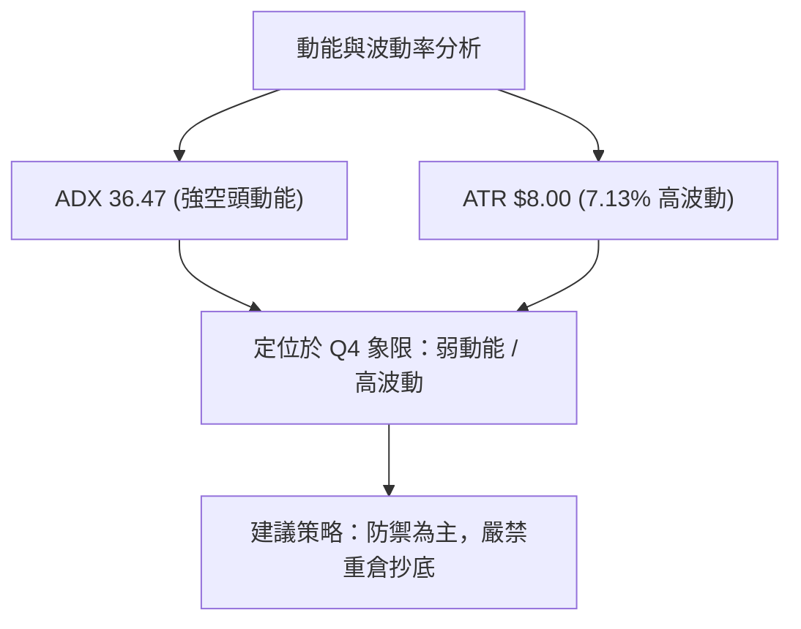
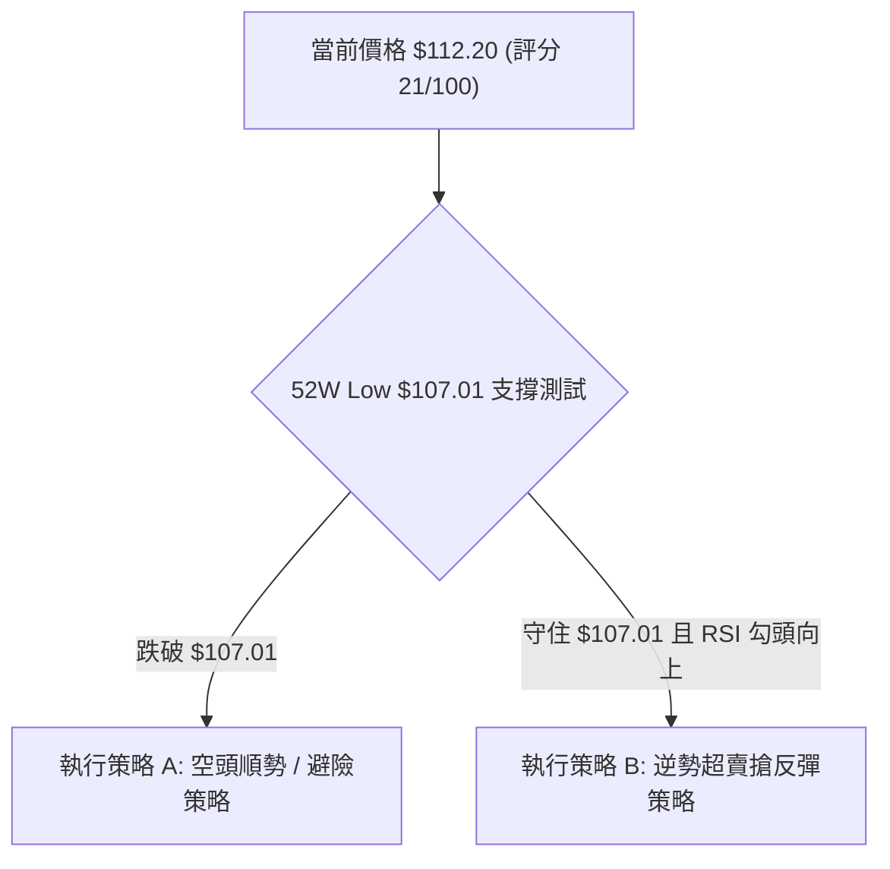
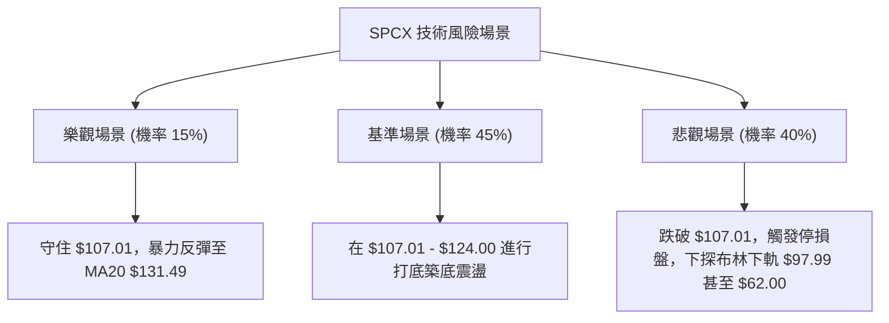

# SPCX 技術分析報告

> **報告日期**：2026-07-31 ｜ **語言**：繁體中文 ｜ **數據來源**：Yahoo Finance ｜ **當前價格**：$112.20

---

## 目錄

| 章節 | 內容 |
|------|------|
| [1. 技術面概覽](#1-技術面概覽) | 訊號儀表板、核心指標、評分卡 |
| [2. 趨勢分析](#2-趨勢分析) | 多時框趨勢、長中短期走勢 |
| [3. 圖表形態分析](#3-圖表形態分析) | 形態識別、K線組合、目標價 |
| [4. 支撐與阻力](#4-支撐與阻力) | 關鍵價位、斐波那契回調 |
| [5. 技術指標深度解讀](#5-技術指標深度解讀) | MA/RSI/MACD/布林/成交量 |
| [6. 動能與波動率](#6-動能與波動率) | 動能評估、ATR、Beta |
| [7. 多時框架總結](#7-多時框架總結) | 時框架評分矩陣 |
| [8. 交易策略建議](#8-交易策略建議) | 多空策略、風險報酬比 |
| [9. 風險提示與監控](#9-風險提示與監控) | 監控指標、風險場景 |

---

## 1. 技術面概覽

### 🎯 技術訊號儀表板



### 📊 核心指標速覽表

| 指標類別 | 指標名稱 | 當前數值 | 訊號 | 解讀 |
|----------|----------|----------|------|------|
| **價格** | 當前價格 | $112.20 | 🔴 | 靠近 52 週低點 $107.01 (分位數 4.4%) |
| **均線** | MA5 | $113.95 | 🔴 | 價格低於 MA5，極短期受壓 |
| **均線** | MA10 | $117.06 | 🔴 | 價格低於 MA10，短期下跌趨勢 |
| **均線** | MA20 | $131.49 | 🔴 | 價格遠低於 MA20 (-14.67%)，空頭主導 |
| **動能** | RSI(14) | 18.33 | 🟢 | 進入極度超賣區（<30），隨時可能觸發技術性反彈 |
| **動能** | MACD | -12.334 | 🔴 | MACD線與訊號線雙雙深陷負值區，柱狀圖 -1.125 |
| **動能** | KD(14,3,3) | %K 13.69 / %D 15.54 | 🟢 | 隨機指標進入嚴重超賣區 |
| **趨勢** | ADX(14) | 36.47 | 🔴 | ADX > 25 且 -DI(20.81) > +DI(10.57)，空頭強趨勢 |
| **波動** | ATR(14) | $8.00 (7.13%) | 🟡 | 日波動率較高，日內震盪風險顯著 |
| **通道** | 布林通道 | %B = 0.21 | 🟡 | 位於中軌 $131.49 與下軌 $97.99 之間 |
| **成交量** | 20日均量比 | 0.78x | 🟡 | 殺跌動能有所減緩，成交量收縮 |

### 🏆 技術評分卡

```
╔══════════════════════════════════════════════════════════════╗
║                技術評分卡 — SPCX (2026-07-31)                ║
╠══════════════════════════════════════════════════════════════╣
║ 趨勢強度 (ADX/MA)   ████░░░░░░░░░░░░░░░░  20/100  🔴 強空頭  ║
║ 動能指標 (RSI/MACD) ██████░░░░░░░░░░░░░░  30/100  🟡 超賣底  ║
║ 支撐穩定度          ███░░░░░░░░░░░░░░░░  15/100  🔴 無近支  ║
║ 成交量配合          ██████░░░░░░░░░░░░░░  30/100  🟡 縮量跌  ║
║ 形態完整度          ████░░░░░░░░░░░░░░░░  20/100  🔴 尋底中  ║
║ 均線排列            ██░░░░░░░░░░░░░░░░░░  10/100  🔴 完全空  ║
╠══════════════════════════════════════════════════════════════╣
║ 綜合技術評分        ████░░░░░░░░░░░░░░░░  21/100  🔴 看空/超賣║
╚══════════════════════════════════════════════════════════════╝
```

---

## 2. 趨勢分析

### 🌐 多時框趨勢分析



### 📈 長期趨勢 — 12個月走勢圖（Unicode）

```
SPCX 月線走勢示意圖（2025-08 至 2026-07）
價格軸 ($)
$225.64 ┤                           ● (52W High $225.64)
$200.00 ┤                     ●───●
$175.00 ┤               ●───●       ●
$150.00 ┤         ●───●               ●
$125.00 ┤   ●───●                       ●
$112.20 ┤●                                ● (現價 $112.20)
$107.01 ┤                                   ● (52W Low $107.01)
        └─┴───┴───┴───┴───┴───┴───┴───┴───┴───┴───┴───
          M1  M2  M3  M4  M5  M6  M7  M8  M9 M10 M11 M12
```

**走勢特徵分析表格**：

| 階段 | 時間區間 | 價格變動 | 漲跌幅 | 走勢特徵與技術驅動 |
|------|----------|----------|--------|--------------------|
| 主升段 | 2025-08 ~ 2026-05 | $110.00 ➔ $225.64 | +105.1% | 營收高成長與新業務推進，突破各天期均線 |
| 見頂回落 | 2026-06-14 ~ 2026-06-21 | $160.95 ➔ $185.00 | +14.9% | 短線衝高見頂，量能激增至 9.25 億股，主力高檔換手 |
| 主跌段 | 2026-06-21 ~ 2026-07-31 | $185.00 ➔ $112.20 | -39.35% | 跌破 MA20，週線連六陰，賣壓全面傾巢而出 |

### 📊 中期趨勢（週線分析）

```
SPCX 近 8 週價格與均線結構
$185.00 ┤  ▲ 波段高點 (2026-06-21)
$172.40 ┤  ┼──── 關鍵阻力 R1 ($172.40)
$153.23 ┤  │  ●
$131.49 ┤  │──┼── MA20 / 布林中軌 ($131.49)
$112.20 ┤  │  └──● 當前價格 ($112.20)
$107.01 ┤  ┴────── 52週低點 / 100% 斐波那契 ($107.01)
```

1. **週線連陰賣壓**：從 2026-06-21 最高價 $185.00 跌至 $112.20，成交量逐步收縮，顯示市場賣壓雖然持續，但恐慌性拋售最猛烈的階段（06-21 當週 9.25 億股）已過。
2. **MA20 引力與偏離**：當前價格 $112.20 距離 20 日均線 $131.49 偏離率達 -14.67%，展現出強烈的負乖離狀況。

### ⚡ 趨勢強度評估（ADX 解讀）



| 指標 | 數值 | 門檻標準 | 狀態評估 | 策略含義 |
|------|------|----------|----------|----------|
| **ADX(14)** | 36.47 | > 25 趨勢明確 | 🟢 強趨勢建立 | 不宜在無確認訊號下盲目抄底 |
| **+DI** | 10.57 | < 20 多頭潰敗 | 🔴 多頭極度弱勢 | 多方無力推升價格 |
| **-DI** | 20.81 | > +DI 空頭主導 | 🔴 空頭掌握主導權 | 任何反彈皆面臨賣壓 |

---

## 3. 圖表形態分析

### 🔍 形態識別系統



#### 形態信心度評估表

| 形態類別 | 信心度 | 判斷依據（引用數據） | 完成度 | 目標價（附計算式） |
|----------|--------|----------------------|--------|--------------------|
| **下降通道/陡峭斜率** | 85% | 由 06-21 高點 $185.00 至 07-31 低點 $112.20，配合 MA5/10/20 下行 | 90% | 下軌支撐測試 $107.01 (52W Low) |
| **頭肩頂形態** | 35% | 數據缺乏 240 筆完整日線數據，無法確立左肩與頭部結構 | 訊號不足 | 數據不足，僅做指標解讀 |
| **雙底打底形態** | 20% | 當前僅有單一探底波段，尚未出現第二次回測打底 | 10% | 待 $107.01 守住並反彈至 $131.49 後方可推算 |

### 🕯️ 重要K線形態分析

| 日期/週別 | 收盤價 | K線形態 | 解讀 | 訊號 |
|-----------|--------|---------|------|------|
| **2026-06-21** | $185.00 | 高檔長上影避雷針 | 巨量爆出（9.25億股）後收跌，主力逢高出貨 | 🔴 強烈看空 |
| **2026-06-28** | $153.23 | 中陰線貫穿 | 跌破短期均線，空頭趨勢確立 | 🔴 確認轉弱 |
| **2026-07-19** | $123.99 | 大陰線向下跳空 | 空頭加速段，MACD 柱狀圖負值擴大 | 🔴 空頭續強 |
| **2026-08-02** | $112.20 | 縮量小陰線 | 跌幅放緩，實體縮小，成交量降至 2.55 億股 | 🟡 賣壓趨緩 |

### 📉 ASCII 走勢形態示意圖

```
SPCX 日線/週線下降通道與關鍵形態示意圖
$185.00 ┼───● (見頂高點)
        │    ╲
$172.40 ┼─────╲────── 關鍵阻力 R1
        │      ╲
$153.23 ┼───────●
        │        ╲
$131.49 ┼─────────┼── MA20 / 布林中軌 (通道上軌阻力)
        │          ╲
$112.20 ┼───────────● 當前價格 (趨勢通道下軌)
$107.01 ┼────────────▲ 52週低點 / 100% 斐波那契強支撐
```

### 🎯 形態目標價計算

基於當前下降通道與 52 週高低點之波段計算：
1. **下行測幅目標（若跌破 52W 低點 $107.01）**：
   - 通道高度 = $185.00 - $153.23 = $31.77
   - 破位延伸目標 = $107.01 - $31.77 = **$75.24**（接近券商最低目標價 $62.00）
2. **上行超賣反彈目標（技術性修正）**：
   - 均線乖離修正目標 = MA20 價位 **$131.49**
   - 斐波那契 78.6% 回調位 = **$132.40**

---

## 4. 支撐與阻力

### 🗺️ 關鍵價位分布圖（Unicode）

```
SPCX 價位結構分布圖 (當前價格: $112.20)
════════════════════════════════════════════════════════════
$225.64 ║████████████████████████████████████████  52W High / 0.0% Fib
$197.64 ║██████████████████████████████            23.6% Fib
$180.32 ║████████████████████████                  38.2% Fib
$172.40 ║██████████████████████                    強阻力 R1 (波段高點聚類)
$166.33 ║██████████████████                        50.0% Fib
$152.33 ║██████████████                            61.8% Fib
$132.40 ║██████████                                78.6% Fib / MA20 ($131.49)
$112.20 ╠══════════════════════════════════════════ ◄ 現價 ($112.20)
$107.01 ║▓▓▓▓▓▓▓▓▓▓▓▓▓▓▓▓▓▓▓▓▓▓▓▓▓▓▓▓▓▓▓▓▓▓        52W Low / 100.0% Fib
$97.99  ║▓▓▓▓▓▓▓▓▓▓▓▓▓▓▓▓▓▓▓▓                      布林通道下軌 (BB Lower)
$62.00  ║▓▓▓▓▓▓▓▓▓                                 券商最低目標價 (Analyst Low)
════════════════════════════════════════════════════════════
```

### 🚧 阻力位分析表

| 阻力級別 | 價位 | 形成原因 | 突破難度 | 重要性 |
|----------|------|----------|----------|--------|
| **R1** | $132.40 | 78.6% 斐波那契回調位 & MA20 ($131.49) 密集交會處 | 🔴 高 | 🔥極高 (月線/日線多空分水嶺) |
| **R2** | $152.33 | 61.8% 斐波那契黃金切割回調位 | 🔴 極高 | 高 (中期趨勢反轉點) |
| **R3** | $172.40 | 近一年波段高點聚類 (數據確列 R1) | 🔴 極難 | 高 (多頭強烈套牢區) |
| **R4** | $180.32 | 38.2% 斐波那契回調位 | 🔴 極難 | 中 (長線多頭目標) |

### 🛡️ 支撐位分析表

| 支撐級別 | 價位 | 形成原因 | 守住機率 | 重要性 |
|----------|------|----------|----------|--------|
| **S1** | $107.01 | 52 週最低點 (100.0% 斐波那契位) | 🟡 55% | 🔥極高 (多頭最後防線) |
| **S2** | $97.99 | 日線布林通道下軌 (BB Lower) | 🟢 70% | 中 (超賣動態包覆支撐) |
| **S3** | $62.00 | 分析師目標價最低值 (Analyst Low) | 🟡 30% | 中 (極端悲觀情境底線) |

### 📐 斐波那契回調位分析

基於 52 週高低點（High: $225.64 ➔ Low: $107.01）進行解讀：
- **當前位置**：現價 **$112.20** 位於 100.0% ($107.01) 與 78.6% ($132.40) 回調位之間，極度逼近 100.0% 回調位。
- **技術意義**：
  1. 價格回測至 100.0% 回調位 ($107.01)，代表過去一年的漲幅已全數吐回，屬極端修正行情。
  2. 若能守住 $107.01，則上方第一反彈壓力位看 78.6% 回調位（**$132.40**），此位置與 20 日均線 **$131.49** 重合，提供強烈的共振阻力。

---

## 5. 技術指標深度解讀

### 🎛️ 指標訊號總覽



### 📈 移動平均線排列分析



- **均線結構**：MA5 ($113.95) < MA10 ($117.06) < MA20 ($131.49)，呈現典型空頭排列。
- **負乖離率**：
  - 現價與 MA5 偏離：-1.53%
  - 現價與 MA10 偏離：-4.15%
  - 現價與 MA20 偏離：-14.67%
- **解讀**：短中天期均線全面壓制價格，多頭若欲反彈，必須先順利站上 MA5 ($113.95) 與 MA10 ($117.06)。

### 📉 RSI(14) 分析

```
RSI(14) 強度數值：18.33
[█▓░░░░░░░░░░░░░░░░░░] 18.33 / 100 (極度超賣)
 0    20   30        50        70   100
```

- **超買超賣狀態**：RSI(14) 為 **18.33**，遠低於 30 門檻，進入歷史級別的極度超賣區。
- **背離判斷**：
  - **日線背離**：無明顯背離（價格創新低，RSI同步處於低位）。
  - **結論**：極度超賣顯示市場陷入單邊拋售，但超賣並不代表立即反轉，需等待 RSI 重新突破 20 並站上 30 形成勾頭向上，方可確認反彈開始。

### 📊 MACD(12/26/9) 訊號解讀

```
MACD 線:    -12.334  ████████████
Signal 線:  -11.208  ███████████
Histogram:   -1.125  █ (負值收窄中)
```



- **柱狀圖變化**：近三週週線 MACD 柱狀圖由 -3.362 ➔ -2.684 ➔ -1.125，負值明顯縮小，顯示下跌動能正逐漸收斂。

### 📦 布林通道分析

```
SPCX 布林通道軌道圖
$164.99 ┼────────────────────────────── BB Upper (上軌)
        │
$131.49 ┼────────────────────────────── BB Middle (MA20 中軌)
        │
$112.20 ┼──────────────●               現價 ($112.20) [%B = 0.21]
        │
$97.99  ┼────────────────────────────── BB Lower (下軌支撐)
```

- **通道位置**：%B 為 **0.21**，位於中軌 ($131.49) 與下軌 ($97.99) 之間。
- **帶寬與波動**：布林通道上下軌寬度為 $164.99 - $97.99 = $67.00，顯示波動率處於擴張狀態，價格沿下軌下尋支撐。

### 💹 成交量分析（量價配合度）

- **最新成交量**：55,619,000 股，對比 20 日均量 71,221,255 股，量比為 **0.78x**。
- **OBV 趨勢**：OBV < MA，顯示資金持續呈現淨流出狀態。
- **量價關係**：價格下跌伴隨成交量收縮（週成交量從 9.25 億股降至 2.55 億股），屬於「無量下瀉」，雖然賣壓減緩，但也反映出買盤極度匱乏，缺乏強有力的主力資金進場接盤。

---

## 6. 動能與波動率

### ⚡ 動能評估四象限

| 象限 | 動能強度 | 波動率 | 當前狀態 | 評估與策略方向 |
|------|----------|--------|----------|----------------|
| Q1 | 強 (看多) | 低 | - | 最佳趨勢買入區 |
| Q2 | 弱 (看空) | 低 | - | 沉悶盤整區 |
| Q3 | 強 (看多) | 高 | - | 高風險高收益區 |
| **Q4** | **弱 (看空)** | **高** | **✓ (SPCX 當前位置)** | **高風險下尋底區：動能極弱 (ADX=36.47)，ATR波動高 (7.13%)，應嚴控倉位** |



### 📊 ATR 波動率分析

- **ATR(14) 數值**：**$8.00**（占當前股價 7.13%）。
- **日內交易區間參考**：每日平均波動範圍達 $8.00。
- **止損距離建議**：
  - 短線止損距離 (1.5x ATR)：$8.00 × 1.5 = **$12.00**
  - 中線止損距離 (2.0x ATR)：$8.00 × 2.0 = **$16.00**

### 📐 Beta 與市場相關性

- **Beta 數據**：數據源顯示 N/A（私有/新上市過渡期）。
- **市場相關性**：近期與大盤（S&P 500 / Nasdaq）脫鉤，展現獨立個股基本面修正行情，空頭動能主要來自公司內部營運利空與高估值修正。

---

## 7. 多時框架總結

### 📋 時框架評分表

| 時框架 | 趨勢方向 | 動能 (RSI/MACD) | 均線排列 | 形態 | 綜合評分 | 建議 |
|--------|----------|-----------------|----------|------|----------|------|
| **月線 (Long)** | 🔴 看空 | 🔴 MACD 深負 | 🔴 跌破多軌 | 下降通道 | 15/100 | 減碼避險 |
| **週線 (Med)** | 🔴 看空 | 🟡 負柱狀圖收窄 | 🔴 空頭排列 | 連六陰探底 | 20/100 | 觀望/逢高空 |
| **日線 (Short)** | 🟡 觀望 | 🟢 RSI 極超賣 (18.33) | 🔴 MA5/10/20 壓制 | 縮量尋底 | 28/100 | 超短線博反彈 |

### 🔲 綜合訊號矩陣

| 維度 | 短期 (日線) | 中期 (週線) | 長期 (月線) | 一致性判讀 |
|------|-------------|-------------|-------------|------------|
| **趨勢方向** | 下降 | 下降 | 下降 | 🟢 高度一致 (空頭趨勢) |
| **動能表現** | 超賣反彈需求 | 跌勢趨緩 | 空頭主導 | 🟡 矛盾 (短線超賣 vs 中長線偏空) |
| **成交量** | 縮量 | 縮量 | 巨量見頂後退潮 | 🟢 高度一致 (買盤不足) |

### ⚖️ 多時框收斂結論

根據**多時框收斂規則**：當前 ADX 為 **36.47 (> 25)**，屬於典型**強趨勢行情**。
因此，分析必須以**中長期（週線/月線）空頭方向為主導**，日線的極度超賣（RSI 18.33）僅能視為「強烈空頭趨勢中的短線技術性修正/超賣反彈時機」，**不可盲目判定為趨勢反轉**。

**最終收斂結論**：**偏空觀望（主策略：反彈逢高避險/做空；次策略：極輕倉超短線博超賣反彈）**。

---

## 8. 交易策略建議

### 🗺️ 策略決策流程圖



### 🧭 策略路由

**當前主策略方向 = 🔴 空頭導向 / 逢高避險（依評分 21/100）**

### 🎯 價格情境階梯（Price Scenarios）

| 觸發條件 | 下一目標 | 後續延伸 | 情境含義 |
|----------|----------|----------|----------|
| **突破 R1 $132.40** | R2 $152.33 | R3 $172.40 | 中期空頭趨勢扭轉，多頭強烈反撲 |
| **守住 $107.01 ~ $112.20** | MA20 $131.49 | 78.6% Fib $132.40 | 技術性超賣修正，區間震盪築底 |
| **跌破 S1 $107.01** | S2 $97.99 (BB下軌) | S3 $62.00 (券商低點) | 空頭趨勢續打，下尋新低 |

### 📊 情境機率分佈

| 情境 | 機率 | 主要依據 |
|------|------|----------|
| **超賣反彈 / 區間震盪** | **45%** | RSI(14)=18.33 極度超賣，MACD 負柱狀圖收窄至 -1.125 |
| **破位下尋新低 (跌破 $107.01)** | **40%** | ADX=36.47 空頭強趨勢，均線全面空頭排列，OBV 疲弱 |
| **強勢反轉突破 $132.40** | **15%** | 機構持股比僅 1.5%，缺乏主力買盤支持 |

### 🟢 主策略詳情

#### 策略 A：空頭順勢 / 逢高避險策略（主推，勝率較高）

| 策略要素 | 詳細設定 | 備註 / 計算式 |
|----------|----------|---------------|
| **進場條件** | 價格反彈至 MA20 附近受阻，或跌破 $107.01 確認 | 順應 ADX 36.47 空頭趨勢 |
| **進場價格** | **$130.00**（反彈進場）或 **$106.50**（破位進場） | 引用 MA20 ($131.49) / 52W Low ($107.01) |
| **目標價 T1** | **$107.01** | 52 週低點 / 100% Fib |
| **目標價 T2** | **$97.99** | 日線布林通道下軌 (BB Lower) |
| **止損價格** | **$138.00** | 1.0x ATR ($8.00) 高於阻力位 $130.00 |
| **風險報酬比** | **2.88 : 1** | (130 - 97.99) / (138 - 130) = 32.01 / 8.00 |
| **建議倉位** | **10% - 15%** | 中等倉位防禦 |

#### 策略 B：極短線搶超賣反彈策略（次選，極高風險）

| 策略要素 | 詳細設定 | 備註 / 計算式 |
|----------|----------|---------------|
| **進場條件** | 價格在 $107.01 ~ $112.20 築底，RSI 回升至 20 以上 | 純粹博取超賣修正偏離率 |
| **進場價格** | **$112.20** | 當前現價 |
| **目標價 T1** | **$124.00** | 接近 MA10 ($117.06) 與 MA20 間的中點 |
| **目標價 T2** | **$131.49** | MA20 / 布林中軌 |
| **止損價格** | **$105.00** | 跌破 52 週低點 $107.01 嚴格止損 |
| **風險報酬比** | **2.68 : 1** | (131.49 - 112.20) / (112.20 - 105.00) = 19.29 / 7.20 |
| **建議倉位** | **3% - 5%** | 極輕倉試錯 |

### 🔴 反向風險觸發點（對沖提示）

- **多頭反轉觸發**：若日線強勢收盤突破 **$132.40**（78.6% Fib 與 MA20 共振區），且成交量放大至 20 日均量 1.5 倍（> 1.06 億股），則空頭策略必須立即全面止損離場。

### ⭐ 整體訊號強度評星

```
做多訊號強度：★☆☆☆☆  (1/5星 - 僅有 RSI 超賣支撐)
做空訊號強度：★★██☆  (4/5星 - 均線與 ADX 強烈看空)
整體可信度：  ★★██☆  (4/5星 - 多指標高度一致)
```

---

## 9. 風險提示與監控

### ✅ 關鍵監控指標 Checklist

```
╔══════════════════════════════════════════════════════════════╗
║                   每日重點技術監控清單                      ║
╠══════════════════════════════════════════════════════════════╣
║ [ ] 52 週低點 $107.01 是否收盤收守                            ║
║ [ ] RSI(14) 能否由 18.33 突破 30.00 形成底背離或勾頭         ║
║ [ ] MACD 負柱狀圖能否持續收窄 (從 -1.125 走向 0)             ║
║ [ ] 日成交量是否回升至 20 日均量 (71,221,255 股) 以上         ║
║ [ ] 價格能否有效越過短期均線 MA5 ($113.95) 與 MA10 ($117.06)  ║
╚══════════════════════════════════════════════════════════════╝
```

### ⚠️ 風險場景分析



### 🛡️ 風險管理重要提醒

1. **嚴禁重倉抄底**：ADX 達 36.47 顯示空頭力量極強，在價格未出現明確的打底形態（如雙底、頭肩底）前，任何抄底行為皆屬於「飛刀接刀」。
2. **波動率止損設定**：當前 ATR 為 **$8.00** (7.13%)，屬於高波動個股。交易者應給予至少 1.0x ~ 1.5x ATR 的止損空間，避免因日內噪聲而被震盪洗出場。
3. **流動性與機構比率風險**：機構持股比僅為 **1.5%**，散戶與內部人持股占比較高，易受市場情緒驅動產生極端單邊走勢。

---

## 📋 報告總結

```
╔══════════════════════════════════════════════════════════════╗
║                  SPCX 技術分析報告總結                       ║
════════════════════════════════════════════════════════════════
報告日期：2026-07-31
當前價格：$112.20
分析評級：🔴 極度偏空 (超賣修正中)

關鍵結論：
├─ 長期趨勢：🔴 看空 (2026-06 至今大幅拉回 -39.35%)
├─ 中期趨勢：🔴 看空 (週線連六陰，MA20 壓制於 $131.49)
├─ 短期趨勢：🟡 尋底 (RSI 18.33 極度超賣，跌勢趨緩)
├─ 關鍵支撐：$107.01 (52W Low) / $97.99 (BB Lower)
├─ 關鍵阻力：$131.49 (MA20) / $132.40 (78.6% Fib)
└─ 分析師目標：均價 $236.71 / 低點 $62.00 / 高點 $800.00

最優策略組合：
1. 🥇 最佳機會：逢高做空 / 防禦性避險 (反彈至 $130 附近布局做空)
2. 🥈 次選機會：極輕倉超短線搶反彈 (以 $105 止損，博取 $124-$131 空間)
3. 🥉 保守選擇：保持現金，靜待 $107.01 支撐測試與二次打底訊號
════════════════════════════════════════════════════════════════
```

---

> ⚠️ **免責聲明**：本報告為 AI 自動生成之技術分析，所有數據及估算均基於提供的歷史價格資訊。本報告**僅供研究與學術參考**，**不構成任何投資建議**。投資有風險，入市需謹慎。

---

*報告生成時間：2026-07-31 ｜ 數據來源：Yahoo Finance ｜ 分析框架：多時框技術分析*