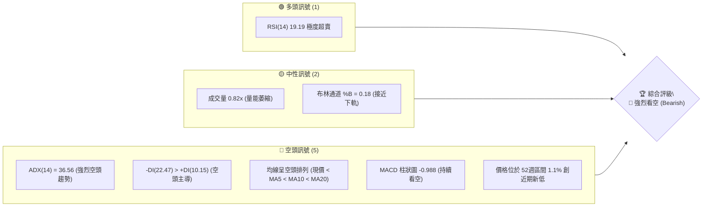
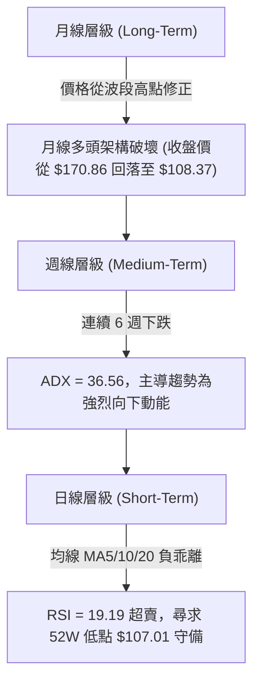
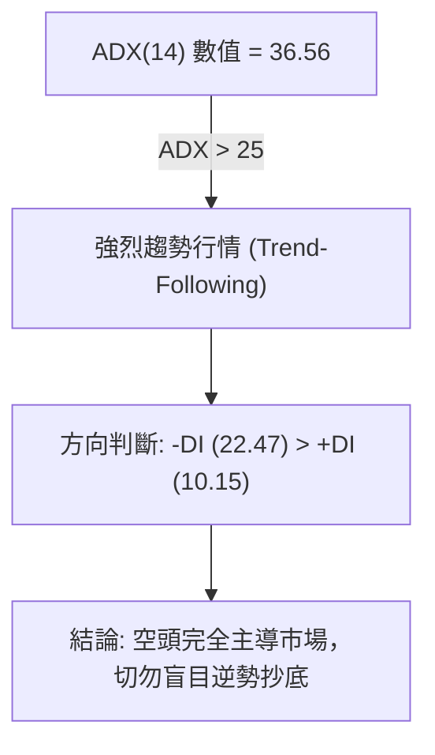
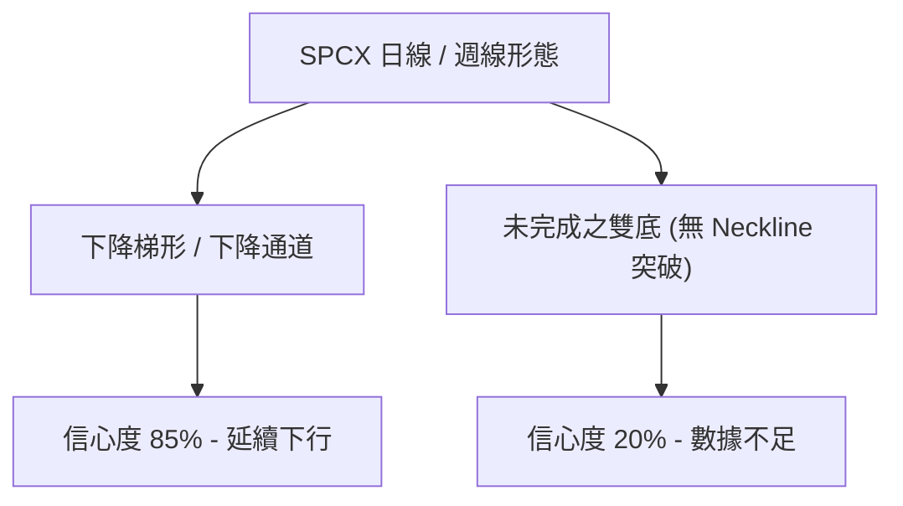
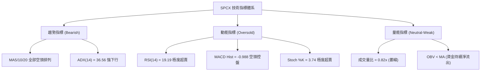
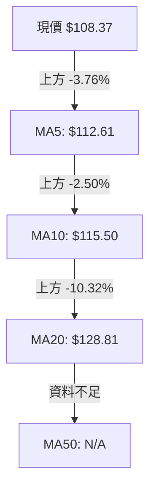
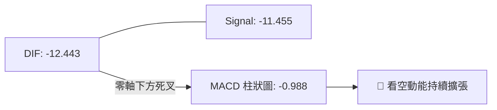
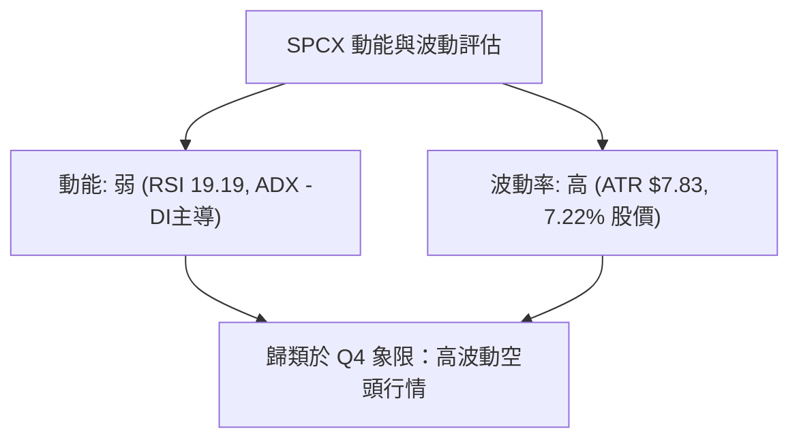
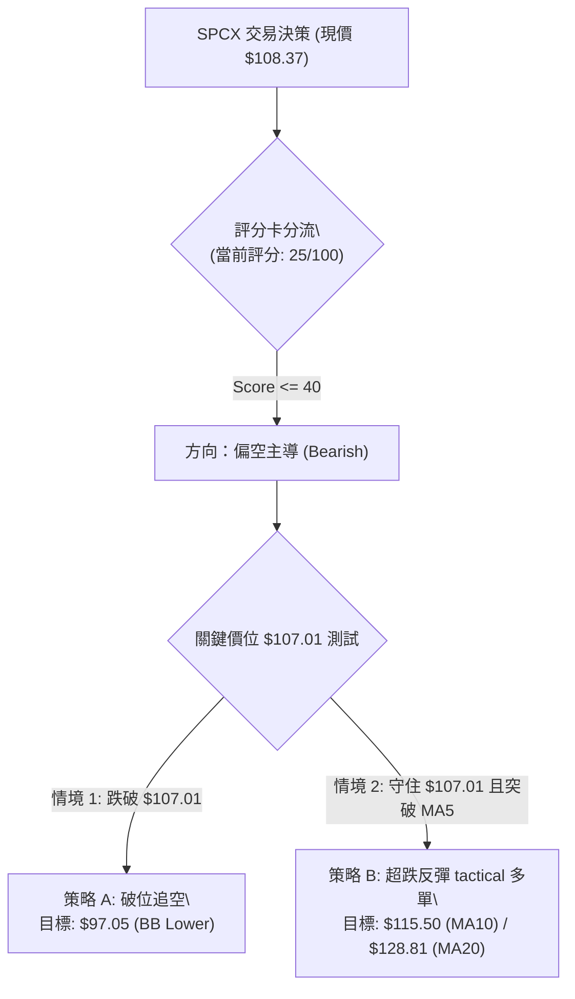
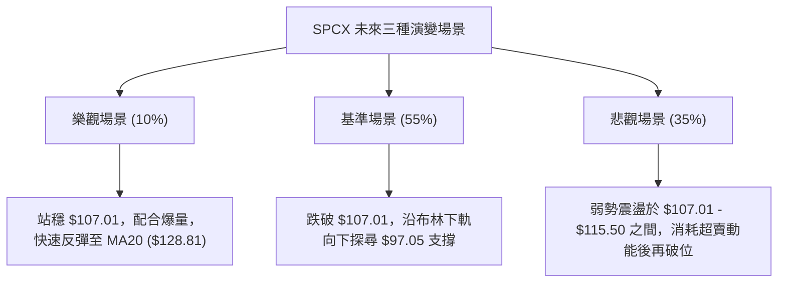

# SPCX 技術分析報告

> **報告日期**：2026-08-01 ｜ **語言**：繁體中文 ｜ **數據來源**：Yahoo Finance ｜ **當前價格**：$108.37

---

## 目錄

| 章節 | 內容 |
|------|------|
| [1. 技術面概覽](#1-技術面概覽) | 訊號儀表板、核心指標、評分卡 |
| [2. 趨勢分析](#2-趨勢分析) | 多時框趨勢、長中短期走勢 |
| [3. 圖表形態分析](#3-圖表形態分析) | 形態識別、K線組合、目標價 |
| [4. 支撐與阻力](#4-支撐與阻力) | 關鍵價位、斐波那契回調 |
| [5. 技術指標深度解讀](#5-技術指標深度解讀) | MA/RSI/MACD/布林/成交量 |
| [6. 動能與波動率](#6-動能與波動率) | 動能評估、ATR、Beta |
| [7. 多時框架總結](#7-多時框架總結) | 時框架評分矩陣 |
| [8. 交易策略建議](#8-交易策略建議) | 多空策略、風險報酬比 |
| [9. 風險提示與監控](#9-風險提示與監控) | 監控指標、風險場景 |

---

## 1. 技術面概覽

### 🎯 技術訊號儀表板



### 📊 核心指標速覽表

| 指標類別 | 指標名稱 | 當前數值 | 訊號 | 解讀 |
|----------|----------|----------|------|------|
| **價格** | 當前價格 | $108.37 | 🔴 空頭 | 距離52週低點 $107.01僅1.1%，處於強烈下行通道 |
| **均線** | MA5 | $112.61 | 🔴 空頭 | 價格位於 MA5 下方 -3.76%，短線承壓 |
| **均線** | MA10 | $115.50 | 🔴 空頭 | 價格位於 MA10 下方 -6.17%，極短線動能走弱 |
| **均線** | MA20 | $128.81 | 🔴 空頭 | 價格位於 MA20 下方 -15.87%，月線乖離過大 |
| **動能** | RSI(14) | 19.19 | 🟢 超賣 | 進入嚴重超賣區 (<30)，具備技術性反彈需求 |
| **動能** | MACD | -12.443 | 🔴 空頭 | 位於零軸下方且 DIF 與 Signal 呈死叉擴張 |
| **動能** | Stoch %K | 3.74 | 🟢 超賣 | 隨機指標極度超賣 (%D: 10.05)，隨時可能觸發金叉 |
| **趨勢** | ADX(14) | 36.56 | 🔴 空頭 | 強趨勢 (>25)，且 -DI (22.47) 遠高於 +DI (10.15) |
| **波動** | ATR(14) | $7.83 | 🔴 高波動 | 佔股價 7.22%，日內與跨日價格波動極劇烈 |
| **通道** | BB 下軌 | $97.05 | 🟡 支撐 | 價格尚在下軌上方，下方最後動態通道支撐為 $97.05 |

### 🏆 技術評分卡

```
╔══════════════════════════════════════════════════════════════╗
║              技術評分卡 — SPCX (2026-08-01)                  ║
╠══════════════════════════════════════════════════════════════╣
║ 趨勢強度      ▓▓▓▓▓▓▓▓▓▓▓▓▓▓▓▓▓▓░░  90/100  🔴 (空頭強趨勢) ║
║ 動能指標      ▓▓▓▓░░░░░░░░░░░░░░░░  20/100  🔴 (極度疲弱)   ║
║ 支撐穩定度    ▓▓░░░░░░░░░░░░░░░░░░  10/100  🔴 (貼近歷史低點)║
║ 成交量配合    ▓▓▓▓▓▓░░░░░░░░░░░░░░  30/100  🟡 (無恐慌爆量) ║
║ 形態完整度    ▓▓▓▓▓▓▓▓░░░░░░░░░░░░  40/100  🔴 (下降梯形)   ║
║ 均線排列      ▓▓░░░░░░░░░░░░░░░░░░  10/100  🔴 (典型空頭)   ║
╠══════════════════════════════════════════════════════════════╣
║ 綜合多頭評分  ▓▓▓▓▓░░░░░░░░░░░░░░░  25/100  🔴 賣出 / 偏空   ║
╚══════════════════════════════════════════════════════════════╝
```

---

## 2. 趨勢分析

### 🌐 多時框趨勢分析



### 📈 長期趨勢 — 12個月走勢圖（Unicode）

```
SPCX 歷史走勢與近期週線架構（高點 $225.64 降至當前 $108.37）
價格軸 ($)
$225.64 ┤ ● (52W High)
$200.00 ┤   \
$185.00 ┤    \      ● (2026-06-21)
$170.86 ┤     ●───/   \
$150.00 ┤              \
$130.00 ┤               \   ● MA20 ($128.81)
$108.37 ┤────────────────\──● (現價 $108.37)
$107.01 ┤                   ● (52W Low)
        └──────────────────────────────────────────────
         06-14  06-21  06-28  07-05  07-12  07-19  07-26  08-02
```

**走勢特徵分析表格**：

| 時間區間 | 週收盤價 | 區間變動 | 走勢特徵與技術解讀 |
|----------|----------|----------|--------------------|
| **2026-06-14** | $160.95 | - | 波段築底後嘗試反彈，成交量 5.19 億股 |
| **2026-06-21** | $185.00 | +14.94% | 創波段反彈高點，成交量放大至 9.25 億股，MACD柱狀圖達 +3.658 |
| **2026-06-28** | $153.23 | -17.17% | 出現大陰線包覆，量能 5.90 億股，MACD 轉負 (-2.783) |
| **2026-07-05** | $162.00 | +5.72% | 死貓跳（Dead Cat Bounce），量能急凍至 3.34 億股，動能不足 |
| **2026-07-12** | $145.30 | -10.31% | 跌破前低，RSI 降至 29.1，開啟加速下行通道 |
| **2026-07-19** | $123.99 | -14.67% | 貫穿 MA20，成交量 3.18 億股 |
| **2026-07-26** | $115.07 | -7.19% | RSI 降至 15.9 極致超賣，跌勢未見止息 |
| **2026-08-02** | $108.37 | -5.82% | 逼近 52週低點 $107.01，MACD 柱狀圖維持 -0.988 |

### 📊 中期趨勢（週線分析）

中期走勢受制於強烈的下降通道，價格連跌 4 週，自 2026-06-21 高點 $185.00 回撤幅度達 41.42%。下方唯一具備歷史意義的波段支撐點僅剩 **52週低點 $107.01**。若 $107.01 宣告失守，下方動態軌道支撐為 **布林通道下軌 $97.05**。

### ⚡ 趨勢強度評估（ADX 解讀）



| ADX 數值區間 | 當前數值 | 趨勢狀態 | 交易策略導向 |
|--------------|----------|----------|--------------|
| 0 - 20 | - | 無明顯趨勢 / 盤整 | 區間高拋低吸 |
| 20 - 25 | - | 趨勢形成中 | 準備突破策略 |
| **25 - 50** | **36.56** | **強烈單邊趨勢** | **順勢操作（逢高順勢做空或等待強訊號反彈）** |
| 50 - 100 | - | 極端單邊趨勢 | 防範疲竭反轉 |

---

## 3. 圖表形態分析

### 🔍 形態識別系統



**形態信心度與目標價評估表**：

| 形態類別 | 信心度 | 判斷依據（引用數據） | 完成度 | 目標價（附計算式） |
|----------|--------|----------------------|--------|--------------------|
| **下降通道 (Descending Channel)** | **85%** | 價格沿 MA5/MA10 下挫，ADX=36.56，-DI 壓制 +DI | 90% | 下軌支撐 = 布林下軌 **$97.05** |
| **末端超跌收斂 (Oversold Wedge)** | **60%** | RSI=19.19 極度超賣，Stoch %K=3.74，成交量縮至 0.82x | 70% | 反彈目標 1 = MA10 **$115.50**<br>反彈目標 2 = MA20 **$128.81** |
| **雙重底 (Double Bottom)** | **15%** | 數據中未偵測到第二個腳高於前低，僅單邊探底 | 10% | **訊號不足，僅做指標型超賣解讀** |

### 🕯️ 重要K線形態分析

| 日期 / 月份 | 收盤價 | K線形態 | 解讀 | 訊號 |
|-------------|--------|---------|------|------|
| **2026-06** | $170.86 | 上影線長紅轉陰 | 高點遭遇強烈拋壓，多頭動能竭盡 | 🔴 空頭反轉 |
| **2026-07** | $108.37 | 大陰線向下貫穿 | 單月跌幅高達 36.58%，無有效下影線支撐 | 🔴 強勢空頭 |
| **近三日** | $108.37 | 貼底微幅震盪 | 實體縮小，成交量 58.4M 縮至 20日均量(71.1M) 之 0.82 倍 | 🟡 跌勢暫緩 |

### 📉 ASCII 走勢形態示意圖

```
下降通道與超賣反彈潛在路徑：
$160.57 ┤=========================== 布林上軌 R2
        │ \
$132.40 ┤  \  ● Fib 78.6%
$128.81 ┤   \───● MA20 / BB中軌 (第一強阻力)
$115.50 ┤    \────● MA10 (短線反彈壓力)
$108.37 ┤     \─────● (當前價格 $108.37)
$107.01 ┤──────\──────● (52週歷史低點 S1)
$97.05  ┤───────\───────● (布林下軌 S2)
```

### 🎯 形態目標價計算

若股價破位跌破 52週低點 **$107.01**，基於布林通道寬度與 ATR 波動推算下行空間：
- **第一下行目標價** = 布林通道下軌 = **$97.05**
- **第二下行目標價** = 分析師給予之最低目標價 = **$62.00**

若觸發極致超跌反彈（Mean Reversion）：
- **反彈第一目標價 (T1)** = MA10 均線位置 = **$115.50**（預計漲幅 +6.58%）
- **反彈第二目標價 (T2)** = MA20 均線位置 = **$128.81**（預計漲幅 +18.86%）

---

## 4. 支撐與阻力

### 🗺️ 關鍵價位分布圖（Unicode）

```
SPCX 價位結構分布圖 (由歷史 OHLCV 與指標精確計算)
════════════════════════════════════════════════════════════
$225.64 ║██████████████████████████████████████║ 52W High / Fib 0.0%
$197.64 ║████████████████████████            ║ Fib 23.6%
$180.32 ║████████████████                    ║ Fib 38.2%
$172.40 ║████████████████████████████████████║ 波段高點聚類阻力 R1
$166.33 ║████████████                        ║ Fib 50.0%
$160.57 ║██████████                          ║ 布林通道上軌
$152.33 ║████████                            ║ Fib 61.8%
$132.40 ║██████                              ║ Fib 78.6%
$128.81 ║████████████████                    ║ MA20 / 布林中軌
$115.50 ║████                                ║ MA10 阻力
$112.61 ║██                                  ║ MA5 極短線阻力
$108.37 ╠════════════════════════════════════╣ ◄ 當前價格 $108.37
$107.01 ║▓▓▓▓▓▓▓▓▓▓▓▓▓▓▓▓▓▓▓▓▓▓▓▓▓▓▓▓▓▓▓▓▓▓▓▓║ 關鍵歷史低點支撐 S1 (52W Low)
$97.05  ║▓▓▓▓▓▓▓▓▓▓▓▓▓▓                      ║ 動態通道支撐 S2 (BB Lower)
$62.00  ║▓▓▓▓▓▓                              ║ 分析師最低目標價 S3
════════════════════════════════════════════════════════════
```

### 🚧 阻力位分析表

| 阻力級別 | 價位 | 形成原因 | 突破難度 | 重要性 |
|----------|------|----------|----------|--------|
| **阻力 R0** | **$115.50** | 10日移動平均線 (MA10) | 🟡 中等 | 極短線反彈首要關卡 |
| **阻力 R1** | **$128.81** | 20日移動平均線 (MA20) 與布林中軌重合 | 🔴 極高 | 月線扣抵高價，短期空頭防線 |
| **阻力 R2** | **$132.40** | 斐波那契 78.6% 回調位 | 🔴 極高 | 中期趨勢多空分水嶺 |
| **阻力 R3** | **$160.57** | 布林通道上軌 | 🔴 極高 | 波動率上限阻力 |
| **阻力 R4** | **$172.40** | 波段高點聚類阻力 (原數據 R1) | 🔴 鋼鐵級 | 近一年強阻力區，離現價 +59.08% |

### 🛡️ 支撐位分析表

| 支撐級別 | 價位 | 形成原因 | 守住機率 | 重要性 |
|----------|------|----------|----------|--------|
| **支撐 S1** | **$107.01** | 52週歷史低點 (Fib 100.0%) | 🟡 45% | 當前防線，僅距現價 1.25%，一旦跌破將引發止損賣壓 |
| **支撐 S2** | **$97.05** | 布林通道下軌 (BB Lower) | 🟢 65% | 超跌極限軌道，可望提供技術性支撐 |
| **支撐 S3** | **$62.00** | 法人分析師最低目標價 | 🔴 數據中未偵測到歷史K線，為法人基本面底線 | - |

### 📐 斐波那契回調位分析

基於 52週高點 **$225.64** 至 52週低點 **$107.01** 之波段繪製：

```
0.0%  (52W High) --------------------------------- $225.64
23.6% 回調位     --------------------------------- $197.64
38.2% 回調位     --------------------------------- $180.32
50.0% 回調位     --------------------------------- $166.33
61.8% 黄金切割位 --------------------------------- $152.33
78.6% 回調位     --------------------------------- $132.40
100.0% (52W Low) --------------------------------- $107.01
▲ 當前價格 $108.37 落於 78.6% ($132.40) 與 100.0% ($107.01) 之間的極端底部區域。
```

**解讀**：價格已跌破黃金切割位 61.8% ($152.33) 及 78.6% ($132.40)，代表此波段修正已非一般技術性回檔，而是完整的下行趨勢。當前價格 $108.37 緊貼 100.0% 回調位 ($107.01)，顯示多頭已退無可退。

---

## 5. 技術指標深度解讀

### 🎛️ 指標訊號總覽



### 📈 移動平均線排列分析



**分析**：短中期均線呈標準空頭排列 (Price < MA5 < MA10 < MA20)。價格與 MA20 負乖離達 **-15.87%**，顯示短線乖離過大，技術上隨時可能出現向 MA10 或 MA20 靠攏之乖離修正反彈。

### 📉 RSI(14) 分析

- **當前 RSI 數值**：**19.19**
- **RSI 強度條**：█▓░░░░░░░░ 19.19% (極度超賣)
- **背離判斷**：數據顯示 RSI 為 19.19，前一週為 15.9，價格持續創低（$115.07 降至 $108.37），RSI 呈微幅微幅抬升，**存在微弱的潛在底背離雛形（Potential Bullish Divergence）**，但尚未獲得價格突破 MA5 ($112.61) 之確認。

### 📊 MACD(12/26/9) 訊號解讀



**分析**：MACD 線 (-12.443) 位於訊號線 (-11.455) 下方，柱狀圖為 -0.988。雖然負值較前幾週（-3.362、-2.684）有所縮窄，顯示下跌動能斜率趨緩，但尚未形成金叉，多頭反攻時機未定。

### 📦 布林通道分析

```
布林通道現狀 (20日 SMA，2標準差)
═══════════════════════════════════════════════════════════
$160.57 ┤---------------------------------- BB Upper (上軌)
        │
$128.81 ┤---------------------------------- BB Middle (MA20)
        │
$108.37 ┤ ◄ 現價 ($108.37, %B = 0.18)
$97.05  ┤---------------------------------- BB Lower (下軌)
═══════════════════════════════════════════════════════════
```

**分析**：%B 指標為 **0.18**，表明價格位於通道下半區（靠近下軌）。通道中軌為 $128.81，下軌為 $97.05。價格沿著下軌尋求支撐，並未張口暴跌，屬震盪下行格局。

### 💹 成交量分析（量價配合度）

- **最新日成交量**：58,433,600 股
- **20日均量**：71,099,530 股
- **量比 (Volume Ratio)**：0.82x
- **OBV 趨勢**：OBV < MA（量能低於均線）
- **量價解讀**：價格逼近歷史低點 $107.01，但成交量並未放大（僅 0.82x），說明**市場並未出現恐慌性拋售（Panic Selling）**，但也反映出**買盤承接意願極度低落**，屬於典型的「無量陰跌」狀態。

---

## 6. 動能與波動率

### ⚡ 動能評估四象限

| 象限 | 動能強度 | 波動率狀態 | 當前 SPCX 位置 | 策略意義 |
|------|----------|------------|----------------|----------|
| **Q1** | 強 (High) | 低 (Low) | - | 穩健主升段 / 最佳買點 |
| **Q2** | 弱 (Low) | 低 (Low) | - | 沉悶盤整期 |
| **Q3** | 強 (High) | 高 (High) | - | 高風險爆發行情 |
| **Q4** | **弱 (Low)** | **高 (High)** | **✓ (當前位置)** | **高風險下跌行情，操作需極度謹慎** |



### 📊 ATR 波動率分析

- **ATR(14)**：**$7.83**
- **波動率佔比**：**7.22%**
- **止損距離建議**：
  - 緊密止損 (1.0x ATR)：**$7.83**
  - 標準止損 (1.5x ATR)：**$11.75**
  - 寬鬆止損 (2.0x ATR)：**$15.66**

### 📐 Beta 與市場相關性

- **Beta**：N/A（資料庫暫無統計）
- **機構持股**：1.5%（極低）
- **內部人持股**：18.7%
- **賣空比例 (Short % Float)**：2.7% (Short Ratio 1.34)
- **解讀**：散戶與內部人持有絕大多數籌碼，機構參與度低，導致流動性與價格容易受到單一事件激化，呈現高 ATR 波動。

---

## 7. 多時框架總結

### 📋 時框架評分表

| 時框架 | 趨勢方向 | 動能指標 | 均線排列 | 形態結構 | 綜合評分 | 建議 |
|--------|----------|----------|----------|----------|----------|------|
| **月線 (Long)** | 🔴 看空 | 🔴 弱動能 | 🔴 空頭破位 | 📉 頂部反轉 | **20/100** | 離場 / 觀望 |
| **週線 (Medium)**| 🔴 強空 | 🔴 MACD擴張 | 🔴 均線反壓 | 📉 下降通道 | **25/100** | 逢高順勢做空 |
| **日線 (Short)** | 🟡 觀望 | 🟢 極超賣 | 🔴 空頭排列 | 📊 探底 52W Low | **35/100** | 博弈極短線反彈 / 嚴設止損 |

### 🔲 綜合訊號矩陣

```
                     日線 (Short-Term)
                 超賣 (RSI<20)   中性   超買
               ┌──────────────┬──────┬──────┐
   週線 (Med)  │              │      │      │
     看多      │      —       │  —   │  —   │
               ├──────────────┼──────┼──────┤
     看空      │  ★ 當前位置  │  —   │  —   │
               │ (空頭+日超賣)│      │      │
               └──────────────┴──────┴──────┘
```

### ⚖️ 多時框收斂結論

依「多時框收斂規則」：
1. **行情定性**：ADX(14) = 36.56 > 25，當前屬**強烈單邊趨勢行情**（非盤整行情）。
2. **主導時框**：以中長期（週線/MA20）為核心依據。週線連續 6 週下跌，-DI 壓制 +DI，整體主導方向為**空頭**。
3. **日線角色**：日線 RSI(14) = 19.19 與 Stoch %K = 3.74 僅代表短線技術面極度超賣，**不能作為趨勢反轉之依據，僅能視為超跌技術反彈（Mean Reversion Opportunity）**。
4. **收斂方向**：**偏空主導，短線防禦性博弈反彈**。整體評分為 25/100（偏空）。第 8 章交易策略將以**「順勢逢高做空 / 破位追空」為主策略**，並提供**極窄止損之超跌反彈短多策略**為輔。

---

## 8. 交易策略建議

### 🗺️ 策略決策流程圖



### 🧭 策略路由

> **當前主策略方向 = 偏空主導 / 逢高做空或破位追空（綜合評分 25/100）**

因評分 <= 40，主推**空頭策略**與**破位追空**；多頭操作僅限於「極窄止損之超跌反彈短線博弈」。

### 🎯 價格情境階梯 (Price Scenarios)

| 觸發條件 | 第一目標 | 第二目標 | 情境含義與技術解讀 |
|----------|----------|----------|--------------------|
| **跌破 S1 $107.01** | **$97.05** (BB下軌) | **$62.00** (分析師低點) | 突破 52週低點，開啟新一波無底探針跌勢 |
| **反彈突破 MA5 $112.61** | **$115.50** (MA10) | **$128.81** (MA20) | 觸發 RSI 超賣修復，向月線乖離均值回歸 |
| **強勢突破 MA20 $128.81**| **$132.40** (Fib 78.6%) | **$160.57** (BB上軌) | 中期空頭架構緩解，趨勢轉為寬幅震盪 |

### 📊 情境機率分佈

| 情境 | 機率 | 主要依據 |
|------|------|----------|
| **跌破 $107.01 續跌** | **55%** | ADX = 36.56 (強趨勢), -DI = 22.47, 均線空頭排列 |
| **超跌反彈修復 (彈至 MA10/MA20)** | **35%** | RSI = 19.19 (極度超賣), Stoch %K = 3.74, MA20 負乖離 -15.87% |
| **直接強勢反轉突破 $132.40** | **10%** | 成交量僅 0.82x 無買盤配合，OBV 疲弱 |

### 🟢 主策略詳情

#### 策略 A：破位追空 / 逢高做空（主策略 — 順應 ADX 強趨勢）

| 策略要素 | 方案 A1 (破位追空) | 方案 A2 (反彈逢高做空) |
|----------|--------------------|------------------------|
| **進場條件** | 日線收盤價跌破 52W Low **$107.01** | 價格反彈至 MA10 **$115.50** 附近受阻 |
| **進場價格** | **$106.50** | **$115.00** |
| **目標價 T1** | **$97.05** (布林通道下軌, +8.87%) | **$107.01** (前低, +6.95%) |
| **目標價 T2** | **$62.00** (法人最低目標價) | **$97.05** (布林下軌, +15.61%) |
| **止損價格** | **$112.61** (MA5 位置, 風險 5.74%) | **$120.00** (前波小高點, 風險 4.35%) |
| **風險報酬比** | **1 : 1.55 (T1) / 1 : 7.75 (T2)** | **1 : 1.60 (T1) / 1 : 3.59 (T2)** |
| **成功機率** | **55%** | **60%** |
| **建議倉位** | **15% - 20%** | **15% - 20%** |

#### 策略 B：超跌反彈短多（輔助策略 — 僅限高風險偏好者）

| 策略要素 | 方案 B1 (52W Low 守備搶反彈) |
|----------|------------------------------|
| **進場條件** | 價格在 **$107.01 - $108.37** 獲得支撐且日線收紅包覆 |
| **進場價格** | **$108.37** (當前價格) |
| **目標價 T1** | **$115.50** (MA10 阻力, +6.58%) |
| **目標價 T2** | **$128.81** (MA20 / 布林中軌, +18.86%) |
| **止損價格** | **$105.50** (跌破 52W Low 1.4%，嚴格止損, 風險 2.65%) |
| **風險報酬比** | **1 : 2.48 (T1) / 1 : 7.12 (T2)** |
| **成功機率** | **35%** |
| **建議倉位** | **5% - 10% (輕倉試探)** |

### 🔴 反向風險觸發點（對沖提示）

若價格強勢向上突破 **$128.81 (MA20)** 且日成交量放大至 **100,000,000 股以上 (1.4x 均量)**，表明空頭陷阱成立，所有空頭頭寸必須立即平倉止損，並轉為中性觀望。

### ⭐ 整體訊號強度評星

```
做多訊號強度：★★☆☆☆  (2/5星 - 僅憑極度超賣)
做空訊號強度：★★██☆  (4/5星 - 強趨勢空頭控盤)
整體可信度：  ★★██☆  (4/5星 - 多指標高度確認)
```

---

## 9. 風險提示與監控

### ✅ 關鍵監控指標 Checklist

```
╔══════════════════════════════════════════════════════════════╗
║                SPCX 每日技術面監控 Check List                 ║
╠══════════════════════════════════════════════════════════════╣
║ [ ] 52週低點 $107.01 是否收盤跌破？ (若跌破觸發追空/多頭止損)║
║ [ ] RSI(14) 是否站回 30 以上？ (若站回確認超跌反彈啟動)      ║
║ [ ] 日成交量是否突破 71.1M (20日均量)？ (確認是否有資金介入) ║
║ [ ] MACD 柱狀圖是否由負轉正 (>-0.988 走向 0)？                ║
║ [ ] 價格是否突破 MA5 ($112.61) 與 MA10 ($115.50) 反壓？      ║
╚══════════════════════════════════════════════════════════════╝
```

### ⚠️ 風險場景分析



### 🛡️ 風險管理重要提醒

1. **極高 ATR 波動風險**：當前 ATR 達 **$7.83 (7.22%)**，意味著單日股價波動區間可輕易達到 $7 - $10。槓桿交易或期權操作極易被掃止損，必須適度放大止損寬度或降低倉位。
2. **無歷史支撐區間風險**：現價 $108.37 距離 52週低點 $107.01 僅一步之遙。若跌破 $107.01，下方缺乏近一年的密集中樞支撐，易引發程式化賣單連鎖觸發。
3. **財報與基本面風險**：營運利潤率為 -41.6%，EPS(TTM) 為 $-0.65，基本面虧損壓力也是造成技術面持續走弱之主因，切勿單純因「跌深」而重倉抄底。

---

## 📋 報告總結

```
╔══════════════════════════════════════════════════════════════╗
║                 SPCX 技術分析報告總結                         ║
════════════════════════════════════════════════════════════════
報告日期：2026-08-01
當前價格：$108.37
分析評級：🔴 強烈看空 / 逢高順勢做空 (Bearish)
綜合評分：25 / 100

關鍵結論：
├─ 長期趨勢：🔴 看空 (自波段高點修正 51.97%，創近期新低)
├─ 中期趨勢：🔴 看空 (週線 ADX = 36.56，強下行趨勢)
├─ 短期趨勢：🟢 極度超賣 (RSI = 19.19，具乖離修復需求)
├─ 關鍵支撐：S1: $107.01 (52W Low) │ S2: $97.05 (BB Lower)
├─ 關鍵阻力：R1: $115.50 (MA10)   │ R2: $128.81 (MA20)
└─ 分析師目標：均值 $236.71 (最低 $62.00 / 最高 $800.00)

最優策略組合：
1. 🥇 主推策略：破位追空 (跌破 $107.01 入場，目標 $97.05，止損 $112.61)
2. 🥈 次選策略：反彈做空 (反彈至 $115.50 受阻入場，目標 $107.01，止損 $120.00)
3. 🥉 戰術策略：極窄止損搶反彈 ($108.37 進場，目標 $115.50，嚴設止損 $105.50)
════════════════════════════════════════════════════════════════
```

---

> ⚠️ **免責聲明**：本報告為 AI 自動生成之技術分析，所有數據及估算均基於提供的歷史價格資訊。本報告**僅供研究與學術參考**，**不構成任何投資建議**。投資有風險，入市需謹慎。

---

*報告生成時間：2026-08-01 ｜ 數據來源：Yahoo Finance ｜ 分析框架：多時框技術分析*