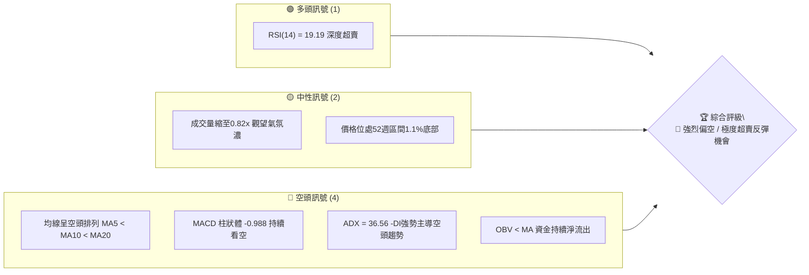
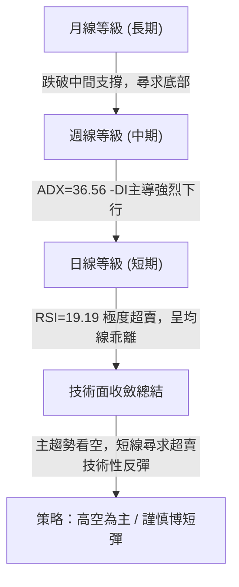
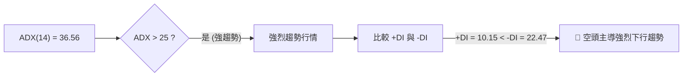
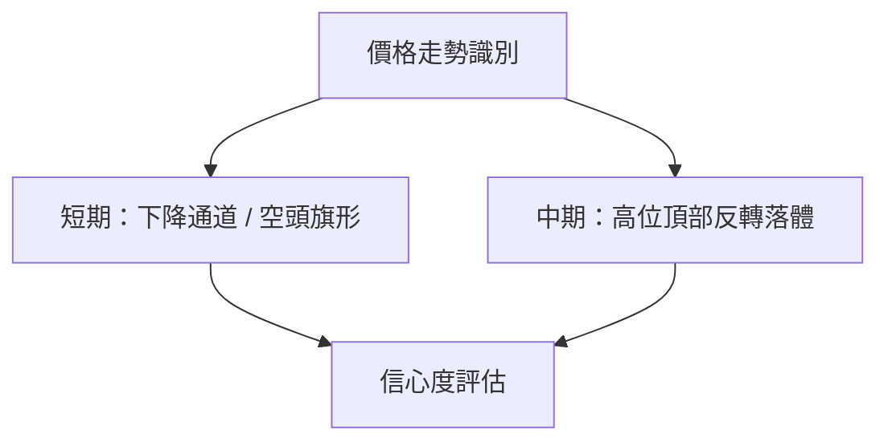
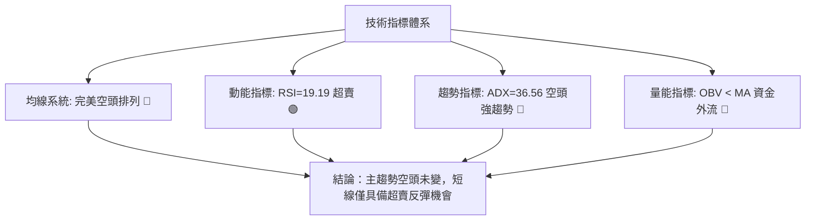
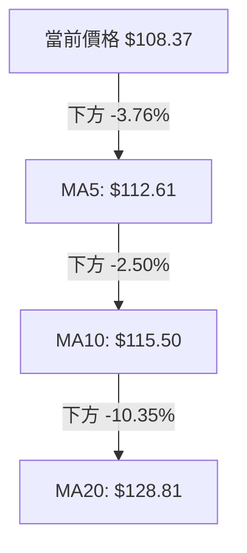
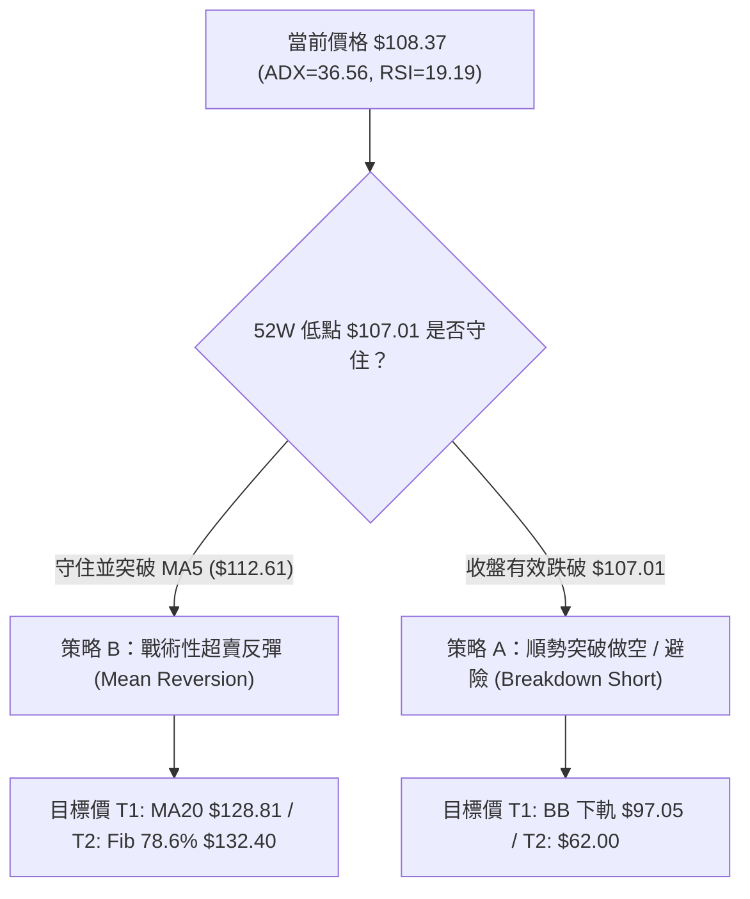
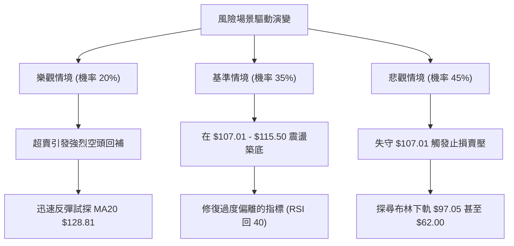

# SPCX 技術分析報告

> **報告日期**：2026-08-02 ｜ **語言**：繁體中文 ｜ **數據來源**：Yahoo Finance ｜ **當前價格**：$108.37

---

## 目錄

| 章節 | 內容 |
|------|------|
| [1. 技術面概覽](#1-技術面概覽) | 訊號儀表板、核心指標、評分卡 |
| [2. 趨勢分析](#2-趨勢分析) | 多時框趨勢、長中短期走勢 |
| [3. 圖表形態分析](#3-圖表形態分析) | 形態識別、K線組合、目標價 |
| [4. 支撐與阻力](#4-支撐與阻力) | 關鍵價位、斐波那契回調 |
| [5. 技術指標深度解讀](#5-技術指標深度解讀) | MA/RSI/MACD/布林/成交量 |
| [6. 動能與波動率](#6-動能與波動率) | 動能評估、ATR、Beta |
| [7. 多時框架總結](#7-多時框架總結) | 時框架評分矩陣 |
| [8. 交易策略建議](#8-交易策略建議) | 多空策略、風險報酬比 |
| [9. 風險提示與監控](#9-風險提示與監控) | 監控指標、風險場景 |

---

## 1. 技術面概覽

### 🎯 技術訊號儀表板



### 📊 核心指標速覽表

| 指標類別 | 指標名稱 | 當前數值 | 訊號 | 解讀 |
|----------|----------|----------|------|------|
| **價格** | 當前價格 | $108.37 | 🔴 | 位於52週高低區間之 1.1% 歷史底部區域 |
| **均線** | MA5 | $112.61 | 🔴 | 短期均線壓制，偏離 -3.76% |
| **均線** | MA10 | $115.50 | 🔴 | 中短期均線壓制，偏離 -6.17% |
| **均線** | MA20 | $128.81 | 🔴 | 月線強阻力，偏離 -15.87% |
| **動能** | RSI(14) | 19.19 | 🟢 | 極度超賣 (< 30)，存在強烈均線回歸需求 |
| **動能** | MACD | -12.443 | 🔴 | DIF 與 DEA 雙雙下行，柱狀體 -0.988 擴大看空 |
| **趨勢** | ADX(14) | 36.56 | 🔴 | 強趨勢行情，+DI(10.15) < -DI(22.47) 空頭掌控 |
| **通道** | 布林通道 | %B = 0.18 | 🟡 | 逼近布林下軌 $97.05，下行空間受限但未收斂 |
| **波動** | ATR(14) | $7.83 | 🔴 | 每日波動占價格 7.22%，屬於極高波動狀態 |

### 🏆 技術評分卡

```
╔══════════════════════════════════════════════════════════════╗
║                技術評分卡 — SPCX (2026-08-02)                ║
╠══════════════════════════════════════════════════════════════╣
║ 趨勢強度 (ADX)    ██████████████░░░░░░  70/100  🔴 空頭強趨勢 ║
║ 動能指標 (RSI/MACD)████░░░░░░░░░░░░░░░░  20/100  🔴 動能極疲弱 ║
║ 支撐穩定度        ██████░░░░░░░░░░░░░░  30/100  🔴 逼近52W低點║
║ 成交量配合 (OBV)  ████████░░░░░░░░░░░░  40/100  🟡 縮量跌落   ║
║ 形態完整度        ██████░░░░░░░░░░░░░░  30/100  🔴 無底形確認 ║
║ 均線排列 (MA)     ██░░░░░░░░░░░░░░░░░░  10/100  🔴 完美空頭排列║
╠══════════════════════════════════════════════════════════════╣
║ 綜合技術評分      ██████░░░░░░░░░░░░░░  33/100  🔴 偏空觀望   ║
╚══════════════════════════════════════════════════════════════╝
```

---

## 2. 趨勢分析

### 🌐 多時框趨勢分析



### 📈 長期趨勢 — 12個月走勢圖（Unicode）

```
SPCX 月線走勢示意圖（2025-08 至 2026-08）
價格軸 ($)
$225.64 ┤                  ● (52W High $225.64)
$197.64 ┤             ●───╯
$180.32 ┤        ●───╯
$152.33 ┤   ●───╯           ● (2026-06 $170.86)
$128.81 ┤●─╯                 ╰───●
$107.01 ┤                         ╰───● (現在 $108.37 / 52W Low $107.01)
        └───────────────────────────────────────────
         M1   M2  M3  M4   M5  M6  M7  M8  M9  M10 M11 M12
```

**走勢特徵分析表格**：

| 時間區段 | 價格區間 | 變動幅度 | 成交量特徵 | 結構性意義 |
|----------|----------|----------|------------|------------|
| **2026-06 初** | $160.95 ──> $185.00 | +14.94% | 9.25億股 (巨量) | 多頭最後發力衝高，創下波段高點 |
| **2026-06 末** | $185.00 ──> $153.23 | -17.17% | 5.90億股 | 高位崩落，MACD 柱狀轉負 (-2.783) |
| **2026-07 初** | $162.00 ──> $145.30 | -10.31% | 4.27億股 | 反彈乏力，跌破 MA20 ($128.81 起跌點) |
| **2026-07 末** | $145.30 ──> $115.07 | -20.81% | 3.61億股 | 主跌段發動，RSI 降至 15.9 歷史低位 |
| **2026-08 初** | $115.07 ──> $108.37 | -5.82% | 3.14億股 | 量縮尋底，逼近 52 週低點 $107.01 |

### 📊 中期趨勢（週線分析）

中期走勢自 2026 年 6 月創下高點後，連續 6 週呈現無有效拉回的單邊下行結構：
- **上方重壓區**：第一阻力位於斐波那契 78.6% 回調位 **$132.40** 以及 MA20 **$128.81**。
- **下方關鍵防線**：52 週低點 **$107.01** 是目前最後的防禦據點。若收盤價有效跌破 $107.01，下方將面臨無近一年波段支撐的空頭自由落體區，需參考華爾街分析師最低目標價 **$62.00**。

### ⚡ 趨勢強度評估（ADX 解讀）



| ADX 區間 | 當前數值 | 趨勢狀態 | 交易對策 |
|----------|----------|----------|----------|
| 0 - 20 | — | 無趨勢 / 震盪 | 區間高拋低吸 |
| 20 - 25 | — | 趨勢萌芽 | 順勢建立初級頭寸 |
| **25 - 50** | **36.56** | **強趨勢行情** | **嚴格順勢操作（順空），切勿盲目抄底** |
| > 50 | — | 極端單邊行情 | 準備迎來均線回歸 / 反轉 |

---

## 3. 圖表形態分析

### 🔍 形態識別系統



**形態信心度評估表**：

| 形態 | 信心度 | 判斷依據（引用數據） | 完成度 | 目標價（附計算式） |
|------|--------|----------------------|--------|--------------------|
| **下降通道** | 85% | 價格順沿 MA5/MA10 下滑，高低點持續降低 | 90% | 通道下軌測算：布林下軌 $97.05 |
| **52W低點測驗**| 90% | 現價 $108.37 距離 52W Low $107.01 僅 1.1% | 95% | 支撐攻防 $107.01 |
| **頭肩頂/雙頂**| 30% | 數據不足，缺乏歷史左肩數據 | 20% | *訊號不足，僅做指標型解讀* |

### 🕯️ 重要K線形態分析

| 日期 | 收盤價 | K線形態 | 解讀 | 訊號 |
|------|--------|---------|------|------|
| **2026-07-12** | $145.30 | 大陰線跌破 | 賣壓全面湧現，失守 Fib 61.8% ($152.33) | 🔴 賣出 |
| **2026-07-19** | $123.99 | 長下影中陰 | 嘗試在 MA20 ($128.81) 下方止跌無果 | 🔴 續看空 |
| **2026-07-26** | $115.07 | 貫穿大陰線 | RSI 掉入 15.9 極端超賣區，空頭主導 | 🔴 極度弱勢 |
| **2026-08-02** | $108.37 | 縮量小陰線 | 逼近 52W 低點 $107.01，跌勢暫緩但無反彈 signal | 🟡 觀望/尋底 |

### 📉 ASCII 走勢形態示意圖

```
SPCX 當前下降通道與關鍵價位示意圖
$172.40 ┤══════════════════════════════════════════ [R1 波段高點]
        │ ╲
$152.33 ┤───╲────────────────────────────────────── [Fib 61.8%]
        │    ╲
$128.81 ┤═════╲════════════════════════════════════ [MA20 月線阻力]
        │      ╲  
$108.37 ┤───────● (當前價格)
$107.01 ┤═════════●════════════════════════════════ [52W 低點強支撐]
        │          ╲
$97.05  ┤───────────┴────────────────────────────── [布林帶下軌]
```

### 🎯 形態目標價計算

1. **短線反彈目標價（均線回歸）**：
   - 計算式：以 MA20 ($128.81) 與 Fib 78.6% ($132.40) 之重疊交會區為目標。
   - 反彈目標 T1 = **$128.81**（MA20），反彈目標 T2 = **$132.40**（Fib 78.6%）。

2. **下行跌破破位目標價（跌破 $107.01 後）**：
   - 計算式：52W 低點 $107.01 - 1.0 × ATR ($7.83) = $99.18，近布林下軌 **$97.05**。
   - 極端下行目標 = 分析師最悲觀目標價 **$62.00**。

---

## 4. 支撐與阻力

### 🗺️ 關鍵價位分布圖（Unicode）

```
SPCX 價位結構分布圖 (2026-08-02)
══════════════════════════════════════════════════════════════════
$225.64 ║████████████████████████████████████████  52W High (Fib 0.0%)
$197.64 ║████████████████████████████            Fib 23.6%
$180.32 ║██████████████████████                  Fib 38.2%
$172.40 ║████████████████████                    主要波段阻力 R1
$166.33 ║█████████████████                       Fib 50.0% / 布林上軌 $160.57
$152.33 ║██████████████                          Fib 61.8%
$132.40 ║██████████                              Fib 78.6%
$128.81 ║█████████                               MA20 月線阻力
$115.50 ║█████                                   MA10 阻力
$112.61 ║████                                    MA5 阻力
$108.37 ╠═══════════════════════════════════════ ◄ 當前價格 $108.37
$107.01 ║▓▓▓▓▓▓▓▓▓▓▓▓▓▓▓▓▓▓▓▓▓▓▓▓▓▓▓▓▓▓▓▓▓▓▓▓▓▓▓ 52W Low 強支撐 S1
$97.05  ║██████████                              布林通道下軌 S2
$62.00  ║██                                      分析師最低目標價 S3
══════════════════════════════════════════════════════════════════
```

### 🚧 阻力位分析表

| 阻力級別 | 價位 | 形成原因 | 突破難度 | 重要性 |
|----------|------|----------|----------|--------|
| **R1** | **$112.61** | MA5 均線扣抵壓制 | 🟡 中等 | 短線反彈第一反壓 |
| **R2** | **$128.81** | MA20 月線 / 布林中軌 | 🔴 極高 | 多空分水嶺，蓋頂重壓 |
| **R3** | **$132.40** | 斐波那契 78.6% 回調位 | 🔴 極高 | 中期結構轉強前提 |
| **R4** | **$172.40** | 近一年波段高點聚類 (數據R1) | 🔴 牆壁級 | 長期多頭復甦終極阻力 |

### 🛡️ 支撐位分析表

| 支撐級別 | 價位 | 形成原因 | 守住機率 | 重要性 |
|----------|------|----------|----------|--------|
| **S1** | **$107.01** | 52 週最低價 (歷史波段底點) | 🟡 50% | 目前最後防線，失守將下尋無底區 |
| **S2** | **$97.05** | 日線布林通道下軌 | 🟢 70% | 戰術性超跌動能止縮點 |
| **S3** | **$62.00** | 分析師最低共識目標價 | 🟢 90% | 長期價值極限護城河 |

### 📐 斐波那契回調位分析

依據 52 週高低點（$225.64 ──> $107.01）繪製之斐波那契回調層級：

- **0.0% (高點)**: $225.64
- **23.6%**: $197.64
- **38.2%**: $180.32
- **50.0%**: $166.33
- **61.8%**: $152.33
- **78.6%**: $132.40
- **100.0% (低點)**: $107.01

**解讀**：當前價格 $108.37 位於 78.6% ($132.40) 至 100.0% ($107.01) 的**極端底部回撤區間**。價格已回吐過去一年全部漲幅的 98.8%。若 $107.01 守住，斐波那契 78.6% ($132.40) 將是反彈首要技術目標。

---

## 5. 技術指標深度解讀

### 🎛️ 指標訊號總覽



### 📈 移動平均線排列分析



- **均線排列狀態**：當前呈現標準的短中期**空頭排列**（價格 < MA5 < MA10 < MA20）。
- **乖離率分析**：價格距 MA20 乖離率達 **-15.87%**。歷史數據顯示當乖離率超過 -15% 時，短期容易出現均線修復（Mean Reversion）反彈行情。

### 📉 RSI(14) 分析

- **RSI 當前數值**：**19.19**
- **強度進度條**：`███░░░░░░░░░░░░░░░░░ 19.19%` (極度超賣)
- **背離判斷**：數據顯示「無明顯背離」。價格創新低，RSI 同步創新低，顯示下跌動能強烈且真實，**非**底背離反轉，僅為指標過度消耗過熱的超賣。

### 📊 MACD(12/26/9) 訊號解讀

- **DIF (MACD)**：-12.443
- **DEA (Signal)**：-11.455
- **MACD Hist**：-0.0988 🔴 看空
- **解讀**：MACD 線位於零軸下方極遠處，且雙線持續向下發散，柱狀圖持續為負，顯示空頭主導力道強勁，尚未出現金叉或柱狀體縮短之轉折訊號。

### 📦 布林通道分析

```
布林通道現狀示意圖
$160.57 ┤──────────────────────────────── Look Upper Band (上軌)
        │
$128.81 ┤──────────────────────────────── Middle Band (MA20 中軌)
        │
$108.37 ┤───────●                         現價 (BB %B = 0.18)
$97.05  ┤──────────────────────────────── Lower Band (下軌)
```

- **BB %B**：0.18（0 表示位於下軌，0.5 表示位於中軌）。
- **解讀**：價格貼近下軌運行，通道並未閉合，屬跌勢擴展階段（Band Walking Down）。

### 💹 成交量分析（量價配合度）

- **最新成交量**：58,433,600 股
- **20 日均量**：71,099,530 股（量比：0.82x）
- **OBV 趨勢**：OBV < MA → 量能疲弱
- **解讀**：價格下挫同時伴隨成交量縮減（0.82x），顯示市場追賣意願有所降低，但同時缺乏買盤進場承接，呈現「無量陰跌」特徵。

---

## 6. 動能與波動率

### ⚡ 動能評估四象限

| 象限 | 動能強度 | 波動率 | 當前狀態 | 評估與策略 |
|------|----------|--------|----------|------------|
| Q1 | 強 (多頭) | 低 | — | 穩定上升趨勢 |
| Q2 | 弱 (空頭) | 低 | — | 沉悶盤整區間 |
| Q3 | 強 (多頭) | 高 | — | 爆發性多頭 |
| **Q4** | **強 (空頭)** | **高** | **✓ SPCX 當前位置** | **高風險單邊主跌段，操作宜順勢避險或極輕倉博反彈** |

### 📊 ATR 波動率分析

- **ATR(14)**：**$7.83**
- **價格百分比**：7.22% of price
- **風控應用**：
  - **1.0x ATR 止損範圍**：$7.83
  - **1.5x ATR 止損範圍**：$11.75
  - **建議交易止損距離**：多頭博反彈止損點應設於 $107.01 扣除 0.5x ATR ($3.91) = **$103.10** 附近。

### 📐 Beta 與市場相關性

- ** Short Ratio**：1.34
- **Short % Float**：2.7%
- **解讀**：賣空比例偏低（2.7%），代表目前價格下跌主要源於現貨持股者拋售或機構買盤撤退，而非大量空頭開倉軋空所致，因此發生「軋空行情 (Short Squeeze)」的機率較低。

---

## 7. 多時框架總結

### 📋 時框架評分表

| 時框架 | 趨勢方向 | 動能 (RSI/MACD) | 均線排列 | 形態 | 綜合評分 | 建議 |
|--------|----------|-----------------|----------|------|----------|------|
| **月線** | 🔴 空頭 | 🔴 走弱 | 🔴 空頭 | 下降 | **30/100** | 避險/觀望 |
| **週線** | 🔴 強空 | 🔴 探底 | 🔴 空頭 | 跌破 | **25/100** | 嚴禁重倉抄底 |
| **日線** | 🔴 空頭 | 🟢 超賣(19.19) | 🔴 空頭 | 尋底 | **40/100** | 僅限超短線戰術反彈 |

### 🔲 綜合訊號矩陣

| 維度 | 短期 (日線) | 中期 (週線) | 長期 (月線) | 一致性評估 |
|------|-------------|-------------|-------------|------------|
| **方向** | 空頭 | 空頭 | 空頭 | 🟢 高度一致 (全面看空) |
| **動能** | 超賣反彈需求 | 空頭強勁 | 空頭延續 | 🟡 短中期存在動能背離需求 |
| **結構** | 逼近 52W 低點 | 跌破關鍵 Fib | 遠離高點 | 🟢 高度一致 (尋求防守區) |

### ⚖️ 多時框收斂結論

> **主導規則（ADX > 25）**：當前 ADX 為 36.56，確立為**強烈空頭趨勢行情**。依多時框收斂原則，以中長期（週線/MA20）空頭方向為主導。日線極端超賣（RSI 19.19）僅代表技術性反彈可能性，**不可做為大舉翻多依據**。
>
> **最終收斂結論**：**🔴 強烈偏空（主趨勢） / 🟡 短線具備戰術性超賣回歸需求**。
> 綜合評分：**33 / 100**，策略路由明確為：**以防守/逢高作空為主，戰術性超賣博彈為輔**。

---

## 8. 交易策略建議

### 🗺️ 策略決策流程圖



### 🧭 策略路由

**當前主策略方向 = 🔴 順勢偏空與避險為主（綜合評分 33/100）**

由於綜合評分小於 40分，主策略為空頭續跌/破位策略（策略 A），多頭僅作為高風險超賣反彈戰術（策略 B）。

### 🎯 價格情境階梯 (Price Scenarios)

| 觸發條件 | 下一目標 | 後續延伸 | 情境含義 |
|----------|----------|----------|----------|
| **突破 MA20 $128.81** | Fib 78.6% $132.40 | 波段高點 $172.40 | 中期結構扭轉/強勢反彈 |
| **站穩 $107.01 - $112.61** | MA20 $128.81 | — | 築底沉澱/超賣修復 |
| **跌破 52W Low $107.01** | 布林下軌 $97.05 | 分析師低點 $62.00 | 空頭主跌段延伸/尋底 |

### 📊 情境機率分佈

| 情境 | 機率 | 主要依據 |
|------|------|----------|
| **續跌/破位下尋 (跌破 $107.01)** | **45%** | ADX 36.56 空頭強趨勢，-DI 22.47 主導，均線完美空頭排列 |
| **區間超賣築底反彈** | **35%** | RSI 19.19 極度超賣，價格距 MA20 乖離 -15.87%，量縮跌勢放緩 |
| **直接強勢 V 型反轉** | **20%** | 華爾街共識目標價 $236.71，基本面潛在利多，但技術面無訊號 |

### 🟢 策略詳情

#### 策略 A：順勢破位做空 / 持股避險（主策略 🔴）

- **進場條件**：日線收盤價跌破 $107.01，或反彈受阻於 MA20 ($128.81) 出現看空K線。
- **進場價格**：$106.50（跌破確認進場）
- **目標價 T1**：**$97.05**（布林通道下軌）
- **目標價 T2**：**$62.00**（分析師共識最低目標價）
- **止損價格**：**$112.61**（MA5 均線阻力突破即止損）
- **風險報酬比**：
  - 至 T1：($106.50 - $97.05) / ($112.61 - $106.50) = $9.45 / $6.11 = **1.55 : 1**
  - 至 T2：($106.50 - $62.00) / ($112.61 - $106.50) = $44.50 / $6.11 = **7.28 : 1**
- **成功機率**：65%
- **建議倉位**：15% - 20%

#### 策略 B：戰術性極輕倉博超賣反彈（次要/高風險策略 🟡）

- **進場條件**：價格在 $107.01 附近出現止跌訊號，且突破 MA5 ($112.61)。
- **進場價格**：$113.00
- **目標價 T1**：**$128.81**（MA20 月線阻力）
- **目標價 T2**：**$132.40**（Fib 78.6% 回調位）
- **止損價格**：**$103.10**（52W 低點 $107.01 扣除 0.5x ATR）
- **風險報酬比**：
  - 至 T1：($128.81 - $113.00) / ($113.00 - $103.10) = $15.81 / $9.90 = **1.60 : 1**
  - 至 T2：($132.40 - $113.00) / ($113.00 - $103.10) = $19.40 / $9.90 = **1.96 : 1**
- **成功機率**：40%
- **建議倉位**：5% - 10%（嚴格控管倉位）

### 🔴 反向風險觸發點（對沖提示）

若 SPCX 放量突破 **$128.81** (MA20) 且 RSI 升破 50 中軸，代表空頭結構受到破壞，所有做空或避險頭寸應立即清場，轉為觀望。

### ⭐ 整體訊號強度評星

```
做多訊號強度：★★☆☆☆  (2/5星 — 僅靠 RSI 超賣支撐)
做空訊號強度：★★██☆  (4/5星 — 趨勢與均線完全偏空)
整體可信度：  ████☆  (4/5星 — 多時框指標高度收斂)
```

---

## 9. 風險提示與監控

### ✅ 關鍵監控指標 Checklist

```
╔══════════════════════════════════════════════════════════════╗
║                   每日關鍵技術監控 Checklist                  ║
╠══════════════════════════════════════════════════════════════╣
║ [ ] 價格是否收低於 $107.01 (52週最低價)                      ║
║ [ ] RSI(14) 是否站回 30 以上離開超賣區                      ║
║ [ ] MACD 柱狀體是否由 -0.988 開始縮短                        ║
║ [ ] 日成交量是否超越 20日均量 (71,099,530 股) 放大           ║
║ [ ] 價格是否挑戰 MA20 ($128.81) 月線反壓                     ║
╚══════════════════════════════════════════════════════════════╝
```

### ⚠️ 風險場景分析



### 🛡️ 風險管理重要提醒

1. **嚴禁盲目重倉抄底**：ADX 高達 36.56，代表空頭趨勢強勁。在強趨勢中，RSI 超賣（19.19）可以「鈍化」相當長時間，切勿以單一超賣指標進行高槓桿抄底。
2. **嚴格執行止損**：當前 ATR 高達 $7.83 (7.22%)，價格波動極劇烈。任何多頭嘗試必須設置明確止損（如 $103.10），一旦突破防線必須離場。
3. **留意機構動向**：機構持股僅 1.7%，散戶與內部人（18.7%）比重較高，易受市場情緒驅動產生極端下影線或無量陰跌。

---

## 📋 報告總結

```
╔══════════════════════════════════════════════════════════════════╗
║                     SPCX 技術分析報告總結                        ║
══════════════════════════════════════════════════════════════════
  報告日期：2026-08-02
  當前價格：$108.37
  綜合評估：🔴 偏空觀望 / 空頭主導 (技術評分: 33/100)

  關鍵結論：
  ├─ 長期趨勢：🔴 看空 (自 52W 高點 $225.64 回落至 1.1% 底部區)
  ├─ 中期趨勢：🔴 強烈看空 (ADX=36.56, -DI 強勢主導)
  ├─ 短期趨勢：🟢 戰術性超賣 (RSI=19.19，距 MA20 乖離 -15.87%)
  ├─ 關鍵支撐：$107.01 (52W Low), $97.05 (BB 下軌)
  ├─ 關鍵阻力：$112.61 (MA5), $128.81 (MA20), $132.40 (Fib 78.6%)
  └─ 分析師共識： Buy (均價目標 $236.71，最低 $62.00)

  最優策略組合：
  1. 🥇 主推策略：順勢跌破做空 / 避險（跌破 $107.01 進場，目標 $97.05 / $62.00）
  2. 🥈 次要策略：戰術超賣短彈（站穩 $113.00 進場，目標 $128.81，嚴設止損 $103.10）
  3. 🥉 保守選擇：完全空倉觀望，等待 $107.01 築底成功或突破 MA20 再行佈局
══════════════════════════════════════════════════════════════════
```

---

> ⚠️ **免責聲明**：本報告為 AI 自動生成之技術分析，所有數據及估算均基於提供的歷史價格資訊。本報告**僅供研究與學術參考**，**不構成任何投資建議**。投資有風險，入市需謹慎。

---

*報告生成時間：2026-08-02 ｜ 數據來源：Yahoo Finance ｜ 分析框架：多時框技術分析*