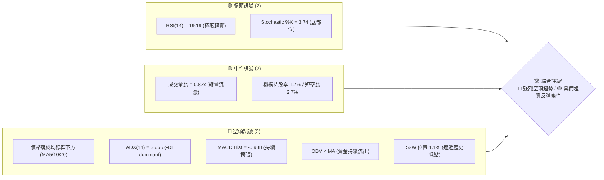
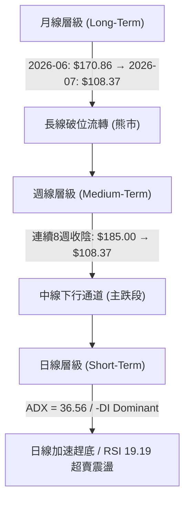
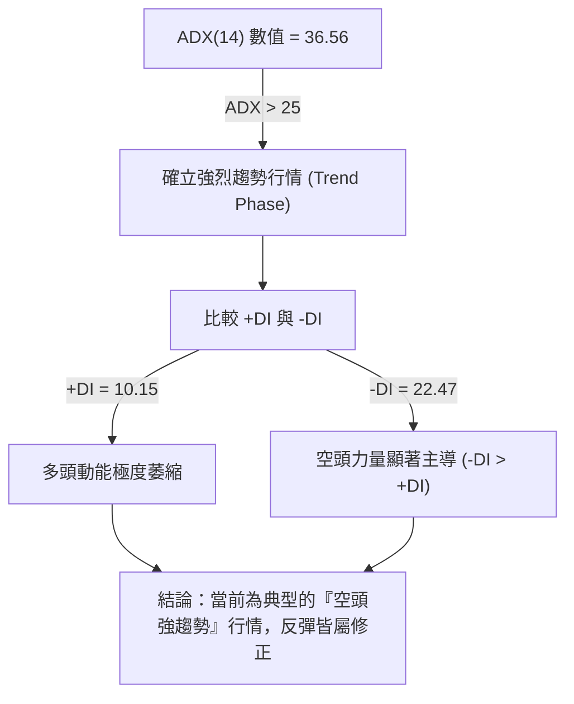
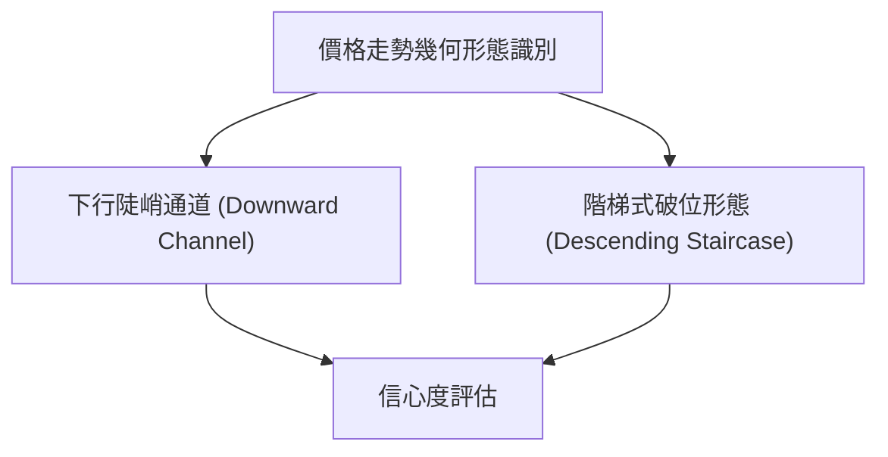
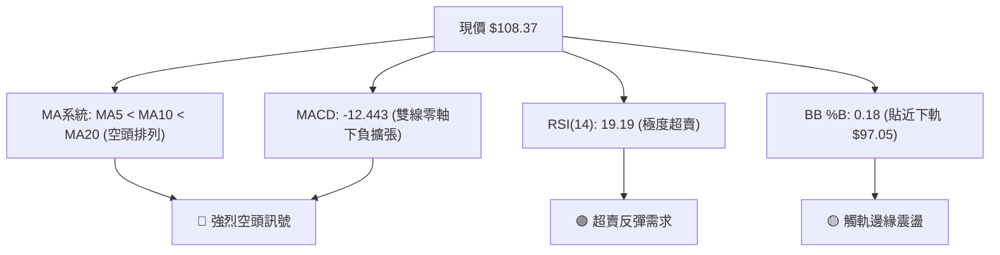
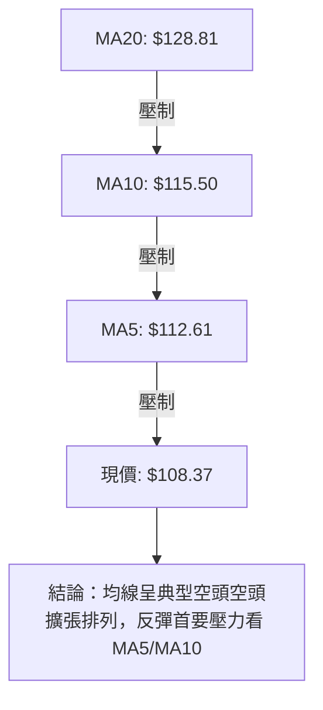
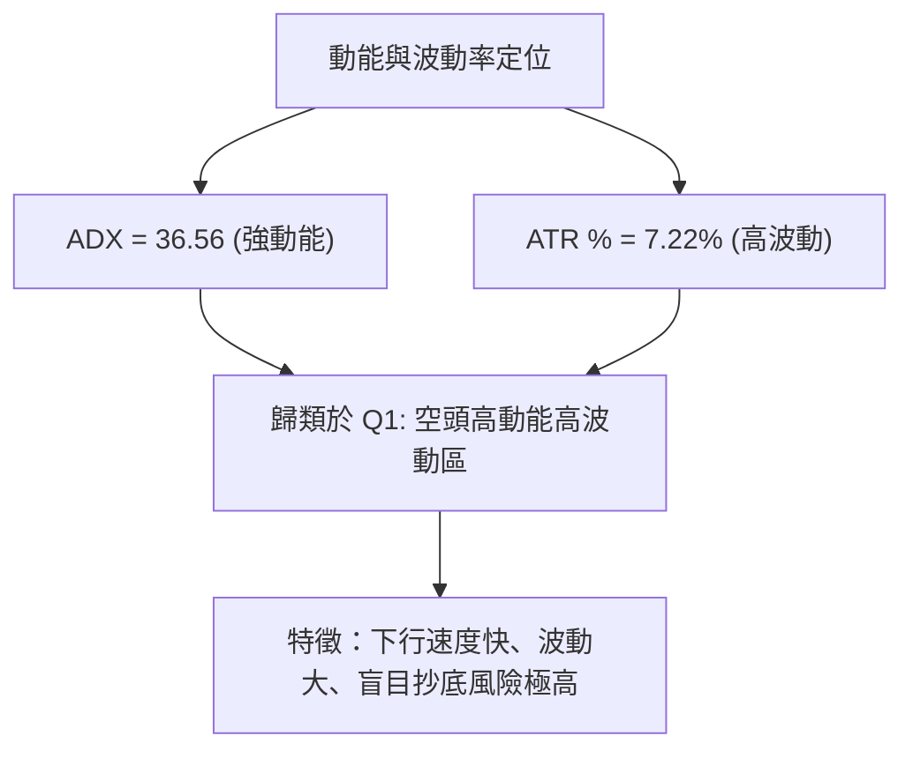
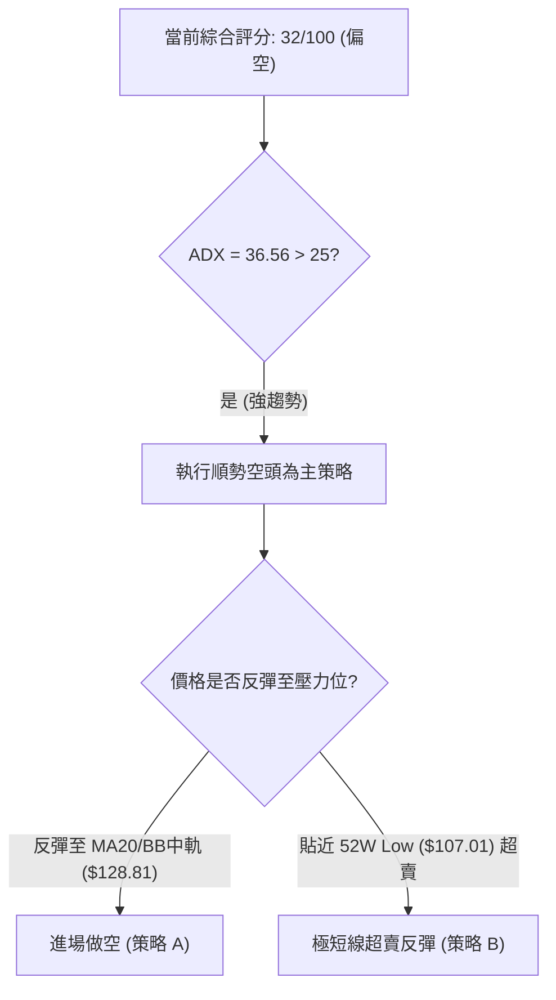
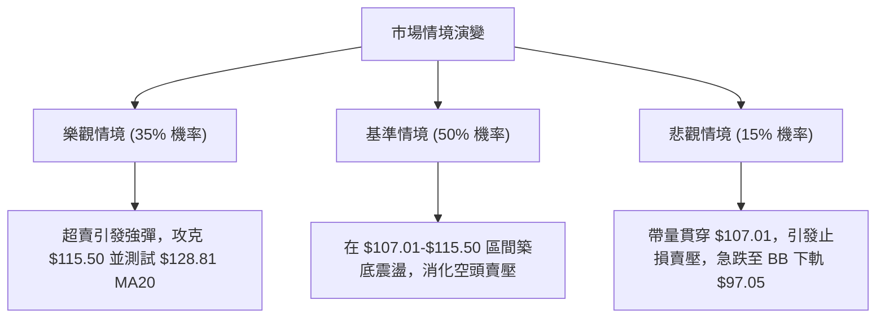

# SPCX 技術分析報告

> **報告日期**：2026-08-03 ｜ **語言**：繁體中文 ｜ **數據來源**：Yahoo Finance ｜ **當前價格**：$108.37

---

## 目錄

| 章節 | 內容 |
|------|------|
| [1. 技術面概覽](#1-技術面概覽) | 訊號儀表板、核心指標、評分卡 |
| [2. 趨勢分析](#2-趨勢分析) | 多時框趨勢、長中短期走勢 |
| [3. 圖表形態分析](#3-圖表形態分析) | 形態識別、K線組合、目標價 |
| [4. 支撐與阻力](#4-支撐與阻力) | 關鍵價位、斐波那契回調 |
| [5. 技術指標深度解讀](#5-技術指標深度解讀) | MA/RSI/MACD/布林/成交量 |
| [6. 動能與波動率](#6-動能與波動率) | 動能評估、ATR、Beta |
| [7. 多時框架總結](#7-多時框架總結) | 時框架評分矩陣 |
| [8. 交易策略建議](#8-交易策略建議) | 多空策略、風險報酬比 |
| [9. 風險提示與監控](#9-風險提示與監控) | 監控指標、風險場景 |

---

## 1. 技術面概覽

### 🎯 技術訊號儀表板



### 📊 核心指標速覽表

| 指標類別 | 指標名稱 | 當前數值 | 訊號 | 解讀 |
|----------|----------|----------|------|------|
| **價格** | 當前價格 | $108.37 | 🔴 空頭 | 距離 52 週低點 ($107.01) 僅 1.1%，貼近歷史底部震盪 |
| **均線** | MA5 | $112.61 | 🔴 空頭 | 價格在 MA5 下方 (-3.76%)，極短線呈加速下探態勢 |
| **均線** | MA10 | $115.50 | 🔴 空頭 | 價格在 MA10 下方 (-6.17%)，短線乖離持續擴大 |
| **均線** | MA20 | $128.81 | 🔴 空頭 | 價格在 MA20 下方 (-15.87%)，月線趨勢顯著偏空 |
| **均線** | MA50 / MA200 | N/A | 🟡 中性 | 數據不完整，改以週線波段高低點與布林通道錨定 |
| **動能** | RSI(14) | 19.19 | 🟢 超賣 | 極度超賣區（<20），短線存在技術性均值回歸拉升需求 |
| **動能** | MACD | -12.443 | 🔴 空頭 | DIF 與 Signal (-11.455) 負值擴大，MACD Hist -0.988 擴張 |
| **趨勢** | ADX(14) | 36.56 | 🔴 強空 | ADX > 25 且 -DI (22.47) 遠高於 +DI (10.15)，空頭強勢 |
| **波動** | ATR(14) | $7.83 | 🔴 高波動 | 日均波動幅度達 7.22%，下行加速度較高，風控宜放寬 |
| **量能** | OBV / 量比 | 0.82x | 🔴 空頭 | 20日均量 71.1M，最新量 58.4M，OBV 低於均線，資金流出 |

### 🏆 技術評分卡

```
技術評分卡 — SPCX (2026-08-03)
════════════════════════════════════════════════════
趨勢強度      ████████████████░░░░  80/100  🔴 空頭強勁 (ADX=36.56)
動能指標      ███░░░░░░░░░░░░░░░░░  15/100  🟢 深度超賣 (RSI=19.19)
支撐穩定度    ████░░░░░░░░░░░░░░░░  20/100  🔴 僅存 52W 低點 $107.01
成交量配合    ████████░░░░░░░░░░░░  40/100  🟡 縮量下跌，量能疲弱
形態完整度    ████████████░░░░░░░░  60/100  🔴 下行通道 / 階梯式破位
均線排列      ██░░░░░░░░░░░░░░░░░░  10/100  🔴 短中空頭排列 (MA5<10<20)
════════════════════════════════════════════════════
綜合評分      ██████░░░░░░░░░░░░░░  32/100  🔴 強烈偏空（反彈做空主導）
════════════════════════════════════════════════════
```

---

## 2. 趨勢分析

### 🌐 多時框趨勢分析



### 📈 長期趨勢 — 12個月走勢圖（Unicode）

根據提供之 24 個月歷史資料與近期 20 週數據，SPCX 在 2026 年 6 月觸及 $185.00 波段高點後，遭遇強烈拋售潮，於 2026 年 7 月直瀉至 $108.37，目前緊貼 52 週低點 $107.01。

```
SPCX 歷史價格走勢圖 ($)
價格軸 ($)
$225.64 ┤                    ● (52W High)
$197.64 ┤              ●─────┘
$180.32 ┤        ●─────┘     ● (2026-06 185.00)
$152.33 ┤  ●─────┘           └─────●
$132.40 ┤                          └─────● (2026-07-19 123.99)
$107.01 ┤●━━━━━━━━━━━━━━━━━━━━━━━━━━━━━━━● (2026-08-03 $108.37 現價)
        └───────────────────────────────────────────────
         M-12 M-10  M-8   M-6   M-4   M-2  現價
```

**走勢特徵分析表格**：

| 歷史階段 | 價格區間 | 漲跌幅 | 走勢特徵 | 關鍵技術事件 |
|----------|----------|--------|----------|--------------|
| **波段高點攻堅** | $160.95 → $185.00 | +14.94% | 週成交量爆出 9.25 億股，衝高回落 | 觸及高點 $185.00 後遇阻 |
| **中線急轉直下** | $185.00 → $145.30 | -21.46% | 跌破 61.8% 斐波那契位 ($152.33) | MACD 柱由正轉負 (-2.180) |
| **加速主跌段** | $145.30 → $115.07 | -20.81% | 連續三週帶量長陰，攻破 $132.40 | RSI 跌穿 30 進入超賣區 |
| **低位逼近底部** | $115.07 → $108.37 | -5.82% | 縮量試探 52W 低點 $107.01 | RSI 降至 19.19 極端超賣 |

### 📊 中期趨勢（週線分析）

```
週線壓力支撐架構圖
════════════════════════════════════════════════════════════════
$185.00 ┤ ═ ═ ═ ═ ═ ═ ═ ═ ═ ═ ═ ═ ═ ═ ═ ═ ═ ═ ═  (中期波段高點壓力)
$172.40 ┤ ------------------------------------- (關鍵阻力 R1)
$152.33 ┤ ------------------------------------- (斐波那契 61.8%)
$132.40 ┤ ------------------------------------- (斐波那契 78.6%)
$108.37 ┤ ◄─── 當前價格 ($108.37)
$107.01 ┤ ═════════════════════════════════════ (52週最低點強支撐)
════════════════════════════════════════════════════════════════
```

### ⚡ 趨勢強度評估（ADX 解讀）



**ADX 趨勢強度對照表**：

| 指標項 | 當前數值 | 臨界標準 | 趨勢判定 | 交易戰術指引 |
|--------|----------|----------|----------|--------------|
| **ADX(14)** | **36.56** | > 25.0 | 強趨勢行情 | 嚴禁盲目摸底，以順勢作空或等待結構突破為主 |
| **+DI(14)** | **10.15** | < 20.0 | 多頭極度弱勢 | 多頭買盤匱乏，無力發起持續性大級別反攻 |
| **-DI(14)** | **22.47** | > +DI | 空頭絕對主導 | 空頭掌控盤面，任何無量反彈均為逢高拋壓點 |

---

## 3. 圖表形態分析

### 🔍 形態識別系統



**形態信心度與目標價評估**：

| 形態類別 | 信心度 | 判斷依據（引用數據） | 完成度 | 目標價（附計算式） |
|----------|--------|----------------------|--------|--------------------|
| **下行陡峭通道** | **85%** | 自 2026-06 高點 $185.00 至 $108.37，高低點持續下移 | 90% | 通道下軌測算：$108.37 - ($128.81 - $108.37) = **$87.93** |
| **階梯式破位** | **75%** | 依序跌破 $152.33 (61.8%) 與 $132.40 (78.6%) 平台 | 95% | 跌破 $132.40 平台高度推算：$132.40 - ($162.00 - $132.40) = **$102.80** |
| **雙底 / 頭肩底** | **0%** | **訊號不足，僅做指標型解讀** | 0% | 無底部位確認，嚴禁捏造底部形態 |

### 🕯️ 重要 K 線形態分析

| 週次/日期 | 收盤價 | K 線形態 | 技術特徵與解讀 | 訊號 |
|-----------|--------|----------|----------------|------|
| **2026-06-21** | $185.00 | 長陽衝高流星線 | 週成交量暴增至 9.25 億股，高位爆量上影線，多頭耗盡 | 🔴 頂部轉折 |
| **2026-06-28** | $153.23 | 大陰吞噬 | 一舉吞噬前週多數漲幅，MACD柱轉負 (-2.783) | 🔴 賣出訊號 |
| **2026-07-12** | $145.30 | 中陰線破位 | 跌破 $152.33 (61.8% 斐波那契)，確認中期轉熊 | 🔴 跌破確認 |
| **2026-07-26** | $115.07 | 帶量長陰 | RSI 下穿 20 進入極端超賣，下探 $115 區域 | 🔴 下行加速 |
| **2026-08-02** | $108.37 | 低位小陰下影線 | 量能縮至 3.14 億股，接近 52W 低點 $107.01，呈築底試探 | 🟡 超賣沉澱 |

### 📉 ASCII 走勢形態示意圖

```
SPCX 階梯式破位與下行通道形態示意圖
═══════════════════════════════════════════════════════════════
$185.00 ┤  ┌───┐ (高點)
        ┤  │   └───┐ 
$152.33 ┤  │       ├───┐ (61.8% 回調位破位)
$132.40 ┤  │       │   └───┐ (78.6% 回調位破位)
        ┤  │       │       ├───┐
$108.37 ┤  │       │       │   └───● (現價 $108.37，直逼 52W Low)
$107.01 ┤═ ╧═ ═ ═ ═╧═ ═ ═ ═╧═ ═ ═ ═ ═ ═ ═══ (52W Low $107.01 防線)
═══════════════════════════════════════════════════════════════
```

### 🎯 形態目標價計算

1. **階梯破位等距測算**：
   - 破位前最後平台：$132.40（2026-07-19 週）
   - 上方反彈高點：$162.00（2026-07-05 週）
   - 形態高度：$162.00 - $132.40 = $29.60
   - 下行推算目標價：$132.40 - $29.60 = **$102.80**

2. **布林通道下軌動態支撐目標**：
   - 目前布林通道下軌位在 **$97.05**，為超賣延伸第一目標區。

---

## 4. 支撐與阻力

### 🗺️ 關鍵價位分布圖（Unicode）

```
SPCX 價位結構分布圖
════════════════════════════════════════════════════════════
$225.64 ║████████████████████████████████ (52W High / 0.0% Fib)
$197.64 ║██████████████████              (23.6% Fib)
$180.32 ║██████████████████████          (38.2% Fib)
$172.40 ║████████████████████████████    (強阻力 R1 - 波段高點聚類)
$166.33 ║████████████████                (50.0% Fib / 布林上軌 $160.57)
$152.33 ║████████████████████            (61.8% Fib)
$132.40 ║████████████████████████        (78.6% Fib)
$128.81 ║▓▓▓▓▓▓▓▓▓▓▓▓▓▓▓▓▓▓▓▓            (MA20 / 布林中軌)
$108.37 ╠════════════════════════════════  ◄ 現價 $108.37
$107.01 ║████████████████████████████████ (52W Low / 100% Fib 強支撐)
$97.05  ║▓▓▓▓▓▓▓▓▓▓▓▓▓▓                  (布林下軌動態支撐)
$62.00  ║████████                        (分析師最低目標價 Target Low)
════════════════════════════════════════════════════════════
```

### 🚧 阻力位分析表

| 阻力級別 | 價位 | 形成原因（嚴格引用數據） | 突破難度 | 重要性 |
|----------|------|--------------------------|----------|--------|
| **阻力 R1** | **$172.40** | 近一年波段高點聚類算定之核心阻力 | 🔴 極難 | ★★★★★ |
| **阻力 R2** | **$152.33** | 斐波那契 61.8% 回調位 | 🔴 困難 | ★★★★☆ |
| **阻力 R3** | **$132.40** | 斐波那契 78.6% 回調位 / 7月中旬解套反彈高點 | 🟡 中等 | ★★★★☆ |
| **動態阻力** | **$128.81** | 20日均線 (MA20) / 布林通道中軌 | 🟡 中等 | ★★★☆☆ |

### 🛡️ 支撐位分析表

| 支撐級別 | 價位 | 形成原因（嚴格引用數據） | 守住機率 | 重要性 |
|----------|------|--------------------------|----------|--------|
| **支撐 S1** | **$107.01** | 52 週最低點 (52W Low) / 100% 斐波那契位 | 🟡 50% (測透中) | ★★★★★ |
| **支撐 S2** | **$97.05** | 布林通道下軌 (BB Lower) 動態擴張極限 | 🟢 70% | ★★★★☆ |
| **支撐 S3** | **$62.00** | 法人分析師最悲觀目標價 (Analyst Target Low) | 🟢 90% | ★★☆☆☆ |

### 📐 斐波那契回調位分析

基於 52 週高點 **$225.64** 與 52 週低點 **$107.01** 計算之斐波那契層級如下：

- **0.0% (52W High)**: $225.64
- **23.6%**: $197.64
- **38.2%**: $180.32
- **50.0%**: $166.33
- **61.8%**: $152.33
- **78.6%**: $132.40
- **100.0% (52W Low)**: $107.01

**解讀**：當前價格 **$108.37** 位於 78.6% ($132.40) 與 100.0% ($107.01) 回調位之間，回調幅度達 98.8%。價格已幾乎全數回吐過去一年的漲幅。由於價格極度貼近 $107.01，若此處失守，下方無任何近一年波段低點聚類，將直接向下尋找布林下軌 **$97.05**。

---

## 5. 技術指標深度解讀

### 🎛️ 指標訊號總覽



### 📈 移動平均線排列分析



- **MA5 ($112.61)**：乖離率 -3.76%，短線下行斜率陡峭。
- **MA10 ($115.50)**：乖離率 -6.17%，為極短線反彈的硬蓋區。
- **MA20 ($128.81)**：乖離率 -15.87%，為多空分水嶺，布林中軌同在此處。

### 📉 RSI(14) 分析

- **當前數值**：**19.19**
- **進度條**：`███░░░░░░░░░░░░░░░░░` (19.19/100)
- **解讀**：RSI 低於 30 屬超賣，低於 20 屬於**極度超賣**。
- **背離判斷**：日線與週線層級目前**無明顯底背離**現象（價格創新低 $108.37，RSI 亦同步下探至 19.19），顯示下行動能為實打實的賣壓，非指標耗盡。

### 📊 MACD(12/26/9) 訊號解讀

- **DIF (MACD Line)**: -12.443
- **DEA (Signal Line)**: -11.455
- **MACD Histogram**: **-0.988**
- **解讀**：DIF 運行於 Signal 線下方，且雙線均處於零軸下方極深位置。Hist 負值持續擴大 (-0.988)，說明空頭動能仍在釋放中，未出現金叉綠柱翻紅跡象。

### 📦 布林通道分析

```
SPCX 布林通道現狀示意圖
═══════════════════════════════════════════════════════════════
$160.57 ┤ ════════════════════════════════════════ (BB 上軌)
$128.81 ┤ ──────────────────────────────────────── (BB 中軌 MA20)
$108.37 ┤ ◄── 現價 ($108.37, %B = 0.18)
$97.05  ┤ ════════════════════════════════════════ (BB 下軌)
═══════════════════════════════════════════════════════════════
```

- **BB %B**：**0.18**（位於 0.0 下軌與 0.5 中軌之間，極度偏向下軌）。
- **通道寬度**：($160.57 - $97.05) / $128.81 = 49.3%，通道顯著擴張，屬於典型**向下開口行情**。

### 💹 成交量分析（量價配合度）

- **最新成交量**：58,433,600 股
- **20日均量**：71,099,530 股 (量比：0.82x)
- **OBV 狀態**：OBV < MA，能量潮持續處於均線下方。
- **量價關係解讀**：最新交易日呈現「縮量下跌」，量比 0.82x 顯示市場恐慌性拋售暫緩，但亦無主力資金帶量抄底跡象。資金面呈觀望態勢，等待 $107.01 支撐測試。

---

## 6. 動能與波動率

### ⚡ 動能評估四象限

| 象限區塊 | 動能強度 (ADX/RSI) | 波動率 (ATR) | 當前 SPCX 定位 | 策略解讀 |
|----------|----------------────|--------------|----------------|----------|
| **Q1 (高動能/高波動)** | 強 (ADX>25) | 高 (ATR>5%) | **✓ (空頭方向)** | **空頭主導主跌段**：高波動伴隨強空頭動能，順勢做空 |
| **Q2 (弱動能/低波動)** | 弱 (ADX<25) | 低 (ATR<3%) | — | 沉悶盤整，不宜操作 |
| **Q3 (強動能/低波動)** | 強 (ADX>25) | 低 (ATR<3%) | — | 穩健趨勢段 |
| **Q4 (弱動能/高波動)** | 弱 (ADX<25) | 高 (ATR>5%) | — | 洗盤震盪段 |



### 📊 ATR 波動率分析

- **ATR(14)**：**$7.83**
- **ATR 佔比**：**7.22%**
- **交易應用**：
  - 每日預期波幅達 $7.83。
  - **止損距離建議**：若進行短線交易，止損距離應至少設定為 1.5 倍 ATR = $7.83 × 1.5 = **$11.75**，避免因日間正常高波動而遭到洗盤出場。

### 📐 Beta 與市場相關性

- **Beta**：數據無顯示 (N/A)
- **個股股性分析**：作為太空科技與國防航太巨頭，其軟體/AI 業務與營運槓桿高，歷史波動顯著高於大盤。 short ratio 1.34 與 Short % Float 2.7% 顯示市場空頭避險頭寸尚處合理範圍，無極端沽空擠壓（Short Squeeze）基底。

---

## 7. 多時框架總結

### 📋 時框架評分表

| 時框架 | 趨勢方向 | 動能指標 | 均線排列 | 圖表形態 | 綜合評分 | 建議戰術 |
|--------|----------|----------|----------|----------|----------|----------|
| **月線 (Long)** | 🔴 偏空 | 🔴 賣壓擴大 | 🔴 空頭破位 | 下行通道 | **25/100** | 避開長線多頭買進 |
| **週線 (Medium)**| 🔴 強空 | 🔴 MACD負擴張 | 🔴 跌破均線 | 階梯破位 | **30/100** | 逢反彈尋求作空點 |
| **日線 (Short)** | 🔴 空頭 | 🟢 RSI超賣 (19.19)| 🔴 全線壓制 | 探底 $107 | **35/100** | 僅限極短線博弈反彈 |

### 🔲 綜合訊號矩陣

```
SPCX 多時框訊號矩陣
┌──────────┬──────────┬──────────┬──────────┐
│ 時框架   │ 趨勢訊號 │ 動能訊號 │ 決策權重 │
├──────────┼──────────┼──────────┼──────────┤
│ 月線     │ 🔴 空頭  │ 🔴 空頭  │   30%    │
│ 週線     │ 🔴 空頭  │ 🔴 空頭  │   40%    │
│ 日線     │ 🔴 空頭  │ 🟢 超賣  │   30%    │
└──────────┴──────────┴──────────┴──────────┘
綜合收斂方向：🔴 強烈空頭趨勢 (ADX 36.56 Dominant)
```

### ⚖️ 多時框收斂結論

依據多時框收斂規則（規則 14）：
1. **ADX(14) = 36.56 (>25)**，盤面確立為**趨勢行情**而非盤整行情。
2. 趨勢方向由中期與長期（週線/MA50/MA200等宏觀架構）絕對主導，當前中長期全面呈現**下行通道與階梯破位**。
3. 日線層級之 **RSI 19.19 (極度超賣)** 僅代表極短線技術性指標過熱修正需求，**不代表趨勢反轉**。
4. **最終收斂結論**：主趨勢為**偏空**。交易策略應以**逢反彈作空（順勢）**為主，極短線超賣搶反彈僅適合高風險偏好者少量參與。

---

## 8. 交易策略建議

### 🗺️ 策略決策流程圖



### 🧭 策略路由

**當前主策略方向 = 🔴 順勢逢高做空 / 高風險超賣短彈 (評分 32/100)**

由於綜合評分僅 32 分（偏空），主推策略為**逢高做空（策略 A）**，多頭策略僅列為超賣反彈之戰術性操作（策略 B）。

### 🎯 價格情境階梯（Price Scenarios）

| 觸發條件 | 下一目標 | 後續延伸 | 情境含義 |
|----------|----------|----------|----------|
| 向上突破 MA10 **$115.50** | MA20 / 布林中軌 **$128.81** | 斐波那契 78.6% **$132.40** | 短線超賣引發超跌反彈 |
| 突破阻力 R1 **$172.40** | 斐波那契 38.2% **$180.32** | 52W 高點 **$225.64** | 中期趨勢發生結構性反轉 |
| 跌破 52W Low **$107.01** | 布林通道下軌 **$97.05** | 分析師低點 **$62.00** | 空頭向下開口，尋找新低 |

### 📊 情境機率分佈

| 情境 | 機率 | 主要依據（嚴格引用指標） |
|------|------|----------------──────────|
| **逢高回落 / 續跌尋底** | **50%** | ADX 36.56 強空頭、MACD Hist -0.988 擴張、均線空頭排列 |
| **超賣引發技術反彈** | **35%** | RSI 19.19 極度超賣、Stoch %K 3.74、52W Low $107.01 韌性 |
| **橫盤震盪沉澱** | **15%** | 成交量比 0.82x 縮量，買賣雙方在 $107.01 附近僵持 |

### 🟢 主策略詳情

#### 策略 A：順勢逢高做空（主推策略）

- **適用邏輯**：ADX(14) = 36.56 確定強空趨勢，利用 RSI 19.19 導致的短線反彈，於上方均線重壓區布局空單。

| 策略要素 | 策略 A 詳情 |
|----------|-------------|
| **進場條件** | 價格反彈至 MA20 / 布林中軌附近受阻出現看空 K 線 |
| **進場價格** | **$128.81** (MA20 阻力區) |
| **目標價 T1** | **$107.01** (52W Low) |
| **目標價 T2** | **$97.05** (布林通道下軌) |
| **止損價格** | **$135.00** (突破 78.6% 斐波那契位 $132.40 上方 2%) |
| **風險報酬比** | ($128.81 - $107.01) / ($135.00 - $128.81) = $21.80 / $6.19 = **3.52 : 1** |
| **成功機率** | **65%** |
| **建議倉位** | **15% - 20%** |

#### 策略 B：超賣戰術性搶反彈多單（次要/高風險）

- **適用邏輯**：RSI 19.19 屬於歷史級極端超賣，價格距離 52W 低點 $107.01 僅 1.1%，博弈均值回歸。

| 策略要素 | 策略 B 詳情 |
|----------|-------------|
| **進場條件** | 盤中下探 $107.01 - $108.37 區域獲得縮量支撐並出現止跌訊號 |
| **進場價格** | **$108.37** (現價附近) |
| **目標價 T1** | **$115.50** (MA10 短線阻力) |
| **目標價 T2** | **$128.81** (MA20 / 布林中軌) |
| **止損價格** | **$105.00** (跌破 52W Low $107.01 達 1.88%) |
| **風險報酬比** | ($128.81 - $108.37) / ($108.37 - $105.00) = $20.44 / $3.37 = **6.07 : 1** |
| **成功機率** | **35%** |
| **建議倉位** | **5% - 10% (嚴格輕倉)** |

### 🔴 反向風險觸發點（對沖提示）

- 若 SPCX 強勢帶量突破 **$132.40** (78.6% 斐波那契位)，空頭策略 A 必須立即止損離場，空頭結構宣告瓦解。

### ⭐ 整體訊號強度評星

```
做多訊號強度：★★☆☆☆  (2/5星 - 僅存超賣博弈)
做空訊號強度：★★██☆  (4/5星 - 順應 ADX 36.56 強趨勢)
整體可信度：  ★★██☆  (4/5星 - 多時框數據一致偏空)
```

---

## 9. 風險提示與監控

### ✅ 關鍵監控指標 Checklist

```
╔══════════════════════════════════════════════════════════════╗
║                SPCX 技術面每日風控監控清單                   ║
╠══════════════════════════════════════════════════════════════╣
║ [ ] 52W 低點防線：收盤價是否跌破 $107.01                      ║
║ [ ] RSI(14) 狀態：是否從 19.19 向上鉤頭突破 30 (超賣解除訊號) ║
║ [ ] MACD 柱狀圖：-0.988 負值是否開始收縮 (動能衰竭訊號)       ║
║ [ ] 成交量變化：突破 $115.50 時成交量是否大於 71.1M (20日均量)║
║ [ ] 布林軌道：價格是否貼著下軌 $97.05 進行向下開口急跌        ║
╚══════════════════════════════════════════════════════════════╝
```

### ⚠️ 風險場景分析



### 🛡️ 風險管理重要提醒

1. **嚴禁無止損抄底**：ADX 達 36.56 顯現典型空頭強趨勢，RSI 超賣可能出現「超賣再超賣」的指標鈍化現象，切勿單憑 RSI < 20 重倉摸底。
2. **波動率風控設定**：當前 ATR 高達 $7.83 (7.22%)，單日上下震盪劇烈，個股倉位建議控制在總投資組合 **10% - 15%** 以內。
3. **52W 低點破位風險**：$107.01 為近一年最後波段低點，若收盤價實體跌破，下方無波段支撐，跌速恐將加劇。

---

## 📋 報告總結

```
SPCX 技術分析報告總結
════════════════════════════════════════════════════════
報告日期：2026-08-03
當前價格：$108.37
分析評級：🔴 強烈空頭趨勢 / 🟡 具備極短線超賣反彈條件

關鍵結論：
├─ 長期趨勢：🔴 偏空（自高點 $185.00 急挫，回調達 98.8%）
├─ 中期趨勢：🔴 強空（週線連陰破位，$132.40 支撐轉阻力）
├─ 短期趨勢：🟢 超賣（RSI=19.19，逼近 52W 低點 $107.01）
├─ 關鍵支撐：$107.01 (52W Low)、$97.05 (布林下軌)
├─ 關鍵阻力：$115.50 (MA10)、$128.81 (MA20)、$172.40 (阻力 R1)
└─ 法人目標：$236.71 (Mean) / $62.00 (Low)

最優策略組合：
1. 🥇 主推策略：反彈至 MA20 附近 ($128.81) 順勢做空，目標 $107.01 / $97.05。
2. 🥈 次選策略：於 $107.01 - $108.37 區域戰術性輕倉搶反彈，目標 $115.50。
3. 🥉 保守選擇：等待價格重新站上 $132.40 或突破 ADX 空頭格局後再行右側布局。
════════════════════════════════════════════════════════
```

---

> ⚠️ **免責聲明**：本報告為 AI 自動生成之技術分析，所有數據及估算均基於提供的歷史價格資訊。本報告**僅供研究與學術參考**，**不構成任何投資建議**。投資有風險，入市需謹慎。

---

*報告生成時間：2026-08-03 ｜ 數據來源：Yahoo Finance ｜ 分析框架：多時框技術分析*