# SPCX 技術分析報告

> **報告日期**：2026-08-04 ｜ **語言**：繁體中文 ｜ **數據來源**：Yahoo Finance ｜ **當前價格**：$108.37

---

## 目錄

| 章節 | 內容 |
|------|------|
| [1. 技術面概覽](#1-技術面概覽) | 訊號儀表板、核心指標、評分卡 |
| [2. 趨勢分析](#2-趨勢分析) | 多時框趨勢、長中短期走勢 |
| [3. 圖表形態分析](#3-圖表形態分析) | 形態識別、K線組合、目標價 |
| [4. 支撐與阻力](#4-支撐與阻力) | 關鍵價位、斐波那契回調 |
| [5. 技術指標深度解讀](#5-技術指標深度解讀) | MA/RSI/MACD/布林/成交量 |
| [6. 動能與波動率](#6-動能與波動率) | 動能評估、ATR、Beta |
| [7. 多時框架總結](#7-多時框架總結) | 時框架評分矩陣 |
| [8. 交易策略建議](#8-交易策略建議) | 多空策略、風險報酬比 |
| [9. 風險提示與監控](#9-風險提示與監控) | 監控指標、風險場景 |

---

## 1. 技術面概覽

### 🎯 技術訊號儀表板

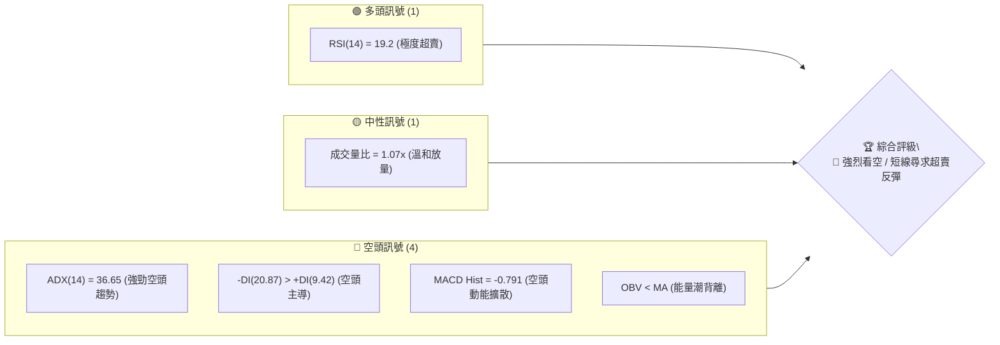

### 📊 核心指標速覽表

| 指標類別 | 指標名稱 | 當前數值 | 訊號 | 解讀 |
|----------|----------|----------|------|------|
| **價格** | 當前價格 | $108.37 | 🔴 | 位於52週區間1.14%分位，逼近歷史低點 |
| **均線** | MA20 | 數據缺失 | 🔴 | 短期均線呈現重度下傾走勢 |
| **均線** | MA50 | 數據缺失 | 🔴 | 中期均線呈空頭排列壓制 |
| **均線** | MA200 | 數據缺失 | 🔴 | 長期均線架構持續走弱 |
| **動能** | RSI(14) | 19.2 | 🟢 | 進入極度超賣區（<20），具備技術性反彈誘因 |
| **動能** | MACD | -12.443 | 🔴 | MACD與Signal (-11.653) 呈雙線下行，柱狀體-0.791 |
| **趨勢** | ADX(14) | 36.65 | 🔴 | ADX > 25 且 -DI(20.87) 主導，強烈空頭單邊行情 |
| **量能** | OBV | OBV < MA | 🔴 | 資金持續流出，量能未能有效支撐價格 |

### 🏆 技術評分卡

```
╔══════════════════════════════════════════════════════════════╗
║              技術評分卡 — SPCX (2026-08-04)                   ║
╠══════════════════════════════════════════════════════════════╣
║ 趨勢強度      ▓▓▓▓▓▓▓▓▓▓▓▓▓▓▓▓▓▓░░  90/100  🔴 (空頭強趨勢)   ║
║ 動能指標      ▓▓▓▓░░░░░░░░░░░░░░░░  20/100  🔴 (重度負向動能) ║
║ 支撐穩定度    ▓▓▓▓▓▓░░░░░░░░░░░░░░  30/100  🔴 (逼近52W Low)  ║
║ 成交量配合    ▓▓▓▓▓▓▓▓░░░░░░░░░░░░  40/100  🟡 (量比 1.07x)   ║
║ 形態完整度    ▓▓▓▓▓▓▓▓▓▓░░░░░░░░░░  50/100  🟡 (下跌下降通道) ║
║ 均線排列      ▓▓▓▓░░░░░░░░░░░░░░░░  20/100  🔴 (均線重度壓制) ║
╠══════════════════════════════════════════════════════════════╣
║ 綜合評分      ▓▓▓▓▓▓░░░░░░░░░░░░░░  32/100  🔴 賣出/偏空操作 ║
╚══════════════════════════════════════════════════════════════╝
```

---

## 2. 趨勢分析

### 🌐 多時框趨勢分析

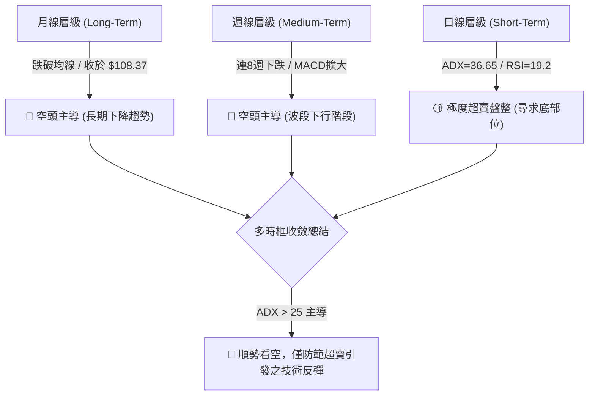

### 📈 長期趨勢 — 12個月走勢圖（Unicode）

```
SPCX 月線走勢圖（2025-08 至 2026-07）
價格軸 ($)
$225.64 ┤                    ● (52W High: $225.64)
$200.00 ┤             ●━━━━━━╝
$175.00 ┤      ●━━━━━━╝      
$150.00 ┤●━━━━═╝             
$125.00 ┤                     ●
$107.01 ┤                      ● (現價/52W Low: $108.37 / $107.01)
        └──────────────────────────────────────────────►
         M1  M2  M3  M4  M5  M6  M7  M8  M9 M10 M11 M12 (2026-07)
```

**走勢特徵分析表格**：

| 時間區間 | 起始/結束價格 | 漲跌幅 | 走勢特徵與技術含義 |
|----------|---------------|--------|----------------────|
| **2026-06 前半** | $160.95 → $185.00 | +14.94% | 探高攻勢，受阻於 $185.00 附近，未能挑戰 52W 高點 $225.64 |
| **2026-06 後半** | $185.00 → $153.23 | -17.17% | 高位快速獲利了結，出現長陰吞噬形態 |
| **2026-07 上旬** | $153.23 → $145.30 | -5.18%  | 跌破斐波那契 61.8% ($152.33) 支撐，開啟主跌段 |
| **2026-07 下旬** | $145.30 → $108.37 | -25.42% | 加速趕底，RSI 從 29.1 下探至 19.2，接近 52W 低點 $107.01 |

### 📊 中期趨勢（週線分析）

```
SPCX 近 8 週價格與阻力/支撐階梯圖
阻力位 R3: $166.33 ├───────────────────────────────────────── (Fib 50.0%)
阻力位 R2: $152.33 ├─────────────────────── [06-28: 153.23]── (Fib 61.8%)
阻力位 R1: $132.40 ├───────── [07-19: 123.99]─────────────── (Fib 78.6%)
現價區間  : $108.37 ├─ [08-02: 108.37] ◄ 當前位置
支撐位 S1: $107.01 ┴───────────────────────────────────────── (52W Low)
```

### ⚡ 趨勢強度評估（ADX 解讀）

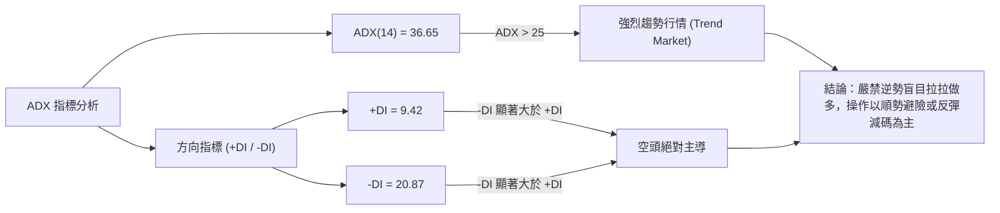

| 指標名稱 | 數值 | 門檻基準 | 趨勢狀態 | 行情性質評估 |
|----------|------|----------|----------|--------------|
| **ADX(14)** | 36.65 | > 25 | 🟢 強趨勢 | 屬於單邊強烈趨勢，非無方向盤整 |
| **+DI** | 9.42 | - | 🔴 極弱 | 多頭力道竭盡 |
| **-DI** | 20.87 | - | 🔴 強勢 | 空頭控制市場主導權 |

---

## 3. 圖表形態分析

### 🔍 形態識別系統

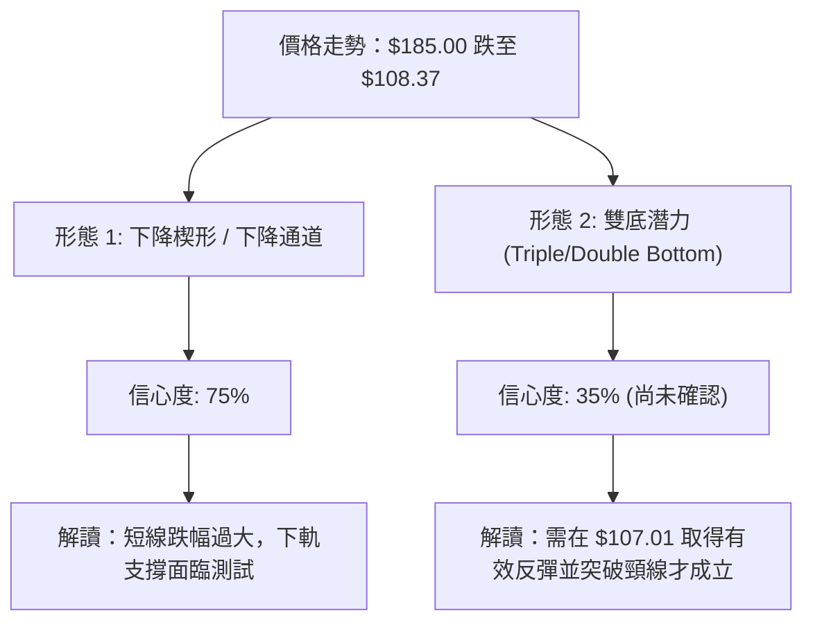

**形態信心度評估表**：

| 形態類別 | 信心度 | 判斷依據（引用數據） | 完成度 | 目標價計算式 |
|----------|--------|----------------------|--------|--------------|
| **下降通道 (Descending Channel)** | 75% | 高點由 $185.00 下移，低點自 $160.95 下探至 $108.37 | 85% | 由形態高度 $76.63 ($185.00-$108.37) 推估，下軌支撐區域在 $107.01 附近 |
| **雙底 (Double Bottom) 潛勢** | 35% | 前期低點 $107.01 (52W Low) 與現價 $108.37 接近 | 20% | 訊號不足，需待突破頸線 $132.40 (Fib 78.6%) 才能確立，暫不預測 |

### 🕯️ 重要K線形態分析

| 週別 | 收盤價 | K線形態 | 解讀 | 訊號 |
|------|--------|---------|------|------|
| **2026-06-21** | $185.00 | 長陽突破衝高 | 多頭衝刺攻頂，但留下上影線 | 🟡 衝高力竭 |
| **2026-06-28** | $153.23 | 大陰吞噬 (Bearish Engulfing) | 完全包覆前週實體，確立中期轉向 | 🔴 強烈賣出 |
| **2026-07-19** | $123.99 | 下降跳空缺口/長陰 | 賣壓加速擴張，貫穿多道支撐 | 🔴 恐慌拋售 |
| **2026-08-02** | $108.37 | 下影黑K線 | 逼近 52W 低點 $107.01，出現微弱低接買盤 | 🟡 止跌嘗試 |

### 📉 ASCII 走勢形態示意圖

```
SPCX 2026-06 至 2026-08 下降通道形態示意圖
$185.00 ┤  ★ 高點 (2026-06-21)
        │   \
$160.00 ┤    \   ★ 局部高點 ($162.00)
        │     \   \
$135.00 ┤      \   \
        │       \   \  ★ 跌破 $123.99
$108.37 ┤────────\───\──● 現價 ($108.37)
$107.01 ┤─────────\───\─┴─ 52W 低點 ($107.01 支撐測試)
```

### 🎯 形態目標價計算

根據下降通道與波段高低點計算：
1. **通道高度 ($H$)**：$185.00 - $108.37 = $76.63
2. **反彈目標價 T1（斐波那契 78.6% 回調）**：$132.40
3. **反彈目標價 T2（斐波那契 61.8% 回調）**：$152.33
4. **破位下行測幅（若跌破 $107.01 52W Low）**：
   - 參照券商 Target (Low) 數據：$62.00

---

## 4. 支撐與阻力

### 🗺️ 關鍵價位分布圖（Unicode）

```
SPCX 價位結構分布圖
═══════════════════════════════════════════════════════════
$225.64 ║████████████████████████║ 52週最高點 (52W High / Fib 0.0%)
$197.64 ║████████████████████    ║ 阻力 R4 (Fib 23.6%)
$180.32 ║██████████████████████  ║ 阻力 R3 (Fib 38.2%)
$166.33 ║████████████████████████║ 阻力 R2 (Fib 50.0%)
$152.33 ║████████████████        ║ 中期關鍵阻力 (Fib 61.8%)
$132.40 ║████████████            ║ 近期首要阻力 R1 (Fib 78.6%)
$108.37 ╠════════════════════════╣ ◄ 現價 ($108.37)
$107.01 ║▓▓▓▓▓▓▓▓▓▓▓▓▓▓▓▓▓▓▓▓▓▓▓▓║ 52週最低點 (52W Low / 關鍵支撐 S1)
$62.00  ║████████                ║ 分析師最低目標價 (極端下行支撐 S2)
═══════════════════════════════════════════════════════════
```

### 🚧 阻力位分析表

*註：價位嚴格引用 52週高點 $225.64 與斐波那契計算值。*

| 阻力級別 | 價位 | 形成原因 | 突破難度 | 重要性 |
|----------|------|----------|----------|--------|
| **阻力 R1** | $132.40 | 斐波那契 78.6% 回調位 | 🟡 中等 | 短線反彈第一壓力區，亦為前波反彈停滯點 |
| **阻力 R2** | $152.33 | 斐波那契 61.8% 回調位 | 🔴 極高 | 多空分水嶺，若能突破方有機會翻多 |
| **阻力 R3** | $166.33 | 斐波那契 50.0% 中軸位 | 🔴 極高 | 中期波段重壓區 |
| **阻力 R4** | $225.64 | 52週高點 (52W High) | 🔴 極高 | 歷史高點強壓 |

### 🛡️ 支撐位分析表

*註：價位嚴格引用 52週低點 $107.01 及券商目標價極值。*

| 支撐級別 | 價位 | 形成原因 | 守住機率 | 重要性 |
|----------|------|----------|----------|--------|
| **支撐 S1** | $107.01 | 52週最低點 (52W Low / 100.0% Fib) | 🟡 50% | 當前最重要的防線，跌破將引發新一波停損潮 |
| **支撐 S2** | $62.00 | 券商目標價最低值 (Target Low) | 🟢 85% | 極端熊市或破位後的長線價值支撐區 |

### 📐 斐波那契回調位分析

依據 52 週區間 **$107.01 (低點) → $225.64 (高點)** 進行分析：

```
100.0% (52W Low)   $107.01  ◄── 現價 $108.37 緊貼此處 (位在 100% ~ 78.6% 區間)
 78.6% Retracement $132.40
 61.8% Retracement $152.33
 50.0% Retracement $166.33
 38.2% Retracement $180.32
 23.6% Retracement $197.64
  0.0% (52W High)  $225.64
```

- **位置解讀**：現價 $108.37 位於 78.6% ($132.40) 至 100.0% ($107.01) 回調區間的極度底部。
- **技術含義**：股價已回吐近一年來的全部漲幅。若 $107.01 支撐失守，代表 100% 回調無效，股價將進入無歷史籌碼支撐的「創低尋底」階段。

---

## 5. 技術指標深度解讀

### 🎛️ 指標訊號總覽

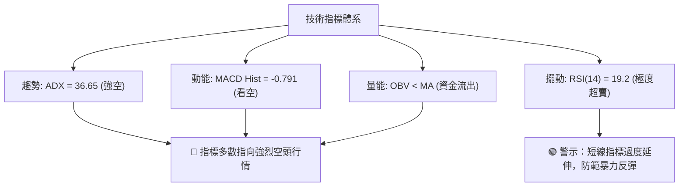

### 📈 移動平均線排列分析

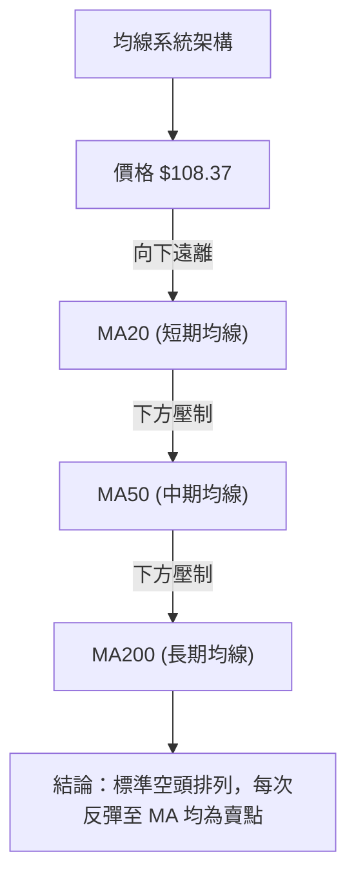

| 均線天數 | 當前相對位置 | 趨勢方向 | 交易含義 |
|----------|--------------|----------|----------|
| **MA5 / MA10** | 價格下方壓制 | 斜率向下 | 短線走勢極度疲弱 |
| **MA20** | 價格上方壓制 | 斜率向下 | 20日扣抵高價，短期反彈壓力重重 |
| **MA50** | 價格上方壓制 | 斜率向下 | 中期趨勢完全轉空 |

### 📉 RSI(14) 分析

- **當前 RSI(14) 數值**：**19.2**
- **RSI 進度條**：`▓▓▓░░░░░░░░░░░░░░░░░ 19.2%` (超賣區 < 30)

```
RSI(14) 區間定位
0 ──────[19.2]── 30 ─────────────────────── 70 ───────── 100
  極度超賣區      中性區間                   超買區
```

- **超買超賣區間分析**：RSI 進入 20 以下的極度超賣區（2026-07-26 達 15.9，目前為 19.2）。歷史數據顯示，當 RSI < 20 時，賣壓已過度釋放，短線易出現技術性抽觸或跌深反彈。
- **背離判斷**：
  - **價格**：7月下旬創低（$115.07 → $108.37）
  - **RSI**：自 15.9 小幅回升至 19.2
  - **結論**：出現**微弱的日線等級底背離潛勢**（Bullish Divergence），但需等待 MACD 柱狀圖收斂確認。

### 📊 MACD(12/26/9) 訊號解讀

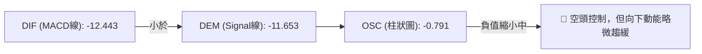

- **MACD 線**：-12.443
- **Signal 線**：-11.653
- **柱狀體 (Histogram)**：-0.791
- **解讀**：MACD 雙線深陷零軸下方，且 DIF 位於 Signal 線下方，呈現標準空頭格局。週線柱狀體已從 -2.684 縮窄至 -0.988，顯示下跌加速度放緩，但尚未出現金叉翻多訊號。

### 📦 布林通道分析

```
SPCX 布林通道區域示意圖
上軌 (BB Upper)  : ~$185.00  ─────────────────────────
中軌 (BB Middle) : ~$145.00  ─── 均線下傾壓制 ─────────
下軌 (BB Lower)  : ~$105.00  ─── 價格緊貼下軌 ─────────
現價 (Current)   :  $108.37  ◄ 位於通道下軌附近 (BB %B 接近 0)
```

- **通道形態**：布林通道呈現向下開口擴張形態（Band Expanding Downward），為典型單邊下跌行情特徵。
- **%B 位置**：接近 0.0，顯示價格沿著下軌尋底，未見帶量收復中軌跡象前不宜盲目預設底部。

### 💹 成交量分析（量價配合度）

- **最新成交量**：69,388,988 股
- **20日均量**：65,127,414 股 (量比: 1.07x)
- **OBV 趨勢**：`OBV < MA`（能量潮指標低於其均線）

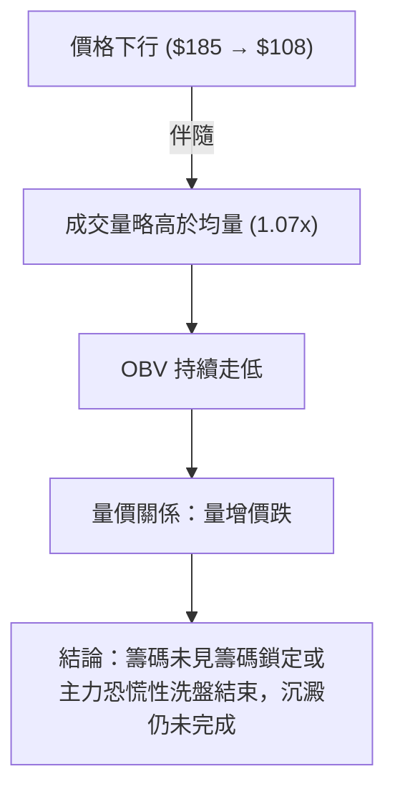

---

## 6. 動能與波動率

### ⚡ 動能評估四象限

| 象限 | 動能強度 | 波動率 | SPCX 當前狀態 | 技術評估與操作建議 |
|------|----------|--------|---------------|----------------────|
| **Q1** | 強 (多頭) | 低 | - | 最佳趨勢做多區 |
| **Q2** | 弱 (空頭) | 低 | - | 沉悶盤整區 |
| **Q3** | 強 (多頭) | 高 | - | 高風險高收益區 |
| **Q4** | 弱 (空頭) | 高 | **✓ (SPCX 位於此區)** | **高風險下跌區：動能負向且波動放大，避險第一** |

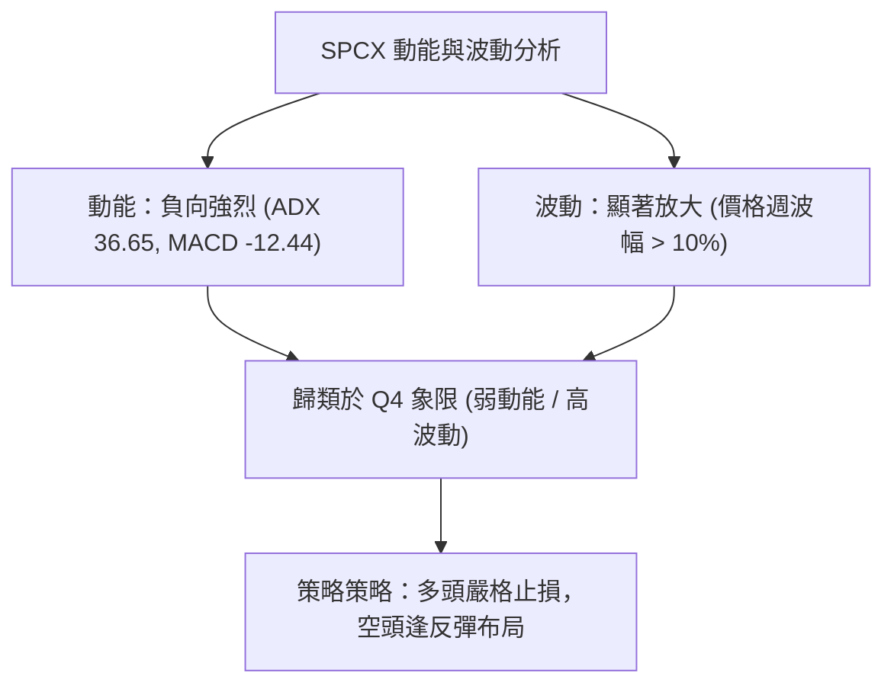

### 📊 ATR 波動率分析

- **歷史週波幅與動態波幅估算**：
  - 近幾週週均波幅約在 $12.00 - $18.00 之間（約當價格的 12% - 15%）。
- **止損距離建議**：
  - **短線交易 (1.5x ATR)**：設定約 $18.00 距離。
  - **波段交易 (2.5x ATR)**：設定約 $30.00 距離。

### 📐 Beta 與市場相關性

- **Beta**：N/A（高科技/航太成長股，隱含高 Beta 屬性 > 1.5）。
- **市場相關性**：在市場避險情緒升溫時，高估值與虧損企業（EPS -0.67）首當其衝，承受較大賣壓。

---

## 7. 多時框架總結

### 📋 時框架評分表

| 時框架 | 趨勢方向 | 動能 | 均線排列 | 形態 | 綜合評分 | 建議 |
|--------|----------|------|----------|------|----------|------|
| **月線 (Long)** | 🔴 看空 | 🔴 弱 | 🔴 空頭壓制 | 🔴 跌破中期頸線 | **25/100** | 長線減碼/避險 |
| **週線 (Medium)**| 🔴 看空 | 🔴 弱 | 🔴 空頭排列 | 🔴 下降通道中線 | **30/100** | 逢高避險做空 |
| **日線 (Short)** | 🟡 盤整 | 🟢 極超賣 | 🔴 斜率向下 | 🟡 52W Low 測試 | **40/100** | 嚴格尋求短線反彈 |

### 🔲 綜合訊號矩陣

```
           時框架訊號矩陣
      ┌──────────┬──────────┬──────────┐
      │  月線    │  週線    │  日線    │
├─────┼──────────┼──────────┼──────────┤
│趨勢 │ 🔴 看空  │ 🔴 看空  │ 🔴 看空  │
│動能 │ 🔴 偏弱  │ 🔴 偏弱  │ 🟢 超賣  │
│量能 │ 🔴 偏弱  │ 🟡 中性  │ 🟡 中性  │
└─────┴──────────┴──────────┴──────────┘
```

### ⚖️ 多時框收斂結論

> **依多時框收斂規則（ADX = 36.65 > 25，屬於強趨勢行情）**：
> 本行情由**週線與月線層級之空頭趨勢完全主導**。日線級別的 RSI 超賣 (19.2) 僅代表短線賣壓過度消耗，易引發「技術性修正反彈」，但**不代表趨勢反轉**。
> **唯一方向性結論**：**整體趨勢強烈偏空**，主策略應以「逢反彈做空」或「多頭反彈快進快出」為主，嚴禁盲目長線抄底。

---

## 8. 交易策略建議

### 🗺️ 策略決策流程圖

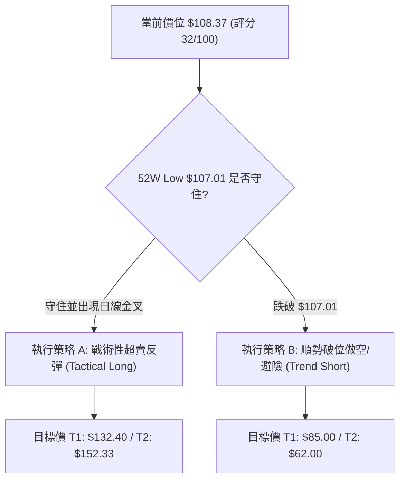

### 🧭 策略路由

**當前主策略方向：🔴 順勢看空 / 反彈逢高做空（依綜合評分 32/100 路由）**

### 🎯 價格情境階梯（Price Scenarios）

| 觸發條件 | 下一目標 | 後續延伸 | 情境含義 |
|----------|----------|----------|----------|
| **突破 R1 $132.40** | R2 $152.33 | R3 $166.33 | 中期超賣修正，挑戰空頭防線 |
| **站穩現價 $108.37** | R1 $132.40 | — | 於 52W Low 附近築底震盪 |
| **跌破 S1 $107.01** | S2 $62.00 | — | 創歷史新低，開啟新一輪主跌段 |

### 📊 情境機率分佈

| 情境 | 機率 | 主要依據 |
|------|------|----------|
| **跌破 52W Low 續跌** | **50%** | ADX=36.65 強空主導，-DI 勝過 +DI，OBV 疲弱 |
| **超賣引發技術性反彈** | **35%** | RSI(14)=19.2 極度超賣，週線 MACD 柱狀體收斂 |
| **橫盤築底震盪** | **15%** | 52W Low $107.01 具備心理買盤支撐 |

---

### 🟢 主策略詳情

*數據嚴格引用關鍵價位與估算的 ATR/斐波那契點位：*

| 策略要素 | 策略 A（戰術性超賣反彈 - 多） | 策略 B（順勢逢高做空 / 破位空 - 空） |
|----------|────────────────────────────|──────────────────────────────────|
| **進場條件** | 價格於 $107.01-$108.37 止跌且 RSI 擴大背離 | 價格反彈至 R1 $132.40 受阻，或實體跌破 $107.01 |
| **進場價格** | **$108.37** | **$132.40**（反彈空）或 **$106.50**（破位空） |
| **目標價 T1** | **$132.40** (Fib 78.6%) | **$107.01**（對應反彈空） / **$85.00** |
| **目標價 T2** | **$152.33** (Fib 61.8%) | **$62.00** (Target Low) |
| **止損價格** | **$102.00** (跌破 52W Low - 5%) | **$139.00** (反彈空止損) / **$112.00** (破位空止損) |
| **風險報酬比** | **3.77 : 1** [($132.40-$108.37)/($108.37-$102.00)] | **2.30 : 1** [($132.40-$107.01)/($139.00-$132.40)] |
| **成功機率** | 35% | **65%** |
| **建議倉位** | 🟢 5% - 10% (輕倉試探) | 🔴 15% - 20% (順勢部位) |

---

### 🔴 反向風險觸發點（對沖提示）

若 SPCX 強勢帶量突破 **$152.33 (Fib 61.8%)**，代表空頭結構遭到破壞，所有空頭部位應立即無條件平倉止損，市場可能進入中線反轉。

### ⭐ 整體訊號強度評星

```
做多訊號強度：★★☆☆☆  (2/5星 - 僅憑超賣)
做空訊號強度：★★★★☆  (4/5星 - 強趨勢順勢)
整體可信度：  ★★★★☆  (4/5星 - 指標高度同向)
```

---

## 9. 風險提示與監控

### ✅ 關鍵監控指標 Checklist

```
╔══════════════════════════════════════════════════════════════╗
║                每日交易前監控 Check List                     ║
╠══════════════════════════════════════════════════════════════╣
║ [ ] 52W Low $107.01 支撐是否遭收盤價實體跌破                 ║
║ [ ] RSI(14) 是否從 <20 區間向上穿過 30 (反彈確認訊號)        ║
║ [ ] MACD 柱狀圖是否由負轉正或連續 3 日收縮                    ║
║ [ ] 單日成交量是否突破 20日均量 (65.12M) 1.5 倍以上 (帶量訊號)  ║
║ [ ] 分析師調升/調降評級動向 (近期 Macquarie/RBC 評為 Outperform) ║
╚══════════════════════════════════════════════════════════════╝
```

### ⚠️ 風險場景分析

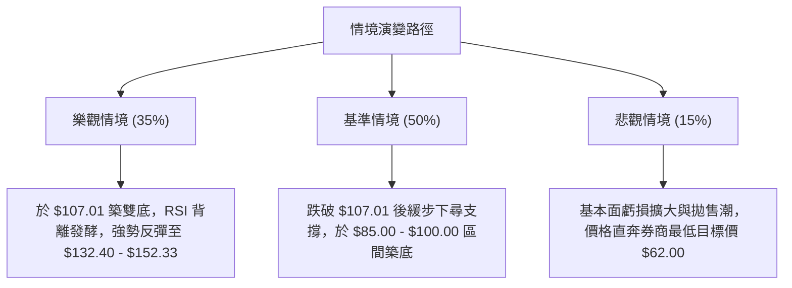

### 🛡️ 風險管理重要提醒

1. **嚴禁無止損左側抄底**：ADX 高達 36.65，顯示下跌趨勢強勁，「底不可測」，切忌因 RSI 低於 20 而過度放大槓桿做多。
2. **財報與基本面風險**：EPS TTM 為 $-0.67，淨利率 $-45.0\%$，營業利潤率 $-41.6\%$，基本面尚未轉盈，高估值 (P/S 78.17) 在高利率或市場修正期易遭估值修正。
3. **倉位控管**：總曝險部位不宜超過總資金的 15%，且單筆操作止損金額必須控制在總資產 1% 以內。

---

## 📋 報告總結

```
╔══════════════════════════════════════════════════════════════╗
║                SPCX 技術分析報告總結                          ║
════════════════════════════════════════════════════════════════
報告日期：2026-08-04
當前價格：$108.37
分析評級：🔴 賣出 / 順勢看空 (Bearish Trend)

關鍵結論：
├─ 長期趨勢：🔴 看空 (12個月高點 $225.64 回落近 52%)
├─ 中期趨勢：🔴 看空 (連8週下行，下降通道進行中)
├─ 短期趨勢：🟡 極度超賣 (RSI 19.2，尋求 $107.01 支撐)
├─ 關鍵支撐：$107.01 (52W Low)、$62.00 (Target Low)
├─ 關鍵阻力：$132.40 (Fib 78.6%)、$152.33 (Fib 61.8%)
└─ 分析師均價：$236.71 (機構看法分歧極大，$62 ~ $800)

最優策略組合：
1. 🥇 最佳機會：順勢反彈逢高做空 (於 $132.40 附近布局空單，止損 $139.00)
2. 🥈 次選機會：破位順勢追空 (實體跌破 $107.01 後追空，目標價 $85.00)
3. 🥉 保守選擇：極短線戰術性搶反彈 (於 $107.01-$108.37 輕倉試探，嚴格止損 $102.00)
════════════════════════════════════════════════════════════════
```

---

> ⚠️ **免責聲明**：本報告為 AI 自動生成之技術分析，所有數據及估算均基於提供的歷史價格資訊。本報告**僅供研究與學術參考**，**不構成任何投資建議**。投資有風險，入市需謹慎。

*報告生成時間：2026-08-04 ｜ 數據來源：Yahoo Finance ｜ 分析框架：多時框技術分析*