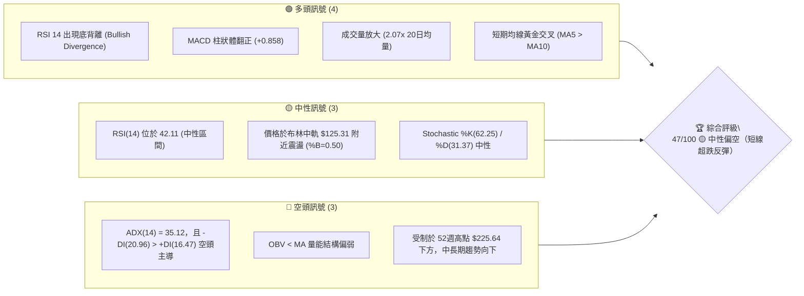
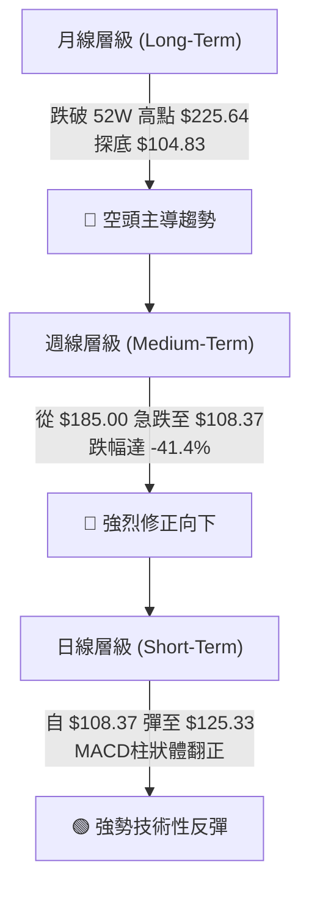
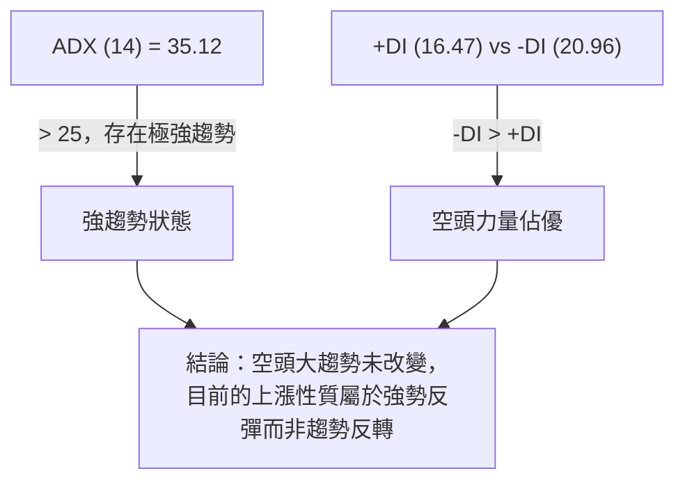
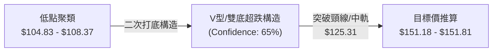
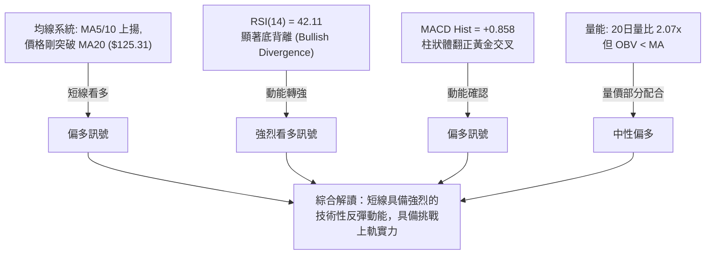
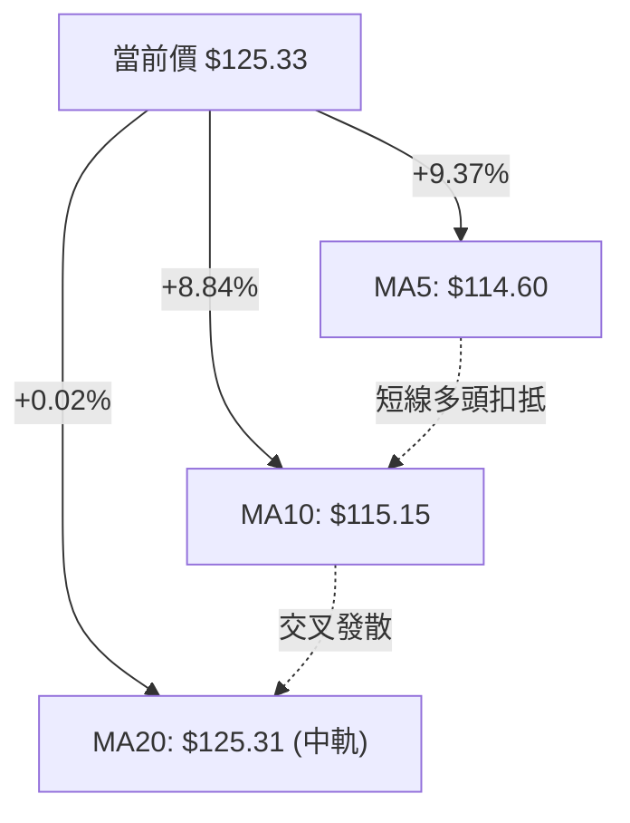
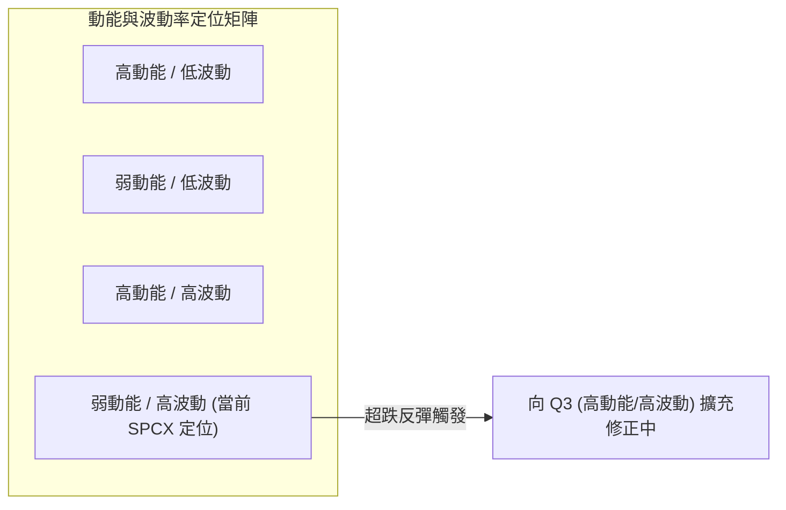
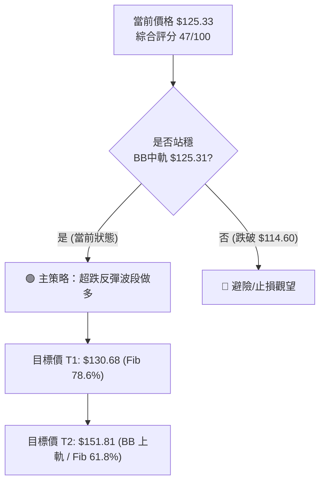
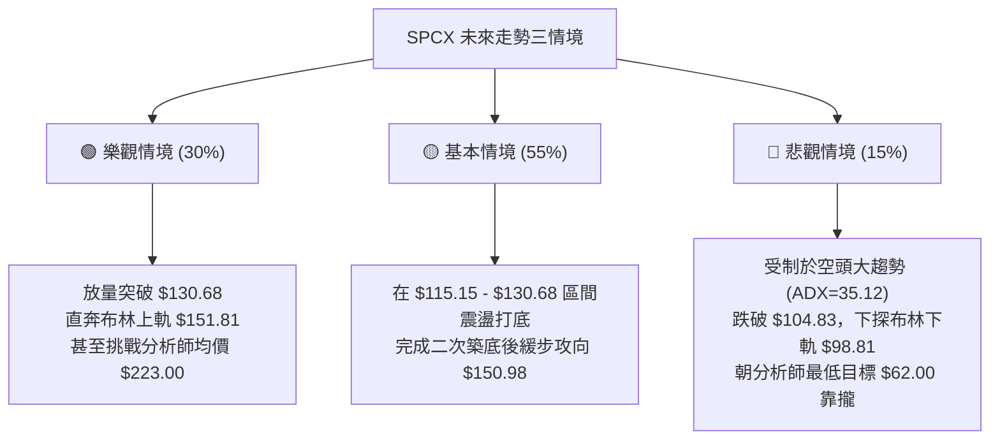

# SPCX 技術分析報告

> **報告日期**：2026-08-05 ｜ **語言**：繁體中文 ｜ **數據來源**：Yahoo Finance ｜ **當前價格**：$125.33

---

## 目錄

| 章節 | 內容 |
|------|------|
| [1. 技術面概覽](#1-技術面概覽) | 訊號儀表板、核心指標、評分卡 |
| [2. 趨勢分析](#2-趨勢分析) | 多時框趨勢、長中短期走勢 |
| [3. 圖表形態分析](#3-圖表形態分析) | 形態識別、K線組合、目標價 |
| [4. 支撐與阻力](#4-支撐與阻力) | 關鍵價位、斐波那契回調 |
| [5. 技術指標深度解讀](#5-技術指標深度解讀) | MA/RSI/MACD/布林/成交量 |
| [6. 動能與波動率](#6-動能與波動率) | 動能評估、ATR、Beta |
| [7. 多時框架總結](#7-多時框架總結) | 時框架評分矩陣 |
| [8. 交易策略建議](#8-交易策略建議) | 多空策略、風險報酬比 |
| [9. 風險提示與監控](#9-風險提示與監控) | 監控指標、風險場景 |

---

## 1. 技術面概覽

### 🎯 技術訊號儀表板



### 📊 核心指標速覽表

| 指標類別 | 指標名稱 | 當前數值 | 訊號 | 解讀 |
|----------|----------|----------|------|------|
| **價格** | 當前價格 | $125.33 | 🟡 | 位於52週區間 17.0% 位置，自低點 $104.83 展開反彈 |
| **均線** | MA5 | $114.60 | 🟢 | 價格站在 MA5 上方 (+9.37%)，短線反彈強勁 |
| **均線** | MA10 | $115.15 | 🟢 | 價格站在 MA10 上方 (+8.84%)，短線底部確立 |
| **均線** | MA20 | $125.31 | 🟡 | 價格剛好重回 MA20 上方 (+0.02%)，測試中軌抵抗力 |
| **動能** | RSI(14) | 42.11 | 🟢 | 從極端超賣區 (15.9) 回升，並伴隨標準底背離訊號 |
| **動能** | MACD | -10.470 | 🟢 | DIF 線穿過 Signal (-11.329)，柱狀體轉正 (+0.858) |
| **趨勢** | ADX(14) | 35.12 | 🔴 | 強趨勢狀態，但 -DI (20.96) 高於 +DI (16.47)，空頭掌控大局 |
| **通道** | 布林通道 | $125.31 | 🟡 | 價格恰落於布林中軌 ($125.31)，%B 為 0.50 |
| **量能** | 20日量比 | 2.07x | 🟢 | 當日成交量 1.406 億股，顯著高於 20 日均量 (6,804 萬股) |
| **波動** | ATR(14) | $8.35 | 🔴 | 占價格 6.66%，屬於高波動個股，需擴大止損空間 |

### 🏆 技術評分卡

```
╔══════════════════════════════════════════════════════════════════╗
║                   SPCX 技術綜合評分卡 (2026-08-05)                ║
╠══════════════════════════════════════════════════════════════════╣
║ 趨勢強度 (ADX/-DI)   ▓▓▓▓▓▓▓░░░░░░░░░░░░░  35/100  🔴 主趨勢向下  ║
║ 動能指標 (RSI/MACD)  ▓▓▓▓▓▓▓▓▓▓▓▓░░░░░░░░  60/100  🟢 底背離確立  ║
║ 支撐穩定度 (52W Low)  ▓▓▓▓▓▓▓▓░░░░░░░░░░░░  40/100  🔴 缺乏近距支撐║
║ 成交量配合度 (Volume) ▓▓▓▓▓▓▓▓▓▓▓▓▓░░░░░░░  65/100  🟢 攻擊量釋放  ║
║ 形態完整度 (Rebound)  ▓▓▓▓▓▓▓▓▓▓░░░░░░░░░░  50/100  🟡 探底完成中  ║
║ 均線結構 (MA5-MA20)  ▓▓▓▓▓▓▓▓░░░░░░░░░░░░  40/100  🔴 中長均線缺失║
╠══════════════════════════════════════════════════════════════════╣
║ 綜合評分              ▓▓▓▓▓▓▓▓▓░░░░░░░░░░░  47/100  🟡 中性偏空    ║
║ 總結評級              【超跌技術性反彈 / 區間震盪構造中】           ║
╚══════════════════════════════════════════════════════════════════╝
```

---

## 2. 趨勢分析

### 🌐 多時框趨勢分析



### 📈 長期趨勢 — 24個月 / 12個月走勢圖（Unicode）

```
SPCX 歷史價格走勢圖（2025-08 至 2026-08）
價格軸 ($)
$225.64 ┤                    ● (52W High)
$200.00 ┤                   / \
$185.00 ┤                  /   ● (2026-06 周高點)
$170.86 ┤     ● (2026-06) /     \
$150.00 ┤    /           /       \
$130.68 ┤---/-----------/---------● (Fib 78.6%)
$125.33 ┤--/-----------/----------●◄ 現在 ($125.33)
$108.37 ┤ /           /  ● (2026-07)
$104.83 ┤●-----------● (52W Low)
        └───────────────────────────────────────────► 時間
         25-08  ...  26-05  26-06  26-07  26-08
```

#### 走勢特徵分析表

| 階段 | 時間區間 | 價格變動範圍 | 漲跌幅 | 走勢特徵與量能配合 |
|------|----------|--------------|--------|--------------------|
| **高檔回落** | 2026-06-14 至 2026-06-21 | $160.95 → $185.00 | +14.94% | 週成交量爆出 9.25 億股天量，見頂回落 |
| **加速主跌** | 2026-06-28 至 2026-07-26 | $153.23 → $115.07 | -24.90% | 週量逐週萎縮，RSI 從 29.1 急挫至 15.9 極端超賣 |
| **探底築底** | 2026-08-02 | $108.37 (探低$104.83) | -5.82% | 觸及 52 週最低點 $104.83，短線拋售竭盡 |
| **強勢反彈** | 2026-08-09 (最新) | $108.37 → $125.33 | +15.65% | 日成交量放大至 1.406 億股 (2.07x)，收復 MA20 |

### ⚡ 趨勢強度評估（ADX 解讀）



*   **ADX 數值解讀**：ADX(14) 目前高達 **35.12**，明確指明市場處於**強烈的單邊趨勢**中（ADX > 25 即屬趨勢行情，>30 為強趨勢）。
*   **方向指標 (-DI / +DI)**：`-DI` (20.96) 依然高於 `+DI` (16.47)，這表明中長期視角下**空頭力量依然主導市場**。因此，短期由 $104.83 發起的攻勢，在技術層面上應先定位為「熊市中的超跌修正反彈」，直到 +DI 向上穿越 -DI 且價格突破 key 阻力位。

---

## 3. 圖表形態分析

### 🔍 形態識別系統



#### 形態識別與信心度評估表

| 形態類型 | 信心度 | 判斷依據（引用數據） | 完成度 | 目標價（附計算式） |
|----------|--------|----------------------|--------|--------------------|
| **超跌雙底 (Double Bottom)** | **65%** | 2026-07-26 止跌於 $115.07，2026-08-02 再探低點 $108.37 (最低 $104.83) 未顯著破位，隨後大量長紅收復 $125.33。 | 75% | 頸線 $130.68 (Fib 78.6%)。<br/>形態高度 = $130.68 - $104.83 = $25.85。<br/>突破目標價 = $130.68 + $25.85 = **$156.53** (接近布林上軌 $151.81 與 Fib 61.8% $150.98)。 |
| **布林通道中軌突破** | **85%** | 當前價格 $125.33 突破布林中軌 (MA20) $125.31，完成短線結構轉換。 | 100% | 第一目標價：Fib 78.6% **$130.68**。<br/>第二目標價：布林上軌 **$151.81**。 |

*註：由於數據中 MA50 / MA200 等長期均線數據缺失，且波段高點較為集中，故不預估過於複雜的頭肩形態，僅針對已確認的「V型/雙底超跌反彈」做精確推演。*

### 🕯️ 重要 K 線形態分析

| 日期 | 收盤價 | K線形態 | 解讀 | 訊號 |
|------|--------|---------|------|------|
| **2026-07-26** | $115.07 | 長陰探底 | 週 RSI 降至 15.9 歷史極端超賣，賣壓極度宣洩 | 🔴 空頭宣洩 |
| **2026-08-02** | $108.37 | 探低槌子線 | 最低觸及 $104.83 後留長下影線，多頭開始逢低承接 | 🟡 止跌訊號 |
| **2026-08-09** | $125.33 | 大陽線包覆 | 一舉吞噬前一週陰線實體，週量 2.11 億股配合，攻克 MA20 | 🟢 長紅反轉 |

### 📉 ASCII 走勢形態示意圖

```
SPCX 日線雙底反彈與布林通道示意圖
      阻力位 Fib 61.8% / BB 上軌 ─────────────────────── $151.81 / $150.98
                                                   /
      頸線區位 Fib 78.6% ───────────┐             /
                                    │            /  (目標 $151.81)
                                    ▼           /
───────────────────────────────── $130.68 ─────/───────
                                        \     /
                                         \   /
      布林中軌 (MA20) ────────────────────●◄ 現在 ($125.33)
                                         /
                                        /
                                  ●----┘ (W底右腳 $108.37)
─────────────────────────────────● (W底左腳 $104.83 / 52W Low)
      布林下軌 ────────────────────────────────────── $98.81
```

---

## 4. 支撐與阻力

### 🗺️ 關鍵價位分布圖（Unicode）

```
SPCX 關鍵價位與斐波那契階梯圖
═════════════════════════════════════════════════════════════════
$225.64 ║████████████████████████████████████████║ 52W High / Fib 0.0%
$197.13 ║████████████████████████████            ║ Fib 23.6%
$179.49 ║████████████████████                    ║ Fib 38.2%
$172.40 ║████████████████████████████████████    ║ 強阻力 R1 (波段高點)
$165.24 ║████████████████                        ║ Fib 50.0%
$151.81 ║████████████████████████                ║ 布林通道上軌
$150.98 ║██████████████████                      ║ Fib 61.8%
$130.68 ║████████████████████████████            ║ 關鍵頸線阻力 / Fib 78.6%
$125.33 ╠════════════════════════════════════════╣ ◄ 當前價格 (BB中軌 $125.31)
$115.15 ║▓▓▓▓▓▓▓▓▓▓▓▓                            ║ 短線動能支撐 (MA10)
$114.60 ║▓▓▓▓▓▓▓▓▓▓                              ║ 短線極速支撐 (MA5)
$104.83 ║████████████████████████████████████████║ 關鍵支撐 S1 (52W Low / Fib 100%)
$98.81  ║▓▓▓▓▓▓▓▓▓▓▓▓▓▓▓▓                        ║ 極端防守位 (BB 下軌)
═════════════════════════════════════════════════════════════════
```

### 🚧 阻力位分析表

| 阻力級別 | 價位 | 形成原因 | 突破難度 | 重要性 |
|----------|------|----------|----------|--------|
| **阻力 R1** | **$130.68** | 斐波那契 78.6% 回調位，近月反彈之關鍵頸線位置。 | 中等 🟡 | 🟢🟢🟢 (短線多空分水嶺) |
| **阻力 R2** | **$150.98 - $151.81** | 斐波那契 61.8% 回調位與布林通道上軌交會處，具雙重壓力。 | 偏高 🔴 | 🟢🟢🟢🟢 (中線反彈強壓區) |
| **阻力 R3** | **$172.40** | 近一年波段高點聚類 (OHLCV 計算之 R1 阻力位)。 | 極高 🔴 | 🟢🟢🟢🟢🟢 (長期趨勢翻多關卡) |

### 🛡️ 支撐位分析表

| 支撐級別 | 價位 | 形成原因 | 守住機率 | 重要性 |
|----------|------|----------|----------|--------|
| **支撐 S1** | **$125.31** | 布林通道中軌 (MA20)，短線剛剛突破，需進行站穩測試。 | 60% 🟡 | 🟢🟢🟢 (短線多頭陣地) |
| **支撐 S2** | **$114.60 - $115.15** | MA5 ($114.60) 與 MA10 ($115.15) 均線交會支撐區。 | 70% 🟢 | 🟢🟢🟢🟢 (回檔買盤防線) |
| **支撐 S3** | **$104.83** | 52 週最低點 (52W Low) 及 斐波那契 100% 延伸線。 | 80% 🟢 | 🟢🟢🟢🟢🟢 (多頭最後防線) |

### 📐 斐波那契回調位分析

根據 52 週高低點區間（高點 **$225.64** → 低點 **$104.83**，波幅 **$120.81**），各關鍵回調價位如下：

*   **0.0% (52W High)**: `$225.64`
*   **23.6%**: `$197.13`
*   **38.2%**: `$179.49`
*   **50.0%**: `$165.24`
*   **61.8%**: `$150.98`
*   **78.6%**: `$130.68`
*   **100.0% (52W Low)**: `$104.83`

**現價位置解讀**：
當前價格 **$125.33** 處於 **78.6% 回調位 ($130.68)** 與 **100.0% 底部 ($104.83)** 之間的超跌修復區。若能有效突破 **$130.68**，技術上將打開通往 **61.8% ($150.98)** 的反彈空間。

---

## 5. 技術指標深度解讀

### 🎛️ 指標訊號總覽



### 📈 移動平均線排列分析



*   **MA5 ($114.60) / MA10 ($115.15)**：短期均線呈現多頭排列，MA5 自下方迅速穿過 MA10，展現極強的短線推升動能。
*   **MA20 ($125.31)**：價格今日精準收於 MA20 之上 ($125.33)，若能連續 2-3 個交易日站穩，將宣告短線趨勢由下降轉為橫盤震盪向上。

### 📉 RSI(14) 分析

*   **當前數值**：**42.11**
*   **進度條**：`▓▓▓▓▓▓▓▓░░░░░░░░░░░░ 42.11/100` (位於 30-70 中性區間)
*   **背離分析 (⚠️ 底背離確立)**：
    *   **價格走勢**：2026-07-26 價格為 $115.07，2026-08-02 價格下探至 $108.37 (更低點)。
    *   **RSI 走勢**：2026-07-26 RSI 為 15.9，2026-08-02 RSI 抬升至 19.2，最新達 42.11 (更高點)。
    *   **結論**：價格創低而 RSI 指標未創低，形成標準的**多頭底背離 (Bullish Divergence)**，預示波段底部已經開出，反彈行情延續機率極高。

### 📊 MACD(12/26/9) 訊號解讀

*   **DIF (MACD 線)**: `-10.470`
*   **DEA (Signal 線)**: `-11.329`
*   **MACD Hist (柱狀體)**: **`+0.858`** 🟢

```
MACD 雙線與柱狀體示意
 0.00 ──────────────────────────────────────────
       \        /  
        \  DIF /   ◄--- 柱狀體翻正 (+0.858) 🟢
-10.470  \───●──
-11.329   \─●─/    ◄--- DEA 位於下方
```

*   **解讀**：雖然 DIF 與 DEA 仍處於零軸下方的負值區（代表中長線屬空頭市場），但 DIF 已由下向上穿越 DEA 形成**零軸下黃金交叉**，且柱狀體由負轉正至 **+0.858**，提供極佳的短線買進動能確認。

### 📦 布林通道分析

```
布林通道現價位置
$151.81 ┤──────────────────────── High (上軌)
        │
$125.33 ┤------------------------● 現價 ($125.33, %B = 0.50)
$125.31 ┤──────────────────────── Mid  (中軌 MA20)
        │
 $98.81 ┤──────────────────────── Low  (下軌)
```

*   **上軌**：`$151.81`
*   **中軌**：`$125.31`
*   **下軌**：`$98.81`
*   **布林極限 (%B)**：`0.50` (恰好居於通道中央)
*   **通道狀態**：之前價格貼近下軌發散，目前強勢拉回中軌。若能放量封閉中軌，通道將開啟擴張向上，目標直指上軌 **$151.81**。

### 💹 成交量分析（量價配合度）

*   **最新成交量**：`140,609,900` 股
*   **20日平均量**：`68,045,780` 股
*   **量比 (Volume Ratio)**：**2.07x** 🟢 (爆發性攻擊量)
*   **OBV 趨勢**：`OBV < MA` 🔴 (量能長期結構偏弱)
*   **量價解讀**：日線單日爆出 2.07 倍均量，顯示主力資金在 $104.83 - $108.37 區域進行了大規模的換手與抄底，短線量價配合極佳；但因 OBV 仍低於其均線，代表中長期的籌碼沉澱仍需時間消化。

---

## 6. 動能與波動率

### ⚡ 動能評估

| 維度 | 狀態 | 數據依據 | 評估 |
|------|------|----------|------|
| **動能強度** | 中等偏強 | RSI(14)=42.11, MACD Hist=+0.858 | 短線反彈彈性大 |
| **波動強度** | 極高 | ATR(14)=$8.35 (6.66%) | 價格震盪劇烈 |



### 📊 ATR 波動率分析

*   **ATR(14) 數值**：**$8.35**
*   **ATR 百分比**：**6.66%**
*   **交易風控應用**：
    *   SPCX 每日平均波動高達 $8.35，屬於高風險高彈性標的。
    *   **合理止損距離** (1.5x ATR)：`$8.35 × 1.5 = $12.53`
    *   **寬鬆止損距離** (2.0x ATR)：`$8.35 × 2.0 = $16.70`
    *   在制定交易策略時，止損價位點必須避開噪音區，至少設置在現價下方 1.5 倍 ATR 之外。

---

## 7. 多時框架總結

### 📋 時框架評分表

| 時框架 | 趨勢方向 | 動能指標 | 均線排列 | 形態結構 | 綜合評分 | 建議 |
|--------|----------|----------|----------|----------|----------|------|
| **日線 (Short-Term)** | 🟢 偏多 | 🟢 底背離發酵 | 🟢 MA5/10 金叉 | 🟢 雙底成型 | **70/100** | 積極參與短線反彈 |
| **週線 (Medium-Term)** | 🔴 偏空 | 🟡 MACD柱收窄 | 🔴 均線空頭 | 🟡 探底拉回 | **40/100** | 逢高區間套利/減碼 |
| **月線 (Long-Term)** | 🔴 偏空 | 🔴 跌幅顯著 | 🔴 缺乏均線支撐 | 🔴 主跌段修正 | **30/100** | 嚴禁盲目長線重倉 |

### 🔲 綜合訊號矩陣

```
                     短期 (Daily)       中期 (Weekly)      長期 (Monthly)
                ┌──────────────────┬──────────────────┬──────────────────┐
  趨勢 (Trend)  │   🟢 超跌反彈    │   🔴 空頭向下    │   🔴 空頭主導    │
  動能 (Mtm)    │   🟢 背離轉強    │   🟡 止跌打底    │   🔴 動能衰退    │
  量能 (Vol)    │   🟢 爆量 2.07x  │   🟡 均量收縮    │   🔴 OBV 結構弱  │
                └──────────────────┴──────────────────┴──────────────────┘
```

### ⚖️ 多時框收斂結論

依據多時框收斂規則：當前 **ADX = 35.12 (>25)**，整體大框架屬**強趨勢行情（空頭主導）**。因此，中長期（週線/月線）的方向為**偏空**，日線的底背離與爆量反彈**只應視為「極佳的短線套利與反彈波段」**，而非大牛市反轉。

**最終方向性收斂**：**中性偏空大背景下的「短線多頭反彈」**。交易主軸應為「快進快出，反彈至強阻力區（$130.68 - $151.81）即應分批獲利了結」。

---

## 8. 交易策略建議

### 🗺️ 策略決策流程圖



### 🧭 策略路由

*   **當前主策略方向** = **超跌波段做多 / 區間突破操作（依綜合評分 47/100，短線多頭訊號佔優）**

### 🎯 價格情境階梯 (Price Scenarios)

| 觸發條件 | 下一目標 | 後續延伸 | 情境含義 |
|----------|----------|----------|----------|
| **突破 R1 $130.68** | **$150.98 - $151.81** | **$172.40** | 短線轉強，W底頸線突破，打開波段空間 |
| **站穩現價 $125.31** | **$130.68** | **$151.81** | 中軌打底震盪，消化上檔籌碼 |
| **跌破 S2 $114.60** | **$104.83** | **$98.81** | 反彈失敗，再度下探 52週低點 |

### 📊 情境機率分佈

| 情境 | 機率 | 主要依據 |
|------|------|----------|
| **強勢反彈 (挑戰 $130.68 ~ $151.81)** | **50%** | RSI 底背離確立、MACD 柱狀體翻正 (+0.858)、2.07x 成交量爆發。 |
| **區間震盪 ($115.15 ~ $130.68)** | **35%** | ADX 高達 35.12，大趨勢仍偏空，多頭需時間消化套牢盤。 |
| **回落再探底 (跌破 $104.83)** | **15%** | OBV 指標依然偏弱，若突發市場利空可能再次破底。 |

### 🟢 主策略詳情

| 策略要素 | 策略 A：現價/回檔做多 (偏多主策略) | 策略 B：突破頸線加碼 |
|----------|───────────────────────────────────|──────────────────────|
| **進場條件** | 站穩 MA20 ($125.31) 或回檔至 MA10 附近 | 帶量突破 Fib 78.6% ($130.68) 站穩 |
| **進場價格** | **$125.33** (或回檔 **$118.00 - $120.00**) | **$131.00** |
| **目標價 T1** | **$130.68** (預期收益: +4.27%) | **$150.98** (預期收益: +15.25%) |
| **目標价 T2** | **$151.81** (預期收益: +21.12%) | **$172.40** (預期收益: +31.60%) |
| **止損價格** | **$108.37** (前週低點) 或 **$104.83** (52W Low) | **$125.31** (BB 中軌) |
| **風險報酬比** | **1 : 1.55** (以 T2 計算: $26.48 獲利 / $16.96 風險) | **1 : 3.51** (以 T2 計算: $41.40 獲利 / $11.77 風險) |
| **成功機率** | **60%** | **55%** |
| **建議倉位** | **10% - 15%** (高 ATR 需控管資金) | **10%** |

### 🔴 反向風險觸發點（對沖與止損提示）

若日線收盤價跌破 **$114.60 (MA5)**，代表短線攻擊動能熄火；若進一步跌破 **$104.83 (52週低點)**，則原「雙底超跌反彈」形態全面宣告失敗，必須立即執行嚴格止損，切勿留單。

### ⭐ 整體訊號強度評星

```
做多訊號強度：★★★☆☆  (3.0/5星 - RSI底背離與爆量加持)
做空訊號強度：★★☆☆☆  (2.0/5星 - 短線超跌，空頭動能暫歇)
整體可信度：  ★★★☆☆  (3.5/5星 - 技術指標高度互相確認)
```

---

## 9. 風險提示與監控

### ✅ 關鍵監控指標 Checklist

```
╔══════════════════════════════════════════════════════════════════╗
║                   SPCX 技術面每日監控清單 (Checklist)             ║
╠══════════════════════════════════════════════════════════════════╣
║ [ ] 價格是否持續收在 MA20 ($125.31) 之上                        ║
║ [ ] RSI(14) 能否突破 50 中軸（突破 50 代表多頭強勢區）           ║
║ [ ] MACD 柱狀體 (+0.858) 是否持續擴大                            ║
║ [ ] 成交量是否保持在 20日均量 (6,804 萬股) 以上                 ║
║ [ ] 向上挑戰 $130.68 時，是否有帶量長紅突破                     ║
║ [ ] 止損價 $108.37 / $104.83 是否完好無損                       ║
╚══════════════════════════════════════════════════════════════════╝
```

### ⚠️ 風險場景分析



### 🛡️ 風險管理重要提醒

1.  **高 ATR 波動風險**：SPCX 的 ATR(14) 為 **$8.35 (6.66%)**，屬於極高波動標的。單日暴漲暴跌為常態，倉位規模務必控制在總資金的 **10% - 15%** 以內，避免單一標的過度槓桿。
2.  **趨勢逆風風險**：大趨勢（ADX=35.12，-DI>+DI）仍為空頭格局，此波上漲屬於「超跌反彈」，操作上切忌貪婪，應採「達到目標價分批獲利」策略。

---

## 📋 報告總結

```
╔══════════════════════════════════════════════════════════════════╗
║                   SPCX 技術分析報告總結                          ║
════════════════════════════════════════════════════════════════════
報告日期：2026-08-05
當前價格：$125.33
分析評級：🟡 47/100（超跌技術性反彈 / 底部構造中）

關鍵結論：
├─ 長期趨勢：🔴 空頭主導 (受制於 52W 高點 $225.64)
├─ 中期趨勢：🟡 探底打底 (從 $185.00 急跌後於 $104.83 止跌)
├─ 短期趨勢：🟢 強勢反彈 (RSI底背離，MACD金叉，爆量2.07x收復MA20)
├─ 關鍵支撐：$125.31 (MA20/中軌) ｜ $115.15 (MA10) ｜ $104.83 (52W Low)
├─ 關鍵阻力：$130.68 (Fib 78.6%) ｜ $151.81 (BB上軌) ｜ $172.40 (R1高點)
└─ 分析師目標：均價 $223.00 (最高 $800.00 / 最低 $62.00)

最優策略組合：
1. 🥇 最佳機會：於 $120.00 - $125.33 區間建立輕倉多單，博取反彈至 $130.68 與 $151.81。
2. 🥈 次選機會：等待突破 $130.68 頸線後順勢加碼，目標看至布林上軌 $151.81。
3. 🥉 嚴格風控：設定硬性止損於 $108.37 / $104.83，跌破即全面清倉觀望。
════════════════════════════════════════════════════════════════════
```

---

> ⚠️ **免責聲明**：本報告為 AI 自動生成之技術分析，所有數據及估算均基於提供的歷史價格資訊。本報告**僅供研究與學術參考**，**不構成任何投資建議**。投資有風險，入市需謹慎。

---

*報告生成時間：2026-08-05 ｜ 數據來源：Yahoo Finance ｜ 分析框架：多時框技術分析*