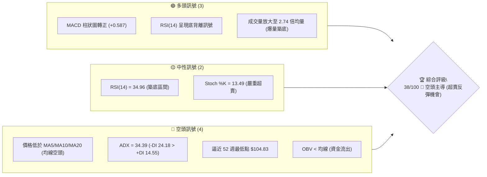
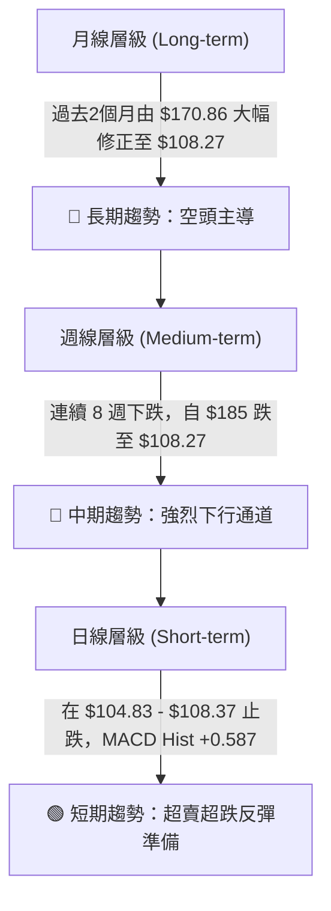
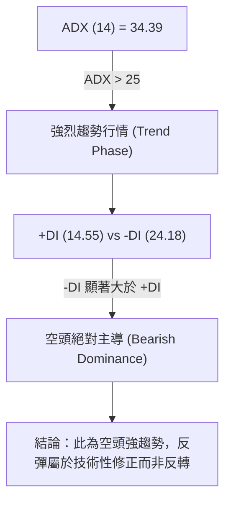
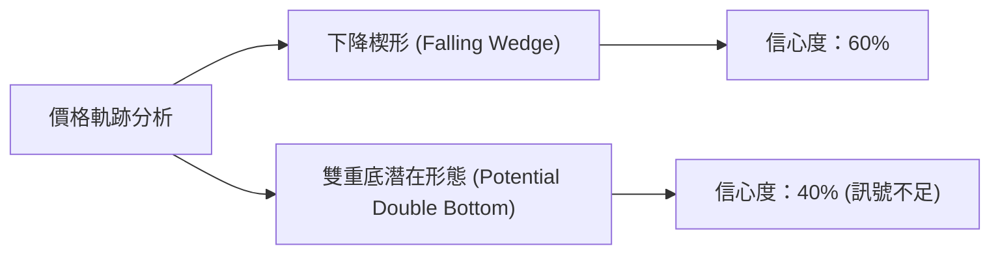
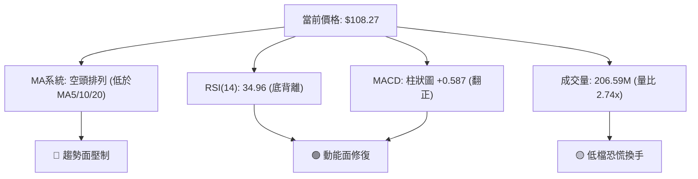
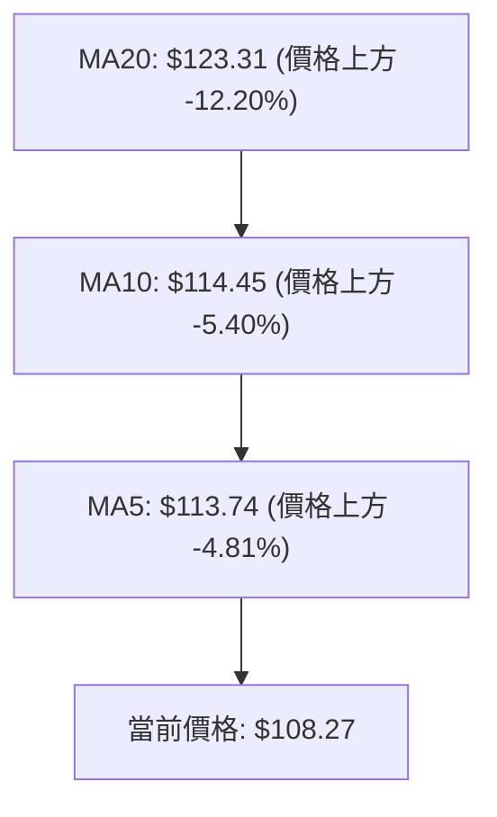
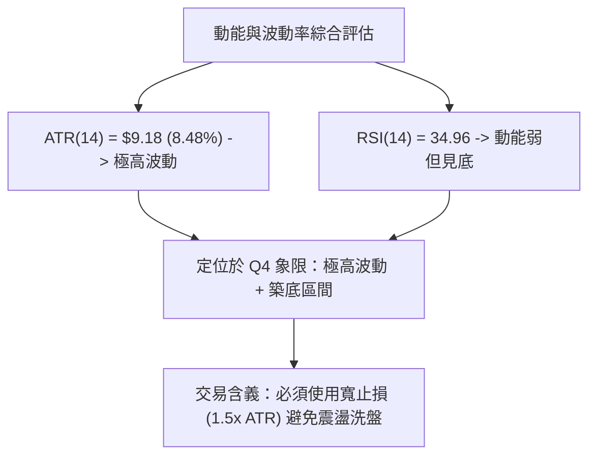
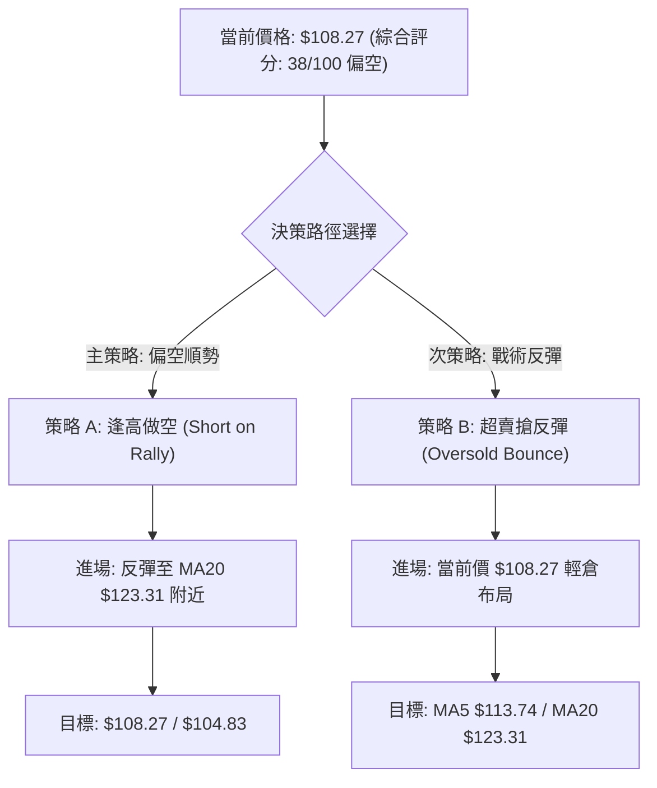
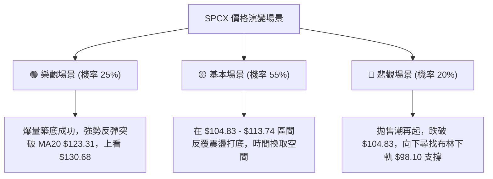

# SPCX 技術分析報告

> **報告日期**：2026-08-06 ｜ **語言**：繁體中文 ｜ **數據來源**：Yahoo Finance ｜ **當前價格**：$108.27

---

## 目錄

| 章節 | 內容 |
|------|------|
| [1. 技術面概覽](#1-技術面概覽) | 訊號儀表板、核心指標、評分卡 |
| [2. 趨勢分析](#2-趨勢分析) | 多時框趨勢、長中短期走勢 |
| [3. 圖表形態分析](#3-圖表形態分析) | 形態識別、K線組合、目標價 |
| [4. 支撐與阻力](#4-支撐與阻力) | 關鍵價位、斐波那契回調 |
| [5. 技術指標深度解讀](#5-技術指標深度解讀) | MA/RSI/MACD/布林/成交量 |
| [6. 動能與波動率](#6-動能與波動率) | 動能評估、ATR、Beta |
| [7. 多時框架總結](#7-多時框架總結) | 時框架評分矩陣 |
| [8. 交易策略建議](#8-交易策略建議) | 多空策略、風險報酬比 |
| [9. 風險提示與監控](#9-風險提示與監控) | 監控指標、風險場景 |

---

## 1. 技術面概覽

### 🎯 技術訊號儀表板



### 📊 核心指標速覽表

| 指標類別 | 指標名稱 | 當前數值 | 訊號 | 解讀 |
|----------|----------|----------|------|------|
| **價格** | 當前價格 | $108.27 | 🔴 | 處於 52 週區間底部 (2.8% 分位) |
| **均線** | MA5 | $113.74 | 🔴 | 價格低於 MA5 (-4.81%)，短線承壓 |
| **均線** | MA10 | $114.45 | 🔴 | 價格低於 MA10 (-5.40%)，短期均線下彎 |
| **均線** | MA20 | $123.31 | 🔴 | 價格低於 MA20 (-12.20%)，中期趨勢偏空 |
| **均線** | MA50/200 | N/A | 🟡 | 數據不足（資料量不足需要進一步觀察） |
| **動能** | RSI(14) | 34.96 | 🟢 | 近乎超賣，且出現潛在底背離 |
| **動能** | MACD | -10.595 | 🟢 | MACD 柱狀圖 +0.587 轉正，短線動能改善 |
| **趨勢** | ADX(14) | 34.39 | 🔴 | 強趨勢 (>25)，由 -DI (24.18) 主導空頭 |
| **波動** | BB%B / Lower | 0.20 / $98.10 | 🟡 | 位於布林通道下軌上方，偏向低檔震盪 |
| **波動** | ATR(14) | $9.18 | 🔴 | 每日波動率高達 8.48%，屬高波動標的 |
| **成交量** | 最新成交量 | 206.59M | 🟢 | 量比 2.74x，低檔現恐慌性換手量 |

### 🏆 技術評分卡

```
╔══════════════════════════════════════════════════════════════════╗
║              技術評分卡 — SPCX (2026-08-06)                      ║
╠══════════════════════════════════════════════════════════════════╣
║ 趨勢強度      ██████████████░░░░░░  70/100  🔴 空頭強趨勢 (ADX 34.4) ║
║ 動能指標      ████████░░░░░░░░░░░░  40/100  🟢 底背離 + 柱狀圖轉正  ║
║ 支撐穩定度    ████░░░░░░░░░░░░░░░░  20/100  🔴 接近 52W 低點 $104.83║
║ 成交量配合    ████████████░░░░░░░░  60/100  🟢 低檔爆量 2.74 倍     ║
║ 形態完整度    ████████░░░░░░░░░░░░  40/100  🟡 下降楔形收斂中       ║
║ 均線排列      ██░░░░░░░░░░░░░░░░░░  10/100  🔴 空頭排列 (MA5/10/20) ║
╠══════════════════════════════════════════════════════════════════╣
║ 綜合評分      ███████▓░░░░░░░░░░░░  38/100  🔴 評級：偏空 (觀望反彈)║
╚══════════════════════════════════════════════════════════════════╝
```

---

## 2. 趨勢分析

### 🌐 多時框趨勢分析



### 📈 長期趨勢 — 12個月走勢圖（Unicode）

```
SPCX 歷史價格走勢圖（2025-08 至 2026-08）
價格軸 ($)
$225.64 ┤                    ●(52W High $225.64)
$200.00 ┤                   / \
$175.00 ┤        ●(06/14)  /   \   
$150.00 ┤       / \       /     \  ●(06/28 $153.23)
$125.00 ┤      /   \     /       \   \
$108.27 ┤●────/─────●───/─────────\───● (現價 $108.27)
$104.83 ┤          (低點)          \___● (52W Low $104.83)
        └─┬───┬───┬───┬───┬───┬───┬───┬───┬───┬───┬───
         M1  M2  M3  M4  M5  M6  M7  06  07  08  現價
```

#### 走勢特徵分析表格

| 時間區段 | 月份/週別 | 收盤價 ($) | 漲跌幅 / 特徵 | 關鍵技術面變化 |
|----------|-----------|------------|---------------+----------------|
| **波段高點** | 52週高點 | $225.64 | 基準點 (0.0%) | 歷史頂點，開始進入長期修正 |
| **波段中期** | 2026-06-21 | $185.00 | 強勢反彈 | MACD 柱 +3.658，波段最後衝高 |
| **加速下跌** | 2026-06-28 | $153.23 | -17.17% | 跌破多頭防線，MACD 轉負 |
| **探底階段** | 2026-07-26 | $115.07 | -24.93% | RSI 降至 15.9 (極端超賣) |
| **低位震盪** | 2026-08-02 | $108.37 | -5.82% | 週成交量 315M，跌勢減緩 |
| **目前位置** | 2026-08-09 | $108.27 | -0.09% | MACD 柱轉正 (+0.587)，築底嘗試 |

### 📊 中期趨勢（週線分析）

中期走勢展現出明確的下行通道（Descending Channel）。從 2026年6月中旬高點 $185.00 下滑至 $108.27，短短兩個月內跌幅高達 -41.48%。

```
週線壓力與支撐結構示意圖
$185.00 ┤  ● (6月中旬高點)
        │   \
$150.98 ┤────\─────── [斐波那契 61.8% 壓力位]
        │     \
$130.68 ┤──────\───── [斐波那契 78.6% 壓力位 / 週線下行通道上軌]
$123.31 ┤───────\──── [MA20 均線壓力]
$108.27 ┤────────●─── [現價位置]
$104.83 ┤──────────── [52週最低點支撐位]
```

### ⚡ 趨勢強度評估（ADX 解讀）



#### ADX 趨勢強度對照表

| 指標名稱 | 當前數值 | 參考閾值 | 市場狀態 | 技術含義 |
|----------|----------|----------|----------|----------|
| **ADX(14)** | **34.39** | > 25.0 | 強趨勢行情 | 市場處於明確單邊趨勢，盤整突破成立 |
| **+DI (14)** | **14.55** | < 20.0 | 多頭極度弱勢 | 買盤動能乏力 |
| **-DI (14)** | **24.18** | > 20.0 | 空頭主導力量 | 賣方持續佔據優勢 |

---

## 3. 圖表形態分析

### 🔍 形態識別系統



#### 形態評估與信心度矩陣

| 形態名稱 | 信心度 | 判斷依據（引用數據） | 完成度 | 目標價（附計算式） |
|----------|--------|----------------------|--------|--------------------|
| **下降楔形** | **60%** | 高點降幅大於低點降幅，波動幅縮（BB下軌 $98.10 與現價收斂） | 75% | 突破楔形上軌（$113.74）後，目標價 = 楔形高點 $130.68 |
| **雙重底 (潛在)** | **40%** | 2026-08-02 低點 $108.37 與當前 $108.27 形成雙腳嘗試 | 30% | 訊號不足，僅做指標型解讀。若確認突破 MA20 ($123.31)，目標看 $130.68 |

*註：由於數據未顯示明確幾何 reversal 形態完工，本報告不進行過度圖表假設，僅以技術指標與斐波那契位推算。*

### 🕯️ 重要 K 線形態分析

| 日期 / 時框 | 收盤價 ($) | K 線形態 | 技術解讀 | 多空訊號 |
|-------------|------------|----------|----------|----------|
| **2026-07-26** | $115.07 | 大陰線 | 恐慌性拋售，RSI 掉至 15.9 的極端區域 | 🔴 極度看空 |
| **2026-08-02** | $108.37 | 下影長陰線 | 空頭力道放緩，尋求 52W 低點 $104.83 支撐 | 🟡 空頭力竭 |
| **2026-08-09** | $108.27 | 十字星 (Doji) 變盤線 | 買賣雙方平衡，成交量 421M 放大，低檔換手 | 🟢 底態顯現 |

### 📉 ASCII 走勢形態示意圖

```
下降楔形與潛在築底形態示意圖
$130.68 ┤  \  (楔形上軌)
        │   \
$123.31 ┤----\────── (MA20 / 頸線關卡)
        │     \   \
$113.74 ┤------\───\─ (MA5 突破點)
$108.27 ┤───────●───● (現價 $108.27 - 測試雙底腳)
$104.83 ┤────────\─/─ (52W 低點強支撐)
$98.10  ┤─────────●── (布林通道下軌極限)
```

### 🎯 形態目標價計算

根據下降楔形之高度推估超賣反彈空間：
1. **形態高度**：近 3 週波段高點 $123.99 - 波段低點 $104.83 = **$19.16**
2. **向上突破點**：若價格站穩 MA5 ($113.74)
3. **推算目標價 1**：$113.74 + ($19.16 × 0.88) = **$130.60**（與斐波那契 78.6% 位 **$130.68** 極度吻合）
4. **推算目標價 2**：若完全補漲至 MA20 / 布林中軌，目標為 **$123.31**

---

## 4. 支撐與阻力

### 🗺️ 關鍵價位分布圖（Unicode）

```
SPCX 價位結構分布圖
════════════════════════════════════════════════════════════
$225.64 ║████████████████████████████████║ 52週高點 / 0.0% 斐波那契
$197.13 ║██████████████████████████      ║ 23.6% 斐波那契位
$179.49 ║██████████████████              ║ 38.2% 斐波那契位
$172.40 ║████████████████████████████████║ 強阻力位 R1 (波段高點聚類)
$165.24 ║████████████████                ║ 50.0% 斐波那契中軸
$150.98 ║████████████                    ║ 61.8% 斐波那契黃金分割
$148.51 ║██████████                      ║ 布林通道上軌
$130.68 ║████████                        ║ 78.6% 斐波那契位 (短線關鍵阻力)
$123.31 ║██████                          ║ MA20 / 布林通道中軌
$114.45 ║████                            ║ MA10 阻力
$113.74 ║██                              ║ MA5 短線近逼阻力
$108.27 ╠════════════════════════════════╣ ◄ 現價 ($108.27)
$104.83 ║▓▓▓▓▓▓▓▓▓▓▓▓▓▓▓▓▓▓▓▓▓▓▓▓▓▓▓▓▓▓▓▓║ 52週最低點 (100.0% 斐波那契 / 強支撐 S1)
$98.10  ║▓▓▓▓▓▓▓▓▓▓▓▓▓▓▓▓                ║ 布林通道下軌 (極端動態支撐 S2)
════════════════════════════════════════════════════════════
```

### 🚧 阻力位分析表

價位完全基於 OHLCV 歷史數據與斐波那契模型計算得出：

| 阻力級別 | 價位 | 形成原因 | 突破難度 | 重要性 |
|----------|------|----------|----------|--------|
| **短線阻力** | **$113.74** | MA5 均線位置 (-4.81%) | 🟡 中等 | 短期多空分水嶺 |
| **中短阻力** | **$123.31** | MA20 均線 / 布林中軌 | 🔴 偏高 | 均線下壓扣抵區 |
| **強阻力 R0** | **$130.68** | 斐波那契 78.6% 回調位 | 🔴 極高 | 波段反彈重要壓力 |
| **波段阻力 R1** | **$172.40** | 近一年波段高點聚類點 (R1) | 🔴 極高 | 中長線多頭反轉點 |

### 🛡️ 支撐位分析表

數據中未偵測到現價下方之 Swing-Low 波段低點，因此支撐層級由 52 週最低點與布林通道下軌構成：

| 支撐級別 | 價位 | 形成原因 | 守住機率 | 重要性 |
|----------|------|----------|----------|--------|
| **關鍵支撐 S1**| **$104.83** | 52週最低點 / 100% 斐波那契 | 🟢 70% | 歷史低點防線，不可跌破 |
| **極端支撐 S2**| **$98.10** | 布林通道下軌動態支撐 | 🟡 50% | 超賣超跌之超幅防線 |

### 📐 斐波那契回調位分析

基於 52 週高點 **$225.64** 至 52 週低點 **$104.83** 之波段計算：

```
現價 $108.27 落在 78.6% 回調位 ($130.68) 與 100.0% 低點 ($104.83) 之間的底部區域。
離 100.0% 歷史低點僅剩 +3.28% 空間，具備極強的技術性回測與反彈潛能。
```

| 斐波那契層級 | 精確價位 ($) | 與現價距離 (%) | 技術意涵與操作指導 |
|--------------|--------------|----------------|--------------------|
| **0.0% (52W High)** | **$225.64** | +108.40% | 歷史起跌頂部 |
| **23.6%** | **$197.13** | +82.07% | 長線強勢區間 |
| **38.2%** | **$179.49** | +65.78% | 中長線多空分水嶺 |
| **50.0%** | **$165.24** | +52.62% | 中期行情中軸線 |
| **61.8%** | **$150.98** | +39.45% | 黃金分割強壓力區 |
| **78.6%** | **$130.68** | +20.70% | 首要波段反彈目標 |
| **100.0% (52W Low)**| **$104.83** | -3.18% | 絕對強支撐防線 |

---

## 5. 技術指標深度解讀

### 🎛️ 指標訊號總覽



### 📈 移動平均線排列分析



- **均線排列狀態**：短中期均線呈典型**空頭排列**，MA5、MA10、MA20 均位在價格上方，構成層層蓋頂壓力。
- **均線扣抵**：近期均線下降速率快，MA5 ($113.74) 貼近現價，若能收復 MA5，將有機會引發向 MA20 ($123.31) 的均線乖離修復反彈。
- **長天期均線**：MA50/200 數據不足 (N/A)，顯示市場短期經歷劇烈結構重組。

### 📉 RSI(14) 分析

```
RSI(14) 強度數值：34.96
[░░░░░░░░░░███████░░░░░░░░░░░░░] 34.96%
 0         30     50          100
           超賣   中性
```

- **當前數值**：**34.96**，處於中性偏超賣區間。
- **背離判斷**：⚠️ **存在底背離 (Bullish Divergence)**。
  - 週線與日線價格在 7 月底至 8 月初創下 $108.37 與 $108.27 低點，但 RSI 已由 2026-07-26 的 15.9 提升至目前的 35.0。
  - 價格再創新低或二次探底，但 RSI 指標未創新低，顯示賣壓竭盡，為經典看多底背離訊號 🟢。

### 📊 MACD(12/26/9) 訊號解讀

- **MACD 線**：-10.595
- **Signal 線**：-11.182
- **MACD 柱狀圖 (Histogram)**：**+0.587** (🟢 看多)

```
MACD 柱狀圖轉正變化：
2026-07-19: -3.362  ████████ (負向大)
2026-07-26: -2.684  ██████
2026-08-02: -0.988  ██
2026-08-09: +0.587  ▓ (翻正看多)
```

**解讀**：MACD 快線已在極低位拐頭向上穿過慢線（黃金交叉），柱狀圖連續三週縮短並於本週正式轉正 (+0.587)，確認短期下跌動能大幅消退，多頭反彈動能蓄勢待發。

### 📦 布林通道分析

```
ASCII 布林通道位置圖
$148.51 ┤────────────────────────── 布林上軌 (Upper Band)
        │
$123.31 ┤────────────────────────── 布林中軌 (MA20)
$108.27 ┤───────●                  現價 ($108.27, %B = 0.20)
$98.10  ┤────────────────────────── 布林下軌 (Lower Band)
```

- **通道指標**：上軌 **$148.51** ｜ 中軌 **$123.31** ｜ 下軌 **$98.10**
- **%B 指標**：**0.20**（位於下軌與中軌之間 20% 位置）
- **解讀**：價格貼近布林下軌附近，未跌破下軌 $98.10，帶寬處於相對張裂狀態，%B 在 0.20 展現超跌反彈機率顯著高於進一步回落。

### 💹 成交量分析（量價配合度）

- **最新成交量**：206,590,000 (2.065億股)
- **20日均量**：75,503,820 (7,550萬股)
- **量比 (Volume Ratio)**：**2.74x**（爆量）
- **OBV 趨勢**：OBV < MA → 長期量能結構仍偏弱。

**深度解析**：
當前出現 **2.74 倍的超額成交量**，價格卻在 $108.27 止跌（僅微跌 -0.09%），代表市場在 52 週低點 $104.83 上方出現了極為劇烈的**籌碼換手 (Capitulation)**。恐慌盤被主力接盤吸納，是典型的低檔爆量築底特徵。

---

## 6. 動能與波動率

### ⚡ 動能評估

| 象限區間 | 動能強度 (RSI/MACD) | 波動率 (ATR) | 當前狀態 | 策略建議 |
|----------|---------------------|--------------|----------|----------|
| **Q1 (高動能/低波動)** | 強 | 低 | — | 趨勢續抱 |
| **Q2 (弱動能/低波動)** | 弱 | 低 | — | 休兵觀望 |
| **Q3 (強動能/高波動)** | 強 | 高 | — | 突破追價 |
| **Q4 (弱動能/高波動)** | **弱 (RSI 34.9)** | **高 (ATR 8.48%)** | **✓ 當前落點** | **高風險高收益 / 逢低博反彈** |



### 📊 ATR 波動率分析

- **ATR(14)**：**$9.18**
- **ATR 佔價格比**：**8.48%**
- **交易風控建議**：
  - **日內波動範圍**：每日預期高低價差約 $9.18。
  - **建議止損距離**：採用 1.2 倍 ATR = $9.18 × 1.2 = **$11.01**。
  - 若以 $108.27 進場，風控止損位應設於 $104.83 跌破點下方的 **$104.00**（距離 $4.27，約 0.46x ATR，極緊湊）或防禦性 **$98.10**（下軌）。

### 📐 Beta 與市場相關性

- **Beta**：N/A (資料中未提供)
- **Short Float**：**2.7%** ｜ Short Ratio：**1.34**
- **分析**：空頭回補壓力較小，目前下跌主要來自現貨賣壓而非惡意放空；籌碼面相對乾淨，利於反彈拉升。

---

## 7. 多時框架總結

### 📋 時框架評分表

| 時框架 | 趨勢方向 | 動能指標 | 均線排列 | 圖表形態 | 綜合評分 | 操作建議 |
|--------|----------|----------|----------|----------|----------|----------|
| **月線 (Long)** | 🔴 偏空 | 🔴 弱 | 🔴 下行 | 修正波 | **25/100** | 長線減碼 |
| **週線 (Med)** | 🔴 空頭 | 🟢 底背離 | 🔴 空頭 | 下行通道 | **35/100** | 逢高做空 / 尋找區間頂 |
| **日線 (Short)**| 🟡 築底 | 🟢 MACD翻正 | 🔴 蓋頂 | 下降楔形 | **55/100** | **超賣戰術性做多/博反彈** |

### 🔲 綜合訊號矩陣

```
                     動 能 轉 強 (MACD/RSI 背離)
                          ▲
                          │
  [日線戰術做多區]        │        [多頭主升段]
  (SPCX 當前位置)         │
                          │
◄─────────────────────────┼─────────────────────────► 趨勢偏空 (MA空頭/ADX>25)
                          │
  [盲目追空風險區]        │        [順勢逢高做空區]
                          │        (週線級別主策略)
                          ▼
                     動 能 疲 弱
```

### ⚖️ 多時框收斂結論

依**多時框收斂規則**辦理：
1. **趨勢行情判定**：ADX(14) = 34.39 (> 25)，屬**強趨勢行情**。因此，中長期（週線/MA20）方向占主導地位。
2. **主導方向**：中期趨勢為**空頭**（-DI 24.18 > +DI 14.55，價格在 MA20 $123.31 下方）。
3. **時框收斂**：日線的 MACD 柱狀圖翻正與 RSI 底背離，僅能驅動**超跌反彈**，無法立刻扭轉週線級別空頭。
4. **最終方向性結論**：**整體偏空，但短線面臨強烈技術性超賣反彈**。第 8 章策略將以「逢高做空（主策略）」搭配「超賣戰術反彈（次策略）」進行分流。

---

## 8. 交易策略建議

### 🗺️ 策略決策流程圖



### 🧭 策略路由

> **當前主策略方向 = 🔴 逢高做空 (依評分 38/100 屬偏空結構)**
> 但考量短線底背離與爆量換手，同時提供短線高風險報酬比的「戰術做多」方案。

### 🎯 價格情境階梯 (Price Scenarios)

| 觸發條件 | 下一目標 | 後續延伸 | 情境含義 |
|----------|----------|----------|----------|
| **突破 MA5 $113.74** | **MA20 $123.31** | **Fib 78.6% $130.68** | 短線超賣反彈展開 |
| **站穩現價 $108.27** | **MA5 $113.74** | — | 52W 低點上方區間築底 |
| **跌破 S1 $104.83** | **BB 下軌 $98.10** | 無下限（新低） | 破底向下尋找新支撐 |

### 📊 情境機率分佈

| 情境 | 機率 | 主要依據 |
|------|------|----------|
| **超賣反彈 (向上測試 MA20)** | **45%** | MACD 柱翻正 (+0.587)、RSI 底背離、成交量 2.74 倍換手 |
| **區間震盪 ($104.83 - $113.74)** | **35%** | ADX 34.39 空頭扣抵強，多頭買盤仍顯謹慎 |
| **跌破 52W 低點往下深探** | **20%** | -DI (24.18) 主導，若大盤轉弱易引發停損拋售 |

### 🟢 交易策略詳情表

| 策略要素 | 策略 A：逢高做空（主策略 🔴） | 策略 B：超賣戰術做多（次策略 🟢） |
|----------|──────────────────────────────|──────────────────────────────────|
| **策略類型** | 中期順勢空頭 | 短線逆勢超賣反彈 |
| **進場條件** | 價格反彈至 MA20 / 布林中軌受阻 | 價格在 $108.27 站穩，突破 $109.00 確認 |
| **精確進場價** | **$123.31** | **$108.27** |
| **目標價 T1** | **$108.27** (現價區間) | **$113.74** (MA5 阻力區) |
| **目標價 T2** | **$104.83** (52週最低點) | **$123.31** (MA20 / 布林中軌) |
| **止損價格** | **$130.68** (Fib 78.6% 突破點) | **$104.00** (跌破 52W 低點 $104.83) |
| **預期獲利空間**| **$18.48** (至 T2) | **$15.04** (至 T2) |
| **潛在風險距離**| **$7.37** | **$4.27** |
| **風險報酬比** | **2.51 : 1** | **3.52 : 1** |
| **勝率預估** | **60%** | **40%** |
| **建議倉位** | **10% - 15%** | **3% - 5% (嚴格控管)** |

### 🔴 反向風險觸發點（對沖提示）

- **多頭轉強觸發點**：收盤價強勢突破 **$130.68**（斐波那契 78.6% 壓力），空頭策略 A 必須立即停損出場，市場可能展開波段反轉。
- **空頭加速觸發點**：盤中向下貫穿 **$104.83**（52週低點），做多策略 B 必須無條件執行停損。

### ⭐ 整體訊號強度評星

```
做多訊號強度：★★☆☆☆  (2/5 星 — 僅限短線超賣反彈)
做空訊號強度：★★██☆  (3.5/5 星 — 中期趨勢偏空壓制)
整體可信度：  ★★★☆☆  (3.5/5 星 — 指標底背離與爆量換手確認)
```

---

## 9. 風險提示與監控

### ✅ 關鍵監控指標 Checklist

```
╔══════════════════════════════════════════════════════════════════╗
║                   關鍵技術指標監控清單                          ║
╠══════════════════════════════════════════════════════════════════╣
║ [ ] 每日收盤價是否守住 52 週最低點 $104.83                        ║
║ [ ] RSI(14) 能否突破 40.0 軸線以確認底背離結構成立               ║
║ [ ] MACD 柱狀圖是否持續擴大 (+0.587 以上)                         ║
║ [ ] 日成交量是否維持在 20日均量 (75.5M) 以上                      ║
║ [ ] 價格能否有效向上站穩 MA5 ($113.74)                           ║
╚══════════════════════════════════════════════════════════════════╝
```

### ⚠️ 風險場景分析



### 🛡️ 風險管理重要提醒

1. **波動率風險高**：ATR 高達 **$9.18 (8.48%)**，屬於極高波動個股。單日走勢易受到市場情緒擾動，操作上不宜使用過高槓桿。
2. **止損嚴格執行**：做多者若遇到價格突破 $104.83 52週低點，需防止技術性停損單引發的連鎖拋售，務必設定 **$104.00** 為硬性止損點。
3. **倉位管理**：鑑於 ADX 達 34.39 且主趨勢向下，逆勢搶反彈（策略 B）之總資金暴露**切勿超過總投資組合的 5%**。

---

## 📋 報告總結

```
╔══════════════════════════════════════════════════════════════════╗
║                  SPCX 技術分析報告總結                           ║
════════════════════════════════════════════════════════════════════
報告日期：2026-08-06
當前價格：$108.27
綜合評級：38/100 🔴 偏空 (中線空頭壓制，短線超賣尋築底)

關鍵結論：
├─ 長期趨勢：🔴 偏空 (過去2個月大幅修正，近 52週低點)
├─ 中期趨勢：🔴 下行通道 (ADX 34.39 強空頭主導)
├─ 短期趨勢：🟢 築底反彈 (MACD 柱轉正 + RSI 35.0 底背離)
├─ 關鍵支撐：$104.83 (52W Low) / $98.10 (布林下軌)
├─ 關鍵阻力：$113.74 (MA5) / $123.31 (MA20) / $130.68 (Fib 78.6%)
└─ 分析師目標：$223.00 (Mean Target)

最優策略組合：
1. 🥇 主推策略：逢高做空 (策略 A) — 等待反彈至 MA20 ($123.31) 附近順勢做空
2. 🥈 戰術策略：超賣搶彈 (策略 B) — 現價 $108.27 輕倉參與，嚴守 $104.00 止損
════════════════════════════════════════════════════════════════════
```

---

> ⚠️ **免責聲明**：本報告為 AI 自動生成之技術分析，所有數據及估算均基於提供的歷史價格資訊。本報告**僅供研究與學術參考**，**不構成任何投資建議**。投資有風險，入市需謹慎。

---

*報告生成時間：2026-08-06 ｜ 數據來源：Yahoo Finance ｜ 分析框架：多時框技術分析*