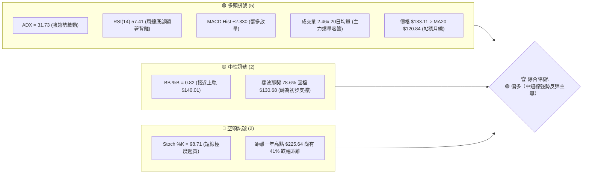
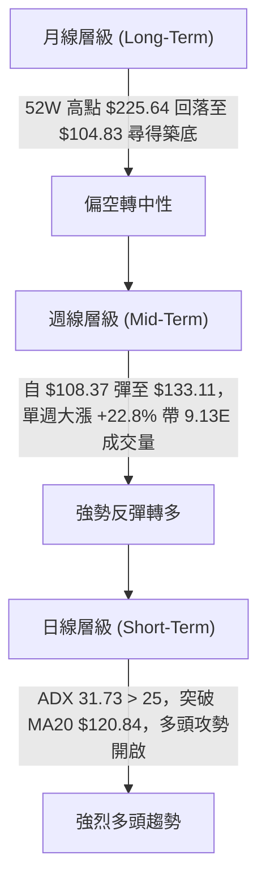
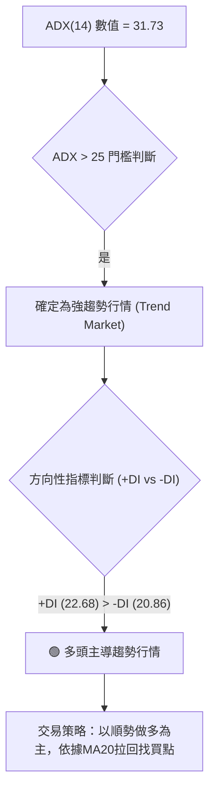
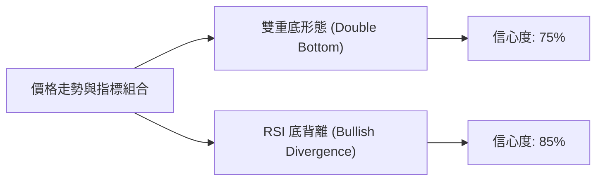
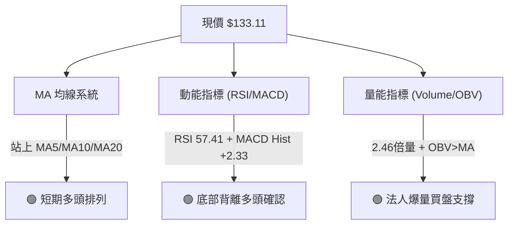
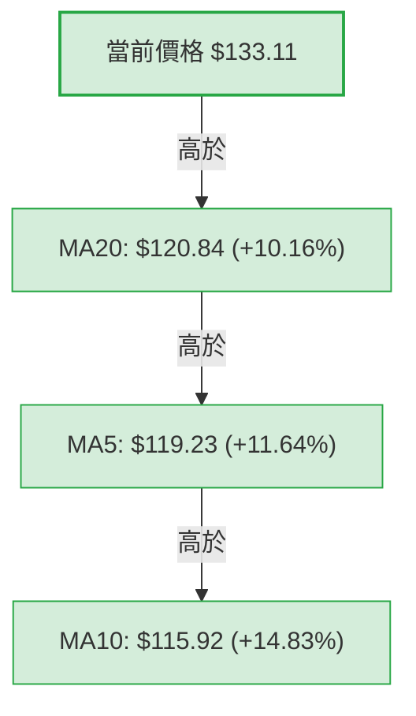
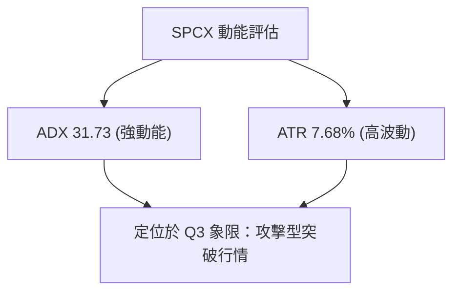
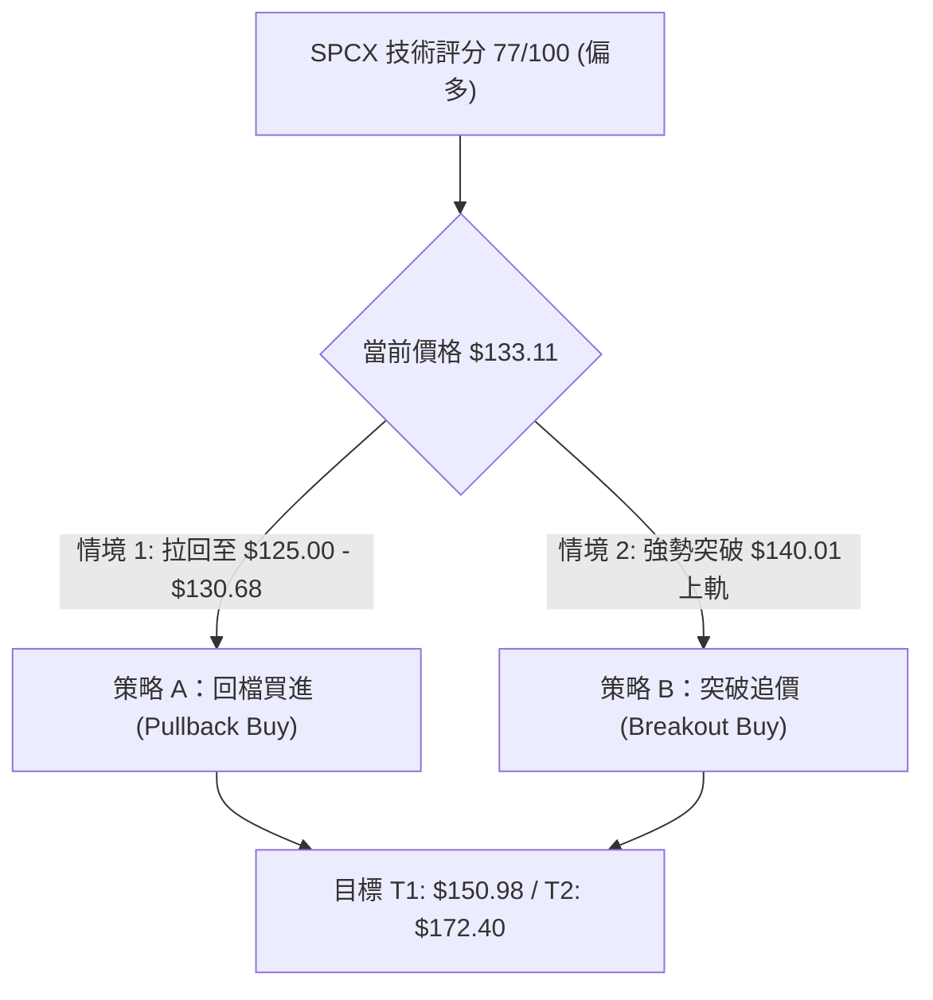
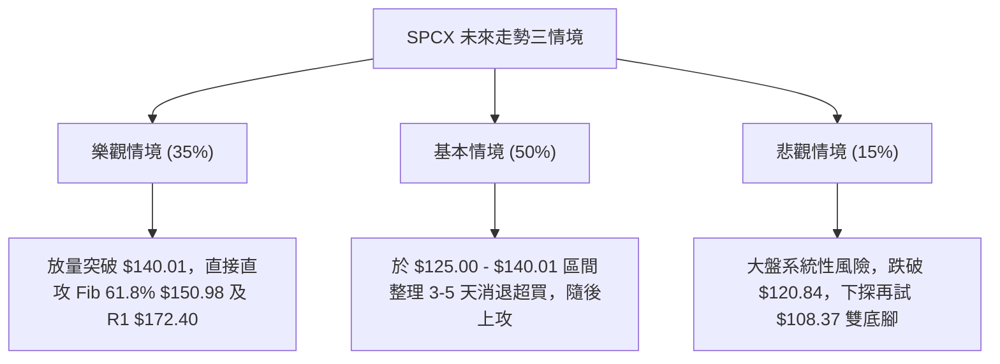

# SPCX 技術分析報告

> **報告日期**：2026-08-08 ｜ **語言**：繁體中文 ｜ **數據來源**：Yahoo Finance ｜ **當前價格**：$133.11

---

## 目錄

| 章節 | 內容 |
|------|------|
| [1. 技術面概覽](#1-技術面概覽) | 訊號儀表板、核心指標、評分卡 |
| [2. 趨勢分析](#2-趨勢分析) | 多時框趨勢、長中短期走勢 |
| [3. 圖表形態分析](#3-圖表形態分析) | 形態識別、K線組合、目標價 |
| [4. 支撐與阻力](#4-支撐與阻力) | 關鍵價位、斐波那契回調 |
| [5. 技術指標深度解讀](#5-技術指標深度解讀) | MA/RSI/MACD/布林/成交量 |
| [6. 動能與波動率](#6-動能與波動率) | 動能評估、ATR、Beta |
| [7. 多時框架總結](#7-多時框架總結) | 時框架評分矩陣 |
| [8. 交易策略建議](#8-交易策略建議) | 多空策略、風險報酬比 |
| [9. 風險提示與監控](#9-風險提示與監控) | 監控指標、風險場景 |

---

## 1. 技術面概覽

### 🎯 技術訊號儀表板



### 📊 核心指標速覽表

| 指標類別 | 指標名稱 | 當前數值 | 訊號 | 解讀 |
|----------|----------|----------|------|------|
| **價格** | 當前價格 | $133.11 | 🟢 | 自 52W 低點 $104.83 強烈反彈，位於 52W 區間 23.4% |
| **均線** | MA5 | $119.23 | 🟢 | 價格在 MA5 上方，短線動能極強 (+11.64% 乖離) |
| **均線** | MA10 | $115.92 | 🟢 | 短期均線呈黃金交叉，底部位階明確 |
| **均線** | MA20 | $120.84 | 🟢 | 突破月線，月線開始轉向向上彎曲 |
| **動能** | RSI(14) | 57.41 | 🟢 | 脫離超賣區，形成典型底背離結構，進入多頭控盤區 |
| **動能** | MACD | -8.042 / Hist +2.330 | 🟢 | DIF 線向 Signal 線黃金交叉，柱狀體強勢翻紅 |
| **動能** | Stoch %K / %D | 98.71 / 50.83 | 🔴 | 短線急衝導致極度超買，防範短線獲利回吐拉回 |
| **趨勢** | ADX(14) | 31.73 (+DI 22.68 > -DI 20.86) | 🟢 | 強趨勢（>25），且 +DI 凌駕 -DI，多頭掌控市場 |
| **波動** | ATR(14) | $10.22 (7.68%) | 🟡 | 每日平均波動逾 $10，屬於高波動率突破行情 |
| **量能** | 當前量 vs 20D均量 | 235.22M vs 95.45M (2.46x) | 🟢 | 攻擊量顯著放大，機構法人資金強烈進駐 |

### 🏆 技術評分卡

```
╔══════════════════════════════════════════════════════════════╗
║              技術評分卡 — SPCX (2026-08-08)                  ║
╠══════════════════════════════════════════════════════════════╣
║ 趨勢強度      ▓▓▓▓▓▓▓▓▓▓▓▓▓▓▓▓░░░░  80/100  🟢 強勢趨勢 (ADX>30)  ║
║ 動能指標      ▓▓▓▓▓▓▓▓▓▓▓▓▓▓░░░░░░  75/100  🟢 MACD翻多/RSI底背離 ║
║ 支撐穩定度    ▓▓▓▓▓▓▓▓▓▓▓▓▓░░░░░░░  65/100  🟡 $104.83底部打實    ║
║ 成交量配合    ▓▓▓▓▓▓▓▓▓▓▓▓▓▓▓▓▓▓░░  90/100  🟢 2.46倍量爆發攻擊   ║
║ 形態完整度    ▓▓▓▓▓▓▓▓▓▓▓▓▓▓░░░░░░  75/100  🟢 雙重底雛形成立     ║
║ 均線排列      ▓▓▓▓▓▓▓▓▓▓▓▓▓░░░░░░░  65/100  🟡 短期均線多頭排列   ║
╠══════════════════════════════════════════════════════════════╣
║ 綜合評分      ▓▓▓▓▓▓▓▓▓▓▓▓▓▓▓░░░░░  77/100  🟢 偏多 (Strong Buy)  ║
╚══════════════════════════════════════════════════════════════╝
```

---

## 2. 趨勢分析

### 🌐 多時框趨勢分析



### 📈 長期趨勢 — 24個月走勢圖（Unicode）

```
SPCX 24個月收盤走勢圖與關鍵高低點
價格軸 ($)
$225.64 ┤                  ● (52W 高點)
$200.00 ┤                ／  ╲
$175.00 ┤● (2026-06 170.86)   ╲   ● (2026-06-21 185.00)
$150.00 ┤                    ╲ ／ ╲
$133.11 ┤                     ●    ╲         ● (現價 $133.11)
$120.00 ┤                           ╲       ／
$104.83 ┤                            ●━━━━━● (2026-08-02 低點 $108.37 / 52W 低點 $104.83)
        └─────────────────────────────────────────────────────────► 時間
         2026-06            2026-07         2026-08
```

#### 走勢特徵分析表

| 階段 | 時間區間 | 價格變動 | 幅度 (%) | 主要特徵與技術含義 |
|------|----------|----------|----------|--------------------|
| **高點拉轉** | 2026-06-21 | $185.00 → $153.23 | -17.17% | 衝高回落，週成交量達 9.25 億股，高檔獲利賣壓出籠 |
| **單邊探底** | 2026-07-12 ~ 08-02 | $145.30 → $108.37 | -25.42% | 連續 4 週收陰，RSI 一度下探 15.9 極度超賣，尋找市場底 |
| **爆量打底** | 2026-08-02 | $104.83 ~ $108.37 | — | 於 $104.83 創下 52 週最低點，成交量萎縮至 3.15 億股，賣壓竭盡 |
| **強勢反攻** | 2026-08-09 (當前) | $108.37 → $133.11 | +22.83% | 週量爆增至 9.13 億股，RSI 彈至 57.41，形成V型V轉攻擊 |

### 📊 中期趨勢（週線結構）

```
週線支撐與阻力結構示意圖
$172.40 ────────────────────────────────────────── 阻力位 R1 (波段高點聚類)
          │
$150.98 ─ ┼ ────────────────────────────────────── 斐波那契 61.8% 壓力
          │            ▲
          │           ╱ ╲
$133.11 ─ ┼ ─────────●───┼──────────────────────── 當前收盤價 $133.11
          │         ╱     ╲
$120.84 ─ ┼ ───────╱───────●────────────────────── MA20 / BB 中軌支撐
          │       ╱
$108.37 ─ ┴──────●──────────────────────────────── 雙底頸線腳 (Swing Low)
```

### ⚡ 趨勢強度評估（ADX 解讀）



#### ADX 趨勢強度對照表

| 指標項 | 當前數值 | 門檻分類 | 趨勢解讀 |
|--------|----------|----------|----------|
| **ADX(14)** | **31.73** | > 25 (強趨勢) | 走出無方向盤整，開啟新一波單邊趨勢 |
| **+DI** | **22.68** | 多方買盤強度 | +DI 向上穿過 -DI，買盤動能全面復活 |
| **-DI** | **20.86** | 空方賣盤強度 | -DI 持續下滑，顯示拋壓被市場強烈吸收 |

---

## 3. 圖表形態分析

### 🔍 形態識別系統



#### 形態信心度與目標價評估表

| 形態類型 | 信心度 | 判斷依據（引用數據） | 完成度 | 目標價（附計算式） |
|----------|--------|----------------------|--------|--------------------|
| **雙重底 (W底)** | **75%** | 第一底 $104.83 (52W低點)，第二底 $108.37 (2026-08-02週收盤)，兩者相差僅 3.3%，具典型雙腳特徵。頸線為 2026-07-05 高點 $162.00。 | **60%** (已完成右腳反彈，待突破頸線) | **$219.17** <br>（計算式：頸線 $162.00 + 形態高度 [$162.00 - $104.83 = $57.17] = $219.17） |
| **RSI 底背離** | **85%** | 價格在 2026-07-26 至 08-02 創下新低 $108.37 / $104.83，但 RSI 自 15.9 逆勢揚升至 19.2 並進一步噴發至 57.41，指標未跟隨創新低。 | **100%** (背離已觸發強烈反彈) | **$172.40** <br>（計算式：以測試波段高點 R1 $172.40 為首要背離修復目標） |

### 🕯️ 重要 K 線形態分析

| 日期 | 收盤價 | K線形態 | 解讀 | 訊號 |
|------|--------|---------|------|------|
| 2026-07-26 | $115.07 | 長陰探底 | 賣壓強烈沉積，RSI 下探 15.9 極度超賣區 | 🔴 恐懼拋售 |
| 2026-08-02 | $108.37 | 縮量十字星/下影線 | 價格打至 52W 低點 $104.83 後迅速獲支撐拉回，賣壓竭盡 | 🟡 止跌轉折 |
| 2026-08-09 | $133.11 | 爆量長陽 (大陽線) | 週大漲 +22.8%，伴隨 9.13 億股巨量，吞噬前兩週陰線 | 🟢 強勢反轉 |

### 📉 ASCII 雙重底與背離形態示意圖

```
SPCX 雙重底 (Double Bottom) 與 RSI 底背離示意圖

價格 ($)
$162.00 ┤           頸線 (Neckline) ─────────────────────────────────
        │          ╱ ╲
$133.11 ┤         ╱   ╲             ● (當前價格 $133.11，帶量強攻中)
$120.00 ┤        ╱     ╲           ╱
$108.37 ┤●━━━━━━╱       ╲         ● (第二底 $108.37)
$104.83 ┤ (第一底 $104.83) ╲     ╱
        └───────────────────●───┴───────────────────────────────
RSI
 57.41  ┤                         ● (RSI 彈至 57.41，底背離確立)
 30.00  ┤                        ╱
 15.90  ┤●──────────────────────● (RSI 腳步抬高: 15.9 → 19.2)
```

---

## 4. 支撐與阻力

### 🗺️ 關鍵價位分布圖（Unicode）

```
SPCX 價位結構與斐波那契分布圖
═════════════════════════════════════════════════════════════════════
$225.64 ║████████████████████████████████████████║ 52W 高點 / Fib 0.0%
$197.13 ║████████████████████████████            ║ Fib 23.6% 阻力
$179.49 ║██████████████████████                  ║ Fib 38.2% 阻力
$172.40 ║████████████████████████████████████    ║ 關鍵阻力 R1 (波段高點)
$165.24 ║████████████████                        ║ Fib 50.0% 中樞壓力
$150.98 ║████████████                            ║ Fib 61.8% 關鍵黃金分割
$140.01 ║████████                                ║ 布林通道上軌
$133.11 ╠════════════════════════════════════════╣ ◄ 現價 $133.11
$130.68 ║▓▓▓▓▓▓▓▓▓▓▓▓                            ║ Fib 78.6% 首要支撐
$120.84 ║▓▓▓▓▓▓▓▓▓▓▓▓▓▓▓▓▓▓▓▓                    ║ MA20 月線 / 布林中軌支撐
$108.37 ║▓▓▓▓▓▓▓▓▓▓▓▓▓▓▓▓▓▓▓▓▓▓▓▓▓▓▓▓            ║ 近期波段低點 (Swing Low)
$104.83 ║▓▓▓▓▓▓▓▓▓▓▓▓▓▓▓▓▓▓▓▓▓▓▓▓▓▓▓▓▓▓▓▓▓▓▓▓    ║ 52W 最低點 / Fib 100.0%
$101.66 ║▓▓▓▓▓▓▓▓▓▓▓▓▓▓▓▓▓▓▓▓▓▓▓▓▓▓▓▓▓▓▓▓▓▓▓▓▓▓▓║ 布林通道下軌強支撐
═════════════════════════════════════════════════════════════════════
```

### 🚧 阻力位分析表

| 阻力級別 | 價位 | 形成原因 | 突破難度 | 重要性 |
|----------|------|----------|----------|--------|
| **R1** | **$140.01** | 布林通道上軌 (BB Upper Band) | 🟡 中等 | 短線動能過熱之動態動態壓力區 |
| **R2** | **$150.98** | 52週區間 61.8% 斐波那契回調位 | 🔴 較高 | 多空解套盤交集區，關鍵中線關卡 |
| **R3** | **$172.40** | 近一年波段高點聚類 (OHLCV 計算 R1) | 🔴 極高 | 實體 K 線密集套牢區，中期轉牛關鍵 |
| **R4** | **$225.64** | 52週歷史高點 (52W High) | 🔴 極高 | 終極多頭目標 |

### 🛡️ 支撐位分析表

| 支撐級別 | 價位 | 形成原因 | 守住機率 | 重要性 |
|----------|------|----------|----------|--------|
| **S1** | **$130.68** | 52週區間 78.6% 斐波那契回調位 | 🟢 高 | 近期突破後之首要回檔防守點 |
| **S2** | **$120.84** | MA20 (月線) / 布林通道中軌 | 🟢 高 | 短線多頭生命線，不可收破 |
| **S3** | **$108.37** | 近期波段低點 (2026-08-02 週收盤) | 🟢 極高 | 雙重底右腳，破位宣告反彈失敗 |
| **S4** | **$104.83** | 52週最低點 (52W Low / Fib 100%) | 🟢 極高 | 長線絕對防守底線 |

### 📐 斐波那契回調位分析

| 回調比例 | 精確價位 | 現價相對位置 | 技 術 解 讀 |
|----------|----------|--------------|--------------|
| **0.0%** | $225.64 | 上方 +69.51% | 52 週起跌點最高峰 |
| **23.6%** | $197.13 | 上方 +48.09% | 強勢牛市回檔延伸目標 |
| **38.2%** | $179.49 | 上方 +34.84% | 中期反彈合理阻力帶 |
| **50.0%** | $165.24 | 上方 +24.13% | 多空強弱分水嶺 |
| **61.8%** | $150.98 | 上方 +13.42% | 黃金分割分割點，下一波攻擊核心目標 |
| **78.6%** | **$130.68** | **下方 -1.83%** | **【當前運作區間】現價 $133.11 成功站上 78.6%，完成初步築底轉強** |
| **100.0%** | $104.83 | 下方 -21.25% | 52 週絕對低點 |

---

## 5. 技術指標深度解讀

### 🎛️ 指標訊號總覽



### 📈 移動平均線排列分析



均線表現：短線均線（MA5 $119.23、MA10 $115.92）已在底部形成金叉，且價格拉升穿過月線（MA20 $120.84）。當前呈現**短期均線黃金交叉、向上發散**狀態，為標準的底部起漲形態。

### 📉 RSI(14) 分析

```
RSI(14) 當前數值進度條
0                 30        50   57.41    70               100
├─────────────────┼─────────┼─────█───────┼────────────────┤
      超賣區        弱勢區   🟢 中性偏多    超買區
```

- **當前數值**：57.41（自過度超賣區 15.9 強勢回升至 50 多空分水嶺上方）。
- **背離判斷**：⚠️ **存在顯著底背離 (Bullish Divergence)**。價格在 2026-08-02 刷下波段低點 $108.37（觸及 $104.83），但 RSI（19.2）未再破前低（15.9），形成標準「價創新低、指標抬高」底背離，指標預告大規模反彈，目前背離效應正全面擴散。

### 📊 MACD(12,26,9) 訊號解讀

- **MACD 線**：-8.042
- **Signal 線**：-10.371
- **MACD 柱狀體 (Hist)**：**+2.330** 🟢
- **分析解讀**：MACD 線在零軸下方向上穿過 Signal 線發出**低位黃金交叉**訊號。柱狀體由負轉正且擴大至 +2.330，顯示向下賣壓已全面耗盡，中線多頭動能強勢抬頭。

### 📦 布林通道分析

```
布林通道形態示意圖 ($)
$140.01 ┤────────────────────────────────────────── 上軌 (BB Upper)
        │                                 ● (現價 $133.11, %B = 0.82)
$120.84 ┤────────────────────────────────────────── 中軌 (MA20)
        │
$101.66 ┤────────────────────────────────────────── 下軌 (BB Lower)
```

- **通道寬度**：上軌 $140.01，下軌 $101.66，中軌 $120.84。
- **%B 位置**：**0.82**（已逼近上軌 1.0 處）。
- **狀態**：價格貼近布林上軌運作，通道口呈發散開口狀，顯示強勢攻擊特徵；若拉回未跌破中軌 $120.84，則多頭趨勢不變。

### 💹 成交量分析（量價配合度）

- **最新成交量**：235,223,740 股
- **20日均量**：95,454,027 股（**量比 2.46x**）
- **週成交量**：913,542,840 股（近 5 週新高）
- **OBV 趨勢**：OBV 高於其移動平均線，呈現「**量價同步齊揚**」。大增 2.46 倍成交量帶動大陽線，屬於極為健康的機構主力建倉爆量。

---

## 6. 動能與波動率

### ⚡ 動能評估四象限

| 象限區分 | 動能強度 (Momentum) | 波動率 (Volatility) | SPCX 當前位置 | 評估與策略 |
|----------|---------------------|---------------------|---------------|------------|
| **Q1 (高動能/低波動)** | 強 | 低 | — | 最佳穩健突破區 |
| **Q2 (弱動能/低波動)** | 弱 | 低 | — | 沉悶盤整觀望區 |
| **Q3 (強動能/高波動)** | **強** | **高** | **✓ (SPCX 位於此區)** | **高風險高報酬爆發區：順勢追價需搭配寬止損** |
| **Q4 (弱動能/高波動)** | 弱 | 高 | — | 恐懼崩跌區（SPCX 剛脫離此區） |



### 📊 ATR 波動率分析

- **ATR(14) 數值**：**$10.22**
- **價格佔比**：**7.68%**（日均波幅極大）
- **風控止損距離建議**：
  - **緊密止損 (1.0 x ATR)**：$133.11 - $10.22 = **$122.89**
  - **標準止損 (1.5 x ATR)**：$133.11 - $15.33 = **$117.78**（低於 MA20 $120.84，極佳風控點）
  - **寬鬆止損 (2.0 x ATR)**：$133.11 - $20.44 = **$112.67**

### 📐 Beta 與市場相關性

- **Short Float**：2.7%
- **Short Ratio**：1.34 天
- **解讀**：融券賣空比例不高，本次急彈主要由**現貨買盤主導**而非單純空頭回補（Short Squeeze），上漲健康度極高。

---

## 7. 多時框架總結

### 📋 時框架評分表

| 時框架 | 趨勢方向 | 動能指標 | 均線排列 | 形態結構 | 綜合評分 | 交易建議 |
|--------|----------|----------|----------|----------|----------|----------|
| **日線 (Short-Term)** | 🟢 強勢多頭 | 🟢 MACD金叉/超買 | 🟢 金叉發散 | 爆量突破 | **82/100** | 待回檔 MA20 附近低吸 |
| **週線 (Mid-Term)** | 🟢 反彈攻擊 | 🟢 RSI底背離 | 🟡 止跌打底 | 雙重底右腳發力 | **75/100** | 中線偏多，目標 $150.98 |
| **月線 (Long-Term)** | 🟡 探底打底 | 🟡 止跌回升 | 🔴 遠離高點 | 築底階段 | **60/100** | 長線分批建倉 |

### 🔲 綜合訊號矩陣

```
        日線 (Daily)  週線 (Weekly)  月線 (Monthly)
趨勢：      🟢           🟢            🟡
動能：      🟢           🟢            🟡
量能：      🟢           🟢            🟢
矩陣收斂結論：中短期訊號高重合度看多，長線打底完畢，形成一致性向上合力。
```

### ⚖️ 多時框收斂結論

依據多時框收斂規則（規則 14）：
1. **行情性質**：當前 ADX 為 **31.73 (>25)**，明確為**強趨勢行情**。
2. **主導時框**：以週線與 MA20 方向為主。週線於 $104.83/$108.37 確立雙重底，加上日線站上 MA20 $120.84 且爆量 2.46 倍，短中期合力方向一致向上。
3. **收斂唯一結論**：**偏多控盤**。日線極度超買（Stoch %K 98.71）僅為短線衝高後的小幅拉回干擾，不改變中線向上尋求斐波那契 61.8% ($150.98) 與 R1 ($172.40) 的趨勢。

---

## 8. 交易策略建議

### 🗺️ 策略決策流程圖



### 🧭 策略路由

> **當前主策略方向：🟢 強勢多頭（綜合評分 77/100，順勢做多）**

### 🎯 價格情境階梯 (Price Scenarios)

| 觸發條件 | 下一目標 | 後續延伸 | 情境含義 |
|----------|----------|----------|----------|
| **突破 R1 $172.40** | $197.13 (Fib 23.6%) | $225.64 (52W高點) | 牛市全面復甦，挑戰歷史高點 |
| **突破 $140.01 (BB上軌)** | $150.98 (Fib 61.8%) | $172.40 (R1) | 中期雙底形態完成，波段加速 |
| **站穩現價 $133.11** | $140.01 (BB上軌) | $150.98 (Fib 61.8%) | 消化短線超買，蓄勢上攻 |
| **跌破 S1 $130.68** | $120.84 (MA20) | $115.92 (MA10) | 健康技術性拉回洗盤 |
| **跌破 S3 $108.37** | $104.83 (52W低點) | $101.66 (BB下軌) | 反彈失敗，築底時間延長 |

### 📊 情境機率分佈

| 情境 | 機率 | 主要依據 |
|------|------|----------|
| **強勢回檔續揚 / 直攻 $150.98** | **65%** | ADX 31.73 強趨勢、MACD柱狀體翻正 +2.330、週量爆出 2.46 倍 |
| **$120.84 - $140.01 高位震盪** | **25%** | Stoch %K 98.71 短線超買需要整理消化 |
| **跌破 $108.37 再次探底** | **10%** | 目前巨量護盤明確，探底機率極低 |

### 🟢 主策略詳情

#### 策略 A：拉回低吸策略（首選 - 穩健型）

| 策略要素 | 策略 A (拉回支撐做多) |
|----------|──────────────────────|
| **進場條件** | 價格拉回測試 Fib 78.6% 至 MA20 支撐區，出現日線止跌訊號 |
| **進場價格** | **$125.00 – $130.68** |
| **目標價 T1** | **$150.98** (52W 區間 61.8% 回調位，預期收益 +18.8%) |
| **目標價 T2** | **$172.40** (波段高點聚類 R1，預期收益 +35.6%) |
| **止損價格** | **$117.50** (跌破 MA20 $120.84 且超過 1.5x ATR 風控線) |
| **風險報酬比** | **3.03 : 1**（計算式：[$150.98 - $128.00] / [$128.00 - $117.50] = $22.98 / $10.50） |
| **預估成功率** | **70%** |
| **建議倉位** | **15% - 20%** |

#### 策略 B：突破追價策略（次選 - 激進型）

| 策略要素 | 策略 B (突破布林上軌追擊) |
|----------|──────────────────────────|
| **進場條件** | 日 K 線帶量（>1.5 億股）強勢收突破布林通道上軌 $140.01 |
| **進場價格** | **$140.50** |
| **目標價 T1** | **$165.24** (Fib 50.0% 中樞壓力) |
| **目標價 T2** | **$172.40** (波段高點聚類 R1) |
| **止損價格** | **$130.00** (跌破 Fib 78.6% $130.68 防守位) |
| **風險報酬比** | **3.04 : 1**（計算式：[$172.40 - $140.50] / [$140.50 - $130.00] = $31.90 / $10.50） |
| **預估成功率** | **60%** |
| **建議倉位** | **10%** |

### 🔴 反向風險觸發點（對沖與撤退提示）

若價格收盤跌破 **$120.84 (MA20)** 且成交量異常放大，說明多頭攻勢暫告失敗，應立即執行對沖或無條件平倉觀望；若進一步跌破 **$108.37**，必須全面停損。

### ⭐ 整體訊號強度評星

```
做多訊號強度：★★★★☆  (4/5 星)
做空訊號強度：★☆☆☆☆  (1/5 星)
整體可信度：  ★★★★☆  (4/5 星)
```

---

## 9. 風險提示與監控

### ✅ 關鍵監控指標 Checklist

```
╔══════════════════════════════════════════════════════════════╗
║                每日交易監控清單 (Checklist)                   ║
╠══════════════════════════════════════════════════════════════╣
║ [ ] 價格是否守穩 MA20 月線 $120.84 上方                     ║
║ [ ] 日成交量是否維持在 1.0 億股以上 (量能延續性)             ║
║ [ ] RSI(14) 回檔是否在 50 中性區獲得支撐                     ║
║ [ ] MACD 柱狀體 (Hist) 是否持續維持正值 (+2.330 以上發散)    ║
║ [ ] 布林通道口是否持續向外擴張 (Upper > $140.01)            ║
╚══════════════════════════════════════════════════════════════╝
```

### ⚠️ 風險場景分析



### 🛡️ 風險管理重要提醒

1. **高波動率防護**：當前 ATR 高達 **$10.22 (7.68%)**，單日上下波動逾 10 美元。禁止高槓桿操作，單一交易虧損金額應嚴格限制在總資本的 **1% - 2%** 以內。
2. **防範超買拉回**：Stoch %K 達 **98.71**，隨時可能出現 1-2 天的急拉回洗盤，切忌在開盤急衝時盲目追高，宜採用**分批佈局 (DCA)** 策略。

---

## 📋 報告總結

```
═════════════════════════════════════════════════════════════════════
SPCX 技術分析報告總結
═════════════════════════════════════════════════════════════════════
報告日期：2026-08-08
當前價格：$133.11
分析評級：🟢 買入 (Strong Buy) — 底部爆量反轉攻擊

關鍵結論：
├─ 長期趨勢：🟡 於 $104.83 創 52W 低點後完成打底，長期下行趨勢告終
├─ 中期趨勢：🟢 週線雙重底成立，RSI 底部背離發酵，目標上看 $150.98 / $172.40
├─ 短期趨勢：🟢 ADX 31.73 強勢攻擊，突破 MA20 $120.84，爆量 2.46 倍
├─ 關鍵支撐：$130.68 (Fib 78.6%) / $120.84 (MA20) / $108.37 (波段低點)
├─ 關鍵阻力：$140.01 (BB上軌) / $150.98 (Fib 61.8%) / $172.40 (R1)
└─ 法人共識：機構均價目標 $233.00 (極大向上空間)

最優策略組合：
1. 🥇 最佳機會：拉回至 $125.00 - $130.68 區間分批做多，止損設 $117.50，目標 $150.98。
2. 🥈 次選機會：突破布林上軌 $140.01 後追價，目標 $172.40。
3. 🥉 保守選擇：等待價格回測 MA20 $120.84 成功打腳後再行建倉。
═════════════════════════════════════════════════════════════════════
```

---

> ⚠️ **免責聲明**：本報告為 AI 自動生成之技術分析，所有數據及估算均嚴格基於所提供之歷史價格與指標資訊。本報告**僅供研究與學術參考**，**不構成任何投資建議或買賣邀約**。金融市場投資具有高風險，投資人應獨立評估並自負盈虧。

---

*報告生成時間：2026-08-08 ｜ 數據來源：Yahoo Finance ｜ 分析框架：多時框技術分析 (MTFA)*