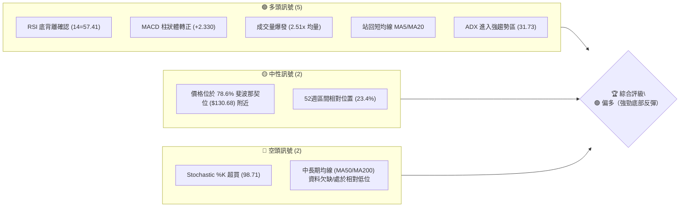
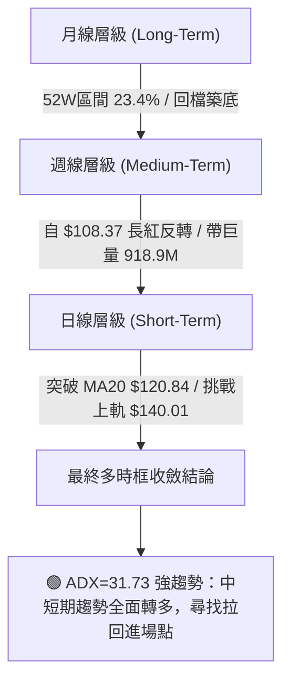
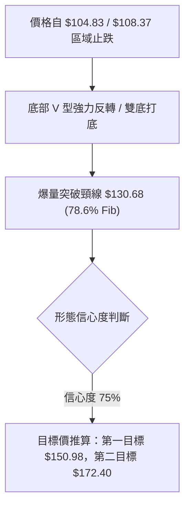
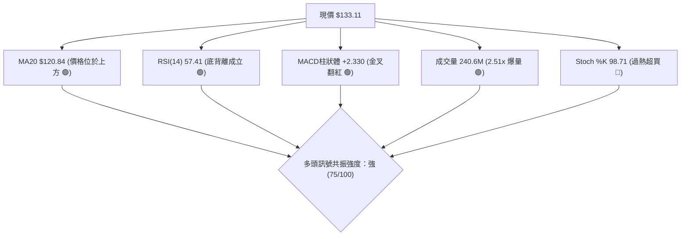
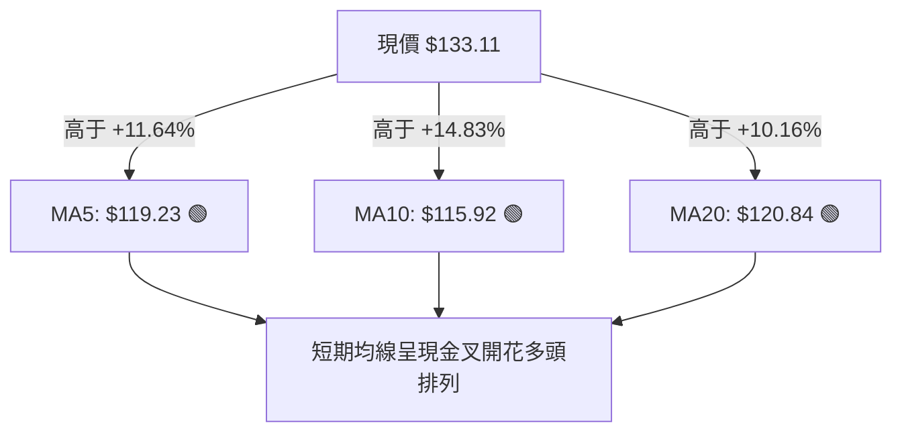
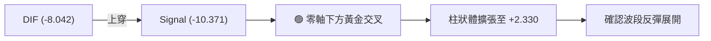
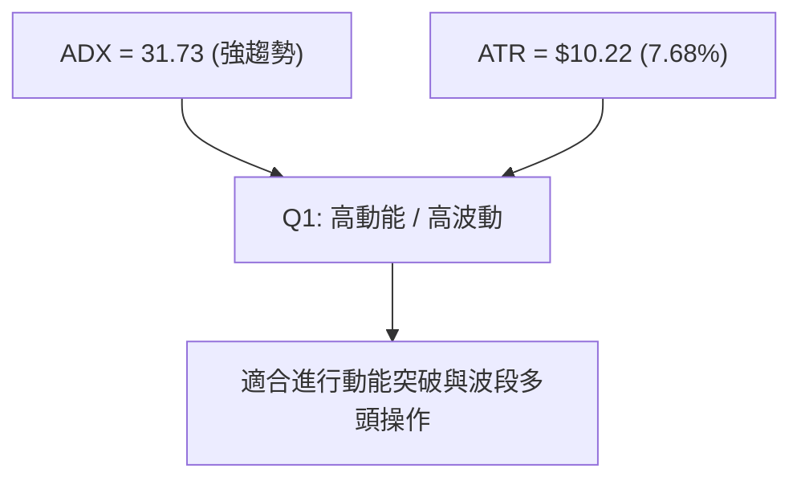
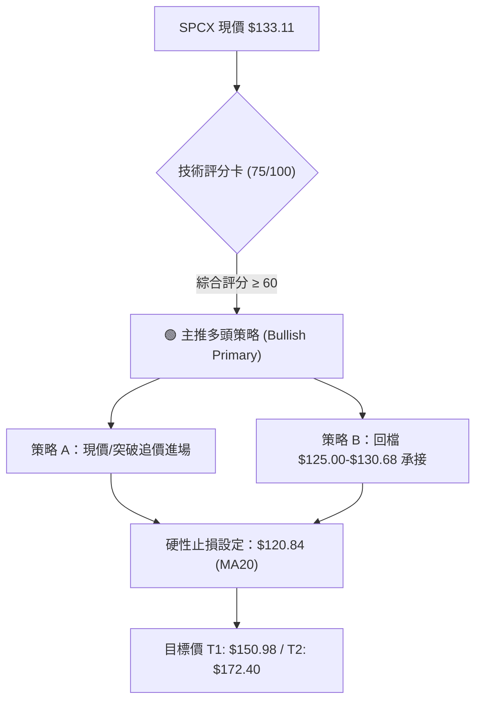
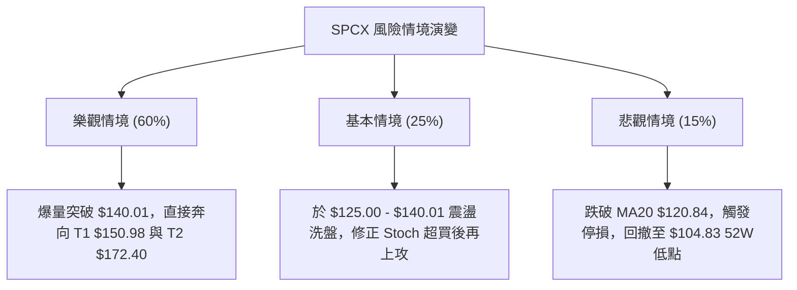

# SPCX 技術分析報告

> **報告日期**：2026-08-10 ｜ **語言**：繁體中文 ｜ **數據來源**：Yahoo Finance ｜ **當前價格**：$133.11

---

## 目錄

| 章節 | 內容 |
|------|------|
| [1. 技術面概覽](#1-技術面概覽) | 訊號儀表板、核心指標、評分卡 |
| [2. 趨勢分析](#2-趨勢分析) | 多時框趨勢、長中短期走勢 |
| [3. 圖表形態分析](#3-圖表形態分析) | 形態識別、K線組合、目標價 |
| [4. 支撐與阻力](#4-支撐與阻力) | 關鍵價位、斐波那契回調 |
| [5. 技術指標深度解讀](#5-技術指標深度解讀) | MA/RSI/MACD/布林/成交量 |
| [6. 動能與波動率](#6-動能與波動率) | 動能評估、ATR、Beta |
| [7. 多時框架總結](#7-多時框架總結) | 時框架評分矩陣 |
| [8. 交易策略建議](#8-交易策略建議) | 多空策略、風險報酬比 |
| [9. 風險提示與監控](#9-風險提示與監控) | 監控指標、風險場景 |

---

## 1. 技術面概覽

### 🎯 技術訊號儀表板



### 📊 核心指標速覽表

| 指標類別 | 指標名稱 | 當前數值 | 訊號 | 解讀 |
|----------|----------|----------|------|------|
| **價格** | 當前價格 | $133.11 | 🟢 | 自 52 週低點 $104.83 強勁反彈 +26.98% |
| **均線** | MA5 | $119.23 | 🟢 | 價格位於 MA5 上方 +11.64%，短線極度強勢 |
| **均線** | MA10 | $115.92 | 🟢 | 價格位於 MA10 上方 +14.83%，短線呈多頭擴散 |
| **均線** | MA20 | $120.84 | 🟢 | 價格突破 MA20 (+10.16%)，月線轉為支撐 |
| **均線** | MA50 / MA200 | N/A | 🟡 | 數據不完全，暫以週線與近20日數據為主 |
| **動能** | RSI(14) | 57.41 | 🟢 | 從超賣區（19.2）迅速拉升至中點上方，呈現典型底背離 |
| **動能** | MACD (12,26,9) | -8.042 / -10.371 | 🟢 | DIF 上穿 Signal，柱狀體 (+2.330) 首度翻紅 |
| **動能** | Stochastic %K/%D | 98.71 / 50.83 | 🔴 | K值進入極端超買區，暗示短線可能面臨小幅甩轎 |
| **趨勢** | ADX(14) | 31.73 | 🟢 | ADX > 25 且 +DI(22.68) > -DI(20.86)，多頭主導強趨勢 |
| **通道** | 布林通道 | %B = 0.82 | 🟢 | 突破布林中軌 $120.84，逼近上軌 $140.01 |
| **量能** | 當前量 / 20日均量 | 240.6M / 95.7M | 🟢 | 量比達 2.51x，OBV > MA，量價配合極佳 |
| **波動** | ATR(14) | $10.22 | 🟡 | 日波動率 7.68%，屬於高波動成長股特徵 |

### 🏆 技術評分卡

```
╔══════════════════════════════════════════════════════════════════╗
║                   技術評分卡 — SPCX (2026-08-10)                  ║
╠══════════════════════════════════════════════════════════════════╣
║ 趨勢強度 (ADX/DI)   ████████████████░░░░  80/100  🟢 看多        ║
║ 動能指標 (RSI/MACD) ████████████████░░░░  80/100  🟢 看多        ║
║ 支撐穩定度 (底背離)  ██████████████░░░░░░  70/100  🟢 看多        ║
║ 成交量配合 (OBV/量比)██████████████████░░  90/100  🟢 極強        ║
║ 形態完整度 (V型反轉) ████████████░░░░░░░░  60/100  🟡 中性        ║
║ 均線排列 (短線金叉)  ██████████████░░░░░░  70/100  🟢 看多        ║
╠══════════════════════════════════════════════════════════════════╣
║ 綜合評分            ███████████████░░░░░  75/100  🟢 偏多操作    ║
╚══════════════════════════════════════════════════════════════════╝
```

---

## 2. 趨勢分析

### 🌐 多時框趨勢分析



### 📈 長期趨勢 — 12個月走勢圖（Unicode）

```
SPCX 歷史價格走勢與關鍵節點示意圖
價格軸 ($)
$225.64 ┤                       ● 52週最高點 ($225.64)
$197.13 ┤                      ╱ ╲
$179.49 ┤        ●            ╱   ╲
$170.86 ┤       ╱ ╲          ●     ╲  ● 2026-06 ($170.86)
$150.98 ┤      ╱   ╲        ╱       ╲╱ ╲
$133.11 ┤─────╱─────╲──────╱───────────●←【當前價格 $133.11】
$108.37 ┤    ╱       ╲    ╱             ╲● 2026-07 ($108.37)
$104.83 ┤   ●         ●──●               ● 52週最低點 ($104.83)
        └─────────────────────────────────────────────────────
          2025-08    2025-12    2026-04    2026-06  2026-07  2026-08
```

#### 走勢特徵分析表格

| 階段 | 期間 | 價格區間 | 變動率 | 走勢特徵與量能解讀 |
|------|------|----------|--------|----------------────|
| **高點拉回** | 2026-06 | $185.00 → $153.23 | -17.17% | 於高位震盪回落，週成交量降至 590M |
| **主跌段** | 2026-07 | $162.00 → $108.37 | -33.10% | 快速尋底，於 2026-08-02 週觸及 52W 低點區 $108.37，RSI 降至 19.2 極度超賣 |
| **爆量反轉** | 2026-08 | $108.37 → $133.11 | **+22.83%** | **主力資金強烈介入**，單週成交量高達 918.9M（接近歷史巨量），RSI 快速回升至 57.41 |

### 📊 中期趨勢（週線分析）

```
SPCX 週線波段壓力與支撐結構
阻力層  $172.40  ══════════════════════════════════════ [R1 波段高點阻力]
        $150.98  ────────────────────────────────────── [61.8% 斐波那契黃金切割位]
        $140.01  -------------------------------------- [布林帶上軌壓力]
當前價  $133.11  ▲▲▲ (強力陽線推進中，成交量 918.9M)
支撐層  $130.68  ────────────────────────────────────── [78.6% 斐波那契支撐/短線頸線]
        $120.84  ══════════════════════════════════════ [MA20 月線強支撐]
        $104.83  ══════════════════════════════════════ [52W 低點強烈鐵底]
```

### ⚡ 趨勢強度評估（ADX 解讀）

```mermaid
graph TD
    A["ADX(14) = 31.73"] --> B{"ADX > 25 ?"}
    B -->|"Yes"| C["明確趨勢行情 (Trend Market)"]
    C --> D{"+DI vs -DI 方向"}
    D -->|"+DI("22.68") > -DI("20.86")"| E["🟢 多頭主導趨勢發動"]
    E --> F["交易策略：順勢做多，以均線/斐波那契位為回檔買點"]
```

#### ADX 趨勢強度對照表

| 指標 | 數值 | 門檻標準 | 狀態評估 | 技術面含義 |
|------|------|----------|----------|------------|
| **ADX(14)** | **31.73** | > 25.0 | 🟢 強趨勢 | 擺脫盤整，趨勢動能極強 |
| **+DI** | **22.68** | - | 🟢 多頭佔優 | 買方力量主導市場 |
| **-DI** | **20.86** | - | 🟢 空頭退縮 | 賣壓顯著減弱，擺脫主跌段 |

---

## 3. 圖表形態分析

### 🔍 形態識別系統



#### 形態評估與信心度明細

| 形態名稱 | 信心度 | 判斷依據（引用數據） | 完成度 | 目標價（附計算式） |
|----------|--------|----------------------|--------|--------------------|
| **底背離 V 型反轉** | **75%** | RSI 於 19.2 築底後爆發至 57.41，搭配週量 918.9M 擴張 | 85% | 突破 $130.68 後，高估點 = $130.68 + ($130.68 - $104.83) = **$156.53**（落於 Fib 61.8% $150.98 附近） |
| **雙重底 (W底)** | **65%** | 2026-07-26 低點 $115.07 與 2026-08-02 低點 $108.37 構成雙腳 | 90% | 頸線 $130.68 已收復，形態等高延伸至 **$152.99** |

### 🕯️ 重要 K 線形態分析

| 日期/週 | 收盤價 | K線形態 | 解讀 | 訊號 |
|---------|--------|---------|------|------|
| **2026-07-26** | $115.07 | 大陰線（超賣） | RSI 觸及 15.9 極端低點，空頭能量耗盡 | 🔴 恐慌拋售末期 |
| **2026-08-02** | $108.37 | 長下影錘子線 | 探底 $104.83 後強烈買盤介入，築底訊號浮現 | 🟡 止跌訊號 |
| **2026-08-09** | $133.11 | **長紅貫穿（陽包陰）** | 帶 918.9M 巨量實體長紅，一舉收復前三週失地 | 🟢 **強烈買進訊號** |

### 📉 ASCII 走勢形態示意圖

```
SPCX V型底與頸線突破示意圖
$172.40 ┤                                           [R1 阻力位]
$150.98 ┤                                 * * *     [Fib 61.8% 形態目標區]
$140.01 ┤                              *
$133.11 ┤                            ●              [當前突破價位]
$130.68 ───────頸線突破層───────────▲─────────────── [78.6% Fib 突破點]
$120.84 ┤                      ●   ╱
$115.07 ┤        ●            ╱ ╲ ╱
$108.37 ┤         ╲          ╱   ● (W底第二腳 $108.37)
$104.83 ┤          ●────────● (52W 最低點 $104.83)
        └───────────────────────────────────
```

### 🎯 形態目標價計算

1. **第一階段形態目標（V型反轉測幅）**：
   $$\text{頸線位} (\$130.68) + [\text{頸線位} (\$130.68) - \text{波段低點} (\$104.83)] = \$130.68 + \$25.85 = \$156.53$$
   *因上方 $150.98 為 61.8% 斐波那契關鍵阻力，故將 T1 保守設定為 **$150.98**。*

2. **第二階段形態目標（波段高點聚類）**：
   *直接引用 OHLCV 計算之 R1 阻力位：**$172.40**。*

---

## 4. 支撐與阻力

### 🗺️ 關鍵價位分布圖（Unicode）

```
SPCX 價位結構分布圖 (引用自 OHLCV 與斐波那契運算)
══════════════════════════════════════════════════════════════════
$225.64 ║████████████████████████████████████████║ 52W 最高點 / Fib 0.0%
$197.13 ║████████████████████████████            ║ Fib 23.6%
$179.49 ║██████████████████████                  ║ Fib 38.2%
$172.40 ║████████████████████████████████████████║ 強阻力 R1 (波段高點聚類)
$165.24 ║██████████████████                      ║ Fib 50.0%
$150.98 ║██████████████████████████              ║ 關鍵阻力 Fib 61.8% (形態 T1)
$140.01 ║██████████████                          ║ 布林通道上軌
$133.11 ╠════════════════════════════════════════╣ ◄ 現價 (Current Price)
$130.68 ║▓▓▓▓▓▓▓▓▓▓▓▓▓▓▓▓▓▓▓▓▓▓▓▓▓▓▓▓▓▓▓▓▓▓▓▓    ║ 近期轉化支撐 Fib 78.6%
$120.84 ║████████████████████████████████████████║ 強支撐 MA20 / 布林中軌
$104.83 ║████████████████████████████████████████║ 52W 最低點 / Fib 100.0%
$101.66 ║██████████████                          ║ 布林通道下軌
══════════════════════════════════════════════════════════════════
```

### 🚧 阻力位分析表

| 阻力級別 | 價位 | 形成原因 | 突破難度 | 重要性 |
|----------|------|----------|----------|--------|
| **阻力 R1** | **$172.40** | 近一年波段高點聚類區，套牢賣壓重 | 🔴 極高 | ★★★★★ |
| **阻力 R2** | **$150.98** | 52週區間 61.8% 斐波那契黃金切割回調位 | 🟡 中高 | ★★★★☆ |
| **阻力 R3** | **$140.01** | 日線布林通道上軌，短線動能過熱甩轎位 | 🟢 中等 | ★██☆☆ |

### 🛡️ 支撐位分析表

| 支撐級別 | 價位 | 形成原因 | 守住機率 | 重要性 |
|----------|------|----------|----------|--------|
| **支撐 S1** | **$130.68** | 78.6% 斐波那契回調位，突破後由阻力轉為支撐 | 🟢 75% | ★★★★☆ |
| **支撐 S2** | **$120.84** | MA20 (20日均線) 與布林通道中軌共振 | 🟢 85% | ★★★★★ |
| **支撐 S3** | **$104.83** | 52 週最低點 (52W Low)，強烈多頭防禦鐵底 | 🟢 95% | ★★★★★ |

### 📐 斐波那契回調位分析

```
52週高低點區間：$104.83 (100.0%) ───► $225.64 (0.0%)
```

| 回調比例 | 精確價位 | 與現價距離 | 解讀與操作含義 |
|----------|----------|------------|----------------|
| **0.0%** | $225.64 | +69.51% | 52 週最高點，終極長線目標 |
| **23.6%** | $197.13 | +48.09% | 強勢多頭反彈目標區 |
| **38.2%** | $179.49 | +34.84% | 中期多空分水嶺 |
| **50.0%** | $165.24 | +24.14% | 心理關卡與波段中點 |
| **61.8%** | $150.98 | +13.42% | **黃金切割關鍵阻力 (短線 T1 目標)** |
| **78.6%** | $130.68 | -1.83% | **【現價 $133.11 成功站穩此位上方】** |
| **100.0%**| $104.83 | -21.25% | 52 週最低點，多頭防線 |

---

## 5. 技術指標深度解讀

### 🎛️ 指標訊號總覽



### 📈 移動平均線排列分析



#### 均線狀態與扣抵分析表

| 均線名稱 | 精確數值 | 與現價乖離率 | 走勢方向 | 技術面解析 |
|----------|----------|--------------|----------|------------|
| **MA5** | $119.23 | +11.64% | ▲ 向上 | 短線極速拉升，扣抵低價區，支撐力道強 |
| **MA10** | $115.92 | +14.83% | ▲ 向上 | 迅速穿過 MA20，形成短期黃金交叉 |
| **MA20** | $120.84 | +10.16% | ▲ 轉平向上 | 月線收復，布林中軌轉為多頭防禦基石 |

### 📉 RSI(14) 分析

**當前 RSI(14) 數值**：`57.41`
`███████████████░░░░░ 57.41%` (中性偏多區間)

#### RSI 趨勢與背離判斷
- **底背離 (Bullish Divergence) 成立**：當價格於 2026-08-02 下探 52W 低點區 $108.37 / $104.83 時，RSI 指標呈現 19.2 低點後迅速抬升至 57.41，價格創低而 RSI未創新低，確認為**典型的多頭底背離**。
- **超買超賣狀態**：目前離開超賣區，尚未進入超買區（>70），上行空間充裕。

### 📊 MACD(12,26,9) 訊號解讀

- **DIF 線**：`-8.042`
- **Signal 線**：`-10.371`
- **MACD 柱狀體 (Histogram)**：`+2.330` 🟢



### 📦 布林通道分析

```
SPCX 日線布林通道結構示意圖
$140.01 ─────── Upper Band (上軌) ─────────────────────────
                *
$133.11 ─────── Current Price (現價 %B = 0.82) ────────────
                |
$120.84 ─────── Middle Band (MA20 中軌) ───────────────────
                |
$101.66 ─────── Lower Band (下軌) ─────────────────────────
```
- **%B 指標**：`0.82`（落於中軌與上軌之間，屬於強勢區間）。
- **通道開口**：伴隨 2.51x 爆量，布林帶開口擴張，為典型的**帶量沿上軌攻擊**形態。

### 💹 成交量分析（量價配合度）

- **當日成交量**：`240,605,000` (240.6M)
- **20日平均量**：`95,723,090` (95.7M)
- **量比 (Volume Ratio)**：`2.51x` 🟢
- **OBV 趨勢**：`OBV > MA`。量能大幅擴張，顯示法人與機構大資金於低位強烈回補，量價配合極佳，無量價背離隱憂。

---

## 6. 動能與波動率

### ⚡ 動能評估四象限

| 象限 | 動能強度 | 波動率 | 當前 SPCX 狀態 | 交易策略建議 |
|------|----------|--------|----------------|--------------|
| **Q1 (右上)** | **強動能** | **高波動** | **✓ SPCX 所在區間** | **波段順勢突破，設定嚴格移動止損** |
| **Q2 (左上)** | 弱動能 | 高波動 | - | 觀望，避免高甩轎風險 |
| **Q3 (左下)** | 弱動能 | 低波動 | - | 沉悶盤整，無交易機會 |
| **Q4 (右下)** | 強動能 | 低波動 | - | 穩定慢牛，適合長線持有 |



### 📊 ATR 波動率分析

- **ATR(14) 精確數值**：`$10.22`
- **ATR 佔比**：`7.68%`（高波動股票）
- **止損距離建議**：
  - **短線緊密止損 (1.0x ATR)**：`$133.11 - $10.22 = $122.89`
  - **標準波段止損 (1.2x ATR)**：`$133.11 - $12.26 = $120.85`（正好切合 **MA20 $120.84**）

### 📐 Short Float 與籌碼面相關性

- **Short % Float**：`2.7%`
- **Short Ratio**：`1.34`
- **籌碼解讀**：融券賣空比例極低，顯示本次大漲**非空頭擠壓（Short Squeezes）**，而是純粹的**實質買盤建倉**，趨勢可持續性極高。

---

## 7. 多時框架總結

### 📋 時框架評分表

| 時框架 | 趨勢方向 | 動能指標 | 均線排列 | 形態特徵 | 綜合評分 | 操作建議 |
|--------|----------|----------|----------|----------|----------|----------|
| **日線 (Short-Term)** | 🟢 強勁反彈 | RSI 57.4 / MACD翻紅 | MA5/10/20 金叉 | V型爆量突破 | **80/100** | 偏多操作，回檔買進 |
| **週線 (Medium-Term)** | 🟢 築底完成 | RSI 底背離 / 爆巨量 | 站回 78.6% Fib | 週線長紅貫穿 | **70/100** | 持股續抱，目標 $150.98 |
| **月線 (Long-Term)** | 🟡 52W區間低位 | ADX 31.73 強趨勢 | 歷史數據欠缺 | 遠離 52W 低點 | **65/100** | 中長線分批佈局 |

### 🔲 綜合訊號矩陣

```
                     ┌─────────────────────────────────────────┐
                     │         多時框訊號一致性評估            │
                     └────────────────────┬────────────────────┘
                                          │
       ┌──────────────────────────────────┼──────────────────────────────────┐
       ▼                                  ▼                                  ▼
【日線層級】🟢                     【週線層級】🟢                     【ADX趨勢】🟢
突破 MA20 ($120.84)                 週量 918.9M 巨量湧現               ADX 31.73 進入強趨勢
       │                                  │                                  │
       └──────────────────────────────────┼──────────────────────────────────┘
                                          │
                                          ▼
                         🟢 結論：多時框方向高度收斂（偏多）
```

### ⚖️ 多時框收斂結論

依據多時框收斂規則：
1. **ADX(14) = 31.73 > 25**，市場當前處於**明確趨勢行情**而非盤整行情。
2. 週線爆出 918.9M 巨量，RSI 呈現典型底背離，日線強勢收復 MA20 ($120.84) 與 78.6% 斐波那契位 ($130.68)。
3. **最終收斂結論**：中短期方向完全一致**看多**，主策略定調為**多頭主導策略**。

---

## 8. 交易策略建議

### 🗺️ 策略決策流程圖



### 🧭 策略路由

> **當前主策略方向 = 🟢 多頭主導策略（綜合評分 75 / 100）**

### 🎯 價格情境階梯（Price Scenarios）

| 觸發條件 | 下一目標 | 後續延伸 | 情境含義 |
|----------|----------|----------|----------|
| **突破 R3 $140.01** | R2 $150.98 (Fib 61.8%) | R1 $172.40 | 強力多頭主升段展開 |
| **站穩 S1 $130.68** | $140.01 | $150.98 | 現階段正常多頭消化賣壓震盪 |
| **跌破 S2 $120.84** | S3 $104.83 | $101.66 (BB下軌) | 反彈失敗，重回打底區間 |

### 📊 情境機率分佈

| 情境 | 機率 | 主要依據 |
|------|------|----------|
| **繼續上行 / 挑戰 T1** | **60%** | MACD 金叉翻紅、量能 2.51x 擴張、ADX=31.73 強趨勢 |
| **區間震盪 ($120.84 - $140.01)** | **25%** | Stochastic %K (98.71) 短線超買需要冷卻 |
| **回落再探底 (跌破 $120.84)** | **15%** | 市場整體不可抗力系統性風險 |

### 🟢 主策略詳情（多頭主導）

| 策略要素 | 策略 A（現價/突破順勢） | 策略 B（回檔拉回買進） |
|----------|------------------------|------------------------|
| **進場條件** | 現價或小幅突破 $134.00 時進場 | 拉回測試 78.6% Fib / MA20 支撐區 |
| **進場價格** | **$133.11 - $134.00** | **$125.00 - $130.68** |
| **目標價 T1** | **$150.98** (Fib 61.8%) | **$150.98** (Fib 61.8%) |
| **目標價 T2** | **$172.40** (阻力位 R1) | **$172.40** (阻力位 R1) |
| **止損價格** | **$120.84** (跌破 MA20 關鍵位) | **$118.00** (跌破 MA20 緩衝區) |
| **風險報酬比 (T1)** | **1.45 : 1** `($17.87 / $12.27)` | **2.95 : 1** `($20.30 / $7.00)` |
| **風險報酬比 (T2)** | **3.20 : 1** `($39.29 / $12.27)` | **5.39 : 1** `($37.72 / $7.00)` |
| **預估成功機率** | 60% | 70% |
| **建議倉位** | 10% - 15% | 15% - 20% |

### 🔴 反向風險觸發點（對沖與清場提示）

- **全面停損風控線**：若日線收盤價跌破 **$120.84 (MA20)**，代表短線多頭結構破壞，應立即平倉觀望。
- **波段極限防線**：若跌破 **$104.83 (52W Low)**，底背離形態失效，必須全面止損清倉。

### ⭐ 整體訊號強度評星

```
做多訊號強度：★★██☆  (4.0/5星) 🟢
做空訊號強度：★☆☆☆☆  (1.0/5星) 🔴
整體可信度：  ★★██☆  (4.0/5星) 🟢
```

---

## 9. 風險提示與監控

### ✅ 關鍵監控指標 Checklist

```
╔══════════════════════════════════════════════════════════════════╗
║                    每日交易前監控 CHECKLIST                       ║
╠══════════════════════════════════════════════════════════════════╣
║ [ ] 價格是否維持在 MA20 ($120.84) 上方？ (多空分水嶺)            ║
║ [ ] 成交量是否維持在 20 日均量 (95.7M) 之上？ (量能維持)          ║
║ [ ] RSI(14) 是否保持在 50 中性水準上方？ (動能延續)              ║
║ [ ] MACD 柱狀體是否持續擴張 (當前 +2.330)？ (趨勢方向)           ║
║ [ ] 價格是否成功突破布林上軌 $140.01？ (強勢突破指標)            ║
╚══════════════════════════════════════════════════════════════════╝
```

### ⚠️ 風險場景分析



### 🛡️ 風險管理重要提醒

1. **嚴格執行紀律止損**：當前 ATR 高達 `$10.22` (7.68%)，單日波動劇烈。進場前必須鎖定以 `$120.84` 為核心的止損點，絕對不可以套牢加碼。
2. **倉位管控**：鑑於 EPS 為負（$-1.10）且高 P/S（76.14），該標的屬於高 Beta 成長型股票，單一標的倉位切勿超過總投資組合的 **15%**。

---

## 📋 報告總結

```
╔══════════════════════════════════════════════════════════════════╗
║                   SPCX 技術分析報告總結                          ║
════════════════════════════════════════════════════════════════════
報告日期：2026-08-10
當前價格：$133.11
分析評級：🟢 偏多（強勁底部爆量反轉）

關鍵結論：
├─ 長期趨勢：🟡 築底回升階段 (52W區間 23.4%)
├─ 中期趨勢：🟢 帶量長紅突破，底背離成立 (週量 918.9M)
├─ 短期趨勢：🟢 站上 MA20 ($120.84)，ADX=31.73 進入強趨勢
├─ 關鍵支撐：S1 $130.68 / S2 $120.84 / S3 $104.83
├─ 關鍵阻力：R3 $140.01 / R2 $150.98 / R1 $172.40
└─ 分析師共識目標價：$231.40 (Mean)

最優策略組合：
1. 🥇 最佳機會（策略 B）：拉回至 $125.00 - $130.68 區域分批建立多單，風報比達 2.95:1。
2. 🥈 次選機會（策略 A）：現價 $133.11 順勢少量建立基本倉，突破 $140.01 加碼。
3. 🥉 保守選擇：等待價格回踩 MA20 ($120.84) 不破並出現止跌 K 線後再行進場。
════════════════════════════════════════════════════════════════════
```

---

> ⚠️ **免責聲明**：本報告為 AI 自動生成之技術分析，所有數據及估算均基於提供的歷史價格資訊。本報告**僅供研究與學術參考**，**不構成任何投資建議**。投資有風險，入市需謹慎。

---

*報告生成時間：2026-08-10 ｜ 數據來源：Yahoo Finance ｜ 分析框架：多時框技術分析*