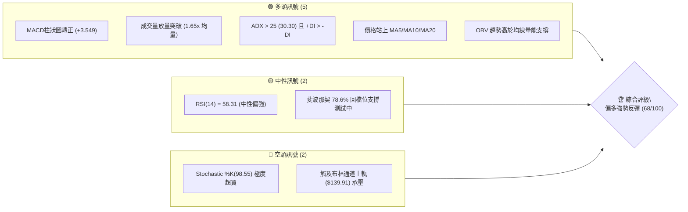
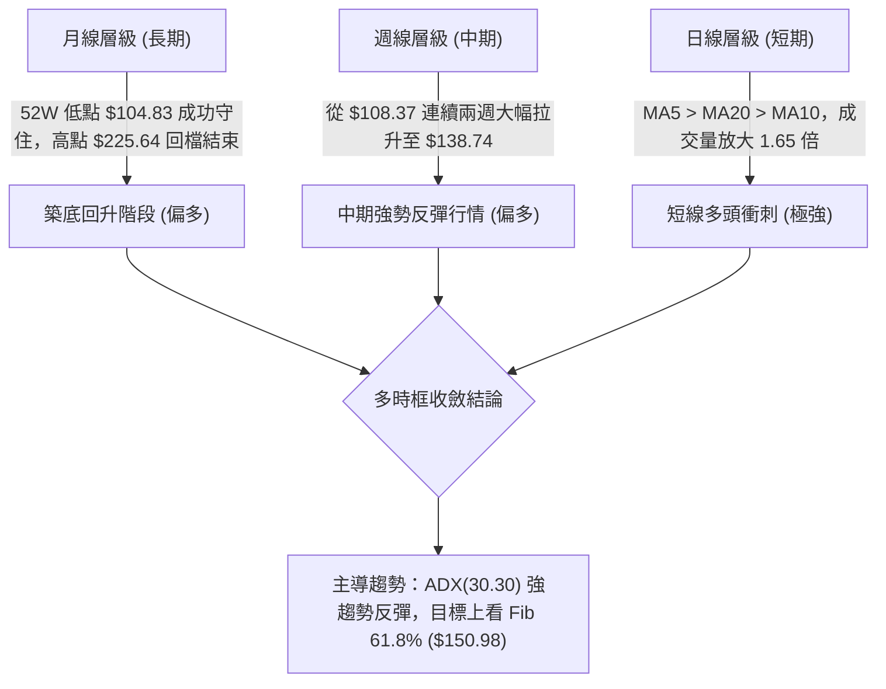
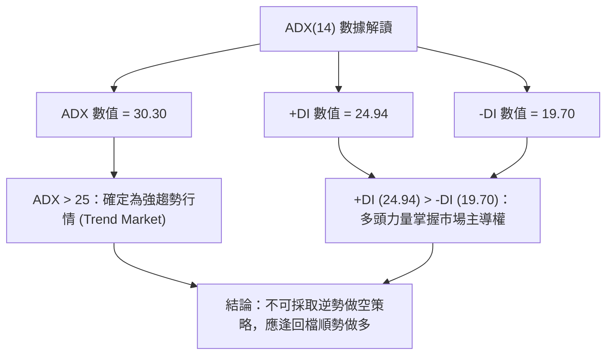
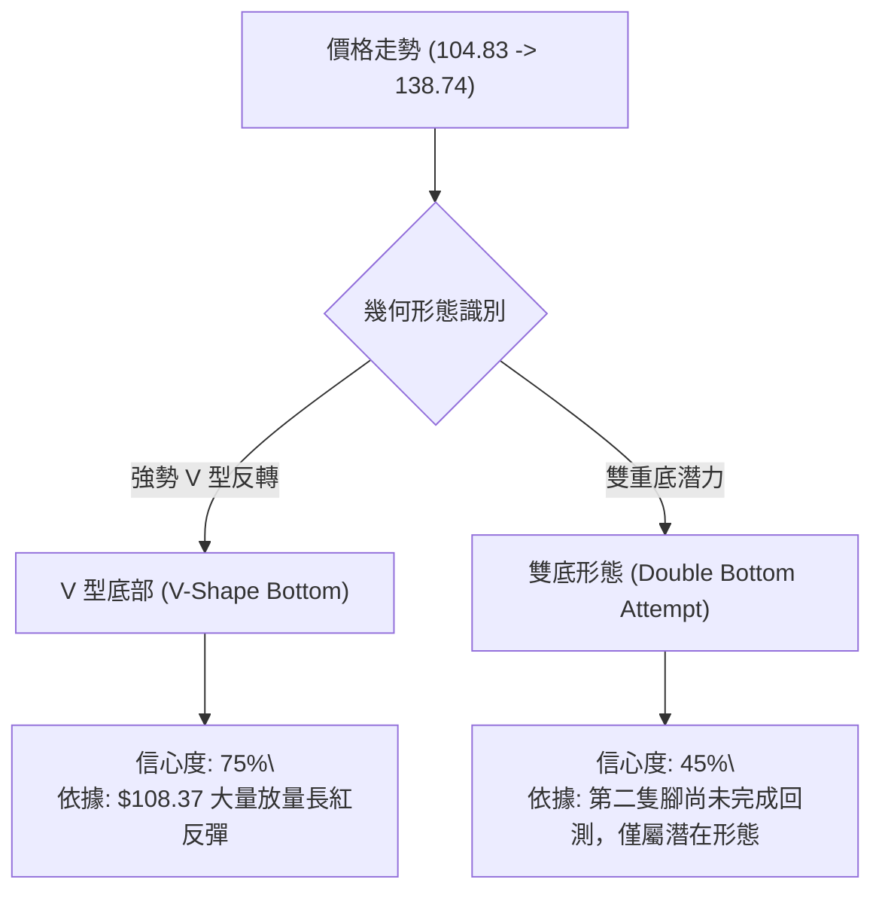
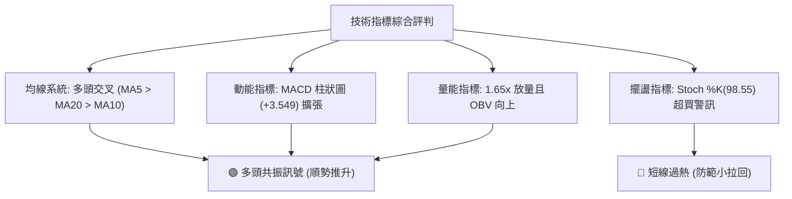
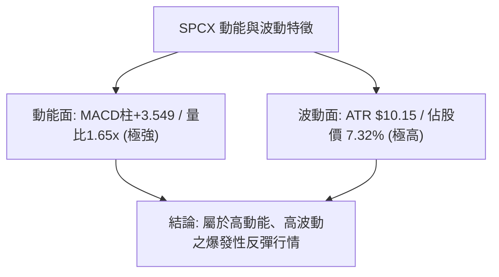
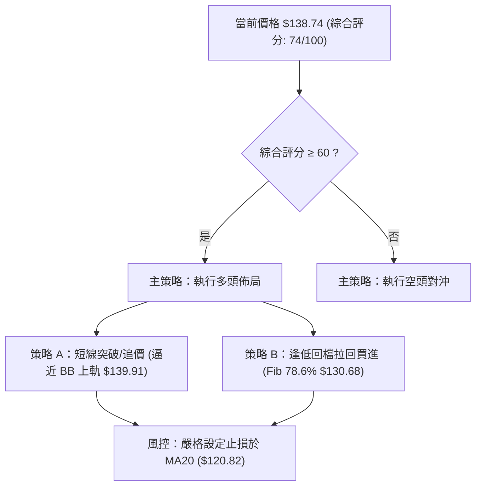
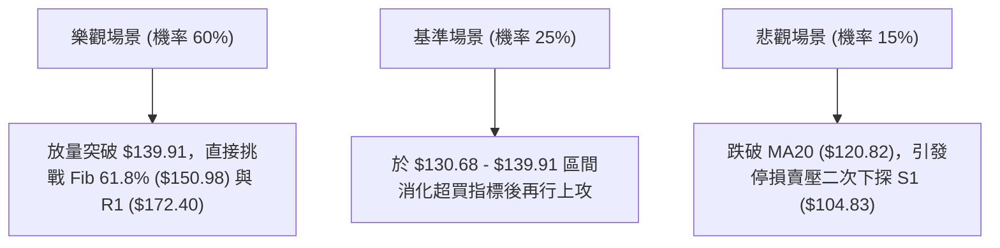

# SPCX 技術分析報告

> **報告日期**：2026-08-11 ｜ **語言**：繁體中文 ｜ **數據來源**：Yahoo Finance ｜ **當前價格**：$138.74

---

## 目錄

| 章節 | 內容 |
|------|------|
| [1. 技術面概覽](#1-技術面概覽) | 訊號儀表板、核心指標、評分卡 |
| [2. 趨勢分析](#2-趨勢分析) | 多時框趨勢、長中短期走勢、ADX強弱評估 |
| [3. 圖表形態分析](#3-圖表形態分析) | 形態識別、信心度評估、K線組合與目標價 |
| [4. 支撐與阻力](#4-支撐與阻力) | 價位結構圖、關鍵阻力與支撐位、斐波那契回調 |
| [5. 技術指標深度解讀](#5-技術指標深度解讀) | MA均線系統、RSI、MACD、布林通道與量能 |
| [6. 動能與波動率](#6-動能與波動率) | 動能四象限、ATR波動率、Beta與市場相關性 |
| [7. 多時框架總結](#7-多時框架總結) | 時框架評分矩陣、多時框收斂結論 |
| [8. 交易策略建議](#8-交易策略建議) | 策略路由、價格情境階梯、主策略詳情與風報比 |
| [9. 風險提示與監控](#9-風險提示與監控) | 關鍵監控清單、風險場景預測與風控規則 |

---

## 1. 技術面概覽

### 🎯 技術訊號儀表板



### 📊 核心指標速覽表

| 指標類別 | 指標名稱 | 當前數值 | 訊號 | 解讀 |
|----------|----------|----------|------|------|
| **價格** | 當前價格 | $138.74 | 🟢 多頭 | 位於 52 週區間 28.1% 位置，自低點 $104.83 強勢反彈 |
| **均線** | MA5 | $124.07 | 🟢 多頭 | 價格高於 MA5（+11.82%），短線動能極強 |
| **均線** | MA10 | $118.44 | 🟢 多頭 | 價格高於 MA10（+17.14%），短期支撐明確 |
| **均線** | MA20 | $120.82 | 🟢 多頭 | 價格高於 MA20（+14.83%），月線轉強上升 |
| **動能** | RSI(14) | 58.31 | 🟡 中性 | 無背離現象，動能逐漸向上進入多頭控盤區 |
| **動能** | MACD(12,26,9) | -5.935 / -9.484 | 🟢 多頭 | 柱狀圖 (+3.549) 持續擴大，黃金交叉發酵 |
| **動能** | Stochastic | %K: 98.55 / %D: 79.18 | 🔴 警告 | 進入短線極度超買區，需防範過熱回檔 |
| **趨勢強度**| ADX(14) | 30.30 (+DI:24.94 / -DI:19.70) | 🟢 多頭 | ADX > 25 屬強趨勢，+DI 主導多頭行情 |
| **通道** | 布林通道 | 上軌 $139.91 / 中軌 $120.82 | 🟡 中性 | %B = 0.97，接近上軌，面臨短線軌道上緣壓力 |
| **波動** | ATR(14) | $10.15 (7.32%) | 🔴 高波動 | 日均波動幅度較大，需相應擴大止損空間 |
| **成交量** | 最新成交量 | 166,008,255 | 🟢 多頭 | 為 20 日均量 (100.5M) 的 1.65 倍，價漲量增 |

### 🏆 技術評分卡

```
╔══════════════════════════════════════════════════════════════════╗
║                   技術評分卡 — SPCX (2026-08-11)                ║
╠══════════════════════════════════════════════════════════════════╣
║ 趨勢強度 (ADX)     ████████████████░░░░  80/100  🟢 強勢趨勢      ║
║ 動能指標 (MACD/RSI)██████████████░░░░░░  70/100  🟢 多頭占優      ║
║ 支撐穩定度 (S1/Fib)████████████████░░░░  80/100  🟢 築底成功      ║
║ 成交量配合 (OBV)   █████████████████░░░  85/100  🟢 量能充沛      ║
║ 形態完整度 (V型)   ████████████░░░░░░░░  60/100  🟡 形態發展中    ║
║ 均線排列 (短天期)  ██████████████░░░░░░  70/100  🟢 多頭排列      ║
╠══════════════════════════════════════════════════════════════════╣
║ 綜合評分           ███████████████░░░░░  74/100  🟢 偏多反彈      ║
╚══════════════════════════════════════════════════════════════════╝
```

---

## 2. 趨勢分析

### 🌐 多時框趨勢分析



### 📈 長期趨勢 — 24 個月走勢圖（Unicode）

```
SPCX 月線與近期週線走勢圖（過去近一年重點軌跡）
價格軸 ($)
$225.64 ┤                        ● (52W 高點)
$197.13 ┤                       ╱ ╲
$179.49 ┤       ●              ╱   ╲
$172.40 ┤      ╱ ╲            ╱     ╲          ● (R1 阻力位)
$150.98 ┤     ╱   ╲          ╱       ╲        ╱
$138.74 ┤────╱─────╲────────╱─────────╲──────●←【當前價格 $138.74】
$130.68 ┤   ╱       ╲      ╱           ╲    ╱  (Fib 78.6%)
$104.83 ┤──●─────────╲────●─────────────╲──●← (52W 低點 S1 $104.83)
        └─┴───────────┴───┴──────────────┴──┴───────────────────
         2025-08     2026-01           2026-06  2026-08
```

#### 走勢特徵分析表

| 階段 | 價格區間 | 期間特徵 | 成交量變化 | 技術面意涵 |
|------|----------|----------|------------|------------|
| **高檔回檔** | $225.64 → $153.23 | 2026年6月中旬衝高後獲利賣壓湧現 | 爆量震盪 (9.25億股) | 形成年度頭部 Resistance |
| **深幅探底** | $153.23 → $104.83 | 2026年7月至8月初急跌破底 | 縮量陰跌 (3.15億股) | 恐慌盤宣洩，逼近 52W 低點 $104.83 |
| **強勁反彈** | $108.37 → $138.74 | 2026年8月上旬急劇拉升 | 劇烈放大 (9.20億股) | 主力資金進場築底，日線連陽突破 MA20 |

### 📊 中期趨勢（週線分析）

週線層級顯示，SPCX 在 2026-08-02 當週觸及 $108.37 底部後，於 2026-08-09 當週以 920,449,800 股的近十週最大成交量強勢拉出長陽線（收 $133.11，RSI 自 19.2 急升至 57.4），隨後在本週（2026-08-16 當週目前）進一步推升至 $138.74。MACD 柱狀圖由負轉正至 +3.549，確認中期底部型態已經確立。

```
中期支撐與阻力軌跡結構：
  [上檔阻力 R1]  ────────────────────────────── $172.40 (+24.26%)
  [Fib 61.8% 軌線] ──────────────────────────── $150.98 (+8.82%)
  [當前價格]     ══════════════════════════════ $138.74
  [Fib 78.6% 軌線] ──────────────────────────── $130.68 (-5.81%)
  [關鍵支撐 S1]  ────────────────────────────── $104.83 (-24.44%)
```

### ⚡ 趨勢強度評估（ADX 解讀）



#### ADX 強度分析對照

| 指標項 | 當前數據 | 門檻標準 | 評估結論 |
|--------|----------|----------|----------|
| **ADX(14)** | **30.30** | > 25.0 | 🟢 明確趨勢行情（非無方向盤整） |
| **+DI vs -DI** | **24.94 vs 19.70** | +DI > -DI | 🟢 多頭控盤，買盤力道強於賣盤 |
| **趨勢持續性** | 擴張中 | ADX 向上 | 🟢 趨勢動能仍在上升階段 |

---

## 3. 圖表形態分析

### 🔍 形態識別系統



#### 形態信心度與目標價評估

| 形態名稱 | 信心度 | 判斷依據（引用數據） | 完成度 | 目標價計算式與精確數值 |
|----------|--------|----------------------|--------|------------------------|
| **強勢 V 型反轉** | **75%** | 52W 低點 $104.83 守住，隨後 20 日均量放量 1.65 倍突破 MA20 ($120.82) | **85%** | **低點 $104.83 + (頸線/回擋點 $130.68 - $104.83) = 目標 Fib 61.8% ($150.98)** |
| **雙重底 (潛在)** | **45%** | 僅點頭第一隻腳 $104.83，第二隻腳未二次測底，數據不足 | **30%** | 訊號不足，不予作為主要幾何目標價依據 |

### 🕯️ 重要 K 線形態分析

| 日期/週 | 收盤價 | K 線形態 | 技術面解讀 | 訊號強度 |
|---------|--------|----------|------------|----------|
| **2026-07-26** | $115.07 | 大陰線 | 恐慌性拋售，RSI 跌至 15.9 極度超賣 | 🔴 極度空頭 |
| **2026-08-02** | $108.37 | 探底鎚頭線 | 止跌訊號，低測 $104.83 附近後獲買盤支撐 | 🟡 轉折訊號 |
| **2026-08-09** | $133.11 | 底部長紅包覆線 | 配合 9.2 億股巨量，典型一陽吞多陰之反轉 | 🟢 強烈買進 |
| **2026-08-16** | $138.74 | 續揚小陽線 | 價格突破 MA20 ($120.82)，多頭延伸 | 🟢 多頭續強 |

### 📉 ASCII 走勢形態示意圖

```
SPCX V型反轉與布林通道關係圖
$139.91 ┤---------------------------------- (布林上軌 / 逼近中)
$138.74 ┤                             ●    (當前價格 $138.74)
$130.68 ┤                        ▲   ╱     (Fib 78.6% 突破點)
$120.82 ┤───────────────────●───╱───┼───── (MA20 / 布林中軌 $120.82)
$108.37 ┤              ▲   ╱
$104.83 ┤──────────────┴──●─────────────── (52W 低點 S1 / V型底部)
        └─────────────────────────────────
```

### 🎯 形態目標價計算

*   **V 型反轉形態高度計算**：
    *   底部低點：$104.83 (52W Low)
    *   突破確認點（Fib 78.6%）：$130.68
    *   形態高度 $H = \$130.68 - \$104.83 = \$25.85$
    *   **最小量測目標價** =突破點 \$130.68 + \$25.85 = **\$156.53**（與 Fib 61.8% 即 **\$150.98** 至 Fib 50.0% 即 **\$165.24** 區間高度重合）。

---

## 4. 支撐與阻力

### 🗺️ 關鍵價位分布圖（Unicode）

```
SPCX 價位結構分布圖 (由 OHLCV 與斐波那契嚴格計算)
═════════════════════════════════════════════════════════════════
$225.64 ║████████████████████████████████████████║ 52W High / Fib 0.0%
$197.13 ║████████████████████████                ║ Fib 23.6%
$179.49 ║████████████████████                    ║ Fib 38.2%
$172.40 ║████████████████████████████████████████║ 關鍵阻力位 R1
$165.24 ║██████████████                          ║ Fib 50.0%
$150.98 ║████████████████████████                ║ Fib 61.8% (近期核心目標)
$139.91 ║██████████████                          ║ 布林通道上軌 (短線壓力)
$138.74 ╠════════════════════════════════════════╣ ◄ 當前價格 $138.74
$130.68 ║▓▓▓▓▓▓▓▓▓▓▓▓▓▓▓▓▓▓▓▓▓▓▓▓                ║ Fib 78.6% (第一下檔支撐)
$124.07 ║▓▓▓▓▓▓▓▓▓▓▓▓                            ║ MA5 均線支撐
$120.82 ║▓▓▓▓▓▓▓▓▓▓▓▓▓▓▓▓▓▓▓▓                    ║ MA20 / 布林中軌支撐
$104.83 ║████████████████████████████████████████║ 52W Low / 關鍵支撐 S1
═════════════════════════════════════════════════════════════════
```

### 🚧 阻力位分析表

| 阻力級別 | 精確價位 | 形成原因 / 來源 | 突破難度 | 重要性 |
|----------|----------|------------------|----------|--------|
| **短線阻力** | **$139.91** | 布林通道上軌 | 🟡 中等 | 短線多頭超買乖離過大時之蓋頂壓力 |
| **第一目標** | **$150.98** | 斐波那契 61.8% 回調位 | 🟡 中等 | 黃金分割重要關卡，多頭波段核心目標 |
| **中期阻力** | **$165.24** | 斐波那契 50.0% 回調位 | 🔴 偏高 | 解套賣壓與整數心理關卡密集區 |
| **關鍵阻力 R1** | **$172.40** | 近一年波段高點聚類 (R1) | 🔴 極高 | 突破此位將正式確認翻轉長期熊市 |

### 🛡️ 支撐位分析表

| 支撐級別 | 精確價位 | 形成原因 / 來源 | 守住機率 | 重要性 |
|----------|----------|------------------|----------|--------|
| **第一支撐** | **$130.68** | 斐波那契 78.6% 回調位 | 🟢 80% | 轉強後的回測首要防線 |
| **動態支撐** | **$124.07** | 5日移動平均線 (MA5) | 🟢 75% | 超短線極強多頭控盤線 |
| **核心支撐** | **$120.82** | 20日均線 (MA20) / 布林中軌 | 🟢 85% | 中短期多空分水嶺，止損重要參考點 |
| **關鍵支撐 S1** | **$104.83** | 52週最低價 (S1) / 歷史波段低點 | 🟢 95% | 絕對防守底線，跌破則趨勢全盤崩壞 |

### 📐 斐波那契回調位分析

依據 52 週區間 **$104.83 (100.0%) → $225.64 (0.0%)** 計算：
*   目前價格 **$138.74** 成功站上 **78.6% ($130.68)**，目前落於 **78.6% ($130.68)** 與 **61.8% ($150.98)** 之間的強勢反彈通道中。
*   **技術意涵**：站穩 78.6% 意味著先前的跌勢已得到實質性遏制，若能進一步放量攻克 61.8% ($150.98)，將打開通往 50.0% ($165.24) 及 38.2% ($179.49) 的中級反彈空間。

---

## 5. 技術指標深度解讀

### 🎛️ 指標訊號總覽



### 📈 移動平均線排列分析


*   **MA5 ($124.07)**：急劇上揚（+11.82%），提供極短線強勁支撐。
*   **MA10 ($118.44)** 與 **MA20 ($120.82)**：MA5 與 MA20 已完成黃金交叉，均線呈多頭排列狀態，為股價提供雙重底座支撐。

### 📉 RSI(14) 分析

*   **當前數值**：**58.31**
    ```
    RSI(14) 強度進度條：
    0 ░░░░░░░░░░░░░░░░░░░░ 30 ▓▓▓▓▓▓▓▓▓▓▓▓▓▓▓▓ 58.31 ░░░░░░░░░░ 70 ░░░░░░░░ 100
    [超賣區]                 [中性偏多控制區]                [超買區]
    ```
*   **背離分析**：目前 RSI 無頂背離或底背離現象。RSI 自 7 月底的 15.9 極度超賣區陡峭回升至 58.31，顯示買盤動能全面復甦且尚未進入 >70 之超買區，仍有向上拓展空間。

### 📊 MACD(12,26,9) 訊號解讀

*   **MACD 線**：-5.935
*   **Signal 線**：-9.484
*   **MACD 柱狀圖**：**+3.549** 🟢
*   **解讀**：MACD 線在零軸下方發揮黃金交叉，柱狀圖連續數日呈現正向擴張（+2.330 → +3.549），顯示中短期下跌波段已經結束，多頭反彈動能正在迅速累積。

### 📦 布林通道分析

```
布林通道現況軌跡 ($)
$139.91 ┤---------------------------------- Upper Band (BB 上軌)
$138.74 ┤                             ●    Current Price ($138.74, %B=0.97)
$120.82 ┤---------------------------------- Middle Band (MA20)
$101.72 ┤---------------------------------- Lower Band (BB 下軌)
```

*   當前價格 **$138.74** 非常貼近布林通道上軌 **$139.91**（%B = 0.97）。
*   **技術暗示**：當 %B > 0.95 時，股價短線可能沿上軌「貼軌上行」（強勢行情），但若未配合持續爆量，容易引發向中軌 **$120.82** 回歸的均值修正。

### 💹 成交量分析（量價配合度）

*   **最新成交量**：166,008,255 股
*   **20日均量**：100,526,963 股（**量比 1.65x**）
*   **OBV 趨勢**：OBV > MA，呈現量價同步上揚，證實此波自 $104.83 的反彈是由實質買盤推升，而非無量虛漲。

---

## 6. 動能與波動率

### ⚡ 動能評估四象限

| 象限區塊 | 動能強度 | 波動率水準 | 當前 SPCX 歸屬狀態 | 策略意涵 |
|----------|----------|------------|--------------------|----------|
| **Q1 (高動能 / 低波動)** | 強 | 低 | — | 最佳穩健突破買點 |
| **Q2 (高動能 / 高波動)** | **強** | **高 (ATR 7.32%)** | **✓ SPCX 當前位置** | **高動能急拉，需縮小倉位並拉寬止損** |
| **Q3 (弱動能 / 低波動)** | 弱 | 低 | — | 沉悶盤整，觀望為主 |
| **Q4 (弱動能 / 高波動)** | 弱 | 高 | — | 恐慌殺盤區，嚴禁進場 |



### 📊 ATR 波動率分析

*   **ATR(14)**：**$10.15**（佔價格 **7.32%**）
*   **止損距離建議**：由於日均波動高達 $10.15，技術性止損位必須設定在至少 **1.5 倍 ATR ($15.22)** 以外，以避免在正常日內噪音中被震盪洗盤出場。

### 📐 Beta 與市場相關性

*   **數據狀態**： Beta 數據為 N/A（私有化營運與航太高成長特性）。
*   **市場特性**：SPCX 作為商業航太龍頭，個股alpha屬性極強，受整體大盤系統性風險影響相對較小，主要由自身營收成長（YoY 91.9%）與發射進度所主導。

---

## 7. 多時框架總結

### 📋 時框架評分表

| 時框架 | 趨勢方向 | 動能指標 | 均線排列 | 形態結構 | 綜合評分 | 操作建議 |
|--------|----------|----------|----------|----------|----------|----------|
| **日線 (Short)** | 🟢 強勢看多 | MACD正擴張 | MA5>MA20>MA10 | V型強彈 | **85/100** | 順勢偏多，尋求回檔進場點 |
| **週線 (Medium)**| 🟢 轉強看多 | RSI 58.31 | 站回短天期均線 | 築底完成 | **70/100** | 中線分批佈局 |
| **月線 (Long)**  | 🟡 中性築底 | ADX 30.30 | 52W 區間低位 | 長期打底 | **60/100** | 逢低分批波段持有 |

### 🔲 綜合訊號矩陣

```
╔══════════════════════════════════════════════════════════════════╗
║                   SPCX 多時框架訊號一致性矩陣                   ║
╠══════════════════════════┬═══════════════════════════════════════╣
║ 短期 (日線)              ║ 🟢 看多 (成交量放量，MACD金叉)        ║
║ 中期 (週線)              ║ 🟢 看多 (底包覆陽線，週RSI回升)       ║
║ 長期 (月線)              ║ 🟡 中性 (52W 低點 $104.83 守住)        ║
╠══════════════════════════┼═══════════════════════════════════════╣
║ 訊號收斂評估             ║ 🟢 高度一致 (多頭共振反彈行情)        ║
╚══════════════════════════╧═══════════════════════════════════════╝
```

### ⚖️ 多時框收斂結論

依據多時框收斂規則，當前 **ADX(14) = 30.30 (> 25)**，明確指示市場進入**強趨勢行情**。
主導時框由中期（週線）與短期（日線）共同驅動，目前價格自 52 週低點 **$104.83** 展開的主升反彈波段，已相繼突破 MA5、MA10 與 MA20（$120.82）。多時框訊號收斂方向為：**強烈偏多反彈，主策略維持多頭操作**。

---

## 8. 交易策略建議

### 🗺️ 策略決策流程圖



### 🧭 策略路由

*   **當前主策略方向**：**偏多操作（依綜合評分 74/100）**
*   **路由說明**：由於技術綜合評分高達 74 分，ADX 強勢指標達 30.30，且量能配合良好，本報告**主推多頭策略**。空頭僅列為風險對沖觸發條件。

### 🎯 價格情境階梯 (Price Scenarios)

| 觸發條件 | 第一目標 | 第二目標 | 情境技術含義 |
|----------|----------|----------|--------------|
| **突破上軌 $139.91** | Fib 61.8% **$150.98** | Fib 50.0% **$165.24** | 短線強勢多頭延伸，波段行情展開 |
| **回測 $130.68 守住** | 上軌 **$139.91** | Fib 61.8% **$150.98** | 典型回測確認支撐，最佳逢低佈局點 |
| **跌破 MA20 $120.82** | S1 **$104.83** | N/A | 反彈夭折，重新下尋歷史低點測試 |

### 📊 情境機率分佈

| 情境劇本 | 機率 | 主要技術依據 |
|----------|------|--------------|
| **強勢續揚 / 突破上軌** | **60%** | MACD 柱狀圖 (+3.549) 擴張，成交量達 1.65 倍均量，ADX > 25 多頭主導 |
| **區間震盪 (130.68 - 139.91)** | **25%** | Stochastic %K(98.55) 超買，布林通道上軌壓制需要消化 |
| **跌破回落再探底** | **15%** | 若整體市場爆發系統性風險跌破 MA20 ($120.82) |

### 🟢 主策略詳情

#### 策略 A：短線突破追價策略（高動能型）
*   **適用對象**：積極型交易者
*   **進場條件**：日線收盤確認突破布林上軌 **$139.91** 或於當前價 **$138.74** 直接建倉。
*   **進場價格**：**$138.74**
*   **止損價格**：**$120.82**（MA20 / 布林中軌支撐位，虧損空間 $17.92 / -12.91%）
*   **目標價 T1**：**$150.98**（Fib 61.8% 回調位，獲利空間 $12.24 / +8.82%）
*   **目標價 T2**：**$172.40**（關鍵阻力位 R1，獲利空間 $33.66 / +24.26%）
*   **風險報酬比**：至 T1 為 **0.68 : 1**；至 T2 為 **1.88 : 1**

#### 策略 B：拉回逢低分批買進策略（穩健勝率型 — 推薦 🌟）
*   **適用對象**：穩健型交易者
*   **進場條件**：等待價格回測 Fib 78.6% 回檔位 **$130.68** 獲得支撐時進場。
*   **進場價格**：**$130.68**
*   **止損價格**：**$120.82**（MA20 支撐位，虧損空間 $9.86 / -7.54%）
*   **目標價 T1**：**$150.98**（Fib 61.8% 回調位，獲利空間 $20.30 / +15.53%）
*   **目標價 T2**：**$172.40**（關鍵阻力位 R1，獲利空間 $41.72 / +31.93%）
*   **風險報酬比**：至 T1 為 **2.06 : 1**；至 T2 為 **4.23 : 1**
*   **建議倉位**：總投資資金之 **15% - 20%**

### 🔴 反向風險觸發點（對沖提示）

若股價未如預期上揚，反而跌破 **MA20 ($120.82)**，多頭格局宣告破壞，應立即執行止損出場，或建立小額看空期權進行對沖，下方目標看至 **S1 ($104.83)**。

### ⭐ 整體訊號強度評星

```
做多訊號強度：★★██☆  (4.0/5星)  — 均線量能指標強烈共振
做空訊號強度：★░░░░  (1.0/5星)  — 逆勢做空風險極高
整體可信度：  ★★██☆  (4.0/5星)  — 多時框訊號一致性高
```

---

## 9. 風險提示與監控

### ✅ 關鍵監控指標 Checklist

```
╔══════════════════════════════════════════════════════════════════╗
║                   SPCX 日常技術面監控清單 (Checklist)           ║
╠══════════════════════════════════════════════════════════════════╣
║ [ ] 價格是否跌破 MA20 ($120.82) 關鍵分水嶺？                      ║
║ [ ] RSI(14) 是否在 >70 超買區形成頂背離？                        ║
║ [ ] 日成交量是否萎縮至 20 日均量 (100.5M) 的 50% 以下 (無量拉升)？ ║
║ [ ] MACD 柱狀圖是否由正轉負 (動能衰退)？                         ║
║ [ ] 價格能否有效收復並站穩 Fib 61.8% ($150.98)？                 ║
╚══════════════════════════════════════════════════════════════════╝
```

### ⚠️ 風險場景分析



### 🛡️ 風險管理重要提醒

1.  **高波動率風險**：SPCX 當前 ATR 高達 **$10.15 (7.32%)**，屬於典型高 beta、高波動標的。部位管理切勿開高槓桿，單一筆交易承擔之風險金額不應超過總資產的 **2%**。
2.  **指標極端超買**：Stochastic %K 達 **98.55**，顯示短線隨時有過熱拉回技術性修正之可能，**切忌在接近布林上軌 ($139.91) 時盲目追高**，強烈建議採取「策略 B」於 **$130.68** 附近逢低佈局。

---

## 📋 報告總結

```
╔══════════════════════════════════════════════════════════════════╗
║                   SPCX 技術分析報告總結                         ║
════════════════════════════════════════════════════════════════════
 報告日期：2026-08-11
 當前價格：$138.74
 分析評級：🟢 偏多強勢反彈 (74/100)

 關鍵結論：
 ├─ 長期趨勢：🟡 52W 低點 $104.83 築底完成
 ├─ 中期趨勢：🟢 週線爆量拉出長陽，築底反轉
 ├─ 短期趨勢：🟢 MA5/10/20 多頭排列，MACD 柱狀圖擴張
 ├─ 關鍵支撐：$130.68 (Fib 78.6%) / $120.82 (MA20) / $104.83 (S1)
 ├─ 關鍵阻力：$139.91 (BB上軌) / $150.98 (Fib 61.8%) / $172.40 (R1)
 └─ 分析師目標價：均價 $231.40 (最高 $800.00 / 最低 $62.00)

 最優策略組合：
 1. 🥇 首選策略：策略 B (逢低拉回 $130.68 買進，風報比 2.06:1 / 4.23:1)
 2. 🥈 次選策略：策略 A (突破 $139.91 追價，需嚴設止損 $120.82)
 3. 🥉 風控底線：跌破 $120.82 無條件止損離場
════════════════════════════════════════════════════════════════════
```

---

> ⚠️ **免責聲明**：本報告為 AI 自動生成之技術分析，所有數據及估算均基於提供的歷史價格資訊。本報告**僅供研究與學術參考**，**不構成任何投資建議**。投資有風險，入市需謹慎。

---

*報告生成時間：2026-08-11 ｜ 數據來源：Yahoo Finance ｜ 分析框架：多時框技術分析*