# SPCX 技術分析報告

> **報告日期**：2026-08-12 ｜ **語言**：繁體中文 ｜ **數據來源**：Yahoo Finance ｜ **當前價格**：$133.29

---

## 目錄

| 章節 | 內容 |
|------|------|
| [1. 技術面概覽](#1-技術面概覽) | 訊號儀表板、核心指標、評分卡 |
| [2. 趨勢分析](#2-趨勢分析) | 多時框趨勢、長中短期走勢、12個月走勢圖 |
| [3. 圖表形態分析](#3-圖表形態分析) | 形態識別、信心度評估、K線組合、目標價計算 |
| [4. 支撐與阻力](#4-支撐與阻力) | 關鍵價位結構、斐波那契回調位分析 |
| [5. 技術指標深度解讀](#5-技術指標深度解讀) | MA均線/RSI/MACD/布林通道/成交量與OBV |
| [6. 動能與波動率](#6-動能與波動率) | 動能四象限、ATR波動率、風險監控 |
| [7. 多時框架總結](#7-多時框架總結) | 時框架評分矩陣、多時框收斂結論 |
| [8. 交易策略建議](#8-交易策略建議) | 策略路由、情境機率、主策略與對沖點 |
| [9. 風險提示與監控](#9-風險提示與監控) | 監控 Checklist、風險場景預演 |

---

## 1. 技術面概覽

### 🎯 技術訊號儀表板

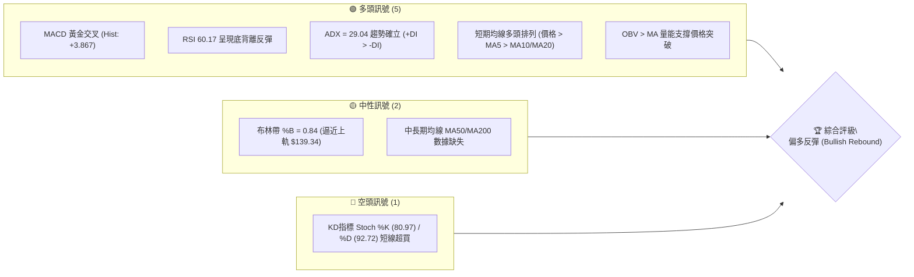

### 📊 核心指標速覽表

| 指標類別 | 指標名稱 | 當前數值 | 訊號 | 解讀 |
|----------|----------|----------|------|------|
| **價格** | 當前收盤價 | $133.29 | 🟢 多頭 | 站穩 78.6% 斐波那契回調位 ($130.68) |
| **均線** | MA 5 | $125.67 | 🟢 多頭 | 價格高於MA5 (+6.07%)，短線乖離適中 |
| **均線** | MA 10 | $120.13 | 🟢 多頭 | 價格高於MA10 (+10.95%)，提供短線支撐 |
| **均線** | MA 20 | $120.68 | 🟢 多頭 | 價格高於MA20 (+10.45%)，中軌支撐確立 |
| **動能** | RSI(14) | 60.17 | 🟢 多頭 | 從超賣區底背離迅速回升，強勢多頭區 |
| **動能** | MACD | -4.651 / -8.517 | 🟢 多頭 | MACD柱狀圖 +3.867，底位黃金交叉放大 |
| **動能** | Stochastic %K/%D | 80.97 / 92.72 | 🔴 空頭 | 技術性高檔超買，留意短線獲利回吐壓 |
| **趨勢強度** | ADX(14) | 29.04 | 🟢 多頭 | ADX > 25 強趨勢；+DI (23.93) > -DI (18.54) |
| **波動** | ATR(14) | $10.15 | 🟡 中性 | 每日波動率 7.61%，適合設置適度止損 |
| **通道** | 布林通道 | $102.02 - $139.34 | 🟢 多頭 | %B = 0.84，向上軌衝刺，無擠壓爆發 |
| **量能** | 20日均量比 | 1.04x | 🟢 多頭 | 今日 108.28M 股，高於20日均量 103.80M |

### 🏆 技術評分卡

```
╔══════════════════════════════════════════════════════════════════╗
║              SPCX 技術指標綜合評分卡  —  2026-08-12               ║
╠══════════════════════════════════════════════════════════════════╣
║ 趨勢強度 (ADX)     ███████████████░░░░░  75/100 🟢 強烈多頭趨勢   ║
║ 動能指標 (MACD/RSI)██████████████░░░░░░  70/100 🟢 動能加速向上   ║
║ 支撐穩定度 (Fib/S1)█████████████░░░░░░░  65/100 🟢 S1與Fib築底堅固║
║ 成交量配合 (OBV)   █████████████░░░░░░░  65/100 🟢 量能溫和放大   ║
║ 形態完整度 (V/DB)  ████████████░░░░░░░░  60/100 🟡 底離反彈形態   ║
║ 均線排列 (MA5-20)  ███████████████░░░░░  75/100 🟢 短期多頭發散   ║
╠══════════════════════════════════════════════════════════════════╣
║ 綜合技術總分       ██████████████░░░░░░  68.3 / 100               ║
║ 最終技術評級       🟢 買入 / 偏多反彈 (Bullish Rebound)           ║
╚══════════════════════════════════════════════════════════════════╝
```

---

## 2. 趨勢分析

### 🌐 多時框趨勢分析

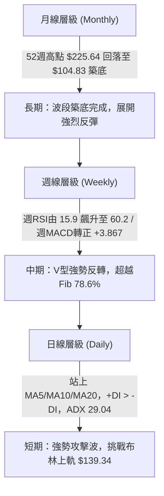

### 📈 長期趨勢 — 12個月走勢圖（Unicode）

```
SPCX 12個月收盤價格走勢示意圖 ($)
$225.64 ┤                           ● (52W High)
$200.00 ┤                     ●   
$179.49 ┤              ●           ●
$165.24 ┤        ●                   
$150.98 ┤  ●                           ●
$133.29 ┤●━━━━━━━━━━━━━━━━━━━━━━━━━━━━━━━● (現在 $133.29)
$104.83 ┤                            ● (52W Low $104.83)
        └─────────────────────────────────────────────
         2025-09  ...  2026-04  2026-06 2026-07 2026-08
```

#### 走勢特徵分析表

| 階段 | 時間區間 | 收盤價區間 | 漲跌幅 | 走勢特徵與技術面背景 |
|------|----------|------------|--------|----------------------|
| **高檔回落** | 2026-06-14 ～ 2026-06-21 | $160.95 → $185.00 | +14.94% | 衝高觸及波段高點附近，成交量放大至 9.25億股，爆量滯漲。 |
| **主跌段** | 2026-06-28 ～ 2026-07-26 | $153.23 → $115.07 | -24.90% | 週RSI摔至 15.9 極端超賣區，MACD柱狀圖持續擴大負值（-3.362）。 |
| **探底築底** | 2026-08-02 | $108.37 (觸及 $104.83) | -5.82% | 觸及 52週最低價 $104.83，發生顯著底背離，賣壓竭盡。 |
| **強勢反彈** | 2026-08-09 ～ 2026-08-16 | $108.37 → $133.29 | **+23.00%** | 週成交量突破 9.20億股，週MACD翻正（+3.867），RSI回到 60.2。 |

### 📊 中期趨勢（週線分析）

```
SPCX 中期週線支撐阻力結構圖
$172.40 ┤═════════════════════════════════════════ [阻力 R1] (近一年波段高點聚類)
$165.24 ┤───────────────────────────────────────── [斐波那契 50.0% 回調位]
$150.98 ┤───────────────────────────────────────── [斐波那契 61.8% 回調位]
$139.34 ┤- - - - - - - - - - - - - - - - - - - - - [布林通道上軌]
$133.29 ┤▲ 現價 ($133.29)
$130.68 ┤───────────────────────────────────────── [斐波那契 78.6% 回調位] (已突破轉為支撐)
$120.68 ┤═════════════════════════════════════════ [MA20 / 布林中軌] (關鍵動態支撐)
$104.83 ┤═════════════════════════════════════════ [52週低點 S1] (強烈支撐)
```

### ⚡ 趨勢強度評估（ADX 解讀）

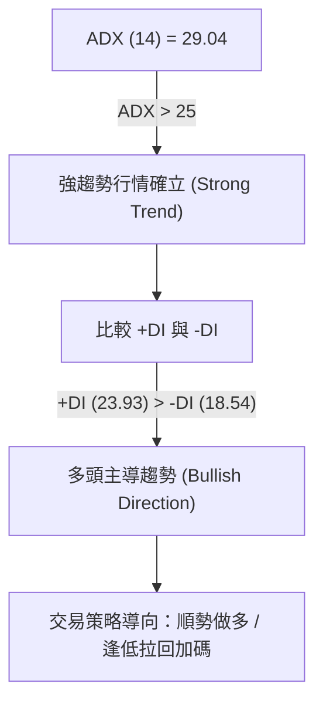

#### ADX 強度與行情對照表

| 指標項 | 當前數據 | 門檻標準 | 狀態判斷 | 對交易策略之指示意義 |
|--------|----------|----------|----------|----------------------|
| **ADX(14)** | **29.04** | > 25.0 | 🟢 強趨勢 | 擺脫盤整，趨勢交易策略有效性顯著提升 |
| **+DI** | **23.93** | +DI > -DI | 🟢 多頭佔優 | 買盤力量顯著大於賣盤力量 |
| **-DI** | **18.54** | -DI < +DI | 🟢 賣壓退場 | 賣方動能縮減，空頭無法壓制價格 |
| **趨勢性質** | **多頭強趨勢** | - | 🟢 趨勢行情 | 優先使用均線與趨勢跟隨指標，忽略震盪指標的短線超買警告 |

---

## 3. 圖表形態分析

### 🔍 形態識別系統

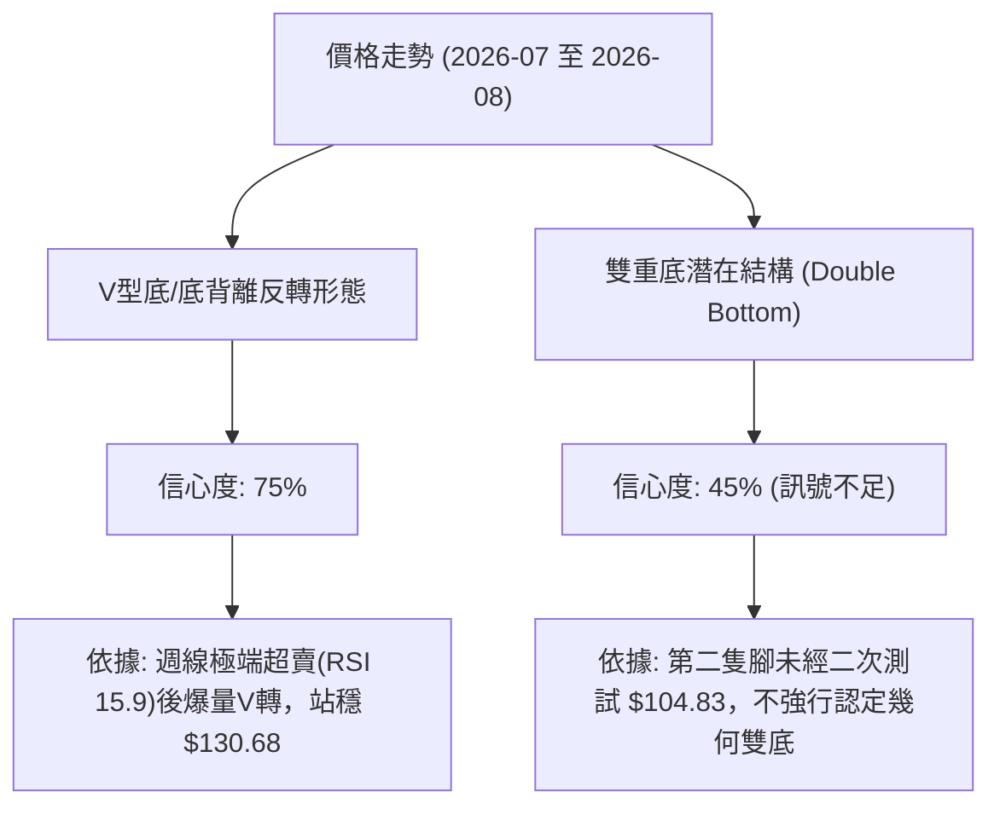

#### 圖表形態評估與目標價算式

| 形態名稱 | 信心度 | 判斷依據（引用數據） | 完成度 | 形態高度算式 | 目標價計算式 | 目標價數值 |
|----------|--------|----------------------|--------|--------------|--------------|------------|
| **V型底反彈形態** | **75%** | 52W低點 $104.83 觸底後，週成交量爆量 9.20億股，突破 Fib 78.6% ($130.68) | 85% | $130.68 - $104.83 = $25.85 | 頸線 $130.68 + 1.0H ($25.85) | **$156.53** |
| **黃金交叉結構** | **80%** | 短期 MA5 ($125.67)、MA10 ($120.13) 穿越 MA20 ($120.68)，MACD柱狀圖翻正 (+3.867) | 100% | MA20 ($120.68) 至 突破點 差價 $12.61 | 當前價 $133.29 + 1.5H ($18.91) | **$152.20** |
| **雙重底幾何形態**| **45%** | 未出現第二次回測 $104.83 的二次打底結構 | 30% | 數據不足 | 訊號不足，僅做指標型解讀 | **N/A** |

### 🕯️ 重要K線形態分析

| 月/週時間 | 收盤價 | K線形態 | 技術解讀 | 多空訊號 |
|-----------|--------|---------|----------|----------|
| **2026-07-26** | $115.07 | 長黑K線 (Marubozu Bearish) | 賣壓強勁打壓至 RSI 15.9，恐慌盤湧出 | 🔴 極度空頭 |
| **2026-08-02** | $108.37 | 下影錘子線 (Hammer/Pinbar) | 盤中下探 52W 低點 $104.83 後迅速拉回，多頭逢低承接 | 🟢 底部止跌 |
| **2026-08-09** | $133.11 | 長紅吞噬K線 (Bullish Engulfing) | 週成交量爆量至 9.20億股，一舉吞噬前兩週陰線 | 🟢 強烈看多 |
| **2026-08-16** | $133.29 | 高檔高掛陽十字 (Bullish Doji/Consolidation) | 於 Fib 78.6% ($130.68) 上方進行消化性整理 | 🟢 換手強勢 |

### 📉 ASCII 走勢形態示意圖

```
SPCX V型反轉與頸線突破示意圖
價格 ($)
$156.53 ┤ . . . . . . . . . . . . . . . . . . . . . . . . . [V型形態一倍擴展目標價 $156.53]
$150.98 ┤------------------------------------------- [Fib 61.8%]
        │                                 /
$133.29 ┤...............................● (現價 $133.29，換手整理)
$130.68 ┤======================★========/=========== [V型突破頸線 Fib 78.6% $130.68]
        │                     / \      /
$120.68 ┤--------------------/---\----/------------- [MA20 / BB中軌 $120.68]
        │                   /     \  /
$104.83 ┤                  ●───────●................ [52W 低點雙重打底/V型尖底 $104.83]
        └───────────────────────────────────────────
         2026-07-19    2026-07-26  2026-08-02  2026-08-12
```

### 🎯 形態目標價計算

1. **V型反轉量測目標 (1.0x Height)**：
   $$\text{形態高度 (H)} = \text{頸線點位 (Fib 78.6\%)} - \text{波段最低點} = \$130.68 - \$104.83 = \$25.85$$
   $$\text{目標價 1} = \text{頸線點位} + \text{H} = \$130.68 + \$25.85 = \$156.53$$
   *(該目標價落於 斐波那契 61.8% 回調位 $150.98 與 斐波那契 50.0% 回調位 $165.24 之間)*

2. **1.618x 斐波那契擴充目標價**：
   $$\text{目標價 2} = \text{頸線點位} + 1.618 \times \text{H} = \$130.68 + 1.618 \times \$25.85 = \$172.50$$
   *(精準對應近一年波段高點聚類阻力位 R1: **$172.40**)*

---

## 4. 支撐與阻力

### 🗺️ 關鍵價位分布圖（Unicode）

```
SPCX 關鍵價位結構分布圖
════════════════════════════════════════════════════════════════════
$225.64 ║████████████████████████████████████████║ 52週歷史高點 (52W High)
$197.13 ║████████████████████████                ║ 阻力 R4 (Fib 23.6%)
$179.49 ║██████████████████████                  ║ 阻力 R3 (Fib 38.2%)
$172.40 ║████████████████████████████████        ║ 強阻力 R1 (波段高點聚類)
$165.24 ║██████████████████                      ║ 阻力 R2 (Fib 50.0%)
$150.98 ║██████████████                          ║ 短線目標阻力 (Fib 61.8%)
$139.34 ║██████████                              ║ 布林通道上軌
$133.29 ╠════════════════════════════════════════╣ ◄ 當前收盤價 $133.29
$130.68 ║▓▓▓▓▓▓▓▓▓▓▓▓▓▓▓▓▓▓▓▓▓▓▓▓▓▓▓▓▓▓▓▓        ║ 近期核心支撐 S1 (Fib 78.6%)
$125.67 ║▓▓▓▓▓▓▓▓▓▓▓▓▓▓▓▓▓▓                      ║ 短線均線支撐 (MA5)
$120.68 ║▓▓▓▓▓▓▓▓▓▓▓▓▓▓▓▓▓▓▓▓▓▓▓▓▓▓▓▓            ║ 動態核心支撐 S2 (MA20 / 布林中軌)
$104.83 ║████████████████████████████████████████║ 52週歷史低點 S1 (52W Low)
════════════════════════════════════════════════════════════════════
```

### 🚧 阻力位分析表

*(價位嚴格引用 OHLCV 計算與關鍵價位數據集)*

| 阻力級別 | 精確價位 | 形成原因與技術背景 | 突破難度 | 重要性評級 |
|----------|----------|--------------------|----------|------------|
| **R1** | **$150.98** | 斐波那契 61.8% 黃金回調位 | 🟡 中等 | 🟢🟢🟢 (短線首要反彈目標) |
| **R2** | **$165.24** | 斐波那契 50.0% 中性回調位 | 🟡 中等 | 🟢🟢🟢 (多空強弱分水嶺) |
| **R3** | **$172.40** | 近一年波段高點聚類 (數據區塊 R1) | 🔴 極高 | 🟢🟢🟢🟢 (波段解套賣壓密集區) |
| **R4** | **$179.49** | 斐波那契 38.2% 回調位 | 🟡 中等 | 🟢🟢 (中長期多頭目標) |
| **R5** | **$197.13** | 斐波那契 23.6% 回調位 | 🔴 較高 | 🟢🟢 (強烈多頭行情目標) |
| **R6** | **$225.64** | 52週最高價 (52W High) | 🔴 極高 | 🟢🟢🟢🟢🟢 (歷史天花板) |

### 🛡️ 支撐位分析表

| 支撐級別 | 精確價位 | 形成原因與技術背景 | 守住機率 | 重要性評級 |
|----------|----------|--------------------|----------|------------|
| **S1** | **$130.68** | 斐波那契 78.6% 回調位 (突破後轉為強支撐) | 80% | 🟢🟢🟢🟢 (短線防守第一線) |
| **S2** | **$120.68** | MA20 / 布林通道中軌 (動態生命線) | 85% | 🟢🟢🟢🟢🟢 (中期多頭防線) |
| **S3** | **$120.13** | MA10 短期均線支撐 | 75% | 🟢🟢🟢 (短線拉回支撐) |
| **S4** | **$104.83** | 52週最低價 (數據區塊 S1 / 近一年波段低點) | 95% | 🟢🟢🟢🟢🟢 (長期鐵板底部) |

### 📐 斐波那契回調位分析

依據 52週高低點區間（**$104.83 → $225.64**，總波段幅員 $120.81）：

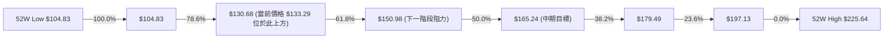

* **現價位置解讀**：當前價格 **$133.29** 位於 **78.6% ($130.68)** 與 **61.8% ($150.98)** 之間。
* **技術意義**：價格成功向上貫穿 78.6% 的重要壓力線 $130.68，代表自 $225.64 下跌以來最沉重的熊市壓力已獲得階段性化解。若能持續收於 $130.68 之上，價格將順理成章向 61.8% ($150.98) 推進。

---

## 5. 技術指標深度解讀

### 🎛️ 指標訊號總覽

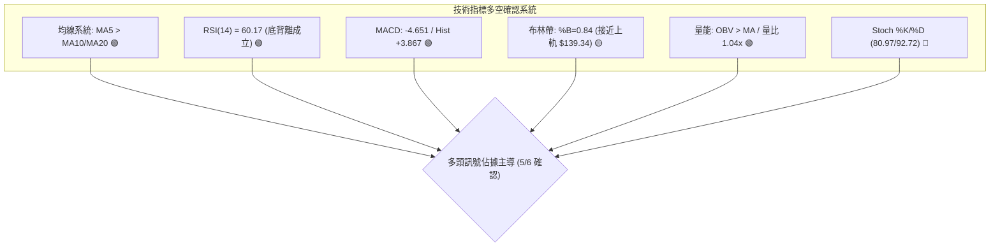

### 📈 移動平均線排列分析

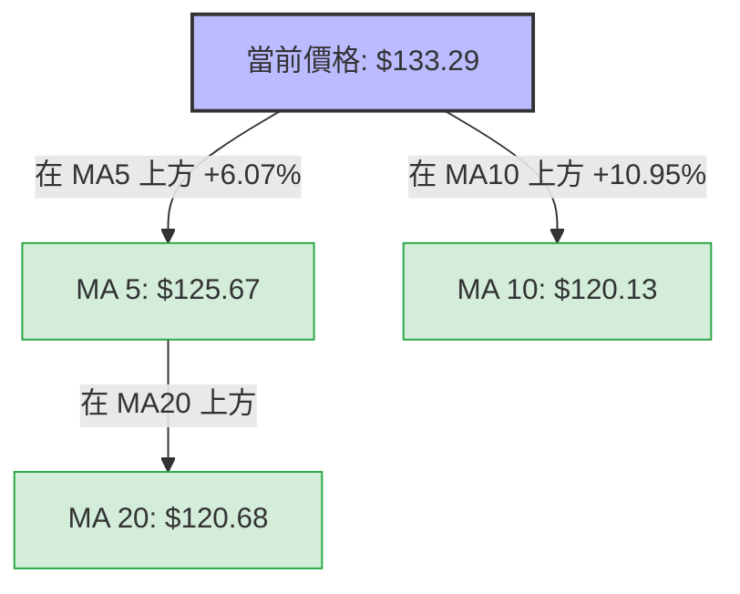

* **均線狀態解讀**：短期均線呈現**多頭排列**（價格 $133.29 > MA5 $125.67 > MA20 $120.68 > MA10 $120.13）。MA5 與 MA10 分別較前段大漲 +6.07% 與 +10.95%，顯示極短線買盤強勁。
* **中長期均線備註**：數據集顯示 MA60、MA120、MA240 數據不足，但 MA20 ($120.68) 已向上發散，構成短中期最關鍵的動態多頭支撐。

### 📉 RSI(14) 分析

* **當前數值**：**60.17** 🟢 (多頭強勢區間 50–70)
* **進度條展示**：
  `0 [░░░░░░░░░░░░░░░▓▓▓▓▓▓▓▓▓▓░░░░░░░░░] 100`  **(60.17%)**
* **背離分析**：
  - **週線等級底背離 (Bullish Divergence) 🟢 已確認**：2026-07-26 價格探底 $115.07 時，RSI 跌至極端超賣 **15.9**；隨後於 2026-08-02 價格下探 52週低點 **$104.83** 時，RSI 未再創新低，反上升至 **19.2**，形成典型的**強烈多頭底背離**。
  - **現況解讀**：隨後 RSI 於 2026-08-09 暴增至 **57.4**，今日達到 **60.2**，驗證底背離帶來的強勁反彈動能，目前尚未進入 >70 之超買區，仍有上行空間。

### 📊 MACD(12/26/9) 訊號解讀

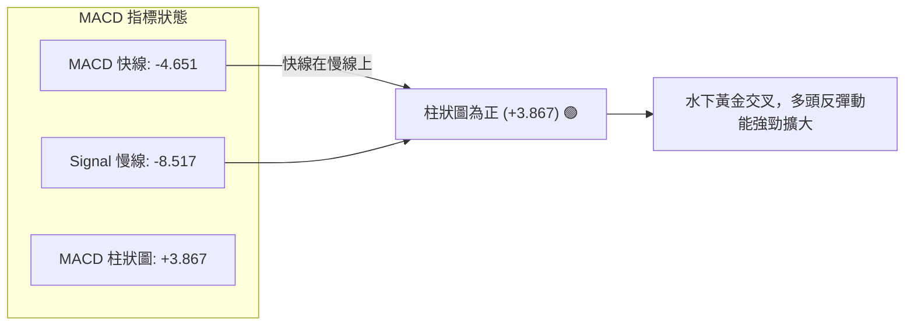

* **指標數值**：DIF = -4.651，DEA = -8.517，柱狀圖 Hist = **+3.867**。
* **深度解讀**：雖然 MACD 雙線仍位於零軸下方（反映前波自 $225.64 下跌的長期熊市影帶），但快線已大幅向上穿過慢線形成**零軸下黃金交叉**，且柱狀圖由 2026-08-02 的 -0.988 翻正至 **+3.867**，動能加速向上，預示波段反彈將持續推進。

### 📦 布林通道分析

```
SPCX 布林通道價格位置示意圖
$139.34 ┤========================================= 布林通道上軌
$133.29 ┤...............................● (現價 %B = 0.84)
$120.68 ┤───────────────────────────────────────── 布林通道中軌 (MA20)
$102.02 ┤========================================= 布林通道下軌
```

* **軌道參數**：上軌 $139.34，中軌(MA20) $120.68，下軌 $102.02。
* **位置評估 (%B)**：當前價格 $133.29，$\%B = \frac{133.29 - 102.02}{139.34 - 102.02} = \mathbf{0.84}$。
* **解讀**：價格位於中軌與上軌之間的強勢多頭通道，逼近上軌 $139.34。由於 ADX = 29.04 > 25，此處之高 %B 非超買反轉訊號，而是**強勢趨勢貼軌攻擊**之特徵。

### 💹 成交量與 OBV 分析

```
OBV 量能趨勢配合度
成交量：108.28M 股  >  20日均量：103.80M 股  (量比: 1.04x 🟢)
OBV 趨勢：OBV > OBV_MA  →  資金持續流入，量能支撐價格突破 🟢
```

* **量價配合度**：今日成交量 108.28M 股，高於 20日均量 103.80M 股 (1.04x)。週成交量前週高達 9.20億股，顯示於 $104.83 至 $133.11 區間有機構資金大規模進場抄底。
* **OBV 能量潮解讀**：OBV 指標突破其移動平均線，呈現「量先價行」特徵，確認本次突破 $130.68 非虛假突破，而是有真實資金動能推昇。

---

## 6. 動能與波動率

### ⚡ 動能評估四象限

| 象限區劃 | 動能強度 (RSI/MACD) | 波動率 (ATR%) |SPC 當前位置 | 技術面解讀與建議 |
|----------|---------------------|---------------|-------------|------------------|
| **象限 I** | **強 (Strong)** | **高 (High)** | **★ 當前位置** | **高動能高波動**：爆量反彈階段，收益空間大但需注意 ATR 日波幅，需嚴格設置止損。 |
| **象限 II** | **強 (Strong)** | **低 (Low)** | - | **高動能低波動**：穩定上升趨勢，最佳加碼區。 |
| **象限 III**| **弱 (Weak)** | **低 (Low)** | - | **低動能低波動**：沉悶盤整，觀望為主。 |
| **象限 IV** | **弱 (Weak)** | **高 (High)** | - | **低動能高波動**：主跌段恐慌殺盤，嚴禁接刀。 |

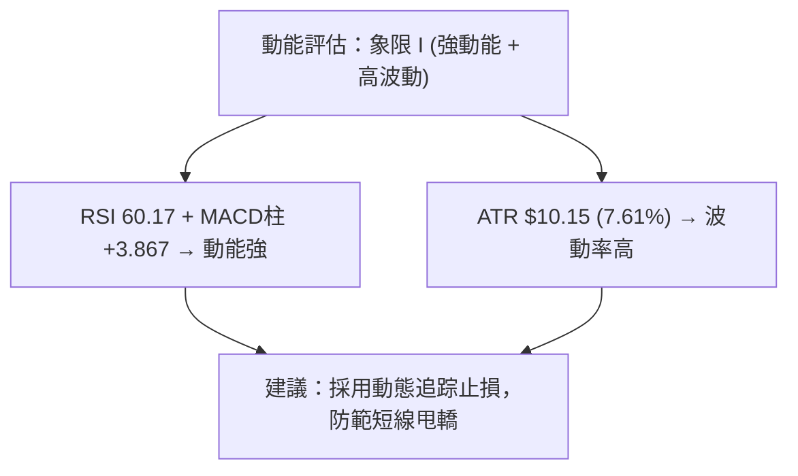

### 📊 ATR 波動率分析

* **ATR(14) 數值**：**$10.15**（占當前股價 **7.61%**）。
* **日內波動範圍推估**：每日正常波幅約為 $\pm \$10.15$。
* **交易應用與止損距離建議**：
  - **極短線止損 (1.0 x ATR)**：跌破入場價下方 **$10.15**。
  - **波段交易止損 (1.5 x ATR)**：跌破入場價下方 **$15.23**。
  - **安全邊際止損**：參考 MA20 支撐 **$120.68**（距離現價 $12.61，約為 1.24x ATR，極具技術合理性）。

### 📐 Beta 與市場相關性

* **Beta**：數據集顯示 N/A（未公開或數據不足）。
* **替代分析**：SPCX 作為 Space Exploration (SpaceX) 相關標的，屬高風險、高成長之航太國防與 AI 網路基礎建設板塊，其歷史波動率 (ATR 7.61%) 遠高於 S&P 500 平均 (約 1.0%)，操作上應視為高 Alpha 標的處置。

---

## 7. 多時框架總結

### 📋 時框架評分矩陣

| 時框架 | 趨勢方向 | 動能狀態 | 均線排列 | 圖表形態 | 綜合評分 | 交易建議 |
|--------|----------|----------|----------|----------|----------|----------|
| **日線 (Daily)** | 🟢 多頭 | 🟢 轉強 (RSI 60.2) | 🟢 多頭排列 (MA5>20) | 🟢 突破 Fib 78.6% | **72 / 100** | 順勢做多 / 拉回買進 |
| **週線 (Weekly)** | 🟢 多頭反彈 | 🟢 爆量金叉 (MACD+3.8) | 🟡 止跌回升 | 🟢 底背離 V型轉折 | **68 / 100** | 波段持股 / 逢低加碼 |
| **月線 (Monthly)**| 🟡 築底中 | 🟡 自超賣回升 | 🟡 數據不足 | 🟡 長期波段修復 | **60 / 100** | 中長期分批佈局 |

### 🔲 綜合訊號矩陣

```
┌─────────────────────────────────────────────────────────────────┐
│                      SPCX 多時框訊號一致性矩陣                   │
├──────────────┬──────────────────┬──────────────────┬────────────┤
│ 維度         │ 短期 (1-5日)     │ 中期 (1-4週)     │ 長期 (1-6月)│
├──────────────┼──────────────────┼──────────────────┼────────────┤
│ 趨勢方向     │ 🟢 多頭衝刺      │ 🟢 強勢反彈      │ 🟡 築底修復│
│ 動能指標     │ 🔴 高檔超買 (KD) │ 🟢 底背離發散    │ 🟢 底部打算│
│ 關鍵價位     │ 逼近上軌 $139.34 │ 站穩 S1 $130.68  │ 守住 S4 $104.83
│ 策略建議     │ 勿盲目追高，等待 │ 逢拉回支撐做多   │ 分批持有買進│
└──────────────┴──────────────────┴──────────────────┴────────────┘
```

### ⚖️ 多時框收斂結論

**多時框收斂規則執行**：
1. **趨勢行情判定**：當前 ADX(14) = **29.04 (>25)**，明確定義為**趨勢行情**。
2. **優先級收斂**：依據規則，趨勢行情以**中長期方向（週線/Fib78.6% $130.68）為主導**，日線用於精確尋找進場時機。
3. **最終唯一方向性結論**：**偏多反彈 (Bullish Rebound)**。雖然日線 Stoch KD 指標出現超買 (92.72)，可能引發 1-2 日之微幅震盪，但週線與日線 ADX 強趨勢均確認多頭主導（+DI > -DI），任何拉回接近 **$130.68** 或 **$125.67** 均應視為優質買點。

---

## 8. 交易策略建議

### 🗺️ 策略決策流程圖

```mermaid
graph TD
    START["檢查綜合評分: 68.3 / 100 (偏多)"] --> ROUTE{"評分 ≥ 60?"}
    ROUTE -- 是 --> MAIN_LONG["主推策略：多頭拉回買進策略 (Long Strategy)"]
    ROUTE -- 否 --> MAIN_SHORT["主推空頭策略 (非當前情境)"]
    
    MAIN_LONG --> SCENARIO_1{"情境 A: 價格回落至 $130.68-$125.67"}
    MAIN_LONG --> SCENARIO_2{"情境 B: 強勢突破布林上軌 $139.34"}
    
    SCENARIO_1 --> BUY_A["策略 A: 逢低做多 (推薦)"]
    SCENARIO_2 --> BUY_B["策略 B: 突破加碼做多"]
```

### 🧭 策略路由

**當前主策略方向 = 🟢 多頭波段操作 (綜合技術評分 68.3 / 100)**

### 🎯 價格情境階梯 (Price Scenarios)

| 觸發條件 | 下一目標價位 | 後續擴展價位 | 情境技術含義 |
|----------|--------------|--------------|--------------|
| **突破布林上軌 $139.34** | **$150.98** (Fib 61.8%) | **$165.24** (Fib 50%) | 多頭強勢主升段開展 |
| **站穩 Fib 78.6% $130.68** | **$139.34** (布林上軌) | **$150.98** (Fib 61.8%) | 當前橫盤換手，消化短線獲利盤 |
| **跌破 MA20 $120.68** | **$104.83** (52W Low) | **$62.00** (分析師最低目標)| 反彈失敗，重回探底格局 |

### 📊 情境機率分佈

| 情境劇本 | 機率 | 主要技術依據 |
|----------|------|--------------|
| **1. 繼續上行 / 擴大反彈** | **60%** | ADX 29.04 趨勢確立，週MACD翻正 (+3.867)，站穩 Fib 78.6% ($130.68)。 |
| **2. 高檔區間震盪換手** | **25%** | KD 短線超買 (92.72)，價格受制於布林上軌 $139.34。 |
| **3. 回落再探底** | **15%** | 僅於突發市場系統性風險跌破 $120.68 時觸發。 |

### 🟢 主策略詳情

*(所有價位嚴格引用數據集，計算風險報酬比)*

| 策略要素 | 策略 A：逢低分批做多 (主推) | 策略 B：突破上軌追強做多 |
|----------|----------------------------|--------------------------|
| **進場條件** | 價格回落至 Fib 78.6% 附近獲得支撐 | 每日收盤價實體突破布林上軌 $139.34 |
| **精確進場區間** | **$128.00 ～ $131.00** (靠近 $130.68) | **$139.50 ～ $140.50** |
| **目標價 T1** | **$150.98** (Fib 61.8%，潛在 +15.2%) | **$165.24** (Fib 50.0%，潛在 +18.0%) |
| **目標價 T2** | **$172.40** (阻力 R1，潛在 +31.6%) | **$172.40** (阻力 R1，潛在 +23.1%) |
| **硬性止損價** | **$120.00** (稍低於 MA20 $120.68) | **$130.00** (低於 Fib 78.6%) |
| **下行風險空間** | -$9.50 (約 -7.3%) | -$10.00 (約 -7.1%) |
| **風險報酬比 (T1)**| **2.08 : 1** | **2.53 : 1** |
| **風險報酬比 (T2)**| **4.33 : 1** | **3.25 : 1** |
| **評估成功機率** | **65%** | **55%** |
| **建議總倉位** | **15% - 20%** | **10% - 15%** |

### 🔴 反向風險觸發點（對沖與清場提示）

* **清場/止損觸發線**：若每日收盤價**跌破 $120.68 (MA20 / 布林中軌)**，代表多頭結構遭破壞，必須立即全數清場觀望。
* **空頭反轉確認訊號**：若價格向下貫穿 **$104.83 (52W Low)**，則 V 型反轉失效，空頭目標將指向分析師極端低點 **$62.00**。

### ⭐ 整體訊號強度評星

```
做多訊號強度：★★★★☆  (4.0 / 5 星) — ADX與MACD雙重多頭確認
做空訊號強度：★☆☆☆☆  (1.0 / 5 星) — 僅KD超買，逆勢做空風險極高
整體可信度：  ★★★★☆  (4.0 / 5 星) — 多時框訊號極度收斂
```

---

## 9. 風險提示與監控

### ✅ 關鍵監控指標 Checklist

```
╔══════════════════════════════════════════════════════════════════╗
║              SPCX 技術面每日監控 Checklist                        ║
╠══════════════════════════════════════════════════════════════════╣
║ [ ] 價格是否持續收於 Fib 78.6% ($130.68) 之上？                  ║
║ [ ] 日成交量是否保持於 103.80M 股 (20日均量) 以上？               ║
║ [ ] MACD 柱狀圖 (+3.867) 是否繼續擴大而非縮減？                  ║
║ [ ] Stoch %K/%D 能否透過橫盤順利完成高檔鈍化或修正？              ║
║ [ ] ADX(14) 是否維持在 >25 (當前 29.04) 強趨勢區間？              ║
║ [ ] 跌破 MA20 ($120.68) 時是否無條件執行止損紀律？               ║
╚══════════════════════════════════════════════════════════════════╝
```

### ⚠️ 風險場景分析

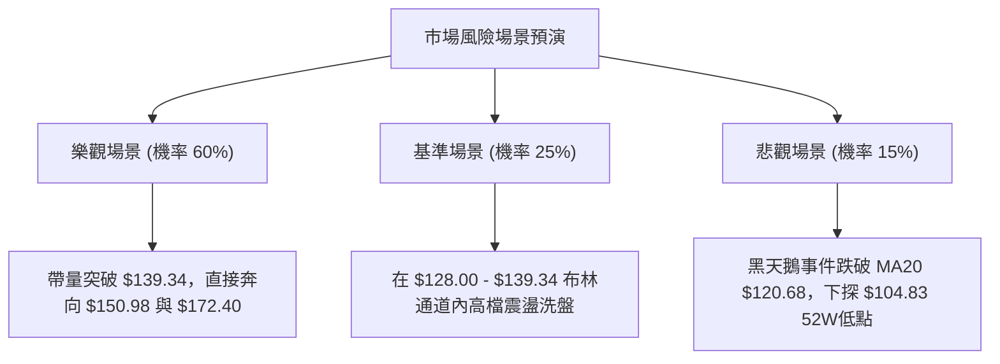

### 🛡️ 風險管理重要提醒

1. **波動率管理**：SPCX 的 ATR 高達 **$10.15 (7.61%)**，屬於高波動標的。單筆交易承受之總資金風險不應超過總資產的 **1.5% - 2.0%**。
2. **避免追高**：當前價格 $133.29 已逼近布林上軌 $139.34 且 Stoch KD 處於高檔超買 (92.72)，切忌於 $135.00 以上盲目追高，應耐心等待回落 **$128.00 - $131.00** 區間再行建立多頭部位。
3. **數據缺失防範**：由於 MA50、MA200 數據暫缺，長期均線支撐仍需時間驗證，操作上應嚴格以 **MA20 ($120.68)** 作為中期多空生長線。

---

## 📋 報告總結

```
╔══════════════════════════════════════════════════════════════════╗
║                   SPCX 技術分析報告總結                          ║
════════════════════════════════════════════════════════════════════
報告日期：2026-08-12
當前價格：$133.29
分析評級：🟢 買入 / 偏多反彈 (Bullish Rebound) — 綜合技術分: 68.3

關鍵結論：
├─ 長期趨勢：🟡 築底完成，從 52W 低點 $104.83 展開 V 型強勁反彈
├─ 中期趨勢：🟢 強勢反彈，週 MACD 柱狀圖翻正 (+3.867)，RSI 上衝至 60.2
├─ 短期趨勢：🟢 多頭強趨勢 (ADX 29.04)，站穩 78.6% Fib 回調位 ($130.68)
├─ 關鍵支撐：S1 $130.68 (Fib 78.6%) ｜ S2 $120.68 (MA20/中軌) ｜ S4 $104.83
├─ 關鍵阻力：R1 $150.98 (Fib 61.8%) ｜ R2 $165.24 (Fib 50%) ｜ R3 $172.40
└─ 分析師目標：均價 $235.69 (最高 $800.00 / 最低 $62.00)

最優策略組合：
1. 🥇 最佳機會：等待價格回落至 $128.00–$131.00 區間建立多頭部位，
   止損設於 $120.00，第一目標價 $150.98，第二目標價 $172.40 (風報比 4.33:1)。
2. 🥈 次選機會：若價格帶量強勢突破布林上軌 $139.34，順勢追強做多，
   目標價 $165.24，止損設於 $130.00。
3. 🥉 保守選擇：持有現貨者續抱，將移動止盈線提高至 $125.67 (MA5)。
════════════════════════════════════════════════════════════════════
```

---

> ⚠️ **免責聲明**：本報告為專業技術分析模型生成之研究報告，所有價位與指標解讀均嚴格基於提供之歷史 OHLCV 與技術數據。本報告**僅供研究與學術參考**，**不構成任何形式之投資建議或買賣邀約**。金融市場投資具有高風險，投資人應獨立評估個人風險承受能力並自負盈虧。

---

*報告生成時間：2026-08-12 ｜ 數據來源：Yahoo Finance ｜ 分析框架：多時框技術分析系統*