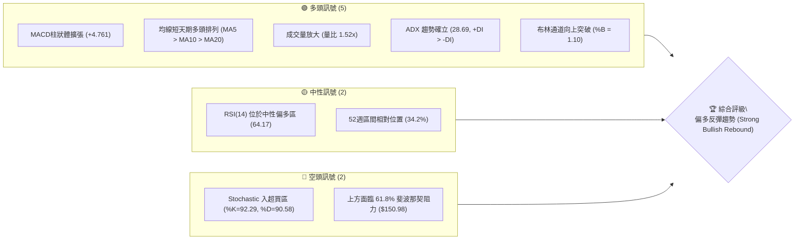
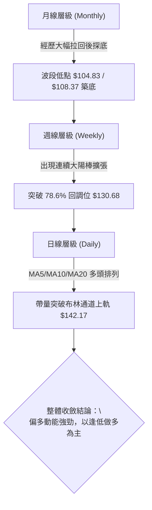
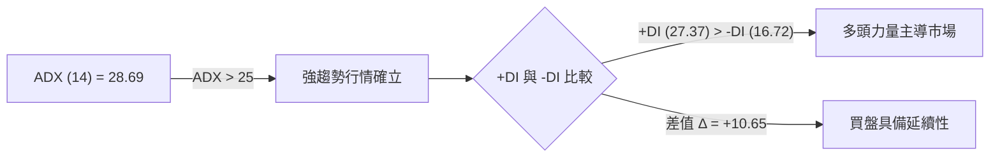
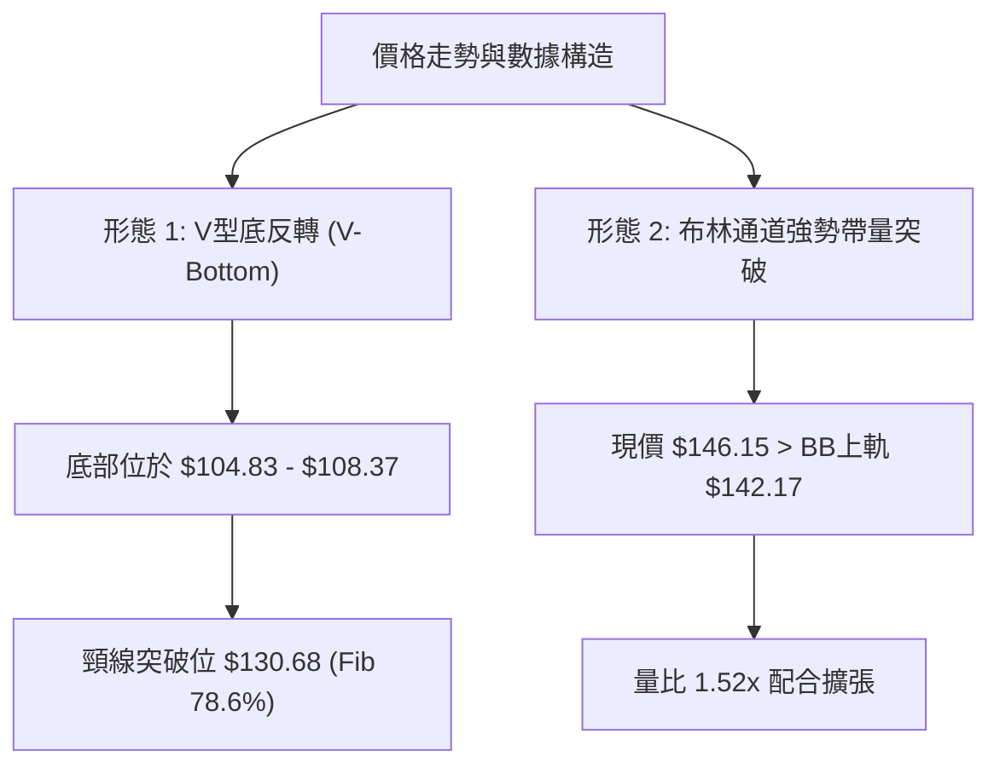
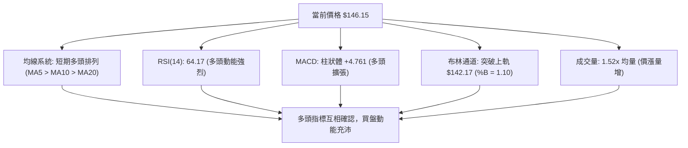
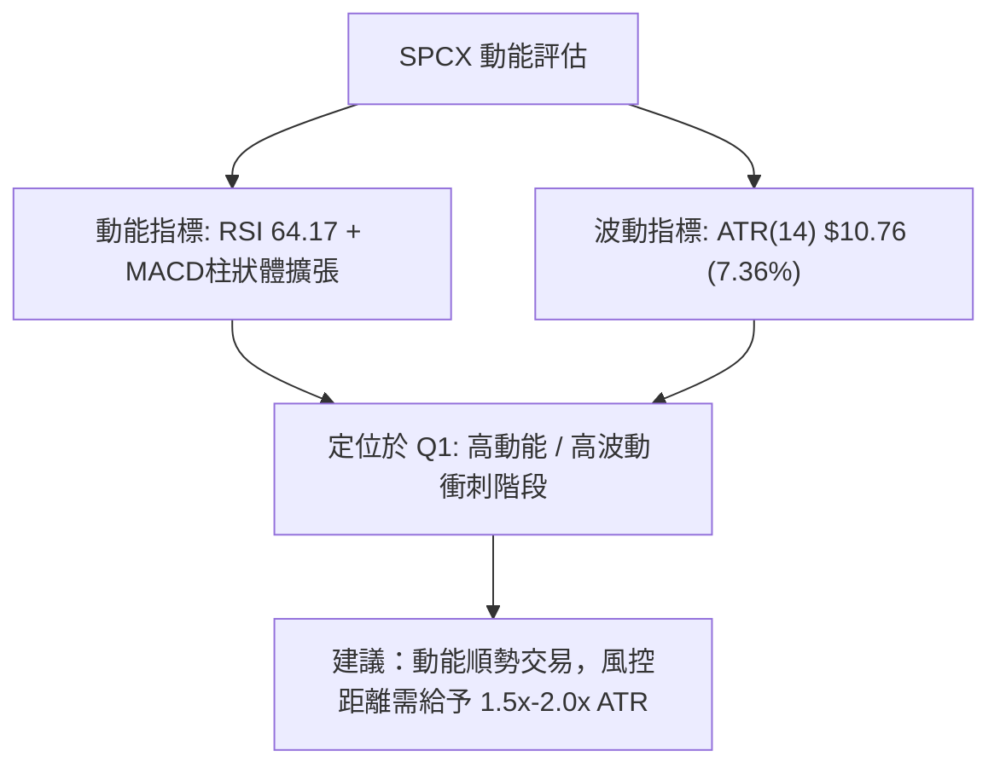
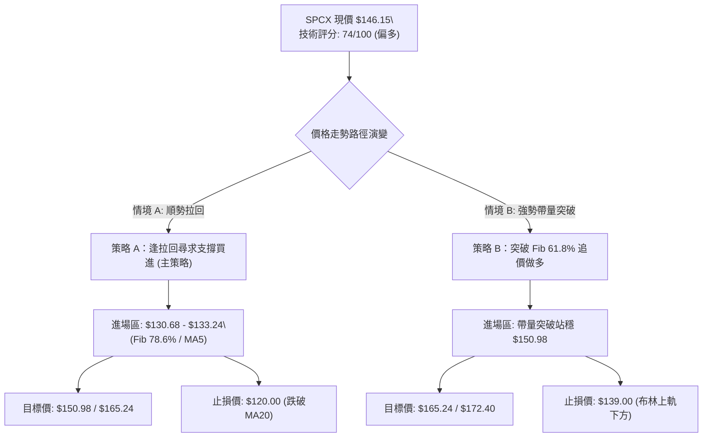
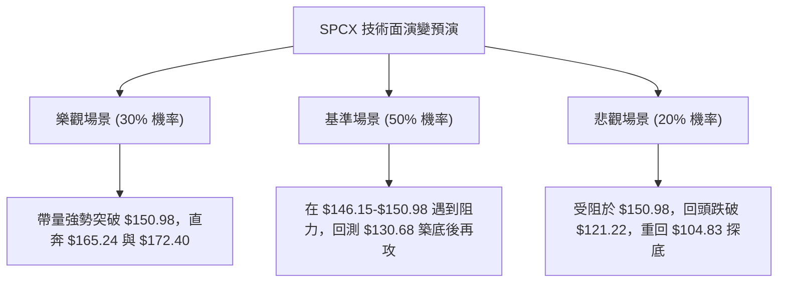

# SPCX 技術分析報告

> **報告日期**：2026-08-13 ｜ **語言**：繁體中文 ｜ **數據來源**：Yahoo Finance ｜ **當前價格**：$146.15

---

## 目錄

| 章節 | 內容 |
|------|------|
| [1. 技術面概覽](#1-技術面概覽) | 訊號儀表板、核心指標、評分卡 |
| [2. 趨勢分析](#2-趨勢分析) | 多時框趨勢、長中短期走勢、ADX指標 |
| [3. 圖表形態分析](#3-圖表形態分析) | 形態識別、K線組合、目標價推算 |
| [4. 支撐與阻力](#4-支撐與阻力) | 關鍵價位、斐波那契回調層級 |
| [5. 技術指標深度解讀](#5-技術指標深度解讀) | MA/RSI/MACD/布林通道/成交量OBV |
| [6. 動能與波動率](#6-動能與波動率) | 動能四象限、ATR通道、風險結構 |
| [7. 多時框架總結](#7-多時框架總結) | 時框架評分矩陣、多時框收斂 |
| [8. 交易策略建議](#8-交易策略建議) | 多空策略分流、精確點位與風報比 |
| [9. 風險提示與監控](#9-風險提示與監控) | 關鍵監控清單、三情境演練 |

---

## 1. 技術面概覽

### 🎯 技術訊號儀表板



### 📊 核心指標速覽表

| 指標類別 | 指標名稱 | 當前數值 | 訊號 | 解讀 |
|----------|----------|----------|------|------|
| **價格** | 當前價格 | $146.15 | 🟢 | 近兩週強勁反彈，自低點 $108.37 快速拉升 |
| **均線** | MA5 | $133.24 | 🟢 | 價格站在 MA5 上方 +9.69%，短線動能強勁 |
| **均線** | MA10 | $123.49 | 🟢 | 價格在 MA10 上方 +18.35%，短線陡峭上揚 |
| **均線** | MA20 | $121.22 | 🟢 | 價格突破月線 +20.56%，扭轉前月下挫劣勢 |
| **均線** | MA50 / MA200 | N/A | 🟡 | 數據不完整，以短中天期均線與週線結構為主 |
| **動能** | RSI(14) | 64.17 | 🟢 | 進入強勢買盤區，無頂背離跡象 |
| **動能** | MACD (12,26,9) | Hist: +4.761 | 🟢 | 雙線位於零軸下方但金叉向上，柱狀體擴張 |
| **動能** | Stochastic (14,3,3) | %K: 92.29 | 🔴 | 進入超買區（>80），需提防短線指標修正需求 |
| **趨勢** | ADX(14) | 28.69 | 🟢 | 強趨勢（>25），+DI(27.37) 遠高於 -DI(16.72) |
| **波動** | ATR(14) | $10.76 | 🔴 | 波動度占股價 7.36%，屬於高波動動能股 |
| **通道** | 布林通道 | Upper: $142.17 | 🟢 | 股價推升至布林上軌上方 (%B=1.10)，呈現帶量突破 |
| **量能** | 20日均量比 | 1.52x | 🟢 | 最新量測 1.658 億股，顯著高於 20日均量 (1.092億) |

### 🏆 技術評分卡

```
╔══════════════════════════════════════════════════════════════════╗
║                   技術評分卡 — SPCX (2026-08-13)                 ║
╠══════════════════════════════════════════════════════════════════╣
║ 趨勢強度 (ADX/+DI)    ███████████████░░░░░  75/100  🟢 看多     ║
║ 動能指標 (RSI/MACD)   ████████████████░░░░  80/100  🟢 看多     ║
║ 支撐穩定度 (Fib/S1)   ████████████░░░░░░░░  60/100  🟡 中性     ║
║ 成交量配合 (OBV/Ratio)████████████████░░░░  80/100  🟢 看多     ║
║ 形態完整度 (V底/突破) ██████████████░░░░░░  70/100  🟢 看多     ║
║ 均線排列 (MA5/10/20)  ████████████████░░░░  80/100  🟢 看多     ║
╠══════════════════════════════════════════════════════════════════╣
║ 綜合技術評分          ███████████████░░░░░  74/100  🟢 強勢買入 ║
╚══════════════════════════════════════════════════════════════════╝
```

---

## 2. 趨勢分析

### 🌐 多時框趨勢分析



### 📈 長期趨勢 — 12個月走勢圖（Unicode）

```
SPCX 歷史價格走勢圖（2025-08 至 2026-08）
價格軸 ($)
$225.64 ┤                           ● (52W 高點 $225.64)
$200.00 ┤                        ●     
$185.00 ┤                  ●           ●
$170.86 ┤●               ●               ● (2026-06 $170.86)
$150.00 ┤   ●         ●                     ● (2026-08-16 $146.15)
$130.00 ┤      ●   ●                           ●
$104.83 ┤         ● (52W 低點 $104.83)            ● (2026-08-02 $108.37)
        └─┴──┴──┴──┴──┴──┴──┴──┴──┴──┴──┴──┴──┴──┴──┴──
          M1 M2 M3 M4 M5 M6 M7 M8 M9 M10 M11 M12 (2026-08)
```

**走勢特徵分析表格**：

| 階段 | 期間 | 價格變動 | 走勢特徵分析 |
|------|------|----------|--------------|
| **第一階段：高位修正** | 2026-06 至 2026-07 | $185.00 → $115.07 | 由 52週高點區域急挫，多頭獲利了結，成交量居高不下。 |
| **第二階段：下探築底** | 2026-07-26 至 2026-08-02 | $115.07 → $108.37 | 探向 52週低點 $104.83 附近，成交量收縮至 3.15億股，形成賣壓竭盡。 |
| **第三階段：絕地反彈** | 2026-08-09 至 2026-08-16 | $108.37 → $146.15 | 單週大漲 +22.8% 與 +9.8%，週成交量激增至 9.20 億股，多頭強勢V型反轉。 |

### 📊 中期趨勢（週線分析）

從近 10 週的週線數據觀察：
- **賣壓竭盡區**：2026-08-02 當週收盤 $108.37，RSI(14) 掉入極端超賣區 19.2，MACD 柱狀體收斂至 -0.988。
- **買盤爆發區**：2026-08-09 當週拉出長紅棒收 $133.11，週成交量暴增至 9.20 億股，RSI 迅速回升至 57.4，MACD 柱狀體轉正為 +2.330。
- **突破延續區**：最新一週（2026-08-16）收盤來到 $146.15，RSI 爬升至 64.2，MACD 柱狀體擴張至 +4.761，確認中期反彈趨勢成立。

```
壓力位 (Resistance):
  R1: $172.40 ─── 近一年高點聚類與壓力區
  Fib 50.0%: $165.24 ─── 中期波段反彈強阻力
  Fib 61.8%: $150.98 ─── 短線關鍵關卡 (目前臨近)
  -------------------------------------------------- 現價 $146.15
支撐位 (Support):
  Fib 78.6%: $130.68 ─── 下方第一道強支撐
  MA20: $121.22 ─── 月線趨勢生命線
  S1: $104.83 ─── 52週低點強烈防禦區
```

### ⚡ 趨勢強度評估（ADX 解讀）



**ADX 趨勢強度對照解讀**：
- **當前 ADX 讀數**：`28.69`（位於 25–50 強趨勢區間）。
- **行情性質**：明確的**趨勢行情**而非無序盤整行情。依據多時框收斂規則，策略應採取「順勢做多 / 逢拉回找買點」，而非區間高拋低吸。

---

## 3. 圖表形態分析

### 🔍 形態識別系統



**形態信心度評估表**（依據規則 15）：

| 形態名稱 | 信心度 | 判斷依據（引用數據） | 完成度 | 目標價（附計算式） |
|----------|--------|----------------------|--------|--------------------|
| **V型底反轉** | **75%** | 底部聚類於 S1 $104.83 附近，自 $108.37 強勢拉升，帶量突破 $130.68 頸線區 | 90% | 頸線 $130.68 + 形態高度 ($130.68 - $104.83 = $25.85) = **$156.53** |
| **布林上軌突破** | **85%** | 現價 $146.15 > BB上軌 $142.17，%B = 1.10，量能放大至 1.658 億股 | 100% | 第一目標 Fib 61.8% **$150.98**，第二目標 Fib 50% **$165.24** |

### 🕯️ 重要K線形態分析

| 日期/週別 | 收盤價 | K線形態 | 技術解讀 | 多空訊號 |
|-----------|--------|---------|----------|----------|
| 2026-07-26 | $115.07 | 長黑貫穿 | 極度悲觀抛售，RSI 降至 15.9 超賣 | 🔴 空頭宣洩 |
| 2026-08-02 | $108.37 | 下影止跌棒 | 觸及 52週低點區間，成交量縮，拋壓竭盡 | 🟡 止跌訊號 |
| 2026-08-09 | $133.11 | 週線長紅包覆 | 成交量爆激增至 9.20 億股，一棒吞噬前三週陰線 | 🟢 強烈買進 |
| 2026-08-16 | $146.15 | 擴張長紅 | 續攻突破月線 $121.22 與布林上軌 $142.17 | 🟢 趨勢延續 |

### 📉 ASCII 走勢形態示意圖

```
SPCX V型反轉與布林通道突破示意圖
-----------------------------------------------------------------
$172.40 ┤                                        [阻力 R1]
$165.24 ┤                                     - - - - - - - [Fib 50.0%]
$150.98 ┤                                  ●  ← 目標 Fib 61.8%
$146.15 ┤                              ●      ← 現價突破上軌 ($142.17)
$130.68 ┤                           ●  ═════════ 頸線突破位 (Fib 78.6%)
$121.22 ┤  ●                     ●     - - - - - [布林中軌 MA20]
$108.37 ┤     ●               ●        
$104.83 ┤        ●─────────●           ═════════ V型底部區域 (52W Low)
-----------------------------------------------------------------
```

### 🎯 形態目標價計算

1. **V型底最小測量目標**：
   - 底部最低價：$104.83
   - 頸線關鍵位：$130.68（對應 斐波那契 78.6% 回調位）
   - 形態垂直高度 $H = \$130.68 - \$104.83 = \$25.85$
   - 突破推算目標價 $= \$130.68 + \$25.85 = \mathbf{\$156.53}$

2. **黃金分割延伸目標**：
   - 第一阻力關卡（Fib 61.8%）：$\mathbf{\$150.98}$
   - 第二阻力關卡（Fib 50.0%）：$\mathbf{\$165.24}$
   - 第三阻力關卡（波段高點 R1）：$\mathbf{\$172.40}$

---

## 4. 支撐與阻力

### 🗺️ 關鍵價位分布圖（Unicode）

```
SPCX 價位結構分布圖
═════════════════════════════════════════════════════════════════
$225.64 ║████████████████████████████████████████║ 52W 高點 (0.0%)
$197.13 ║████████████████████████████████        ║ Fib 23.6% 回調位
$179.49 ║████████████████████████                ║ Fib 38.2% 回調位
$172.40 ║████████████████████████████████████████║ 強阻力 R1 (波段高點聚類)
$165.24 ║████████████████████                    ║ Fib 50.0% 回調位
$150.98 ║████████████████                        ║ 關鍵阻力 (Fib 61.8%)
$146.15 ╠════════════════════════════════════════╣ ◄ 當前價格 $146.15
$142.17 ║▓▓▓▓▓▓▓▓▓▓▓▓▓▓▓▓▓▓▓▓                    ║ 布林通道上軌
$133.24 ║▓▓▓▓▓▓▓▓▓▓▓▓▓▓▓▓                        ║ MA5 移動平均線
$130.68 ║▓▓▓▓▓▓▓▓▓▓▓▓▓▓▓▓▓▓▓▓▓▓▓▓▓▓▓▓▓▓▓▓▓▓▓▓▓▓▓▓║ 關鍵轉換支撐 (Fib 78.6%)
$123.49 ║▓▓▓▓▓▓▓▓▓▓▓▓                            ║ MA10 移動平均線
$121.22 ║▓▓▓▓▓▓▓▓▓▓▓▓▓▓▓▓▓▓▓▓▓▓▓▓▓▓▓▓▓▓▓▓        ║ 強支撐 (MA20 / 布林中軌)
$104.83 ║████████████████████████████████████████║ 絕對防禦 S1 / 52W Low
═════════════════════════════════════════════════════════════════
```

### 🚧 阻力位分析表

| 阻力級別 | 價位 | 形成原因 | 突破難度 | 重要性 |
|----------|------|----------|----------|--------|
| **R1** | **$150.98** | 52週區間 61.8% 斐波那契黃金反彈關卡 | 🟡 中等 | 🟢🟢🟢 (短線多空分水嶺) |
| **R2** | **$165.24** | 52週區間 50.0% 斐波那契回調中軸點 | 🔴 較難 | 🟢🟢🟢🟢 (中期趨勢扭轉點) |
| **R3** | **$172.40** | 近一年波段高點聚類區 (阻力位 R1) | 🔴 高 | 🟢🟢🟢🟢🟢 (強阻力天花板) |
| **R4** | **$179.49** | 52週區間 38.2% 斐波那契回調位 | 🔴 高 | 🟢🟢 (長線解套壓力區) |

### 🛡️ 支撐位分析表

| 支撐級別 | 價位 | 形成原因 | 守住機率 | 重要性 |
|----------|------|----------|----------|--------|
| **S1** | **$142.17** | 布林通道上軌（動能突破轉支撐） | 🟢 70% | 🟢🟢 (極短態支撐) |
| **S2** | **$130.68** | Fib 78.6% 回調位與 V底突破頸線 | 🟢 85% | 🟢🟢🟢🟢🟢 (多頭關鍵回測防線) |
| **S3** | **$121.22** | MA20 (20日均線) 與 布林通道中軌 | 🟢 80% | 🟢🟢🟢🟢 (中期趨勢生命線) |
| **S4** | **$104.83** | 52週波段最低點聚類 (支撐位 S1) | 🟢 95% | 🟢🟢🟢🟢🟢 (絕對底部防禦區) |

### 📐 斐波那契回調位分析

依據 52週高低點區間（高點 **$225.64** → 低點 **$104.83**，價差 **$120.81**）進行精密回調位對映：

```
0.0%  (52W High)  : $225.64
23.6% 回調位      : $197.13
38.2% 回調位      : $179.49
50.0% 回調位      : $165.24
61.8% 回調位      : $150.98  ◄【上方臨近強阻力】
-------------------------------------------------- 當前價格 $146.15 (介於 61.8% 與 78.6% 之間)
78.6% 回調位      : $130.68  ◄【下方已突破之支撐】
100.0% (52W Low)  : $104.83
```

**解讀**：現價 $146.15 成功脫離底部的 78.6% ($130.68) 防線，目前正全力衝刺 61.8% 黃金分割位 **$150.98**。一旦實體 K 線帶量封閉在 $150.98 之上，將打開通往 50.0% ($165.24) 與 R1 ($172.40) 的反彈通道。

---

## 5. 技術指標深度解讀

### 🎛️ 指標訊號總覽



### 📈 移動平均線排列分析

```
均線系統關係：
  現價 ($146.15) > MA5 ($133.24) > MA10 ($123.49) > MA20 ($121.22)
```

- **均線排列狀態**：短天期均線展現標準的**多頭發散排列**。
- **正乖離率評估**：
  - 相對於 MA5 乖離率：$+9.69\%$
  - 相對於 MA10 乖離率：$+18.35\%$
  - 相對於 MA20 乖離率：$+20.56\%$
- **解讀**：短線股價衝刺迅速，乖離率稍高，但由於 MA5、MA10 與 MA20 均維持陡峭角度向上揚升（均線變動率顯著為正），提示任何技術性回檔至 MA5 ($133.24) 或 Fib 78.6% ($130.68) 均為強大的買盤支撐點。

### 📉 RSI(14) 分析

```
RSI(14) 當前強度：
0        30        50        64.17    70       100
├────────┼─────────┼──────────█───────┼────────┤
   超賣      弱勢      中性偏多   強勢    超買
```

- **背離檢測**：比對近兩週股價自 $108.37 創高至 $146.15，RSI 自 19.2 同步大幅揚升至 64.17，**無頂背離跡象**。
- **解讀**：RSI 尚未進入 70 以上極端超買區，顯示多頭動能尚未消耗殆盡，仍具備向上挑戰 $150.98–$165.24 的空間。

### 📊 MACD(12,26,9) 訊號解讀

- **MACD 線**：`-2.566`
- **Signal 線**：`-7.327`
- **MACD 柱狀體 (Histogram)**：`+4.761` 🟢
- **分析**：MACD 線向上穿過 Signal 線發出**黃金交叉**訊號，且柱狀體連續多日擴張（從週線 +2.330 擴展至 +4.761）。雖然雙線仍在零軸下方，但急劇向上的斜率顯示低位買盤力道極其強勁，為典型的中期底部反轉型態。

### 📦 布林通道分析

```
布林通道現狀 (20日, 2標準差)
════════════════════════════════════════════════════════
上軌 (BB Upper) : $142.17  ▲ 突破
現價 (Current)  : $146.15  ◄ [%B = 1.10]
中軌 (BB Middle) : $121.22  (MA20)
下軌 (BB Lower)  : $100.28
════════════════════════════════════════════════════════
```

- **%B 指標**：`1.10`（超越 1.0 表示突破上軌）。
- **帶狀擴張 (Band Opening)**：通道上軌 $142.17 與下軌 $100.28 開始向外張口，顯示行情從之前的低波動壓縮轉為**高波動動能噴發**階段。

### 💹 成交量分析（量價配合度）

- **當日成交量**：`165,771,792` 股
- **20日平均成交量**：`109,220,100` 股
- **成交量比 (Volume Ratio)**：`1.52x` 🟢
- **OBV 趨勢**：OBV 線高於其移動平均線，呈現「價漲量增」的極佳量價配合。8月9日當週成交量衝至 9.20 億股，創近期新高，代表主力資金大舉進場進攻。

---

## 6. 動能與波動率

### ⚡ 動能評估

**動能與波動率象限分析**：

| 象限 | 動能分類 | 波動率分類 | 當前狀態 | 評估與策略 |
|------|----------|------------|----------|------------|
| **Q1** | 強動能 (RSI>60, MACD擴張) | 高波動 (ATR 7.36%) | **✓ SPCX 所在位置** | **高動能突破行情**：收益潛力大，需嚴格設止損與控管倉位 |
| **Q2** | 強動能 | 低波動 | — | 穩定趨勢攀升 |
| **Q3** | 弱動能 | 低波動 | — | 沉悶盤整 |
| **Q4** | 弱動能 | 高波動 | — | 恐慌殺盤區 |



### 📊 ATR 波動率分析

- **ATR(14)**：`$10.76`
- **佔股價百分比**：`7.36%`
- **止損距離建議**：
  - **緊密止損 (1.0x ATR)**：$\$10.76$（適合極短線高頻操作）
  - **標準止損 (1.5x ATR)**：$\$16.14$（適合波段操作，避免被正常日內噪音震盪洗出場）
  - **寬鬆止損 (2.0x ATR)**：$\$21.52$（適合中期趨勢持有）

---

## 7. 多時框架總結

### 📋 時框架評分表

| 時框架 | 趨勢方向 | 動能狀態 | 均線排列 | 形態結構 | 綜合評分 | 交易建議 |
|--------|----------|----------|----------|----------|----------|----------|
| **日線 (Daily)** | 🟢 強勢上攻 | 🟢 RSI 64, MACD金叉 | 🟢 短期多頭 (MA5/10/20) | 🟢 帶量突破上軌 | **82/100** | 逢低做多 |
| **週線 (Weekly)**| 🟢 絕地反彈 | 🟢 週MACD柱轉正 (+4.76) | 🟡 尚待中長期均線修復 | 🟢 大陽棒V型反轉 | **75/100** | 順勢偏多 |
| **月線 (Monthly)**| 🟡 築底回升 | 🟡 跌深後強烈反彈 | 🟡 混合排列 | 🟡 底部位於 $104.83 | **65/100** | 中長線分批 |

### 🔲 綜合訊號矩陣

```
           短期動能 (日線)    中期趨勢 (週線)    長期格局 (月線)
看多 🟢 :      [X]               [X]               [ ]
中性 🟡 :      [ ]               [ ]               [X]
看空 🔴 :      [ ]               [ ]               [ ]
```

### ⚖️ 多時框收斂結論

依據多時框收斂規則：
1. **行情性質判定**：當前 ADX(14) = 28.69 (>25)，+DI 遠高於 -DI，確立為**強烈多頭趨勢行情**。
2. **主導時框**：以週線底部 V型反轉結合日線多頭排列為主導。
3. **最終一致性結論**：**整體技術面呈現強勢多頭反彈**。雖然短線 Stochastic 進入超買，但趨勢行情下超買可維持相當時間。任何短線拉回尋求支撐（$130.68–$133.24）均為建立多頭部位之良機。

---

## 8. 交易策略建議

### 🗺️ 策略決策流程圖



### 🧭 策略路由

**當前主策略方向 = 🟢 多頭進攻 / 逢低布局（依據評分 74/100）**

### 🎯 價格情境階梯 (Price Scenarios)

| 觸發條件 | 第一目標 | 第二目標 | 情境含義 |
|----------|----------|----------|----------|
| **帶量突破 R1 $150.98** | **$165.24** (Fib 50%) | **$172.40** (波段高點 R1) | 強勢多頭延續，V底目標對現 |
| **回檔至 $130.68–$133.24** | **$146.15** (現價區) | **$150.98** (Fib 61.8%) | 健康技術性回檔，多頭最佳進場點 |
| **跌破 MA20 $121.22** | **$104.83** (S1/52W Low) | — | 反彈失敗，重回低檔震盪築底 |

### 📊 情境機率分佈

| 情境 | 機率 | 主要依據 |
|------|------|----------|
| **繼續上攻 / 拉回再攻** | **60%** | MACD 柱狀體擴張 (+4.761)、ADX 28.69 確立強趨勢、量比 1.52x |
| **高位區間震盪 ($130.68–$150.98)** | **25%** | Stochastic 處於超買區 (%K=92.29)，需消化短線獲利賣壓 |
| **深幅拉回 / 重測低點** | **15%** | 上方面臨 61.8% 斐波那契強阻力 $150.98 |

### 🟢 主策略詳情

| 策略要素 | 策略 A（逢拉回買進 — 最佳風報比） | 策略 B（帶量突破追擊 — 動能順勢） |
|----------|─────────────────────────────────|───────────────────────────────────|
| **進場條件** | 股價拉回至 MA5 至 Fib 78.6% 支撐區 | 實體 K 線帶量突破並站穩 Fib 61.8% ($150.98) |
| **進場價格** | **$132.00**（位於 $130.68–$133.24 區間內） | **$151.50** |
| **目標價 T1** | **$150.98** (Fib 61.8% 回調位) | **$165.24** (Fib 50.0% 回調位) |
| **目標價 T2** | **$165.24** (Fib 50.0% 回調位) | **$172.40** (波段高點 R1) |
| **止損價格** | **$120.00** (跌破 MA20 $121.22 與中軌) | **$139.00** (跌破布林上軌 $142.17 下方) |
| **風險空間** | $\$132.00 - \$120.00 = \$12.00$ | $\$151.50 - \$139.00 = \$12.50$ |
| **報酬空間 (至T2)**| $\$165.24 - \$132.00 = \$33.24$ | $\$172.40 - \$151.50 = \$20.90$ |
| **風險報酬比** | **1 : 2.77** 🟢 (優異) | **1 : 1.67** 🟢 (良好) |
| **勝率估計** | **65%** | **55%** |
| **建議倉位** | **15% - 20%** 總資產 | **10% - 15%** 總資產 |

### 🔴 反向風險觸發點（對沖與風控提示）

- **多頭失效觸發價**：若日線收盤價跌破 **$121.22**（MA20 / 布林中軌），即宣告本次反彈型態破敗，應立即執行止損或出場觀望。
- **對沖訊號**：若 RSI(14) 在衝高至 $150.98 附近時出現頂背離，且日成交量萎縮至 1.0 億股以下，提示買盤力竭，多頭應提早獲利了結。

### ⭐ 整體訊號強度評星

```
做多訊號強度：★★★★☆  (4/5星)  🟢 動能強勁、帶量突破
做空訊號強度：★☆☆☆☆  (1/5星)  🔴 順勢逆風、風險極高
整體可信度：  ★★★★☆  (4/5星)  🟢 多指標一致確認
```

---

## 9. 風險提示與監控

### ✅ 關鍵監控指標 Checklist

```
╔══════════════════════════════════════════════════════════════════╗
║                    每日技術監控 Checklist                        ║
╠══════════════════════════════════════════════════════════════════╣
║ [ ] 價格是否成功封閉在 Fib 61.8% ($150.98) 之上？               ║
║ [ ] 日成交量是否維持在 1.09 億股 (20日均量) 之上？              ║
║ [ ] MACD 柱狀體是否維持 positive 擴張 (> +4.761)？               ║
║ [ ] 價格拉回時是否在 Fib 78.6% ($130.68) 獲得有效支撐？         ║
║ [ ] Stochastic (%K/%D) 是否出現高檔死叉轉向下行？               ║
║ [ ] 價格是否跌破 MA20 生命線 ($121.22)？                        ║
╚══════════════════════════════════════════════════════════════════╝
```

### ⚠️ 風險場景分析



### 🛡️ 風險管理重要提醒

1. **高波動率風險 (High Volatility)**：SPCX 當前 ATR 為 $10.76（占股價 7.36%），屬於高波動股票。單日價格波動極大，嚴禁盲目使用過高槓桿。
2. **超買指標修復需求**：Stochastic 已高達 %K=92.29，短線可能出現 1-3 天的技術性指標過熱修復，交易者應耐心等待回檔至 $130.68–$133.24 區域再行進場，切忌高位盲目追高。
3. **嚴格執行止損**：不論採取何種策略，**$121.22 (MA20)** 均為最終多頭防線，跌破必須無條件執行停損。

---

## 📋 報告總結

```
╔══════════════════════════════════════════════════════════════════╗
║                   SPCX 技術分析報告總結                          ║
════════════════════════════════════════════════════════════════════
報告日期：2026-08-13
當前價格：$146.15
分析評級：🟢 強勢買入 / 逢低做多 (Buy on Dip)

關鍵結論：
├─ 長期趨勢：🟡 底部位於 $104.83，正進行中期大反彈
├─ 中期趨勢：🟢 週線帶量拉出大陽棒，V型底頸線已突破
├─ 短期趨勢：🟢 日線 MA5/10/20 多頭排列，帶量突破布林上軌
├─ 關鍵支撐：$130.68 (Fib 78.6%) / $121.22 (MA20 生命線)
├─ 關鍵阻力：$150.98 (Fib 61.8%) / $165.24 (Fib 50.0%)
└─ 分析師共識目標：$235.69 (Mean)

最優策略組合：
1. 🥇 最佳機會（策略 A）：等待股價拉回至 $130.68–$133.24 區域低吸，
   止損設於 $120.00，目標價看 $150.98 與 $165.24，風報比高達 1:2.77。
2. 🥈 次選機會（策略 B）：若股價強勢帶量突破 $150.98 並站穩，
   可順勢追價，目標價看 $165.24 與 $172.40。
3. 🥉 防守建議：持有多頭部位者，請將移動止盈/止損位鎖定於 $121.22。
╚══════════════════════════════════════════════════════════════════╝
```

---

> ⚠️ **免責聲明**：本報告為 AI 自動生成之技術分析報告，所有數據與圖表推估均基於所提供之歷史市場資訊。本報告**僅供研究與學術參考**，**不構成任何投資建議或買賣邀約**。金融市場投資具有高風險，投資人應獨立評估並自行承擔交易風險。

---

*報告生成時間：2026-08-13 ｜ 數據來源：Yahoo Finance ｜ 分析框架：多時框技術分析 (Multi-Timeframe Technical Analysis)*