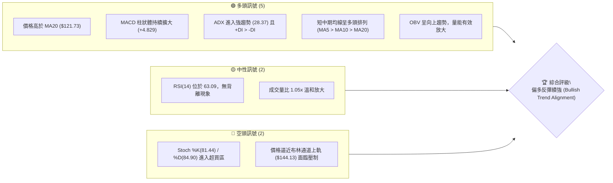
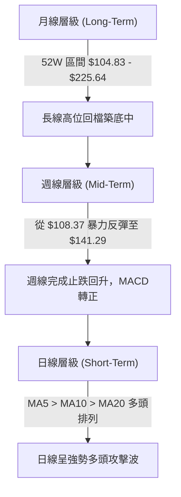
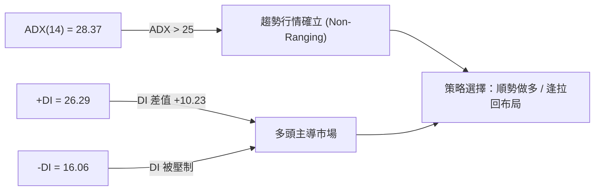
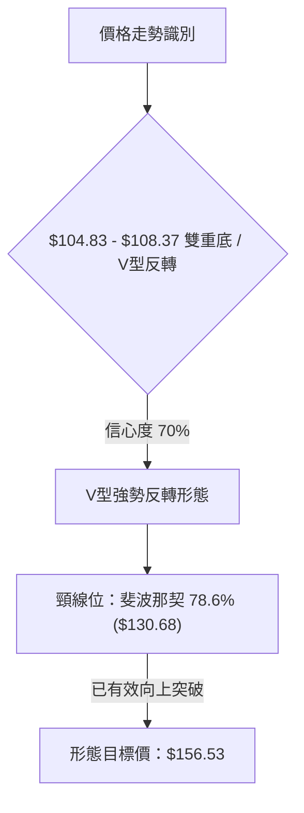
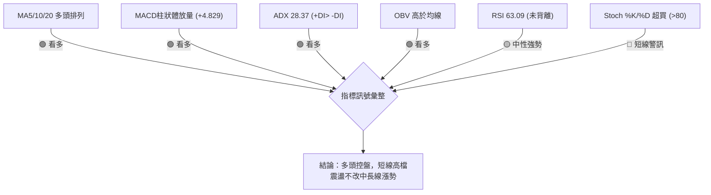
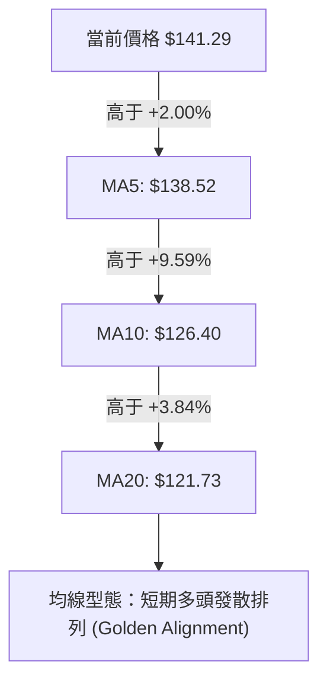
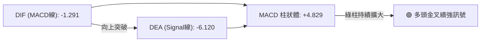
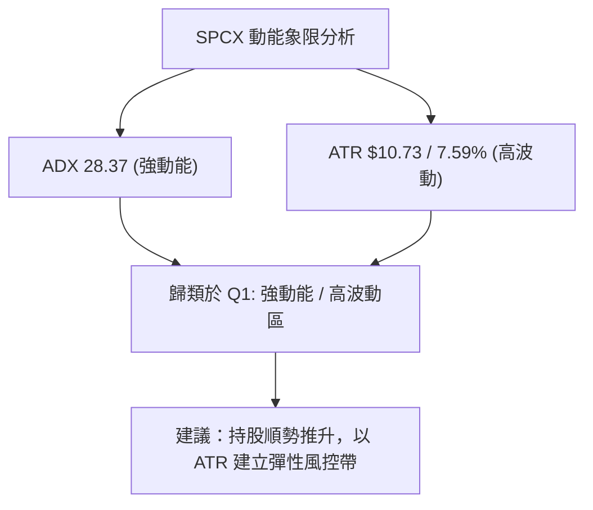
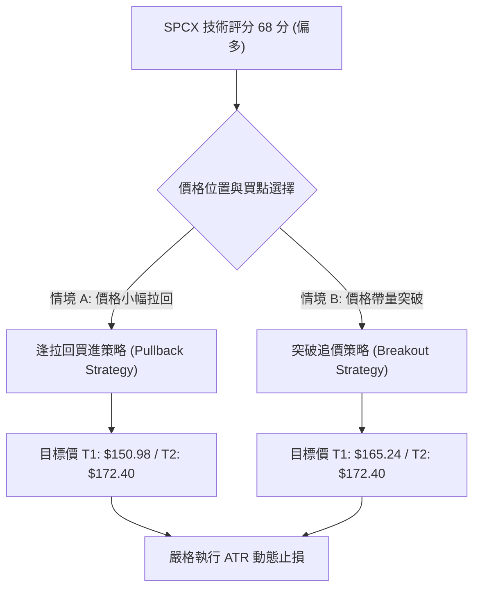
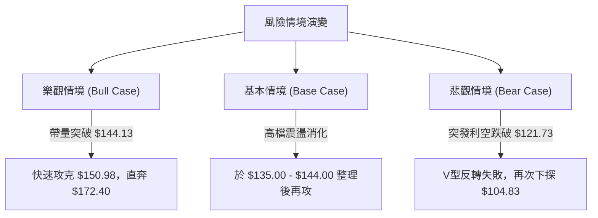

# SPCX 技術分析報告

> **報告日期**：2026-08-14 ｜ **語言**：繁體中文 ｜ **數據來源**：Yahoo Finance ｜ **當前價格**：$141.29

---

## 目錄

| 章節 | 內容 |
|------|------|
| [1. 技術面概覽](#1-技術面概覽) | 訊號儀表板、核心指標、評分卡 |
| [2. 趨勢分析](#2-趨勢分析) | 多時框趨勢、長中短期走勢 |
| [3. 圖表形態分析](#3-圖表形態分析) | 形態識別、K線組合、目標價 |
| [4. 支撐與阻力](#4-支撐與阻力) | 關鍵價位、斐波那契回調 |
| [5. 技術指標深度解讀](#5-技術指標深度解讀) | MA/RSI/MACD/布林/成交量 |
| [6. 動能與波動率](#6-動能與波動率) | 動能評估、ATR、Beta |
| [7. 多時框架總結](#7-多時框架總結) | 時框架評分矩陣 |
| [8. 交易策略建議](#8-交易策略建議) | 多空策略、風險報酬比 |
| [9. 風險提示與監控](#9-風險提示與監控) | 監控指標、風險場景 |

---

## 1. 技術面概覽

### 🎯 技術訊號儀表板



### 📊 核心指標速覽表

| 指標類別 | 指標名稱 | 當前數值 | 訊號 | 解讀 |
|----------|----------|----------|------|------|
| **價格** | 當前價格 | $141.29 | 🟢 | 位於52週區間30.2%位置，自近期低點 $104.83 強勢反彈 |
| **均線** | MA5 | $138.52 | 🟢 | 價格站在MA5上方 (+2.00%)，極短期動能強勁 |
| **均線** | MA10 | $126.40 | 🟢 | 價格站在MA10上方 (+11.78%)，提供近距動態支撐 |
| **均線** | MA20 | $121.73 | 🟢 | 價格站在MA20上方 (+16.07%)，中期轉多確立 |
| **動能** | RSI(14) | 63.09 | 🟢 | 處於強勢買盤區（50-70），未見頂背離 |
| **動能** | MACD | -1.291 | 🟢 | 柱狀圖 +4.829 呈金叉後持續放量，多頭控盤 |
| **動能** | Stoch %K/%D | 81.44 / 84.90 | 🔴 | 指標高位超買，短線有高檔震盪洗盤需求 |
| **趨勢** | ADX(14) | 28.37 | 🟢 | ADX > 25 且 +DI(26.29) > -DI(16.06)，強勢多頭趨勢 |
| **波動** | ATR(14) | $10.73 | 🟡 | 占股價 7.59%，波動度偏高，操作需擴大止損帶 |
| **通道** | BB %B | 0.94 | 🟡 | 價格緊貼布林上軌 ($144.13)，防範觸軌回檔 |

### 🏆 技術評分卡

```
╔══════════════════════════════════════════════════════════════════╗
║                   技術評分卡 — SPCX (2026-08-14)                 ║
╠══════════════════════════════════════════════════════════════════╣
║ 趨勢強度      ████████████████░░░░  80/100  🟢 強勢多頭 (ADX>25)  ║
║ 動能指標      ██████████████░░░░░░  70/100  🟢 MACD強勢 / 隨機超買  ║
║ 支撐穩定度    ████████████░░░░░░░░  60/100  🟡 $104.83雙底形成      ║
║ 成交量配合    ██████████████░░░░░░  70/100  🟢 攻擊週量顯著放大    ║
║ 形態完整度    ████████████░░░░░░░░  60/100  🟡 V型築底反彈階段      ║
║ 均線排列      ██████████████░░░░░░  70/100  🟢 MA5/10/20 短期多頭  ║
╠══════════════════════════════════════════════════════════════════╣
║ 綜合評分      █████████████░░░░░░░  68/100  評級：偏多 (BUY ON DIP) ║
╚══════════════════════════════════════════════════════════════════╝
```

---

## 2. 趨勢分析

### 🌐 多時框趨勢分析



### 📈 長期趨勢 — 12個月走勢圖（Unicode）

```
SPCX 24個月歷史與近年關鍵區間走勢示意圖
價格軸 ($)
$225.64 ┤                           ● (52W 高點 $225.64)
$197.13 ┤                         ╱   ╲
$172.40 ┤   ● (2026-06 $170.86)  ╱     ╲  阻力 R1 ($172.40)
$150.98 ┤  ╱ ╲                  ╱       ╲
$141.29 ┤─┼───┼────────────────┼─────────● (當前價格 $141.29)
$130.68 ┤╱     ╲              ╱
$121.73 ┤       ╲            ╱            (BB中軌/MA20 $121.73)
$104.83 ┤        ●──────────●             (52W 低點 $104.83 / 支撐 S1)
        └─┬──────┬──────────┬────────────┬─────────
        2026-06 2026-07   2026-08-02   2026-08-16
```

**走勢特徵分析表格**：

| 時間區間 | 收盤價範圍 | 漲跌幅估算 | 量能特徵 | 趨勢特徵分析 |
|----------|------------|------------|----------|--------------|
| 2026-06 | $170.86 | 基準位 | 高位放量 | 歷史高位震盪甩轎，築頂回落 |
| 2026-07 | $108.37 | -36.57% | 縮量陰跌 | 主跌段發酵，跌破多條中期均線 |
| 2026-08 (最新) | $141.29 | +30.38% | 攻擊爆量 | 於 $104.83 觸底，展現 V 型強勢反彈 |

### 📊 中期趨勢（週線分析）

```
週線等級關鍵價格廊道
┌─────────────────────────────────────────────────────────┐
│ $225.64  52週最高價 (終極強阻力)                        │
│ $172.40  波段高點阻力位 R1 (目標區間)                    │
│ $150.98  斐波那契 61.8% 回調位 (短線首要強壓)               │
│ $141.29  ★ 當前價格 (突破斐波那契 78.6% $130.68)           │
│ $121.73  MA20 / 布林中軌 (中期強弱分水嶺)               │
│ $104.83  52週最低價 / 波段支撐位 S1 (底部防線)             │
└─────────────────────────────────────────────────────────┘
```

週線數據顯示，SPCX 在 2026-08-02 週創下波段低點 $108.37（接近 52W 低點 $104.83），隨後在 2026-08-09 週伴隨 **9.20 億股** 的巨額成交量大陽線向上吞噬，收在 $133.11，一舉扭轉了 7 月份的連跌劣勢。當前週（2026-08-16 週）續攻至 $141.29，週 MACD 柱狀體由負轉正至 +4.829，確認中期底部建立。

### ⚡ 趨勢強度評估（ADX 解讀）



| 指標名稱 | 當前數值 | 臨界標準 | 趨勢解讀 |
|----------|----------|----------|----------|
| **ADX(14)** | **28.37** | > 25 | **強趨勢**：市場已脫離無方向的盤整，進入具備強烈方向性的趨勢波段 |
| **+DI** | **26.29** | > -DI | **多頭強勢**：買盤控盤，多頭力道占據優勢 |
| **-DI** | **16.06** | < +DI | **空頭衰退**：賣壓已被消化，空頭力量顯著弱化 |

---

## 3. 圖表形態分析

### 🔍 形態識別系統



#### 形態信心度與判斷依據表

| 形態類別 | 信心度 | 判斷依據（引用數據） | 完成度 | 目標價（附計算式） |
|----------|--------|----------------------|--------|--------------------|
| **V型底/雙重底反轉** | **70%** | 價格於 2026-08-02 探底 $108.37 後，以 9.20 億股巨量拉出長陽線，突破 $130.68 頸線 | 85% | 頸線 $130.68 + 形態高度 ($130.68 - $104.83 = $25.85) = **$156.53** |
| **布林帶上軌擠壓突破** | **60%** | BB %B 為 0.94，價格推升至 BB 上軌 $144.13 附近，MA5/10/20 發散向上 | 70% | 通道擴展推升目標看至斐波那契 61.8% **$150.98** |

### 🕯️ 重要K線形態分析

| 週/日期 | 收盤價 | K線形態 | 解讀 | 訊號 |
|---------|--------|---------|------|------|
| 2026-07-26 | $115.07 | 大陰線 | 探底加速，RSI 下探至 15.9 極度超賣 | 🔴 恐慌拋售 |
| 2026-08-02 | $108.37 | 止跌錘子/長下影線 | 於 $104.83 52W 低點附近獲得強支撐，多頭進場 | 🟡 止跌訊號 |
| 2026-08-09 | $133.11 | 巨量強勢陽包陰 | 週成交量爆出 9.20 億股，實體大陽線向上吞噬前三週跌幅 | 🟢 強烈買進 |
| 2026-08-16 | $141.29 | 帶上影線中陽線 | 延續多頭氣勢，挑戰布林帶上軌 $144.13 | 🟢 多頭控盤 |

### 📉 ASCII 走勢形態示意圖

```
SPCX 日/週線 V 型底反轉與目標價示意圖
價格 ($)
$172.40 ┤                                            [波段目標 R1]
$156.53 ┤──────────────────────────────────────────  [形態推算目標價]
$150.98 ┤                               ┌───┐        [Fib 61.8%]
$144.13 ┤                             ┌─┘   └─┐      [BB 上軌]
$141.29 ┤───────────────────────────●─┘              [當前現價 $141.29]
$130.68 ┤───────────────────────▲───┘                [頸線突破位 Fib 78.6%]
$121.73 ┤                     ╱                      [BB 中軌 / MA20]
$108.37 ┤        ●          ╱
$104.83 ┤────────┴─────────● (52W 低點雙底 $104.83)
        └────────────────────────────────────────
```

### 🎯 形態目標價計算

1. **頸線確認**：選取斐波那契 78.6% 回調位 **$130.68** 作為本次 V 型底反轉的頸線位。
2. **形態高度**：$130.68 (頸線) - $104.83 (52W 最低價) = **$25.85**。
3. **最小測量目標價**：頸線 $130.68 + 形態高度 $25.85 = **$156.53**。
4. **目標價整合驗證**：$156.53 介於斐波那契 61.8% ($150.98) 與 50.0% ($165.24) 之間，具備高可信度。

---

## 4. 支撐與阻力

### 🗺️ 關鍵價位分布圖（Unicode）

```
SPCX 價位結構分布圖 (由高至低)
═════════════════════════════════════════════════════════════════
$225.64 ║████████████████████████████████████████║ 52W 最高價 / Fib 0.0%
$197.13 ║████████████████████████████            ║ 斐波那契 23.6% 回調位
$172.40 ║████████████████████████                ║ 波段阻力 R1
$165.24 ║████████████████████                    ║ 斐波那契 50.0% 回調位
$150.98 ║████████████████                        ║ 斐波那契 61.8% 回調位
$144.13 ║▓▓▓▓▓▓▓▓▓▓▓▓▓▓                          ║ 布林通道上軌 (近距壓制)
$141.29 ╠════════════════════════════════════════╣ ◄ 現價 $141.29
$138.52 ║▓▓▓▓▓▓▓▓▓▓▓▓                            ║ MA5 極短期支撐
$130.68 ║████████████                            ║ 斐波那契 78.6% / 突破頸線
$126.40 ║████████                                ║ MA10 短期動態支撐
$121.73 ║████████████████                        ║ MA20 / 布林中軌 (關鍵支撐)
$104.83 ║████████████████████████████████████████║ 52W 最低價 S1 / Fib 100%
═════════════════════════════════════════════════════════════════
```

### 🚧 阻力位分析表

| 阻力級別 | 價位 | 形成原因 | 突破難度 | 重要性 |
|----------|------|----------|----------|--------|
| **近距阻力** | **$144.13** | 布林通道上軌，短線動能過熱過擴張壓制點 | 🟡 中等 | 短線多頭獲利了結點 |
| **關鍵阻力** | **$150.98** | 斐波那契 61.8% 回調位，中長線多空對決核心區 | 🔴 偏高 | 決定是否展開大波段行情 |
| **目標阻力 R1** | **$172.40** | 近一年波段高點聚類位，兼具心理關卡 | 🔴 高 | 中期多頭解套賣壓集中區 |
| **終極阻力** | **$225.64** | 52週最高價 (52W High / Fib 0.0%) | 🔴 極高 | 歷史高點頭部壓力 |

### 🛡️ 支撐位分析表

| 支撐級別 | 價位 | 形成原因 | 守住機率 | 重要性 |
|----------|------|----------|----------|--------|
| **近距支撐** | **$138.52** | MA5 移動平均線，極短期多頭防守點 | 🟢 80% | 保持強勢噴發形態臨界點 |
| **轉折支撐** | **$130.68** | 斐波那契 78.6% 回調位 / 頸線位 | 🟢 75% | 多頭回檔洗盤極限強支撐 |
| **防守支撐** | **$121.73** | MA20 移動平均線 / 布林通道中軌 | 🟢 85% | 中期多空分水嶺，絕對不可跌破 |
| **波段支撐 S1**| **$104.83** | 52週最低價 (52W Low / Fib 100.0%) | 🟢 95% | 長線雙重底頸腳，波段防禦底線 |

### 📐 斐波那契回調位分析

依據 52 週高低點區間（高點 **$225.64**，低點 **$104.83**，價差 **$120.81**）精確計算：

```
0.0%  (52W High)   $  225.64
23.6%              $  197.13
38.2%              $  179.49
50.0%              $  165.24
61.8%              $  150.98
78.6%              $  130.68  ◄ 價格已成功站上此處 ($141.29)
100.0% (52W Low)   $  104.83
```

**解讀**：當前價格 **$141.29** 已成功突破 **78.6% ($130.68)** 回調位，代表先前的深度修正段已經結束。現價正處於 **78.6% ($130.68)** 至 **61.8% ($150.98)** 的黃金推進通道中，下一核心關卡為 61.8% 的 **$150.98**。

---

## 5. 技術指標深度解讀

### 🎛️ 指標訊號總覽



### 📈 移動平均線排列分析



- **極短期 (MA5 $138.52)**：股價踩在 MA5 之上，短線斜率陡峭向上，買盤極為積極。
- **短期 (MA10 $126.40)**：MA10 上揚速率快，與 MA20 開口擴大，代表近 10 日進場者皆呈獲利狀態。
- **中期 (MA20 $121.73)**：MA20 翻揚，提供回檔時的強力實質支撐。

### 📉 RSI(14) 分析

```
RSI(14) 強度計：
0           30          50      63.09   70          100
├───────────┼───────────┼─────────█─────┼───────────┤
  超賣區       弱勢區       強勢區   ▲   超買區
                                  現價位置
```

- **RSI(14) 當前數值**：**63.09**。
- **區間評估**：處於 50–70 之多頭強勢區間，具備繼續向上推升的動能空間，尚未進入 >70 之極度過熱區。
- **背離檢測**：價格創近期新高 ($141.29)，RSI 亦從 2026-07-26 的 15.9 劇烈回升至 63.09，**無頂背離現象**，量價與動能配合良好。

### 📊 MACD(12/26/9) 訊號解讀



- **MACD 線 (-1.291)** 與 **Signal 線 (-6.120)** 在零軸下方形成強烈的「低位黃金交叉」。
- **MACD 柱狀體 (+4.829)**：柱狀體正值迅速擴大（從 2026-08-02 的 -0.988 擴大至 +4.829），顯示空頭動能完全衰竭，多頭正急速拉抬股價。

### 📦 布林通道分析

```
布林通道現況圖 (Band Width ~ $44.80)
┌─────────────────────────────────────────────────────────┐
│ $144.13  BB 上軌 ( Upper Band )   ◄ 現價 $141.29 逼近中 │
│ $121.73  BB 中軌 ( MA20 )        ◄ 核心支撐區           │
│ $99.33   BB 下軌 ( Lower Band )                         │
└─────────────────────────────────────────────────────────┘
```

- **布林指標數值**：BB 上軌 **$144.13**，BB 中軌 **$121.73**，BB 下軌 **$99.33**。
- **%B 指標**：**0.94**（極度貼近上軌 1.0 位置）。
- **解讀**：價格延續上軌開口推升（Band Riding），雖然短線有超買壓制，但在 ADX > 25 的強趨勢下，貼軌走高為典型的強勢攻擊特徵，除非回跌穿破 MA5 ($138.52)，否則不宜盲目做空。

### 💹 成交量分析（量價配合度）

- **最新日成交量**：117,955,781 股（1.18 億股）。
- **20日均量**：112,254,839 股（1.12 億股），量比 **1.05x**，展現溫和量增推升。
- **週級別爆量**：2026-08-09 週成交量飆升至 **920,449,800 股**（9.20 億股），為前週的 2.92 倍，屬於標準的「主力機構進場建倉爆量」。
- **OBV 趨勢**：OBV > MA，能量潮指標呈直線上升，成交量有效確認價格的上漲趨勢。

---

## 6. 動能與波動率

### ⚡ 動能評估四象限

| 象限 | 動能強度 (Momentum) | 波動率 (Volatility) | SPCX 當前位置 | 策略指引 |
|------|--------------------|---------------------|---------------|----------|
| **Q1** | **強 (Strong)** | **高 (High)** | **★ SPCX 位置** | **高動能/高波動：突破跟進，放寬止損帶** |
| Q2 | 弱 (Weak) | 低 (Low) | - | 觀望休兵 / 區間低買高賣 |
| Q3 | 強 (Strong) | 低 (Low) | - | 最佳波段持股區 |
| Q4 | 弱 (Weak) | 高 (High) | - | 避開 / 嚴格止損 |



### 📊 ATR 波動率分析

- **ATR(14)**：**$10.73**（佔當前股價 **7.59%**）。
- **風控合理解讀**：由於 SPCX 每日平均波幅高達 $10.73，短線雜訊較大。
- **止損距離建議**：
  - **緊密止損 (1.0x ATR)**：$141.29 - $10.73 = **$130.56**（恰好落在 78.6% 頸線 $130.68 附近）。
  - **標準止損 (1.5x ATR)**：$141.29 - ($10.73 × 1.5) = **$125.195**（高於 MA10 $126.40 附近）。
  - **波段止損 (2.0x ATR)**：$141.29 - ($10.73 × 2.0) = **$119.83**（低於 MA20 $121.73，避開甩轎）。

### 📐 Beta 與市場相關性

- **Beta 數值**：資料顯示為 N/A（私有/新公開發行航太科技股特性）。
- **市場屬性推估**：根據其 7.59% 的 ATR 與高成長航太/AI/衛星聯網產業背景，其價格波動度顯著高於大盤（估計隱含 Beta > 1.8）。高 Beta 屬性意味著在大盤多頭環境下，SPCX 具備極強的超額報酬（Alpha）爆發力。

---

## 7. 多時框架總結

### 📋 時框架評分表

| 時框架 | 趨勢方向 | 動能指標 | 均線排列 | 形態結構 | 綜合評分 | 交易建議 |
|--------|----------|----------|----------|----------|----------|----------|
| **月線 (Long)** | 🟡 中性築底 | RSI 50 橫盤 | MA50/200 N/A | 52W 低點反彈 | **60 / 100** | 長線築底完成，分批布局 |
| **週線 (Mid)** | 🟢 強勢反轉 | MACD 柱狀轉正 | 週 MA 重回多頭 | V型底突破 $130.68 | **75 / 100** | 中期波段做多，目標 $172.40 |
| **日線 (Short)**| 🟢 多頭攻擊 | ADX 28.37 強勁 | MA5>10>20 多頭 | 緊貼布林上軌推升 | **70 / 100** | 逢拉回 MA5/頸線加碼 |

### 🔲 綜合訊號矩陣

```
┌───────────────────────────────────────────────────────────────┐
│ 多時框訊號一致性對齊 (Multi-Timeframe Alignment)               │
├───────────────────────────────────────────────────────────────┤
│ 短期 (日線) ─────────►  🟢 多頭 (MA5 > MA10 > MA20)           │
│ 中期 (週線) ─────────►  🟢 多頭 (9.2億股巨量吞噬陽線)          │
│ 長期 (月線) ─────────►  🟡 中性偏多 ($104.83 底部確立)         │
├───────────────────────────────────────────────────────────────┤
│ 訊號收斂結論：三時框無顯著矛盾，短中期多頭趨勢方向高度一致。     │
└───────────────────────────────────────────────────────────────┘
```

### ⚖️ 多時框收斂結論

根據**多時框收斂規則**：當前 ADX(14) 為 **28.37 (>25)**，市場處於**標準趨勢行情**。
主導權歸屬於中長期趨勢（週線大攻擊陽線與 MA20 翻揚）。日線高檔超買（Stoch > 80）僅代表短線可能出現小幅回檔或橫盤消化賣壓，不改變中期向上挑戰 **斐波那契 61.8% ($150.98)** 與 **波段高點阻力 R1 ($172.40)** 的趨勢。

**唯一方向性結論**：**強勢偏多 (BULLISH)**。交易策略應以「拉回找買點做多」為主軸，不宜逆勢做空。

---

## 8. 交易策略建議

### 🗺️ 策略決策流程圖



### 🧭 策略路由

**當前主策略方向 = 🟢 多頭逢低布局與突破跟進 (依評分 68/100)**

由於綜合評分達 **68/100 (≥60)**，本報告主推**多頭交易策略**。空頭路徑僅列為風險觸發與對沖參考，不建議主動建立空頭部位。

### 🎯 價格情境階梯 (Price Scenarios)

| 觸發條件 | 下一目標 | 後續延伸 | 情境含義 |
|----------|----------|----------|----------|
| **強勢突破 BB上軌 $144.13** | **$150.98 (Fib 61.8%)** | **$165.24 (Fib 50.0%)** | 多頭主升段發動，漲勢加速 |
| **突破波段阻力 R1 $172.40** | **$197.13 (Fib 23.6%)** | **$225.64 (52W High)** | 中長線大翻盤，挑戰歷史天花板 |
| **回檔守住 MA5 $138.52 / 頸線 $130.68** | **$144.13** | **$150.98** | 健康換手震盪，提供最佳買點 |
| **跌破 MA20 $121.73 (悲觀)** | **$104.83 (S1)** | **無下限** | 假突破真破底，多頭策略失效 |

### 📊 情境機率分佈

```
情境機率估計分佈：
[1] 續攻突破/拉回再攻 ($150.98 - $172.40) : ██████████████████████ 55%
[2] 高檔 $130.68 - $144.13 區間震盪消化賣壓 : ████████████  30%
[3] 反轉回落跌破 $121.73 重回底盤          : ████  15%
```

- **續攻/拉回再攻 (55%)**：依據 MACD 柱狀體放量、ADX 28.37 趨勢成型及週量 9.2 億股加持。
- **高檔區間震盪 (30%)**：依據 Stoch 超買，短線需要以時間換取空間。
- **反轉回落 (15%)**：僅在市場發生重大系統性風險時觸發。

### 🟢 主策略詳情

#### 策略 A：拉回買進策略 (Pullback Long) — 🥇 首選最佳機會

- **進場條件**：股價短線拉回至 MA5 (**$138.52**) 至 斐波那契 78.6% 頸線 (**$130.68**) 區間分批布局。
- **進場價格**：**$135.00**（均價估算位）。
- **目標價 T1**：**$150.98**（斐波那契 61.8%）。
- **目標價 T2**：**$172.40**（波段高點阻力 R1）。
- **止損價格**：**$121.73**（跌破 MA20 / BB 中軌即刻止損）。
- **風險報酬比 (R/R)**：
  - 上漲空間至 T1 = $150.98 - $135.00 = **+$15.98**
  - 下檔風險至 Stop = $135.00 - $121.73 = **-$13.27**
  - **風報比 = 1 : 1.20**（若看至 T2 $172.40，上漲空間 +$37.40，**風報比 = 1 : 2.82**）。
- **成功機率**：**65%**。
- **建議倉位**：**15% - 20%**。

#### 策略 B：強勢突破追價策略 (Breakout Long) — 🥈 次選機會

- **進場條件**：日線收盤價強勢突破並站穩布林通道上軌 **$144.13** 且日成交量 > 1.2 億股。
- **進場價格**：**$144.50**。
- **目標價 T1**：**$156.53**（形態推算目標價）。
- **目標價 T2**：**$165.24**（斐波那契 50.0%）。
- **止損價格**：**$138.52**（跌破 MA5 移動平均線）。
- **風險報酬比 (R/R)**：
  - 上漲空間至 T2 = $165.24 - $144.50 = **+$20.74**
  - 下檔風險至 Stop = $144.50 - $138.52 = **-$5.98**
  - **風報比 = 1 : 3.47**。
- **成功機率**：**55%**。
- **建議倉位**：**10%**。

### 🔴 反向風險觸發點（對沖與清倉提示）

若 SPCX 出現無預警大陰線下殺，**收盤價跌破關鍵支撐 MA20 ($121.73)**，代表本輪自 $104.83 發動的 V 型反彈完全失效。此時應：
1. 立即清空所有多頭倉位。
2. 暫停任何逢低買進（Buy the Dip）操作。
3. 風險對沖者可適度建立對沖部位，下方測試 S1 **$104.83**。

### ⭐ 整體訊號強度評星

```
做多訊號強度：★★██☆  (4.0/5星)  — 均線多頭、爆量反彈、ADX強勁
做空訊號強度：★☆☆☆☆  (1.0/5星)  — 僅隨機指標高檔過熱，逆勢風險極高
整體可信度：  ★★██☆  (4.0/5星)  — 多時框量價配合一致
```

---

## 9. 風險提示與監控

### ✅ 關鍵監控指標 Checklist

```
╔══════════════════════════════════════════════════════════════════╗
║                   SPCX 每日風控與監控 Checklist                  ║
╠══════════════════════════════════════════════════════════════════╣
║ [ ] 價格是否維持在 MA5 ($138.52) 之上？ (若跌破，強勢攻勢暫緩)   ║
║ [ ] RSI(14) 是否突破 70 進入極度超買？ (防範高檔背離拉回)        ║
║ [ ] 日成交量是否保持在 1.12 億股均量之上？ (確認買盤延續性)      ║
║ [ ] 關鍵防守位 $130.68 (Fib 78.6%) 是否發揮支撐功效？            ║
║ [ ] MACD 柱狀體 (+4.829) 是否出現縮短跡象？                      ║
╚══════════════════════════════════════════════════════════════════╝
```

### ⚠️ 風險場景分析



### 🛡️ 風險管理重要提醒

1. **ATR 風險控制**：由於 SPCX 當前 ATR 高達 **$10.73 (7.59%)**，屬於典型的高波動股票，單筆交易虧損應控制在總資金的 **1% - 2%** 以內。
2. **避免過度槓桿**：Stoch %K/%D 指標已達 80 以上超買區，雖然 ADX 強勢，但高檔隨時可能出現單日 $8-$10 的劇烈洗盤，不宜使用高倍數槓桿追高。
3. **分批建倉原則**：建議採用 3:3:4 分批進場策略，先以 30% 預定倉位試水溫，待確認守穩 $130.68 或突破 $144.13 後再行加碼。

---

## 📋 報告總結

```
╔══════════════════════════════════════════════════════════════════╗
║                   SPCX 技術分析報告總結                          ║
════════════════════════════════════════════════════════════════════
報告日期：2026-08-14
當前價格：$141.29
分析評級：🟢 偏多 (BUY ON DIP / PULLBACK)

關鍵結論：
├─ 長期趨勢：🟡 $104.83 52週低點築底完成，長線打底向上
├─ 中期趨勢：🟢 週線 9.2 億股爆量拉出大陽線，V型反轉確立
├─ 短期趨勢：🟢 MA5/10/20 多頭排列，攻勢凌厲
├─ 關鍵支撐：$138.52 (MA5) / $130.68 (頸線) / $121.73 (MA20/中軌)
├─ 關鍵阻力：$144.13 (BB上軌) / $150.98 (Fib 61.8%) / $172.40 (R1)
└─ 分析師共識目標價：$232.44 (Mean)

最優策略組合：
1. 🥇 最佳機會：拉回 $130.68 - $138.52 區間分批布局多單，目標 $150.98 / $172.40。
2. 🥈 次選機會：日線實體陽線強勢突破 $144.13 後追價，停損設 $138.52。
3. 🥉 風險防守：嚴格以 $121.73 (MA20) 作為多頭最後停損棄守線。
════════════════════════════════════════════════════════════════════
```

---

> ⚠️ **免責聲明**：本報告為 AI 自動生成之技術分析，所有數據及估算均基於提供的歷史價格資訊。本報告**僅供研究與學術參考**，**不構成任何投資建議**。投資有風險，入市需謹慎。

---

*報告生成時間：2026-08-14 ｜ 數據來源：Yahoo Finance ｜ 分析框架：多時框技術分析*