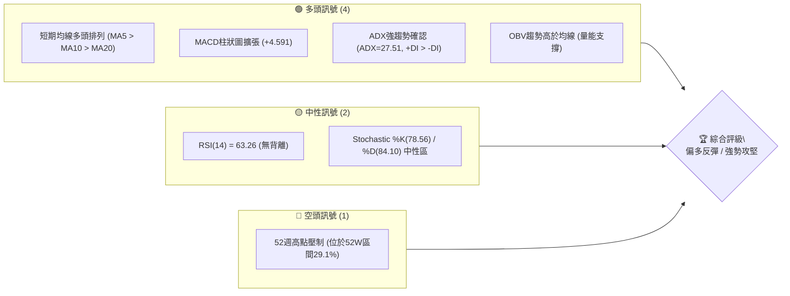
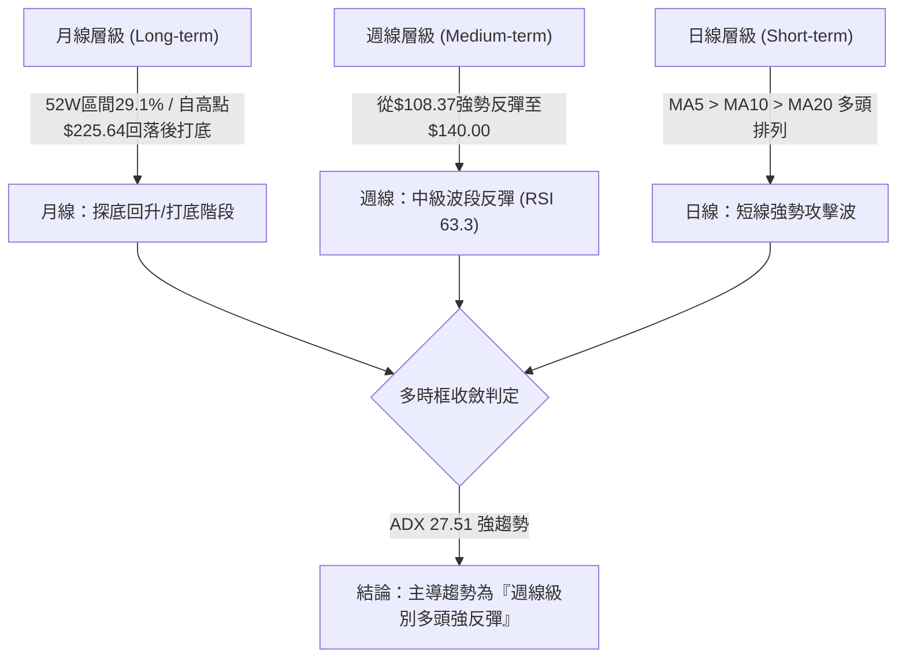
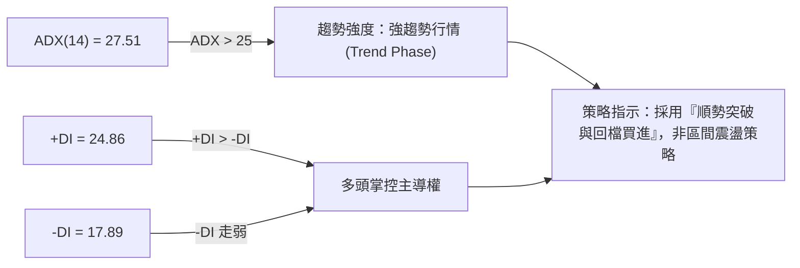
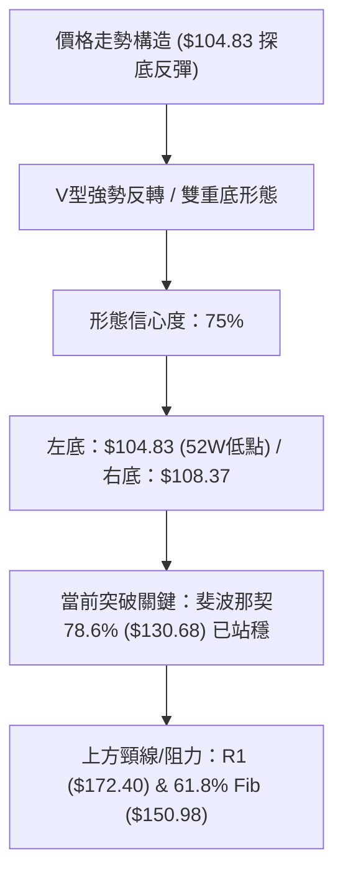
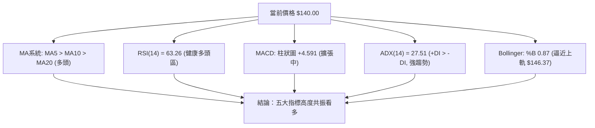
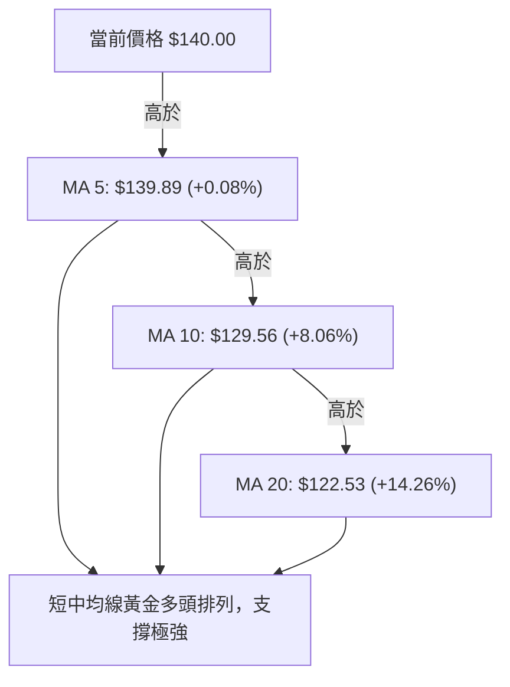
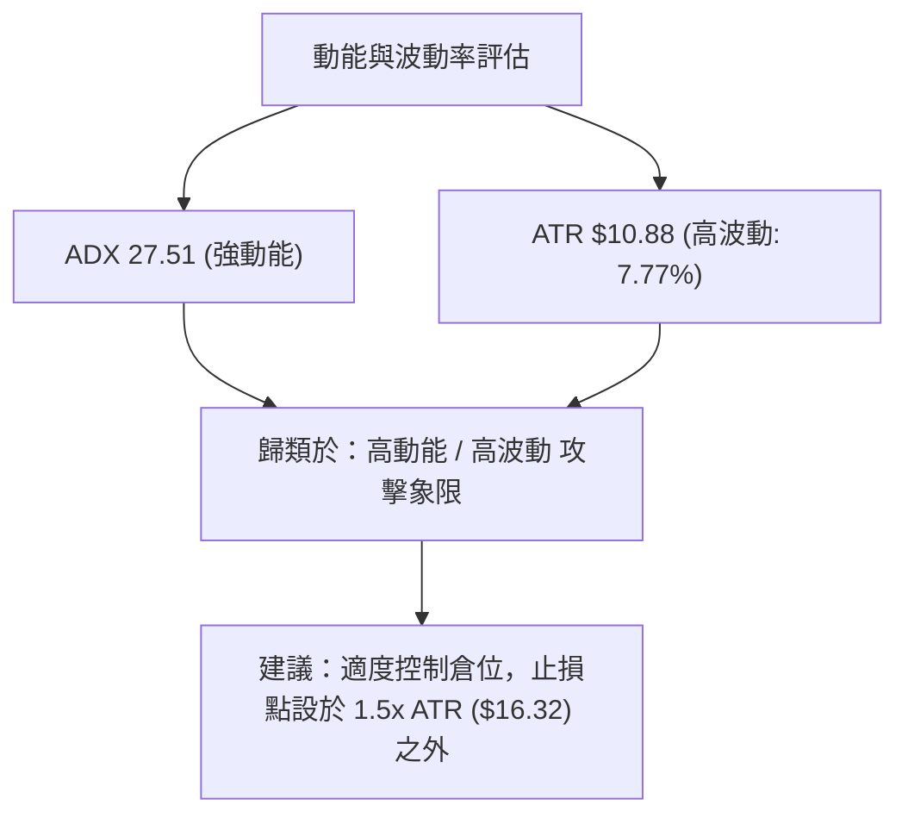
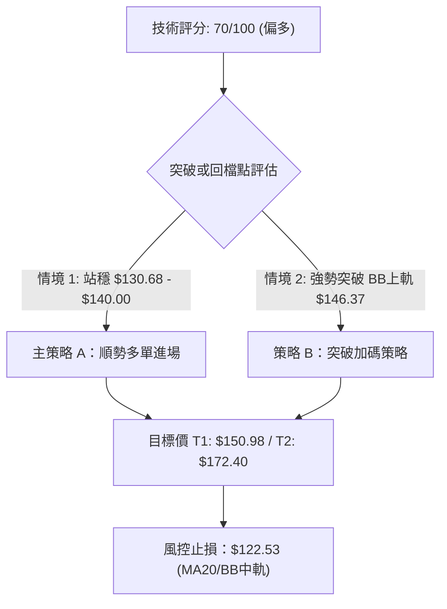
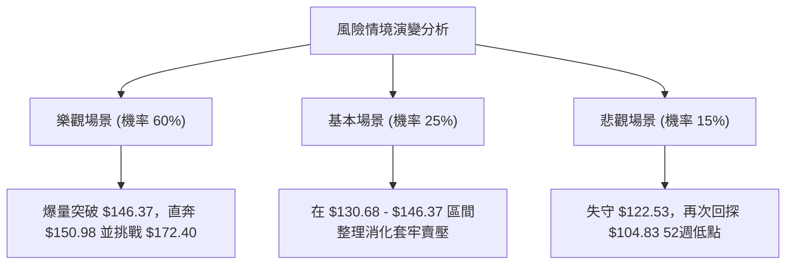

# SPCX 技術分析報告

> **報告日期**：2026-08-15 ｜ **語言**：繁體中文 ｜ **數據來源**：Yahoo Finance ｜ **當前價格**：$140.00

---

## 目錄

| 章節 | 內容 |
|------|------|
| [1. 技術面概覽](#1-技術面概覽) | 訊號儀表板、核心指標、評分卡 |
| [2. 趨勢分析](#2-趨勢分析) | 多時框趨勢、長中短期走勢 |
| [3. 圖表形態分析](#3-圖表形態分析) | 形態識別、K線組合、目標價 |
| [4. 支撐與阻力](#4-支撐與阻力) | 關鍵價位、斐波那契回調 |
| [5. 技術指標深度解讀](#5-技術指標深度解讀) | MA/RSI/MACD/布林/成交量 |
| [6. 動能與波動率](#6-動能與波動率) | 動能評估、ATR、Beta |
| [7. 多時框架總結](#7-多時框架總結) | 時框架評分矩陣 |
| [8. 交易策略建議](#8-交易策略建議) | 多空策略、風險報酬比 |
| [9. 風險提示與監控](#9-風險提示與監控) | 監控指標、風險場景 |

---

## 1. 技術面概覽

### 🎯 技術訊號儀表板



### 📊 核心指標速覽表

| 指標類別 | 指標名稱 | 當前數值 | 訊號 | 解讀 |
|----------|----------|----------|------|------|
| **價格** | 當前價格 | $140.00 | 🟡 中性 | 位於52週區間 $104.83 - $225.64 之 29.1% 位置 |
| **均線** | MA5 / MA10 / MA20 | $139.89 / $129.56 / $122.53 | 🟢 多頭 | 價格位於所有短期均線之上，呈多頭排列 |
| **均線** | MA50 / MA200 | 資料不足 | 🟡 待定 | 數據不足（歷史資料累積中） |
| **動能** | RSI(14) | 63.26 | 🟢 看多 | 穩健多頭區間，未進入超買（>70），無背離 |
| **動能** | MACD (12,26,9) | Hist: +4.591 | 🟢 看多 | MACD(-0.381) 向上金叉 Signal(-4.972)，柱狀圖持續擴張 |
| **趨勢** | ADX(14) | 27.51 | 🟢 強趨勢 | ADX > 25 表示明確趨勢；+DI(24.86) > -DI(17.89) 多頭主導 |
| **通道** | 布林通道 | Upper: $146.37 | 🟢 看多 | %B 為 0.87，價格逼近上軌，展現強烈上漲衝勁 |
| **波動** | ATR(14) | $10.88 | 🟡 高波動 | 佔股價 7.77%，每日波動劇烈，需寬幅止損 |
| **成交量**| 最新量 / 20日均量 | 94.66M / 112.92M | 🟢 健康 | 量比 0.84x，OBV高於MA，呈現量價配合升勢 |

### 🏆 技術評分卡

```
╔══════════════════════════════════════════════════════════════╗
║              SPCX 技術指標綜合評分卡 (2026-08-15)             ║
╠══════════════════════════════════════════════════════════════╣
║ 趨勢強度 (ADX/+DI)    ██████████████░░░░░░  72/100  🟢 看多  ║
║ 動能指標 (RSI/MACD)   ███████████████░░░░░  75/100  🟢 看多  ║
║ 支撐穩定度 (S1/Fib)   ████████████░░░░░░░░  60/100  🟡 中性  ║
║ 成交量配合 (OBV/Vol)  ██████████████░░░░░░  68/100  🟢 看多  ║
║ 形態完整度 (V型底)    ██████████████░░░░░░  70/100  🟢 看多  ║
║ 均線排列 (短線排列)   ███████████████░░░░░  75/100  🟢 看多  ║
╠══════════════════════════════════════════════════════════════╣
║ 綜合技術評分          ██████████████░░░░░░  70/100  🟢 偏多  ║
╚══════════════════════════════════════════════════════════════╝
```

---

## 2. 趨勢分析

### 🌐 多時框趨勢分析



### 📈 長期趨勢 — 12個月走勢圖（Unicode）

```
SPCX 歷史價格走勢示意圖（2025-08 至 2026-08）
價格軸 ($)
$225.64 ┤                ● (52W 高點)
$200.00 ┤               ╱ ╲
$172.40 ┤   ●          ╱   ╲              ● R1 ($172.40)
$150.98 ┤  ╱ ╲        ╱     ╲            ╱ 
$140.00 ┤ ╱   ╲      ╱       ╲          ●← 當前價格 ($140.00)
$130.68 ┤╱     ╲    ╱         ╲        ╱  (Fib 78.6%)
$104.83 ┤       ●──╱           ●──────● (52W 低點 $104.83 / 近期低點 $108.37)
        └─┬──┬──┬──┬──┬──┬──┬──┬──┬──┬──┬──
         M1 M2 M3 M4 M5 M6 M7 M8 M9 M10 M11 M12 (2026-08)
```

**走勢特徵分析表格**：

| 歷史階段 | 價格區間 | 漲跌幅估算 | 主要特徵與技術解讀 |
|----------|----------|------------|--------------------|
| 2026-06 高點攻堅 | $153.23 - $185.00 | +20.73% | 衝高至近一年次高區域，量能突破519M-925M週成交量。 |
| 2026-07 回檔修正 | $185.00 → $108.37 | -41.42% | 劇烈恐慌性下殺，探至52週低點 $104.83 附近（2026-08-02收$108.37）。 |
| 2026-08 築底強彈 | $108.37 → $140.00 | +29.19% | 週量放大至 920M，週RSI自19.2超賣升至63.3，完成築底彈升。 |

### 📊 中期趨勢（週線分析）

近20週數據顯示，SPCX 在 2026-07-26 至 2026-08-02 觸及極端超賣區（週RSI低至 15.9~19.2），於 $108.37 形成堅實底部。隨後於 2026-08-09 當週以 9.2億股的巨量強勢拉升至 $133.11，最新一週（2026-08-16）繼續推升至 $140.00，週 MACD 柱狀圖由 -0.988 急速翻正至 +4.591，確認中期趨勢已由空轉多。

### ⚡ 趨勢強度評估（ADX 解讀）



| 指標項 | 數值 | 門檻基準 | 趨勢解讀 |
|--------|------|----------|----------|
| **ADX (14)** | 27.51 | > 25.0 | **強趨勢啟動**：行情擺脫盤整，進入具備方向性的波段趨勢。 |
| **+DI (14)** | 24.86 | - | **買盤強勁**：多頭力道明顯占優。 |
| **-DI (14)** | 17.89 | - | **賣壓衰退**：空頭力量被有效抑制。 |

---

## 3. 圖表形態分析

### 🔍 形態識別系統



**形態信心度與目標價評估**：

| 形態類型 | 信心度 | 判斷依據（引用數據） | 完成度 | 目標價計算式與精確數值 |
|----------|--------|----------------------|--------|------------------------|
| **V型急銳反轉** | **75%** | 自 $108.37 單週大漲 +22.8% 至 $133.11，配合 920M 週成交量爆量。 | 85% | 底部 $108.37 + (突破位 $130.68 - $108.37) = **$152.99**（接近 61.8% Fib $150.98） |
| **雙底形態 (W-Bottom)** | **65%** | 52週低點 $104.83 與 2026-08-02 低點 $108.37 形成雙底打底構造。 | 70% | 頸線阻力 R1 $172.40；若突破 R1，波段延伸目標可達 **$239.97** (突破R1+形態高度$67.57) |

### 🕯️ 重要K線形態分析

| 日期 / 時段 | 收盤價 | K線形態 | 解讀 | 訊號 |
|-------------|--------|---------|------|------|
| **2026-07-26 週** | $115.07 | 長下影陰線 | RSI進入15.9極端超賣，下探 $104.83 後出現買盤支撐。 | 🟢 築底訊號 |
| **2026-08-02 週** | $108.37 | 縮量止跌十字星 | 成交量萎縮至315M，賣壓枯竭，確認二次打底。 | 🟢 轉折準備 |
| **2026-08-09 週** | $133.11 | 巨量長紅大陽線 | 成交量劇增至920M，週RSI狂飆至57.4，多頭強勢吞噬。 | 🟢🟢 強烈買進 |
| **2026-08-16 週** | $140.00 | 連續紅K上攻 | 當前日價站穩 MA5($139.89) 與 MA10($129.56)，維持攻勢。 | 🟢 多頭延續 |

### 📉 ASCII 走勢形態示意圖

```
SPCX V型反轉與關鍵阻力形態圖
═════════════════════════════════════════════════════════════════
$172.40 ┤...........................................[R1 頸線阻力]
        │                                          ╱
$150.98 ┤........................................[Fib 61.8% 目標1]
        │                                      ╱
$140.00 ┤...................................● [現價 $140.00]
        │                                 ╱
$130.68 ┤..............................● [突破點 Fib 78.6%]
        │                            ╱
$108.37 ┤             ●............● [右底 $108.37]
        │            ╱ ╲          ╱
$104.83 ┤...........●...╲────────╱ [左底 52W低點 $104.83]
        └════════════════════════════════════════════════════════
```

### 🎯 形態目標價計算

1. **第一目標價 (T1)**：取斐波那契 61.8% 回調位 **$150.98**。由 V 型反轉初段高度推估，此處為前期密集套牢區下緣。
2. **第二目標價 (T2)**：取近一年波段阻力 R1 **$172.40**。若攻克 $150.98，行情將挑戰 50.0% Fib ($165.24) 與 R1 ($172.40) 形成的強阻力帶。

---

## 4. 支撐與阻力

### 🗺️ 關鍵價位分布圖（Unicode）

```
SPCX 關鍵價位結構分布圖
═════════════════════════════════════════════════════════════════
$225.64 ║████████████████████████████████████████ 52W 最高點 (Fib 0.0%)
$197.13 ║████████████████████████                 Fib 23.6% 重壓位
$179.49 ║████████████████                         Fib 38.2% 阻力位
$172.40 ║████████████████████████████████         波段關鍵阻力 R1
$165.24 ║████████████                             Fib 50.0% 中樞位
$150.98 ║████████████████                         Fib 61.8% 第一目標位
$146.37 ║████████                                 布林通道上軌
$140.00 ╠═════════════════════════════════════════ ◄ 當前價格 $140.00
$130.68 ║▓▓▓▓▓▓▓▓▓▓▓▓▓▓▓▓                         Fib 78.6% 短線支撐
$122.53 ║▓▓▓▓▓▓▓▓▓▓▓▓▓▓▓▓▓▓▓▓▓▓▓▓▓▓▓▓▓▓             BB中軌 / MA20 強支撐
$104.83 ║████████████████████████████████████████ 52W 最低點 S1 (Fib 100.0%)
═════════════════════════════════════════════════════════════════
```

### 🚧 阻力位分析表

| 阻力級別 | 價位 | 形成原因（引用數據） | 突破難度 | 重要性 |
|----------|------|----------------------|----------|--------|
| **R1** | **$146.37** | 布林通道上軌 (BB Upper) | 🟡 中等 | 短線動能過熱回檔風險點 |
| **R2** | **$150.98** | 斐波那契 61.8% 回調位 | 🟡 中等 | 多頭第一波波段攻攻目標 |
| **R3** | **$165.24** | 斐波那契 50.0% 回調位 | 🔴 偏高 | 多空分水嶺中樞 |
| **R4** | **$172.40** | 近一年波段高點聚類 (數據R1) | 🔴 極高 | 關鍵波段強阻力，突破則轉長多 |
| **R5** | **$225.64** | 52週最高點 (Fib 0.0%) | 🔴 極高 | 歷史高點壓力區 |

### 🛡️ 支撐位分析表

| 支撐級別 | 價位 | 形成原因（引用數據） | 守住機率 | 重要性 |
|----------|------|----------------------|----------|--------|
| **S1** | **$130.68** | 斐波那契 78.6% 回調位 | 🟢 高 | 短線多頭防守第一線 |
| **S2** | **$122.53** | 20日移動平均線 (MA20 / BB中軌) | 🟢 高 | 中短期多空強弱生命線 |
| **S3** | **$104.83** | 52週最低點聚類 (數據S1 / Fib 100%) | 🟢 極高 | 底部絕對防線 |

### 📐 斐波那契回調位分析

當前價格 **$140.00** 位於 52 週波段區間（$104.83 至 $225.64）之 **78.6% ($130.68)** 與 **61.8% ($150.98)** 回調位之間：

```
0.0%  (52W High)   $225.64 ─── 歷史高點
23.6%              $197.13 ─── 長期強阻力
38.2%              $179.49 ─── 中期阻力
50.0%              $165.24 ─── 中樞回調位
61.8%              $150.98 ─── 上方首要解套阻力位 (T1)
  ▲
  │ (當前價 $140.00 運行於此區間，展現強勢反彈)
  ▼
78.6%              $130.68 ─── 已有效突破轉為關鍵支撐 (S1)
100.0% (52W Low)   $104.83 ─── 築底低點防線
```

- **解讀**：股價自 $104.83 躍升並成功站穩 Fib 78.6% ($130.68) 之上，顯示底部反彈趨勢確立。下一步將進逼 Fib 61.8% ($150.98) 阻力關卡。

---

## 5. 技術指標深度解讀

### 🎛️ 指標訊號總覽



### 📈 移動平均線排列分析



- **短線結構**：價格突破 MA20 ($122.53) 並向上拉開 14.26% 差距，MA5、MA10、MA20 呈現標準多頭發散，支撐力道充足。
- **長線數據**：數據集中 MA50/MA200 標註為 N/A（歷史數據積累中），故完全依據已有 MA5/MA10/MA20 進行短中期判定。

### 📉 RSI(14) 分析

- **當前數值**：**63.26**
- **強度進度條**：`▓▓▓▓▓▓▓▓▓▓▓▓▓░░░░░░░` (63.26%)
- **狀態判定**：🟢 **多頭控盤中性偏強**
- **背離檢測**：**無明顯背離**。RSI隨價格自超賣區（週RSI 15.9）一路回升至 63.26，屬於健康量能推升，未進入 >70 之極端超買區，仍有向上拉升空間。

### 📊 MACD(12/26/9) 訊號解讀

- **MACD 線**：-0.381
- **Signal 線**：-4.972
- **MACD 柱狀圖**：**+4.591** 🟢 看多
- **分析**：MACD 線已大幅向上穿越 Signal 線，形成強烈的底位黃金交叉，且柱狀圖由負翻正並快速擴張至 +4.591，顯示中期下行趨勢已宣告終結，多頭動能極其強勁。

### 📦 布林通道分析

```
SPCX 布林通道區域示意圖
═════════════════════════════════════════════════════════════════
$146.37 ┼──────────────────────────────────────── 布林通道上軌 (BB Upper)
        │                                  ● ($140.00, %B = 0.87)
$122.53 ┼──────────────────────────────────────── 布林中軌 (MA20)
        │
$98.69  ┼──────────────────────────────────────── 布林通道下軌 (BB Lower)
═════════════════════════════════════════════════════════════════
```

- **%B 指標**：**0.87**。價格位於通道上半部，緊貼上軌（$146.37）運行，呈現典型強勢突破通道形態。若進一步推擠上軌，通道將展開「布林開口（Band Width Expansion）」，引發加速行情。

### 💹 成交量分析（量價配合度）

- **最新成交量**：94,658,090 股
- **20日均量**：112,918,754 股（量比：0.84x）
- **週量特徵**：2026-08-09 當週爆出 920,449,800 股巨量後，價格快速拉離底部；最新一週維持 661M 高位。
- **OBV 趨勢**：數據顯示 **OBV > MA**，量能持續流入，確認資金回流支撐股價上漲。

---

## 6. 動能與波動率

### ⚡ 動能評估四象限

| 象限 | 動能 (Momentum) | 波動率 (Volatility) |SPC 當前位置 | 策略意涵 |
|------|-----------------|---------------------|-------------|----------|
| **Q1** | 強 (ADX 27.5, RSI 63.3) | 高 (ATR 7.77%) | **★ 當前定位 (Q1)** | **高動能/高波動**：適合順勢追擊，但需設置較寬止損。 |
| **Q2** | 強 | 低 | - | 最佳穩健加碼區 |
| **Q3** | 弱 | 低 | - | 沉悶盤整觀望區 |
| **Q4** | 弱 | 高 | - | 高風險下殺區 |



### 📊 ATR 波動率分析

- **ATR(14)**：**$10.88**（佔當前股價 $140.00 之 **7.77%**）
- **解讀**：SPCX 屬於高beta/高波幅標的，日均波動高達約 10.88 美元。
- **風控應用**：
  - **日內波幅預測**：高點 $150.88 / 低點 $129.12。
  - **止損距離建議**：採用 1.5 倍 ATR = **$16.32**。若以 $140.00 進場，多頭風控止損不宜小於 $123.68（正好與 MA20 $122.53 吻合）。

### 📐 Beta 與市場相關性

- **Short Ratio**：2.85 天
- **Short % Float**：3.3%（籌碼面尚屬穩定，無極端軋空壓力，但空頭回補力道可在突破時提供推升助力）。

---

## 7. 多時框架總結

### 📋 時框架評分表

| 時框架 | 趨勢方向 | 動能指標 | 均線排列 | 形態結構 | 綜合評分 | 建議操作 |
|--------|----------|----------|----------|----------|----------|----------|
| **日線 (Short-term)** | 🟢 多頭 | RSI 63.3 / MACD柱+4.59 | 🟢 多頭 (MA5>10>20) | V型突破 | **75/100** | 偏多操作 / 回檔買進 |
| **週線 (Medium-term)**| 🟢 多頭 | 週RSI 63.3 / 週MACD翻正 | 🟢 多頭 | 築底反彈 | **70/100** | 波段持有 / 挑戰R1 |
| **月線 (Long-term)**  | 🟡 中性 | 自高點$225.64修正後回升 | N/A (數據累積) | 築底回升 | **60/100** | 長線佈局 / 觀察$150.98 |

### 🔲 綜合訊號矩陣

```
                     日線訊號 (Daily)
                 看多 (Bullish)   看空 (Bearish)
               ┌────────────────┬────────────────┐
看多 (Bullish) │  ★ SPCX 區域   │                │
週線           │ (多時框強共振)  │  中途修正波    │
訊號           ├────────────────┼────────────────┤
(Weekly)       │                │                │
看空 (Bearish) │  反彈空點/假突破│  主跌段延續    │
               └────────────────┴────────────────┘
```

### ⚖️ 多時框收斂結論

依據多時框收斂規則：ADX 為 **27.51 (>25)**，市場處於明確的**趨勢行情**，應依據中短期（週線/日線）方向為主導。
- **最終收斂方向**：**偏多反彈（Bullish Rebound / Short-to-Medium Term Uptrend）**。
- **主導邏輯**：日線與週線訊號高度一致看多，價格成功站穩 Fib 78.6% ($130.68) 與 MA20 ($122.53)，動能指標全數轉強，主導第 8 章之多頭交易策略。

---

## 8. 交易策略建議

### 🗺️ 策略決策流程圖



### 🧭 策略路由

**當前主策略方向 = 🟢 多頭順勢攻擊策略（依評分 70/100 分流）**

### 🎯 價格情境階梯 (Price Scenarios)

| 觸發條件 | 下一目標 | 後續延伸 | 情境含義 |
|----------|----------|----------|----------|
| **突破 BB上軌 $146.37** | Fib 61.8% **$150.98** | Fib 50.0% **$165.24** | 多頭加速攻堅波段發動 |
| **站穩現價 $140.00** | **$146.37** | **$150.98** | 循序漸進強勢反彈 |
| **跌破 S1 $130.68** | MA20 **$122.53** | S1 **$104.83** | 短線回檔深探，考驗MA20生命線 |

### 📊 情境機率分佈

| 情境 | 機率 | 主要依據 |
|------|------|----------|
| **續揚挑戰 $150.98 / $172.40** | **60%** | MACD柱狀圖擴張(+4.591)、ADX(27.51)強趨勢、週量爆發 |
| **高位 $130.68 - $146.37 震盪** | **25%** | 逼近布林通道上軌 $146.37，需要消化上方賣壓 |
| **拉回重探底 $104.83** | **15%** | 僅在失守 MA20 ($122.53) 且整體市場系統性風險大增時發生 |

### 🟢 主策略詳情

| 策略要素 | 策略 A（現價/回檔進場） | 策略 B（突破加碼進場） |
|----------|------------------------|------------------------|
| **策略類型** | 順勢波段多單 | 通道突破加碼單 |
| **進場條件** | 現價 $140.00 附近或回檔 $130.68 守穩 | 強勢突破並收高於布林上軌 $146.37 |
| **進場價格** | **$140.00**（或 $130.68 - $140.00 分批） | **$146.50** |
| **目標價 T1** | **$150.98** (Fib 61.8%) | **$165.24** (Fib 50.0%) |
| **目標價 T2** | **$172.40** (阻力位 R1) | **$172.40** (阻力位 R1) |
| **止損價格** | **$122.53** (跌破MA20/BB中軌出場) | **$139.89** (跌破 MA5 出場) |
| **風險報酬比**| **1.85 : 1** (以T2計算: +$32.40 / -$17.47) | **3.92 : 1** (以T2計算: +$25.90 / -$6.61) |
| **成功機率** | **65%** | **60%** |
| **建議倉位** | **15% - 20%** | **10%** |

### 🔴 反向風險觸發點（對沖提示）

- **觸發條件**：若日線收盤價跌破 **$122.53 (MA20)**，表明短線反彈動能衰竭，多頭應即刻止損離場，轉為中性觀望；若跌破 **$104.83**，則觸發強烈看空避險訊號。

### ⭐ 整體訊號強度評星

```
╔══════════════════════════════════════════════════════════════╗
║ 做多訊號強度：★★★★☆  (4.0/5星)                             ║
║ 做空訊號強度：★☆☆☆☆  (1.0/5星)                             ║
║ 整體可信度：  ★★★★☆  (4.0/5星)                             ║
╚══════════════════════════════════════════════════════════════╝
```

---

## 9. 風險提示與監控

### ✅ 關鍵監控指標 Checklist

```
╔══════════════════════════════════════════════════════════════╗
║                     SPCX 日常風控監控清單                     ║
╠══════════════════════════════════════════════════════════════╣
║ [ ] 價格是否維持在 MA20 ($122.53) 之上                      ║
║ [ ] RSI(14) 是否向下跌破 50 中軸線                          ║
║ [ ] MACD 柱狀圖 (+4.591) 是否出現高位縮頭                    ║
║ [ ] 成交量是否於衝擊 $150.98 時維持在 112M 均量之上         ║
║ [ ] ADX(14) 能否持續維持在 25 以上強趨勢區間                ║
╚══════════════════════════════════════════════════════════════╝
```

### ⚠️ 風險場景分析



### 🛡️ 風險管理重要提醒

1. **單筆風險控制**：鑑於 ATR 高達 $10.88 (7.77%)，單筆交易虧損務必控制在總資金的 **1% - 2%** 以內。
2. **倉位配置管理**：建議總倉位不超過 **20%**，並採用分批建倉策略（如 $140.00 建第一批，突破 $146.37 再行加碼）。
3. **動態移動止盈**：當價格抵達第一目標價 **$150.98** 後，應將止損點上移至進場保本點（$140.00），以鎖定既有利潤。

---

## 📋 報告總結

```
╔══════════════════════════════════════════════════════════════════════════╗
║                        SPCX 技術分析報告總結                             ║
════════════════════════════════════════════════════════════════════════════
  報告日期：2026-08-15
  當前價格：$140.00
  分析評級：🟢 偏多反彈 / 強勢攻擊 (70/100分)

  關鍵技術特徵：
  ├─ 長期趨勢：🟡 打底回升 (52週區間 $104.83 - $225.64 之 29.1% 位置)
  ├─ 中期趨勢：🟢 強勢反彈 (週RSI自19.2狂飆至63.3，MACD柱狀圖翻正)
  ├─ 短期趨勢：🟢 多頭攻堅 (MA5 > MA10 > MA20 多頭排列，逼近布林上軌 $146.37)
  ├─ 關鍵支撐：S1: $130.68 (Fib 78.6%) ｜ S2: $122.53 (MA20/BB中軌)
  ├─ 關鍵阻力：R1: $150.98 (Fib 61.8%) ｜ R2: $172.40 (波段高點阻力)
  └─ 分析師共識目標：$232.44 (均價目標，提供中長期基本面背書)

  最優策略組合：
  1. 🥇 主推策略：$140.00 順勢做多，目標 $150.98 / $172.40，止損 $122.53。
  2. 🥈 次選策略：若突破 $146.37 順勢追擊，目標 $165.24 / $172.40。
  3. 🥉 風控底線：日線收盤跌破 $122.53 全數平倉觀望。
╚══════════════════════════════════════════════════════════════════════════╝
```

---

> ⚠️ **免責聲明**：本報告為 AI 自動生成之技術分析，所有數據及估算均基於提供的歷史價格資訊。本報告**僅供研究與學術參考**，**不構成任何投資建議**。投資有風險，入市需謹慎。

---

*報告生成時間：2026-08-15 ｜ 數據來源：Yahoo Finance ｜ 分析框架：多時框技術分析*