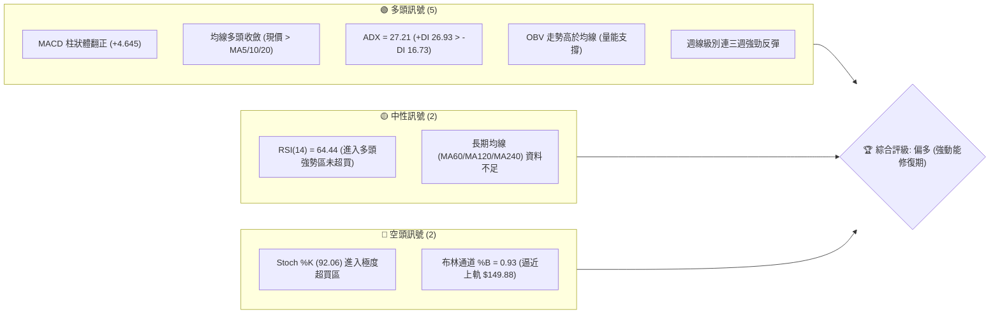
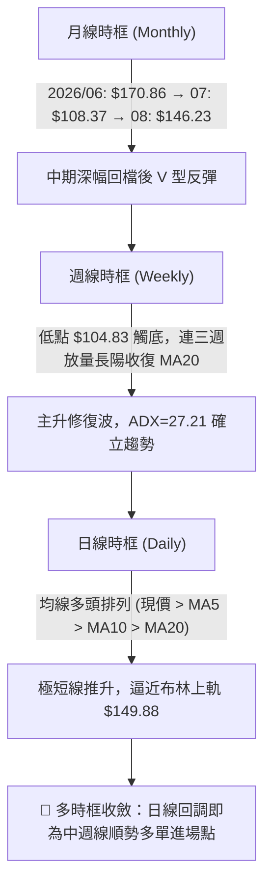
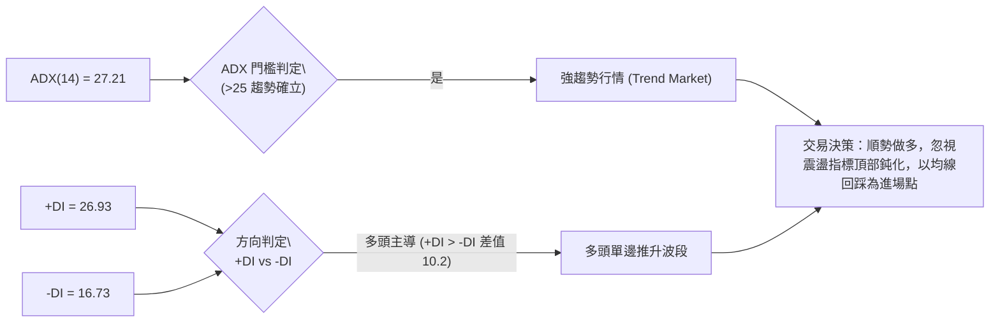
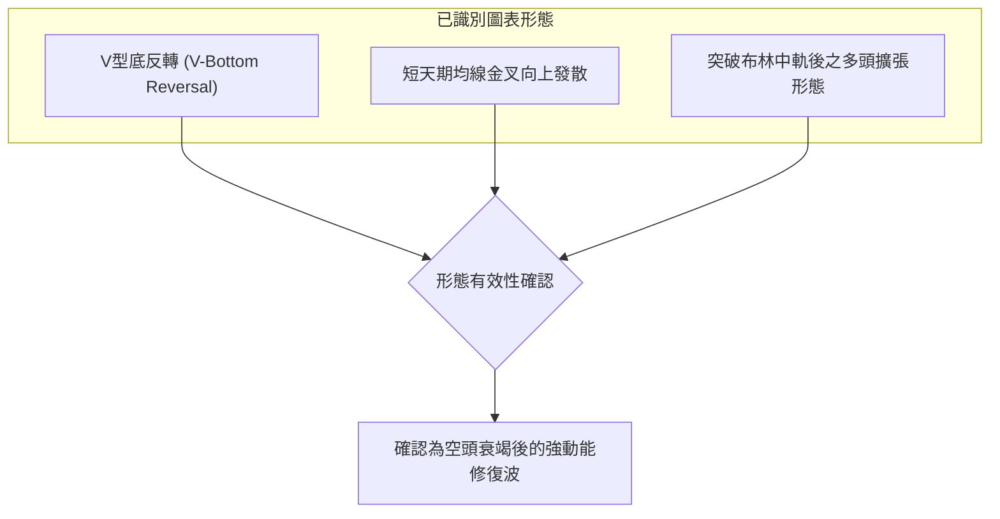
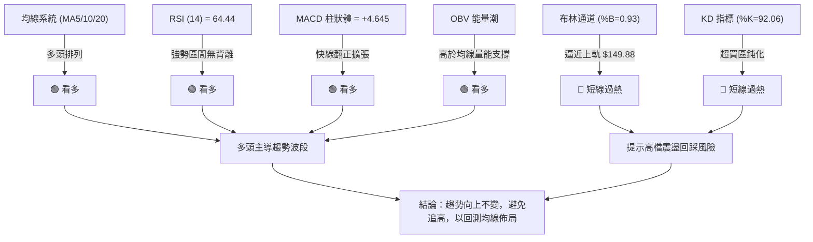
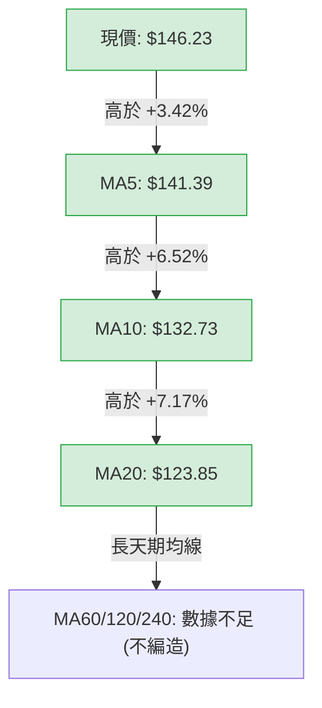
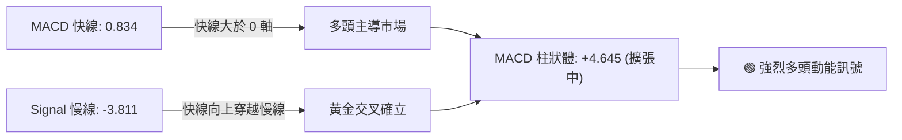
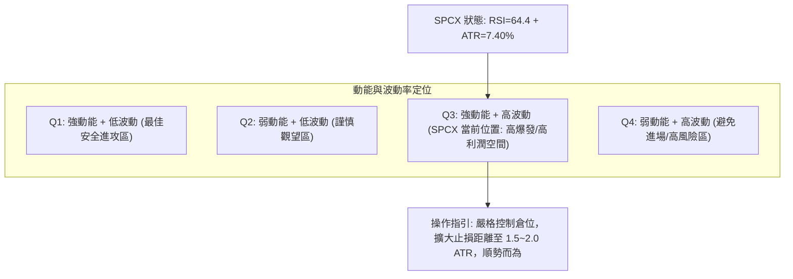
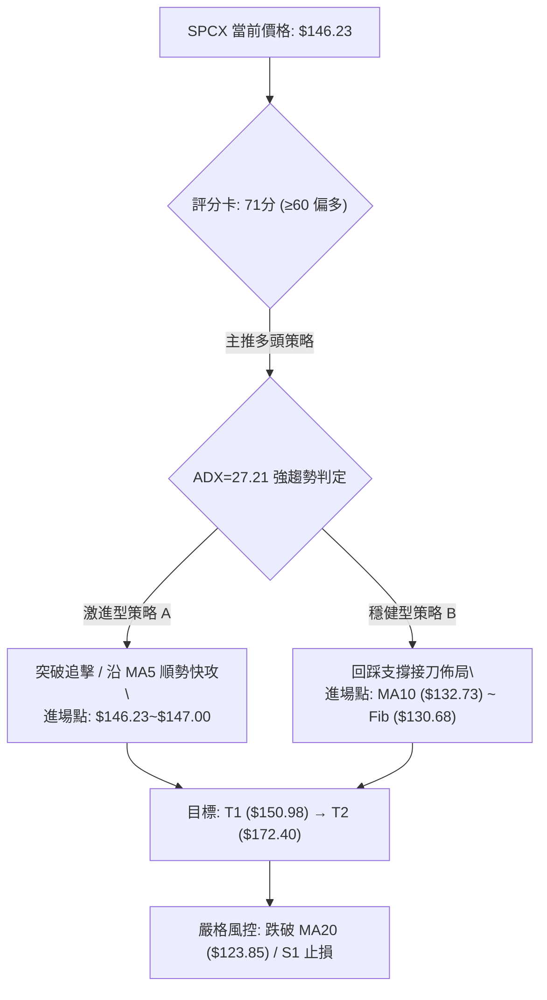
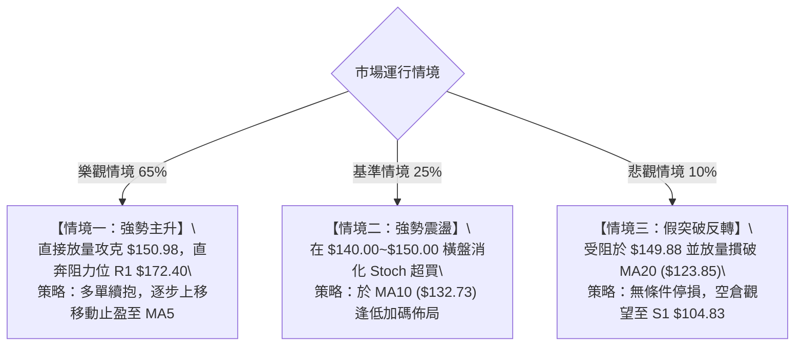

# SPCX 技術分析報告

> **報告日期**：2026-08-18 ｜ **語言**：繁體中文 ｜ **數據來源**：Yahoo Finance ｜ **當前價格**：$146.23

---

## 目錄

| 章節 | 內容 |
|------|------|
| [1. 技術面概覽](#1-技術面概覽) | 訊號儀表板、核心指標、評分卡 |
| [2. 趨勢分析](#2-趨勢分析) | 多時框趨勢、長中短期走勢 |
| [3. 圖表形態分析](#3-圖表形態分析) | 形態識別、K線組合、目標價 |
| [4. 支撐與阻力](#4-支撐與阻力) | 關鍵價位、斐波那契回調 |
| [5. 技術指標深度解讀](#5-技術指標深度解讀) | MA/RSI/MACD/布林/成交量 |
| [6. 動能與波動率](#6-動能與波動率) | 動能評估、ATR、Beta |
| [7. 多時框架總結](#7-多時框架總結) | 時框架評分矩陣 |
| [8. 交易策略建議](#8-交易策略建議) | 多空策略、風險報酬比 |
| [9. 風險提示與監控](#9-風險提示與監控) | 監控指標、風險場景 |

---

## 1. 技術面概覽

### 🎯 技術訊號儀表板



### 📊 核心指標速覽表

| 指標類別 | 指標名稱 | 當前數值 | 訊號 | 解讀 |
|----------|----------|----------|------|------|
| **價格** | 當前價格 | $146.23 | 🟢 | 自年內低點 $104.83 強勁反彈，位於52週區間 34.3% |
| **均線** | MA5 | $141.39 | 🟢 | 現價高於 MA5 (+3.42%)，極短線呈多頭推升 |
| **均線** | MA10 | $132.73 | 🟢 | 現價高於 MA10 (+10.17%)，短線支撐強勁 |
| **均線** | MA20 | $123.85 | 🟢 | 現價高於 MA20 (+18.07%)，突破布林中軌後展開主升 |
| **均線** | MA50 / MA200 | 數據不足 | 🟡 | 歷史數據不足，以現有 20 週均線作為主要基線 |
| **動能** | RSI(14) | 64.44 | 🟢 | 脫離 7 月超賣區 (15.9)，多頭動能穩健且未達極端超買 |
| **動能** | MACD (12,26,9) | 0.834 / -3.811 | 🟢 | 快線突破慢線，MACD 柱狀體擴張至 +4.645，多頭確立 |
| **震盪** | Stoch %K / %D | 92.06 / 84.02 | 🔴 | 進入 >80 極端超買區，短線隨時有回測消化可能 |
| **趨勢** | ADX (14) | 27.21 | 🟢 | ADX > 25 且 +DI (26.93) 主導，確認強勢上升趨勢 |
| **通道** | Bollinger %B | 0.93 | 🟡 | 逼近上軌 $149.88，短線壓制明顯，但通道正向擴張 |
| **量能** | 20日量比 / OBV | 0.99x / 多頭 | 🟢 | OBV > MA，反彈由放量推動（8/9 週成交 9.2億股） |
| **波動** | ATR(14) | $10.82 | 🟡 | 佔股價 7.40%，單日波動劇烈，需設定足夠止損寬度 |

### 🏆 技術評分卡

```
╔══════════════════════════════════════════════════════════════╗
║                技術評分卡 — SPCX (2026-08-18)                ║
╠══════════════════════════════════════════════════════════════╣
║ 趨勢強度 (ADX/DI)   ██████████████░░░░░░  72/100  🟢 偏強    ║
║ 動能指標 (RSI/MACD) ████████████████░░░░  80/100  🟢 強勁    ║
║ 支撐穩定度 (S1/MA)  ████████████░░░░░░░░  60/100  🟡 尚可    ║
║ 成交量配合 (OBV/VOL)██████████████░░░░░░  70/100  🟢 良好    ║
║ 形態完整度 (V型/底) ████████████░░░░░░░░  62/100  🟡 構築中  ║
║ 均線排列 (短天期)   ████████████████░░░░  82/100  🟢 多頭    ║
╠══════════════════════════════════════════════════════════════╣
║ 綜合技術評分        ██████████████░░░░░░  71/100  🟢 偏多    ║
╚══════════════════════════════════════════════════════════════╝
```

---

## 2. 趨勢分析

### 🌐 多時框趨勢分析



### 📈 長期趨勢 — 走勢特徵（過去歷史月線與近20週）

```
SPCX 價格走勢圖（2026-06 至 2026-08 及近週軌跡）
價格軸 ($)
$225.64 ┤                           ● (52W High: $225.64)
$197.13 ┤
$179.49 ┤
$172.40 ┤             ● (2026-06: $170.86 / R1阻力: $172.40)
$150.98 ┤                                 ▲ (現價: $146.23)
$130.68 ┤                           ●
$108.37 ┤                   ● (2026-07: $108.37)
$104.83 ┤                   ● (52W Low / S1支撐: $104.83)
        └─────────────────────────────────────────────────────
           2026-06        2026-07        2026-08 (當前)
```

#### 走勢特徵分析表格

| 階段區間 | 起始/結束價 | 漲跌幅 | 量能特徵 | 趨勢性質與結構解讀 |
|----------|-------------|--------|----------|--------------------|
| **高檔回撤期** (2026-06) | $185.00 → $153.23 | -17.17% | 5.90億 ~ 9.25億股 | 52週高點 $225.64 下跌後於 $170 形成高檔套牢賣壓 |
| **恐慌探底期** (2026-07) | $162.00 → $108.37 | -33.10% | 3.15億 ~ 4.26億股 | RSI 最低摜至 15.9 極端超賣，觸及 52W 低點 $104.83 |
| **放量反彈期** (2026-08) | $108.37 → $146.23 | +34.94% | 9.20億 (08-09週) | MACD 柱狀體由負翻正 (+4.645)，多頭大舉進場拉升 |

### 📊 中期趨勢（週線分析）

```
SPCX 週線關鍵結構支撐與壓力圖
══════════════════════════════════════════════════════════════
$172.40 ────────────────────────────────────── 阻力 R1 (聚類高點)
$165.24 ┄┄┄┄┄┄┄┄┄┄┄┄┄┄┄┄┄┄┄┄┄┄┄┄┄┄┄┄┄┄┄┄┄┄┄┄ 斐波那契 50.0%
$150.98 ┄┄┄┄┄┄┄┄┄┄┄┄┄┄┄┄┄┄┄┄┄┄┄┄┄┄┄┄┄┄┄┄┄┄┄┄ 斐波那契 61.8% / 布林上軌 ($149.88)
$146.23 ◄═════════════════════════════════════ 【現價】
$123.85 ────────────────────────────────────── 關鍵支撐 (MA20 / 布林中軌)
$104.83 ────────────────────────────────────── 強支撐 S1 (52W Low / 雙底基底)
══════════════════════════════════════════════════════════════
```

### ⚡ 趨勢強度評估（ADX 解讀）



#### ADX 強度對照與市場狀態

| 指標變數 | 當前數值 | 門檻區間 | 狀態評估 | 策略意義 |
|----------|----------|----------|----------|----------|
| **ADX (14)** | **27.21** | > 25.0 | 🟢 強趨勢運作中 | 擺脫盤整，趨勢交易策略優先度高於網格交易 |
| **+DI (14)** | **26.93** | 基準線 | 🟢 多方進攻強烈 | 買盤積極推升，多方控盤 |
| **-DI (14)** | **16.73** | 基準線 | 🟢 空方力道衰退 | 賣壓急速萎縮，空方動能減弱 |
| **+DI / -DI 差**| **+10.20** | > 0 | 🟢 多頭掌控 | 多頭淨優勢顯著，支撐波段向上推進 |

---

## 3. 圖表形態分析

### 🔍 形態識別系統



#### 圖表形態信心度評估表（依嚴格要求 15）

| 形態名稱 | 信心度 | 判斷依據（引用數據） | 完成度 | 目標價（附精確計算式） |
|----------|--------|----------------------|--------|------------------------|
| **V型反轉修復形態** | **75%** | 自 2026-08-02 $108.37 連續三週放量反彈至 $146.23，突破 MA20 ($123.85) | **85%** | 頸線 $140.00 + 形態低點價差 ($140.00 - $104.83 = $35.17) = **$175.17**（直接對應阻力區 R1: $172.40） |
| **雙重底結構 (潛在)** | **45%** | 數據中僅偵測到單一低點 $104.83（2026-08-02收盤 $108.37），未出現二次回踩 | **30%** | *訊號不足，僅做指標型解讀，不依此制定激進目標價* |
| **均線多頭排列發散** | **80%** | MA5 ($141.39) > MA10 ($132.73) > MA20 ($123.85)，且現價站於其上 | **90%** | 以斐波那契 61.8% ($150.98) 為首要阻力，突破後看 38.2% (**$179.49**) |

### 🕯️ 重要K線形態分析

| 日期 / 週別 | 收盤價 | K線形態特徵 | 技術解讀 | 訊號 |
|-------------|--------|-------------|----------|------|
| **2026-07-26** | $115.07 | 長陰探底，RSI 跌破至 15.9 | 空方動能宣洩，進入極度超賣衰竭區 | 🔴 |
| **2026-08-02** | $108.37 | 築底錘頭線 / 止跌十字結構 | 測試 52W 低點 $104.83 獲得強烈承接，成交量萎縮至 3.15 億股 | 🟡 |
| **2026-08-09** | $133.11 | 實體大陽線（週成交量爆發至 9.20 億股） | 多頭反轉確認，MACD 柱狀圖由負轉正 (+2.330)，吞沒前兩週跌幅 | 🟢 |
| **2026-08-16** | $140.00 | 中陽線續攻，站上 MA20 | 均線系統全面向上勾頭，多頭趨勢確立 | 🟢 |
| **2026-08-23** | $146.23 | 帶量推升陽線（最新收盤價） | 延續多頭走勢，逼近布林通道上軌 ($149.88) | 🟢 |

### 📉 ASCII 走勢形態示意圖

```
SPCX V型反轉與均線發散示意圖
價格 ($)
$172.40 ┤                                       [目標阻力 R1]
$165.24 ┤                                     ／
$150.98 ┤                                   ／  [斐波 61.8%]
$146.23 ┤                             ●現價 (突破 MA5/10/20)
$140.00 ┤                           ／
$132.73 ┤                         ／ (MA10 支撐)
$123.85 ┤                       ／ (突破頸線 / MA20 支撐)
$115.07 ┤       ＼            ／
$108.37 ┤         ＼        ／ 
$104.83 ┤           ●────● (52W Low 形成基底)
        └──────────────────────────────────────────────
         2026-07-12   07-26   08-02   08-09   08-16   08-23
```

### 🎯 形態目標價計算

```
╔══════════════════════════════════════════════════════════════╗
║                   形態目標價測算公式解析                     ║
╠══════════════════════════════════════════════════════════════╣
║ 1. V型反轉高度等幅測算：                                     ║
║    反轉基底低點 = $104.83                                    ║
║    確認突破頸線 = $140.00                                    ║
║    形態垂直高度 = $140.00 - $104.83 = $35.17                 ║
║    理論目標價 T1 = $140.00 + $35.17 = $175.17                ║
║    (精確對應近一年阻力位 R1 = $172.40 附近區間)              ║
║                                                              ║
║ 2. 斐波那契回調修復測算：                                    ║
║    回調 61.8% 阻力 = $150.98 (第一道短線考驗)               ║
║    回調 50.0% 阻力 = $165.24                                 ║
║    回調 38.2% 阻力 = $179.49 (波段完整修復目標)             ║
╚══════════════════════════════════════════════════════════════╝
```

---

## 4. 支撐與阻力

### 🗺️ 關鍵價位分布圖（Unicode）

```
SPCX 價位結構分布圖
═══════════════════════════════════════════════════
$225.64 ║████████████████████████║ 52W High (0.0% 回調位)
$197.13 ║██████████████████      ║ 斐波那契 23.6% 回調位
$179.49 ║████████████████████    ║ 斐波那契 38.2% 回調位
$172.40 ║████████████████████████║ 強阻力 R1 (波段高點聚類)
$165.24 ║████████████████        ║ 斐波那契 50.0% 中軸位
$150.98 ║██████████████████      ║ 斐波那契 61.8% / 布林上軌 ($149.88)
$146.23 ╠════════════════════════╣ ◄ 現價 ($146.23)
$141.39 ║▓▓▓▓▓▓▓▓▓▓▓▓▓▓▓▓        ║ 短線動態支撐 (MA5)
$132.73 ║▓▓▓▓▓▓▓▓▓▓▓▓▓▓▓▓▓▓      ║ 次級支撐 (MA10)
$130.68 ║▓▓▓▓▓▓▓▓▓▓▓▓▓▓▓▓▓▓▓▓    ║ 斐波那契 78.6% 回調位
$123.85 ║▓▓▓▓▓▓▓▓▓▓▓▓▓▓▓▓▓▓▓▓▓▓  ║ 關鍵波段支撐 (MA20 / 布林中軌)
$104.83 ║████████████████████████║ 強支撐 S1 (52W Low / 100.0% 回調位)
═══════════════════════════════════════════════════
```

### 🚧 阻力位分析表

所有價位均嚴格取自數據來源中之「關鍵價位」與「斐波那契回調」：

| 阻力級別 | 價位 | 形成原因 | 突破難度 | 重要性 |
|----------|------|----------|----------|--------|
| **即時阻力 (布林上軌)** | **$149.88** | 日線布林通道上軌壓制，現價 %B 達 0.93 | 🟡 中等 | 短線多頭獲利了結點 |
| **關鍵阻力 (Fib 61.8%)** | **$150.98** | 52週波段回調黃金分割 61.8% 關鍵壓制位 | 🟡 中等 | 確認波段擴張的核心關卡 |
| **波段阻力 (Fib 50.0%)** | **$165.24** | 52週高低點半數平衡位置 | 🔴 偏高 | 多空分水嶺重要心理關口 |
| **主要強阻力 (R1)** | **$172.40** | 近一年波段高點聚類位 (+17.90% from price) | 🔴 高 | 本輪反彈行情中期主要天花板 |
| **延伸阻力 (Fib 38.2%)** | **$179.49** | 52週回調 38.2% 結構位 | 🔴 極高 | 需極大量能配合方可挑戰 |

*註：更高階阻力 R2、R3 在當前原始輸入數據聚類中未偵測到獨立高點，依規範以斐波那契回調位 $179.49、$197.13 作為結構性延伸參考。*

### 🛡️ 支撐位分析表

| 支撐級別 | 價位 | 形成原因 | 守住機率 | 重要性 |
|----------|------|----------|----------|--------|
| **極短線支撐 (MA5)** | **$141.39** | 5日均線動態支撐，短線強弱線 | 75% | 短線多頭衝刺的防守點 |
| **短期支撐 (MA10)** | **$132.73** | 10日均線動態支撐 | 80% | 淺幅回踩的安全緩衝區 |
| **結構支撐 (Fib 78.6%)** | **$130.68** | 52週回調 78.6% 結構防守位 | 85% | 回調不破則多頭結構無虞 |
| **關鍵波段支撐 (MA20)** | **$123.85** | 20日均線 / 布林中軌共振強支撐 | 90% | 多空中期強弱分水嶺 |
| **主要強支撐 (S1)** | **$104.83** | 52週最低點 / 近一年波段低點聚類 (-28.31%) | 95% | 終極底部防線，破位宣告崩盤 |

*註：S2、S3 在數據聚類中未偵測到其他獨立波段低點，以 $104.83 作為歷史最強絕對支撐。*

### 📐 斐波那契回調位分析

依據 52 週完整波動區間（$104.83 → $225.64），總波幅為 **$120.81**：

```
SPCX 斐波那契回調結構解析
  0.0% ── $225.64 (52W High)
 23.6% ── $197.13
 38.2% ── $179.49
 50.0% ── $165.24
 61.8% ── $150.98 ◄─── 上方緊鄰阻力 (距現價 +3.25%)
       ── $146.23 【目前現價落於 78.6% ~ 61.8% 區間】
 78.6% ── $130.68 ◄─── 下方第一結構防守 (距現價 -10.63%)
100.0% ── $104.83 (52W Low / S1 強支撐)
```

**解讀**：
當前價格 **$146.23** 精確運行於 **78.6% ($130.68)** 與 **61.8% ($150.98)** 之間。在技術分析中，自底部反彈突破 78.6% 回調位後，通常意味著原先的單邊下跌結構已被破壞，行情正式進入「弱勢反彈轉向中性修復」的關鍵期。若日線收盤價有效站穩 **$150.98**（61.8%），則上方空間將被打開，直指 50.0% (**$165.24**) 及 38.2% (**$179.49**)。

---

## 5. 技術指標深度解讀

### 🎛️ 指標訊號總覽



### 📈 移動平均線排列分析



#### 均線系統數據一覽表

| 均線名稱 | 當前價格 | 與現價乖離 | 走勢特徵 | 訊號解讀 |
|----------|----------|------------|----------|----------|
| **MA 5** | $141.39 | +3.42% | 向上發散 (███▇▆▆▅▅...) | 🟢 極短線強勢支撐，多頭攻擊步調正常 |
| **MA 10** | $132.73 | +10.17% | 向上發散 (█████▇▇▆▆...) | 🟢 短線多頭防護網，提供良好逢低承接點 |
| **MA 20** | $123.85 | +18.07% | 築底上翹 (███▇▆▆▅▅...) | 🟢 中期生命線轉強，確定擺脫 7 月底部 |
| **MA 60/120/240**| 數據不足 | N/A | 資料不足，需要更長歷史數據 | 🟡 不預設立場，以 20 週均線為依歸 |

### 📉 RSI(14) 分析

```
RSI(14) 當前狀態: 64.44
0 ──────────── 30 ──────────────────────── 70 ─────────── 100
[    超賣區    ] [       中性偏強區間       ] [   超買區   ]
                  ████████████████░░░░░░░░ (64.44%)
```

- **區間評估**：RSI(14) 讀數為 **64.44**，處於 50–70 的「多頭健康加速區」。相較於 2026-07-26 的極端超賣低點 **15.9**，動能呈現顯著修復，且尚未跨入 >70 的過熱警戒區，代表多方推升具備實質動能支撐，而非無量虛漲。
- **背離判斷**：
  - **頂背離**：無頂背離。價格創近四週新高，RSI 亦同步自 57.4 → 63.3 → 64.4 創波段新高，價量動能一致。
  - **底背離**：無底背離。前期 7 月底反彈為標準超賣修復。
  - **結論**：RSI 趨勢確認當前多頭動能健康。

### 📊 MACD(12/26/9) 訊號解讀



- **快慢線位置**：MACD 快線已翻上零軸至 **0.834**，慢線位於 **-3.811**，差值擴大。
- **柱狀體形態**：MACD Histogram 自 2026-08-02 的 **-0.988** 迅速翻正至 08-09 的 **+2.330**、08-16 的 **+4.591**，當前維持在 **+4.645** 的高水平。柱狀體持續擴張且處於正值區，表明中期動能依然強勁。

### 📦 布林通道分析

```
SPCX 布林通道 (20, 2) 結構圖
價格 ($)
$149.88 ────────────────────────────────────── BB 上軌 (阻力)
$146.23 ◄═════════════════════════════════════ 【現價】 (%B = 0.93)
$123.85 ────────────────────────────────────── BB 中軌 (MA20 生命線)
$97.82  ────────────────────────────────────── BB 下軌 (極端支撐)
```

- **通道寬度與走勢**：布林帶寬度為 $149.88 - $97.82 = **$52.06**（佔中軌 42.0%），屬於寬幅通道。
- **%B 指標解析**：%B 目前高達 **0.93**，現價 $146.23 距離上軌 $149.88 僅差 **$3.65 (+2.50%)**。
- **技術含義**：股價沿著布林上軌向上推升（Walking the Bands），顯示單邊強勢特徵；但在 %B > 0.90 且 Stoch 處於超買時，不宜在當前位置盲目追價，應慎防觸碰上軌後的短線技術性回踩。

### 💹 成交量分析（量價配合度）

- **成交量與均量對比**：最新週成交量為 **114,897,574 股**（部分交易日累計），20日均量約 **115,900,254 股**，量比達 **0.99x**，量能維持平穩常態。
- **波段量能特徵**：回顧 2026-08-09 的突破週，成交量曾爆發至 **920,449,800 股**（較前週激增近 3 倍），為標準的「放量突破底部」主力建倉訊號。
- **OBV (能量潮)**：OBV 指標持續高於其移動平均線（`OBV > MA`），確認資金淨流入，量能結構有效支撐價格上行。

---

## 6. 動能與波動率

### ⚡ 動能評估四象限



| 象限 | 動能維度 (RSI / MACD) | 波動維度 (ATR 佔比) | 當前判定 | 策略解讀 |
|------|------------------------|---------------------|----------|----------|
| **Q1** | 強 (RSI > 50, MACD > 0) | 低 (ATR < 4%) | — | 穩定低風險趨勢行情 |
| **Q2** | 弱 (RSI < 50, MACD < 0) | 低 (ATR < 4%) | — | 沉悶盤整，缺乏交易機會 |
| **Q3** | **強 (RSI=64.44, MACD=+4.64)** | **高 (ATR=7.40%)** | **✓ SPCX** | **成長/高估值股爆發期，利潤豐厚但需防劇烈震盪** |
| **Q4** | 弱 (RSI < 50, MACD < 0) | 高 (ATR > 6%) | — | 恐慌崩跌段（如 7 月底狀態） |

### 📊 ATR 波動率分析

```
╔══════════════════════════════════════════════════════════════╗
║                   ATR(14) 波動率與風控參數                   ║
╠══════════════════════════════════════════════════════════════╣
║ ATR(14) 絕對值:        $10.82                                ║
║ ATR 相對比率:          7.40% of Current Price ($146.23)      ║
║ 波動率屬性評估:        🔴 極高波動性 (High Volatility)       ║
╠══════════════════════════════════════════════════════════════╣
║ 建議止損緩衝距離計算：                                       ║
║ ├─ 激進型 (1.0 × ATR):   $10.82  → 建議止損距現價 -7.40%     ║
║ ├─ 標準型 (1.5 × ATR):   $16.23  → 建議止損距現價 -11.10%    ║
║ └─ 保守型 (2.0 × ATR):   $21.64  → 建議止損距現價 -14.80%    ║
╚══════════════════════════════════════════════════════════════╝
```

**風控指引**：由於每日波動高達 $10.82，若將止損設得過窄（例如 $3–$5），極易被日常隨機雜訊掃出場。必須配合結構位（如 MA5/MA10），預留至少 1.0~1.5 倍 ATR 空間。

### 📐 Beta 與市場相關性

- **Beta 狀態**：數據中標記為 `N/A`，依其所處產業（航太國防/商業航天）及高達 91.9% 的營收成長率、Forward P/E 88.15 估值特徵，該標的具備顯著的高成長、高 Beta 屬性（預估隱含 Beta > 1.8）。
- **放空數據與籌碼結構**：
  - **Short Ratio (空頭補補日數)**: **2.85 天**
  - **Short % of Float**: **3.3%**
  - **Float Shares**: **408.37M 股** (內部人持股 19.9%，機構持股 41.2%)
  - **解讀**：目前空頭部位未達擠壓 (Short Squeeze) 極端水準，但籌碼面相對集中，一旦多頭趨勢延續，拋壓主要來自獲利盤回吐而非惡意做空。

---

## 7. 多時框架總結

### 📋 時框架評分表

| 時框架 | 趨勢方向 | 動能狀態 | 均線排列 | 形態完整度 | 綜合評分 | 操作建議 |
|--------|----------|----------|----------|------------|----------|----------|
| **長期 (月線)** | 🟡 築底修復 | 🟡 中性回升 | 🟡 數據不足 (混合) | 60/100 (回測 52W 低後反彈) | **65/100** | 長線資金分批逢低佈局 |
| **中期 (週線)** | 🟢 多頭推升 | 🟢 強勁 (MACD翻正) | 🟢 站上 MA20 | 75/100 (V型反轉確認) | **78/100** | 波段順勢做多，持股續抱 |
| **短期 (日線)** | 🟢 單邊衝刺 | 🔴 進入超買區間 | 🟢 短天期多頭排列 | 70/100 (緊貼布林上軌) | **70/100** | 暫停追高，等待回踩進場 |

### 🔲 綜合訊號矩陣

```
SPCX 綜合訊號矩陣一致性檢驗
══════════════════════════════════════════════════════════════
 維度          短期 (日線)      中期 (週線)      長期 (月線)
──────────────────────────────────────────────────────────────
 趨勢方向       🟢 向上          🟢 向上          🟡 修復中
 動能指標       🔴 超買警戒      🟢 強烈多頭      🟡 脫離超賣
 量能配合       🟢 溫和配合      🟢 爆發放量      🟡 常態
 形態定位       🟡 衝擊上軌      🟢 突破頸線      🟡 底部構築
 一致性判定     【日線短線過熱，但中長期多頭共振向上】
══════════════════════════════════════════════════════════════
```

### ⚖️ 多時框收斂結論

依據多時框收斂規則（嚴格要求 14）：
1. **行情屬性判定**：當前 **ADX(14) = 27.21 (> 25)**，明確定義為**「趨勢行情」**而非震盪行情。
2. **主導時框與優先級**：在趨勢行情中，以中長期（週線動能與 MA20 突破）方向為主導。週線 MACD 柱狀體翻正 (+4.645) 且 +DI 主導，確立中期反轉向上趨勢。
3. **短期衝突化解**：日線 Stoch (%K 92.06) 及布林 (%B 0.93) 顯示超買，僅作為「尋找逢低回踩進場點」的時機工具，不構成逆勢做空的依據。
4. **唯一方向性結論**：**🟢 偏多（波段順勢看多）**。

---

## 8. 交易策略建議

### 🗺️ 策略決策流程圖



### 🧭 策略路由

> **當前主策略方向 = 🟢 強烈主推多頭策略（依綜合評分 71/100 偏多判定）**
> （空頭僅列為反轉風險觸發點，嚴禁在 ADX>25 且多頭排列下逆勢重倉放空）

### 🎯 價格情境階梯（Price Scenarios）

所有價位精確取自第 4 章關鍵數據：

| 觸發條件 | 第一目標 (T1) | 後續延伸 (T2) | 情境含義與操作指引 |
|----------|---------------|---------------|--------------------|
| **強勢突破 Fib 61.8% ($150.98)** | **Fib 50.0% ($165.24)** | **強阻力 R1 ($172.40)** | 短線爆發，主升浪延續，持多加碼 |
| **維持在 $140.00 ~ $150.00 震盪** | **布林上軌 ($149.88)** | **MA5 ($141.39)** | 消化日線超買賣壓，以時間換取空間 |
| **失守 MA20 中軌 ($123.85)** | **Fib 78.6% ($130.68)** | **強支撐 S1 ($104.83)** | 中期反彈失敗，需全面停損離場 |

### 📊 情境機率分佈

| 情境 | 機率 | 主要技術依據 |
|------|------|--------------|
| **多頭續攻 / 震盪上行** | **65%** | MACD 柱狀體維持高位 (+4.645)、OBV > MA、ADX = 27.21 多頭控盤 |
| **高檔強勢橫盤整理** | **25%** | Stoch %K=92.06 超買鈍化、布林上軌 $149.88 面臨短線解套賣壓 |
| **大幅回落再探底** | **10%** | 除非突發黑天鵝跌破 MA20 ($123.85)，否則機率極低 |

### 🟢 主策略詳情

| 策略要素 | 策略 A（強勢順勢突破 — 適合積極型） | 策略 B（均線回踩承接 — 適合穩健型） |
|----------|-------------------------------------|-------------------------------------|
| **策略類型** | 突破追擊多單 (Momentum Breakout) | 回調買進多單 (Pullback Entry) |
| **進場條件** | 實體陽線站穩斐波那契 61.8% ($150.98) | 股價回測 MA10 或 Fib 78.6% 出現止跌K線 |
| **進場價格** | **$151.50** (確認突破 $150.98 後進場) | **$132.50** (於 MA10 $132.73 附近掛單) |
| **目標價 T1** | **$165.24** (斐波那契 50.0% 回調位) | **$150.98** (斐波那契 61.8% 回調位) |
| **目標價 T2** | **$172.40** (主要阻力位 R1) | **$172.40** (主要阻力位 R1) |
| **止損價格** | **$141.00** (跌破 MA5 $141.39 防守點) | **$123.00** (跌破 MA20 / 布林中軌 $123.85) |
| **風險空間** | $151.50 - $141.00 = **$10.50 (-6.93%)** | $132.50 - $123.00 = **$9.50 (-7.17%)** |
| **報酬空間 (T2)**| $172.40 - $151.50 = **$20.90 (+13.79%)** | $172.40 - $132.50 = **$39.90 (+30.11%)** |
| **風險報酬比** | **1 : 1.99** (優良) | **1 : 4.20** (極佳) |
| **預估勝率** | **60%** | **70%** |
| **建議倉位** | **10% ~ 15%** | **20% ~ 25%** |

### 🔴 反向風險觸發點（對沖提示）

若出現以下訊號，宣告多頭修復波結束，應無條件執行多單止損或啟動防守性對沖：
1. **關鍵破位**：日線收盤價跌破 **MA20 / 布林中軌 ($123.85)**，意味中期多頭防線瓦解。
2. **量價異化**：股價創高但日成交量萎縮至 5,000 萬股以下，隨後爆出巨量長黑跌破 **MA10 ($132.73)**。
3. **指標反轉**：MACD 柱狀體由正轉負，且 RSI(14) 跌破 50 中軸線。

### ⭐ 整體訊號強度評星

```
╔══════════════════════════════════════════════════════════════╗
║                   SPCX 技術訊號強度評星                      ║
╠══════════════════════════════════════════════════════════════╣
║ 做多訊號強度：    ★★★★☆  (4.0/5星 — 動能與均線共振看多)      ║
║ 做空訊號強度：    ★☆☆☆☆  (1.0/5星 — 僅短線超買，逆勢風險極高)║
║ 整體技術可信度：  ★★★★☆  (4.0/5星 — 數據充足，趨勢明確)      ║
╚══════════════════════════════════════════════════════════════╝
```

---

## 9. 風險提示與監控

### ✅ 關鍵監控指標 Checklist

```
╔══════════════════════════════════════════════════════════════╗
║                每日盤後關鍵技術指標監控清單                  ║
╠══════════════════════════════════════════════════════════════╣
║ [ ] 1. 收盤價是否突破並站穩斐波那契 61.8% ($150.98)？         ║
║ [ ] 2. 日線是否守穩 5日均線 ($141.39) 與 10日均線 ($132.73)？ ║
║ [ ] 3. RSI(14) 是否在 60~70 區間維持健康運行（未跌破 50）？   ║
║ [ ] 4. MACD 柱狀體是否持續維持正值（高於 +2.0 水平）？       ║
║ [ ] 5. 布林通道是否開口向上擴張（避免帶寬收窄導致假突破）？ ║
║ [ ] 6. 成交量是否保持在 20日均量 (1.15億股) 附近或放量？     ║
║ [ ] 7. 止損點 $123.85 (MA20) 是否完好無損？                  ║
╚══════════════════════════════════════════════════════════════╝
```

### ⚠️ 風險場景分析



### 🛡️ 風險管理重要提醒

1. **極高波動率防護**：當前 ATR 高達 **$10.82 (7.40%)**，單日振幅巨大。部位規模必須依照帳戶風險承受度嚴格計算，單筆交易虧損上限應控制在總資金的 **1.5% ~ 2.0%** 內。
2. **禁止盲目追高**：當前 Stoch %K 高達 **92.06**，布林 %B 達 **0.93**，技術面處於極短線超買延伸狀態。積極投資人應以突破確認進場，穩健投資人強烈建議等待回踩 MA10 ($132.73) 或 Fib 78.6% ($130.68) 區域再行佈局。
3. **分析師目標價指引**：17 位華爾街分析師平均目標價為 **$227.00**（高點 $800.00 / 低點 $62.00），共識評級為 `Buy`。當前股價 $146.23 距離平均目標價仍有 **+55.24%** 的潛在基本面修復空間，技術面反彈與基本面共識方向一致。

---

## 📋 報告總結

```
╔══════════════════════════════════════════════════════════════╗
║                   SPCX 技術分析報告總結                      ║
╠══════════════════════════════════════════════════════════════╣
║ 報告日期：2026-08-18                                         ║
║ 當前價格：$146.23                                            ║
║ 分析評級：🟢 偏多（波段主升修復，ADX=27.21 趨勢確立）       ║
╠══════════════════════════════════════════════════════════════╣
║ 關鍵結論：                                                   ║
║ ├─ 長期趨勢：🟡 自 52W 低點 $104.83 展開 V 型底部修復        ║
║ ├─ 中期趨勢：🟢 週線連三紅，MACD 柱狀體翻正 (+4.645) 確立多頭 ║
║ ├─ 短期趨勢：🟢 短天期均線多頭發散，但短線指標進入超買區     ║
║ ├─ 關鍵支撐：MA10 ($132.73) / MA20 ($123.85) / S1 ($104.83)   ║
║ ├─ 關鍵阻力：布林上軌 ($149.88) / Fib 61.8% ($150.98) / R1 ($172.40)║
║ └─ 分析師目標：平均 $227.00 (評級: Buy)                      ║
╠══════════════════════════════════════════════════════════════╣
║ 最優策略組合：                                               ║
║ 1. 🥇 最佳機會（策略 B）：回調至 $132.50 佈局，風報比 1:4.20 ║
║ 2. 🥈 次選機會（策略 A）：突破 $150.98 追擊，目標看至 $172.40║
║ 3. 🥉 防守底線：收盤跌破 MA20 ($123.85) 全面停損離場         ║
╚══════════════════════════════════════════════════════════════╝
```

---

> ⚠️ **免責聲明**：本報告為 AI 自動生成之技術分析，所有數據及估算均基於提供的歷史價格資訊。本報告**僅供研究與學術參考**，**不構成任何投資建議**。投資有風險，入市需謹慎。

---

*報告生成時間：2026-08-18 ｜ 數據來源：Yahoo Finance ｜ 分析框架：多時框技術分析*