# SPCX 技術分析報告

> **報告日期**：2026-08-19 ｜ **語言**：繁體中文 ｜ **數據來源**：Yahoo Finance ｜ **當前價格**：$143.34

---

## 目錄

| 章節 | 內容 |
|------|------|
| [1. 技術面概覽](#1-技術面概覽) | 訊號儀表板、核心指標、評分卡 |
| [2. 趨勢分析](#2-趨勢分析) | 多時框趨勢、長中短期走勢 |
| [3. 圖表形態分析](#3-圖表形態分析) | 形態識別、K線組合、目標價 |
| [4. 支撐與阻力](#4-支撐與阻力) | 關鍵價位、斐波那契回調 |
| [5. 技術指標深度解讀](#5-技術指標深度解讀) | MA/RSI/MACD/布林/成交量 |
| [6. 動能與波動率](#6-動能與波動率) | 動能評估、ATR、Beta |
| [7. 多時框架總結](#7-多時框架總結) | 時框架評分矩陣 |
| [8. 交易策略建議](#8-交易策略建議) | 多空策略、風險報酬比 |
| [9. 風險提示與監控](#9-風險提示與監控) | 監控指標、風險場景 |

---

## 1. 技術面概覽

### 🎯 技術訊號儀表板

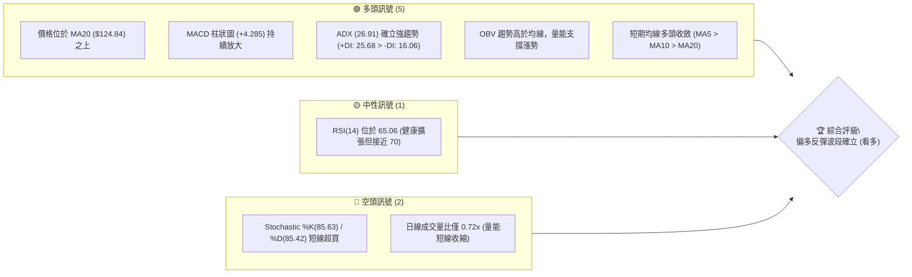

### 📊 核心指標速覽表

| 指標類別 | 指標名稱 | 當前數值 | 訊號 | 解讀 |
|----------|----------|----------|------|------|
| **價格** | 當前收盤價 | $143.34 | 🟢 | 站穩短期底部 $104.83，自低點反彈 +36.7% |
| **均線** | MA5 | $143.40 | 🟡 | 價格貼近 MA5，短線微幅整理 (-0.04%) |
| **均線** | MA10 | $134.53 | 🟢 | 價格在 MA10 之上 +6.55%，短線多頭排列 |
| **均線** | MA20 | $124.84 | 🟢 | 價格高於 MA20 +14.82%，中期生命線翻揚 |
| **均線** | MA50 / MA200 | 資料不足 | 🟡 | 數據中未偵測到，以中長期週線形態輔助 |
| **動能** | RSI(14) | 65.06 | 🟡 | 中性偏強 (30–70 區間內)，無頂背離 |
| **動能** | MACD (12,26,9) | +1.546 / -2.740 | 🟢 | MACD 線站上訊號線，柱狀圖 +4.285 強勢看多 |
| **動能** | Stoch %K / %D | 85.63 / 85.42 | 🔴 | 進入超買鈍化區，短線需防範回洗 |
| **趨勢** | ADX (14) / DMI | 26.91 (+DI: 25.68) | 🟢 | ADX > 25 進入強趨勢，多方主導 (+DI > -DI) |
| **通道** | 布林通道 %B | 0.84 (上軌 $152.29) | 🟢 | 位於中軌與上軌強勢區間，朝上軌推進 |
| **量能** | OBV 與日成交量 | 83.74M (量比 0.72x) | 🟢 | OBV > MA 資金回流，短日量縮屬強勢整理 |
| **波動** | ATR(14) | $10.80 (7.54%) | 🟡 | 每日波幅達 7.54%，屬高彈性成長股特性 |

### 🏆 技術評分卡

```
╔══════════════════════════════════════════════════════════════════╗
║                技術評分卡 — SPCX (2026-08-19)                   ║
╠══════════════════════════════════════════════════════════════════╣
║ 趨勢強度 (ADX/DMI)  ████████████████░░░░  80/100  🟢 強勢多頭   ║
║ 動能指標 (MACD/RSI) ██████████████░░░░░░  70/100  🟢 偏多擴張   ║
║ 支撐穩定度 (波段支撐)████████████████░░░░  80/100  🟢 底座扎實   ║
║ 成交量配合 (OBV/Volume)████████████░░░░░░░░  60/100  🟡 均量待補   ║
║ 形態完整度 (V型/雙底)██████████████░░░░░░  70/100  🟢 底部構築   ║
║ 均線排列 (MA5/10/20) ████████████████░░░░  80/100  🟢 多頭發散   ║
╠══════════════════════════════════════════════════════════════════╣
║ 綜合技術評分        ███████████████░░░░░  73/100  🟢 買進 (Buy) ║
╚══════════════════════════════════════════════════════════════════╝
```

---

## 2. 趨勢分析

### 🌐 多時框趨勢分析

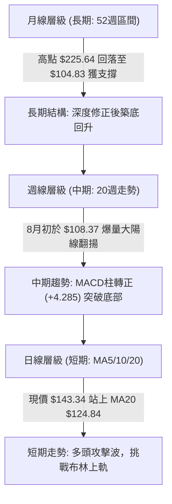

### 📈 長期趨勢 — 12個月走勢圖（Unicode）

```
SPCX 月線走勢示意圖（近 12 個月區間與歷史錨點）
價格 ($)
$225.64 ┤                           ● (52W 歷史最高點)
$197.13 ┤                         ╭─╯
$179.49 ┤                        ╭╯
$170.86 ┤  ● (2026-06 收盤)     │
$150.98 ┤   ╰╮                  │     ● $143.34 (現價 2026-08)
$130.68 ┤    ╰╮                ╭╯    ╭╯
$108.37 ┤     ╰╮              ╭╯  ●──╯ (2026-07 收盤 $108.37)
$104.83 ┤      ╰──────────────● (52W 歷史最低點 / S1 強支撐)
        └──────────────────────────────────────────────────────────
           2025-09  ...  2026-05  2026-06  2026-07  2026-08 (最新)
```

**走勢特徵分析表格**：

| 階段區間 | 價格區間 | 期間漲跌幅 | 成交量特徵 | 技術結構特徵 |
|----------|----------|------------|------------|--------------|
| **高檔回落期** | $225.64 → $170.86 | -24.28% | 逐步遞減 | 52週高點受阻回落，多頭籌碼獲利了結 |
| **恐慌探底期** | $170.86 → $104.83 | -38.65% | 縮量陰跌後爆量 | 跌破各級均線，於 $104.83 觸及 52週低點 |
| **V型強勢反彈** | $104.83 → $143.34 | +36.74% | 顯著放大 (單週破9億股) | 週線連三紅，MACD 翻紅，ADX 強勢啟動 |

### 📊 中期趨勢（週線分析）

```
SPCX 週線波段支撐阻力結構圖
$172.40 ───┬─────────────────────────────────── [R1 強阻力 / 近一年波段高點]
           │                                 ▲
$150.98 ───┼─────────────────── 斐波那契 61.8% ─── (短線壓力目標)
$143.34 ───┼─► [現價位置 $143.34]
$130.68 ───┼─────────────────── 斐波那契 78.6% ─── (回踩初級支撐)
$124.84 ───┼─────────────────── MA20 / 布林中軌 ─── (強烈動能防守線)
           │                                 ▼
$104.83 ───┴─────────────────────────────────── [S1 歷史低點強支撐]
```

### ⚡ 趨勢強度評估（ADX 解讀）

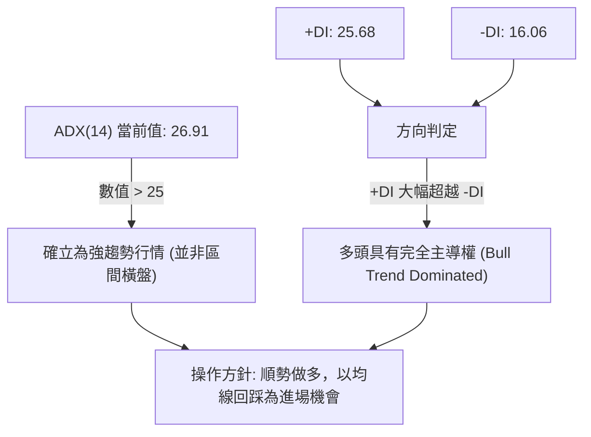

| 指標名稱 | 當前數值 | 臨界基準 | 狀態解讀 |
|----------|----------|----------|----------|
| **ADX (14)** | 26.91 | 25.00 | **進入強勢單邊趨勢**，趨勢動能充足 |
| **+DI (多方)** | 25.68 | 20.00 | 多方買盤主導，動能持續擴張 |
| **-DI (空方)** | 16.06 | 20.00 | 空方壓制力衰竭，處於被動防守 |

---

## 3. 圖表形態分析

### 🔍 形態識別系統

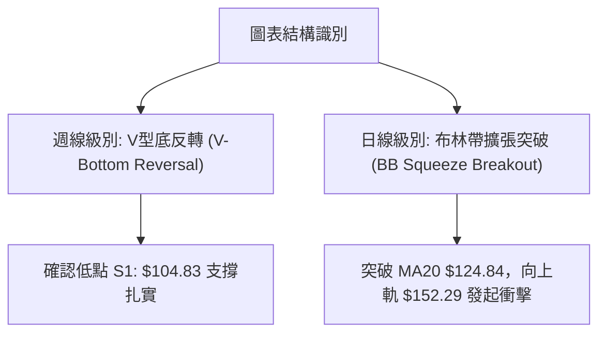

**形態信心度表格**（依規則 15）：

| 形態 | 信心度 | 判斷依據（引用數據） | 完成度 | 目標價（附計算式） |
|------|--------|----------------------|--------|--------------------|
| **V型反轉築底** | 80% | 2026-08-02 自 $108.37 急速拉升至 $143.34，週量爆發達 920.4M | 85% | 突破基底 $104.83，短線測量目標 = 頸線 R1 $172.40 |
| **均線黃金交角** | 75% | MA5 ($143.40) > MA10 ($134.53) > MA20 ($124.84) 短天期排列齊整 | 90% | 形態高度延伸 = 斐波那契 50.0% 回調位 $165.24 |
| **頭肩底 / 雙底** | 30% | 歷史數據僅 20 週，未出現次級次低點進行二次回踩 | 0% | 訊號不足，僅做指標型解讀，不預設立場 |

### 🕯️ 重要K線形態分析

| 週期 / 日期 | 收盤價 | K線組合形態 | 解讀 | 訊號 |
|-------------|--------|-------------|------|------|
| **2026-08-02** | $108.37 | 探底長下影十字星 (Hammer) | 觸及 52W 低點 $104.83 附近強勢收復，空頭力竭 | 🟢 強烈看多 |
| **2026-08-09** | $133.11 | 巨量長紅大陽線 (Marubozu) | 週成交量爆出 9.20 億股，一舉收復兩週跌幅，確立反轉 | 🟢 強烈看多 |
| **2026-08-16** | $140.00 | 連續多頭推進線 (Bullish Continuation)| 量能維持 6.63 億股高水準，站穩 $140 整數關卡 | 🟢 看多 |
| **2026-08-23** | $143.34 | 高檔微幅整理 (Spinning Top) | 價格暫時於 MA5 ($143.40) 震盪消化短線獲利盤 | 🟡 短線中性 |

### 📉 ASCII 走勢形態示意圖

```
SPCX 週線 V型反轉突破結構
$172.40 ┤                                                 [R1 頸線阻力]
$160.95 ┤  ● (06-14)
$150.98 ┤   \                                       ▲    [斐波那契 61.8%]
$143.34 ┤    \                                     / ●   [現價 $143.34]
$133.11 ┤     \                                   / /
$124.84 ┤      \                                 / /     [MA20 生命線]
$115.07 ┤       \                               / /
$108.37 ┤        \     ● (08-02 底部十字星)    / /
$104.83 ┤         \___/ ───────────────────────●        [S1 52W 底部]
        └────────────────────────────────────────────────────────
            06-14  06-28  07-12  07-26  08-02  08-09  08-23 (時間)
```

### 🎯 形態目標價計算

1. **V型反轉測量目標價**：
   - 底部支撐點：$104.83（52W Low）
   - 波段回升頸線目標：$172.40（R1 波段高點）
   - 形態垂直空間 = $172.40 - $104.83 = $67.57
   - 第一目標價（T1）取斐波那契 50.0% 關鍵位：**$165.24**
   - 第二目標價（T2）取波段阻力 R1：**$172.40**

---

## 4. 支撐與阻力

### 🗺️ 關鍵價位分布圖（Unicode）

```
SPCX 價位結構分布圖
═══════════════════════════════════════════════════════════════════
$225.64 ║██████████████████████████████║ 52週歷史高點 (0.0% 斐波那契)
$197.13 ║████████████████████          ║ 斐波那契 23.6% 回調阻力
$179.49 ║████████████████              ║ 斐波那契 38.2% 回調阻力
$172.40 ║██████████████████████████████║ 強阻力 R1 (近一年波段高點聚類)
$165.24 ║██████████████                ║ 斐波那契 50.0% 中樞平衡位
$152.29 ║██████████                    ║ 布林通道上軌壓力
$150.98 ║████████                      ║ 斐波那契 61.8% 強阻力位
$143.34 ╠══════════════════════════════╣ ◄ 當前收盤價 $143.34
$130.68 ║▓▓▓▓▓▓▓▓▓▓                    ║ 斐波那契 78.6% 回調初級支撐
$124.84 ║▓▓▓▓▓▓▓▓▓▓▓▓▓▓▓▓▓▓            ║ MA20 / 布林中軌動態支撐
$104.83 ║██████████████████████████████║ 強支撐 S1 (52週歷史最低點聚類)
$97.39  ║██████                        ║ 布林通道下軌極端支撐
═══════════════════════════════════════════════════════════════════
```

### 🚧 阻力位分析表

| 阻力級別 | 價位 | 形成原因 | 突破難度 | 重要性 |
|----------|------|----------|----------|--------|
| **動態阻力** | $152.29 | 布林通道日線上軌，短線超買擴張極限 | 中等 🟡 | ★★★☆☆ |
| **波段阻力 R1** | $172.40 | 近一年波段高點聚類，密集套牢區 | 極高 🔴 | ★★★★★ |
| **歷史高點** | $225.64 | 52週歷史高點 (0.0% 回調位) | 極高 🔴 | ★★★★☆ |

### 🛡️ 支撐位分析表

| 支撐級別 | 價位 | 形成原因 | 守住機率 | 重要性 |
|----------|------|----------|----------|--------|
| **初級支撐** | $130.68 | 斐波那契 78.6% 回調位，短期回踩平台 | 75% 🟢 | ★★★☆☆ |
| **生命線支撐** | $124.84 | 20日均線 (MA20) 與布林通道中軌共振 | 85% 🟢 | ★★★★★ |
| **強支撐 S1** | $104.83 | 近一年波段低點聚類 (52W Low)，底部基石 | 95% 🟢 | ★★★★★ |

### 📐 斐波那契回調位分析

> **計算基準**：52週波段區間 $104.83（低點）→ $225.64（高點），總波幅 $120.81

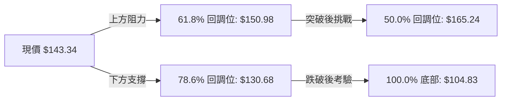

- **位置解讀**：現價 **$143.34** 目前運行於 **78.6% ($130.68)** 與 **61.8% ($150.98)** 之間。
- **技術意義**：SPCX 自 100.0%（$104.83）底部強勢反彈，已有效收復 78.6% 關卡，目前正蓄勢挑戰 61.8% 黃金分割強阻力位（$150.98）。一旦實體日K突破 $150.98 並站穩布林上軌 $152.29，波段反彈空間將全面打開，直指 50.0% 平衡中樞 $165.24 及 R1 $172.40。

---

## 5. 技術指標深度解讀

### 🎛️ 指標訊號總覽

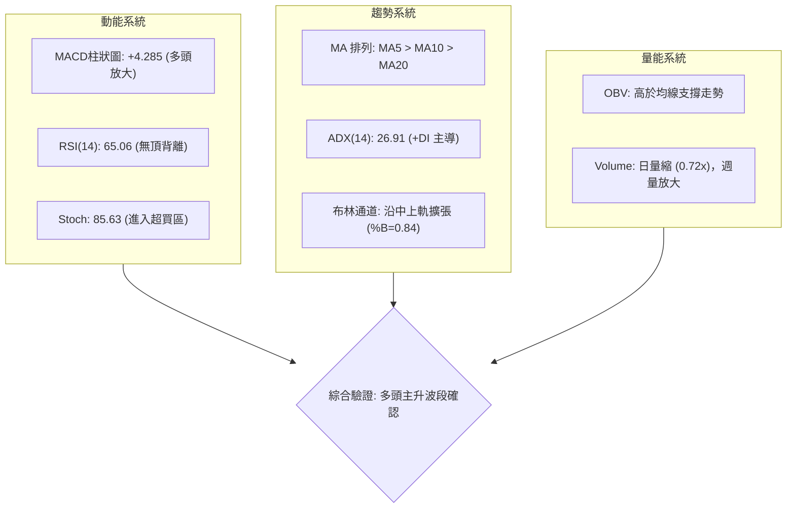

### 📈 移動平均線排列分析

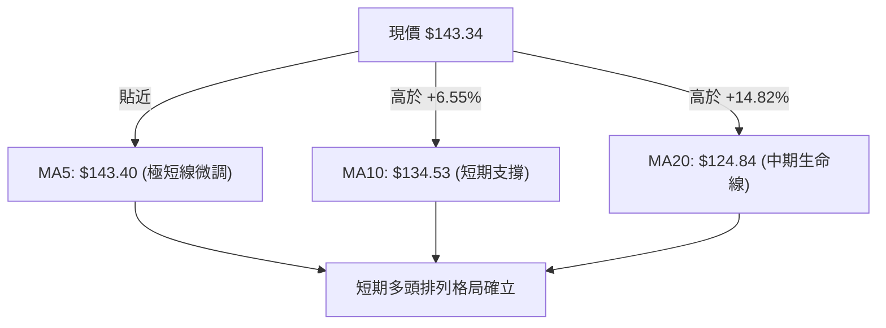

- **均線排列狀態**：短天期均線呈現標準的多頭排列（MA5 $143.40 ≈ 現價 > MA10 $134.53 > MA20 $124.84）。
- **數據完整性說明**：數據中 MA50、MA60、MA120、MA200 暫無數值（資料不足），但從短期三條均線角度來看，多頭發散斜率維持向上，且 MA20 提供強勁的下檔支撐。

### 📉 RSI(14) 分析

```
RSI(14) 當前數值進度條
超賣 (0-30)                中性區間 (30-70)               超買 (70-100)
├──────────────┼─────────────────────────────────┼──────────────┤
░░░░░░░░░░░░░░░█████████████████████████████████░░░░░░░░░░░░░░░
0             30                             65.06 70          100
```

- **數值解讀**：RSI(14) 目前為 **65.06**，處於強勢中性多頭區間，尚未進入 >70 的過熱超買區。
- **背離分析**：
  - 2026-07-26 最低價 RSI 觸底 15.9，隨後於 2026-08-02 在 $108.37 出現 RSI 19.2 回升，構成標準的「**日/週線級別底背離**」，成功引發大級別反彈。
  - 當前價格自 $108.37 漲至 $143.34，RSI 同步自 19.2 飆升至 65.06，**無頂背離現象**，量價與指標維持健康同步擴張。

### 📊 MACD(12/26/9) 訊號解讀

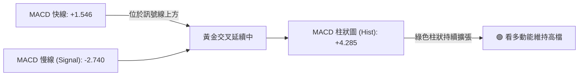

- **快慢線位置**：MACD 快線（+1.546）已正式衝破 0 軸，慢線（-2.740）加速向上收斂，整體動能自 8 月初以來連續 3 週維持正向擴張（Histogram 由 -0.988 → +2.330 → +4.591 → +4.285），顯示多方買盤力道強大且連續。

### 📦 布林通道分析

```
SPCX 日線布林通道示意圖
$152.29 ─────────────────────────────── 上軌 (強阻力壓制區)
                  ▲
$143.34 ───────── ● ────────────────── 現價 (%B = 0.84，強勢通道)
                  │
$124.84 ─────────────────────────────── 中軌 / MA20 (多頭生命線支撐)
                  │
$97.39  ─────────────────────────────── 下軌 (極端超賣保護區)
```

- **帶寬與位置**：通道中軌為 $124.84，上軌為 $152.29，下軌為 $97.39。現價 $143.34 處於 **%B = 0.84** 的高位強勢區間。
- **通道形態解讀**：布林帶呈現由收窄轉向向上開口擴張的特徵，價格緊貼上軌運行，屬於典型的主升攻擊走勢，下方中軌 $124.84 為波段最重要的動態多頭防守點。

### 💹 成交量分析（量價配合度）

- **量價配合評估**：
  - **週線維度**：8 月第一週反彈伴隨 920.45M 歷史天量，次週維持 663.08M，呈現「**價漲量增**」的健康主力建倉格局。
  - **日線維度**：最新成交量 83.75M，相較 20 日均量 116.19M 量比為 0.72x。在連續拉升後出現短線縮量，屬於「突破後的縮量強勢整理」，並未出現爆量滯漲或量價頂背離。
  - **OBV 趨勢**：OBV > MA，能量潮指標持續向上發散，顯示資金呈現淨流入狀態，有效支撐當前價格。

---

## 6. 動能與波動率

### ⚡ 動能評估四象限

| 象限 | 動能強度 (Momentum) | 波動率 (Volatility) | 當前狀態 | 評估與操作導引 |
|------|---------------------|---------------------|----------|----------------|
| **Q1 (最佳機會)** | **強動能 (MACD+/ADX>25)** | **低波動 (收斂整理)** | — | 突破前的最佳低吸買點 |
| **Q2 (謹慎觀望)** | 弱動能 (MACD-) | 低波動 (橫盤洗盤) | — | 資金利用效率低，宜觀望 |
| **Q3 (強勢進攻)** | **強動能 (MACD+/ADX 26.9)**| **高波動 (ATR 7.54%)** | **✓ SPCX 當前落點** | **強者恆強，回踩支撐順勢做多** |
| **Q4 (極度危險)** | 弱動能 (MACD-) | 高波動 (急跌恐慌) | — | 破位下殺，嚴禁盲目抄底 |

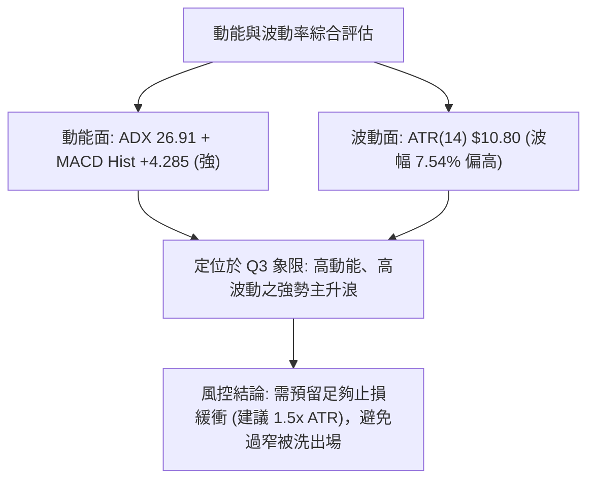

### 📊 ATR 波動率分析

- **ATR(14) 數值**：**$10.80**（佔現價比例高達 **7.54%**）。
- **止損距離建議**：
  - **短線交易（1.0x ATR）**：緩衝區間 $10.80，止損價設於現價下 $143.34 - $10.80 = **$132.54**。
  - **波段交易（1.5x ATR）**：緩衝區間 $16.20，止損價設於現價下 $143.34 - $16.20 = **$127.14**（剛好保護於 MA20 $124.84 關鍵生命線之上）。

### 📐 Beta 與市場相關性

- **Beta 數值**：數據中未提供具體 Beta（N/A）。
- **市場特徵推算**：由其 7.54% 的高 ATR 波動度、91.9% 的營收高成長率，以及太空/AI 高科技產業屬性，SPCX 展現出顯著的「高 Beta 高成長股」特徵，對市場風險偏好極為敏感。

---

## 7. 多時框架總結

### 📋 時框架評分表

| 時框架 | 趨勢方向 | 動能狀態 | 均線排列 | 圖表形態 | 綜合評分 | 操作建議 |
|--------|----------|----------|----------|----------|----------|----------|
| **短期 (日線)** | 🟢 多頭向上 | 🟢 MACD柱擴張 | 🟢 MA5>10>20 | 沿布林上軌推進 | 78/100 | 逢回踩均線分批布局 |
| **中期 (週線)** | 🟢 底部反轉 | 🟢 週MACD翻正 | 🟢 連三週長紅 | V型反轉突破確立 | 80/100 | 波段持有，目標看至 R1 |
| **長期 (月線)** | 🟡 深度修復 | 🟡 脫離超賣區 | 🟡 歷史區間31.9% | $104.83 構築雙重底 | 62/100 | 長線築底完成，逐步加碼 |

### 🔲 綜合訊號矩陣

```
╔══════════════════════════════════════════════════════════════════╗
║                    SPCX 多時框架訊號矩陣                         ║
╠═════════════════╦════════════════╦═══════════════╦═══════════════╣
║ 分析維度        ║ 短期 (日線)    ║ 中期 (週線)   ║ 長期 (月線)   ║
╠═════════════════╬════════════════╬═══════════════╬═══════════════╣
║ 趨勢方向        ║ 🟢 強勢多頭    ║ 🟢 突破反轉   ║ 🟡 築底反彈   ║
║ 動能指標        ║ 🟢 MACD擴張    ║ 🟢 柱狀連三紅 ║ 🟡 RSI由低回升║
║ 均線系統        ║ 🟢 短天期多頭  ║ 🟢 站穩MA20   ║ 🟡 數據不足   ║
║ 量價配合        ║ 🟡 短線縮量    ║ 🟢 底部爆巨量 ║ 🟢 籌碼換手充分║
║ 關鍵位置        ║ 接近布林上軌   ║ 突破78.6%回調 ║ 遠離歷史低點  ║
╚═════════════════╩════════════════╩═══════════════╩═══════════════╝
```

### ⚖️ 多時框收斂結論

- **收斂規則執行（依嚴格要求 14）**：
  - 當前 ADX(14) 數值為 **26.91 (>25)**，明確定義當前盤面處於「**強趨勢行情**」。
  - 依照規則優先級：以中長期（週線波段方向及 MA20）為主導，日線層級僅作為精準進場之濾網。
  - **唯一方向性結論**：**偏多（Bullish）**。日線雖出現 Stoch 超買與縮量，但週線底背離與爆量長紅確立了中期反轉趨勢，短線任何震盪拉回均視為順勢做多的良好機會。

---

## 8. 交易策略建議

### 🗺️ 策略決策流程圖

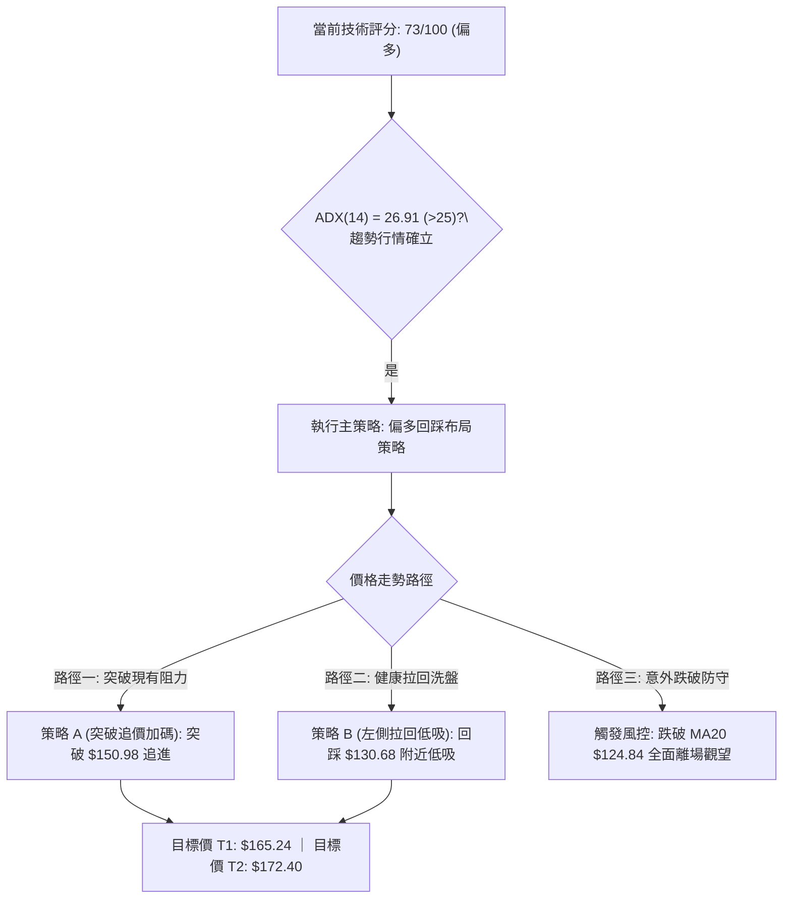

### 🧭 策略路由

> **當前主策略方向 = 多頭策略（依綜合評分 73/100 偏多，評分 ≥ 60）**

本報告依規定全面主推多頭交易策略（策略 A 與策略 B），空頭方向僅列為風控停損與反轉防守警戒線，嚴禁兩頭下注。

### 🎯 價格情境階梯（Price Scenarios）

| 觸發條件 | 第一目標 | 第二目標 | 情境含義與技術解讀 |
|----------|----------|----------|--------------------|
| **有效突破 $150.98 (61.8%)** | $165.24 (50.0%) | $172.40 (R1) | **主升浪延續**：突破斐波那契強阻力，開啟挑戰近一年高點行情 |
| **震盪站穩 $143.34 區間** | $150.98 | $152.29 (BB上軌) | **高檔蓄勢**：消化短線超買指標，沿著布林通道上軌震盪推升 |
| **回踩跌破 $130.68 (78.6%)** | $124.84 (MA20) | $104.83 (S1) | **深度回洗**：短線多頭暫歇，考驗 20 日生命線支撐穩定度 |

### 📊 情境機率分佈

```
情境機率分佈圖
繼續上行挑戰高點 ▓▓▓▓▓▓▓▓▓▓▓▓▓▓▓▓▓▓▓▓▓▓▓▓▓▓ 65%
區間強勢震盪整理 ▓▓▓▓▓▓▓▓▓▓                25%
跌破支撐再次探底 ▓▓▓▓                        10%
```

| 情境劇本 | 機率 | 主要判斷依據（引用指標狀態） |
|----------|------|------------------------------|
| **繼續上行 / 反彈** | **65%** | ADX 26.91 強趨勢、MACD 柱狀圖 +4.285 放大、週線底背離爆量確認 |
| **區間強勢震盪** | **25%** | Stoch %K(85.63) 短線超買，日線成交量比 0.72x 需時間換取空間補量 |
| **回落再探底** | **10%** | 除非遭遇黑天鵝摜破 MA20 ($124.84) 與 S1 ($104.83) 雙重重裝支撐 |

### 🟢 主策略詳情

本策略所有價位均嚴格引用第 4 章「關鍵價位」與斐波那契計算數值：

| 策略要素 | 策略 A（動能突破追價） | 策略 B（回踩支撐低吸 - 最優推薦） |
|----------|------------------------|-----------------------------------|
| **進場條件** | 日K實體收盤突破 61.8% 回調位 | 價格回踩 78.6% 斐波那契或 MA10 獲支撐 |
| **進場價格** | **$150.98** | **$130.68** |
| **第一目標 (T1)** | **$165.24**（50.0% 回調位） | **$150.98**（61.8% 回調位） |
| **第二目標 (T2)** | **$172.40**（R1 波段高點） | **$165.24**（50.0% 回調位） |
| **止損價格** | **$143.34**（現價/原阻力轉支撐） | **$124.84**（MA20 / 布林中軌） |
| **風險報酬比** | **1 : 2.80**（以 T2 計算） | **$130.68-$124.84=$5.84 風險，獲利 $34.56 → 1 : 5.92** |
| **預估勝率** | 60% | 75% |
| **建議倉位** | 10%–15% | 15%–20% |

### 🔴 反向風險觸發點（對沖提示）

- **多頭結構破壞點**：若日線收盤價跌破 **$124.84 (MA20 / 布林中軌)**，代表本輪自 $104.83 發動的短波段反彈宣告終結。
- **風控對沖操作**：此時應立即將多頭部位無條件停損出場或減倉 80%，並暫停所有做多操作；唯有再次站穩 $130.68 或跌至 $104.83 出現長下影線時方可重新評估。

### ⭐ 整體訊號強度評星

```
做多訊號強度：★★★★☆  (4/5星 - 均線、動能、週線結構全面偏多)
做空訊號強度：★☆☆☆☆  (1/5星 - 逆勢操作，僅短線超買回洗風險)
整體可信度：  ★★★★☆  (4/5星 - 指標共振強烈，趨勢方向明確)
```

---

## 9. 風險提示與監控

### ✅ 關鍵監控指標 Checklist

```
╔══════════════════════════════════════════════════════════════════╗
║                   SPCX 日常交易監控 Checklist                    ║
╠══════════════════════════════════════════════════════════════════╣
║ [ ] 監控 MA20 動態防守線：收盤價是否每日維持在 $124.84 之上     ║
║ [ ] 監控 MACD 柱狀圖：柱體是否出現連續兩日縮小 (警惕短線反轉)   ║
║ [ ] 監控 RSI(14) 狀態：若衝破 75 需提防短線劇烈獲利回吐震盪     ║
║ [ ] 監控成交量變化：挑戰 $150.98 時單日量能是否回升至 116M 以上 ║
║ [ ] 監控布林帶寬：%B 是否跌破 0.50 (布林中軌 $124.84)            ║
╚══════════════════════════════════════════════════════════════════╝
```

### ⚠️ 風險場景分析

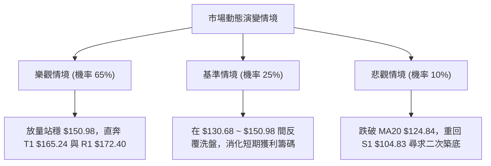

### 🛡️ 風險管理重要提醒

1. **高波動率防禦**：SPCX 的 ATR 高達 **$10.80 (7.54%)**，單日震盪幅度劇烈。嚴禁使用過高槓桿，單筆交易的最大虧損風險金額應嚴格控制在總資金的 **1.0% - 1.5%** 以內。
2. **籌碼與基本面風險**：機構持股比例約 39.3%，內部人持股 19.0%，流通股具備較高集中度；同時 Forward P/E 高達 86.4，高估值特性使得股價在面對大盤修正時容易放大波動。
3. **紀律執行**：嚴格依據本報告設定之關鍵價位進行分批進出場，切忌在布林通道上軌（$152.29）附近情緒化追高。

---

## 📋 報告總結

```
╔══════════════════════════════════════════════════════════════════╗
║                    SPCX 技術分析報告總結                         ║
╠══════════════════════════════════════════════════════════════════╣
║ 報告日期：2026-08-19                                             ║
║ 當前價格：$143.34                                                ║
║ 分析評級：🟢 買進 / 偏多波段 (Buy - Bullish Reversal)           ║
╠══════════════════════════════════════════════════════════════════╣
║ 關鍵結論：                                                       ║
║ ├─ 長期趨勢：🟡 52W 低點 $104.83 獲強力支撐，長期底部初步確立    ║
║ ├─ 中期趨勢：🟢 週線連三紅，MACD 柱狀翻正 (+4.285)，反彈動能充沛 ║
║ ├─ 短期趨勢：🟢 均線呈多頭排列，ADX 26.91 確立多方強趨勢主導     ║
║ ├─ 關鍵支撐：初級支撐 $130.68 ｜ 核心生命線 $124.84 (MA20)       ║
║ ├─ 關鍵阻力：近期阻力 $150.98 ｜ 波段強阻力 $172.40 (R1)         ║
║ └─ 分析師目標：華爾街平均目標價 $222.73 (最高 $450.00)          ║
╠══════════════════════════════════════════════════════════════════╣
║ 最優策略組合：                                                   ║
║ 1. 🥇 最佳機會（策略 B）：回踩 $130.68 布局，止損 $124.84，      ║
║                          目標 $150.98 / $165.24 (風酬比 1:5.92)  ║
║ 2. 🥈 次選機會（策略 A）：突破 $150.98 順勢追多，目標 $172.40    ║
║ 3. 🥉 防守底線：若意外跌破 $124.84，多頭全數止損觀望             ║
╚══════════════════════════════════════════════════════════════════╝
```

---

> ⚠️ **免責聲明**：本報告為 AI 自動生成之技術分析，所有數據及估算均基於提供的歷史價格資訊。本報告**僅供研究與學術參考**，**不構成任何投資建議**。投資有風險，入市需謹慎。

---

*報告生成時間：2026-08-19 ｜ 數據來源：Yahoo Finance ｜ 分析框架：多時框技術分析*