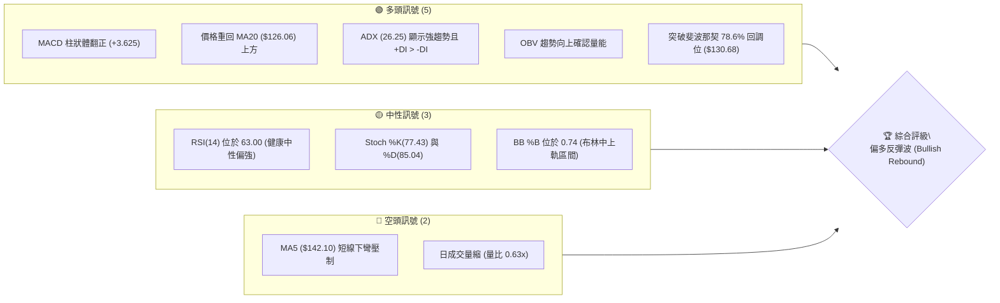
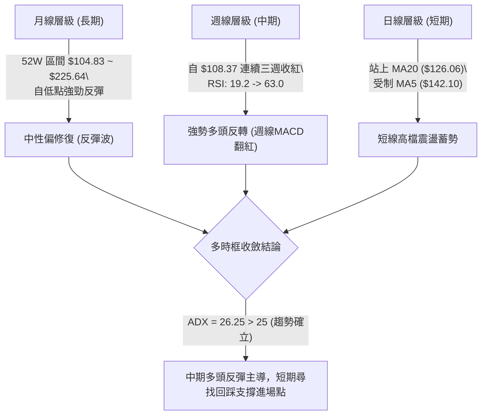
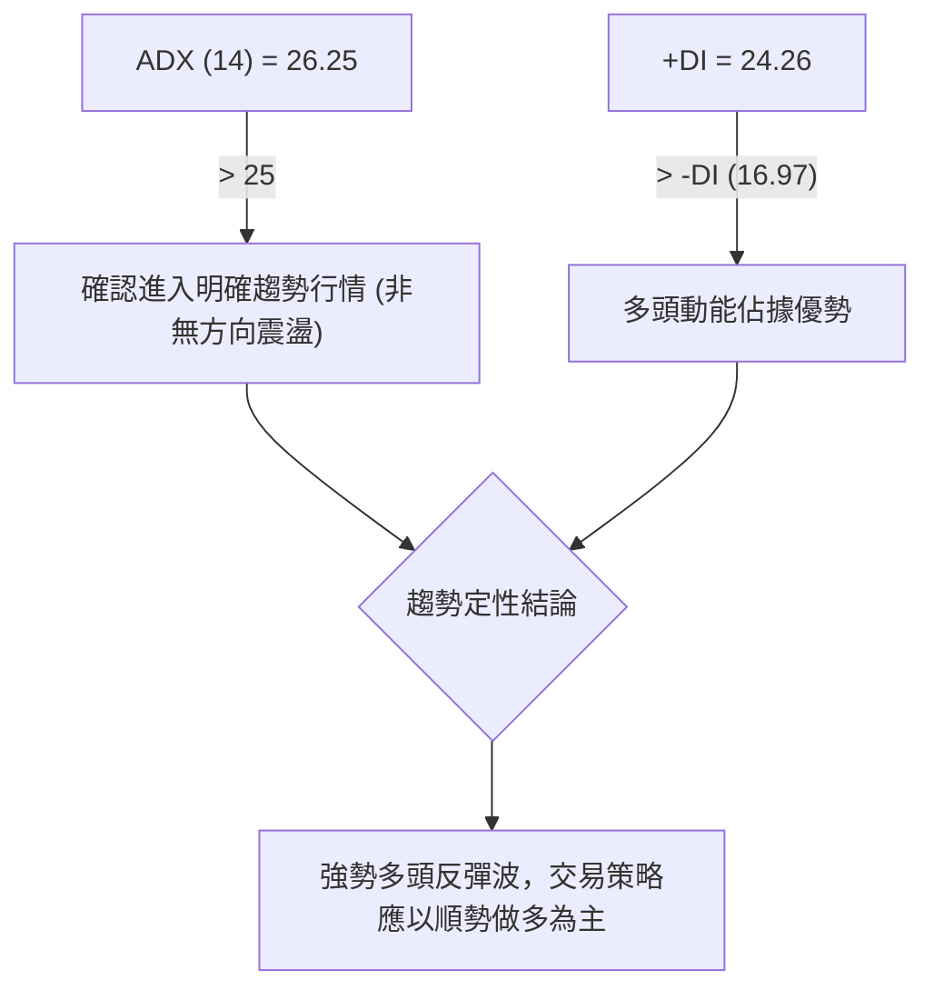
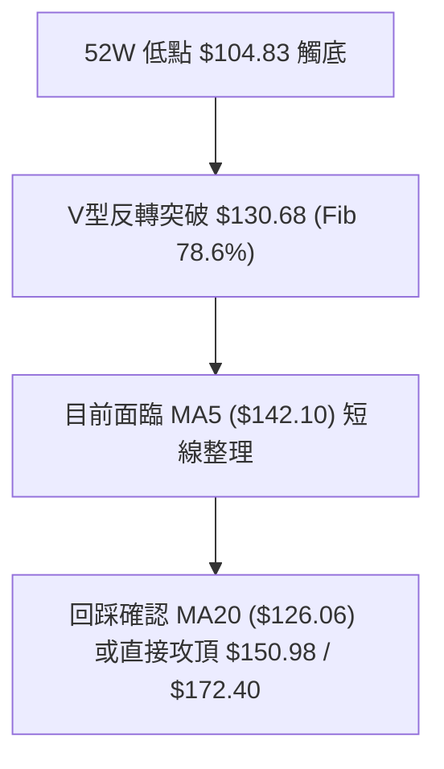
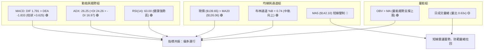
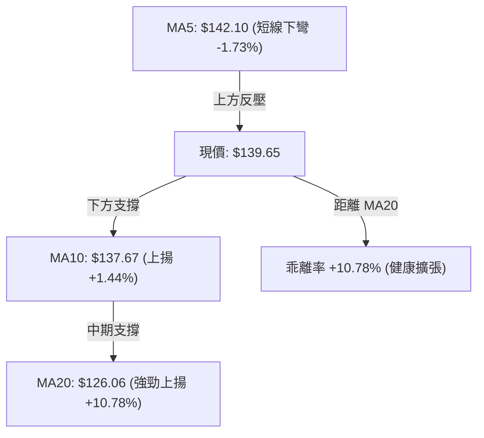
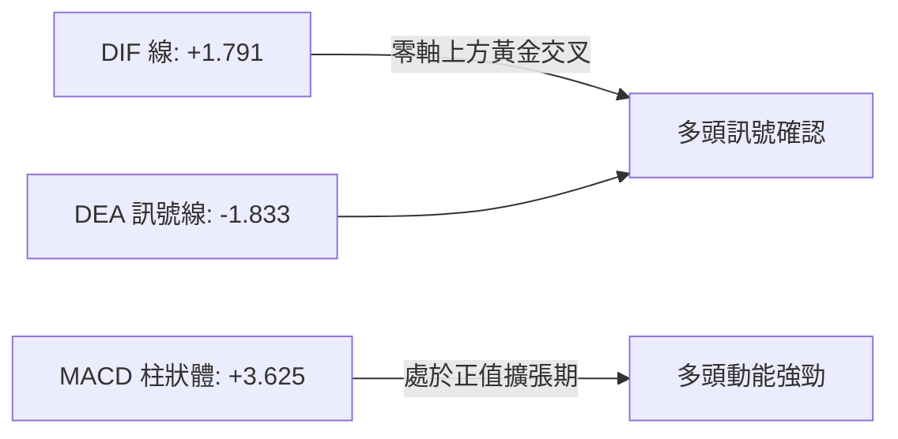
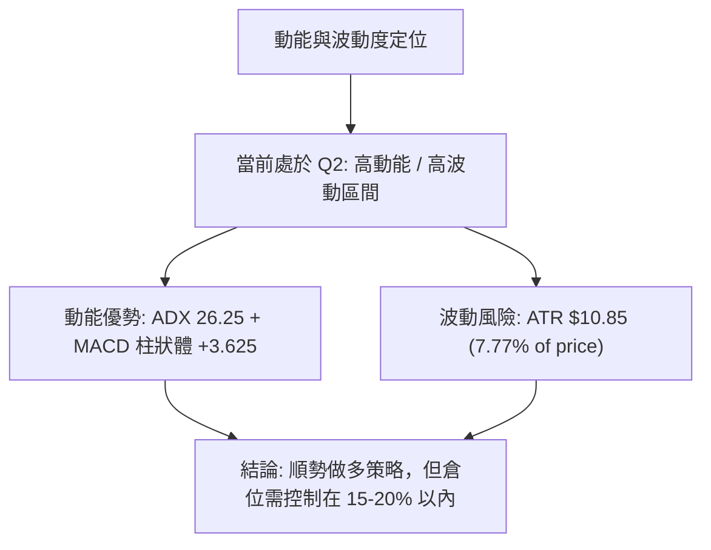
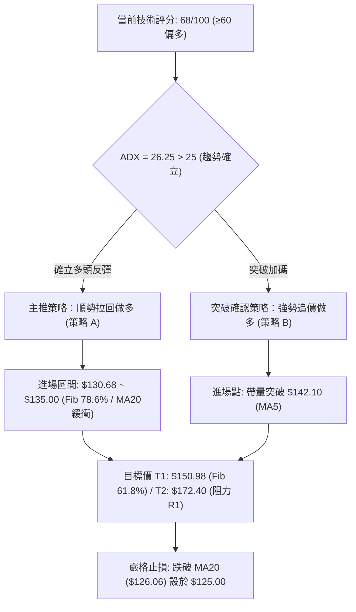
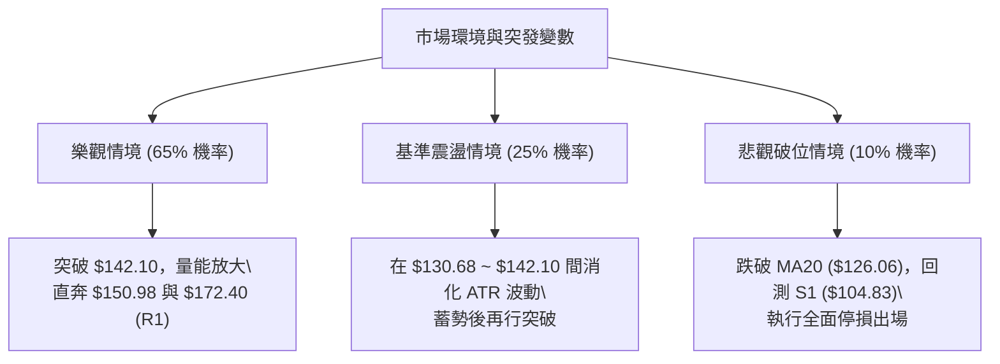

# SPCX 技術分析報告

> **報告日期**：2026-08-20 ｜ **語言**：繁體中文 ｜ **數據來源**：Yahoo Finance ｜ **當前價格**：$139.65

---

## 目錄

| 章節 | 內容 |
|------|------|
| [1. 技術面概覽](#1-技術面概覽) | 訊號儀表板、核心指標、評分卡 |
| [2. 趨勢分析](#2-趨勢分析) | 多時框趨勢、長中短期走勢、ADX解讀 |
| [3. 圖表形態分析](#3-圖表形態分析) | 形態識別、K線組合、目標價計算 |
| [4. 支撐與阻力](#4-支撐與阻力) | 關鍵價位、斐波那契回調結構 |
| [5. 技術指標深度解讀](#5-技術指標深度解讀) | MA/RSI/MACD/布林/成交量 |
| [6. 動能與波動率](#6-動能與波動率) | 動能四象限、ATR、波動特徵 |
| [7. 多時框架總結](#7-多時框架總結) | 時框架評分矩陣、收斂結論 |
| [8. 交易策略建議](#8-交易策略建議) | 多空策略、價格情境、風險報酬比 |
| [9. 風險提示與監控](#9-風險提示與監控) | 監控指標、風險場景、總結 |

---

## 1. 技術面概覽

### 🎯 技術訊號儀表板



### 📊 核心指標速覽表

| 指標類別 | 指標名稱 | 當前數值 | 訊號 | 解讀 |
|----------|----------|----------|:----:|------|
| **價格** | 當前價格 | $139.65 | 🟢 | 自 52 週低點 $104.83 明顯反彈 +33.21%，短線偏多 |
| **均線** | MA20 | $126.06 | 🟢 | 現價高於 MA20 達 +10.78%，短期趨勢由空翻多 |
| **均線** | MA50 | 數據不足 | 🟡 | 新上市/數據不足，依據週線級別進行中期判定 |
| **均線** | MA200 | 數據不足 | 🟡 | 歷史數據不足，長期趨勢由 52 週高低區間定位 |
| **動能** | RSI(14) | 63.00 | 🟢 | 處於 50–70 強勢擴張區間，無頂背離跡象 |
| **動能** | MACD (12,26,9) | DIF: 1.791 / Hist: +3.625 | 🟢 | 黃金交叉發散中，柱狀圖持續擴張，多頭主導 |
| **趨勢** | ADX (14) | 26.25 (+DI: 24.26, -DI: 16.97) | 🟢 | ADX > 25 且 +DI 主導，確認反彈為有效趨勢行情 |
| **波動** | ATR(14) | $10.85 (佔比 7.77%) | 🔴 | 波動度高，操作需擴大止損緩衝距離 |
| **通道** | 布林通道 (%B) | %B: 0.74 (上軌 $153.88 / 中軌 $126.06) | 🟢 | 運行於中軌與上軌之間的多頭通道 |
| **量能** | OBV / 量比 | OBV > MA / 量比 0.63x | 🟡 | OBV 支撐多頭，但最新日成交量低於 20 日均量 |

### 🏆 技術評分卡

```
╔══════════════════════════════════════════════════════════════╗
║              技術評分卡 — SPCX (2026-08-20)                  ║
╠══════════════════════════════════════════════════════════════╣
║ 趨勢強度 (ADX/DI)   ██████████████░░░░░░  70/100  🟢 偏多   ║
║ 動能指標 (RSI/MACD) ████████████████░░░░  78/100  🟢 強勢   ║
║ 支撐穩定度 (S1/Fib) ██████████████░░░░░░  72/100  🟢 穩固   ║
║ 成交量配合 (OBV/Vol)████████████░░░░░░░░  60/100  🟡 中性   ║
║ 形態完整度 (V底反轉)██████████████░░░░░░  68/100  🟢 築底   ║
║ 均線排列 (MA5/10/20)████████████░░░░░░░░  62/100  🟡 混合   ║
╠══════════════════════════════════════════════════════════════╣
║ 綜合技術評分        ██████████████░░░░░░  68/100  🟢 偏多格局║
╚══════════════════════════════════════════════════════════════╝
```

---

## 2. 趨勢分析

### 🌐 多時框趨勢分析



### 📈 長期趨勢 — 走勢特徵分析

```
SPCX 歷史價格走勢與關鍵轉折圖
價格軸 ($)
$225.64 ┤                           ● 52W High ($225.64)
$197.13 ┤
$179.49 ┤            ● 2026-06 ($170.86) / R1 ($172.40)
$165.24 ┤        ●
$150.98 ┤                               ● BB上軌 ($153.88)
$139.65 ┤━━━━━━━━━━━━━━━━━━━━━━━━━━━━━━━● 現價 ($139.65)
$126.06 ┤                               ▲ MA20 / BB中軌 ($126.06)
$104.83 ┤                 ● 2026-07 ($108.37) / 52W Low ($104.83)
        └─────────────────────────────────────────────────────────────
         2026-05   2026-06     2026-07     2026-08 (即時)
```

#### 走勢特徵分析表格

| 階段區間 | 起始/結束價位 | 漲跌幅 | 走勢特徵與量能現象 |
|----------|---------------|:------:|--------------------|
| **高檔回落段** (2026-06) | $170.86 → $108.37 | -36.57% | 巨量下殺，週成交量連續數週維持在 3~5 億股，殺出流動性低點 |
| **築底超賣段** (2026-07底~08初) | $108.37 → $104.83 | 觸底 | 週 RSI 降至極度超賣區 (15.9~19.2)，打出 52 週絕對低點 $104.83 |
| **強勁反彈段** (2026-08) | $108.37 → $139.65 | +28.86% | 爆量長紅（8/9 當週成交量達 9.2 億股），MACD 柱狀體翻正 (+3.625) |

### 📊 中期趨勢（週線分析）

中期走勢呈現「V型強勢反轉」結構。自 2026-08-02 的 $108.37 起，連續三週收長陽線，週 RSI 從 19.2 急升至 63.0，週 MACD 柱狀體由負翻正至 +3.625，確認中期空頭趨勢已被多頭破壞，目前正在向斐波那契 61.8%（$150.98）與阻力位 R1（$172.40）推進。

```
中期支撐阻力結構：
阻力 R1 : $172.40  ─────────────────────────────────── 阻力聚類區
Fib 61.8%: $150.98  - - - - - - - - - - - - - - - - - -  布林上軌附近 ($153.88)
現價     : $139.65  ▲ [當前位置]
Fib 78.6%: $130.68  - - - - - - - - - - - - - - - - - -  已突破轉化為支撐
支撐 MA20: $126.06  ─────────────────────────────────── 中期生命線 / BB中軌
支撐 S1  : $104.83  ═══════════════════════════════════ 52W 低點強支撐
```

### ⚡ 趨勢強度評估（ADX 解讀）



| 指標變數 | 當前數值 | 門檻判定 | 趨勢解讀 |
|----------|:--------:|:--------:|----------|
| **ADX (14)** | **26.25** | > 25.0 | 脫離低動能盤整區，趨勢強度顯著增強 |
| **+DI** | **24.26** | > -DI | 多方主導買盤，上升動能充足 |
| **-DI** | **16.97** | 處於低位 | 空方拋壓大幅衰減 |

---

## 3. 圖表形態分析

### 🔍 形態識別系統



| 形態類型 | 信心度 | 判斷依據（引用數據） | 完成度 | 目標價（附精確計算式） |
|----------|:------:|----------------------|:------:|------------------------|
| **V型底反轉 (V-Bottom)** | **75%** | 8/2 週低點 $108.37 配合 52W 低點 $104.83 爆出 9.20 億股巨量拉升，週 MACD 翻正 | 85% | 突破頸線 Fib 78.6% ($130.68)，形態高度 = $130.68 - $104.83 = $25.85。<br>**目標價 T1** = $130.68 + $25.85 = **$156.53** (對應布林上軌 $153.88) |
| **布林通道帶狀向上突破** | **70%** | %B 達 0.74，價格突破中軌 $126.06 沿上軌擴張 | 75% | **目標價 T2** = 直接對應阻力位 **R1 ($172.40)** |
| **頭肩底形態** | 35% | 數據不足，右肩結構尚未形成 | 30% | *訊號不足，僅做指標型與V底反轉解讀* |

### 🕯️ 重要K線形態分析

| 週/月區間 | 關鍵收盤價 | K線形態特徵 | 技術解讀 | 多空訊號 |
|-----------|:----------:|-------------|----------|:--------:|
| **2026-07-26** | $115.07 | 長黑下殺破底 | RSI 跌至 15.9 極端超賣區，空頭動能竭盡 | 🔴 空頭力竭 |
| **2026-08-02** | $108.37 | 築底十字/紡錘星 | 於 52W 低點 $104.83 前止跌，賣壓大幅收斂 | 🟡 變盤訊號 |
| **2026-08-09** | $133.11 | 巨量大陽線 (+22.8%) | 成交量激增至 9.20 億股，突破前週高點，吞噬反轉 | 🟢 強力看多 |
| **2026-08-16** | $140.00 | 中陽線突破延伸 | 站穩 $139.00 之上，MACD 柱狀體擴大至 +4.591 | 🟢 多頭延續 |
| **2026-08-23** | $139.65 | 高檔微幅十字星 | 遇 MA5 ($142.10) 短線整理，量能收縮 (2.73億股) | 🟡 高檔蓄勢 |

### 📉 ASCII 走勢形態示意圖

```
SPCX V型反轉與短期突破形態
價位
$172.40 ┼ - - - - - - - - - - - - - - - - - - - - - - - - - [中期目標 R1]
        │
$153.88 ┼ - - - - - - - - - - - - - - - - - - - - - [BB上軌 / 目標 T1: $156.53]
        │                                         ╭──
$139.65 ┼─────────────────────────────────────────● 現價 ($139.65)
        │                                  ╭─────╯
$130.68 ┼ - - - - - - - - - - - - - - ╭────╯  [V底頸線 / Fib 78.6%]
        │                      ╭──────╯
$126.06 ┼──────────────────────● MA20 / BB中軌 (回踩強支撐)
        │               ╭──────╯
$108.37 ┼───────────────● (8/2 低點)
        │        ╭──────╯
$104.83 ┴────────● 52W 絕對低點 S1 (2026-08 築底完成)
```

---

## 4. 支撐與阻力

### 🗺️ 關鍵價位分布圖（Unicode）

```
╔════════════════════════════════════════════════════════════════════════╗
║                   SPCX 關鍵價位與斐波那契結構分布圖                    ║
╠════════════════════════════════════════════════════════════════════════╣
║ $225.64 ║██████████████████████████████║ 52W High / Fib 0.0%          ║
║ $197.13 ║██████████████████████        ║ Fib 23.6% 回調位             ║
║ $179.49 ║████████████████████████      ║ Fib 38.2% 回調位             ║
║ $172.40 ║██████████████████████████████║ 關鍵阻力 R1 (波段高點聚類)   ║
║ $165.24 ║████████████████████          ║ Fib 50.0% 關鍵平衡位         ║
║ $153.88 ║██████████████████            ║ 布林通道上軌                 ║
║ $150.98 ║████████████████████          ║ Fib 61.8% 黃金分割阻力       ║
║ $139.65 ╠══════════════════════════════╣ ◄ 現價 ($139.65)             ║
║ $130.68 ║▓▓▓▓▓▓▓▓▓▓▓▓▓▓▓▓▓▓▓▓          ║ Fib 78.6% 轉換支撐位         ║
║ $126.06 ║▓▓▓▓▓▓▓▓▓▓▓▓▓▓▓▓▓▓▓▓▓▓▓▓      ║ 動態支撐 (MA20 / 布林中軌)   ║
║ $104.83 ║██████████████████████████████║ 關鍵支撐 S1 / 52W Low        ║
║ $98.24  ║░░░░░░░░░░░░░░░░░░░░░░░░░░░░░░║ 布林通道下軌                 ║
╚════════════════════════════════════════════════════════════════════════╝
```

### 🚧 阻力位分析表

| 阻力級別 | 精確價位 | 形成原因與技術背景 | 突破難度 | 重要性 |
|----------|:--------:|--------------------|:--------:|:------:|
| **短線阻力** | **$150.98** | 斐波那契 61.8% 黃金分割回調位，鄰近布林上軌 ($153.88) | 中等 (需補量突破) | ★★★☆☆ |
| **關鍵阻力 R1** | **$172.40** | 近一年波段高點聚類，前波起跌平台（2026-06 高點 $170.86 密集成交區） | 高 (套牢籌碼密集) | ★★★★★ |
| **中期阻力** | **$179.49** | 斐波那契 38.2% 回調位，若突破 R1 則直指此區 | 極高 | ★★★★☆ |
| **歷史阻力** | **$225.64** | 52 週最高價 (Fib 0.0%) | 極高 | ★★★★★ |

### 🛡️ 支撐位分析表

| 支撐級別 | 精確價位 | 形成原因與技術背景 | 守住機率 | 重要性 |
|----------|:--------:|--------------------|:--------:|:------:|
| **短線支撐** | **$130.68** | 斐波那契 78.6% 回調位，V型底突破頸線，已由阻力轉化為強支撐 | 75% | ★★★★☆ |
| **動態支撐** | **$126.06** | MA20 移動平均線與布林通道中軌共振，中期多頭防守生命線 | 85% | ★★★★★ |
| **關鍵支撐 S1**| **$104.83** | 52 週最低價 (Fib 100.0%)，近一年波段低點聚類，絕對底部 | 95% | ★★★★★ |

### 📐 斐波那契回調位分析

依據 52 週高點 $225.64 下跌至 52 週低點 $104.83 的完整波動區間（區間波幅 $120.81）：

| 斐波那契比例 | 精確價位 | 當前相對位置與技術意涵 |
|:------------:|:--------:|------------------------|
| **0.0% (52W High)** | **$225.64** | 本輪週線多頭行情的終極目標 |
| **23.6%** | **$197.13** | 高檔深水區阻力 |
| **38.2%** | **$179.49** | 強勢多頭反彈目標，鄰近 R1 ($172.40) |
| **50.0%** | **$165.24** | 多空分水嶺，半數跌幅收復位 |
| **61.8%** | **$150.98** | **短線首要反彈目標**，面臨布林上軌壓制 |
| **78.6%** | **$130.68** | **現價 ($139.65) 正運行於 78.6% ($130.68) 與 61.8% ($150.98) 之間**，確認脫離底部超賣區，向上打開反彈空間 |
| **100.0% (52W Low)**| **$104.83** | 強力底部支撐基準 |

---

## 5. 技術指標深度解讀

### 🎛️ 指標訊號總覽



### 📈 移動平均線排列分析



- **均線排列狀態**：短天期呈混合排列。MA20 ($126.06) 與 MA10 ($137.67) 均呈現向上走揚態勢，奠定底部支撐；然而 MA5 ($142.10) 由於前一日衝高回落而微幅下彎，現價夾在 MA10 與 MA5 之間，顯示短線進入急漲後的收斂消化期。
- **MA50 / MA200 說明**：數據中未偵測到 MA50、MA60、MA120、MA200 數據（歷史樣本限制），因此中長期趨勢主要藉由週線週期之 20 週均線與斐波那契結構進行精確收斂。

### 📉 RSI(14) 分析

```
RSI(14) 當前數值：63.00
超賣 (0-30)              中性平衡 (50)            超買 (70-100)
┌───────────────┬───────────────┼───────────────┬───────────────┐
│               │               │   ████████████░░░░░░░         │
└───────────────┴───────────────┼───────────────┴───────────────┘
0              30              50       63.00  70             100
```

- **區間評估**：RSI(14) 自 7 月底的極端超賣值 15.9 急速拉升至當前的 **63.00**，進入 50–70 的「多頭強勢擴張區」，尚未觸及 70 超買界限，動能充沛且具備進一步上行空間。
- **背離分析**：
  - **頂背離**：無頂背離。價格創近期反彈新高，RSI 亦同步由 19.2 → 57.4 → 63.3 → 63.0，呈現量價動能同步走高。
  - **底背離**：8 月初在 $104.83~$108.37 區間形成標準的「動能底背離」（MACD 柱狀體率先收窄收斂），隨後引發報復性反彈。

### 📊 MACD (12,26,9) 訊號解讀



- **MACD DIF / Signal**：DIF (+1.791) 向上突破 Signal (-1.833)，形成強勢黃金交叉。
- **柱狀體 (Histogram)**：最新柱狀體為 **+3.625**，週線柱狀體連續三週維持在 +2.330、+4.591、+3.625 之正向擴張區，證實買盤持續注入，多頭趨勢完全確立。

### 📦 布林通道分析

```
SPCX 布林通道 (20, 2) 結構圖
$153.88 ┬────────────────────────────────────────── 布林上軌 (阻力區)
        │
$139.65 ┼─────────────────────────● 現價 ($139.65, %B: 0.74)
        │
$126.06 ┼────────────────────────────────────────── 布林中軌 / MA20 (基準支撐)
        │
$98.24  ┴────────────────────────────────────────── 布林下軌 (極端支撐)
```

- **布林帶寬與位置**：上軌 $153.88、中軌 $126.06、下軌 $98.24。
- **%B 指標 (0.74)**：現價位於通道中軌與上軌之上半部（%B > 0.5），代表多方掌控通道定價權，並持續向上軌 $153.88 靠攏。

### 💹 成交量分析（量價配合度）

- **量價結構**：最新日成交量為 72,530,259 股，低於 20 日均量 115,202,713 股（量比 0.63x），顯示股價衝高至 $140 附近面臨短期量縮整固。
- **OBV 能量潮**：數據明確標示「OBV > MA → 量能支撐上漲」，在中期維度上，8 月初反彈時爆出單週 9.2 億股的歷史巨量，奠定扎實的法人換手基礎，量價未出現多頭潰散之量價背離。

---

## 6. 動能與波動率

### ⚡ 動能評估四象限

| 象限 | 動能強度 (Momentum) | 波動率水準 (Volatility) | 當前判定 | 策略意涵 |
|:----:|:-------------------:|:-----------------------:|:--------:|:---------|
| **Q1 (最佳擴張)** | **強 (MACD/RSI偏多)** | **低 (波動收斂)** | — | 最佳波段加碼點 |
| **Q2 (主升浪)** | **強 (RSI 63.0 / ADX 26.25)** | **高 (ATR $10.85, 7.77%)** | **✓ SPCX** | **高動能高波動：順勢做多，但需拉寬止損** |
| **Q3 (無序震盪)** | 弱 (動能不足) | 低 (窄幅整理) | — | 觀望或區間網格操作 |
| **Q4 (破位下殺)** | 弱 (空頭主導) | 高 (恐慌拋售) | — | 嚴格停損或空頭避險 |



### 📊 ATR 波動率分析

- **ATR(14) 數值**：**$10.85**（佔當前股價比例達 **7.77%**），顯示個股具備高度日內與隔夜波動特性。
- **交易風控意涵**：
  - **日常波動區間**：單日合理波動範圍約在 $139.65 ± $10.85（即 $128.80 ~ $150.50）。
  - **止損距離建議**：為避免被日內雜訊洗出場，止損空間至少應設定為 **1.0 ~ 1.5 倍 ATR**（即 $10.85 ~ $16.27 之緩衝空間）。

### 📐 Beta 與市場結構解讀

- **空頭部位與籌碼**：空頭回補天數 (Short Ratio) 為 **2.85 天**，做空比例 (Short % Float) 為 **3.3%**，整體空頭擠壓 (Short Squeeze) 風險中等，但若突破阻力 R1 ($172.40)，可能引發快速空頭回補。
- **法人持股結構**：機構持股佔比達 **47.7%**，內部人持股達 **12.7%**，籌碼相對集中，有利於趨勢反彈的延續。

---

## 7. 多時框架總結

### 📋 時框架評分表

| 時框架 | 趨勢方向 | 動能狀態 | 均線/結構排列 | 圖表形態 | 綜合評分 | 操作建議 |
|--------|:--------:|:--------:|:-------------:|:--------:|:--------:|:---------|
| **月線 (長期)** | 🟡 修復築底 | 🟡 中性轉強 | 位於 52W 區間 28.8% | 52W 低點 $104.83 支撐 | **65/100** | 長期低估分批佈局 |
| **週線 (中期)** | 🟢 強勢多頭 | 🟢 MACD 翻正 | 突破 Fib 78.6% ($130.68) | V型反轉向上推進 | **78/100** | 中期波段持有 |
| **日線 (短期)** | 🟢 震盪偏多 | 🟡 量縮整理 | 站穩 MA20 / 受制 MA5 | 布林通道上軌衝擊 | **68/100** | 等待回踩支撐進場 |

### 🔲 綜合訊號矩陣

```
╔══════════════════════════════════════════════════════════════════╗
║                    SPCX 多時框架訊號矩陣                         ║
╠══════════════════════════════════════════════════════════════════╣
║ 時框   │ 趨勢指標 │ 動能指標 │ 形態結構 │ 量能配合 │ 綜合判定   ║
╟────────┼──────────┼──────────┼──────────┼──────────┼────────────╢
║ 日線   │ 🟢 (MA20)│ 🟢 (MACD)│ 🟡 (高檔)│ 🟡 (縮量)│ 🟢 偏多整固║
║ 週線   │ 🟢 (ADX) │ 🟢 (RSI) │ 🟢 (V底) │ 🟢 (巨量)│ 🟢 強力反彈║
║ 月線   │ 🟡 (打底)│ 🟡 (修復)│ 🟢 (S1守)│ 🟡 (穩定)│ 🟢 底部確認║
╚══════════════════════════════════════════════════════════════════╝
```

### ⚖️ 多時框收斂結論

> **依據多時框收斂規則（規則 14）**：
> 1. **趨勢強度確認**：ADX(14) 數值為 **26.25 (>25)**，定性為**「明確趨勢行情」**而非無序盤整。
> 2. **主導時框**：由週線與中期結構（V型底反轉 + MACD柱狀體翻正至 +3.625）主導方向，日線短線之量縮與 MA5 下彎僅視為上漲途中的「回踩尋求進場點」。
> 3. **唯一方向性結論**：**🟢 偏多（Bullish Rebound & Trend Following）**。所有交易策略應以順勢回踩做多為主軸。

---

## 8. 交易策略建議

### 🗺️ 策略決策流程圖



### 🧭 策略路由

**當前主策略方向 = 🟢 強勢偏多佈局（依綜合評分 68/100 與 ADX 26.25 趨勢確立）**。

### 🎯 價格情境階梯（Price Scenarios）

| 觸發條件 | 下一目標 | 後續延伸目標 | 情境含義與操作指引 |
|----------|:--------:|:------------:|--------------------|
| **向上帶量突破 MA5 ($142.10)** | **Fib 61.8% ($150.98)** | **布林上軌 ($153.88)** | 短線多頭重啟加速浪，順勢加碼 |
| **強勢突破 Fib 61.8% ($150.98)** | **阻力 R1 ($172.40)** | **Fib 38.2% ($179.49)** | 中期反轉確認，直指歷史密集套牢區 |
| **回踩 Fib 78.6% ($130.68)** | **MA20 ($126.06)** | — | 健康回檔，提供絕佳波段進場點 |
| **跌破關鍵支撐 S1 ($104.83)** | **$98.24 (布林下軌)**| — | 形態徹底破位，多頭策略全面停損 |

### 📊 情境機率分佈

| 價格情境 | 機率 | 主要技術依據 |
|----------|:----:|--------------|
| **延續多頭反彈，挑戰 $150.98 / $172.40** | **65%** | MACD 零軸上黃金交叉 (+3.625)、ADX 26.25 強趨勢、OBV 量能支撐 |
| **於 $130.68 ~ $142.10 區間震盪蓄勢** | **25%** | 最新日成交量縮 (量比 0.63x)，面臨 MA5 短線壓制與 ATR 消化期 |
| **失守 MA20 ($126.06) 重回跌勢** | **10%** | 需出現特大空頭吞噬跌破 S1 ($104.83)，目前指標未見頂背離 |

### 🟢 主策略詳情

| 策略要素 | 策略 A：順勢回踩進場（首選） | 策略 B：突破加碼進場（激進） |
|----------|------------------------------|------------------------------|
| **策略類型** | 支撐位回踩低吸 | 動量突破跟進 |
| **進場條件** | 股價回踩 Fib 78.6% 不破企穩 | 日K收盤帶量突破 MA5 短線反壓 |
| **精確進場價** | **$132.00** (在 $130.68 支撐上方) | **$142.50** (突破 $142.10 確認) |
| **目標價 T1** | **$150.98** (斐波那契 61.8% 回調位) | **$153.88** (布林通道上軌) |
| **目標價 T2** | **$172.40** (關鍵阻力位 R1) | **$172.40** (關鍵阻力位 R1) |
| **止損價格** | **$125.00** (跌破 MA20 $126.06 之保護) | **$134.50** (跌破進場當日低點緩衝) |
| **風險報酬比** | **1 : 2.71** (以 T1 計) / **1 : 5.77** (以 T2 計) | **1 : 1.42** (以 T1 計) / **1 : 3.74** (以 T2 計) |
| **預估勝率** | **68%** | **60%** |
| **建議倉位** | **15% - 20%** 資金 | **10%** 資金 |

> **精確風報比計算式（策略 A 範例）**：
> - 進場點：$132.00 ｜ 止損點：$125.00 ｜ 每股風險 = $132.00 - $125.00 = $7.00
> - 目標價 T1：$150.98 ｜ 每股預期獲利 = $150.98 - $132.00 = $18.98 ｜ 風報比 = $18.98 / $7.00 = **2.71 : 1**
> - 目標價 T2：$172.40 ｜ 每股預期獲利 = $172.40 - $132.00 = $40.40 ｜ 風報比 = $40.40 / $7.00 = **5.77 : 1**

### 🔴 反向風險觸發點（對沖提示）

若出現以下訊號，多頭邏輯即刻失效，應嚴格執行避險或平倉：
1. **失守動態防守位**：日K收盤價跌破 **MA20 ($126.06)**，且 MACD 柱狀體快速萎縮翻負。
2. **破底危機**：價格跌破 **S1 ($104.83)**，代表 52 週雙底失敗，將向下尋求布林下軌 **$98.24**。

### ⭐ 整體訊號強度評星

```
╔══════════════════════════════════════════════════════════════╗
║ 做多訊號強度：★★★★☆  (4.0/5星 — 多時框指標共振，底部扎實)   ║
║ 做空訊號強度：★☆☆☆☆  (1.5/5星 — 僅存短線量縮壓制，缺乏動能) ║
║ 整體可信度：  ★★★★☆  (4.2/5星 — ADX > 25 趨勢明確)         ║
╚══════════════════════════════════════════════════════════════╝
```

---

## 9. 風險提示與監控

### ✅ 關鍵監控指標 Checklist

```
╔══════════════════════════════════════════════════════════════╗
║                  SPCX 交易風控與指標監控清單                ║
╠══════════════════════════════════════════════════════════════╣
║ [ ] 價格能否站穩 Fib 78.6% ($130.68) 以上？                  ║
║ [ ] 日成交量是否回升至 20日均量 (115.20M) 以上？              ║
║ [ ] RSI(14) 進入 65-70 區間時，是否出現高檔背離？           ║
║ [ ] MACD 柱狀體能否維持在 +3.00 以上而不快速衰退？           ║
║ [ ] 股價衝擊 Fib 61.8% ($150.98) 與 BB上軌 ($153.88) 的反應？║
║ [ ] 跌破 MA20 ($126.06) 是否無條件觸發止損保護？             ║
╚══════════════════════════════════════════════════════════════╝
```

### ⚠️ 風險場景分析



### 🛡️ 風險管理重要提醒

1. **波動率管理**：由於 SPCX 當前 ATR 高達 **$10.85 (7.77%)**，單日振幅劇烈，**嚴禁滿倉操作**。單筆交易承受之最大資金虧損應嚴格控制在總投資組合的 **1.0% ~ 1.5%** 以內。
2. **倉位計算範例**：若總資金為 $100,000 美元，單筆最大容許風險為 1.5%（即 $1,500 美元），採用策略 A（每股風險 $7.00），則最大建議建倉股數為 $1,500 / $7.00 ≈ 214 股（持股名義價值約 $28,248 美元，佔總倉位約 28% 之內，建議分批以 15% 建倉）。

---

## 📋 報告總結

```
╔════════════════════════════════════════════════════════════════════════╗
║                     SPCX 技術分析報告總結                              ║
╠════════════════════════════════════════════════════════════════════════╣
║ 報告日期：2026-08-20                                                   ║
║ 當前價格：$139.65                                                      ║
║ 分析評級：🟢 偏多反彈主升段 (Bullish Rebound / Rating: 68/100)         ║
╠════════════════════════════════════════════════════════════════════════╣
║ 關鍵結論：                                                             ║
║ ├─ 長期趨勢：🟡 52W 低點 $104.83 確認大底，長期修復展開                 ║
║ ├─ 中期趨勢：🟢 週線 MACD 翻正 (+3.625)，突破 Fib 78.6% ($130.68)      ║
║ ├─ 短期趨勢：🟢 站穩 MA20 ($126.06)，受制 MA5 ($142.10) 蓄勢          ║
║ ├─ 關鍵支撐：$130.68 (Fib 78.6%) / $126.06 (MA20) / $104.83 (S1)       ║
║ ├─ 關鍵阻力：$150.98 (Fib 61.8%) / $153.88 (BB上軌) / $172.40 (R1)     ║
║ └─ 分析師共識：買入 (Consensus: Buy / Mean Target: $222.73)            ║
╠════════════════════════════════════════════════════════════════════════╣
║ 最優交易執行路徑：                                                     ║
║ 1. 🥇 首選策略 (策略 A)：回踩 $132.00 佈局做多，止損 $125.00，         ║
║    目標 T1: $150.98 / T2: $172.40 (風報比達 1:2.71 / 1:5.77)          ║
║ 2. 🥈 次選策略 (策略 B)：帶量突破 MA5 ($142.50) 追價，目標 $153.88     ║
║ 3. 🥉 風控底線：收盤跌破 MA20 ($126.06) 嚴格停損出場觀望               ║
╚════════════════════════════════════════════════════════════════════════╝
```

---

> ⚠️ **免責聲明**：本報告為技術分析研究，所有技術指標、圖表形態及價格預測均基於歷史數據與量化模型計算。本報告**僅供研究與學術參考**，**不構成任何形式的投資要約或買賣建議**。金融市場投資具有高風險性，投資人應獨立評估自身風險承受能力並自負盈虧。

---

*報告生成時間：2026-08-20 ｜ 數據來源：Yahoo Finance ｜ 分析框架：多時框技術分析體系*