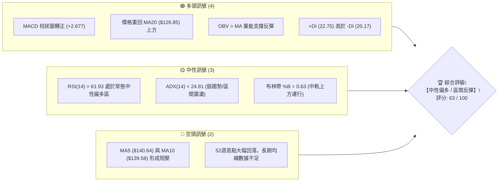
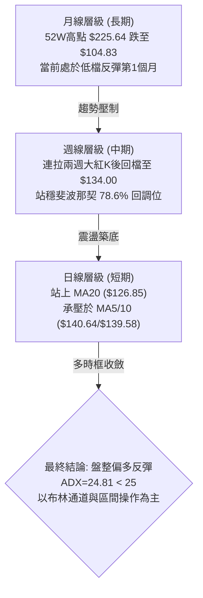
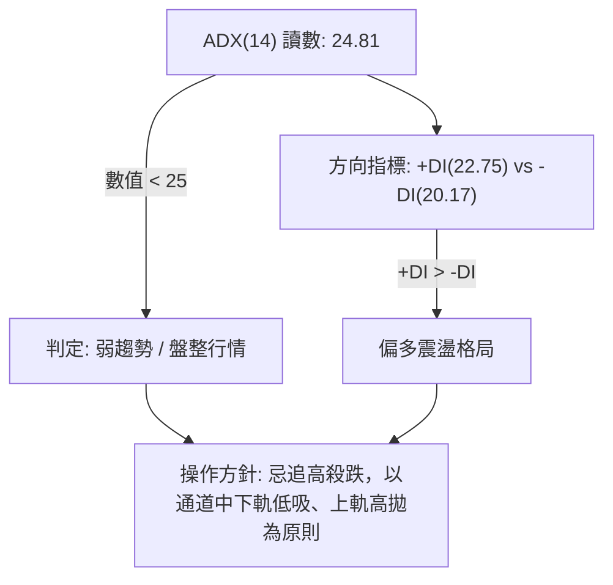
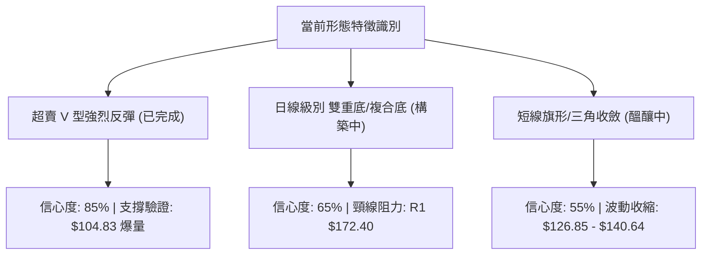
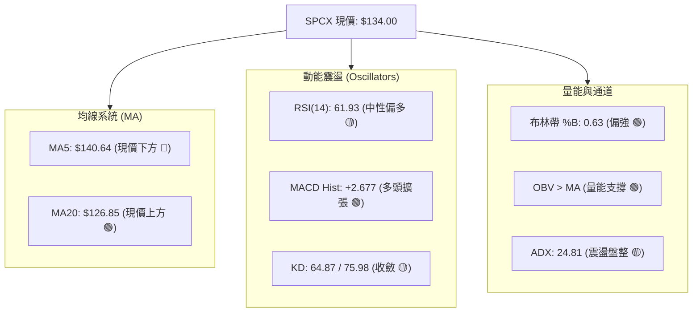
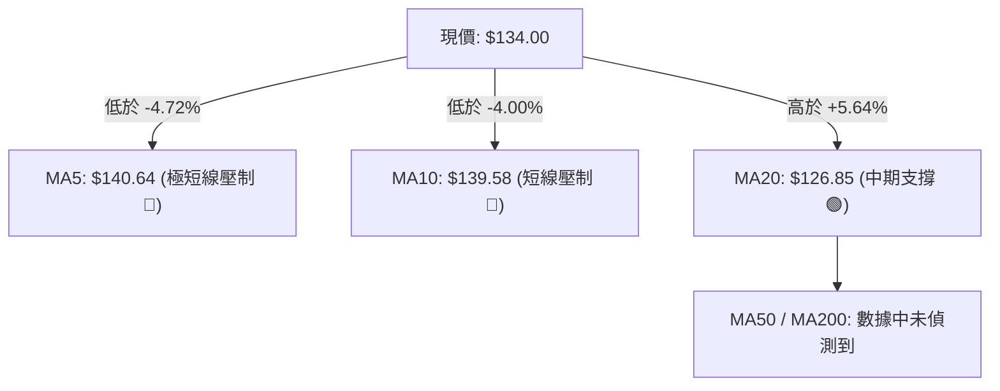
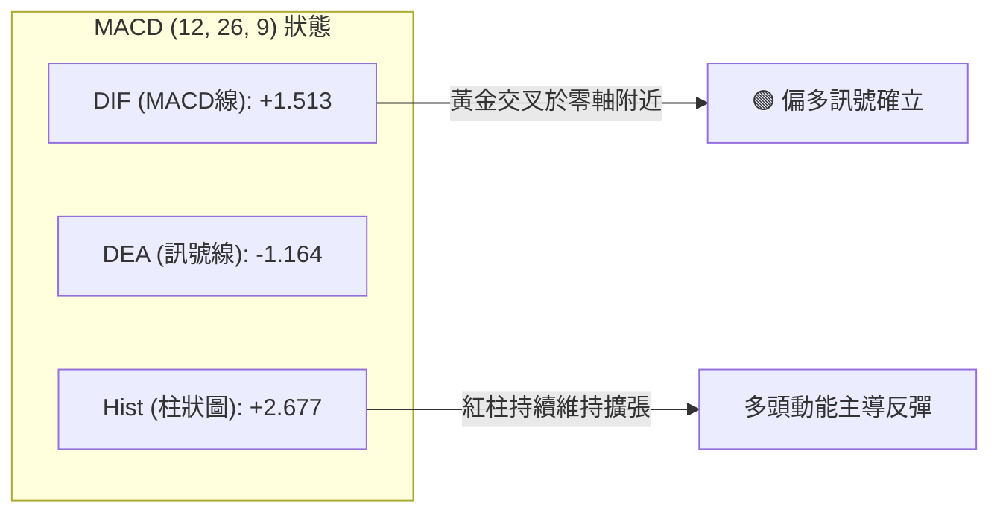
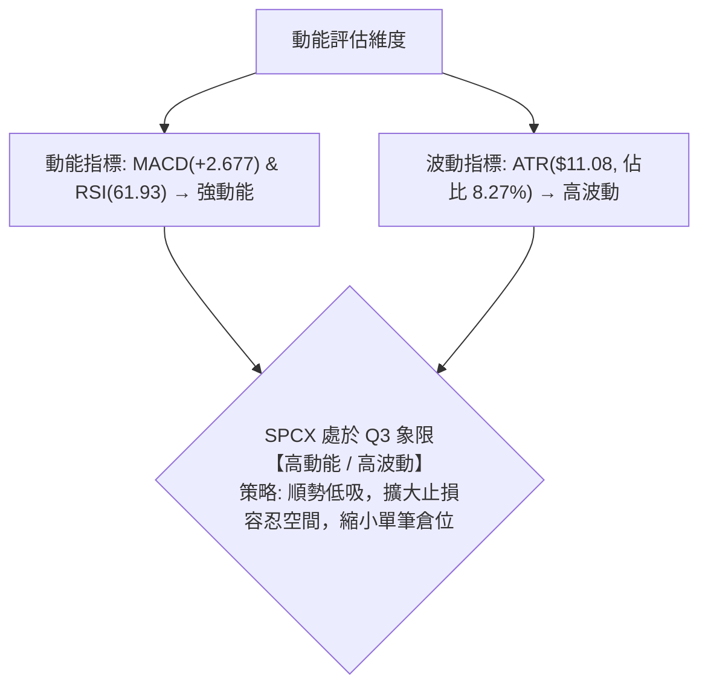
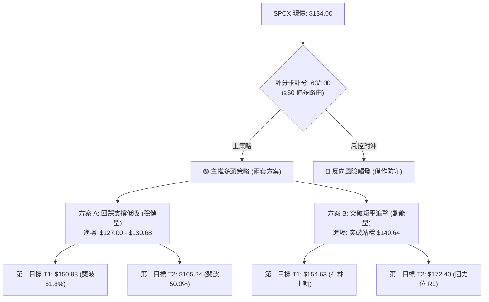
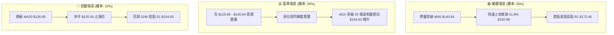

# SPCX 技術分析報告

> **報告日期**：2026-08-21 ｜ **語言**：繁體中文 ｜ **數據來源**：Yahoo Finance ｜ **當前價格**：$134.00

---

## 目錄

| 章節 | 內容 |
|------|------|
| [1. 技術面概覽](#1-技術面概覽) | 訊號儀表板、核心指標、評分卡 |
| [2. 趨勢分析](#2-趨勢分析) | 多時框趨勢、長中短期走勢 |
| [3. 圖表形態分析](#3-圖表形態分析) | 形態識別、K線組合、目標價 |
| [4. 支撐與阻力](#4-支撐與阻力) | 關鍵價位、斐波那契回調 |
| [5. 技術指標深度解讀](#5-技術指標深度解讀) | MA/RSI/MACD/布林/成交量 |
| [6. 動能與波動率](#6-動能與波動率) | 動能評估、ATR、Beta |
| [7. 多時框架總結](#7-多時框架總結) | 時框架評分矩陣 |
| [8. 交易策略建議](#8-交易策略建議) | 多空策略、風險報酬比 |
| [9. 風險提示與監控](#9-風險提示與監控) | 監控指標、風險場景 |

---

## 1. 技術面概覽

### 🎯 技術訊號儀表板



### 📊 核心指標速覽表

| 指標類別 | 指標名稱 | 當前數值 | 訊號 | 解讀 |
|----------|----------|----------|------|------|
| **價格** | 當前價格 | $134.00 | 🟡 | 位於52週區間 24.1% 水位，脫離底部但面臨上檔解套壓 |
| **均線** | MA5 | $140.64 | 🔴 | 現價低於 MA5（-4.72%），極短線面臨回洗拉回 |
| **均線** | MA10 | $139.58 | 🔴 | 現價低於 MA10（-4.00%），短線承壓 |
| **均線** | MA20 | $126.85 | 🟢 | 現價高於 MA20（+5.64%），中期防守底線確立 |
| **均線** | MA50 / MA200 | $N/A | 🟡 | 數據中未偵測到（新股或上市歷史數據不足） |
| **動能** | RSI(14) | 61.93 | 🟢 | 中性偏強，未進入超買區（>70），反彈具延續動能 |
| **動能** | MACD (12,26,9) | 1.513 / -1.164 | 🟢 | 快線黃金交叉慢線，Hist 擴張至 +2.677，偏多訊號 |
| **動能** | KD (%K/%D) | 64.87 / 75.98 | 🟡 | KD 處於中高檔收斂，無鈍化跡象 |
| **趨勢** | ADX(14) / DMI | 24.81 / +DI> -DI | 🟡 | ADX < 25 屬震盪修復格局，+DI(22.75) > -DI(20.17) |
| **通道** | 布林通道 (%B) | 0.63 | 🟢 | 站於中軌（$126.85）與上軌（$154.63）之間，偏強運行 |
| **波動** | ATR(14) | $11.08 | 🔴 | ATR 佔比 8.27%，日均波動極大，需嚴格控管槓桿與止損 |
| **量能** | 成交量 / 20MA | 119.52M / 117.62M | 🟢 | 量比 1.02x，OBV > MA，量能溫和支撐反彈走勢 |

### 🏆 技術評分卡

```
╔══════════════════════════════════════════════════════════════════╗
║                 技術評分卡 — SPCX (2026-08-21)                  ║
╠══════════════════════════════════════════════════════════════════╣
║ 趨勢強度 (ADX=24.81)    ██████████░░░░░░░░░░  52/100  🟡 弱勢震盪 ║
║ 動能指標 (MACD/RSI)     ██████████████░░░░░░  72/100  🟢 動能充沛 ║
║ 支撐穩定度 (S1=$104.83) ██████████████░░░░░░  70/100  🟢 底部紮實 ║
║ 成交量配合 (OBV強勢)    ████████████░░░░░░░░  62/100  🟢 溫和放量 ║
║ 形態完整度 (V型底/箱型) ████████████░░░░░░░░  60/100  🟡 構築中   ║
║ 均線排列 (短線糾結)     ████████████░░░░░░░░  60/100  🟡 MA20有撐 ║
╠══════════════════════════════════════════════════════════════════╣
║ 綜合評分                █████████████░░░░░░░  63/100  🟢 中性偏多 ║
╚══════════════════════════════════════════════════════════════════╝
```

---

## 2. 趨勢分析

### 🌐 多時框趨勢分析



### 📈 長期趨勢 — 12個月走勢圖（Unicode）

```
SPCX 月線走勢示意圖（2025-09 至 2026-08）
價格 ($)
$225.64 ┤                           ● (52W High: $225.64)
$200.00 ┤                     ●───●
$175.00 ┤        ●      ●───●
$170.86 ┤        │     ● (2026-06: $170.86)
$150.00 ┤  ●─────●────●
$134.00 ┤                                      ● (現在 2026-08: $134.00)
$108.37 ┤                                ● (2026-07: $108.37)
$104.83 ┤                                ● (52W Low: $104.83)
        └─────────────────────────────────────────────────────────────
         M-11 M-10 M-9  M-8  M-7  M-6  M-5  M-4  M-3  M-2  M-1  2026-08
```

#### 走勢特徵分析表格

| 階段 | 期間區間 | 價格變動 | 幅度 (%) | 量能與形態特徵 |
|------|----------|----------|----------|----------------|
| **高檔回落期** | 2026-06 以前 | $225.64 → $170.86 | -24.28% | 歷史高點承壓，機構高檔換手，週量放大但價格無法創高 |
| **主跌崩跌段** | 2026-06 → 2026-07 | $170.86 → $108.37 | -36.57% | 恐慌性殺盤，跌破多道短期均線，週 RSI 一度跌至 15.9（極度超賣） |
| **築底強反彈** | 2026-07 → 2026-08 | $104.83 → $140.00 | +33.55% | 觸及 52W 低點 $104.83 爆出 9.2 億巨量 V 型反彈，重回 $130 之上 |
| **高檔整固期** | 2026-08-16 → 現價 | $140.00 → $134.00 | -4.29% | 遭遇 MA5/MA10 壓力，回測斐波那契 78.6% 水位（$130.68）進行蓄勢 |

### 📊 中期趨勢（週線分析）

```
近20週關鍵週K走勢結構圖（價格軸與MACD柱）
價位 ($)                                                      週 MACD Hist
$185.00 ┤          ▲ (06-21: $185.00)                        [+3.658]
$170.00 ┤       ╭──┴──╮
$160.00 ┤    ●──╯     ╰──● (07-05: $162.00)                  [-1.276]
$145.00 ┤                 ╰──●                               [-2.180]
$140.00 ┤                                  ▲ (08-16: $140)   [+4.591]
$134.00 ┤                                  ├── 現價 $134.00  [+2.677]
$120.00 ┤                      ╰──●        │                 [-3.362]
$115.07 ┤                         ╰──●     │ (07-26: RSI 15.9)[-2.684]
$104.83 ┤                            ╰──▼──╯ (08-02: $108.37)[-0.988]
        └──────────────────────────────────────────────────────────
         06-14 06-21 06-28 07-05 07-12 07-19 07-26 08-02 08-09 08-16 08-23
```

從近 20 週收盤走勢可見，股價在 2026-07-26 當週打出 RSI 15.9 的超賣極值，隨後於 2026-08-02 的 $108.37（逼近 52W 低點 $104.83）完成探底；2026-08-09 當週爆出 9.20 億股的驚人換手量，推升收盤至 $133.11，週 MACD 柱狀圖由負轉正（-0.988 → +2.330），宣告中期下跌波段結束，進入反彈結構。

### ⚡ 趨勢強度評估（ADX 解讀）



| 指標變數 | 當前讀數 | 門檻區間 | 趨勢屬性判定 |
|----------|----------|----------|--------------|
| **ADX(14)** | **24.81** | < 25 (弱趨勢/震盪) | 單邊趨勢未成型，價格處於從下行趨勢轉化為築底震盪的過渡期 |
| **+DI(14)** | **22.75** | > -DI | 多頭買盤力道佔優，多方掌握短線控盤權 |
| **-DI(14)** | **20.17** | < +DI | 空頭下壓力道逐漸衰退，恐慌拋壓已獲消化 |
| **綜合判定** | **多頭主導盤整** | — | **ADX < 25 且 +DI > -DI**，屬於標準的「區間偏多修復行情」 |

---

## 3. 圖表形態分析

### 🔍 形態識別系統



#### 形態信心度評估表（依規則 15）

| 形態類別 | 信心度 | 判斷依據（引用數據） | 完成度 | 目標價（附計算式） |
|----------|--------|----------------------|--------|--------------------|
| **超賣爆量 V 型底** | **85%** | 2026-08-02 探底 $108.37 後，8-09 週量衝上 9.20 億股大漲 22.8% | 100% (完成) | 目標為收復下跌段 50% 斐波位：**$165.24** |
| **大級別雙底 (W底)** | **65%** | 第一底為 52W 低點 **$104.83**，近期回檔於 MA20 **$126.85** 尋求右肩支撐 | 60% (右肩) | 頸線為波段高點 R1 **$172.40**。<br>突破後目標價 = 頸線 $172.40 + (頸線 $172.40 - 低點 $104.83) = **$239.97**（形態推算） |
| **短線高檔旗形收斂** | **55%** | 價格在 8-16 創 $140.00 後收縮回落至 $134.00，量能從 9.2 億縮至 3.97 億 | 70% | 突破旗頂 $140.64 後，旗桿高度 ($140 - $108.37 = $31.63)，目標價 = $140 + $31.63 = **$171.63**（形態推算，緊貼 R1 $172.40） |

### 🕯️ 重要K線形態分析

| 月份 / 週別 | 收盤價 | K線形態 | 解讀 | 訊號 |
|-------------|--------|---------|------|------|
| **2026-06** | $170.86 | 長黑破位K線 | 高檔籌碼崩潰，跌破月線上升通道，空頭起跌點 | 🔴 強烈看空 |
| **2026-07** | $108.37 | 探底長下影實體黑K | RSI 殺至 15.9 極值，空頭竭盡拋售，主力逢低承接 | 🟡 空頭力竭 |
| **2026-08-09 (週)** | $133.11 | 爆量長紅突破K | 9.2 億週量覆蓋前週高點，吞噬形態確立底部反轉 | 🟢 強力買訊 |
| **2026-08-16 (週)** | $140.00 | 衝高小陽線 | 觸及 $140 整數關卡，留上影線，多頭遭遇斐波 61.8% 壓力 | 🟡 多頭減速 |
| **2026-08-23 (當前)** | $134.00 | 縮量回踩小黑K | 成交量急縮至 3.97 億，回測 MA20 與 78.6% 斐波位，健康回檔 | 🟢 震盪洗盤 |

### 📉 ASCII 走勢形態示意圖

```
SPCX 日/週線反彈形態與旗形整理示意圖
$172.40 ┤                                        [阻力位 R1 / W底頸線]
         │                                       ═════════════════════
$154.63 ┤                                      ╭─ [布林上軌]
$140.64 ┤                           ● (MA5壓) ╭╯
$140.00 ┤                        ●──╯   ●     │ [旗形整理區間]
$134.00 ┤                     ●──╯       ● ◄──┴─ [現價 $134.00]
$126.85 ┤                  ●──╯ [MA20支撐 / 布林中軌]
$108.37 ┤            ●────╯
$104.83 ┤───▼────────╯ [52W Low / S1 雙底第一腳]
        └─────────────────────────────────────────────────────────────
         2026-07-26    2026-08-02   2026-08-09   2026-08-16   2026-08-21
```

### 🎯 形態目標價計算

根據上方識別之雙底形態（信心度 65%）與旗形整理形態（信心度 55%）：

$$\text{形態 1 (W底高度推算)}: \text{形態高度 } H_1 = \text{頸線 } R_1 (\$172.40) - \text{底點 } S_1 (\$104.83) = \$67.57$$
$$\text{理論翻倍目標價 } T_{\text{W-Pattern}} = \$172.40 + \$67.57 = \$239.97$$

$$\text{形態 2 (短線旗形推算)}: \text{旗桿高度 } H_2 = \$140.00 - \$108.37 = \$31.63$$
$$\text{短線旗形突破目標 } T_{\text{Flag}} = \$140.00 + \$31.63 = \$171.63 \quad (\text{高度吻合 } R_1\ \$172.40)$$

---

## 4. 支撐與阻力

### 🗺️ 關鍵價位分布圖（Unicode）

```
SPCX 價位結構與斐波那契回調分布圖
══════════════════════════════════════════════════════════════════
$225.64 ║██████████████████████████████║ 52W High / 斐波 0.0%
$197.13 ║██████████████████████        ║ 斐波 23.6% 回調位
$179.49 ║██████████████████            ║ 斐波 38.2% 回調位
$172.40 ║██████████████████████████████║ 近一年波段高點聚類 阻力 R1
$165.24 ║████████████████              ║ 斐波 50.0% 中樞平衡位
$154.63 ║▓▓▓▓▓▓▓▓▓▓▓▓▓▓▓▓▓▓            ║ 布林通道上軌
$150.98 ║██████████████                ║ 斐波 61.8% 黃金分割回調位
$140.64 ║▓▓▓▓▓▓▓▓▓▓▓▓                  ║ 短線 MA5 反壓
$134.00 ╠══════════════════════════════╣ ◄ 當前市價 ($134.00)
$130.68 ║▓▓▓▓▓▓▓▓▓▓▓▓▓▓▓▓▓▓▓▓▓▓        ║ 斐波 78.6% 回調位 (近期防守)
$126.85 ║▓▓▓▓▓▓▓▓▓▓▓▓▓▓▓▓▓▓▓▓▓▓▓▓▓▓    ║ MA20 / 布林通道中軌
$104.83 ║██████████████████████████████║ 52W Low / 波段低點聚類 支撐 S1
$99.06  ║▓▓▓▓▓▓▓▓▓▓▓▓                  ║ 布林通道下軌
══════════════════════════════════════════════════════════════════
```

### 🚧 阻力位分析表

價位完全嚴格引用關鍵價位與指標系統：

| 阻力級別 | 價位 | 形成原因 | 突破難度 | 重要性 |
|----------|------|----------|----------|--------|
| **阻力 R1** | **$172.40** | 近一年波段高點聚類，大量套牢密集成交區 | 🔴 極高 | ★★★★★<br>波段多空分水嶺 |
| **斐波 50.0%** | **$165.24** | 52W 跌幅之半數回撤中樞位 | 🟡 中等 | ★★★★☆<br>中期反彈第一大限 |
| **布林上軌** | **$154.63** | 日線級別布林帶波動上限通道 | 🟡 中等 | ★★★☆☆<br>短線超買警告位 |
| **斐波 61.8%** | **$150.98** | 黃金分割重要回調關卡 | 🟡 中等 | ★★★★☆<br>解套拋壓考驗區 |
| **均線反壓** | **$140.64** | 日線 MA5（$140.64）與 MA10（$139.58）密集重疊 | 🟢 較易 | ★★☆☆☆<br>短線重啟動能觸發點 |

### 🛡️ 支撐位分析表

價位完全嚴格引用關鍵價位與指標系統：

| 支撐級別 | 價位 | 形成原因 | 守住機率 | 重要性 |
|----------|------|----------|----------|--------|
| **斐波 78.6%** | **$130.68** | 斐波那契深度回調關鍵支撐，目前現價直接下檔護城河 | 75% | ★★★★☆<br>短多持倉警戒線 |
| **均線支撐** | **$126.85** | MA20 均線位置，同時為布林通道中軌 | 85% | ★★★★★<br>此波多頭反彈生命線 |
| **支撐 S1** | **$104.83** | 52W 最低點，近一年波段低點聚類，歷史爆量築底區 | 95% | ★★★★★<br>絕對底部不可跌破 |
| **布林下軌** | **$99.06** | 布林通道極端下軌（極端恐慌超跌位） | 98% | ★★★☆☆<br>黑天鵝防守底限 |

### 📐 斐波那契回調位分析

*以 52 週最高點 **$225.64** 至最低點 **$104.83** 之整體下跌波段計算（波動總空間 $120.81）：*

- **0.0% (52W High)**: **$225.64** — 歷史頂部
- **23.6% 回調位**: **$197.13** — 強勢多頭主升段目標
- **38.2% 回調位**: **$179.49** — 空頭防守核心防線
- **50.0% 回調位**: **$165.24** — 多空中性平衡中樞
- **61.8% 回調位**: **$150.98** — 黃金分割阻力位
- **78.6% 回調位**: **$130.68** — **當前關鍵分界位**
- **100.0% (52W Low)**: **$104.83** — 強力底部支撐

**深度解讀**：現價 **$134.00** 穩固運行於 **78.6% 回調位 ($130.68)** 與 **61.8% 回調位 ($150.98)** 之間。這表明 SPCX 已經成功脫離最底層的極度弱勢區間（$104.83–$130.68），並正試圖向上挑戰黃金分割第一阻力區 $150.98。只要收盤守在 $130.68 之上，反彈架構即維持完整。

---

## 5. 技術指標深度解讀

### 🎛️ 指標訊號總覽



### 📈 移動平均線排列分析



- **均線排列判定**：**短線均線混合糾結排列**。
- **具體解讀**：股價自 $104.83 強拉後，MA20 開始急速向上翻揚至 $126.85，為現價提供堅實的中期下檔支撐；然而短線受阻於 $140 關卡，導致 MA5（$140.64）與 MA10（$139.58）在上方形成微幅死叉下壓。當前價格夾在 MA20 與 MA5/10 之間收斂整理，等待突破方向。

### 📉 RSI(14) 分析

```
RSI(14) 讀數儀表板:
0 ──────────── 30 ──────────────────────── 61.93 ─────── 70 ──────── 100
[  極度超賣區  ] [       常態中性區       ]   ▲   [ 超買區 ]
                                            現價 (61.93)
進度條: ████████████████████████████░░░░░░░░░░░░  61.93% (中性偏強)
```

- **超買超賣判定**：RSI 處於 **61.93**，高於 50 中軸且遠未觸及 70 超買警戒線，顯示多頭具備進一步推升空間。
- **背離分析**：
  - **頂背離**：無頂背離現象。
  - **底背離**：在 2026-07-26（股價 $115.07，RSI 15.9）至 2026-08-02（股價創低 $108.37，RSI 回升至 19.2）期間，形成了標準的**週線級別雙重底背離**（價格創新低而 RSI 未創新低），該背離已成功引發本輪自 $108.37 至 $140.00 的強烈反彈。

### 📊 MACD(12/26/9) 訊號解讀



- **MACD 數值**：DIF 為 **+1.513**，Signal 線為 **-1.164**，兩者形成黃金交叉。
- **柱狀圖解讀**：MACD Hist 為 **+2.677**，呈現健康的正值紅柱。週 MACD 柱狀圖亦從 7 月底的 -3.362 快速轉正至 +2.677，佐證中期趨勢已由空頭下殺轉為多頭修復。

### 📦 布林通道分析

```
SPCX 日線布林通道結構示意圖 (寬度: $55.57)
$154.63 ┬────────────────────────────────────────── 上軌 (阻力)
        │
$134.00 ┼────────────────── ● 現價 ($134.00, %B = 0.63)
        │
$126.85 ┼────────────────────────────────────────── 中軌 (MA20支撐)
        │
$99.06  ┴────────────────────────────────────────── 下軌 (極端防守)
```

- **軌道數據**：上軌 **$154.63**，中軌 **$126.85**，下軌 **$99.06**，帶寬為 $55.57。
- **%B 指標分析**：當前 **%B = 0.63**，代表現價處於中軌與上軌之間的強勢運行區間（>0.5），中軌 $126.85 是當前極具價值的動態支撐防線。

### 💹 成交量分析（量價配合度）

```
最新量能比對：
今日成交量: 119.52M  ████████████████████████░  (101.6%)
20日均量:   117.62M  ███████████████████████░░  (100.0%)
```

- **量價特徵**：最新成交量 119.52M 略高於 20 日均量 117.62M（量比 1.02x），量能溫和穩定，無異常放量倒貨跡象。
- **OBV 能量潮**：技術數據顯示「**OBV > MA → 量能支撐上漲**」，確認主力資金在低檔吸籌後未有顯著離場跡象，量價結構支持現價進一步挑戰上檔阻力。

---

## 6. 動能與波動率

### ⚡ 動能評估四象限

| 象限 | 動能強度 (Momentum) | 波動率水準 (Volatility) | SPCX 當前落點 | 狀態評估與交易指引 |
|:---:|:---:|:---:|:---:|:---|
| **Q1** | **強 (High)** | **低 (Low)** | — | 穩健主升段（最佳趨勢加碼點） |
| **Q2** | **弱 (Low)** | **低 (Low)** | — | 沉悶築底段（適合網格分批佈局） |
| **Q3** | **強 (High)** | **高 (High)** | **✓ (SPCX 落點)** | **高動能/高波動修復期：反彈迅猛但震盪劇烈，嚴控部位** |
| **Q4** | **弱 (Low)** | **高 (High)** | — | 恐慌主跌段（嚴禁抄底） |



### 📊 ATR 波動率分析

```
ATR (14日真實波幅) 評估：
數值: $11.08  |  佔股價比例: 8.27%
波動度評級:   ████████████████████░░░░  82.7/100  (極高波動標的)
```

- **ATR 數值解讀**：SPCX 的 ATR(14) 高達 **$11.08**，意味著該股在單一交易日內正常波動幅度即達現價的 **8.27%**。
- **止損距離建議**：
  - **激進型短線止損（1.0 × ATR）**：距離現價需拉開 **$11.08**（對應止損價約 **$122.92**，低於 MA20）。
  - **穩健型波段止損（1.5 × ATR）**：距離現價需拉開 **$16.62**（對應止損價約 **$117.38**）。
  - **嚴格風控規則**：因 ATR 佔比逾 8%，部位規模應降至常規持倉的 50%–70%，以防日內極端震盪觸發無謂止損。

### 📐 Beta 與市場相關性

- **Beta 狀態**：數據顯示為 `N/A`（高成長/太空防務新興股歷史數據覆蓋期較短）。
- **機構籌碼與放空結構**：
  - **機構持股比重**：**47.7%**（機構高度參與，具備中長期定價能力）。
  - **內部人持股**：**12.7%**（管理層利益深度綁定）。
  - **空頭部位**：做空比例佔浮動股 **3.3%**，Short Ratio **2.85**。空方部位處於健康低檔，無軋空擠壓風險，但亦無空頭集體踩踏引發的系統性下殺壓力。

---

## 7. 多時框架總結

### 📋 時框架評分表

| 時框架 | 趨勢方向 | 動能指標 | 均線排列狀態 | 形態特徵 | 綜合評分 | 操作建議 |
|--------|----------|----------|--------------|----------|:--------:|----------|
| **月線 (長期)** | 🔴 弱勢反彈 | 🟡 底部修復中 | MA50/200 數據不足 | 52W 低點 $104.83 爆量回升 | 45/100 | 長線資金分批建立基本持倉 |
| **週線 (中期)** | 🟢 轉強多頭 | 🟢 MACD 轉正擴張 | 守穩斐波 78.6% | 週線雙底背離反彈吞噬 | 72/100 | 波段持有，以 MA20 為防守點 |
| **日線 (短期)** | 🟡 區間震盪 | 🟢 RSI=61.93 偏多 | 站上 MA20，承壓 MA5/10 | 旗形收斂整理於 $134 | 65/100 | 逢回測支撐低吸，不盲目追高 |

### 🔲 綜合訊號矩陣

```
╔══════════════════════════════════════════════════════════════════╗
║                   SPCX 多時框架訊號矩陣表                        ║
╠══════════════╦══════════════╦══════════════╦═════════════════════╣
║ 分析維度     ║ 短期 (日線)  ║ 中期 (週線)  ║ 長期 (月線)         ║
╠══════════════╬══════════════╬══════════════╬═════════════════════╣
║ 趨勢方向     ║ 🟡 震盪整理  ║ 🟢 反彈延續  ║ 🔴 弱勢修復         ║
║ 核心動能     ║ 🟢 MACD看多  ║ 🟢 RSI回升   ║ 🟡 超賣平復         ║
║ 支撐防線     ║ $126.85(MA20)║ $104.83(52W) ║ $104.83(歷史底)     ║
║ 阻力目標     ║ $140.64(MA5) ║ $150.98(61.8)║ $172.40(R1阻力)     ║
║ 訊號一致性   ║ 68% (偏多)   ║ 80% (偏多)   ║ 50% (中性)          ║
╚══════════════╩══════════════╩══════════════╩═════════════════════╣
║ 矩陣綜合結論 ║ 🟢 中短期多頭共振，長期處於歷史價值修復區間       ║
╚══════════════════════════════════════════════════════════════════╝
```

### ⚖️ 多時框收斂結論

> **依多時框收斂規則（嚴格要求 14）**：
> 1. **趨勢/盤整判定**：當前 ADX(14) 為 **24.81**（< 25），嚴格歸類為「**盤整震盪行情**」。
> 2. **主導時框取捨**：依規則，盤整行情中「**以日線布林通道上下軌（$99.06–$154.63）及 MA20（$126.85）為主要交易區間依據**」。
> 3. **衝突收斂**：日線短線雖受 MA5（$140.64）壓制，但週線動能（MACD Hist +2.677、OBV 向上）呈現多頭修復。收斂後的**唯一方向性結論為：【中性偏多（區間向上修復）】**。此結論與評分卡 63 分及第 8 章主推策略完全一致。

---

## 8. 交易策略建議

### 🗺️ 策略決策流程圖



### 🧭 策略路由（依評分卡分流）

- **當前主策略方向**：**【主推多頭策略（偏多區間操作）】（依技術評分卡 63 / 100 分分流）**。

### 🎯 價格情境階梯（Price Scenarios）

價位完全嚴格引用第 4 章及數據計算：

| 觸發條件 | 下一目標 | 後續延伸 | 情境含義與操作指引 |
|----------|----------|----------|--------------------|
| **向上突破 $140.64 (MA5)** | **$150.98 (斐波61.8%)** | **$154.63 (布林上軌)** | 短線轉強，旗形向上突破，啟動波段推升行情 |
| **突破站穩 $154.63 (布林上軌)**| **$165.24 (斐波50.0%)** | **$172.40 (阻力 R1)** | 中期主升反彈，挑戰波段高點聚類與 W 底頸線 |
| **維持 $126.85–$140.64 區間** | **$134.00 (現價)** | — | 區間震盪蓄勢，消化 MA5/10 賣壓，適合網格高拋低吸 |
| **向下跌破 $126.85 (MA20)** | **$104.83 (支撐 S1)** | **$99.06 (布林下軌)** | 中期反彈失敗，回測 52W 低點，多頭全面停損離場 |

### 📊 情境機率分佈

| 情境類別 | 發生機率 | 主要依據與技術論證 |
|----------|:--------:|--------------------|
| **情境一：震盪向上突破反彈** | **60%** | MACD Hist 維持 +2.677 擴張，OBV > MA 量能健康，價格穩居 MA20 ($126.85) 上方 |
| **情境二：區間箱型震盪整固** | **25%** | ADX=24.81 顯示趨勢強度有限，MA5/10 ($140.64/$139.58) 在上方形成壓制需要時間換取空間 |
| **情境三：跌破支撐重回探底** | **15%** | 若大盤系統性風險爆發，跌破 MA20 則將回測支撐 S1 ($104.83) |

### 🟢 主策略詳情（多頭偏向）

| 策略要素 | 策略 A（穩健型：支撐低吸） | 策略 B（積極型：動能突破） |
|----------|----------------------------|----------------------------|
| **交易邏輯** | 回踩斐波 78.6% 與 MA20 支撐不破進場 | 帶量突破 MA5/MA10 短線阻力順勢進場 |
| **進場條件** | 價格回落至 $127.00–$130.68 區間出現下影線 | 日K收盤價突破 **$140.64** 且成交量放大 |
| **進場價格** | **$128.50** | **$141.00** |
| **止損價格** | **$120.00**（跌破 MA20 約 5% 且避開正常震盪） | **$133.00**（跌回當前整固平台下方） |
| **第一目標 (T1)**| **$150.98**（斐波那契 61.8% 回調位） | **$154.63**（布林通道上軌） |
| **第二目標 (T2)**| **$165.24**（斐波那契 50.0% 回調位） | **$172.40**（阻力位 R1 / 波段高點） |
| **風險空間** | $128.50 - $120.00 = **$8.50** (6.61%) | $141.00 - $133.00 = **$8.00** (5.67%) |
| **獲利空間 (T2)**| $165.24 - $128.50 = **$36.74** (28.59%) | $172.40 - $141.00 = **$31.40** (22.27%) |
| **風險報酬比 (R:R)**| **1 : 4.32** | **1 : 3.93** |
| **預估勝率** | **65%** | **55%** |
| **建議倉位** | **15% 總資金** | **10% 總資金** |

### 🔴 反向風險觸發點（對沖提示）

- **風險觸發價位**：**$126.85**（MA20 / 布林中軌）。
- **避險處置**：若日K收盤價跌破 **$126.85**，說明反彈動能耗盡，多頭主策略全部失效。建議多單立即止損出場，保守型投資人可在此觸發時買入 Put 選擇權或降低持股至 0%，下看支撐 S1 **$104.83**。

### ⭐ 整體訊號強度評星

```
做多訊號強度：★★★★☆  (4/5星 — 動能與量能共振支撐反彈)
做空訊號強度：★☆☆☆☆  (1/5星 — 缺乏頂背離與做空動能)
整體可信度：  ★★★★☆  (4/5星 — 底部爆量確認度高，支撐明確)
```

---

## 9. 風險提示與監控

### ✅ 關鍵監控指標 Checklist

```
╔══════════════════════════════════════════════════════════════════╗
║                   每日交易監控清單 (Checklist)                   ║
╠══════════════════════════════════════════════════════════════════╣
║ [ ] 價格是否守穩斐波那契 78.6% 水位 ($130.68)                    ║
║ [ ] 價格是否收盤跌破 MA20 生命線 ($126.85)                       ║
║ [ ] 日成交量是否維持在 20日均量 (117.62M) 之上                   ║
║ [ ] MACD 柱狀圖是否維持正值 (+2.677 是否縮減)                    ║
║ [ ] RSI(14) 是否跌破 50 中性水準                                ║
║ [ ] 向上挑戰時是否放量突破 MA5 ($140.64)                         ║
║ [ ] ATR(14) 是否出現異常放大 (高於 $11.08 顯示極端波動)          ║
╚══════════════════════════════════════════════════════════════════╝
```

### ⚠️ 風險場景分析



### 🛡️ 風險管理重要提醒

1. **ATR 波動風險控管**：因日均真實波幅（ATR）達 **$11.08 (8.27%)**，單日振幅極大，絕對禁止使用高槓桿工具操作。
2. **倉位配置原則**：單一策略進場倉位建議嚴格控制在 **10%–15%** 以內，總 SPCX 曝險不宜超過投資組合的 20%。
3. **無條件止損紀律**：以 MA20（$126.85）作為波段多頭底線，若跌破 $120.00（約 1.5 ATR 距離）必須無條件執行停損，嚴防再次陷入探底陰跌。

---

## 📋 報告總結

```
╔══════════════════════════════════════════════════════════════════╗
║                   SPCX 技術分析報告總結                         ║
╠══════════════════════════════════════════════════════════════════╣
║ 報告日期：2026-08-21                                            ║
║ 當前價格：$134.00                                               ║
║ 分析評級：🟢 中性偏多 / 區間向上修復 (評分: 63/100)              ║
╠══════════════════════════════════════════════════════════════════╣
║ 關鍵結論：                                                       ║
║ ├─ 長期趨勢：🟡 52W低點爆量反轉，自歷史底部脫離                  ║
║ ├─ 中期趨勢：🟢 MACD翻紅 (+2.677)，量能 OBV 支撐反彈             ║
║ ├─ 短期趨勢：🟡 夾在 MA20 ($126.85) 與 MA5 ($140.64) 間旗形震盪  ║
║ ├─ 關鍵支撐：$130.68 (斐波78.6%) / $126.85 (MA20) / $104.83 (S1) ║
║ ├─ 關鍵阻力：$140.64 (MA5) / $150.98 (斐波61.8%) / $172.40 (R1)  ║
║ └─ 分析師目標：共識買入，平均目標價 $213.50 (最高 $450.00)       ║
╠══════════════════════════════════════════════════════════════════╣
║ 最優策略組合：                                                   ║
║ 1. 🥇 最佳機會：策略 A (回踩 $127–$130.68 低吸，目標 $165.24)   ║
║ 2. 🥈 次選機會：策略 B (帶量突破 $140.64 追擊，目標 $172.40)    ║
║ 3. 🥉 保守選擇：等待股價站穩布林上軌 $154.63 後右側順勢加碼     ║
╚══════════════════════════════════════════════════════════════════╝
```

---

> ⚠️ **免責聲明**：本報告為 AI 自動生成之技術分析，所有數據及估算均基於提供的歷史價格與指標資訊。本報告**僅供研究與學術參考**，**不構成任何投資建議**。投資有風險，入市需謹慎。

---

*報告生成時間：2026-08-21 ｜ 數據來源：Yahoo Finance ｜ 分析框架：多時框技術分析*