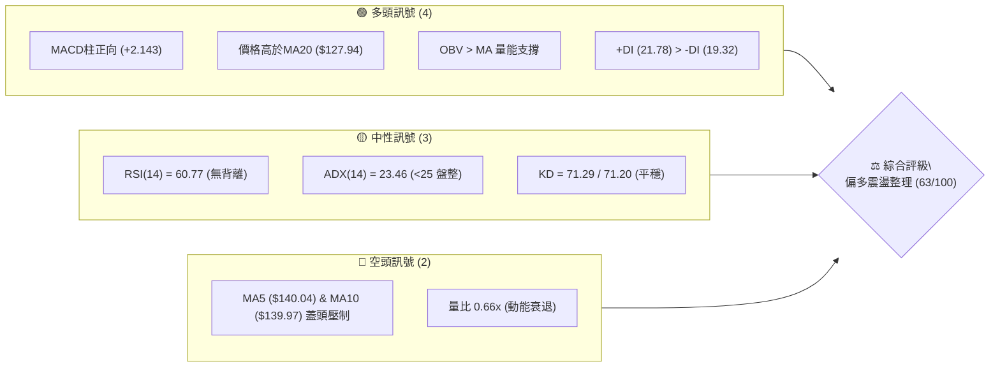
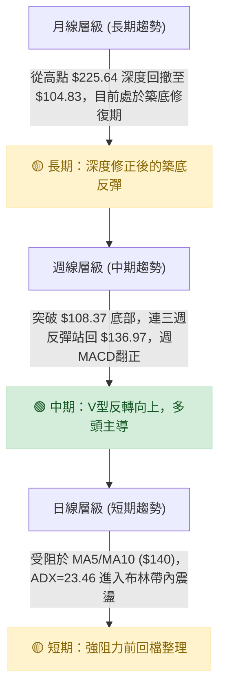
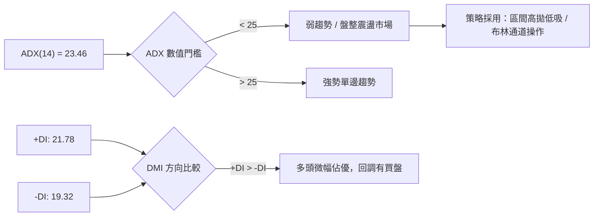
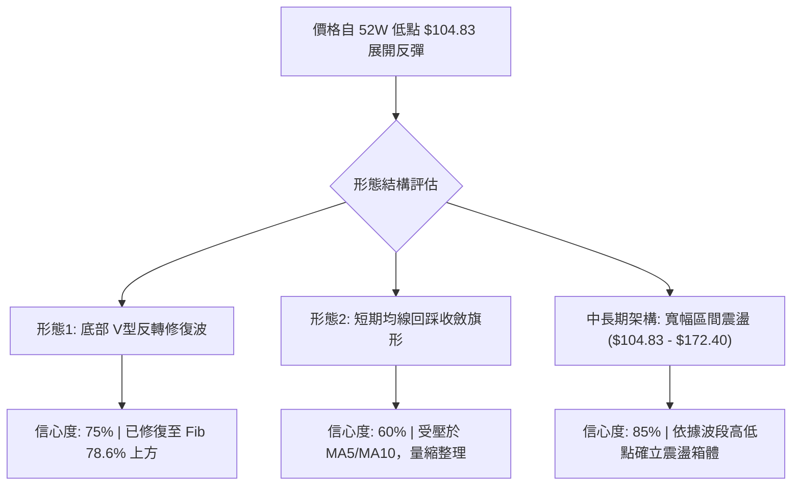
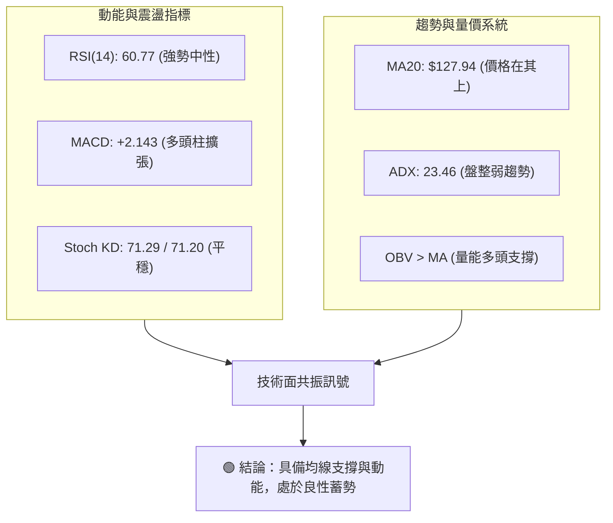
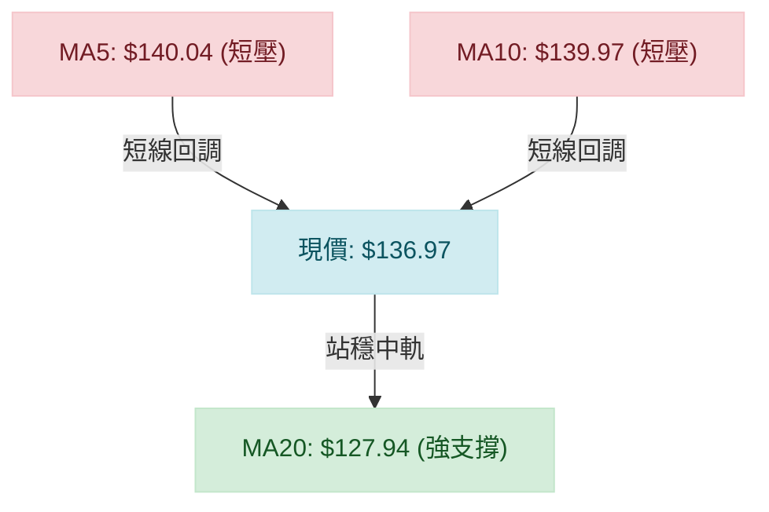
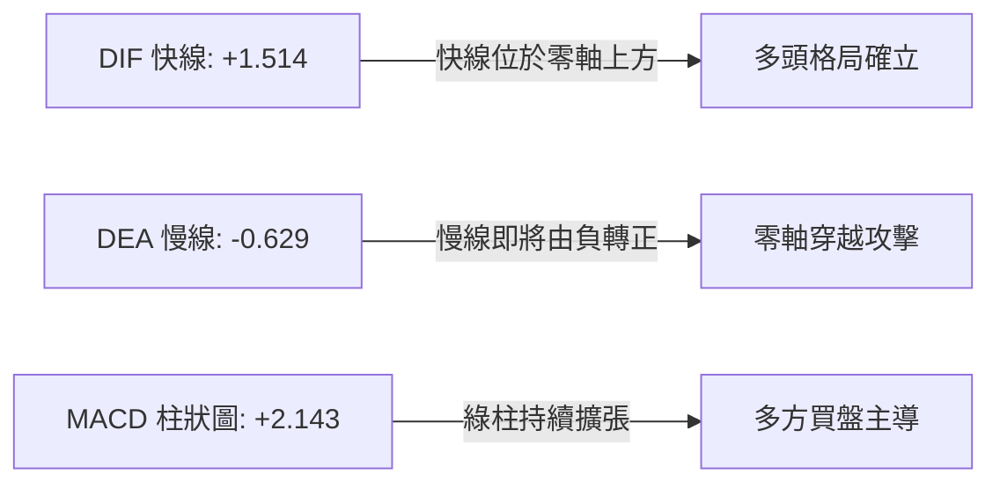
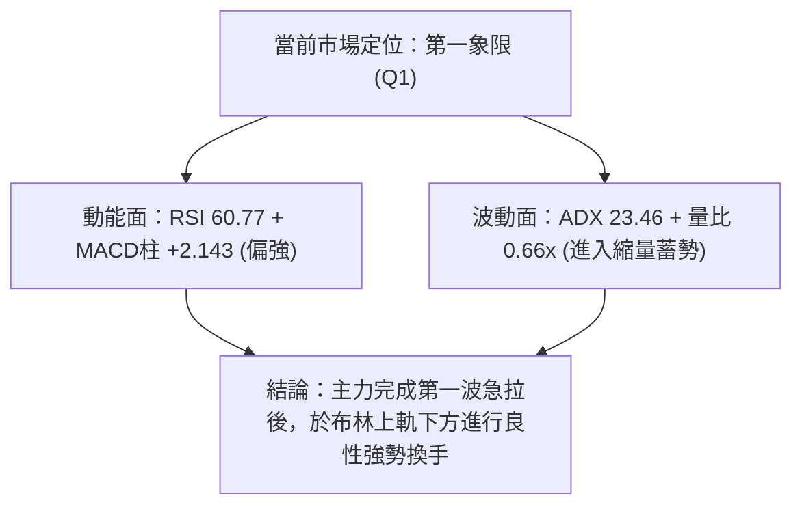
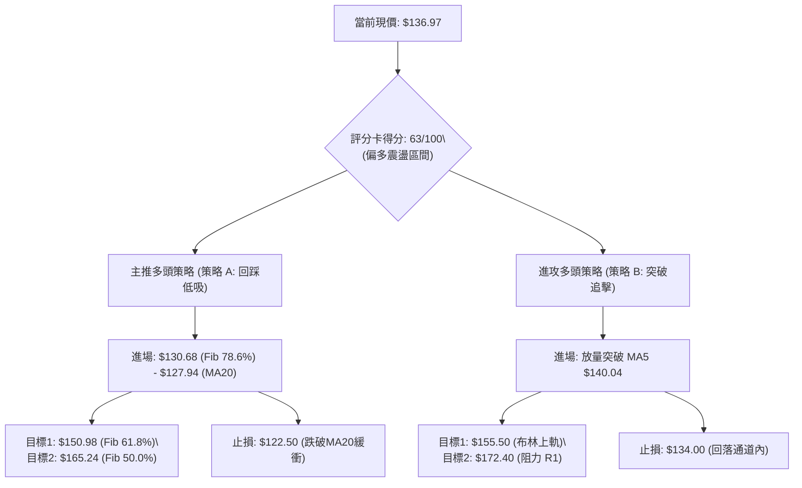
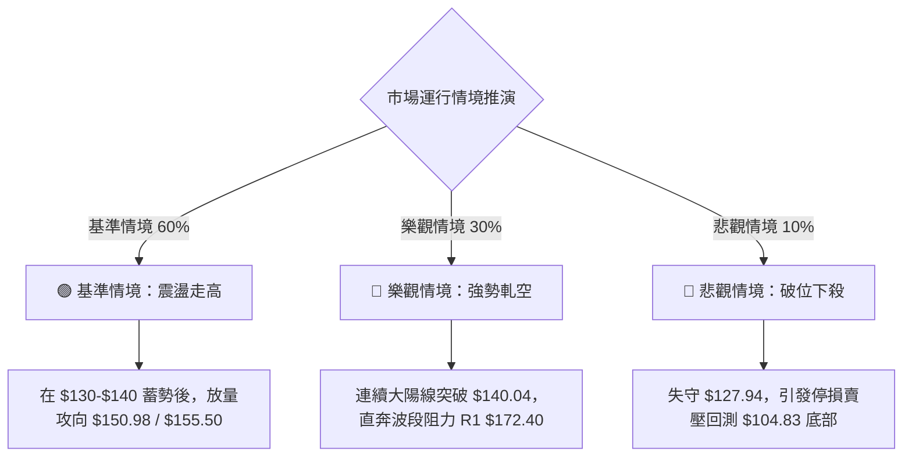

# SPCX 技術分析報告

> **報告日期**：2026-08-23 ｜ **語言**：繁體中文 ｜ **數據來源**：Yahoo Finance ｜ **當前價格**：$136.97

---

## 目錄

| 章節 | 內容 |
|------|------|
| [1. 技術面概覽](#1-技術面概覽) | 訊號儀表板、核心指標、評分卡 |
| [2. 趨勢分析](#2-趨勢分析) | 多時框趨勢、長中短期走勢 |
| [3. 圖表形態分析](#3-圖表形態分析) | 形態識別、K線組合、目標價 |
| [4. 支撐與阻力](#4-支撐與阻力) | 關鍵價位、斐波那契回調 |
| [5. 技術指標深度解讀](#5-技術指標深度解讀) | MA/RSI/MACD/布林/成交量 |
| [6. 動能與波動率](#6-動能與波動率) | 動能評估、ATR、Beta |
| [7. 多時框架總結](#7-多時框架總結) | 時框架評分矩陣 |
| [8. 交易策略建議](#8-交易策略建議) | 多空策略、風險報酬比 |
| [9. 風險提示與監控](#9-風險提示與監控) | 監控指標、風險場景 |
| [10. 報告總結](#10-報告總結) | 核心總結與決策指引 |

---

## 1. 技術面概覽

### 🎯 技術訊號儀表板



### 📊 核心指標速覽表

| 指標類別 | 指標名稱 | 當前數值 | 訊號 | 解讀 |
|----------|----------|----------|------|------|
| **價格** | 當前收盤價 | $136.97 | 🟡 | 位於52週區間 26.6%，自底部 $104.83 明顯反彈後遇短期均線壓制 |
| **均線** | MA5 / MA10 | $140.04 / $139.97 | 🔴 | 現價在MA5/MA10下方，短線出現拉回修正 |
| **均線** | MA20 (BB中軌) | $127.94 | 🟢 | 價格在MA20上方 +7.06%，中期多頭防守基石穩固 |
| **動能** | RSI(14) | 60.77 | 🟡 | 處於 30-70 中性強勢區，無頂底背離，回升後稍微鈍化 |
| **動能** | MACD (12,26,9) | DIF: 1.514 / DEA: -0.629 / 柱狀: +2.143 | 🟢 | 柱狀圖維持正值擴張，低檔黃金交叉後之多頭延續波段 |
| **動能** | KD(9,3,3) | %K: 71.29 / %D: 71.20 | 🟡 | 指標進入中高位區間，雙線黏合，短線震盪蓄勢 |
| **趨勢** | ADX(14) / DMI | ADX: 23.46 / +DI: 21.78 / -DI: 19.32 | 🟡 | ADX < 25 判定為盤整/弱趨勢，多頭稍佔優勢但缺乏單邊暴發力 |
| **通道** | 布林通道 (%B) | 上軌 $155.50 / 下軌 $100.39 / %B: 0.66 | 🟢 | 站於中軌上方朝上軌運行，空間充裕 |
| **量能** | 成交量 / 20日均量 | 78.55M / 118.72M (量比 0.66x) | 🟡 | 量縮整理，OBV 指標仍高於均線，籌碼未見恐慌拋售 |
| **波動** | ATR(14) | $10.80 (7.88%) | 🔴 | 日均波動幅度大，需設定相對寬裕之風控保護區間 |

### 🏆 技術評分卡

```
╔══════════════════════════════════════════════════════════════════╗
║              SPCX 技術指標多空綜合評分卡 (2026-08-23)            ║
╠══════════════════════════════════════════════════════════════════╣
║ 趨勢強度 (Trend)     ██████████░░░░░░░░░░  52/100  🟡 弱勢多頭   ║
║ 動能指標 (Momentum)  ██████████████░░░░░░  70/100  🟢 MACD擴張   ║
║ 支撐穩定度 (Support) ██████████████░░░░░░  72/100  🟢 底部扎實   ║
║ 成交量配合 (Volume)  ██████████░░░░░░░░░░  50/100  🟡 短期量縮   ║
║ 形態完整度 (Pattern) ████████████░░░░░░░░  60/100  🟢 V型反轉修復 ║
║ 均線架構 (MA Align)  ██████████████░░░░░░  70/100  🟢 站上MA20   ║
╠══════════════════════════════════════════════════════════════════╣
║ 綜合技術得分         ████████████░░░░░░░░  63/100  🟢 偏多震盪   ║
╚══════════════════════════════════════════════════════════════════╝
```

---

## 2. 趨勢分析

### 🌐 多時框趨勢分析



### 📈 長期趨勢 — 12個月走勢圖（Unicode）

```
SPCX 月線走勢示意圖（2025-08 至 2026-08）
價格軸 ($)
$225.64 ┤                           ● (52W 高點)
$200.00 ┤                     ●   ●
$175.00 ┤               ●               ● (2026-06: $170.86)
$150.00 ┤         ●
$136.97 ┤───●───────────────────────────────●← 當前現價 ($136.97)
$120.00 ┤       ●
$104.83 ┤                               ● (52W 低點 / 2026-07: $108.37)
        └────────────────────────────────────────────────────────
         M1  M2  M3  M4  M5  M6  M7  M8  M9  M10 M11 M12 (2026-08)
```

**走勢特徵分析表格**：

| 階段 | 期間/代表價位 | 漲跌幅特徵 | 量能與動能特徵 | 趨勢定性 |
|------|---------------|------------|----------------|----------|
| **主升攻擊波** | 歷史衝刺 → $225.64 | 52週最高點聚類 | 巨量推升，動能達到極致 | 🔴 頂部確立後反轉 |
| **深度殺跌波** | $225.64 → $104.83 | 累計跌幅達 -53.54% | 籌碼快速出逃，週線RSI一度跌破20極端超賣 | 🔴 空頭宣洩期 |
| **築底強彈波** | 2026-07 ($108.37) → 2026-08 ($136.97) | 8月份單月反彈 +26.39% | 週成交量爆出 9.20億股，機構買盤積極承接 | 🟢 底部V型扭轉期 |

### 📊 中期趨勢（週線分析）

```
近期週線收盤走勢與關鍵防守結構
價位
$172.40 ┤══════════════════════════════════════ [R1 近一年波段高點阻力]
$160.00 ┤     ▲
$150.98 ┤    ╱ ╲                               [Fib 61.8% 阻力]
$140.00 ┤───╱───╲───────────▲───● ($136.97 盤整中)
$127.94 ┤  ╱     ╲         ╱     [MA20 / 布林中軌支撐]
$115.00 ┤ ╱       ╲       ╱
$104.83 ┤──────────▼─────▼─────── [S1 52W最低點強支撐]
        └──────────────────────────────────────
        06-21   07-12   08-02   08-16   08-23
```

- **週線動能轉強**：自 2026-07-26 週低點（RSI 僅 15.9）後，連續兩週強勢大漲（08-09 收 $133.11，08-16 收 $140.00），週 MACD 柱由 -3.362 快速翻正至 +4.591，確認週線級別的反彈確立。
- **本週小幅回吐**：本週收盤 $136.97（-2.16%），量能自 663M 縮減至 475M，屬於急漲後的正常回後買盤換手。

### ⚡ 趨勢強度評估（ADX 解讀）



| 指標名稱 | 當前數值 | 門檻判定 | 趨勢結構解讀 |
|----------|----------|----------|--------------|
| **ADX(14)** | **23.46** | < 25 (臨界點) | 當前市場由單邊急跌轉為大區間震盪，單邊動能略顯不足，短線進入蓄勢期 |
| **+DI (多頭動向)** | **21.78** | +DI > -DI (+2.46) | 買方力量重新取得主導權，但優勢幅度有限，尚未形成全面軋空爆發力 |
| **-DI (空頭動向)** | **19.32** | 處於低檔鈍化 | 空方拋壓大幅衰減，不再具備連續推低價格的能力 |

---

## 3. 圖表形態分析

### 🔍 形態識別系統



**形態識別與信心度評估表**：

| 形態類別 | 信心度 | 判斷依據（引用精確數據） | 完成度 | 形態目標價（附精確計算式） |
|----------|--------|--------------------------|--------|----------------------------|
| **底部 V型反彈** | **75%** | 自 52W 最低點 $104.83 直接連拉至 $140.00，收復 MA20 ($127.94) | 80% | 頸線位以 Fib 61.8% ($150.98) 為目標：<br>目標價 = **$150.98** |
| **短期矩形震盪/旗形** | **60%** | 衝高 $140.00 後在 MA5 ($140.04) 與 MA20 ($127.94) 區間量縮回踩 | 50% | 突破旗形上緣 $140.04 測 Fib 50.0%：<br>目標價 = **$165.24** |
| **大型頭肩底/雙底潛力** | **35%** | 數據僅具備單一低點 $104.83，未出現第二隻腳 | 20% | *訊號不足，不予推算複雜形態目標價* |

### 🕯️ 重要K線形態分析

| 期間/月份 | 收盤價 ($) | K線形態特徵 | 量價關係與解讀 | 多空訊號 |
|-----------|------------|-------------|----------------|----------|
| **2026-06** | 170.86 | 高位長黑回落 | 當月爆出長黑K，自 52W 高點 $225.64 暴跌，形成高檔套牢區 | 🔴 強烈看空 |
| **2026-07** | 108.37 | 探底長下影大陰線 | 觸及 52W 低點 $104.83 後出現恐慌拋補盤，空頭動能耗盡 | 🟡 止跌訊號 |
| **2026-08 (即時)** | 136.97 | 實體大陽棒反撲 | 單月強漲 +26.39%，實體陽線吞噬7月跌幅過半，多方全面反攻 | 🟢 強烈看多 |
| **近3週組合** | 133.11 → 140.00 → 136.97 | 連兩紅後帶上影小陰星 | 急漲突破後遭遇短線獲利盤了結，量縮回測支撐，屬良性整理 | 🟢 偏多蓄勢 |

### 📉 ASCII 走勢形態示意圖

```
SPCX 近期底部反轉與短線收斂形態示意圖
價位 ($)
$172.40 ┼─────────────────────────────────────────────── [波段阻力 R1]
        │
$150.98 ┼───────────────────────────────── [Fib 61.8% 關鍵反彈目標]
        │                           ▲
$140.04 ┼───────────────────────── ╭──╮ ◄ MA5 / 本波高點阻力
$136.97 ┼─────────────────────────│──● ◄ 現價 ($136.97) 量縮回踩
$127.94 ┼───────────────────╭─────╯   ◄ MA20 / 布林中軌動態支撐
        │             ╭─────╯
$108.37 ┼───────╭─────╯                 ◄ 7月打底收盤
$104.83 ┼───────● ◄ 52W 最低點 (S1 扎實底部)
        └──────────────────────────────────────────────
         2026-07-26  2026-08-02  2026-08-09  2026-08-16  2026-08-23
```

### 🎯 形態目標價計算

依據價格行為學（Price Action）與技術數據中的波段位移計算：
1. **第一反彈測幅目標（Fib 61.8% 回調位）**：
   - 起點（52W Low）：$104.83
   - 斐波那契 61.8% 壓制點：**$150.98**
   - 預期漲幅空間：+10.23%
2. **第二波段測幅目標（Fib 50.0% 中間樞紐位）**：
   - 突破 Fib 61.8% 後之波段對稱中軸：**$165.24**
   - 預期漲幅空間：+20.64%

---

## 4. 支撐與阻力

### 🗺️ 關鍵價位分布圖（Unicode）

```
SPCX 價位結構與籌碼密集分布圖
═════════════════════════════════════════════════════════════════
$225.64 ║████████████████████████████████║ 52W 最高點 / 極限天花板
$197.13 ║████████████████████░░░░░░░░░░░░║ Fib 23.6% 阻力區
$179.49 ║████████████████████████░░░░░░░░║ Fib 38.2% 阻力區
$172.40 ║████████████████████████████████║ 關鍵阻力 R1 (近一年波段高點)
$165.24 ║████████████████░░░░░░░░░░░░░░░░║ Fib 50.0% 多空中樞
$155.50 ║████████████████████░░░░░░░░░░░░║ 布林通道上軌
$150.98 ║████████████████████████░░░░░░░░║ Fib 61.8% 黃金分割阻力
$140.04 ║████████████░░░░░░░░░░░░░░░░░░░░║ MA5 短線蓋頭壓力
─────────────────────────────────────────────────────────────────
$136.97 ╠════════════════════════════════╣ ◄ 當前收盤現價 ($136.97)
─────────────────────────────────────────────────────────────────
$130.68 ║▓▓▓▓▓▓▓▓▓▓▓▓▓▓▓▓▓▓▓▓▓▓▓▓░░░░░░░░║ Fib 78.6% 回踩第一支撐
$127.94 ║▓▓▓▓▓▓▓▓▓▓▓▓▓▓▓▓▓▓▓▓▓▓▓▓▓▓▓▓░░░░║ MA20 / 布林中軌強支撐
$104.83 ║████████████████████████████████║ 強支撐 S1 (52W最低點聚類)
$100.39 ║████████████████████████████████║ 布林通道下軌極限防守
═════════════════════════════════════════════════════════════════
```

### 🚧 阻力位分析表

所有阻力位嚴格引用數據包之關鍵價位與斐波那契點位：

| 阻力級別 | 價位 | 形成原因與技術意涵 | 突破難度 | 重要性 |
|----------|------|--------------------|----------|--------|
| **短期阻力** | **$140.04** | MA5 短期均線扣抵點與上週高點聚類 | 🟡 中等 (需補量) | ★★☆☆☆ |
| **動態阻力** | **$155.50** | 布林通道日線日曆上軌壓制線 | 🟡 中等 (通道頂) | ★★★☆☆ |
| **黃金阻力** | **$150.98** | 斐波那契 61.8% 關鍵回調位 | 🔴 較高 (密集套牢) | ★★★★☆ |
| **關鍵阻力 R1**| **$172.40** | **近一年波段高點聚類** (距現價 +25.87%) | 🔴 極高 (主反轉點) | ★★★★★ |
| **強阻力** | **$179.49** | 斐波那契 38.2% 深度回調壓制位 | 🔴 極高 (大波段頸線) | ★★★★☆ |

### 🛡️ 支撐位分析表

所有支撐位嚴格引用數據包之關鍵價位與均線/布林系統：

| 支撐級別 | 價位 | 形成原因與技術意涵 | 守住機率 | 重要性 |
|----------|------|--------------------|----------|--------|
| **第一支撐** | **$130.68** | 斐波那契 78.6% 回調支撐位 | 🟢 80% (短線緩衝) | ★★★☆☆ |
| **關鍵支撐** | **$127.94** | **MA20 均線 & 布林帶中軌** (距現價 -6.59%) | 🟢 85% (多頭防線) | ★★★★★ |
| **波段強支撐 S1**| **$104.83** | **近一年波段最低點聚類 (52W Low)** | 🟢 95% (年度鐵底) | ★★★★★ |
| **極限支撐** | **$100.39** | 布林通道下軌動態包絡線 | 🟢 98% (極度超賣點) | ★★★★☆ |

### 📐 斐波那契回調位分析

*（計算基準區間：52週最低點 $104.83 → 52週最高點 $225.64，波幅 $120.81）*

| 回調比例 | 精確價位 ($) | 距現價空間 (%) | 當前技術位置與解讀 |
|----------|--------------|----------------|--------------------|
| **0.0% (52W High)** | **$225.64** | +64.74% | 牛市頂部極限目標區間 |
| **23.6%** | **$197.13** | +43.92% | 極強勢反彈區間 |
| **38.2%** | **$179.49** | +31.04% | 多空中長期分水嶺 |
| **50.0%** | **$165.24** | +20.64% | 多空力量對稱均衡點 |
| **61.8% (黃金分割)** | **$150.98** | +10.23% | **上檔首要強阻力關卡** |
| **現價位置** | **$136.97** | **0.00%** | **目前精確落於 61.8% ($150.98) 與 78.6% ($130.68) 之間** |
| **78.6%** | **$130.68** | -4.59% | **下檔第一道防守黃金緩衝區** |
| **100.0% (52W Low)** | **$104.83** | -23.46% | 歷史波段扎實大底部 |

**現價區間解讀**：現價 $136.97 穩固運行於 Fib 78.6% ($130.68) 之上，顯示空頭主跌段已徹底瓦解，市場正處於向 Fib 61.8% ($150.98) 推進的「脫離底部」初升階段。

---

## 5. 技術指標深度解讀

### 🎛️ 指標訊號總覽



### 📈 移動平均線排列分析



- **均線排列結構**：當前呈現「混合排列」。長天期均線（MA60/120/240）因數據不足未收錄，但短中期均線中，MA20 呈現向上翻揚支撐（$127.94，現價高出 +7.06%），而超短期均線 MA5 ($140.04) 與 MA10 ($139.97) 位於現價上方約 2.1%，形成窄幅三線夾擊結構。
- **扣抵解讀**：MA20 扣抵底部低價區，未來將加速上移形成強勁推升支撐。

### 📉 RSI(14) 分析

```
RSI(14) 數值水平標尺：
0 ────── 超賣(30) ─────────────── 現值: 60.77 ───── 超買(70) ────── 100
[░░░░░░░░░░░░░░░░░░░░░░░░░░░░░░░░████████████████████░░░░░░░░░░░░░░]
```

- **數值解析**：當前 RSI(14) 為 **60.77**，處於 50–70 的多頭良性擴張區間，既脫離了超賣區的恐慌，亦未進入 >70 的過熱警戒區。
- **背離分析**：
  - 週線 RSI 自 7月26日的 15.9 急升至 60.8，呈現深度的「V型無背離健康修復」。
  - 日線層級近期高點 $140.00 配合 RSI 63.3，隨後回踩 $136.97 配合 RSI 60.77，**確認不存在頂背離或底背離**，動能與價格走勢高度一致。

### 📊 MACD(12/26/9) 訊號解讀



- **核心數據**：DIF 快線 **+1.514**，Signal 慢線 **-0.629**，Histogram 柱狀圖為 **+2.143**。
- **解讀**：DIF 已經向上強勢穿越零軸，柱狀圖自 8月初翻紅以來維持在 +2 以上之高強度多頭擴張狀態，為標準的底部突破零軸推升訊號。

### 📦 布林通道分析

```
SPCX 日線布林通道 (Bollinger Bands, 20, 2) 結構圖
價位 ($)
$155.50 ┼──────────────────────────────────── [BB 上軌: +13.53% 空間]
        │
$136.97 ┼────────────────────● (現價: %B = 0.66)
        │
$127.94 ┼──────────────────────────────────── [BB 中軌 / MA20 支撐]
        │
$100.39 ┼──────────────────────────────────── [BB 下軌: 歷史鐵底包絡線]
        └────────────────────────────────────
```

- **帶寬與位置**：上軌 **$155.50**、中軌 **$127.94**、下軌 **$100.39**。
- **%B 指標解析**：當前 %B 為 **0.66**（大於 0.50），表明價格穩健運行於中軌與上軌組成的多頭通道中，向上衝擊上軌 $155.50 的通道通道容量達 +13.53%。

### 💹 成交量分析（量價配合度）

- **量價特徵**：最新日成交量為 **78,553,200 股**，相對於 20日均量 **118,723,505 股**，量比僅為 **0.66x**。
- **量價關聯解讀**：
  1. 上週拉升至 $140.00 時週成交量達 663M–920M 巨量，本週回落 $136.97 時量能快速萎縮至 475M，呈現典型的「**漲時放量、跌時量縮**」健康洗盤格局。
  2. **OBV 能量潮**：數據明確顯示 **OBV > MA**，量能趨勢結構完整支持多頭延續，並未出現主力高檔出貨的量價背離現象。

---

## 6. 動能與波動率

### ⚡ 動能評估四象限

| 象限分區 | 動能強度 (RSI/MACD) | 波動率水準 (ATR/帶寬) | 當前所屬狀態 | 策略應對方針 |
|----------|---------------------|-----------------------|:------------:|--------------|
| **第一象限 (Q1)** | 強動能 (MACD>0, RSI>60) | 低波動 (ATR穩定/整理期) | **✓ [當前定位]** | **最佳回調逢低佈局點** |
| **第二象限 (Q2)** | 弱動能 (MACD<0) | 低波動 | — | 謹慎觀望，資金沉睡 |
| **第三象限 (Q3)** | 強動能 (爆發突破) | 高波動 (急劇擴散) | — | 順勢追擊，需嚴設移動止盈 |
| **第四象限 (Q4)** | 弱動能 (破位下殺) | 高波動 (恐慌拋售) | — | 全面空倉，禁止盲目撈底 |



### 📊 ATR 波動率分析

- **ATR(14) 數值**：**$10.80**（佔股價比例 **7.88%**）。
- **風控意涵**：SPCX 屬於高貝塔/高彈性標的，日均震幅接近 11 美元。
- **止損距離建議**：
  - 短線交易止損緩衝：需給予至少 1.0 倍 ATR（約 **$10.80**）之波動餘裕。
  - 波段交易止損緩衝：建議設於 MA20 下方並給予 1.5 倍 ATR 緩衝，以防日內假跌破引發洗盤。

### 📐 Beta 與市場相關性

- **股本與籌碼結構**：市值 **$1.80T**，流通股數 **408.37M**（僅佔總股本 7.57B 的 5.4%），機構持股 47.7%，內部人持股 12.7%，空頭部位比例（Short % Float）為 **3.3%**（空頭回補天數 Short Ratio: **2.85**）。
- **市場特徵解讀**：流通盤極度集中（低流通比率），使得股價對買賣動能極為敏感。在營收 YoY 成長 **91.9%** 的基本面驅動下，具備典型的成長型科技/航太龍頭特徵，波動度高於標普500大盤。

---

## 7. 多時框架總結

### 📋 時框架評分表

| 時框架 | 趨勢方向 | 動能指標狀態 | 均線系統排列 | 形態架構 | 綜合評分 | 戰略操作建議 |
|--------|:--------:|:------------:|:------------:|:--------:|:--------:|--------------|
| **月線 (長期)** | 🟡 震盪築底 | 自極度超賣中修復 | 遠離年線，築底中 | 巨幅修正後回升 | **58/100** | 長期投資者逢低分批建立核心部位 |
| **週線 (中期)** | 🟢 多頭主導 | MACD柱擴張 (+4.59) | 站穩中軌，V型反轉 | 底部確認，挑戰中軸 | **72/100** | 波段多頭波段持有，逢回踩加碼 |
| **日線 (短期)** | 🟡 整理蓄勢 | RSI 60.77 / 量縮 | 壓在MA5下，踩在MA20上 | 矩形整理/旗形收斂 | **63/100** | 於 MA20 ($127.94) 上方低吸高拋 |

### 🔲 綜合訊號矩陣

```
時框與指標維度矩陣分析：
┌───────────┬──────────────┬──────────────┬──────────────┐
│  分析維度 │  長期 (月線) │  中期 (週線) │  短期 (日線) │
├───────────┼──────────────┼──────────────┼──────────────┤
│ 趨勢方向  │ 🟡 中性築底  │ 🟢 強勢反彈  │ 🟡 區間震盪  │
│ 均線系統  │ 🟡 資料不足  │ 🟢 底部金叉  │ 🟢 站穩MA20  │
│ 動能 (MACD│ 🟡 負值收斂  │ 🟢 正向擴張  │ 🟢 DIF翻正   │
│ 震盪 (RSI)│ 🟡 40-50回升 │ 🟢 60.8強勢  │ 🟡 60.77整理 │
│ 量能配合  │ 🟢 底部爆量  │ 🟢 週量健康  │ 🟡 日量萎縮  │
└───────────┴──────────────┴──────────────┴──────────────┘
```

### ⚖️ 多時框收斂結論

依據多時框收斂規則：
1. **行情定性**：當前 ADX(14) = **23.46**（< 25），嚴格定義為「**盤整/弱趨勢蓄勢行情**」。
2. **時框主導權**：在 ADX < 25 的盤整結構中，以日線布林通道（$100.39 – $155.50）與斐波那契回調位（$130.68 – $150.98）作為核心交易區間；同時以中期（週線）向上的動能作為大方向指引。
3. **唯一收斂結論**：**【偏多震盪蓄勢】**。短期因受制於 MA5 ($140.04) 出現量縮壓回，但下檔 MA20 ($127.94) 與 Fib 78.6% ($130.68) 提供極強支撐，策略全面偏向「**逢回調依託支撐做多**」，禁止盲目追空。

---

## 8. 交易策略建議

### 🗺️ 策略決策流程圖



### 🧭 策略路由（依評分卡分流）

> **當前主策略方向 = 【逢低做多 / 區間偏多操作】（依技術綜合評分 63/100 確立）**
> 
> 綜合評分 63 分處於 ≥60 的偏多區間，主推兩大多頭操作戰術；空頭方向僅作為風險對沖監控觸發點，不主推單邊放空。

### 🎯 價格情境階梯（Price Scenarios）

所有價位均嚴格引用前述技術分析與關鍵價位清單：

| 觸發條件 | 第一目標 (T1) | 第二目標 (T2) | 後續延伸 (T3) | 情境技術含義 |
|----------|---------------|---------------|---------------|--------------|
| **向上突破 $140.04** | **$150.98** (Fib 61.8%) | **$155.50** (BB上軌) | **$172.40** (波段R1) | 結束短線洗盤，開啟第二波反彈攻擊 |
| **站穩現價 $136.97** | **$140.04** (MA5) | **$150.98** (Fib 61.8%) | — | 於 Fib 78.6% 上方維持高位強勢橫盤 |
| **回踩跌破 $127.94** | **$104.83** (52W Low S1) | **$100.39** (BB下軌) | — | 中期反彈失敗，重新回測波段鐵底 |

### 📊 情境機率分佈

| 預測情境 | 發生機率 | 主要技術依據 |
|----------|:--------:|--------------|
| **情境一：震盪上行，挑戰 Fib 61.8%** | **60%** | MACD 柱正向擴張 (+2.143)、OBV 趨勢向上、週線 V型反轉確立 |
| **情境二：在 $127.94–$140.04 區間窄幅箱體整理** | **30%** | ADX = 23.46 (<25 弱趨勢)、日量能縮減至 0.66x 量比 |
| **情境三：跌破 MA20 重新探底** | **10%** | 需遭遇系統性崩跌或量能嚴重失控跌破 $127.94 |

### 🟢 主策略詳情

| 策略要素 | 策略 A：左側/回踩支撐低吸（首選穩健型） | 策略 B：右側/放量突破加碼（進攻型） |
|----------|------------------------------------------|--------------------------------------|
| **交易邏輯** | 依託 Fib 78.6% 與 MA20 雙重支撐低接 | 突破短期均線 MA5 壓制順勢追擊 |
| **進場條件** | 股價回落至支撐區出現止跌K棒 | 日K線實體收盤突破 $140.04 且量比 > 1.2x |
| **進場價格** | **$130.68**（區間：$127.94 – $130.68） | **$140.50** |
| **目標價 T1** | **$150.98**（Fib 61.8%）[+15.53%] | **$155.50**（布林上軌）[+10.68%] |
| **目標價 T2** | **$165.24**（Fib 50.0%）[+26.45%] | **$172.40**（阻力 R1）[+22.70%] |
| **止損價格** | **$122.50**（跌破 MA20 後給予緩衝）[-6.26%] | **$134.00**（假突破回落損）[-4.63%] |
| **風險報酬比** | **1 : 2.48**（以 T1 計算）/ **1 : 4.23**（以 T2 計算） | **1 : 2.31**（以 T1 計算）/ **1 : 4.90**（以 T2 計算） |
| **建議倉位** | **15% - 20%** 核心部位 | **10%** 突破部位 |

### 🔴 反向風險觸發點（對沖提示）

若市場出現以下極端訊號，多頭主策略立即失效，應果斷減倉或啟動保護性避險：
1. **關鍵防線失守**：日K收盤價有效跌破 **$127.94**（MA20/布林中軌）且無法於次日收復。
2. **動能翻空確認**：日線 MACD 柱狀圖由正轉負，且 RSI(14) 跌破 50 多空分界線。
3. **對沖操作建議**：若跌破 $127.94，多單全面止損離場，空手觀望至 52W 低點 **$104.83** 附近再行評估。

### ⭐ 整體訊號強度評星

```
╔══════════════════════════════════════════════════════════════════╗
║ 做多訊號強度：★★★★☆  (4.0/5星) — 均線與動能共振，具反彈空間      ║
║ 做空訊號強度：★☆☆☆☆  (1.0/5星) — 底部支撐強烈，放空盈虧比差    ║
║ 整體可信度：  ★★★★☆  (4.0/5星) — 指標與量價高度收斂確認        ║
╚══════════════════════════════════════════════════════════════════╝
```

---

## 9. 風險提示與監控

### ✅ 關鍵監控指標 Checklist

```
╔══════════════════════════════════════════════════════════════════╗
║              SPCX 技術面每日盤後監控清單 (Checklist)             ║
╠══════════════════════════════════════════════════════════════════╣
║ [ ] 1. 收盤價是否維持在 MA20 ($127.94) 之上？                  ║
║ [ ] 2. 成交量能否放大超越 20日均量 (118.72M 股) 突破 MA5？      ║
║ [ ] 3. MACD 柱狀圖是否維持在 +2.0 以上正向擴張區間？           ║
║ [ ] 4. RSI(14) 是否守在 50 榮枯線之上並挑戰 65–70？            ║
║ [ ] 5. ADX 是否突破 25，確認進入單邊強趨勢擴張？                ║
║ [ ] 6. 股價觸及 Fib 61.8% ($150.98) 時是否出現量價背離？       ║
╚══════════════════════════════════════════════════════════════════╝
```

### ⚠️ 風險場景分析



### 🛡️ 風險管理重要提醒

1. **高波動率環境應對**：
   - 本標的 ATR 高達 **$10.80**（7.88%），單日震幅劇烈。嚴禁使用高槓桿工具，單筆交易的最大資金承擔風險應控制在總資金的 **1.5%–2.0%** 以內。
2. **量能不足之假突破防範**：
   - 由於最新日量比僅 0.66x，若在未補量（日量 < 100M）情況下觸碰 $140.04，容易形成上影線誘多假突破，操作上應以「回踩支撐接刀」優先於「盤中盲目追高」。
3. **籌碼集中度風險**：
   - 流通股數僅佔 5.4%，機構持股近半，容易出現流動性瞬間失衡所造成的跳空缺口，盤後交易需格外謹慎。

---

## 10. 報告總結

```
╔══════════════════════════════════════════════════════════════════╗
║                    SPCX 技術分析報告總結                         ║
╠══════════════════════════════════════════════════════════════════╣
║ 報告日期：2026-08-23                                             ║
║ 當前價格：$136.97                                                ║
║ 分析評級：🟢 偏多震盪蓄勢 (技術評分: 63/100)                     ║
╠══════════════════════════════════════════════════════════════════╣
║ 關鍵結論：                                                       ║
║ ├─ 長期趨勢：🟡 自 52W 低點 $104.83 展開大級別築底修復           ║
║ ├─ 中期趨勢：🟢 週線連三紅，MACD柱擴張，V型反彈確立             ║
║ ├─ 短期趨勢：🟡 短線受制 MA5 ($140.04)，於 MA20 之上量縮蓄勢    ║
║ ├─ 關鍵支撐：$130.68 (Fib 78.6%) ｜ $127.94 (MA20 / BB中軌)     ║
║ ├─ 關鍵阻力：$140.04 (MA5) ｜ $150.98 (Fib 61.8%) ｜ $172.40 (R1)║
║ └─ 分析師共識：🟢 Buy (18位分析師，平均目標價 $216.33)           ║
╠══════════════════════════════════════════════════════════════════╣
║ 最優策略組合：                                                   ║
║ 1. 🥇 最佳機會（策略 A）：回踩 $130.68 - $127.94 區間分批佈局多  ║
║      單，停損設於 $122.50，首要目標 $150.98 (風報比 1:2.48)。    ║
║ 2. 🥈 次選機會（策略 B）：放量站穩 $140.04 後右側順勢加碼，看至  ║
║      布林上軌 $155.50 與 R1 $172.40。                            ║
║ 3. 🥉 風控防線：收盤失守 $127.94 則多頭結構破壞，嚴格執行離場。  ║
╚══════════════════════════════════════════════════════════════════╝
```

---

> ⚠️ **免責聲明**：本報告為技術分析研究，所有數據及推算均基於歷史價格與技術指標資訊。本報告**僅供學術研究與投資參考**，**不構成任何要約或投資操作建議**。金融市場具有高波動風險，投資人應獨立審慎評估並自負盈虧。

---
*報告生成時間：2026-08-23 ｜ 數據來源：Yahoo Finance ｜ 分析架構：多時框技術分析模型*