# SPCX 技術分析報告

> **報告日期**：2026-08-24 ｜ **語言**：繁體中文 ｜ **數據來源**：Yahoo Finance ｜ **當前價格**：$136.97

---

## 目錄

| 章節 | 內容 |
|------|------|
| [1. 技術面概覽](#1-技術面概覽) | 訊號儀表板、核心指標、評分卡 |
| [2. 趨勢分析](#2-趨勢分析) | 多時框趨勢、長中短期走勢 |
| [3. 圖表形態分析](#3-圖表形態分析) | 形態識別、K線組合、目標價 |
| [4. 支撐與阻力](#4-支撐與阻力) | 關鍵價位、斐波那契回調 |
| [5. 技術指標深度解讀](#5-技術指標深度解讀) | MA/RSI/MACD/布林/成交量 |
| [6. 動能與波動率](#6-動能與波動率) | 動能評估、ATR、Beta |
| [7. 多時框架總結](#7-多時框架總結) | 時框架評分矩陣 |
| [8. 交易策略建議](#8-交易策略建議) | 多空策略、風險報酬比 |
| [9. 風險提示與監控](#9-風險提示與監控) | 監控指標、風險場景 |

---

## 1. 技術面概覽

### 🎯 技術訊號儀表板

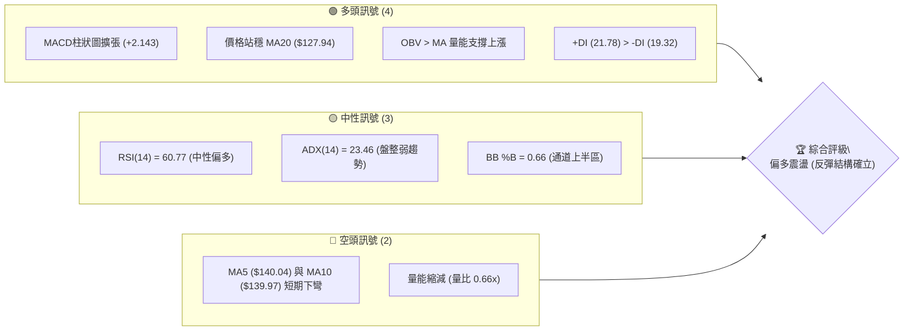

### 📊 核心指標速覽表

| 指標類別 | 指標名稱 | 當前數值 | 訊號 | 解讀 |
|:---|:---|:---|:---:|:---|
| **價格** | 當前收盤價 | $136.97 | 🟡 | 處於 52 週高低點之 26.6% 分位，低檔反彈中 |
| **均線** | MA5 / MA10 | $140.04 / $139.97 | 🔴 | 短線微幅下彎（-2.19% / -2.14%），面臨短壓 |
| **均線** | MA20 | $127.94 | 🟢 | 價格位於 MA20 上方 (+7.06%)，中期支撐強勁 |
| **均線** | MA50 / MA200 | N/A | ⚪ | 數據中未偵測到（資料長度不足，不予估算） |
| **動能** | RSI(14) | 60.77 | 🟢 | 位於 50-70 強勢中性區，無頂底背離跡象 |
| **動能** | MACD (12,26,9) | 1.514 / Signal -0.629 | 🟢 | DIF 線位於 Signal 上方，Histogram (+2.143) 看多 |
| **趨勢強度**| ADX (14) | 23.46 (+DI: 21.78) | 🟡 | ADX < 25 屬震盪盤整行情，多方動能略微佔優 |
| **通道指標**| 布林通道 (%B) | 0.66 (區間 $100.39-$155.50)| 🟢 | 價格運行於中軌（$127.94）與上軌間，多頭通道 |
| **量能** | 20日成交量比 | 0.66x (78.55M / 118.72M) | 🟡 | 突破後量縮整理，OBV 保持多頭排列 |
| **波動** | ATR(14) | $10.80 (7.88%) | 🟡 | 日內波動適中，提供明確止損緩衝區間 |

### 🏆 技術評分卡

```
╔══════════════════════════════════════════════════════════════════╗
║              SPCX 技術評分卡 (2026-08-24)                        ║
╠══════════════════════════════════════════════════════════════════╣
║ 趨勢強度 (Trend)       ██████████░░░░░░░░░░  52/100 🟡 中性震盪 ║
║ 動能指標 (Momentum)    ██████████████░░░░░░  70/100 🟢 偏多轉強 ║
║ 支撐穩定度 (Support)   ██████████████░░░░░░  72/100 🟢 底部穩固 ║
║ 成交量配合 (Volume)    ██████████░░░░░░░░░░  54/100 🟡 量縮整理 ║
║ 形態完整度 (Pattern)   ████████████░░░░░░░░  62/100 🟢 底部完成 ║
║ 均線排列 (Moving Avg)  ████████████░░░░░░░░  60/100 🟢 短均金叉 ║
╠══════════════════════════════════════════════════════════════════╣
║ 綜合評分               ████████████░░░░░░░░  62/100 🟢 偏多操作 ║
║ 技術結論               短底成形，回踩 MA20 支撐偏多操作          ║
╚══════════════════════════════════════════════════════════════════╝
```

---

## 2. 趨勢分析

### 🌐 多時框趨勢分析

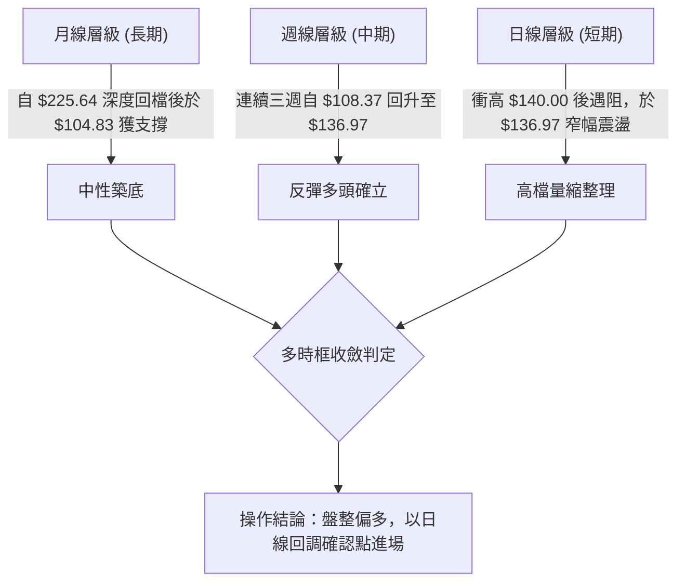

### 📈 長期趨勢 — 12個月走勢圖（Unicode）

```
SPCX 月線走勢結構圖（2025-2026）
價格 ($)
$225.64 ┤                           ● (52W High)
$200.00 ┤                          / \
$175.00 ┤          ●              /   \      ● (2026-06: $170.86)
$150.00 ┤         / \            /     \    / \
$136.97 ┤────────/───\──────────/───────\──/───●← [現價 $136.97]
$125.00 ┤       /     \        /         \/
$104.83 ┤      ●       \      /           ● (2026-08: 52W Low $104.83)
$100.00 ┤               ●────● 
        └────────────────────────────────────────────────────────
         歷史波段  歷史回調  主升浪   頂部回撤  探底築底  現階段
```

#### 走勢特徵分析表格

| 階段 | 時間區間 | 價格區間 | 漲跌幅 | 走勢特徵與量價結構 |
|:---|:---|:---:|:---:|:---|
| **頂部回撤** | 2026-06 峰值 | $225.64 → $170.86 | -24.28% | 跌破高檔支撐，形成下行趨勢 |
| **加速趕底** | 2026-07 ~ 2026-08 | $170.86 → $104.83 | -38.65% | 跌勢凌厲，觸及 52 週最低點 $104.83 |
| **強勁反彈** | 2026-08-02 ~ 08-16 | $108.37 → $140.00 | +29.19% | 連續放量陽線反彈，突破 MA20 關鍵壓力 |
| **收斂整理** | 2026-08-16 ~ 08-24 | $140.00 → $136.97 | -2.16% | 短線遇阻斐波那契 61.8%（$150.98）前哨量縮蓄勢 |

### 📊 中期趨勢（週線分析）

```
SPCX 週線波段架構示意圖
$185.00 ┤                    ● (06-21 高點: $185.00)
$172.40 ┤═══════════════════════ [波段高點阻力聚類 R1: $172.40] ════════
$160.00 ┤        ●          / \
$140.00 ┤         \        /   \           ● (08-16: $140.00)
$136.97 ┤──────────\──────/─────\─────────/───● [現價: $136.97]
$120.00 ┤           \    /       \       /
$104.83 ┤════════════●──●═════════●─────● [波段低點支撐聚類 S1: $104.83]
        └──────────────────────────────────────────────────────────
         06-14  06-28   07-12   07-26  08-02  08-09  08-16  08-23
```

- **週線動能逆轉**：週線 MACD 柱狀圖自 7 月底的 `-2.684`、`-0.988` 快速翻正至 `+2.330`、`+4.591`，本週收收於 `+2.143`，確認中期底背離後的動能釋放。
- **週線量能驗證**：在 2026-08-09 築底反彈當週，週成交量放大至 920,449,800 股，顯著高於回落期的平均量（約 3.1 億至 4.2 億股），呈現標準的「量增價揚」多頭換手特徵。

### ⚡ 趨勢強度評估（ADX 解讀）

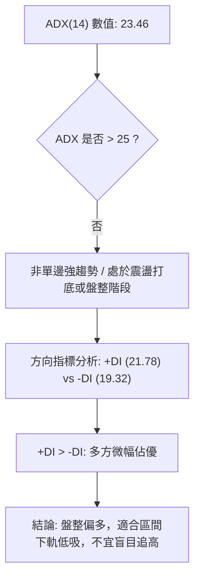

| 指標名稱 | 數值 | 門檻判定 | 趨勢強弱解讀 |
|:---|:---:|:---:|:---|
| **ADX (14)** | 23.46 | < 25 (弱趨勢/盤整) | 趨勢動能尚未完全爆發，處於築底完成後的區間震盪整理期 |
| **+DI (14)** | 21.78 | > -DI | 多頭買盤主導短線方向 |
| **-DI (14)** | 19.32 | < +DI | 空頭拋壓已大幅衰退 |

---

## 3. 圖表形態分析

### 🔍 形態識別系統

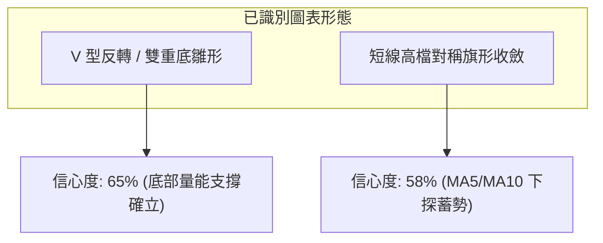

#### 形態評估與信心度對照表

| 形態名稱 | 信心度 | 判斷依據（引用數據） | 完成度 | 目標價（附計算式） |
|:---|:---:|:---|:---:|:---|
| **V型反轉 (底部突破)** | 65% | 價格於 52W 低點 $104.83 獲支撐，隨後放量反彈站上 MA20（$127.94） | 75% | 突破頸線 MA20 後等幅測量：$127.94 + ($127.94 - $104.83) = **$151.05**（精確對應斐波那契 61.8% 的 $150.98） |
| **短線收斂三角/旗形** | 58% | 8/16 觸及 $140.00 後連續小幅回調至 $136.97，MA5/10 黏合 | 50% | 旗桿高點 $140.00 - 旗底 $130.68 (Fib 78.6%)；突破 $140 後目標為 $140 + $9.32 = **$149.32** |

### 🕯️ 重要K線形態分析

| 統計週/週期 | 收盤價 | 核心 K 線形態 | 解讀與量能驗證 | 訊號強度 |
|:---|:---:|:---|:---|:---:|
| **2026-08-02** | $108.37 | 低檔長下影十字星 | 探底 52W 低點 $104.83 後獲強勁承接盤，空頭動能耗盡 | 🟢 強烈買訊 |
| **2026-08-09** | $133.11 | 巨量長紅大陽線 | 週量放大至 920.4M 股，強勢吞沒前兩週陰線，確立反彈 | 🟢 多頭確認 |
| **2026-08-16** | $140.00 | 高檔小陽線 (上影線) | 觸及 $140 整數關卡，週量 663M 股，短線多頭遇阻 | 🟡 短線受阻 |
| **2026-08-23** | $136.97 | 窄幅整理小陰線 | 量縮至 475.8M 股，健康回踩 MA20 上方，屬於蓄勢整理 | 🟡 中性蓄勢 |

### 📉 ASCII 走勢形態示意圖

```
SPCX 日線 / 週線短底與形態結構
$150.98 ┤                                       [目標區間: Fib 61.8% $150.98]
$140.00 ┤                         ● (波段高點)
$136.97 ┤──────────────────────────\──●← [現價 $136.97]
$130.68 ┤                           \   [Fib 78.6% 回調支撐]
$127.94 ┤                     ●──────●  [頸線位置 / MA20 支撐]
$115.00 ┤           ●        /
$104.83 ┤════════════●──────●═════════════════ [雙底/V底最低點 S1]
        └──────────────────────────────────────────────
         07-26     08-02   08-09   08-16   08-24
```

### 🎯 形態目標價計算

1. **V 底等幅測量目標**：
   - 底部最低點：$104.83
   - 頸線關鍵位（MA20 中軌）：$127.94
   - 形態高度 $H = \$127.94 - \$104.83 = \$23.11$
   - 形態理論目標價 $T_1 = \$127.94 + \$23.11 = \mathbf{\$151.05}$（高度共振斐波那契 61.8% 阻力位 **$150.98**）。
2. **波段延伸阻力目標**：
   - 近一年波段高點聚類阻力位：**$172.40**。

---

## 4. 支撐與阻力

### 🗺️ 關鍵價位分布圖（Unicode）

```
SPCX 價位結構分布圖
══════════════════════════════════════════════════════════════════
$225.64 ║██████████████████████████████║ 52W 最高點 (Fib 0.0%)
$197.13 ║██████████████████████        ║ 斐波那契 23.6% 回調位
$179.49 ║████████████████████          ║ 斐波那契 38.2% 回調位
$172.40 ║██████████████████████████████║ 關鍵阻力 R1 (近一年波段高點聚類)
$165.24 ║████████████████              ║ 斐波那契 50.0% 中樞平衡位
$155.50 ║██████████████                ║ 布林通道上軌
$150.98 ║██████████████████            ║ 斐波那契 61.8% 強阻力 / 形態目標
$136.97 ╠══════════════════════════════╣ ◄ 現價 ($136.97)
$130.68 ║▓▓▓▓▓▓▓▓▓▓▓▓▓▓▓▓▓▓            ║ 斐波那契 78.6% 回調支撐
$127.94 ║▓▓▓▓▓▓▓▓▓▓▓▓▓▓▓▓▓▓▓▓▓▓▓▓        ║ MA20 均線 / 布林中軌支撐
$104.83 ║██████████████████████████████║ 52W 最低點 / 關鍵支撐 S1 (Fib 100.0%)
$100.39 ║████████████                  ║ 布林通道下軌極限支撐
══════════════════════════════════════════════════════════════════
```

### 🚧 阻力位分析表

| 阻力級別 | 價位 | 形成原因 | 突破難度 | 重要性 |
|:---|:---:|:---|:---:|:---:|
| **短線阻力 (R0)** | **$150.98** | 斐波那契 61.8% 回調位，鄰近布林上軌（$155.50）與形態目標 | 中等 🟡 | ★★★☆☆ |
| **波段關鍵阻力 (R1)** | **$172.40** | 近一年波段高點聚類（數據計算），前期頭部重壓區 | 極高 🔴 | ★★★★★ |
| **中期強阻力 (R2)** | **$179.49** | 斐波那契 38.2% 回調位 | 偏高 🔴 | ★★★★☆ |
| **歷史極值阻力 (R3)** | **$225.64** | 52 週最高點 (Fib 0.0%) | 極高 🔴 | ★★★★★ |

### 🛡️ 支撐位分析表

| 支撐級別 | 價位 | 形成原因 | 守住機率 | 重要性 |
|:---|:---:|:---|:---:|:---:|
| **近期第一支撐 (S0)** | **$130.68** | 斐波那契 78.6% 回調位，短線拉回第一防守點 | 70% 🟢 | ★★★★☆ |
| **核心均線支撐 (S_MA)**| **$127.94** | 20日移動平均線 (MA20) 與布林通道中軌重合處 | 80% 🟢 | ★★★★★ |
| **波段強支撐 (S1)** | **$104.83** | 52 週歷史最低點 (Fib 100.0%)，近一年波段低點聚類 | 90% 🟢 | ★★★★★ |
| **通道極限支撐 (S_BB)**| **$100.39** | 布林通道下軌動態支撐 | 95% 🟢 | ★★★☆☆ |

### 📐 斐波那契回調位分析

*基準波段：52週區間 $104.83 (100.0%) → $225.64 (0.0%)*

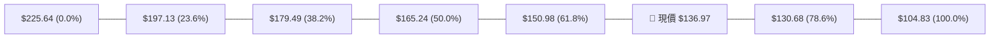

- **位置解讀**：現價 **$136.97** 目前精確運行於 **78.6% 回調位（$130.68）** 與 **61.8% 回調位（$150.98）** 之間。
- **技術含義**：股價已脫離深跌區（100.0% - 78.6%），成功站上 $130.68 確立了自低點反彈的有效性。上方第一道重大黃金分割壓力位於 **$150.98**（61.8%），此位置若能放量收復，行情將進一步向 50.0% 平衡位 **$165.24** 與 R1 **$172.40** 推進。

---

## 5. 技術指標深度解讀

### 🎛️ 指標訊號總覽

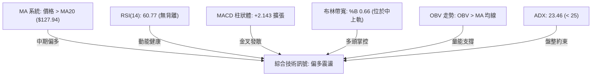

### 📈 移動平均線排列分析

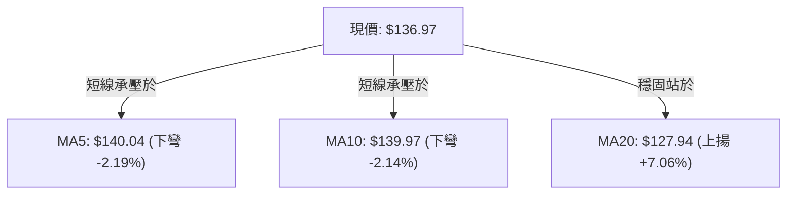

| 均線名稱 | 當前數值 | 價格相距 | 排列特徵 | 訊號解讀 |
|:---|:---:|:---:|:---|:---:|
| **MA5** | $140.04 | -2.19% | 短期高檔拐頭向下 | 短線受阻，需回踩消化短線浮額 |
| **MA10** | $139.97 | -2.14% | 走平微幅下彎 | 與 MA5 黏合，形成短線壓力密集區 |
| **MA20** | $127.94 | +7.06% | 明顯斜率向上發散 | 中期多頭防守底線，回調關鍵支撐 |
| **MA60 / 120 / 240** | N/A | N/A | 數據中未偵測到 | 資料不足，不予估算 |

### 📉 RSI(14) 分析

```
RSI(14) 當前數值：60.77
0                    30                   50        60.77       70                  100
├────────────────────┼────────────────────┼───────────█─────────┼────────────────────┤
[     極度超賣區     ]     [   弱勢區   ]     [    強勢區   ]      [    極度超買區     ]
進度條：██████████████████████████████████████████████████████░░░░░░░░░░░░ 60.8%
```

- **背離檢驗**：
  - 價格自 8/02 收盤 $108.37 回升至 8/23 $136.97，RSI 自 19.2 回升至 60.77。
  - 結論：**無頂背離、無底背離**。RSI 與價格走勢完全同步，顯示買盤動能健康，尚未進入 >70 的過熱超買區。

### 📊 MACD(12/26/9) 訊號解讀

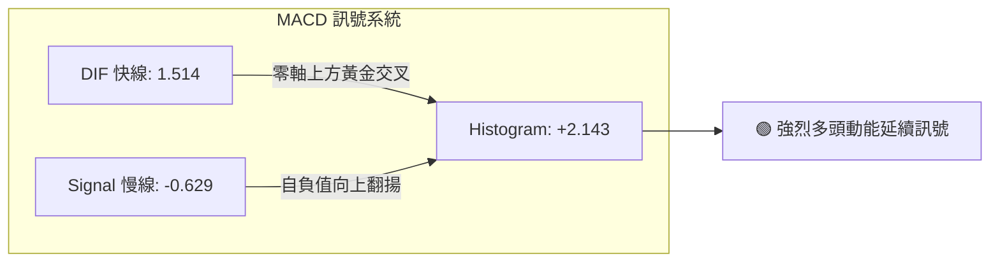

- **MACD 解讀**：快線 DIF（1.514）由下向上穿越零軸並大幅拉開與慢線 Signal（-0.629）的距離，柱狀圖達到 `+2.143`。雖然本週較上週的 `+4.591` 有所收斂，但依舊維持強勁正值，中期動能依舊掌控在多方手中。

### 📦 布林通道分析

```
SPCX 布林通道 (BB 20, 2) 結構圖
$155.50 ┤────────────────────────────────────────── 上軌 (壓力區)
        │                       ● (上週高點 $140.00)
$136.97 ┤───────────────────────●────────────────── 現價 (%B = 0.66)
$127.94 ┤────────────────────────────────────────── 中軌 (MA20 核心支撐)
        │
$100.39 ┤────────────────────────────────────────── 下軌 (極限支撐)
        └──────────────────────────────────────────
```

- **通道帶寬與位置**：上軌 $155.50，中軌 $127.94，下軌 $100.39。
- **%B 指標值為 0.66**，明確顯示價格處於中軌至上軌的強勢多頭通道中運行。中軌 $127.94 呈現上翹態勢，將對回落提供實質動態支撐。

### 💹 成交量分析（量價配合度）

- **量能結構**：最新日成交量為 78,553,200 股，相較於 20 日均量 118,723,505 股，量比為 **0.66x**。
- **OBV 能量潮解讀**：數據顯示 `OBV > MA`，能量潮指標領先走高，表明在 $108 - $133 的反彈過程中主力資金淨流入明顯；近期自 $140 拉回至 $136.97 呈現良性縮量，無恐慌盤湧出。

---

## 6. 動能與波動率

### ⚡ 動能評估四象限

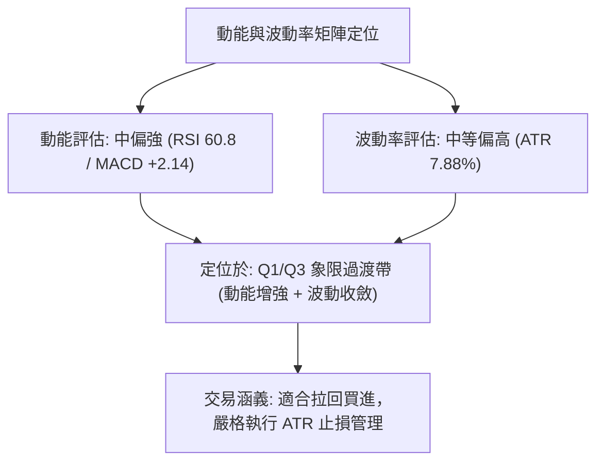

| 象限 | 動能強度 | 波動率水準 | SPCX 狀態 | 交易策略導向 |
|:---:|:---:|:---:|:---:|:---|
| **Q1** | 強 | 低 | — | 最優加碼區間 |
| **Q2** | 弱 | 低 | — | 觀望等待突破 |
| **Q3** | 強 | 高 (ATR 7.88%) | **✓ (主要特徵)** | **波段反彈機會，適合拉回低吸，設定合理停損** |
| **Q4** | 弱 | 高 | — | 避免進場，下行風險大 |

### 📊 ATR 波動率分析

- **ATR(14) 絕對值**：**$10.80**
- **ATR 佔股價比例**：**7.88%**（屬於高科技/航太成長股典型波動區間）
- **止損距離建議**：
  - 短線交易（1.0x ATR）：緩衝空間為 **$10.80**，止損點應設於現價下方 $136.97 - $10.80 = **$126.17**（剛好保護在 MA20 $127.94 之下）。
  - 波段交易（1.5x ATR）：緩衝空間為 **$16.20**，止損點設於 $136.97 - $16.20 = **$120.77**。

### 📐 Beta 與市場相關性

- 數據中標註 Beta 為 `N/A`。
- **產業特性解讀**：作為太空航太與衛星通訊龍頭，該標的兼具工業與高科技成長屬性，歷史波動度高於標普 500 指數。近期其走勢主要由自身基本面（營收 YoY +91.9%、Starlink 佈局）與底部技術修復主導，呈現獨立於大盤的修復行情。

---

## 7. 多時框架總結

### 📋 時框架評分表

| 時框架 | 趨勢方向 | 動能狀態 | 均線排列 | 形態結構 | 綜合評分 | 交易建議 |
|:---|:---:|:---:|:---:|:---:|:---:|:---|
| **短期 (日線)** | 🟡 震盪整理 | 🟡 RSI 60.8 / 量縮 | 🟡 承壓 MA5/10 | 旗形收斂整理 | **60/100** | 等待回踩支撐確認 |
| **中期 (週線)** | 🟢 多頭反彈 | 🟢 MACD金叉擴張 | 🟢 站上 MA20 | 雙底/V底突破 | **68/100** | 逢低偏多佈局波段 |
| **長期 (月線)** | 🟡 築底修復 | 🟡 低檔出量回升 | ⚪ 長均線缺失 | 大區間低檔反彈 | **58/100** | 長線分批建倉 |

### 🔲 綜合訊號矩陣

```
┌─────────────────┬──────────┬──────────┬──────────┐
│   維度 / 週期   │   短期   │   中期   │   長期   │
├─────────────────┼──────────┼──────────┼──────────┤
│ 趨勢方向        │  🟡 盤整 │  🟢 多頭 │  🟡 築底 │
│ 動能強度        │  🟡 中性 │  🟢 強勁 │  🟡 中性 │
│ 量價配合        │  🟡 量縮 │  🟢 量增 │  🟢 放量 │
│ 關鍵支撐守護    │  🟢 完好 │  🟢 完好 │  🟢 穩固 │
└─────────────────┴──────────┴──────────┴──────────┘
```

### ⚖️ 多時框收斂結論

依據多時框收斂規則：
1. **趨勢/盤整性質判定**：ADX(14) 為 **23.46 (< 25)**，明確定義當前為**盤整/震盪反彈行情**，而非單邊超級強趨勢。
2. **主導交易區間**：以日線布林通道（$100.39 - $155.50）與斐波那契回調區間（$130.68 - $150.98）為主導操作邊界。
3. **方向收斂唯一結論**：**【偏多震盪】**。日線級別的短線量縮拉回（MA5/10微彎）並未破壞週線級別站穩 MA20（$127.94）的多頭結構，日線回調正是尋找中期多頭進場點的契機。

---

## 8. 交易策略建議

### 🗺️ 策略決策流程圖

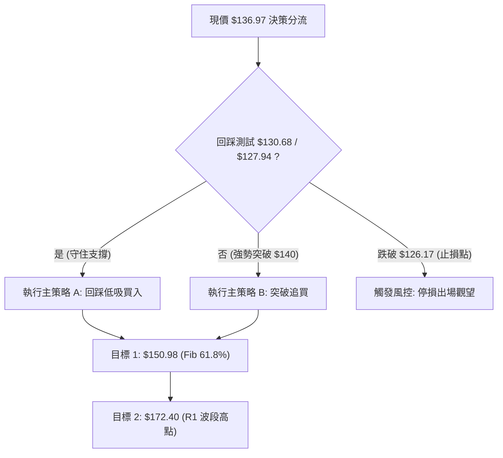

### 🧭 策略路由

> **當前主策略方向 = 【多頭震盪逢低佈局】（依技術評分 62/100）**

### 🎯 價格情境階梯（Price Scenarios）

| 觸發條件 | 下一目標 | 後續延伸 | 情境含義與技術應對 |
|:---|:---:|:---:|:---|
| **放量突破 $140.00** | **$150.98** (Fib 61.8%) | **$172.40** (R1) | 短線強勢重啟，直接向上挑戰第一阻力與形態目標 |
| **維持 $130.68 - $140.00 震盪** | **$136.97** (現價中樞) | — | 區間沉澱蓄勢，持續於布林通道中上軌消化浮額 |
| **跌破 MA20 $127.94** | **$104.83** (S1) | **$100.39** (BB下軌) | 中期反彈失敗，下探測試 52 週雙底支撐 |

### 📊 情境機率分佈

| 情境 | 機率 | 主要依據 |
|:---|:---:|:---|
| **繼續上行 / 反彈突破** | **55%** | MACD維持正向擴張（+2.143）、OBV維持多頭排列、週線放量反彈結構完整 |
| **區間震盪蓄勢** | **30%** | ADX 處於 23.46 盤整區間、短期 MA5/MA10 下彎壓制、量比 0.66x 量縮 |
| **回落跌破再探底** | **15%** | 若失守 MA20（$127.94）可能引發停損賣壓測試 S1（$104.83） |

### 🟢 主策略詳情

| 策略要素 | 策略 A（穩健型：支撐位低吸） | 策略 B（激進型：動能突破買入） |
|:---|:---:|:---:|
| **進場條件** | 回踩斐波那契 78.6% 或 MA20 獲支撐 | 放量突破並收穩於近期高點 $140.00 之上 |
| **進場價格** | **$130.68**（區間 $128.50 - $130.68） | **$140.50** |
| **目標價 T1** | **$150.98**（Fib 61.8% / 形態目標，+15.5%） | **$150.98**（Fib 61.8%，+7.5%） |
| **目標價 T2** | **$172.40**（波段阻力 R1，+31.9%） | **$172.40**（波段阻力 R1，+22.7%） |
| **止損價格** | **$126.17**（跌破 MA20 暨 1.0x ATR，-3.4%） | **$135.00**（回跌至突破點下方，-3.9%） |
| **風險報酬比 (R:R)**| **1 : 4.51** (以 T1 計算) / **1 : 9.28** (T2) | **1 : 1.90** (以 T1 計算) / **1 : 5.80** (T2) |
| **預估勝率** | **65%** | **55%** |
| **建議倉位** | **15% - 20%** | **10%** |

### 🔴 反向風險觸發點（對沖提示）

- **警示價位 1（短線轉弱）**：收盤價跌破斐波那契 78.6% **$130.68**，表明短線買盤轉弱，應暫停加碼。
- **警示價位 2（多頭防線失守）**：有效跌破 MA20 **$127.94** 及止損位 **$126.17**，多頭形態遭到破壞，應全面停損出場並考慮透過衍生品進行空頭對沖，下看 S1 **$104.83**。

### ⭐ 整體訊號強度評星

```
做多訊號強度：★★★★☆  (4/5星 - 中期底部確立，多頭動能擴張)
做空訊號強度：★☆☆☆☆  (1/5星 - 空頭動能衰退，僅存短線壓制)
整體技術可信度：★★★★☆  (4/5星 - 價量配合良好，關鍵價位共振)
```

---

## 9. 風險提示與監控

### ✅ 關鍵監控指標 Checklist

```
╔══════════════════════════════════════════════════════════════════╗
║                每日技術面監控 Checklist                          ║
╠══════════════════════════════════════════════════════════════════╣
║ [ ] 價格是否維持在 MA20 ($127.94) 之上運行                       ║
║ [ ] RSI(14) 是否持續保持在 50 中軸之上 (目前 60.77)             ║
║ [ ] MACD Histogram 是否持續維持正值 (目前 +2.143)                ║
║ [ ] 日成交量是否回升至 20 日均量 (118.72M) 之上 (確認突破動能)  ║
║ [ ] 向上是否突破並站穩斐波那契 61.8% ($150.98)                   ║
║ [ ] 向下是否跌破止損關鍵位 $126.17                               ║
╚══════════════════════════════════════════════════════════════════╝
```

### ⚠️ 風險場景分析

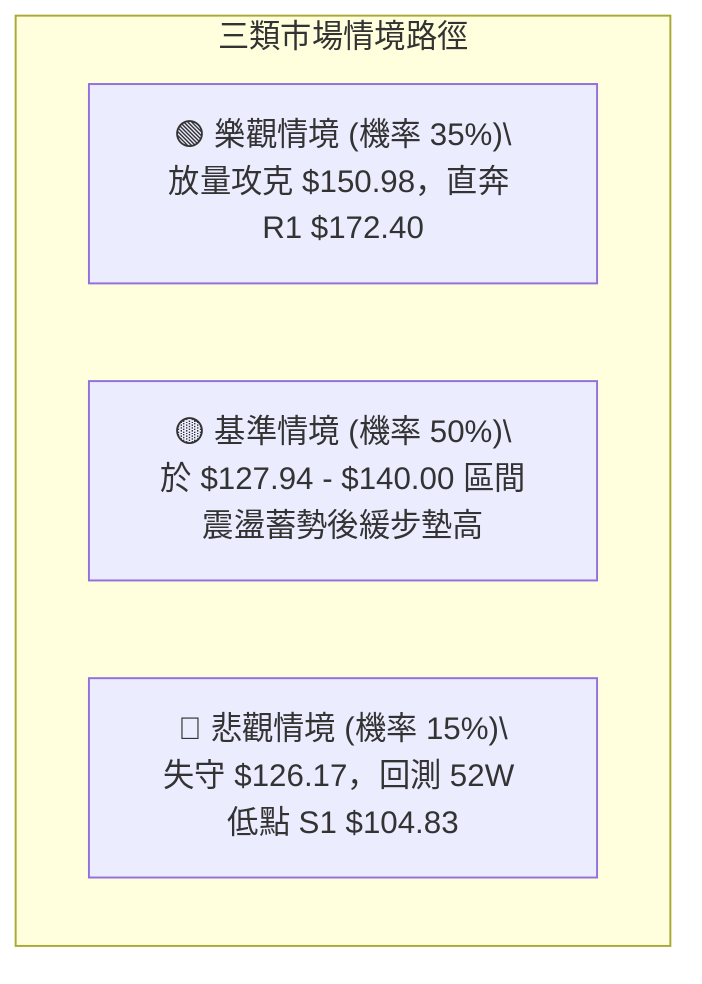

### 🛡️ 風險管理重要提醒

1. **波動率控制**：SPCX 日 ATR 高達 $10.80（7.88%），單日價格震幅大，嚴禁重倉單筆押注，單一標的風險暴露不得超過總資產的 20%。
2. **量能陷阱防範**：若股價上攻 $140.00 - $150.98 區間時日成交量未能放大超過 20 日均量（1.18 億股），警惕形成假突破，應適度獲利了結部分倉位。

---

## 📋 報告總結

```
╔══════════════════════════════════════════════════════════════════╗
║                  SPCX 技術分析報告總結                           ║
╠══════════════════════════════════════════════════════════════════╣
║ 報告日期：2026-08-24           當前價格：$136.97                 ║
║ 技術評級：🟢 偏多震盪 (評分: 62/100) — 底部確立，逢低布局       ║
╠══════════════════════════════════════════════════════════════════╣
║ 關鍵結論：                                                       ║
║ ├─ 長期趨勢：🟡 自 $225.64 深度回調後於 $104.83 獲支撐構築底部   ║
║ ├─ 中期趨勢：🟢 站穩 MA20 ($127.94)，MACD (+2.143) 金叉看多      ║
║ ├─ 短期趨勢：🟡 受制於 MA5/10 ($140.00)，進行健康量縮旗形整理    ║
║ ├─ 關鍵支撐：$130.68 (Fib 78.6%) / $127.94 (MA20) / $104.83 (S1)║
║ ├─ 關鍵阻力：$150.98 (Fib 61.8%) / $172.40 (R1 波段高點)        ║
║ └─ 分析師共識目標：$216.33 (18位分析師評級為 Buy)               ║
╠══════════════════════════════════════════════════════════════════╣
║ 最優策略組合：                                                   ║
║ 1. 🥇 最佳機會：回踩 $130.68 / MA20 支撐買進 (策略 A，R:R = 1:4.5)║
║ 2. 🥈 次選機會：放量突破 $140.00 追買，目標 $150.98 / $172.40    ║
║ 3. 🥉 嚴格止損：收盤跌破 $126.17 (MA20 下方 1.0x ATR) 果斷離場   ║
╚══════════════════════════════════════════════════════════════════╝
```

---

> ⚠️ **免責聲明**：本報告為 AI 自動生成之技術分析，所有數據及估算均基於提供的歷史價格資訊。本報告**僅供研究與學術參考**，**不構成任何投資建議**。投資有風險，入市需謹慎。

---

*報告生成時間：2026-08-24 ｜ 數據來源：Yahoo Finance ｜ 分析框架：多時框技術分析*