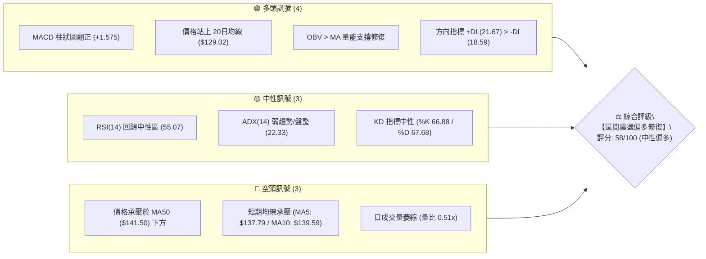
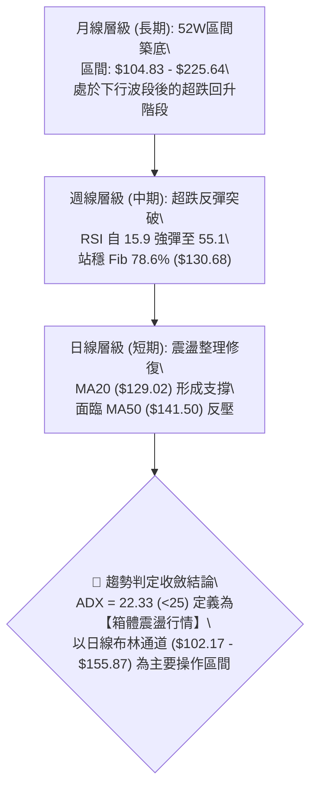
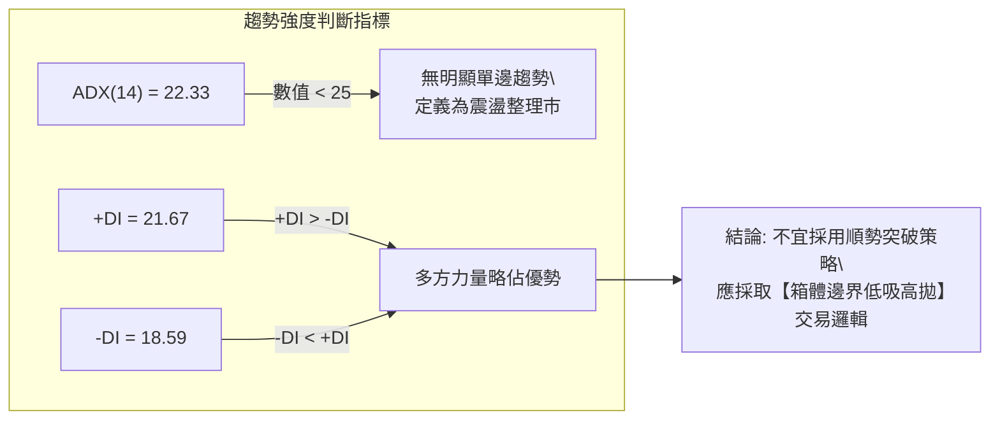
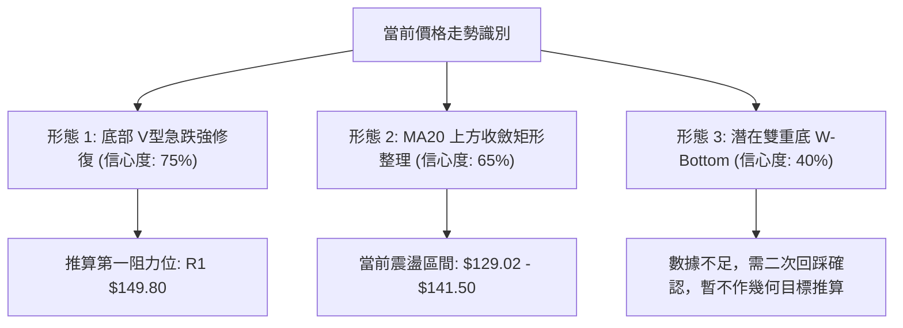
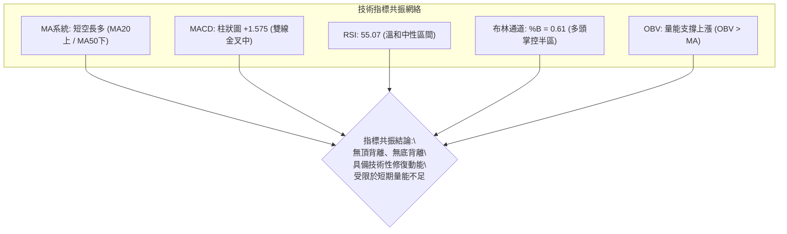
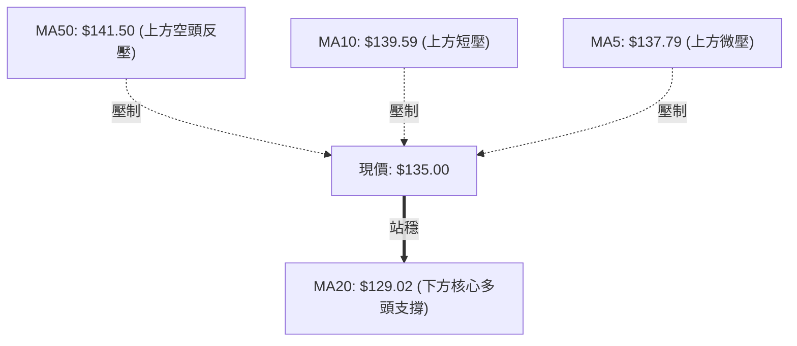
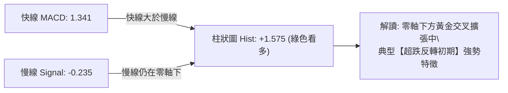
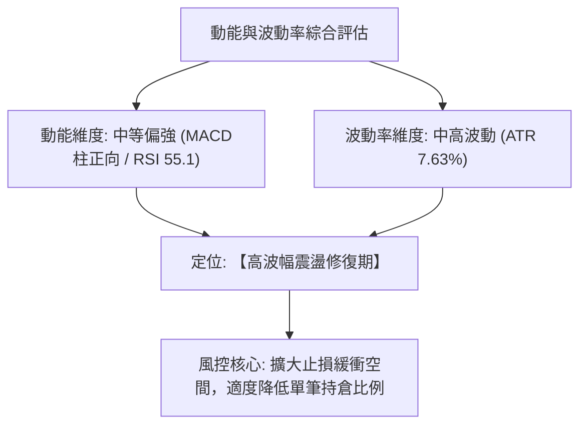
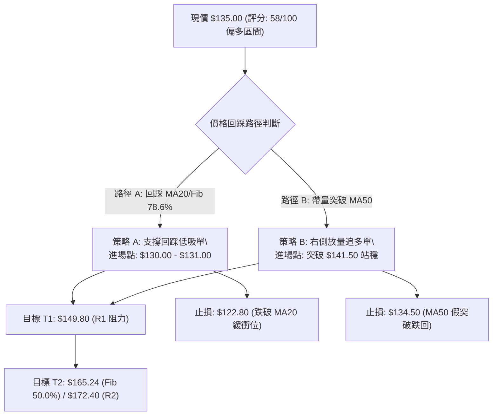
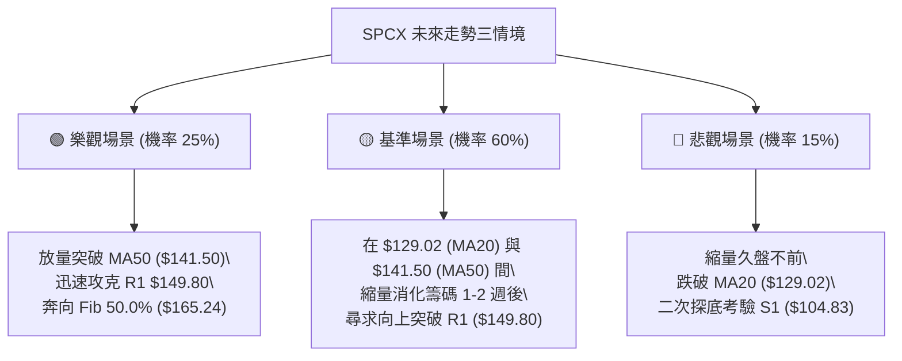

# SPCX 技術分析報告

> **報告日期**：2026-08-25 ｜ **語言**：繁體中文 ｜ **數據來源**：Yahoo Finance ｜ **當前價格**：$135.00

---

## 目錄

| 章節 | 內容 |
|------|------|
| [1. 技術面概覽](#1-技術面概覽) | 訊號儀表板、核心指標、評分卡 |
| [2. 趨勢分析](#2-趨勢分析) | 多時框趨勢、長中短期走勢 |
| [3. 圖表形態分析](#3-圖表形態分析) | 形態識別、K線組合、目標價 |
| [4. 支撐與阻力](#4-支撐與阻力) | 關鍵價位、斐波那契回調 |
| [5. 技術指標深度解讀](#5-技術指標深度解讀) | MA/RSI/MACD/布林/成交量 |
| [6. 動能與波動率](#6-動能與波動率) | 動能評估、ATR、Beta |
| [7. 多時框架總結](#7-多時框架總結) | 時框架評分矩陣 |
| [8. 交易策略建議](#8-交易策略建議) | 多空策略、風險報酬比 |
| [9. 風險提示與監控](#9-風險提示與監控) | 監控指標、風險場景 |
| [10. 報告總結](#10-報告總結) | 核心結論與策略總覽 |

---

## 1. 技術面概覽

### 🎯 技術訊號儀表板



---

### 📊 核心指標速覽表

| 指標類別 | 指標名稱 | 當前數值 | 訊號 | 解讀 |
|:---|:---|:---|:---:|:---|
| **價格結構** | 現價 / 52W分位 | $135.00 (25.0%) | 🟡 | 脫離波段低點 $104.83，處於 52 週低位區修復期 |
| **短期均線** | MA5 / MA10 | $137.79 / $139.59 | 🔴 | 現價位於短期均線下方，短線面臨微幅回檔整理壓力 |
| **中期均線** | MA20 (布林中軌) | $129.02 | 🟢 | 現價高於 MA20 (+4.64%)，中期回升波段架構維持 |
| **中期趨勢** | MA50 | $141.50 | 🔴 | 尚未突破 MA50 壓力關卡，上方仍存在空頭反壓 |
| **長期均線** | MA200 | N/A | ⚪ | 數據不足，以 52W 高點 $225.64 與斐波那契位對照 |
| **動能震盪** | RSI(14) | 55.07 | 🟡 | 自 7 月超賣區 (15.9) 強勁回升至中性格局，無背離 |
| **趨勢動能** | MACD (12,26,9) | 柱狀圖 +1.575 | 🟢 | MACD (1.341) 位於訊號線 (-0.235) 上方，金叉擴張 |
| **趨勢強度** | ADX(14) | 22.33 | 🟡 | ADX < 25 表明處於盤整震盪市，趨勢動能尚未完全爆發 |
| **通道位置** | Bollinger Bands | %B = 0.61 | 🟢 | 位於中軌 ($129.02) 與上軌 ($155.87) 間的多頭進攻區 |
| **波動幅度** | ATR(14) | $10.30 (7.63%) | 🟡 | 每日平均波幅高達 7.63%，進場需嚴格控制部位與止損 |
| **量能狀態** | 20日均量比 | 0.51x | 🔴 | 量能收縮至 59.9M，呈現縮量整理，待放量突破確認 |

---

### 🏆 技術評分卡

```
╔══════════════════════════════════════════════════════════════════╗
║              SPCX 技術面綜合評分儀表板 (2026-08-25)               ║
╠══════════════════════════════════════════════════════════════════╣
║ 趨勢強度 (Trend)     ████████░░░░░░░░░░░░  45/100 🟡 (弱趨勢盤整)║
║ 動能指標 (Momentum)  ██████████████░░░░░░  68/100 🟢 (MACD強金叉)║
║ 支撐穩定 (Support)   ████████████░░░░░░░░  60/100 🟢 (守穩Fib78.6)║
║ 成交量能 (Volume)    ████████░░░░░░░░░░░░  42/100 🔴 (量能萎縮0.51)║
║ 形態結構 (Pattern)   ████████████░░░░░░░░  62/100 🟢 (底部V型修復)║
║ 均線排列 (MA System) ████████████░░░░░░░░  58/100 🟡 (站穩MA20承壓50)║
╠══════════════════════════════════════════════════════════════════╣
║ 綜合技術評分         ███████████░░░░░░░░░  58/100 ⚖️ 【區間偏多】║
╚══════════════════════════════════════════════════════════════════╝
```

---

## 2. 趨勢分析

### 🌐 多時框趨勢分析



---

### 📈 長期趨勢 — 近期歷史走勢圖（ASCII）

```
SPCX 週/月度走勢結構圖（價格與關鍵高低點）
價格軸 ($)
$225.64 ┼                                      ● (52W High)
$200.00 ┤                                    ╭─╯
$185.00 ┤              ● (06-21 高點)       ╭╯
$172.40 ┤              │                   │    ═══ R2 關鍵阻力
$160.00 ┤      ●───────╯╰─● (07-05)        │
$149.80 ┤                 │              ╭─╯    ═══ R1 波段阻力
$140.00 ┤                 │         ●────╯ (08-16)
$135.00 ┤                 │         │←───【現價 $135.00】
$129.02 ┤                 │     ╭───╯          ═══ MA20 中軌支撐
$115.00 ┤                 ╰─●───╯ (07-26 RSI=15.9)
$104.83 ┴───────────────────● (52W Low: 08-02 底)
        └──────────────────────────────────────────────► 時間 (2026)
         06-14  06-21  07-12 07-26 08-02 08-09 08-16 08-30
```

#### 📊 走勢特徵分析表格

| 階段區間 | 價格變動區間 | 成交量特徵 (週) | RSI 區間 | 走勢本質與市場心理 |
|:---|:---:|:---:|:---:|:---|
| **第一階段：高檔滑落**<br>(06/21 - 07/05) | $185.00 → $153.23<br>(-17.17%) | 925.5M → 334.1M<br>(量能急縮) | 未計算 | 高檔爆量後多頭力竭，籌碼出現鬆動回吐。 |
| **第二階段：恐慌拋售**<br>(07/12 - 08/02) | $145.30 → $108.37<br>(-25.42%) | 426.8M → 315.1M<br>(連續量縮陰跌) | 29.1 → 15.9<br>(嚴重超賣) | 恐慌情緒釋放，空方主導跌至 52W 低點 $104.83 附近。 |
| **第三階段：強勁修復**<br>(08/02 - 08/16) | $108.37 → $140.00<br>(+29.19%) | 920.4M<br>(爆量搶反彈) | 19.2 → 63.3<br>(強勢修復) | 底部爆出近十億週巨量，V型反轉拉回 MA20 上方。 |
| **第四階段：收斂震盪**<br>(08/23 - 08/30) | $140.00 → $135.00<br>(-3.57%) | 476.1M → 59.9M<br>(縮量蓄勢) | 60.8 → 55.1<br>(回歸中性) | 遭遇 MA50 ($141.50) 反壓，於 $135.00 展開良性消化。 |

---

### 📊 中期趨勢（週線分析）

中期技術架構呈現「超跌後的急劇修復與平臺整理」。
- **週線 MACD**：自 08-02 的 -0.988 快速飆升至 08-16 的 +4.591，當前維持在 +1.575，顯示中期多頭動能修復尚未結束。
- **週線支撐阻力結構**：
  - 核心阻力帶：R1 ($149.80) 與 Fib 61.8% ($150.98)。
  - 核心支撐帶：Fib 78.6% ($130.68) 與 MA20 ($129.02)。

---

### ⚡ 趨勢強度評估（ADX 解讀）



| ADX 數值區間 | 趨勢狀態定義 | 當前 SPCX 狀態 | 交易應對策略 |
|:---:|:---:|:---:|:---|
| **0 – 20** | 極弱趨勢 / 盤整 | ── | 嚴禁趨勢追單，嚴格做窄幅區間震盪 |
| **20 – 25** | **弱趨勢 / 箱體過渡** | **✓ (22.33)** | **以布林通道與斐波那契關鍵位進行高拋低吸** |
| **25 – 50** | 強趨勢建立 | ── | 均線順勢單邊加碼 |
| **50 – 100** | 極端超強趨勢 | ── | 尋找反轉動能衰竭點 |

---

## 3. 圖表形態分析

### 🔍 形態識別系統



#### 形態識別信心度與目標價測算表

| 識別形態 | 信心度 | 判斷依據（嚴格引用數據） | 完成度 | 目標價測算方式與數值 |
|:---|:---:|:---|:---:|:---|
| **底部 V-Shape 反彈** | **75%** | 8/2 觸底 $108.37 後伴隨 9.2 億巨量急速拉升至 $140.00，RSI 由 15.9 飆升至 63.3。 | 85% | 依 Fib 61.8% 測算目標為 **$150.98**，與阻力 **R1 ($149.80)** 高度重疊。 |
| **短線矩形整理箱體** | **65%** | 近 3 週收盤分別為 $140.00、$136.97、$135.00，受制於 MA50 ($141.50)，支撐於 MA20 ($129.02)。 | 70% | 整理突破後測量等高目標：<br>箱頂 $141.50 + ($141.50 - $129.02) = **$153.98** (靠近 BB上軌 $155.87)。 |
| **潛在雙重底 (W-Bottom)** | **40%** | 目前僅形成單一波段低點（08-02 之 $108.37 及 52W 低點 $104.83），未出現第二次探底確認。 | 30% | *訊號不足，不予推估幾何目標，僅做均線指標型解讀。* |

---

### 🕯️ 重要K線形態分析

| 日期/月份 | 收盤價 | 走勢特徵 | 解讀與量能狀態 | 訊號方向 |
|:---|:---:|:---|:---|:---:|
| **2026-07-26** | $115.07 | 長黑下挫貫穿低點 | 恐慌加速趕底，週成交量 361.8M，RSI 破 20 進入極度超賣。 | 🔴 恐慌拋售 |
| **2026-08-02** | $108.37 | 探底長下影十字星線 | 觸及 52W 低點 $104.83 附近獲強力買盤承接，週量 315.1M。 | 🟡 空頭力竭 |
| **2026-08-09** | $133.11 | 爆量長紅突破大陽線 | 單週爆出 920.4M 巨量，MACD 柱狀圖翻正 (+2.330)，強勢反轉。 | 🟢 轉折確認 |
| **2026-08-16** | $140.00 | 衝高小陽線受阻於 MA50 | 上衝測試 $140 關卡，量能溫和萎縮至 663.1M，遭遇波段阻力。 | 🟡 多頭遇阻 |
| **2026-08-30** | $135.00 | 連續縮量十字星整理 | 日量萎縮至 59.9M，回踩確認 Fib 78.6% ($130.68) 與 MA20。 | 🟢 縮量良性回踩 |

---

### 📉 ASCII 形態走勢示意圖

```
SPCX 形態發展與目標測算圖解
─────────────────────────────────────────────────────────────────
$172.40 ┤                                            ═══ R2 (波段目標)
        │                                         ▲
$150.98 ┤                     ┌── Fib 61.8% ──────┼─ ═══ R1 $149.80 / 形態測算 $153.98
        │                     │                   │
$141.50 ┤             ●───────┴─ 箱體上沿 (MA50)──┼─ ─── 上方反壓
        │            ╱ ╲                          │
$135.00 ┤───────────┼───● ◄───【現價收斂區間】────╯
$129.02 ┤          ╱     ╲____ 箱體下沿 (MA20 / Fib 78.6% $130.68)
        │         ╱
$108.37 ┤        ● ◄── 8/2 爆量 V型轉折點 (9.2億股)
$104.83 ┴───────● ◄── 52W 極值低點支撐 S1
─────────────────────────────────────────────────────────────────
```

---

## 4. 支撐與阻力

### 🗺️ 關鍵價位分布圖（Unicode）

```
╔══════════════════════════════════════════════════════════════════╗
║                   SPCX 關鍵價位空間結構分佈                      ║
╠══════════════════════════════════════════════════════════════════╣
║ $225.64 ║██████████████████████████████║ 52W 歷史高點 (0.0% Fib)║
║ $197.13 ║████████████████████          ║ 斐波那契 23.6% 回調阻力 ║
║ $179.49 ║██████████████████████        ║ 斐波那契 38.2% 回調阻力 ║
║ $172.40 ║████████████████████████      ║ 關鍵阻力 R2 (波段高點) ║
║ $165.24 ║████████████████              ║ 斐波那契 50.0% 中軸阻力 ║
║ $155.87 ║██████████████                ║ 布林通道上軌 (BB Upper) ║
║ $150.98 ║████████████████████          ║ 斐波那契 61.8% 關鍵黃金位║
║ $149.80 ║████████████████████████      ║ 核心阻力 R1 (高點聚類)  ║
║ $141.50 ║██████████                    ║ 中期均線 MA50 反壓關卡 ║
║ $135.00 ╠══════════════════════════════╣ ◄─── 當前現價 ($135.00)  ║
║ $130.68 ║▓▓▓▓▓▓▓▓▓▓▓▓▓▓▓▓▓▓▓▓          ║ 斐波那契 78.6% 核心支撐 ║
║ $129.02 ║▓▓▓▓▓▓▓▓▓▓▓▓▓▓▓▓▓▓▓▓▓▓▓▓      ║ 布林中軌 / MA20 強力支撐║
║ $104.83 ║██████████████████████████████║ 52W 最低點 / 強支撐 S1 ║
║ $102.17 ║████████████████              ║ 布林通道下軌 (BB Lower) ║
╚══════════════════════════════════════════════════════════════════╝
```

---

### 🚧 阻力位分析表

> **嚴格紀律標注**：阻力數值完全引用自歷史計算與聚集點位。

| 阻力級別 | 精確價位 | 距現價幅幅 | 形成原因與籌碼結構 | 突破難度評估 | 策略意義 |
|:---|:---:|:---:|:---|:---:|:---|
| **動態阻力** | **$141.50** | +4.81% | **MA50 均線反壓**，近兩週反彈高點停滯區。 | 中等 🟡 | 突破此線確認日線走出收斂箱體。 |
| **阻力 R1** | **$149.80** | +10.96% | **近一年波段高點聚類**，與 Fib 61.8% ($150.98) 形成密集賣壓帶。 | 高 🔴 | 第一波波段波段多頭的主要止盈目標區。 |
| **通道上軌** | **$155.87** | +15.46% | **日線布林通道上軌**，極端波動延伸邊界。 | 高 🔴 | 盤整市（ADX<25）之統計超買上緣。 |
| **阻力 R2** | **$172.40** | +27.70% | **前期起跌平台波段高點聚類**（06月整理頸線位）。 | 極高 🔴 | 中期多空反轉的決定性樞軸位。 |

---

### 🛡️ 支撐位分析表

| 支撐級別 | 精確價位 | 距現價幅幅 | 形成原因與籌碼結構 | 守住機率評估 | 策略意義 |
|:---|:---:|:---:|:---|:---:|:---|
| **第一支撐** | **$130.68** | -3.20% | **斐波那契 78.6% 回調位**，回踩第一道黃金防線。 | 75% 🟢 | 回踩低吸策略的第一進場觀察點。 |
| **第二支撐** | **$129.02** | -4.43% | **MA20 均線 / 布林中軌**，多頭短期攻防生命線。 | 80% 🟢 | 嚴格多頭防守底線，跌破則回升結構破壞。 |
| **極端下軌** | **$102.17** | -24.32%| **日線布林通道下軌**，統計極端超跌支撐。 | 90% 🟢 | 僅在系統性崩跌風險時可能觸及。 |
| **強支撐 S1** | **$104.83** | -22.35%| **52週歷史波段最低點聚類**，長期底部基準。 | 95% 🟢 | 長期多頭最後防線，跌破將開啟未知空頭深淵。 |

---

### 📐 斐波那契回調位分析

依據 52 週完整區間 **$104.83 (100.0% Low) → $225.64 (0.0% High)** 計算：

```
斐波那契回調層級分析：
0.0%  ───────── $225.64  (52W High 極值高點)
23.6% ───────── $197.13  (深度多頭目標)
38.2% ───────── $179.49  (中期反彈多空分水嶺)
50.0% ───────── $165.24  (半數修復均衡位)
61.8% ───────── $150.98  (黃金分割阻力關卡 — 緊貼 R1 $149.80)
現價  ═════════ $135.00  ◄─── 位於 78.6% 與 61.8% 區間內
78.6% ───────── $130.68  (深幅回調支撐位 — 緊貼 MA20 $129.02)
100.0%───────── $104.83  (52W Low 歷史鐵底)
```

- **位置解讀**：現價 $135.00 處於 **78.6% ($130.68)** 與 **61.8% ($150.98)** 之間。
- **技術意涵**：價格成功從 100% 鐵底 $104.83 抽離並收復 78.6% 關卡，確認走出極端恐慌；目前正蓄勢挑戰 61.8% 黃金阻力位 $150.98。

---

## 5. 技術指標深度解讀

### 🎛️ 指標訊號總覽



---

### 📈 移動平均線排列分析



- **均線排列狀態**：混合排列（MA20 < 現價 $135.00 < MA5 < MA10 < MA50）。
- **解讀**：價格已扭轉 MA20 下行趨勢（MA20 向上傾斜 +4.64%），但短期 MA5 (-2.03%) 與 MA10 (-3.29%) 出現死叉壓制，顯示股價正在進行「突破 MA50 前的短期蓄勢震盪」。

---

### 📉 RSI(14) 震盪動能與背離檢測

- **當前讀數**：**55.07** 🟡
- **區間進度條**：
  ```
  超賣 (0)          中軸 (50)          超買 (100)
  ├───┼───────────────┼─────█─────────┼───┤
  0  30              50    55.1        70  100
  進度: [███████████░░░░░░░░░] 55.1%
  ```
- **背離分析判斷**：
  - **頂背離檢測**：現價在 $135.00 震盪，RSI 自 08-16 的 63.3 微落至 55.07，價格與指標同步回調，**無頂背離**現象。
  - **底背離檢測**：08-02 價格創低 $108.37 時 RSI 為 19.2，高於 07-26 價格 $115.07 時的 RSI 15.9，**呈現微幅隱性底背離後已引發強勁反彈**。目前背離修復已完成，進入常態波動。

---

### 📊 MACD(12, 26, 9) 深度解讀



- **MACD 線**：1.341（已穿越零軸向上）
- **Signal 線**：-0.235（即將由負轉正）
- **柱狀圖 (Histogram)**：**+1.575** 🟢
- **分析**：MACD 快線已率先突破零軸，柱狀圖持續在正值區間運作，確認多頭動能依然主導中短期走勢。

---

### 📦 布林通道分析 (Bollinger Bands)

```
SPCX 布林通道 (20, 2) 空間圖解
────────────────────────────────────────────────────────────────
$155.87 ┬──────────────────────────────── Upper Band (上軌壓力)
        │
$141.50 ┤                     ─── MA50 反壓
$135.00 ┤                     ◄── 現價 ($135.00) ｜ %B = 0.61
        │
$129.02 ┼──────────────────────────────── Middle Band (MA20 中軌支撐)
        │
$102.17 ┴──────────────────────────────── Lower Band (下軌極限)
────────────────────────────────────────────────────────────────
```

- **%B 指標值**：**0.61**（處於中軌與上軌之間偏多區間）。
- **通道帶寬**：($155.87 - $102.17) / $129.02 = 41.6%（帶寬自高點收斂，波動度逐步平緩）。

---

### 💹 成交量與量價配合度（OBV 分析）

- **量能數據**：最新單日成交量 **59,925,408 股**，相對於 20 日均量 **118,505,495 股**，量比僅 **0.51x**。
- **OBV (能量潮指標)**：**OBV > MA 均線** 🟢。
- **量價配合診斷**：
  - 上漲時放量（08-09 週成交 9.2 億股）；
  - 回調時量縮（本週回落至 5,992 萬股）。
  - **結論**：呈現標準「量增價漲、量縮價穩」的健康籌碼沉澱特徵，OBV 支撐多頭修復趨勢。

---

## 6. 動能與波動率

### ⚡ 動能與波動率評估矩陣



| 象限定位 | 動能強度 | 波動率水準 | SPCX 狀態 | 交易策略指導 |
|:---:|:---:|:---:|:---:|:---|
| **Q1 (最佳擴張)** | 強動能 | 低波動 | ── | 穩健趨勢加碼 |
| **Q2 (低波沉寂)** | 弱動能 | 低波動 | ── | 窄幅區間觀望 |
| **Q3 (震盪修復)** | **中強動能** | **高波動** | **✓ (當前)** | **拉開止損間距，採取支撐位分批低吸** |
| **Q4 (高危下殺)** | 弱動能 | 高波動 | ── | 嚴禁抄底，逢高做空 |

---

### 📊 ATR 波動率與止損風控

- **ATR(14) 數值**：**$10.30**
- **價格佔比**：**7.63%**
- **風控參數換算**：
  - **1.0x ATR 緩衝距離**：$10.30（日內極限雜訊）
  - **1.5x ATR 波段止損距離**：$15.45
  - **進場止損設定指引**：若在現價 $135.00 進場，多頭邏輯止損至少應置於 MA20 ($129.02) 下方約 0.6x ATR 位置（即 $122.80 - $125.00），避免被日常高波幅震出。

---

### 📐 Beta 與市場籌碼結構

- **Beta 狀態**：N/A（以太空/國防高科技增長股特徵，具備顯著高 Beta 波動屬性）。
- **機構持股與放空比率**：
  - **機構持股比重**：**47.7%**（籌碼結構相對集中）。
  - **內部人持股**：**12.7%**。
  - **空頭比例 (Short % Float)**：**3.3%**（Short Ratio: **2.85**），無極端逼空風險，空方壓力溫和。

---

## 7. 多時框架總結

### 📋 時框架評分表

| 時框架 | 趨勢方向 | 動能狀態 | 均線排列 | 形態結構 | 綜合評分 | 操作建議 |
|:---|:---:|:---:|:---:|:---:|:---:|:---|
| **月線 (長期)** | 🟡 震盪築底 | 🟡 RSI 回升 | ⚪ MA200 N/A | 52W 低位區間 | **52/100** | 逢低分批佈局長期核心部位 |
| **週線 (中期)** | 🟢 超跌反彈 | 🟢 MACD金叉 | 🟡 承壓 MA50 | V型修復頸線位 | **65/100** | 順應反彈波段，上看 R1 阻力 |
| **日線 (短期)** | 🟡 箱體收斂 | 🟢 柱狀圖看多 | 🟡 MA20上/MA50下 | 縮量橫盤整理 | **58/100** | 依托 MA20 低吸，高拋於 MA50/R1 |

---

### 🔲 綜合訊號一致性矩陣

```
SPCX 多時框訊號收斂矩陣
══════════════════════════════════════════════════════════════════
時框層級      趨勢訊號     動能訊號     量價訊號     綜合方向判定
──────────────────────────────────────────────────────────────────
長期 (月線)   🟡 中性區間   🟡 築底回升   🟢 底部爆量   🟡 長期中性築底
中期 (週線)   🟢 多頭修復   🟢 動能擴張   🟢 OBV轉強   🟢 中期反彈看多
短期 (日線)   🟡 箱體震盪   🟢 柱狀維持   🔴 量能萎縮   🟡 短期收斂蓄勢
══════════════════════════════════════════════════════════════════
```

---

### ⚖️ 多時框收斂結論

> **收斂依據（嚴格遵守規則 14）**：
> 1. **行情屬性判斷**：ADX(14) = **22.33 (< 25)**，明確定義當前為**【盤整震盪行情】**。
> 2. **主導時框原則**：在盤整行情中，趨勢順勢指標失效，以**日線布林通道 ($102.17 - $155.87)** 及**關鍵支撐阻力 ($129.02 - $149.80)** 為核心依據。
> 3. **唯一方向性結論**：**【中性偏多區間震盪（Neutral-Bullish Consolidation）】**。以回踩支撐低吸為主要節奏，不宜追高。

---

## 8. 交易策略建議

### 🗺️ 策略決策流程圖



---

### 🧭 策略路由

- **技術評分卡總評**：**58 / 100**（落於 40–60 區間偏多側）。
- **當前主策略方向**：**【中性偏多——布林通道支撐低吸操作】**。

---

### 🎯 價格情境階梯 (Price Scenarios)

> 價位完全引用第 4 章及數據計算清單：

| 觸發條件 | 下一目標價 | 後續延伸目標 | 情境技術含義 |
|:---|:---:|:---:|:---|
| **強勢突破 MA50 ($141.50)** | **R1: $149.80** | **Fib 61.8%: $150.98** | 短線整理結束，展開第二波反彈行情。 |
| **帶量攻克 R1 ($149.80)** | **Fib 50.0%: $165.24** | **R2: $172.40** | 中期多頭反轉確立，回補上方跳空缺口。 |
| **維持在 $129.02 - $141.50** | ── | ── | 箱體蓄勢震盪，等待成交量放大。 |
| **有效跌破 MA20 ($129.02)** | **Fib 78.6%: $130.68破位** | **S1: $104.83** | 底部反彈結構瓦解，面臨二次探底風險。 |

---

### 📊 情境機率分佈

| 發展情境 | 機率預估 | 核心指標支撐依據 |
|:---|:---:|:---|
| **情境一：震盪向上突破 (反彈延續)** | **55%** | MACD 柱狀圖維持 +1.575 看多、OBV 趨勢向上、+DI > -DI。 |
| **情境二：箱體狹幅震盪 (以時間換空間)** | **30%** | ADX = 22.33 顯示趨勢疲弱、日成交量縮至 0.51x 均量。 |
| **情境三：跌破支撐回落探底** | **15%** | 面臨 MA50 均線反壓，若大盤系統性下殺可能引發回吐。 |

---

### 🟢 主策略詳情（區間偏多操作）

| 策略要素 | 策略 A（左側回踩低吸 — 推薦首選） | 策略 B（右側突破加碼） |
|:---|:---|:---|
| **策略類型** | 支撐位掛單低吸 | 關鍵阻力放量突破單 |
| **進場條件** | 價格回踩 Fib 78.6% 與 MA20 支撐區間 | 日K線實體帶量收盤站穩 MA50 上方 |
| **精確進場點** | **$130.68** (可於 $130.00 - $131.00 區間掛單) | **$142.00** (突破 $141.50 確認後) |
| **第一目標價 (T1)** | **$149.80** (阻力 R1) | **$150.98** (Fib 61.8%) |
| **第二目標價 (T2)** | **$172.40** (阻力 R2) | **$165.24** (Fib 50.0%) |
| **嚴格止損價** | **$122.80** (跌破 MA20 緩衝約 0.6x ATR) | **$135.00** (跌破突破起點) |
| **風險報酬比 (R:R)**| **1 : 2.45** (以 T1 計算: 獲利$19.12 / 風險$7.88) | **1 : 1.28** (T1) / **1 : 3.32** (T2) |
| **預估勝率** | **65%** | **55%** |
| **建議倉位** | **總資金 15% - 20%** | **總資金 10%** |

---

### 🔴 反向風險觸發點（風控與對沖提示）

若出現以下訊號，必須立即推翻偏多假設並執行全面避險：
1. **收盤跌破 $129.02 (MA20)** 且隔日無法收復：標誌著反彈行情熄火，應將多頭部位全數止損。
2. **跌破 $104.83 (S1 / 52W Low)**：確認破底，若有期權部位應立即啟動 Put 對沖或反手空單。

---

### ⭐ 整體訊號強度評星

```
╔══════════════════════════════════════════════════════════════════╗
║ 做多訊號強度：  ★★★☆☆  (3.5 / 5星 🟡 適合區間做多，忌追高)     ║
║ 做空訊號強度：  ★★☆☆☆  (2.0 / 5星 🟢 動能指標偏多，做空勝率低) ║
║ 整體可信度：    ★★★★☆  (4.0 / 5星 🟢 關鍵價位高度共振)         ║
╚══════════════════════════════════════════════════════════════════╝
```

---

## 9. 風險提示與監控

### ✅ 關鍵技術監控指標清單 (Checklist)

```
╔══════════════════════════════════════════════════════════════════╗
║                     每日交易監控檢核清單                         ║
╠══════════════════════════════════════════════════════════════════╣
║ [ ] 價格是否維持在 MA20 ($129.02) 之上？                         ║
║ [ ] MACD 柱狀圖是否持續保持為正值 (+1.575 以上)？                 ║
║ [ ] 日成交量是否放大至 1.0x 均量 (約 1.18 億股) 以上？           ║
║ [ ] RSI(14) 是否穩居 50 中軸之上且未出現 >70 超買鈍化？         ║
║ [ ] 向上測試 MA50 ($141.50) 時是否出現長上影線受阻？             ║
╚══════════════════════════════════════════════════════════════════╝
```

---

### ⚠️ 風險場景推演



---

### 🛡️ 風險管理與部位控制原則

1. **ATR 波動防禦**：鑑於 SPCX 之 ATR 高達 $10.30 (7.63%)，單筆交易的最大止損空間不應小於 $8.00 - $10.00，以防盤中雜訊掃單。
2. **部位規模控管**：採用「固定風險金額模型」，單筆交易承擔之虧損額度嚴格控制於總資產的 **1.0% - 1.5%** 之內。
3. **無追高原則**：在 ADX < 25 的盤整市中，嚴禁在價格逼近 MA50 ($141.50) 或 R1 ($149.80) 時市價追多，務必耐心等待回踩支撐位進場。

---

## 10. 報告總結

```
╔══════════════════════════════════════════════════════════════════╗
║                  SPCX 技術分析最終總結報告                       ║
╠══════════════════════════════════════════════════════════════════╣
║ 報告日期：2026-08-25                                             ║
║ 當前價格：$135.00                                                ║
║ 綜合技術評級：⚖️ 【中性偏多 — 箱體修復】 (評分: 58/100)           ║
╠══════════════════════════════════════════════════════════════════╣
║ 核心趨勢結論：                                                   ║
║ ├─ 長期趨勢：🟡 月線低位築底，脫離 52W 極值鐵底 $104.83          ║
║ ├─ 中期趨勢：🟢 週線 MACD 金叉，超跌 V型反彈格局維持             ║
║ ├─ 短期趨勢：🟡 日線於 MA20 ($129.02) 與 MA50 ($141.50) 間收斂   ║
║ ├─ 核心支撐：$130.68 (Fib 78.6%) ｜ $129.02 (MA20)               ║
║ ├─ 關鍵阻力：$141.50 (MA50) ｜ $149.80 (R1) ｜ $150.98 (Fib61.8%)║
║ └─ 分析師目標：均價 $216.33 (18位分析師共識 Buy)                 ║
╠══════════════════════════════════════════════════════════════════╣
║ 最佳交易策略組合：                                               ║
║ 1. 🥇 首選機會：回踩 Fib 78.6% ($130.68) 低吸，止損 $122.80，    ║
║                 目標直指 R1 ($149.80)，風報比 1 : 2.45。          ║
║ 2. 🥈 次選機會：帶量突破 MA50 ($141.50) 右側追多，目標 $165.24。 ║
║ 3. 🥉 保守選擇：在 $129.02 - $141.50 箱體未明朗前維持輕倉觀望。  ║
╚══════════════════════════════════════════════════════════════════╝
```

---

> ⚠️ **免責聲明**：本報告為技術分析研究，所有數據均基於歷史價格與量化指標推算。本報告**僅供學術交流與投資研究參考**，**不構成任何形式的個別投資建議**。金融市場波動劇烈，投資人應獨立審慎評估風險並自負盈虧。

---
*報告生成時間：2026-08-25 ｜ 數據來源：Yahoo Finance ｜ 分析框架：多時框架技術分析體系*