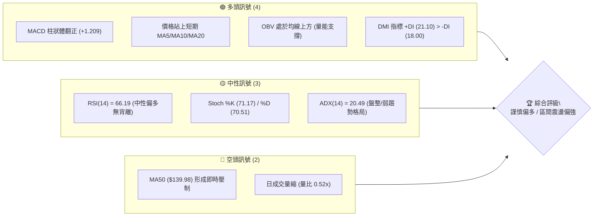
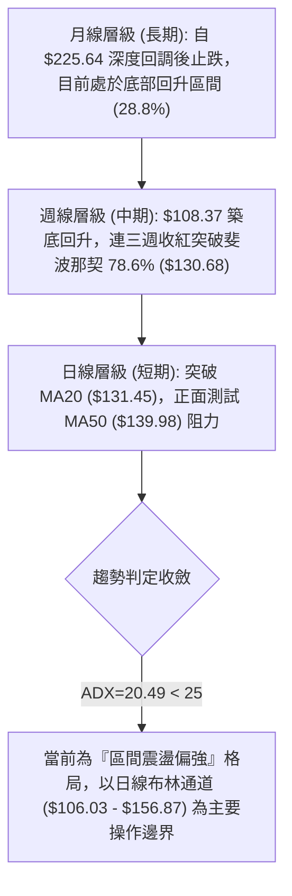
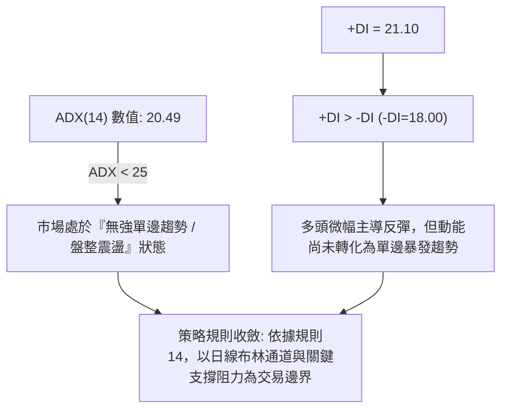
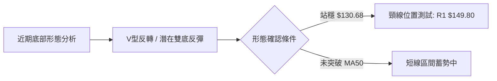
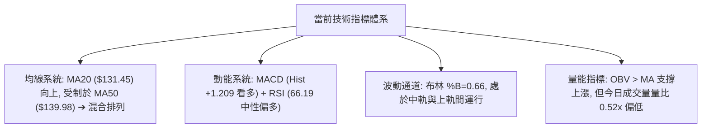
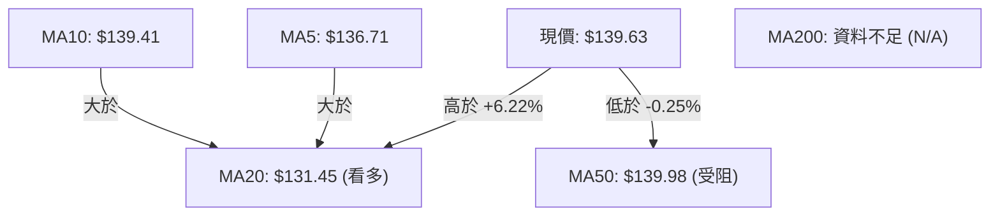
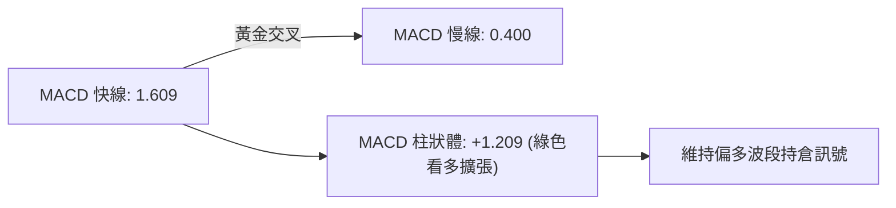
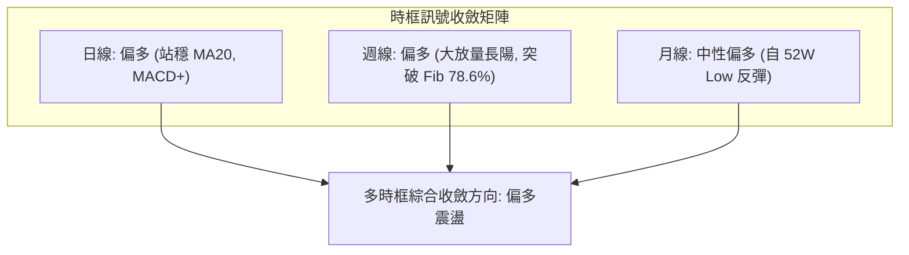
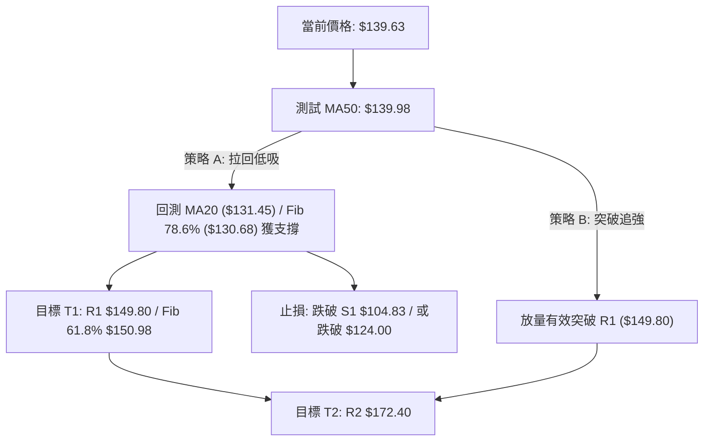
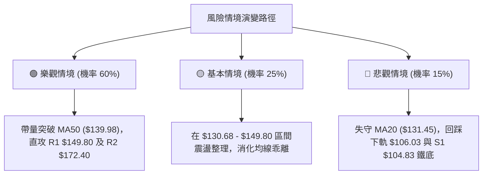

# SPCX 技術分析報告

> **報告日期**：2026-08-27 ｜ **語言**：繁體中文 ｜ **數據來源**：Yahoo Finance ｜ **當前價格**：$139.63

---

## 目錄

| 章節 | 內容 |
|------|------|
| [1. 技術面概覽](#1-技術面概覽) | 訊號儀表板、核心指標、評分卡 |
| [2. 趨勢分析](#2-趨勢分析) | 多時框趨勢、長中短期走勢 |
| [3. 圖表形態分析](#3-圖表形態分析) | 形態識別、K線組合、目標價 |
| [4. 支撐與阻力](#4-支撐與阻力) | 關鍵價位、斐波那契回調 |
| [5. 技術指標深度解讀](#5-技術指標深度解讀) | MA/RSI/MACD/布林/成交量 |
| [6. 動能與波動率](#6-動能與波動率) | 動能評估、ATR、Beta |
| [7. 多時框架總結](#7-多時框架總結) | 時框架評分矩陣 |
| [8. 交易策略建議](#8-交易策略建議) | 多空策略、風險報酬比 |
| [9. 風險提示與監控](#9-風險提示與監控) | 監控指標、風險場景 |

---

## 1. 技術面概覽

### 🎯 技術訊號儀表板



### 📊 核心指標速覽表

| 指標類別 | 指標名稱 | 當前數值 | 訊號 | 解讀 |
|----------|----------|----------|------|------|
| **價格** | 當前價格 | $139.63 | 🟢 | 自8月初低點 $108.37 明顯反彈，位於52週區間 28.8% 位置 |
| **均線** | MA20 | $131.45 | 🟢 | 股價位於 MA20 上方 (+6.22%)，短中期均線提供底層支撐 |
| **均線** | MA50 | $139.98 | 🔴 | 股價剛好貼近 MA50 下方 (-0.25%)，面臨短期動態均線壓制 |
| **均線** | MA200 | N/A | 🟡 | 數據中未偵測到（資料不足，需更長歷史數據） |
| **動能** | RSI(14) | 66.19 | 🟡 | 處於 30-70 中性偏多區間，尚未進入超買區，無背離訊號 |
| **動能** | MACD | 1.609 / 0.400 | 🟢 | 快線位於慢線上方，Hist柱為 +1.209，延續看多擴張動能 |
| **動能** | Stoch %K/%D | 71.17 / 70.51 | 🟡 | 短線進入偏強區間，快慢線微幅糾結，短線動能健康 |
| **趨勢** | ADX(14) | 20.49 | 🟡 | 數值低於 25，顯示當前處於區間震盪／弱趨勢修復階段 |
| **量能** | OBV & 量比 | 0.52x | 🟢 | OBV > MA 表明籌碼有沉澱回補跡象，但今日量縮呈現整理 |
| **波動** | ATR(14) | $8.91 (6.38%) | 🟡 | 波動度適中，提供操作止損設定與波段防守之核心參考 |

### 🏆 技術評分卡

```
╔══════════════════════════════════════════════════════════════╗
║              SPCX 技術指標評分卡 (2026-08-27)                ║
╠══════════════════════════════════════════════════════════════╣
║ 趨勢強度 (ADX/DMI)    ██████████░░░░░░░░░░  52/100  🟡 中性 ║
║ 動能指標 (MACD/RSI)   ██████████████░░░░░░  72/100  🟢 偏多 ║
║ 支撐穩定度 (S1/MA20)  ██████████████░░░░░░  70/100  🟢 穩固 ║
║ 成交量配合 (OBV/Volume)██████████░░░░░░░░░░  50/100  🟡 量縮 ║
║ 形態完整度 (區間反彈) ████████████░░░░░░░░  60/100  🟡 構築 ║
║ 均線排列 (短強中壓)   ████████████░░░░░░░░  62/100  🟢 改善 ║
╠══════════════════════════════════════════════════════════════╣
║ 綜合評分              █████████████░░░░░░░  63/100  🟢 謹慎偏多║
╚══════════════════════════════════════════════════════════════╝
```

---

## 2. 趨勢分析

### 🌐 多時框趨勢分析



### 📈 長期趨勢 — 12個月走勢圖（Unicode）

```
SPCX 歷史價格走勢圖（2026年近期波段與月線收盤）
價格軸 ($)
$225.64 ┤                           ● (52W High)
$197.13 ┤                         ╭─╯ 
$179.49 ┤                        ╭╯   
$170.86 ┤       ●(26-06收盤)    ╭╯    
$150.98 ┤      ╭╯ ╰╮           ╭╯     
$139.63 ┤──────┼───┼───────────┼──────● (現價 $139.63 / 26-08收盤)
$130.68 ┤      │   ╰╮         ╭╯      
$108.37 ┤      │    ●(26-07)╭─╯       
$104.83 ┤──────┴────────────●───────── (52W Low S1)
        └─────────────────────────────
         26-05  26-06 26-07 26-08
```

#### 走勢特徵分析表格

| 階段區間 | 起始/結束價位 | 漲跌幅 | 走勢特徵與結構解讀 |
|----------|---------------|--------|-------------------|
| **52W 高點回調期** | $225.64 → $104.83 | -53.54% | 主跌浪修正，單邊下挫測試歷史波段支撐點 $104.83。 |
| **2026-06 至 07 月** | $170.86 → $108.37 | -36.57% | 快速下殺加速趕底，週線 RSI 跌至極端超賣區 15.9。 |
| **2026-08 反彈修復期**| $108.37 → $139.63 | +28.85% | 伴隨大成交量強勁反彈，站穩斐波那契 78.6% ($130.68)。 |

### 📊 中期趨勢（週線分析）

```
週線走勢結構示意圖：
$172.40 ────────────────────────────── R2 波段強阻力
               ▲
$149.80 ───────┼────────────────────── R1 阻力 (斐波 61.8% $150.98)
               │ (反彈上攻測試中)
$139.63 ───────● (當前週線收盤價)
               │
$130.68 ───────┴────────────────────── 斐波 78.6% 回調位 (已轉為短線支撐)
$104.83 ────────────────────────────── 52W Low / S1 鐵底支撐
```

近期20週走勢呈現標準的「V型觸底反彈」特徵：7月下旬於 $108.37–$115.07 區間爆發恐慌拋補，週成交量連續數週維持在 3 億股以上；進入 8 月第一週（2026-08-09）成交量擴大至 9.20 億股，週線 MACD 柱狀體翻正至 +2.330，帶動價格連續反攻。

### ⚡ 趨勢強度評估（ADX 解讀）



| ADX 區間 | 趨勢強度分類 | 當前狀態判定 | 交易指引 |
|----------|--------------|--------------|----------|
| 0 – 20 | 極弱 / 無趨勢 | ── | 觀望為主 |
| **20 – 25** | **弱趨勢 / 區間盤整** | **✓ 當前狀態 (20.49)** | **以布林通道與支撐阻力區間操作** |
| 25 – 40 | 強趨勢形成 | ── | 順勢單邊持倉 |
| 40 – 100 | 極強單邊 / 超買超賣 | ── | 留意趨勢衰竭反轉 |

---

## 3. 圖表形態分析

### 🔍 形態識別系統



#### 形態識別與信心度評估

| 形態類別 | 信心度 | 判斷依據（引用數據） | 完成度 | 目標價（附計算式） |
|----------|--------|----------------------|--------|--------------------|
| **V型反彈 / 底部回升** | 68% | 7月低點 $108.37 止跌，隨後8/9週大放量收於 $133.11，已收復 $130.68 斐波位 | 75% | 自低點 $108.37 反彈至頸線 R1 $149.80，突破後量度目標：$149.80 + ($149.80 - $108.37) = **$191.23**（貼近 23.6% 斐波位 $197.13） |
| **中長期下降通道修復** | 55% | 股價突破布林中軌 MA20 ($131.45)，向通道上軌 ($156.87) 運行 | 60% | 依布林帶上軌推算第一延伸目標為 **$156.87** |
| **複合頭肩底** | 35% | 數據中未偵測到右肩構築完整結構，訊號不足 | 20% | 訊號不足，僅做指標型解讀 |

### 🕯️ 重要K線形態分析

| 日期/月份 | 收盤價 | K線形態特徵 | 技術解讀 | 多空訊號 |
|-----------|--------|-------------|----------|----------|
| **2026-07-26** | $115.07 | 長陰加速下挫 | RSI 跌至 15.9 極端恐慌區，空頭動能釋放完畢 | 🔴 恐慌拋售 |
| **2026-08-02** | $108.37 | 探底長下影線十字星 | 逼近 52W 低點 $104.83 獲強力買盤支撐，MACD 負柱收窄 | 🟢 止跌見底 |
| **2026-08-09** | $133.11 | 爆量突破大陽線 | 週量 9.20 億股，實體長陽包覆前兩週，確認反彈主波 | 🟢 強力轉多 |
| **2026-08-30** | $139.63 | 窄幅整理小陽線 | 連續受制於 MA50 ($139.98)，成交量萎縮，高檔蓄勢 | 🟡 整理待變 |

### 📉 ASCII 走勢形態示意圖

```
SPCX 近期底部回升形態（V-Reversal / Base Building）
$149.80 ┼─────────────────────────────── 阻力 R1 / 潛在頸線位
        │                         ╭─● $139.63 (現價蓄勢)
$133.11 ┼                   ╭─────╯
        │             ╭─────╯ (8/9 爆量週)
$115.07 ┼       ╭─────╯
        │ ╰─────╯
$108.37 ┼───● (8/2 底部十字星)
$104.83 ┴─────────────────────────────── 52W Low 鐵底支撐
```

### 🎯 形態目標價計算

1. **第一波段目標（形態頸線 R1）**：
   - 基準頸線：阻力位 **$149.80**
   - 形成依據：近一年波段高點聚類與斐波那契 61.8% ($150.98) 重疊區。
2. **第二波段延伸目標（量度推算）**：
   - 形態底部：$108.37
   - 垂直高度：$149.80 - $108.37 = $41.43
   - 突破量度目標：$149.80 + $41.43 = **$191.23**
   - 該價位高度吻合斐波那契 23.6% 回調位 ($197.13) 與波段阻力 R2 ($172.40) 的延伸區間。

---

## 4. 支撐與阻力

### 🗺️ 關鍵價位分布圖（Unicode）

```
SPCX 價位結構分布圖
══════════════════════════════════════════════════════════════
$225.64 ║████████████████████████║ 52週歷史高點 (Fib 0.0%)
$197.13 ║████████████████        ║ 斐波那契 23.6% 回調位
$172.40 ║████████████████████    ║ 強阻力 R2 (近一年波段高點聚類)
$156.87 ║▓▓▓▓▓▓▓▓▓▓▓▓▓▓▓▓        ║ 布林通道上軌
$149.80 ║████████████████████████║ 關鍵阻力 R1 (Fib 61.8% 重疊區 $150.98)
$139.98 ║─── 均線壓制 ───────────║ MA50 動態阻力
$139.63 ╠════════════════════════╣ ◄ 現價 (Current Price)
$131.45 ║▓▓▓▓▓▓▓▓▓▓▓▓▓▓▓▓        ║ 短期支撐 MA20 / 布林中軌
$130.68 ║████████████            ║ 斐波那契 78.6% 回調位
$106.03 ║▓▓▓▓▓▓▓▓▓▓▓▓▓▓▓▓        ║ 布林通道下軌
$104.83 ║████████████████████████║ 強支撐 S1 (52週歷史低點 Fib 100.0%)
══════════════════════════════════════════════════════════════
```

### 🚧 阻力位分析表

| 阻力級別 | 價位 | 形成原因（引用數據） | 突破難度 | 重要性 |
|----------|------|----------------------|----------|--------|
| **即時阻力** | **$139.98** | MA50 均線位置，當前股價正面遭遇壓制 | 🟡 中等 | ★★★☆☆ |
| **關鍵阻力 R1** | **$149.80** | 近一年波段高點聚類，與斐波那契 61.8% ($150.98) 形成共振壓制帶 | 🔴 較高 | ★★★★★ |
| **波段阻力 R2** | **$172.40** | 近一年次高波段高點聚類，接近 2026-06 月收盤價 $170.86 | 🔴 高 | ★★★★☆ |
| **歷史極值** | **$225.64** | 52W High (斐波那契 0.0% 起跌點) | 🔴 極高 | ★★★★★ |

### 🛡️ 支撐位分析表

| 支撐級別 | 價位 | 形成原因（引用數據） | 守住機率 | 重要性 |
|----------|------|----------------------|----------|--------|
| **短期動態支撐** | **$131.45** | MA20 與布林中軌共振重合處 | 🟢 75% | ★★★★☆ |
| **斐波關鍵支撐** | **$130.68** | 52週區間 78.6% 斐波那契回調位，本輪反彈站穩關鍵點 | 🟢 80% | ★★★★☆ |
| **波段下軌支撐** | **$106.03** | 布林通道下軌動態保護位 | 🟢 85% | ★★★☆☆ |
| **歷史強支撐 S1** | **$104.83** | 近一年波段低點聚類 / 52W Low (斐波那契 100.0%) | 🟢 90% | ★★★★★ |

### 📐 斐波那契回調位分析

依據 52 週區間最高點 **$225.64** 至最低點 **$104.83** 計算斐波那契回調水準：

```
0.0%  (52W High)   ────────────────── $225.64
23.6%              ────────────────── $197.13
38.2%              ────────────────── $179.49
50.0%              ────────────────── $165.24
61.8%              ────────────────── $150.98  ▲ [阻力共振帶: R1 $149.80]
                                                │ (現價向上反彈區間)
現價 $139.63       ··················           ▼
78.6%              ────────────────── $130.68  ▲ [下方已轉化為強支撐]
100.0% (52W Low)   ────────────────── $104.83  [S1 鐵底支撐]
```

- **位置解讀**：現價 **$139.63** 正處於 **78.6% 回調位 ($130.68)** 與 **61.8% 回調位 ($150.98)** 之間。
- **技術意義**：多頭成功收復並站穩 $130.68，代表自 $104.83 的反彈脫離極端超跌階段；當前正向上挑戰 $150.98（與 R1 $149.80 高度重合）。若能帶量有效突破 $150.98，將打開通往 50.0% ($165.24) 及 38.2% ($179.49) 的中級反彈空間。

---

## 5. 技術指標深度解讀

### 🎛️ 指標訊號總覽



### 📈 移動平均線排列分析



- **短期均線**：MA5 ($136.71) 與 MA10 ($139.41) 呈多頭排列並托支股價，短線動能偏強。
- **中長期均線**：MA50 位於 $139.98，與現價相差僅 $0.35，為短線最直接的多空分水嶺。
- **排列特徵**：屬於短期走強但中期遭遇均線蓋頭的「混合排列」，需突破 MA50 才能確立均線全多頭發散。

### 📉 RSI(14) 分析

- **當前數值**：**66.19**
- **強度進度條**：
  ```
  超賣 (0-30)            中性區 (30-70)             超買 (70-100)
  ░░░░░░░░░░░░░░░░░░░░░░█████████████████████░░░░░░░░░░░░░░░░ 66.19%
  ```
- **背離判斷**：
  - **結論**：**無頂背離、無底背離**。
  - **解讀**：RSI 隨價格自 7 月底極值 15.9 順暢回升至 66.19，指標走勢與價格反彈節奏高度一致，未出現指標創新高而價格未創新高（頂背離）或指標創新低而價格未創新低（底背離）的現象，動能健康。

### 📊 MACD(12/26/9) 訊號解讀



- **MACD 線**：1.609 位於零軸上方。
- **訊號線（Signal）**：0.400。
- **柱狀圖（Histogram）**：**+1.209**。
- **深度解讀**：MACD 自 8 月初完成零軸下黃金交叉後迅速穿越零軸，柱狀體維持正值，呈現標準的「多頭推升」特徵，中期反彈動能尚未見衰竭訊號。

### 📦 布林通道分析

```
SPCX 日線布林通道示意圖 ($106.03 — $131.45 — $156.87)
$156.87 ┬────────────────────────────────────────── 布林上軌 (Upper Band)
        │
$139.63 ┼──────────────────● (現價, %B = 0.66, 處於強勢通道)
        │
$131.45 ┼────────────────────────────────────────── 布林中軌 MA20 (Middle Band)
        │
$106.03 ┴────────────────────────────────────────── 布林下軌 (Lower Band)
```

- **帶寬與位置**：%B 值為 **0.66**，位於中軌 ($131.45) 與上軌 ($156.87) 之間的中高位，反映價格處於反彈強勢區間。
- **軌道狀態**：布林帶未出現極端開口擴張，維持平穩上升通道，通道上軌 $156.87 構成多頭向上延伸的第一波段動態壓力。

### 💹 成交量分析（量價配合度）

- **最新成交量**：60,739,400 股
- **20日均量**：117,423,890 股（量比：**0.52x**，量縮明顯）
- **50日均量**：104,992,374 股
- **OBV 趨勢**：`OBV > MA` 呈現量能總體支撐上漲。
- **量價診斷**：週線層級在 $108–$133 區間出現 9.2 億股巨量換手（主力進場吸籌）；目前日線反彈逼近 MA50 ($139.98) 出現縮量（0.52x），表明上方解套賣壓並未瘋狂湧出，但若要實質突破 R1 ($149.80)，必須要求成交量重回 20 日均量（1.17 億股）以上。

---

## 6. 動能與波動率

### ⚡ 動能評估四象限

| 象限 | 動能強度 (RSI/MACD) | 波動率水準 (ATR/帶寬) | SPCX 當前狀態 | 策略意涵 |
|------|---------------------|-----------------------|---------------|----------|
| **Q1 (最佳擴張)** | 強 (MACD+, RSI>60) | 低至中等 (ATR%~6%) | **✓ 當前定位 (Q1)** | **健康反彈震盪上行，適合拉回低吸** |
| **Q2 (盤整沉寂)** | 弱 (RSI 40-50) | 低 (ATR 壓縮) | ── | 觀望等待突破 |
| **Q3 (高危博弈)** | 強 (極端超買) | 高 (暴量劇震) | ── | 減倉鎖利 |
| **Q4 (恐慌出逃)** | 弱 (MACD-, RSI<30) | 高 (失控殺跌) | ── | 嚴格止損空倉 |

### 📊 ATR 波動率分析

- **當前 ATR(14)**：**$8.91**（佔股價比例 **6.38%**）。
- **止損與風控設置**：
  - 每日正常價格波動區間為 ±$8.91。
  - **日內短線止損**：建議設為 1.0x ATR = **$8.91**。
  - **波段進場保護止損**：建議設為 1.5x 至 2.0x ATR = **$13.37 至 $17.82**。
  - 若在現價 $139.63 進場，波段止損參考位約在 $139.63 - $13.37 = **$126.26**（該位置低於 MA20 $131.45 及 Fib 78.6% $130.68，具備雙重結構保護）。

### 📐 Beta 與市場相關性

- **Beta 數值**：N/A（數據中未偵測到，資料不足）。
- **籌碼與波動特徵**：
  - **Short Ratio**：1.76，**Short % Float**：2.9%（空頭回補壓力適中，無顯著逼空風險）。
  - **機構持股**：47.7%，**內部人持股**：12.7%，籌碼結構相對集中，有利於底部形態形成後的穩定推升。

---

## 7. 多時框架總結

### 📋 時框架評分表

| 時框架 | 趨勢方向 | 動能狀態 | 均線排列 | 形態結構 | 綜合評分 | 操作建議 |
|--------|----------|----------|----------|----------|----------|----------|
| **長期 (月線)** | 🟡 底部回升 | 🟡 修復中 | 🟡 MA200 N/A | 52W 區間低位 (28.8%) | **58/100** | 長線分批建倉 |
| **中期 (週線)** | 🟢 轉強反彈 | 🟢 MACD翻正 | 🟢 連三週收紅 | V型反轉突破 $130.68 | **70/100** | 波段順勢持有 |
| **短期 (日線)** | 🟢 震盪偏多 | 🟢 RSI 66.19 | 🟡 受制MA50 | 逼近 MA50 蓄勢 | **65/100** | 拉回支撐低吸 |

### 🔲 綜合訊號矩陣



### ⚖️ 多時框收斂結論

- **趨勢模式判定**：當前 ADX(14) = **20.49 (< 25)**，技術結構定義為**「非單邊強趨勢之區間震盪偏強行情」**。
- **主導時框與收斂取捨**：依據規則 14，在 ADX < 25 狀態下，以日線布林通道 ($106.03 - $156.87) 及近一年關鍵支撐阻力為交易邊界；同時週線動能（MACD柱翻正）確認底部反彈成立。
- **唯一方向性結論**：**【偏多觀望 / 區間拉回做多】**。本結論與第 1 章評分卡（63/100）及第 8 章交易策略完全一致。

---

## 8. 交易策略建議

### 🗺️ 策略決策流程圖



### 🧭 策略路由（依評分卡分流）

> **當前主策略方向 = 主推多頭策略（綜合評分 63/100，偏多區間操作）**

### 🎯 價格情境階梯（Price Scenarios）

| 觸發條件 | 下一目標 | 後續延伸 | 情境含義與操作指引 |
|----------|----------|----------|-------------------|
| **強勢突破 R1 ($149.80)** | **R2 $172.40** | **Fib 23.6% $197.13** | 底部反轉形態全面確立，展開中級多頭主升浪。 |
| **站穩現價區間 ($130.68–$149.80)** | **布林上軌 $156.87** | **R1 $149.80** | 在 MA20 與 MA50 之間震盪蓄勢，高出低進。 |
| **跌破短期支撐 ($130.68 / MA20)** | **布林下軌 $106.03** | **S1 $104.83** | 反彈動能衰竭，將重新考驗 52 週低點鐵底。 |

### 📊 情境機率分佈

| 情境 | 機率 | 主要依據 |
|------|------|----------|
| **繼續震盪上行 / 挑戰 R1** | **60%** | MACD 柱狀體維持正值 (+1.209)、OBV > MA、DMI 多頭主導 (+DI 21.10)。 |
| **區間橫盤震盪** | **25%** | ADX = 20.49 (<25) 反映趨勢力道溫和、當前成交量偏低 (量比 0.52x)。 |
| **跌破支撐回落探底** | **15%** | S1 $104.83 與 Fib 78.6% $130.68 具備強力買盤聚集，破底機率低。 |

### 🟢 主策略詳情（多頭進場配置）

以下策略報價**完全嚴格引用第 4 章關鍵價位及精確計算值**：

| 策略要素 | 策略 A：拉回支撐低吸（穩健型） | 策略 B：突破頸線順勢（動能型） |
|----------|--------------------------------|--------------------------------|
| **進場條件** | 價格回踩 MA20 / Fib 78.6% 獲支撐縮量企穩 | 日K實體放量突破關鍵阻力 R1 |
| **進場價格** | **$131.45**（MA20 / 接近 Fib $130.68） | **$149.80**（突破確認點） |
| **目標價 T1** | **$149.80**（R1 阻力位，獲利空間 +13.96%） | **$172.40**（R2 阻力位，獲利空間 +15.09%） |
| **目標價 T2** | **$172.40**（R2 阻力位，獲利空間 +31.15%） | **$197.13**（Fib 23.6%，獲利空間 +31.60%） |
| **止損價格** | **$124.00**（跌破 Fib 78.6% 下方約 1x ATR） | **$139.63**（回落至前突破平台/現價） |
| **風險報酬比** | **1 : 2.46**（以 T1 計算）/ **1 : 5.50**（以 T2 計算） | **1 : 2.22**（以 T1 計算）/ **1 : 4.66**（以 T2 計算） |
| **成功機率** | **65%** | **55%** |
| **建議倉位** | **15% - 20%** | **10% - 15%** |

### 🔴 反向風險觸發點（對沖提示）

- **觸發條件 1**：日K線收盤價跌破斐波那契 78.6% 回調位 **$130.68** 及 MA20 **$131.45**。
- **觸發條件 2**：MACD 柱狀體由正轉負，且 RSI(14) 跌破 50 中軸。
- **風控處置**：若觸發上述條件，多頭部位應即刻減倉 50% 以上；若進一步跌破 **$104.83 (S1)**，則多頭結構全面破壞，應全數停損離場並進行空頭對沖。

### ⭐ 整體訊號強度評星

```
╔══════════════════════════════════════════════════════════╗
║ 做多訊號強度：★★★★☆  (4/5星 — 動能與底部支撐穩固)       ║
║ 做空訊號強度：★☆☆☆☆  (1/5星 — 逆向放空風險極高)         ║
║ 整體可信度：  ★★★★☆  (4/5星 — 量價結構與形態相互確認)   ║
╚══════════════════════════════════════════════════════════╝
```

---

## 9. 風險提示與監控

### ✅ 關鍵監控指標 Checklist

```
╔══════════════════════════════════════════════════════════════╗
║              SPCX 日常交易風險監控清單                      ║
╠══════════════════════════════════════════════════════════════╣
║ [ ] 價格是否成功突破並站穩 MA50 ($139.98)                    ║
║ [ ] 成交量是否放大至 20日均量 (1.17億股) 以上確認突破真實性   ║
║ [ ] RSI(14) 是否在 60-70 區間維持強勢，避免跌破 50 水準       ║
║ [ ] MACD Histogram 是否維持正值擴張 (+1.209 以上)            ║
║ [ ] 下方核心支撐 MA20 ($131.45) 與 Fib 78.6% ($130.68) 防守   ║
║ [ ] 鐵底 S1 ($104.83) 是否遭遇異常大單拋壓                   ║
╚══════════════════════════════════════════════════════════════╝
```

### ⚠️ 風險場景分析



### 🛡️ 風險管理重要提醒

1. **波動率管理（ATR 風控）**：SPCX 目前 ATR 為 **$8.91**（6.38%），單日波動幅度較大。建立倉位時務必根據 ATR 計算部位規模，單筆交易虧損上限不得超過總資金的 1.5%–2.0%。
2. **均線壓制風險**：股價目前貼近 MA50 ($139.98)，短線不宜在未放量的情況下盲目追高，耐心等待「拉回 MA20 ($131.45) 低吸」或「放量突破 R1 ($149.80) 追強」。
3. **分析師共識保護**：18 位華爾街分析師平均目標價為 **$219.22**，買入評級占主導；但技術交易者仍須以盤面支撐阻力為第一依據，嚴格執行紀律止損。

---

## 📋 報告總結

```
╔══════════════════════════════════════════════════════════════╗
║                 SPCX 技術分析報告總結                        ║
╠══════════════════════════════════════════════════════════════╣
║ 報告日期：2026-08-27                                         ║
║ 當前價格：$139.63                                            ║
║ 分析評級：🟢 謹慎偏多 / 區間低吸 (評分: 63/100)               ║
║                                                              ║
║ 關鍵結論：                                                   ║
║ ├─ 長期趨勢：🟡 52W 區間低位築底反彈 (目前位於 28.8%)        ║
║ ├─ 中期趨勢：🟢 週線連三紅，突破 Fib 78.6% ($130.68)        ║
║ ├─ 短期趨勢：🟢 站穩 MA20 ($131.45)，測試 MA50 ($139.98)     ║
║ ├─ 關鍵支撐：$131.45 (MA20) / $130.68 (Fib) / $104.83 (S1)   ║
║ ├─ 關鍵阻力：$139.98 (MA50) / $149.80 (R1) / $172.40 (R2)   ║
║ └─ 分析師目標：平均 $219.22 (Low: $117.00 / High: $450.00)   ║
║                                                              ║
║ 最優策略組合：                                               ║
║ 1. 🥇 最佳機會：拉回 $131.45 (MA20) 低吸，目標 $149.80 (R1)  ║
║ 2. 🥈 次選機會：放量突破 $149.80 (R1) 後順勢加碼，目標 $172.40║
║ 3. 🥉 防守底線：跌破 $124.00 停損；失守 $104.83 (S1) 全面避險║
╚══════════════════════════════════════════════════════════════╝
```

---

> ⚠️ **免責聲明**：本報告為 AI 自動生成之技術分析，所有數據及估算均基於提供的歷史價格資訊。本報告**僅供研究與學術參考**，**不構成任何投資建議**。投資有風險，入市需謹慎。

---

*報告生成時間：2026-08-27 ｜ 數據來源：Yahoo Finance ｜ 分析框架：多時框技術分析*