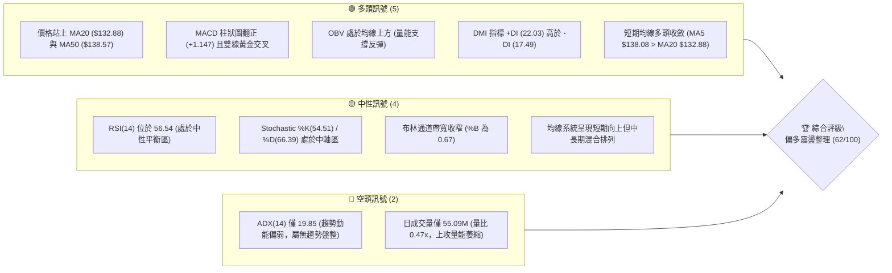
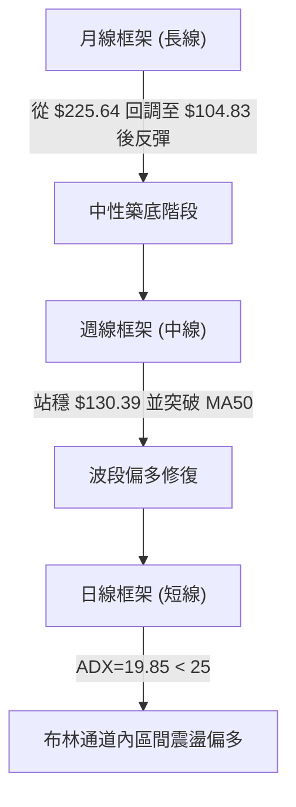
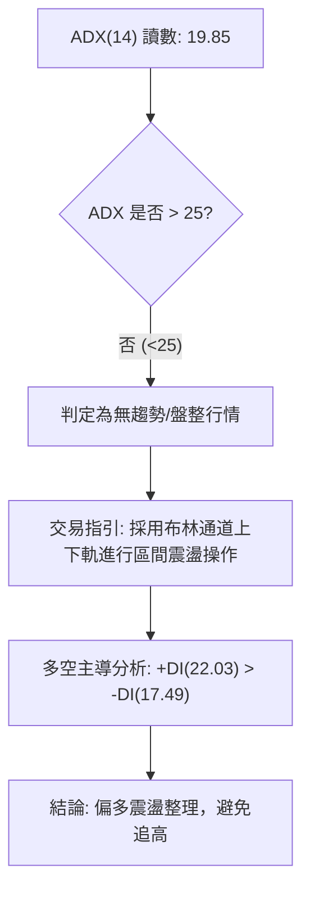
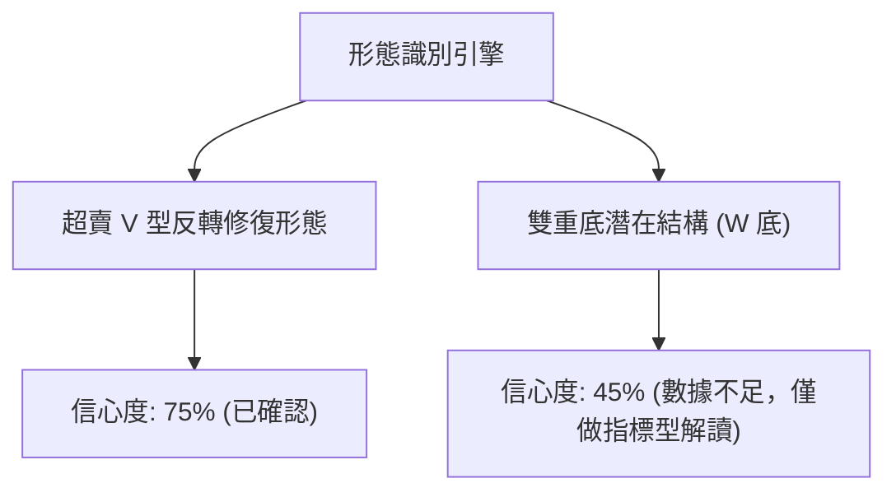
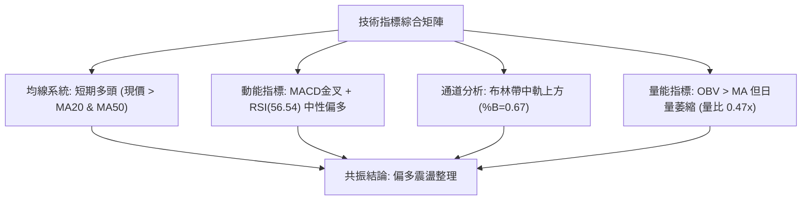
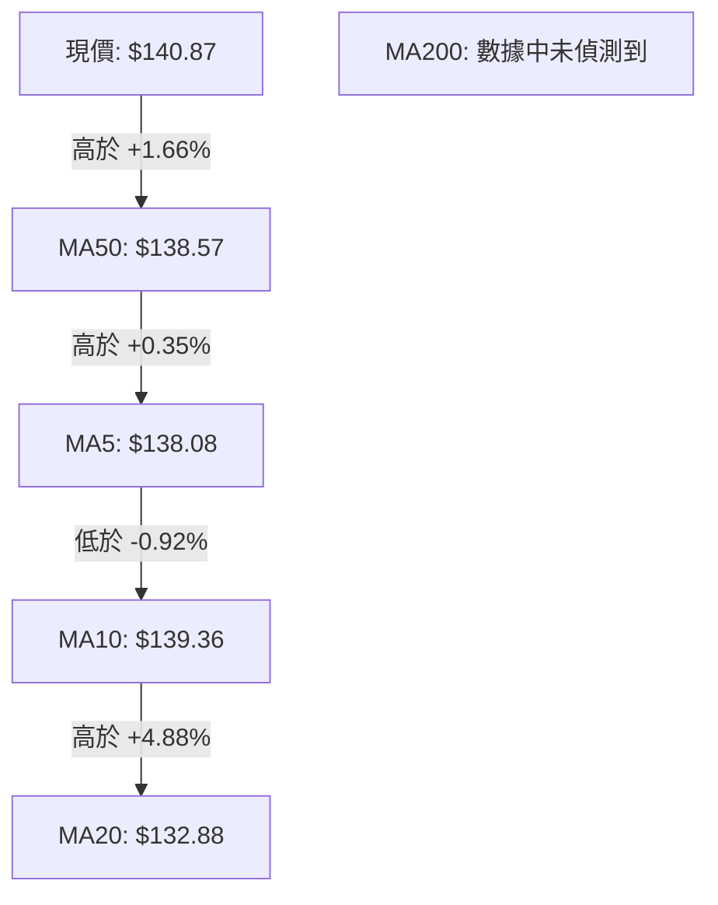
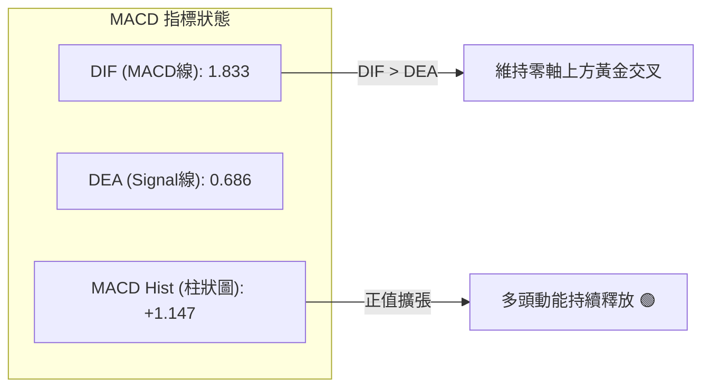
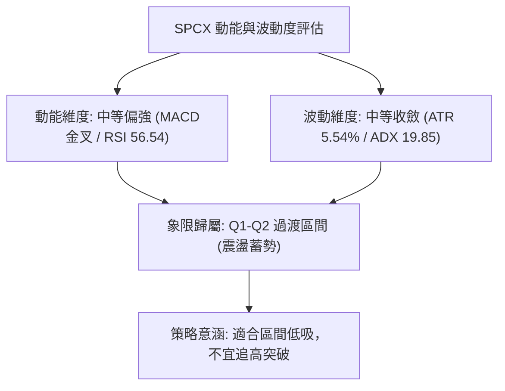
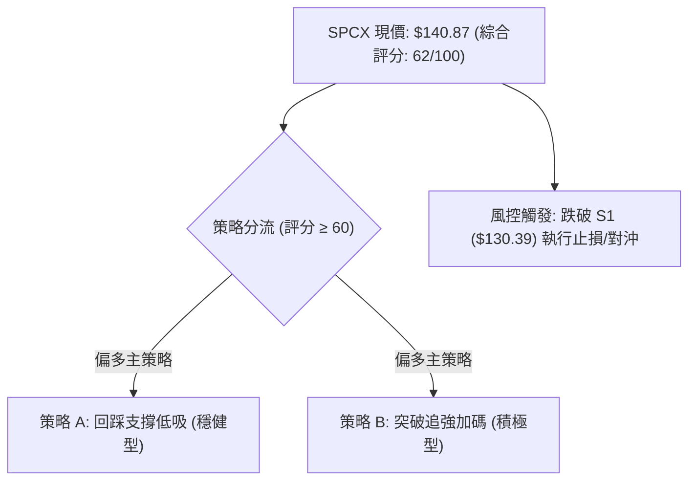
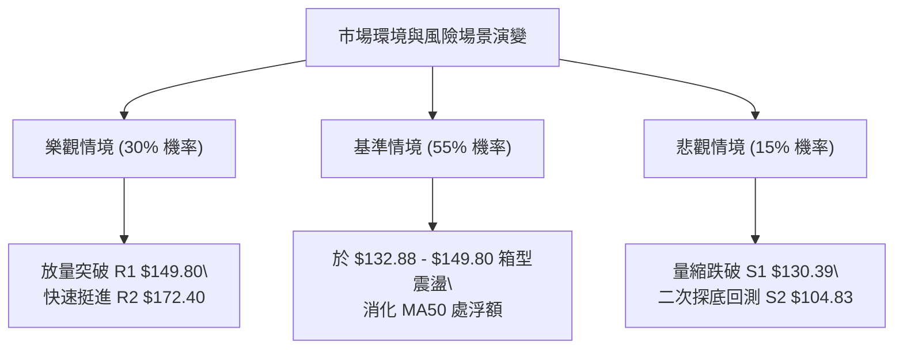

# SPCX 技術分析報告

> **報告日期**：2026-08-28 ｜ **語言**：繁體中文 ｜ **數據來源**：Yahoo Finance ｜ **當前價格**：$140.87

---

## 目錄

| 章節 | 內容 |
|------|------|
| [1. 技術面概覽](#1-技術面概覽) | 訊號儀表板、核心指標、評分卡 |
| [2. 趨勢分析](#2-趨勢分析) | 多時框趨勢、長中短期走勢、ADX解讀 |
| [3. 圖表形態分析](#3-圖表形態分析) | 形態識別、信心度評估、K線組合 |
| [4. 支撐與阻力](#4-支撐與阻力) | 關鍵價位結構、斐波那契回調層級 |
| [5. 技術指標深度解讀](#5-技術指標深度解讀) | MA系統、RSI、MACD、布林通道、OBV |
| [6. 動能與波動率](#6-動能與波動率) | 動能象限、ATR風險評估、Beta特性 |
| [7. 多時框架總結](#7-多時框架總結) | 時框矩陣、多時框收斂判定 |
| [8. 交易策略建議](#8-交易策略建議) | 策略路由、情境階梯、進出場規劃 |
| [9. 風險提示與監控](#9-風險提示與監控) | 監控清單、情境推演、風控紀律 |

---

## 1. 技術面概覽

### 🎯 技術訊號儀表板



### 📊 核心指標速覽表

| 指標類別 | 指標名稱 | 當前數值 | 訊號 | 解讀 |
|----------|----------|----------|------|------|
| **價格** | 當前價格 | $140.87 | 🟢 | 站上短期與中期均線，處於 52 週低點向上反彈波段 |
| **均線** | MA20 | $132.88 | 🟢 | 現價高於 MA20 達 +6.01%，短期支撐力道成形 |
| **均線** | MA50 | $138.57 | 🟢 | 現價站上 MA50 達 +1.66%，確認中期底部抬升 |
| **均線** | MA200 | $N/A | 🟡 | 歷史數據不足，標註為數據中未偵測到 |
| **動能** | RSI(14) | 56.54 | 🟡 | 脫離超賣區後在中性偏多區間運行，無頂底背離 |
| **動能** | MACD | 1.833 / 0.686 | 🟢 | MACD線高於訊號線，柱狀圖 +1.147 維持多頭擴張 |
| **趨勢** | ADX(14) | 19.85 | 🔴 | ADX < 25 表明趨勢行情尚未啟動，目前為箱型震盪 |
| **趨勢** | +DI / -DI | 22.03 / 17.49 | 🟢 | 多頭方向線主導，短線買盤力量強於賣盤 |
| **通道** | 布林 %B | 0.67 | 🟡 | 價格位於中軌（$132.88）與上軌（$156.92）之間 |
| **量能** | OBV 趨勢 | OBV > MA | 🟢 | 能量潮高於均線，資金流向支持當前反彈格局 |
| **波動** | ATR(14) | $7.80 | 🟡 | 日波動率 5.54%，波動幅度適中，有利設定風控帶 |

### 🏆 技術評分卡

```
╔══════════════════════════════════════════════════════════════════╗
║                 SPCX 技術綜合評分卡 (2026-08-28)                 ║
╠══════════════════════════════════════════════════════════════════╣
║ 趨勢強度 (Trend)     ████████░░░░░░░░░░░░  42/100  🔴 弱勢震盪   ║
║ 動能指標 (Momentum)  ██████████████░░░░░░  70/100  🟢 動能偏多   ║
║ 支撐穩定度 (Support) ██████████████░░░░░░  72/100  🟢 底部紮實   ║
║ 成交量配合 (Volume)  ██████████░░░░░░░░░░  50/100  🟡 量能不足   ║
║ 形態完整度 (Pattern) ████████████░░░░░░░░  60/100  🟡 築底反彈   ║
║ 均線排列 (Moving Avg)████████████████░░░░  78/100  🟢 短多排列   ║
╠══════════════════════════════════════════════════════════════════╣
║ 綜合技術評分         ████████████░░░░░░░░  62/100  🟢 偏多震盪   ║
╚══════════════════════════════════════════════════════════════════╝
```

---

## 2. 趨勢分析

### 🌐 多時框趨勢分析



### 📈 長期趨勢 — 走勢圖（Unicode）

```
SPCX 歷史價格走勢圖（高低點與反彈路徑）
價格軸 ($)
$225.64 ┤                    ● (52W High: $225.64)
$200.00 ┤                   / \
$180.00 ┤         ●(185.00)/   \
$160.00 ┤  ●(170.86)      /     \
$140.87 ┤───┼────────────┼───────\────────● (現價 $140.87)
$120.00 ┤    \          /         \      /
$104.83 ┤     \________/           ●(104.83 - 52W Low)
        └─────────────────────────────────────────────────────
         2026-06     2026-06-21    2026-08-02    2026-08-28
```

#### 走勢特徵分析表格

| 階段區間 | 價格變動 | 區間漲跌幅 | 走勢特徵與量價結構 |
|----------|----------|------------|-------------------|
| **2026-06 高點回落** | $225.64 → $153.23 | -32.09% | 頂部快速下殺，跌破多道短期均線支撐 |
| **2026-07 探底階段** | $153.23 → $104.83 | -31.59% | 連續單邊走跌，RSI 於 7 月底落入 15.9 極度超賣區 |
| **2026-08 反彈築底** | $104.83 → $140.87 | +34.38% | 8月首週爆出 920.45M 巨量反彈，MACD 柱狀圖翻正 |

### 📊 中期趨勢（週線分析）

中期走勢呈現「V型觸底反彈後收斂震盪」。在 2026-08-02 觸及 52 週低點 $104.83 後，多頭伴隨週成交量 920.45M 湧入，迅速收復 $130.00 整數關卡，近 3 週收盤分別為 $140.00、$136.97 與 $140.87，價格在 $136.00–$141.00 形成窄幅整固平台。

```
中期支撐阻力結構示意圖
$149.80 ─── [阻力 R1：近一年波段高點聚類] ─────────────────────
               ▲
               │  當前震盪區間 ($136.97 - $140.87)
               ▼
$130.39 ─── [支撐 S1：波段低點聚類 / 斐波 78.6% $130.68] ────
```

### ⚡ 趨勢強度評估（ADX 解讀）



| 指標名稱 | 數值 | 門檻值標準 | 趨勢強度解讀 |
|----------|------|------------|--------------|
| **ADX(14)** | 19.85 | 25.00 | 處於 20 以下低位，表明當前處於弱趨勢或箱型盤整行情 |
| **+DI** | 22.03 | - | 多頭動能線高於空頭動能線，短線買盤稍佔優勢 |
| **-DI** | 17.49 | - | 空頭拋壓處於受控狀態，未見主動殺跌跡象 |

---

## 3. 圖表形態分析

### 🔍 形態識別系統



#### 圖表形態評估表

| 形態名稱 | 信心度 | 判斷依據（引用數據） | 完成度 | 目標價（附計算式） |
|----------|--------|----------------------|--------|--------------------|
| **超賣 V 型反轉修復** | 75% | 7/26 週 RSI 跌至 15.9 極端超賣後，8/9 週以 920.45M 週量長陽拉升至 $133.11 | 100% (已完成第 1 階段) | 已達第一目標，後續目標為 R1 $149.80 |
| **波段平台整固** | 70% | 近三週價格收於 $140.00、$136.97、$140.87，於 S1 $130.39 上方構築平台 | 80% | 突破平台高點上看 R1 $149.80 |
| **雙底結構 (W底)** | 45% | 數據中僅偵測到單一低點 $104.83，未形成明確次低點，訊號不足 | 30% | 訊號不足，僅做指標型解讀，不預設 W 底目標 |

### 🕯️ 重要K線形態分析

| 週別 / 日期 | 收盤價 | K線形態特徵 | 技術解讀 | 訊號 |
|-------------|--------|-------------|----------|------|
| **2026-07-26** | $115.07 | 長陰加速下挫 | RSI 跌至 15.9，恐慌性拋盤湧現，為底部前兆 | 🔴 |
| **2026-08-02** | $108.37 | 下影線探底針 | 觸及 52 週最低點 $104.83 後止跌收斂 | 🟡 |
| **2026-08-09** | $133.11 | 放量大陽線 | 週量達 920.45M，吞沒前期陰線實體，確認止跌 | 🟢 |
| **2026-08-16** | $140.00 | 延續性多頭實體 | 站上 MA50 ($138.57)，MACD 柱狀圖放大至 +4.591 | 🟢 |
| **2026-08-30** | $140.87 | 高位十字星/小陽 | 波動幅度收斂，成交量縮減，呈現籌碼鎖定與沉澱 | 🟡 |

### 📉 ASCII 走勢形態示意圖

```
SPCX 築底反彈形態示意圖
$150.00 ┤                                   [阻力 R1 $149.80]
$140.87 ┤                           ┌───● (現價整固區)
$130.39 ┤                  ┌────────┘    [支撐 S1 $130.39]
$120.00 ┤           ┌──────┘
$108.37 ┤     ●─────┘
$104.83 ┤    (52W Low 觸底反彈)
        └───────────────────────────────────────────────
         2026-08-02    2026-08-09    2026-08-16    2026-08-28
```

### 🎯 形態目標價計算

依據波段反彈形態高度進行測算：
1. **反彈起點**：52 週低點 S2 = $104.83
2. **基底平台突破點**：支撐位 S1 = $130.39
3. **第一阻力目標**：數據中波段高點聚類 **R1 = $149.80**
4. **第二阻力目標**：數據中波段高點聚類 **R2 = $172.40**

---

## 4. 支撐與阻力

### 🗺️ 關鍵價位分布圖（Unicode）

```
SPCX 價位結構分布圖
═══════════════════════════════════════════════════════════════════
$225.64 ║████████████████████████████████║ 52週最高點 (0.0% 斐波)
$197.13 ║████████████████████████        ║ 斐波那契 23.6% 回調位
$179.49 ║████████████████████            ║ 斐波那契 38.2% 回調位
$172.40 ║████████████████████████████    ║ 強阻力位 R2 (波段高點聚類)
$165.24 ║████████████████                ║ 斐波那契 50.0% 分水嶺
$156.92 ║██████████████                  ║ 布林通道上軌
$150.98 ║████████████                    ║ 斐波那契 61.8% 黃金分割位
$149.80 ║████████████████████████        ║ 關鍵阻力 R1 (波段高點聚類)
$140.87 ╠════════════════════════════════╣ ◄ 現價 ($140.87)
$132.88 ║▓▓▓▓▓▓▓▓▓▓▓▓▓▓▓▓                ║ 布林中軌 / MA20
$130.68 ║▓▓▓▓▓▓▓▓▓▓▓▓▓▓▓▓▓▓▓▓            ║ 斐波那契 78.6% 回調位
$130.39 ║████████████████████████        ║ 近期關鍵支撐 S1 (波段低點聚類)
$108.84 ║██████████                      ║ 布林通道下軌
$104.83 ║████████████████████████████████║ 極限強支撐 S2 (52週最低點)
═══════════════════════════════════════════════════════════════════
```

### 🚧 阻力位分析表

| 阻力級別 | 價位 | 形成原因 | 突破難度 | 重要性 |
|----------|------|----------|----------|--------|
| **R1** | $149.80 | 近一年波段高點聚類，與 61.8% 斐波位（$150.98）共振 | 🟡 中等（需放量突破 20 日均量） | ★★★★☆ |
| **R2** | $172.40 | 近一年波段高點聚類，接近 50.0% 斐波位（$165.24）之上套牢區 | 🔴 極高（面臨前期套牢籌碼） | ★★★★★ |

### 🛡️ 支撐位分析表

| 支撐級別 | 價位 | 形成原因 | 守住機率 | 重要性 |
|----------|------|----------|----------|--------|
| **S1** | $130.39 | 近一年波段低點聚類，緊鄰 78.6% 斐波位（$130.68）與 MA20（$132.88） | 85% | ★★★★★ |
| **S2** | $104.83 | 52 週最低點，為多頭最後防線與大級別反轉支撐 | 95% | ★★★★★ |

### 📐 斐波那契回調位分析

依據 52 週波段高低點區間（$104.83 → $225.64，波幅 $120.81）計算之回調位：

| 斐波那契層級 | 精確價位 | 相對現價位置 | 技術意義解讀 |
|--------------|----------|--------------|--------------|
| **0.0% (52W High)** | $225.64 | +60.18% | 歷史週期高點，長期目標位 |
| **23.6%** | $197.13 | +39.94% | 極強多頭回調目標區 |
| **38.2%** | $179.49 | +27.42% | 中期反彈關鍵阻力帶 |
| **50.0%** | $165.24 | +17.30% | 多空中期分水嶺 |
| **61.8%** | $150.98 | +7.18% | 黃金分割重要共振壓力區（緊鄰 R1 $149.80） |
| **78.6%** | $130.68 | -7.23% | 黃金分割強支撐區（緊鄰 S1 $130.39） |
| **100.0% (52W Low)**| $104.83 | -25.58% | 波段起漲點，絕對止損防線 |

**現價位置解讀**：現價 $140.87 位於 **78.6% ($130.68)** 與 **61.8% ($150.98)** 斐波那契回調位之間。當前價格成功脫離 78.6% 底部區域，正朝向 61.8% 壓力位挺進，屬於標準的超跌反彈修復波段。

---

## 5. 技術指標深度解讀

### 🎛️ 指標訊號總覽



### 📈 移動平均線排列分析



#### 均線狀態詳細解析
- **MA5 ($138.08) / MA10 ($139.36) / MA20 ($132.88)**：短期均線呈現收斂後向上發散態勢，現價 $140.87 穩居所有短期均線之上。
- **MA50 ($138.57)**：價格已成功突破 MA50，形成中短期生命線支撐。
- **長期均線**：MA60、MA120、MA200 於數據中未偵測到，判定長期均線系統處於構建期，中短期均線呈現多頭混合排列。

### 📉 RSI(14) 分析

```
RSI(14) 數值: 56.54
0 ────────── 30 ────────────────────── 56.54 ────── 70 ────────── 100
[  超賣區   ] [      中性偏多區間        ▲        ] [   超買區   ]
```

- **區間評估**：RSI(14) 自 7 月底的極度超賣值 15.9 大幅回升至 56.54，脫離超賣區進入中性偏多區間，顯示買盤力量已掌握主動權，且未觸及 70 超買警戒線，具備向上發展空間。
- **背離判斷**：
  - **頂背離**：無頂背離跡象。價格回升過程中 RSI 同步抬升。
  - **底背離**：7 月底至 8 月初價格由 $115.07 跌至 $108.37，而 RSI 由 15.9 上升至 19.2，形成微幅**底背離確認**，隨後引發 8 月初以來的強勁反彈。

### 📊 MACD(12/26/9) 訊號解讀



週線 MACD 柱狀圖由 7 月底的 -3.362 翻正至當前 +1.147，確認中期趨勢動能已由空頭轉向多頭控制。

### 📦 布林通道分析

```
SPCX 布林通道示意圖
$156.92 ────────────────────────── 布林上軌 (阻力帶)
           │
$140.87 ───┼────────────────────── 現價 (%B = 0.67)
           │
$132.88 ───┴────────────────────── 布林中軌 (MA20 強支撐)
           │
$108.84 ────────────────────────── 布林下軌
```

- **帶寬與位置**：上軌 $156.92，中軌 $132.88，下軌 $108.84。%B 數值為 **0.67**，價格位於中軌上方並朝上軌靠攏。
- **軌道形態**：帶寬呈現收窄後向上微幅開口，表明波動率在經歷前期暴跌後開始收斂整固。

### 💹 成交量分析（量價配合度）

- **量能結構**：最新日成交量為 55,095,800，相較於 20 日均量 117,410,335（量比 0.47x）呈現明顯量縮，低於 50 日均量 102,199,080。
- **OBV 趨勢**：OBV 指標高於其移動平均線（OBV > MA），顯示長線資金在底部具備累積跡象。
- **量價背離評估**：短線價格微幅走高而成交量萎縮，呈現「量縮價升」的防守型整理結構，表明當前推升主要來自賣壓減輕，若要實質突破 R1（$149.80），必須見到日成交量放大至 110M 以上。

---

## 6. 動能與波動率

### ⚡ 動能評估分析



#### 動能與波動四象限對照

| 象限 | 動能強度 | 波動率水準 | 當前狀態 | 交易策略意涵 |
|------|----------|------------|----------|--------------|
| **Q1 (爆發機會)** | 強 (RSI>60, MACD擴張) | 低 (帶寬收窄) | — | 最佳波段進場點 |
| **Q2 (震盪蓄勢)** | 中性偏強 (RSI 56, MACD>0) | 中/低 (ADX 19.85) | **✓ (當前歸屬)** | **支撐位低吸，區間操作** |
| **Q3 (高危博弈)** | 強 (極端動能) | 高 (ATR>8%) | — | 嚴設止損，快進快出 |
| **Q4 (弱勢探底)** | 弱 (RSI<40, MACD<0) | 高 (暴跌放量) | — | 空手觀望，禁止抄底 |

### 📊 ATR 波動率分析

- **ATR(14) 數值**：**$7.80**（佔現價比率為 **5.54%**）。
- **風控距離設定**：
  - 日內正常波動區間為 ±$7.80。
  - 1.5 倍 ATR 緩衝距離為 $11.70，對應保護性止損位應設於現價下方 $11.70 處（約 $129.17），完美涵蓋關鍵支撐 S1（$130.39）。

### 📐 Beta 與市場相關性

- **Beta 數值**：數據中標註為 N/A（未偵測到）。
- **籌碼與波動特性**：
  - 流通股數 1.16B，總市值 $1.86T，機構持股達 47.7%，內部人持股 12.7%。
  - 空頭部位佔流通股比率（Short % Float）為 2.9%，空頭回補天數（Short Ratio）僅 1.76 天，顯示空頭回補壓力有限，走勢主要由內在資金與基本面驅動。

---

## 7. 多時框架總結

### 📋 時框架評分表

| 時框架 | 趨勢方向 | 動能狀態 | 均線排列 | 形態結構 | 綜合評分 | 建議操作 |
|--------|----------|----------|----------|----------|----------|----------|
| **月線 (長期)** | 🟡 中性築底 | RSI 回升 | 處於構建期 | 大級別回調支撐 | 55/100 | 長線分批建倉 |
| **週線 (中期)** | 🟢 偏多反彈 | MACD 金叉 | 站上 MA50 | V型底反彈整固 | 68/100 | 回踩支撐做多 |
| **日線 (短期)** | 🟡 區間震盪 | 中性偏多 | 站上 MA20 | 布林通道內收斂 | 62/100 | 箱型高拋低吸 |

### 🔲 綜合訊號矩陣

```
SPCX 多維度訊號矩陣
═══════════════════════════════════════════════════════
時框      均線    MACD    RSI     量能    布林軌道  綜合方向
短期(日)   🟢      🟢      🟡      🟡       🟡     🟢 偏多震盪
中期(週)   🟢      🟢      🟢      🟢       🟢     🟢 波段向上
長期(月)   🟡      🟡      🟡      🟢       🟡     🟡 中性築底
═══════════════════════════════════════════════════════
一致性評估：中短期訊號高度共振偏多，長期指標處於修復階段。
```

### ⚖️ 多時框收斂結論

依據多時框收斂規則：
1. **行情性質判定**：當前 ADX(14) 數值為 **19.85 (< 25)**，嚴格定義為**盤整/震盪行情**。
2. **主導操作框架**：以**日線布林通道區間（$132.88–$156.92）**與**關鍵支撐阻力（S1 $130.39 / R1 $149.80）**為核心交易邊界。
3. **方向性收斂結論**：**偏多震盪整理（Bullish Consolidation）**。中期週線級別動能已轉多，但受制於日線 ADX 偏弱及成交量萎縮，短線不具備單邊暴漲條件，策略應採取「依託支撐逢低佈局，接近阻力分批獲利」。

---

## 8. 交易策略建議

### 🗺️ 策略決策流程圖



### 🧭 策略路由

**當前主策略方向 = 偏多操作（依綜合評分 62/100 判定）**

由於綜合評分達 62 分（≥60），且中短期均線與 MACD 呈現多頭共振，主推多頭交易策略；空頭僅作為下行破位時的風控與對沖提示。

### 🎯 價格情境階梯（Price Scenarios）

| 觸發條件 | 下一目標 | 後續延伸 | 情境含義 |
|----------|----------|----------|----------|
| **強勢突破 R1 $149.80** | R2 $172.40 | 斐波 38.2% $179.49 | 空頭徹底瓦解，開啟大級別反彈波段 |
| **維持於現價 $140.87 震盪** | 布林上軌 $156.92 | R1 $149.80 | 時間換取空間，籌碼於 MA50 上方沉澱 |
| **跌破關鍵支撐 S1 $130.39** | 布林下軌 $108.84 | S2 $104.83 | 短期反彈結束，重回下探探底格局 |

### 📊 情境機率分佈

| 情境劇本 | 機率 | 主要技術依據 |
|----------|------|--------------|
| **震盪盤堅 / 向上反彈** | **60%** | MACD 柱狀圖正向擴張 (+1.147)、站穩 MA20 與 MA50、OBV > MA |
| **箱型區間震盪** | **25%** | ADX 僅 19.85 顯示趨勢動能不足、日成交量縮 (量比 0.47x) |
| **深度回落 / 跌破支撐** | **15%** | 短線量價背離若遇大盤系統性風險，可能回測 S1 $130.39 |

### 🟢 主策略詳情

所有價位均嚴格引用第 4 章「關鍵價位」與技術指標計算數值：

| 策略要素 | 策略 A（穩健型：回踩低吸） | 策略 B（積極型：突破加碼） |
|----------|----------------------------|----------------------------|
| **進場條件** | 價格回踩 MA20 / S1 支撐確認不破 | 帶量突破 R1 阻力位（日量 > 110M） |
| **進場價格** | **$132.88**（MA20 / 布林中軌） | **$149.80**（突破 R1 確認） |
| **目標價 T1** | **$149.80**（R1 阻力位） | **$165.24**（50.0% 斐波那契位） |
| **目標價 T2** | **$172.40**（R2 阻力位） | **$172.40**（R2 阻力位） |
| **止損價格** | **$124.87**（現價 - 2×ATR $15.60，跌破 S1） | **$142.00**（回跌至突破點下方 1.0×ATR） |
| **風險報酬比** | **1 : 2.11**（風險 $8.01，目標一獲利 $16.92） | **1 : 1.98**（風險 $7.80，目標一獲利 $15.44） |
| **成功機率** | **65%** | **55%** |
| **建議倉位** | **15% - 20%** | **10% - 15%** |

### 🔴 反向風險觸發點（對沖提示）

- **風控觸發價位**：**$130.39（S1 關鍵支撐）**。
- **操作指引**：若日線收盤價跌破 $130.39 且成交量放大，代表反彈結構破壞，主策略多單應全數止損出場；積極型交易者可在此處建立對沖空單，目標下看 S2 **$104.83**。

### ⭐ 整體訊號強度評星

```
做多訊號強度：★★★★☆  (4/5星 - 均線與MACD共振偏多)
做空訊號強度：★☆☆☆☆  (1/5星 - 空頭動能衰退)
整體可信度：  ★★★★☆  (4/5星 - 底部量能與關鍵價位明確)
```

---

## 9. 風險提示與監控

### ✅ 關鍵監控指標 Checklist

```
╔══════════════════════════════════════════════════════════════════╗
║                     SPCX 關鍵技術監控清單                         ║
╠══════════════════════════════════════════════════════════════════╣
║ [ ] 價格是否持續守穩 MA20 ($132.88) 與 MA50 ($138.57)            ║
║ [ ] 上攻 R1 ($149.80) 時日成交量是否放大至 117M (20日均量) 以上   ║
║ [ ] RSI(14) 是否突破 60 阻力或跌破 50 多空分水嶺                ║
║ [ ] ADX(14) 是否向上突破 25 (確認由震盪轉為單邊趨勢行情)         ║
║ [ ] MACD 柱狀圖是否維持在正值區間 (目前 +1.147)                  ║
║ [ ] 跌破 S1 ($130.39) 時是否果斷執行風控止損                     ║
╚══════════════════════════════════════════════════════════════════╝
```

### ⚠️ 風險場景分析



### 🛡️ 風險管理重要提醒

1. **嚴格執行資金管理**：單筆交易承擔之最大虧損金額不得超過總投資組合淨值的 **1.5%–2.0%**。
2. **波動率自適應部位**：因 SPCX 當前 ATR 達 $7.80（佔股價 5.54%），屬於中高波動標的，建議進場部位不宜超過總資金之 20%，避免過度槓桿。
3. **量能不足風險**：當前日量（55.09M）僅為均量之 47%，此類縮量反彈容易在遇到關鍵阻力位 R1（$149.80）時產生假突破，未見明確放量訊號前切忌盲目追高。

---

## 📋 報告總結

```
╔══════════════════════════════════════════════════════════════════╗
║                   SPCX 技術分析報告總結                          ║
╠══════════════════════════════════════════════════════════════════╣
║ 報告日期：2026-08-28                                            ║
║ 當前價格：$140.87                                                ║
║ 技術評級：🟢 偏多震盪整理 (評分: 62/100)                         ║
╠══════════════════════════════════════════════════════════════════╣
║ 關鍵結論：                                                       ║
║ ├─ 長期趨勢：🟡 中性築底 (52W 高點 $225.64 回調後止跌)          ║
║ ├─ 中期趨勢：🟢 偏多反彈 (MACD 金叉，站上 MA50 $138.57)          ║
║ ├─ 短期趨勢：🟢 區間偏多 (價格位於布林中軌 $132.88 上方)         ║
║ ├─ 關鍵支撐：S1 $130.39  /  S2 $104.83 (52W最低點)              ║
║ ├─ 關鍵阻力：R1 $149.80  /  R2 $172.40                          ║
║ └─ 分析師目標價：均價 $219.22 (最高 $450.00 / 最低 $117.00)     ║
╠══════════════════════════════════════════════════════════════════╣
║ 最優策略組合：                                                   ║
║ 1. 🥇 最佳機會：回踩 MA20/布林中軌 $132.88 佈局，目標 R1 $149.80 ║
║ 2. 🥈 次選機會：放量突破 R1 $149.80 後加碼，目標 R2 $172.40     ║
║ 3. 🥉 保守選擇：嚴設止損於 $124.87 (跌破 S1 離場)，控制單筆風險 ║
╚══════════════════════════════════════════════════════════════════╝
```

---

> ⚠️ **免責聲明**：本報告為 AI 自動生成之技術分析，所有數據及估算均基於提供的歷史價格資訊。本報告**僅供研究與學術參考**，**不構成任何投資建議**。投資有風險，入市需謹慎。

---

*報告生成時間：2026-08-28 ｜ 數據來源：Yahoo Finance ｜ 分析框架：多時框技術分析*