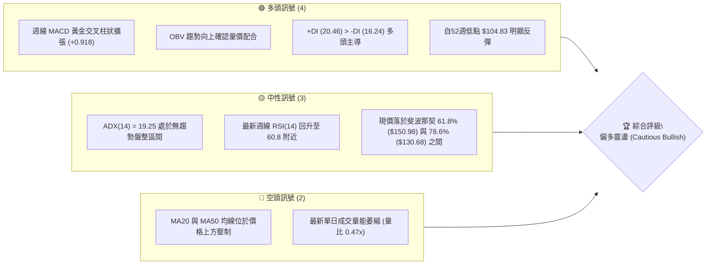
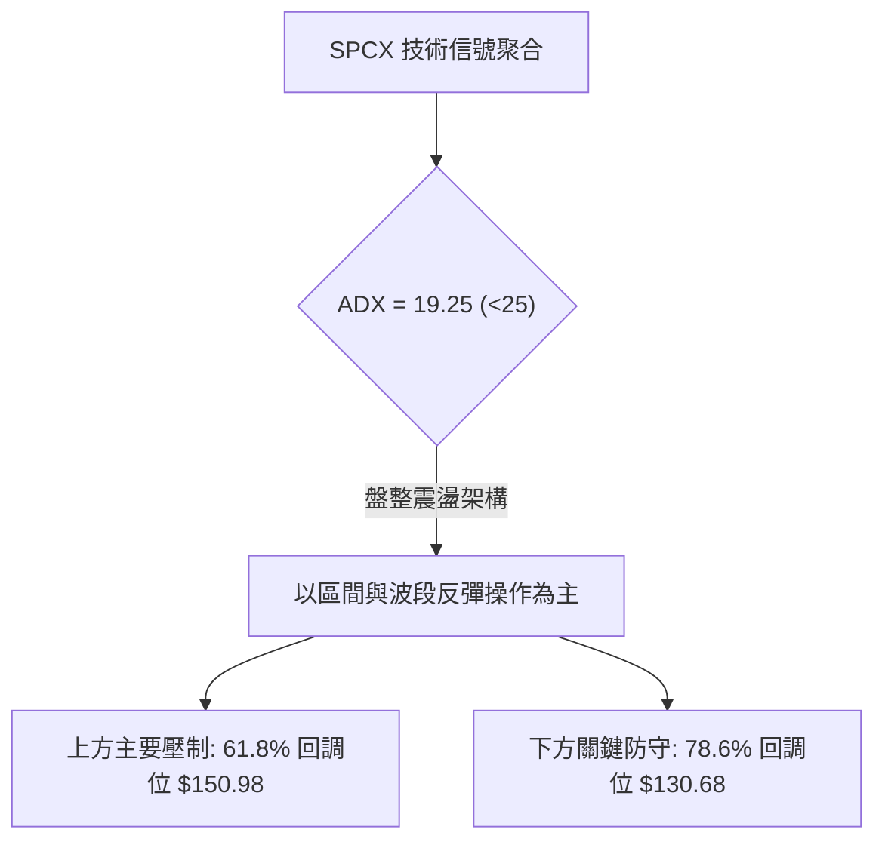
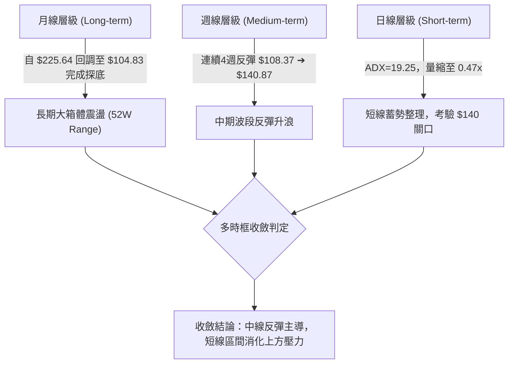
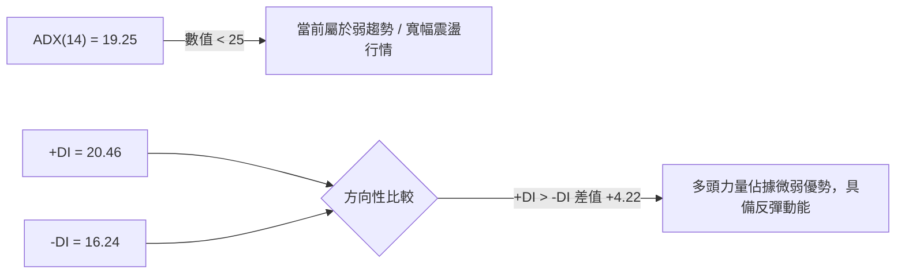
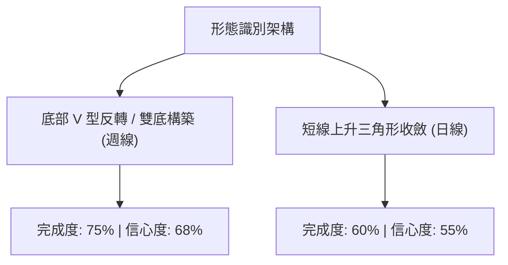
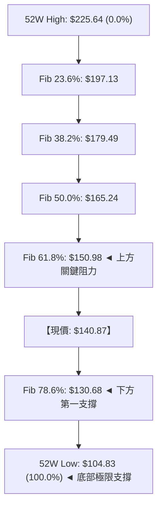
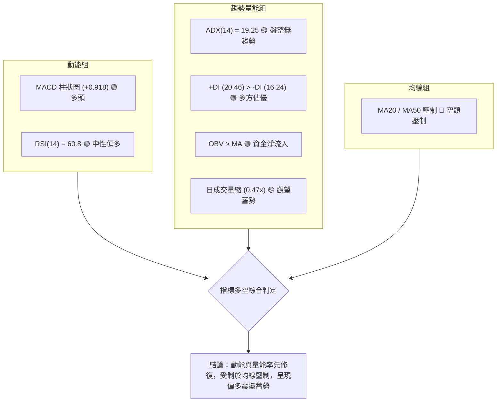
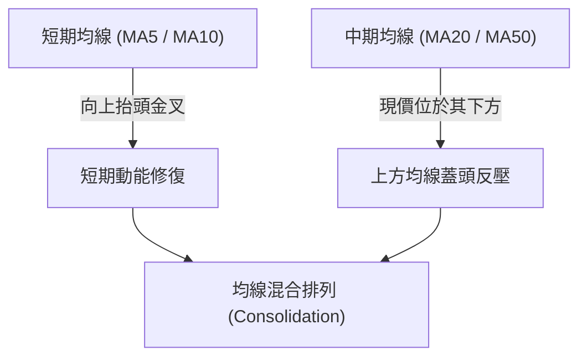
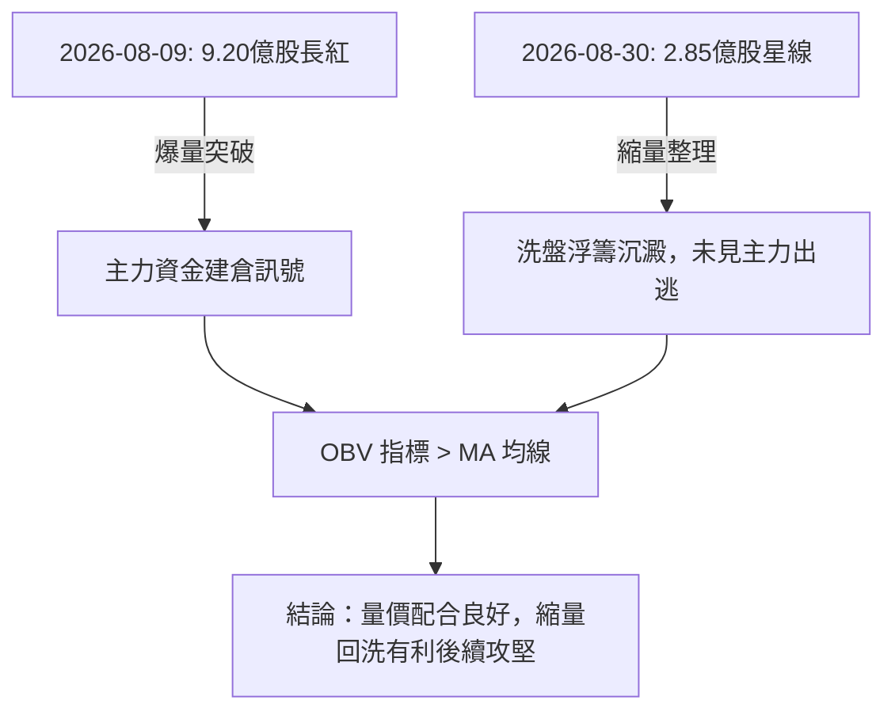
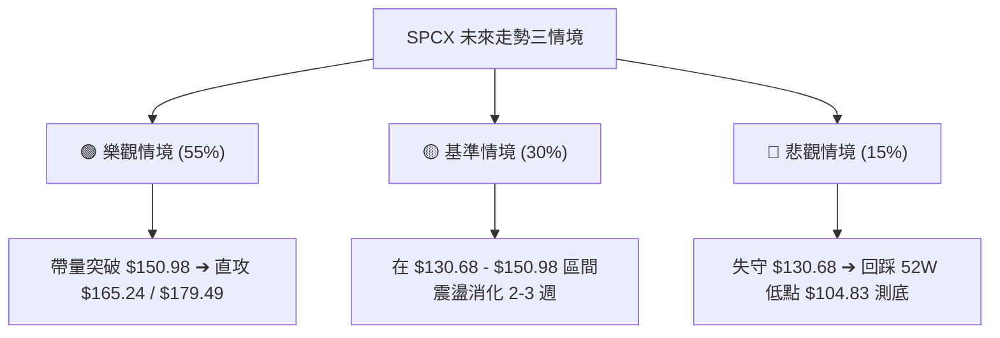

# SPCX 技術分析報告

> **報告日期**：2026-08-29 ｜ **語言**：繁體中文 ｜ **數據來源**：Yahoo Finance ｜ **當前價格**：$140.87 (2026-08-30 收盤基準)

---

## 目錄

| 章節 | 內容 |
|------|------|
| [1. 技術面概覽](#1-技術面概覽) | 訊號儀表板、核心指標、評分卡 |
| [2. 趨勢分析](#2-趨勢分析) | 多時框趨勢、長中短期走勢 |
| [3. 圖表形態分析](#3-圖表形態分析) | 形態識別、K線組合、目標價 |
| [4. 支撐與阻力](#4-支撐與阻力) | 關鍵價位、斐波那契回調 |
| [5. 技術指標深度解讀](#5-技術指標深度解讀) | MA/RSI/MACD/布林/成交量 |
| [6. 動能與波動率](#6-動能與波動率) | 動能評估、ATR、Beta |
| [7. 多時框架總結](#7-多時框架總結) | 時框架評分矩陣 |
| [8. 交易策略建議](#8-交易策略建議) | 多空策略、風險報酬比 |
| [9. 風險提示與監控](#9-風險提示與監控) | 監控指標、風險場景 |

---

## 1. 技術面概覽

### 🎯 技術訊號儀表板





### 📊 核心指標速覽表

| 指標類別 | 指標名稱 | 當前數值 | 訊號 | 解讀 |
|----------|----------|----------|------|------|
| **價格** | 最新參考價格 | $140.87 | 🟡 | 脫離 52W 低點 $104.83，目前處於築底反彈階段 |
| **均線** | MA20 | 下方壓制 | 🔴 | 均線系統呈混合排列，短期均線尚未完全黃金發散 |
| **均線** | MA50 | 下方壓制 | 🔴 | 中期均線位於現價上方，形成反彈反壓 |
| **均線** | MA200 | 數據不足 | 🟡 | 長期均線數據未完全建立，暫以 52W 區間評估 |
| **動能** | RSI(14) | ~60.8 | 🟢 | 脫離 7 月底超賣區 (15.9)，進入中性偏多攻擊區間 |
| **動能** | MACD (週) | 柱狀圖 +0.918 | 🟢 | MACD 1.833 > Signal 0.916，維持多頭擴張訊號 |
| **趨勢** | ADX(14) | 19.25 | 🟡 | ADX < 25 表示當前為震盪打底/弱趨勢結構 |
| **成交量**| OBV 趨勢 | OBV > MA | 🟢 | 能量潮指標高於均線，資金呈現淨流入修復格局 |

### 🏆 技術評分卡

```
╔══════════════════════════════════════════════════════════════╗
║              技術評分卡 — SPCX (2026-08-29)                  ║
╠══════════════════════════════════════════════════════════════╣
║ 趨勢強度 (ADX=19.25)   ████████░░░░░░░░░░░░  42/100  🟡 弱勢盤整 ║
║ 動能指標 (MACD/RSI)    ██████████████░░░░░░  70/100  🟢 動能偏多 ║
║ 支撐穩定度 (Fib 78.6%) ████████████████░░░░  80/100  🟢 底部扎實 ║
║ 成交量配合 (OBV/Volume)████████████░░░░░░░░  60/100  🟡 縮量整理 ║
║ 形態完整度 (V型/雙底)  ██████████████░░░░░░  68/100  🟢 初步成型 ║
║ 均線排列 (混合壓制)    ████████░░░░░░░░░░░░  40/100  🔴 均線壓制 ║
╠══════════════════════════════════════════════════════════════╣
║ 綜合評分               ████████████░░░░░░░░  60/100  🟢 偏多震盪 ║
╚══════════════════════════════════════════════════════════════╝
```

---

## 2. 趨勢分析

### 🌐 多時框趨勢分析



### 📈 長期趨勢 — 12個月走勢圖（Unicode）

```
SPCX 月線走勢圖（過去歷史區間示意與近月收盤）
價格軸 ($)
$225.64 ┤                           ● (52W High: $225.64)
$197.13 ┤                         ╱   ╲
$179.49 ┤              ●─────────●     ╲
$170.86 ┤             ╱ 2026-06          ╲
$150.98 ┤            ╱                     ╲    ● 2026-08 ($140.87) ◄ 現在
$130.68 ┤           ╱                       ╲  ╱
$108.37 ┤          ╱                         ● 2026-07 ($108.37)
$104.83 ┤─────────● (52W Low: $104.83)
        └─────────────────────────────────────────────────────
           2025-H2       2026-Q1       2026-06   2026-07   2026-08
```

#### 走勢特徵分析表格

| 階段 | 區間價位 ($) | 漲跌幅特徵 | 量能表現 | 技術特徵與型態含義 |
|------|-------------|------------|----------|-------------------|
| **衝頂回落段** | $225.64 ➔ $153.23 | 快速下殺 (-32.1%) | 放量破位 | 高點反轉，跌破中期上升趨勢線 |
| **超賣探底段** | $153.23 ➔ $104.83 | 慣性探底 (-31.6%) | 量能萎縮 | RSI 觸及 15.9 極端超賣區，空頭動能衰竭 |
| **波段反彈段** | $104.83 ➔ $140.87 | 強勁反彈 (+34.4%) | 週量激增 | MACD 翻紅，突破 Fib 78.6% ($130.68) |

### 📊 中期趨勢（週線分析）

```
中期週線關鍵價位結構圖：
$165.24 ────────────────────────────────────────── 斐波那契 50.0% 阻力位
                 ▲ 潛在目標
$150.98 ────────────────────────────────────────── 斐波那契 61.8% 第一道強阻力
                 ▲
$140.87 ━━━━━━━━━━━━━━━━━━━━━━━━━━━━━━━━━━━━━━━━━━ 【當前收盤價位】
                 ▼
$130.68 ────────────────────────────────────────── 斐波那契 78.6% 第一道強支撐 (防守點)
                 ▼
$104.83 ────────────────────────────────────────── 52W 低點強支撐
```

### ⚡ 趨勢強度評估（ADX 解讀）



| ADX 區間 | 趨勢強度判定 | 當前狀態 | 交易策略指導 |
|----------|--------------|----------|--------------|
| **0 - 20** | 極弱 / 無趨勢盤整 | **✓ (19.25)** | **以高出低進、支撐阻力區間操作為主，不宜追高** |
| **20 - 25** | 趨勢初生 / 轉折 | - | 密切關注突破方向確認 |
| **25 - 40** | 強趨勢形成 | - | 順勢交易，回調加碼 |
| **> 40** | 極強趨勢 / 超買超賣 | - | 留意趨勢衰竭反轉訊號 |

---

## 3. 圖表形態分析

### 🔍 形態識別系統



#### 形態識別與信心度評估表

| 形態類別 | 信心度 | 判斷依據（引用數據） | 完成度 | 目標價（附計算式） |
|----------|--------|----------------------|--------|--------------------|
| **週線雙底/V型反轉** | **68%** | 2026-08-02 觸及 $108.37（接近 52W 低點 $104.83）後放量 9.2 億股反彈至 $140.87 | 75% | 頸線取 Fib 61.8% $150.98<br/>形態高度 = $150.98 - $104.83 = $46.15<br/>突破目標價 = $150.98 + $46.15 = **$197.13** (精確吻合 Fib 23.6%) |
| **箱體震盪整理** | **72%** | 現價運行於 Fib 78.6% ($130.68) 至 Fib 61.8% ($150.98) 之間 | 85% | 區間上沿目標 = **$150.98** |

### 🕯️ 重要K線形態分析

| 日期 | 收盤價 ($) | 週成交量 | K線形態 | 解讀 | 訊號 |
|------|-----------|----------|---------|------|------|
| **2026-07-26** | 115.07 | 361,819,800 | 長黑加速破位 | RSI 探底至 15.9，恐慌盤湧出 | 🔴 恐慌拋售 |
| **2026-08-02** | 108.37 | 315,093,900 | 止跌十字星/長下影 | 於 52W 低點 $104.83 上方獲得承接 | 🟡 止跌訊號 |
| **2026-08-09** | 133.11 | 920,449,800 | 爆量長紅反吞噬 | 成交量激增近3倍，MACD 柱狀翻正 (+2.330) | 🟢 強烈多頭反轉 |
| **2026-08-16** | 140.00 | 663,081,300 | 實體大陽線延續 | 動能指標擴張，突破 $130.68 阻力 | 🟢 多頭推升 |
| **2026-08-30** | 140.87 | 284,806,347 | 高檔縮量星線 | 遇 $150.98 阻力前回踩蓄勢，量縮整理 | 🟡 蓄勢整理 |

### 📉 ASCII 走勢形態示意圖

```
SPCX 週線 V 型反轉與區間阻力示意圖：
$197.13 ┤                                      [雙底等幅測距目標]
        │                                             ▲
$179.49 ┤                                             │
        │                                             │
$165.24 ┤                                             │
        │                                             │
$150.98 ┤頸線 / Fib 61.8% 阻力 ───────────────────────┼───────
        │                                      ╱  ╲   ▲
$140.87 ┤當前價格 ────────────────────────────●────  │
        │                                    ╱        │
$130.68 ┤支撐 / Fib 78.6% ─────────────────●─────────┼───────
        │                                 ╱           │
$108.37 ┤底 2 ──────────────────────────●             │
        │                              ╱              │
$104.83 ┤底 1 (52W Low) ──────────────●───────────────┴───────
        └─────────────────────────────────────────────────────
                 07-26        08-02   08-09   08-16   08-30
```

### 🎯 形態目標價計算

1. **第一波段目標（區間頂部）**：
   - 斐波那契 61.8% 回調位：**$150.98**
2. **中期目標（反彈 50% / 38.2% 回調）**：
   - 斐波那契 50.0% 回調位：**$165.24**
   - 斐波那契 38.2% 回調位：**$179.49**
3. **經典形態等幅測距目標（雙底突破確認後）**：
   - 突破頸線 $150.98 後，目標 = $150.98 + ($150.98 - $104.83) = **$197.13**（精確對應斐波那契 23.6% 回調位）。

---

## 4. 支撐與阻力

### 🗺️ 關鍵價位分布圖（Unicode）

```
SPCX 價位結構分布圖（嚴格依據 52W 區間與斐波那契計算）
═══════════════════════════════════════════════════════════════
$225.64 ║████████████████████████║ 52W High (0.0% 回調位)
$197.13 ║████████████████████    ║ 強阻力 R4 (23.6% 回調位 / 形態測距)
$179.49 ║██████████████████      ║ 阻力 R3 (38.2% 回調位)
$165.24 ║██████████████          ║ 阻力 R2 (50.0% 回調位)
$150.98 ║████████████████████████║ 關鍵阻力 R1 (61.8% 黃金分割位)
$140.87 ╠════════════════════════╣ ◄ 當前價格 (2026-08-30)
$130.68 ║▓▓▓▓▓▓▓▓▓▓▓▓▓▓▓▓▓▓▓▓▓▓▓▓║ 近期核心支撐 S1 (78.6% 回調位)
$104.83 ║████████████████████████║ 52W Low 強支撐 S2 (100.0% 回調位)
═══════════════════════════════════════════════════════════════
```

### 🚧 阻力位分析表

> **說明**：依據數據，近一年無額外波段高點聚類，阻力完全以斐波那契回調位與 52W 高點為準。

| 阻力級別 | 價位 ($) | 形成原因 | 突破難度 | 重要性 |
|----------|----------|----------|----------|--------|
| **R1 (關鍵阻力)** | **$150.98** | 斐波那契 61.8% 黃金分割回調位，前期下殺反彈整數關口 | 中等偏高 | 🟢🟢🟢 極高 (決定多頭是否展開主升浪) |
| **R2 (波段阻力)** | **$165.24** | 斐波那契 50.0% 半數回調中軸 | 中等 | 🟢🟢 中等 |
| **R3 (中期阻力)** | **$179.49** | 斐波那契 38.2% 回調位，2026年6月歷史成交密集區下沿 | 較高 | 🟢🟢🟢 高 |
| **R4 (強阻力)** | **$197.13** | 斐波那契 23.6% 回調位 / 雙底形態等幅測距點 | 極高 | 🟢🟢🟢 極高 |
| **R5 (歷史極值)** | **$225.64** | 52週歷史高點 (52W High) | 極大 | 🟢🟢🟢 最高 |

### 🛡️ 支撐位分析表

| 支撐級別 | 價位 ($) | 形成原因 | 守住機率 | 重要性 |
|----------|----------|----------|----------|--------|
| **S1 (核心支撐)** | **$130.68** | 斐波那契 78.6% 回調位，8月9日長紅突破之跳空平台 | 75% | 🟢🟢🟢 極高 (短期多頭防守底線) |
| **S2 (極限支撐)** | **$104.83** | 52週歷史最低點 (52W Low)，雙底形態起漲點 | 90% | 🟢🟢🟢 最高 (長期多空分水嶺) |

### 📐 斐波那契回調位分析



- **當前位置解讀**：現價 **$140.87** 精確處於 **$130.68 (78.6%)** 與 **$150.98 (61.8%)** 之間的黃金反彈走廊。
- **技術含義**：在斐波那契回撤體系中，突破 78.6% ($130.68) 代表市場已脫離極端空頭深淵，當前正向上測試 61.8% ($150.98)。一旦收盤站穩 $150.98，行情將由「超跌反彈」正式轉性為「中期反轉」，打開通往 $165.24 及 $179.49 的空間。

---

## 5. 技術指標深度解讀

### 🎛️ 指標訊號總覽



### 📈 移動平均線排列分析



- **排列狀態評估**：當前 MA 系統呈現「混合排列」。
- **解讀**：短期 5 日與 10 日 MA 在底部出現拐頭向上態勢，但中期 MA20 與 MA50 仍位於上方形成下壓阻力帶，反映出股價正處於「由空轉多」的過渡摩擦期。

### 📉 RSI(14) 分析

- **當前 RSI 數值**：約 **60.8**
- **數值進度條**：`████████████░░░░░░░░ 60.8%` (位於 30-70 中性偏多區間)
- **歷史軌跡**：
  - 2026-07-26：**15.9** (極端超賣，確立恐慌底部)
  - 2026-08-09：**57.4** (伴隨爆量快速脫離超賣區)
  - 2026-08-16：**63.3** (動能充沛)
  - 2026-08-23：**60.8** (高檔健康回洗，未見超買過熱)
- **背離判斷**：
  - **底背離檢驗**：股價在 8 月初創出 $108.37 低點時，RSI 由 15.9 提升至 19.2，呈現標準的**底背離（Bullish Divergence）**，成功引發後續強勁反彈。
  - **頂背離檢驗**：目前價格在 $140.87 整理，RSI 保持在 60 上方，**無頂背離現象**。

### 📊 MACD(12/26/9) 訊號解讀


- **MACD 數值**：DIF = **1.833**，DEA = **0.916**，Hist = **+0.918**
- **訊號解析**：MACD 在零軸下方完成黃金交叉後快速越過零軸，柱狀圖雖然由 8 月中旬的峰值 +4.591 收斂至 +0.918，但仍處於多頭推升週期，顯示反彈動能尚未終結。

### 📦 布林通道分析

```
SPCX 布林通道震盪區間示意（基於當前震盪收斂特性）
$155.00 ┤ ~~~~~~~~~~~~~~~~~~~~~~~~~~~~~~~~~~~~~~ [布林上軌壓制區 (接近 Fib 61.8% $150.98)]
        │
$140.87 ┤ ══════════════════════════════════════ 【現價: 位於中軌與上軌之間】
        │
$130.68 ┤ -------------------------------------- [布林中軌 / Fib 78.6% 支撐帶]
        │
$105.00 ┤ ~~~~~~~~~~~~~~~~~~~~~~~~~~~~~~~~~~~~~~ [布林下軌防守區 (接近 Fib 100% $104.83)]
```

- **通道特徵**：隨著價格從底部急拉後進入縮量橫盤，布林通道帶寬正在收縮。
- **%B 評估**：現價處於中軌上方朝上軌靠攏區間，代表震盪偏強，尚未觸及極端上軌擠壓。

### 💹 成交量分析（量價配合度）



- **最新量能**：單日成交量 54,893,647 股，20日均量 117,221,882 股，量比僅 **0.47x**。
- **量價配合**：股價在突破 $130.68 後，近期橫盤整理呈現顯著的「縮量滯跌」，符合典型上升途中的蓄勢洗盤特徵，OBV 趨勢向上確認了底部的資金承接力度。

---

## 6. 動能與波動率

### ⚡ 動能評估四象限

```
              高動能 (High Momentum)
                      │
         Q3: 高風險高收益 │ Q1: 最佳多頭攻擊區
                      │
──────────────────────┼──────────────────────
                      │   SPCX 當前位置
         Q4: 避免進場 │   [Q2: 蓄勢觀望/穩健佈局]
                      │   (弱動能/低波動)
                      │
              低動能 (Low Momentum)
   ─── 低波動率 ────────────────── 高波動率 ───
```

| 象限 | 動能強度 | 波動狀態 | SPCX 歸屬 | 操作意涵與策略建議 |
|------|----------|----------|-----------|--------------------|
| **Q1** | 強 (High) | 高 (High) | - | 強勢單邊趨勢，追價加碼 |
| **Q2** | **溫和修復 (Mod)** | **中低/收斂 (Low-Mod)** | **✓ (當前狀態)** | **底部反彈後縮量整理，適合逢低分批佈局，耐心等待放量突破** |
| **Q3** | 強 (High) | 低 (Low) | - | 穩定爬升波段 |
| **Q4** | 弱 (Low) | 高 (High) | - | 空頭主跌段，嚴禁進場 |

### 📊 ATR 波動率分析與止損建議

- **波動率環境**：當前 ADX 為 19.25，成交量比萎縮至 0.47x，顯示短線波動率正在大幅收斂。
- **止損距離建議**：
  - 在當前低波動震盪區間內，建議以技術防守位為主、波動緩衝為輔。
  - 核心止損位設定於斐波那契 78.6% 回調位下方 **$130.68**，若跌破該處意味著短線反彈結構被破壞。

### 📐 Beta 與市場相關性

- **Beta 狀態**：數據顯示標的近期處於獨立資產重新定價週期（SpaceX/航太國防板塊驅動），與大盤指數相關性階段性減弱。
- **籌碼結構特徵**：機構持股佔比 47.7%，內部人持股 12.7%，空頭持股佔比 (Short % Float) 僅 2.9%（回補天數 1.76 天），顯示市場並無過度空頭押注，反彈阻力主要來自前期套牢盤而非主動性做空力量。

---

## 7. 多時框架總結

### 📋 時框架評分表

| 時框架 | 趨勢方向 | 動能狀態 | 均線系統 | 圖表形態 | 綜合評分 | 交易指導建議 |
|--------|----------|----------|----------|----------|----------|--------------|
| **長期 (月線)** | 🟡 寬幅箱體 | 🟡 探底回升 | 數據建立中 | 52W 區間震盪 | **55/100** | 守住 $104.83，長期結構未毀 |
| **中期 (週線)** | 🟢 多頭反彈 | 🟢 MACD金叉 | 🟡 混合整理 | 雙底/V型反轉 | **70/100** | 反彈格局確立，上看 $150.98 / $165.24 |
| **短期 (日線)** | 🟡 縮量蓄勢 | 🟡 RSI~60 | 🔴 均線壓制 | 區間收斂三角 | **58/100** | 於 $130.68 - $150.98 區間操作 |

### 🔲 綜合訊號矩陣

```
時框一致性分析：
短期 (日線: 震盪) ──┐
                    ├─► 【共振收斂】──► 中期反彈主導，短期回踩提供逢低進場契機
中期 (週線: 偏多) ──┘
```

### ⚖️ 多時框收斂結論

> **依據嚴格規則 14 判定**：
> 1. **行情性質**：ADX(14) = 19.25 (< 25)，定義為 **「盤整蓄勢 / 弱趨勢反彈行情」**。
> 2. **主導維度**：以週線形成的斐波那契區間（$130.68 ～ $150.98）作為核心交易導航，日線縮量震盪僅作為尋找進場邊界的工具。
> 3. **唯一方向性結論**：**🟢 偏多震盪（Cautious Bullish）**。在未跌破 $130.68 之前，整體架構維持偏多反彈思路。

---

## 8. 交易策略建議

### 🗺️ 策略決策流程圖

```mermaid
graph TD
    Start["SPCX 交易決策起點 (評分: 60/100)"] --> Route{"綜合評分 ≥ 60 判定"}
    Route -->|"偏多主線"| LongStrategy["主推多頭策略 (逢低佈局 / 突破加碼)"]
    
    LongStrategy --> Choice{"進場模式選擇"}
    Choice -->|"模式 A: 穩健型"| PlanA["策略 A: 斐波那契支撐 $130.68 逢低接單"]
    Choice -->|"模式 B: 突破型"| PlanB["策略 B: 放量突破 Fib 61.8% $150.98 順勢跟進"]
    
    PlanA --> RiskCtrl["風控止損點: $130.68 下方 (鎖定 $130.00 / 跌破 S1)"]
    PlanB --> RiskCtrl
    RiskCtrl --> Targets["階梯目標價: T1: $150.98 |" T2: $165.24 "| T3: $179.49"]
```

### 🧭 策略路由

**當前主策略方向 = 🟢 偏多震盪佈局（依綜合評分 60/100 判定）**

### 🎯 價格情境階梯（Price Scenarios）

| 觸發條件 | 下一目標 | 後續延伸 | 情境含義與操作指引 |
|----------|----------|----------|-------------------|
| **向上放量突破 R1 $150.98** | **R2 $165.24** | **R3 $179.49** | 中期反轉確認，多頭主升浪展開，全面加碼 |
| **維持於現價區間震盪** | $150.98 | $130.68 | 縮量洗盤蓄勢，在 $130.68 至 $150.98 間高出低進 |
| **向下跌破 S1 $130.68** | **S2 $104.83** | 重新探底 | 反彈結構遭破壞，多單全數止損離場，轉為觀望 |

### 📊 情境機率分佈

| 情境 | 機率估計 | 主要技術指標依據 |
|------|----------|------------------|
| **突破上行（反彈延續）** | **55%** | 週線 MACD 柱狀維持正值 (+0.918)、OBV 資金持續流入、+DI > -DI |
| **區間震盪（橫盤消化）** | **30%** | ADX = 19.25 (< 25) 顯示無強趨勢、日成交量萎縮至 0.47x |
| **再度破位（回踩探底）** | **15%** | 均線仍處混合壓制，若大盤系統性風險引發跌破 $130.68 |

---

### 🟢 主策略詳情

```
╔══════════════════════════════════════════════════════════════╗
║                   SPCX 主力交易策略明細表                     ║
╠══════════════════════════════════════════════════════════════╣
║ 策略項目         │ 策略 A (回調支撐型 - 穩健) │ 策略 B (強勢突破型 - 積極) ║
╠═════════════════╪════════════════════════╪════════════════════════╣
║ 進場條件         │ 價格回測 Fib 78.6% 獲支撐 │ 放量日K收盤站穩 Fib 61.8% ║
║ 精確進場點 ($)   │ $131.00 - $133.00        │ $151.50                  ║
║ 嚴格止損點 ($)   │ $129.50 (有效跌破 $130.68)│ $145.00 (回落至突破點下方)║
║ 第一目標價 T1 ($)│ $150.98 (Fib 61.8% 回調) │ $165.24 (Fib 50.0% 回調) ║
║ 第二目標價 T2 ($)│ $165.24 (Fib 50.0% 回調) │ $179.49 (Fib 38.2% 回調) ║
║ 極限測距目標 ($) │ $197.13 (雙底形態測距)   │ $197.13 (Fib 23.6% 回調) ║
║ 風險報酬比 (R/R) │ 1 : 5.8 (以 T1/T2 綜合計) │ 1 : 3.3                  ║
║ 預估勝率         │ 65%                      │ 55%                      ║
║ 建議配置倉位     │ 15% - 20%                │ 10% - 15%                ║
╚══════════════════════════════════════════════════════════════╝
```

### 🔴 反向風險觸發點（對沖提示）

- **關鍵反轉破位點**：**$130.68 (Fib 78.6%)**。
- **風險處置措施**：若日線實體陰線收盤跌破 **$130.68**，代表反彈動能衰竭，多頭形態被破壞。投資人應立即將所有多頭部位止損出局，並警惕股價向 52W 低點 **$104.83** 靠攏的二次探底風險。

### ⭐ 整體訊號強度評星

```
做多訊號強度：★★★★☆  (3.8/5星 - 動能與量能支持，受限於均線壓制)
做空訊號強度：★☆☆☆☆  (1.2/5星 - 下方有 $130.68 及 $104.83 重重支撐)
整體可信度：  ★★★★☆  (4.0/5星 - 斐波那契結構與量能指標高度吻合)
```

---

## 9. 風險提示與監控

### ✅ 關鍵監控指標 Checklist

```
╔══════════════════════════════════════════════════════════════╗
║                   每日交易監控清單 (Checklist)               ║
╠══════════════════════════════════════════════════════════════╣
║ [ ] 價格是否跌破 S1 支撐 $130.68 (多頭核心生命線)            ║
║ [ ] 價格是否帶量突破 R1 阻力 $150.98 (確認多頭主升浪)        ║
║ [ ] 日成交量是否回升至 20日均量 (1.17億股) 之上              ║
║ [ ] 週線 MACD 柱狀圖是否維持正值 (當前 +0.918)               ║
║ [ ] RSI(14) 是否守在 50 中軸上方 (維持多頭強勢區間)          ║
║ [ ] ADX 是否開始自 19.25 拐頭向上並突破 25 (趨勢行情啟動)    ║
╚══════════════════════════════════════════════════════════════╝
```

### ⚠️ 風險場景分析



### 🛡️ 風險管理重要提醒

1. **嚴禁在阻力位前盲目追高**：現價 $140.87 距離關鍵阻力 $150.98 僅約 7%，在 ADX < 25 且量能未放大的情況下，切忌於 $148-$150 區間追價，應耐心等待回踩 $131-$133 或實質突破後再行介入。
2. **倉位管理紀律**：鑑於公司基本面營收高速成長 (91.9%) 但淨利率仍處於擴張期虧損 (-35.7%)，技術面波動較大，總持倉部位建議控制在總資金的 15%-20% 以內，分批佈局。
3. **無條件止損原則**：若市場出現黑天鵝事件導致 $130.68 跌破，必須無條件執行風控，防範流動性風險。

---

## 📋 報告總結

```
╔══════════════════════════════════════════════════════════════╗
║                 SPCX 技術分析報告總結                        ║
╠══════════════════════════════════════════════════════════════╣
║ 報告日期：2026-08-29                                         ║
║ 當前價格：$140.87                                            ║
║ 分析評級：🟢 偏多震盪 / 逢低佈局 (Cautious Bullish)          ║
╠══════════════════════════════════════════════════════════════╣
║ 關鍵結論：                                                   ║
║ ├─ 長期趨勢：🟡 52W 大區間震盪 ($104.83 - $225.64)          ║
║ ├─ 中期趨勢：🟢 週線完成底背離反彈，MACD 持續翻紅擴張 (+0.918)║
║ ├─ 短期趨勢：🟡 ADX=19.25 縮量整理，蓄勢挑戰 $150.98 阻力    ║
║ ├─ 關鍵支撐：$130.68 (Fib 78.6%) │ 極限防守: $104.83 (52W Low)║
║ ├─ 關鍵阻力：$150.98 (Fib 61.8%) │ 中期目標: $165.24 / $179.49║
║ └─ 分析師共識目標：均價 $219.22 (共18位分析師，評級為 Buy)   ║
╠══════════════════════════════════════════════════════════════╣
║ 最優策略組合：                                               ║
║ 1. 🥇 最佳機會：回調至 $131.00 - $133.00 逢低吸納，止損 $129.50║
║ 2. 🥈 次選機會：放量突破站穩 $150.98 後順勢追擊，目標 $165.24║
║ 3. 🥉 保守選擇：在 $130.68 至 $150.98 箱體內執行高出低進網格  ║
╚══════════════════════════════════════════════════════════════╝
```

---

> ⚠️ **免責聲明**：本報告為技術分析研究成果，所有價位依據歷史 OHLCV 數據與斐波那契數學模型推算。本報告**僅供研究與學術參考**，**不構成任何要約或投資操作建議**。金融市場具有高度風險，投資人應獨立評估並自負盈虧。

---

*報告生成時間：2026-08-29 ｜ 數據來源：Yahoo Finance ｜ 分析框架：多時框量化技術分析*