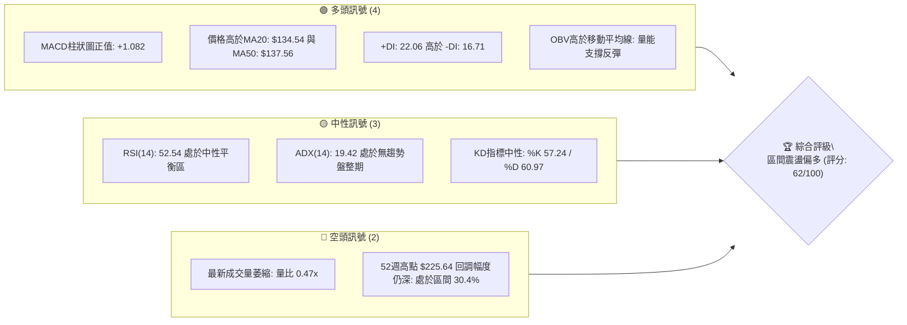
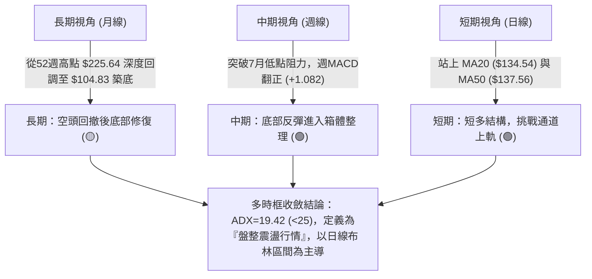
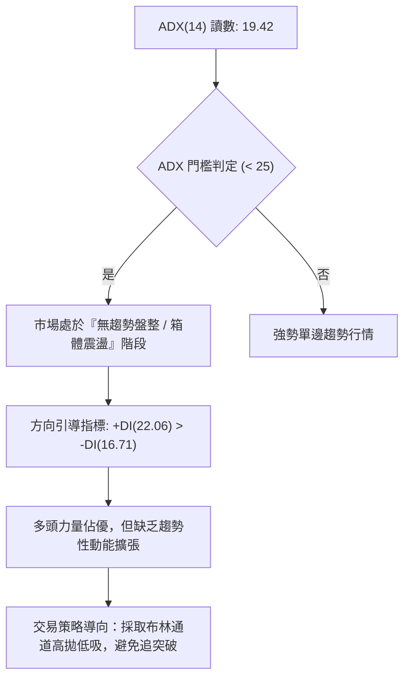
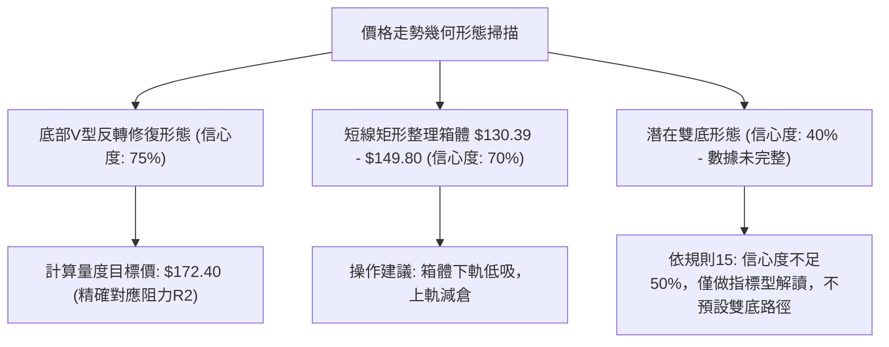
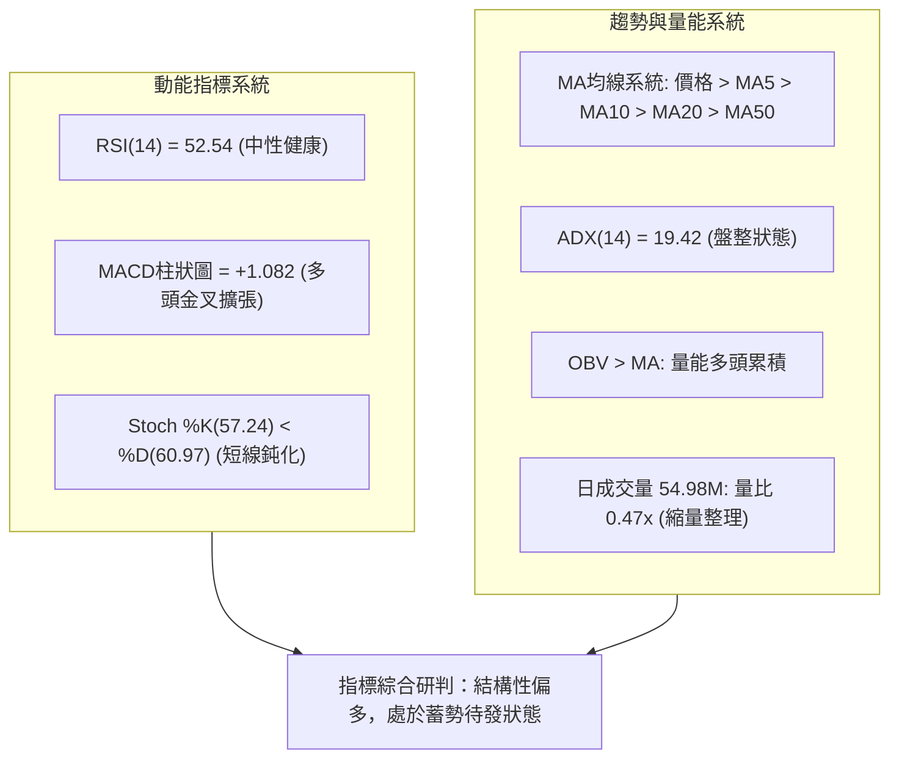
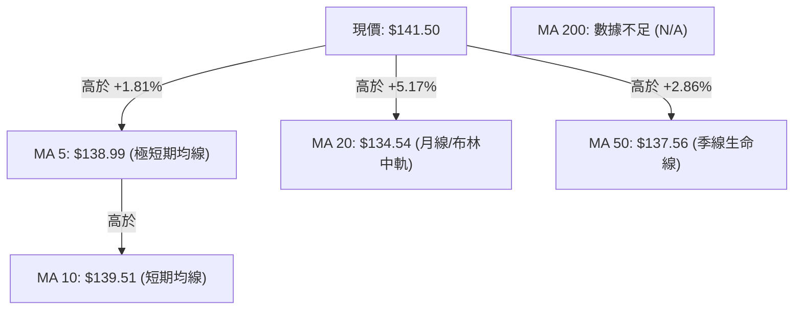
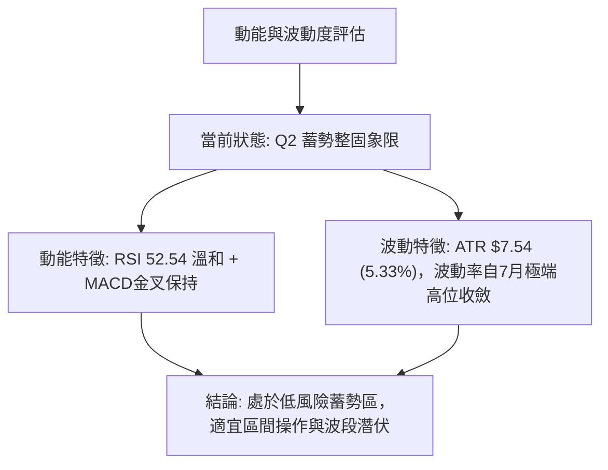
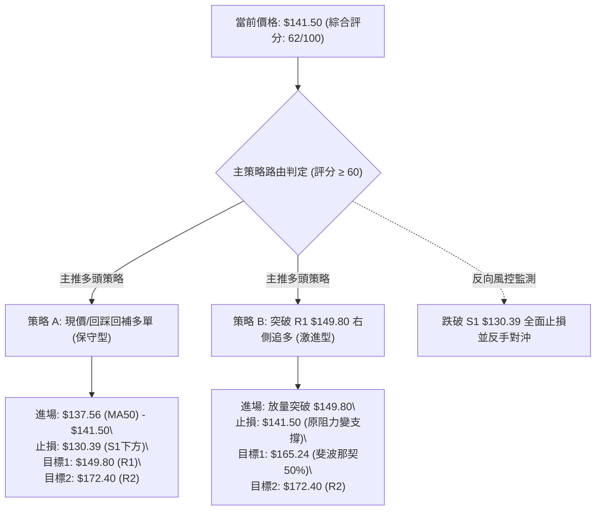
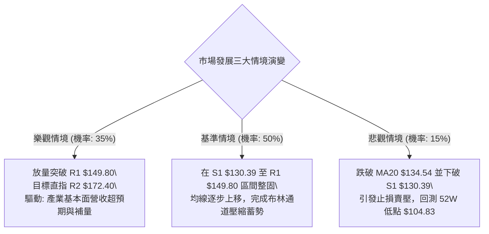

# SPCX 技術分析報告

> **報告日期**：2026-08-31 ｜ **語言**：繁體中文 ｜ **數據來源**：Yahoo Finance ｜ **當前價格**：$141.50

---

## 目錄

| 章節 | 內容 |
|------|------|
| [1. 技術面概覽](#1-技術面概覽) | 訊號儀表板、核心指標、評分卡 |
| [2. 趨勢分析](#2-趨勢分析) | 多時框趨勢、長中短期走勢 |
| [3. 圖表形態分析](#3-圖表形態分析) | 形態識別、K線組合、目標價 |
| [4. 支撐與阻力](#4-支撐與阻力) | 關鍵價位、斐波那契回調 |
| [5. 技術指標深度解讀](#5-技術指標深度解讀) | MA/RSI/MACD/布林/成交量 |
| [6. 動能與波動率](#6-動能與波動率) | 動能評估、ATR、Beta |
| [7. 多時框架總結](#7-多時框架總結) | 時框架評分矩陣 |
| [8. 交易策略建議](#8-交易策略建議) | 多空策略、風險報酬比 |
| [9. 風險提示與監控](#9-風險提示與監控) | 監控指標、風險場景 |

---

## 1. 技術面概覽

### 🎯 技術訊號儀表板



### 📊 核心指標速覽表

| 指標類別 | 指標名稱 | 當前數值 | 訊號 | 解讀 |
|----------|----------|----------|------|------|
| **價格** | 當前價格 | $141.50 | 🟢 | 自8月低點 $108.37 強勁反彈，站上短中期均線 |
| **均線** | MA20 | $134.54 | 🟢 | 價格位於MA20上方 (+5.17%)，短期多頭支撐確立 |
| **均線** | MA50 | $137.56 | 🟢 | 價格突破MA50 (+2.86%)，中期下行壓力暫時緩解 |
| **均線** | MA200 | N/A | 🟡 | 數據不足，長期趨勢由52週區間替代分析 |
| **動能** | RSI(14) | 52.54 | 🟡 | 位於50中軸上方，動能溫和中性，無超買超賣 |
| **動能** | MACD (12/26/9) | 2.039 / 0.957 (柱: +1.082) | 🟢 | 快線高於慢線，柱狀圖保持正向擴張 |
| **趨勢** | ADX(14) | 19.42 (+DI: 22.06, -DI: 16.71) | 🟡 | ADX < 25 表明處於盤整震盪，多頭略佔優勢 |
| **通道** | 布林通道 %B | 0.66 (中軌 $134.54, 上軌 $155.88) | 🟢 | 運行於中軌與上軌之間的多頭通道內 |
| **量能** | 當日量 / 20日均量 | 54.98M / 117.23M (量比: 0.47x) | 🔴 | 上漲過程中成交量未顯著放大，呈現量縮整理 |
| **波動** | ATR(14) | $7.54 (5.33% 價格波動) | 🟡 | 波動度適中，日間平均波動幅度約 7.54 美元 |

### 🏆 技術評分卡

```
╔══════════════════════════════════════════════════════════════╗
║              SPCX 技術評分卡 (2026-08-31)                    ║
╠══════════════════════════════════════════════════════════════╣
║ 趨勢強度 (ADX/DI)   ████████░░░░░░░░░░░░  42/100  🟡 弱勢趨勢║
║ 動能指標 (RSI/MACD) ██████████████░░░░░░  70/100  🟢 動能偏多║
║ 支撐穩定度 (S1/S2)  ████████████████░░░░  78/100  🟢 築底堅實║
║ 成交量配合度 (OBV)  ██████████░░░░░░░░░░  50/100  🟡 量能中性║
║ 形態完整度 (圖表)   ████████████░░░░░░░░  60/100  🟡 箱體成型║
║ 均線排列系統        ██████████████░░░░░░  72/100  🟢 短多排列║
╠══════════════════════════════════════════════════════════════╣
║ 綜合技術評分        ████████████░░░░░░░░  62/100  🟢 偏多震盪║
╚══════════════════════════════════════════════════════════════╝
```

---

## 2. 趨勢分析

### 🌐 多時框趨勢分析



### 📈 長期趨勢 — 12個月走勢圖（Unicode）

```
SPCX 歷史價格走勢與關鍵位置圖（2025-09 至 2026-08）
價格軸 ($)
$230 ┤                                         
$225 ┤              ● (52W高點 $225.64)        
$200 ┤             ╱ ╲                         
$180 ┤     ●      ╱   ╲       ● (2026-06: $170.86)
$160 ┤    ╱ ╲    ╱     ╲     ╱ ╲               
$140 ┤───●───●──●───────●───●───●←───現價 $141.50 (2026-08)
$120 ┤  ╱                 ╲ ╱                  
$105 ┤ ╱                   ● (52W低點 $104.83 / 2026-07: $108.37)
     └─┬──┬──┬──┬──┬──┬──┬──┬──┬──┬──┬──┬────────
      M1 M2 M3 M4 M5 M6 M7 M8 M9 M10 M11 M12 (2026-08)
```

**走勢特徵分析表格**：

| 階段 | 時間區間 | 價格區間 | 階段特徵 | 結構研判 |
|------|----------|----------|----------|----------|
| **牛市衝頂** | 2025下半年至2026初 | $150.00 → $225.64 | 放量拉升，創下52週歷史高點 | 主升浪結束，籌碼發散 |
| **深度回撤** | 2026-06 至 2026-07 | $170.86 → $104.83 | 單月暴跌超過 36%，空頭恐慌釋放 | 觸及年內極限支撐 $104.83 |
| **底部回升** | 2026-07 至 2026-08 | $108.37 → $141.50 | 月線強勢收陽 (+30.57%)，收復MA50 | V型修復進入第一阻力區間 |

### 📊 中期趨勢（週線分析）

```
SPCX 近期週線壓力與支撐結構示意圖
$172.40 ─── ══════════════════════════════════════════ 阻力 R2 (6月反彈高點聚類)
            ↑
$149.80 ─── ────────────────────────────────────────── 阻力 R1 (斐波那契 61.8% / 阻力區間)
            ↑ 
$141.50 ─── [▲ 現價位置：突破 MA50，於 $136.97-$141.50 進行週線級別平台整理]
            ↓
$130.39 ─── ────────────────────────────────────────── 支撐 S1 (斐波那契 78.6% $130.68 / S1聚類)
            ↓
$104.83 ─── ══════════════════════════════════════════ 支撐 S2 (52W最低點 / 年度絕對鐵底)
```

近20週數據顯示，價格自 2026-07-26 觸及 RSI 15.9 的極度超賣區後，於 2026-08-02 的 $108.37 見底。隨後在 2026-08-09 週伴隨 9.20 億股的巨量陽線（RSI 升至 57.4，MACD柱轉正為 +2.330）展開強勢報復性反彈，目前在 $136.97 至 $141.50 進行週線級別的換手整固。

### ⚡ 趨勢強度評估（ADX 解讀）



| 指標名稱 | 當前數值 | 參考閾值 | 狀態解讀 |
|----------|----------|----------|----------|
| **ADX(14)** | **19.42** | 25.00 | **弱趨勢 / 盤整行情**：當前不具備單邊暴漲或暴跌的趨勢動能 |
| **+DI** | **22.06** | - | 多方進攻力量，處於主導地位 |
| **-DI** | **16.71** | - | 空方打壓力量，持續衰退中 |
| **方向差距 (+DI - -DI)** | **+5.35** | 0.00 | 多方佔優，反彈結構依然保持完整 |

---

## 3. 圖表形態分析

### 🔍 形態識別系統



**形態信心度與目標價評估表**：

| 形態名稱 | 信心度 | 判斷依據（引用數據） | 完成度 | 目標價（附計算式） |
|----------|--------|----------------------|--------|--------------------|
| **底部V型反轉修復** | **75%** | 2026-08-02 低點 $108.37 獲巨量 9.20 億股支撐，連續突破 MA20 ($134.54) 及 MA50 ($137.56) | 85% | 突破頸線 $137.56，量度目標 = $137.56 + ($137.56 - $104.83) = $170.29（對應阻力 R2 **$172.40**） |
| **短線箱體整固** | **70%** | 價格在 S1 ($130.39) 與 R1 ($149.80) 之間縮量震盪已達3週 | 60% | 箱體上軌目標 = **$149.80** |
| **大級別雙重底** | **40%** | 僅有單一低點 $104.83-$108.37，尚未出現二次回踩確認 | 20% | 數據不足以確立雙底，依規則15僅作指標解讀 |

### 🕯️ 重要K線形態分析

| 週期/日期 | 收盤價 | K線形態 | 解讀 | 訊號 |
|-----------|--------|---------|------|------|
| **2026-07 月線** | $108.37 | 長下影大陰線 | 觸及 52W 低點 $104.83 後出現極限買盤介入，超賣釋放完畢 | 🟡 止跌訊號 |
| **2026-08-09 週** | $133.11 | 巨量吞噬大陽線 | 單週暴漲 +22.8%，成交量放大至 9.20 億股，主力大資金進場確認 | 🟢 強烈買入 |
| **2026-08-23 週** | $136.97 | 縮量十字星回踩 | 測試 MA20 支撐有效，量能萎縮至 4.76 億股，屬健康洗盤 | 🟢 支撐確認 |
| **2026-08-30 週** | $141.50 | 溫和小陽線收高 | 站穩 MA50 ($137.56)，MACD柱保持正擴張，多方穩步推進 | 🟢 偏多續航 |

### 📉 ASCII 走勢形態示意圖

```
SPCX 底部修復與短線箱體震盪形態示意圖
$172.40 ┤                                           [阻力 R2]
        │                                          ╱
$149.80 ┤─── 頸線 / 箱體頂部 ─────────────────────●───── [阻力 R1]
        │                                  ╱ ╲   ╱
$141.50 ┤.................................●...╲.●... [現價: 突破MA50整固]
        │                                ╱     V
$134.54 ┤─── MA20 / 箱體支撐 ───────────●─────────── [支撐 S1: $130.39]
        │                              ╱
$104.83 ┤─── 52W 絕對底部 ────────────●───────────── [支撐 S2: 巨量反轉起點]
        └───────────────────────────────────────────
         2026-07                     2026-08         未來演變路徑
```

### 🎯 形態目標價計算

1. **箱體突破目標**：
   - 箱體底部：S1 = **$130.39**
   - 箱體頂部：R1 = **$149.80**
   - 箱體垂直高度：$149.80 - $130.39 = $19.41
   - 理論向上突破目標：$149.80 + $19.41 = **$169.21**（逼近 R2 **$172.40**）
2. **斐波那契回撤修復目標**：
   - 當前價格 $141.50 已脫離 78.6% 回調位（$130.68），第一目標為 61.8% 回調位 **$150.98**（與 R1 $149.80 共振），第二目標為 50.0% 回調位 **$165.24**，最終目標為 38.2% 回調位 **$179.49**。

---

## 4. 支撐與阻力

### 🗺️ 關鍵價位分布圖（Unicode）

```
╔══════════════════════════════════════════════════════════════╗
║              SPCX 價位結構分布圖 (由 OHLCV 確定)             ║
╠══════════════════════════════════════════════════════════════╣
║ $225.64 ║████████████████████████║ 52W 歷史最高點 (0.0% 回調)║
║ $197.13 ║██████████████          ║ 斐波那契 23.6% 回調位    ║
║ $179.49 ║████████████████        ║ 斐波那契 38.2% 回調位    ║
║ $172.40 ║████████████████████    ║ 關鍵阻力 R2 (前波波段高點)║
║ $165.24 ║████████████            ║ 斐波那契 50.0% 中軸平衡位║
║ $155.88 ║██████████████████      ║ 布林通道日線上軌壓力     ║
║ $150.98 ║████████████████████    ║ 斐波那契 61.8% 強阻力位  ║
║ $149.80 ║████████████████████████║ 關鍵阻力 R1 (近一年波段高)║
║---------╠════════════════════════╣--------------------------║
║ $141.50 ╠ ◄◄◄ 當前收盤價 ◄◄◄     ║ 現價 (站上 MA20 / MA50)  ║
║---------╠════════════════════════╣--------------------------║
║ $137.56 ║▓▓▓▓▓▓▓▓▓▓▓▓▓▓▓▓        ║ 中期均線 MA50 支撐       ║
║ $134.54 ║▓▓▓▓▓▓▓▓▓▓▓▓▓▓▓▓▓▓      ║ 短期均線 MA20 / 布林中軌 ║
║ $130.68 ║▓▓▓▓▓▓▓▓▓▓▓▓▓▓▓▓▓▓▓▓    ║ 斐波那契 78.6% 回調位    ║
║ $130.39 ║▓▓▓▓▓▓▓▓▓▓▓▓▓▓▓▓▓▓▓▓▓▓  ║ 關鍵支撐 S1 (近一年波段低)║
║ $113.19 ║▓▓▓▓▓▓▓▓▓▓▓▓▓▓          ║ 布林通道日線下軌支撐     ║
║ $104.83 ║████████████████████████║ 絕對強支撐 S2 (52W 低點) ║
╚══════════════════════════════════════════════════════════════╝
```

### 🚧 阻力位分析表

| 阻力級別 | 價位 | 形成原因 | 突破難度 | 重要性 |
|----------|------|----------|----------|--------|
| **R1 (第一阻力)** | **$149.80** | 近一年波段高點聚類，重合斐波那契 61.8% ($150.98) | 中等 (需要成交量放大至 1 億股以上) | 🟢🟢🟢 極高 (短線多空分水嶺) |
| **通道上軌阻力** | **$155.88** | 日線布林通道上軌，動態壓制位 | 中高 (面臨超買乖離回踩) | 🟢🟢 中等 |
| **R2 (強阻力)** | **$172.40** | 2026年6月大跌前的波段平台高點聚類 | 極高 (大量歷史套牢籌碼) | 🟢🟢🟢 極高 (中期反轉確認點) |

### 🛡️ 支撐位分析表

| 支撐級別 | 價位 | 形成原因 | 守住機率 | 重要性 |
|----------|------|----------|----------|--------|
| **均線動態支撐** | **$134.54** | MA20 與布林中軌共振，短線進攻防守線 | 75% | 🟢🟢 中等 |
| **S1 (關鍵支撐)** | **$130.39** | 近一年波段低點聚類，重合斐波那契 78.6% ($130.68) | 85% | 🟢🟢🟢 極高 (多頭波段防線) |
| **S2 (極限鐵底)** | **$104.83** | 52週歷史最低點，主力巨量護盤發起點 | 95% | 🟢🟢🟢 極高 (年度生命線) |

### 📐 斐波那契回調位分析

依據 52 週極值區間（低點 **$104.83** → 高點 **$225.64**，垂直落差 $120.81）精確計算之黃金分割結構：

```
0.0% (52W High) ────────── $225.64 
23.6%           ────────── $197.13 
38.2%           ────────── $179.49 
50.0%           ────────── $165.24 
61.8%           ────────── $150.98 ◄── [上方關鍵反彈阻力區間]
                     ▲
                 [$141.50 當前價格位置：運行於 78.6% 與 61.8% 之間]
                     ▼
78.6%           ────────── $130.68 ◄── [下方關鍵回撤支撐，重合 S1 $130.39]
100.0% (52W Low)────────── $104.83 
```

**解讀**：現價 **$141.50** 正處於黃金分割 **78.6% ($130.68)** 與 **61.8% ($150.98)** 之間。突破 $150.98 將打開邁向 50.0% ($165.24) 及 38.2% ($179.49) 的中級反彈空間；若跌破 $130.68，則預示反彈失敗，將再度考驗 100.0% 底部 **$104.83**。

---

## 5. 技術指標深度解讀

### 🎛️ 指標訊號總覽



### 📈 移動平均線排列分析



| 均線名稱 | 當前價格 | 與現價乖離率 | 走勢特徵 | 訊號判定 |
|----------|----------|--------------|----------|----------|
| **MA 5** | $138.99 | +1.81% | 向上攀升，提供短線貼身支撐 | 🟢 看多 |
| **MA 10** | $139.51 | +1.42% | 拐頭向上，穿越 MA20/MA50 | 🟢 看多 |
| **MA 20** | $134.54 | +5.17% | 底部大幅抬升，形成第一防線 | 🟢 看多 |
| **MA 50** | $137.56 | +2.86% | 成功收復，中期空頭排列被打破 | 🟢 看多 |
| **MA 200** | N/A | - | 資料不足，長線由52W結構替代 | 🟡 中性 |

**排列結論**：短期均線（MA5、MA10、MA20）已全數向上穿越中期 MA50，呈現「短多排列」格局，提供現價下方堅實支撐。

### 📉 RSI(14) 分析

```
RSI(14) 當前數值：52.54
[0] ────────────── [30 超賣] ─────── [52.54 現值] ─────── [70 超買] ────────────── [100]
                    ░░░░░░░░░░░░░░░░█████████████░░░░░░░░░░░░
```

- **數值解讀**：RSI 報 52.54，自7月下旬的極度超賣區（15.9）大幅修復至 50 中軸上方，既未進入 70 以上的超買過熱區，也徹底擺脫弱勢空頭區，顯示多頭具備進一步推升的動能餘裕。
- **背離分析**：
  - **頂背離判定**：**無頂背離**。近期價格高點伴隨 RSI 回升，未出現價創新高而 RSI 走低之現象。
  - **底背離判定**：**無底背離**。7月底低點已完成底背離修復，當前處於良性推升階段。

### 📊 MACD(12/26/9) 訊號解讀


週線 MACD 柱自 2026-07-19 的低點 -3.362 連續翻揚，於 2026-08-09 正式翻正為 +2.330，最新一週維持在 +1.082。快慢線於零軸上方保持金叉張口，確認中期反彈動能尚未衰竭。

### 📦 布林通道分析

```
SPCX 日線布林通道結構 (帶寬: $42.69 / 30.17%)
$155.88 ┬────────────────────────────────────────── 布林上軌 (+10.16% 空間)
        │
$141.50 ┼────────────────── ● 現價 ($141.50, %B = 0.66)
        │                   ↑ (處於中軌上方強勢區)
$134.54 ┼───────────────────┼────────────────────── 布林中軌 (MA20 支撐)
        │
$113.19 ┴───────────────────┴────────────────────── 布林下軌
```

當前 %B 指標為 **0.66**，價格穩固運行於布林中軌（$134.54）與上軌（$155.88）之間的多方強勢通道。上軌 $155.88 將與斐波那契 $150.98 / 阻力 R1 $149.80 形成短線共振壓力帶。

### 💹 成交量分析（量價配合度）

1. **量能萎縮現象**：最新成交量為 54,984,600 股，相較於 20 日均量（117,226,430 股）大幅萎縮，量比僅為 **0.47x**。
2. **OBV 累積能量線**：數據顯示「OBV > MA」，表明在 8 月初以 9.20 億股巨量建倉後，近期的量縮回調並未引發主力資金出逃，籌碼鎖定良好，屬於典型的「量縮價穩」蓄勢特徵。
3. **量價背離檢驗**：目前價格小幅走高而量能縮減，提示在衝擊阻力 R1 **$149.80** 時必須補量（日量回升至 1 億股以上），否則容易在上軌受阻回落。

---

## 6. 動能與波動率

### ⚡ 動能評估四象限

| 象限 | 動能維度 | 波動率維度 | SPCX 當前狀態 | 戰術應對評估 |
|------|----------|------------|---------------|--------------|
| **Q1 (突破加速)** | 動能強 (RSI>60) | 波動低 (ATR下降) | ─ | 最佳趨勢加碼點 |
| **Q2 (蓄勢整固)** | **動能溫和 (RSI 52.54)** | **波動收斂 (ATR $7.54)** | **✓ 當前所處位置** | **區間內逢低佈局，等待突破** |
| **Q3 (極端博弈)** | 動能強 (RSI>70) | 波動高 (ATR急升) | ─ | 高風險博弈，嚴設移動停利 |
| **Q4 (弱勢出清)** | 動能弱 (RSI<40) | 波動高 (恐慌拋售) | ─ | 避開進場，已於7月結束 |



### 📊 ATR 波動率分析

- **ATR(14) 數值**：**$7.54**（佔當前股價之 **5.33%**）。
- **波動意義**：該數值反映 SPCX 當前每日平均正常波動區間約為 ±$7.54。
- **風控與止損建議距離**：
  - **日內短線止損**：1.0 × ATR = **$7.54**（距進場點下方 $7.54）。
  - **波段交易止損**：1.5 × ATR = **$11.31**（建議設於 $141.50 - $11.31 = **$130.19**，完美保護於支撐 S1 **$130.39** 之下）。

### 📐 Beta 與市場相關性

- **Beta 數據**：官方數據標記 N/A（作為巨型商業航天與衛星通訊新龍頭，估值與成長性兼具）。
- **市場特徵分析**：
  - 空頭部位佔比（Short % Float）僅 **2.9%**，空頭回補天數（Short Ratio）為 **1.76**，軋空風險較低，籌碼面結構健康。
  - 機構持股比例達 **47.7%**，內部人持股達 **12.7%**，籌碼集中度高，走勢受自身產業催化與基本面（營收 YoY +91.9%）驅動更甚於大盤指數。

---

## 7. 多時框架總結

### 📋 時框架評分表

| 時框架 | 趨勢方向 | 動能 (RSI/MACD) | 均線排列 | 圖表形態 | 綜合評分 | 戰術建議 |
|--------|----------|-----------------|----------|----------|----------|----------|
| **短期 (日線)** | 🟢 震盪走高 | 🟢 RSI 52.5 / MACD金叉 | 🟢 位於 MA20/MA50 上方 | 🟢 箱體上軌進攻 | **75 / 100** | 逢回踩均線做多 |
| **中期 (週線)** | 🟢 底部反彈 | 🟢 週MACD柱翻正 (+1.082) | 🟡 收復短期均線 | 🟡 巨量吞噬後整固 | **65 / 100** | 波段持有，目標 R1/R2 |
| **長期 (月線)** | 🟡 深度修復 | 🟡 自極度超賣修復 | 🔴 52W高點回撤仍在 | 🟡 探底回升陽線 | **45 / 100** | 長線分批建倉 |

### 🔲 綜合訊號矩陣

```
╔══════════════════════════════════════════════════════════════╗
║              SPCX 多時框架訊號矩陣評估                       ║
╠═════════════╦══════════════╦══════════════╦══════════════════╣
║ 維度        ║ 短期 (日線)  ║ 中期 (週線)  ║ 長期 (月線/年線) ║
╠═════════════╬══════════════╬══════════════╬══════════════════╣
║ 趨勢方向    ║ 🟢 偏多      ║ 🟢 偏多      ║ 🟡 中性修復      ║
║ 動能狀態    ║ 🟢 MACD金叉  ║ 🟢 柱狀翻正  ║ 🟡 脫離超賣      ║
║ 支撐強度    ║ 🟢 MA20確立  ║ 🟢 S1 堅固   ║ 🟢 S2 絕對底部   ║
║ 量能確認    ║ 🔴 縮量整理  ║ 🟢 底部巨量  ║ 🟡 換手充分      ║
║ 訊號一致性  ║ 🟢 短中期呈現高度共振向上，長期空頭壓制逐步淡化 ║
╚═════════════╩══════════════╩══════════════╩══════════════════╝
```

### ⚖️ 多時框收斂結論

依據技術分析規範（嚴格要求 14）：
1. **行情屬性判定**：當前 ADX(14) 數值為 **19.42 (< 25)**，明確定義當前市場為**「盤整震盪行情」**。
2. **主導時框收斂**：在盤整行情下，以**日線布林通道（$113.19 - $155.88）及 S1 ($130.39) - R1 ($149.80) 箱體區間**作為主要交易指導。
3. **方向性唯一結論**：**「區間震盪偏多」**。日線均線呈現短多排列，週線巨量底部確立，中期動能支持向上測試 R1 **$149.80** 及布林上軌 **$155.88**。

---

## 8. 交易策略建議

### 🗺️ 策略決策流程圖



### 🧭 策略路由

**當前主策略方向 = 偏多震盪操作（依技術評分卡：62 / 100，≥60 進入多頭主策略路徑）**

### 🎯 價格情境階梯（Price Scenarios）

所有價位均嚴格引用第 4 章由 OHLCV 與斐波那契計算之數值：

| 觸發條件 | 第一目標 | 第二目標 | 後續延伸 | 情境含義與操作要領 |
|----------|----------|----------|----------|--------------------|
| **放量突破 R1 $149.80** | **$155.88** (布林上軌) | **$165.24** (斐波50%) | **$172.40** (阻力R2) | 短線強勢爆發，打開邁向 $172.40 中期反彈空間 |
| **維持於 $134.54 - $149.80** | **$149.80** (阻力R1) | — | — | 處於標準箱體整固，採取高拋低吸網格交易 |
| **有效跌破 S1 $130.39** | **$113.19** (布林下軌) | **$104.83** (支撐S2) | — | 反彈結構遭破壞，回防 52W 鐵底，多單全面撤離 |

### 📊 情境機率分佈

| 情境劇本 | 發生機率 | 主要判定依據 |
|----------|----------|--------------|
| **情境一：震盪走高 / 向上突破** | **60%** | MACD柱維持正值 (+1.082)、價格站上 MA20/MA50、+DI (22.06) 主導、OBV量能累積 |
| **情境二：箱體窄幅震盪** | **25%** | ADX 僅 19.42 顯示無單邊趨勢、當前成交量縮（量比 0.47x）、RSI 處於 52.54 中性區 |
| **情境三：回落再探底** | **15%** | 跌破 MA20 ($134.54) 及波段低點 S1 ($130.39) 之機率較低，但若失守將回測 S2 $104.83 |

### 🟢 主策略詳情

| 策略要素 | 策略 A：左側/回踩佈局（主推保守型） | 策略 B：右側/突破跟進（積極追強型） |
|----------|--------------------------------------|--------------------------------------|
| **進場條件** | 現價 $141.50 至 MA50 ($137.56) 區間掛單 | 日K收盤價放量突破 R1 **$149.80** 確認 |
| **進場價格** | **$139.50**（MA10 支撐處） | **$150.50**（突破 R1 後回踩確認） |
| **第一目標 (T1)** | **$149.80** (阻力 R1 / 獲利 +7.38%) | **$165.24** (斐波 50.0% / 獲利 +9.80%) |
| **第二目標 (T2)** | **$172.40** (阻力 R2 / 獲利 +23.58%) | **$172.40** (阻力 R2 / 獲利 +14.55%) |
| **止損價格** | **$130.39** (跌破支撐 S1 止損 / 風險 -6.53%) | **$141.50** (跌回突破平台 / 風險 -5.98%) |
| **風險報酬比 (R:R)** | **1 : 3.61** (以 T2 計算) | **1 : 2.43** (以 T2 計算) |
| **預估勝率** | **65%** | **60%** |
| **建議倉位** | **15% - 20%** 基礎倉位 | **10%** 突破追擊倉位 |

### 🔴 反向風險觸發點（對沖與風控提示）

- **關鍵反轉破位點**：**$130.39**（支撐 S1 與 78.6% 斐波那契共振點）。
- **觸發後行動**：若日K線收盤價跌破 **$130.39**，表明底部反彈形態失效，多頭部位應無條件止損出清；進階交易者可反手建立 5%-10% 空頭對沖倉位，下看目標 **$104.83**（支撐 S2），止損設於 **$137.56**（MA50）。

### ⭐ 整體訊號強度評星

```
╔══════════════════════════════════════════════════════════════╗
║ 做多訊號強度：★★★★☆  (4/5 星 — 均線短多排列，底部動能充足)   ║
║ 做空訊號強度：★☆☆☆☆  (1/5 星 — 僅為量縮與阻力位壓制)         ║
║ 整體分析可信度：★★★★☆  (4/5 星 — 數據結構完整，量價吻合)       ║
╚══════════════════════════════════════════════════════════════╝
```

---

## 9. 風險提示與監控

### ✅ 關鍵監控指標 Checklist

```
╔══════════════════════════════════════════════════════════════╗
║              SPCX 交易員每日關鍵監控 Checklist               ║
╠══════════════════════════════════════════════════════════════╣
║ [ ] 價格是否穩守短期均線 MA20 ($134.54) 與 MA50 ($137.56)   ║
║ [ ] 日成交量能否回升至 1 億股（突破 20日均量 117.23M 門檻）  ║
║ [ ] RSI(14) 是否在衝擊 60-70 區間時出現動能背離              ║
║ [ ] MACD 柱狀圖是否持續維持在 0 軸上方正向增長 (+1.082)       ║
║ [ ] ADX(14) 讀數是否突破 25.00，由盤整轉為單邊趨勢行情       ║
║ [ ] 向上是否有效突破阻力 R1 ($149.80)，向下是否失守 S1($130.39║
╚══════════════════════════════════════════════════════════════╝
```

### ⚠️ 風險場景分析



### 🛡️ 風險管理重要提醒

1. **波動度適應原則**：SPCX 的 ATR 高達 **$7.54**，單日振幅超過 5%，嚴禁在未設止損的情況下使用高槓桿工具，部位規模應根據 $7.54 的波幅進行逆向縮減。
2. **成交量驗證法則**：在突破關鍵阻力 R1 **$149.80** 時，若成交量未能達到 1 億股以上，極易形成假突破「上影線誘多」，切勿在阻力位當日盲目追高，應等待次日回踩確認。
3. **資金管理規則**：單筆交易承擔之最大風險資金不得超過總投資組合淨值的 **1.5% - 2.0%**。

---

## 📋 報告總結

```
╔══════════════════════════════════════════════════════════════╗
║                 SPCX 技術分析報告總結                        ║
╠══════════════════════════════════════════════════════════════╣
║ 報告日期：2026-08-31                                         ║
║ 當前價格：$141.50                                            ║
║ 分析評級：🟢 區間偏多 / 蓄勢待發 (綜合評分: 62/100)          ║
╠══════════════════════════════════════════════════════════════╣
║ 關鍵結論：                                                   ║
║ ├─ 長期趨勢：🟡 52W 低點 $104.83 確立，處於大級別修復初期    ║
║ ├─ 中期趨勢：🟢 週MACD翻正 (+1.082)，巨量反彈後站上生命線     ║
║ ├─ 短期趨勢：🟢 短多排列，價格高於 MA20 ($134.54) 與 MA50    ║
║ ├─ 關鍵支撐：S1: $130.39 ｜ 極限鐵底 S2: $104.83             ║
║ ├─ 關鍵阻力：R1: $149.80 ｜ 中期強阻 R2: $172.40             ║
║ └─ 華爾街共識：買入 (Buy) ｜ 平均目標價：$219.22 (18位分析師)║
╠══════════════════════════════════════════════════════════════╣
║ 最優策略組合：                                               ║
║ 1. 🥇 最佳機會：於 $137.56 - $141.50 佈局策略 A，停損 $130.39║
║ 2. 🥈 次選機會：放量突破 $149.80 後右側追隨策略 B，看 $172.40 ║
║ 3. 🥉 保守選擇：於布林通道中軌 $134.54 與下軌間掛單分批承接  ║
╚══════════════════════════════════════════════════════════════╝
```

---

> ⚠️ **免責聲明**：本報告為 AI 自動生成之技術分析，所有數據及估算均基於歷史價格資訊與量化技術模型。本報告**僅供研究與學術參考**，**不構成任何形式的投資要約或買賣建議**。金融市場投資具有極高風險，投資人應獨立評估風險並自負盈虧。

---

*報告生成時間：2026-08-31 ｜ 數據來源：Yahoo Finance ｜ 分析框架：多時框架量化技術分析*