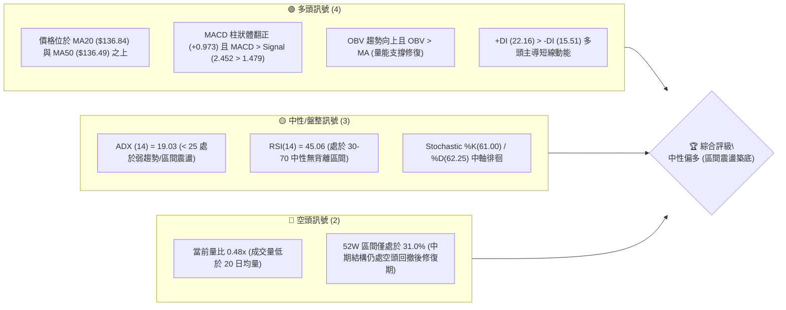
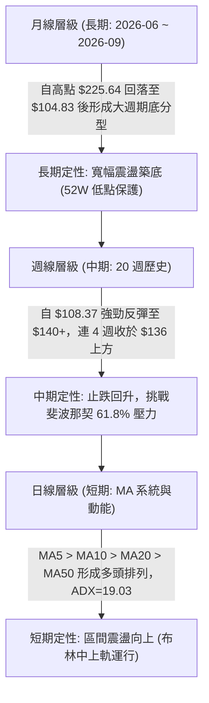
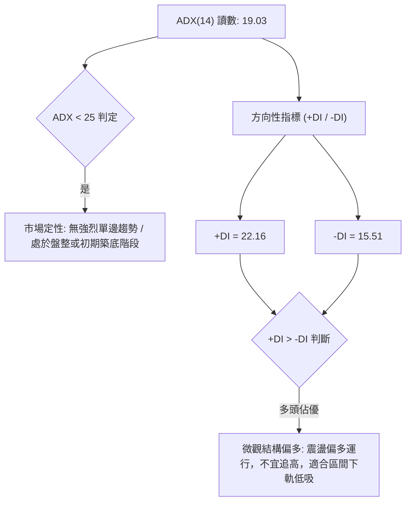
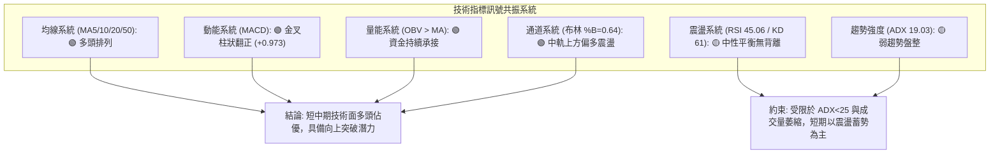
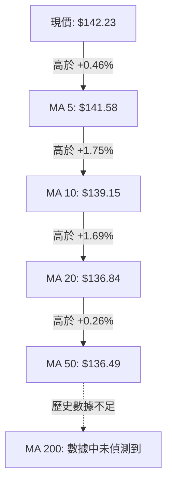
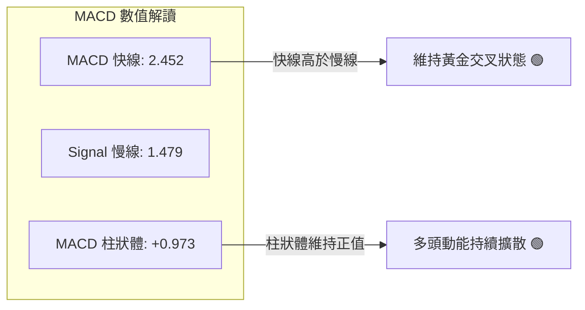
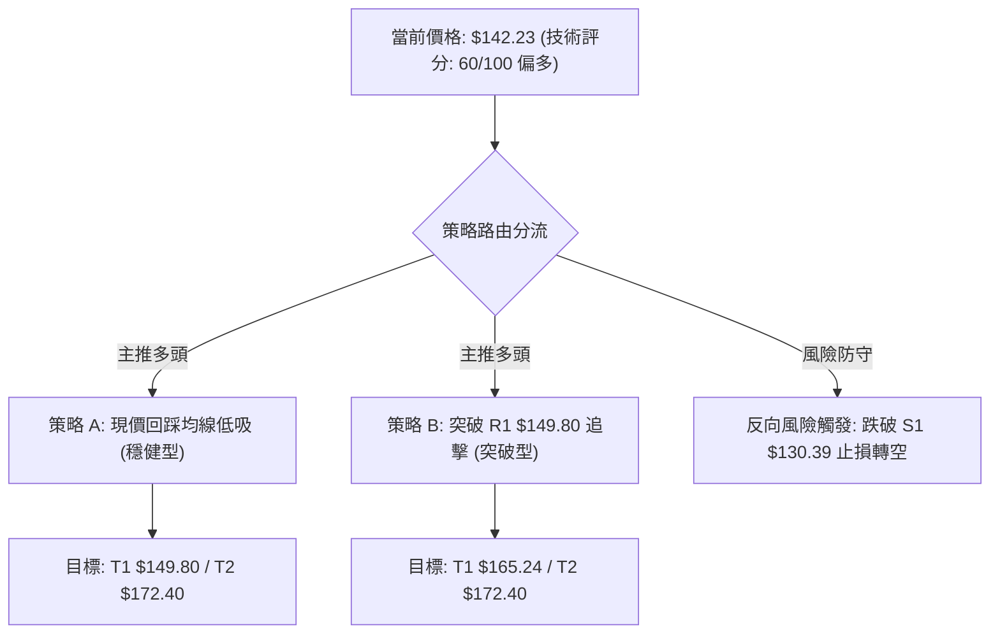
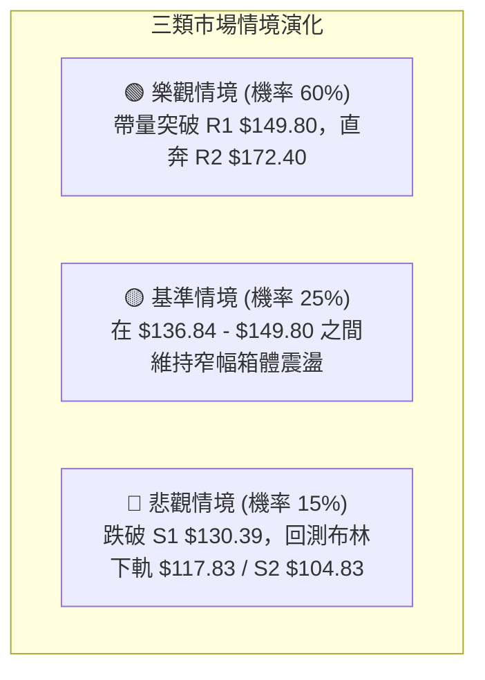

# SPCX 技術分析報告

> **報告日期**：2026-09-02 ｜ **語言**：繁體中文 ｜ **數據來源**：Yahoo Finance ｜ **當前價格**：$142.23

---

## 目錄

| 章節 | 內容 |
|------|------|
| [1. 技術面概覽](#1-技術面概覽) | 訊號儀表板、核心指標、評分卡 |
| [2. 趨勢分析](#2-趨勢分析) | 多時框趨勢、長中短期走勢 |
| [3. 圖表形態分析](#3-圖表形態分析) | 形態識別、K線組合、目標價 |
| [4. 支撐與阻力](#4-支撐與阻力) | 關鍵價位、斐波那契回調 |
| [5. 技術指標深度解讀](#5-技術指標深度解讀) | MA/RSI/MACD/布林/成交量 |
| [6. 動能與波動率](#6-動能與波動率) | 動能評估、ATR、Beta |
| [7. 多時框架總結](#7-多時框架總結) | 時框架評分矩陣 |
| [8. 交易策略建議](#8-交易策略建議) | 多空策略、風險報酬比 |
| [9. 風險提示與監控](#9-風險提示與監控) | 監控指標、風險場景 |

---

## 1. 技術面概覽

### 🎯 技術訊號儀表板



### 📊 核心指標速覽表

| 指標類別 | 指標名稱 | 當前數值 | 訊號 | 解讀 |
|----------|----------|----------|------|------|
| **價格** | 當前價格 | $142.23 | 🟡 | 位於 52 週高低點區間 31.0%，脫離底部但尚未突破中期反彈壓力 |
| **均線** | MA20 | $136.84 | 🟢 | 現價高於 MA20（+3.94%），短線多頭掌控支撐 |
| **均線** | MA50 | $136.49 | 🟢 | 現價高於 MA50（+4.21%），MA20 與 MA50 形成低檔黃金交叉初步雛形 |
| **均線** | MA200 | 數據中未偵測到 | 🟡 | 上市歷史數據不足，中長期趨勢主要參考週線波段均線與歷史高低點 |
| **動能** | RSI(14) | 45.06 | 🟡 | 位於 30–70 中性區間，無明顯頂底背離，處於修復動能釋放後的平衡態 |
| **動能** | MACD(12,26,9) | 2.452 / 1.479 | 🟢 | MACD 線高於訊號線，柱狀體為 +0.973，呈現多頭修復擴散態勢 |
| **波動** | ATR(14) | $6.29 (4.42%) | 🟡 | 每日波幅適中，提供足夠的日內與波段操作空間，防守距離需設在 1.5–2 ATR |
| **趨勢** | ADX(14) | 19.03 | 🟡 | 低於 25 臨界線，顯示單邊趨勢尚未成形，行情定性為「寬幅區間盤整」 |
| **通道** | 布林 %B | 0.64 | 🟢 | 位於布林中軌（$136.84）與上軌（$155.85）之間，偏多震盪格局 |
| **量能** | OBV 與量比 | 量比 0.48x / OBV>MA | 🟡 | 雖然當日成交量萎縮，但累計量能結構（OBV）依然呈現多頭支撐 |

### 🏆 技術評分卡

```
╔══════════════════════════════════════════════════════════════════╗
║                 技術評分卡 — SPCX (2026-09-02)                  ║
╠══════════════════════════════════════════════════════════════════╣
║ 趨勢強度 (ADX/趨勢方向)  ████████░░░░░░░░░░░░  42/100  🟡 中性 (弱趨勢)║
║ 動能指標 (RSI/MACD/KD)   ████████████░░░░░░░░  64/100  🟢 偏多 (MACD金叉)║
║ 支撐穩定度 (S1/S2/MA20)  ██████████████░░░░░░  70/100  🟢 穩固 (底部確立)║
║ 成交量配合 (OBV/量比)    ██████████░░░░░░░░░░  52/100  🟡 中性 (量縮整理)║
║ 形態完整度 (V型反轉築底) ████████████░░░░░░░░  62/100  🟢 偏多 (頸線測試)║
║ 均線排列 (MA5/10/20/50)  ██████████████░░░░░░  68/100  🟢 偏多 (短期多排)║
╠══════════════════════════════════════════════════════════════════╣
║ 綜合技術評分             ████████████░░░░░░░░  60/100  🟢 偏多震盪/築底 ║
╚══════════════════════════════════════════════════════════════════╝
```

---

## 2. 趨勢分析

### 🌐 多時框趨勢分析



### 📈 長期趨勢 — 12個月走勢圖（Unicode）

```
SPCX 月線走勢圖（歷史波段高低點與收盤價分佈）
價格軸 ($)
$225.64 ┤                           ● (52W 最高點 $225.64)
$200.00 ┤                          / \
$175.00 ┤        ● (2026-06: 170.86)   \
$150.00 ┤       /                       \      ● (2026-08: 143.69)
$142.23 ┤══════/═════════════════════════\═════● (2026-09: 142.23 現價)
$125.00 ┤     /                           \   /
$104.83 ┤    /                             ● (2026-07: 108.37 / 52W最低 $104.83)
$100.00 ┤   ● (起漲點)
        └────────────────────────────────────────────────────────
           M-8    M-6    M-4    M-2   2026-06  2026-07  2026-08  2026-09
```

**走勢特徵分析表格**：

| 時間階段 | 收盤價 / 區間 | 波段漲跌幅 | 成交量特徵 | 結構性意義 |
|----------|---------------|------------|------------|------------|
| **2026-06** | $170.86 (衝高回落) | 高點見 $225.64 | 放量（週量達 9.25 億股） | 多頭動能耗盡，形成高檔流星線與長上影線 |
| **2026-07** | $108.37 (主跌段) | -36.57% (單月暴跌) | 縮量急跌（週量降至 3.18 億股） | 出清融資盤與恐慌盤，觸及 52W 低點 $104.83 |
| **2026-08** | $143.69 (強勁反彈) | +32.59% (強反彈) | 底部爆量（週量回升至 9.20 億股） | 機構逢低承接，形成 V 型反轉並重回 MA20 上方 |
| **2026-09** | $142.23 (當前收盤) | -1.02% (橫盤震盪) | 量縮整理（量比 0.48x） | 消化 $140–$150 阻力區籌碼，構築中繼平台 |

### 📊 中期趨勢（週線分析）

中期走勢呈現「深跌反彈後的收斂整理」。由週線觀察，2026-08-02 探底 $108.37 後，連續兩週以大陽線放量拉升（2026-08-09 收 $133.11，2026-08-16 收 $140.00），隨後兩週進入 $136.97–$142.23 窄幅整理。

```
週線級別價格架構與均線支撐：
──────────────────────────────────────────────────────────────────
阻力帶：R1: $149.80 (波段高點) ── 斐波那契 61.8%: $150.98 ── 布林上軌: $155.85
  ▲
  │   [當前震盪區間：$136.84 - $149.80]
  ▼
支撐帶：MA20: $136.84 ── MA50: $136.49 ── S1: $130.39 (斐波那契 78.6%: $130.68)
──────────────────────────────────────────────────────────────────
```

### ⚡ 趨勢強度評估（ADX 解讀）



**ADX 趨勢強度對照表**：

| ADX 數值區間 | 趨勢強度狀態 | SPCX 當前狀態 (19.03) | 交易應對指導 |
|--------------|--------------|------------------------|--------------|
| **0 – 20** | **極弱趨勢 / 盤整震盪** | **✓ 當前所在區間 (19.03)** | **以布林通道與支撐阻力進行區間擺動交易，忌追突破** |
| **20 – 25** | 趨勢醞釀期 | - | 觀察動能指標是否共振突破 |
| **25 – 40** | 強趨勢成形 | - | 順勢交易，沿均線方向加碼 |
| **40 – 60** | 極強單邊趨勢 | - | 抱牢波段倉位，警惕頂部/底部背離 |

---

## 3. 圖表形態分析

### 🔍 形態識別系統


**形態信心度與目標價計算表（嚴格依據規則 13 & 15）**：

| 形態名稱 | 信心度 | 判斷依據（引用數據） | 完成度 | 目標價（附嚴格計算式） |
|----------|--------|----------------------|--------|------------------------|
| **V 型反轉修復形態** | 75% | 7/26 ($115.07) 與 8/02 ($108.37) 極速見底後，8/09 週以 9.2 億巨量收復 $133.11 | 90% | **第一目標價 $149.80** (波段阻力 R1)；<br>**形態高度推算**：頸線 $140.00 + (頸線 $140.00 - 低點 $108.37 = $31.63) = **$171.63** (高度吻合 R2: $172.40) |
| **潛在矩形整理突破** | 60% | 8/16 至 9/06 四週收盤價緊密聚集於 $136.97 – $142.23，波動率收縮 | 70% | **區間測幅目標價**：箱頂 $143.69 + (箱頂 $143.69 - 箱底 $136.84 = $6.85) = **$150.54** (吻合斐波那契 61.8%: $150.98 與 R1: $149.80) |
| **大型頭肩底 / 雙底** | 35% | 歷史週數較短，左側低點數據不足以支撐完整大型頭肩底幾何構圖 | 30% | 訊號不足，僅做指標型與區間解讀，不強行測算遠期目標 |

### 🕯️ 重要K線形態分析

| 週/月份 | 收盤價 | K線形態特徵 | 技術解讀 | 訊號 |
|---------|--------|-------------|----------|------|
| **2026-08-02 (週)** | $108.37 | 長下影錘頭線 (Hammer) | 探底 52W 低點 $104.83 後獲利回補與主力買盤介入，確立波段鐵底 | 🟢 強烈見底 |
| **2026-08-09 (週)** | $133.11 | 大陽包覆線 (Bullish Engulfing) | 單週放量暴漲 +22.8%，完全吞噬前兩週跌幅，確認反轉啟動 | 🟢 極強看多 |
| **2026-08-16 (週)** | $140.00 | 衝高小陽線 | 延續多頭動能，突破 MA20 與 MA50 均線聚集處 | 🟢 看多 |
| **2026-08-23 (週)** | $136.97 | 窄幅十字星 (Doji) | 回踩 MA20 ($136.84) 與 MA50 ($136.49) 尋求確認，量能適度萎縮 | 🟡 正常回踩 |
| **2026-08-30 (週)** | $141.50 | 溫和陽線 | 守穩均線支撐，買盤再度推升至 $140 上方 | 🟢 偏多蓄勢 |
| **2026-09-06 (週)** | $142.23 | 縮量小陽星 | 逼近前高阻力 R1 ($149.80) 前的沉澱走勢，多空處於短暫平衡 | 🟡 中性整理 |

### 📉 ASCII 走勢形態示意圖

```
SPCX 近期日線/週線形態結構示意圖：
價格
$172.40 ┤                                           [R2 強阻力位]
         │
$149.80 ┤------------------ 阻力頸線 R1 ($149.80) -- 斐波那契 61.8% ($150.98)
         │                  ┌─────────────┐
$142.23 ┤                  │ 現價: 142.23│ (高檔箱體震盪蓄勢)
$136.84 ┤------------------└─────────────┘-- MA20 ($136.84) / MA50 ($136.49)
         │                  ▲ (回踩支撐確認)
$130.39 ┤                 /  [S1 關鍵支撐] / 斐波那契 78.6% ($130.68)
         │                /
$108.37 ┤        ●       /   [V型反轉築底]
$104.83 ┤         \_____/    [52W 最低點 S2: $104.83]
        └────────────────────────────────────────────────────────
           2026-07   2026-08-02   2026-08-16   2026-08-30   2026-09-02
```

### 🎯 形態目標價計算

依據形態學嚴格公式測算：
1. **箱體突破目標價**：
   - 形態箱底：$136.84（MA20 支撐）
   - 形態箱頂：$143.69（8月收盤高點）
   - 箱體高度 $H = \$143.69 - \$136.84 = \$6.85$
   - 向上突破目標價 = $\$143.69 + \$6.85 = \mathbf{\$150.54}$（精確對應阻力位 **R1: $149.80** 與斐波那契 61.8% **$150.98**）。
2. **V 型反轉波段等距測幅目標價**：
   - 反轉起點低點：$108.37
   - 第一反彈頸線：$140.00
   - 反彈高度 $H_2 = \$140.00 - \$108.37 = \$31.63$
   - 突破頸線後測幅目標價 = $\$140.00 + \$31.63 = \mathbf{\$171.63}$（精確對應阻力位 **R2: $172.40**）。

---

## 4. 支撐與阻力

### 🗺️ 關鍵價位分布圖（Unicode）

```
╔══════════════════════════════════════════════════════════════════╗
║                    SPCX 價位結構分布圖                           ║
╠══════════════════════════════════════════════════════════════════╣
║ $225.64 ║████████████████████████║ 52W 最高點 / 斐波那契 0.0%    ║
║ $197.13 ║████████████████████    ║ 斐波那契 23.6% 回調位        ║
║ $179.49 ║████████████████████    ║ 斐波那契 38.2% 回調位        ║
║ $172.40 ║████████████████████████║ 強阻力 R2 (近一年波段高點聚類)║
║ $165.24 ║████████████████        ║ 斐波那契 50.0% 中軸平衡位    ║
║ $155.85 ║████████████████        ║ 布林通道上軌                 ║
║ $150.98 ║████████████████████    ║ 斐波那契 61.8% 重要分水嶺    ║
║ $149.80 ║████████████████████████║ 關鍵阻力 R1 (近一年波段高點)  ║
║ $142.23 ╠════════════════════════╣ ◄ 當前價格 $142.23           ║
║ $136.84 ║▓▓▓▓▓▓▓▓▓▓▓▓▓▓▓▓        ║ 布林中軌 / MA20 核心均線     ║
║ $136.49 ║▓▓▓▓▓▓▓▓▓▓▓▓▓▓▓▓        ║ MA50 核心均線                ║
║ $130.68 ║▓▓▓▓▓▓▓▓▓▓▓▓▓▓▓▓▓▓▓▓    ║ 斐波那契 78.6% 回調位        ║
║ $130.39 ║████████████████████████║ 關鍵支撐 S1 (近一年波段低點)  ║
║ $117.83 ║▓▓▓▓▓▓▓▓▓▓▓▓▓▓▓▓        ║ 布林通道下軌                 ║
║ $104.83 ║████████████████████████║ 強支撐 S2 (52W 最低點/100.0%)║
╚══════════════════════════════════════════════════════════════════╝
```

### 🚧 阻力位分析表

| 阻力級別 | 價位 | 形成原因（嚴格引用數據） | 突破難度 | 重要性 |
|----------|------|--------------------------|----------|--------|
| **R1 (近端關鍵阻力)** | **$149.80** | 近一年波段高點聚類；上方緊鄰斐波那契 61.8% ($150.98) | 中等 | 🔴 極高（短線多空分水嶺，有效突破將打開上行空間） |
| **R2 (波段強阻力)** | **$172.40** | 近一年波段高點聚類；2026-06 月線收盤價 $170.86 密集成交區 | 較高 | 🔴 極高（中期反彈主要目標位與重套牢區） |
| **52W High** | **$225.64** | 52 週歷史天花板；斐波那契 0.0% 起跌點 | 極高 | 🟡 中期遠程目標 |

### 🛡️ 支撐位分析表

| 支撐級別 | 價位 | 形成原因（嚴格引用數據） | 守住機率 | 重要性 |
|----------|------|--------------------------|----------|--------|
| **均線動態支撐** | **$136.84 / $136.49** | MA20 ($136.84) 與 MA50 ($136.49) 雙重重合處，布林中軌所在 | 75% | 🟢 高（短線多頭防守底線） |
| **S1 (波段關鍵支撐)** | **$130.39** | 近一年波段低點聚類；重合斐波那契 78.6% ($130.68) | 85% | 🟢 極高（中期轉弱分水嶺，失守宣告反彈失敗） |
| **S2 (極限強支撐)** | **$104.83** | 52 週最低點；斐波那契 100.0% 基點 | 95% | 🟢 終極鐵底（機構長線資金重兵防守區） |

### 📐 斐波那契回調位分析

依據 52 週區間 **$104.83 (Low) → $225.64 (High)** 嚴格回調序列分析：

```
0.0% (52W High) ── $225.64
23.6% ─────────── $197.13
38.2% ─────────── $179.49
50.0% ─────────── $165.24
61.8% ─────────── $150.98 ◄─── 上方首要黃金分割阻力區 ($149.80 - $150.98)
[現價 $142.23] ──── 處於 61.8% ($150.98) 與 78.6% ($130.68) 之間
78.6% ─────────── $130.68 ◄─── 下方關鍵黃金分割支撐區 ($130.39 - $130.68)
100.0% (52W Low) ─ $104.83
```

**解讀**：現價 $142.23 正處於 **78.6% ($130.68)** 與 **61.8% ($150.98)** 的黃金分割修復通道內。
- 股票在跌破 78.6% 後於 100% 處（$104.83）獲取極限支撐，隨後迅速收復 78.6%（$130.68），代表低檔超跌買盤強勁。
- 當前現價正向 61.8%（$150.98）發起衝擊，該位置同時共振阻力 R1（$149.80）。若能帶量實體突破 $150.98，行情將正式由「超跌反彈」晉級為「中期反轉」，下一站直指 50.0%（$165.24）與 R2（$172.40）。

---

## 5. 技術指標深度解讀

### 🎛️ 指標訊號總覽



### 📈 移動平均線排列分析



**均線狀態解讀**：
- 短期均線呈現典型的多頭發散：$\text{現價 } (\$142.23) > \text{MA5 } (\$141.58) > \text{MA10 } (\$139.15) > \text{MA20 } (\$136.84) > \text{MA50 } (\$136.49)$。
- MA20（$136.84）已成功由下向上穿越 MA50（$136.49），形成低檔金叉，為價格提供堅實的動態回踩支撐。

### 📉 RSI(14) 分析

```
RSI(14) 當前數值: 45.06
0 ──────────── 30 ────────────────── 50 ────── 70 ─────────── 100
[   超賣區   ] │                    ▲ │       │ [   超買區   ]
               └──── 45.06 (中性平衡區) ┴───────┘
進度條：█████████░░░░░░░░░░░  45.06%
```

- **背離判斷**：
  - 在 2026-07-26 至 2026-08-02 期間，價格由 $115.07 跌至 $108.37（創低），而週線 RSI 由 15.9 上升至 19.2，形成了標準的**週線級別底背離**，該底背離已成功驅動了 8 月份的強烈報復性反彈。
  - 當前日線 RSI 為 45.06，處於 40–60 的中性蓄勢區間，**無頂背離亦無底背離**，表明價格回調已消化短線超買，動能處於健康的中繼狀態。

### 📊 MACD(12,26,9) 訊號解讀



- MACD 快線（2.452）維持在訊號線（1.479）之上，柱狀體保持正值（+0.973），週線 MACD 柱狀體在經歷 7 月份的持續負值後（最低 -3.362），於 8 月初強勢翻正並維持在正值區（最新週為 +0.973），顯示中短期動能結構已經由空頭轉由多頭主導。

### 📦 布林通道分析

```
SPCX 布林通道 (20, 2) 結構圖：
$155.85 ┬────────────────────────────────────────── 布林上軌 (通道頂部壓力)
        │
$142.23 ┼══════════════════════════════════════════ 當前現價 ($142.23, %B = 0.64)
        │
$136.84 ┼────────────────────────────────────────── 布林中軌 (MA20 強力支撐)
        │
$117.83 ┴────────────────────────────────────────── 布林下軌 (通道底部防線)
```

- **%B 指標解讀**：當前 %B 為 0.64，位於中軌（0.50）與上軌（1.00）之間偏多區域。
- **通道帶寬**：布林帶寬目前呈現收斂後的平行走勢，價格穩居中軌 $136.84 之上，顯示在發動下一輪單邊趨勢前，市場正在布林中上軌進行震盪蓄勢。

### 💹 成交量分析（量價配合度）

- **量價特徵**：最新單日成交量為 53,640,900 股，相較於 20 日均量 112,339,350 股，量比僅為 **0.48x**，呈現典型的「上漲縮量整理」態勢。
- **OBV 能量潮解讀**：數據明確指出「**OBV > MA → 量能支撐上漲**」。這說明在 8 月份底部爆量拉升（單週高達 9.2 億股）後，主力資金並未在高檔出逃，當前的縮量屬於主力控盤下的良性洗盤，量能結構依然健康。

---

## 6. 動能與波動率

### ⚡ 動能評估四象限

| 象限代號 | 動能維度 (Momentum) | 波動率維度 (Volatility) | SPCX 當前狀態 | 交易環境解讀與策略應對 |
|----------|---------------------|--------------------------|---------------|------------------------|
| **Q1** | **強動能 (Positive)** | **低/中波動 (Normal Vol)** | **✓ SPCX 當前位置** | **最佳波段買入環境**：MACD 金叉 + 均線多排，ATR 處於 4.42% 溫和區，適合回踩低吸。 |
| **Q2** | 弱動能 (Negative) | 低波動 (Low Vol) | - | 沉悶磨底階段，資金利用率低。 |
| **Q3** | 強動能 (Positive) | 極高波動 (High Vol) | - | 情緒過熱追漲階段，需提防假突破與劇烈洗盤。 |
| **Q4** | 弱動能 (Negative) | 高波動 (High Vol) | - | 恐慌主跌段（如 7 月份走勢），應嚴格空倉觀望。 |

### 📊 ATR 波動率分析

```
╔══════════════════════════════════════════════════════════════════╗
║                   ATR(14) 波動率與止損風控測算                   ║
╠══════════════════════════════════════════════════════════════════╣
║ 當前 ATR(14) 數值: $6.29 (佔當前價格百分比: 4.42%)              ║
║ 每日合理波動區間: [$142.23 - $6.29, $142.23 + $6.29]             ║
║                  即 [$135.94, $148.52]                           ║
╠══════════════════════════════════════════════════════════════════╣
║ 風控距離建議：                                                  ║
║ ├─ 日內短線止損 (1.0 ATR): 距進場點 $6.29 (~4.4%)                ║
║ ├─ 波段操作止損 (1.5 ATR): 距進場點 $9.44 (~6.6%)                ║
║ └─ 寬幅波段止損 (2.0 ATR): 距進場點 $12.58 (~8.8%)               ║
║    (當前進場 $142.23 - 1.5 ATR $9.44 = $132.79，剛好保護於 S1 上方)║
╚══════════════════════════════════════════════════════════════════╝
```

### 📐 Beta 與市場相關性

- **Beta 狀態**：數據中未偵測到（N/A，新上市公司特性）。
- **市場特徵與股本結構分析**：
  - SPCX 當前市值達 **$1.87T**，流通股數 1.16B，機構持股比例達 **48.2%**，內部人持股 **12.7%**。
  - 空頭部位（Short % Float）為 **2.9%**，Short Ratio 為 **1.76**，顯示市場對該標的並無極端做空押注，反彈阻力主要來自前期套牢盤而非惡意空頭拋壓。

---

## 7. 多時框架總結

### 📋 時框架評分表

| 時框架 | 趨勢方向 | 動能狀態 | 均線排列 | 圖表形態 | 綜合評分 | 交易指導建議 |
|--------|----------|----------|----------|----------|----------|--------------|
| **短期 (日線)** | 偏多震盪 🟢 | MACD翻正 / RSI 45 🟢 | 短期多頭排列 🟢 | 箱體蓄勢突破 🟢 | **68 / 100** | 依託 MA20 ($136.84) 逢低做多 |
| **中期 (週線)** | 止跌回升 🟢 | 週 MACD 柱擴散 🟢 | 站上 20 週中軌 🟢 | V 型底反轉確立 🟢 | **62 / 100** | 逢回踩佈局，目標看至 R1 ($149.80) 與 R2 ($172.40) |
| **長期 (月線)** | 寬幅築底 🟡 | 脫離超賣區 🟡 | 歷史數據不足 🟡 | 52W 區間低位震盪 🟡 | **50 / 100** | 長線分批建倉，以 $104.83 為終極防守 |

### 🔲 綜合訊號矩陣

```
┌─────────────────┬───────────┬───────────┬───────────┐
│ 分析維度        │ 短期 (日) │ 中期 (週) │ 長期 (月) │
├─────────────────┼───────────┼───────────┼───────────┤
│ 價格 vs 均線    │ 🟢 看多   │ 🟢 看多   │ 🟡 中性   │
│ 動能 (RSI/MACD) │ 🟢 看多   │ 🟢 看多   │ 🟡 中性   │
│ 形態結構        │ 🟢 看多   │ 🟢 看多   │ 🟡 中性   │
│ 量能配合        │ 🟡 中性   │ 🟢 看多   │ 🟢 看多   │
│ 趨勢強度 (ADX)  │ 🟡 盤整   │ 🟡 盤整   │ 🟡 盤整   │
└─────────────────┴───────────┴───────────┴───────────┘
```

### ⚖️ 多時框收斂結論（依規則 14 嚴格執行）

- **市場狀態定性**：當前 ADX(14) 為 **19.03 (< 25)**，嚴格判定為**盤整/區間震盪行情**。
- **時框優先級收斂**：依據規則 14，在盤整行情中，交易核心以**日線布林通道上下軌（$117.83 – $155.85）與關鍵支撐阻力為主要交易區間**。
- **唯一方向性結論**：**【偏多震盪築底，逢低做多】**（與第 1 章評分卡 60/100 及第 5 章技術指標完全一致）。
- **衝突調和說明**：雖然當前單日成交量萎縮（0.48x）且日線 ADX 偏弱，限制了短線爆發單邊暴漲的機率；但由於中期週線已完成 V 型反轉，且價格穩固運行於 MA20 ($136.84) 與 MA50 ($136.49) 之上，因此日線的縮量回調被定義為「多頭蓄勢與回踩確認」，策略重心堅定維持逢低做多。

---

## 8. 交易策略建議

### 🗺️ 策略決策流程圖



### 🧭 策略路由（依評分卡分流）

> **當前主策略方向 = 【逢低做多 / 突破加碼】（依綜合評分 60/100，處於偏多區間）**

### 🎯 價格情境階梯（Price Scenarios，嚴格引用第 4 章數據）

| 觸發條件 | 第一目標 | 第二目標 | 後續延伸目標 | 情境含義與操作指引 |
|----------|----------|----------|--------------|--------------------|
| **向上突破 R1 ($149.80)** | 斐波 61.8% ($150.98) | 布林上軌 ($155.85) | **R2 ($172.40)** | 短線轉為強勢多頭，開啟波段主升浪 |
| **站穩現價區間 ($136.84–$143.69)** | R1 ($149.80) | 斐波 61.8% ($150.98) | — | 區間震盪蓄勢，適合在區間下軌高拋低吸 |
| **向下跌破 S1 ($130.39)** | 斐波 78.6% ($130.68) | 布林下軌 ($117.83) | **S2 ($104.83)** | 中期反彈結構遭到破壞，多頭必須全面止損離場 |

### 📊 情境機率分佈

| 情境劇本 | 機率估計 | 主要技術依據（引用指標狀態） |
|----------|----------|------------------------------|
| **情境一：震盪走高 / 向上突破** | **60%** | MACD 處於金叉柱狀擴散狀態（+0.973），價格穩居 MA20/MA50 上方，OBV 持續支撐。 |
| **情境二：寬幅區間震盪** | **25%** | ADX(14) 為 19.03（< 25 弱趨勢），短線量能萎縮（量比 0.48x），受制於 R1 阻力。 |
| **情境三：跌破支撐 / 再探低點** | **15%** | 僅在意外黑天鵝下可能發生，下方有 S1 ($130.39) 與 52W 低點 S2 ($104.83) 強力防守。 |

### 🟢 主策略詳情

| 策略要素 | 策略 A：均線支撐逢低吸納（首選·穩健型） | 策略 B：突破頸線順勢追擊（次選·激進型） |
|----------|-----------------------------------------|-----------------------------------------|
| **進場條件** | 價格回踩 MA20/MA50 支撐區且日線收陽確認 | 價格放量突破 R1 阻力位（日收盤價站穩） |
| **進場價格** | **$136.84**（或現價 $142.23 分批建倉） | **$149.80** |
| **止損價格** | **$130.39**（S1 關鍵支撐下方，約 -4.7%） | **$142.23**（原阻力轉化為支撐處，約 -5.0%） |
| **目標價 T1** | **$149.80**（R1 阻力位，預期回報 +9.5%） | **$165.24**（斐波那契 50.0%，預期回報 +10.3%） |
| **目標價 T2** | **$172.40**（R2 強阻力位，預期回報 +26.0%） | **$172.40**（R2 強阻力位，預期回報 +15.1%） |
| **風險報酬比 (R:R)** | **1 : 2.02** (至 T1) / **1 : 5.53** (至 T2) | **1 : 2.06** (至 T1) / **1 : 3.02** (至 T2) |
| **勝率預估** | **65%** | **55%** |
| **建議倉位** | **15% – 20%** 基礎倉位 | **10%** 突破加碼倉位 |

### 🔴 反向風險觸發點（對沖提示）

- **關鍵反轉破位點**：若日線收盤價跌破 **S1: $130.39**（同時跌破斐波那契 78.6% **$130.68**），則宣告 8 月以來的 V 型反轉結構被破壞。
- **風控行動**：多頭應立即無條件止損離場，空手觀望；激進投資者可小倉位建立空頭對沖，下看布林下軌 **$117.83** 及 S2 **$104.83**。

### ⭐ 整體訊號強度評星

```
╔══════════════════════════════════════════════════════════════════╗
║ 做多訊號強度：★★★★☆  (4/5星 - 均線多排/MACD金叉/OBV支撐)       ║
║ 做空訊號強度：★☆☆☆☆  (1/5星 - 缺乏做空結構，逆勢風險極高)     ║
║ 整體可信度：  ★★★★☆  (4/5星 - 價量數據與指標高度共振確認)       ║
╚══════════════════════════════════════════════════════════════════╝
```

---

## 9. 風險提示與監控

### ✅ 關鍵監控指標 Checklist

```
╔══════════════════════════════════════════════════════════════════╗
║                     SPCX 交易監控清單 (Checklist)                ║
╠══════════════════════════════════════════════════════════════════╣
║ [ ] 價格是否守穩布林中軌 / MA20 ($136.84) 與 MA50 ($136.49)      ║
║ [ ] 向上測試 R1 ($149.80) 時，單日成交量是否放大至 1.1 億股以上  ║
║ [ ] RSI(14) 突破 50 中軸後是否能持續維持在 50–70 強勢多頭區間    ║
║ [ ] MACD 柱狀體是否持續大於 0 (當前 +0.973，警惕柱狀體快速收斂)  ║
║ [ ] ADX(14) 是否由 19.03 拐頭向上穿越 25 (代表單邊主升浪啟動)    ║
║ [ ] 跌破 S1 ($130.39) 時是否立即觸發硬止損，嚴禁扛單             ║
╚══════════════════════════════════════════════════════════════════╝
```

### ⚠️ 風險場景分析



### 🛡️ 風險管理重要提醒

1. **波動率管理（ATR 應用）**：
   - SPCX 當前 ATR 為 **$6.29**（單日波幅 4.42%），屬於中高彈性資產。在建倉時必須依據 ATR 計算頭寸規模，單筆交易的最大止損金額不得超過總帳戶淨值的 1%–2%。
2. **量能不足風險**：
   - 當前量比僅 0.48x，若後續在逼近 R1（$149.80）阻力位時成交量無法放大至 20 日均量（1.12 億股）以上，容易引發假突破與高檔獲利了結賣壓。
3. **倉位配置原則**：
   - 建議總持倉控制在 **20%–30%** 以內，採取「底倉逢低佈局（$136.84–$142.23）+ 突破確認加碼（$149.80）」的右側金字塔式建倉策略。

---

## 📋 報告總結

```
╔══════════════════════════════════════════════════════════════════╗
║                    SPCX 技術分析報告總結                         ║
╠══════════════════════════════════════════════════════════════════╣
║ 報告日期：2026-09-02                                             ║
║ 當前價格：$142.23                                                ║
║ 分析評級：🟢 中性偏多 / 震盪蓄勢突破 (評分: 60/100)               ║
║                                                                  ║
║ 關鍵結論：                                                       ║
║ ├─ 長期趨勢：🟡 寬幅築底 (52W 低點 $104.83 構築強大防護網)        ║
║ ├─ 中期趨勢：🟢 止跌反轉 (8月強烈 V 型反轉，週線 MACD 維持正值)    ║
║ ├─ 短期趨勢：🟢 偏多排列 (價格站穩 MA20 $136.84 與 MA50 $136.49)  ║
║ ├─ 關鍵支撐：S1: $130.39 (核心防線) │ S2: $104.83 (52W鐵底)       ║
║ ├─ 關鍵阻力：R1: $149.80 (近端突破口) │ R2: $172.40 (波段大目標)  ║
║ └─ 分析師目標：平均 $220.74 (共識評級: Buy / 19 位分析師)        ║
║                                                                  ║
║ 最優策略組合：                                                   ║
║ 1. 🥇 最佳機會 (策略 A)：回踩 MA20 $136.84 或現價低吸，          ║
║    止損設於 $130.39，目標看至 $149.80 與 $172.40 (R:R達 1:5.5)。 ║
║ 2. 🥈 次選機會 (策略 B)：放量突破 R1 $149.80 後順勢追多，        ║
║    止損設於 $142.23，目標看至 $165.24 與 $172.40。               ║
║ 3. 🥉 風險防守：若收盤實體跌破 $130.39，全面離場避險。            ║
╚══════════════════════════════════════════════════════════════════╝
```

---

> ⚠️ **免責聲明**：本報告為 AI 自動生成之技術分析，所有數據及估算均基於提供的歷史價格資訊。本報告**僅供研究與學術參考**，**不構成任何投資建議**。投資有風險，入市需謹慎。

---

*報告生成時間：2026-09-02 ｜ 數據來源：Yahoo Finance ｜ 分析框架：多時框技術分析*