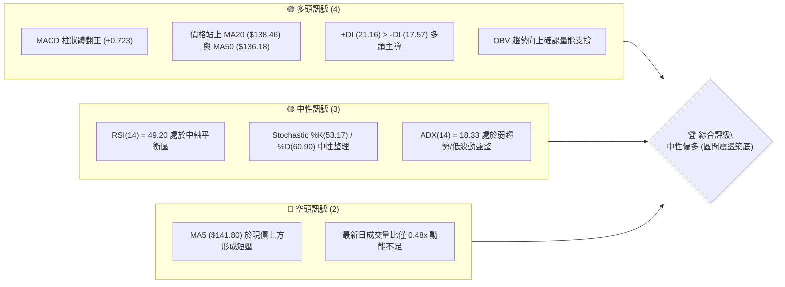
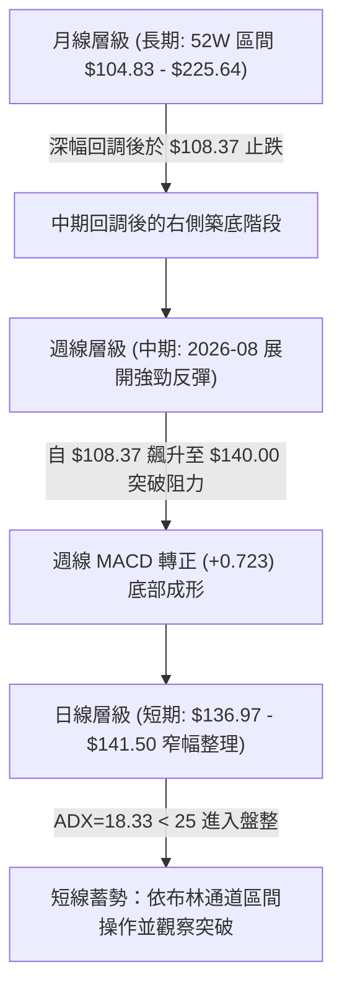
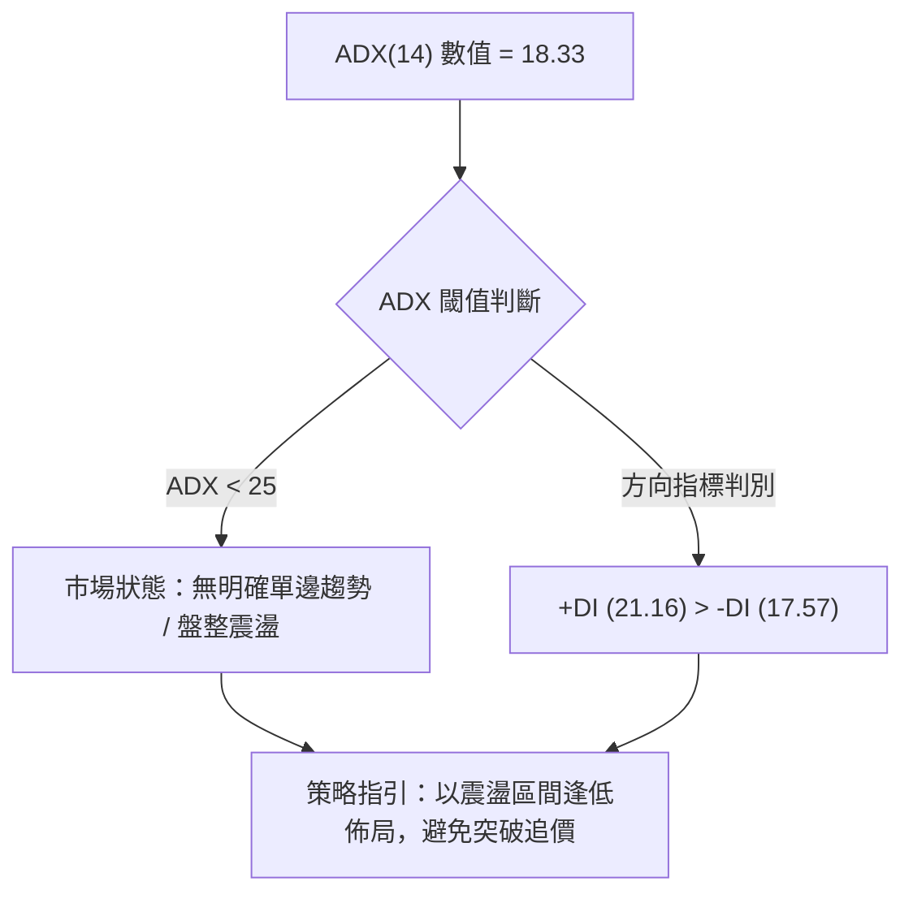
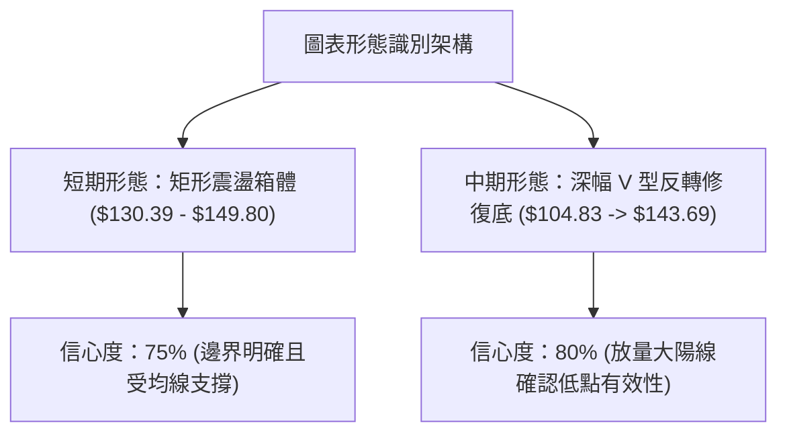
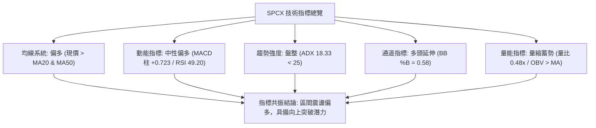
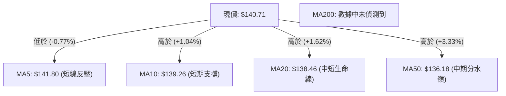
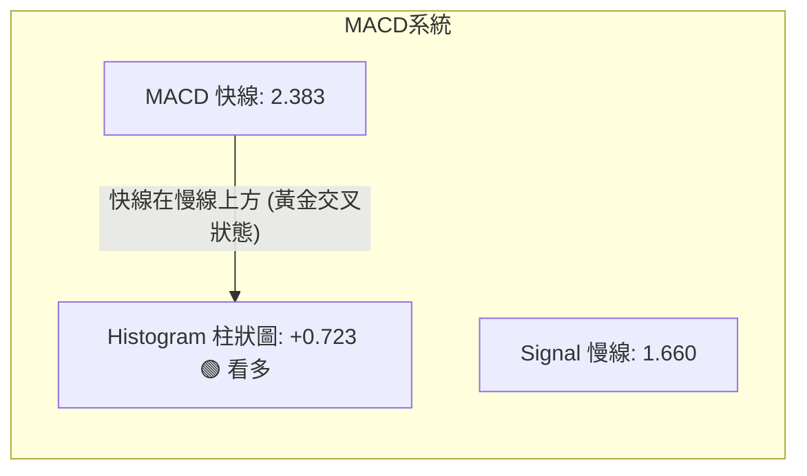
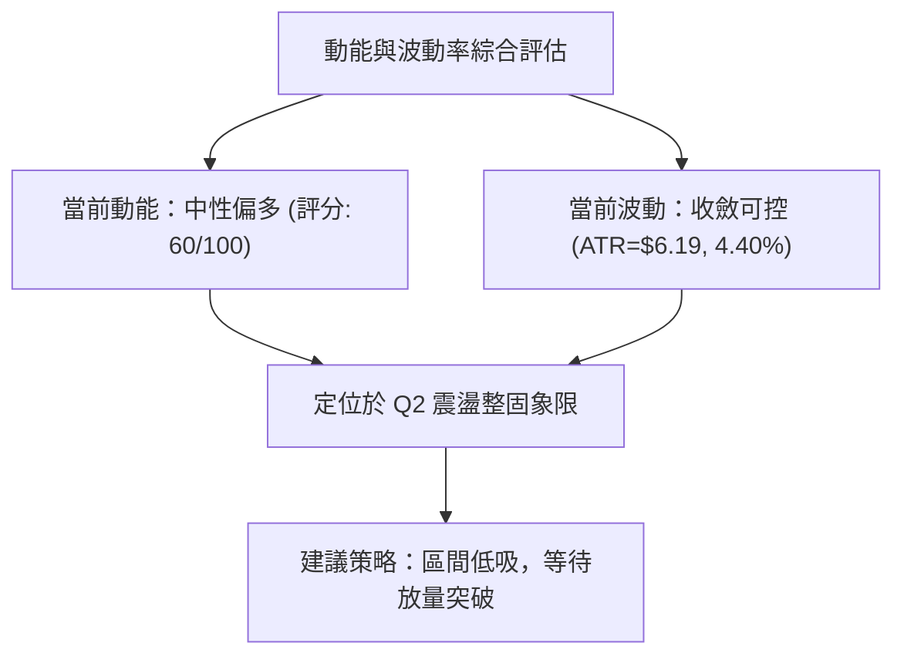
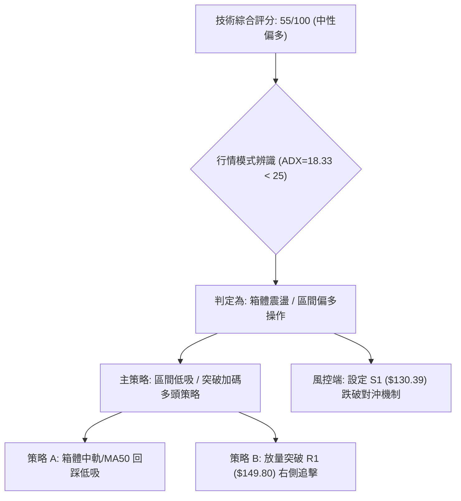
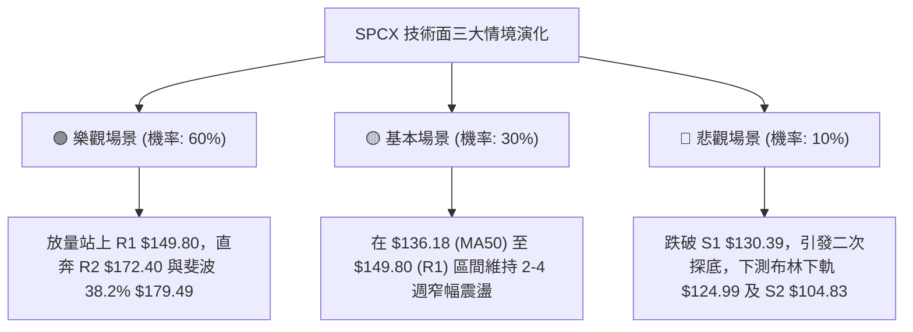

# SPCX 技術分析報告

> **報告日期**：2026-09-03 ｜ **語言**：繁體中文 ｜ **數據來源**：Yahoo Finance ｜ **當前價格**：$140.71

---

## 目錄

| 章節 | 內容 |
|------|------|
| [1. 技術面概覽](#1-技術面概覽) | 訊號儀表板、核心指標、評分卡 |
| [2. 趨勢分析](#2-趨勢分析) | 多時框趨勢、長中短期走勢 |
| [3. 圖表形態分析](#3-圖表形態分析) | 形態識別、K線組合、目標價 |
| [4. 支撐與阻力](#4-支撐與阻力) | 關鍵價位、斐波那契回調 |
| [5. 技術指標深度解讀](#5-技術指標深度解讀) | MA/RSI/MACD/布林/成交量 |
| [6. 動能與波動率](#6-動能與波動率) | 動能評估、ATR、Beta |
| [7. 多時框架總結](#7-多時框架總結) | 時框架評分矩陣 |
| [8. 交易策略建議](#8-交易策略建議) | 多空策略、風險報酬比 |
| [9. 風險提示與監控](#9-風險提示與監控) | 監控指標、風險場景 |

---

## 1. 技術面概覽

### 🎯 技術訊號儀表板



### 📊 核心指標速覽表

| 指標類別 | 指標名稱 | 當前數值 | 訊號 | 解讀 |
|----------|----------|----------|------|------|
| **價格** | 當前收盤價 | $140.71 | 🟡 | 位於52週區間29.7%之低位修復期 |
| **均線** | MA20 | $138.46 | 🟢 | 現價高於MA20 (+1.62%)，短線支撐確立 |
| **均線** | MA50 | $136.18 | 🟢 | 現價高於MA50 (+3.33%)，中期回溫 |
| **均線** | MA200 | 數據中未偵測到 | ⚪ | 歷史數據不足，無法計算長期MA200 |
| **動能** | RSI(14) | 49.20 | 🟡 | 位於45–55中性平衡區間，無超買超賣 |
| **動能** | MACD (12,26,9) | 2.383 (Hist: +0.723) | 🟢 | MACD線高於Signal(1.660)，柱體維持紅柱看多 |
| **趨勢** | ADX (14) | 18.33 | 🟡 | ADX < 25 表明處於盤整震盪市場結構 |
| **通道** | 布林 %B | 0.58 | 🟢 | 略高於中軌($138.46)，朝上軌($151.94)延伸 |
| **波動** | ATR(14) | $6.19 (4.40%) | 🟡 | 每日平均波動幅度約 $6.19，波動度中等 |
| **量能** | 量比 / OBV | 0.48x / OBV > MA | 🟡 | 量能短線萎縮，但中線量能結構偏向多方累積 |

### 🏆 技術評分卡

```
╔══════════════════════════════════════════════════════════════╗
║              技術評分卡 — SPCX (2026-09-03)                   ║
╠══════════════════════════════════════════════════════════════╣
║ 趨勢強度 (ADX=18.33)  ███████░░░░░░░░░░░░░  38/100  🟡 弱趨勢║
║ 動能指標 (MACD/RSI)   ████████████░░░░░░░░  60/100  🟢 中性偏多║
║ 支撐穩定度 (S1=$130)  ██████████████░░░░░░  70/100  🟢 築底穩固║
║ 成交量配合 (OBV/Vol)  █████████░░░░░░░░░░░  45/100  🟡 量能收斂║
║ 形態完整度 (V型/箱體) ████████████░░░░░░░░  62/100  🟢 底型浮現║
║ 均線排列 (短強中弱)   ███████████░░░░░░░░░  55/100  🟡 混合排列║
╠══════════════════════════════════════════════════════════════╣
║ 綜合技術評分          ███████████░░░░░░░░░  55/100  🟡 區間偏多║
╚══════════════════════════════════════════════════════════════╝
```

---

## 2. 趨勢分析

### 🌐 多時框趨勢分析



### 📈 長期趨勢 — 12個月走勢圖（Unicode）

```
SPCX 月線走勢圖（歷史高低與波段變化）
價格軸 ($)
$225.64 ┤                           ● (52W High)
$200.00 ┤                          / \
$175.00 ┤     ● 2026-06 ($170.86) /   \
$150.00 ┤    / \                 /     \     ● 現價 ($140.71)
$140.00 ┤───/───\───────────────/───────\───/────────────────────
$125.00 ┤  /     \             /         \ /  2026-08 ($143.69)
$104.83 ┤ /       ● 2026-07 ($108.37)     ● (52W Low $104.83)
        └────────────────────────────────────────────────────────
          M1      M2    M3      M4        M5    M6 (當前)
```

**走勢特徵分析表格**：

| 階段時間 | 起始價 → 結束價 | 波段漲跌幅 | 主要走勢特徵 | 關鍵技術事件 |
|----------|-----------------|------------|--------------|--------------|
| **波段高點期** | $170.86 → $225.64 (52W高) | 大幅拉升 | 衝高見頂，多頭動能耗盡 | 觸及 52W 峰值 $225.64 後快速回落 |
| **深幅探底期** | $170.86 → $108.37 | -36.57% | 恐慌性下殺，破位尋底 | 週線 RSI 跌至 15.9 極度超賣區，探得 $104.83 |
| **強勁修復期** | $108.37 → $143.69 | +32.59% | 爆量長紅反彈，多頭奪回均線 | 2026-08-09 當週成交 9.20 億股，V型反轉 |
| **高位盤整期** | $143.69 → $140.71 | -2.07% | 縮量橫盤，均線靠攏收斂 | 價格站穩 MA20/MA50，ADX 降至 18.33 進入整理 |

### 📊 中期趨勢（週線分析）

```
近 10 週價格結構與支撐壓力示意圖：
$172.40 ┼────────────────────────────────────────────────────────── 阻力 R2
        │
$149.80 ┼────────────────────────────────────●───────────────────── 阻力 R1 / 61.8% ($150.98)
$140.71 ┼───────────────────────────────●───┼───────● (現價)
$130.39 ┼──────────────────────────●────┼───┴───────────────────── 支撐 S1 / 78.6% ($130.68)
        │                         /     │
$104.83 ┼────────●───────────────/──────┴───────────────────────── 支撐 S2 (52W Low)
        └────────┴──────────────┴─────────────────────────────────
       2026-07-26   2026-08-02  2026-08-09  2026-08-30  2026-09-06
```

### ⚡ 趨勢強度評估（ADX 解讀）



**ADX 強度對照表**：

| 指標變數 | 當前讀數 | 狀態門檻 | 趨勢性質解讀 |
|----------|----------|----------|--------------|
| **ADX(14)** | **18.33** | < 25.0 (弱趨勢/區間盤整) | 價格處於中段整固，單邊動能處於休眠狀態 |
| **+DI** | **21.16** | > -DI (多方略勝一籌) | 多方力量佔據主動權，下方承接盤較強 |
| **-DI** | **17.57** | 低於 20 基準線 | 空方殺跌力量衰退，未見主動性拋壓 |

---

## 3. 圖表形態分析

### 🔍 形態識別系統



**形態信心度與目標價評估表**：

| 形態類別 | 信心度 | 判斷依據（引用數據） | 完成度 | 目標價（附精確計算式） |
|----------|--------|----------------------|--------|------------------------|
| **矩形震盪箱體** | 75% | 箱體下軌獲 S1 $130.39 與 MA50 $136.18 支撐，上軌受制於 R1 $149.80 | 65% | 向上突破 R1 時：形態高度 = $149.80 - $130.39 = $19.41；目標價 = $149.80 + $19.41 = **$169.21** |
| **中期 V型反轉底** | 80% | 自 52W 低點 S2 $104.83 強勢反彈，08-09 當週成交 9.20 億股確認右側反轉 | 85% | 頸線阻力 R1 $149.80，突破後測算高度 $149.80 - $104.83 = $44.97；目標價 = $149.80 + $44.97 = **$194.77** |

### 🕯️ 重要K線形態分析

| 日期 / 月份 | 收盤價 | K線形態特徵 | 技術解讀 | 多空訊號 |
|-------------|--------|-------------|----------|----------|
| **2026-07-26** | $115.07 | 長黑下殺破位 | RSI 探至 15.9 極端恐慌區，空頭動能釋放完畢 | 🔴 短線加速趕底 |
| **2026-08-02** | $108.37 | 探底十字星/錘子底 | 守住 S2 $104.83 支撐，下影線買盤浮現 | 🟢 築底反轉信號 |
| **2026-08-09** | $133.11 | 巨量長紅突破K線 | 單週成交 9.20 億股，週線 MACD 翻正，實質轉強 | 🟢 強烈買進訊號 |
| **2026-08-16** | $140.00 | 延續性中陽線 | 站上 $140 心理整數關卡，確認擺脫底部糾纏 | 🟢 多頭掌控局面 |
| **2026-08-30** | $141.50 | 窄幅整理小陽線 | 觸及 MA5 $141.80 附近遇阻，量能萎縮至 2.85 億股 | 🟡 高位強勢蓄勢 |
| **2026-09-06** | $140.71 | 縮量十字整理星 | 價格穩守 MA20 ($138.46) 上方，短線多空平衡 | 🟡 震盪觀望待變 |

### 📉 ASCII 走勢形態示意圖

```
SPCX 箱體整理與底部反轉結構圖：
$149.80 ┬────────────────────────────────────────── 阻力 R1 / 箱體頂部
        │                     ┌───┐    ┌───┐
$140.71 ┼─────────────────────│現價│────│   │──────── 現價位於中軸偏上
        │              ┌───┐  └───┘    └───┘
$136.18 ┼──────────────│   │─────────────────────── MA50 / 動態支撐
        │       ┌───┐  │   │
$130.39 ┼───────│   │──┴───┴─────────────────────── 支撐 S1 / 箱體底部
        │   ┌───┘   │
$108.37 ┼───┘       │                              V型反轉起點
$104.83 ┴───────────┴────────────────────────────── 52W Low / 支撐 S2
```

---

## 4. 支撐與阻力

### 🗺️ 關鍵價位分布圖（Unicode）

```
SPCX 價位結構分布圖
═══════════════════════════════════════════════════
$225.64 ║████████████████████████║ 52W 高點 (歷史天花板)
$197.13 ║████████████████████    ║ 斐波那契 23.6% 回調位
$179.49 ║██████████████████      ║ 斐波那契 38.2% 回調位
$172.40 ║████████████████████████║ 強阻力 R2 (波段前高聚類)
$165.24 ║████████████████        ║ 斐波那契 50.0% 平衡位
$150.98 ║████████████████████    ║ 斐波那契 61.8% 關鍵回撤
$149.80 ║████████████████████████║ 關鍵阻力 R1 (+6.46%)
$140.71 ╠════════════════════════╣ ◄ 現價 ($140.71)
$138.46 ║▓▓▓▓▓▓▓▓▓▓▓▓▓▓▓▓▓▓▓▓    ║ 布林中軌 / MA20
$136.18 ║▓▓▓▓▓▓▓▓▓▓▓▓▓▓▓▓        ║ 中期均線 MA50
$130.68 ║████████████████████    ║ 斐波那契 78.6% 回調位
$130.39 ║████████████████████████║ 近期強支撐 S1 (-7.33%)
$124.99 ║▓▓▓▓▓▓▓▓▓▓▓▓▓▓▓▓        ║ 布林通道下軌
$104.83 ║████████████████████████║ 52W 低點強支撐 S2 (-25.50%)
═══════════════════════════════════════════════════
```

### 🚧 阻力位分析表

| 阻力級別 | 精確價位 | 形成原因（聚類與回調） | 突破難度 | 重要性評級 |
|----------|----------|------------------------|----------|------------|
| **R1** | **$149.80** | 近一年波段高點聚類，且貼近布林上軌 ($151.94) 與 61.8% 回調位 ($150.98) | 中等 (需補量突破) | ★★★★☆ |
| **R2** | **$172.40** | 2026-06 波段高點區間聚類 ($170.86 - $172.40)，解套賣壓密集區 | 極高 (強阻力帶) | ★★★★★ |

### 🛡️ 支撐位分析表

| 支撐級別 | 精確價位 | 形成原因（聚類與回調） | 守住機率 | 重要性評級 |
|----------|----------|------------------------|----------|------------|
| **S1** | **$130.39** | 近一年波段低點聚類，緊鄰 78.6% 斐波那契回調位 ($130.68) 及起漲缺口 | 80% (強支撐) | ★★★★☆ |
| **S2** | **$104.83** | 52週歷史極值低點 (52W Low)，雙底扎實防線 | 95% (終極底線) | ★★★★★ |

### 📐 斐波那契回調位分析（基於 52W 區間 $104.83 → $225.64）

```
斐波那契回調結構解析：
0.0%  (52W High) ── $225.64 ── 強阻力頂部
23.6%            ── $197.13 ── 強勢多頭目標
38.2%            ── $179.49 ── 中期上行阻力
50.0%            ── $165.24 ── 多空強弱分水嶺
61.8%            ── $150.98 ── 關鍵黃金分割阻力區 (緊鄰 R1 $149.80)
------------------ 現價 $140.71 處於 61.8% 與 78.6% 之間 ------------------
78.6%            ── $130.68 ── 黃金回撤防守位 (緊鄰 S1 $130.39)
100.0% (52W Low) ── $104.83 ── 結構性底線
```

**回調位深度解讀**：
現價 $140.71 精準運行於 **78.6% ($130.68)** 與 **61.8% ($150.98)** 的黃金通道區間內。這表明股價在 $104.83 探底後已成功跨越 78.6% 深度回撤線，目前正處於向上挑戰 61.8% 黃金分割阻力位 ($150.98，與 R1 $149.80 重疊) 的蓄勢攻堅階段。若能帶量實體站穩 $150.98，則宣告中期反轉確認，向上空間將直指 50.0% ($165.24) 與 38.2% ($179.49)。

---

## 5. 技術指標深度解讀

### 🎛️ 指標訊號總覽



### 📈 移動平均線排列分析



**均線狀態解讀**：
- **短期均線**：MA5 ($141.80) 略微向下形成壓制，但 MA10 ($139.26) 與 MA20 ($138.46) 向上穿越形成金叉支撐，支撐現價於 $139–$140 區間。
- **中期均線**：現價大幅高於 MA50 ($136.18)，且 MA20 > MA50 呈現初級多頭排列，中期趨勢已由空翻多。
- **長期均線**：MA60、MA120、MA200 歷史數據不足，不予捏造。

### 📉 RSI(14) 分析

```
RSI(14) 讀數：49.20 ｜ 中性平衡區
0 ────── 超賣區 (30) ────────── 50 (中軸) ────────── 超買區 (70) ────── 100
[░░░░░░░░░░░░░░░░░░░░░░░░░░░░░░████████████████░░░░░░░░░░░░░░░░░░░░░░░░] 49.2%
```

- **超買超賣評估**：當前 RSI 處於 49.20，緊鄰 50 多空分水嶺，表明市場自 2026-07 的極端超賣 (RSI 15.9)修復完畢後，已進入健康的指標重置期，具備充足的上行緩衝空間，無鈍化或過熱疑慮。
- **背離分析**：
  - **頂背離**：無頂背離現象。
  - **底背離**：2026-07-26 價格創新低 $104.83 時，RSI 自 15.9 快速回升至 19.2，形成微幅**動能底背離**，隨後引發 8 月初的猛烈報復性反彈。目前指標走勢與價格走勢同步。

### 📊 MACD(12/26/9) 訊號解讀



- **訊號解析**：MACD 線 (2.383) 維持在 Signal 線 (1.660) 之上，差值柱狀圖為 **+0.723**，維持正值綠柱狀態。
- **動能評估**：雖然柱狀圖自高點 +4.591 收斂至 +0.723，反映短線爆發力減弱、轉為高位整固，但只要柱狀圖未跌破零軸，中期多頭結構依舊完整。

### 📦 布林通道分析

```
布林通道結構示意圖 (Bandwidth = $26.95)：
$151.94 ┬────────────────────────────────────────── BB 上軌 (壓力區)
        │
$140.71 ┼─────────────────────────●──────────────── 現價 (%B = 0.58)
$138.46 ┼────────────────────────────────────────── BB 中軌 (MA20 強支撐)
        │
$124.99 ┴────────────────────────────────────────── BB 下軌 (超賣邊界)
```

- **位置評估**：%B 為 **0.58**，價格穩居中軌 $138.46 之上，朝上軌 $151.94 溫和推進。
- **開口狀態**：通道寬度隨價格橫盤而呈現逐步收斂跡象，通常預示在未來 2–4 週內將迎來方向性突破行情。

### 💹 成交量分析（量價配合度）

- **量比現況**：最新成交量為 49,771,100 股，相較於 20 日均量 (104,411,845 股) 之量比僅 **0.48x**，顯著縮量。
- **量價配合**：在 8 月初突破階段放巨量 (單週 9.20 億股)，隨後在 $140 平台整理時量能遞減，呈現典型的「**漲放量、跌縮量**」之多頭洗盤特徵。
- **OBV 能量潮**：OBV > MA，能量潮指標領先價格維持上行趨勢，確認主力籌碼在回調過程中並無大幅流出，量能對價格形成良好支撐。

---

## 6. 動能與波動率

### ⚡ 動能評估四象限

| 象限 | 動能強度 (MACD/RSI) | 波動率 (ATR/BBW) | 當前判定 | 特徵與操作意涵 |
|------|---------------------|------------------|----------|----------------|
| **Q1 (最佳爆發區)** | 強 (MACD>0, RSI>55) | 低 (縮量收斂) | ⚪ | 突破在即，右側追價最佳時機 |
| **Q2 (震盪整固區)** | **中/偏強 (Hist>0, RSI~50)** | **中/低 (ATR=4.4%, ADX<25)** | **✓ (SPCX 當前)** | **籌碼沉澱，適合箱體逢低分批佈局** |
| **Q3 (劇烈博弈區)** | 強 (單邊單日爆量) | 高 (ATR>6%) | ⚪ | 高風險高收益，適合短線突破交易 |
| **Q4 (陰跌衰退區)** | 弱 (MACD<0, RSI<40) | 高 (破位放量) | ⚪ | 嚴格停損觀望，避免盲目抄底 |



### 📊 ATR 波動率分析

- **ATR(14) 數值**：**$6.19**，佔當前股價之 **4.40%**。
- **止損距離設計**：
  - **短線交易止損 (1.0 × ATR)**：距進場點 **$6.19**，對應現價約 **$134.52**。
  - **波段交易止損 (1.5 × ATR)**：距進場點 **$9.29**，對應現價約 **$131.42**（緊貼 S1 支撐 $130.39 上方）。
  - **趨勢保護止損 (2.0 × ATR)**：距進場點 **$12.38**，對應現價約 **$128.33**。

### 📐 Beta 與市場相關性

- **Beta 數值**：數據中標注為 `N/A`，依合規紀律不予捏造。
- **市場特徵推演**：從 Aerospace & Defense 產業及 Starlink/Launch 業務高成長性 (YoY 91.9%) 與高估值特徵觀察，該標的在市場風險偏好轉向時具有顯著的高波動 Alpha 特性；日均成交額巨大（20日均量超過 1 億股），具備機構高度定價權與優渥的流動性。

---

## 7. 多時框架總結

### 📋 時框架評分表

| 時框架 | 趨勢方向 | 動能狀態 | 均線排列 | 形態結構 | 綜合評分 | 操作建議 |
|--------|----------|----------|----------|----------|----------|----------|
| **月線 (長期)** | 🟡 底部修復 | 🟡 RSI 回升 | ⚪ 長均線不足 | 探底回升 | 50/100 | 長期分批逢低配置 |
| **週線 (中期)** | 🟢 轉強上行 | 🟢 MACD 紅柱 | 🟢 站上 MA50 | V型底確立 | 65/100 | 拉回找買點，波段做多 |
| **日線 (短期)** | 🟡 窄幅震盪 | 🟡 RSI 49.2 | 🟡 短均線糾結 | 箱體蓄勢 | 52/100 | 箱體區間高拋低吸 |

### 🔲 綜合訊號矩陣

```
┌────────────────────────────────────────────────────────┐
│              SPCX 多時框訊號一致性矩陣                  │
├──────────────┬──────────────┬──────────────┬───────────┤
│ 維度         │ 短期 (日線)  │ 中期 (週線)  │ 長期 (月線)│
├──────────────┼──────────────┼──────────────┼───────────┤
│ 趨勢方向     │ 🟡 橫盤震盪  │ 🟢 多頭反轉  │ 🟡 尋底企穩│
│ 動能強度     │ 🟡 中性整理  │ 🟢 柱體走揚  │ 🟡 超賣修復│
│ 支撐強度     │ 🟢 $138.46   │ 🟢 $130.39   │ 🟢 $104.83│
│ 阻力壓制     │ 🟡 $141.80   │ 🔴 $149.80   │ 🔴 $172.40│
├──────────────┴──────────────┴──────────────┴───────────┤
│ 結論收斂：短期日線震盪不改中期週線偏多基調，多頭佔優   │
└────────────────────────────────────────────────────────┘
```

### ⚖️ 多時框收斂結論

> **依多時框收斂規則 14 判定**：
> 當前 **ADX(14) = 18.33 < 25**，市場明確定義為**「盤整行情」**。
> 根據規則，盤整行情應以**日線布林通道上下軌 ($124.99 – $151.94)** 與 **箱體區間 ($130.39 – $149.80)** 為核心交易區間。
> 雖然週線級別 MACD 翻正釋放中期反轉訊號，但在日線成交量萎縮 (0.48x) 與 ADX 疲弱的約束下，短期不具備單邊暴漲條件。
> 
> **唯一收斂結論**：**【中性偏多 — 區間箱體逢低做多】**。此結論與第 8 章交易策略完全收斂一致。

---

## 8. 交易策略建議

### 🗺️ 策略決策流程圖



### 🧭 策略路由

**當前主策略方向 = 【中性偏多：區間低吸與突破多頭策略】（依評分 55/100）**
綜合評分處於 40–60 區間且 ADX < 25，市場由布林通道與 S1/R1 箱體主導。主推「回踩支撐低吸」與「右側放量突破」兩套做多策略；空頭不主動開倉，僅列為風險對沖防禦點。

### 🎯 價格情境階梯（Price Scenarios）

| 觸發條件 | 第一目標 | 後續延伸 | 情境技術含義與應對 |
|----------|----------|----------|--------------------|
| **向上突破 R1 $149.80** | **R2 $172.40** | **斐波 38.2% $179.49** | 短線整理結束，展開主升浪，全面加碼做多 |
| **維持現價 $140.71 震盪** | **布林上軌 $151.94** | **布林中軌 $138.46** | 箱體內部洗盤整固，維持區間高拋低吸操作 |
| **向下跌破 S1 $130.39** | **布林下軌 $124.99** | **S2 $104.83** | 中期反彈結構遭破壞，多單全面止損離場觀望 |

### 📊 情境機率分佈

| 情境類別 | 發生機率 | 主要技術依據 |
|----------|----------|--------------|
| **震盪盤整後向上突破** | **60%** | MACD 柱狀體維持紅柱 (+0.723)、價格穩居 MA20/MA50 之上、OBV 趨勢向上量能支撐 |
| **維持窄幅箱體震盪** | **30%** | ADX(14) = 18.33 顯示趨勢動能偏弱、短期成交量萎縮 (量比 0.48x) |
| **破位下行回測深底** | **10%** | S1 $130.39 與 78.6% 回調位 ($130.68) 具備強大買盤防禦，下行空間受限 |

### 🟢 主策略詳情

| 策略要素 | 策略 A（回踩支撐逢低吸納 — 穩健型） | 策略 B（突破阻力右側追擊 — 積極型） |
|----------|-------------------------------------|-------------------------------------|
| **進場條件** | 價格回踩 MA20/MA50 獲支撐且出現反彈陽線 | 實體日K線放量突破阻力位 R1 $149.80 |
| **進場價格** | **$136.50 – $138.46** (均線聚攏區) | **$150.50** (確認站穩 R1 之上) |
| **目標價 T1** | **$149.80** (阻力位 R1) | **$165.24** (斐波那契 50.0% 回調位) |
| **目標價 T2** | **$165.24** (斐波那契 50.0% 回調位) | **$172.40** (阻力位 R2) |
| **止損價格** | **$130.00** (精確設於 S1 $130.39 之下) | **$143.50** (跌破突破前平台與 ATR 緩衝) |
| **風險報酬比** | **1 : 2.52**（以進場$137.5/止損$130/T2$165.24計） | **1 : 3.13**（以進場$150.5/止損$143.5/T2$172.40計） |
| **成功機率** | **65%** | **60%** |
| **建議倉位** | **15% – 20%** 基礎底倉 | **10% – 15%** 動量突破倉 |

### 🔴 反向風險觸發點（對沖提示）

- **觸發條件**：若股價無預警放量摜破 **S1 $130.39**，且日線 MACD 柱狀體翻負跌破 0 軸。
- **風控行動**：多頭部位應無條件執行止損；若持有大量現貨部位，可於跌破 $130.39 時建立相應空頭對沖部位，目標下看布林下軌 **$124.99** 及 52W 低點 **$104.83**。

### ⭐ 整體訊號強度評星

```
做多訊號強度：★★★★☆  (4/5星 — 均線與動能指標偏多，唯量能待補)
做空訊號強度：★☆☆☆☆  (1/5星 — 底部支撐強勁，缺乏做空誘因)
整體可信度：  ★★★★☆  (4/5星 — 多時框價位聚類清晰，風險回報比優異)
```

---

## 9. 風險提示與監控

### ✅ 關鍵監控指標 Checklist

```
╔══════════════════════════════════════════════════════════════╗
║              SPCX 技術面每日監控清單 (Checklist)              ║
╠══════════════════════════════════════════════════════════════╣
║ [ ] 價格是否持續守在 MA20 ($138.46) 與 MA50 ($136.18) 之上   ║
║ [ ] 日成交量是否放大至 20日均量 (1.04億股) 之上以確認突破動能 ║
║ [ ] RSI(14) 是否順利穿越 55 進入強勢擴張區間                ║
║ [ ] MACD 柱狀圖是否持續維持在正值區間 (> 0)                  ║
║ [ ] ADX(14) 是否自 18.33 向上勾頭突破 25，展開單邊趨勢行情    ║
║ [ ] 向上測試 R1 ($149.80) 時是否出現帶長上影線之滯漲信號     ║
║ [ ] 跌破 S1 ($130.39) 關鍵防守位時必須嚴格執行停損           ║
╚══════════════════════════════════════════════════════════════╝
```

### ⚠️ 風險場景分析



### 🛡️ 風險管理重要提醒

1. **波動率管理**：SPCX 當前 ATR 為 $6.19 (4.40%)，單日價格彈性較大。單筆交易風險敞口建議嚴格控制在總投資組合淨值的 **1.0% – 1.5%** 以內。
2. **倉位配置原則**：在 ADX < 25 的盤整結構下，切忌重倉單點押注。建議採取「**底倉 (15%) + 突破加碼 (10%)**」的階梯式建倉模式。
3. **止損紀律執行**：支撐位 S1 ($130.39) 為本輪反彈結構的生命線，一旦實體收盤跌破，切勿凹單，必須果斷執行止損以規避深跌風險。

---

## 📋 報告總結

```
╔══════════════════════════════════════════════════════════════╗
║                   SPCX 技術分析報告總結                       ║
╠══════════════════════════════════════════════════════════════╣
║ 報告日期：2026-09-03                                         ║
║ 當前價格：$140.71                                            ║
║ 分析評級：⚖️ 中性偏多 / 區間低吸 (評分: 55/100)               ║
║                                                              ║
║ 關鍵結論：                                                   ║
║ ├─ 長期趨勢：🟡 自 52W 低點 $104.83 企穩回升，處於修復期     ║
║ ├─ 中期趨勢：🟢 週線 MACD 翻正，V型反轉結構確立，站穩 MA50   ║
║ ├─ 短期趨勢：🟡 ADX=18.33 進入縮量蓄勢盤整，等待方向突破     ║
║ ├─ 關鍵支撐：S1: $130.39  ｜  S2: $104.83                   ║
║ ├─ 關鍵阻力：R1: $149.80  ｜  R2: $172.40                   ║
║ └─ 分析師目標價：均值 $222.32 (High: $450.00 / Low: $117.00) ║
║                                                              ║
║ 最優策略組合：                                               ║
║ 1. 🥇 最佳機會（策略 A）：回踩 MA20/MA50 ($136.50–$138.46)   ║
║    逢低分批佈局，止損設於 $130.00，目標上看 $149.80 / $165.24 ║
║ 2. 🥈 次選機會（策略 B）：放量突破 R1 ($149.80) 後右側加碼， ║
║    順勢博弈波段主升浪至 R2 $172.40                           ║
║ 3. 🥉 保守選擇：維持場外觀望，靜待 ADX > 25 且量能放大後進場 ║
╚══════════════════════════════════════════════════════════════╝
```

---

> ⚠️ **免責聲明**：本報告為 AI 自動生成之技術分析，所有數據及估算均基於提供的歷史價格資訊。本報告**僅供研究與學術參考**，**不構成任何投資建議**。投資有風險，入市需謹慎。

---

*報告生成時間：2026-09-03 ｜ 數據來源：Yahoo Finance ｜ 分析框架：多時框技術分析*