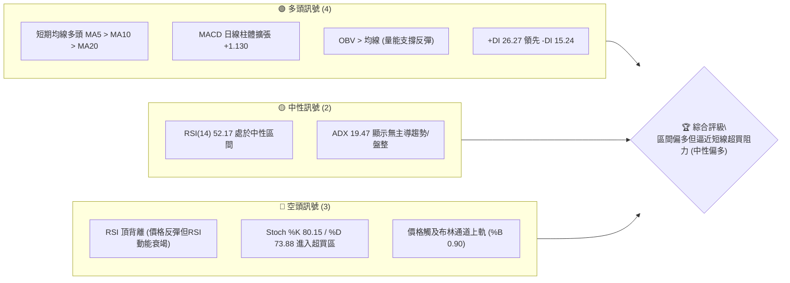
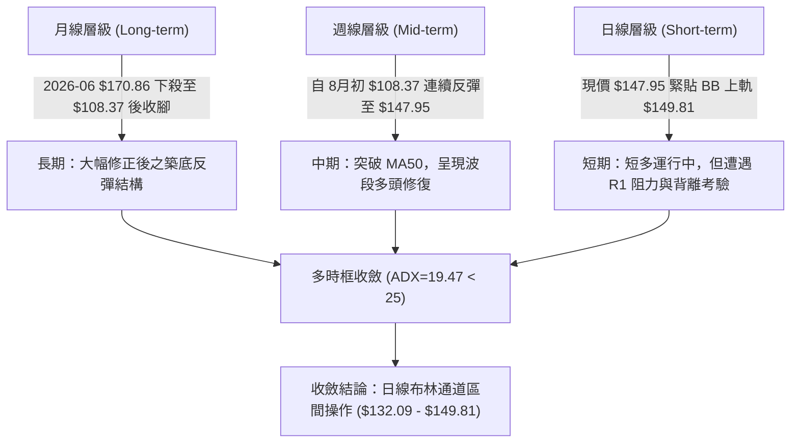
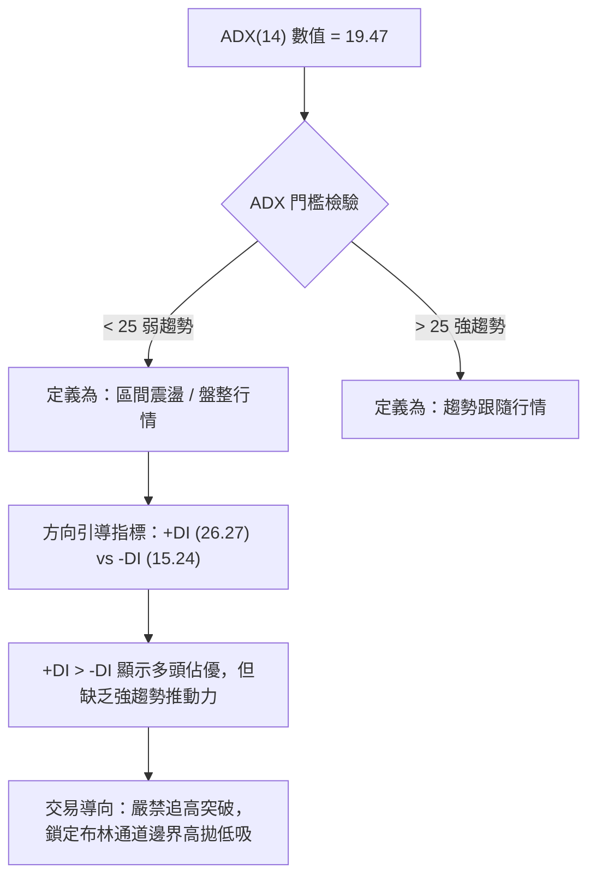
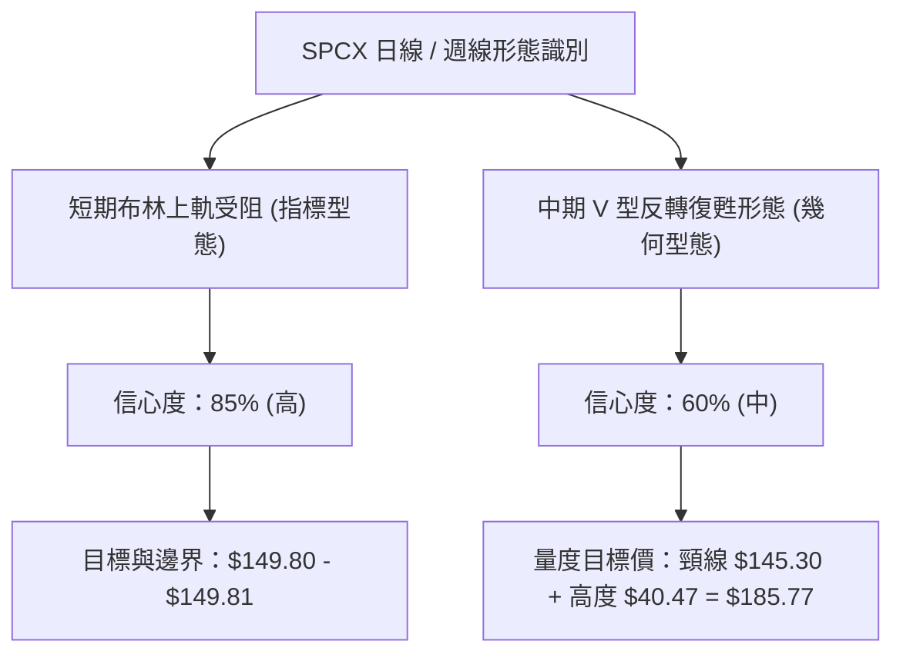
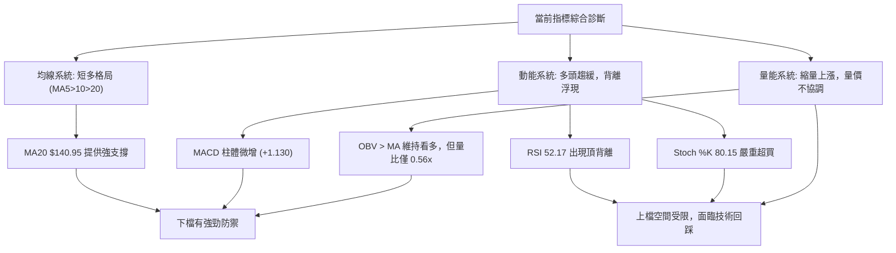
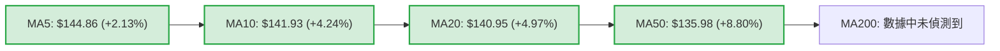
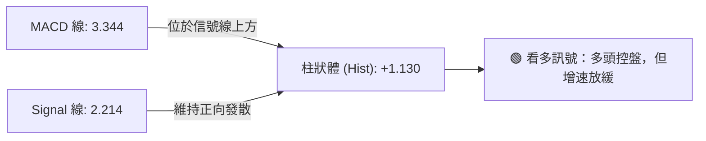
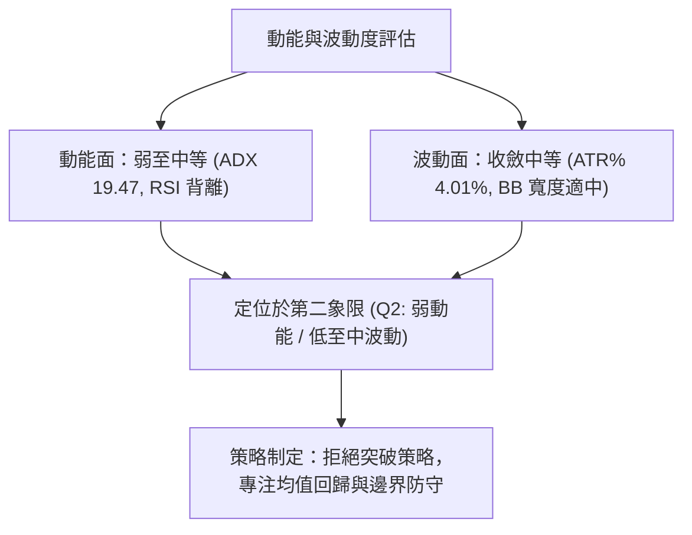
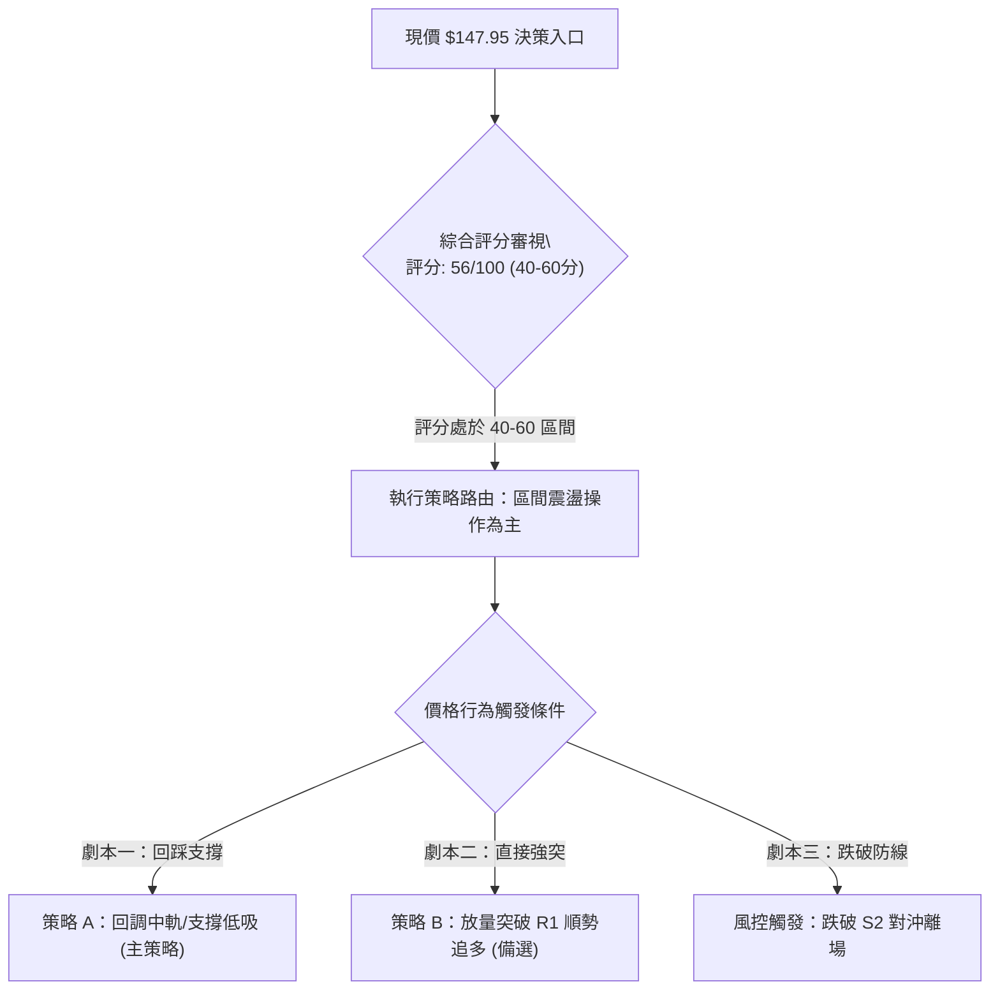
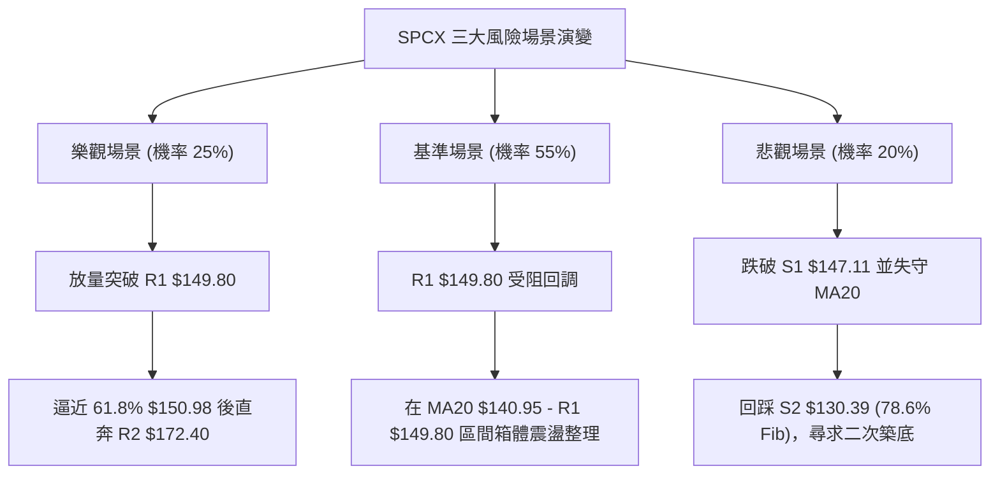

# SPCX 技術分析報告

> **報告日期**：2026-09-05 ｜ **語言**：繁體中文 ｜ **數據來源**：Yahoo Finance ｜ **當前價格**：$147.95

---

## 目錄

| 章節 | 內容 |
|------|------|
| [1. 技術面概覽](#1-技術面概覽) | 訊號儀表板、核心指標、評分卡 |
| [2. 趨勢分析](#2-趨勢分析) | 多時框趨勢、長中短期走勢 |
| [3. 圖表形態分析](#3-圖表形態分析) | 形態識別、K線組合、目標價 |
| [4. 支撐與阻力](#4-支撐與阻力) | 關鍵價位、斐波那契回調 |
| [5. 技術指標深度解讀](#5-技術指標深度解讀) | MA/RSI/MACD/布林/成交量 |
| [6. 動能與波動率](#6-動能與波動率) | 動能評估、ATR、Beta |
| [7. 多時框架總結](#7-多時框架總結) | 時框架評分矩陣 |
| [8. 交易策略建議](#8-交易策略建議) | 多空策略、風險報酬比 |
| [9. 風險提示與監控](#9-風險提示與監控) | 監控指標、風險場景 |
| [10. 報告總結](#10-報告總結) | 總結卡片、最優策略組合 |

---

## 1. 技術面概覽

### 🎯 技術訊號儀表板



### 📊 核心指標速覽表

| 指標類別 | 指標名稱 | 當前數值 | 訊號 | 解讀 |
|----------|----------|----------|------|------|
| **價格** | 當前價格 | $147.95 | 🟡 | 位於52週區間 35.7%，反彈至波段中軸 |
| **均線** | MA20 | $140.95 | 🟢 | 價格在MA20上方 (+4.97%)，短線偏多 |
| **均線** | MA50 | $135.98 | 🟢 | 價格在MA50上方 (+8.80%)，中期底部確立 |
| **均線** | MA200 | 數據中未偵測到 | 🟡 | 資料不足，長期趨勢由月線結構輔助評估 |
| **動能** | RSI(14) | 52.17 | 🟡 | 中性區間，但出現頂背離警訊 |
| **動能** | MACD | 3.344 / 2.214 | 🟢 | 柱體 +1.130，維持零軸上方黃金交叉多頭格局 |
| **動能** | Stoch %K/%D | 80.15 / 73.88 | 🔴 | KD 指標進入超買鈍化區間，短線回調壓力浮現 |
| **趨勢** | ADX(14) | 19.47 | 🟡 | ADX < 25 判定為弱趨勢／區間震盪行情 |
| **通道** | BB %B | 0.90 | 🔴 | 逼近布林通道上軌 $149.81，存在均值回歸風險 |
| **波動** | ATR(14) | $5.93 | 🟡 | 佔股價 4.01%，波動處於中等收斂水平 |
| **量能** | 量比 (Volume) | 0.56x | 🔴 | 最新量 48.9M vs 20日均量 88.1M，呈現縮量上漲 |

### 🏆 技術評分卡

```
╔══════════════════════════════════════════════════════════════╗
║              SPCX 技術評分卡 (2026-09-05)                    ║
╠══════════════════════════════════════════════════════════════╣
║ 趨勢強度 (ADX/趨勢方向)  ████████░░░░░░░░░░░░  42/100 🟡 中性 ║
║ 動能指標 (MACD/RSI/KD)   ████████████░░░░░░░░  58/100 🟢 偏多 ║
║ 支撐穩定度 (S1/S2防守)   ██████████████░░░░░░  70/100 🟢 強韌 ║
║ 成交量配合 (縮量上漲)    ████████░░░░░░░░░░░░  40/100 🔴 背離 ║
║ 形態完整度 (V型/箱體)    ████████████░░░░░░░░  60/100 🟢 偏多 ║
║ 均線排列 (短天期多頭)    ██████████████░░░░░░  68/100 🟢 看多 ║
╠══════════════════════════════════════════════════════════════╣
║ 綜合評分                 ███████████░░░░░░░░░  56/100 🟡 中性 ║
║ 判定結論：區間震盪偏多（以區間震盪震盪策略為主，防範回調）   ║
╚══════════════════════════════════════════════════════════════╝
```

---

## 2. 趨勢分析

### 🌐 多時框趨勢分析



### 📈 長期趨勢 — 12個月走勢圖（Unicode）

依據 24 個月歷史收盤價及近 20 週數據，SPCX 經歷了 2026 年中期的劇烈去槓桿與恐慌殺跌，並在 2026 年 8 月於 $104.83 - $108.37 區域構築硬底：

```
SPCX 月線走勢圖（歷史高低與近 12 個月演變示意）
價格軸 ($)
$225.64 ┤                    ● (52W High)
$197.13 ┤            ●
$179.49 ┤      ●     
$170.86 ┤● (06月)                      
$150.98 ┤                                    ●←現價 $147.95 (09月)
$143.69 ┤                              ● (08月)
$130.68 ┤         
$108.37 ┤                   ● (07月收盤)
$104.83 ┤                   ● (52W Low)
        └───────────────────────────────────────────────
         M-11 M-9  M-7  M-5  M-3  M-2  M-1  現月(2026-09)
```

#### 走勢特徵分析表格

| 階段區間 | 價格區間 | 累計漲跌幅 | 走勢特徵與量能結構 |
|----------|----------|------------|--------------------|
| **高檔回落期** (2026-06) | $225.64 → $170.86 | -24.28% | 52週高點受阻後爆量轉折，週量達 9.25億股，機構獲利了結 |
| **恐慌崩跌期** (2026-07) | $170.86 → $108.37 | -36.57% | 週線 RSI 跌至 15.9 超賣極值，單月斷崖式下跌，散戶籌碼清洗 |
| **強勁修復期** (2026-08) | $108.37 → $143.69 | +32.59% | 自 52W 低點 $104.83 築底拉升，量能放大至 9.20億股，MACD 出現綠柱 |
| **高位整理期** (2026-09) | $143.69 → $147.95 | +2.96% | 逼近 R1 $149.80 阻力區，成交量萎縮至 0.56x，呈現窄幅推升 |

### 📊 中期趨勢（週線分析）

從週線級別來看，SPCX 展現典型的「V型反轉後高位旗形/橫盤整理」：
1. **週線 MACD 翻多**：MACD 柱狀體在 2026-08-09 翻正（+2.330），最新報 +1.130，維持在中期偏多循環。
2. **週線 RSI 修復**：由超賣低點 15.9 快速反彈至目前 52.2，重回 50 均衡中軸，表明空頭殺跌力道徹底消退。
3. **近期量能趨緩**：反彈初期（8月初）單週爆出 9.20億股巨量，但近兩週週量萎縮至 2.85億與 3.37億股，顯示買盤追高意願減弱，短期上攻動能受限於量縮。

### ⚡ 趨勢強度評估（ADX 解讀）



| 指標名稱 | 當前數值 | 參考門檻 | 強度解讀 |
|----------|----------|----------|----------|
| **ADX (14)** | 19.47 | < 25 (弱趨勢/盤整) | 趨勢動能匱乏，股價處於均線糾結後的區間消化期 |
| **+DI (14)** | 26.27 | - | 多頭佔據微弱優勢，買盤仍處主導 |
| **-DI (14)** | 15.24 | - | 空方賣壓暫時受抑，未見主動性強烈拋盤 |
| **DI 差值** | +11.03 | > 0 多頭架構 | 短線偏多震盪，但不足以引發單邊單向暴漲趨勢 |

---

## 3. 圖表形態分析

### 🔍 形態識別系統



| 形態 | 信心度 | 判斷依據（引用數據） | 完成度 | 目標價（附計算式） |
|------|--------|----------------------|--------|--------------------|
| **布林上軌受阻形態** | 85% | 股價達 $147.95，BB %B=0.90，上軌位於 $149.81，R1 為 $149.80 | 90% | 均值回歸目標價（中軌 MA20）= **$140.95** |
| **中期 V 型底反轉** | 60% | 自 52W 低點 $104.83 暴力拉升，突破 2026-07-12 反彈起跌頸線 $145.30 | 75% | 頸線 $145.30 + (頸線 $145.30 - 低點 $104.83 = 形態高度 $40.47) = **$185.77**（中長線） |
| **頭肩底形態** | 30% | 數據中未偵測到完整的右肩回踩結構，右側量能呈現萎縮 | 35% | 訊號不足，僅做指標型解讀 |

### 🕯️ 重要K線形態分析

| 月份 / 週期 | 收盤價 | K線形態 | 解讀 | 訊號 |
|-------------|--------|---------|------|------|
| **2026-06** | $170.86 | 長上影大陰線 | 衝高 $225.64 後遭遇機構集中出貨，多頭潰敗 | 🔴 強烈看空 |
| **2026-07** | $108.37 | 長下影紡錘線 | 探底 $104.83 後出現恐慌盤湧出與買盤承接 | 🟡 止跌轉折 |
| **2026-08** | $143.69 | 光腳大陽線 | 單月飆升 32.59%，以大實體吞噬前月跌幅，確立中線底部 | 🟢 強烈看多 |
| **2026-09 (現)**| $147.95 | 高位小實體陽十字星 | 逼近 R1 $149.80，上影線壓制顯著，買動能放緩 | 🟡 滯漲警戒 |

### 📉 ASCII 走勢形態示意圖

```
SPCX 日線/週線 走勢形態示意圖
$185.00 ┤        /\ (6月高位)
$172.40 ┤───────/──\─────────────────────────────── [阻力 R2]
$160.00 ┤      /    \
$149.80 ┤     /      \             /\  ◄──現價 $147.95 逼近 [阻力 R1 / BB上軌]
$140.95 ┤    /        \           /  \      [BB中軌 MA20]
$130.39 ┤   /          \         /    \──── [支撐 S2 / 斐波 78.6%]
$115.00 ┤  /            \       /
$104.83 ┤                \_____/            [52W Low / 支撐 S3]
        └──────────────────────────────────────────────
         2026-06       2026-07   2026-08   2026-09
```

### 🎯 形態目標價計算

1. **短期布林均值回歸形態（信心度 85%）**：
   - 股價多次受阻於布林上軌與阻力位 R1（$149.80 - $149.81），同時 RSI 頂背離確立。
   - 理論回調目標為日線布林通道中軌（MA20），計算式即為 MA20 數值：**$140.95**。
2. **中期 V 型反轉量度目標（信心度 60%）**：
   - 形態底部低點：$104.83（52W Low）
   - 關鍵突破頸線：$145.30（2026-07-12 波段頂點）
   - 形態垂直高度：$145.30 - $104.83 = $40.47
   - 向上等距對稱推算目標價：$145.30 + $40.47 = **$185.77**（註：中長線需突破 R2 $172.40 阻力方可挑戰）。

---

## 4. 支撐與阻力

### 🗺️ 關鍵價位分布圖（Unicode）

```
SPCX 價位結構分布圖
═══════════════════════════════════════════════════════════
$225.64 ║██████████████████████████████║ 52週歷史頂峰 (0.0% Fib)
$197.13 ║██████████████████            ║ 斐波那契 23.6% 回調位
$179.49 ║████████████████████          ║ 斐波那契 38.2% 回調位
$172.40 ║████████████████████████      ║ 強阻力 R2 (波段高點聚類)
$165.24 ║████████████████              ║ 斐波那契 50.0% 中軸分水嶺
$150.98 ║██████████████████████        ║ 斐波那契 61.8% 強阻力
$149.80 ║████████████████████████████  ║ 關鍵阻力 R1 / 布林上軌 ($149.81)
$147.95 ╠══════════════════════════════╣ ◄ 現價位置 ($147.95, BB %B=0.90)
$147.11 ║▓▓▓▓▓▓▓▓▓▓▓▓▓▓▓▓▓▓▓▓▓▓▓▓▓▓▓▓  ║ 近期支撐 S1 (波段低點聚類)
$140.95 ║▓▓▓▓▓▓▓▓▓▓▓▓▓▓▓▓▓▓            ║ 布林中軌 / MA20 動態支撐
$130.68 ║██████████████████████        ║ 斐波那契 78.6% 回調位
$130.39 ║████████████████████████████  ║ 強支撐 S2 (波段低點聚類)
$104.83 ║██████████████████████████████║ 鐵底支撐 S3 / 52週低點 (100.0% Fib)
═══════════════════════════════════════════════════════════
```

### 🚧 阻力位分析表

| 阻力級別 | 價位 | 形成原因 | 突破難度 | 重要性 |
|----------|------|----------|----------|--------|
| **R1** | $149.80 | 近一年波段高點聚類；高度重合日線布林通道上軌（$149.81） | 🔴 極高（量能萎縮難以直接衝破） | ★★★★★ |
| **R2** | $172.40 | 近一年波段密集套牢區高點聚類；接近 2026-06 月線收盤價 $170.86 | 🔴 很高（需巨量換手方能消化） | ★★★★☆ |
| **R3** | 數據中未偵測到 | 數據未偵測到 R3 聚類點；中長期延伸參考斐波那契 38.2% 位 $179.49 | — | — |

### 🛡️ 支撐位分析表

| 支撐級別 | 價位 | 形成原因 | 守住機率 | 重要性 |
|----------|------|----------|----------|--------|
| **S1** | $147.11 | 近一年波段低點聚類，距離現價僅 -0.57%，為極短線多頭防線 | 🟡 55%（極易受盤中波動跌破） | ★★★☆☆ |
| **S2** | $130.39 | 近一年波段低點聚類；高度共振斐波那契 78.6% 位（$130.68）與布林下軌（$132.09） | 🟢 85%（具備極強共振防守強度） | ★★★★★ |
| **S3** | $104.83 | 52週絕對最低價（52W Low / 100.0% Fib），中期底部磐石 | 🟢 95%（極限防守位，跌破宣告崩盤） | ★★★★★ |

### 📐 斐波那契回調位分析

依據 52 週波動區間（$104.83 → $225.64），各層次回調數值如下：
- **0.0% (52W High)**: $225.64
- **23.6%**: $197.13
- **38.2%**: $179.49
- **50.0%**: $165.24
- **61.8%**: $150.98
- **78.6%**: $130.68
- **100.0% (52W Low)**: $104.83

**現價區間解讀**：
當前價格 **$147.95** 位於 **61.8% 回調位 ($150.98)** 與 **78.6% 回調位 ($130.68)** 之間。
- 黃金分割 61.8% 位 $150.98 與阻力位 R1 $149.80、布林上軌 $149.81 在 $150 關卡形成「三重重疊強阻力帶」。
- 現價在此處遭遇顯著拋壓，若無增量資金介入，股價難以一次性有效站穩 61.8% ($150.98) 之上；回測 78.6% ($130.68) 及 S2 ($130.39) 將是極具高盈虧比的安全買點。

---

## 5. 技術指標深度解讀

### 🎛️ 指標訊號總覽



### 📈 移動平均線排列分析



- **短均線排列狀態**：MA5 ($144.86) > MA10 ($141.93) > MA20 ($140.95) > MA50 ($135.98)，短天期均線呈現完整的多頭排列。
- **乖離率分析**：現價 $147.95 距離 MA20 乖離率達 +4.97%，距離 MA5 乖離 +2.13%，短期呈現正向乖離擴大，隨時引發技術性收斂。
- **MA60 / MA120 / MA200 狀態**：數據中未偵測到（資料不足），表明市場經歷結構性重整，中長期趨勢主要依託 MA50 ($135.98) 與週線級別均線作為多空基準。

### 📉 RSI(14) 分析

```
RSI(14) 刻度尺與現狀：
0 ─────── 30 ──────────────── 50 ────── 52.17 ──────── 70 ─────── 100
[ 極度超賣 ]    [ 弱勢區間 ]       [ 均衡 ]  [現值🟡]   [ 強勢超買區間 ]
RSI 強度進度條：██████████░░░░░░░░░░ 52.17%
```

- **頂背離判斷（⚠️ Bearish Divergence）**：
  - 現價自 8 月下旬的 $141.50 推升至 $147.95（高點持續墊高）。
  - 然而週線/日線 RSI 卻自 2026-08-16 的高點 63.3 滑落至 2026-08-23 的 60.8，再降至目前的 52.17。
  - **背離結論**：股價創新高而動能指標高點下移，構成標準的「技術面頂背離」，警示此波段上推純屬慣性，買盤動能已嚴重衰竭，回調機率劇增。

### 📊 MACD(12/26/9) 訊號解讀



- **MACD 主線**：3.344，高於訊號線（Signal）2.214，兩者均在零軸之上運行。
- **MACD 柱狀體**：當前為 +1.130，相較上週（2026-08-30 的 +1.082）僅微幅擴張 0.048。
- **背離與動能驗證**：相比於 8 月中旬柱狀體峰值 +4.591，當前柱狀體處於大幅萎縮後的平滑狀態，多頭力道並未伴隨價格創新高而爆發，支持震盪走勢而非噴出行情。

### 📦 布林通道分析

```
SPCX 日線布林通道結構 (BB 20, 2)
$149.81 ┬─── 上軌 (BB Upper) ══════════════════════════════ [強壓]
$147.95 │ ◄── 現價位置 (%B = 0.90，逼近通道邊界)
$145.00 │
$140.95 ├─── 中軌 (MA20) ────────────────────────────────── [動態支撐]
$136.00 │
$132.09 ┴─── 下軌 (BB Lower) ══════════════════════════════ [區間下界]
```

- **通道寬度與狀態**：上軌 $149.81，中軌 $140.95，下軌 $132.09。帶寬（Bandwidth）= ($149.81 - $132.09) / $140.95 = 12.57%，通道呈現平穩開展，未見劇烈擴軌。
- **%B 指標解讀**：%B 達 **0.90**，意味現價已位於通道全寬度的 90% 高位，觸碰上軌僅剩 $1.86 空間（+1.25%）。歷史規律顯示，在 ADX < 25 的盤整市中，%B > 0.85 往往是極佳的逢高調節或空單進場點。

### 💹 成交量分析（量價配合度）

```
量能規模比較：
最新單日成交量： [48.92M] ██████░░░░░░░░░░░░
20日平均成交量： [88.07M] ████████████░░░░░░
50日平均成交量： [91.30M] █████████████░░░░░
量比：0.56x (嚴重縮量)
```

- **量價背離分析**：股價自 8 月底 $141.50 攀升至 $147.95，但單日成交量驟降至 48.9M，量比僅為 0.56x。典型的「價漲量縮」量價背離，說明多頭未有增量資金追價，主力偏向鎖倉觀望或拉高誘多。
- **OBV 趨勢驗證**：目前 OBV > MA，顯示大週期資金自 8 月低位反彈以來累積的籌碼尚未大幅出逃，量能底層結構仍支撐中期多頭，短期的量縮屬於籌碼惜售與買盤猶豫的矛盾體。

---

## 6. 動能與波動率

### ⚡ 動能評估四象限

| 象限 | 動能強度 | 波動率水平 | SPCX 當前狀態 | 操作環境評估 |
|------|----------|------------|---------------|--------------|
| **Q1 (高動能/低波動)** | 強 | 低 | ── | 趨勢穩健爆發，最佳單邊持倉機會 |
| **Q2 (弱動能/低波動)** | 弱 | 低 | **✓ 本股位置** | **謹慎觀望，偏向區間震盪與高拋低吸** |
| **Q3 (強動能/高波動)** | 強 | 高 | ── | 主升浪/主跌浪，高風險高收益波段 |
| **Q4 (弱動能/高波動)** | 弱 | 高 | ── | 震盪洗盤劇烈，勝率低，嚴禁開倉 |



### 📊 ATR 波動率分析

- **ATR(14) 絕對數值**：**$5.93**。
- **ATR 佔比 (ATR % of Price)**：$5.93 / $147.95 = **4.01%**。
- **止損距離建議**：
  - 日內交易止損：1.0x ATR = **$5.93**。
  - 波段交易安全止損：1.5x 至 2.0x ATR = **$8.90 至 $11.86**。
  - 當前若在現價 $147.95 建立倉位，理論波段多單止損不可緊於 $142.02（跌破 MA20 視為破位）。

### 📐 Beta 與市場相關性

- **Beta 數值**：數據中未偵測到（資料顯示 N/A）。
- **市場代表性與獨立性推斷**：
  - SPCX 作為太空商業發射龍頭，市值達 $1.95T，機構持股達 48.2%，空頭比例僅 2.9%（Short Ratio 1.76）。
  - 由於缺乏官方 Beta 統計，結合其 24 個月高低波動（$104.83 - $225.64），其走勢與科技權重指數（如 QQQ）展現高聯動性，但受到單一產業重大里程碑與地緣政治國防訂單顯著驅動，隱含波動性略高於大盤平均。

---

## 7. 多時框架總結

### 📋 時框架評分表

| 時框架 | 趨勢方向 | 動能狀態 | 均線排列 | 圖表形態 | 綜合評分 | 建議操作方向 |
|--------|----------|----------|----------|----------|----------|--------------|
| **月線 (長期)** | 🟡 震盪築底 | 弱勢反彈 | 資料不足 (依賴走勢) | 自 $104.83 V型回升 | 50/100 | 中長期底倉持有，不追高 |
| **週線 (中期)** | 🟢 多頭修復 | MACD柱擴張 | 突破 MA50 支撐 | 頸線突破橫盤 | 65/100 | 波段逢低做多 |
| **日線 (短期)** | 🟡 滯漲震盪 | RSI頂背離/KD超買 | MA5/10/20 短多 | 逼近布林上軌/R1 | 52/100 | 短線防守，高拋低吸 |

### 🔲 綜合訊號矩陣

| 評估維度 | 日線級別 (短期) | 週線級別 (中期) | 訊號衝突檢驗與一致性說明 |
|----------|-----------------|-----------------|--------------------------|
| **均線系統** | 🟢 短多 (價在MA20上) | 🟢 中多 (站穩MA50) | 兩時框高度一致，下檔支撐扎實 |
| **動能系統** | 🔴 頂背離/超買 | 🟢 MACD柱正向發散 | 衝突：短期動能透支，中期動能剛修復 |
| **形態位置** | 🔴 逼近 R1 $149.80 | 🟡 位於 61.8% 斐波處 | 一致：雙重頂部阻力疊加，上行阻力重重 |
| **量能狀態** | 🔴 量比 0.56x 縮量 | 🟡 縮量收陽 | 一致：量價背離，需補量方能續攻 |

### ⚖️ 多時框收斂結論

> **依據「嚴格要求 14」之多時框收斂規則**：
> 1. **當前趨勢判定**：ADX(14) 數值為 **19.47 (< 25)**，嚴格判定為**盤整行情（區間震盪）**。
> 2. **主導時框與交易邊界**：在盤整行情中，中長線趨勢讓位於**日線布林通道上下軌**（$132.09 - $149.81）。
> 3. **衝突收斂**：儘管週線級別具備 V 型修復多頭潛力，但受限於日線 ADX 疲弱、RSI 頂背離及縮量，短線不得在阻力位追多。
> 4. **唯一方向性結論**：**中性觀望偏多（區間震盪策略，等待回踩下軌低吸或突破 R1 追隨）**。

---

## 8. 交易策略建議

### 🗺️ 策略決策流程圖



### 🧭 策略路由（依評分卡分流）

- **當前主策略方向**：**區間操作／震盪低吸策略（依綜合評分 56/100，定位中性偏多）**。
- **策略邏輯**：當前評分處於 40–60 區間，ADX=19.47 驗證震盪格局。現價 $147.95 距離強阻力 R1 ($149.80) 僅 1.25%，上方盈虧比嚴重失衡，嚴禁現價開多；主策略聚焦於**等待價格回調至布林中軌（MA20 $140.95）或波段支撐位 S2 ($130.39) 附近逢低承接**。

### 🎯 價格情境階梯（Price Scenarios）

| 觸發條件 | 下一目標 | 後續延伸 | 情境含義與操作指引 |
|----------|----------|----------|--------------------|
| **放量突破 R1 $149.80** | R2 $172.40 | 斐波 38.2% $179.49 | 短線打破盤整，轉為單邊多頭，追隨型買盤進場 |
| **受阻於 R1 回落震盪** | BB中軌 $140.95 | S2 $130.39 | 典型區間震盪，沿布林通道高拋低吸 |
| **有效跌破 S1 $147.11** | MA20 $140.95 | S2 $130.39 | 短期獲利了結盤湧出，啟動波段回調 |
| **重挫跌破 S2 $130.39** | S3 $104.83 | 數據中未偵測到 | 中期反彈結構遭到破壞，回防 52W 歷史鐵底 |

### 📊 情境機率分佈

| 情境 | 機率 | 主要依據 |
|------|------|----------|
| **情境一：區間震盪回踩 (高拋低吸)** | **55%** | ADX 僅 19.47、布林 %B 達 0.90、RSI 頂背離、量比 0.56x 嚴重縮量，壓制直接上攻潛能 |
| **情境二：直接放量突破續漲** | **25%** | 均線系統呈多頭排列，MACD 柱狀體維持正向 (+1.130)，OBV 顯示大週期主力資金尚未出逃 |
| **情境三：深度回落破位探底** | **20%** | S2 ($130.39) 具備週線與斐波 78.6% 強支撐，短線直接崩跌跌破 S2 機率較低 |

### 🟢 主策略詳情（區間與順勢雙方案）

所有關鍵價位嚴格引用第 4 章數據：

| 策略要素 | 策略 A（主推：回調均線支撐逢低承接） | 策略 B（備選：右側放量突破追多） |
|----------|-------------------------------------|-----------------------------------|
| **交易邏輯** | 均值回歸，利用日線頂背離回踩 MA20 低吸 | 趨勢突破，利用量能爆發衝破 R1 壓制 |
| **進場條件** | 股價回測 MA20 站穩且 60分K 出現反轉陽線 | 日K收盤價實體突破 R1，且日成交量 > 88M |
| **進場價格** | **$140.95** (布林中軌 / MA20) | **$150.00** (突破 R1 $149.80 確立後) |
| **目標價 T1** | **$149.80** (阻力位 R1) | **$165.24** (斐波那契 50.0% 中軸) |
| **目標價 T2** | **$165.24** (斐波那契 50.0% 回調位) | **$172.40** (阻力位 R2) |
| **止損價格** | **$135.98** (跌破 MA50 動態支撐離場) | **$144.86** (跌破突破前均線 MA5) |
| **風險空間** | $140.95 - $135.98 = **$4.97** | $150.00 - $144.86 = **$5.14** |
| **報酬空間(T1)**| $149.80 - $140.95 = **$8.85** | $165.24 - $150.00 = **$15.24** |
| **風險報酬比** | **1 : 1.78** (以 T2 計算達 1 : 4.89) | **1 : 2.96** (以 T1 計算) |
| **成功機率** | **65%** | **45%** (受制於整體弱量能背景) |
| **建議倉位** | **15% - 20%** (分批建倉) | **10%** (右側突破輕倉跟隨) |

### 🔴 反向風險觸發點（對沖提示）

- **多轉空臨界點**：若價格帶量跌破 **S1 $147.11** 且收盤失守，短線多單應立即減半；若進一步跌破 **MA20 $140.95**，說明反彈夭折，多頭必須無條件全數離場。
- **對沖放空訊號**：當日K線於 **R1 $149.80** 處收出長上影線、射擊之星或陰包陽吞噬形態，激進者可於 **$149.50** 一線輕倉試空，嚴格以 **$150.98** (斐波 61.8%) 為止損點，下看 **$140.95**。

### ⭐ 整體訊號強度評星

```
做多訊號強度：★★★☆☆  (3/5星 — 均線支撐良好但阻力近在咫尺)
做空訊號強度：★★☆☆☆  (2/5星 — 僅限於阻力位短空，下檔均線承接強)
整體可信度：  ★★★★☆  (4/5星 — 指標共振度高，區間邊界極其清晰)
```

---

## 9. 風險提示與監控

### ✅ 關鍵監控指標 Checklist

```
╔══════════════════════════════════════════════════════════════╗
║              SPCX 每日盤後風控監控清單 (Checklist)           ║
╠══════════════════════════════════════════════════════════════╣
║ [ ] 阻力位突破監控：收盤價是否有效站上 R1 $149.80？          ║
║ [ ] 量能擴張監控：日成交量是否回升突破 20日均量 88.06M？     ║
║ [ ] 布林軌道監控：%B 是否跌破 0.80 展開均值回歸？           ║
║ [ ] RSI 背離化解：RSI 是否突破 65 強勢區化解頂背離警訊？     ║
║ [ ] 核心均線防守：收盤價是否始終維持在 MA20 $140.95 之上？   ║
║ [ ] 極端風險防線：波段多單是否嚴格執行 S2 $130.39 止損警戒？ ║
╚══════════════════════════════════════════════════════════════╝
```

### ⚠️ 風險場景分析



### 🛡️ 風險管理重要提醒

1. **嚴防「縮量誘多」陷阱**：目前最新成交量僅 48.9M（量比 0.56x），量能顯著枯竭。在無量配合下的衝高極易形成假突破，絕不可在現價（$147.95）至阻力位（$149.80）之間盲目加碼追多。
2. **波動率管理（ATR 應用）**：當前 ATR 為 $5.93，單日正常波動幅度即達 4%。所有掛單進場需預留至少 1.0x - 1.5x ATR 緩衝區，避免因盤中正常洗盤而過早觸發止損。
3. **資金管理紀律**：
   - 總部位風險曝險不得超過投資組合總資金之 2%。
   - 在 ADX < 25 的盤整市中，單筆持倉建議控制在 15% 以內，並採取「分批進場、觸及阻力階梯止盈」的防禦性戰術。

---

## 10. 報告總結

```
╔══════════════════════════════════════════════════════════════╗
║              SPCX 技術分析報告總結卡                         ║
╠══════════════════════════════════════════════════════════════╣
║ 報告日期：2026-09-05                                         ║
║ 當前價格：$147.95                                            ║
║ 分析評級：⚖️ 中性偏多（區間震盪整理，受制於 R1 阻力）        ║
║                                                              ║
║ 關鍵維度結論：                                               ║
║ ├─ 長期趨勢：🟡 中性築底（自 52W 低點 $104.83 修復）        ║
║ ├─ 中期趨勢：🟢 波段看多（週線 MACD 翻正，站穩 MA50 $135.98）║
║ ├─ 短期趨勢：🟡 滯漲警戒（RSI 頂背離，布林 %B 達 0.90）     ║
║ ├─ 核心阻力：R1 $149.80  /  R2 $172.40                      ║
║ ├─ 核心支撐：S1 $147.11  /  MA20 $140.95  /  S2 $130.39     ║
║ └─ 分析師目標共識：均價 $222.32 (買入評級, 19位分析師)      ║
║                                                              ║
║ 最優策略組合：                                               ║
║ 1. 🥇 最佳機會（耐性低吸）：等待回踩 MA20 $140.95 建立波段多 ║
║    單，止損 $135.98，目標上看 $149.80 / $165.24。           ║
║ 2. 🥈 次選機會（右側突破）：若巨量衝破 R1 $149.80，於 $150.00║
║    輕倉順勢追多，止損 $144.86，目標直指 R2 $172.40。        ║
║ 3. 🥉 保守選擇（高拋防禦）：現有高位獲利多單於 $148-$149.80  ║
║    區間主動減持 50%，鎖定利潤，靜待方向確認。               ║
╚══════════════════════════════════════════════════════════════╝
```

---

> ⚠️ **免責聲明**：本報告為技術分析研究成果，所有價位依據純數學與統計模型（OHLCV 數據與指標運算）推導而成，僅供學術研究與投資參考，不構成任何要約或投資決策建議。市場有風險，交易需依個人風險承受度嚴格設定停損。

---

*報告生成時間：2026-09-05 ｜ 數據來源：Yahoo Finance ｜ 分析框架：資深多時框技術分析模型*