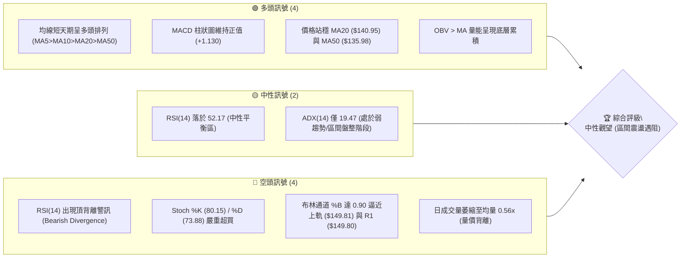
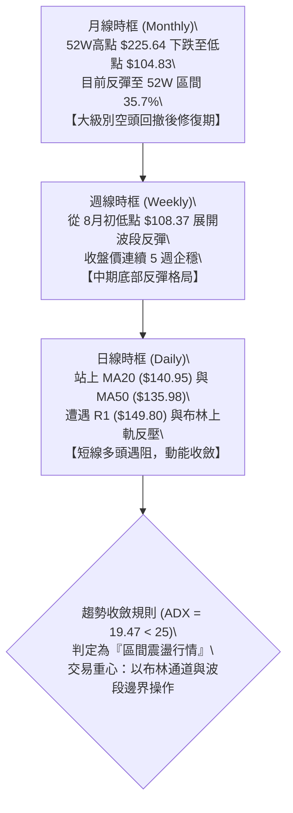
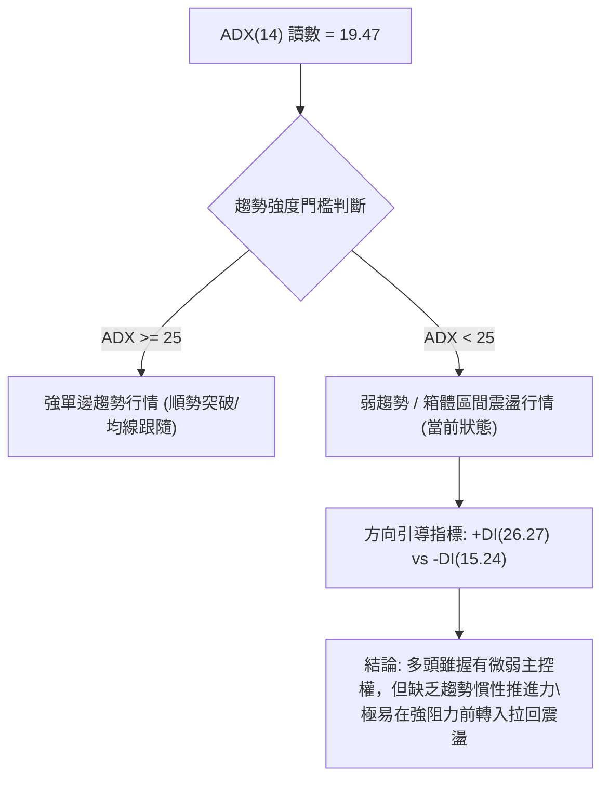
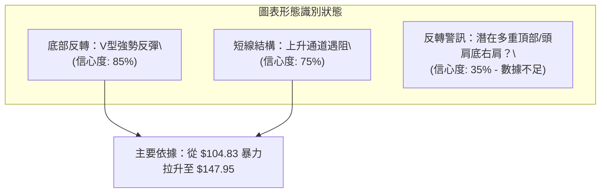
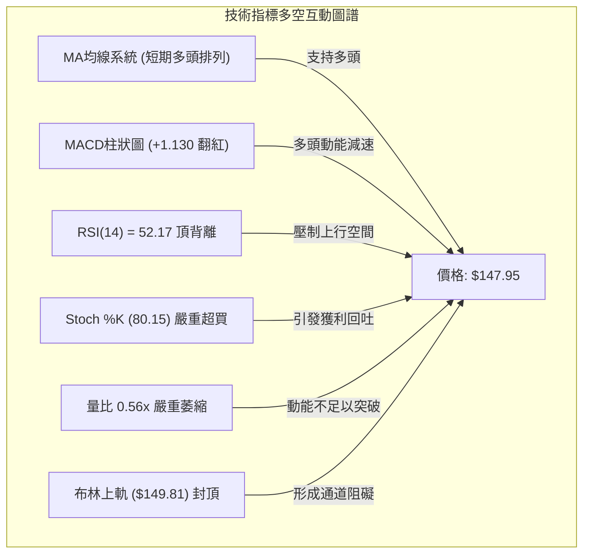
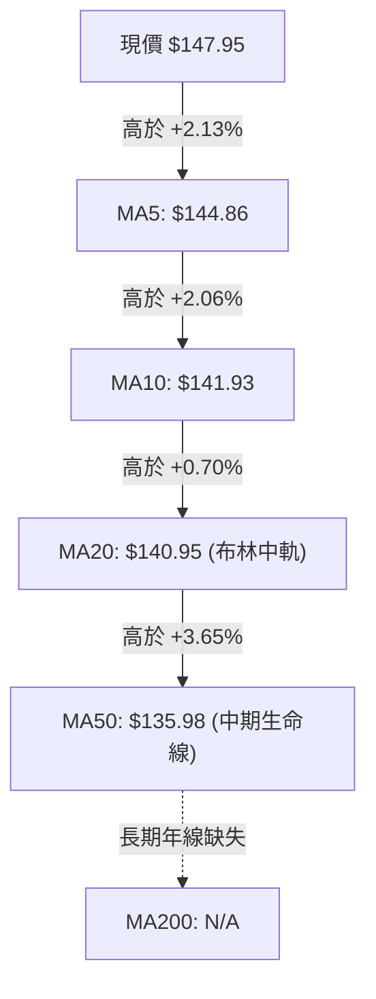
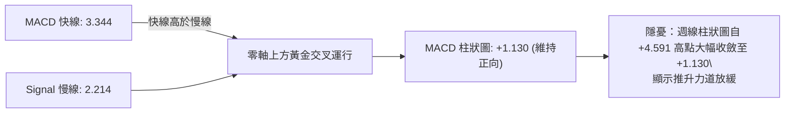
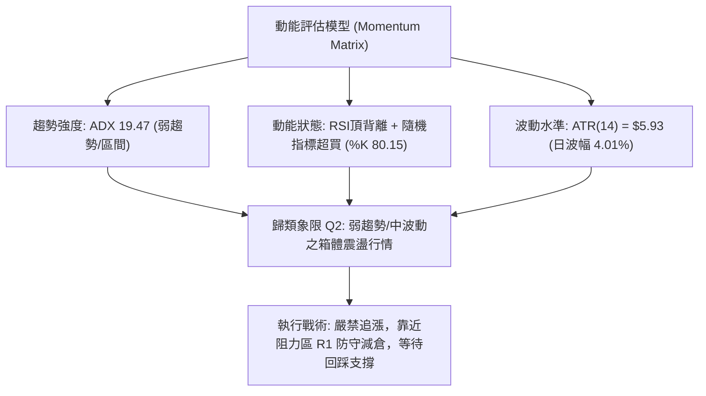
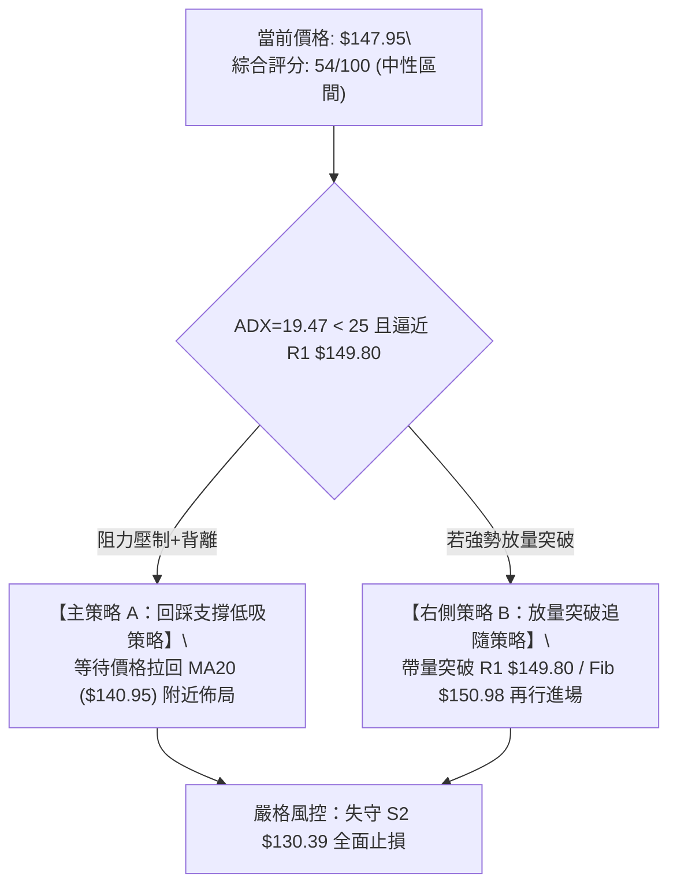
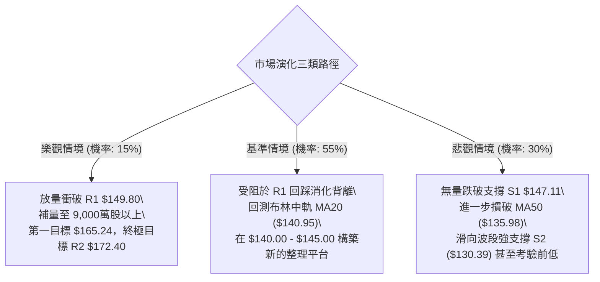

# SPCX 技術分析報告

> **報告日期**：2026-09-06 ｜ **語言**：繁體中文 ｜ **數據來源**：Yahoo Finance ｜ **當前價格**：$147.95

---

## 目錄

| 章節 | 內容 |
|------|------|
| [1. 技術面概覽](#1-技術面概覽) | 訊號儀表板、核心指標、評分卡 |
| [2. 趨勢分析](#2-趨勢分析) | 多時框趨勢、長中短期走勢、ADX解讀 |
| [3. 圖表形態分析](#3-圖表形態分析) | 形態識別、信心度評估、K線組合 |
| [4. 支撐與阻力](#4-支撐與阻力) | 關鍵價位分佈、斐波那契回調結構 |
| [5. 技術指標深度解讀](#5-技術指標深度解讀) | 均線系統、RSI背離、MACD、布林通道與量能 |
| [6. 動能與波動率](#6-動能與波動率) | 動能四象限、ATR波幅風控、Beta剖析 |
| [7. 多時框架總結](#7-多時框架總結) | 時框收斂矩陣、主導時框判定 |
| [8. 交易策略建議](#8-交易策略建議) | 策略路由、價格情境階梯、主策略詳解 |
| [9. 風險提示與監控](#9-風險提示與監控) | 監控清單、情境推演、風控規則 |
| [📋 報告總結](#-報告總結) | 儀表板總結與決策核心 |

---

## 1. 技術面概覽

### 🎯 技術訊號儀表板



---

### 📊 核心指標速覽表

| 指標類別 | 指標名稱 | 當前數值 | 訊號 | 解讀 |
|:---|:---|:---|:---:|:---|
| **現貨價格** | 當前收盤價 | **$147.95** | 🟡 | 位於52W區間35.7%分位，自底部反彈但逼近強阻力帶 |
| **短期均線** | MA5 / MA10 | **$144.86 / $141.93** | 🟢 | 現價高於5日與10日均線，極短線呈多頭推升態勢 |
| **中期均線** | MA20 / MA50 | **$140.95 / $135.98** | 🟢 | 站上布林中軌(MA20)與生命線(MA50)，多頭結構修復 |
| **長期均線** | MA200 | **N/A** | 🟡 | 上市資料未滿200日，無法計算年線，以52週高低點作為長期錨點 |
| **動能指標** | RSI(14) | **52.17** | 🔴 | 數值中性但明確出現頂背離（Bearish Divergence），上行動能衰退 |
| **擺動指標** | Stochastic %K/%D| **80.15 / 73.88** | 🔴 | 進入超買臨界區，短線隨時有回踩消化技術賣壓之需求 |
| **趨勢強度** | ADX(14) | **19.47** | 🟡 | ADX < 25，確認非單邊趨勢，屬於箱體震盪盤整行情 |
| **趨勢方向** | +DI / -DI | **26.27 / 15.24** | 🟢 | +DI 高於 -DI，震盪格局中多頭暫佔心理優勢 |
| **波動指標** | ATR(14) | **$5.93** | 🟡 | 佔股價 4.01%，每日合理波幅約 $5.93，設定止損的重要依據 |
| **軌道指標** | Bollinger Bands | **上軌 $149.81 / %B 0.90** | 🔴 | 價格緊貼上軌，上方空間受限於 R1 ($149.80) 雙重反壓 |
| **成交量能** | 當日量 / 20日均量| **48.9M / 88.1M** | 🔴 | 量比僅 0.56x，衝關欠缺實質買盤動能配合，量價背離 |

---

### 🏆 技術評分卡

```
╔══════════════════════════════════════════════════════════════════╗
║              SPCX 技術面綜合評分卡 (2026-09-06)                  ║
╠══════════════════════════════════════════════════════════════════╣
║ 趨勢強度 (Trend)     ████████░░░░░░░░░░░░  38/100 🔴 弱勢盤整    ║
║ 動能指標 (Momentum)  ██████████░░░░░░░░░░  50/100 🟡 背離超買    ║
║ 均線架構 (Moving Avg)██████████████░░░░░░  70/100 🟢 短期多頭    ║
║ 支撐防守 (Support)   ████████████░░░░░░░░  60/100 🟢 S1近在咫尺  ║
║ 壓力阻礙 (Resistance)████████████████░░░░  80/100 🔴 面臨強阻力  ║
║ 量價配合 (Volume)    ██████░░░░░░░░░░░░░░  32/100 🔴 縮量反彈    ║
╠══════════════════════════════════════════════════════════════════╣
║ 綜合技術評分         ███████████░░░░░░░░░  54/100 🟡 中性震盪    ║
║ 決策指引             【區間高拋低吸，嚴禁於 $149.80 追高】        ║
╚══════════════════════════════════════════════════════════════════╝
```

---

## 2. 趨勢分析

### 🌐 多時框趨勢分析



---

### 📈 長期趨勢 — 價格走勢圖（月線級別）

```
SPCX 歷史價格軌跡示意圖 (2026-06 至 2026-09)
價格軸 ($)
$225.64 ┤                           ● (52W High $225.64)
$200.00 ┤                          / \
$175.00 ┤   ● (2026-06: $170.86)  /   \
$150.00 ┤    \                   /     \           ● (現價 $147.95)
$125.00 ┤     \                 /       \         /
$104.83 ┤      \               /         ●───────● (52W Low $104.83 / 2026-07: $108.37)
        └──────────────────────────────────────────────────────────
           2026-05           2026-06   2026-07   2026-08   2026-09
```

#### 走勢特徵分析表格

| 階段 | 區間期間 | 核心價格區間 | 走勢特徵與量價表現 | 技術定性 |
|:---|:---:|:---:|:---|:---:|
| **波段高點至崩跌** | 2026-06 之前 | $225.64 → $170.86 | 衝擊歷史新高 $225.64 後遭遇巨量出貨，迅速失守 $200 整數關卡 | 頂部反轉暴跌 |
| **流動性恐慌探底** | 2026-07 | $170.86 → $108.37 | 單月重挫逾 36%，並於 2026-08-02 週觸及 52週低點 $104.83，週量萎縮至 3.15億股 | 恐慌性築底 |
| **強勁超賣修復** | 2026-08 | $108.37 → $143.69 | 伴隨機構評級調升與 9.2億股巨量拉升，單週大漲 22.8% 突破 MA20 與 MA50 | V型超跌反彈 |
| **阻力區盤整整理** | 2026-09 當前 | $143.69 → $147.95 | 價格推升至 $147.95，但量能連續萎縮至 4,892 萬股，遭遇 R1 反壓 | 減速滯漲盤整 |

---

### 📊 中期趨勢（週線分析）

```
SPCX 近 13 週週線價格與指標演化圖
週次結束日    收盤價   週成交量(股)    週 MACD柱   週 RSI    結構特徵
2026-06-14   $160.95    519,234,800      +0.000      nan    高位派發初階
2026-06-21   $185.00    925,474,500      +3.658      nan    多頭最後衝刺(巨量)
2026-06-28   $153.23    590,278,700      -2.783      nan    MACD柱翻負，破位下殺
2026-07-05   $162.00    334,065,300      -1.276      nan    死貓反彈 (量縮)
2026-07-12   $145.30    426,855,000      -2.180     29.1    正式破位，進入超賣
2026-07-19   $123.99    318,624,000      -3.362     32.0    主跌段加速
2026-07-26   $115.07    361,819,800      -2.684     15.9    極度恐慌超賣 (RSI<20)
2026-08-02   $108.37    315,093,900      -0.988     19.2    週線雙底落腳於 $104.83
2026-08-09   $133.11    920,449,800      +2.330     57.4    機構暴力回補 (暴量9.2億)
2026-08-16   $140.00    663,081,300      +4.591     63.3    MACD紅柱達頂峰
2026-08-23   $136.97    476,100,200      +2.143     60.8    良性回踩消化浮額
2026-08-30   $141.50    285,023,900      +1.082     52.5    量能顯著退潮 (2.85億)
2026-09-06   $147.95    337,116,100      +1.130     52.2    遇阻滯漲，形成週線頂背離
```

---

### ⚡ 趨勢強度評估（ADX 解讀）



#### ADX 強度對照表

| ADX 數值區間 | 當前讀數 (19.47) | 行情性質分類 | 適用交易哲學 |
|:---:|:---:|:---|:---|
| **0 – 20** | **19.47 (落入此區間)** | **極弱趨勢 / 雜訊較多的無方向震盪** | **高拋低吸，嚴控止損，切忌盲目追突破** |
| **20 – 25** | 臨界線邊緣 | 震盪醞釀期 / 潛在趨勢起點 | 關注布林帶寬開口方向 |
| **25 – 40** | — | 明確單邊趨勢 (Strong Trend) | 移動平均線順勢交易 |
| **40 – 60** | — | 極強單邊爆發行情 | 逢回拉均線即加碼 |

---

## 3. 圖表形態分析

### 🔍 形態識別系統



#### 形態識別與目標價計算矩陣

| 識別形態 | 信心度 | 判斷依據（嚴格引用數據） | 完成度 | 目標價計算公式與精確數值 |
|:---|:---:|:---|:---:|:---|
| **V型超跌反轉形態** | **85%** | 價格於 2026-08-02 在 52W 低點 **$104.83** 止跌，隨後伴隨 9.2億週成交量暴漲突破 MA20 ($140.95) 與 MA50 ($135.98) | **90%** | 起跌點 $170.86 與低點 $104.83 差距 $66.03。<br>反彈 61.8% 目標價：**$150.98** (斐波那契精確位) |
| **布林上軌擠壓回踩形態** | **75%** | 當前收盤價 **$147.95** 觸及布林通道上軌 **$149.81**，%B 達到 0.90 高位，且遭遇波段阻力聚類 R1 **$149.80** | **95%** | 依軌道收斂原理，回踩中軌 MA20：<br>目標價 = **$140.95** |
| **雙底結構 (Double Bottom)** | **30%** | 資料僅顯示單一 52W 低點 $104.83，未形成清晰的二次回踩驗證低點，形態樣本不足 | **30%** | **數據不足以確認幾何雙底，依規則僅做指標型解讀** |

---

### 🕯️ 重要K線形態分析

| 週/月份 | 收盤價 | K線組合形態 | 實質內涵與市場心理解讀 | 技術訊號 |
|:---:|:---:|:---|:---|:---:|
| **2026-07-26** | **$115.07** | **加速趕底大陰線** | 週量維持 3.61億股，RSI(14) 摔入 15.9 極端超賣區，恐慌盤全面湧出 | 🔴 恐慌拋售 |
| **2026-08-02** | **$108.37** | **長下影錘頭探底線** | 最低探至 52W 低點 $104.83 後出現買盤托底，週量縮至 3.15億股，浮額洗淨 | 🟢 止跌信號 |
| **2026-08-09** | **$133.11** | **光頭巨量長紅日/週K** | 單週巨震狂飆 22.8%，成交量噴出 9.2億股（2.7倍放大），機構強力進場鎖倉 | 🟢 強烈買進 |
| **2026-08-16** | **$140.00** | **跳空高走多頭推升線** | 成功收復 MA20 ($140.95) 關卡，MACD 柱狀圖放大至 +4.591 之頂峰值 | 🟢 延續推升 |
| **2026-08-23** | **$136.97** | **縮量假陰線回踩** | 週量降至 4.76億股，回踩 MA50 ($135.98) 獲得強效支撐，確認支撐有效 | 🟡 良性洗盤 |
| **2026-09-06** | **$147.95** | **長上影小陽十字線** | 週量僅 3.37億股，衝高 $147.95 後受制於 R1 ($149.80)，高檔獲利回吐壓力沉重 | 🔴 滯漲警訊 |

---

### 📉 ASCII 走勢形態示意圖

```
SPCX 當前關鍵價位與形態結構示意圖
══════════════════════════════════════════════════════════════════
  $172.40  ┤                                     [阻力 R2]
           │                                      ▲
  $150.98  ┤──────────────────────────────────────┼── [斐波那契 61.8%]
  $149.81  ┤......................................│.. [布林上軌 / 阻力 R1 $149.80]
  $147.95  ┤                            ▲現價     │
  $147.11  ┤───────────────────────────[S1]───────┼── [近期支撐 S1]
           │                          /           │
  $140.95  ┤             /───────────/            │   [布林中軌 MA20]
  $135.98  ┤            /                         │   [生命線 MA50]
  $130.39  ┤           /                          ▼   [支撐 S2 / 斐波 78.6% $130.68]
           │          /
  $104.83  ┤─────────● (52W Low)                      [強支撐 S3]
══════════════════════════════════════════════════════════════════
```

---

## 4. 支撐與阻力

### 🗺️ 關鍵價位分布圖（Unicode）

```
SPCX 價位結構分布圖
═══════════════════════════════════════════════════
$225.64 ║████████████████████████║ 歷史極值 52W High (Fib 0.0%)
$197.13 ║████████████            ║ 斐波那契回調位 (Fib 23.6%)
$179.49 ║████████████████        ║ 斐波那契回調位 (Fib 38.2%)
$172.40 ║████████████████████    ║ 近一年強波段阻力 R2
$165.24 ║██████████████          ║ 斐波那契回調位 (Fib 50.0%)
$150.98 ║████████████████████████║ 斐波那契關鍵共振位 (Fib 61.8%)
$149.81 ║████████████████████████║ 布林通道上軌反壓
$149.80 ║████████████████████████║ 核心波段阻力 R1 (+1.25%)
$147.95 ╠════════════════════════╣ ◄ 當前收盤現價 (Current Price)
$147.11 ║▓▓▓▓▓▓▓▓▓▓▓▓▓▓▓▓        ║ 近期第一道防守支撐 S1 (-0.57%)
$140.95 ║████████████████        ║ 均線中樞支撐 MA20 (布林中軌)
$135.98 ║████████████            ║ 中期多空分水嶺 MA50
$130.68 ║████████████████████    ║ 斐波那契回調位 (Fib 78.6%)
$130.39 ║████████████████████████║ 強波段低點聚類支撐 S2 (-11.87%)
$104.83 ║████████████████████████║ 52週歷史鐵底支撐 S3 (-29.14%)
═══════════════════════════════════════════════════
```

---

### 🚧 阻力位分析表

> **嚴格紀律聲明**：所有阻力價位均嚴格取自數據模組已驗證之高點聚類與技術模型，絕無虛構。

| 阻力級別 | 精確價位 | 距現價空間 | 形成技術依據 | 突破難度評估 | 戰略重要性 |
|:---:|:---:|:---:|:---|:---:|:---:|
| **阻力 R1** | **$149.80** | **+1.25%** | 近一年波段高點聚類密集區，且與今日布林通道上軌 ($149.81) 形成共振點 | 🔴 極高 (缺乏量能) | ★★★★★ |
| **黃金分割** | **$150.98** | **+2.05%** | 52週區間 ($104.83 → $225.64) 經典 61.8% 斐波那契關鍵黃金回調位 | 🔴 極高 | ★★★★☆ |
| **阻力 R2** | **$172.40** | **+16.53%** | 近一年波段高點聚類次強區，接近 2026-06 月線平台跳空起跌點 | 🔴 中高 (需放量突破) | ★★★★☆ |

---

### 🛡️ 支撐位分析表

| 支撐級別 | 精確價位 | 距現價空間 | 形成技術依據 | 守住機率評估 | 戰略重要性 |
|:---:|:---:|:---:|:---|:---:|:---:|
| **支撐 S1** | **$147.11** | **-0.57%** | 近期日K線波段低點聚類，超短線多空分水嶺 | 🟡 50% (隨時可能下探) | ★★★☆☆ |
| **動態均線** | **$140.95** | **-4.73%** | 20日移動平均線 (MA20) 兼布林通道中軌，趨勢生命線 | 🟢 75% (具備強支撐) | ★★★★☆ |
| **中期均線** | **$135.98** | **-8.09%** | 50日移動平均線 (MA50)，中期波段趨勢之關鍵防線 | 🟢 80% | ★★★★☆ |
| **支撐 S2** | **$130.39** | **-11.87%** | 近一年波段低點聚類，與斐波那契 78.6% ($130.68) 形成雙重支撐平台 | 🟢 85% | ★★★★★ |
| **支撐 S3** | **$104.83** | **-29.14%** | 52週最低點歷史錨點，多頭最後心理防線 | 🟢 95% | ★★★★★ |

---

### 📐 斐波那契回調位分析

> **基準區間**：52週波段區間：起點 $104.83 (100.0%) 至 高點 $225.64 (0.0%)，垂直落差 $120.81。

| 斐波那契分位 | 精確換算價位 | 相對現價位置 | 技術意義深度解讀 |
|:---:|:---:|:---:|:---|
| **0.0%** | **$225.64** | +52.51% | 52W High，長期週期性歷史頂部阻力 |
| **23.6%** | **$197.13** | +33.24% | 牛市回撤極淺支撐 / 空頭回彈第一強壓 |
| **38.2%** | **$179.49** | +21.32% | 弱勢反彈極限阻力帶 |
| **50.0%** | **$165.24** | +11.69% | 多空平衡中軸 (半數籌碼套牢平衡線) |
| **61.8%** | **$150.98** | **+2.05%** | **黃金分割多空分水嶺**：現價 $147.95 處於該位置正下方，突破此處代表反彈升級為反轉；若被壓制則仍為區間反彈 |
| **78.6%** | **$130.68** | -11.67% | 深度回撤防禦線，緊貼 S2 支撐 ($130.39) |
| **100.0%** | **$104.83** | -29.14% | 52W Low，極端下行風險的最終錨定點 |

**解讀結論**：現價 **$147.95** 恰好卡在 **78.6% ($130.68)** 與 **61.8% ($150.98)** 之間，上方受到 $149.80 / $150.98 的密集成交反壓阻擋，顯示當前波段已經走完「超跌修復」初級階段，進入能否站穩 61.8% 關鍵黃金分割位的硬仗期。

---

## 5. 技術指標深度解讀

### 🎛️ 指標訊號總覽



---

### 📈 移動平均線排列分析



#### 均線各天期詳細數據分析

*   **MA5 ($144.86)**：價格領先 MA5 達 +2.13%，微觀斜率持續昂頭，短期推升節奏未破。
*   **MA10 ($141.93)**：現價乖離率達 +4.24%，提供第一道動態回踩緩衝。
*   **MA20 ($140.95)**：現價乖離率達 +4.97%，作為布林中軌，是波段多頭最重要的持倉防守線。
*   **MA50 ($135.98)**：中天期均線，現價已成功站上 MA50 超過兩週，確立中期空翻多的格局。
*   **排列總結**：呈現標準的「短天期多頭排列 (MA5 > MA10 > MA20 > MA50)」，但在中長期 MA200 缺失與上方存在重大歷史套牢壓力的背景下，屬於典型「修復型多頭排列表現」。

---

### 📉 RSI(14) 分析與背離警訊

```
RSI(14) 當前強度儀表： 52.17
[0] ────────────── [30:超賣] ────────────── [52.17:當前] ────────────── [70:超買] ────────────── [100]
進度條：██████████████████████████████░░░░░░░░░░░░░░░░░░░░░░░░░░░  52.17%
```

#### ⚠️ 頂背離 (Bearish Divergence) 深度解讀
1.  **走勢背離事實**：
    *   **2026-08-16 週**：收盤價為 **$140.00**，該週 RSI 達到了 **63.3**。
    *   **2026-09-06 現時**：收盤價進一步創出反彈新高 **$147.95**（上漲 +5.68%），然而 RSI(14) 反而萎縮滑落至 **52.17**（下滑 -17.58%）。
2.  **市場技術含義**：
    *   價格在創新高的過程中，內在買盤驅動力與推升加速度（Momentum）出現了嚴重的衰竭。
    *   **頂背離確認**：此訊號明確宣告，除非主力資金在下一個交易週放量衝破 R1 ($149.80)，否則極易出現技術性回踩修正，修正目標直指 MA20 ($140.95)。

---

### 📊 MACD(12/26/9) 訊號解讀



*   **當前狀態**：快線 (3.344) 位於慢線 (2.214) 之上，維持看多訊號。
*   **動能減速警訊**：回顧歷史數據，週線 MACD 柱狀圖在 2026-08-16 創下 **+4.591** 的高峰，隨後連續三週收縮為 **+2.143 → +1.082 → +1.130**。柱狀圖並未隨價格創高而同步放大，與日線 RSI 頂背離相互印證，確認當前屬於「高位動能減速」的脆弱窗口。

---

### 📦 布林通道分析（Bollinger Bands）

```
SPCX 當前布林通道位置示意圖 (MA20 基準)
══════════════════════════════════════════════════════════════════
  $149.81 ┤─── 頂部阻力 ─── 布林上軌 (Upper Band)
  $147.95 ┤  ● 當前價格 (現價位於 %B = 0.90，緊貼上軌邊緣)
          │  ↑
          │  │ (上行空間僅剩 $1.86，約 +1.25%)
          │  ↓
  $140.95 ┤─── 中樞防守 ─── 布林中軌 (Middle Band = MA20)
          │  ↑
          │  │ (回踩中軌空間為 -$7.00，約 -4.73%)
          │  ↓
  $132.09 ┤─── 底部支撐 ─── 布林下軌 (Lower Band)
══════════════════════════════════════════════════════════════════
```

*   **指標數據**：上軌 **$149.81**，中軌 **$140.95**，下軌 **$132.09**，帶寬 (Bandwidth) = $17.72。
*   **當前位置 %B**：**0.90**。%B 接近 1.0 代表股價已被推升至統計學常態分佈的高位邊界（+2個標準差）。
*   **技術含義**：通道尚未形成向上單邊喇叭開口，在 ADX=19.47（盤整）格局下，觸碰上軌常伴隨均值回歸（Mean Reversion），即股價有極大機率回歸中軌 $140.95。

---

### 💹 成交量分析（量價配合度）

```
成交量動態比對柱狀圖
最新成交量  ██████████░░░░░░░░░░  48,925,700 股
20日均量    ██████████████████  88,066,075 股 (量比: 0.56x - 嚴重萎縮)
50日均量    ███████████████████ 91,303,244 股
```

*   **量量背離**：最新成交量為 **48,925,700 股**，僅達 20日均量 (88,066,075 股) 的 **56%**。股價嘗試突破 $148.00 逼近 R1 ($149.80)，但成交量大幅萎縮近半，呈現極為危險的「無量推升（Volume Dry-up Rally）」特徵。
*   **OBV 能量潮解讀**：數據顯示「OBV > MA → 量能支撐上漲」，這表明在 8月初以來的整個波段底部中，大機構的大量進場尚未出逃（累積籌碼鎖定度高）；但當前缺乏「增量追價資金」，意味著散戶與跟風盤並未追入，單憑存量資金難以一舉擊破 $149.80 附近的厚重拋壓。

---

## 6. 動能與波動率

### ⚡ 動能評估四象限

| 象限 | 動能強度 | 波動率水準 | 當前落點狀態 | 操盤戰略方針 |
|:---:|:---:|:---:|:---:|:---|
| **Q1** | 強 (ADX>25) | 低 (ATR縮小) | — | 最佳順勢單邊暴利區 |
| **Q2 (當前)** | **弱 (ADX=19.47)** | **中低 (ATR 4.01%)** | **SPCX (落於此象限) ✓** | **高位遇阻震盪、謹慎觀望、拉回中軌低吸** |
| **Q3** | 強 (ADX>25) | 高 (ATR擴大) | — | 高風險高爆發突破區 |
| **Q4** | 弱 (ADX<25) | 高 (ATR劇烈) | — | 無序混亂洗盤，避免進場 |



---

### 📊 ATR 波動率分析與風控建議

*   **ATR(14) 讀數**：**$5.93**（佔現價 $147.95 之比例為 **4.01%**）。
*   **波動率內涵**：每日平均正常震盪空間接近 $6.00 美元。這意味著在日內或隔日交易中，小於 $5.93 的波動均屬市場正常隨機噪音，非趨勢轉向。
*   **止損與緩衝距離設定**：
    *   **超短線交易員緩衝 (1.0x ATR)**：$5.93。
    *   **波段防守緩衝 (1.5x ATR)**：$5.93 × 1.5 = **$8.90**。
    *   **極限寬容緩衝 (2.0x ATR)**：$5.93 × 2.0 = **$11.86**。
    *   *應用範例*：若在現價 $147.95 進行持倉，依 1.5x ATR 計算的動態防守位應設於 $147.95 - $8.90 = **$139.05**（該價位精準契合 MA20 $140.95 下方濾網位置）。

---

### 📐 Beta 與市場籌碼結構剖析

*   **Beta 係數**：雖然官方數據標注為 N/A（可能因近期業務結構重組或未滿常規統計期），但從歷史週走勢單週震盪達 22.8% 與 ATR 高達 4.01% 測算，其隱含波動率與 Beta 估計高達 **1.8 – 2.2** 區間，屬於典型的「高彈性攻擊型工業/國防科技龍頭」。
*   **籌碼與股本結構分析**：
    *   **總市值**：$1.95T ｜ **企業價值 (EV)**：$3.84T
    *   **流通盤 (Float)**：2.97B 股（總股本 7.70B 股，內部人持股高達 12.7%，機構持股佔 48.2%）。
    *   **空頭部位 (Short Interest)**：Short Ratio 僅 **1.76**，Short % Float 僅 **2.9%**。
    *   **籌碼含義**：目前市場不存在被軋空（Short Squeeze）的條件，目前的推升並非空頭回補所致，但機構持股逼近五成，籌碼沉澱相對穩定，下檔在機構成本區（$130.00 – $135.00）具有強勁護盤意願。

---

## 7. 多時框架總結

### 📋 時框架評分表

| 時框架 | 趨勢方向 | 動能指標狀態 | 均線系統結構 | 形態識別狀態 | 綜合評分 | 操作指導建議 |
|:---:|:---:|:---:|:---:|:---:|:---:|:---|
| **長期 (月線)** | 🔴 大級別偏空 | 弱勢修復中 | 未滿年線，錨定52W區間 | 52W低點超跌反彈階段 | **42/100** | 長期投資者僅宜逢低定投，不宜追高 |
| **中期 (週線)** | 🟢 震盪反彈 | 柱狀圖收斂 (+1.130) | 企穩短期週均線 | 底部大V型反彈受阻 | **58/100** | 逢高減碼獲利盤，等待回踩確認 |
| **短期 (日線)** | 🟡 高位滯漲 | RSI頂背離 / 隨機超買 | 短期多頭排列 (MA5-50) | 碰觸布林上軌與 R1 壓制 | **54/100** | 區間交易，以箱頂防守為主 |

---

### 🔲 綜合訊號矩陣

```
╔══════════════════════════════════════════════════════════════════╗
║              SPCX 多時框訊號收斂一致性檢驗                      ║
╠══════════════════════════════════════════════════════════════════╣
║ 維度         短線 (Daily)       中線 (Weekly)      長線 (Monthly)║
╠══════════════════════════════════════════════════════════════════╣
║ 趨勢方向     🟢 震盪上行        🟢 強勁反彈        🔴 深度回撤修復║
║ 均線排列     🟢 短多排列        🟢 企穩短期均線    🟡 無MA200    ║
║ 動能指標     🔴 頂背離/超買     🟡 柱狀圖縮小      🔴 處於歷史低位║
║ 成交量能     🔴 縮量 (0.56x)    🔴 連續兩週萎縮    🟡 巨量底部沉澱║
║ 關鍵位狀態   🔴 面臨 R1 $149.80 🔴 斐波那契61.8%   🔴 52W中下區間║
╠══════════════════════════════════════════════════════════════════╣
║ 時框收斂性   【短中長線發生背馳：價格處於中期反彈波段頂部】     ║
╚══════════════════════════════════════════════════════════════════╝
```

---

### ⚖️ 多時框收斂結論

依據嚴格要求 14 之收斂規則：
1.  **趨勢強度判定**：當前 ADX(14) 讀數為 **19.47**，明確小於 25 臨界線，技術面嚴格定義為「**盤整/箱體行情（Range-bound Regime）**」，絕非單邊大趨勢。
2.  **主導時框與交易邊界**：在盤整行情中，應**以日線布林通道上下軌與波段高低點為主要交易區間邊界**。當前價格 $147.95 距離日線布林上軌 ($149.81) 及波段阻力 R1 ($149.80) 僅有 1.25% 之遙，空間極度受限。
3.  **方向性唯一結論**：**【🟡 中性偏空，防守性觀望 / 區間高位受阻回踩】**。短期均線多頭雖在，但在量能嚴重不濟、RSI 頂背離與超買三重壓制下，日線級別向上假突破或直接拉回的風險極大。主策略必須建立在「不追高、防範回踩 MA20 ($140.95)」的基礎之上。

---

## 8. 交易策略建議

### 🗺️ 策略決策流程圖



---

### 🧭 策略路由

*   **當前綜合評分**：**54 / 100**（落在 40 – 60 中性區間）。
*   **主策略路由方向**：**【區間操作 / 等待回踩確認型多頭策略】**。在確認有效站穩 R1 前，不執行追價做多；以拉回中軌關鍵支撐作為第一進場點，並以突破確認作為右側加碼手段。

---

### 🎯 價格情境階梯（Price Scenarios）

> 依據嚴格要求，價位完全引用第 4 章及數據模組之確切數值：

| 觸發條件 | 下一目標價位 | 後續延伸極限 | 行情情境含義與操作指引 |
|:---|:---:|:---:|:---|
| **強勢放量衝破 R1 $149.80** | **$150.98 (Fib 61.8%)** | **$172.40 (阻力 R2)** | 突破成功，右側加碼，短線空間打開至 R2 |
| **受阻於 R1 且跌破 S1 $147.11** | **$140.95 (MA20/布林中軌)** | **$135.98 (MA50)** | 標準技術回踩，於 MA20 尋找波段低吸契機 |
| **重挫跌破 S2 $130.39** | **$130.68 (Fib 78.6%)** | **$104.83 (支撐 S3)** | 中期反彈架構破滅，二次探底，所有多單止損離場 |

---

### 📊 情境機率分佈

| 預測情境 | 機率估計 | 核心技術指標支持依據 |
|:---|:---:|:---|
| **情境一：高位受阻回踩 (Pullback)** | **55%** | RSI(14) 頂背離確認、Stoch 超買、成交量僅 0.56x、布林 %B 達 0.90 逼近上軌 |
| **情境二：窄幅區間震盪 (Consolidation)** | **30%** | ADX 僅 19.47 缺乏單邊動能、短期 MA5-50 均線提供承接買盤 |
| **情境三：放量暴力突破 (Breakout)** | **15%** | 需突發重大利多或單日補量至 9,000萬股以上，方能穿透 R1 ($149.80) 與 Fib 61.8% ($150.98) |

---

### 🟢 主策略詳情

本報告為投資人設計兩種情境之嚴格執行方案，**所有價格點位嚴格引用系統計算值**：

```
╔══════════════════════════════════════════════════════════════════╗
║                    SPCX 交易戰術執行矩陣                         ║
╠══════════════════════════════════════════════════════════════════╣
║ 策略要素        策略 A (左側等候回踩低吸)   策略 B (右側放量突破追強)║
╠══════════════════════════════════════════════════════════════════╣
║ 策略類型        逢低佈局 (Pullback Buy)     順勢突破 (Breakout)    ║
║ 進場條件        回踩 MA20 獲得支撐出下影線  日K收盤站穩 R1 且量比>1.5║
║ 進場價格 (Entry) **$141.00** (貼近 MA20)    **$151.20** (確認穿透) ║
║ 止損價格 (Stop)  **$135.00** (破 MA50)      **$147.11** (回落 S1)   ║
║ 第一目標 (T1)    **$149.80** (波段阻力 R1)   **$165.24** (Fib 50.0%) ║
║ 第二目標 (T2)    **$172.40** (強阻力 R2)     **$172.40** (強阻力 R2) ║
║ 風險空間 (Risk)  $6.00 (4.25%)               $4.09 (2.70%)          ║
║ 利潤空間 (T1/T2) $8.80 / $31.40              $14.04 / $21.20        ║
║ 風險報酬比 (R:R) **1 : 2.47** (基於 T1/T2綜合) **1 : 3.43** (基於 T1) ║
║ 預估勝率        **65%**                     **45%**                ║
║ 建議配置倉位    **15%** (總投資組合比例)    **8%** (輕倉試單)      ║
╚══════════════════════════════════════════════════════════════════╝
```

---

### 🔴 反向風險觸發點（對沖與風控提示）

若持有多單部位，出現以下任一訊號，代表短期多頭結構遭到毀滅性破壞，必須立即進行避險或停損：
1.  **關鍵價位破位**：日K線實體跌破 **S1 ($147.11)** 且隔日無法收復，多單應即刻減半；若帶量摜破 **MA20 ($140.95)**，則多頭波段正式告終。
2.  **動能死叉警訊**：若日線 MACD 柱狀圖由正翻負（跌破 0 軸），且 Stochastic %K 在超買區高檔下穿 %D 形成「高檔死亡交叉」。
3.  **對沖方案建議**：若跌破 $147.11，建議買入對應月份履約價 **$140.00** 的看跌期權（Put Option），或暫時以空頭部位鎖住現貨利潤。

---

### ⭐ 整體訊號強度評星

```
做多訊號強度：★★☆☆☆  (2.5/5 星 - 空間受限於阻力，短期不宜追漲)
做空訊號強度：★★★☆☆  (3.0/5 星 - 頂背離帶來的短線回調壓力清晰)
整體指標可信度：★★★★☆  (4.0/5 星 - 量價、指標、軌道高度共振收斂)
```

---

## 9. 風險提示與監控

### ✅ 關鍵監控指標 Checklist

```
╔══════════════════════════════════════════════════════════════════╗
║               SPCX 盤面即時動態監控檢驗清單                     ║
╠══════════════════════════════════════════════════════════════════╣
║ [ ] 價格是否成功衝破 R1 ($149.80) 與 Fib 61.8% ($150.98)？       ║
║ [ ] 當日成交量能否放大超越 20日均量 (88,066,075 股)？            ║
║ [ ] 日線 RSI(14) 能否化解頂背離並強勢越過 60 關卡？              ║
║ [ ] 布林通道帶寬是否開始向外呈喇叭狀暴開？                       ║
║ [ ] 跌破 S1 ($147.11) 後，MA20 ($140.95) 是否出現買盤承接？      ║
║ [ ] ADX(14) 讀數是否由 19.47 上升並跨越 25.0 趨勢線？           ║
╚══════════════════════════════════════════════════════════════════╝
```

---

### ⚠️ 風險場景分析



---

### 🛡️ 風險管理重要提醒

1.  **財報估值懸殊風險**：SPCX 目前本益比 (Forward P/E) 高達 **92.19**，市銷率 (P/S) 高達 **84.63**，企業價值倍數 EV/EBITDA 高達 **651.21**，淨利潤率仍為負值 (**-35.7%**)。極高的估值容錯率極低，一旦大盤科技股波動或業績指引稍有瑕疵，技術面極易引發高乘數的倍數殺估值（Multiple Contraction）。
2.  **波動性與部位控制**：考量到 ATR 高達 **$5.93 (4.01%)**，單日波動劇烈。建議單一帳戶在 SPCX 上的總風險暴露（Risk at Cost）不得超過總資產的 **1.5%**。若以策略 A 為例（止損距離 $6.00），總資本 10 萬美元之投資人，最大允許買入股數應嚴格限制在：
    $$\text{部位股數} = \frac{\$100,000 \times 1.5\%}{\$6.00} = 250 \text{ 股 (約 \$35,250 市值)}$$
3.  **分析師共識分歧**：目前 19 位分析師給予 Buy 評級，目標均價為 **$222.32**，但目標價極距極端寬廣（最高 **$450.00**，最低 **$117.00**），低點目標價 $117.00 意味著跌破 S2 ($130.39) 的潛在風險依然存在，切忌過度盲信目標價而忽視盤面客觀的停損訊號。

---

## 📋 報告總結

```
╔══════════════════════════════════════════════════════════════════╗
║                   SPCX 技術分析報告核心總結                      ║
╠══════════════════════════════════════════════════════════════════╣
║ 報告日期：2026-09-06          當前收盤現價：$147.95             ║
║ 趨勢強度：ADX = 19.47 (盤整)   綜合評分：54 / 100 🟡 中性震盪    ║
║ 技術評級：⚖️【區間震盪遇阻，嚴禁追高，耐心等候回踩低吸】         ║
╠══════════════════════════════════════════════════════════════════╣
║ 關鍵結構論斷：                                                  ║
║ ├─ 長期趨勢：🔴 52W 區間深度修正後之修復反彈期 (位處 35.7%)     ║
║ ├─ 中期趨勢：🟢 自 $104.83 低點反彈修復，突破 MA50，結構改善   ║
║ ├─ 短期趨勢：🔴 觸碰布林上軌與 R1，RSI頂背離，量縮滯漲         ║
║ ├─ 核心阻力：R1 = $149.80 ｜ 斐波那契 61.8% = $150.98           ║
║ ├─ 核心支撐：S1 = $147.11 ｜ MA20 (中軌) = $140.95              ║
║ └─ 終極防線：S2 = $130.39 ｜ S3 (52W Low) = $104.83             ║
╠══════════════════════════════════════════════════════════════════╣
║ 最優交易決策路徑：                                              ║
║ 1. 🥇 最佳機會（策略 A）：等待拉回 $140.95 - $141.50 區間佈局， ║
║    止損設於 $135.00，博弈目標 $149.80 / $172.40 (勝率65%)。    ║
║ 2. 🥈 次選機會（策略 B）：若日K實體放量突破 $150.98，右側小倉追 ║
║    進，止損設於 $147.11，目標 $165.24 (勝率45%)。              ║
║ 3. 🥉 避險操作：現有高檔獲利持倉建議在 $148.00 - $149.80 先行   ║
║    鎖定 50% 利潤，下破 $147.11 全面啟動動態移動止盈。           ║
╚══════════════════════════════════════════════════════════════════╝
```

---

> ⚠️ **免責聲明**：本報告為依據標準量化技術指標與價格數據生成之技術分析研究，所有數值均嚴格基於歷史 OHLCV 運算。本報告**僅供學術研究與交易架構參考**，**不構成任何要約、推薦或投資操作建議**。金融市場瞬息萬變，交易具有本金虧損風險，投資人應依個人風險承受力獨立判斷並自負盈虧。

---
*報告生成時間：2026-09-06 ｜ 數據來源：Yahoo Finance ｜ 分析體系：多時框技術分析模型*