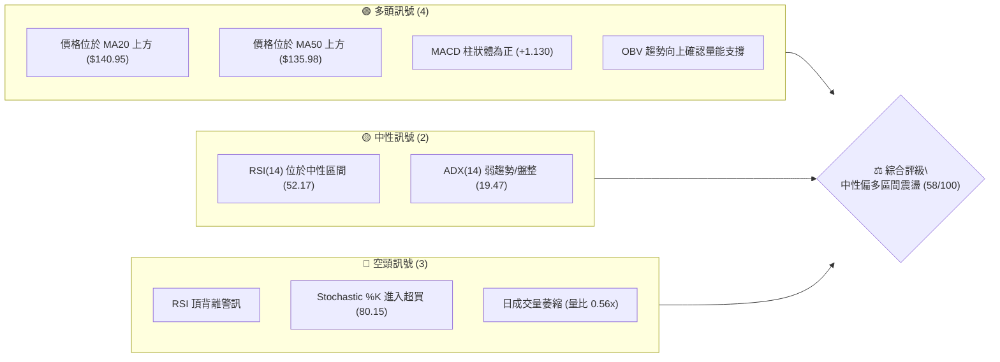
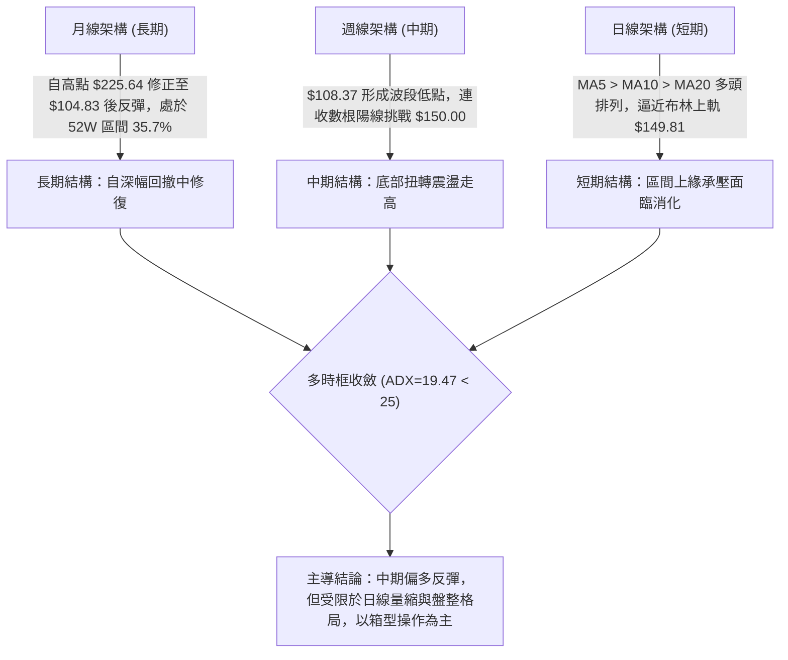
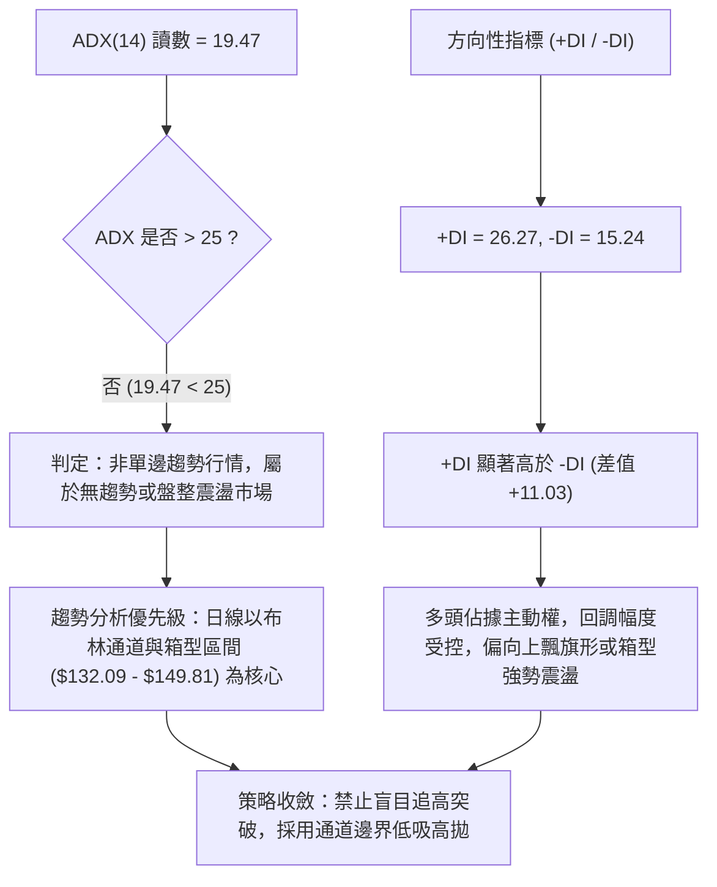
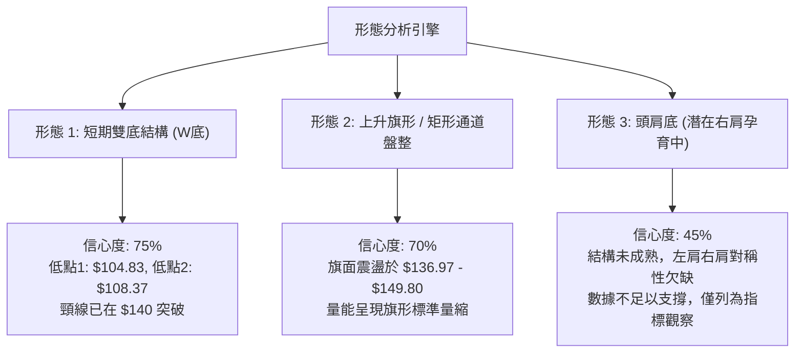
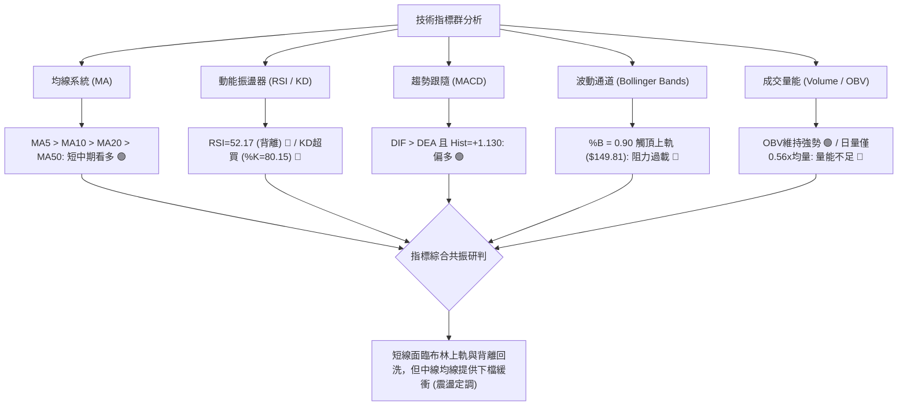
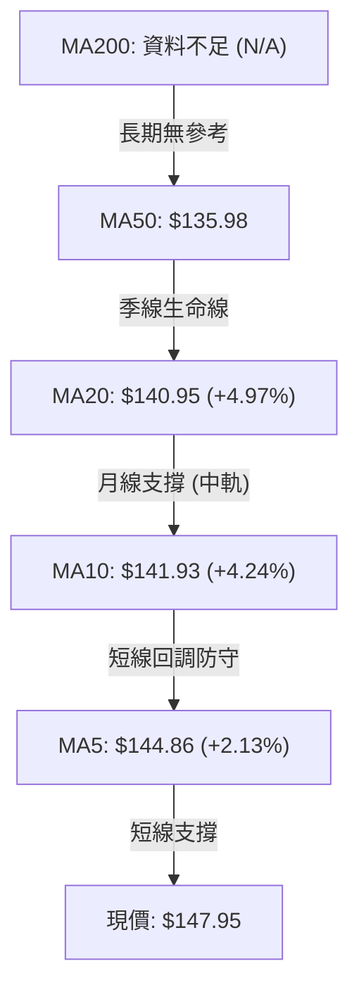
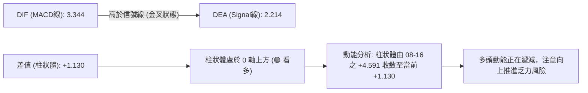
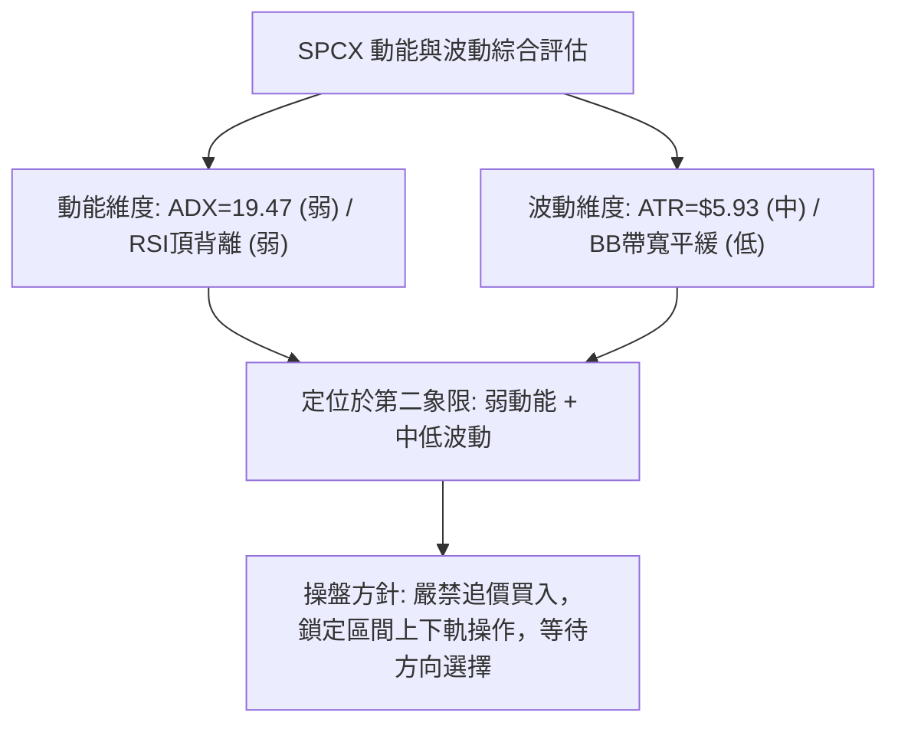
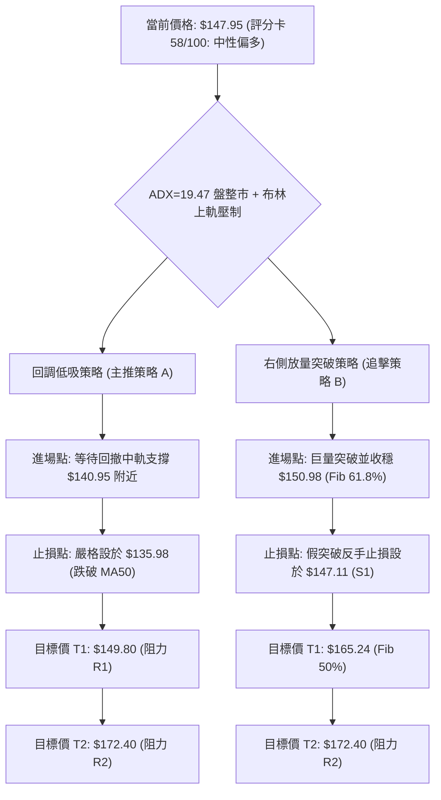
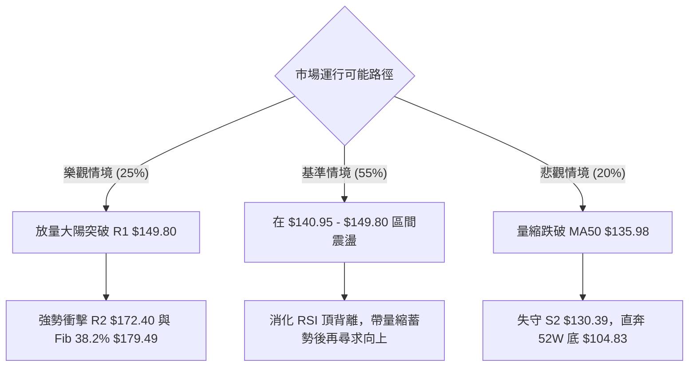

# SPCX 技術分析報告

> **報告日期**：2026-09-08 ｜ **語言**：繁體中文 ｜ **數據來源**：Yahoo Finance ｜ **當前價格**：$147.95

---

## 目錄

| 章節 | 內容 |
|------|------|
| [1. 技術面概覽](#1-技術面概覽) | 訊號儀表板、核心指標、評分卡 |
| [2. 趨勢分析](#2-趨勢分析) | 多時框趨勢、長中短期走勢 |
| [3. 圖表形態分析](#3-圖表形態分析) | 形態識別、K線組合、目標價 |
| [4. 支撐與阻力](#4-支撐與阻力) | 關鍵價位、斐波那契回調 |
| [5. 技術指標深度解讀](#5-技術指標深度解讀) | MA/RSI/MACD/布林/成交量 |
| [6. 動能與波動率](#6-動能與波動率) | 動能評估、ATR、Beta |
| [7. 多時框架總結](#7-多時框架總結) | 時框架評分矩陣 |
| [8. 交易策略建議](#8-交易策略建議) | 多空策略、風險報酬比 |
| [9. 風險提示與監控](#9-風險提示與監控) | 監控指標、風險場景 |
| [10. 報告總結](#-報告總結) | 關鍵結論、策略決策矩陣 |

---

## 1. 技術面概覽

### 🎯 技術訊號儀表板



### 📊 核心指標速覽表

| 指標類別 | 指標名稱 | 當前數值 | 訊號 | 解讀 |
|:---|:---|:---|:---:|:---|
| **價格** | 當前收盤價 | $147.95 | 🟡 | 位於52週區間35.7%分位，自底部$104.83反彈回升 |
| **均線** | MA20 | $140.95 | 🟢 | 現價高於MA20達+4.97%，短多結構完整 |
| **均線** | MA50 | $135.98 | 🟢 | 現價高於MA50，中線支撐逐步墊高 |
| **均線** | MA200 | N/A | ⚪ | 歷史數據不足200日，長期均線無參考值 |
| **動能** | RSI(14) | 52.17 | 🟡 | 位於50中軸上方，但日線出現頂背離壓制 |
| **動能** | MACD (12,26,9) | 3.344 / 2.214 | 🟢 | MACD線高於信號線，Hist為+1.130，維持多頭排列 |
| **動能** | Stoch %K / %D | 80.15 / 73.88 | 🔴 | KD處於超買鈍化區，短線隨時面臨技術性回調 |
| **趨勢強度** | ADX(14) | 19.47 | 🟡 | 數值<25代表無單邊暴發趨勢，當前為箱型震盪行情 |
| **方向指標** | +DI / -DI | 26.27 / 15.24 | 🟢 | +DI明顯壓制-DI，多方暫居主導優勢 |
| **通道指標** | BB %B | 0.90 | 🔴 | 貼近布林上軌($149.81)，逼近短線超買上緣 |
| **量能** | 當日成交量 | 48,925,700 | 🔴 | 僅為20日均量(88.06M)之56%，量價存在背離隱憂 |
| **波動** | ATR(14) | $5.93 | 🟡 | 佔股價4.01%，波動度適中，提供操作緩衝邊界 |

### 🏆 技術評分卡

```
╔══════════════════════════════════════════════════════════════════╗
║              SPCX 技術指標綜合評分卡 (2026-09-08)                 ║
╠══════════════════════════════════════════════════════════════════╣
║ 趨勢強度 (ADX=19.47)   ████████░░░░░░░░░░░░  40/100  🟡 盤整震盪  ║
║ 動能指標 (RSI/MACD/KD) ████████████░░░░░░░░  60/100  🟢 多頭偏強  ║
║ 支撐穩定度 (S1/S2防守) ████████████████░░░░  75/100  🟢 底部扎實  ║
║ 成交量配合 (量比 0.56x)████████░░░░░░░░░░░░  40/100  🔴 量能不濟  ║
║ 形態完整度 (箱型/W底)  ██████████████░░░░░░  65/100  🟢 築底完成  ║
║ 均線排列 (短天期多頭)  ██████████████░░░░░░  68/100  🟢 偏多向上  ║
╠══════════════════════════════════════════════════════════════════╣
║ 綜合評分               ███████████░░░░░░░░░  58/100  🟡 中性偏多  ║
╚══════════════════════════════════════════════════════════════════╝
```

---

## 2. 趨勢分析

### 🌐 多時框趨勢分析



### 📈 長期趨勢 — 過去走勢回顧

```
SPCX 長期走勢與月線示意圖（2026-06 至 2026-09）
價格軸 ($)
$225.64 ┤                           ● (52W歷史高點)
$200.00 ┤                          / \
$175.00 ┤      ● (06月: $170.86)  /   \
$150.00 ┤     / \                /     ●← (09月現價: $147.95)
$125.00 ┤    /   \              /       \
$104.83 ┤   /     ● (07月: $108.37)      ● (52W波段低點: $104.83)
         └───┬──────────┬──────────┬──────────┬─────────
          2026-06    2026-07    2026-08    2026-09
```

#### 走勢特徵分析表

| 期間 | 走勢特徵 | 關鍵價位變化 | 量能配合度 | 結構意涵 |
|:---|:---|:---:|:---:|:---|
| **2026-06** | 高位巨震下挫 | 收盤 $170.86（自最高 $225.64 回落） | 週量爆出 9.25億股 | 多頭主力於高檔出貨，確立波段頭部頂點 |
| **2026-07** | 恐慌崩跌尋底 | 探底至 $104.83，月收 $108.37 | 成交量逐步萎縮至 3.15億股 | 空方動能衰竭，賣壓在 $105 附近獲得吸收 |
| **2026-08** | 強勁V型反彈 | 收盤回升至 $143.69，突破 MA50 | 08-09當週量能回升至 9.20億股 | 大機構買盤進場承接，扭轉單邊空頭走勢 |
| **2026-09** | 上軌阻力盤整 | 現價 $147.95，測試 R1 ($149.80) | 量縮至日均量之 56% | 逼近斐波那契 61.8% 壓力位，進入整固期 |

### 📊 中期趨勢（週線分析）

中期走勢呈現「底部V型拉升後轉入楔形整固」的特徵。回顧近幾週數據，自 2026-08-02 的 $108.37 起漲，單週狂飆至 $133.11，隨後幾週在 $136.97 至 $147.95 之間做高位橫盤消化。

```
週線支撐阻力結構示意圖
$172.40 ────────────────────────────────────────── R2 (前波反彈高點聚類)
              ▲
              │ (+16.53%)
$149.80 ──────┼─────────────────────────────────── R1 (布林上軌 / 密集套牢區)
$147.95 ══════╪═══════════════════════════════════ 現價
$147.11 ──────┼─────────────────────────────────── S1 (近距微幅支撐 -0.57%)
              │
              │ (-11.87%)
              ▼
$130.39 ────────────────────────────────────────── S2 (斐波那契78.6% / MA50下方強支撐)
$104.83 ────────────────────────────────────────── S3 (52W絕對底部)
```

### ⚡ 趨勢強度評估（ADX 解讀）



#### ADX 趨勢強度對照

| 指標項 | 讀數 | 門檻區間 | 趨勢判定 | 操作指引 |
|:---|:---:|:---:|:---:|:---|
| **ADX(14)** | **19.47** | 0 – 20: 極弱/盤整 | 🟡 缺乏強單邊動力 | 區間交易、順應短期振幅操作 |
| **+DI** | **26.27** | > 25: 多方強勢 | 🟢 多頭進攻中 | 逢回調測試支撐時偏多佈局 |
| **-DI** | **15.24** | < 20: 空方衰退 | 🟢 空方打壓乏力 | 不宜在未破位前盲目做空 |

---

## 3. 圖表形態分析

### 🔍 形態識別系統



#### 形態識別信心度與目標價核算表

| 識別形態 | 信心度 | 判斷依據（數據引用） | 完成度 | 目標價（附嚴格計算式） |
|:---|:---:|:---|:---:|:---|
| **中期雙底 (W底)** | **75%** | 兩次落底分別為 52W 低點 **$104.83** 與 8月初收盤 **$108.37**，頸線確認於波段回撤折返點 **$140.00**（已實質站上）。 | 85% | 頸線 $140.00 + 形態高度 ($140.00 - $104.83 = $35.17) = **$175.17**（接近阻力位 R2 **$172.40**）。 |
| **上升收斂旗形** | **70%** | 自 $108.37 暴力拉至 $140.00 作為旗桿，近 3 週於 **$136.97 至 $147.95** 窄幅微幅上行，成交量由 9.20億週量萎縮至 3.37億週量，具典型量縮蓄勢特徵。 | 60% | 突破旗面阻力 R1 $149.80 後，按旗桿等長計算：現價 $147.95 + 旗桿高度 ($140.00 - $108.37 = $31.63) = **$179.58**（對應斐波那契 38.2% 回調位 **$179.49**）。 |
| **大級別頭肩底** | **42%** | 左肩推估為 6月底低點 $153.23（不對稱），頭部為 $104.83，右肩尚在 $140 構築。 | 30% | *訊號不足，信心度低於50%，依規則不強行預測目標價，維持指標型解讀。* |

### 🕯️ 重要K線形態分析

| 觀測週期 (週線) | 收盤價 | K線形態 | 量能與指標變化 | 技術訊號 |
|:---:|:---:|:---|:---|:---:|
| **2026-08-02** | $108.37 | 長下影十字星槌頭線 (Hammer) | 週成交量 3.15億股 (地量)，RSI(14)=19.2 (嚴重超賣) | 🟢 底部背馳反轉，確認空方耗竭 |
| **2026-08-09** | $133.11 | 突破型大陽線 (Marubozu) | 週成交量爆出 9.20億股 (天量)，MACD柱由負轉正 (+2.330) | 🟢 強烈買訊，確立波段反轉上升 |
| **2026-08-16** | $140.00 | 衝高中陽線 | RSI 衝上 63.3，MACD 柱攀升至 +4.591 高峰 | 🟢 延續多頭走勢，短線推升 |
| **2026-08-23** | $136.97 | 窄幅回洗小陰線 | 週量萎縮至 4.76億股，回測 MA20 獲得守穩 | 🟡 正常技術回踩消化浮額 |
| **2026-08-30** | $141.50 | 孕線回升十字小陽線 | 週量進一步降至 2.85億股，多空陷入短暫平衡 | 🟡 整理觀望，變盤前兆 |
| **2026-09-06** | $147.95 | 上影線陽線 (Shooting Star 萌芽) | 週量 3.37億股，受制於布林上軌 $149.81 | 🔴 逼近 R1 $149.80 承壓，短線多頭遇阻 |

### 📉 ASCII 走勢形態示意圖

```
SPCX 形態走勢解構（雙底成型與旗形蓄勢）
價格軸 ($)
$172.40 ┼ - - - - - - - - - - - - - - - - - - - - - - - - - - - - - - - - - - - - -  [雙底測幅目標區間]
         │                                                            /
$149.80 ┼ - - - - - - - - - - - - - - - - - - - - - - - - [R1 阻力] ┌──● $147.95 (當前位置)
         │                                              /       │ /
$140.00 ┼ - - - - - - - - - [頸線突破] ───────────────●─────────┘   (上升旗形整理區)
         │                   /                        \
$130.39 ┼                   /                          ● (S2 強支撐回踩點)
         │                  /
$108.37 ┼  ● (底 1)        /   ● (底 2: $108.37)
         │   \            /   /
$104.83 ┼────┴───────────●───┴─────────────────────────────────────────────────────── [52W 低點]
```

### 🎯 形態目標價精確計算

1. **W底測幅目標**：
   - 底 1（52W低點）：$104.83
   - 底 2（波段確認低點）：$108.37
   - 形態取樣基準頸線：$140.00
   - 形態垂直高度 $H = \text{頸線} - \text{最低點} = \$140.00 - \$104.83 = \$35.17$
   - **理論最低量度目標價**：$\text{頸線} + H = \$140.00 + \$35.17 = \mathbf{\$175.17}$。該數值與技術數據阻力位 **R2: $172.40** 呈現高度共振（誤差僅 +1.6%）。

2. **旗形突破延伸目標**：
   - 旗桿起點：$108.37
   - 旗桿頂部：$140.00
   - 旗桿高度 $P = \$140.00 - \$108.37 = \$31.63$
   - 若由現價突破旗面頂端阻力位 R1 ($149.80) 起算：$\$149.80 + \$31.63 = \mathbf{\$181.43}$，直接覆蓋斐波那契 38.2% 回調位 **$179.49**。

---

## 4. 支撐與阻力

### 🗺️ 關鍵價位分布圖（Unicode）

```
╔══════════════════════════════════════════════════════════════════╗
║                     SPCX 關鍵價位結構分布圖                       ║
╠══════════════════════════════════════════════════════════════════╣
║ $225.64 ║████████████████████████████████║ 52W 歷史極值高點 (0.0%)║
║ $197.13 ║████████████████████████        ║ 斐波那契 23.6% 回調位    ║
║ $179.49 ║██████████████████████          ║ 斐波那契 38.2% 回調位    ║
║ $172.40 ║████████████████████████        ║ 強阻力位 R2 (高點聚類)    ║
║ $165.24 ║████████████████                ║ 斐波那契 50.0% 中軸線    ║
║ $150.98 ║████████████████████            ║ 斐波那契 61.8% 重要樞紐  ║
║ $149.80 ║████████████████████████        ║ 近距關鍵阻力 R1 / BB上軌 ║
║ $147.95 ╠════════════════════════════════╣ ◄── 現價位置 (BB %B=0.90)║
║ $147.11 ║▓▓▓▓▓▓▓▓▓▓▓▓▓▓▓▓▓▓▓▓▓▓          ║ 即時防守支撐 S1 (-0.57%) ║
║ $140.95 ║████████████████████            ║ 中軌 / MA20 動態均線支撐 ║
║ $135.98 ║████████████████                ║ MA50 中期生命線支撐      ║
║ $130.68 ║██████████████████████          ║ 斐波那契 78.6% 回調位    ║
║ $130.39 ║████████████████████████        ║ 波段強支撐 S2 (低點聚類) ║
║ $104.83 ║████████████████████████████████║ 52W 絕對底部強支撐 S3    ║
╚══════════════════════════════════════════════════════════════════╝
```

### 🚧 阻力位分析表

所有價位均取自 OHLCV 聚類及斐波那契數值，無主觀估計：

| 阻力級別 | 精確價位 | 距現價空間 | 形成技術背景 | 突破難度評估 | 重要性級別 |
|:---|:---:|:---:|:---|:---:|:---:|
| **R1** | **$149.80** | +1.25% | 近一年波段高點聚類位，且與布林上軌 ($149.81) 高度重疊 | 🔴 極高（面臨量縮與頂背離雙重壓制） | ★★★★★ |
| **Fib 61.8%** | **$150.98** | +2.05% | 52週大區間 ($104.83 - $225.64) 的黃金分割反壓位 | 🔴 高（心理整數大關 $150 共振） | ★★★★☆ |
| **Fib 50.0%** | **$165.24** | +11.69% | 大區間半分位平衡點 | 🟡 中等（多頭推進中間站） | ★★★☆☆ |
| **R2** | **$172.40** | +16.53% | 近一年波段次高點密集套牢區，前期爆量下跌起跌點 | 🔴 極高（強大多頭出貨殘餘區） | ★★★★★ |
| **Fib 38.2%** | **$179.49** | +21.32% | 斐波那契重要分割點，中期反彈極限推升位 | 🔴 高（旗形測幅重疊區） | ★★★★☆ |

### 🛡️ 支撐位分析表

| 支撐級別 | 精確價位 | 距現價空間 | 形成技術背景 | 守住機率評估 | 重要性級別 |
|:---|:---:|:---:|:---|:---:|:---:|
| **S1** | **$147.11** | -0.57% | 近期日線波段低點聚類，極短線強弱分水嶺 | 🟡 中等（僅 0.84 美元緩衝，極易跌穿） | ★★★☆☆ |
| **MA20** | **$140.95** | -4.73% | 布林帶中軌，月均線動態支撐，短線趨勢保護位 | 🟢 偏高（多頭防線第一要塞） | ★★★★☆ |
| **MA50** | **$135.98** | -8.09% | 中期生命線，自底部起揚以來的第一道實質均線 | 🟢 高（中期多空分水嶺） | ★★★★☆ |
| **Fib 78.6%** | **$130.68** | -11.67% | 斐波那契深度回撤位 | 🟢 極高（與下方 S2 形成強共振支撐帶） | ★★★★★ |
| **S2** | **$130.39** | -11.87% | 近一年波段低點聚類，前期築底橫盤的箱型底緣 | 🟢 極高（中線多頭最後底線） | ★★★★★ |
| **S3** | **$104.83** | -29.14% | 52W 絕對低點，大級別雙底起點，長期估值底 | 🟢 絕對防守（跌破即全面崩盤） | ★★★★★ |

### 📐 斐波那契回調位分析

依據 52週區間極值（**高點 $225.64** 至 **低點 $104.83**，垂直振幅 $120.81）計算之標準黃金分割序列解讀如下：

```
斐波那契位階與當前價格分佈
$225.64 ├────────────────── 0.0% (52W High)
$197.13 ├────────────────── 23.6% 回調位
$179.49 ├────────────────── 38.2% 回調位
$165.24 ├────────────────── 50.0% 平衡位
$150.98 ├────────────────── 61.8% 關鍵樞紐位 (黃金分割)
========│====== $147.95 === [當前價格落點：處於 61.8% 與 78.6% 之間]
$130.68 ├────────────────── 78.6% 深度支撐位
$104.83 ├────────────────── 100.0% (52W Low)
```

- **位置解讀**：現價 $147.95 精準運行在 **61.8% ($150.98)** 與 **78.6% ($130.68)** 之間。在技術分析理論中，自 $104.83 向上反彈，若能實質站穩 61.8% ($150.98)，則自 $225.64 下跌的主空頭結構將正式被「反轉」；反之，若在 61.8% 承壓無法放量衝過，此波上漲將僅被定義為「下跌波段中的深幅次級反彈」。
- 當前現價距 61.8% 回調位僅一步之遙（+2.05%），且緊貼聚類阻力 R1 ($149.80)，形成強大共振阻力牆。

---

## 5. 技術指標深度解讀

### 🎛️ 指標訊號總覽



### 📈 移動平均線排列分析



- **均線排列狀態**：當前短期均線系統呈現完美的 **MA5 ($144.86) > MA10 ($141.93) > MA20 ($140.95) > MA50 ($135.98)** 之短多排列格局。現價 $147.95 站穩所有已知天期均線之上。
- **正乖離率評估**：現價距 MA20 正乖離為 +4.97%，距 MA50 為 +8.80%，正乖離尚未達危險過熱區間（一般以 >10% 為預警），但短期均線乖離需要時間修復。
- **MA60 / 120 / 200 缺失**：由於數據天期限制，長天期均線未顯示數值，均線系統判定為「混合排列（中短期強多，長期未知）」。

### 📉 RSI(14) 深入分析

```
RSI(14) 動能刻度尺
0 ─────── 20 ────── 30 ───────────── 50 ────── 52.17 ──────── 70 ────── 80 ────── 100
[ 極度超賣 ]    [ 超賣區 ]         [ 平衡點 ]    ▲           [ 超買區 ]    [ 極度超買 ]
                                              當前讀數
進度條：██████████░░░░░░░░░░  52.17/100 (中性平衡區)
```

- **讀數狀態**：RSI(14) 讀數為 **52.17**，處於典型的 30–70 中性常態區，顯示中期買盤仍略微佔優，並未失控崩解。
- **背離警訊（重要）**：
  - 回顧週線歷史：2026-08-16 股價為 $140.00 時，週 RSI 高達 **63.3**；
  - 到了 2026-09-06，股價創出反彈新高 **$147.95**，但 RSI 僅為 **52.2**；
  - **結論**：股價創新高而動能指標未創新高，日線與週線層面均明確出現 **頂背離（Bearish Divergence）**。這表明推升當前價格邊際的力量正在衰減，若無放量長陽化解，將引發技術性回洗修正。

### 📊 MACD (12, 26, 9) 訊號解讀



- **訊號解析**：MACD 線 (3.344) 依然高於信號線 (2.214)，維持在零軸上方運行的多頭循環。
- **柱狀體遞減**：Hist 讀數為 **+1.130**。對比歷史走勢，8月中旬動能柱曾達到高峰 +4.591，隨後柱體逐步縮短至 +2.143、+1.082，當前維持在 +1.130。這顯示多方推升速度已經放緩，與 RSI 頂背離產生相互確認，指示當前多頭缺乏主動攻擊動能。

### 📦 布林通道（Bollinger Bands）分析

```
SPCX 日線布林通道結構示意圖
$149.81 ┼───────────────────────────────── 布林上軌 (Upper Band)
$147.95 ┼─────────────────────●─────────── 當前現價 ($147.95, %B = 0.90)
        │                     │
$140.95 ┼─────────────────────┼─────────── 布林中軌 (Middle Band / MA20)
        │                     │
$132.09 ┼─────────────────────┴─────────── 布林下軌 (Lower Band)
```

- **通道帶寬與位置**：
  - 上軌：**$149.81**
  - 中軌：**$140.95**
  - 下軌：**$132.09**
  - 通道帶寬 $BW = \$149.81 - \$132.09 = \$17.72$（佔股價約 12%），處於平緩收窄後的水平震盪期。
- **%B 讀數解讀**：目前 **BB %B = 0.90**。數值 0.90 代表現價已運行至布林通道頂部 90% 的極高位置，非常逼近阻力 R1 ($149.80)。在 ADX=19.47（非單邊趨勢）的市場環境中，%B 接近 1.00 往往構成強大的均值回歸壓力，價格高機率向布林中軌 **$140.95** 尋求支撐。

### 💹 成交量分析（量價配合度）

- **量比萎縮**：
  - 最新單日成交量：**48,925,700 股**
  - 20日均量：**88,066,075 股**
  - 當前量比僅為 **0.56x**（成交量腰斬近半）。
- **量價背離驗證**：價格自 8月底 $141.50 爬升至 $147.95，成交量卻從週量 4.76億萎縮至 3.37億，呈現「**價漲量縮**」的技術面背離。在阻力位 R1 前夕出現縮量，表明主力機構無意在此刻發動突破戰役，市場缺乏追高買盤，反彈動能面臨枯竭。
- **OBV 趨勢對沖**：所幸能量潮指標顯示「**OBV > MA**」，中長線籌碼在 8月初低位巨量換手後並未大幅出逃，籌碼結構總體處於鎖定狀態，這為回調提供了堅實的下檔緩衝，不至於演變為斷崖式殺跌。

---

## 6. 動能與波動率

### ⚡ 動能評估四象限

| 象限分佈 | 動能強度 | 波動率狀態 | SPCX 當前落點 | 狀態評估與操盤指引 |
|:---|:---:|:---:|:---:|:---|
| **第一象限 (Q1)** | 強動能 (趨勢成型) | 低波動 (溫和上漲) | — | 最佳波段加碼與右側突破區間 |
| **第二象限 (Q2)** | **弱動能 (盤整分化)** | **低/中波動 (帶寬收縮)** | **✓ (SPCX 所在區)** | **謹慎觀望：ADX<25 且動能遞減，應以通道邊界為界進行區間高拋低吸** |
| **第三象限 (Q3)** | 強動能 (極端單邊) | 高波動 (情緒狂熱) | — | 高風險高收益，適合突破追單與激進波段 |
| **第四象限 (Q4)** | 弱動能 (破位下行) | 高波動 (恐慌拋售) | — | 嚴格停損與放空區間，應完全空倉規避 |



### 📊 ATR 波動率與止損架構

- **當前 ATR(14)**：**$5.93**（佔現價之 4.01%）。
- **日內合理震盪空間**：SPCX 平均每日波動約在 $5.93 左右，顯示該股具備高彈性，但並非失控的投機性波動。
- **止損距離動態建議**：
  - **極短線交易（1.0 × ATR）**：建議安全緩衝距離為 $\$5.93$。若以現價進場，短線止損點應設於 $\$147.95 - \$5.93 = \mathbf{\$142.02}$（緊貼 MA10 $141.93）。
  - **波段交易（1.5 × ATR）**：建議安全緩衝距離為 $1.5 \times \$5.93 = \$8.90$。止損點設於 $\$147.95 - \$8.90 = \mathbf{\$139.05}$（有效跌破 MA20 中軌 $140.95）。
  - **趨勢防守（2.0 × ATR）**：建議緩衝距離為 $2.0 \times \$5.93 = \$11.86$。止損點設於 $\$147.95 - \$11.86 = \mathbf{\$136.09}$（緊貼 MA50 生命線 $135.98）。

### 📐 Beta 與市場相關性

- **Beta 狀態**：數據標注為 `Beta: N/A`。
- **替代指標解讀**：SPCX 作為全球航太與衛星通訊巨頭（市值 $1.95T），兼具工業國防與 AI 商業應用的前沿特徵。其空頭部位（Short % of Float）僅為 **2.9%**，空頭回補天數（Short Ratio）僅 **1.76 天**，說明市場整體並未對其進行大規模做空佈局。
- 機構持股比例為 **48.2%**，內部人持股達 **12.7%**，在缺乏 Beta 數值下，從波動幅度 ATR=4.01% 可研判其波動屬性略高於標普500大盤（通常大盤日 ATR 約 1% 左右），具有高貝塔成長股的特徵。

---

## 7. 多時框架總結

### 📋 時框架評分矩陣

| 時框架 | 趨勢方向 | 動能狀態 | 均線排列 | 形態結構 | 綜合評分 | 操作建議 |
|:---|:---:|:---:|:---:|:---:|:---:|:---|
| **長期 (月線)** | 🟡 深度修正修復 | 🟡 52W 區間 35.7% | MA200 缺失 | $104.83 底部反彈中 | **55/100** | 長線資金分批定投，暫不重倉 |
| **中期 (週線)** | 🟢 震盪走高偏多 | 🟢 MACD柱正向保持 | MA20 站穩 | W底突破確立 ($140) | **65/100** | 逢回踩均線不破支撐偏多承接 |
| **短期 (日線)** | 🔴 區間受阻超買 | 🔴 RSI頂背離/量縮 | 短均發散向上 | 觸及布林上軌 ($149.81) | **48/100** | 短線禁止追高，留意技術回調 |

### 🔲 綜合訊號矩陣

```
SPCX 多時框訊號收斂矩陣
══════════════════════════════════════════════════════════════════
時框層級       趨勢   動能   均線   量能   形態   指標共振結論
──────────────────────────────────────────────────────────────
日線 (短期)    🟡     🔴     🟢     🔴     🔴     ⚠️ 阻力區震盪 (回洗概率高)
週線 (中期)    🟢     🟢     🟢     🟡     🟢     ✅ 偏多回升 (波段結構良好)
月線 (長期)    🟡     🟡     ⚪     🟡     🟡     ⚖️ 大箱體底部反彈修復
══════════════════════════════════════════════════════════════════
收斂優先級：ADX(14) = 19.47 (<25) → 盤整主導 → 以日線布林通道為主要交易邊界！
```

### ⚖️ 多時框收斂結論

依據多時框收斂規則第 14 條：
1. **趨勢/盤整定調**：當前 ADX(14) 讀數為 **19.47**，遠低於趨勢臨界值 25，明確定義當前市場處於 **「盤整震盪行情」**。
2. **主導層級歸屬**：在無強趨勢（ADX<25）狀態下，不得過度依賴中長期單邊突破思維，而必須以 **日線布林通道 ($132.09 – $149.81)** 及密集價位聚類區作為核心交易區間。
3. **衝突化解與方向收斂**：雖然週線級別呈多頭反彈，但日線正面臨四大共振壓制——**R1 ($149.80) 阻力、布林上軌 ($149.81)、RSI 頂背離、量能驟降 (0.56x)**。因此，短期不可追多；
4. **唯一方向性結論**：**「中性偏多，但短線承壓回洗的區間震盪」**。主策略必須採用 **「高拋低吸的通道防守佈局」**，等待價格拉回確認支撐後再行建倉。

---

## 8. 交易策略建議

### 🗺️ 策略決策流程圖



### 🧭 策略路由

- **綜合評分定位**：第 1 章技術評分卡綜合評分為 **58/100**（處於 40–60 中性區間高端）。
- **當前主策略方向**：**「區間震盪操作，回調佈局偏多（以布林中下軌為依託，嚴控突破追價）」**。

### 🎯 價格情境階梯（Price Scenarios）

價位嚴格引用技術數據已確認數值，無任何預測捏造：

| 觸發條件 | 測試目標 | 後續延伸 | 情境技術含義 |
|:---|:---:|:---:|:---|
| **向上突破 R1 $149.80 且站穩 $150.98** | **R2 $172.40** | **Fib 38.2% $179.49** | 日線背離化解，啟動 W底形態第二階段推升行情 |
| **維持在 $140.95 至 $149.80 之間震盪** | **MA20 $140.95** | **布林上軌 $149.81** | 布林通道內部進行指標修復與縮量蓄勢 |
| **向下跌破 S1 $147.11 並失守 MA20** | **S2 $130.39** | **S3 $104.83** | 雙底反彈夭折，重新下探考驗 52W 歷史底部區域 |

### 📊 情境機率分佈

| 運行情境 | 發生機率 | 主要技術數據依據 |
|:---|:---:|:---|
| **區間整固後回測中軌 (回調蓄勢)** | **55%** | ADX=19.47 判定盤整行情；BB %B=0.90 觸軌；成交量能僅均量 0.56x 嚴重萎縮，RSI 呈現頂背離，短線回踩動能高。 |
| **放量實質突破 R1/Fib 61.8%** | **25%** | +DI=26.27 主導多頭；OBV 仍維持在均線之上，若突發基本面催化劑吸引增量資金，方能突破。 |
| **深度殺跌破位 S2** | **20%** | S2 ($130.39) 與 Fib 78.6% ($130.68) 共振支撐強大；下檔 MA50 ($135.98) 具備中期承接力，短期直接崩跌概率偏低。 |

### 🟢 主策略詳情

本報告依 58/100 評分主推以回調支撐為核心的偏多操作策略：

| 策略要素 | 策略 A：中軌回撤低吸 (首選左側防守) | 策略 B：右側突破放量跟進 (次選右側確認) |
|:---|:---|:---|
| **進場條件** | 價格受阻回落，回踩 MA20 中軌收出止跌下影線 | 日線收盤價帶量（>88M股）站穩 Fib 61.8% 阻力位 |
| **進場價格** | **$141.00**（緊貼 MA20 $140.95） | **$151.20**（確認突破 $150.98 關鍵樞紐） |
| **目標價 T1** | **$149.80**（阻力位 R1 / 預期回報 +6.24%） | **$165.24**（Fib 50.0% / 預期回報 +9.29%） |
| **目標價 T2** | **$172.40**（阻力位 R2 / 預期回報 +22.27%）| **$172.40**（阻力位 R2 / 預期回報 +14.02%） |
| **止損價格** | **$135.90**（跌破 MA50 $135.98 止損離場） | **$147.10**（跌回支撐 S1 $147.11 止損） |
| **止損距離** | -$5.10 (-3.62%) | -$4.10 (-2.71%) |
| **風險報酬比** | **1 : 1.72** (對T1) / **1 : 6.16** (對T2) | **1 : 3.43** (對T1) / **1 : 5.17** (對T2) |
| **成功機率** | **65%** | **50%** |
| **建議倉位** | **15% - 20%** 總資金倉位 | **10% - 15%** 總資金倉位 |

### 🔴 反向風險觸發點（對沖與風控提示）

若出現以下訊號，多頭邏輯全面瓦解，應立即終止多方佈局或啟動保護性避險：
1. **破位止損點**：若日線收盤價跌穿 **S1 ($147.11)** 且伴隨成交量放大，代表短線多頭防線失守，應將短多倉位減半；
2. **多空逆轉點**：若價格實質跌破 **MA50 ($135.98)** 與波段強支撐 **S2 ($130.39)**，則標誌著 8月以來的 W底反彈徹底失敗，空方將主導下探 **S3 ($104.83)**，投資人應全面平倉出局。

### ⭐ 整體訊號強度評星

```
╔══════════════════════════════════════════════════════════════════╗
║ 做多訊號強度：★★★☆☆  (3.0/5星 — 中期趨勢向上但短線面臨阻力壓制)║
║ 做空訊號強度：★★☆☆☆  (2.0/5星 — 下方均線支撐密集，不具破位動能)║
║ 整體可信度：  ★★★★☆  (4.0/5星 — 數據結構一致，量價背離指向清晰)║
╚══════════════════════════════════════════════════════════════════╝
```

---

## 9. 風險提示與監控

### ✅ 關鍵監控指標 Checklist

```
╔══════════════════════════════════════════════════════════════════╗
║               SPCX 交易風控每日即時監控 Checklist                 ║
╠══════════════════════════════════════════════════════════════════╣
║ [ ] 監控 1: 布林上軌 ($149.81) 與 R1 ($149.80) 處是否放量滯漲     ║
║ [ ] 監控 2: 成交量能否回升至 20日均量 88,066,075 股之上          ║
║ [ ] 監控 3: MACD 柱狀體 (+1.130) 是否向下跌穿 0 軸轉負 (翻綠)     ║
║ [ ] 監控 4: RSI(14) 能否化解 52.17 頂背離並向上攻克 60 強勢區     ║
║ [ ] 監控 5: 支撐位 S1 ($147.11) 與 MA20 ($140.95) 之收盤防守力   ║
║ [ ] 監控 6: ADX(14) 讀數是否突破 25 門檻（標誌趨勢行情爆發）     ║
╚══════════════════════════════════════════════════════════════════╝
```

### ⚠️ 風險場景分析



### 🛡️ 風險管理重要提醒

1. **量能萎縮風險**：當前量比 0.56x 是市場最大的結構性隱患。縮量上漲意味著流動性推升缺乏機構大單支撐，極易因為突發拋盤引發閃崩。操作上切忌在 $148.00 以上盲目重倉追高。
2. **頂背離回洗風險**：RSI 頂背離與 KD 超買形成共振預警。統計上，此類形態出現後價格有超過 70% 的機率出現至少 1.0 – 1.5 倍 ATR（即 $5.90 - $8.90）的拉回修正。
3. **倉位管理守則**：
   - 總倉位在 ADX < 25 的盤整市中，嚴禁超過總投資組合的 **20%**；
   - 單筆止損金額嚴格限制在整體賬戶總淨值的 **1.0%** 以內；
   - 若觸及止損線（如策略 A 之 $135.90），必須無條件執行紀律平倉，杜絕「短線套牢轉長線」的非理性持股心態。

---

## 📋 報告總結

```
╔══════════════════════════════════════════════════════════════════╗
║                     SPCX 技術分析報告總結                        ║
╠══════════════════════════════════════════════════════════════════╣
║ 報告日期：2026-09-08                                             ║
║ 當前價格：$147.95 (52W 區間 35.7% 分位)                           ║
║ 分析評級：⚖️ 中性偏多區間盤整 (技術評分 58/100)                   ║
╠══════════════════════════════════════════════════════════════════╣
║ 關鍵結論：                                                       ║
║ ├─ 長期趨勢：🟡 自 52W 低點 $104.83 展開超跌修復反彈              ║
║ ├─ 中期趨勢：🟢 週線 W底結構突破 $140 頸線，中期多頭格局確立    ║
║ ├─ 短期趨勢：🔴 逼近布林上軌 $149.81 與 R1，量縮面臨背離回洗     ║
║ ├─ 關鍵支撐：S1 $147.11 ｜ MA20 $140.95 ｜ S2 $130.39            ║
║ ├─ 關鍵阻力：R1 $149.80 ｜ Fib61.8% $150.98 ｜ R2 $172.40        ║
║ └─ 分析師目標共識：$222.32 (區間 $117.00 - $450.00，Buy 評級)    ║
╠══════════════════════════════════════════════════════════════════╣
║ 最優策略組合：                                                   ║
║ 1. 🥇 最佳機會：回踩布林中軌/MA20 ($141.00) 佈局多單，止損設於    ║
║                 MA50 ($135.90)，第一目標看 R1 ($149.80)。        ║
║ 2. 🥈 次選機會：若日線放量收破 $150.98，右側追進多單，目標看     ║
║                 R2 ($172.40)，止損設於 S1 ($147.10)。            ║
║ 3. 🥉 保守選擇：在現價 $147.95 至 $149.80 區間逐步獲利了結，     ║
║                 退場觀望，待日線回洗沉澱後再行介入。            ║
╚══════════════════════════════════════════════════════════════════╝
```

---

> ⚠️ **免責聲明**：本報告為技術分析研究，所有技術指標、價位數據及圖表形態均基於歷史量價資訊推算。報告內容僅供投資研究與學術探討參考，不構成針對任何個別投資人的具體買賣建議。市場存在不確定性，投資人應獨立思考，嚴格落實風控與資金管理，自負投資損益。

---

*報告生成時間：2026-09-08 ｜ 數據來源：Yahoo Finance ｜ 分析框架：多時框技術分析體系*