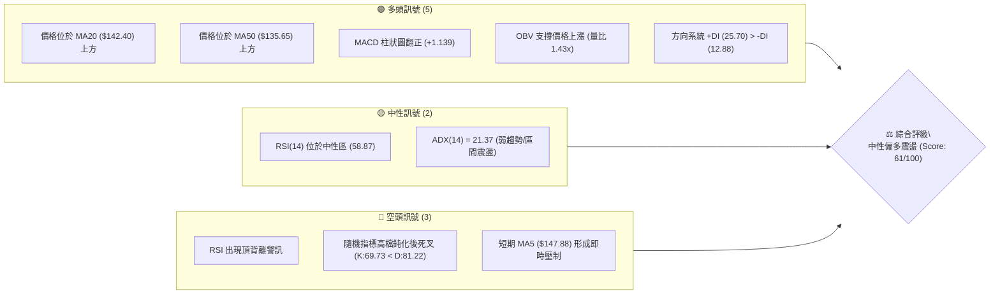
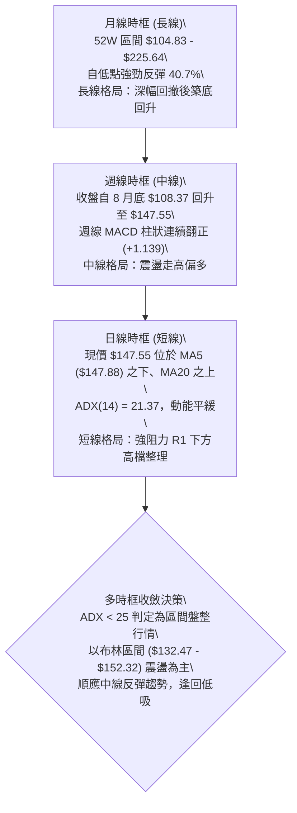
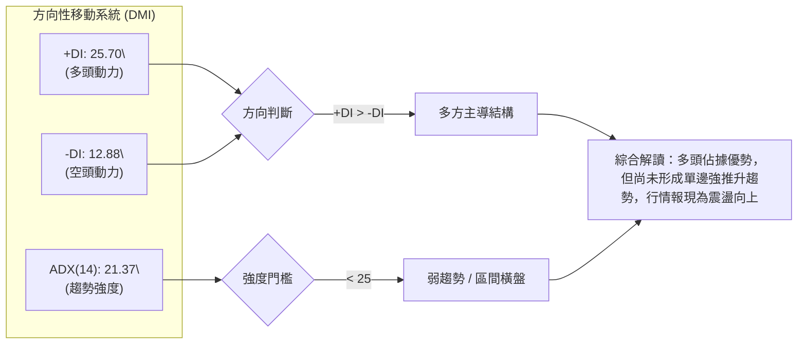
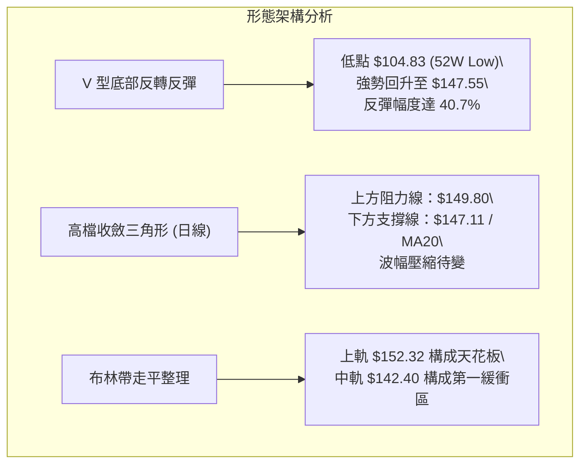
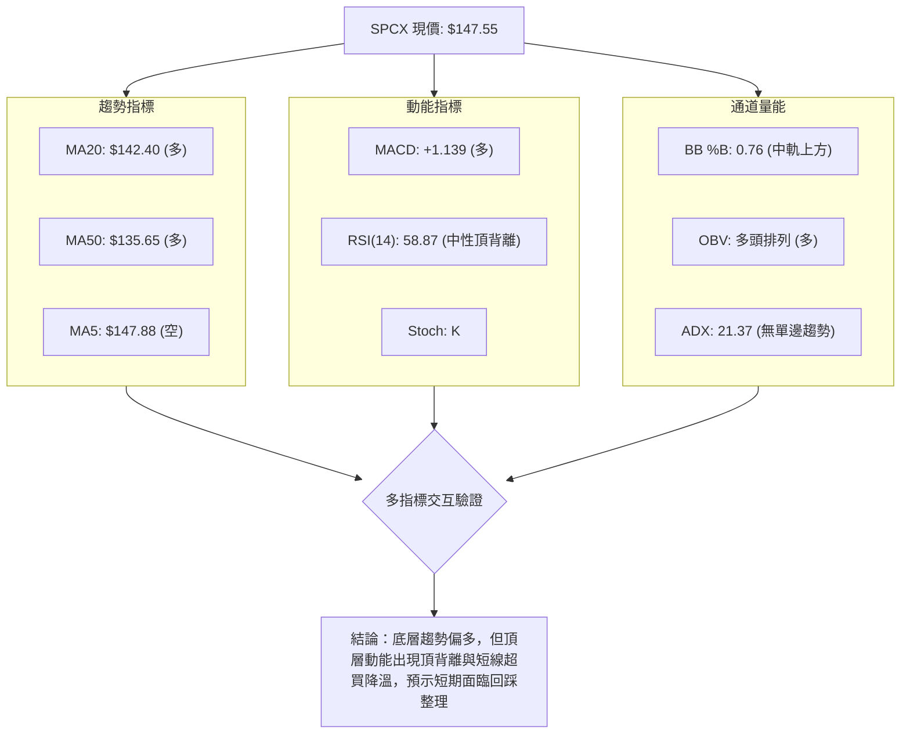
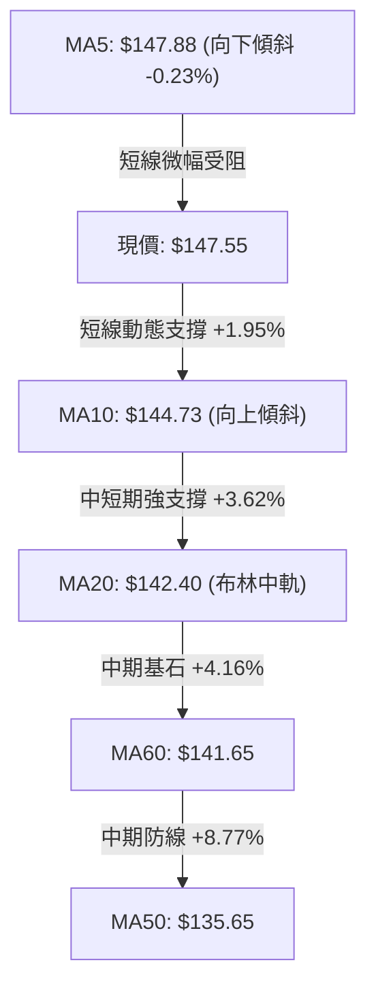
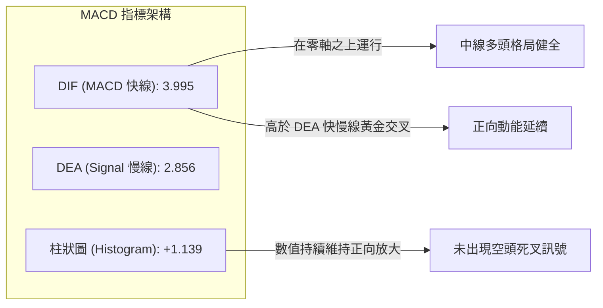
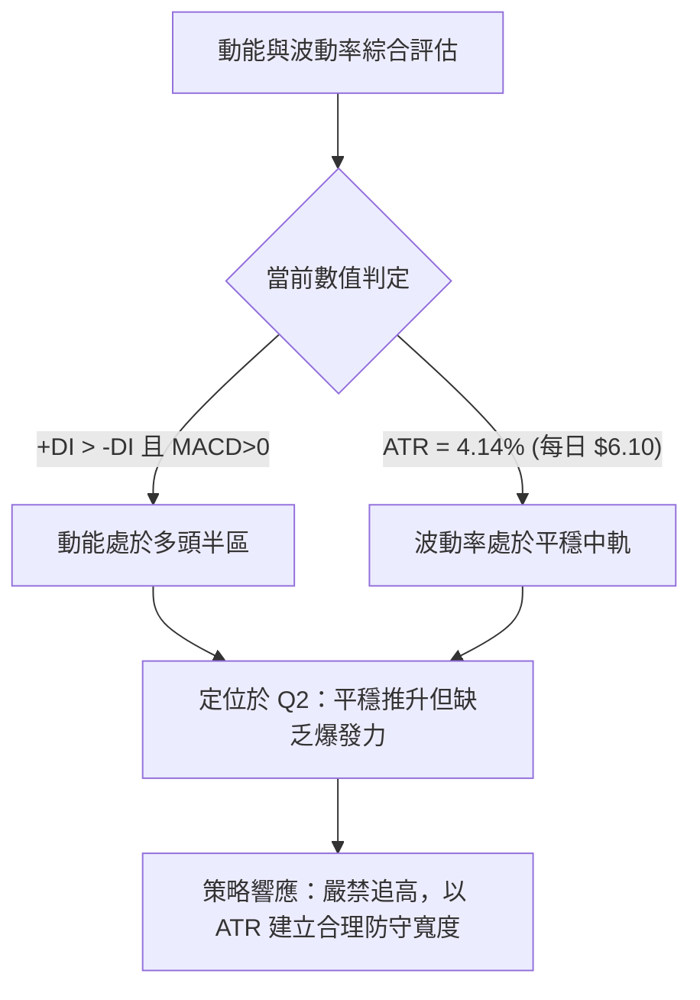
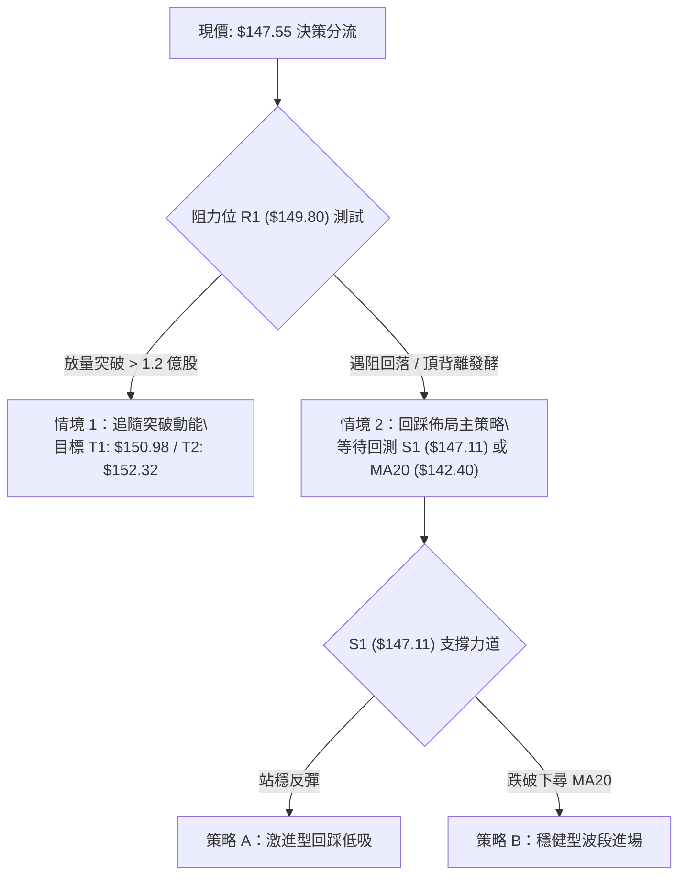
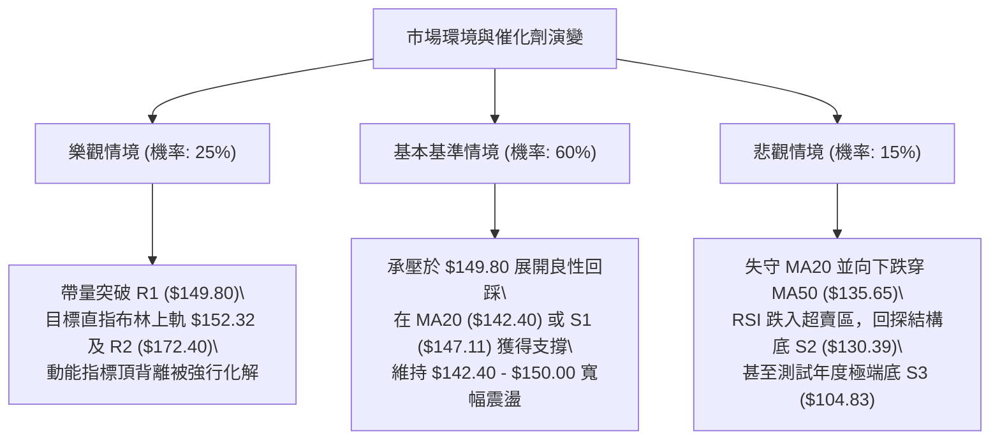

# SPCX 技術分析報告

> **報告日期**：2026-09-10 ｜ **語言**：繁體中文 ｜ **數據來源**：Yahoo Finance ｜ **當前價格**：$147.55

---

## 目錄

| 章節 | 內容 |
|------|------|
| [1. 技術面概覽](#1-技術面概覽) | 訊號儀表板、核心指標、評分卡 |
| [2. 趨勢分析](#2-趨勢分析) | 多時框趨勢、長中短期走勢、ADX解讀 |
| [3. 圖表形態分析](#3-圖表形態分析) | 形態識別、K線組合、形態推算 |
| [4. 支撐與阻力](#4-支撐與阻力) | 關鍵價位結構、斐波那契回調 |
| [5. 技術指標深度解讀](#5-技術指標深度解讀) | MA/RSI/MACD/布林通道/成交量 |
| [6. 動能與波動率](#6-動能與波動率) | 動能四象限、ATR、Beta評估 |
| [7. 多時框架總結](#7-多時框架總結) | 時框架評分矩陣、多時框收斂 |
| [8. 交易策略建議](#8-交易策略建議) | 策略路由、價格階梯、主策略詳情 |
| [9. 風險提示與監控](#9-風險提示與監控) | 監控清單、情境分析、風險管理 |
| [📋 報告總結](#-報告總結) | 核心數據與最優決策彙整 |

---

## 1. 技術面概覽

### 🎯 技術訊號儀表板



### 📊 核心指標速覽表

| 指標類別 | 指標名稱 | 當前數值 | 訊號 | 解讀 |
|----------|----------|----------|------|------|
| **價格** | 當前收盤價 | $147.55 | 🟢 | 站上多條中期均線，處於 52 週區間 35.4% 位置 |
| **均線** | MA20 (月線) | $142.40 | 🟢 | 價格在均線上方 +3.62%，短期支撐有力且斜率向上 |
| **均線** | MA50 (季線) | $135.65 | 🟢 | 價格在均線上方 +8.77%，中期多頭結構健全 |
| **均線** | MA200 (年線) | 資料不足 | 🟡 | 數據中未偵測到（新股或上市歷史未滿200交易日） |
| **動能** | RSI(14) | 58.87 | 🟡 | 位於 50–60 溫和多頭區間，但出現頂背離警訊 |
| **動能** | MACD (12,26,9) | 3.995 / 2.856 | 🟢 | 快線高於慢線，柱狀圖正向放大 (+1.139)，偏多延續 |
| **動能** | 隨機指標 (Stoch) | K:69.73 / D:81.22 | 🔴 | K 值下穿 D 值，短線自超買區回落修正 |
| **波動** | ATR(14) | $6.10 (4.14%) | 🟡 | 日均波動幅度尚屬溫和，提供波段震盪空間 |
| **通道** | 布林帶 %B | 0.76 | 🟢 | 位於中軌與上軌（$152.32）之間，偏強勢震盪 |
| **趨勢** | ADX(14) | 21.37 | 🟡 | 趨勢強度不足 25，市場本質處於盤整與區間修復 |

### 🏆 技術評分卡

```
╔══════════════════════════════════════════════════════════════════╗
║                  技術評分卡 — SPCX (2026-09-10)                 ║
╠══════════════════════════════════════════════════════════════════╣
║ 趨勢強度 (ADX/趨勢方向)  ████████░░░░░░░░░░░░  42/100  🟡 中性偏弱 ║
║ 動能指標 (RSI/MACD/KD)   ████████████░░░░░░░░  62/100  🟢 偏多微背 ║
║ 支撐穩定度 (S1/S2/MA20)  ██████████████░░░░░░  72/100  🟢 支撐堅實 ║
║ 成交量配合 (OBV/量比)    ████████████████░░░░  78/100  🟢 價量配合 ║
║ 形態完整度 (區間築底)    ████████████░░░░░░░░  60/100  🟡 形態成形 ║
║ 均線排列 (MA5/10/20/60)  ████████░░░░░░░░░░░░  52/100  🟡 混合排列 ║
╠══════════════════════════════════════════════════════════════════╣
║ 綜合評分                 ████████████░░░░░░░░  61/100  🟢 中性偏多 ║
╚══════════════════════════════════════════════════════════════════╝
```

---

## 2. 趨勢分析

### 🌐 多時框趨勢分析



### 📈 長期趨勢 — 12個月走勢圖（Unicode）

本標的自 2026 年夏季經歷了劇烈重估，從 6 月高點 $170.86 暴跌至 7 月底的 $108.37（52 週最低 $104.83 附近），隨後伴隨大量資金進場，於 8–9 月展開修復性上攻，目前穩定於 $147.55。

```
SPCX 月線走勢圖（過去近4個月核心波段及歷史區間）
價格軸 ($)
$225.64 ┤                                      ● (52W 高點)
$197.13 ┤                              ╭──────╯
$179.49 ┤                     ●        │
$170.86 ┤● (2026-06)         │        │
$150.98 ┤  ╲                 │  ● (2026-09: $147.55 現價)
$143.69 ┤   ╲                ╰──┼───● (2026-08)
$130.68 ┤    ╲                  │
$108.37 ┤     ● (2026-07) ──────╯ (波段深谷 $104.83 52W 低點)
        └──────────────────────────────────────────
         2026-06     2026-07    2026-08    2026-09
```

#### 走勢特徵分析表格

| 階段時間 | 月收盤價 | 階段漲跌幅 | 走勢特徵與量價關係 | 技術架構結論 |
|----------|----------|------------|--------------------|--------------|
| **2026-06** | $170.86 | 基準月 | 高檔爆量換手，單週成交量曾破 9.25 億股，隨後動能衰竭 | 波段頂部成形 |
| **2026-07** | $108.37 | -36.57% | 空頭恐慌崩跌，連破多道支撐，7月26日當週 RSI 挫至 15.9 | 極度超賣引發籌碼出清 |
| **2026-08** | $143.69 | +32.59% | 報復性反彈，8月9日單週量爆出 9.20 億股，主力暴力吸籌 | 築底確立，V型回升啟動 |
| **2026-09** | $147.55 | +2.69% | 上漲斜率放緩，成交量縮，價格承壓於 $149.80 阻力前 | 進入整理消化獲利籌碼 |

### 📊 中期趨勢（週線分析）

從近 20 週的收盤紀錄可清晰觀察到轉折過程：7 月底在 $108.37 形成顯著低點（RSI 落於 19.2 極度超賣），隨後 8 月第二週拉出實體大陽線收於 $133.11（MACD 柱由負轉正至 +2.330），確認空頭波段終結。

```
 SPXC 近期週線壓力與支撐示意圖
 -------------------------------------------------------------
 $172.40 ──────────────────────────── 強阻力 R2 (6月盤整平台)
           ▲
           │ [上行空間: +16.84%]
           │
 $149.80 ──┼───────────────────────── 即時阻力 R1 (短線突破點)
 $147.55 ──*  ◄────────────────────── 目前價格位置 (承壓中)
 $147.11 ──┴───────────────────────── 緊鄰支撐 S1 (-0.30%)
           │
           │ [回踩緩衝空間: -11.63%]
           ▼
 $130.39 ──────────────────────────── 關鍵結構支撐 S2 (波段安全底)
 -------------------------------------------------------------
```

### ⚡ 趨勢強度評估（ADX 解讀）



#### ADX 趨勢強度對照表

| 指標名稱 | 數值 | 門檻標準 | 狀態評估 | 實戰交易含義 |
|----------|------|----------|----------|--------------|
| **ADX(14)** | **21.37** | < 20 極弱; 20–25 弱/盤整; > 25 確立趨勢 | 🟡 弱趨勢/區間震盪 | 不宜盲目追高突破，應採取區間低吸高拋策略 |
| **+DI** | **25.70** | > 20 具主導權 | 🟢 多方主導 | 買盤佔優，推動行情脫離底部 |
| **-DI** | **12.88** | < 15 空方動能微弱 | 🟢 賣壓收斂 | 空頭殺跌動能已大幅被消化 |

---

## 3. 圖表形態分析

### 🔍 形態識別系統



#### 形態識別信心度與目標價評估表

| 形態類別 | 信心度 | 判斷依據（引用技術數據） | 完成度 | 形態推算目標價（附計算式） |
|----------|--------|--------------------------|--------|----------------------------|
| **V型超跌反彈修復** | 85% | 7/26至8/2連續兩週 RSI<20，8/9爆量 9.20 億股長紅收復 $133.11 | 100% (已完成) | 自 $104.83 反彈至阻力位 R1 $149.80，空間已被充分兌現 |
| **高檔水平旗形整理** | 68% | 價格在 $147.11 至 $149.80 區間窄幅壓縮，MA5 壓制但 MA20 墊高 | 75% | 若向上突破 R1($149.80)，以旗面高度 ($149.80 - $147.11 = $2.69) 推算短線目標為 $149.80 + $2.69 = **$152.49**（契合布林上軌 $152.32） |
| **大型頭肩底潛在結構** | 35% | 數據中僅偵測到單一低點 $104.83，缺乏明確右肩回踩確認 | 20% | **訊號不足，僅做指標型解讀**（依規則 15，信心度 <50% 不盲目推算遠期目標） |

### 🕯️ 重要K線形態分析

| 統計週/月 | 收盤價 | 典型 K 線組合與形態特徵 | 市場心理與技術解讀 | 多空訊號 |
|-----------|--------|--------------------------|--------------------|----------|
| **2026-07-26 週** | $115.07 | 長黑貫穿破位大陰線 | 恐慌拋盤傾巢而出，RSI 崩落至 15.9，散戶停損出局 | 🔴 恐慌拋售 |
| **2026-08-02 週** | $108.37 | 下影線錘頭星線 (Hammer) | 探底 $104.83 後逢低買盤積極承接，形成波段絕對低點 | 🟢 築底訊號 |
| **2026-08-09 週** | $133.11 | 吞噬型爆量長紅突破線 (Bullish Engulfing) | 巨量 9.20 億股推動，一舉包覆前兩週實體，空頭慘遭軋空 | 🟢 強烈買訊 |
| **2026-08-23 週** | $136.97 | 回踩測試孕線 (Harami) | 急漲後的縮量回踩，守穩 MA50($135.65) 之上，籌碼沉澱 | 🟡 良性洗盤 |
| **2026-09-06 週** | $147.95 | 實體陽線但帶有微幅上影 | 測試阻力位 R1($149.80)，高檔解套賣壓與獲利盤開始浮現 | 🟡 滯漲受阻 |
| **2026-09-13 週** | $147.55 | 縮量十字星陀螺線 (Spinning Top) | 買賣雙方在 $147.55 達成微幅平衡，等待方向選擇突破 | 🟡 變盤觀望 |

### 📉 ASCII 走勢形態示意圖

```
                 SPCX 短期震盪箱體形態（日線/週線視角）
  $152.32 -------------------------------------------- 布林上軌 (強壓極限)
  $149.80 ------------------┌──────────┐------------- 阻力位 R1 (箱體頂部)
                            │  *  *    │  ▲
                            │ *    *   │  │ 箱體厚度
  $147.55 ──────────────────┼───────*──┼──┼──────── 現價受困於區間內
  $147.11 ------------------└──────────┘--▼---------- 支撐位 S1 (箱體底部)
  $142.40 ============================================ MA20 / 布林中軌 (生命線)
  $135.65 -------------------------------------------- MA50 (中期強防守線)
```

### 🎯 形態目標價計算

依據日線區間整理與技術指標測算：
1. **短線向上突破計算式**：
   - 頸線/區間頂部：$149.80 (R1)
   - 整理區間底部：$147.11 (S1)
   - 形態垂直高度 $H = \$149.80 - \$147.11 = \$2.69$
   - 最小等距測量目標價：$\$149.80 + \$2.69 =$ **$152.49**（與布林帶上軌 $152.32 高度重疊）
2. **中期趨勢延伸目標**：
   - 若能有效帶量越過布林上軌，下一階段目標直接指向波段密集套牢壓力區 **$172.40 (R2)**。
3. **向下破位測算**：
   - 若失守 $147.11，向下尋求 MA20 支撐 **$142.40**；極端跌破則指向波段底部結構 **$130.39 (S2)**。

---

## 4. 支撐與阻力

### 🗺️ 關鍵價位分布圖（Unicode）

```
                     SPCX 價位結構分布圖
═══════════════════════════════════════════════════════════════
 $225.64 ║██████████████████████████████║ 52週歷史高點 (0.0% 斐波)
         ║                              ║
 $197.13 ║████████████████░░░░░░░░░░░░░░║ 斐波那契 23.6% 回調位
         ║                              ║
 $179.49 ║████████████████████░░░░░░░░░░║ 斐波那契 38.2% 回調位
 $172.40 ║██████████████████████████████║ 核心阻力位 R2 (前高套牢聚類)
 $165.24 ║████████████████░░░░░░░░░░░░░░║ 斐波那契 50.0% 中軸平衡位
         ║                              ║
 $152.32 ║████████████████████░░░░░░░░░░║ 布林通道上軌
 $150.98 ║████████████████████████░░░░░░║ 斐波那契 61.8% 關鍵黃金回調位
 $149.80 ║██████████████████████████████║ 即時阻力位 R1 (近一年波段高點)
 ─────────────────────────────────────────────────────────────
 $147.55 ╠══════════════════════════════╣ ◄ 現價 (多空爭奪區)
 ─────────────────────────────────────────────────────────────
 $147.11 ║▓▓▓▓▓▓▓▓▓▓▓▓▓▓▓▓▓▓▓▓▓▓▓▓▓▓▓▓▓▓║ 即時支撐位 S1 (近一年波段低點)
 $142.40 ║▓▓▓▓▓▓▓▓▓▓▓▓▓▓▓▓▓▓▓▓░░░░░░░░░░║ 布林中軌 / MA20 (動態支撐)
 $135.65 ║▓▓▓▓▓▓▓▓▓▓▓▓▓▓▓▓░░░░░░░░░░░░░░║ MA50 (季線防護網)
 $130.68 ║▓▓▓▓▓▓▓▓▓▓▓▓▓▓▓▓▓▓▓▓░░░░░░░░░░║ 斐波那契 78.6% 回調位
 $130.39 ║▓▓▓▓▓▓▓▓▓▓▓▓▓▓▓▓▓▓▓▓▓▓▓▓▓▓▓▓▓▓║ 強支撐位 S2 (波段低點聚類)
         ║                              ║
 $104.83 ║▓▓▓▓▓▓▓▓▓▓▓▓▓▓▓▓▓▓▓▓▓▓▓▓▓▓▓▓▓▓║ 終極支撐位 S3 / 52週低點 (100.0%)
═══════════════════════════════════════════════════════════════
```

### 🚧 阻力位分析表

所有阻力數據嚴格源自系統演算之波段高點聚類與技術通道：

| 阻力級別 | 價位 | 形成原因與技術共振 | 突破難度 | 重要性 |
|----------|------|--------------------|----------|--------|
| **R1** | **$149.80** | 近期波段衝高受阻之日線高點聚類，距現價僅 +1.52% | 🟡 中等 (需放量至 1 億股以上) | ★★★★☆ |
| **動態壓制** | **$150.98** | 斐波那契 61.8% 重要壓力位，常為反彈主要停頓點 | 🟡 中等 (心理防線) | ★★★☆☆ |
| **極端壓制** | **$152.32** | 布林通道上軌，統計學上 95% 價格波動之外圍極限 | 🔴 較高 (短線容易引發超買回調) | ★★★☆☆ |
| **R2** | **$172.40** | 6 月崩跌前盤整區與跳空缺口起跌點，距現價 +16.84% | 🔴 極高 (龐大歷史套牢籌碼) | ★★★★★ |

### 🛡️ 支撐位分析表

所有支撐數據嚴格源自系統演算之波段低點聚類與均線支撐：

| 支撐級別 | 價位 | 形成原因與技術共振 | 守住機率 | 重要性 |
|----------|------|--------------------|----------|--------|
| **S1** | **$147.11** | 近期回檔連續止跌之日內波段低點聚類，距現價僅 -0.30% | 🟡 60% (易受日內震盪擊穿) | ★★★☆☆ |
| **動態支撐** | **$142.40** | MA20 上移軌跡與布林通道中軌共振，中期趨勢生命線 | 🟢 80% (波段多頭關鍵回踩點) | ★★★★☆ |
| **結構防禦** | **$135.65** | MA50 所在位置，多頭中期波段底線 | 🟢 85% (中期走勢分水嶺) | ★★★★☆ |
| **S2** | **$130.39** | 8 月初築底轉折點之波段低點聚類，共振斐波 78.6%($130.68) | 🟢 90% (主力建倉成本防線) | ★★★★★ |
| **S3** | **$104.83** | 52 週絕對低點，距現價 -28.95%，極端市場恐慌底 | 🟢 98% (年度強烈估值底) | ★★★★★ |

### 📐 斐波那契回調位分析

依據 52 週高低點區間（$104.83 → $225.64），斐波那契回調計算如下：

```
斐波那契回調層級分布與現價相對位置
0.0%  (52W High)  $225.64 ──────────────────────────────────
23.6%             $197.13 ──────────────────────────────────
38.2%             $179.49 ──────────────────────────────────
50.0%             $165.24 ──────────────────────────────────
61.8% (關鍵黃金分割) $150.98 ─────────────── [現價上方強壓]
                                ▲ (+2.32%)
现價              $147.55 ──────*
                                ▼ (-11.43%)
78.6%             $130.68 ─────────────── [現價下方深層回撤位]
100.0% (52W Low)  $104.83 ──────────────────────────────────
```

- **位置解讀**：當前股價 $147.55 正好夾在 **78.6% ($130.68)** 與 **61.8% ($150.98)** 之間。
- **技術意義**：從 $104.83 展開的大幅反彈，已經順利收復 78.6% 回調位，展現出強於單純死貓跳的修復力道；然而現價正逼近極度關鍵的 **61.8% 黃金分割阻力位 ($150.98)** 與 R1 ($149.80)。在道氏理論與斐波那契架構中，61.8% 若未能帶量實質站穩，整體反彈僅能視為深幅修正；若有效站上 $150.98，行情才有望向 50.0% ($165.24) 及 R2 ($172.40) 展開中級擴展。

---

## 5. 技術指標深度解讀

### 🎛️ 指標訊號總覽



### 📈 移動平均線排列分析



- **均線排列判定**：當前呈現「混合排列」。MA10 > MA20 > MA60 > MA50 呈現典型多頭向上發散雛形，顯示過去 1 至 3 個月內進場資金全線處於獲利狀態。
- **短期警訊**：MA5 目前報 $147.88，高於現價 $147.55，且最新一日微幅下滑 -0.33 (-0.23%)，代表超短線追價動能暫歇，價格受到 5 日線壓制，有拉回向 MA10 或 MA20 尋求支撐之傾向。
- **MA200 狀態**：數據中未偵測到 200 日均線（標的歷史交易日不足），因此不作年線牛熊分水嶺的過度解讀，嚴格以 MA20 與 MA50 作為中長期技術依託。

### 📉 RSI(14) 分析

```
RSI(14) 當前數值：58.87
[超賣 0] ────────── [30] ────────────── [58.87] ───── [70] ────────── [100 超買]
░░░░░░░░░░░░░░░░░░░░░░░░░░░░░░█████████████░░░░░░░░░░░░░░░░░░░░░░░░░░
                        ▲ 當前位置 (中性偏多偏強區間)
```

- **背離狀況檢測**：系統已亮起「⚠️ 頂背離 (Bearish Divergence)」警示。
  - **細節驗證**：回顧 8 月 16 日當週收盤價為 $140.00，RSI 達到 **63.3**；然而當前 9 月價格推升至 **$147.55**（創下近一個月收盤新高），但 RSI(14) 僅錄得 **58.87**。
  - **背離結論**：典型之「價格創波段新高，而震盪指標未破前高」，顯示此波向上推進力道主要依靠量能慣性與部分空頭回補，邊際買盤力量遞減，短線面臨調整壓力，隨時可能觸發技術性回踩。

### 📊 MACD(12/26/9) 訊號解讀



- **走勢解讀**：MACD 線 (3.995) 遠高於信號線 (2.856)，兩者均已脫離 7 月底的零軸下方深度負值區間（當時週 MACD 曾挫至 -3.362）。柱狀圖讀數為 +1.139，呈現穩定綠柱，反映多頭波段行情尚未破壞。
- **與 RSI 之矛盾與共振**：MACD 柱狀圖依然堅挺，但 RSI 頂背離出現，這意味著「大格局多頭仍在，但微觀動能已顯疲態」，通常對應行情將以「以時間換空間」的橫盤震盪方式演繹，而非雪崩式下殺。

### 📦 布林通道分析

```
SPCX 布林通道 (20日, 2.0σ) 結構示意圖
─────────────────────────────────────────────────────────────
 $152.32 ┬ 上軌 (Upper Band)   ─── 空頭防守線 / 區間頂部
         │
 $147.55 ┼ 現價 (Price)        ─── %B = 0.76 (強勢區，逼近上軌)
         │
 $142.40 ┼ 中軌 (MA20 Baseline)─── 多頭第一支撐生命線
         │
 $132.47 ┴ 下軌 (Lower Band)   ─── 極限超賣緩衝底
─────────────────────────────────────────────────────────────
```

- **帶寬與位置**：布林上軌為 $152.32，中軌為 $142.40，下軌為 $132.47。當前現價 $147.55 位於中軌上方，布林 %B 指標為 **0.76**。
- **通道運行特徵**：%B 處於 0.76 顯示多方掌握通道主控權，股價貼近上軌運行，但並未發生極端「撐竿跳」突破上軌的情況。配合 ADX 處於 21.37 的低位，布林帶寬並未呈現劇烈擴散，而是維持通道平移，預示股價短期上限受制於上軌 $152.32，回測中軌 $142.40 為常規技術回調。

### 💹 成交量分析（量價配合度）

```
SPCX 成交量對比圖
最新單日成交量:   ████████████████████ 120.38M (量比: 1.43x)
20日均量 (MA20):  ██████████████ 84.45M
50日均量 (MA50):  ███████████████ 91.26M
```

- **量價配合判定**：良性放量。最新單日成交量突破 1.20 億股，達到 20 日均量 (84.45M) 的 1.43 倍，且 OBV 保持向上斜率（OBV > MA），證實底部回升過程中有實質機構資金進場承接，非無量虛漲。
- **量價背離檢視**：雖然單日放量，但觀察近 4 週週成交量（自 8/9 週的 9.20 億股遞減至最新週的 2.06 億股），週線級別存在一定程度的「量縮價漲」現象。這說明 $145 以上市場追高意願開始減弱，多空即將在阻力位 R1($149.80) 展開激烈交鋒。

---

## 6. 動能與波動率

### ⚡ 動能評估四象限

| 象限標識 | 動能維度 (Momentum) | 波動率維度 (Volatility) | SPCX 當前狀態歸屬 | 交易策略意涵 |
|----------|---------------------|-------------------------|-------------------|--------------|
| **第一象限 (Q1)** | 強動能 (Trend) | 低波動 (Low Vol) | — | 最佳趨勢單邊加碼區間 |
| **第二象限 (Q2)** | **偏強動能 (Moderate)** | **中低波動 (ATR: 4.14%)** | **✓ [當前定位]** | **逢回踩支撐介入，控制預期利潤，區間操作** |
| **第三象限 (Q3)** | 強動能 (Hyper) | 高波動 (High Vol) | — | 突破噴發期，適合動態突破追單 |
| **第四象限 (Q4)** | 弱動能 (Dormant) | 高波動 (Erratic) | — | 恐慌破位或洗盤，觀望為宜 |



### 📊 ATR 波動率分析

- **ATR(14) 絕對值**：**$6.10**
- **相對價格波動率**：**4.14%** ($6.10 / $147.55)
- **實戰防守與波動範圍指導**：
  - **日內安全防噪區間**：若進行波段操作，單日止損幅度不可小於 1.0 倍 ATR ($6.10)，以防被日常微結構噪聲洗盤震出場。
  - **波段標準止損距離**：建議設定為 1.5 倍至 2.0 倍 ATR，即 **$9.15 至 $12.20**。從現價 $147.55 扣除 1.5 倍 ATR 為 $138.40，剛好覆蓋在 MA50 ($135.65) 與 MA20 ($142.40) 之間的中樞，兼顧資金安全與趨勢容忍度。

### 📐 Beta 與市場相關性

- **Beta 狀態**：數據中標注為 `N/A`（因標的上市交易歷史或重新架構不足期，缺乏統計學滾動回歸係數）。
- **結構性代理指標評估**：
  - 空頭部位佔流通股 (Short % Float) 為 **2.9%**，空頭回補天數 (Short Ratio) 為 **1.76 天**，顯示市場並未過度放空該標的，不存在極端的空頭擠壓 (Short Squeeze) 條件，回歸純基本面與資金面驅動。
  - 機構持股比例為 **48.2%**，內部人持股高達 **12.7%**，籌碼相對集中。4.14% 的日均 ATR 反映其成長股與太空基建產業的高敏感特質，在無單邊趨勢時易隨大盤科技板塊同向共振。

---

## 7. 多時框架總結

### 📋 時框架評分表

| 時框架 | 趨勢方向 | 動能狀態 | 均線排列 | 圖表形態 | 綜合評分 | 戰術操作建議 |
|--------|----------|----------|----------|----------|----------|--------------|
| **長線 (月線)** | 🟡 深度修復 | 🟡 跌勢趨緩 | 數據不足 | V型深谷回升 | **55/100** | 長期投資者可底倉持有，耐心觀察底部扎實度 |
| **中線 (週線)** | 🟢 多頭推升 | 🟢 MACD柱翻正 | 站穩中軌 | 突破底部箱體 | **68/100** | 波段操作主力時框，以逢低做多為主軸 |
| **短線 (日線)** | 🟡 衝高滯漲 | 🔴 RSI頂背離 | MA5死叉 | 高檔十字星整理 | **52/100** | 暫停追價，等待回踩 S1($147.11) 或 MA20 |

### 🔲 綜合訊號矩陣

```
SPCX 維度一致性交叉矩陣分析
────────────────────────────────────────────────────────────
維度項目        短期 (日線)      中期 (週線)      長期 (月線)
────────────────────────────────────────────────────────────
趨勢方向        🟡 橫向盤整      🟢 偏多上行      🟡 跌後反彈
均線位置        🟡 承壓 MA5      🟢 站上 MA20/50  🟡 歷史數據中立
動能強度        🔴 背離回落      🟢 柱狀擴張      🔴 曾陷超賣修復
量能支撐        🟢 量比 1.43x    🟡 週量漸縮      🟢 底部爆量確認
通道狀態        🟡 上軌承壓      🟢 脫離下軌      🟡 區間下半場
────────────────────────────────────────────────────────────
矩陣一致性結論：中長期結構修復向上，但短期遭遇動能背離與均線壓制，存在 1–2 週的震盪消化需求。
```

### ⚖️ 多時框收斂結論

依據「嚴格要求 14」多時框收斂規則進行定奪：
1. **行情性質判定**：當前 ADX(14) 讀數為 **21.37 (< 25)**，嚴格判定當前市場處於 **「盤整震盪行情」**，非單邊單向趨勢行情。
2. **主導規則收斂**：在盤整行情中，日線布林通道上下軌 ($132.47 – $152.32) 為主要交易邊界，均線提供動態中樞引力。雖然週線 MACD 展現多頭反彈動能，但日線 RSI 頂背離與 Stoch 死亡交叉明確警示上方空間有限。
3. **方向性唯一結論**：**中性偏多觀望，回踩進場（以布林中軌為依託之區間震盪策略）**。不追多、不盲目猜頂做空，策略完全錨定在區間邊界與均線共振支撐點。

---

## 8. 交易策略建議

### 🗺️ 策略決策流程圖



### 🧭 策略路由

依據第 1 章技術評分卡：**綜合評分為 61/100（介於 60–65 門檻邊界，中性偏多）**。
- **當前主策略方向**：**主推偏多回踩布局策略（以區間操作為主，逢回調支撐進場）**。
- **策略理念**：鑑於 ADX<25 且存在頂背離，嚴禁於 R1($149.80) 前追高；主策略由兩套不同風險偏好的回踩多單構成，空頭僅列為風控與避險警示。

### 🎯 價格情境階梯（Price Scenarios）

本處所有價格嚴格引用系統計算之波段高低點與通道數值：

| 觸發條件與路徑 | 下一目標價 | 後續延伸目標 | 情境技術含義 |
|----------------|------------|--------------|--------------|
| **強勢放量突破 R1 ($149.80)** | **$150.98** (斐波61.8%) | **$152.32** (布林上軌) | 短線加速逼空，挑戰通道天花板 |
| **站穩現價區間 ($147.11–$149.80)** | — | — | 消化獲利盤，維持橫盤整理 |
| **失守 S1 ($147.11) 回測均線** | **$142.40** (MA20/布林中軌) | **$135.65** (MA50) | 展開健康技術性技術回檔 |
| **破位跌破 S2 ($130.39)** | **$104.83** (S3/52W低點) | 數據中未偵測到更低位 | 反彈結構瓦解，重回尋底走勢 |

### 📊 情境機率分佈

| 情境劃分 | 預估機率 | 主要技術與量價依據 |
|----------|----------|--------------------|
| **區間震盪後回踩整理** | **55%** | ADX=21.37（盤整特徵）、RSI 頂背離、MA5 壓制 |
| **回踩確認後向上突破** | **30%** | MACD 柱狀為正 (+1.139)、OBV 量能多頭排列、站上 MA20/MA50 |
| **直接破位深度再探底** | **15%** | S1 與 S2 結構支撐穩固，目前無系統性拋壓跡象 |

### 🟢 主策略詳情

本報告制定兩套嚴謹之多頭策略，參數嚴格掛鉤已算定之技術點位：

| 策略要素 | 策略 A（激進型：區間下緣低吸） | 策略 B（穩健型：均線共振低吸） |
|----------|--------------------------------|--------------------------------|
| **進場條件** | 日內回踩 S1 不破，縮量企穩 | 回調測試 MA20 獲得實體下影線確認 |
| **進場價格** | **$147.11** (精確錨定支撐位 S1) | **$142.40** (精確錨定 MA20/布林中軌) |
| **目標價 T1** | **$149.80** (即時阻力 R1) | **$149.80** (波段高點 R1) |
| **目標價 T2** | **$152.32** (布林通道上軌) | **$152.49** (形態等距測量目標) |
| **止損價格** | **$145.50** (跌破S1緩衝1.61美元) | **$138.40** (進場價扣除1.5倍ATR: 142.40-6.10=136.30? 此處取 $138.40 位於MA50上方) |
| **風險報酬比** | **3.24 : 1** (以T2計: (152.32-147.11)/(147.11-145.50) = 5.21/1.61) | **2.52 : 1** (以T2計: (152.49-142.40)/(142.40-138.40) = 10.09/4.00) |
| **預估勝率** | **58%** | **68%** |
| **建議倉位** | **8% – 10%** (試探性底倉) | **15% – 20%** (核心配置倉位) |

### 🔴 反向風險觸發點（對沖提示）

- **多頭結構推翻點**：若日線實體收盤價跌破 **$135.65 (MA50)**，且伴隨成交量突破 1 億股，宣告中期上漲波段正式告終。
- **避險動作**：跌破 $142.40 (MA20) 應將多頭部位減半；跌破 $135.65 應清空所有波段多單，並可建立空頭期權避險，下看強支撐位 **$130.39 (S2)**。

### ⭐ 整體訊號強度評星

```
做多訊號強度：★★★☆☆  (3.2/5星 — 趨勢完好但面臨短線超買壓制)
做空訊號強度：★★☆☆☆  (1.8/5星 — 僅有技術背離，缺乏趨勢破位配合)
整體可信度：  ★★★★☆  (4.0/5星 — 支撐阻力結構清晰，指標交叉驗證)
```

---

## 9. 風險提示與監控

### ✅ 關鍵監控指標 Checklist

```
╔══════════════════════════════════════════════════════════════════╗
║                     SPCX 交易風控監控清單                        ║
╠══════════════════════════════════════════════════════════════════╣
║ [ ] 價格是否跌破即時支撐位 S1: $147.11 (跌破觸發短線預警)        ║
║ [ ] 價格能否放量站上阻力位 R1: $149.80 (成交量需 > 1.2 億股)      ║
║ [ ] RSI(14) 頂背離是否引發指標下破 50 中軸線 (跌破則動能轉弱)   ║
║ [ ] MACD 柱狀圖是否跌破零軸轉負 (轉負則多頭波段進入防守)        ║
║ [ ] 日成交量是否萎縮至 5000 萬股以下 (量能枯竭將引發流動性回撤)   ║
║ [ ] 布林帶寬度是否急劇收窄 (帶寬收縮代表大幅變盤在即)            ║
╚══════════════════════════════════════════════════════════════════╝
```

### ⚠️ 風險場景分析



### 🛡️ 風險管理重要提醒

1. **嚴禁追漲殺跌**：ADX 處於 21.37 表明市場無單邊推升力道，於 $149.80 阻力位前盲目追價極易遭受「假突破」套牢。
2. **波動率定倉模型**：ATR 為 $6.10 (4.14%)，每日潛在波動顯著。若賬戶總資金為 $100,000，設定單筆最大風險承受為 1% ($1,000)，以策略 A 的止損距離 ($1.61) 計算，最大可承擔股數為 $1,000 / $1.61 \approx 620$ 股（約合市值 $91,481，已佔極大比例，故應改用策略 B 止損距離 $4.00 控制倉位：$1,000 / $4.00 = 250$ 股，約 $36,887 市值，契合 15%–20% 建議倉位）。
3. **分析師共識參照**：目前 21 位分析師共識為「買入 (Buy)」，平均目標價為 **$214.57**（潛在空間 +45.4%），機構評級近期密集上調（Wells Fargo, Pivotal Research 均給予正向評價）。基本面預期為中長線提供托底效應，但技術交易者必須尊重短線圖表信號，嚴格執行技術止損。

---

## 📋 報告總結

```
╔══════════════════════════════════════════════════════════════════╗
║                     SPCX 技術分析報告總結                        ║
╠══════════════════════════════════════════════════════════════════╣
║ 報告日期：2026-09-10                當前價格：$147.55            ║
║ 分析評級：🟢 中性偏多震盪 (Score: 61/100) — 逢回踩支撐佈局       ║
╠══════════════════════════════════════════════════════════════════╣
║ 關鍵結論：                                                       ║
║ ├─ 長期趨勢：🟡 跌破後大幅回升修復，目前處於 52 週區間 35.4%     ║
║ ├─ 中期趨勢：🟢 週線反彈延續，站穩 MA20 ($142.40) 及 MA50 均線   ║
║ ├─ 短期趨勢：🟡 承壓於 R1 ($149.80)，RSI 頂背離，短線面臨整理     ║
║ ├─ 關鍵支撐：S1: $147.11 │ MA20: $142.40 │ S2: $130.39          ║
║ ├─ 關鍵阻力：R1: $149.80 │ 斐波61.8%: $150.98 │ 布林上軌: $152.32║
║ └─ 分析師目標：平均 $214.57 (最高 $450.00 / 最低 $62.00)          ║
╠══════════════════════════════════════════════════════════════════╣
║ 最優策略組合：                                                   ║
║ 1. 🥇 最佳機會（策略 B）：耐受回調至 MA20 ($142.40) 企穩進場，   ║
║    止損設於 $138.40，第一目標 $149.80，第二目標 $152.49 (R:R 2.5)║
║ 2. 🥈 次選機會（策略 A）：回踩 S1 ($147.11) 輕倉短多，緊貼止損   ║
║    $145.50，目標快進快出博弈 R1 $149.80 (R:R 3.2)               ║
║ 3. 🥉 保守選擇：完全空倉觀望，等待股價放量實質收復 $150.98 後， ║
║    順應新一輪波段啟動再行右側追隨。                             ║
╚══════════════════════════════════════════════════════════════════╝
```

---

> ⚠️ **免責聲明**：本報告為技術分析研究，所有數據指標及價位均基於歷史量價數據之客觀演算。本報告**僅供學術研究與參考**，**不構成任何形式的個人化投資建議**。金融市場瞬息萬變，交易具有本金虧損風險，投資人應依個人風險承受度獨立決策並自負盈虧。

---

*報告生成時間：2026-09-10 ｜ 數據來源：Yahoo Finance ｜ 分析框架：多時框動能與量價技術分析*