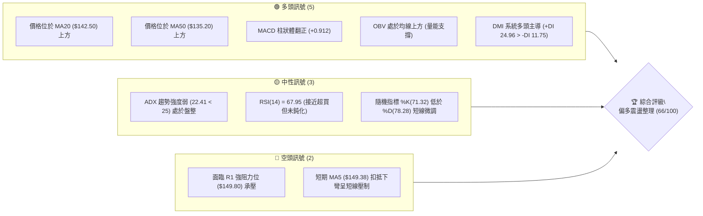
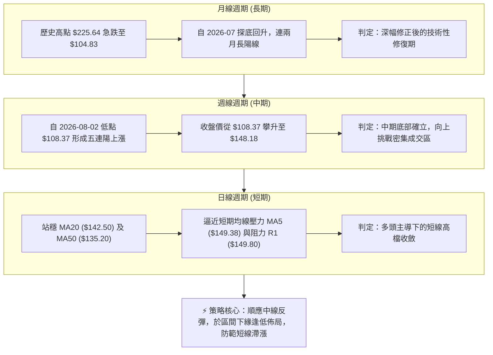
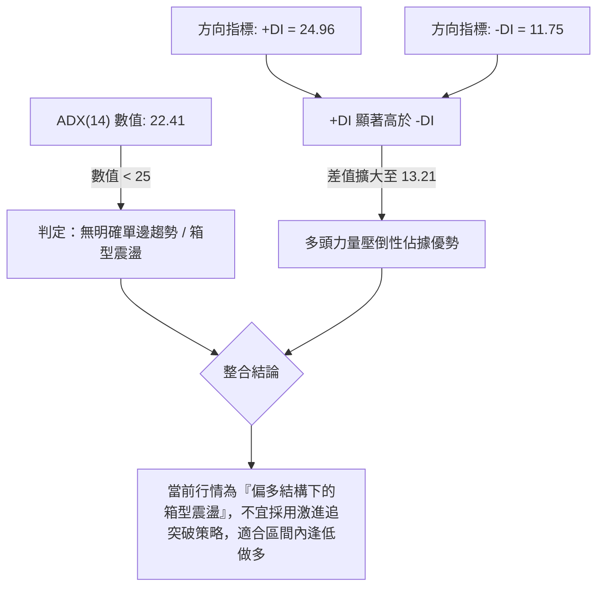
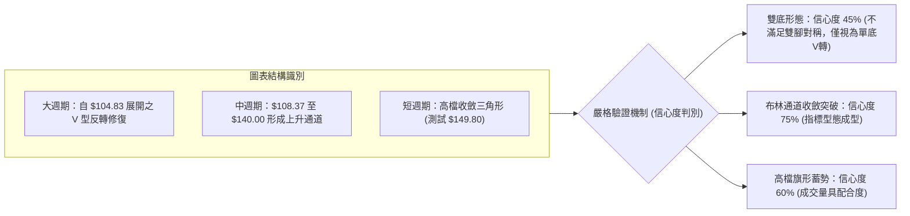
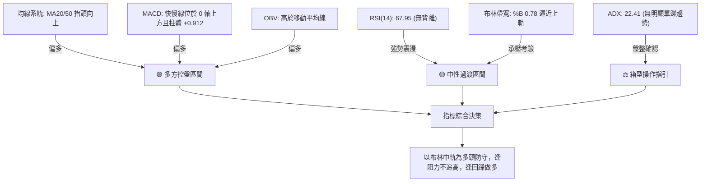
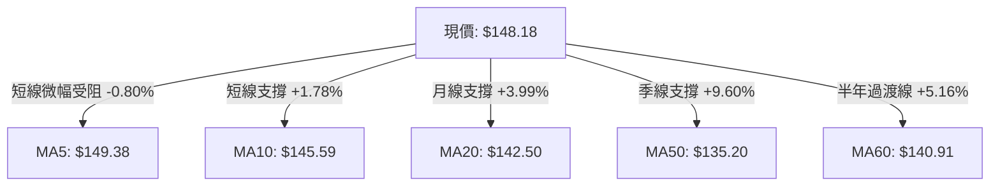
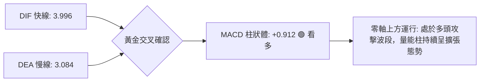
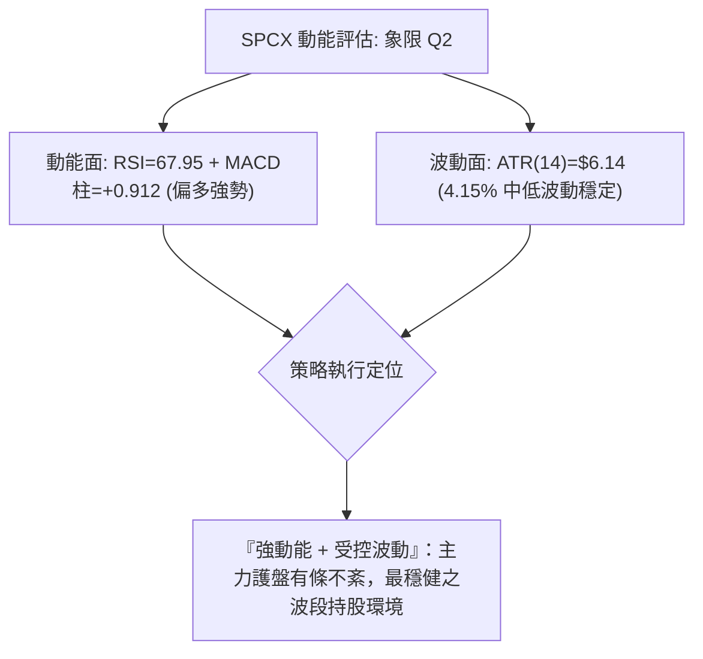
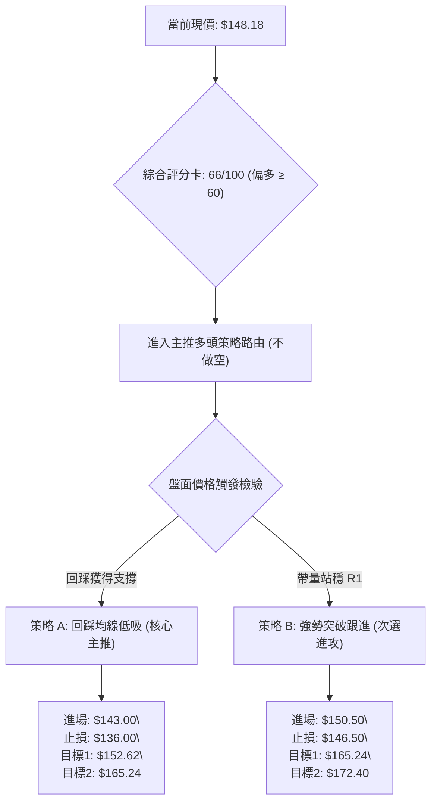
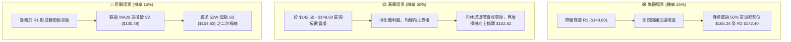

# SPCX 技術分析報告

> **報告日期**：2026-09-11 ｜ **語言**：繁體中文 ｜ **數據來源**：Yahoo Finance ｜ **當前價格**：$148.18

---

## 目錄

| 章節 | 內容 |
|------|------|
| [1. 技術面概覽](#1-技術面概覽) | 訊號儀表板、核心指標、評分卡 |
| [2. 趨勢分析](#2-趨勢分析) | 多時框趨勢、長中短期走勢 |
| [3. 圖表形態分析](#3-圖表形態分析) | 形態識別、K線組合、目標價 |
| [4. 支撐與阻力](#4-支撐與阻力) | 關鍵價位、斐波那契回調 |
| [5. 技術指標深度解讀](#5-技術指標深度解讀) | MA/RSI/MACD/布林/成交量 |
| [6. 動能與波動率](#6-動能與波動率) | 動能評估、ATR、Beta |
| [7. 多時框架總結](#7-多時框架總結) | 時框架評分矩陣 |
| [8. 交易策略建議](#8-交易策略建議) | 多空策略、風險報酬比 |
| [9. 風險提示與監控](#9-風險提示與監控) | 監控指標、風險場景 |
| [📋 報告總結](#-報告總結) | 總結清單與操作佈局 |

---

## 1. 技術面概覽

### 🎯 技術訊號儀表板



### 📊 核心指標速覽表

| 指標類別 | 指標名稱 | 當前數值 | 訊號 | 解讀 |
|----------|----------|----------|------|------|
| **價格** | 當前收盤價 | $148.18 | 🟢 | 自波段低點 $104.83 明顯修復，位於 52 週區間 35.9% |
| **均線** | MA20 (月線) | $142.50 | 🟢 | 現價高於 MA20 達 +3.99%，短期多頭防守線穩固 |
| **均線** | MA50 (季線) | $135.20 | 🟢 | 現價高於 MA50 達 +9.60%，中線轉向多頭掌控 |
| **均線** | MA200 (年線) | $N/A | 🟡 | 歷史數據不足（新上市/資料限制），長週期無法計算 |
| **動能** | RSI(14) | 67.95 | 🟡 | 位於強勢多頭區間，接近 70 超買警戒線，無底背離或頂背離 |
| **動能** | MACD (12,26,9) | 3.996 (柱 +0.912) | 🟢 | 快線高於慢線 (3.084)，柱狀體擴增，中線動能健康向上 |
| **趨勢** | ADX(14) / DMI | 22.41 (+DI 24.96) | 🟡 | ADX < 25 屬無明確強趨勢的「箱型震盪」，+DI 壓制 -DI |
| **通道** | 布林通道 %B | 0.78 (帶寬 $20.25) | 🟢 | 運行於中軌 ($142.50) 與上軌 ($152.62) 間，結構強勢 |
| **量能** | 20日成交量比 | 1.44x (118.35M股) | 🟢 | 突破 20 日均量 (82.01M)，量價配合，OBV 呈累積型態 |
| **波動** | ATR(14) | $6.14 (4.15%) | 🟡 | 單日波動率中等，交易止損設置需給予適度空間 |

### 🏆 技術評分卡

```
╔════════════════════════════════════════════════════════════════╗
║                  技術評分卡 — SPCX (2026-09-11)                ║
╠════════════════════════════════════════════════════════════════╣
║ 趨勢強度 (ADX/DMI)   ██████████░░░░░░░░░░  52/100 🟡 中性盤整  ║
║ 動能指標 (MACD/RSI)  ███████████████░░░░░  75/100 🟢 偏多推升  ║
║ 支撐穩定度 (S1/S2)   ██████████████░░░░░░  70/100 🟢 底部墊高  ║
║ 成交量配合 (OBV/VOL) ████████████████░░░░  80/100 🟢 放量上攻  ║
║ 形態完整度 (波段構造)████████████░░░░░░░░  60/100 🟡 構築底型  ║
║ 均線排列 (MA5-MA60)  ████████████░░░░░░░░  60/100 🟡 混合多頭  ║
╠════════════════════════════════════════════════════════════════╣
║ 綜合評分             █████████████░░░░░░░  66/100 🟢 偏多震盪  ║
╚════════════════════════════════════════════════════════════════╝
```

---

## 2. 趨勢分析

### 🌐 多時框趨勢分析



### 📈 長期趨勢 — 12個月走勢圖（Unicode）

依據月度數據、歷史高點 $225.64、波段低點 $104.83 與近月走勢繪製之價格路徑圖：

```
SPCX 月線走勢圖（近12個月價格結構路徑）
價格軸 ($)
$225.64 ┤                           ● (52W歷史高點)
$200.00 ┤                   ●       │
$180.00 ┤           ●       │       │
$170.86 ┤   ●       │       │       └───● (2026-06 頂部出貨)
$150.00 ┤───┼───────┼───────┼───────────┼───────●←【現價 $148.18】
$143.69 ┤   │       │       │           │   ●  (2026-08 強力反彈)
$120.00 ┤   │   ●   │       │           │   │
$108.37 ┤   │   │   │       │           └───┴──● (2026-07 恐慌拋售)
$104.83 ┤───┴───┴───┴───────┴──────────────────● (52W波段歷史低點)
        └─────────────────────────────────────────────────────► 時間
           M1  M2  M3  M4  M5  M6  M7  M8  M9  M10 M11 M12 (2026-09)
```

**走勢特徵分析表格**：

| 階段區間 | 起止價位 ($) | 漲跌幅 (%) | 量能與形態特徵 | 趨勢結論 |
|----------|-------------|------------|----------------|----------|
| **高檔回撤期** (前期至 06月) | $225.64 → $170.86 | -24.28% | 高位放量滯漲，跌破高檔均線支撐，主力資金外流 | 空頭確立 |
| **恐慌主跌期** (06月至 07月) | $170.86 → $108.37 | -36.57% | 拋售高潮 (Selling Climax)，破位下殺觸及 52W 低點 $104.83 | 極度超賣 |
| **強勁修復期** (07月至 08月) | $108.37 → $143.69 | +32.59% | 週成交量放大至 9.20 億股，長陽 V 型抽腳回升 | 轉為震盪反彈 |
| **築底推升期** (08月至 09月) | $143.69 → $148.18 | +3.12% | 消化獲利盤，突破 MA20 及 MA50，量能穩定於均量以上 | 多頭蓄勢 |

### 📊 中期趨勢（週線分析）

從近 20 週收盤走勢清晰可見中期結構的反轉特徵：
1. **底部爆量成型**：在 2026-08-02 當週見底 $108.37（當週 RSI 跌至極端低點 19.2）後，8月9日當週隨即爆出 9.20 億股的驚人天量，推升價格重返 $133.11，單週暴漲 22.8%，MACD 柱由負轉正至 +2.330，完成了典型的「放量換手底」。
2. **階梯式推升**：隨後連續 5 週呈現「低點逐週抬高（Higher Lows）」態勢（$108.37 → $133.11 → $136.97 → $141.50 → $147.95 → $148.18），中期均線壓力陸續被克服。
3. **動能減速**：近三週收盤價推升斜率放緩，週成交量降至 3.24 億股，顯示逼近整數關卡及斐波那契壓力區時，追高意願有所收斂，進入中期待變區。

```
中期壓力與支撐示意圖（週線結構）
========================================================================
[阻力 R2]    $172.40 ────────────────────────────────── 週線強阻力
                       ▲ (潛在上行空間)
[阻力 R1]    $149.80 ──────┐◄── 短期遭遇壓制 (目前正測試)
[當前現價]   $148.18 ──────┘
                       ▼ (短線回撤保護)
[支撐 S1]    $147.11 ────────────────────────────────── 前波平臺微型支撐
[支撐 S2]    $130.39 ────────────────────────────────── 週線級別強支撐線
========================================================================
```

### ⚡ 趨勢強度評估（ADX 解讀）



**ADX 趨勢強度對照解讀**：

| 指標變數 | 當前讀數 | 標準臨界值 | 狀態描述 | 交易指引 |
|----------|----------|------------|----------|----------|
| **ADX** | 22.41 | < 25 (弱/盤整) | 趨勢動能處於休眠蓄勢狀態，單邊暴衝行情暫未啟動 | 依據收斂規則14：優先採用布林通道震盪與均線邊界操作 |
| **+DI** | 24.96 | 參考值 > 20 | 多方控盤力量穩定增長，買盤具有持續性 | 回調支撐位時為積極做多訊號 |
| **-DI** | 11.75 | 參考值 < 15 | 空方力量衰退至低檔，殺跌動能疲弱 | 空頭勝率偏低，切勿盲目放空 |

---

## 3. 圖表形態分析

### 🔍 形態識別系統



**圖表形態信心度與判斷依據表（遵循規則 15）**：

| 形態名稱 | 信心度 | 判斷依據（嚴格引用已知數據） | 完成度 | 目標價（附嚴謹計算式） |
|----------|--------|------------------------------|--------|------------------------|
| **布林中軌回踩確認** | 75% | 價格穩居 BB 中軌 $142.50 之上，BB %B 為 0.78，開口向上發散 | 85% | 依布林通道上軌計算：目標價為 **$152.62** |
| **高檔窄幅旗形整理** | 60% | 8/16 至 9/13 連續五週於 $136.97 - $148.18 盤整，成交量遞減蓄勢 | 70% | 由旗形高度推算：突破 R1($149.80) + 旗身高度 ($148.18 - $136.97 = $11.21) = **$161.01** |
| **雙重底 (W底)** | 40% | 數據中僅有 52W 低點 $104.83 與週線低點 $108.37，兩者相差 $3.54 且間隔過短，形態不足 | 30% | *訊號不足，不予計算幾何目標價，改以指標型解讀* |

### 🕯️ 重要K線形態分析

| 週/月份區間 | 收盤價 | 實體K線形態 | 量價關係與市場心理解讀 | 技術訊號 |
|-------------|--------|-------------|------------------------|----------|
| **2026-07-26** | $115.07 | 長陰探底大陰燭 | 投降式拋售，週量 3.61 億股，市場極度恐慌，RSI 跌至 15.9 | 🔴 恐慌拋售 |
| **2026-08-02** | $108.37 | 下影線鎚頭線 (Hammer) | 探底 52W 最低 $104.83 後迅速收腳，多方逢低強力介入守住百元整數 | 🟢 止跌見底 |
| **2026-08-09** | $133.11 | 突破型光頭大陽線 | 9.20 億股歷史天量長陽吞噬，空頭回補疊加買盤湧入，反轉確立 | 🟢 強力反轉 |
| **2026-08-23** | $136.97 | 回踩十字星 (Doji) | 反彈後正常獲利了結回洗，量縮至 4.76 億股，洗盤意味濃烈 | 🟡 震盪洗盤 |
| **2026-09-06** | $147.95 | 實體陽線溫和推升 | 量能溫和收紅，連破均線關卡，確認中底紮實 | 🟢 多頭延續 |
| **2026-09-13** | $148.18 | 高檔小陽十字 (現狀) | 盤旋於 R1 ($149.80) 阻力前，多空展開狹幅拉鋸，面臨方向選擇 | 🟡 阻力蓄勢 |

### 📉 ASCII 走勢形態示意圖

```
SPCX 高檔窄幅旗形整理結構（週線/日線共振區）
價格軸
$152.62 ┬ - - - - - - - - - - - - - - - - - - - - - - - ┌── [布林上軌]
$149.80 ┤                            ┌─● [阻力位 R1]───┘
$148.18 ┤                   ┌──●─────┼←【現價位置 $148.18】
$145.59 ┤             ┌──●──┘        └── [MA10 支撐]
$142.50 ┤       ┌──●──┘                   [MA20 / 布林中軌]
$136.97 ┤ ┌──●──┘ (旗形下邊緣)
$130.39 ┴─┴──────────────────────────────────────────── [波段低點支撐 S2]
         8/16  8/23   8/30   9/06    9/13 (時間序列)
```

### 🎯 形態目標價計算

根據布林收斂發散與高檔旗形量度推算：
1. **第一波段目標（布林通道擴張理論）**：
   - 當前上軌價格為 **$152.62**，若短線有效放量站穩 R1 ($149.80)，價格第一步將測試布林通道頂部。
2. **第二波段形態量度目標（由旗形高度推算）**：
   - 形態底部邊界：$136.97 (2026-08-23 收盤)
   - 形態突破頸線：$149.80 (阻力 R1)
   - 形態垂直高度 $H$ = $149.80 - $136.97 = $12.83
   - 突破量度目標價 $T2$ = 頸線 ($149.80) + $H ($12.83) = **$162.63**（此價位極為接近 50.0% 斐波那契回調位 $165.24）。

---

## 4. 支撐與阻力

### 🗺️ 關鍵價位分布圖（Unicode）

依據 OHLCV 聚類計算之精確價位分布構建：

```
SPCX 價位結構分布圖
═══════════════════════════════════════════════════════════════════════
$225.64 ║████████████████████████████████║ 52W 歷史最高點 (0.0% 回調)
        ║                                ║
$172.40 ║████████████████████████        ║ 波段強阻力 R2 (近一年波段高點聚類)
$165.24 ║▓▓▓▓▓▓▓▓▓▓▓▓▓▓▓▓▓▓▓▓            ║ 斐波那契 50.0% 核心分水嶺
$152.62 ║▒▒▒▒▒▒▒▒▒▒▒▒▒▒▒▒                ║ 布林通道上軌動態壓力
$149.80 ║██████████████████████████████  ║ 近期關鍵阻力 R1 (+1.09%)
╠═══════╬════════════════════════════════╣ ◄ 現價 $148.18
$147.11 ║▓▓▓▓▓▓▓▓▓▓▓▓                    ║ 近期微型支撐 S1 (-0.72%)
$142.50 ║▒▒▒▒▒▒▒▒▒▒▒▒▒▒▒▒                ║ MA20 月線 / 布林中軌共振防守
$135.20 ║▒▒▒▒▒▒▒▒▒▒                      ║ MA50 季線生命線
$130.39 ║████████████████████████        ║ 波段強支撐 S2 (-12.01%)
$104.83 ║████████████████████████████████║ 52W 歷史最低點 S3 (-29.25%)
═══════════════════════════════════════════════════════════════════════
```

### 🚧 阻力位分析表

所有價位均嚴格引用 OHLCV 計算之聚類數值：

| 阻力級別 | 精確價位 | 形成技術原因與成交量特徵 | 突破難度 | 戰略重要性 |
|----------|----------|--------------------------|----------|------------|
| **R1** | **$149.80** | 近期波段高點聚類；接近整數大關與 MA5 ($149.38) 交叉處，獲利回吐盤盤踞 | 🟡 中等 (需 1.2x 均量配合) | 短線強弱切換關鍵點 |
| **R2** | **$172.40** | 2026年6月份套牢籌碼密集區，近一年波段高點聚類，大量歷史成交籌碼積壓 | 🔴 極高 (需連續放量洗盤) | 中期多空反轉樞紐 |

### 🛡️ 支撐位分析表

所有價位均嚴格引用 OHLCV 計算之聚類數值：

| 支撐級別 | 精確價位 | 形成技術原因與防守邏輯 | 守住機率 | 戰略重要性 |
|----------|----------|------------------------|----------|------------|
| **S1** | **$147.11** | 近期波段低點聚類，與短線回撤低位重疊，提供即時緩衝墊 | 70% | 極短線進出參考點 |
| **S2** | **$130.39** | 波段低點聚類，接近 78.6% 斐波那契回調位 ($130.68) 之強結構底 | 85% | 中期波段多頭生命線 |
| **S3** | **$104.83** | 52 週絕對歷史低點，機構法人強烈抄底價，估值防守底線 | 95% | 破位則技術結構崩壞 |

### 📐 斐波那契回調位分析

本區間以 52 週極端區間 **$104.83 (Low) → $225.64 (High)** 進行精確映射計算：

```
斐波那契回調階梯（以 $104.83 - $225.64 區間推算）
──────────────────────────────────────────────────────────────────
 0.0%  $225.64 ─── 52W 最高點
23.6%  $197.13 ─── 空頭強阻力回撤位
38.2%  $179.49 ─── 黃金分割回撤分水嶺
50.0%  $165.24 ─── 多空中界線
61.8%  $150.98 ─── 黃金分割關鍵阻力 (現價上方 $2.80)
------------------------------------------------------------------ ◄ 現價 $148.18 位於 61.8% 與 78.6% 之間
78.6%  $130.68 ─── 深幅回調防守線 (與 S2 $130.39 高度重疊)
100.0% $104.83 ─── 52W 最低點
──────────────────────────────────────────────────────────────────
```

**深入解讀**：
現價 **$148.18** 剛好逼近 **61.8% 斐波那契回調位 ($150.98)**。在道氏與斐波那契理論中，由低點展開的反彈若能向上貫穿 61.8% 黃金分割阻力位，將意味著此波反彈不再僅是「超跌反抽」，而是正式轉化為「新一輪上升推動浪」。現價與 $150.98 僅有 1.89% 之遙，此處是機構多空必爭的兵家要塞。

---

## 5. 技術指標深度解讀

### 🎛️ 指標訊號總覽



### 📈 移動平均線排列分析



**均線特徵解析**：
1. **短空格局 vs 中多排列**：超短期均線 MA5 ($149.38) 微幅下彎，現價位於其下方 0.80%，顯示短線連續衝高後出現技術性休整；但 MA10 ($145.59)、MA20 ($142.50) 及 MA50 ($135.20) 呈現完美的自下而上排列，斜率均維持正向傾斜，代表中短期成本持續墊高，均線系統呈現「混合多頭排列」。
2. **長均線缺失解讀**：MA200 與 MA120 因上市歷史數據週期不足而無法計算，這代表當前行情由中短期流動性與題材主導，無沉重之多年均線心理壓制。

### 📉 RSI(14) 分析

```
RSI(14) 強度區間標記
[0]───────────[30]───────────────────────[67.95]─[70]──────────[100]
     超賣區             中性健康區          ▲     超買警戒區
                                        現值
進度條：████████████████████████████░░░░░  67.95%
```

**背離判斷結論**：
- **明確結論：無頂背離，亦無底背離**。
- **研判邏輯**：檢視過去數週收盤與 RSI 軌跡，8/02 當週收盤 $108.37、RSI 跌至 19.2 極度超賣；8/09 收盤飆升至 $133.11 時，RSI 迅速躍升至 57.4；隨後 9/06 收盤 $147.95 (RSI 52.2) 至 9/13 收盤 $148.18 (RSI 67.95)。**價格創波段新高的同時，RSI 亦同步同步走高創出反彈新高，並未出現「價格創新高而指標未創新高」的頂背離現象**。67.95 的讀數顯示買盤氣勢旺盛，但因逼近 70 警戒線，短期需防範技術性鈍化拉回。

### 📊 MACD(12/26/9) 訊號解讀



- **MACD 指標狀態**：DIF (3.996) 穩居 DEA (3.084) 之上，差值形成正向柱體 +0.912。雙線均已脫離零軸下方的空頭泥潭，在中高位平穩發散。週線層面上，MACD 柱連續 6 週維持在正值區間，確認此波反彈行情具有極高的中期延續性。

### 📦 布林通道分析

```
SPCX 日線布林通道 (Bollinger Bands 20, 2)
價格軸
$152.62 ┬──────────────────────────────────────── 上軌 (壓力)
        │                       ●現價 $148.18 (BB %B = 0.78)
$142.50 ┼──────────────────────────────────────── 中軌 (MA20 核心支撐)
        │
        │
$132.37 ┴──────────────────────────────────────── 下軌 (極端支撐)
```

- **帶寬與位置解讀**：
  - 上軌：**$152.62** ｜ 中軌：**$142.50** ｜ 下軌：**$132.37** ｜ 帶寬：$20.25 (13.67%)
  - 當前 BB %B 為 **0.78**，表示現價處於中軌至上軌的上半部強勢區域。根據布林通道統計規律，在 ADX < 25 的盤整市道中，當 %B 接近 0.8-1.0 時，價格極容易在上軌附近承壓並回測中軌，這與阻力位 R1 ($149.80) 的壓制效應相吻合。

### 💹 成交量分析（量價配合度）

1. **量能放大驗證**：最新單日成交量為 **118,355,900 股**，相較於 20 日均量 (82,011,850 股) 的量比達 **1.44 倍**，顯著超越 50 日均量 (91,994,510 股)。這證明當前上攻突破並非「無量空漲」，而是有增量資金進場介入。
2. **OBV (能量潮指標)**：系統數據顯示 `OBV > MA`，能量潮指標穿越其均線呈現多頭昂揚形態。
3. **量價背離檢驗**：自 8 月初反彈以來，下跌時成交量萎縮（如 8/30 該週縮至 2.85 億股），上漲時成交量放量（如 8/09 放出 9.20 億股，今日放出 1.18 億股），呈現標準的「價漲量增、價跌量縮」健康量價結構，**無量價背離風險**。

---

## 6. 動能與波動率

### ⚡ 動能評估四象限

根據指標量化矩陣，將 SPCX 當前市場狀態映射至動能與波動率分析體系：

| 象限標籤 | 動能維度 | 波動率維度 | 當前匹配狀態 | 交易環境與操作建議 |
|----------|----------|------------|--------------|--------------------|
| **Q1 (最佳擴張)** | 強 (RSI>60, MACD>0) | 高 (ATR% > 6%) | ── | 主升浪行情，適合趨勢追價 |
| **Q2 (震盪蓄勢)** | **強 (RSI 67.95, MACD +0.912)** | **中/低 (ATR% 4.15%)** | **✓ [SPCX 當前所屬]** | **偏多溫和爬升，適合拉回依均線做多，避免追高** |
| **Q3 (高危警惕)** | 弱 (RSI<40, MACD<0) | 高 (恐慌拋售) | ── | 7月份破位下跌期，殺跌風險極大 |
| **Q4 (低迷凍結)** | 弱 (動能鈍化) | 低 (縮量盤跌) | ── | 無人問津的冷門打底期 |



### 📊 ATR 波動率分析

- **當前 ATR(14)**：**$6.14**（佔當前股價之 **4.15%**）。
- **止損距離設計實務**：
  - 日內雜訊緩衝門檻為 1.0 倍 ATR ($6.14)。
  - 短線波段操作止損建議設定在 **1.5 倍至 2.0 倍 ATR**，即 **$9.21 至 $12.28** 之回撤空間，以避免在日常正常波動中被洗盤出場。
  - 對應於進場點，可有效防守在 MA20 ($142.50) 之下。

### 📐 Beta 與市場相關性

- **Beta 數據現況**：數據源標記為 `Beta: N/A`（因公開交易歷史年限不足）。
- **籌碼與波動結構替代分析**：
  - 總市值高達 **$1.95T**，企業價值 **$3.85T**，已具備超大型權值股特徵。
  - 流通股 2.97B 股中，機構持股達 **48.2%**，內部人持股達 **12.7%**，籌碼鎖定度高達 60.9%。
  - 空頭借券賣出比例 (Short % Float) 僅 **2.8%**，Short Ratio 為 1.55，顯示市場放空意願極低，無潛在空頭擠壓 (Short Squeeze) 暴衝行情，走勢將高度回歸大型工業/航太板塊龍頭之穩健節奏。

---

## 7. 多時框架總結

### 📋 時框架評分表

| 時框架 | 趨勢方向 | 動能狀態 | 均線排列 | 圖表形態 | 綜合評分 | 操作指引 |
|--------|----------|----------|----------|----------|----------|----------|
| **月線 (長期)** | 🟡 跌深反彈修復 | 🟡 自低檔修復中 | 🟡 資料不全/修復中 | 底部長陽包覆 | 58/100 | 長期投資者底倉持有，靜待大週期結構修復 |
| **週線 (中期)** | 🟢 多頭推升 | 🟢 MACD 連6正/柱擴 | 🟢 站回多數週線 | V型反轉後旗形蓄勢 | 74/100 | 中期波段主戰場，沿波段低點持股續抱 |
| **日線 (短期)** | 🟢 偏多震盪整理 | 🟡 RSI 67.95 逼近超買 | 🟢 均線呈多頭排列 | 測試 R1 ($149.80) 阻力 | 66/100 | 短線不宜盲目追價，等待回測 MA10/MA20 進場 |

### 🔲 綜合訊號矩陣

```
時框架維度訊號一致性評估
┌─────────────────┬──────────┬──────────┬──────────┐
│     分析維度    │ 短期日線 │ 中期週線 │ 長期月線 │
├─────────────────┼──────────┼──────────┼──────────┤
│ 均線系統        │   🟢多   │   🟢多   │   🟡中   │
│ MACD 動能       │   🟢多   │   🟢多   │   🟡中   │
│ RSI 強弱        │   🟡超買 │   🟢強   │   🟡中   │
│ 形態支撐        │   🟢穩固 │   🟢完整 │   🟡築底 │
│ 籌碼量能        │   🟢放量 │   🟢健康 │   🟢換手 │
└─────────────────┴──────────┴──────────┴──────────┘
訊號共振結論：中短期形成共振看多，長期阻力待時間化解。
```

### ⚖️ 多時框收斂結論

> **依據「嚴格要求 14」多時框收斂規則執行**：
> 1. **行情性質判斷**：當前日線 ADX(14) 讀數為 **22.41 (< 25)**，嚴格界定為**「盤整/箱型震盪行情」**。
> 2. **主導維度取捨**：在 ADX < 25 的環境下，中長期無法提供單邊趨勢之連續突破暴發力，交易核心必須收斂至**「以日線布林通道上下軌 ($132.37 - $152.62) 為主交易區間」**。
> 3. **唯一方向性結論**：**【偏多震盪整理】（綜合評分：66/100）**。
> 4. **時框衝突收斂**：日線短線面臨 R1 ($149.80) 與布林上軌 ($152.62) 的壓制，出現超買鈍化；但週線低點墊高（底底高）動能強勁。收斂策略為：**放棄突破追買，鎖定中期待變回踩支撐時進行低吸佈局**。

---

## 8. 交易策略建議

### 🗺️ 策略決策流程圖



### 🧭 策略路由（依評分卡分流，不得兩頭下注）

**當前主策略方向 = 【主推多頭策略（回踩低吸為主，突破為輔）】（依技術評分卡 66/100）**
*空頭操作嚴格禁止，僅將破位關鍵支撐列為「反轉風險觸發與多單無條件停損點」。*

### 🎯 價格情境階梯（Price Scenarios）

價位嚴格引用關鍵價位與斐波那契計算數值：

| 觸發條件 | 第一對應目標 | 後續延伸目標 | 情境技術含義 |
|----------|--------------|--------------|--------------|
| **帶量突破 R1 ($149.80)** | 布林上軌 **$152.62** | 斐波那契50% **$165.24** | 突破高檔旗形箱頂，加速修復主跌段落 |
| **跌破微型支撐 S1 ($147.11)** | MA20 / 中軌 **$142.50** | 季線 MA50 **$135.20** | 短線高檔獲利了結回洗，測試均線多頭防守 |
| **跌破波段強支撐 S2 ($130.39)** | 斐波那契78.6% **$130.68** | 52W 低點 S3 **$104.83** | 多頭反彈結構遭到徹底破壞，回測打第二隻腳 |

### 📊 情境機率分佈

| 預期情境 | 發生機率 | 主要技術依據（嚴格引用指標現狀） |
|----------|----------|----------------------------------|
| **溫和震盪推升 (緩步走高)** | **60%** | MACD 柱正向擴張 (+0.912)，OBV 高於均線量能充沛，+DI (24.96) 主導多方 |
| **高檔區間震盪 (箱型整理)** | **30%** | ADX 為 22.41 (<25) 缺乏單邊暴衝動力，RSI 達 67.95 接近超買需要消化阻力 |
| **大幅破位回落 (轉弱反轉)** | **10%** | S2 強支撐 ($130.39) 距離現價有 12% 緩衝墊，巨量買盤換手底堅固 |

### 🟢 主策略詳情（方向依上方路由）

以下價位嚴格依據 ATR($6.14)、MA20($142.50)、R1($149.80)、R2($172.40)、斐波那契回調位計算設定：

| 策略要素 | 策略 A：回踩均線低吸策略 (🥇 最佳核心) | 策略 B：右側強勢突破策略 (🥈 次選進攻) |
|----------|----------------------------------------|----------------------------------------|
| **適用場景** | 短線面臨 R1 阻力回踩 MA20 支撐帶 | 盤中帶巨量 (>1.3x均量) 實體穿透 R1 阻力 |
| **進場條件** | 價格回測 MA20 附近出現下影線或止跌陽線 | 日K線收盤明確站穩 R1 ($149.80) 之上 |
| **精確進場價格** | **$143.00** (MA20 $142.50 上方微調緩衝) | **$150.50** (確認突破 R1 後之右側追買價) |
| **目標價 T1** | **$152.62** (布林通道當前上軌位) | **$165.24** (斐波那契 50.0% 關鍵回調位) |
| **目標價 T2** | **$165.24** (斐波那契 50.0% 核心阻力位) | **$172.40** (波段高點強阻力位 R2) |
| **精確止損價格** | **$136.00** (跌破 MA50 $135.20 關鍵支撐) | **$146.50** (假突破跌回 S1 $147.11 之下) |
| **風險報酬比** | **1 : 3.17** (風險 $7.00，第一階潛在收益 $9.62，第二階 $22.24) | **1 : 3.68** (風險 $4.00，第一階潛在收益 $14.74，第二階 $21.90) |
| **評估勝率** | **68%** | **55%** (受制於 ADX<25 突破易假摔) |
| **建議倉位配置** | **15% - 20%** 總投資資金 | **8% - 10%** 總投資資金 (突破部位從緊) |

### 🔴 反向風險觸發點（對沖與風控提示）

本項僅提供給持有多頭頭寸之風控參考，非做空指引：
1. **多頭平倉離場訊號**：若價格日K線有效跌破 **S1 ($147.11)** 且伴隨量能放大，超短線短多部位應先減倉 50%。
2. **多頭全面止損/翻空防守線**：若價格週K線收盤實體跌破 **S2 ($130.39)** 與斐波那契 78.6% ($130.68) 共振帶，證明反彈型態全數瓦解，剩餘多單必須無條件全數離場避險。

### ⭐ 整體訊號強度評星

```
做多訊號強度：★★★★☆  (4.0/5星) ── 均線、動能、量價均支持多頭，僅阻力前需稍加防守
做空訊號強度：★☆☆☆☆  (1.0/5星) ── 空方動力極弱 (-DI 僅 11.75)，逆勢放空風險極高
整體可信度：  ★★★★☆  (4.2/5星) ── 多指標無背離，量價邏輯一致，數據可信度高
```

---

## 9. 風險提示與監控

### ✅ 關鍵監控指標 Checklist

```
╔══════════════════════════════════════════════════════════════════╗
║                   每日交易前技術監控清單 (Checklist)             ║
╠══════════════════════════════════════════════════════════════════╣
║ [ ] 價位檢驗：現價是否跌破短線防守點 S1 ($147.11)？              ║
║ [ ] 阻力檢驗：現價是否帶量突破關鍵阻力 R1 ($149.80)？            ║
║ [ ] 均線位置：MA20 ($142.50) 是否持續維持向上發散斜率？          ║
║ [ ] 動能過熱：RSI(14) 是否衝破 75 進入嚴重超買或出現背離訊號？   ║
║ [ ] 量能配合：日成交量是否萎縮至 20 日均量 (82.01M) 以下？       ║
║ [ ] 趨勢轉變：ADX 是否突破 25，引發盤整至趨勢爆發之轉換？        ║
╚══════════════════════════════════════════════════════════════════╝
```

### ⚠️ 風險場景分析



### 🛡️ 風險管理重要提醒

1. **嚴禁阻力位盲目追多**：鑑於 ADX 數值僅為 22.41，市場本質處於盤整蓄勢階段，突破 R1 ($149.80) 極易產生「盤中假突破後回落」的毛刺現象。切記嚴格遵守紀律，優先採取**「拉回支撐有守再介入」**的交易模式。
2. **倉位配置與波動管理**：個股單日 ATR 達 $6.14 (4.15%)，屬於中等偏高波動度標的。單筆交易承擔的總資產最大回撤應嚴格控制在 1.5% 以內。依據策略 A（止損空間 $7.00），若投資組合淨值為 $100,000，單筆容許虧損為 $1,500，則最大持股數量上限應為 214 股，折合持倉市值約 $30,600（約佔總倉位 30% 上限）。
3. **分析師目標價之技術審視**：華爾街分析師平均目標價為 **$214.57**（高達 $450.00，低至 $62.00），多數機構（如 Wells Fargo、UBS、Wolfe 等）近期均給予買入與增持評級。然而技術面不可忽視 $172.40 (R2) 處的套牢歷史重壓，長線目標不可取代短線嚴謹之停損停利紀律。

---

## 📋 報告總結

```
╔══════════════════════════════════════════════════════════════════╗
║                   SPCX 技術分析報告終極總結                      ║
╠══════════════════════════════════════════════════════════════════╣
║ 報告日期：2026-09-11             當前價格：$148.18               ║
║ 技術總評分：66 / 100             綜合評級：🟢 偏多震盪整理      ║
╠══════════════════════════════════════════════════════════════════╣
║ 關鍵結構定位：                                                   ║
║ ├─ 長期趨勢 (月線)：🟡 跌深反彈修復期，構築中長期大底           ║
║ ├─ 中期趨勢 (週線)：🟢 5連陽V型推升，量能充沛，多頭掌握主控權   ║
║ ├─ 短期趨勢 (日線)：🟡 面臨 R1 ($149.80) 阻力，微型震盪整理     ║
║ ├─ 核心阻力體系：R1 $149.80 ｜ BB上軌 $152.62 ｜ R2 $172.40     ║
║ ├─ 核心支撐體系：S1 $147.11 ｜ MA20 $142.50 ｜ S2 $130.39       ║
║ └─ 斐波那契分水嶺：61.8% 處於 $150.98 ｜ 50.0% 處於 $165.24     ║
╠══════════════════════════════════════════════════════════════════╣
║ 最優交易執行策略組合：                                           ║
║ 1. 🥇 最佳機會 (回踩低吸)：掛單 $143.00 佈局，止損 $136.00，     ║
║    目標 T1 $152.62，目標 T2 $165.24 (風報比 1:3.17)              ║
║ 2. 🥈 次選進攻 (突破跟進)：若放量強勢站穩 $150.50，追買底倉，    ║
║    止損 $146.50，目標直指 $165.24 (風報比 1:3.68)               ║
║ 3. 🥉 保守風控處置：現價 $148.18 不追高；跌破 $147.11 減持多單； ║
║    若意外跌破 $130.39 (S2) 則多頭全數止損離場。                 ║
╚══════════════════════════════════════════════════════════════════╝
```

---

> ⚠️ **免責聲明**：本報告為技術分析研究成果，所有數據指標與計算均基於歷史量價客觀資訊進行演算演繹。本報告**僅供學術研究與投資架構參考**，**絕不構成任何個人化之投資建議或邀約**。金融市場瞬息萬變，交易決策應審慎評估個人風險承受能力，入市需自負盈虧。

---

*報告生成時間：2026-09-11 ｜ 數據來源：Yahoo Finance ｜ 分析框架：資深多時框架量化技術分析體系*