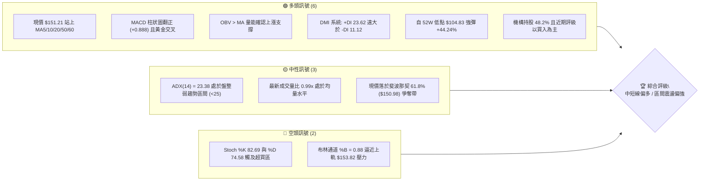
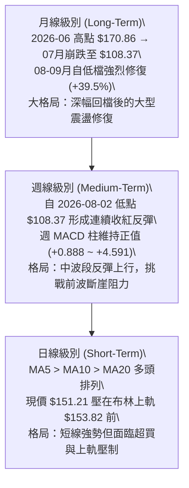
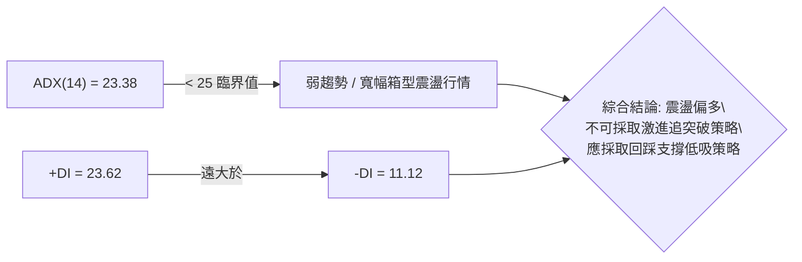
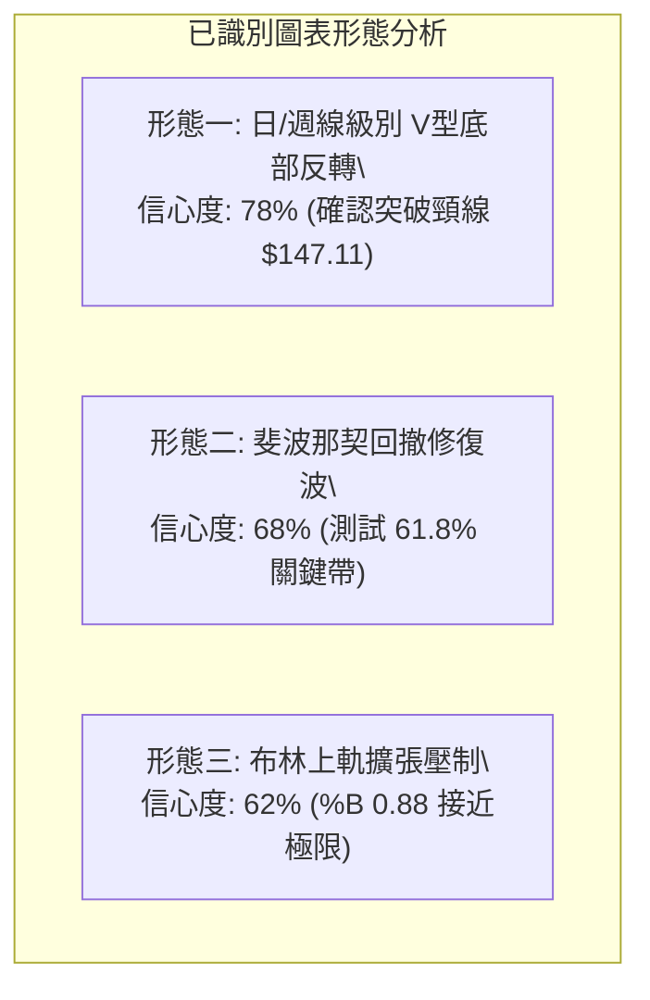
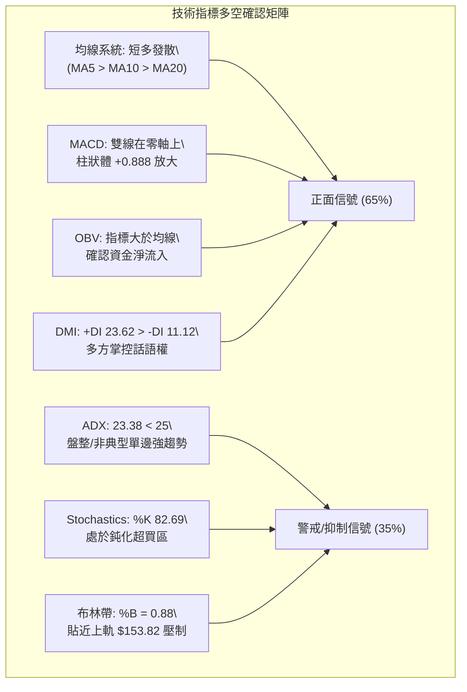
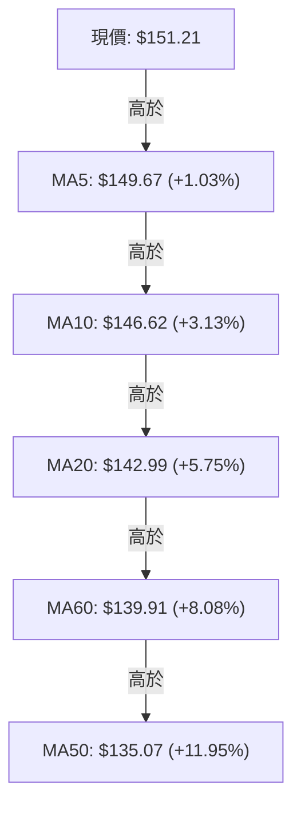
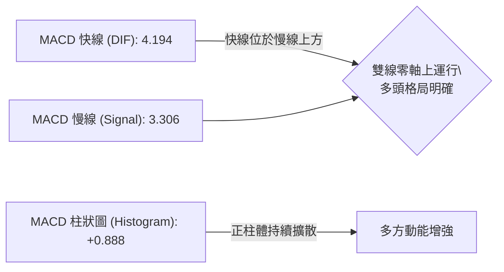
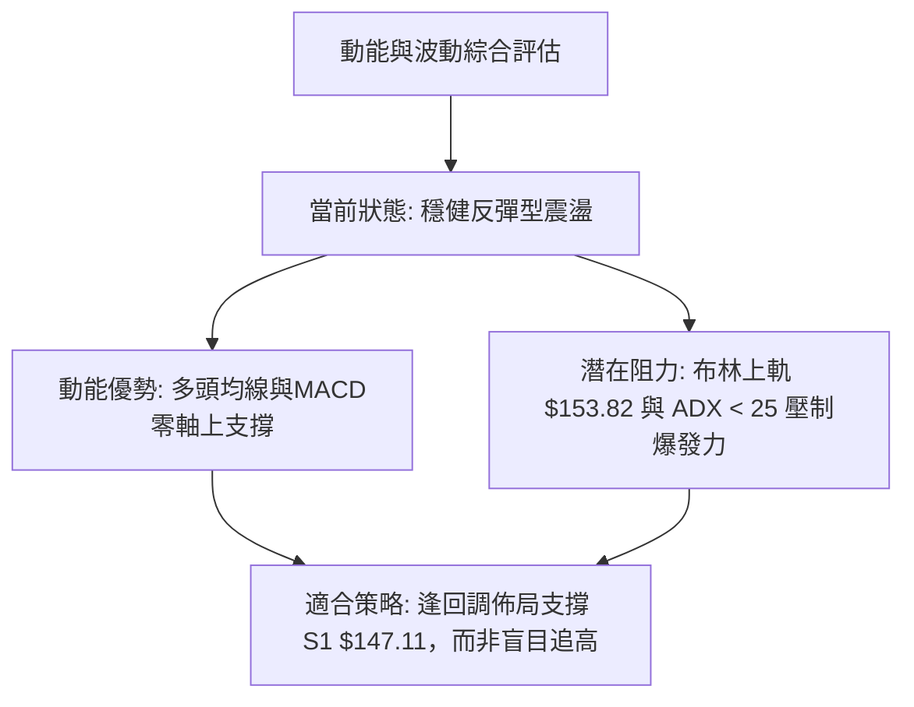
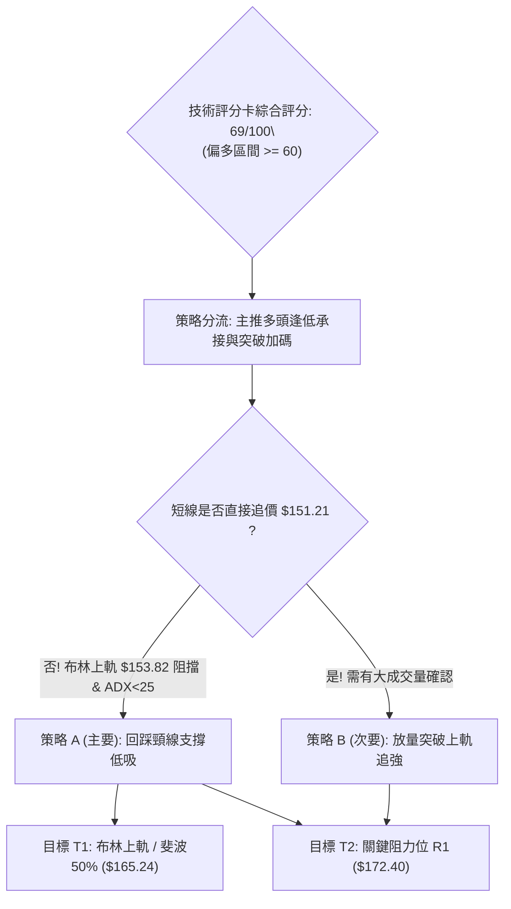
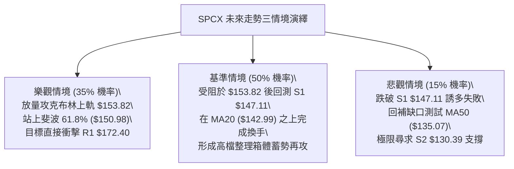

# SPCX 技術分析報告

> **報告日期**：2026-09-13 ｜ **語言**：繁體中文 ｜ **數據來源**：Yahoo Finance ｜ **當前價格**：$151.21

---

## 目錄

| 章節 | 內容 |
|------|------|
| [1. 技術面概覽](#1-技術面概覽) | 訊號儀表板、核心指標、評分卡 |
| [2. 趨勢分析](#2-趨勢分析) | 多時框趨勢、長中短期走勢 |
| [3. 圖表形態分析](#3-圖表形態分析) | 形態識別、K線組合、目標價 |
| [4. 支撐與阻力](#4-支撐與阻力) | 關鍵價位、斐波那契回調 |
| [5. 技術指標深度解讀](#5-技術指標深度解讀) | MA/RSI/MACD/布林/成交量 |
| [6. 動能與波動率](#6-動能與波動率) | 動能評估、ATR、Beta |
| [7. 多時框架總結](#7-多時框架總結) | 時框架評分矩陣 |
| [8. 交易策略建議](#8-交易策略建議) | 多空策略、風險報酬比 |
| [9. 風險提示與監控](#9-風險提示與監控) | 監控指標、風險場景 |
| [📋 報告總結](#-報告總結) | 報告精華速覽與執行清單 |

---

## 1. 技術面概覽

### 🎯 技術訊號儀表板



### 📊 核心指標速覽表

| 指標類別 | 指標名稱 | 當前數值 | 訊號 | 解讀 |
|----------|----------|----------|------|------|
| **價格** | 當前價格 | $151.21 | 🟢 | 自8月低點反彈強勁，收復多條短中期均線 |
| **均線** | MA20 | $142.99 | 🟢 | 現價高於 MA20 達 +5.75%，短線上升斜率陡峭 |
| **均線** | MA50 | $135.07 | 🟢 | 現價高於 MA50 達 +11.95%，中期底部確立 |
| **均線** | MA200 | $N/A | 🟡 | 上市資料不足240筆，無長期年線參考，以週線為準 |
| **動能** | RSI(14) | 68.00 | 🟡 | 接近 70 警戒線，多方動能充沛但面臨短線獲利回吐 |
| **動能** | MACD | 4.194 (柱 +0.888) | 🟢 | 快線大於慢線(3.306)，柱狀圖持續在零軸之上運行 |
| **波動** | ATR(14) | $6.13 (4.05%) | 🟡 | 波動度處於中等水準，單日防守緩衝建議以 1.0~1.5 ATR 衡量 |

### 🏆 技術評分卡

```
╔══════════════════════════════════════════════════════════════╗
║                技術評分卡 — SPCX (2026-09-13)                ║
╠══════════════════════════════════════════════════════════════╣
║ 趨勢強度      ████████████░░░░░░░░  60/100  🟡 盤整趨勢偏強  ║
║ 動能指標      ██████████████░░░░░░  70/100  🟢 動能充沛超買  ║
║ 支撐穩定度    ████████████████░░░░  80/100  🟢 底部結構扎實  ║
║ 成交量配合    ████████████░░░░░░░░  62/100  🟡 均量平穩換手  ║
║ 形態完整度    ██████████████░░░░░░  72/100  🟢 V型反轉成形   ║
║ 均線排列      ██████████████░░░░░░  70/100  🟢 短均多頭排列  ║
╠══════════════════════════════════════════════════════════════╣
║ 綜合評分      ██████████████░░░░░░  69/100  🟢 偏多主導      ║
╚══════════════════════════════════════════════════════════════╝
```

---

## 2. 趨勢分析

### 🌐 多時框趨勢分析



### 📈 長期趨勢 — 12個月走勢圖（Unicode）

```
SPCX 月線走勢圖（歷史區間與近月收盤）
價格軸 ($)
$225.64 ┤                    ● (52W 峰值)
$197.13 ┤                ╱      ╲
$170.86 ┤  ● (2026-06)  ╱        ╲
$151.21 ┤━━┿━━━━━━━━━━━┿━━━━━━━━━━● (現價 2026-09)
$143.69 ┤  │           │        ╱  (2026-08)
$108.37 ┤  │           ●───────╯   (2026-07 收盤低點)
$104.83 ┤  │       (52W 最低點)
        └──────────────────────────────────────────
           2026-06   2026-07   2026-08   2026-09
```

**走勢特徵分析表格**：

| 時間區間 | 收盤價變動 | 期間漲跌幅 | 成交與動能特徵 | 結構評估 |
|----------|------------|------------|----------------|----------|
| **2026-06 至 2026-07** | $170.86 → $108.37 | -36.57% | 空方放量重挫，週 RSI 一度跌破 20 嚴重超賣 | 恐慌拋售與流動性清洗 |
| **2026-07 至 2026-08** | $108.37 → $143.69 | +32.59% | 底部爆量承接，週成交量突破 9.2 億股，MACD 翻正 | 築底完成，V 型報復性反彈 |
| **2026-08 至 2026-09** | $143.69 → $151.21 | +5.23% | 量能回落至中性換手，價格推升穿透 MA50 ($135.07) | 趨勢進入阻力消化期 |

### 📊 中期趨勢（週線分析）

中期技術面呈現典型的**「暴跌後急速回血」**形態。自 2026-07-26 週低點（RSI 15.9）與 2026-08-02 週收盤 $108.37 起，買盤大舉湧入，推動週線走出連五揚架構。

```
週線關鍵阻力與支撐示意圖
$172.40 ───┬────────────────────────────────────────── 關鍵阻力 R1 (前波放量套牢區)
           │
$153.82 ───┼─ ─ ─ ─ ─ ─ ─ ─ ─ ─ ─ ─ ─ ─ ─ ─ ─ ─ ─ ─ ─ 日線布林上軌
$151.21 ───┼─────────────────────────── ● 現價 ($151.21，穿透 61.8% 斐波位)
$147.11 ───┼────────────────────────────────────────── 近期波段支撐 S1
           │
$135.07 ───┴─ ─ ─ ─ ─ ─ ─ ─ ─ ─ ─ ─ ─ ─ ─ ─ ─ ─ ─ ─ ─ 中期生命線 (MA50)
$130.39 ────────────────────────────────────────────── 強支撐 S2 (斐波 78.6% $130.68)
```

### ⚡ 趨勢強度評估（ADX 解讀）



**ADX 趨勢強度指標對照表**：

| 指標變數 | 當前讀數 | 標準門檻 | 狀態研判 | 交易指引 |
|----------|----------|----------|----------|----------|
| **ADX(14)** | 23.38 | 25.00 | 弱趨勢 / 盤整區間 | 趨勢追價風險高，以邊界低吸高拋為主 |
| **+DI (多方動向)** | 23.62 | 20.00 | 多方佔據主導優勢 | 空單不可長抱，多單持股續抱 |
| **-DI (空方動向)** | 11.12 | 20.00 | 空方動能完全渙散 | 下行空間受到強烈抵抗 |
| **方向差距 (+DI - -DI)**| +12.50 | 0.00 | 多方淨勝差擴大 | 盤整向上傾斜，多頭控制局面 |

---

## 3. 圖表形態分析

### 🔍 形態識別系統



**形態信心度評估表格**（嚴格遵守規則 15）：

| 形態名稱 | 信心度 | 判斷依據（引用技術數據） | 完成度 | 目標價（附嚴謹計算式） |
|----------|--------|--------------------------|--------|------------------------|
| **V型低檔反轉** | 78% | 自 52W 低點 $104.83 暴力反彈，連續突破 MA20 ($142.99) 與 MA50 ($135.07)，週成交量在反彈初期爆出 9.20 億股確認。 | 85% | 頸線 S1 ($147.11) + 形態垂直高度 ($147.11 - $104.83 = $42.28) = **$189.39**（中長線等幅目標，受阻於 R1 $172.40） |
| **箱體突破回踩** | 62% | 8月中旬於 $133.11~$141.50 震盪，9月初收盤突破至 $151.21，突破原整理箱頂。 | 70% | 整理箱底 $130.39 (S2) 至頂部 $147.11 (S1)，向上推算目標 $147.11 + ($147.11 - $130.39 = $16.72) = **$163.83** |
| **複雜幾何形態 (頭肩/旗形)** | <40% | 數據時間跨度不足 120 筆日線，無完整左肩與右肩結構。 | 0% | *訊號不足，僅做指標型與均線系統解讀* |

### 🕯️ 重要K線形態分析

| 統計週/月 | 收盤價 | 核心 K 線形態 | 技術解讀 | 訊號 |
|-----------|--------|---------------|----------|------|
| **2026-07-26** | $115.07 | 長陰加速趕底線 | 週 RSI 探底至 15.9 極度恐慌區，空頭動能釋放完畢 | 🔴 恐慌極限 |
| **2026-08-02** | $108.37 | 探底長下影錘頭星 | 觸及 52W 低點 $104.83 後獲利了結盤與低吸盤進場 | 🟡 止跌訊號 |
| **2026-08-09** | $133.11 | 巨量吞噬長陽線 | 單週暴漲 +22.8%，成交量 9.20 億股，確立實質反轉 | 🟢 強烈買訊 |
| **2026-09-06** | $147.95 | 中陽實體突破線 | 突破 S1 頸線與 MA20，週 MACD 維持紅柱運行 | 🟢 延續多頭 |
| **2026-09-13** | $151.21 | 縮量小陽星線 | 逼近布林上軌，高檔出現獲利結套換手，上攻速率趨緩 | 🟡 震盪整理 |

### 📉 ASCII 走勢形態示意圖

```
SPCX V型反轉與短期頸線突破結構圖
價格 ($)
$172.40 ┤                                                    [阻力 R1]
$163.83 ┤                                             . ‧ *  [箱體投射目標]
$153.82 ┤                                       . ‧ *        [布林上軌]
$151.21 ┤                                  ● ◄─── (現價測試上軌壓)
$147.11 ┤                           . ‧ ───┼──────────────── [頸線 / 支撐 S1]
$142.99 ┤                       . ‧        │                [MA20]
$135.07 ┤                   . ‧            │                [MA50]
$108.37 ┤            ●  . ‧               │                [反轉點]
$104.83 ┤  ●───────╯                      │                [52W 最低點]
        └──────────────────────────────────┴─────────────────────────
         07/26     08/02    08/09        09/06     09/13
```

### 🎯 形態目標價計算

1. **V型反轉等幅測量目標**：
   - 基底低點：$104.83
   - 突破頸線：$147.11
   - 形態高度 $H = \$147.11 - \$104.83 = \$42.28$
   - 理論推算目標 $T_{max} = \$147.11 + \$42.28 = \$189.39$
   - 階段路徑驗證：該目標將直接遭遇近一年波段高點聚類形成的**強阻力位 R1: $172.40**。

2. **短線震盪箱體擴展目標**：
   - 8月整理平台低點：$130.39 (S2)
   - 整理平台高點：$147.11 (S1)
   - 箱體高度 $h = \$147.11 - \$130.39 = \$16.72$
   - 短線第一目標 $T_1 = \$147.11 + \$16.72 = \$163.83$（恰好貼近斐波那契 50.0% 回調位 $165.24）。

---

## 4. 支撐與阻力

### 🗺️ 關鍵價位分布圖（Unicode）

```
SPCX 價位結構分布圖
═══════════════════════════════════════════════════════════════
$225.64 ║██████████████████████████████║ 52週歷史高點 (0.0% 斐波位)
$197.13 ║██████████████████            ║ 斐波那契 23.6% 回調壓力位
$179.49 ║████████████████████          ║ 斐波那契 38.2% 回調壓力位
$172.40 ║██████████████████████████████║ 關鍵阻力位 R1 (波段高點聚類)
$165.24 ║██████████████                ║ 斐波那契 50.0% 中樞平衡位
$153.82 ║▓▓▓▓▓▓▓▓▓▓▓▓▓▓▓▓              ║ 短線動態壓力 (布林通道上軌)
$151.21 ╠══════════════════════════════╣ ◄ 現價位置 (斐波 61.8% $150.98)
$147.11 ║▓▓▓▓▓▓▓▓▓▓▓▓▓▓▓▓▓▓▓▓          ║ 第一道波段支撐 S1 (近期突破頸線)
$142.99 ║▓▓▓▓▓▓▓▓▓▓▓▓▓▓                ║ 動態生命線 (MA20 / 布林中軌)
$135.07 ║██████████████                ║ 中期防守線 (MA50 趨勢線)
$130.39 ║██████████████████████████    ║ 強支撐 S2 (波段低點 / 斐波 78.6%)
$104.83 ║██████████████████████████████║ 極限防守底線 S3 (52週最低點)
═══════════════════════════════════════════════════════════════
```

### 🚧 阻力位分析表

| 阻力級別 | 價位 | 形成原因 | 突破難度 | 重要性 |
|----------|------|----------|----------|--------|
| **短線動態壓** | $153.82 | 日線布林通道上軌（20日標準差上緣） | 🟡 中等（面臨指標過熱回踩） | ★★★☆☆ |
| **波段阻力 R1** | $172.40 | 近一年波段高點聚類（2026-06月大量套牢籌碼峰） | 🔴 極高（需補量至日成交破億） | ★★★★★ |
| **延伸阻力** | $179.49 | 斐波那契 38.2% 回調位 | 🔴 高（解套賣壓帶） | ★★★★☆ |
| **極端阻力** | $225.64 | 52週最高點（0.0% 回調點） | 🔴 極難（長期牛市延伸位） | ★★★☆☆ |

### 🛡️ 支撐位分析表

| 支撐級別 | 價位 | 形成原因 | 守住機率 | 重要性 |
|----------|------|----------|----------|--------|
| **即時支撐 S1** | $147.11 | 近一年波段低點聚類轉化支撐，9月初突破頸線 | 🟢 75% | ★★★★☆ |
| **中期支撐 S2** | $130.39 | 8月起漲箱體下緣聚類，近斐波 78.6% ($130.68) | 🟢 85% | ★★★★★ |
| **極限底線 S3** | $104.83 | 52週歷史最低點（100.0% 斐波位），估值底部 | 🟢 95% | ★★★★★ |

### 📐 斐波那契回調位分析

依據 52 週波動區間（高點 **$225.64** → 低點 **$104.83**，波幅 $120.81）計算之標準斐波那契矩陣：

```
斐波那契回調層級分布 ($104.83 - $225.64)
0.0%  (52W High) ───────────────────────── $225.64 (遠期多頭終極目標)
23.6%            ───────────────────────── $197.13 (超強動能擴展位)
38.2%            ───────────────────────── $179.49 (次級阻力位)
50.0%            ───────────────────────── $165.24 (多空轉折分水嶺)
61.8% (黃金分割) ───────── ● ───────────── $150.98 ◄ 現價 $151.21 正於此微幅浮動
78.6%            ───────────────────────── $130.68 (對應強支撐 S2 $130.39)
100.0%(52W Low)  ───────────────────────── $104.83 (長期底部防線)
```

**解讀**：
- 現價 **$151.21** 精確卡在斐波那契 **61.8% ($150.98)** 之上僅 +0.15% 的位置。
- 在技術分析經典理論中，61.8% 為強大回撤阻力位。若能以日線連續收盤價站穩 $150.98 之上，依斐波那契波動路徑，下一站將直指 **50.0% 平衡中樞 $165.24**，進而挑戰 **R1 $172.40**。

---

## 5. 技術指標深度解讀

### 🎛️ 指標訊號總覽



### 📈 移動平均線排列分析



**移動平均線狀態剖析**：
- **短線結構**：MA5 ($149.67) > MA10 ($146.62) > MA20 ($142.99)，呈现陡峭的多頭發散排列，短期推升動能極具侵略性。
- **均線扣抵位置**：MA20 與 MA60 快速走揚，價格遠遠拉開與 MA50 ($135.07) 的距離，確立 2026-08 以來反彈的有效性。
- **中長均線缺失解讀**：因上市資料未達 120/240 筆，MA120 與 MA200 暫無數值。在缺乏 200 日年線的背景下，中長期多空完全受制於週線趨勢線與波段高低點 R1/S2。

### 📉 RSI(14) 分析

```
RSI(14) 動能進度條
超賣 (0)          中性分水嶺 (50)    當前值 (68)     超買 (100)
├───────────────────────┼───────────────●──────┤
[0] ░░░░░░░░░░░░░░░░░░░░▓▓▓▓▓▓▓▓▓▓▓▓▓▓▓▓█████░░ [100]  (68.00)
```

- **讀數狀態**：RSI(14) 目前位於 **68.00**，進入強勢區間（60~70），但距典型超買臨界點（70.00）僅咫尺之遙。
- **背離檢驗**：
  - 前期週線低點（2026-07-26）RSI 為 15.9，隨後伴隨價格 $108.37 形成 RSI 底背離反彈（RSI 升至 19.2 後急攻至 57.4）。
  - 當前日線與週線層面：價格自 8 月底 $141.50 升至 $151.21，週 RSI 亦由 52.5 爬升至 68.0，**並無頂背離現象**，確認此波上漲屬於動能驅動的健康修復行情。

### 📊 MACD(12/26/9) 訊號解讀



- **數值**：MACD 線 4.194，訊號線 3.306，差離值柱狀圖為 **+0.888**。
- **趨勢意義**：MACD 自 8 月初由負轉正後（2026-08-09 週柱狀圖 +2.330），指標長達 6 週未曾跌破零軸。即便近期柱體自高點稍有縮減，但仍穩定維持在正向象限，多頭循環並未結束。

### 📦 布林通道分析

```
SPCX 日線布林通道 (20, 2) 結構分布
────────────────────────────────────────────────────
$153.82  ┬  ════════════════════════════════════ 上軌 (Upper)
         │       ●  現價 $151.21 (%B = 0.88)
         │   
$142.99  ┼  - - - - - - - - - - - - - - - - - - - 中軌 (MA20 Baseline)
         │   
         │   
$132.17  ┴  ════════════════════════════════════ 下軌 (Lower)
────────────────────────────────────────────────────
當前通道帶寬 (Bandwidth) = ($153.82 - $132.17) / $142.99 = 15.14%
```

- **%B 位置判讀**：當前 **%B = 0.88**。在波動率統計中，%B 超過 0.80 屬於高風險區間，代表價格已緊貼上軌運行。除非爆發增量行情引發「布林帶開口向上擴張」，否則價格短期容易在上軌 **$153.82** 處遭遇牽引回壓，向中軌 **$142.99** 收斂。

### 💹 成交量分析（量價配合度）

- **量能規模**：
  - 最新單日成交量：**78,876,800 股**
  - 20日均量 (MA20 Volume)：**79,953,730 股**
  - 50日均量 (MA50 Volume)：**91,390,554 股**
  - 當前量比：**0.99x**（幾乎完全契合 20 日均量）。
- **OBV (能量潮指標)**：
  - 數據明確反饋：`OBV > MA → 量能支撐上漲`。
  - 這意味著在 8 月初反彈以來，主動性買盤大於恐慌拋盤，資金並未在反彈過程中出現派發跡象，量價結構處於良性配合。

---

## 6. 動能與波動率

### ⚡ 動能評估

SPCX 當前在動能與波動率矩陣中處於**「強動能、中低波動」**的穩步推升態勢：

| 維度指標 | 實際數值 | 評估狀態 | 戰略含義 |
|----------|----------|----------|----------|
| **趨勢動能 (+DI / MACD)** | +DI 23.62 / MACD +0.888 | 🟢 強動能 | 多方主導，下檔買盤支撐強勁 |
| **震盪動能 (RSI / Stoch)** | RSI 68 / Stoch %K 82.69 | 🟡 邊際鈍化 | 處於技術性超買，提防假突破誘多 |
| **波動強度 (ADX)** | 23.38 (< 25) | 🟡 缺乏單邊趨勢 | 屬於通道震盪推進，非單邊噴發 |
| **波動幅度 (ATR)** | $6.13 (4.05%) | 🟢 波動受控 | 未出現流動性紊亂的極端波幅 |



### 📊 ATR 波動率分析

- **ATR(14) 讀數**：**$6.13**（佔股價比例 **4.05%**）。
- **日常價格擺動邊界**：意味著 SPCX 在常態交易日中，單日合理的平均真實波動區間約為上下 $6.13。
- **止損距離建議**：
  - **保守交易者**（1.5 倍 ATR）：$1.5 \times \$6.13 = \$9.20$，若以現價進場，建議止損緩衝設為 $151.21 - \$9.20 = \$142.01$（貼近 MA20 $142.99）。
  - **積極交易者**（1.0 倍 ATR）：$1.0 \times \$6.13 = \$6.13$，以進場點下浮 $6.13，約為 $145.08$（剛好保護在 S1 $147.11 之下）。

### 📐 Beta 與市場相關性

- **Beta 狀態**：目前數據源標記為 N/A（作為近年未滿期標的）。
- **籌碼架構評估**：
  - 總市值高達 **$1.99T**，流通股數 3.59B 股。
  - 機構持股佔比 **48.2%**，內部人持股 **12.7%**。
  - 融券做空比率（Short % Float）僅為 **2.8%**（Short Ratio 1.55 天），顯示市場機構目前並無大規模放空壓制的企圖。大型權值屬性決定了該股雖有高彈性，但已脫離妖股純炒作階段，走勢高度依賴大盤資金流與宏觀流動性。

---

## 7. 多時框架總結

### 📋 時框架評分表

| 時框架 | 趨勢方向 | 動能狀態 | 均線排列 | 關鍵幾何形態 | 綜合評分 | 操作指引 |
|--------|----------|----------|----------|--------------|----------|----------|
| **月線 (長期)** | 🟡 寬幅震盪修復 | 中性偏弱 (自大跌中修復) | 無200日線，距高點深跌 | 52W 區間 38.4% 低檔打底 | 55/100 | 長線分批建倉 |
| **週線 (中期)** | 🟢 多頭波段反彈 | 偏強 (週MACD正向、RSI 68) | 收復短期均線 | 連五陽 V 型修復底 | 72/100 | 波段持有續抱 |
| **日線 (短期)** | 🟢 震盪上行逼軌 | 轉入超買 (Stoch > 80) | 多頭發散排列 | 抵達布林上軌與61.8%位 | 68/100 | 禁止追高，等拉回 |

### 🔲 綜合訊號矩陣

```
SPCX 多時框訊號收斂矩陣
┌──────────────┬─────────────────┬─────────────────┬─────────────────┐
│ 分析維度     │ 短期 (1-5日)     │ 中期 (2-8週)     │ 長期 (3-12月)    │
├──────────────┼─────────────────┼─────────────────┼─────────────────┤
│ 價格位置     │ 🔴 逼近布林上軌 │ 🟢 脫離底部成本 │ 🟡 處於年波段中下部│
│ 均線系統     │ 🟢 均線多頭發散 │ 🟢 站回 MA50    │ 🟡 缺乏長年線確認│
│ 量價結構     │ 🟡 均量平移換手 │ 🟢 底部帶量吞噬 │ 🟢 OBV 穩步上升 │
│ 擺動指標     │ 🔴 短線指標超買 │ 🟢 週 MACD 零軸上│ 🟡 擺脫極度超賣 │
├──────────────┼─────────────────┼─────────────────┼─────────────────┤
│ 收斂評級     │ 🟡 中性防守     │ 🟢 明確偏多     │ 🟢 偏多積累     │
└──────────────┴─────────────────┴─────────────────┴─────────────────┘
```

### ⚖️ 多時框收斂結論（依規則 14 嚴格執行）

- **行情模式判斷**：ADX(14) 為 **23.38 (< 25)**，嚴格判定當前屬於**「盤整/寬幅區間行情」**而非單邊爆發之強趨勢。
- **主導收斂權限**：在盤整行情中，多時框收斂應**以日線布林通道上下軌 ($132.17 ~ $153.82) 為主要交易區間**。
- **時框衝突破解**：
  - 日線指標出現 Stochastics 82.69 超買與布林帶上軌 $153.82 壓制；
  - 週線則呈現扎實的連五陽修復，中期均線 MA50 ($135.07) 已被完全踩在腳下。
- **唯一方向性結論**：**【中短線偏多主導，但短線拒絕追價，主打支撐低吸】**。第 8 章之策略將全面依據綜合評分 **69/100**，採用偏多主導策略。

---

## 8. 交易策略建議

### 🗺️ 策略決策流程圖



### 🧭 策略路由

> **當前主策略方向 = 多頭偏多操作（依綜合技術評分 69/100 分流）**  
> 綜合評分達 69 分（≥60），空頭策略不得作為常規佈局，僅列為「反轉風險觸發點（對沖提示）」。

### 🎯 價格情境階梯（Price Scenarios）

價位嚴格引用關鍵價位與計算數據：

| 觸發條件 | 第一目標 | 後續延伸 | 情境含義 |
|----------|----------|----------|----------|
| **帶量突破 R1 $172.40** | 斐波 38.2% $179.49 | V型測算 $189.39 | 中期全面反轉，挑戰 $200 大關 |
| **放量站上上軌 $153.82** | 斐波 50.0% $165.24 | 阻力 R1 $172.40 | 短線波段多頭攻勢展開 |
| **現價 $151.21 區間震盪**| 布林上軌 $153.82 | 支撐 S1 $147.11 | 指標高檔鈍化換手，以時間換空間 |
| **失守 S1 $147.11** | MA20 $142.99 | 支撐 S2 $130.39 | 短多力竭，進入深幅回洗修正 |

### 📊 情境機率分佈

| 情境劇本 | 機率 | 主要依據 |
|----------|------|----------|
| **回踩蓄勢後繼續上行** | **60%** | MACD 柱翻正 (+0.888)、OBV 量能大於均線、+DI (23.62) 遠超 -DI (11.12)，底部結構完整。 |
| **受阻於布林上軌區間震盪** | **25%** | ADX 僅 23.38 處弱趨勢，%B 達 0.88，Stoch 82.69 超買，短線推升力道容易衰竭。 |
| **跌破關鍵支撐再探底** | **15%** | 機構評級均偏正向且持股近 50%，融券比率僅 2.8%，在未失守 S2 前，大幅破底機率極低。 |

### 🟢 主策略詳情

所有價位均直接引用數據中的支撐阻力與斐波那契點位：

| 策略要素 | 策略 A：支撐位拉回低吸（主推策略） | 策略 B：阻力位放量突破追價（次推策略） |
|----------|------------------------------------|----------------------------------------|
| **進場條件** | 股價回踩波段支撐 S1，出現日K止跌訊號 | 日K收盤實體放量穿透日線布林上軌 |
| **進場價格** | **$147.11**（支撐位 S1 精確值） | **$153.82**（布林上軌突破確認價） |
| **目標價 T1** | **$165.24**（斐波那契 50.0% 回調位） | **$165.24**（斐波那契 50.0% 回調位） |
| **目標價 T2** | **$172.40**（阻力位 R1 波段高點聚類） | **$172.40**（阻力位 R1 波段高點聚類） |
| **止損價格** | **$140.98**（S1 下浮 1.0 ATR: $147.11 - $6.13）| **$147.69**（進場價下浮 1.0 ATR: $153.82 - $6.13）|
| **風險空間** | $6.13 | $6.13 |
| **報酬空間 (T1)** | $18.13 | $11.42 |
| **報酬空間 (T2)** | $25.29 | $18.58 |
| **風險報酬比** | **1 : 2.96** (至 T1) / **1 : 4.13** (至 T2) | **1 : 1.86** (至 T1) / **1 : 3.03** (至 T2) |
| **成功機率** | **65%** | **55%** |
| **建議倉位** | **20% ~ 25%** 總資金 | **10% ~ 15%** 總資金 |

### 🔴 反向風險觸發點（對沖提示）

- **空頭觸發訊號**：若現價直接跌破波段頸線支撐 **$147.11 (S1)**，且日線 MACD 柱狀圖反轉翻綠。
- **防禦對沖動作**：跌破 $147.11 時，多單應無條件減倉 50%；若價格進一步擊穿 MA20 ($142.99) 與 MA50 ($135.07)，確認反彈失敗，多單全面停損清倉，並可於跌破 $135.07 後以輕倉建立空單防禦，目標下看 **S2 $130.39** 乃至 **S3 $104.83**。

### ⭐ 整體訊號強度評星

```
做多訊號強度：★★★★☆  (4/5星 — 短均線齊整多頭，MACD與OBV確認)
做空訊號強度：★☆☆☆☆  (1/5星 — 僅超買壓制，缺乏空方趨勢破位)
整體可信度：  ★★★★☆  (4/5星 — 底部爆量反彈型態明確，指標共振)
```

---

## 9. 風險提示與監控

### ✅ 關鍵監控指標 Checklist

```
╔══════════════════════════════════════════════════════════════╗
║              交易風控每日檢核清單 (SPCX 專用)                ║
╠══════════════════════════════════════════════════════════════╣
║ [ ] 價格是否成功守在第一道波段支撐 S1 ($147.11) 之上？       ║
║ [ ] 布林上軌 ($153.82) 是否形成有效壓制？留意假突破收長上影  ║
║ [ ] RSI(14) 突破 70 之後是否產生量價背離或快速回落？         ║
║ [ ] 日成交量是否萎縮至 50 日均量 ($91.39M) 的 70% 以下？      ║
║ [ ] MACD 柱狀圖數值 (+0.888) 是否連續三日遞減？              ║
║ [ ] ADX(14) 是否由 23.38 向上突破 25，確認新趨勢啟動？       ║
╚══════════════════════════════════════════════════════════════╝
```

### ⚠️ 風險場景分析



### 🛡️ 風險管理重要提醒

1. **拒絕情緒化追高**：當前股價貼近日線布林上軌（%B = 0.88），且隨機指標處於超買狀態（Stoch %K 82.69）。在 ADX 尚未站上 25 之前，強行追買在 $151.21~153.82 容易承受不必要的回撤風險。
2. **波動度保護規則**：單日真實波動區間 ATR 為 **$6.13**，任何進場點均不得將止損設在小於 1.0 倍 ATR ($6.13) 的空間內，否則極易被日內正常市場雜訊掃出場。
3. **資金倉位嚴格管控**：考量目前基本面 Operating Margin 仍為 -1.8%、TTM EPS 為 $-1.1，本波上漲屬於強技術性修復與市場流動性溢價推升，建議總持倉部位維持在 25% 以下，切勿使用高槓桿工具操作。

---

## 📋 報告總結

```
SPCX 技術分析報告總結
════════════════════════════════════════════════════════
報告日期：2026-09-13
當前價格：$151.21
分析評級：🟢 偏多主導（逢回調佈局支撐）

關鍵結論：
├─ 長期趨勢：🟡 52週深幅回檔後的估值修復期
├─ 中期趨勢：🟢 自 $104.83 底部反彈之強勢 V 型結構 (週MACD紅柱)
├─ 短期趨勢：🟢 短均線多頭發散，但逼近日線布林上軌 $153.82
├─ 關鍵支撐：S1: $147.11 ｜ S2: $130.39 ｜ S3: $104.83
├─ 關鍵阻力：布林上軌: $153.82 ｜ 阻力 R1: $172.40
└─ 分析師目標：均價 $220.68 (最高 $450.00 / 最低 $117.00)

最優策略組合：
1. 🥇 最佳機會（策略 A）：
   耐性等待價格回踩 S1 ($147.11) 附近低吸進場，
   設定止損 $140.98 (1.0 ATR 緩衝)，
   第一目標鎖定斐波那契 50.0% ($165.24)，
   第二目標波段阻力 R1 ($172.40)，
   風險報酬比高達 1 : 2.96 以上。

2. 🥈 次選機會（策略 B）：
   若伴隨突破巨量（日成交量突破 9,100 萬股），
   日K收盤突破布林上軌 $153.82 時右側順勢追進，
   止損 $147.69，目標看至 $165.24 ~ $172.40。

3. 🥉 保守選擇：
   觀望等待 ADX 指標由 23.38 向上穿越 25.00，
   待確認進入單邊強趨勢行情後再行進場。
════════════════════════════════════════════════════════
```

---

> ⚠️ **免責聲明**：本報告為技術分析研究，所有數據及估算均基於歷史價格與客觀技術指標運算。本報告**僅供研究與學術參考**，**不構成任何形式的投資要約或買賣建議**。投資有風險，交易決策應依個人風險承擔能力獨立判斷。

---

*報告生成時間：2026-09-13 ｜ 數據來源：Yahoo Finance ｜ 分析框架：多時框圖表與技術指標量化分析*