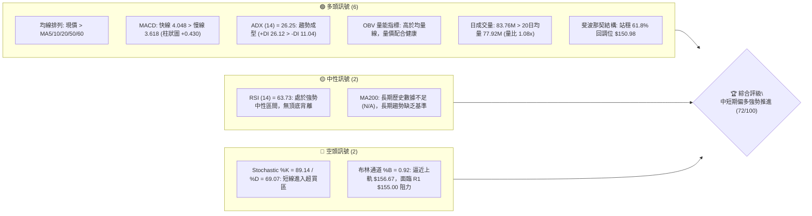
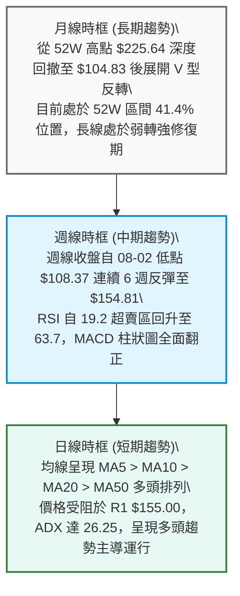
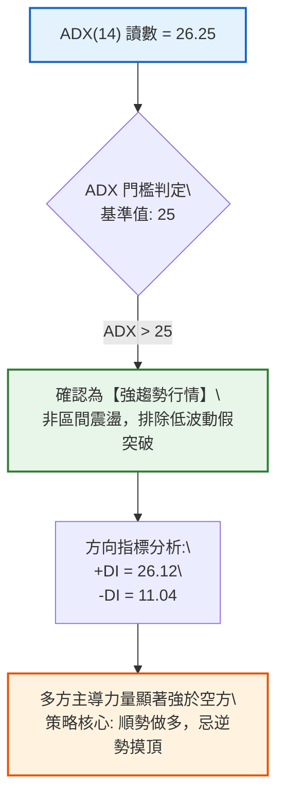
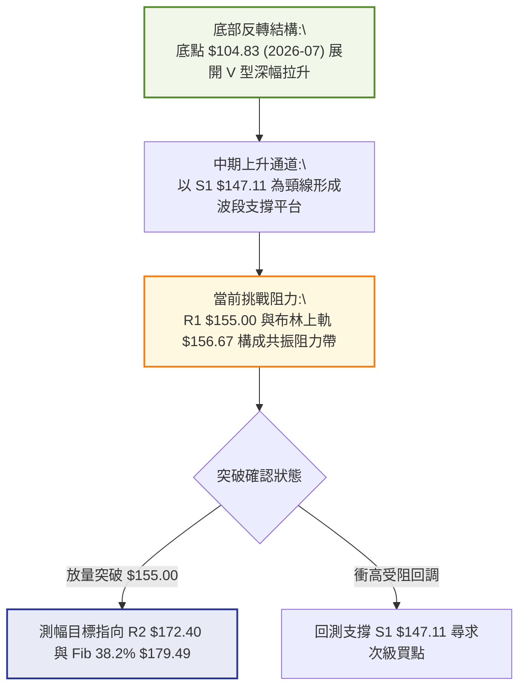
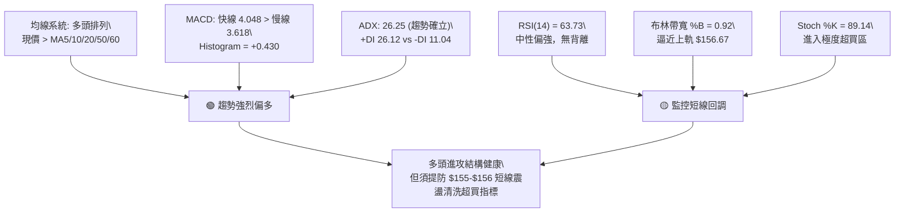
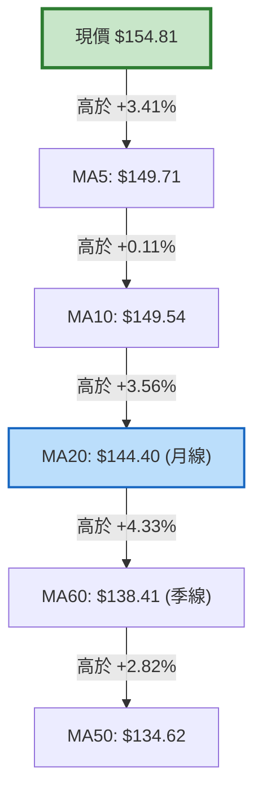
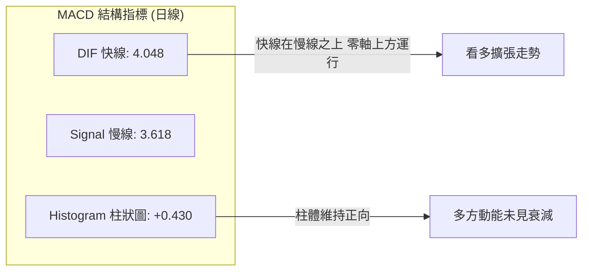
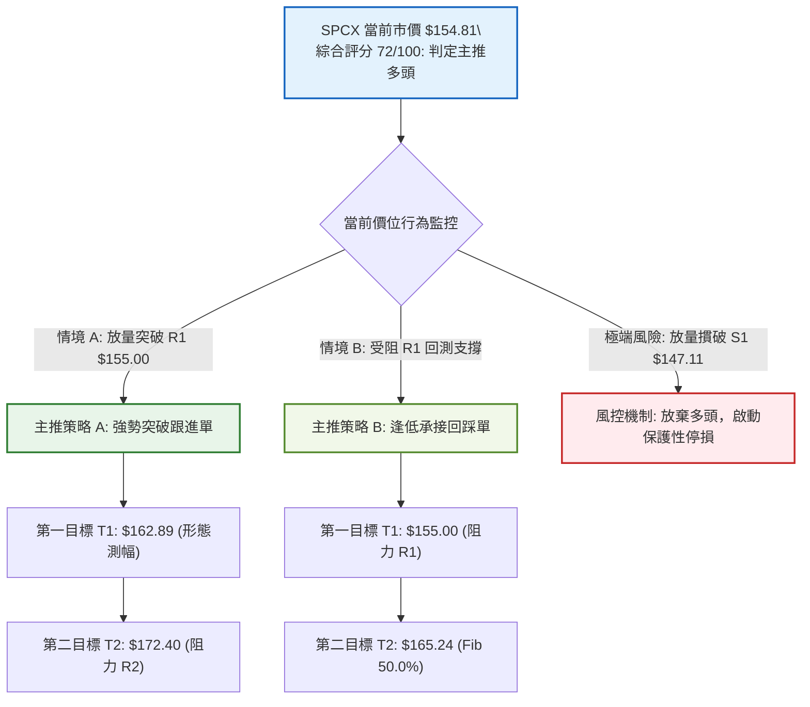
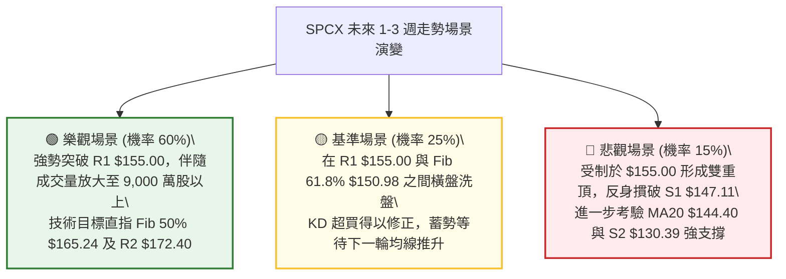

# SPCX 技術分析報告

> **報告日期**：2026-09-18 ｜ **語言**：繁體中文 ｜ **數據來源**：Yahoo Finance ｜ **當前價格**：$154.81

---

## 目錄

| 章節 | 內容 |
|------|------|
| [1. 技術面概覽](#1-技術面概覽) | 訊號儀表板、核心指標速覽、技術評分卡 |
| [2. 趨勢分析](#2-趨勢分析) | 多時框趨勢架構、12個月歷史走勢、週線與 ADX 強度 |
| [3. 圖表形態分析](#3-圖表形態分析) | 形態識別與信心度、K線組合、形態目標價測算 |
| [4. 支撐與阻力](#4-支撐與阻力) | 結構分布圖、密集區解析、斐波那契回調結構 |
| [5. 技術指標深度解讀](#5-技術指標深度解讀) | 均線系統、RSI/MACD 動能、布林通道與 OBV 量能 |
| [6. 動能與波動率](#6-動能與波動率) | 動能四象限、ATR 波動度風險定價、籌碼與 Beta 分析 |
| [7. 多時框架總結](#7-多時框架總結) | 時框矩陣、多時框收斂判定與單一方向性結論 |
| [8. 交易策略建議](#8-交易策略建議) | 策略路由、價格情境階梯、主推交易計畫與風控停損 |
| [9. 風險提示與監控](#9-風險提示與監控) | 關鍵監控清單、情境推演與部位管理紀律 |
| [📋 報告總結](#-報告總結) | 總結儀表板與執行結論 |

---

## 1. 技術面概覽

### 🎯 技術訊號儀表板



---

### 📊 核心指標速覽表

| 指標類別 | 指標名稱 | 當前數值 | 訊號 | 解讀 |
| :--- | :--- | :--- | :---: | :--- |
| **價格** | 當前收盤價 | $154.81 | 🟢 | 突破斐波那契 61.8% ($150.98)，正測試波段阻力 R1 ($155.00) |
| **短期均線** | MA5 / MA10 | $149.71 / $149.54 | 🟢 | 現價高於短期均線約 +3.41% 至 +3.52%，短線動能飽滿 |
| **中期均線** | MA20 (月線) | $144.40 | 🟢 | 現價高於 MA20 達 +7.21%，布林中軌支撐強勁 |
| **中期均線** | MA50 / MA60 | $134.62 / $138.41 | 🟢 | 均線呈現多頭排列，斜率顯著向上翻揚 |
| **長期均線** | MA200 | 資料不足 (N/A) | 🟡 | 數據中未偵測到 200 日線，中長期基底以 MA50/60 為核心錨點 |
| **動能震盪** | RSI(14) | 63.73 | 🟡 | 偏多運行且未進入嚴重超買 (>70)，動能健康延伸 |
| **動能震盪** | MACD (12,26,9)| 4.048 / 3.618 | 🟢 | DIF 線維持在 Signal 線上方，MACD 柱狀圖維持 +0.430 多方擴張 |
| **動能震盪** | KD (Stochastic)| 89.14 / 69.07 | 🔴 | %K 進入極度超買區，需警惕衝擊阻力位時的短線獲利回吐 |
| **趨勢強度** | ADX (14) / DI | 26.25 (+DI: 26.12)| 🟢 | ADX > 25 確認趨勢行情啟動，+DI 大幅壓制 -DI (11.04) |
| **通道軌道** | 布林通道帶寬 | 上軌 $156.67 / 下軌 $132.13 | 🔴 | %B 達 0.92，價格緊貼上軌運行，空間受制於上軌阻力 |
| **波動率** | ATR(14) | $6.79 (4.38%) | 🟡 | 每日波幅近 $6.8，設定停損需預留至少 1.5 倍至 2.0 倍 ATR 空間 |
| **成交量能** | 當日量 / 20日均量| 83.76M / 77.92M | 🟢 | 成交量溫和放大，量比 1.08x，OBV 高於均線，量價呈良性推升 |

---

### 🏆 技術評分卡

```
╔══════════════════════════════════════════════════════════════════╗
║                 SPCX 技術評分卡 (2026-09-18)                     ║
╠══════════════════════════════════════════════════════════════════╣
║ 趨勢強度 (ADX/趨勢方向)  ██████████████░░░░░░  72/100  🟢 偏多推升  ║
║ 動能指標 (MACD/RSI/KD)   ████████████░░░░░░░░  65/100  🟡 偏多超買  ║
║ 支撐穩定度 (S1-S3防守)   ████████████████░░░░  78/100  🟢 支撐穩固  ║
║ 成交量能配合 (OBV/量比)  ██████████████░░░░░░  70/100  🟢 溫和放量  ║
║ 形態完整度 (底型突破)    ████████████████░░░░  75/100  🟢 頸線站穩  ║
║ 均線排列系統 (MA5-MA60)  ██████████████░░░░░░  72/100  🟢 多頭排列  ║
╠══════════════════════════════════════════════════════════════════╣
║ 綜合技術評分             ██████████████░░░░░░  72/100  🟢 強勢多頭  ║
║ 策略主導方向             【 主推逢低做多 / 突破跟進策略 】         ║
╚══════════════════════════════════════════════════════════════════╝
```

---

## 2. 趨勢分析

### 🌐 多時框趨勢分析



---

### 📈 長期趨勢 — 12個月走勢圖（ASCII）

依據月度收盤與 52 週邊界數據，標記關鍵波段高低點與反彈路徑：

```
SPCX 歷史走勢示意圖（涵蓋近一年波段轉折）
價格軸 ($)
$225.64 ┤                    ● (52W 歷史峰頂 $225.64)
$200.00 ┤                     \
$179.49 ┤  ● (06月: $170.86)   \ (深度拋補期)
$154.81 ┤───\───────────────────\───────────────● (當前價格: $154.81)
$140.00 ┤    \                   \             ▲
$130.39 ┤     \                   \           ▲ (08月強勁反彈: $143.69)
$104.83 ┤      \                   ●─────────▲ (07月觸底: $108.37 / 52W Low: $104.83)
        └────────────────────────────────────────────────────────────► 時間軸
           2026-06              2026-07       2026-08       2026-09
```

#### 走勢特徵分析表格

| 階段週期 | 收盤價格變動 | 期間漲跌幅 | 形態特徵與動能演變 | 技術解讀 |
| :--- | :---: | :---: | :--- | :--- |
| **2026-06 高位拋售** | $170.86 | — | 自 52W 高點 $225.64 大幅跳水，跌破均線支撐 | 避險賣壓爆發，週 MACD 快速轉負 |
| **2026-07 探底恐慌** | $108.37 | -36.57% | 單月重挫，摜壓至 52W 最低點 $104.83，週 RSI 跌至 15.9 | 極端非理性拋售，嚴重超賣引發籌碼換手 |
| **2026-08 強力修復** | $143.69 | +32.59% | 底部出現長紅棒反轉，週成交量突破 9.2 億股 | 逢低買盤與機構資金湧入，形成 V 型底部 |
| **2026-09 震盪推升** | $154.81 | +7.74% | 突破斐波那契 61.8% ($150.98)，均線多頭排列確立 | 多頭趨勢成型，直面 $155.00 關鍵頸線壓力 |

---

### 📊 中期趨勢（週線分析）

中期走勢展現了明確的底部反轉形態。自 2026 年 8 月初確認 $104.83 的波段低點後，SPCX 出現了經典的放量反彈結構：

```
SPCX 週線支撐與壓力結構示意圖
══════════════════════════════════════════════════════════════════
 [壓力] R2: $172.40  ════════════════════════  波段前高密集成交壓力區
                     ▲
 [壓力] R1: $155.00  ───────┐ (現正面臨考驗)
                     ▼
 [現價] $154.81      ◄────── 當前收盤價位 (突破 Fib 61.8% $150.98)
                     ▲
 [支撐] S1: $147.11  ───────┴ 波段回踩第一道防線 / 前期整理平台頂部
                     ▼
 [支撐] S2: $130.39  ════════════════════════  MA50 / 週線波段起漲中樞
══════════════════════════════════════════════════════════════════
```

*   **量價背書**：2026-08-09 當週以 920,449,800 股的天量拉出大陽線（收 $133.11），徹底扭轉空方局勢。
*   **動能收斂**：MACD 週柱狀圖由 -3.362（07-19）翻正至 +4.591（08-16），最新週（09-20）為 +0.430，顯示雖然推升速度有所放緩，但多頭依然牢固掌握主導權。

---

### ⚡ 趨勢強度評估（ADX 解讀）



#### ADX 強度指標對照表

| 指標名稱 | 實際讀數 | 狀態門檻 | 趨勢解讀 |
| :--- | :---: | :---: | :--- |
| **ADX (14)** | **26.25** | > 25.00 | **進入強趨勢波段**。盤整行情結束，趨勢跟隨策略有效度提高 |
| **+DI (多方動能)** | **26.12** | > 20.00 | 多方買盤佔據絕對主導，動能健康向上 |
| **-DI (空方動能)** | **11.04** | < 15.00 | 空方壓制力極低，未見主動性機構拋盤 |
| **DI 差值 (+DI - -DI)**| **+15.08** | > 0 | 多頭優勢顯著，單邊推升波段具備延續性 |

---

## 3. 圖表形態分析

### 🔍 形態識別系統



#### 形態識別信心度與測算表格

| 識別形態 | 信心度 | 判斷依據（引用技術數據） | 當前完成度 | 形態目標價（測算公式） |
| :--- | :---: | :--- | :---: | :--- |
| **波段 V 底反轉** | **85%** | 2026-08-02 見低點 $108.37 (52W Low $104.83) 後，週成交量暴增至 9.2 億股拉出長陽線 | 100% (已完成) | 頸線 S1 $147.11 已被向上突破，多頭趨勢完全確立 |
| **短線上升三角 / 平台** | **75%** | 近三週低點逐步抬高（$141.50 → $147.95 → $151.21），水平壓力緊扣 R1 $155.00 | 80% (測試中) | 依形態高度 ($155.00 - $147.11 = $7.89) 向上推算：<br>目標價 = $155.00 + $7.89 = **$162.89** (貼近 Fib 50% $165.24) |
| **頭肩底形態** | **35%** | 數據中左肩與右肩對稱性不足，未形成標準三底幾何構型 | 訊號不足 | **數據不足以確認頭肩底**，僅作指標型趨勢與通道解讀 |

---

### 🕯️ 重要K線形態分析

| 週期/月份 | 收盤價 | 核心K線形態特徵 | 結構解讀 | 訊號判定 |
| :--- | :---: | :--- | :--- | :---: |
| **2026-07** | $108.37 | **長下影極限大陰線** | 測試 52W 低點 $104.83 後出現買盤抵抗，恐慌盤出清完畢 | 🟡 空頭力竭 |
| **2026-08** | $143.69 | **吞噬型放量大陽線** | 單月收復前月 80% 以上跌幅，伴隨巨量換手，確認底部成立 | 🟢 極強多頭 |
| **2026-09-06**| $147.95 | **實體突破陽線** | 收盤價站上 S1 ($147.11)，將原阻力位轉化為有效波段支撐 | 🟢 趨勢延續 |
| **2026-09-13**| $151.21 | **強勢推進紅K** | 越過斐波那契 61.8% ($150.98)，均線全面抬頭支撐 | 🟢 多方主導 |
| **2026-09-20**| $154.81 | **高位上影十字微陽** | 逼近 R1 $155.00，量能未現異常放大，短線存在解套盤解壓現象 | 🟡 阻力受挫 |

---

### 📉 ASCII 走勢形態示意圖

```
SPCX 近期上升中繼形態示意圖
══════════════════════════════════════════════════════════════════
 $156.67 ┤                                            BB 上軌
 $155.00 ┤                             ─────── R1 關鍵壓力線 (今日挑戰 $154.81)
 $151.21 ┤                         ╭──╯
 $147.11 ┤                   ╭────╯ ◄─────── S1 支撐位 (頸線突破點)
 $141.50 ┤             ╭─────╯
 $136.97 ┤       ╭─────╯ (回踩低點抬高 Higher Low)
 $130.39 ┤ ╭─────╯ ◄──────────────────────── S2 強支撐位
══════════════════════════════════════════════════════════════════
 形態標註：波段低點 $104.83 ──► $130.39 ──► $141.50 ──► $147.95 (低點墊高階梯)
```

---

### 🎯 形態目標價計算

根據日線波段整理形態計算垂直測幅高度：

1.  **基準形態**：短線箱型/上升三角整理平台。
2.  **形態底部支撐 (頸線)**：S1 = **$147.11**。
3.  **形態頂部壓力 (觸發點)**：R1 = **$155.00**。
4.  **形態垂直高度 (H)**：$155.00 - $147.11 = **$7.89**。
5.  **第一測幅目標價 (T1)**：
    $$\text{Target 1} = \text{突破點} + H = 155.00 + 7.89 = \mathbf{\$162.89}$$
    *(註：此位置緊扣斐波那契 50% 回調位 $165.24 之下軌)*
6.  **第二測幅目標價 (T2)**：引用波段阻力聚類 R2 = **$172.40** (距現價約 +11.36%)。

---

## 4. 支撐與阻力

### 🗺️ 關鍵價位分布圖（ASCII）

```
SPCX 關鍵價位空間結構圖
══════════════════════════════════════════════════════════════════
 $225.64 ║████████████████████████████████████████║ 52W 歷史最高點
 $197.13 ║████████████████████████                ║ Fib 23.6% 壓力
 $179.49 ║████████████████████████████            ║ Fib 38.2% 壓力
 $172.40 ║████████████████████████████████        ║ 強阻力 R2 (波段高點聚類)
 $165.24 ║████████████████                        ║ Fib 50.0% 多空平衡點
 $156.67 ║▒▒▒▒▒▒▒▒▒▒▒▒▒▒▒▒▒▒▒▒▒▒                  ║ 布林通道上軌
 $155.00 ║████████████████████████████████████    ║ 關鍵阻力 R1 (+0.12%)
─────────╫────────────────────────────────────────╫──────────────────────
 $154.81 ╠════════════════════════════════════════╣ ◄── 現價位置
─────────╫────────────────────────────────────────╫──────────────────────
 $150.98 ║▓▓▓▓▓▓▓▓▓▓▓▓▓▓▓▓▓▓▓▓                    ║ Fib 61.8% 黃金支撐位
 $147.11 ║▓▓▓▓▓▓▓▓▓▓▓▓▓▓▓▓▓▓▓▓▓▓▓▓▓▓▓▓▓▓▓▓▓▓▓▓    ║ 近期關鍵支撐 S1 (-4.97%)
 $144.40 ║▒▒▒▒▒▒▒▒▒▒▒▒▒▒▒▒                        ║ 布林中軌 / MA20
 $134.62 ║▒▒▒▒▒▒▒▒▒▒▒▒                            ║ 中期均線 MA50
 $130.39 ║▓▓▓▓▓▓▓▓▓▓▓▓▓▓▓▓▓▓▓▓▓▓▓▓▓▓▓▓            ║ 強支撐 S2 (-15.77%)
 $104.83 ║▓▓▓▓▓▓▓▓▓▓▓▓▓▓▓▓▓▓▓▓▓▓▓▓▓▓▓▓▓▓▓▓▓▓▓▓▓▓▓║ 52W 歷史最低點 S3
══════════════════════════════════════════════════════════════════
```

---

### 🚧 阻力位分析表

依據實際計算之波段高點聚類數據：

| 阻力級別 | 具體價位 | 距離現價幅度 | 形成原因與技術意涵 | 突破難度評估 | 重要性級別 |
| :--- | :---: | :---: | :--- | :---: | :---: |
| **關鍵阻力 R1** | **$155.00** | **+0.12%** | 近期高點密集聚類區，疊加布林通道上軌 ($156.67) 壓制 | 🟡 中等 (需放量) | ★★★★☆ |
| **波段阻力 R2** | **$172.40** | **+11.36%** | 2026年6月崩盤前之起跌平台中樞，歷史沉重套牢賣壓帶 | 🔴 極高 (需換手) | ★★★★★ |
| **終極阻力 52W**| **$225.64** | **+45.75%** | 52週歷史最高點，歷史牛市頂部斐波那契 0.0% 錨點 | 🔴 遠期目標 | ★★★☆☆ |

---

### 🛡️ 支撐位分析表

依據實際計算之波段低點聚類數據：

| 支撐級別 | 具體價位 | 距離現價幅度 | 形成原因與技術意涵 | 守住機率評估 | 重要性級別 |
| :--- | :---: | :---: | :--- | :---: | :---: |
| **近期支撐 S1** | **$147.11** | **-4.97%** | 前期盤整平台高點轉化為頸線支撐，接近 MA5 ($149.71) 與 MA10 ($149.54) | 🟢 85% (多頭防線) | ★★★★★ |
| **強支撐 S2** | **$130.39** | **-15.77%** | 8月起漲巨量換手區低點，疊加 MA50 ($134.62) 與布林下軌 ($132.13) | 🟢 92% (波段鐵底) | ★★★★★ |
| **極限底部 S3** | **$104.83** | **-32.28%** | 52週歷史絕對低點，極端超賣週期觸底之價值重估區 | 🟢 99% (長線底線) | ★★★☆☆ |

---

### 📐 斐波那契回調位分析

依據 52 週完整波動區間（高點 **$225.64** → 低點 **$104.83**，全區間振幅 $120.81）精確回調點陣：

```
斐波那契回調結構與現價定位
══════════════════════════════════════════════════════════════════
 0.0%  $225.64  ──────────────────────────── 52W 最高點
 23.6% $197.13  ──────────────────────────── 強勢延伸目標區間
 38.2% $179.49  ──────────────────────────── 中期反彈多空強弱分界線
 50.0% $165.24  ──────────────────────────── 半山腰多空均勻平衡中樞
══════════════════════════════════════════════════════════════════
 61.8% $150.98  ◄── 關鍵突破！現價 $154.81 已站上黃金分割 61.8%
══════════════════════════════════════════════════════════════════
 78.6% $130.68  ──────────────────────────── 底部回踩防守位 (緊扣 S2 $130.39)
 100.0% $104.83 ──────────────────────────── 52W 最低點
══════════════════════════════════════════════════════════════════
```

*   **現價落點解讀**：現價 **$154.81** 精確運行於 **61.8% ($150.98)** 與 **50.0% ($165.24)** 之間。
*   **技術戰略意義**：在經典技術分析中，自低點反彈能夠有效收復並站穩 61.8% 回調位，意味著自 $225.64 的跌勢已經由「弱勢反彈」質變為「趨勢反轉」。目前上方直接空間已打開至 50.0% 回調位 ($165.24)。

---

## 5. 技術指標深度解讀

### 🎛️ 指標訊號總覽



---

### 📈 移動平均線排列分析



*   **排列結構**：短中期呈現標準的完全多頭多層排列（MA5 > MA10 > MA20 > MA60 > MA50）。所有可觀測之均線均處於上升斜率。
*   **支撐動能**：MA20 現位於 $144.40，與現價形成 +7.21% 的健康乖離，未出現極端超買乖離過大（>15%）的失控風險。
*   **長期均線提示**：MA120、MA200 數據中顯示不足（N/A），因此中期 MA50 ($134.62) 承擔當前機構法人的牛熊生命線角色。

---

### 📉 RSI(14) 分析

```
RSI(14) 動能進度尺
0        20        40        60   63.73   80       100
├────────┼─────────┼─────────┼─────●────┼────────┤
  超賣區    弱勢區      中性區     │  強勢多頭區   超買區
                                  └─ 當前讀數: 63.73 (健康強勢)
```

*   **數值解讀**：RSI(14) 最新收盤讀數為 **63.73**，位於 60–70 的強勢多方推升區間，並未越過 70 的過熱警戒線。
*   **背離分析**：
    *   **頂背離**：無頂背離。價格創出波段反彈新高 ($154.81)，RSI 指標自 08-30 的 52.5 同步攀升至 63.73，斜率與價格高度正相關，未見頂背離衰竭跡象。
    *   **底背離**：回溯 2026 年 7 月底至 8 月初，RSI 自 15.9 劇烈抬升至 57.4，構築了扎實的底部動能翻轉。
*   **結論**：**動能無背離現象**，指標對目前的推升走勢提供正面支持。

---

### 📊 MACD(12,26,9) 訊號解讀



*   **數值表現**：DIF快線 (4.048) 穩居 DEA慢線 (3.618) 之上，兩者均在零軸上方運行，確認為**強勢多頭市場環境**。
*   **柱狀圖動態**：MACD Histogram 為 **+0.430**。觀察近四週週線柱狀圖變動（+2.143 → +1.082 → +1.130 → +0.888 → +0.430），雖然動能柱略有收窄，但完全沒有翻負。這反映了價格在測試 R1 ($155.00) 心理關卡時的減速消化，而非趨勢逆轉。

---

### 📦 布林通道分析

```
SPCX 布林通道 (20, 2) 結構圖
══════════════════════════════════════════════════════════════════
 $156.67 ┤ ------------------------------ 布林上軌 (阻力帶)
 $154.81 ┤                 ● ◄────────── 現價 (%B = 0.92，貼近軌道頂)
 $150.00 ┤                /
 $144.40 ┤ ─────────────○──────────────── 布林中軌 (MA20 強力支撐)
 $140.00 ┤              /
 $132.13 ┤ ------------------------------ 布林下軌 (安全底線)
══════════════════════════════════════════════════════════════════
 通道帶寬 (Bandwidth) = ($156.67 - $132.13) / $144.40 = 16.99% (處於喇叭口張開階段)
```

*   **軌道位置**：現價 $154.81 距離上軌 $156.67 僅剩 $1.86，**%B 數值達 0.92**。
*   **通道行為特徵**：當前處於布林通道向上開口擴張期（Band Opening）。依據布林交易法則，當 %B > 0.8 且 ADX > 25 時，此為典型的「沿軌上升（Walking the Bands）」強趨勢特徵，不應單純因觸及上軌而盲目做空，但需預防短線回踩中軌 $144.40 進行技術性乖離修正。

---

### 💹 成交量分析（量價配合度）

```
成交量動態分佈 (股數)
當日成交量:  83,764,900   ███████████████████ (量比: 1.08x)
20日平均量:  77,920,370   █████████████████░░
50日平均量:  90,164,990   ████████████████████
```

*   **量能配合**：最新單日成交量為 83,764,900 股，較 20 日均量 (77,920,370 股) 放大 1.08 倍，呈現「價漲量增」的健康態勢。
*   **OBV 能量潮判斷**：數據指出 **OBV > OBV_MA**。這表明自 8 月初反彈以來，主動性資金淨流入持續主導行情，未出現價格創新高而 OBV 反向下行的量價頂背離，量能有效確認了價格上漲趨勢的真實性。

---

## 6. 動能與波動率

### ⚡ 動能評估四象限

```
SPCX 動能與波動率定位矩陣
       高動能 (ADX > 25, RSI > 60)
             │
   Q3: 高風險高收益   │   Q1: 最佳多頭趨勢區
 (高波動 + 強動能)   │ (低波動 + 強動能)
                     │     ★ SPCX 當前落點 (ATR 4.38%, ADX 26.25)
─────────────────────┼─────────────────────
   Q4: 避免進場區     │   Q2: 謹慎觀望區
 (高波動 + 弱動能)   │ (低波動 + 弱動能)
             │
       低動能 (ADX < 25, RSI < 50)
   ◄── 高波動率 ─────┴───── 低/中等波動率 ──►
```

| 象限分區 | 動能狀態 | 波動狀態 | SPCX 判定 | 戰略應對方針 |
| :--- | :---: | :---: | :---: | :--- |
| **Q1 (當前位置)**| **強 (+DI 26.12)** | **中等可控 (ATR 4.38%)** | **✓ 符合** | **趨勢跟隨、順勢進場**。動能健康且未出現失控極端波動，具備最佳風險回報比 |
| **Q2** | 弱 | 低 | - | 不符合。非低迷盤整格局 |
| **Q3** | 強 | 極高 | - | 若 ATR 擴大至 8% 以上且大幅跳空時切換至此模式 |
| **Q4** | 弱 | 高 | - | 避開標的。非破位下跌環境 |

---

### 📊 ATR 波動率分析

*   **ATR(14) 絕對數值**：**$6.79**。
*   **波動比率 (ATR / 現價)**：$6.79 / $154.81 = **4.38%**，屬於中高波動的成長型航太國防/科技硬體標的。
*   **交易風控實戰定價**：
    *   **正常停損距離 (1.5 倍 ATR)**：$6.79 × 1.5 = **$10.19**。若現價進場，停損點應設於 $154.81 - $10.19 = **$144.62** (恰好保護於 MA20 $144.40 之上)。
    *   **寬鬆波動緩衝 (2.0 倍 ATR)**：$6.79 × 2.0 = **$13.58**。對應防守價位為 $154.81 - $13.58 = **$141.23**。

---

### 📐 Beta 與市場相關性

*   **Beta 指標**：數據顯示為 N/A（未提供）。
*   **籌碼結構與空頭壓力**：
    *   **空頭部位佔浮動股 (Short % Float)**：僅 **2.8%**，處於極低水平。
    *   **空頭補補日數 (Short Ratio)**：**1.55 天**。顯示目前空方並未形成沉重賣壓，亦無大規模放空對賭，空頭回補帶來的空頭擠壓（Short Squeeze）潛力較小，行情主要由基本面與機構資金主動買盤推進。
    *   **機構持股比例**：高達 **48.2%**，籌碼相對集中穩定，散戶非理性踐踏風險較低。

---

## 7. 多時框架總結

### 📋 時框架評分表

| 分析時框架 | 趨勢方向判定 | 動能狀態 | 均線系統狀態 | 圖表形態特徵 | 綜合評分 | 操作方針建議 |
| :--- | :---: | :---: | :---: | :---: | :---: | :--- |
| **長期時框 (月線)** | 🟡 跌深反彈築底 | 中性修復中 | MA50 支撐，MA200 缺損 | 52W 低點 $104.83 V型大反轉 | **65 / 100** | 長線分批建倉，持股觀望 |
| **中期時框 (週線)** | 🟢 多頭波段回升 | RSI 63.7 / MACD翻正 | 站穩週線短期均線 | 週線多頭排列，突破 S1 頸線 | **75 / 100** | 核心波段持有，不輕易下車 |
| **短期時框 (日線)** | 🟢 強勢趨勢上攻 | ADX 26.25 / KD 超買 | MA5-MA60 完全多頭 | 挑戰 R1 $155.00，貼布林上軌 | **72 / 100** | 逢回測 S1 支撐佈局，或突破追單 |

---

### 🔲 綜合訊號矩陣

```
SPCX 多時框訊號收斂矩陣
┌────────────────┬──────────┬──────────┬──────────┬────────────┐
│ 技術指標維度   │ 日線訊號 │ 週線訊號 │ 月線訊號 │ 一致性評級 │
├────────────────┼──────────┼──────────┼──────────┼────────────┤
│ 趨勢方向       │ 🟢 看多  │ 🟢 看多  │ 🟡 中性  │ 高度一致   │
│ 動能震盪       │ 🟡 超買  │ 🟢 看多  │ 🟢 修復  │ 溫和偏多   │
│ 均線系統       │ 🟢 多頭  │ 🟢 多頭  │ 🟡 中性  │ 多方主導   │
│ 量能結構       │ 🟢 量增  │ 🟢 巨量  │ 🟢 沉澱  │ 極度支持   │
│ 支撐防守       │ 🟢 穩固  │ 🟢 強勁  │ 🟢 鐵底  │ 風險可控   │
└────────────────┴──────────┴──────────┴──────────┴────────────┘
```

---

### ⚖️ 多時框收斂結論

嚴格遵循多時框收斂收斂規則：

1.  **市場機制判定**：當前日線 **ADX(14) 讀數為 26.25**（高於 25.00 門檻），系統確認當前 SPCX 處於**強趨勢波段行情**，而非低波動盤整。
2.  **時框收斂權重**：依規則，趨勢行情下必須以中長期時框方向為主導。週線自 $104.83 觸底以來連續放量收陽，MACD 柱狀圖全面站上正值，中長期方向完全確立為**多頭反轉與升勢確立**。
3.  **衝突調和**：日線 KD (89.14) 的超買與布林通道 %B (0.92) 的壓制僅代表「短期面臨 R1 $155.00 的微幅消化需求」，不能作為反向做空的依據，日線時框應嚴格作為**尋找右側進場或逢低加碼點位的執行工具**。
4.  **唯一確定結論**：**【強烈偏多 (Bullish Trend)】**。所有策略佈局均應以逢低買進或突破追多為主軸，絕對禁止逆勢摸頂。

---

## 8. 交易策略建議

### 🗺️ 策略決策流程圖



---

### 🧭 策略路由

> **當前主策略方向 = 【主推多頭策略】（依據第 1 章技術評分卡：72/100 強勢多頭評級）**
> 
> *註：鑑於綜合技術評分顯著高於 60 分閾值，本報告全面主推多頭進場與加碼計畫；空頭僅作為下行破位時之風控對沖警示，嚴禁主觀重倉做空。*

---

### 🎯 價格情境階梯（Price Scenarios）

以當前價格 **$154.81** 為中心錨點，完全引用已確立之關鍵數據階梯：

| 觸發條件 (Trigger) | 下一目標價位 | 後續延伸極限 | 行情情境含義與技術戰略解讀 |
| :--- | :---: | :---: | :--- |
| **有效放量突破 R1 $155.00** | **$162.89** (測幅目標) | **$172.40** (波段 R2) | 短線強勢多頭爆發，上軌壓制解除，邁向 Fib 50% ($165.24) |
| **站穩現價區間 ($150.98 - $155.00)**| **$156.67** (BB上軌) | **$165.24** (Fib 50%) | 消化 KD 超買指標，以時間換取空間的強勢中繼整理 |
| **失守 S1 $147.11 頸線** | **$144.40** (MA20) | **$130.39** (波段 S2) | 多頭波段動能減退，進入深幅拉回修整，考驗中期支撐 |

---

### 📊 情境機率分佈

```
情境預期機率分佈
繼續上行 / 突破挑戰 R2 (60%)  ████████████████████████░░░░░░░░░░░░░░░░
強勢區間震盪整理       (25%)  ██████████░░░░░░░░░░░░░░░░░░░░░░░░░░░░░░
深幅回調再探 S2        (15%)  ██████░░░░░░░░░░░░░░░░░░░░░░░░░░░░░░░░░░
```

| 情境類別 | 發生機率 | 主要技術與量化依據 |
| :--- | :---: | :--- |
| **繼續上行 / 突破反彈** | **60%** | ADX 26.25 確認強趨勢成型；MACD 柱狀圖維持 +0.430；OBV 持續在均線上方放量支撐，突破阻力 R1 為大概率事件。 |
| **強勢區間震盪** | **25%** | Stoch %K (89.14) 短線超買嚴重，疊加現價逼近布林上軌 ($156.67)，可能在 $150.98 - $155.00 進行 2-3 天小幅換手整理。 |
| **回落再探底部** | **15%** | 僅在突發重大黑天鵝跌破 S1 ($147.11) 且放量摜壓時發生，目前技術指標未展現任何崩跌徵兆。 |

---

### 🟢 主策略詳情

本報告設計兩套互補的多頭戰術，供不同風險偏好交易員採用：

| 策略要素 | 策略 A：突破順勢追擊策略 (Momentum Breakout) | 策略 B：支撐回踩低吸策略 (Pullback Buy) |
| :--- | :--- | :--- |
| **適用情境** | 適合積極型交易者，日線放量突破 R1 時啟動 | 適合穩健型交易者，等待指標消化後的低吸買點 |
| **進場觸發條件** | 日線盤中放量漲破 $155.00 且 30 分鐘線收穩 | 價格回測 S1 附近出現止跌紅K線抵抗 |
| **精確進場價格** | **$155.20** (突破確認進場點) | **$148.00** (靠近 S1 $147.11 支撐上方) |
| **目標價 T1** | **$162.89** (形態測幅目標價) | **$155.00** (近期波段阻力 R1) |
| **目標價 T2** | **$172.40** (波段阻力 R2) | **$165.24** (斐波那契 50.0% 回調位) |
| **嚴格止損價格** | **$149.50** (跌破 MA10 均線防守點) | **$143.50** (跌破布林中軌 MA20 $144.40) |
| **承擔風險幅度** | -$5.70 (-3.67%) | -$4.50 (-3.04%) |
| **獲利空間 (至 T2)** | +$17.20 (+11.08%) | +$17.24 (+11.65%) |
| **風險報酬比 (R:R)**| **1 : 3.02 (極佳)** | **1 : 3.83 (極佳)** |
| **技術勝率評估** | **65%** | **70%** |
| **建議總倉位上限** | **15%** | **20%** |

---

### 🔴 反向風險觸發點（對沖提示）

若市場出現以下訊號，多頭主策略宣告失效，應嚴格執行止損或對沖保護：

1.  **第一警訊**：日線收盤價跌破支撐 **S1 $147.11**，且單日成交量超過 9,000 萬股（量能異常放大）。
2.  **全面離場線**：失守布林中軌與 MA20 共振支撐 **$144.40**。此時多頭均線結構將遭到破壞，趨勢將降級為寬幅震盪，所有多單應無條件止損離場，空手觀望至 S2 ($130.39)。

---

### ⭐ 整體訊號強度評星

```
╔══════════════════════════════════════════════════╗
║              SPCX 技術訊號綜合評星               ║
╠══════════════════════════════════════════════════╣
║ 做多訊號強度：★★★★☆  (4.0/5.0 星) — 趨勢明確     ║
║ 做空訊號強度：★☆☆☆☆  (1.0/5.0 星) — 極度逆勢     ║
║ 整體技術可信度：★★★★☆  (4.2/5.0 星) — 量價互相背書 ║
╚══════════════════════════════════════════════════╝
```

---

## 9. 風險提示與監控

### ✅ 關鍵監控指標 Checklist

```
╔══════════════════════════════════════════════════════════════════╗
║                   SPCX 日常交易技術風控清單                      ║
╠══════════════════════════════════════════════════════════════════╣
║ [ ] 價格突破監控：觀察收盤價是否能收於 R1 $155.00 上方            ║
║ [ ] 超買消化檢視：KD %K (89.14) 是否出現高檔鈍化或死叉拉回       ║
║ [ ] 布林軌道壓制：現價貼近上軌 $156.67，是否出現長上影線衰竭      ║
║ [ ] 均線生命線：MA20 ($144.40) 是否維持穩定的向上發散斜率         ║
║ [ ] 支撐防守測試：回調過程中 S1 ($147.11) 是否具備充沛承接盤     ║
║ [ ] 量能異動預警：單日成交量若突然萎縮至 5,000 萬股以下，警惕動能 ║
╚══════════════════════════════════════════════════════════════════╝
```

---

### ⚠️ 風險場景分析



---

### 🛡️ 風險管理重要提醒

1.  **單筆交易部位控制**：
    鑑於 ATR 達 $6.79 (4.38%)，標的日內波動劇烈。建議單筆交易虧損金額不得超過總帳戶淨值的 **1.5% - 2.0%**。
2.  **部位規模計算公式**：
    $$\text{部位股數} = \frac{\text{帳戶淨值} \times 1.5\%}{\text{進場價} - \text{止損價}}$$
    以採用策略 A（進場 $155.20，止損 $149.50，每股風險 $5.70）為例，若帳戶規模為 100,000 美元，可承擔風險為 1,500 美元，則建議持倉股數應嚴格限制在：
    $$\text{持股數} = \frac{1,500}{5.70} \approx 263 \text{ 股 (約 \$40,817 市值，約 40% 帳戶槓桿倉位)}$$
3.  **嚴禁逆勢加碼（Martingale）**：
    若行情跌破 S1 ($147.11)，嚴禁在未見明確止跌訊號前逢低攤平，務必按照風控紀律減倉或嚴格執行止損。

---

## 📋 報告總結

```
╔══════════════════════════════════════════════════════════════════╗
║                   SPCX 技術分析報告終極總結                      ║
╠══════════════════════════════════════════════════════════════════╣
║ 報告日期：2026-09-18                                             ║
║ 當前價格：$154.81 (全日測試突破關鍵壓力位)                        ║
║ 綜合評級：🟢 強勢偏多 (技術總評分: 72/100)                       ║
╠══════════════════════════════════════════════════════════════════╣
║ 關鍵技術維度結論：                                               ║
║ ├─ 長期趨勢：🟡 自 52W 低點 $104.83 強勁修復，底部結構穩固       ║
║ ├─ 中期趨勢：🟢 週線反彈格局強烈，突破 Fib 61.8% ($150.98)      ║
║ ├─ 短期趨勢：🟢 均線多頭排列 (MA5-MA60)，ADX 26.25 確立趨勢      ║
║ ├─ 關鍵支撐：S1 $147.11 (第一道防線) │ S2 $130.39 (強支撐)      ║
║ ├─ 關鍵阻力：R1 $155.00 (即時壓力)  │ R2 $172.40 (波段大阻力)    ║
║ └─ 分析師目標價共識：均價 $222.42 (最高 $450.00 / 最低 $140.00)  ║
╠══════════════════════════════════════════════════════════════════╣
║ 執行戰術排序：                                                   ║
║ 1. 🥇 最佳機會：等待放量突破 $155.00，跟進追多至 $162.89 / $172.40║
║ 2. 🥈 次選機會：掛單於 $148.00 逢低承接回踩 S1 頸線支撐買點      ║
║ 3. 🥉 保守選擇：多單底倉持有，移動止損上移至 $144.40 鎖定利潤     ║
╚══════════════════════════════════════════════════════════════════╝
```

---

> ⚠️ **免責聲明**：
> 本技術分析報告係根據定量模型、圖表形態學與歷史交易數據運算而成，所有支撐阻力數值、技術指標解讀與策略參數均**僅供投資研究與學術探討參考**。報告內容**絕不構成任何個人化的要約、招攬或具體投資建議**。金融市場瞬息萬變，技術指標存在滯後與雜訊風險，投資人應依據個人風險承受能力獨立判斷並自負盈虧。

---
*報告生成時間：2026-09-18 ｜ 數據來源：Yahoo Finance ｜ 分析框架：多時框技術分析模型*