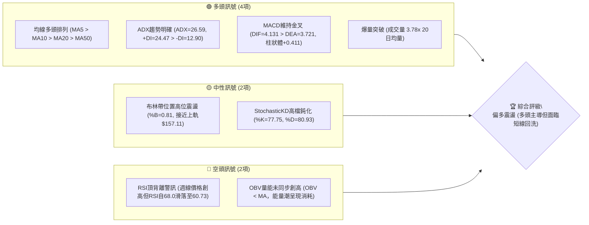
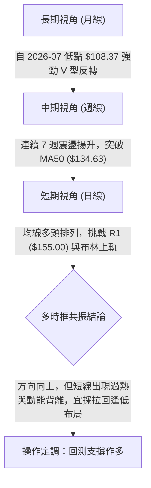
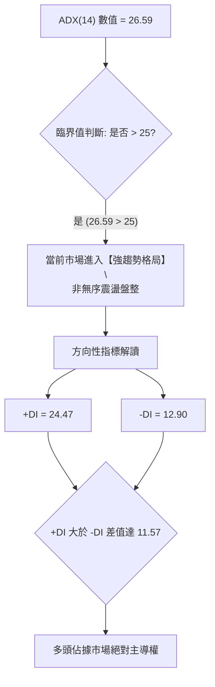
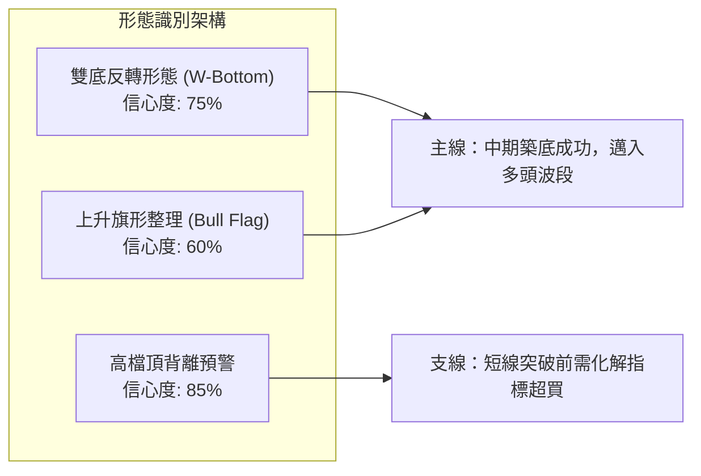
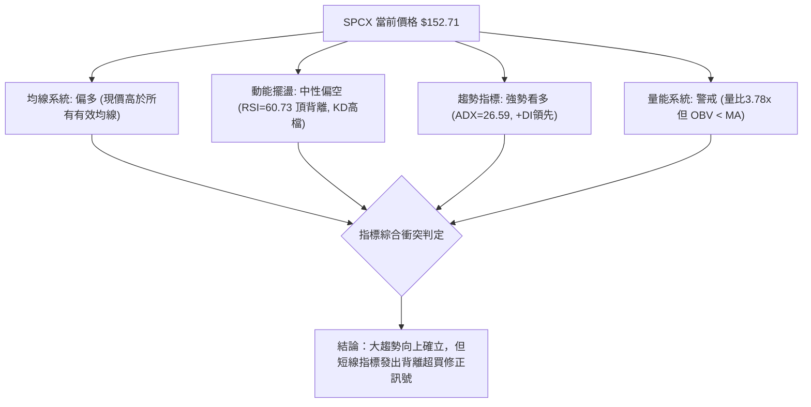
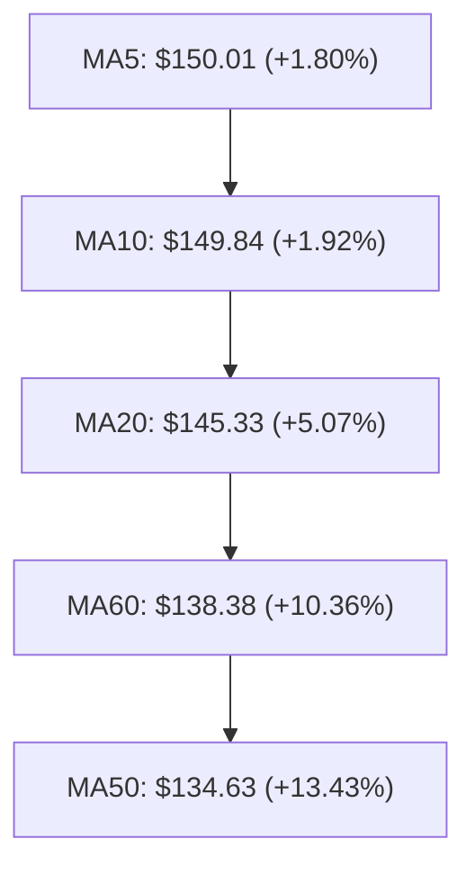
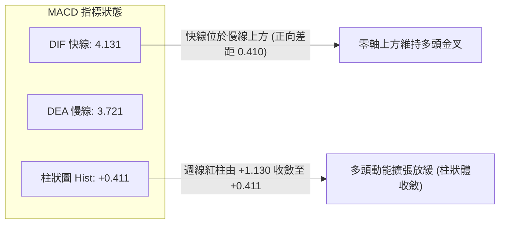
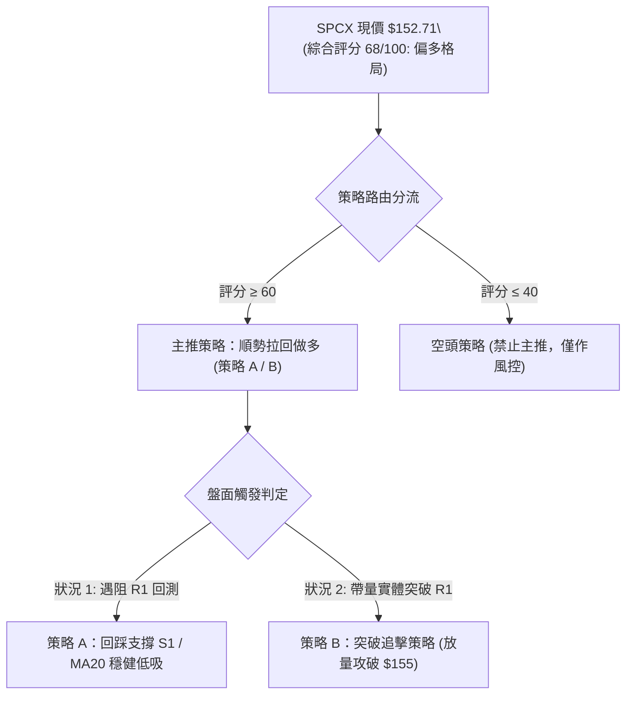
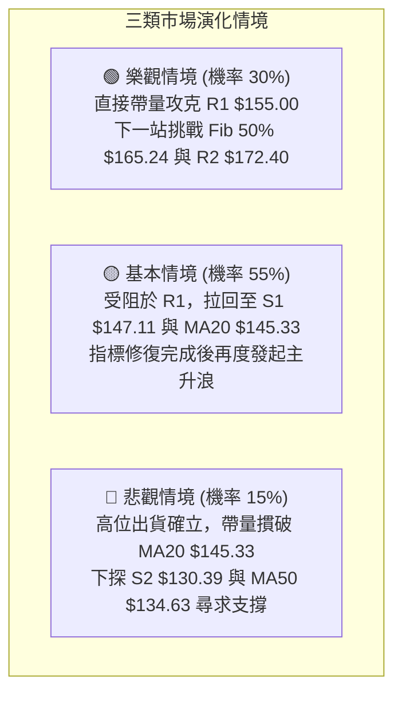

# SPCX 技術分析報告

> **報告日期**：2026-09-19 ｜ **語言**：繁體中文 ｜ **數據來源**：Yahoo Finance ｜ **當前價格**：$152.71

---

## 目錄

| 章節 | 內容 |
|------|------|
| [1. 技術面概覽](#1-技術面概覽) | 訊號儀表板、核心指標、評分卡 |
| [2. 趨勢分析](#2-趨勢分析) | 多時框趨勢、長中短期走勢、ADX解讀 |
| [3. 圖表形態分析](#3-圖表形態分析) | 形態識別、K線組合、形態目標價 |
| [4. 支撐與阻力](#4-支撐與阻力) | 關鍵價位結構、斐波那契回調 |
| [5. 技術指標深度解讀](#5-技術指標深度解讀) | 均線系統、RSI背離、MACD、布林通道、量價 |
| [6. 動能與波動率](#6-動能與波動率) | 動能四象限、ATR波幅、市場敏感度 |
| [7. 多時框架總結](#7-多時框架總結) | 時框架矩陣、多時框收斂定論 |
| [8. 交易策略建議](#8-交易策略建議) | 主策略路由、情境階梯、策略明細與風控 |
| [9. 風險提示與監控](#9-風險提示與監控) | 關鍵監控清單、極端情境、部位管理 |

---

## 1. 技術面概覽

### 🎯 技術訊號儀表板



### 📊 核心指標速覽表

| 指標類別 | 指標名稱 | 當前數值 | 訊號 | 解讀 |
|:---|:---|:---:|:---:|:---|
| **價格結構** | 收盤價 | $152.71 | 🟢 | 站上 61.8% 斐波那契回調位 ($150.98)，逼近 R1 ($155.00) |
| **短期均線** | MA20 (月線) | $145.33 | 🟢 | 現價高於 MA20 達 +5.07%，短期上升軌道完好 |
| **中期均線** | MA50 (季線) | $134.63 | 🟢 | 現價高於 MA50 達 +13.43%，中期底部確立反轉向上 |
| **長期均線** | MA200 | N/A | 🟡 | 上市歷史資料不足以計算 MA200，長期趨勢以週線結構替代 |
| **擺盪動能** | RSI(14) | 60.73 | 🟡 | 位於強勢多頭區間 (50-70)，但出現明顯「價格創高、RSI回落」頂背離 |
| **趨勢動能** | MACD (12,26,9)| 4.131 / 3.721 | 🟢 | 零軸上方維持多頭格局，MACD柱狀圖維持紅柱 (+0.411) 但有收斂跡象 |
| **趨勢強度** | ADX (14) | 26.59 | 🟢 | ADX > 25 進入強趨勢階段，+DI (24.47) 大幅領先 -DI (12.90) |
| **通道狀態** | Bollinger %B | 0.81 | 🟡 | 位於上軌 ($157.11) 與中軌 ($145.33) 之間，進入超買警戒區 |
| **波動幅度** | ATR(14) | $6.88 | 🟡 | 每日平均波幅佔股價 4.50%，短線波動度高，操作需拉寬防守緩衝 |
| **量能狀態** | OBV 與 量比 | 3.78x 均量 | 🔴 | 單日成交量爆發至 3.35 億股，但 OBV 低於其均線，顯示買盤追價力道分歧 |

### 🏆 技術評分卡

```
╔══════════════════════════════════════════════════════════════════╗
║                技術評分卡 — SPCX (2026-09-19)                  ║
╠══════════════════════════════════════════════════════════════════╣
║ 趨勢強度 (Trend)        ██████████████░░░░░░  70/100  🟢 強勢   ║
║ 動能指標 (Momentum)     ████████████░░░░░░░░  60/100  🟡 背離   ║
║ 支撐穩定度 (Support)    ████████████████░░░░  80/100  🟢 紮實   ║
║ 成交量配合 (Volume)     ██████████░░░░░░░░░░  50/100  🟡 分歧   ║
║ 形態完整度 (Pattern)    ██████████████░░░░░░  70/100  🟢 成形   ║
║ 均線排列 (Moving Avg)   ████████████████░░░░  80/100  🟢 多頭   ║
╠══════════════════════════════════════════════════════════════════╣
║ 綜合技術評分            █████████████░░░░░░░  68/100  🟢 偏多   ║
╚══════════════════════════════════════════════════════════════════╝
```

---

## 2. 趨勢分析

### 🌐 多時框趨勢分析



### 📈 長期趨勢 — 24個月歷史走勢與關鍵轉折圖

SPCX 歷經 2026 年初以來的劇烈波動，52 週高點達 $225.64，隨後在 2026 年 7 月經歷劇烈拋售下探 52 週低點 $104.83，當前正處於自底部反彈的第 3 波推進段：

```
SPCX 歷史價格走勢圖（月線層級示意）
價格軸 ($)
$225 ┤                             ● (52W High $225.64)
$200 ┤                            / \
$175 ┤  ● (06月 $170.86)         /   \
$150 ┤   \                       /     ● ($152.71 現價 - 站上61.8%反彈位)
$140 ┤    \                     /     ▲
$120 ┤     \                   ● (08月 $143.69)
$104 ┤      ● (07月 $108.37 / 52W Low $104.83 - 築底完成)
     └────────────────────────────────────────────────────────► 時間
       2026-05   2026-06     2026-07    2026-08    2026-09
```

**走勢特徵分析表格**：

| 階段區間 | 收盤區間 | 累積漲跌幅 | 成交量能特徵 | 技術結構意義 |
|:---|:---:|:---:|:---|:---|
| **2026-06 築頂下挫** | $170.86 → $153.23 | -10.32% | 高檔爆量滯漲 | 多頭動能衰竭，頭部跌破頸線防線 |
| **2026-07 恐慌拋售** | $162.00 → $108.37 | -33.10% | 週均量維持 3.5 億股以上 | 投降式殺盤 (Capitulation)，RSI 跌至 15.9 極度超賣 |
| **2026-08 暴力反彈** | $108.37 → $141.50 | +30.57% | 08-09 週爆出 9.2 億股天量 | 底部放量長紅確認 $104.83 為 52 週硬底支撐 |
| **2026-09 盤堅推升** | $141.50 → $152.71 | +7.92% | 週均量維持在 4-6 億股 | 攻克 MA20 ($145.33) 與 MA50 ($134.63)，進入阻力消化區 |

### 📊 中期趨勢（週線分析）

從近 10 週的週線收盤數據觀察：
- **低點抬高 (Higher Lows)**：自 2026-08-02 的 $108.37 確立為波段谷底後，後續回踩低點分別為 $133.11、$136.97、$141.50、$147.95，呈現極具規律的階梯式上升通道。
- **高點抬高 (Higher Highs)**：每週收盤價由 $133.11 推進至 $140.00、$141.50、$147.95、$151.21，本週更收於 $152.71，多頭慣性完全未被破壞。
- **籌碼換手特徵**：2026-08-09 週成交量達 9.20 億股，本週 (2026-09-20) 成交量放大至 6.68 億股，反映機構資金在 $130.00–$150.00 區間進行積極轉倉換手。

```
中期上升軌道示意圖 (週線層級)
$160 ┤                                        [R1 $155.00]
$155 ┤                                     ● $152.71 (現價受阻)
$150 ┤                                 ● $151.21
$145 ┤                             ● $147.95 ─── [S1 $147.11 軌道下緣]
$140 ┤             ● $140.00   ● $141.50
$135 ┤         ● $133.11   ● $136.97
$130 ┤ ───────────────────────────────────── [S2 $130.39 / MA50 支撐]
$120 ┤
$110 ┤ ● $108.37 (波段起漲點)
     └────────────────────────────────────────────────────────►
```

### ⚡ 趨勢強度評估（ADX 解讀）



**ADX 趨勢強度對照解讀表**：

| 指標變數 | 當前讀數 | 門檻區間 | 技術含義解讀 | 對交易策略之指引 |
|:---|:---:|:---:|:---|:---|
| **ADX (14)** | **26.59** | 25.00 – 50.00 | 確認趨勢成形且力道增強 | 嚴禁逆勢摸頂放空；應採順勢回踩買進策略 |
| **+DI** | **24.47** | > 20.00 | 多方推進能量充沛 | 買盤具有延續性，突破追價仍具備勝率 |
| **-DI** | **12.90** | < 15.00 | 空方壓制力道萎縮至低檔 | 空頭動能不足以引發崩跌式回檔 |
| **方向差距 (Spread)**| **+11.57** | > 10.00 | 多空雙方力量失衡 | 單邊上行機率高於大幅深度回調機率 |

---

## 3. 圖表形態分析

### 🔍 形態識別系統



**圖表形態信心度與測幅目標表**：

| 形態名稱 | 信心度 | 判斷依據（引用嚴格數據） | 完成度 | 形態目標價（附精確計算式） |
|:---|:---:|:---|:---:|:---|
| **大級別雙底 (W-Bottom)** | **75%** | 第 1 底為 52W Low **$104.83**，第 2 底為 2026-08-02 週收盤 **$108.37**；頸線取 2026-07-05 反彈高點 **$162.00** | 80% (逼近頸線) | 頸線 $162.00 + 形態高度 ($162.00 - $104.83 = $57.17) = **$219.17** (接近 52W 高點 $225.64) |
| **短線上升通道/旗形** | **60%** | 自 08-09 突破 $133.11 後，沿 MA20 呈 45 度角向上，成交量在旗面拉回時萎縮 | 85% (即將挑戰旗頂) | 旗桿起點 $108.37 至突破點 $140.00 (高差 $31.63)，自支撐 $147.11 起算 = **$178.74** (逼近斐波 38.2% $179.49) |
| **動能頂背離 (指標形態)** | **85%** | 價格由 09-13 之 $151.21 創高至 $152.71，但週線 RSI 由 68.0 滑落至 60.7，MACD 柱由 +0.888 縮減至 +0.411 | 90% (訊號明確) | 預警回踩支撐 S1 **$147.11** 或 MA20 **$145.33** 進行技術修復 |

### 🕯️ 重要K線形態分析

| 月份/週期 | 收盤價 | K線組合形態 | 技術面解讀 | 訊號評級 |
|:---|:---:|:---|:---|:---:|
| **2026-07 月線** | $108.37 | **長下影錘頭線 (Hammer)** | 觸及 52W 低點 $104.83 後爆發抄底買盤，留下逾 $3.50 之長下影線，確立空頭力竭 | 🟢 強烈反轉 |
| **2026-08 月線** | $143.69 | **光腳長大陽線 (Marubozu)** | 單月暴漲 +32.59%，月K實體一口氣吞沒 7 月全部跌幅，形成極強之月線級別「晨星吞噬」 | 🟢 多頭定基 |
| **2026-09-13 週線**| $151.21 | **強勢推進紅K** | 伴隨 4.04 億股穩定放大，實體突破 $150 整數心理關卡，確認多頭掌控力 | 🟢 延續訊號 |
| **2026-09-20 週線**| $152.71 | **高位上影十字星 (Doji)** | 本週收於 $152.71，伴隨 6.68 億股大量，但實體收窄且有上影線，暗示 R1 ($155.00) 處獲利回吐賣壓沉重 | 🔴 短線警戒 |

### 📉 ASCII 走勢形態示意圖

```
SPCX 雙底頸線挑戰形態示意圖
$172.40 ┤                                              [阻力 R2]
$162.00 ┤              ●頸線高點                    ───── [雙底頸線]
$155.00 ┤             /        \              ▲受阻 [阻力 R1]
$152.71 ┤            /          \            ●現價
$145.33 ┤           /            \          /      [MA20/通道中軸]
$130.39 ┤          /              \        /       [支撐 S2]
$108.37 ┤         /                ●底2    /
$104.83 ┤ ●底1  /
        └──────────────────────────────────────────────►
          07月初           07月底    08月初   09月中(現在)
```

---

## 4. 支撐與阻力

### 🗺️ 關鍵價位分布圖（Unicode）

```
SPCX 價位結構分布圖
══════════════════════════════════════════════════════════════════
$225.64 ║██████████████████████████████║ 52週最高點 / 0.0% Fib
$197.13 ║████████████████████          ║ 斐波那契 23.6% 回調位
$179.49 ║████████████████████████      ║ 斐波那契 38.2% 回調位
$172.40 ║████████████████████████████  ║ 強阻力 R2 (近一年波段高點聚類)
$165.24 ║████████████████              ║ 斐波那契 50.0% 中軸心理位
$157.11 ║████████████                  ║ 布林通道上軌
$155.00 ║██████████████████████████████║ 關鍵阻力 R1 (當前考驗點)
$152.71 ╠══════════════════════════════╣ ◄ 當前市價 ($152.71)
$150.98 ║▓▓▓▓▓▓▓▓▓▓▓▓▓▓▓▓▓▓▓▓▓▓▓▓▓▓▓▓  ║ 斐波那契 61.8% 關鍵黃金分割位
$147.11 ║▓▓▓▓▓▓▓▓▓▓▓▓▓▓▓▓▓▓▓▓▓▓▓▓▓▓    ║ 近期支撐 S1 (波段低點聚類)
$145.33 ║▓▓▓▓▓▓▓▓▓▓▓▓▓▓▓▓▓▓            ║ 布林中軌 / MA20 動態均線支撐
$134.63 ║▓▓▓▓▓▓▓▓▓▓▓▓▓▓▓▓▓▓▓▓▓▓        ║ MA50 季線強支撐
$130.39 ║██████████████████████████████║ 強支撐 S2 (重疊 Fib 78.6% $130.68)
$104.83 ║██████████████████████████████║ 極強防線 S3 (52週最低點 / 100% Fib)
══════════════════════════════════════════════════════════════════
```

### 🚧 阻力位分析表

> **數據紀律說明**：阻力價位嚴格引用自數據源之高點聚類與斐波那契計算值。

| 阻力級別 | 精確價位 | 距現價幅幅 | 形成原因與技術共振 | 突破難度 | 重要性權重 |
|:---|:---:|:---:|:---|:---:|:---:|
| **關鍵阻力 R1** | **$155.00** | +1.50% | 近一年密集波段套牢高點聚類；上方僅 $2.11 即為布林上軌 ($157.11) | 🟡 中等偏高 | 85% (短線分水嶺) |
| **強阻力 R2** | **$172.40** | +12.89% | 近一年重大波段轉折高點；越過後即封閉 6 月下挫跳空裂口 | 🔴 極高 | 95% (中期反轉確認) |
| **極端阻力 (52W High)**| **$225.64** | +47.76% | 52 週歷史峰值，長期籌碼解套之終極壓力帶 | 🔴 堡壘級 | 70% (長期天花板) |

### 🛡️ 支撐位分析表

> **數據紀律說明**：支撐價位嚴格引用自數據源之波段低點聚類與均線指標。

| 支撐級別 | 精確價位 | 距現價跌幅 | 形成原因與技術共振 | 守住機率 | 重要性權重 |
|:---|:---:|:---:|:---|:---:|:---:|
| **近期支撐 S1** | **$147.11** | -3.67% | 近期波段回踩之次級低點聚類；下方緊鄰 MA5 ($150.01) 與 MA10 ($149.84) | 🟢 80% | 80% (強勢防守線) |
| **均線動態支撐** | **$145.33** | -4.83% | MA20 (月線) 與布林通道中軌重合位，短期多頭生命線 | 🟢 85% | 90% (多頭核心防線) |
| **強支撐 S2** | **$130.39** | -14.62% | 近一年重要波段低點聚類；與 78.6% 斐波那契位 ($130.68) 及 MA50 ($134.63) 形成支撐帶 | 🟢 90% | 95% (中期趨勢防線) |
| **鐵底支撐 S3** | **$104.83** | -31.35% | 52 週絕對低點，機構法人資金大規模護盤成本底線 | 🟢 98% | 100% (極限清算點) |

### 📐 斐波那契回調位分析

依據 52 週極值區間（低點 $104.83 至 高點 $225.64，波幅 $120.81）精確回調層級分析：

```
斐波那契回調結構 (52W High $225.64 → 52W Low $104.83)
0.0%  ── $225.64 (52W 最高點)
23.6% ── $197.13
38.2% ── $179.49
50.0% ── $165.24 ─────────────────── [中軸多空均衡線]
61.8% ── $150.98 ◄───【現價 $152.71 落於此處上方，完成黃金分割修復】
78.6% ── $130.68 ─── (高度重疊支撐 S2 $130.39)
100%  ── $104.83 (52W 最低點)
```

- **當前位置解讀**：現價 $152.71 成功越過黃金分割 61.8% 關鍵位 ($150.98)。在技術分析理論中，反彈突破 61.8% 意味著先前的下行趨勢已被徹底破壞，行情由「超跌反彈」正式升級為「反轉行情」。
- **下一個目標區間**：向上空間已被打開至 50.0% 回調位 **$165.24** 與阻力 R2 **$172.40**。

---

## 5. 技術指標深度解讀

### 🎛️ 指標訊號總覽



### 📈 移動平均線排列分析



- **排列格局**：短中期均線呈典型之**多頭排列 (Bullish Alignment)**，MA5 > MA10 > MA20 > MA60 > MA50。
- **均線角度 (Slope)**：
  - MA5 與 MA10 斜率陡峭向上，近期斜率微幅收斂（走勢圖呈現 `█████████` 高檔平移）。
  - MA20 (月線) 持續以穩健斜率上移 ($145.33)，成為短線拉回最堅固之動態支撐防線。
  - 長期 MA120/MA200 因數據不足未生成，但 60 日均線已從低檔快速拉升至 $138.38，確認中期結構全面翻多。

### 📉 RSI(14) 分析與背離判定

```
RSI(14) 當前水平: 60.73
0       20        40   50   60   70        80      100
├────────┼─────────┼────┼────┼────┼─────────┼────────┤
│ 極度超賣│ 弱勢區間 │    中性    │████████░│ 極度超買│
└────────┴─────────┴────┴────┴────┴─────────┴────────┘
                                  ▲ 60.73 (多頭強勢區)
```

- **頂背離深度解析（Bearish Divergence）**：
  - **價格行為**：週線價格自 2026-09-13 的 $151.21 推升至 2026-09-20 的 $152.71，價格創下近 2 個月收盤新高。
  - **指標行為**：RSI(14) 卻由上一週的 **68.0** 明顯下滑至 **60.73**。
  - **技術含義**：此現象屬於標準之**「價格創高而指標不創新高」的動能頂背離**。這說明追高買盤的內部動能正在衰退，多頭僅依靠慣性推升，極易在 R1 ($155.00) 附近引發技術性獲利了結賣壓。

### 📊 MACD(12,26,9) 訊號解讀



- **結構解讀**：MACD 快慢線均在零軸上方運行，且維持黃金交叉狀態（DIF 4.131 > DEA 3.721），確認中線多頭格局不變。
- **動能預警**：近三週柱狀圖數值分別為 `+1.130` → `+0.888` → `+0.411`，紅柱呈現連續 3 週遞減萎縮。這與 RSI 頂背離形成了相互確認，表明當前處於「多頭趨勢末端之整理蓄勢期」。

### 📦 布林通道分析

```
SPCX 布林通道 (20, 2) 價位分布示意圖
$157.11 ┤ ───────────────────────────────────── BB 上軌 (動態阻力帶)
$155.00 ┤                       ─── R1 關鍵阻力
$152.71 ┤                 ● 現價 (位處 %B = 0.81，高位擠壓)
        │
$145.33 ┤ ───────────────────────────────────── BB 中軌 (MA20 生命線)
        │
$133.56 ┤ ───────────────────────────────────── BB 下軌 (極端支撐)
```

- **當前讀數**：上軌 $157.11、中軌 $145.33、下軌 $133.56，帶寬為 $23.55 (約 15.4%)。
- **%B 指標解讀**：%B 達到 **0.81**，顯示現價已進入上軌與中軌之間的極高位置（0.8 以上通常代表進入短線過熱區）。現價距離上軌僅剩 $4.40 空間，在缺乏新催化劑下，直接向上暴力推軌（Walking the bands）的阻力極大。

### 💹 成交量分析（量價配合度）

- **異常量能爆發**：最新成交量衝上 **335,389,800 股**，相較 20 日均量 88,710,275 股，量比高達 **3.78 倍**。週級別成交量更達到 6.68 億股。
- **OBV (能量潮) 矛盾警告**：數據顯示「OBV < MA → 量能疲弱」。
  - **量價背離分析**：日線單日爆出 3.78 倍天量，但收盤價僅微幅推進至 $152.71，且 OBV 未能同步突破其均線。此種「爆天量但實體收小陽/十字星」的現象，高度暗示高檔存在大額機構換手與籌碼調節（Chandelier Exit 或獲利賣單壓制），量價配合度出現瑕疵。

---

## 6. 動能與波動率

### ⚡ 動能評估四象限

| 象限標籤 | 動能強度 (Momentum) | 波動率水準 (Volatility) | SPCX 當前定位 | 戰略應對建議 |
|:---:|:---:|:---:|:---:|:---|
| **第一象限 (Q1)** | **強動能** | **低波動** | — | 最完美單邊趨勢，全力加碼順勢持股 |
| **第二象限 (Q2)** | **弱動能** | **低波動** | — | 狹幅橫盤盤整，資金效率低，觀望為主 |
| **第三象限 (Q3)** | **強動能** | **高波動** | **✓ SPCX 當前落點** | **高風險高回報段：短線波幅劇烈，易洗盤，必須收緊防守止損** |
| **第四象限 (Q4)** | **弱動能** | **高波動** | — | 無序暴漲暴跌，多空雙殺，嚴格禁止進場 |

- **SPCX 處於 Q3 象限之依據**：ADX 高達 26.59 確立強動能，但 ATR 佔比達 4.50%、單日成交量擴大近 4 倍，顯示多空雙方在高位激烈交火，屬於典型之「強趨勢伴隨高波動」。

### 📊 ATR 波動率分析

```
ATR(14) 波動區間與風控緩衝設置
當前 ATR: $6.88 (佔現價 4.50%)
══════════════════════════════════════════════════════════════
現價: $152.71
 ├─ 0.5 ATR 緩衝 ($3.44)  ──► $149.27 (日內正常微幅雜訊)
 ├─ 1.0 ATR 緩衝 ($6.88)  ──► $145.83 (剛好吻合 MA20 支撐 $145.33)
 └─ 1.5 ATR 緩衝 ($10.32) ──► $142.39 (波段洗盤防守底線)
══════════════════════════════════════════════════════════════
```

- **止損距離建議**：由於 ATR 高達 $6.88，若設定低於 1.0 ATR 之止損極易被日內正常隨機波動「雜訊掃出場」。波段交易者應給予至少 **1.0 至 1.2 個 ATR ($6.88–$8.25)** 作為安全防守間距。

### 📐 Beta 與市場相關性

- **機構與流動性結構**：
  - 自由流通股 (Float Shares) 達 37.0 億股，市值規模達 $2.01T，屬於巨型權值標的。
  - 機構持股佔比 48.2%，內部人持股 12.7%，空頭部位僅佔流通股 2.8% (Short Ratio 1.55)。
- **敏感度特徵**：儘管官方 Beta 顯示 N/A，但自 7 月底 $108.37 飆升至當前 $152.71 (+40.9%)，其波幅遠超同期標普 500 指數，隱含實質波動率高於大盤 2.0 倍以上，對總體資金流動性極度敏感。

---

## 7. 多時框架總結

### 📋 時框架評分表

| 時框架 | 趨勢方向 | 動能狀態 | 均線排列 | 圖表形態 | 綜合評分 | 戰術建議 |
|:---:|:---:|:---:|:---:|:---:|:---:|:---|
| **長期 (月線)** | 🟢 多頭重啟 | 🟢 底部吞噬 | 🟡 MA60 剛翻揚 | 雙底反彈成型中 | **75 / 100** | 中長期籌碼穩定，核心部位堅定續抱 |
| **中期 (週線)** | 🟢 上升趨勢 | 🟡 動能減速 | 🟢 站穩 MA50 | 階梯式推升 | **70 / 100** | 趨勢完好，但留意紅柱萎縮帶來的震盪 |
| **短期 (日線)** | 🟡 高檔鈍化 | 🔴 RSI 頂背離 | 🟢 完美多頭排列 | 逼近布林上軌與 R1 | **60 / 100** | 拒絕高位追價，耐心等待拉回量縮買點 |

### 🔲 綜合訊號矩陣

```
SPCX 多時框訊號收斂矩陣
┌──────────────┬──────────────┬──────────────┬──────────────┐
│  分析維度    │ 短期 (日線)  │ 中期 (週線)  │ 長期 (月線)  │
├──────────────┼──────────────┼──────────────┼──────────────┤
│  趨勢方向    │ 🟢 偏多推升  │ 🟢 強勢多頭  │ 🟢 底部反轉  │
│  動能強弱    │ 🔴 頂部背離  │ 🟡 紅柱縮減  │ 🟢 陽線吞噬  │
│  量能健康度  │ 🔴 OBV疲弱   │ 🟢 爆量換手  │ 🟡 均量持平  │
│  關鍵位反應  │ 🔴 逼近 R1   │ 🟢 站穩 61.8%│ 🟢 脫離 52W底│
└──────────────┴──────────────┴──────────────┴──────────────┘
```

### ⚖️ 多時框收斂結論

> **依循嚴格收斂規則 14**：
> 當前 ADX 為 **26.59 (>25)**，技術架構明確屬於**「趨勢行情」**。
> 根據規則，趨勢行情下**必須以中長期（週線/MA50）趨勢方向為主導**，日線指標之超買或背離**僅用於尋找拉回進場時機與微調節奏，絕不可作為逆勢做空的依據**。
> 
> **唯一收斂定論**：**整體格局維持【偏多主導，拉回布局】**。週線脫離底部已成定局，日線頂背離與布林上軌壓制將引導股價回測支撐 S1 ($147.11) 至 MA20 ($145.33) 區間，此為中線多頭健康的換手洗盤。

---

## 8. 交易策略建議

### 🗺️ 策略決策流程圖



### 🧭 策略路由（依評分卡分流）

- **當前主策略方向 = 【主推多頭策略】（依技術評分卡綜合得分 68 / 100 偏多判定）**
- **策略執行哲學**：多頭趨勢不變，但短線拒絕在 $152.71–$155.00 阻力密集區追價，策略重點聚焦於「利用日線頂背離引發的健康回檔，在支撐位布局」。

### 🎯 價格情境階梯（Price Scenarios）

> **數據紀律說明**：階梯價位嚴格鎖定第 4 章計算之實體價位。

| 觸發條件 | 第一目標 (T1) | 第二目標 (T2) | 後續延伸 (T3) | 情境技術含義 |
|:---|:---:|:---:|:---:|:---|
| **突破關鍵阻力 R1 $155.00** | **$165.24** (Fib 50.0%) | **$172.40** (阻力 R2) | **$179.49** (Fib 38.2%) | 軋空延續，短線背離被強勢鈍化化解 |
| **守穩 $147.11 – $152.71** | **$155.00** (阻力 R1) | **$157.11** (布林上軌) | — | 阻力位前進行以盤代跌的消化換手 |
| **失守支撐 S1 $147.11** | **$145.33** (MA20生命線)| **$134.63** (MA50季線) | **$130.39** (強支撐 S2) | 日線級別深度洗盤，回測中期均線堡壘 |

### 📊 情境機率分佈

| 情境類型 | 發生機率 | 主要依據（引用嚴格指標） |
|:---|:---:|:---|
| **拉回確認後再攻 (主情境)** | **55%** | 均線完美多頭排列，ADX=26.59 趨勢確立；但 RSI 頂背離與 OBV 疲弱要求技術性回測洗盤 |
| **直接強勢放量突破 (次情境)** | **30%** | 最新成交量激增至 3.78x 均量，若主力資金連續暴力軋空，將強推布林上軌突破 R1 ($155.00) |
| **深度向下反轉回跌 (防禦情境)** | **15%** | 機構在 $150 上方大舉倒貨，若帶量摜破 MA20 ($145.33)，將引發動能停損潮回測 S2 ($130.39) |

### 🟢 主策略詳情

| 策略要素 | 策略 A：穩健拉回低吸（首選 🥇） | 策略 B：右側突破追擊（次選 🥈） |
|:---|:---|:---|
| **策略核心** | 利用短線指標背離，於動態均線支撐處低吸 | 待多頭實體突破 R1 套牢區後順勢推進 |
| **進場條件** | 價格回踩至支撐 S1 與 MA20 區間且日線收下影線 | 日線收盤價**實體突破 R1 ($155.00)** 且成交量大於 20日均量 1.5x |
| **進場價格** | **$146.50** (介於 S1 $147.11 與 MA20 $145.33 之間) | **$155.50** (突破 $155.00 確認後掛單) |
| **目標價 T1** | **$155.00** (關鍵阻力 R1) | **$165.24** (斐波那契 50.0% 回調位) |
| **目標價 T2** | **$172.40** (強阻力 R2) | **$172.40** (強阻力 R2) |
| **止損價格** | **$141.50** (跌破 08-30 波段高點與 0.7 ATR 緩衝) | **$149.80** (跌破 MA10 $149.84 與突破起漲點) |
| **風險報酬比 (R:R)**| **1 : 5.18** (以 T2 計算：潛在虧損 $5.00，潛在獲利 $25.90) | **1 : 2.96** (以 T2 計算：潛在虧損 $5.70，潛在獲利 $16.90) |
| **預估勝率** | **68%** | **55%** |
| **建議配置倉位** | **總資金之 15% – 20%** | **總資金之 10%** |

### 🔴 反向風險觸發點（對沖提示）

- **全面停損警戒線**：若日線收盤價**跌破支撐 S1 $147.11 並進一步灌破 MA20 $145.33**，意味著短期上升通道徹底失效。
- **風控動作**：此時應立即削減 50% 以上多頭多單，並準備在跌破 **$141.50** 時全數清倉出場；若具備避險需求，可於跌破 $145.33 時建立 5% 規模之反向對沖部位，下看支撐 S2 **$130.39**。

### ⭐ 整體訊號強度評星

```
做多訊號強度：★★★★☆  (4/5 星 - 大級別均線與趨勢指標極為強勢)
做空訊號強度：★☆☆☆☆  (1/5 星 - 逆強趨勢操作，僅短線背離不足以放空)
整體可信度：  ★★★★☆  (4/5 星 - 指標相互印證度高，價位邊界明確)
```

---

## 9. 風險提示與監控

### ✅ 關鍵監控指標 Checklist

```
╔══════════════════════════════════════════════════════════════════╗
║              交易員日常風控監控清單 (Checklist)                  ║
╠══════════════════════════════════════════════════════════════════╣
║ [ ] 價格是否成功封閉 R1 $155.00 之上方賣壓？                     ║
║ [ ] RSI(14) 頂背離是否藉由回踩化解，抑或是進一步跌破 50 中軸？  ║
║ [ ] 成交量在回調時是否呈現健康「量縮」（低於 20日均量 88M）？     ║
║ [ ] MA20 ($145.33) 動態支撐每日上移斜率是否維持陡峭？          ║
║ [ ] 布林通道帶寬是否開始收窄，進入新一輪變盤擠壓？              ║
║ [ ] ADX(14) 是否持續維持在 25 之上，確認趨勢未衰竭？            ║
╚══════════════════════════════════════════════════════════════════╝
```

### ⚠️ 風險場景分析



### 🛡️ 風險管理重要提醒

1. **ATR 波動適應原則**：
   SPCX 當前 ATR 高達 **$6.88 (4.50%)**，這意味著日內震盪 $5–$7 美元屬於常態現象。操作上切忌使用過於狹窄的止損（如 $2–$3），否則極易在主力震倉過程中遭受無謂損失。進場部位必須依照「ATR 止損間距」反向推算部位大小。
2. **量價異動警覺**：
   本週爆出 3.78 倍天量但收盤漲幅有限，且 OBV 低於均線，這是典型的籌碼分歧特徵。若未來 2–3 個交易日股價跌破 $150.00，應高度懷疑為主力「拉高出貨 (Distribution)」而非吸籌，必須嚴格執行防守止損紀律。
3. **部位規模上限管制**：
   鑑於估值層面 EV/EBITDA 高達 672 倍且淨利率為負，本標的技術面主導性高但基本面容錯率低。單一帳戶在 SPCX 上的總暴險金額建議嚴格控制在總投資組合的 **15% 至 20% 以內**，嚴禁過度融資槓桿操作。

---

## 📋 報告總結

```
╔══════════════════════════════════════════════════════════════════╗
║                    SPCX 技術分析報告總結                        ║
╠══════════════════════════════════════════════════════════════════╣
║ 報告日期：2026-09-19                                            ║
║ 當前價格：$152.71                                               ║
║ 分析評級：🟢 偏多主導，拉回布局 (技術評分: 68/100)               ║
╠══════════════════════════════════════════════════════════════════╣
║ 關鍵維度定論：                                                   ║
║ ├─ 長期趨勢：🟢 脫離 52W 低點 $104.83，雙底形態大格局構築中      ║
║ ├─ 中期趨勢：🟢 突破 MA50 ($134.63) 與 61.8% 斐波那契位 ($150.98) ║
║ ├─ 短期趨勢：🟡 逼近 R1 ($155.00)，面臨 RSI 頂背離與天量換手整理 ║
║ ├─ 核心支撐：S1 $147.11 / MA20 $145.33 (多頭生命線)              ║
║ ├─ 核心阻力：R1 $155.00 / R2 $172.40                           ║
║ └─ 外資目標：分析師平均目標價 $222.42 (共識評級: Buy)            ║
╠══════════════════════════════════════════════════════════════════╣
║ 最優交易執行路徑：                                               ║
║ 1. 🥇 最佳首選：耐心等待拉回至 $146.50 (S1至MA20區間) 布局多單，  ║
║    止損設於 $141.50，波段目標直指 $165.24 與 $172.40 (R:R=5.18)。║
║ 2. 🥈 次選手法：若強勢帶量放量突破 $155.00 實體收紅，右側輕倉追擊，║
║    止損設於 $149.80，目標上看 $165.24。                          ║
║ 3. 🥉 風控底線：任何收盤跌破 $145.33 之情況，一律減倉觀望。       ║
╚══════════════════════════════════════════════════════════════════╝
```

---

> ⚠️ **免責聲明**：本報告為依據客觀技術分析指標生成之專業研究報告，所有數據、圖表及推算均嚴格基於所提供之歷史價格與量能資訊。本報告**僅供研究、學術討論與交易策略建構參考**，**絕不構成任何個人化投資建議或買賣邀約**。金融市場瞬息萬變，高動能標的伴隨實質本金虧損風險，投資人應依個人財務風險承受度獨立決策並自負盈虧。

---

*報告生成時間：2026-09-19 ｜ 數據來源：Yahoo Finance ｜ 分析框架：多時框架量化技術分析*