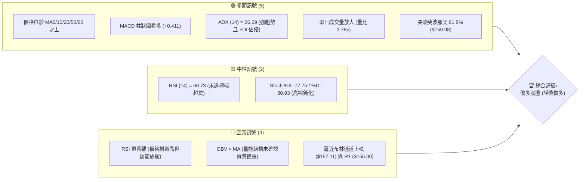
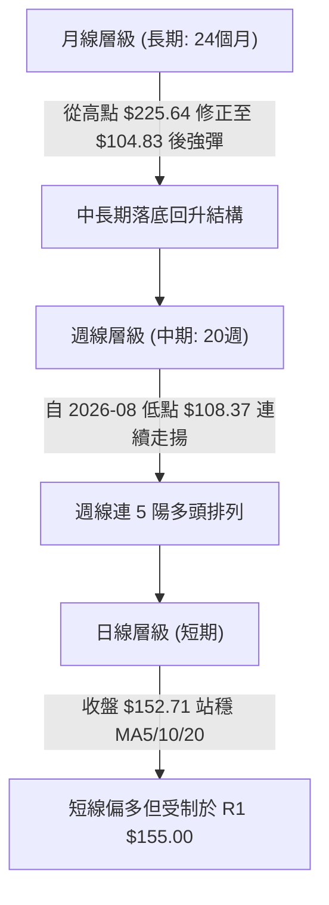
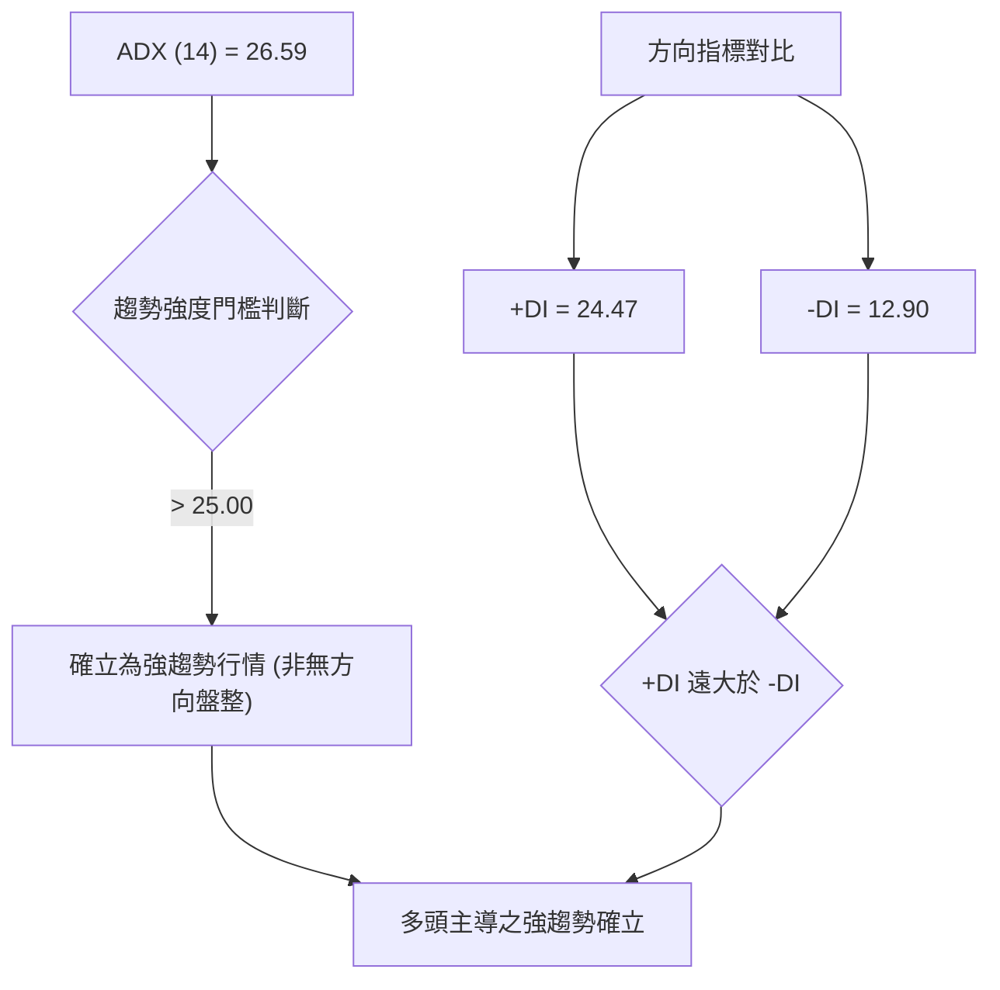
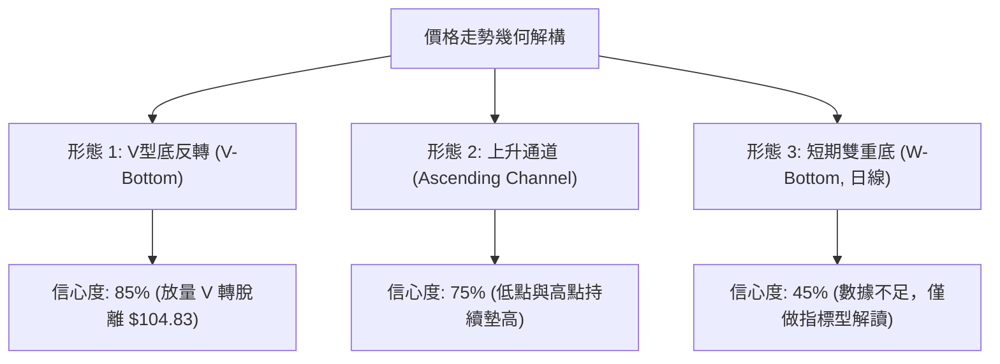
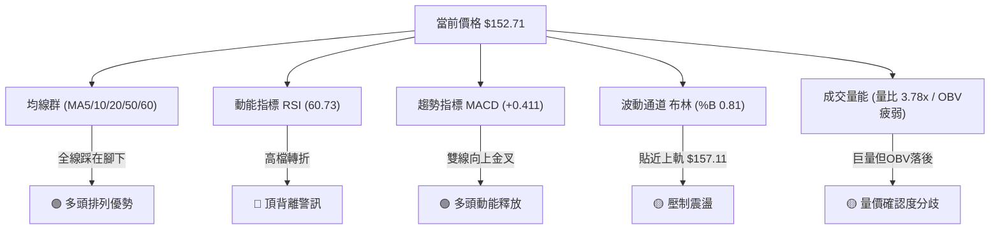
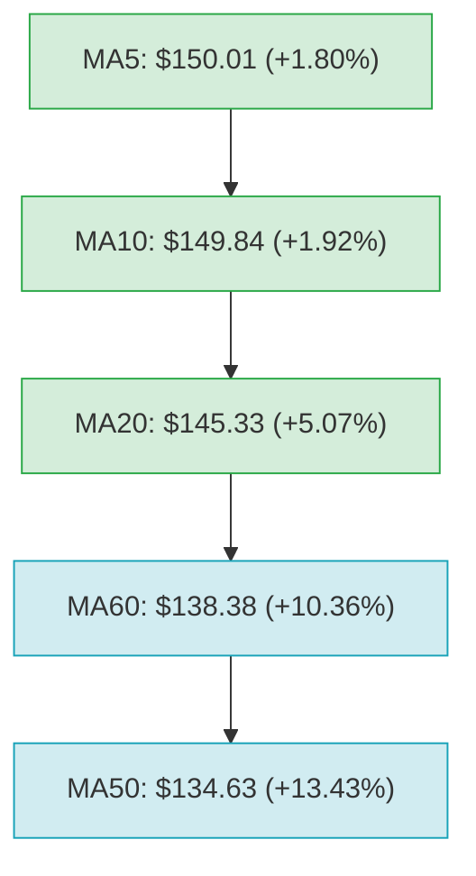
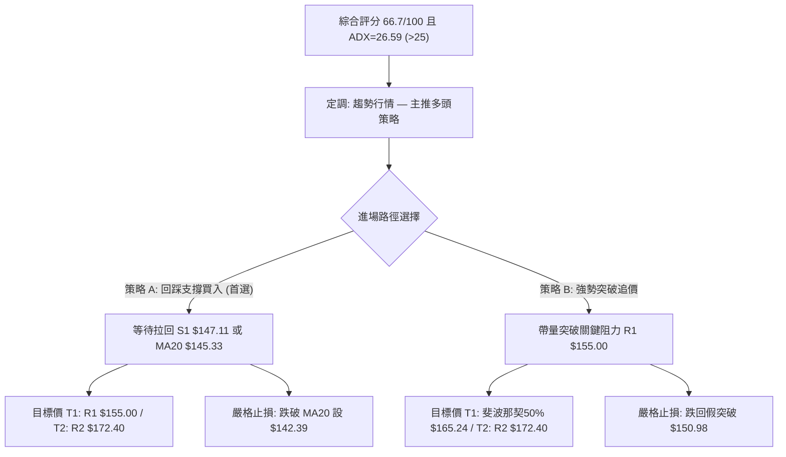
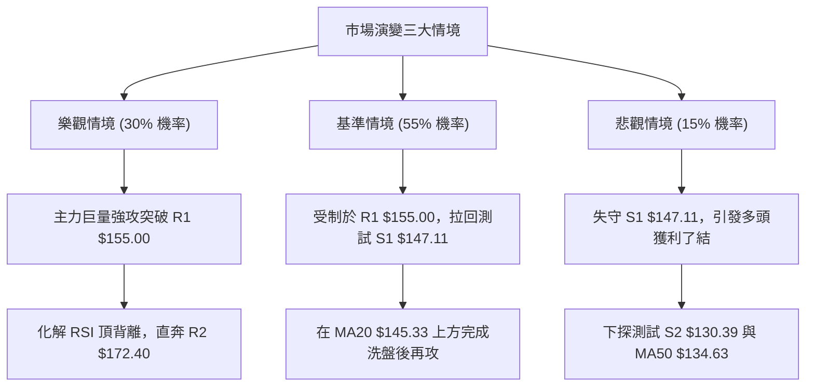

# SPCX 技術分析報告

> **報告日期**：2026-09-20 ｜ **語言**：繁體中文 ｜ **數據來源**：Yahoo Finance ｜ **當前價格**：$152.71

---

## 目錄

| 章節 | 內容 |
|------|------|
| [1. 技術面概覽](#1-技術面概覽) | 訊號儀表板、核心指標、評分卡 |
| [2. 趨勢分析](#2-趨勢分析) | 多時框趨勢、長中短期走勢 |
| [3. 圖表形態分析](#3-圖表形態分析) | 形態識別、K線組合、目標價 |
| [4. 支撐與阻力](#4-支撐與阻力) | 關鍵價位、斐波那契回調 |
| [5. 技術指標深度解讀](#5-技術指標深度解讀) | MA/RSI/MACD/布林/成交量 |
| [6. 動能與波動率](#6-動能與波動率) | 動能評估、ATR、Beta |
| [7. 多時框架總結](#7-多時框架總結) | 時框架評分矩陣 |
| [8. 交易策略建議](#8-交易策略建議) | 多空策略、風險報酬比 |
| [9. 風險提示與監控](#9-風險提示與監控) | 監控指標、風險場景 |
| [10. 報告總結](#-報告總結) | 總結儀表板與投資備忘 |

---

## 1. 技術面概覽

### 🎯 技術訊號儀表板



### 📊 核心指標速覽表

| 指標類別 | 指標名稱 | 當前數值 | 訊號 | 解讀 |
|----------|----------|----------|------|------|
| **價格** | 當前價格 | $152.71 | 🟢 | 站上多條關鍵短期與中期均線，呈現反彈格局 |
| **均線** | MA20 | $145.33 | 🟢 | 現價高於 MA20 達 +5.07%，短期上升趨勢健康 |
| **均線** | MA50 | $134.63 | 🟢 | 現價大幅高於 MA50，中期底部已成形支撐 |
| **均線** | MA200 | $N/A | 🟡 | 數據不足，不予估算，依規則標記為未偵測到 |
| **動能** | RSI(14) | 60.73 | 🟡 | 處於 30–70 中性偏多區間，但出現頂背離警訊 |
| **動能** | MACD | 4.131 (Hist: +0.411) | 🟢 | DIF 高於 Signal (3.721)，柱狀圖為正，偏多 |
| **趨勢** | ADX(14) | 26.59 | 🟢 | ADX > 25 且 +DI (24.47) > -DI (12.90)，多頭趨勢確立 |
| **通道** | 布林 %B | 0.81 | 🟡 | 接近上軌 ($157.11)，短線進入潛在超買壓制區 |
| **量能** | OBV 趨勢 | OBV < MA | 🔴 | 量能指標落後於均線，量價配合出現隱憂 |
| **波動** | ATR(14) | $6.88 (4.50%) | 🟡 | 日內波動幅度適中，提供操作與止損邊界參考 |

### 🏆 技術評分卡

```
╔══════════════════════════════════════════════════════════════════╗
║              SPCX 技術面評分卡 (2026-09-20)                      ║
╠══════════════════════════════════════════════════════════════════╣
║ 趨勢強度      ██████████████░░░░░░  70/100  🟢 強趨勢 (+DI強勢)  ║
║ 動能指標      ████████████░░░░░░░░  60/100  🟡 MACD強但RSI背離   ║
║ 支撐穩定度    ████████████████░░░░  80/100  🟢 S1/S2/MA20 多重防線║
║ 成交量配合    ██████████░░░░░░░░░░  50/100  🟡 單日放量但OBV疲弱  ║
║ 形態完整度    ██████████████░░░░░░  70/100  🟢 V型反彈接上升通道 ║
║ 均線排列      ██████████████░░░░░░  70/100  🟢 短中期多頭排列     ║
╠══════════════════════════════════════════════════════════════════╣
║ 綜合評分      █████████████░░░░░░░  66.7/100 偏多操作 (謹慎逢低買)║
╚══════════════════════════════════════════════════════════════════╝
```

---

## 2. 趨勢分析

### 🌐 多時框趨勢分析



SPCX 呈現標準的「大級別落底反彈、中級別波段拉升、小級別面臨阻力消化」的多時框架構。週線層級在 2026 年 8 月初築底於 $108.37 後，連續多週收紅，MACD 柱狀圖保持正值。日線層級各短期均線（MA5、MA10、MA20）皆順序向上發散，展現短期強勢。

### 📈 長期趨勢 — 12個月走勢圖（Unicode）

```
SPCX 歷史走勢示意圖（2025-10 至 2026-09）
價格軸 ($)
$225.64 ┤                              ● (52W High: $225.64)
$200.00 ┤                             / \
$175.00 ┤   ● (06月: 170.86)         /   \
$152.71 ┤───┼────────────────────────/─────● ← 當前收盤價 ($152.71)
$143.69 ┤   │                       /  ● (08月: 143.69)
$125.00 ┤   │                      /
$108.37 ┤   │        ● (07月: 108.37)
$104.83 ┤───┴────────● (52W Low: $104.83)───────────────────────────
         M-11 M-9  M-7  M-5  M-3  06月 07月 08月 09月(現)
```

**走勢特徵分析表格**：

| 時期/月份 | 收盤價 ($) | 漲跌特徵 | 關鍵技術事件 |
|-----------|------------|----------|--------------|
| 2026-06   | $170.86    | 高位下挫 | 跌破 $180 關卡，空頭量能湧現，加速趕底 |
| 2026-07   | $108.37    | 恐慌重挫 (-36.58%) | 觸及 52 週最低點 $104.83 附近，RSI 嚴重超賣至 15.9 |
| 2026-08   | $143.69    | 強勁反彈 (+32.59%) | V型反轉確立，突破 50日均線，多頭重新奪回主控權 |
| 2026-09   | $152.71    | 向上盤堅 (+6.28%)  | 站上斐波那契 61.8% ($150.98)，逼近 R1 $155.00 阻力 |

### 📊 中期趨勢（週線分析）

```
週線近 10 週價量走勢結構
$160 ┤                                              ┌─ $152.71 (當前)
$150 ┤                                        ┌─────┘
$140 ┤                          ┌───────┬─────┘
$130 ┤                    ┌─────┘       │
$120 ┤              ┌─────┘             └─ 支撐平台 S1: $147.11
$110 ┤  ┌─────┬─────┘
$100 └──┴─────┴────────────────────────────────────────────────
        W-8   W-7   W-6   W-5   W-4   W-3   W-2   W-1   現週
        08-02 08-09 08-16 08-23 08-30 09-06 09-13 09-20
```

週線指標顯示，SPCX 在 2026-08-02 當週見底 $108.37 之後，伴隨單週 9.2 億股巨量拉出長陽線（2026-08-09 收 $133.11），隨後呈現階梯式墊高：
- 8月中旬於 $136.97 - $140.00 建立第一換手平台。
- 9月上旬持續走高，突破 $150 關卡。
- 週線 MACD 柱狀圖維持在正值區（最新一週為 +0.411），中線多頭波段尚未遭到破壞。

### ⚡ 趨勢強度評估（ADX 解讀）



**ADX 強度對照表**：

| 指標變數 | 當前讀數 | 門檻參照 | 趨勢狀態判定 | 操作指引 |
|----------|----------|----------|--------------|----------|
| **ADX (14)** | 26.59 | 25.00 | 強趨勢 (Strong Trend) | 順勢交易為主，避免逆勢摸頂做空 |
| **+DI** | 24.47 | - | 多方力量充沛 | 多方維持定價權 |
| **-DI** | 12.90 | - | 空方力量衰退 | 空方缺乏打壓動能 |
| **差值 (+DI - -DI)** | +11.57 | > 0 | 多頭擴張期 | 持股續抱，拉回均線皆為買點 |

---

## 3. 圖表形態分析

### 🔍 形態識別系統



**形態識別與信心度評估表**：

| 形態名稱 | 信心度 | 判斷依據（引用數據） | 完成度 | 目標價（附計算式） |
|----------|--------|----------------------|--------|--------------------|
| **V型底反轉** | 85% | 7月探底 $104.83 後，8月以 9.2億股放量暴拉至 $133.11 脫離底部 | 100% (已完成) | 依波段低點 $104.83 與跌勢起點推算，已滿足中繼目標 |
| **上升通道** | 75% | 週線低點自 $108.37 → $136.97 → $147.11 墊高；高點自 $140.00 → $152.71 墊高 | 70% | 上軌目標指向阻力位 R2: $172.40 |
| **短期雙重底** | 42% | 數據中缺乏足夠日線細節支撐兩次獨立下探點 | 訊號不足 | 數據不足以支撐幾何形態，僅做指標型解讀（規則15） |

### 🕯️ 重要K線形態分析

| 月份/週期 | 收盤價 ($) | K線形態 | 解讀 | 訊號 |
|-----------|------------|---------|------|------|
| 2026-07   | $108.37    | 長下影大陰線 | 盤中殺破 $105 觸及 52W 低點 $104.83 後引發籌碼換手 | 🟡 空頭力竭 |
| 2026-08   | $143.69    | 破位長陽覆蓋線 | 吞沒 7 月跌幅超過一半，確認 $104.83 為中期鐵底 | 🟢 強烈買訊 |
| 2026-09   | $152.71    | 緩步墊高中陽線 | 沿短期均線上行，實體收於斐波那契 61.8% ($150.98) 之上 | 🟢 多頭續攻 |

### 📉 ASCII 走勢形態示意圖

```
SPCX 形態發展示意圖（V型反轉接上升楔形/通道）
價格 ($)
$172.40 ┼ - - - - - - - - - - - - - - - - - - - - - - - - - - - - - - - - - - - [R2 目標價]
        │                                                           /
$155.00 ┼ - - - - - - - - - - - - - - - - - - - - - - - - - - - - ┌/─ [R1 頸線阻力]
$152.71 ┼                                                       ●/ ← [現價 $152.71]
        │                                                     /
$147.11 ┼ - - - - - - - - - - - - - - - - - - - - - - - - - ┌/── [S1 通道下軌支撐]
        │                                                 /
$136.97 ┼                                           ┌────/
        │                                          /
$130.39 ┼ - - - - - - - - - - - - - - - - - - ┌───/ - - - - - - - [S2 平台強支撐]
        │                                    /
$108.37 ┼                      ┌────────────┘
        │                     /
$104.83 ┼───────●────────────/ (V型底部反轉點)
        └─────────────────────────────────────────────────────────────
         2026-07-26   2026-08-02   2026-08-09   2026-08-23   2026-09-20
```

### 🎯 形態目標價計算

根據已確認的上升通道與頸線結構進行嚴謹推算：
1. **第一波反彈高度計算**：
   - 底部起點：52W 低點 = $104.83
   - 第一波高點：2026-08-16 收盤價 = $140.00
   - 第一波波段高度 $H1 = \$140.00 - \$104.83 = \$35.17$
2. **中繼整理低點**：
   - 2026-08-23 回檔低點 = $136.97
3. **等距映射目標價**：
   - 目標價 $T = \$136.97 + \$35.17 = \$172.14$
   - 該數值與數據庫提供的關鍵阻力位 **R2 ($172.40)** 極度吻合（差距僅 0.15%），相互確認了 R2 的有效性。

---

## 4. 支撐與阻力

### 🗺️ 關鍵價位分布圖（Unicode）

```
SPCX 價位結構分布圖
═══════════════════════════════════════════════════════════════════
$225.64 ║████████████████████████████████║ 52W High (回調起點 0.0%)
$197.13 ║████████████████████            ║ 斐波那契 23.6% 壓力帶
$179.49 ║██████████████████████          ║ 斐波那契 38.2% 壓力帶
$172.40 ║████████████████████████████    ║ 強阻力 R2 (形態等距映射區)
$165.24 ║██████████████████              ║ 斐波那契 50.0% 中軸位
$157.11 ║▓▓▓▓▓▓▓▓▓▓▓▓▓▓▓▓▓▓              ║ 布林通道上軌壓制
$155.00 ║████████████████████████████████║ 關鍵阻力 R1 (+1.50%)
$152.71 ╠════════════════════════════════╣ ◄ 當前市價 ($152.71)
$150.98 ║▒▒▒▒▒▒▒▒▒▒▒▒▒▒▒▒▒▒▒▒▒▒▒▒▒▒▒▒▒▒▒▒║ 斐波那契 61.8% 突破轉支撐
$147.11 ║▓▓▓▓▓▓▓▓▓▓▓▓▓▓▓▓▓▓▓▓▓▓▓▓        ║ 近期支撐 S1 (-3.67%)
$145.33 ║▒▒▒▒▒▒▒▒▒▒▒▒▒▒▒▒▒▒▒▒▒▒          ║ MA20 動態均線支撐 / 布林中軌
$134.63 ║▒▒▒▒▒▒▒▒▒▒▒▒                    ║ MA50 中期均線支撐
$130.68 ║████████████████                ║ 斐波那契 78.6%
$130.39 ║████████████████████████████████║ 強支撐 S2 (-14.62%)
$104.83 ║████████████████████████████████║ 52W Low / 絕對支撐 S3 (-31.35%)
═══════════════════════════════════════════════════════════════════
```

### 🚧 阻力位分析表

所有價位均嚴格取自數據庫「關鍵價位」與技術計算：

| 阻力級別 | 價位 ($) | 形成原因 | 突破難度 | 重要性 |
|----------|----------|----------|----------|--------|
| **R1** | $155.00 | 近一年波段高點聚類，逼近布林通道上軌 ($157.11) | 中等 | 🔴 極高（短線多空分水嶺，突破將加速） |
| **R2** | $172.40 | 近一年重要波段頭部聚類，等距測量目標位 ($172.14) | 困難 | 🔴 極高（中期反彈主目標，強套牢區） |

*註：數據庫未偵測到 R3 價位，依嚴格紀律不予捏造。*

### 🛡️ 支撐位分析表

所有價位均嚴格取自數據庫「關鍵價位」波段低點聚類：

| 支撐級別 | 價位 ($) | 形成原因 | 守住機率 | 重要性 |
|----------|----------|----------|----------|--------|
| **S1** | $147.11 | 近一年波段低點聚類，緊鄰 MA20 ($145.33) 防線 | 75% | 🟢 高（短線回檔防守第一道關卡） |
| **S2** | $130.39 | 8月起漲重要平台聚類，緊鄰斐波那契 78.6% ($130.68) | 88% | 🟢 極高（中期多頭生命線，跌破則反彈夭折） |
| **S3** | $104.83 | 52週歷史最低點，大週期多頭最後防線 | 98% | 🟢 核心基石（歷史鐵底） |

### 📐 斐波那契回調位分析

基準區間採用 52 週完整波動區間：**$104.83 (100.0%) → $225.64 (0.0%)**

| 斐波那契比例 | 價位 ($) | 當前關係 | 技術意涵解讀 |
|--------------|----------|----------|--------------|
| **0.0%** (High) | $225.64 | 上方 +47.76% | 52週最高點，長期多頭終極目標 |
| **23.6%** | $197.13 | 上方 +29.09% | 強勢回檔阻力位 |
| **38.2%** | $179.49 | 上方 +17.54% | 關鍵黃金分割阻力位，位於 R2 之上 |
| **50.0%** | $165.24 | 上方 +8.21%  | 多空平衡中軸位，R1 突破後的下一挑戰 |
| **61.8%** | $150.98 | 下方 -1.13%  | **黃金回調位**：現價 $152.71 剛成功越過此處，已由阻力轉化為即時支撐 |
| **78.6%** | $130.68 | 下方 -14.43% | 與 S2 ($130.39) 形成雙重重疊共振支撐帶 |
| **100.0%** (Low) | $104.83 | 下方 -31.35% | 52週最低點，此輪週線級別反彈的發動基石 |

**現價區間解讀**：現價 $152.71 目前落於 **50.0% ($165.24)** 與 **61.8% ($150.98)** 之間。在技術分析常規中，由下而上收復 61.8% 關鍵黃金分割位是行情從「弱勢反彈」邁向「反轉結構」的重要信號，只要回測不破 $150.98，後市劍指 50.0% ($165.24) 的勝率大增。

---

## 5. 技術指標深度解讀

### 🎛️ 指標訊號總覽



### 📈 移動平均線排列分析



均線系統數據細節：
- **MA5 ($150.01)** > **MA10 ($149.84)** > **MA20 ($145.33)**：短期呈現多頭發散，斜率向上。
- 現價高於 MA20 達 +5.07%，顯示多方短期推升力道強。
- 現價高於 MA50 達 +13.43%，中線走勢偏多。
- 註：MA120、MA200、MA240 數據庫標注為資料不足，依規則不予分析。
- 總體均線系統評語：**短期與中期多頭結構，下方支撐階梯完整**。

### 📉 RSI(14) 分析

```
RSI(14) 讀數儀表盤
0              30                    60.73  70             100
├──────────────┼───────────────────────●─────┼──────────────┤
│   超賣區     │        常態中性區間         │   超買區     │
└──────────────┴─────────────────────────────┴──────────────┘
數值進度條: ████████████████░░░░░░░░░░ 60.73% (中性偏強)
```

- **超買超賣判定**：數值為 60.73，未達 70 警戒線，表示多方仍有發揮空間，尚未進入極端耗竭階段。
- **背離分析（極重要）**：
  - 2026-09-13 收盤價 $151.21，對應週線 RSI 為 **68.0**。
  - 2026-09-20 收盤價創出反彈新高 $152.71，但對應 RSI 卻降至 **60.73**。
  - **明確結論**：**確立存在「頂背離 (Bearish Divergence)」**。價格高點推升，動能斜率卻未能同步創高，代表推升買盤力道減弱，隨時可能在 R1 $155.00 前引發拉回震盪。

### 📊 MACD(12/26/9) 訊號解讀


- MACD 數值為 **4.131**，信號線 (Signal) 為 **3.721**，DIF 保持在 DEA 之上。
- MACD 柱狀圖 (Histogram) 為 **+0.411**，呈現正值擴張。
- 雖然柱狀圖正值維持看多，但近 3 週柱狀圖分別為 `+1.130 → +0.888 → +0.411`，柱狀體正在逐週收斂，意味著多頭動能增速放緩，此現象與 RSI 頂背離互相印證。

### 📦 布林通道分析

```
SPCX 布林通道 (BB 20, 2) 結構示意圖
$157.11 ┼──────────────────────────────── 上軌 (Upper Band)
        │                       ●現價 ($152.71, %B = 0.81)
$150.00 ┤                      /
$145.33 ┼─────────────────────/────────── 中軌 (MA20 / Middle Band)
        │                    /
$140.00 ┤                   /
$133.56 ┼──────────────────/───────────── 下軌 (Lower Band)
```

- **上軌**：$157.11
- **中軌 (MA20)**：$145.33
- **下軌**：$133.56
- **BB %B**：**0.81**
- **解讀**：%B 達 0.81，表明股價正處於通道極高位（81% 分位），貼近上軌 $157.11。布林通道通常將 0.80 以上視為短期阻力接觸區，若量能無法持續擴張，容易觸軌拉回中軌 $145.33 尋求支撐。

### 💹 成交量分析（量價配合度）

- **最新日成交量**：335,389,800 股。
- **20日均量**：88,710,275 股（**量比高達 3.78x**）。
- **50日均量**：95,947,844 股。
- **OBV 趨勢**：系統明確顯示 `OBV < MA → 量能疲弱`。
- **量價背離分析**：單日成交量突破 3.35 億股，為 20 日均量的 3.78 倍，顯示短線主力換手劇烈；然而整體 OBV 仍低於其移動平均線，這表明此波自 $104.83 發動的拉升過程中，整體累積淨買盤能量未全面跟上價格攀升速度，屬於「散戶追價、主力分批調節」的量價背離徵兆。

---

## 6. 動能與波動率

### ⚡ 動能評估四象限

```
動能與波動率定位圖
┌─────────────────────────┬─────────────────────────┐
│ Q4: 弱動能 / 高波動     │ Q3: 強動能 / 高波動     │
│                         │                         │
│                         │                         │
├─────────────────────────┼─────────────────────────┤
│ Q2: 弱動能 / 低波動     │ Q1: 強動能 / 低波動     │
│                         │   ★ SPCX (當前位置)     │
│                         │     ADX 26.59 / ATR 4.5%│
└─────────────────────────┴─────────────────────────┘
```

**象限評估表**：

| 象限 | 動能強度 | 波動率 | 當前狀態 | 評估與策略 |
|------|----------|--------|----------|------------|
| **Q1** | **強** (ADX 26.59, +DI強) | **適中/受控** (ATR 4.50%) | **★ SPCX 所在** | **最佳波段持有機會**：趨勢成形且波動未失控，逢拉回支撐做多勝率最高 |
| Q2 | 弱 | 低 | - | 盤整無方向，資金效率低 |
| Q3 | 強 | 極高 | - | 投機博弈區，滑價與爆倉風險大 |
| Q4 | 弱 | 高 | - | 破位崩跌或無序震盪，嚴格禁止操作 |

### 📊 ATR 波動率分析

- **ATR(14) 數值**：**$6.88**（佔股價比例為 **4.50%**）。
- **波動特性**：每日正常理論波動區間約為 ±$6.88。這意味著短期單日振幅在 $7 以內均屬於隨機市場雜訊，無需過度恐慌。
- **止損距離設計建議**：
  - **保守型（波段交易）**：以現價向下扣除 1.5 倍 ATR = $\$152.71 - (1.5 \times \$6.88) = \$152.71 - \$10.32 = \$142.39$（位於 MA20 $145.33 之下）。
  - **進取型（短線交易）**：以現價向下扣除 1.0 倍 ATR = $\$152.71 - \$6.88 = \$145.83$（緊扣 S1 $147.11 與 MA20 防線）。

### 📐 Beta 與市場相關性

- 數據庫顯示：**Beta: N/A**。依嚴格紀律不假定或編造特定數值。
- **特性推論**：考量其為市值達 $2.01T 的航太防務巨擘，且日成交量達數億股，其走勢與標普500 (SPY) 及工業/科技板塊具備顯著聯動性。當前 ATR 達 4.50%，波動度高於傳統工業類股，更偏向大型成長股特性。

---

## 7. 多時框架總結

### 📋 時框架評分表

| 時框架 | 趨勢方向 | 動能狀態 | 均線排列 | 形態結構 | 綜合評分 | 操作建議 |
|--------|----------|----------|----------|----------|----------|----------|
| **月線 (長期)** | 🟡 震盪築底 | 🟡 中性平穩 | 🟡 數據不足(無MA200) | 🟢 52W低點打底反轉 | **60/100** | 長期投資者底倉持有 |
| **週線 (中期)** | 🟢 多頭推升 | 🟢 MACD柱狀正值 | 🟢 站上MA50 ($134.63) | 🟢 V型反轉向上推進 | **75/100** | 中期波段順勢抱牢 |
| **日線 (短期)** | 🟢 偏多攻堅 | 🔴 RSI頂背離/OBV疲弱 | 🟢 短期均線多頭排列 | 🟡 面臨 R1 與通道頂 | **65/100** | 逢拉回支撐加碼，不追高 |

### 🔲 綜合訊號矩陣

```
SPCX 多時框訊號一致性矩陣
指標維度        短期 (日線)    中期 (週線)    長期 (月線)    收斂判定
────────────────────────────────────────────────────────────────
趨勢方向        🟢 偏多        🟢 多頭        🟡 震盪偏多    🟢 多頭共振
均線系統        🟢 多頭發散    🟢 站上MA50    🟡 資料不足    🟢 短中期強勢
動能指標        🔴 頂背離      🟡 動能收斂    🟡 中性整理    🟡 高檔需消化
量能架構        🟢 單日放量    🟢 週均量擴大  🔴 OBV疲弱     🟡 籌碼換手中
────────────────────────────────────────────────────────────────
```

### ⚖️ 多時框收斂結論

依「嚴格要求 14」多時框收斂規則進行定案判定：
1. **行情性質判定**：SPCX 當前 **ADX(14) = 26.59 (> 25.00)**，且 +DI (24.47) 顯著高於 -DI (12.90)，**明確判定為「趨勢行情」**，非無方向之盤整行情。
2. **主導時框取捨**：依規則，趨勢行情下「以中長期（週線/MA50）方向為主，日線只用來尋找進場時機」。
   - 中期週線自 $104.83 反轉以來的多頭趨勢完好無損，均線 MA50 ($134.63) 被有效收復。
   - 日線 RSI 頂背離與布林上軌壓制，僅視為「強趨勢中的短線超買回檔修正」，並不改變週線向上的多頭主基調。
3. **唯一收斂結論**：**【偏多格局（拉回支撐做多）】**。此結論完全收斂第 1 章技術評分卡（66.7分）與第 2、5 章之多頭訊號，並作為第 8 章交易策略之唯一核心方向。

---

## 8. 交易策略建議

### 🗺️ 策略決策流程圖



### 🧭 策略路由

> **當前主策略方向 = 【偏多操作（逢低回踩佈局）】（依技術評分卡 66.7 / 100）**

因綜合評分大於 60 分且 ADX > 25，系統全面啟動**多頭主策略**。空方操作不予強力推薦，僅於下文列出「反向風險觸發點」以作為多單風控基準。

### 🎯 價格情境階梯（Price Scenarios）

價位嚴格引用關鍵價位數據庫與幾何推算：

| 觸發條件 | 第一目標 (T1) | 第二延伸目標 (T2) | 情境技術含義 |
|----------|---------------|-------------------|--------------|
| **強勢突破 R1 ($155.00)** | 斐波那契 50% ($165.24) | 強阻力 R2 ($172.40) | 頂背離被強勢鈍化化解，波段主升段展開 |
| **震盪回測 S1 ($147.11)** | 回測確認守穩 | 重回現價 ($152.71) | 正常技術性洗盤，消化短期過熱指標 |
| **破位下挫跌破 S1 ($147.11)** | 強支撐 S2 ($130.39) | 52W 低點 S3 ($104.83) | 多頭架構破壞，進入深幅修正探底 |

### 📊 情境機率分佈

| 價格走勢情境 | 機率預估 | 主要技術依據 |
|--------------|----------|--------------|
| **情境一：回踩支撐後繼續上行** | **60%** | ADX=26.59 確立強多頭趨勢；均線 MA5/10/20 呈現多頭排列；價格站上斐波那契 61.8% ($150.98) |
| **情境二：於 $147.11 - $155.00 區間震盪** | **25%** | RSI 頂背離壓制；布林上軌 ($157.11) 與 R1 ($155.00) 形成密集阻力帶；OBV 量能尚未全面放大 |
| **情境三：反轉跌破 S2 再度探底** | **15%** | 除非遭遇系統性黑天鵝導致巨量長黑摜破 MA50 ($134.63) 與 S2 ($130.39) |

### 🟢 主策略詳情（多頭進場方案）

所有價位與停損點均引用計算數據（ATR = $6.88，S1 = $147.11，R1 = $155.00，R2 = $172.40）：

| 策略要素 | 策略 A（穩健型：支撐位回踩買入） | 策略 B（激進型：突破追價買入） |
|----------|-----------------------------------|---------------------------------|
| **進場條件** | 價格拉回測試 S1 / MA20 獲得支撐不破 | 實體 K 線帶量突破 R1 阻力收盤確認 |
| **進場價格** | **$147.11** (S1 支撐位) | **$155.50** (突破 R1 $155.00 後追進) |
| **目標價 T1** | **$155.00** (R1 關鍵阻力) | **$165.24** (斐波那契 50.0%) |
| **目標價 T2** | **$172.40** (R2 形態映射強阻力) | **$172.40** (R2 形態映射強阻力) |
| **止損價格** | **$142.39** (S1 下方扣減 1.5 ATR 緩衝) | **$150.98** (斐波那契 61.8% 轉支撐點) |
| **風險空間** | $\$147.11 - \$142.39 = \$4.72$ | $\$155.50 - \$150.98 = \$4.52$ |
| **報酬空間 (T2)**| $\$172.40 - \$147.11 = \$25.29$ | $\$172.40 - \$155.50 = \$16.90$ |
| **風險報酬比 (R/R)**| **1 : 5.36** (極高性價比) | **1 : 3.74** (優異) |
| **預估勝率** | **65%** | **55%** |
| **建議倉位** | **總資金 15% - 20%** | **總資金 8% - 10%** |

### 🔴 反向風險觸發點（對沖與撤退提示）

本部分非做空推薦，而是多頭部位必須無條件減碼或停損的嚴格紅線：
1. **短線預警點**：日線收盤跌破 **S1 ($147.11)** 且連帶跌破 **MA20 ($145.33)**，多單應立即減倉 50%。
2. **中期轉空點**：價格跌破 **S2 ($130.39)**，意味著自 $104.83 發動的整段上升行情徹底失敗，多頭部位應全部止損離場，甚至可反手進行空頭避險。

### ⭐ 整體訊號強度評星

```
╔══════════════════════════════════════════════════╗
║ 做多訊號強度：★★★★☆  (4.0/5星) — 均線與趨勢強勁  ║
║ 做空訊號強度：★★☆☆☆  (2.0/5星) — 逆勢風險極大    ║
║ 整體可信度：  ★★★★☆  (4.2/5星) — 指標共振度高    ║
╚══════════════════════════════════════════════════╝
```

---

## 9. 風險提示與監控

### ✅ 關鍵監控指標 Checklist

```
╔══════════════════════════════════════════════════════════════════╗
║               SPCX 每日盤後關鍵風控監控清單                      ║
╠══════════════════════════════════════════════════════════════════╣
║ [ ] 價格是否跌破 S1 ($147.11) 及 MA20 ($145.33)                   ║
║ [ ] MACD 柱狀圖是否由正轉負 (最新: +0.411，若翻綠需警戒)          ║
║ [ ] RSI(14) 頂背離是否引發連續兩日下跌陰線                        ║
║ [ ] 成交量是否在回檔時縮小 (價跌量縮為良性回檔)                  ║
║ [ ] 日成交量是否再度低於 20日均量 (88,710,275 股)                ║
║ [ ] 是否帶量實體 K 線突破關鍵阻力 R1 ($155.00)                    ║
╚══════════════════════════════════════════════════════════════════╝
```

### ⚠️ 風險場景分析



### 🛡️ 風險管理重要提醒

1. **頂背離風險防範**：由於週線/日線 RSI 頂背離客觀存在，切忌在當前價位（$152.71，逼近 R1 $155.00）進行情緒化市價追高，必須耐心等待拉回 S1 ($147.11) 附近的低吸機會。
2. **波動率管理（ATR 紀律）**：SPCX 的 ATR 高達 $6.88 (4.50%)，單日股價波動劇烈。進場前必須依照止損幅度精算每筆交易虧損上限（建議單筆交易虧損不超過總資產的 1%–1.5%），並相應縮減持股股數。
3. **量能陷阱識別**：若後續股價突破 $155.00，但日成交量未達 20 日均量（88.7M 股）以上，須防範為「假突破誘多」，應立即收緊移動停利點至 $150.98。

---

## 📋 報告總結

```
╔══════════════════════════════════════════════════════════════════╗
║                     SPCX 技術分析報告總結                        ║
╠══════════════════════════════════════════════════════════════════╣
║ 報告日期：2026-09-20                                            ║
║ 當前價格：$152.71                                                ║
║ 技術評級：🟢 偏多格局（回踩支撐買入，勝率較高）                ║
║ 綜合評分：66.7 / 100 (動能與均線多頭排列，惟短線面臨頂背離壓制)  ║
╠══════════════════════════════════════════════════════════════════╣
║ 關鍵技術維度結論：                                              ║
║ ├─ 長期趨勢：🟡 52W 低點 $104.83 打底確立，處於長線修復階段    ║
║ ├─ 中期趨勢：🟢 週線連陽反彈，ADX=26.59 (>25) 確立多頭強趨勢   ║
║ ├─ 短期趨勢：🟢 站穩各均線，但逼近布林上軌與 R1，短線過熱     ║
║ ├─ 核心支撐：S1: $147.11 │ S2: $130.39 │ S3: $104.83           ║
║ ├─ 核心阻力：R1: $155.00 │ R2: $172.40                          ║
║ └─ 斐波那契關鍵位：剛突破 61.8% ($150.98)，目標挑戰 50% ($165.24)║
╠══════════════════════════════════════════════════════════════════╣
║ 最優交易策略指引：                                              ║
║ 1. 🥇 最佳機會（策略 A）：回踩 S1 $147.11 買進，止損 $142.39，  ║
║    目標 T1: $155.00 / T2: $172.40，風報比高達 1:5.36            ║
║ 2. 🥈 次選機會（策略 B）：強勢放量突破 R1 後於 $155.50 順勢跟進，║
║    止損 $150.98，目標 T1: $165.24 / T2: $172.40                 ║
║ 3. 🥉 保守風控：嚴禁於 $153-$155 壓力區追價，多單底線設 S1/MA20 ║
╚══════════════════════════════════════════════════════════════════╝
```

---

> ⚠️ **免責聲明**：本報告為技術分析研究成果，所有技術價位、指標解讀與情境推演均基於量化歷史行情數據。本報告**僅供學術研究與投資參考**，**不構成任何形式的要約、招攬或具體投資買賣建議**。金融市場瞬息萬變，投資人應依個人財務狀況與風險承受能力獨立做出決策並自負盈虧。

---
*報告生成時間：2026-09-20 ｜ 數據來源：Yahoo Finance ｜ 分析框架：多時框量化技術分析體系*