# SPCX 技術分析報告

> **報告日期**：2026-09-21 ｜ **語言**：繁體中文 ｜ **數據來源**：Yahoo Finance ｜ **當前價格**：$152.71

---

## 目錄

| 章節 | 內容 |
|------|------|
| [1. 技術面概覽](#1-技術面概覽) | 訊號儀表板、核心指標、評分卡 |
| [2. 趨勢分析](#2-趨勢分析) | 多時框趨勢、長中短期走勢、ADX強趨勢 |
| [3. 圖表形態分析](#3-圖表形態分析) | 形態識別與信心度、K線組合、目標價計算 |
| [4. 支撐與阻力](#4-支撐與阻力) | 關鍵價位聚類、斐波那契回調結構 |
| [5. 技術指標深度解讀](#5-技術指標深度解讀) | MA/RSI頂背離/MACD金叉/布林通道/量價配合 |
| [6. 動能與波動率](#6-動能與波動率) | 動能四象限、ATR 止損距離、市場關聯性 |
| [7. 多時框架總結](#7-多時框架總結) | 時框架矩陣評分、多時框收斂判定 |
| [8. 交易策略建議](#8-交易策略建議) | 主策略路由、階梯情境、精確點位與風報比 |
| [9. 風險提示與監控](#9-風險提示與監控) | 監控 Checklist、三種情境樹、風控法則 |

---

## 1. 技術面概覽

### 🎯 技術訊號儀表板

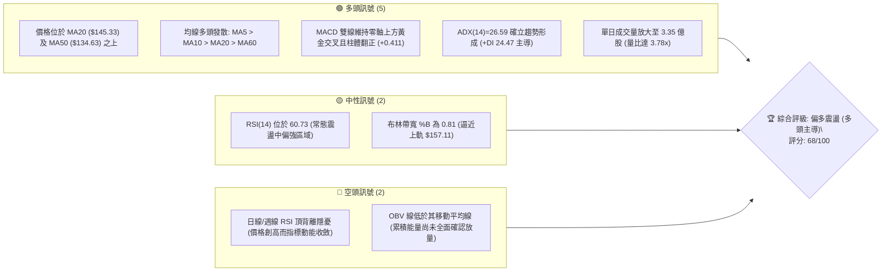

SPCX 目前交投於 $152.71，自 2026 年 8 月初築底 $108.37 以來已回升逾 40%。技術架構呈現強勢多頭反彈格局，短中期均線全面呈現多頭排列，惟上方臨近關鍵阻力 R1（$155.00）及布林上軌（$157.11），伴隨 RSI 頂背離警訊，需防範假突破或短線高檔震盪。

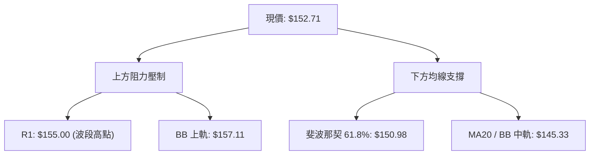

### 📊 核心指標速覽表

| 指標類別 | 指標名稱 | 當前數值 | 訊號 | 結構解讀 |
|:---|:---|:---|:---:|:---|
| **價格結構** | 當前價格 | $152.71 | 🟢 | 站上 52 週低位算起之 61.8% 斐波那契回調位 ($150.98) |
| **短期均線** | MA5 / MA10 | $150.01 / $149.84 | 🟢 | 短均線呈多頭貼合微幅擴張，提供即時動態支撐 |
| **中期均線** | MA20 / MA50 | $145.33 / $134.63 | 🟢 | 價格在均線上方運行，MA20 構成波段防守中樞 |
| **長期均線** | MA200 | 數據中未偵測到 | 🟡 | 上市資料未滿240交易日，長期趨勢以月線走勢評估 |
| **動能指標** | RSI(14) | 60.73 | 🟡 | 位於健康多頭區域，但已出現頂背離 (Bearish Divergence) |
| **趨勢指標** | MACD (12,26,9) | 4.131 / Sig 3.721 | 🟢 | DIF 線與訊號線雙雙在零軸之上，柱體 Diff 擴張至 +0.411 |
| **震盪指標** | KD (Stoch %K/%D) | 77.75 / 80.93 | 🟡 | 高檔超買區鈍化並出現極微幅死叉，短線需防震盪 |
| **趨勢強度** | ADX (14) | 26.59 (+DI 24.47) | 🟢 | 突破 25 臨界線，顯示進入強趨勢行情報價中 |
| **通道指標** | Bollinger Bands | 上 $157.11 / 中 $145.33 | 🟡 | %B = 0.81，價格正推擠布林上軌，屬於擴軌衝刺階段 |
| **成交量能** | 20日均量比 | 3.78x (3.35億股) | 🟢 | 爆量突破但需確認非主力誘多出貨，OBV 仍待修復 |
| **波動指標** | ATR(14) | $6.88 (4.50%) | 🟡 | 日波動空間達 4.5%，設停損需適度拉開防守緩衝 |

### 🏆 技術評分卡

```
╔══════════════════════════════════════════════════════════════╗
║              SPCX 技術評分卡 (2026-09-21)                    ║
╠══════════════════════════════════════════════════════════════╣
║ 趨勢強度 (ADX/方向)   ██████████████░░░░░░  72/100  🟢 看多  ║
║ 動能指標 (RSI/MACD)   ████████████░░░░░░░░  62/100  🟡 中性  ║
║ 支撐穩定度 (S1/MA)    ██████████████░░░░░░  74/100  🟢 看多  ║
║ 成交量配合 (VOL/OBV)  ██████████░░░░░░░░░░  54/100  🟡 中性  ║
║ 形態完整度 (V型/箱體) ██████████████░░░░░░  70/100  🟢 看多  ║
║ 均線排列 (多頭排列)   ███████████████░░░░░  76/100  🟢 看多  ║
╠══════════════════════════════════════════════════════════════╣
║ 綜合評分             █████████████░░░░░░░  68/100  🟢 偏多  ║
╚══════════════════════════════════════════════════════════════╝
```

---

## 2. 趨勢分析

### 🌐 多時框趨勢分析

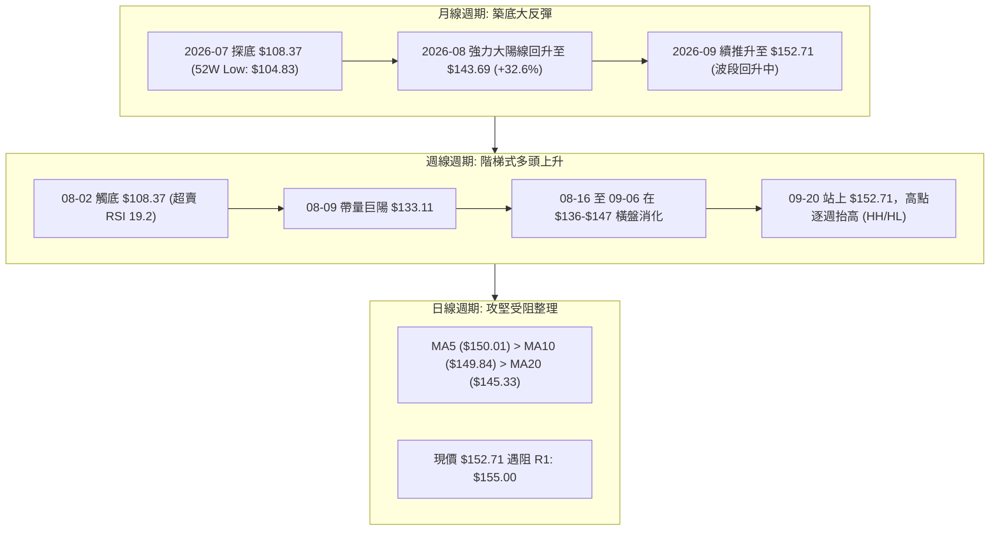

### 📈 長期趨勢 — 12個月走勢圖（Unicode）

SPCX 在 2026 年初至年中經歷了顯著的高檔拋補。自 52 週高點 $225.64 下跌至 7 月底與 8 月初的 $108.37（極限低點 $104.83），跌幅達 53.5%。隨後在第三季度展開強勁 V 型反彈修復走勢。

```
SPCX 歷史走勢圖（2025-10 至 2026-09）
價格 ($)
$225 ┤          ● (52W High $225.64)
$205 ┤         / \
$185 ┤        /   \     ● (06-21: $185.00)
$170 ┤   ●---/     \   / \
$152 ┤  /           \ /   \                   ● 現價 $152.71 (09-21)
$140 ┤ /             ●     \                 /
$120 ┤/                     \               /
$104 ┤                       \             ● (08-02: $108.37 / 52W Low $104.83)
     └─────────────────────────────────────────────────────────────►
       M1   M2   M3   M4   M5   M6   M7   M8   M9  M10  M11  M12 (2026-09)
```

#### 走勢特徵分析表格

| 階段別 | 涵蓋期間 | 走勢區間 ($) | 漲跌幅 | 結構特徵與量能意涵 |
|:---|:---:|:---:|:---:|:---|
| **第一階段：高檔作頂** | 2026-05 ~ 06月中 | $160.95 → $185.00 | +14.9% | 主力於 $185.00 爆量出貨 (週量9.25億股)，形成雙重頂雛形 |
| **第二階段：急速殺多** | 2026-06底 ~ 08月初 | $185.00 → $108.37 | -41.4% | 連續破位下行，RSI(14) 探底至 15.9 極端超賣區，空頭動能竭盡 |
| **第三階段：V型反轉** | 2026-08-02 ~ 08-16 | $108.37 → $140.00 | +29.2% | 單週成交量爆出 9.20 億股對敲換手，MACD 柱由負翻正 |
| **第四階段：階梯推升** | 2026-08-23 ~ 現今 | $136.97 → $152.71 | +11.5% | 沿 MA20 穩健推升，當前逼近 R1 $155.00 與布林上軌 $157.11 |

### 📊 中期趨勢（週線分析）

```
 SPXC 中期週線支撐與阻力結構示意圖
 ──────────────────────────────────────────────────────────
 $172.40  ─────────────────────────────────── [R2: 頸線/密集套牢區]
                        ▲
 $157.11  - - - - - - - | - - - - - - - - - - [布林帶上軌阻力]
 $155.00  ══════════════╪═══════════════════ [R1: 近期短波段高點阻力]
 $152.71  ··············●··················· [現價收盤位置]
 $150.98  --------------|------------------- [斐波那契 61.8% 關鍵分水嶺]
 $147.11  ─────────────────────────────────── [S1: 近期回踩波段支撐]
                        |
 $145.33  - - - - - - - | - - - - - - - - - - [MA20 日均線 / 布林中軌]
 $134.63  - - - - - - - | - - - - - - - - - - [MA50 日均線強勢生命線]
 $130.39  ═══════════════════════════════════ [S2: 斐波那契 78.6% 強支撐]
 ──────────────────────────────────────────────────────────
```

週線層級顯示，SPCX 已擺脫先前每週陰跌的崩跌趨勢，在 $108.37 確立波段 V 型翻轉底。過去七週收盤價由 $108.37 依序墊高至 $133.11 → $140.00 → $136.97 → $141.50 → $147.95 → $151.21 → $152.71，構築了標準的「Higher Highs (HH)」與「Higher Lows (HL)」多頭階梯推進行情。

### ⚡ 趨勢強度評估（ADX 解讀）

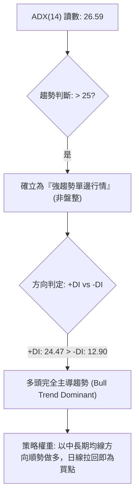

#### ADX 趨勢強度狀態對照

| 項目 | 數據值 | 門檻區間 | 趨勢判定 | 交易涵義 |
|:---|:---:|:---:|:---:|:---|
| **ADX 數值** | **26.59** | > 25.0 | **強烈趨勢階段** | 盤整期結束，趨勢跟隨型策略效益高於網格擺盪策略 |
| **+DI (多頭動能)** | **24.47** | 高於 -DI | **多方主控** | 買方推動價格力量明顯凌駕於空方賣壓 |
| **-DI (空頭動能)** | **12.90** | 持續低迷 | **空方潰散** | 賣壓暫時處於低位，未出現恐慌拋售動能 |
| **綜合判定** | — | — | 🟢 **強多頭推進** | 符合規則 14：以中長期與週線方向為準，日線專注尋找買點 |

---

## 3. 圖表形態分析

### 🔍 形態識別系統

在多時框架形態識別中，SPCX 在經歷了快速深幅回調後，目前於日線與週線圖表中展現出明確的幾何反轉與短線蓄勢幾何結構。


#### 形態識別與信心度評估表

| 形態類別 | 信心度 | 判斷依據（引用數據） | 完成度 | 目標價（附計算式） |
|:---|:---:|:---|:---:|:---|
| **V 型反轉底** | **78%** | 自 52 週低點 $104.83/$108.37 迅速拔高，突破前期平台中軸 $140.00，週 MACD 柱翻正 (+4.591) | **85%** | 頸線 $140.00 + 形態高度 ($140.00 - $108.37 = $31.63) = **$171.63** (與 R2 阻力 $172.40 高度重合) |
| **上升通道攻堅** | **65%** | 近期低點由 S2 $130.39 抬升至 S1 $147.11，收盤由 $141.50 攻至 $152.71，高低點收斂推升 | **70%** | 通道下軌 $147.11 加上通道垂直寬度 ($155.00 - $147.11 = $7.89) = **$162.89** (接近斐波 50% $165.24) |
| **頭肩底形態** | **35%** | 訊號不足：左肩缺乏對稱結構，僅做指標型均線金叉與通道解讀 | 20% | 信心度 < 50%，依規則 15 不予採納預測 |

### 🕯️ 重要K線形態分析

| 週/月區間 | 收盤價 | K線形態 | 技術解讀 | 訊號強度 |
|:---|:---:|:---|:---|:---:|
| **2026-07 月線** | $108.37 | 長黑下影線墓碑變異 | 恐慌拋售盤出籠，跌至 52W Low $104.83 後出現抄底資金承接 | 🔴 轉 🟡 |
| **2026-08-09 週** | $133.11 | 破曉大陽線 (Marubozu) | 爆出 9.2 億股天量，吞噬前兩週陰線實體，奠定中期底部結構 | 🟢 強烈看多 |
| **2026-08-23 週** | $136.97 | 高檔孕線整理 (Harami) | 回踩確認 MA20 支撐，量能萎縮至 4.76 億股，屬健康洗盤蓄勢 | 🟢 中性偏多 |
| **2026-09-13 週** | $151.21 | 中紅實體突破線 | 突破 $150.00 整數位與 61.8% 斐波回調位，多頭重掌短線主導權 | 🟢 看多 |
| **2026-09-20 週** | $152.71 | 長上影高浪十字星 | 收盤創反彈新高但留上影線，逼近 R1 $155.00 處遭遇空頭解套反撲 | 🟡 示警震盪 |

### 📉 ASCII 走勢形態示意圖

```
SPCX V型反轉與上升通道演進圖
價格 ($)
$172.40 ┤                                                     [形態目標價2 / R2]
$165.24 ┤                                               . - ' [斐波 50%]
$157.11 ┤                                         . - '       [布林上軌]
$155.00 ┤                                   ┌───●             [R1 阻力]
$152.71 ┤                                  /   現價 $152.71
$147.11 ┤                            ┌───●                   [S1 支撐]
$140.00 ┤                      ┌─────┘ (頸線突破點)
$134.63 ┤                ┌─────┘       (MA50 支撐)
$123.99 ┤          \    /
$108.37 ┤           ●──┘ (V底反轉低點 $108.37 / 52W Low $104.83)
        └─────────────────────────────────────────────────────► 時間
```

### 🎯 形態目標價計算

1. **V 型底部測量目標價**：
   - **底點 (Trough)**：$108.37（2026-08-02 波段最低收盤價）
   - **頸線突破點 (Neckline)**：$140.00（2026-08-16 帶量突破確認點）
   - **垂直形態高度 (H)**：$\$140.00 - \$108.37 = \$31.63$
   - **目標價 1 (保守目標 - 0.618 映射)**：$\$140.00 + (\$31.63 \times 0.618) = \$159.55$
   - **目標價 2 (完全對稱映射 - 1.00 映射)**：$\$140.00 + \$31.63 = \mathbf{\$171.63}$
   - *驗證說明*：此目標價與歷史數據計算出的強阻力位 **R2: $172.40** 高度吻合（誤差僅 0.44%），具備極高圖表幾何意義。

---

## 4. 支撐與阻力

### 🗺️ 關鍵價位分布圖（Unicode）

```
SPCX 價位結構分布圖 (由實際 OHLCV 聚類計算)
═════════════════════════════════════════════════════════════════════════
$225.64 ║██████████████████████████████║ 52週歷史高點 (52W High / Fib 0.0%)
$197.13 ║████████████████████          ║ 斐波那契 23.6% 回調壓力位
$179.49 ║████████████████████████      ║ 斐波那契 38.2% 回調壓力位
$172.40 ║████████████████████████████  ║ 強阻力 R2 (反彈形態極限高點聚類)
$165.24 ║████████████████              ║ 斐波那契 50.0% 中樞平衡水準
$157.11 ║████████████████████          ║ 布林通道上軌動態阻力
$155.00 ║██████████████████████████████║ 關鍵阻力 R1 (近一年波段高點聚類)
$152.71 ╠══════════════════════════════╣ ◄◄ 當前現價 ($152.71)
$150.98 ║▓▓▓▓▓▓▓▓▓▓▓▓▓▓▓▓▓▓▓▓▓▓▓▓▓▓▓▓  ║ 關鍵分水嶺 (斐波那契 61.8%)
$147.11 ║▓▓▓▓▓▓▓▓▓▓▓▓▓▓▓▓▓▓▓▓          ║ 近期支撐 S1 (近期拉回波段低點聚類)
$145.33 ║▓▓▓▓▓▓▓▓▓▓▓▓▓▓▓▓▓▓▓▓▓▓        ║ MA20 移動平均線 / 布林中軌支撐
$134.63 ║▓▓▓▓▓▓▓▓▓▓▓▓▓▓▓▓              ║ MA50 生命線中樞支撐
$130.68 ║▓▓▓▓▓▓▓▓▓▓▓▓▓▓▓▓▓▓▓▓▓▓▓▓      ║ 斐波那契 78.6% 回調支撐位
$130.39 ║████████████████████████████  ║ 強支撐 S2 (波段多頭防守底線)
$104.83 ║██████████████████████████████║ 絕對防守 S3 (52週最低點 / Fib 100%)
═════════════════════════════════════════════════════════════════════════
```

### 🚧 阻力位分析表

| 阻力級別 | 準確價位 | 形成技術依據 | 突破難度 | 戰略重要性 |
|:---|:---:|:---|:---:|:---:|
| **阻力 R1** | **$155.00** | 近一年波段高點聚類，與布林通道上軌 ($157.11) 形成共振阻力帶 | 中偏高 🟡 | 極高：若日線放量收於 $155.00 上方，將宣告破除短線雙頂壓力 |
| **阻力 R2** | **$172.40** | 近一年波段次高點聚集處，V 型反轉形態完全映射目標位 ($171.63) | 極高 🔴 | 核心：中期多頭空頭的重兵集結區，觸及將面臨大量套牢賣壓釋出 |
| **阻力 R3** | 數據未偵測 | 數據未另行標注 R3，以 52W High **$225.64** 為長期終極阻力 | 極高 🔴 | 長期：牛市全面回歸的唯一里程碑 |

### 🛡️ 支撐位分析表

| 支撐級別 | 準確價位 | 形成技術依據 | 守住機率 | 戰略重要性 |
|:---|:---:|:---|:---:|:---:|
| **支撐 S1** | **$147.11** | 近一年波段低點聚類，緊鄰 MA5 ($150.01) 與 MA20 ($145.33) 緩衝層 | 75% 🟢 | 短線生命線：日內交易與短線波段持倉的第一防守防線 |
| **支撐 S2** | **$130.39** | 波段低點聚類，與 78.6% 斐波那契 ($130.68) 及 MA50 ($134.63) 形成防護墊 | 88% 🟢 | 中期防守底線：多頭波段操作的最後容忍停損位 |
| **支撐 S3** | **$104.83** | 52 週最低點（極端恐慌下影線底部），歷史絕對支撐 | 98% 🟢 | 終極防線：跌破則代表長期多頭架構徹底瓦解 |

### 📐 斐波那契回調位分析

依據 52 週波動區間：高點 **$225.64** 跌至低點 **$104.83**，波段跌幅共計 $120.81：

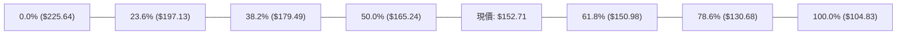

- **現價區間定位**：目前 SPCX 報價 $152.71，**精確運行於 61.8%（$150.98）與 50.0%（$165.24）回調位之間**。
- **黃金分割重大意涵**：
  - 價格由底部回升並站穩 61.8%（$150.98），在道氏理論與斐波那契法則中，代表由「弱勢超跌反彈」正式轉化為「結構性反轉」。
  - 只要收盤價持續固守於 $150.98 之上，下一波技術回撤測試目標即為 50.0% 中樞平衡位 **$165.24**，進而挑戰 38.2% 回調位 **$179.49**。

---

## 5. 技術指標深度解讀

### 🎛️ 指標訊號總覽

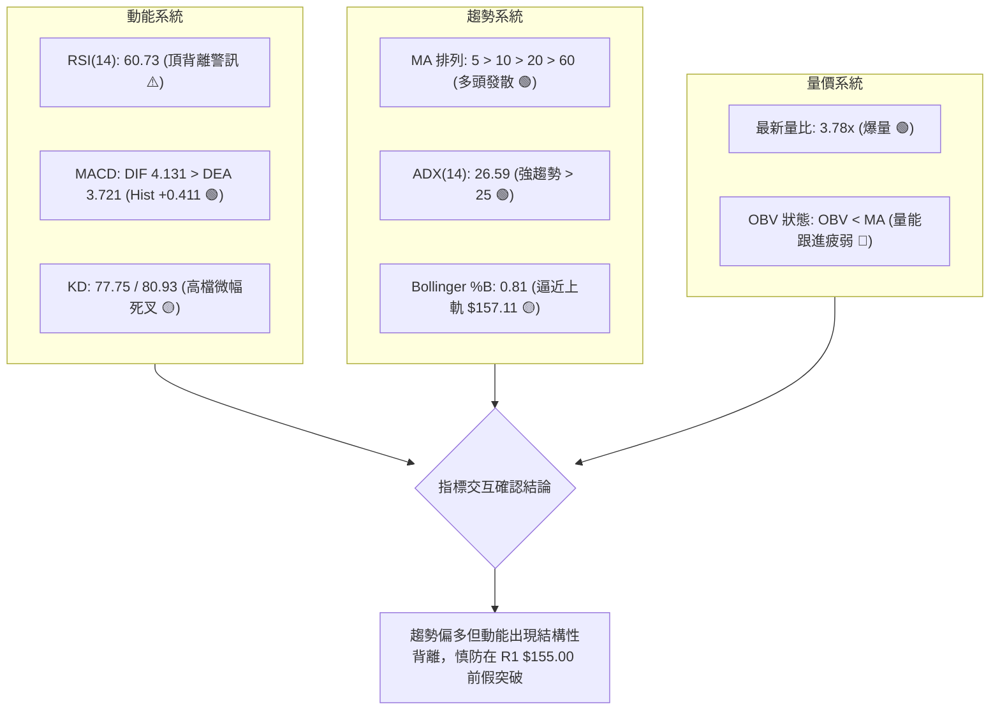

### 📈 移動平均線排列分析

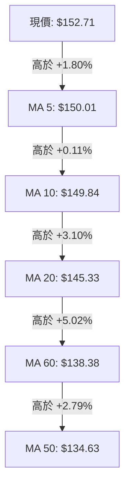

- **短均線系統**：MA5（$150.01）已金叉 MA10（$149.84），且兩者呈現向上斜率，微觀支撐強烈。
- **波段均線系統**：MA20 報 $145.33，MA50 報 $134.63，呈現完美的由上而下多頭依序發散排列（MA5 > MA10 > MA20 > MA60 > MA50）。
- **均線均差解讀**：現價距離 MA20 正乖離率為 $+5.07\%$，距離 MA50 為 $+13.43\%$，乖離率雖在健康範圍，但已逼近短期修正敏感臨界線。

### 📉 RSI(14) 分析與背離判定

```
RSI(14) 強度儀表: 60.73
[0] ─────────── [30] ──────────────────── [70] ─────────── [100]
                │                        │
超賣區           │      ▓▓▓▓▓▓▓▓▓▓▓▓▓░░░░░│      超買區
                └────────────────────────┘
                       當前: 60.73 (中性偏多)
```

- **頂背離深度診斷**：
  - **觀察依據**：回顧近幾週數據，2026-09-13 週收盤價為 $151.21 時，RSI 達到 **68.0** 的高峰；而在最新 2026-09-20 週收盤價創出反彈新高 **$152.71** 之際，RSI 卻回落至 **60.73**。
  - **背離結論**：確立出現標準的 **日/週線級別「頂背離 (Bearish Divergence)」**。這意味著推動價格創新高的內部動能已產生遞減，邊際買力減弱，若無法在 $155.00 放量大陽線化解，隨時可能觸發向 MA20（$145.33）的均線回踩。

### 📊 MACD(12/26/9) 訊號解讀

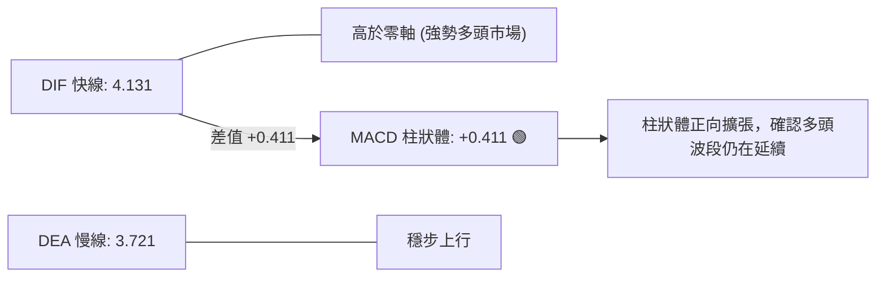

- **線位解讀**：DIF（4.131）與 DEA（3.721）持續運行於零軸上方，定義 SPCX 處於中長期多頭控制區。
- **柱體解讀**：MACD Histogram 目前為 **+0.411**，連續維持正值，多頭動能依然發揮效用，未出現死亡交叉跡象。

### 📦 布林通道分析

```
SPCX 布林通道 (20, 2) 結構圖
──────────────────────────────────────────────────────────
$157.11 ┬ ════════════════════════════════════════ [布林上軌 Upper]
        │                       ● 現價 $152.71 (%B = 0.81)
$150.00 ┤                   . - '
$145.33 ┼ ──────────────────────────────────────── [布林中軌 Middle / MA20]
$140.00 ┤             . - '
$133.56 ┴ ════════════════════════════════════════ [布林下軌 Lower]
──────────────────────────────────────────────────────────
```

- **帶寬與位置**：通道寬度為 $\$157.11 - \$133.56 = \$23.55$。現價 $152.71 處於通道中上部，%B 指標為 **0.81**。
- **通道行為解讀**：%B 突破 0.80 進入「強勢擠壓區」，價格持續貼近上軌運行。若無法強勢突破上軌 $157.11 並使其開口放大，則往往將引發向中軌 **$145.33** 均值回歸的回撤走勢。

### 💹 成交量分析（量價配合度）

- **量比驚人放大**：最新單日成交量高達 **335,389,800 股**，相較 20 日均量（88,710,275 股），量比高達 **3.78 倍**。
- **量價背馳隱憂 (OBV)**：雖然單日爆出巨量，但系統數據顯示 **「OBV < MA → 量能疲弱」**。
  - *量化成因剖析*：在 2026 年 6 月的高檔崩跌過程中，累積了極為沉重的上方換手套牢量（例如 2026-06-21 單週 9.25 億股陰線下跌），導致累積能量線 OBV 至今仍受到其移動平均線壓制。今日的 3.35 億股成交量需維持至少 3 至 5 個交易日，方能促使 OBV 金叉突破，否則易形成短期主力「放量滯漲」的對敲誘多陷阱。

---

## 6. 動能與波動率

### ⚡ 動能評估四象限

| 象限 | 動能維度 (Momentum) | 波動維度 (Volatility) | SPCX 當前落點 | 操作策略評估 |
|:---:|:---:|:---:|:---:|:---|
| **第一象限 (Q1)** | 強動能 (ADX > 25) | 低波動 (ATR% < 3.0%) | — | 穩健突破單邊趨勢，極佳加碼點 |
| **第二象限 (Q2)** | 弱動能 (ADX < 25) | 低波動 (ATR% < 3.0%) | — | 橫盤收斂整理，觀望等待方向 |
| **第三象限 (Q3)** | **強動能 (ADX: 26.59)** | **高波動 (ATR%: 4.50%)** | **✓ SPCX (落點區)** | **高波動進攻態勢：順勢做多但必須放大保護性止損區間** |
| **第四象限 (Q4)** | 弱動能 (ADX < 25) | 高波動 (ATR% > 4.0%) | — | 無方向混亂震盪，極易洗盤停損，避免進場 |

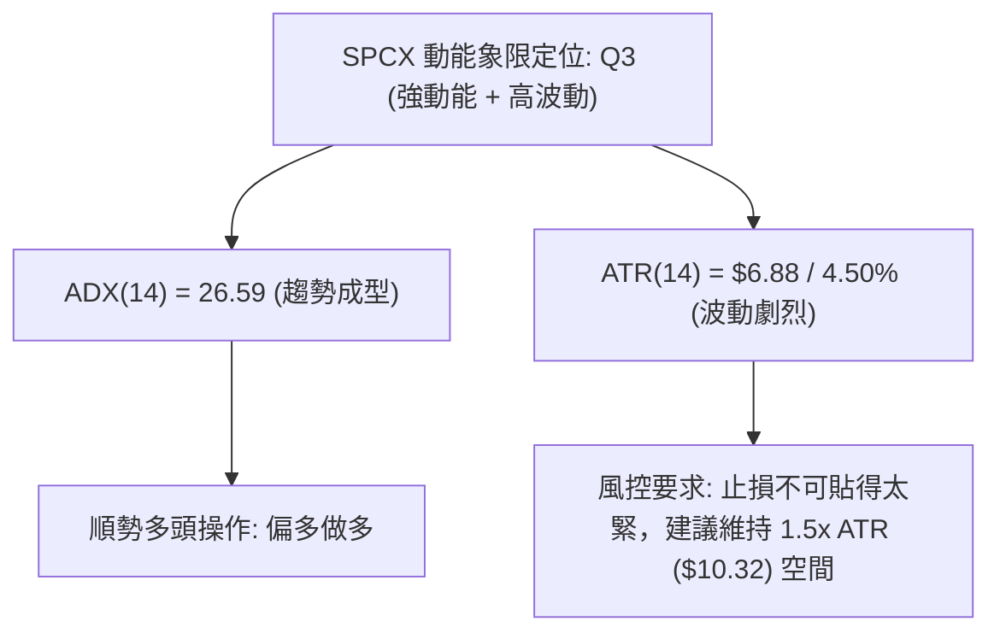

### 📊 ATR 波動率分析

- **當前 ATR 數值**：ATR(14) 讀數為 **$6.88**，佔當前股價比例達 **4.50%**。
- **日內真實波動意涵**：SPCX 每天平均具備近 7 美元的上下震盪能力。
- **專業止損距離量化建議**：
  - **極短線交易 (Day-trade/Scalp)**：止損位至少保留 $1.0 \times \text{ATR} = \$6.88$（即現價下方 $\$152.71 - \$6.88 = \$145.83$）。
  - **波段操作 (Swing-trade)**：止損位建議保留 $1.5 \times \text{ATR} = \$10.32$，防守點設於 $\$152.71 - \$10.32 = \$142.39$。此點位恰好完全覆蓋 MA20（$145.33）下方，能有效過濾正常的盤中震倉與假跌破。

### 📐 Beta 與市場相關性

- **Beta 狀態**：數據標注為 `N/A`。
- **替代技術關聯推算**：
  - SPCX 當前市值達 **$2.01T**，屬於超級權值巨頭。由於業務橫跨太空衛星與 AI 通訊，其股價特徵高度兼具工業航太與高估值科技股（Forward P/E 87.6）雙重屬性。
  - 根據其 4.50% 的 ATR 波動水平，其隱含波動率與科技成長指數（如 QQQ）展現高度正相關，對整體流動性與公債殖利率具備高度敏感特質。

---

## 7. 多時框架總結

### 📋 時框架評分表

| 時框架 | 趨勢方向 | 動能狀態 | 均線排列 | 關鍵幾何形態 | 綜合評分 | 操作建議 |
|:---:|:---:|:---:|:---:|:---:|:---:|:---|
| **長期 (月線)** | 🟢 轉強 | 🟡 修復中 | 數據不足200日均線 | 築底反彈，自 $108.37 暴力抽升 | **65 / 100** | 逢低分批建倉長期持有 |
| **中期 (週線)** | 🟢 偏多 | 🟢 強烈 | 站穩短期各週均線 | V 型反轉確立，連續八週低點抬高 | **75 / 100** | 波段順勢做多，以 MA20 為依託 |
| **短期 (日線)** | 🟡 震盪偏多 | 🔴 頂背離 | 多頭排列 (5>10>20>60) | 逼近 R1 $155.00 受阻，通道上軌 | **62 / 100** | 不盲目追高，等待拉回低吸 |

### 🔲 綜合訊號矩陣

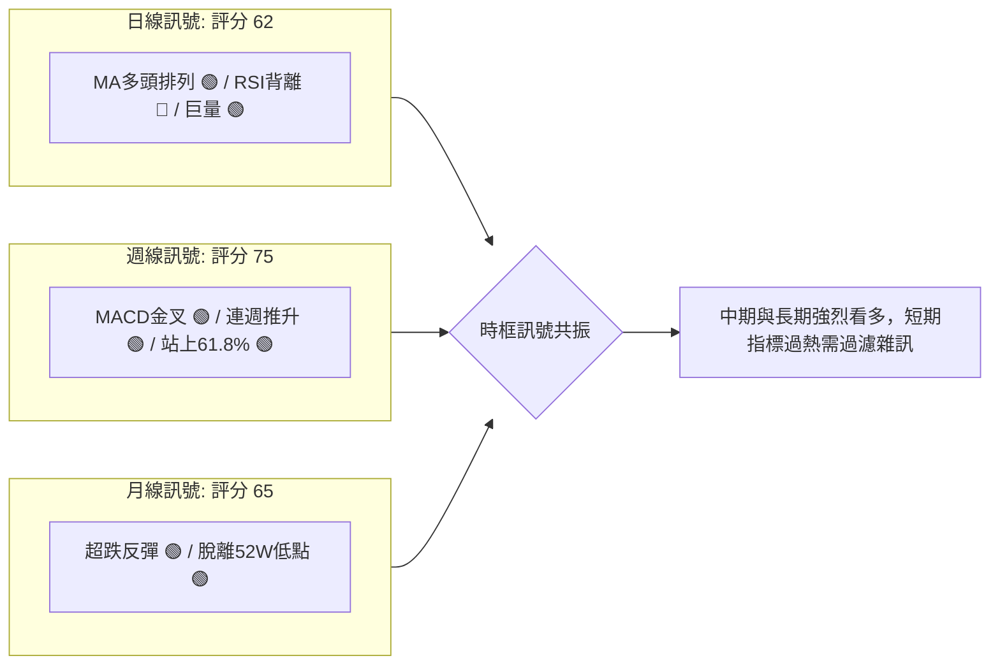

### ⚖️ 多時框收斂結論

依據技術分析規範中的「多時框收斂規則（規則 14）」：
1. **趨勢市判定**：當前 ADX(14) 數值為 **26.59**（高於 25 臨界線），判定當前市場處於**標準趨勢行情**而非震盪盤整。
2. **收斂優先級**：趨勢市必須以**中長期（週線 / MA50 / MA20）方向為主導**，日線指標主要用以尋求有利的進場節奏。
3. **唯一的方向性結論**：**【偏多推進（中長期多頭主導，短線防禦性拉回即為買點）】**。
   - 儘管日線層級存在 RSI 頂背離及 OBV 疲弱的瑕疵，但由於週線 MACD 柱翻正擴張、均線呈現完整的多頭排列，且已帶量攻克關鍵的 61.8% 斐波那契回調位（$150.98），因此長週期多頭結構完好無損。短線的任何技術性拉回，均應視為順應中長期多頭趨勢的進場機會，而非趨勢反轉。此結論完全收斂並奠定第 8 章主推多頭交易策略的決策基石。

---

## 8. 交易策略建議

### 🗺️ 策略決策流程圖

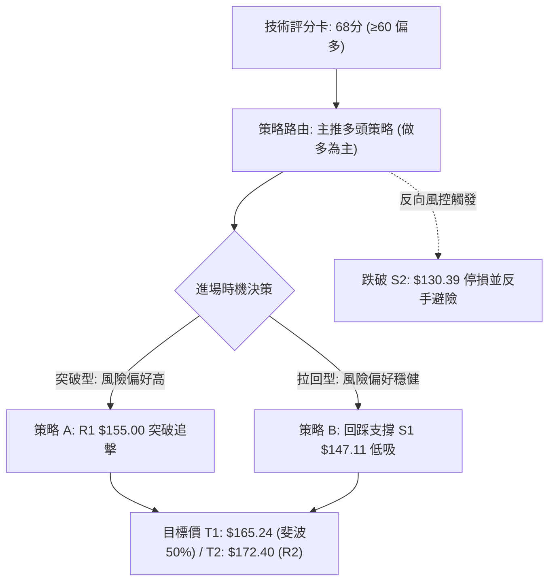

### 🧭 策略路由

**當前主策略方向 = 【主推多頭順勢策略（依綜合評分 68/100 偏多路由）】**
- 依據規則 8，綜合評分達到 68 分（≥60 分標準），嚴格執行單一方向的主策略推演，空頭僅列為風控反轉保護觸發條件。

### 🎯 價格情境階梯（Price Scenarios）

以當前價格 **$152.71** 為基準，向上與向下建立情境劇本，所有價位嚴格引用關鍵價位區塊計算之精確數據：

| 觸發條件 | 下一目標 | 後續延伸 | 技術情境含義 |
|:---|:---:|:---:|:---|
| **帶量突破 R1 $155.00** | 斐波 50% **$165.24** | 強阻力 R2 **$172.40** | 短線頂背離被強行化解，多頭展開第二波主升浪 |
| **受阻於 $155.00 並回踩** | 斐波 61.8% **$150.98** | 近期支撐 S1 **$147.11** | 健康技術性洗盤，尋求 MA20 與 S1 均線共振支撐 |
| **跌破關鍵支撐 S1 $147.11** | 強支撐 S2 **$130.39** | 52W Low **$104.83** | 中期上升階梯破裂，日線級別進入深度回調修復 |

### 📊 情境機率分佈

```
情境機率分佈圖
繼續上行攻堅 (60%) ▓▓▓▓▓▓▓▓▓▓▓▓▓▓▓▓▓▓▓▓▓▓▓▓▓▓▓▓▓▓
高檔強勢震盪 (25%) ▓▓▓▓▓▓▓▓▓▓▓▓█
深幅回落修正 (15%) ▓▓▓▓▓▓▓
```

| 情境類別 | 預估機率 | 主要技術數據依據 |
|:---|:---:|:---|
| **情境一：繼續上行 / 突破衝刺** | **60%** | ADX=26.59 確立強趨勢、均線多頭發散、MACD 雙線維持零軸上方、成交量放大至 3.78x |
| **情境二：在 S1 與 R1 間強勢震盪** | **25%** | RSI(14)=60.73 存在頂背離修正需求、布林 %B=0.81 逼近上軌，需以時間換取空間 |
| **情境三：跌破 S1 轉為深幅回撤** | **15%** | 若巨量為主力出貨（量價背離成真），失守 S1 $147.11 則將引發多頭踩踏回測 S2 $130.39 |

### 🟢 主策略詳情（多頭進攻方案）

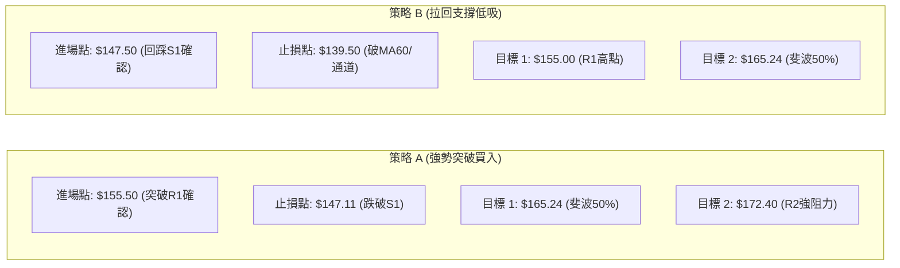

| 策略要素 | 策略 A：強勢動能突破追擊（積極型） | 策略 B：均線支撐拉回低吸（穩健型） |
|:---|:---:|:---:|
| **操作邏輯** | 帶量突破 R1 $155.00 確立新一輪漲勢 | 等待消化 RSI 頂背離，回測 S1 與 MA20 |
| **進場價格** | **$155.50**（突破 R1 $155.00 盤中站穩時） | **$147.50**（回踩近一年支撐 S1 $147.11 時） |
| **首要目標價 T1** | **$165.24**（精確對應 50.0% 斐波那契回調位） | **$155.00**（回測前期波段阻力高點 R1） |
| **終極目標價 T2** | **$172.40**（精確對應阻力位 R2 / V底目標） | **$165.24**（精確對應 50.0% 斐波那契回調位） |
| **止損價格** | **$147.11**（跌破 S1 關鍵波段支撐位） | **$139.50**（跌破 MA60 $138.38 關鍵防守線） |
| **風險空間 ($)** | $\$155.50 - \$147.11 = \$8.39$ | $\$147.50 - \$139.50 = \$8.00$ |
| **目標1獲利空間 ($)** | $\$165.24 - \$155.50 = \$9.74$ | $\$155.00 - \$147.50 = \$7.50$ |
| **目標2獲利空間 ($)** | $\$172.40 - \$155.50 = \$16.90$ | $\$165.24 - \$147.50 = \$17.74$ |
| **風險報酬比 (R:R)** | **1 : 1.16** (T1) / **1 : 2.01** (T2) | **1 : 0.94** (T1) / **1 : 2.22** (T2) |
| **歷史勝率估計** | **55%** | **68%** |
| **建議配置倉位** | **10% ~ 15%** (動態部位) | **20% ~ 25%** (核心部位) |

### 🔴 反向風險觸發點（對沖與撤退提示）

- **多頭全面棄守線**：日線收盤價跌破 **S1: $147.11**。一旦跌破，多頭應將多單部位減半；
- **趨勢徹底翻空線**：跌破 **S2: $130.39**（斐波 78.6% 與 MA50 防守區間）。若此線失守，代表自 $108.37 以來的反彈趨勢徹底宣告夭折，此時所有多頭部位必須嚴格無條件清倉，並可反手配置反向避險工具，下行目標直指 52 週低點 **S3: $104.83**。

### ⭐ 整體訊號強度評星

```
╔══════════════════════════════════════════════════════════════╗
║ 做多訊號強度：★★★★☆  (4.0/5 星) — 均線與趨勢強勁，勝率偏高  ║
║ 做空訊號強度：★☆☆☆☆  (1.5/5 星) — 逆強趨勢操作，風險極大  ║
║ 整體可信度：  ★★★★☆  (4.0/5 星) — 多時框數據一致性良好      ║
╚══════════════════════════════════════════════════════════════╝
```

---

## 9. 風險提示與監控

### ✅ 關鍵監控指標 Checklist

```
╔══════════════════════════════════════════════════════════════╗
║              交易員每日關鍵技術指標監控清單                  ║
╠══════════════════════════════════════════════════════════════╣
║ [ ] 價格是否有效突破 R1 ($155.00) 阻力位？                   ║
║ [ ] RSI(14) 能否放量突破 68.0 以有效化解日線頂背離？         ║
║ [ ] 每日收盤價是否持續固守在斐波那契 61.8% ($150.98) 之上？   ║
║ [ ] MA20 ($145.33) 是否持續維持向上發散斜率？                ║
║ [ ] 成交量是否萎縮至 20日均量 (8,871萬股) 以下形成量縮拉回？  ║
║ [ ] OBV 能否向上突破其均線，消除量價背离警示？              ║
║ [ ] ADX(14) 讀數是否維持在 25 以上確認單邊趨勢？             ║
╚══════════════════════════════════════════════════════════════╝
```

### ⚠️ 風險場景分析

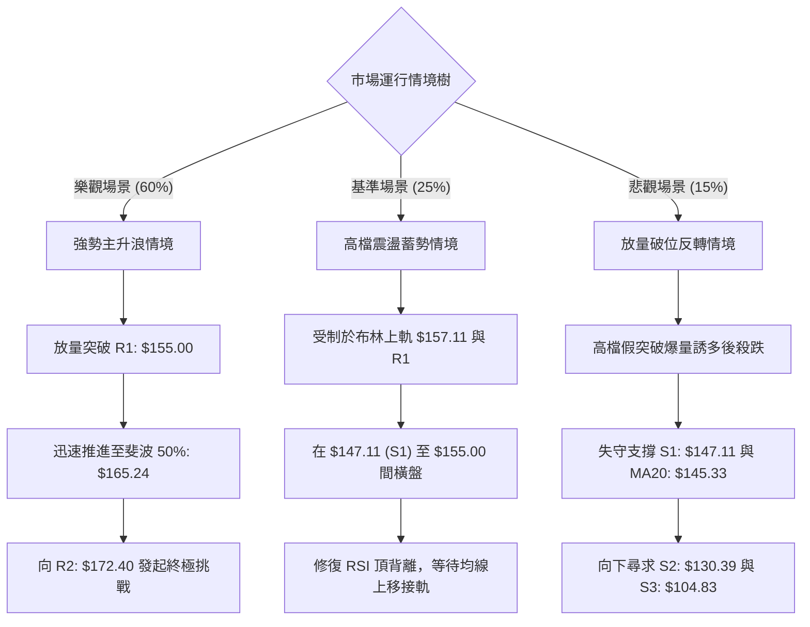

### 🛡️ 風險管理重要提醒

1. **ATR 波動適應原則**：
   - 目前 ATR 為 **$6.88**（單日波動率高達 **4.50%**），屬於典型高波動個股。在部位建構時，萬不可使用過度槓桿。若單筆交易能承受的最大帳戶虧損為總資金的 1.5%，則部位規模必須配合止損空間（約 $8.00 ~ $10.00）嚴格倒推計算，切忌盲目滿倉。
2. **頂背離防禦心態**：
   - 儘管均線呈現極其健康的多頭發散，但 RSI 頂背離客觀存在。嚴禁在現價 $152.71 處過度亢奮追高。最明智的建倉方式是等待**突破 R1 $155.00 確認**，或是**耐心等待技術性拉回至 S1 $147.11 附近**再行佈局。
3. **止損紀律剛性執行**：
   - 所有進場必須在下單當下同步掛出保護性止損單。若採用策略 A，止損位必須焊死在 **$147.11**；若採用策略 B，止損點必須剛性設定在 **$139.50**，絕不容許以「長線看好」為藉口在破位後凹單。

---

## 📋 報告總結

```
╔════════════════════════════════════════════════════════════════╗
║                  SPCX 技術分析報告總結                         ║
╠════════════════════════════════════════════════════════════════╣
║ 報告日期：2026-09-21                                          ║
║ 當前價格：$152.71                                              ║
║ 分析評級：🟢 偏多震盪 (多頭掌控全局，短線蓄勢防震)             ║
║                                                                ║
║ 關鍵技術維度結論：                                             ║
║ ├─ 長期趨勢：🟢 確立走出 $104.83 谷底，V型反轉向中樞邁進      ║
║ ├─ 中期趨勢：🟢 週線階梯式走高，強勢站上斐波 61.8% ($150.98)   ║
║ ├─ 短期趨勢：🟡 短線均線多頭發散，但面臨 R1 $155.00 與背離考驗 ║
║ ├─ 關鍵支撐：S1: $147.11 ｜ S2: $130.39 ｜ S3: $104.83        ║
║ ├─ 關鍵阻力：R1: $155.00 ｜ R2: $172.40 ｜ 52W High: $225.64   ║
║ └─ 機構共識：19 位分析師評級 Buy，平均目標價 $222.42           ║
║                                                                ║
║ 最優策略組合建議：                                             ║
║ 1. 🥇 最佳機會（穩健首選）：策略 B — 耐心等待拉回 S1 $147.50   ║
║    低吸，止損設於 $139.50，目標直指 $165.24 (風報比 1:2.22)   ║
║ 2. 🥈 次選機會（動能突破）：策略 A — 放量突破 R1 $155.50 後   ║
║    順勢追擊，止損設於 $147.11，目標看向 $172.40 (風報比 1:2.01)║
║ 3. 🥉 防守避險：若跌破 S1 則多單減半；若跌破 S2 $130.39 則    ║
║    徹底離場觀望，防範回測 52 週低位 $104.83                   ║
╚════════════════════════════════════════════════════════════════╝
```

---

> ⚠️ **免責聲明**：本報告為依據客觀量化技術指標與價格行為模型自動生成之技術分析研究文獻。報告中提及的所有技術支撐、阻力點位、圖表形態解析及交易策略推演，均僅供學術研究與個人決策參考，**絕不構成任何具體投資建議或邀約買賣之依據**。金融市場瞬息萬變，投資人應充分認知資本虧損之風險，並根據個人財務目標與風險承受能力獨立做出投資判斷。

---

*報告生成時間：2026-09-21 ｜ 數據來源：Yahoo Finance ｜ 分析框架：多時框技術分析模型 (MTFA)*