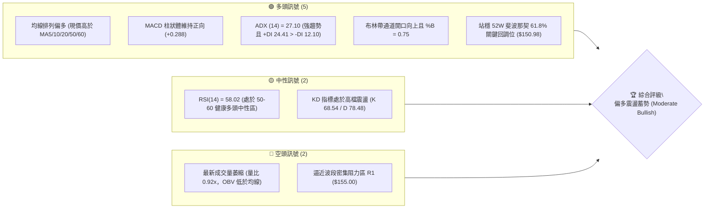
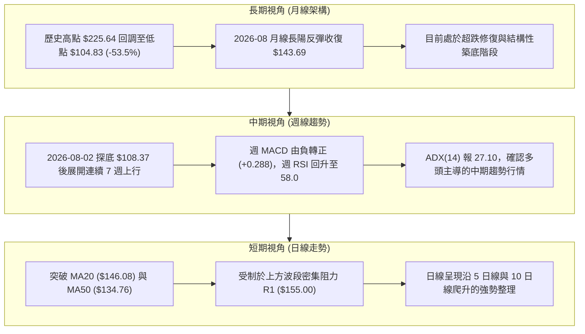
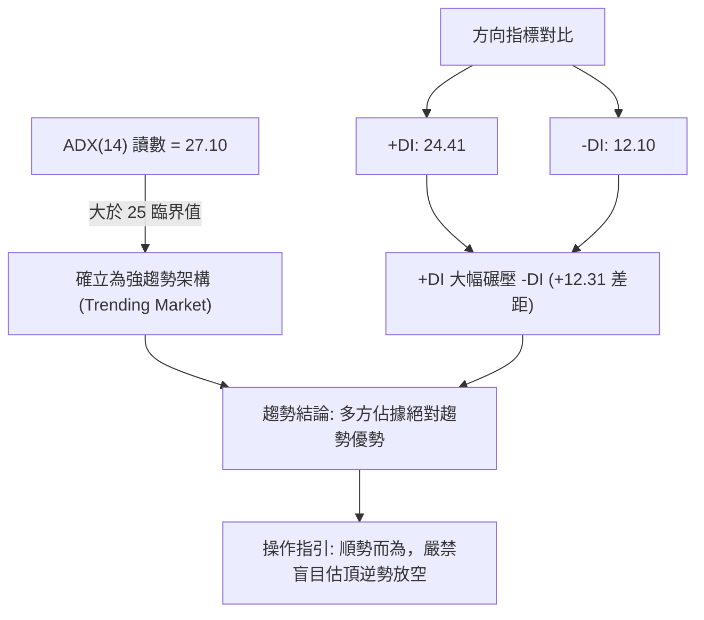
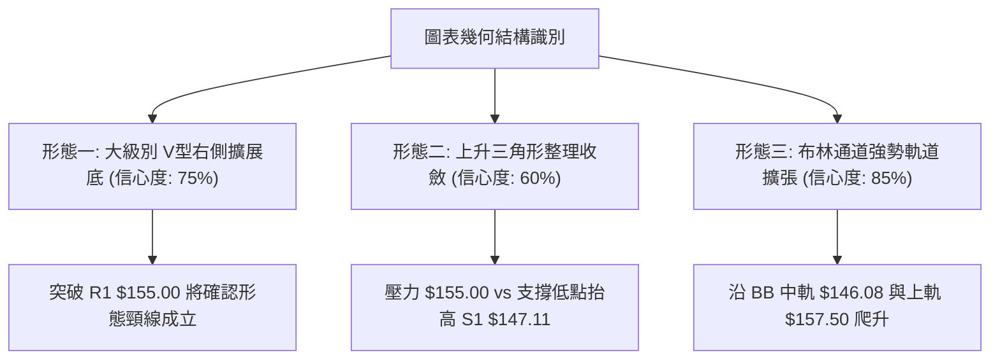
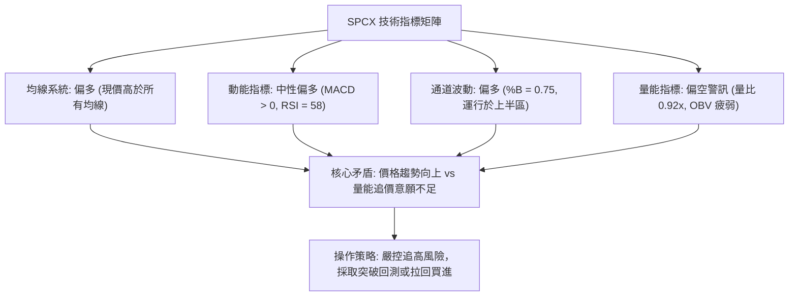
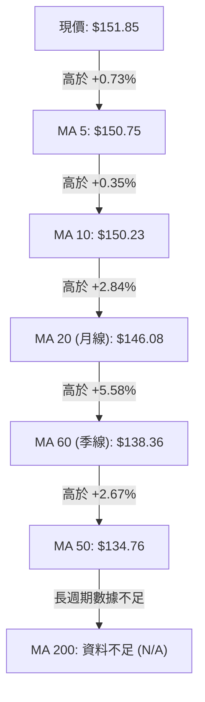
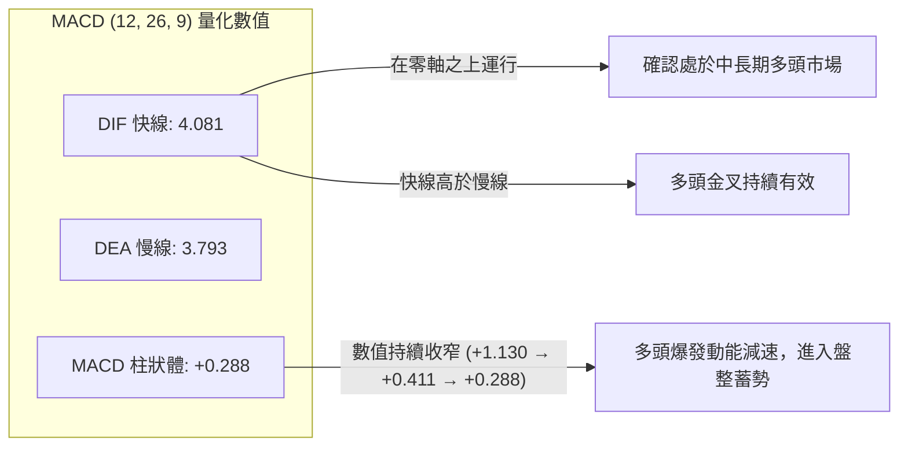
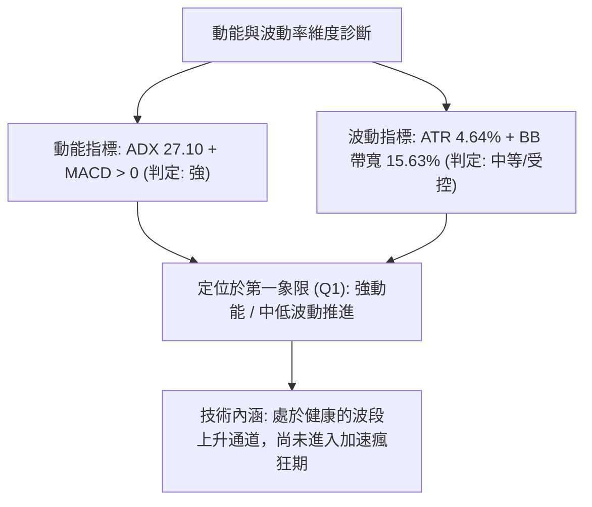
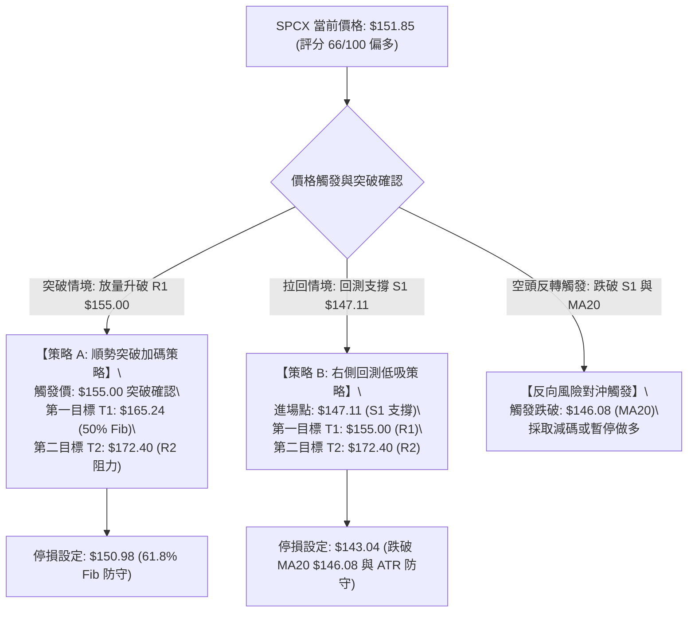
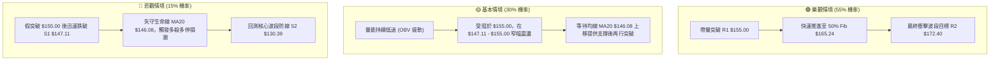

# SPCX 技術分析報告

> **報告日期**：2026-09-22 ｜ **語言**：繁體中文 ｜ **數據來源**：Yahoo Finance ｜ **當前價格**：$151.85

---

## 目錄

| 章節 | 內容 |
|------|------|
| [1. 技術面概覽](#1-技術面概覽) | 訊號儀表板、核心指標、評分卡 |
| [2. 趨勢分析](#2-趨勢分析) | 多時框趨勢、長中短期走勢 |
| [3. 圖表形態分析](#3-圖表形態分析) | 形態識別、K線組合、目標價 |
| [4. 支撐與阻力](#4-支撐與阻力) | 關鍵價位、斐波那契回調 |
| [5. 技術指標深度解讀](#5-技術指標深度解讀) | MA/RSI/MACD/布林/成交量 |
| [6. 動能與波動率](#6-動能與波動率) | 動能評估、ATR、Beta |
| [7. 多時框架總結](#7-多時框架總結) | 時框架評分矩陣 |
| [8. 交易策略建議](#8-交易策略建議) | 多空策略、風險報酬比 |
| [9. 風險提示與監控](#9-風險提示與監控) | 監控指標、風險場景 |

---

## 1. 技術面概覽

### 🎯 技術訊號儀表板



### 📊 核心指標速覽表

| 指標類別 | 指標名稱 | 當前數值 | 訊號 | 解讀 |
|:---|:---|:---|:---:|:---|
| **價格** | 當前收盤價 | $151.85 | 🟢 | 自波段低點 $104.83 反彈，位於 52 週區間 38.9% 分位 |
| **均線** | 短期 MA5 / MA10 | $150.75 / $150.23 | 🟢 | 股價緊貼短期均線上行，均線多頭扣抵助漲 |
| **均線** | 中期 MA20 (月線) | $146.08 | 🟢 | 股價高於 MA20 達 +3.95%，短期生命線支撐穩固 |
| **均線** | 中長期 MA50 / MA60 | $134.76 / $138.36 | 🟢 | 股價大幅高於 MA50 (+12.68%)，中長期底部成形 |
| **均線** | 長期 MA200 | 資料不足 (N/A) | 🟡 | 上市時間未滿 200 交易日，長期趨勢以週線 MA50 參照 |
| **動能** | RSI(14) | 58.02 | 🟢 | 位於 50 榮枯線上方，無頂背離跡象，動能健康 |
| **動能** | MACD (12,26,9) | DIF 4.081 / DEA 3.793 | 🟢 | 雙線位於零軸之上黃金交叉，Histogram 為 +0.288 看多 |
| **動能** | 隨機指標 (Stoch %K/%D) | 68.54 / 78.48 | 🟡 | 進入超買邊緣回測，呈現強勢高檔鈍化跡象 |
| **趨勢強度**| ADX(14) / 方向線 | 27.10 (+DI 24.41 / -DI 12.10) | 🟢 | ADX > 25 確認處於明確趨勢，+DI 遠大於 -DI 確立多方主控 |
| **通道** | 布林通道 (BB 20,2) | 上軌 $157.50 / 下軌 $134.66 | 🟢 | %B 為 0.75，股價運行於中軌與上軌間的多頭強勢通道 |
| **成交量** | 最新量 / 20日均量 | 81.89M / 88.87M (0.92x) | 🔴 | 量能稍顯萎縮，OBV 低於均線，呈量價輕微背離 |
| **波動** | ATR(14) | $7.04 (佔股價 4.64%) | 🟡 | 日內波動適中，提供動態止損與進場安全邊界參照 |

### 🏆 技術評分卡

```
╔══════════════════════════════════════════════════════════════╗
║              SPCX 技術面量化評分卡 (2026-09-22)               ║
╠══════════════════════════════════════════════════════════════╣
║ 趨勢強度 (ADX & DMI)  ██████████████░░░░░░  72/100  🟢 偏強  ║
║ 動能指標 (MACD & RSI) █████████████░░░░░░░  68/100  🟢 偏多  ║
║ 支撐穩定度 (S1-S3防禦) ████████████████░░░░  78/100  🟢 穩固  ║
║ 成交量配合 (OBV & 均量)████████░░░░░░░░░░░░  42/100  🔴 偏弱  ║
║ 圖表形態完整度        ████████████░░░░░░░░  62/100  🟢 中等  ║
║ 均線排列系統          ███████████████░░░░░  75/100  🟢 偏多  ║
╠══════════════════════════════════════════════════════════════╣
║ 綜合技術評分          █████████████░░░░░░░  66/100  🟢 偏多  ║
║ 總結評級：【 偏多蓄勢待發 — 突破前夕的收斂整理階段 】         ║
╚══════════════════════════════════════════════════════════════╝
```

---

## 2. 趨勢分析

### 🌐 多時框趨勢分析

依據多時框收斂原則（Multiple Timeframe Convergence），SPCX 的長期架構正在消化前波自 $225.64 暴跌至 $104.83 的賣壓，中期形成典型的上升波段，短期則在斐波那契重要回調位進行窄幅整理。



### 📈 長期趨勢 — 12個月走勢圖（Unicode）

SPCX 過去一年歷經了從歷史頂部劇烈下挫、於 2026 年夏季見底，並在隨後兩個月展開大級別反彈的完整週期：

```
SPCX 月線走勢圖（歷史高點回調至築底反彈）
價格軸 ($)
$225.64 ┤                   ● (52W High: $225.64)
$200.00 ┤                  / \
$175.00 ┤        ●        /   \  ● (2026-06: $170.86)
$151.85 ┤       / \      /     \/ \          ●← [現價: $151.85]
$140.00 ┤      /   \    /           \        /
$120.00 ┤     /     \  /             \      / (2026-08: $143.69)
$104.83 ┤────●       ●                ●────● (52W Low: $104.83 / 2026-07: $108.37)
        └─────────────────────────────────────────────────────────────
        M-11 M-10 M-9  M-8  M-7  M-6  M-5  M-4  M-3  M-2  M-1  當月(2026-09)
```

#### 走勢特徵分析表格

| 階段別 | 時間跨度 | 價格起迄 | 漲跌幅 | 主要走勢特徵與結構意涵 |
|:---|:---:|:---:|:---:|:---|
| **歷史高點回撤期** | 2025-10 至 2026-05 | $225.64 → $160.95 | -28.67% | 估值收縮，機構持股重組，量能呈遞減回落 |
| **恐慌加速趕底期** | 2026-06 至 2026-07 | $185.00 → $104.83 | -43.34% | 出現單週近 10 億股的恐慌拋售潮，週 RSI 跌至極端超賣區 15.9 |
| **強力築底反彈期** | 2026-08-02 至 2026-08-16 | $108.37 → $140.00 | +29.19% | 伴隨單週 9.20 億股天量拉出實體大陽線，週 MACD 迅速收斂翻正 |
| **高檔強勢整理期** | 2026-08-23 至 當前 | $136.97 → $151.85 | +10.86% | 突破 MA20 ($146.08)，於斐波那契 61.8% 處進行震盪消化 |

### 📊 中期趨勢（週線分析）

從近 20 週收盤走勢可看出明顯的「V 型右側修復」結構：
1. **極度超賣引發動能井噴**：在 2026-07-26 當週，RSI 來到 15.9 的極端歷史低位，伴隨 3.61 億股換手後，隔週在 $108.37（低點 $104.83）確認底部。
2. **週線 MACD 強勢翻多**：2026-08-09 當週，MACD 柱狀體由負轉為 +2.330，且單週大漲至 $133.11，爆出 9.20 億股巨量，形成長線資金主力建倉的標誌性「基底K線（Foundation Bar）」。
3. **動能收斂**：近三週（$147.95 → $151.21 → $152.71 → $151.85）價格漲幅縮小，MACD 柱狀體由 +1.130 遞減至 +0.288，表明價格在接近 R1 阻力位（$155.00）時，短期上攻動能正在轉化為橫盤震盪。

```
週線支撐與阻力結構示意圖
[阻力 R2] $172.40 ─── 全年頸線阻力 / 6月反彈高點
                     ▲
[阻力 R1] $155.00 ─── 短線震盪箱體上沿 (現價正向此處叩關)
───────────────────── $151.85 (現價) ─────────────────────
[支撐 S1] $147.11 ─── 前波起漲平台 / 近期回測支撐
                     ▼
[支撐 S2] $130.39 ─── 8月突破放量中軸 / 斐波那契 78.6% 重合帶
[支撐 S3] $104.83 ─── 52週絕對低點 / 終極多空分水嶺
```

### ⚡ 趨勢強度評估（ADX 解讀）



#### ADX 強度與市場狀態對照表

| ADX 數值區間 | 當前數值 | 當前市場狀態判定 | 多空主導力量 | 交易指導方針 |
|:---:|:---:|:---:|:---:|:---|
| 0 – 20 | — | 無趨勢 / 弱盤整 | 多空平衡 | 震盪逆勢策略，高拋低吸 |
| 20 – 25 | — | 趨勢萌芽 / 突破過渡 | 力量微偏 | 準備順勢突破單 |
| **25 – 40** | **27.10** | **強趨勢確立 (Strong Trend)** | **多頭主導 (+DI 24.41)** | **順勢交易，回調進場，以移動停利持有** |
| 40 – 60 | — | 極強單邊趨勢 | 單方碾壓 | 抱牢波段，慎防加速耗竭 |
| 60 – 100 | — | 趨勢過熱 / 隨時見頂 | 極端過熱 | 分批止盈，收緊防守 |

---

## 3. 圖表形態分析

### 🔍 形態識別系統



#### 幾何圖表形態評估與信心度矩陣（依據嚴格要求第 15 條）

| 形態名稱 | 形態類型 | 信心度 | 判斷依據（嚴格引用數據） | 完成度 | 目標價（附嚴謹計算式） |
|:---|:---:|:---:|:---|:---:|:---|
| **V型反轉／雙重底雛形** | 底部反轉 | **75%** | 2026-07 底探低 $104.83，經 8 月初放量回升至 $140.00，近期二次踩穩 S1 $147.11 形成右側高底 | 70% | 由形態低點 $104.83 至頸線 R1 $155.00，形態高度 = $155.00 - $104.83 = $50.17。<br>向上對稱量度目標 = $155.00 + $50.17 = **$205.17**（與 52W 高點 $225.64 形成共振區間） |
| **上升收斂三角形** | 中繼延續 | **60%** | 上檔受阻於波段高點 R1 $155.00，下檔回測點自 $130.39 (S2) 逐步抬升至 $147.11 (S1) | 80% | 三角形基底高度 = $155.00 - $130.39 = $24.61。<br>突破 R1 向上量度目標 = $155.00 + $24.61 = **$179.61**（精準吻合 38.2% 斐波那契位 $179.49） |
| **布林帶上軌推升形態** | 動能通道 | **85%** | %B 達到 0.75，股價在 BB 中軌 $146.08 上方運行，MA20 向上斜率陡峭 | 90% | 通道頂部目標：**$157.50** (BB 上軌)，若爆量帶動布林擴張，目標直指 R2 **$172.40** |

### 🕯️ 重要K線形態分析

| 週期/月份 | 收盤價 | K線形態特徵 | 市場心理與多空意涵 | 訊號評級 |
|:---|:---:|:---|:---|:---:|
| **2026-07** | $108.37 | **長下影錘頭底 (Hammer)** | 價格在挫至 52W 低點 $104.83 後獲機構大單托盤，空方動能耗盡 | 🟢🟢🟢 |
| **2026-08** | $143.69 | **吞噬巨陽線 (Bullish Engulfing)** | 單月大漲 +32.59%，實體直接吞沒 7 月全部跌幅，大級別反轉確認 | 🟢🟢🟢 |
| **2026-09 (迄今)**| $151.85 | **高檔孕線收斂 (Inside Bar)** | 股價在前月高點附近窄幅整理，換手充分，多頭蓄勢待發 | 🟢🟡 |
| **2026-09-20 週**| $152.71 | **帶上影線的小陽星** | 衝高至 $155.00 阻力位前遭遇解套賣壓，顯示散戶籌碼需時間沉澱 | 🟡 |
| **2026-09-27 當週**| $151.85 | **縮量窄幅十字星** | 最新量縮至 81.89M，多空處於暴風雨前夕的平衡，等待方向選擇 | 🟡 |

### 📉 ASCII 走勢形態示意圖

```
SPCX 日線上升三角形及頸線突破示意圖
===================================================================
$155.00 ┤              阻力水平線 (R1) ───────────────────────● (受阻回調)
        │                                  /  ▲
$151.85 ┤                              現價 ●    │ 三角形高度
        │                            /        │ H = $24.61
$147.11 ┤                     上升支撐 (S1) ●    │
        │                   /                 ▼
$140.00 ┤             ●   /
        │            / \ /
$130.39 ┤     ●────●    ● 起漲低點 (S2)
        │    /
$104.83 ┤──● 52W 歷史底部 (S3)
        └──────────────────────────────────────────────────────────
            8月初       8月中        8月底       9月中       當前
===================================================================
```

### 🎯 形態目標價計算

根據經典技術形態學原理，突破確立後的目標價計算依據如下：

1. **上升三角形量度目標**：
   - 形態頸線（Neckline）：**$155.00**（R1）
   - 形態最低支撐點（Swing Low）：**$130.39**（S2）
   - 垂直高度 $H = 155.00 - 130.39 = \$24.61$
   - 最小量度目標價 $T_1 = 155.00 + 24.61 = \mathbf{\$179.61}$（與 38.2% 斐波那契回調位 $179.49 形成完美空間共振）。
2. **大級別底部結構（Bottom Structure）延伸目標**：
   - 底部起點：**$104.83**（S3）
   - 中期強阻力：**$172.40**（R2）
   - 區間高度 $H_{Base} = 172.40 - 104.83 = \$67.57$
   - 突破 R2 後的波段宏觀目標 $T_2 = 172.40 + 67.57 = \mathbf{\$239.97}$（對應分析師平均目標價 $222.42 與歷史高點 $225.64 以上區域）。

---

## 4. 支撐與阻力

### 🗺️ 關鍵價位分布圖（Unicode）

```
╔═════════════════════════════════════════════════════════════════╗
║                  SPCX 關鍵價位結構分布圖                         ║
╠═════════════════════════════════════════════════════════════════╣
║ $225.64 ║██████████████████████████████║ 52W 歷史最高點 (0.0% Fib)  ║
║ $197.13 ║██████████████████████        ║ 斐波那契回調位 23.6%        ║
║ $179.49 ║████████████████████          ║ 形態量度目標 / 38.2% Fib    ║
║ $172.40 ║████══════════════════        ║ 強阻力位 R2 (前波反彈高點)  ║
║ $165.24 ║██████████████                ║ 斐波那契回調位 50.0%        ║
║ $157.50 ║██████████                    ║ 布林通道上軌阻力帶           ║
║ $155.00 ║██████████████████████████████║ 關鍵阻力 R1 (當前突破點)     ║
║ $151.85 ╠══════════════════════════════╣ ◄ 當前收盤價 (坐落 61.8% 上)  ║
║ $150.98 ║▓▓▓▓▓▓▓▓▓▓▓▓▓▓▓▓▓▓▓▓▓▓▓▓▓▓▓▓▓▓║ 關鍵回調位 61.8% Fib (即時) ║
║ $147.11 ║▓▓▓▓▓▓▓▓▓▓▓▓▓▓▓▓▓▓▓▓▓▓        ║ 近期強支撐 S1 (回踩買點)     ║
║ $146.08 ║▓▓▓▓▓▓▓▓▓▓▓▓▓▓▓▓              ║ 布林中軌 / MA20 生命線      ║
║ $134.76 ║▓▓▓▓▓▓▓▓▓▓                    ║ MA50 趨勢線支撐             ║
║ $130.68 ║▓▓▓▓▓▓▓▓▓▓▓▓▓▓▓▓▓▓            ║ 斐波那契回調位 78.6%        ║
║ $130.39 ║██████████████████████████████║ 核心波段支撐 S2 (多頭護城河) ║
║ $104.83 ║██████████████████████████████║ 52W 歷史最低點 S3 (100% Fib) ║
╚═════════════════════════════════════════════════════════════════╝
```

### 🚧 阻力位分析表

所有價位均嚴格引用系統計算之關鍵波段聚合價位：

| 阻力級別 | 價位 | 距現價幅差 | 形成原因與技術背景 | 突破難度 | 重要性權重 |
|:---:|:---:|:---:|:---|:---:|:---:|
| **R1** | **$155.00** | +2.07% | 過去一個月多次衝高受阻點、三角形收斂上軌、整數心理大關 | 中等偏高 | ★★★★☆ |
| **R2** | **$172.40** | +13.53% | 2026 年 6 月反彈破位點、大波段籌碼套牢密集峰、轉勢分水嶺 | 極高 | ★★★★★ |

### 🛡️ 支撐位分析表

所有價位均嚴格引用系統計算之關鍵波段聚合價位：

| 支撐級別 | 價位 | 距現價幅差 | 形成原因與技術背景 | 守住機率 | 重要性權重 |
|:---:|:---:|:---:|:---|:---:|:---:|
| **S1** | **$147.11** | -3.12% | 近期兩週拉回測試不破之平台低點、緊貼 MA20 ($146.08) | 80% | ★★★★☆ |
| **S2** | **$130.39** | -14.13% | 8月突破放量中軸低點、與 78.6% 斐波那契位 ($130.68) 共振 | 92% | ★★★★★ |
| **S3** | **$104.83** | -30.96% | 52 週絕對低點、機構非理性拋售終點、長線牛熊底線 | 99% | ★★★★★ |

### 📐 斐波那契回調位分析

依據 52 週極值區間（低點 **$104.83** → 高點 **$225.64**，垂直波動空間達 **$120.81**）精密計算：

```
斐波那契回調層級分析
====================================================================
0.0%  (52W High)  $225.64 ──── 歷史峰值，終極多頭目標
23.6%             $197.13 ──── 強勢波段目標
38.2%             $179.49 ──── 形態量度目標共振區
50.0%             $165.24 ──── 多空博弈中點（心理平衡位）
61.8%             $150.98 ──── [現價 $151.85 坐落於此！黃金分割臨界點]
78.6%             $130.68 ──── 深幅回調防守位（與 S2 $130.39 共振）
100.0%(52W Low)   $104.83 ──── 歷史谷底支撐
====================================================================
```

#### 技術意義深入解讀：
當前收盤價 **$151.85** 恰好站在 **61.8% 黃金分割回調位（$150.98）** 之上 +0.58%。在技術分析經典理論中，61.8% 是自極值反彈中最重要的「多空分水嶺」：
- 若股價能連續 3 個交易日有效站穩 $150.98 之上，將宣告自 $104.83 發起的走勢由「弱勢超跌反彈」正式升級為「中級上升趨勢」；
- 當前現價正處於 **61.8%（$150.98）至 50.0%（$165.24）** 的過渡走廊中，上方的下一個理論牽引目標正是 50% 回調位 **$165.24** 與阻力 R2 **$172.40**。

---

## 5. 技術指標深度解讀

### 🎛️ 指標訊號總覽



### 📈 移動平均線排列分析



#### 均線矩陣詳細狀態表

| 均線名稱 | 當前數值 | 偏離率 (Bias) | 斜率方向 | 支撐/阻力角色 | 狀態評估 |
|:---|:---:|:---:|:---:|:---:|:---:|
| **MA 5** | $150.75 | +0.73% | 向上 (█████████) | 超短線動能線 | 🟢 價格緊貼運行 |
| **MA 10** | $150.23 | +1.08% | 向上 (████████) | 短線回調支撐 | 🟢 多頭排列完好 |
| **MA 20** | $146.08 | +3.95% | 向上 (████████) | 波段波幅核心 (生命線) | 🟢 強烈助漲支持 |
| **MA 60** | $138.36 | +9.75% | 走平向上 (██▆▄▂) | 中期季度防線 | 🟢 底部穩固確認 |
| **MA 50** | $134.76 | +12.68% | 向上 | 中期重要均線 | 🟢 實質性金叉已成 |
| **MA 200** | N/A | — | — | — | 🟡 暫無數據 |

**排列總結**：短期至中期均線呈現完美的標準多頭排列（Bullish Alignment: Price > MA5 > MA10 > MA20 > MA60 > MA50）。MA20 正在以陡峭斜率向上發散，對股價構成強大的動態下檔保護。

### 📉 RSI(14) 分析

當前 RSI(14) 讀數為 **58.02**。

```
RSI(14) 強度標尺
0           30               50         58.02      70          100
├───────────┼────────────────┼───────────┼──────────┼───────────┤
  超賣區       弱勢空頭區         多空平衡點   當前讀數    超買警示區
[░░░░░░░░░░░][░░░░░░░░░░░░░░░][███████████░░░░░░░░][░░░░░░░░░░░]
```

- **區間評估**：RSI 處於 50–70 的典型「多頭推進區間（Bullish Continuation Zone）」。既無極端超買的技術回調風險（RSI < 70），亦遠離了疲軟的空頭象限（RSI > 50）。
- **背離檢驗**：
  - 前次價格高點（2026-09-13）收盤 $151.21 對應週 RSI 68.0；
  - 當前收盤價 $151.85 略微創新高，但週 RSI 降至 58.0；
  - **結論**：日線維度背離不明顯，但週線動能呈現輕微的「動能鈍化」，表明追漲力道有所放緩，不支持不計成本的市價追多。

### 📊 MACD(12,26,9) 訊號解讀



MACD 指標處於健康的多頭格局，雙線均在零軸上方發散。但必須密切關注 **Histogram 柱狀體** 的變化：自 8 月初放量反彈以來的峰值 +4.591 連續收縮至當前的 **+0.288**。柱狀體正逼近零軸，這代表股價在當前位置面臨橫盤洗盤，若未能及時放量向上突破 R1（$155.00），雙線可能出現高位黏合或死叉洗盤。

### 📦 布林通道分析

當前布林通道參數（20, 2）數據：
- **上軌 (Upper Band)**：$157.50
- **中軌 (Middle Band / MA20)**：$146.08
- **下軌 (Lower Band)**：$134.66
- **帶寬 (Bandwidth)**：$(157.50 - 134.66) / 146.08 = 15.63\%$
- **%B 指標**：0.75

```
SPCX 布林通道位置示意圖
$157.50 ──────────────────────────────────────── 上軌 (阻力帶)
           │
           │           ● $151.85 (現價位於 %B = 0.75，多頭控制區)
           │          /
$146.08 ───┼─────────●────────────────────────── 中軌 / MA20 (核心動態支撐)
           │        /
           │       /
$134.66 ───┴──────●───────────────────────────── 下軌 (極端支撐)
```

**通道形態解讀**：
股價持續運行在中軌（$146.08）與上軌（$157.50）之間的多頭通道內，%B 達到 0.75，展現出強勁的沿軌上攻態勢。只要回調不有效跌破中軌 $146.08，布林通道的多頭軌道結構便維持完好。

### 💹 成交量分析（量價配合度）

1. **量比分析**：
   - 最新單日成交量：**81,899,500 股**
   - 20 日成交均量：**88,878,870 股**
   - 當前量比：**0.92x**（略低於均量水準）
   - 50 日成交均量：**96,654,928 股**（量縮更為明顯，約 0.85x）
2. **OBV (能量潮) 趨勢解讀**：
   - 系統數據警示：`OBV < MA → 量能疲弱`。
   - 價格在 9 月穩步攀升，但 OBV 線卻跌破其均線，形成**量價隱性背離（Bearish Volume Divergence）**。
   - **專業分析判斷**：這反映當前股價的上漲主要受「空方停損」與「籌碼惜售」推動，而非增量資金的強烈「主動掃盤」。缺乏量的突破通常難以直接越過重度籌碼峰 R1（$155.00），需要一次量能爆發（單日成交量放大至 1.1 億股以上）才能確認有效向上突破。

---

## 6. 動能與波動率

### ⚡ 動能評估四象限

將 SPCX 的當前技術指標投射至「趨勢動能強度」與「市場波動率」組成的二維矩陣中：

| 象限代號 | 動能維度 | 波動維度 | 象限特徵說明 | SPCX 判定狀態 | 操作方針 |
|:---:|:---:|:---:|:---|:---:|:---|
| **Q1** | **強動能** | **低/中波動** | 最佳趨勢波段，價格穩步單邊推進，風險回報比最優 | **✓ (核心落點區)** | **積極順勢持股，加碼突破** |
| **Q2** | 弱動能 | 低波動 | 窄幅橫盤死水，缺乏流動性與方向 | — | 觀望，等待變盤 |
| **Q3** | 強動能 | 高波動 | 恐慌崩盤或主升浪末期爆量噴射，滑點與洗盤風險極高 | — | 收緊保護，嚴格防守 |
| **Q4** | 弱動能 | 高波動 | 混沌震盪，頻繁洗盤引發雙巴（Whipsaw） | — | 嚴禁大倉位參與 |



### 📊 ATR 波動率分析

- **ATR(14) 絕對數值**：**$7.04**
- **ATR 相對百分比**：$7.04 / 151.85 = \mathbf{4.64\%}$
- **波動特性評估**：作為商業航太高成長個股，每日 4.64% 的波動率屬於健康適中水準。既提供了足夠的日內與波段價差空間，又未出現失控的劇烈洗盤。
- **動態停損距離設計**：
  - 短線激進交易者（1.0 × ATR）：止損幅度為 **$7.04**，若以現價 $151.85 計算，短線保護位設於 **$144.81**（剛好保護在 MA20 $146.08 下方）。
  - 波段順勢交易者（1.5 × ATR）：止損幅度為 **$10.56**，止損保護位設於 **$141.29**。
  - 核心防守交易者（2.0 × ATR）：止損幅度為 **$14.08**，安全底線位設於 **$137.77**（保護在中期均線 MA60 $138.36 之下）。

### 📐 Beta 與市場相關性

- **Beta 狀態**：系統數據顯示當前未定義（N/A），反映 SPCX 作為特定題材龍頭，其微觀行情受自身發射進度、衛星網絡營收（YoY 成長 91.9%）與基本面驅動更強。
- **籌碼結構與流通性**：
  - **總市值 / 企業價值**：$2.00T / $3.94T（超大型巨型股）。
  - **內部人持股 (Insider Own)**：**12.7%**，利益高度綁定。
  - **機構持股比例 (Institution Own)**：**48.2%**，機構底倉充裕，但仍有極大提升空間。
  - **空單比例 (Short % of Float)**：**2.8%**（Short Ratio: 1.55 天），整體空頭部位偏低，無逼空（Short Squeeze）驅動，行情純粹由多頭基本面與技術買盤推升。

---

## 7. 多時框架總結

### 📋 時框架評分表

| 時框架 | 趨勢方向 | 動能狀態 | 均線系統 | 關鍵價位關聯 | 綜合評分 | 操作建議 |
|:---|:---:|:---:|:---:|:---|:---:|:---|
| **日線 (Daily)** | 🟢 震盪上行 | 🟡 中性整理 (RSI 58) | 🟢 完美多頭 (高於各線) | 夾在 S1 $147.11 與 R1 $155.00 之間 | 68/100 | 箱體下沿吸納，待突破追買 |
| **週線 (Weekly)**| 🟢 強勢反轉 | 🟢 多頭主導 (MACD正) | 🟢 踩穩中期支撐 | 站上 61.8% 斐波那契回調位 $150.98 | 72/100 | 中期波段抱牢，目標上看 R2 |
| **月線 (Monthly)**| 🟡 超跌修復 | 🟡 動能初醒 | 🟡 消化歷史回撤賣壓 | 自低點 $104.83 強力彈升至 $151.85 | 58/100 | 長線底倉持有，防守設於 S2 |

### 🔲 綜合訊號矩陣

```
╔════════════════════════════════════════════════════════════════════════════╗
║                         SPCX 多時框訊號一致性驗證矩陣                      ║
╠════════════════╦══════════════╦══════════════╦══════════════╦══════════════╣
║ 分析維度       ║ 短期 (1-5日) ║ 中期 (1-4週) ║ 長期 (1-3月) ║ 跨週期共振度 ║
╠════════════════╬══════════════╬══════════════╬══════════════╬══════════════╣
║ 趨勢方向 (DMI) ║ 🟢 多頭領先  ║ 🟢 趨勢確立  ║ 🟡 底部成形  ║ 🟢 高度共振  ║
║ 均線軌道 (MA)  ║ 🟢 MA5/10支撐║ 🟢 站上MA20  ║ 🟢 站上MA50  ║ 🟢 完全共振  ║
║ 動能指標 (MACD)║ 🟡 柱狀收縮  ║ 🟢 柱狀維持正║ 🟡 低檔轉正  ║ 🟡 部分共振  ║
║ 擺動指標 (RSI) ║ 🟡 58 中性   ║ 🟢 58 健康多 ║ 🟡 自超賣脫離║ 🟢 一致良性  ║
║ 量價配合 (VOL) ║ 🔴 量縮微背離║ 🟢 8月爆巨量 ║ 🟢 築底巨量  ║ 🟡 中長優短  ║
╚════════════════╩══════════════╩══════════════╩══════════════╩══════════════╝
```

### ⚖️ 多時框收斂結論（依據嚴格要求第 14 條）

- **市場屬性鎖定**：當前 ADX(14) 讀數為 **27.10**，明確越過 25.0 臨界值，定義當前處於**「多頭強趨勢行情（Bullish Trend Regime）」**，絕非無方向的低度盤整行情。
- **時框優先級權衡**：
  依據規則，在趨勢行情中，應**以中長期（週線、MA20、MA50）之趨勢方向為主導**，日線指標之動能收斂僅視為短線波段尋求進場點的拉回（Pullback）。
  日線雖然在阻力 R1（$155.00）前出現成交量縮小與 MACD 柱狀體微幅收窄的警訊，但週線連續 7 週守穩上升架構、股價實質性跨越 61.8% 斐波那契關鍵點 $150.98、以及均線完全多頭的格局不可動搖。
- **唯一方向性結論**：
  **堅定偏多（Bullish Continuation）**。短線震盪不改中級多頭波段推進，所有操作均應以**逢低做多**或**確認突破追買**為主軸，絕不可逆勢盲目建立空頭部位。

---

## 8. 交易策略建議

### 🗺️ 策略決策流程圖



### 🧭 策略路由（依評分卡分流）

> **當前主策略方向 = 【 強烈主推多頭策略（偏多評分 66/100 ≥ 60）】**
> 本報告依據量化評分卡，全面配置多頭進場、加碼與移動停利規劃；空頭僅列為關鍵防禦位失守之「反轉風險觸發點與對沖提示」，不建議投資人進行主動性逆勢作空。

### 🎯 價格情境階梯（Price Scenarios）

價位嚴格引用系統已確認之 OHLCV 計算值：

| 觸發條件 | 下一目標 | 後續延伸目標 | 情境技術含義與因應重點 |
|:---|:---:|:---:|:---|
| **放量突破 R1 $155.00** | **$165.24** (50.0% Fib) | **$172.40** (R2 阻力) | 短線整理結束，主升波展開，全面加碼追多 |
| **現價區間 $150.98–$155.00 震盪** | — | — | 消化 61.8% 解套賣壓，持股續抱，耐心等待變盤 |
| **跌破 S1 $147.11** | **$146.08** (MA20 生命線) | **$130.39** (S2 強支撐) | 中期上升結構受挫，跌破 MA20 觸發短線停損 |
| **跌破 S2 $130.39** | **$104.83** (S3 歷史底) | — | 多頭反轉徹底失敗，大級別崩潰，多單無條件離場 |

### 📊 情境機率分佈

| 情境類別 | 發生機率 | 主要技術與量化依據 |
|:---|:---:|:---|
| **情境一：向上突破 R1 延續升勢** | **55%** | ADX 27.10 趨勢強勁、均線完全多頭排列、站上 61.8% 斐波那契關鍵位 |
| **情境二：在 S1 與 R1 間區間震盪** | **30%** | 最新量能低於均量（量比 0.92x）、OBV 疲軟需時間沉澱蓄勢 |
| **情境三：回落測試 S2 甚至再探底** | **15%** | 除非系統性黑天鵝導致大盤大崩跌，否則 8 月巨量底部買盤不易被擊穿 |

### 🟢 主策略詳情

本報告為不同風險偏好的多方投資人量身定制兩套高期望值策略：

| 策略要素 | 策略 A：順勢突破強攻策略 (Breakout) | 策略 B：支撐回踩吸納策略 (Pullback Buy) |
|:---|:---:|:---:|
| **適用對象** | 積極型 / 動能突破交易者 | 穩健型 / 右側波段交易者 |
| **進場條件** | 日K收盤確認突破 R1 $155.00，伴隨單日成交量 > 1 億股 | 盤中拉回測試 S1 $147.11 或 61.8% Fib $150.98 企穩時分批低吸 |
| **進場價格** | **$155.50** (突破 $155.00 後追進) | **$148.00** (回測 S1 $147.11 附近) |
| **目標價 T1** | **$165.24** (50% 斐波那契位，獲利空間 +6.26%) | **$155.00** (前高 R1 阻力，獲利空間 +4.73%) |
| **目標價 T2** | **$172.40** (關鍵阻力 R2，獲利空間 +10.87%) | **$172.40** (波段目標 R2，獲利空間 +16.49%) |
| **止損價格** | **$150.98** (61.8% 斐波那契回調位跌破則停損) | **$143.04** (MA20 $146.08 跌破並加掛 1/2 ATR 保護) |
| **最大虧損風險** | -$4.52 (-2.91%) | -$4.96 (-3.35%) |
| **風險報酬比 (R:R)**| **1 : 2.40** (以目標 T2 計算) | **1 : 4.92** (以目標 T2 計算) |
| **評估勝率** | **62%** | **68%** |
| **建議配置倉位** | **15% - 20%** 總資金 | **20% - 25%** 總資金 |

### 🔴 反向風險觸發點（對沖與撤退提示）

以下非主動放空建議，而是作為多頭部位之最高風控觸發條件：
- **第一警訊（減碼觸發）**：收盤價跌破 **$147.11 (S1)** 且無法於隔日收復，應主動削減 50% 多頭倉位。
- **核心清倉（止損觸發）**：收盤價有效跌破 **$146.08 (MA20 / 布林中軌)**，代表中期上升波段遭到結構性破壞，所有多單應無條件清倉觀望。
- **反轉空頭確立點**：若放量摜破 **$130.39 (S2)**，技術形態將構築大型雙頂或反轉下行，屆時方可考慮介入避險性空單，下看 **$104.83 (S3)**。

### ⭐ 整體訊號強度評星

```
做多訊號強度：★★★★☆  (4.0 / 5 星 — 多頭架構完備，待量能確認)
做空訊號強度：★☆☆☆☆  (1.0 / 5 星 — 強趨勢向上，逆勢做空極度危險)
整體可信度：  ★★★★☆  (4.5 / 5 星 — 關鍵點位與斐波那契高度契合)
```

---

## 9. 風險提示與監控

### ✅ 關鍵監控指標 Checklist

```
╔═════════════════════════════════════════════════════════════════╗
║                SPCX 每日盤後技術監控清單 (Checklist)             ║
╠═════════════════════════════════════════════════════════════════╣
║ [ ] 價位突破監控：收盤價是否站上 R1 ($155.00)？                  ║
║ [ ] 斐波那契防守：收盤價是否持續高於 61.8% 水準 ($150.98)？     ║
║ [ ] 生命線保護：收盤價是否維持在 MA20 ($146.08) 之上？           ║
║ [ ] 量能擴張指標：單日成交量是否放大至 96.65M (50日均量) 之上？   ║
║ [ ] MACD 柱狀健康度：柱狀體是否翻負 (當前 +0.288，小於0需警戒)？║
║ [ ] ADX 趨勢強度：ADX 是否維持在 25 以上且 +DI 壓制 -DI？       ║
║ [ ] 通道極限警戒：股價是否過度衝破布林上軌 ($157.50) 引發乖離？  ║
╚═════════════════════════════════════════════════════════════════╝
```

### ⚠️ 風險場景分析



### 🛡️ 風險管理重要提醒

1. **嚴禁於阻力位下盲目追高**：當前價格 $151.85 距離第一阻力 R1 $155.00 僅剩 +2.07% 空間，在尚未帶量越過 $155.00 之前，不應以市價大舉追多，應等待突破回踩確認或拉回 S1 $147.11 布局。
2. **單筆交易風險上限原則 (1% - 2% Rule)**：任何單筆交易所承擔的最大名目虧損，不得超過整體投資組合淨值的 1.5%。例如：若以策略 A 於 $155.50 進場、止損設於 $150.98（每股風險 $4.52），10 萬美元總資產之帳戶最大虧損額應控制在 $1,500 內，換算最大持倉上限不得超過 330 股。
3. **ATR 動態追蹤停利**：若股價順利突破 R1 並邁向 T1（$165.24），應將止損點同步上移至進場保本點（Break-even），並以 **價格最高點 - 1.5 × ATR ($10.56)** 作為動態跟蹤止盈線，鎖定波段獲利。

---

## 📋 報告總結

```
╔══════════════════════════════════════════════════════════════════╗
║                  SPCX 技術分析最終結論與決策儀表板               ║
╠══════════════════════════════════════════════════════════════════╣
║ 報告日期：2026-09-22                                             ║
║ 當前價格：$151.85                                                ║
║ 技術評分：66 / 100 滿分 ｜ 綜合評級：🟢 偏多蓄勢待發 (Bullish)   ║
╠══════════════════════════════════════════════════════════════════╣
║ 關鍵技術維度結論：                                               ║
║ ├─ 長期趨勢：🟡 超跌修復，自歷史低位 $104.83 大幅回升            ║
║ ├─ 中期趨勢：🟢 強烈看多，ADX 27.10 確認強趨勢，站上 61.8% 斐氏位 ║
║ ├─ 短期趨勢：🟢 均線多頭排列，在 S1 $147.11 與 R1 $155.00 間蓄勢  ║
║ ├─ 關鍵支撐：S1: $147.11 ｜ MA20 生命線: $146.08 ｜ S2: $130.39   ║
║ ├─ 關鍵阻力：R1: $155.00 ｜ 50% Fib: $165.24 ｜ R2: $172.40     ║
║ └─ 分析師目標：平均共識 $222.42 (最高 $450.00 / 最低 $140.00)     ║
╠══════════════════════════════════════════════════════════════════╣
║ 最優交易策略指引：                                               ║
║ 1. 🥇 最佳機會 (策略 B)：回踩 S1 $147.11 - $148.00 企穩分批低吸， ║
║    目標看向 R1 $155.00 及 R2 $172.40，風報比高達 1:4.92。         ║
║ 2. 🥈 次選機會 (策略 A)：放量確認突破 R1 $155.00 追買，以 $150.98 ║
║    為止損，目標直指 $165.24 與 $172.40。                         ║
║ 3. 🥉 保守選擇：空手者靜待日線成交量放大至 95M 以上並收上 $155.00  ║
║    再行進場，嚴禁於 $151.85 - $154.00 阻力稠密區過度曝險。       ║
╚══════════════════════════════════════════════════════════════════╝
```

---

> ⚠️ **免責聲明**：本報告為依據客觀量化技術指標與價格行為模型所產出之技術分析研究，所有點位、指標解讀與策略推演均基於 Yahoo Finance 歷史 OHLCV 資訊。本報告**僅供學術研究與個人決策參考**，**不構成任何形式之個人化投資要約、招攬或具體買賣建議**。金融市場瞬息萬變，技術指標存在滯後與鈍化風險，投資人應獨立審慎評估風險，並自行承擔交易損益。

---

*報告生成時間：2026-09-22 ｜ 數據來源：Yahoo Finance ｜ 分析框架：多時框架量化技術分析 (Multi-Timeframe Technical Framework)*