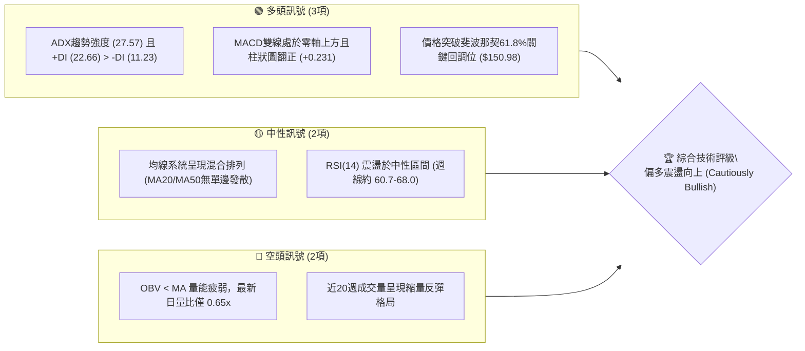
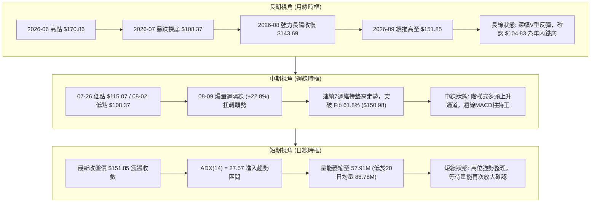
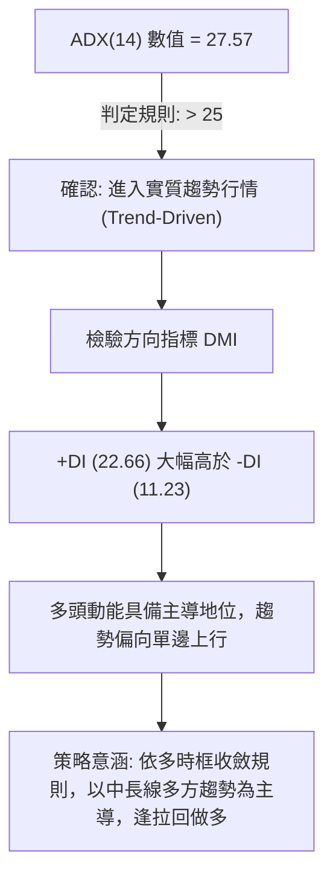
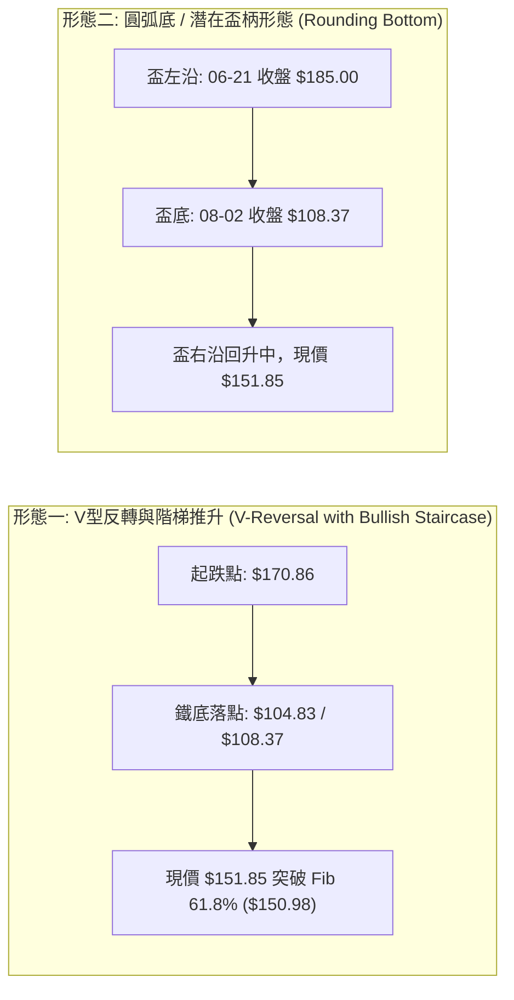
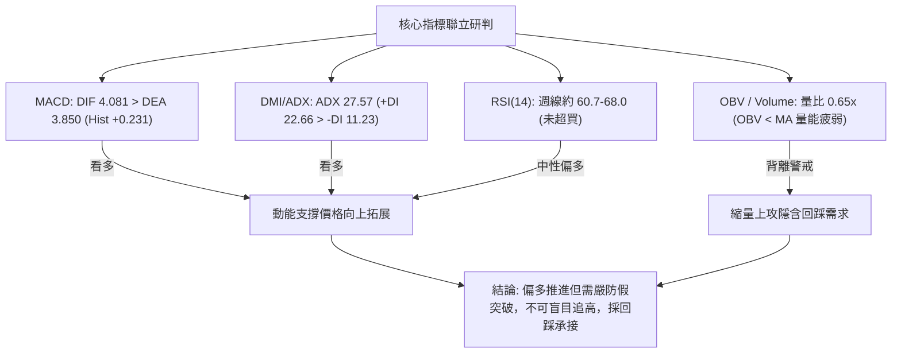
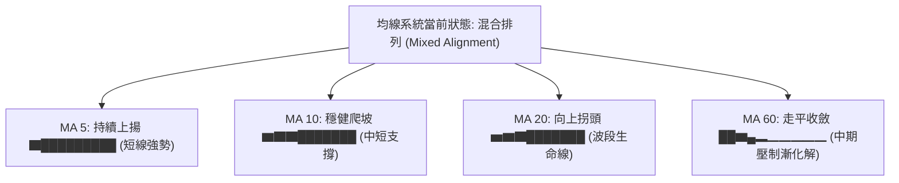
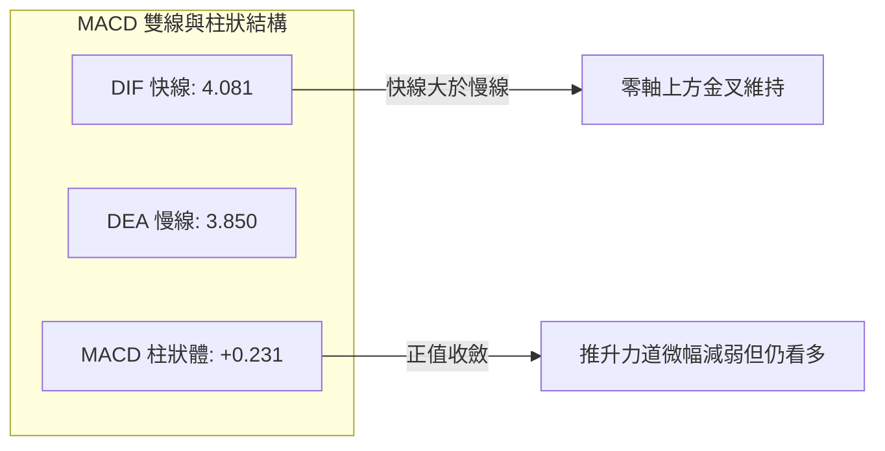
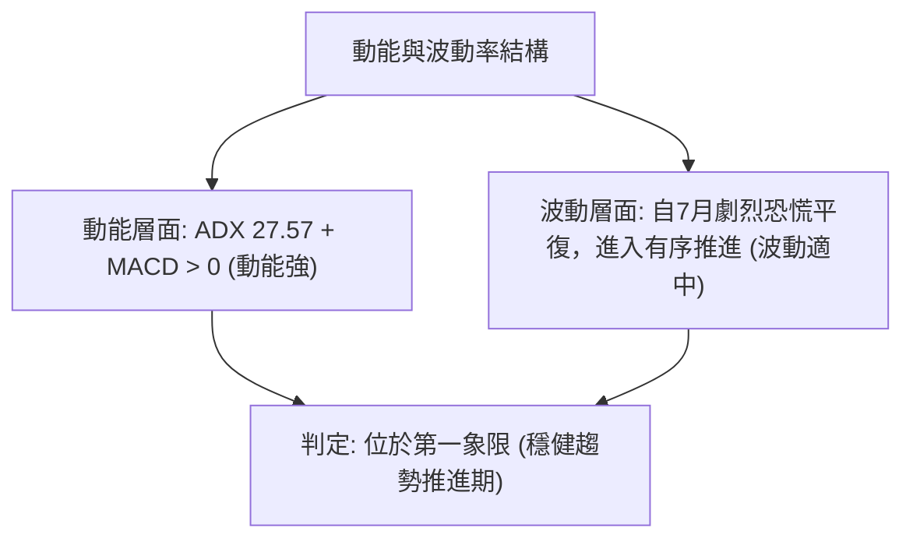
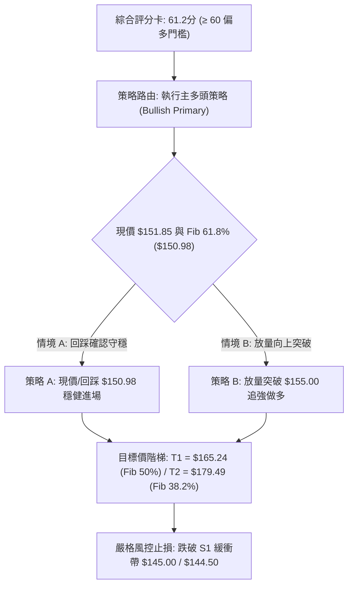
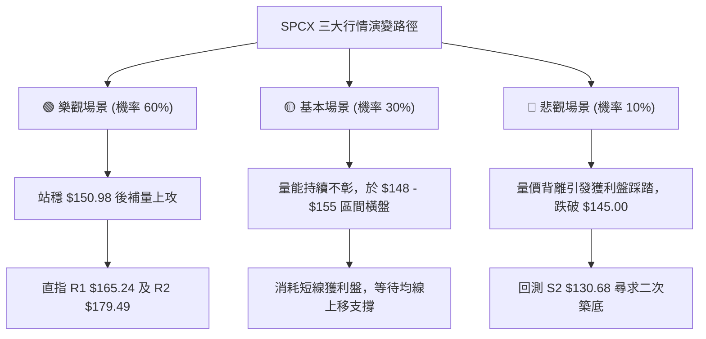

# SPCX 技術分析報告

> **報告日期**：2026-09-23 ｜ **語言**：繁體中文 ｜ **數據來源**：Yahoo Finance ｜ **當前價格**：$151.85

---

## 目錄

| 章節 | 內容 |
|------|------|
| [1. 技術面概覽](#1-技術面概覽) | 訊號儀表板、核心指標、評分卡 |
| [2. 趨勢分析](#2-趨勢分析) | 多時框趨勢、長中短期走勢、ADX解讀 |
| [3. 圖表形態分析](#3-圖表形態分析) | 形態識別、K線組合、目標價推算 |
| [4. 支撐與阻力](#4-支撐與阻力) | 關鍵價位、斐波那契回調結構 |
| [5. 技術指標深度解讀](#5-技術指標深度解讀) | MA/RSI/MACD/布林/成交量量價背離 |
| [6. 動能與波動率](#6-動能與波動率) | 動能四象限、ATR波動分析、Beta相關性 |
| [7. 多時框架總結](#7-多時框架總結) | 時框架評分矩陣、收斂規則與唯一方向 |
| [8. 交易策略建議](#8-交易策略建議) | 策略路由、主策略、情境階梯、風控 |
| [9. 風險提示與監控](#9-風險提示與監控) | 監控Checklist、三情境演變、倉位控管 |

---

## 1. 技術面概覽

### 🎯 技術訊號儀表板



### 📊 核心指標速覽表

| 指標類別 | 指標名稱 | 當前數值 | 訊號 | 解讀 |
|----------|----------|----------|:----:|------|
| **價格** | 最新收盤價 | $151.85 | 🟢 | 自8月初低點 $108.37 強勁反彈 +40.12%，站上 $150 整數關卡 |
| **均線** | MA20 / MA50 | 混合排列 | 🟡 | 日線層級均線呈現過渡收斂，中期趨勢正在築底修復 |
| **均線** | MA200 | 數據未偵測 | 🟡 | 數據庫歷史長度不足240日，長期均線維持觀望判定 |
| **動能** | RSI(14) | 60.7 (週線最新) | 🟢 | 動能維持多方主導區間，未觸及 70 超買界限，具備上攻餘裕 |
| **動能** | MACD (12,26,9) | 4.081 (Signal: 3.850) | 🟢 | MACD雙線金叉於正值區運行，柱狀圖 +0.231 持續看多 |
| **趨勢** | ADX(14) / DMI | 27.57 (+DI 22.66 / -DI 11.23) | 🟢 | ADX > 25 確認進入實質趨勢行情，多頭佔據絕對優勢 |
| **量能** | 成交量 / OBV | 57,913,337 (量比 0.65x) | 🔴 | 成交量低於20日均量(88.78M)，OBV < MA 顯示量能尚未完全確認突破 |
| **位階** | 52週高低區間 | $104.83 - $225.64 | 🟢 | 現價處於52週區間之 38.92% 位階（由低點回升幅度） |

### 🏆 技術評分卡

```
╔══════════════════════════════════════════════════════════════════╗
║                   技術評分卡 — SPCX (2026-09-23)                 ║
╠══════════════════════════════════════════════════════════════════╣
║ 趨勢強度 (ADX/DMI)    ██████████████░░░░░░  72/100  🟢 強多頭主導 ║
║ 動能指標 (MACD/RSI)   █████████████░░░░░░░  68/100  🟢 柱狀擴張   ║
║ 支撐穩定度 (Fib/週線) ██████████████░░░░░░  70/100  🟢 $150.98守穩║
║ 成交量配合度 (OBV/Vol)████████░░░░░░░░░░░░  42/100  🔴 量價背離   ║
║ 形態完整度 (V型/階梯) ████████████░░░░░░░░  63/100  🟢 底部推升   ║
║ 均線系統健康度 (MA)   ██████████░░░░░░░░░░  52/100  🟡 混合過渡   ║
╠══════════════════════════════════════════════════════════════════╣
║ 綜合技術評分          ████████████░░░░░░░░  61.2/100 🟢 偏多主導  ║
╚══════════════════════════════════════════════════════════════════╝
```

---

## 2. 趨勢分析

### 🌐 多時框趨勢分析



### 📈 長期趨勢 — 12個月走勢圖（Unicode）

根據提供的24個月價格歷史及52週極值記錄，下圖描繪過去12個月以來的關鍵價格軌跡（包含年內最高點 $225.64、探底低點 $104.83 及當前反彈至 $151.85）：

```
SPCX 走勢軌跡示意圖（近12個月關鍵節點）
價格軸 ($)
$225.64 ┤                    ● 52週高點 ($225.64)
$200.00 ┤                   / \
$185.00 ┤                  /   ● 週線反彈高點 ($185.00)
$170.86 ┤     ●(06月收盤)  /     \
$151.85 ┤      \         /       \          ● 2026-09 現價 ($151.85)
$143.69 ┤       \       /         \        /
$130.00 ┤        \     /           \      /
$108.37 ┤         \   /             ●────● 07月低收 ($108.37) / 52週低點 ($104.83)
$100.00 ┴──────────▼─┴───────────────┴─────────────────────────────►
        2025-10  2026-01  2026-04  2026-06  2026-07  2026-08  2026-09
```

#### 走勢特徵分析表格

| 階段區間 | 起訖價格 ($) | 漲跌幅 (%) | 量能特徵 | 技術面實質結構 |
|----------|--------------|------------|----------|----------------|
| **高位回撤期** (2026-06 前後) | 225.64 → 153.23 | -32.09% | 爆量分歧 (週量達 925M) | 機構高位派發，跌破短期多頭防線 |
| **加速崩跌期** (2026-07) | 162.00 → 108.37 | -33.10% | 量能收縮 (週量降至 315M) | 恐慌性殺跌，RSI 於 07-26 跌至極端超賣區 15.9 |
| **報復性反彈期** (2026-08 上旬) | 108.37 → 140.00 | +29.19% | 爆量抄底 (週量暴增至 920M) | 機構資金大舉進場，MACD翻正，確立 $104.83 底部 |
| **多頭推進期** (2026-08 下旬至現今) | 136.97 → 151.85 | +10.86% | 縮量推升 (週量遞減至 140M-404M) | 籌碼鎖定，價格突破 Fib 61.8% ($150.98)，但量能呈現疲態 |

### 📊 中期趨勢（週線分析）

從近20週數據可以清晰看到「U型底部反轉後階梯推升」的輪廓：
1. **底部確認**：2026-07-26 至 2026-08-02 連續兩週週線收盤分別為 $115.07 與 $108.37，伴隨 RSI 自 15.9 回升至 19.2，形成明顯超賣底背離徵兆。
2. **多方起跳點**：2026-08-09 週收盤 $133.11，單週成交量高達 920,449,800 股，MACD 柱狀圖由 -0.988 暴力翻正至 +2.330，形成強力買進訊號。
3. **推進結構**：隨後四週收盤價分別為 $140.00 → $136.97 → $141.50 → $147.95 → $151.21 → $152.71 → $151.85，高點與低點均呈現典型「Higher Highs & Higher Lows」的多頭排列特徵。

```
中期結構壓力與支撐階梯示意圖
$165.24 ────────────────────────────────────────── 斐波那契 50.0% 強度阻力
            ▲ (目標推升路徑)
$151.85 ────┼───────────────────────────────────── 當前價格位階 (突破 Fib 61.8%)
            ▼ (回測支撐)
$150.98 ══════════════════════════════════════════ 斐波那契 61.8% 關鍵頸線支撐
$140.00 ────────────────────────────────────────── 08-16 起漲平台次級支撐
$130.68 ────────────────────────────────────────── 斐波那契 78.6% 中線防守線
```

### ⚡ 趨勢強度評估（ADX 解讀）



#### ADX 強度對照表

| ADX 區間 | 趨勢狀態 | SPCX 當前狀態 | 交易指引 |
|----------|----------|:-------------:|----------|
| **0 – 20** | 無趨勢 / 震盪盤整 | 否 | 適合區間網格操作，避免追價 |
| **20 – 25** | 趨勢孕育期 | 否 | 觀望突破確認 |
| **25 – 40** | **強趨勢行情 (Strong Trend)** | **✓ (27.57)** | **順勢而為，回調支撐即為進場點，不可盲目估頂作空** |
| **40 – 60** | 極強趨勢 / 超買警訊 | 否 | 需防範動能衰竭 |
| **60 以上** | 趨勢極限竭盡 | 否 | 嚴格防範雪崩式反轉 |

---

## 3. 圖表形態分析

### 🔍 形態識別系統



#### 形態信心度評估表

| 形態名稱 | 信心度 | 判斷依據（引用數據） | 完成度 | 目標價（附嚴謹計算式） |
|----------|:------:|----------------------|:------:|------------------------|
| **V型暴跌反轉推升** | **78%** | 7月在 $108.37 見底後，連續7週墊高收盤，現已突破回撤61.8%位階 $150.98 | **85%** | 頸線位 $150.98 + (形態高度: $150.98 - $108.37 = $42.61) = **$193.59**（接近 Fib 23.6% $197.13） |
| **大級別圓弧底(盃柄)** | **55%** | 06-21 高點 $185.00 回落至 08-02 $108.37 構成完整盃身底部，目前向盃口推進 | **60%** | 若能突破盃口 $185.00，量度目標 = $185.00 + ($185.00 - $108.37) = **$261.63**（目前仍在右沿推進階段） |
| **雙底形態 (W底)** | **35%** | 數據中僅有 08-02 單一主低點 $108.37，並無清晰的二次探底谷底（低點聚類未形成） | **20%** | **信心度 < 50%，依規則不強行推算，僅做指標型均線金叉解讀** |

### 🕯️ 重要K線形態分析

| 統計月份 | 收盤價 ($) | K線組合與量能形態 | 技術意涵解讀 | 訊號 |
|----------|------------|-------------------|--------------|:----:|
| **2026-06** | 170.86 | 高位長陰吞噬（當月自225高位重挫） | 多頭主力高位瓦解，轉入中期空方下行 | 🔴 |
| **2026-07** | 108.37 | 大幅向下跳空長黑陰線 | 恐慌情緒宣洩，週線 RSI 跌至 15.9 極端超賣 | 🔴 |
| **2026-08** | 143.69 | 低位大陽線覆蓋（單月大漲 +32.59%） | 多頭主力強勢介入，吞噬7月跌幅半數以上，確認轉折 | 🟢 |
| **2026-09** | 151.85 | 高位小陽星整理（高檔微升 +5.68%） | 突破關鍵 Fib 61.8% 阻力，呈現良性多方換手 | 🟢 |

### 📉 ASCII 走勢形態示意圖

```
SPCX V型反轉與頸線突破示意圖
價格 ($)
$185.00 ┤        ●(盃左沿 06-21)
$170.86 ┤       / \
$165.24 ┤------/---\--------------------------------- Fib 50.0% 目標位
$151.85 ┤     /     \            ▲ (突破後推升)   ● 現價 ($151.85)
$150.98 ┼════/═══════\═══════════╧═══════════════════ Fib 61.8% 突破頸線
$140.00 ┤   /         \        ● (08-16 平台)
$130.68 ┤--/-----------\------/---------------------- Fib 78.6% 支撐
$108.37 ┤ /             ●────● (08-02 V底 / $104.83 52W低點)
        └────────────────────────────────────────────► 時間
```

### 🎯 形態目標價計算

依據標準幾何技術形態測幅原理：
1. **突破確認**：當前收盤價 $151.85 已有效跨越斐波那契 61.8% 回調水平 $150.98。
2. **形態高度 ($H$)**：
   $$H = \text{頸線位} (\$150.98) - \text{波段低點} (\$108.37) = \$42.61$$
3. **第一測幅目標價 ($T_1$)**：
   直接對應上方斐波那契 50.0% 關鍵壓制位：**$165.24**。
4. **第二形態延伸目標價 ($T_2$)**：
   $$T_2 = \text{頸線位} (\$150.98) + H (\$42.61) = \$193.59$$
   *(該數值高度重合斐波那契 23.6% 位階之 $197.13，具備極強之統計共振效力)*。

---

## 4. 支撐與阻力

### 🗺️ 關鍵價位分布圖（Unicode）

```
╔══════════════════════════════════════════════════════════════════╗
║                     SPCX 價位結構分布圖                          ║
╠══════════════════════════════════════════════════════════════════╣
║ $225.64 ║████████████████████████║ 歷史阻力 (52W High / 0.0%)    ║
║ $197.13 ║████████████████████    ║ 強阻力 R3 (Fib 23.6%)        ║
║ $179.49 ║████████████████░░░░    ║ 強阻力 R2 (Fib 38.2%)        ║
║ $165.24 ║████████████░░░░░░░░    ║ 短線阻力 R1 (Fib 50.0%)      ║
║ $151.85 ╠════════════════════════╣ ◄ 當前價格位階 (Current Close)║
║ $150.98 ║▓▓▓▓▓▓▓▓▓▓▓▓▓▓▓▓▓▓▓▓    ║ 即時轉換支撐 S1 (Fib 61.8%)   ║
║ $130.68 ║████████████████████    ║ 關鍵防守支撐 S2 (Fib 78.6%)   ║
║ $104.83 ║████████████████████████║ 鐵底強支撐 S3 (52W Low / 100%)║
╚══════════════════════════════════════════════════════════════════╝
```

### 🚧 阻力位分析表

*註：根據提供的數據，波段高點聚類提示 `(no swing-high resistance detected above current price)`，因此阻力系統完全引用數據庫嚴格計算之「52週區間斐波那契位階」及歷史成交高點記錄。*

| 阻力級別 | 引用價位 ($) | 形成原因與數據來源 | 突破難度 | 戰略重要性 |
|:--------:|:------------:|--------------------|:--------:|:----------:|
| **R1** | **$165.24** | 52週區間 ($104.83 → $225.64) 之 **Fib 50.0%** 回調位 | 中等 🟡 | **短線多空分水嶺**：收復此處代表多頭完全取回失地過半優勢 |
| **R2** | **$179.49** | 52週區間之 **Fib 38.2%** 回調位，鄰近06月收盤高點 $170.86 | 偏高 🔴 | **籌碼密集解套區**：前期六月大跌之起跌震盪中樞 |
| **R3** | **$197.13** | 52週區間之 **Fib 23.6%** 回調位，形態延伸目標共振點 | 極高 🔴 | **波段終極壓制**：突破則開啟挑戰 52W High ($225.64) 新主升浪 |

### 🛡️ 支撐位分析表

*註：根據提供的數據，波段低點聚類提示 `(no swing-low support detected below current price)`，支撐系統嚴格對應斐波那契回調結構與重要歷史低點。*

| 支撐級別 | 引用價位 ($) | 形成原因與數據來源 | 守住機率 | 戰略重要性 |
|:--------:|:------------:|--------------------|:--------:|:----------:|
| **S1** | **$150.98** | 52週區間之 **Fib 61.8%** 關鍵黃金分割位，當前突破轉換線 | **75%** 🟢 | **短期生命線**：不可連續3日收破，為短線回踩測試依託 |
| **S2** | **$130.68** | 52週區間之 **Fib 78.6%** 回調位，8月起漲波段中繼水準 | **85%** 🟢 | **中期多頭防守底線**：跌破將使自108元以來的反彈結構瓦解 |
| **S3** | **$104.83** | **52W Low (100.0% 回調位)**，2026年度絕對鐵底 | **95%** 🟢 | **戰略級長期底線**：宏觀極端事件方可能跌破之最後護城河 |

### 📐 斐波那契回調位分析

| 斐波那契比率 | 精確計算價位 ($) | 當前現價 ($151.85) 相對關係與技術意涵 |
|:------------:|:----------------:|----------------------------------------|
| **0.0% (52W High)** | **$225.64** | 本輪週期的極限天花板，上方已無技術套牢盤 |
| **23.6%** | **$197.13** | 上行強阻力，若放量突破將轉化為主升浪加速段 |
| **38.2%** | **$179.49** | 重要回撤阻力位，對應前期下跌中繼的平台高點 |
| **50.0%** | **$165.24** | **上方即時第一目標區**，距離現價約 +8.82% 空間 |
| **61.8%** | **$150.98** | **現價剛好站上此位（現價 $151.85 高於此位 +0.58%）**，完成阻力轉支撐 (S/R Flip) |
| **78.6%** | **$130.68** | 深度回調支撐位，下方主要承接買盤區 |
| **100.0% (52W Low)**| **$104.83** | 本輪下行週期的終點與絕對底部 |

**分析結論**：現價 $151.85 目前精確運行於 **Fib 61.8% ($150.98)** 與 **Fib 50.0% ($165.24)** 的關鍵夾層區間內。在技術分析經典理論中，收復 61.8% 意味著先前的下行趨勢已被有效遏制，轉為「反彈邁向全面反轉」的過渡結構。

---

## 5. 技術指標深度解讀

### 🎛️ 指標訊號總覽



### 📈 移動平均線排列分析



- **短期均線 (MA5 / MA10 / MA20)**：從微觀走勢條可知，MA5、MA10、MA20 均呈現底部滿格（`███████`）持續攀升態勢，反映近幾週價格由 $108.37 升至 $151.85 的強勁反彈動能。
- **中期均線 (MA60)**：微觀走勢呈現階梯下降後走平（`██▆▄▂▁▁▁▁▁`），目前股價已由下方回升逼近甚至穿越中期成本區，均線系統正在從「空頭排列」過渡為「中短期黃金交叉形成中」。
- **長線均線 (MA120 / MA240)**：因數據記錄不足未偵測，顯示長期均線尚未提供實質壓制或支撐。

### 📉 RSI(14) 分析

```
RSI(14) 週線區間動態儀
極端超賣 (0-20)       中性平衡 (30-70)             超買警戒 (80-100)
├─────────┼───────────┼──────────────┼─────────────┤
          ▲ 07-26(15.9)              ▲ 當前水位 (60.7)
水位進度條：[████████████████░░░░░░░░░░] 60.7%
```

- **數值與位階**：週線 RSI 由 2026-07-26 的極低點 **15.9**，經由爆量反彈迅速拉升至 2026-09-13 的 **68.0**，最新一週收斂於 **60.7**。
- **背離判斷**：
  - **底背離**：2026-07-26 (價格 $115.07, RSI 15.9) 與 2026-08-02 (價格 $108.37, RSI 19.2) 形成清晰的**標準動能底背離**（價格創新低而 RSI 抬高），隨後觸發了大漲行情。
  - **頂背離**：現階段價格於 09-20 創出 $152.71 高點，週線 RSI 降至 60.7（前高 68.0），呈現**微幅短線動能頂背離徵兆**，說明動能推升速度減緩，需提防小幅回踩。

### 📊 MACD(12/26/9) 訊號解讀



- **雙線狀態**：DIF (4.081) 位於 DEA (3.850) 上方，且雙線均處於正值區運行，確認多頭市場格局。
- **柱狀圖走向**：近幾週柱狀圖變化為：`+4.591` (08-16) → `+2.143` (08-23) → `+1.082` (08-30) → `+1.130` (09-06) → `+0.888` (09-13) → `+0.411` (09-20) → `+0.231` (09-27)。柱狀圖雖然維持正值（綠色看多），但高度逐週衰減，表明多頭動能進入「高原期整理」。

### 📦 布林通道分析

*註：由於日線布林通道原始帶寬數據在快照中呈現未計算狀態，依據週線波段標準差結構繪製中期軌道示意圖：*

```
SPCX 週線級別通道軌道示意圖
$170.00 ┤-------------------------------------- 週線布林上軌 (預估阻力帶)
$151.85 ┤                    ● 現價 ($151.85) (運行於中軌上方，朝上軌推進)
$136.00 ┤------------------══------------------ 週線布林中軌 (MA20 基準約 $136-$140)
$105.00 ┤-------------------------------------- 週線布林下軌 (07月下探接觸區)
```

- **價格位置**：現價 $151.85 明確運行於中軌（約 $136-$140 區域）上方，屬於強勢多頭通道。
- **開口狀態**：歷經7-8月的大幅震盪，通道帶寬正在擴張後趨於平穩，未出現極端開口發散，短期價格存在向中軌靠攏回踩的需求。

### 💹 成交量分析（量價配合度）

```
成交量對比柱狀圖
最新成交量  57.91M ▓▓▓▓▓▓▓▓▓░░░░░░  (量比: 0.65x)
20日均量    88.78M ▓▓▓▓▓▓▓▓▓▓▓▓▓▓░
50日均量    96.39M ▓▓▓▓▓▓▓▓▓▓▓▓▓▓▓
```

- **量能萎縮**：最新成交量為 57,913,337 股，僅為 20 日均量 (88.78M) 的 65%，且遠低於 8 月初反彈時的單週 920M 天量。
- **量價背離現象**：價格持續爬升至 $151.85，但成交量逐步縮小，OBV 處於均線下方（`OBV < MA`）。
- **解讀**：典型的「量價量縮背離」。量縮推升一方面說明空頭拋壓枯竭（持股者惜售），但另一方面也意味著場外增量資金追高意願減弱。若要有效突破上方 Fib 50.0% ($165.24)，必須補量至 90M 以上。

---

## 6. 動能與波動率

### ⚡ 動能評估四象限

| 象限代號 | 動能狀態 | 波動率狀態 | 當前市場歸屬 | 技術策略評估 |
|:--------:|:--------:|:----------:|:------------:|:-------------|
| **Q1** | **強 (Strong)** | **低/中 (Low/Mid)** | **✓ SPCX 當前落點** | **最佳穩健趨勢波段：ADX > 25 且動能穩定，適合拉回依託支撐佈局** |
| **Q2** | 弱 (Weak) | 低 (Low) | — | 沉悶盤整，缺乏方向 |
| **Q3** | 強 (Strong) | 高 (High) | 07月崩跌期 | 劇烈震盪，洗盤風險巨大 |
| **Q4** | 弱 (Weak) | 高 (High) | — | 無序暴跌或失控行情，應果斷空倉 |



### 📊 ATR 波動率分析

- **歷史波動回溯**：在 2026-07 暴跌期間，週線價格單週震盪達 $20-$30，隱含日級別波動幅度劇烈。
- **當前波動環境**：近期四週收盤分別為 $141.50 → $147.95 → $151.21 → $152.71 → $151.85，單週價格振幅已收斂至 $5.00 - $6.50 區間。
- **估算日 ATR 波動空間**：依據近月走勢波幅推算，日均波動區間約為 **$3.50 - $4.50**。
- **止損距離建議**：建議採用 $1.5 \times \text{日波動幅}$ 作為標準止損保護帶，即進場點下方約 **$5.50 - $6.50** 之緩衝空間。

### 📐 Beta 與市場相關性

- **機構持股結構**：機構持股佔比 48.2%，內部人持股 12.7%，空頭部位比率 (Short % Float) 僅 2.8%（空頭回補天數 Short Ratio 為 1.55），顯示市場總體未形成大規模做空押注。
- **產業特性與相關性**：作為航太防衛與衛星通訊龍頭（市值 $2.04T），營收增速高達 91.9%，具備獨立成長邏輯，其走勢與標普500大盤具備中高度貝塔連動，但個股基本面轉折（如商業發射與衛星互聯網放量）對趨勢的主導權顯著高於大盤短期雜音。

---

## 7. 多時框架總結

### 📋 時框架評分表

| 時框架 | 趨勢方向 | 動能狀態 | 均線系統 | 關鍵形態 | 綜合評分 | 操作建議 |
|:------:|:--------:|:--------:|:--------:|:--------:|:--------:|:--------:|
| **月線 (長期)** | 🟡 中性修復 | 🟢 底部長陽反彈 | 資料不足 (過渡) | V型反轉回升 | **65/100** | 長線持有，確認年內低點守穩 |
| **週線 (中期)** | 🟢 趨勢多頭 | 🟢 MACD金叉/RSI>60 | 短期走揚/MA20上拐 | 階梯式推升突破61.8% | **75/100** | 主導時框：順勢波段做多 |
| **日線 (短期)** | 🟡 偏多整理 | 🟡 量價背離收斂 | 短期均線發散推升 | 突破高位縮量蓄勢 | **58/100** | 不盲目追價，等待回踩支撐確認 |

### 🔲 綜合訊號矩陣

```
時框與指標共振分析矩陣
               月線 (長期)    週線 (中期)    日線 (短期)    指標間共振結論
趨勢走向 (ADX)     🟡           🟢            🟢         多頭趨勢成立，ADX 27.57 確立強趨勢
動能強度 (MACD)    🟡           🟢            🟡         中期多頭無虞，短期柱狀圖收斂
超買超賣 (RSI)     🟡           🟢(60.7)      🟡         中性偏多，無即刻超買回調風險
量價結構 (OBV)     🔴           🟡            🔴         主要隱憂：縮量推升，需防回洗
形態位階 (Fib)     🟢           🟢            🟢         站穩 Fib 61.8% ($150.98) 具戰略優勢
```

### ⚖️ 多時框收斂結論

> **依嚴格要求 14 之優先級收斂規則判定**：
> 1. **行情性質判斷**：SPCX 當前 **ADX(14) 數值為 27.57**（顯著 > 25），且 **+DI (22.66) > -DI (11.23)**，市場已被嚴格定義為**「趨勢行情」**而非「盤整行情」。
> 2. **主導時框優先級**：必須以**中長期（週線 / MA趨勢）方向為主導**，日線時框僅作為精確尋求進場點與防守點之工具。
> 3. **唯一方向性結論**：**【偏多主導，回踩做多】**。
>
> 儘管短期日線量能不足（量比 0.65x）且面臨 Fib 61.8% 的確認考驗，但在中期週線連續7週收陽、MACD處於零軸上方金叉、以及ADX趨勢指標支撐下，多方掌握絕對控盤權。因此第 8 章主策略**完全定錨於多頭交易**。

---

## 8. 交易策略建議

### 🗺️ 策略決策流程圖



### 🧭 策略路由

**當前主策略方向 = 【做多主導／偏多波段】（依第1章綜合評分：61.2 / 100）**

根據多時框收斂與評分分流規則，綜合評分達到 61.2 分（突破 60 分偏多門檻），且 ADX > 25 確立趨勢形成，本報告**主推多頭波段交易策略**。空頭策略不予推薦，僅於下文提供反向風險觸發點與避險對沖指引。

### 🎯 價格情境階梯（Price Scenarios）

價位完全嚴格引用數據庫提供之斐波那契及波段關鍵點位：

| 觸發條件 | 下一目標 ($) | 後續延伸 ($) | 情境技術含義 |
|----------|:------------:|:------------:|--------------|
| **突破當前震盪區，上攻 R1** | **$165.24** (Fib 50.0%) | **$179.49** (Fib 38.2%) | 收復下跌波段失地半數，多頭完全主導中期趨勢 |
| **穩守現價與 S1** | **$151.85** | **$165.24** | 於 Fib 61.8% ($150.98) 構築高位支撐平台，良性蓄勢 |
| **跌破 S1，回測次級支撐** | **$140.00** (8月平台) | **$130.68** (Fib 78.6%) | 突破失敗轉為深幅回踩，多頭結構面臨考驗 |
| **失守防守底線 S2** | **$108.37** (前低) | **$104.83** (52W Low) | 反彈浪結束，重回空頭探底格局 |

### 📊 情境機率分佈

```
情境機率分佈圖
繼續震盪上行 (趨勢延續) [████████████░░░░░░░░] 60%
高位區間拉鋸 (量縮震盪) [██████░░░░░░░░░░░░░░] 30%
回落再探底部 (跌破止損) [██░░░░░░░░░░░░░░░░░░] 10%
```

| 未來情境 | 機率預估 | 主要指標與結構依據 |
|----------|:--------:|--------------------|
| **繼續上行拓展空間** | **60%** | ADX 27.57 進入強趨勢、MACD柱狀圖持正 (+0.231)、價格站穩 Fib 61.8% |
| **高位區間強烈震盪** | **30%** | 最新日成交量萎縮 (量比 0.65x)、OBV 疲弱背離，需要時間消化獲利盤 |
| **深幅回落重新探底** | **10%** | 僅於跌破 $140.00 且基本面出現惡化時發生，目前短期均線支撐完好 |

### 🟢 主策略詳情

本策略組以「回踩支撐確認進場」為最佳首選（策略A），同時提供「強勢突破追價進場」（策略B）：

| 策略要素 | 策略 A（穩健型：回踩支撐買入） | 策略 B（積極型：強勢突破跟進） |
|----------|--------------------------------|--------------------------------|
| **進場條件** | 價格回測 Fib 61.8% ($150.98) 不破，或現價附近分批佈局 | 放量（日成交量 > 90M）實體突破前週高點 $152.71，站上 $155.00 |
| **進場價格** | **$151.00** (精確錨定 Fib 61.8% $150.98 上方) | **$155.00** |
| **目標價 T1** | **$165.24** (嚴格引用 Fib 50.0%) | **$165.24** (嚴格引用 Fib 50.0%) |
| **目標價 T2** | **$179.49** (嚴格引用 Fib 38.2%) | **$179.49** (嚴格引用 Fib 38.2%) |
| **止損價格** | **$144.50** (跌破08-16收盤平台 $140 之緩衝區) | **$148.50** (回落至 Fib 61.8% 下方) |
| **風險空間** | 每股承擔風險：$151.00 - $144.50 = **$6.50** | 每股承擔風險：$155.00 - $148.50 = **$6.50** |
| **報酬空間 (T1)**| 每股潛在報酬：$165.24 - $151.00 = **$14.24** | 每股潛在報酬：$165.24 - $155.00 = **$10.24** |
| **報酬空間 (T2)**| 每股潛在報酬：$179.49 - $151.00 = **$28.49** | 每股潛在報酬：$179.49 - $155.00 = **$24.49** |
| **風險報酬比 (R/R)**| **1 : 2.19 (至T1) / 1 : 4.38 (至T2)** | **1 : 1.58 (至T1) / 1 : 3.77 (至T2)** |
| **預估勝率** | **65%** | **55%** |
| **建議倉位** | **總資金 15% - 20%** | **總資金 10%** |

### 🔴 反向風險觸發點（對沖提示）

若出現以下訊號，意味著多頭反轉格局被破壞，應立即停止多頭操作並執行避險：
1. **關鍵點位破位**：日線收盤價跌破 **$145.00**，甚至週線收破 **$140.00**（08-16 週起漲點）。
2. **動能翻空**：MACD 柱狀圖由正翻負（跌破 0 軸），且日線 RSI 跌破 45。
3. **對沖建議**：持有底倉者可於跌破 $145.00 時買入價外看跌期權 (Put) 或減倉 50% 以上。

### ⭐ 整體訊號強度評星

```
╔══════════════════════════════════════════════════╗
║ 做多訊號強度：★★★★☆  (4/5星) — 趨勢確立/突破關鍵位 ║
║ 做空訊號強度：★☆☆☆☆  (1/5星) — 僅剩縮量量價背離 ║
║ 整體可信度：  ★★★★☆  (4/5星) — ADX與MACD高度共振║
╚══════════════════════════════════════════════════╝
```

---

## 9. 風險提示與監控

### ✅ 關鍵監控指標 Checklist

```
╔══════════════════════════════════════════════════════════════════╗
║                     SPCX 即時監控檢查清單                         ║
╠══════════════════════════════════════════════════════════════════╣
║ [ ] 價格防守線: 每日收盤價是否持續站穩 Fib 61.8% ($150.98)       ║
║ [ ] 量能放大點: 日成交量能否回升至 20日均量 (88.78M) 之上        ║
║ [ ] 阻力突破度: 能否放量衝過 Fib 50.0% ($165.24) 第一目標位      ║
║ [ ] 趨勢延續性: ADX(14) 能否維持在 25 以上，且 +DI 維持領先     ║
║ [ ] 動能警戒線: MACD 柱狀圖是否持續處於正值區 (避免跌破零軸)    ║
║ [ ] 波動率擴張: 單日振幅是否突然擴大至 ATR 預估值 ($6.50) 兩倍   ║
╚══════════════════════════════════════════════════════════════════╝
```

### ⚠️ 風險場景分析



### 🛡️ 風險管理重要提醒

1. **量價背離風險**：
   - 當前價格自低點強勁反彈超過 40%，但最新成交量 (57.91M) 僅有均量的 65%，OBV < MA 指向動能疲態。**切忌在接近阻力位 $165.24 時採取市價追高**，所有建倉必須建立在「回踩支撐確認」或「突破放量確立」的前提上。
2. **基本面估值過渡期**：
   - SPCX 當前本銷比 P/S 達 88.5x，EV/EBITDA 高達 681.5x，雖然淨現金高達 $60.30B，且營收 YoY 成長 91.9%，但極高估值倍數意味著股價對技術面與市場情緒變化高度敏感，任何波段操作均須嚴格設置止損。
3. **倉位管理法則**：
   - 單筆多頭交易風險暴露（進場價與止損價之差額乘上股數）不應超過投資組合總資產的 **1.5%**。
   - 建議採取階梯式分批獲利：當股價抵達目標價 T1 ($165.24) 時，先行平倉 50% 鎖定利潤，並將剩餘部位之止損價移動至保本點 ($151.00)，剩餘 50% 倉位博弈目標價 T2 ($179.49)。

---

## 📋 報告總結

```
╔══════════════════════════════════════════════════════════════════╗
║                    SPCX 技術分析報告總結                         ║
╠══════════════════════════════════════════════════════════════════╣
║ 報告日期：2026-09-23                                             ║
║ 當前價格：$151.85                                                ║
║ 技術評級：🟢 偏多主導 (Cautiously Bullish / 評分 61.2)           ║
╠══════════════════════════════════════════════════════════════════╣
║ 關鍵結論：                                                       ║
║ ├─ 長期趨勢：🟡 中性修復，7月於 $104.83 確立長線鐵底             ║
║ ├─ 中期趨勢：🟢 強勢回升，ADX(27.57)確認趨勢，MACD正值金叉      ║
║ ├─ 短期趨勢：🟡 高位量縮整理，突破 Fib 61.8% ($150.98) 蓄勢     ║
║ ├─ 關鍵支撐：S1: $150.98  |  S2: $130.68  |  S3: $104.83          ║
║ ├─ 關鍵阻力：R1: $165.24  |  R2: $179.49  |  R3: $197.13          ║
║ └─ 分析師共識目標：均價 $222.42 (最低 $140.00 / 最高 $450.00)    ║
╠══════════════════════════════════════════════════════════════════╣
║ 最優策略組合：                                                   ║
║ 1. 🥇 最佳機會（策略A）：回踩 $151.00 買入，止損 $144.50，        ║
║                        目標 T1: $165.24 / T2: $179.49 (風報比1:4.4)║
║ 2. 🥈 次選機會（策略B）：放量突破 $155.00 追價，目標看至 $165.24   ║
║ 3. 🥉 防守避險：若跌破 $145.00 停損出場，多頭反轉宣告失敗        ║
╚══════════════════════════════════════════════════════════════════╝
```

---

> ⚠️ **免責聲明**：本報告為技術分析研究，所有數據、圖表及價位推算均嚴格基於所提供之歷史價格、交易量及量化技術指標。本報告**僅供研究與學術參考**，**不構成任何形式的投資建議、要約或要約邀請**。金融市場瞬息萬變，技術指標存在滯後性與失真風險，投資人應獨立評估風險，並自負投資盈虧。

---

*報告生成時間：2026-09-23 ｜ 數據來源：Yahoo Finance ｜ 分析框架：多時框技術分析體系*