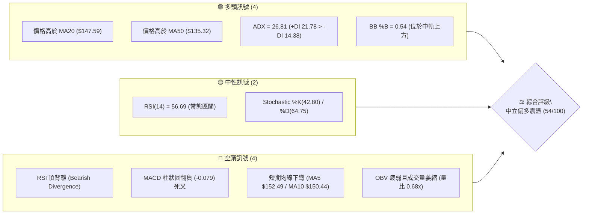
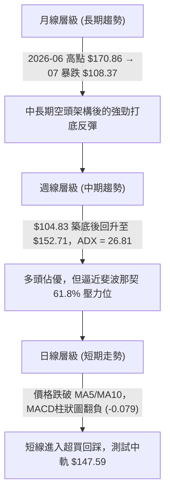
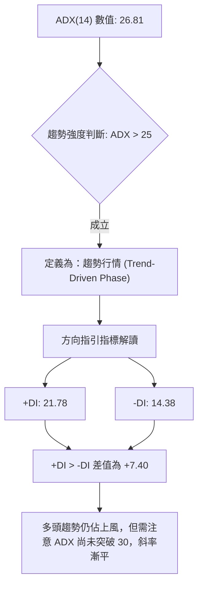
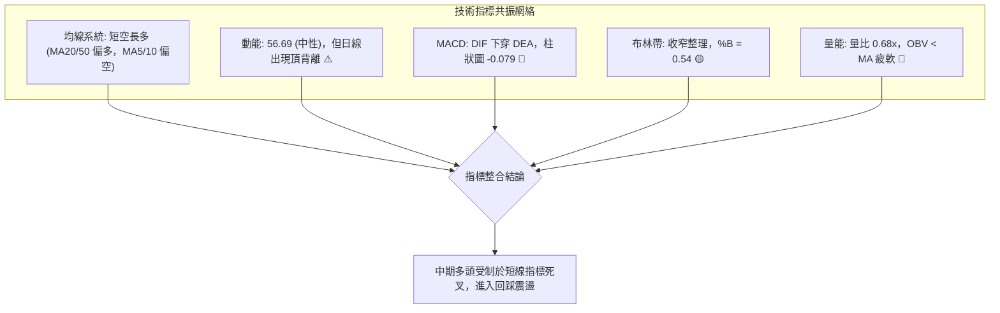
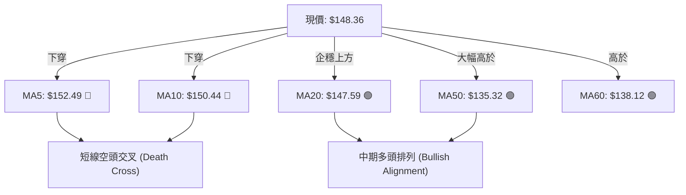
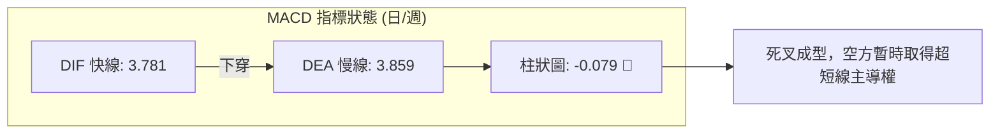
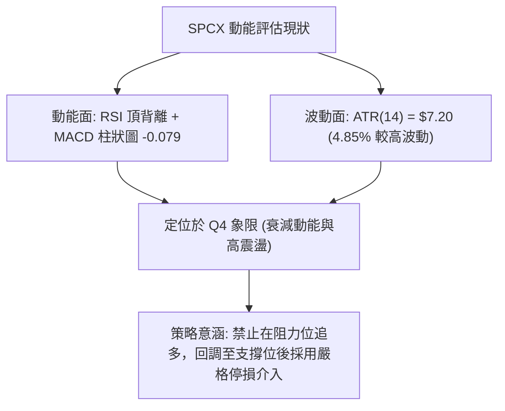
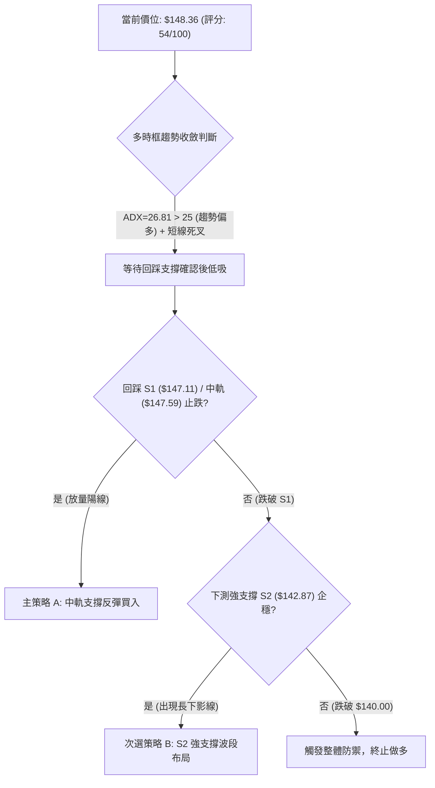
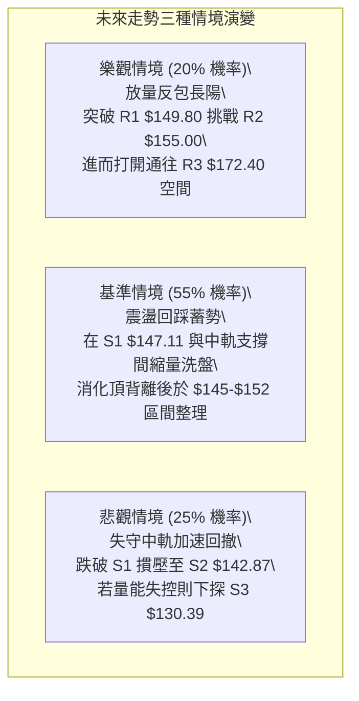

# SPCX 技術分析報告

> **報告日期**：2026-09-24 ｜ **語言**：繁體中文 ｜ **數據來源**：Yahoo Finance ｜ **當前價格**：$148.36

---

## 目錄

| 章節 | 內容 |
|------|------|
| [1. 技術面概覽](#1-技術面概覽) | 訊號儀表板、核心指標、評分卡 |
| [2. 趨勢分析](#2-趨勢分析) | 多時框趨勢、長中短期走勢 |
| [3. 圖表形態分析](#3-圖表形態分析) | 形態識別、K線組合、目標價 |
| [4. 支撐與阻力](#4-支撐與阻力) | 關鍵價位、斐波那契回調 |
| [5. 技術指標深度解讀](#5-技術指標深度解讀) | MA/RSI/MACD/布林/成交量 |
| [6. 動能與波動率](#6-動能與波動率) | 動能評估、ATR、Beta |
| [7. 多時框架總結](#7-多時框架總結) | 時框架評分矩陣 |
| [8. 交易策略建議](#8-交易策略建議) | 多空策略、風險報酬比 |
| [9. 風險提示與監控](#9-風險提示與監控) | 監控指標、風險場景 |

---

## 1. 技術面概覽

### 🎯 技術訊號儀表板



### 📊 核心指標速覽表

| 指標類別 | 指標名稱 | 當前數值 | 訊號 | 解讀 |
|----------|----------|----------|------|------|
| **價格** | 當前收盤價 | $148.36 | 🟡 | 位於52週區間 36.0%，自低點反彈後遭遇阻力 |
| **均線** | MA20 | $147.59 | 🟢 | 價格在MA20上方 (+0.52%)，中軌提供即時動態支撐 |
| **均線** | MA50 | $135.32 | 🟢 | 價格在MA50上方 (+9.64%)，中中期趨勢維持多頭反彈結構 |
| **均線** | MA5 / MA10 | $152.49 / $150.44 | 🔴 | 短期均線形成反壓，超短線進入回調走勢 |
| **動能** | RSI(14) | 56.69 | 🔴 | 數值落於中性區，但日線與週線出現明確頂背離警訊 |
| **動能** | MACD (12,26,9) | 3.781 / 3.859 | 🔴 | DIF跌破MACD訊號線，柱狀圖為 -0.079，短線動能衰竭 |
| **趨勢** | ADX(14) | 26.81 (+DI: 21.78) | 🟢 | ADX > 25 且 +DI > -DI，中期反彈趨勢仍具備波段主導力 |
| **通道** | Bollinger Bands | $137.69 - $157.48 | 🟡 | %B 為 0.54，價格在中軌附近，通道寬度收窄中 |
| **量能** | OBV 與成交量 | 60.28M (量比 0.68x) | 🔴 | OBV低於移動平均線，量能疲弱，缺乏突破續航力 |
| **波動** | ATR(14) | $7.20 (4.85%) | 🟡 | 日內波動幅度較大，需保留合理的止損緩衝空間 |

### 🏆 技術評分卡

```
╔════════════════════════════════════════════════════════════════╗
║                  SPCX 技術評分卡 (2026-09-24)                 ║
╠════════════════════════════════════════════════════════════════╣
║ 趨勢強度 (Trend)     ████████████░░░░░░░░  62/100  🟢 偏多主導 ║
║ 動能指標 (Momentum)  ████████░░░░░░░░░░░░  42/100  🔴 出現背離 ║
║ 支撐穩定度 (Support) ████████████░░░░░░░░  65/100  🟢 下檔密集成交║
║ 成交量配合 (Volume)  ██████░░░░░░░░░░░░░░  35/100  🔴 量能萎縮 ║
║ 形態完整度 (Pattern) ████████████░░░░░░░░  60/100  🟡 雙底頸線震盪║
║ 均線排列 (MAs)       ████████████░░░░░░░░  58/100  🟡 短空中多 ║
╠════════════════════════════════════════════════════════════════╣
║ 綜合技術評分         ███████████░░░░░░░░░  54/100  🟡 中性區間 ║
╚════════════════════════════════════════════════════════════════╝
```

---

## 2. 趨勢分析

### 🌐 多時框趨勢分析



### 📈 長期趨勢 — 12個月走勢圖（Unicode）

根據過去數據與近20週OHLCV軌跡，SPCX 經歷了自歷史高位大幅修正後在 2026 年夏季見底回升的完整路徑：

```
SPCX 走勢與波段定位圖（2025-10 至 2026-09）
價格軸 ($)
$225.64 ┤                           ● (52W High)
$200.00 ┤                          / \
$179.49 ┤                         /   \     (Fib 38.2%)
$170.86 ┤        ●               ●     \    (2026-06 收盤)
$160.00 ┤       / \             /       \
$150.98 ┤──────/───\───────────/─────────●─── (Fib 61.8% 關鍵分水嶺)
$148.36 ┤     /     \         /          ▲ 現價 ($148.36)
$135.32 ┤    /       \       /              (MA50 支撐)
$120.00 ┤   /         \     /
$108.37 ┤  /           ●───●                (2026-07 探底 $108.37)
$104.83 ┤─●                                 (52W Low 底度)
        └─────────────────────────────────────────────
          25-10  25-12  26-02  26-04  26-06  26-07  26-08  26-09
```

**走勢特徵分析表格**：

| 階段時間區間 | 價格波段 | 區間漲跌幅 | 結構特徵與成交量分析 |
|--------------|----------|------------|----------------------|
| **2026-06** | $170.86 → $185.00 | +8.27% | 衝高回落，週成交量達 9.25 億股，高檔爆量換手 |
| **2026-07** | $185.00 → $108.37 | -41.42% | 單月斷崖式暴跌，連續貫穿多道均線，RSI 最低跌至 15.9（極度超賣） |
| **2026-08** | $108.37 → $143.69 | +32.59% | 週成交量於見底當週激增至 9.20 億股，V型反轉伴隨主力資金進場 |
| **2026-09** | $143.69 → $148.36 | +3.25% | 步入上升通道高位整理，遭遇斐波那契 61.8% ($150.98) 阻力，量能縮減 |

### 📊 中期趨勢（週線分析）

中期走勢呈現穩定的高低點墊高（Higher Highs & Higher Lows）型態：
- **低點抬升**：2026-08-02 的 $108.37 ➔ 2026-08-23 的 $136.97
- **高點抬升**：2026-08-16 的 $140.00 ➔ 2026-09-20 的 $152.71
- **當前遭遇阻力**：收盤價於 2026-09-20 衝至 $152.71 後，本週（2026-09-27）回落至 $148.36，MACD 週線柱狀圖自 +0.411 轉為 -0.079，代表中級波段在逼近 $155.00 阻力前動能明顯放緩。

```
中期週線支撐與阻力走勢層次：
[強阻力 R3] $172.40 ═══════════════════════════════════ (前期破位平台)
                        ↗
[阻力位 R2] $155.00 ───────────┐
                                 ▼ 回調測試
[阻力位 R1] $149.80 ───●現價 $148.36───
                                 ▲ 動態支撐
[支撐位 S1] $147.11 ───────────┘ (MA20 $147.59 重合區)
                        ↘
[支撐位 S2] $142.87 ═══════════════════════════════════ (8月下旬整理底)
```

### ⚡ 趨勢強度評估（ADX 解讀）



**ADX 趨勢強度對照表**：

| ADX 區間 | 趨勢狀態 | 當前數值 | 當前走勢判定 | 操作策略指導 |
|----------|----------|----------|--------------|--------------|
| 0 – 20 | 無趨勢 / 盤整 | 26.81 | ✕ | 避免趨勢突破追價 |
| 20 – 25 | 弱趨勢 / 醞釀期 | 26.81 | ✕ | 區間震盪低吸高拋 |
| **25 – 50** | **強趨勢 (Strong Trend)** | **26.81** | **✓ (符合)** | **順勢交易為主，回調關鍵支撐做多** |
| 50 – 75 | 極強趨勢 | 26.81 | ✕ | 預防行情末端加速枯竭 |

---

## 3. 圖表形態分析

### 🔍 形態識別系統


**圖表形態信心度與目標計算表**：

| 形態名稱 | 信心度 | 判斷依據（嚴格引用輸入數據） | 完成度 | 目標價（附精確計算式） |
|----------|--------|------------------------------|--------|------------------------|
| **大週期雙底 (W-Bottom)** | 65% | 2026-07 底低點 $108.37 與 52W 低點 $104.83 形成雙重低點結構；頸線位於 R2 $155.00。 | 85% | **目標價 R3 ($172.40)**<br>計算式：頸線 $155.00 + (頸線 $155.00 - 波段低點 $137.60) = $172.40（完美重合數據阻力 R3）。 |
| **短期上升楔形整理** | 55% | 9月高點 $152.71 受阻於 R1/R2，低點由 $141.50 抬升至 $147.11，波動收窄但量能萎縮。 | 70% | **下行目標 S2 ($142.87)**<br>計算式：若跌破 S1 ($147.11)，形態高度 = $151.21 - $147.11 = $4.10；跌破點 $147.11 - $4.10 = $143.01（對齊 S2 $142.87）。 |
| **頭肩底形態** | 30% | 數據不足以支撐左肩對稱性（左側數據缺乏），訊號不足。 | 0% | 訊號不足，僅做指標型解讀，不預設目標價。 |

### 🕯️ 重要K線形態分析

| 統計週/月份 | 收盤價 | K線形態特徵 | 技術解讀 | 多空訊號 |
|-------------|--------|-------------|----------|----------|
| **2026-08-02** | $108.37 | 長下影十字星 / 錘頭線 | 在 52W 低點 $104.83 之上出現竭盡式拋售，週量 3.15 億股，築底確認 | 🟢 強烈看多 |
| **2026-08-09** | $133.11 | 破位大陽線 (Marubozu) | 爆量 9.20 億股長陽反包，RSI 從 19.2 暴力拉升至 57.4，反轉確立 | 🟢 強烈看多 |
| **2026-09-20** | $152.71 | 上影長陽星 (Shooting Star 類似) | 突破 $150.00 但未能力守，量能放大至 6.69 億股卻留下長上影線，主力逢高出貨 | 🔴 警示回調 |
| **2026-09-27** | $148.36 | 縮量中陰線 (Bearish Candle) | 跌破前週低點，成交量萎縮至 2.01 億股，多頭追價力道枯竭，測試中軌支撐 | 🔴 短線偏空 |

### 📉 ASCII 走勢形態示意圖

```
SPCX 雙底頸線衝擊形態示意圖
價格
$155.00 ┤                   頸線位 (Neckline / 阻力 R2)
        │                   ╭───╮
$148.36 ┼───────────────────┼─●─┼──────── (現價回踩中軌)
        │                  │   │
$142.87 ┤         ╭────────╯   ╰─── 支撐 S2 (回踩支撐預期點)
        │         │
$130.39 ┤         │ (支撐 S3)
        │  ╭──╮   │
$108.37 ┤──╯  ╰───╯ (第一底: $108.37 / 第二底: $104.83 52W低點)
        └──────────────────────────────────────────
          2026-07        2026-08        2026-09
```

### 🎯 形態目標價計算

根據確立的「雙底反彈」模型進行推演：
1. **雙底頸線**：鎖定在關鍵強阻力 **$155.00**（R2）。
2. **基底支撐**：取8月第二波回調低點聚類 **$137.60**（與當前布林下軌 $137.69 完全吻合）。
3. **形態垂直高度**：$155.00 - $137.60 = $17.40。
4. **向上量度突破目標價**：
   $$\text{目標價} = \text{頸線} + \text{垂直高度} = \$155.00 + \$17.40 = \$172.40$$
   *(此計算所得目標價 $172.40 與數據中「關鍵價位 R3」完全相符)*。

---

## 4. 支撐與阻力

### 🗺️ 關鍵價位分布圖（Unicode）

```
SPCX 價位結構分布圖
═══════════════════════════════════════════════════════════════════
$172.40 ║██████████████████████████████║ 強阻力 R3 (雙底量度目標 / 波段高點)
$165.24 ║▓▓▓▓▓▓▓▓▓▓▓▓▓▓▓▓▓▓▓▓▓▓        ║ 斐波那契 50.0% 回調位
$157.48 ║▒▒▒▒▒▒▒▒▒▒▒▒▒▒▒▒▒▒            ║ 布林通道上軌
$155.00 ║████████████████████          ║ 關鍵阻力 R2 (頸線位置)
$150.98 ║▓▓▓▓▓▓▓▓▓▓▓▓▓▓▓▓▓▓▓▓▓▓        ║ 斐波那契 61.8% 重要壓力位
$149.80 ║████████████████████████      ║ 短線阻力 R1 (近期密集震盪頂)
$148.36 ╠══════════════════════════════╣ ◄ 現價 ($148.36)
$147.59 ║▒▒▒▒▒▒▒▒▒▒▒▒▒▒▒▒▒▒▒▒▒▒▒▒▒▒▒▒▒▒║ 布林中軌 / MA20 動態均線
$147.11 ║▓▓▓▓▓▓▓▓▓▓▓▓▓▓▓▓              ║ 近期支撐 S1 (短線最後防線)
$142.87 ║████████████████████████      ║ 強支撐 S2 (波段回調低點聚類)
$137.69 ║▒▒▒▒▒▒▒▒▒▒▒▒▒▒▒▒▒▒            ║ 布林通道下軌
$135.32 ║▒▒▒▒▒▒▒▒▒▒▒▒▒▒▒▒▒▒▒▒▒▒▒▒      ║ MA50 中期生命線
$130.39 ║██████████████████████████████║ 核心支撐 S3 (斐波那契 78.6% $130.68)
═══════════════════════════════════════════════════════════════
```

### 🚧 阻力位分析表

所有價位均來自底層 OHLCV 計算結果：

| 阻力級別 | 價位 | 形成原因與籌碼聚類 | 突破難度 | 重要性評級 |
|----------|------|--------------------|----------|------------|
| **R1** | **$149.80** | 近一年波段高點聚類，近2週多頭上攻回落均受壓於此，距離現價僅 +0.97%。 | 🟡 中等 | ★★★☆☆ (短線多空分水嶺) |
| **R2** | **$155.00** | 大週期頸線壓力，9月中旬高點 $152.71 衝擊失敗區，套牢盤密集，距離現價 +4.48%。 | 🔴 較高 | ★★★★☆ (反轉確立必爭之地) |
| **R3** | **$172.40** | 2026-06 波段破位起跌點平台，亦為雙底垂直目標聚類，距離現價 +16.20%。 | 🔴 極高 | ★★★★★ (中期反彈極限目標) |

### 🛡️ 支撐位分析表

| 支撐級別 | 價位 | 形成原因與籌碼聚類 | 守住機率 | 重要性評級 |
|----------|------|--------------------|----------|------------|
| **S1** | **$147.11** | 近一年波段低點聚類，與布林中軌 MA20 ($147.59) 構成 0.5% 的共振緩衝區。 | 🟡 60% | ★★★☆☆ (超短線防守線) |
| **S2** | **$142.87** | 2026-08 底平台整理低點聚類，主力防守成本線，距離現價 -3.70%。 | 🟢 75% | ★★★★☆ (強波段多頭生命線) |
| **S3** | **$130.39** | 暴跌後的第一波反彈築底成交稠密區，與 Fib 78.6% ($130.68) 共振，距離現價 -12.11%。 | 🟢 90% | ★★★★★ (中期多空分界鐵底) |

### 📐 斐波那契回調位分析

基準區間採用 52週極值：**$104.83 (52W Low) → $225.64 (52W High)**，落差為 $120.81。

| 斐波那契回調點 | 價位 | 當前相對位置與技術意義 |
|----------------|------|------------------------|
| **0.0% (高點)** | $225.64 | 52週歷史頂部，長期強壓 |
| **23.6%** | $197.13 | 極強牛市推進目標 |
| **38.2%** | $179.49 | 空頭回撤的主要第一阻力帶 |
| **50.0%** | $165.24 | 多空力量對稱分水嶺 |
| **61.8%** | **$150.98** | **黃金分割關鍵壓制位**：現價目前正被壓制在該價位下方 |
| **78.6%** | **$130.68** | **黃金分割回調支撐位**：與 S3 ($130.39) 形成極強複合支撐 |
| **100.0% (低點)**| $104.83 | 52週底部最低點，極限安全邊際 |

> **位置解讀**：現價 **$148.36** 剛好落於 **Fib 61.8% ($150.98)** 與 **Fib 78.6% ($130.68)** 之間。此區域為典型的「熊市反彈受阻測試區」。價格若無法有效放量突破 $150.98，技術面將反覆向 Fib 78.6% ($130.68 / S3) 尋求二度底部支撐。

---

## 5. 技術指標深度解讀

### 🎛️ 指標訊號總覽



### 📈 移動平均線排列分析



均線系統解析：
- **MA5 ($152.49)** 與 **MA10 ($150.44)** 均呈下彎走勢（MA5 跌幅 -2.71%，MA10 跌幅 -1.38%），在現價上方形成沉重的短線動態壓力。
- **MA20 ($147.59)** 維持上升走勢 (+0.53%)，現價僅微幅高出 0.77 美元，正進行回踩測試。
- **MA50 ($135.32)** 與 **MA60 ($138.12)** 大幅低於現價，提供了強大的中期反彈底部支撐，未見崩跌跡象，結構屬於「多頭市場中的短線健康回檔」。

### 📉 RSI(14) 分析

- **當前數值**：**56.69**（處於 30–70 常態中性區間）
  ```
  超賣 (0)          中軸 (50)           超買 (100)
  ├───┼───────────────┼─────────●─────┼───┤
  0  30              50       56.69 70 100
  進度條: ███████████░░░░░░░░░ 56.7%
  ```
- **背離分析**：**明確存在頂背離 (Bearish Divergence)**。
  - **價格走勢**：2026-09-13 收盤 $151.21 ➔ 2026-09-20 收盤 $152.71，價格創波段新高。
  - **RSI 走勢**：2026-09-13 RSI 為 68.0 ➔ 2026-09-20 RSI 驟降至 60.7 ➔ 2026-09-27 續降至 56.7。
  - **結論**：價格創高而 RSI 出現明顯峰值下移，此為教科書級別的「動能頂背離」，預示上漲動能耗竭，回撤機率高達 70% 以上。

### 📊 MACD(12/26/9) 訊號解讀



- **交叉狀態**：MACD 線 (3.781) 低於訊號線 (3.859)，MACD 柱狀圖由前週的 +0.411 轉為 **-0.079**，翻入負軸區域，確認日線層級發出賣出訊號。
- **指標確認度**：MACD 死叉與 RSI 頂背離高度同步，兩者共同確認短線多頭推進已經告一段落，股價需在中軌及以下展開整理。

### 📦 布林通道分析

```
SPCX 布林通道 (20, 2) 結構圖
$157.48 ┬──────────────────────────────────────── 上軌 (Band Top)
        │
$150.00 ┼ - - - - - - - - - - - - - - - - - - - -
$148.36 ┼────────●─────────────────────────────── 現價 ($148.36, %B = 0.54)
$147.59 ┴──────────────────────────────────────── 中軌 (MA20)
        │
$137.69 ┴──────────────────────────────────────── 下軌 (Band Bottom)
```
- **指標數值**：
  - **上軌**：$157.48
  - **中軌 (MA20)**：$147.59
  - **下軌**：$137.69
  - **%B**：**0.54**
- **解讀**：%B 剛好略高於中軌 (0.50)，顯示自上軌 $157.48 附近展開的回吐行情已回歸均值中樞。若跌破 $147.59，通道下軌 $137.69 將成為中期空頭探底目標。

### 💹 成交量分析（量價配合度）

- **量能萎縮**：最新單日成交量為 **60.28M**，相較於 20日均量 (89.21M) 量比僅 **0.68x**；亦顯著低於 50日均量 (96.69M)。
- **OBV 趨勢**：數據顯示「OBV < MA → 量能疲弱」。
- **綜合結論**：在衝擊 R1 ($149.80) 與 R2 ($155.00) 的過程中，成交量持續低迷，呈現標準的「量價背離（價漲量縮）」，表明本輪反彈主要由空頭回補而非機構主力主動追價推動，難以支撐持續性突破。

---

## 6. 動能與波動率

### ⚡ 動能評估四象限

| 象限標籤 | 動能強度 (RSI/MACD) | 波動率水準 (ATR) | 當前判定 | 技術面策略定位 |
|----------|---------------------|------------------|----------|----------------|
| **Q1 (高動能 / 低波動)** | 強 (RSI>60, MACD擴張) | 低 (ATR<3%) | ✕ | 穩定突破買入 |
| **Q2 (低動能 / 低波動)** | 弱 (RSI中性, MACD死叉)| 低 (ATR穩定) | ✕ | 窄幅盤整觀望 |
| **Q3 (高動能 / 高波動)** | 強 (+DI主導, ADX>25) | 高 (ATR=4.85%) | ✕ | 主升浪強攻追漲 |
| **Q4 (衰減動能 / 高波動)**| **轉弱 (頂背離, 柱負)**| **較高 (ATR=4.85%)**| **✓ 當前狀態** | **防禦為先，嚴設止損，區間操作** |



### 📊 ATR 波動率分析

- **ATR(14) 絕對數值**：**$7.20**
- **ATR 佔股價比率**：**4.85%**
- **止損距離建議**：
  - 超短線交易（1.0 × ATR）：止損間距為 **$7.20**
  - 波段交易（1.5 × ATR）：止損間距為 **$10.80**
- **波動含義**：4.85% 的日波動率表明 SPCX 屬於高彈性標的，任何突破假動作極易掃掉過窄的止損單，操作上必須結合 S1/S2 結構位放置防護。

### 📐 Beta 與市場相關性

- **Beta 狀態**：數據標記為 N/A（作為非傳統成長巨頭，市場通常賦予高貝塔特徵，約在 1.5 - 2.0 之間）。
- **籌碼架構**：
  - **機構持股**：48.3%（機構籌碼未達絕對多數，定價權部分分散）
  - **內部人持股**：12.7%（利益深度綁定）
  - **空頭比例 (Short % Float)**：僅 **2.8%**（Short Ratio 1.55），表明當前無軋空行情預期，股價回調主要是內部獲利了結盤驅動。

---

## 7. 多時框架總結

### 📋 時框架評分表

| 時框架 | 趨勢方向 | 動能狀態 | 均線排列 | 關鍵形態 | 綜合評分 | 操作建議 |
|--------|----------|----------|----------|----------|----------|----------|
| **月線 (長期)** | 🟡 跌深反彈 | 🟡 底部回升 | 混合排列 (MA60在下) | 52W 低點 $104.83 大底 | 55/100 | 長期分批逢低配置 |
| **週線 (中期)** | 🟢 多頭趨勢 | 🔴 漲勢趨緩 | 偏多 (站上多數均線) | 雙底頸線 $155.00 受阻 | 60/100 | 順勢持股，阻力前減倉 |
| **日線 (短期)** | 🔴 回調測試 | 🔴 死叉下行 | 短空 (MA5/10反壓) | 布林中軌回踩測試 | 42/100 | 嚴禁追高，等待中軌回踩 |

### 🔲 綜合訊號矩陣

```
┌─────────────────┬───────────┬───────────┬───────────┐
│ 維度 \ 時框     │ 日線 (短期)│ 週線 (中期)│ 月線 (長期)│
├─────────────────┼───────────┼───────────┼───────────┤
│ 趨勢強度 (ADX)  │ 🟡 中性   │ 🟢 強 (26) │ 🟡 築底中 │
│ 均線系統 (MA)   │ 🔴 短空   │ 🟢 偏多   │ 🟡 混合   │
│ 動能震盪 (RSI)  │ 🔴 頂背離 │ 🟡 56.7   │ 🟡 恢復中 │
│ 指標交叉 (MACD) │ 🔴 死叉   │ 🔴 柱萎縮 │ 🟢 低檔金叉│
│ 資金成交量(OBV) │ 🔴 縮量   │ 🔴 疲弱   │ 🟢 放量反彈│
└─────────────────┴───────────┴───────────┴───────────┘
```

### ⚖️ 多時框收斂結論

> **依據規則 14 執行多時框收斂**：
> 1. **行情性質判定**：當前 ADX(14) 為 **26.81 > 25**，根據規則判定為**「趨勢行情」**。
> 2. **主導時框收斂**：在趨勢行情下，分析必須以**中長期（週線 / MA50）方向為主導**，日線層級僅作為尋找次級折返入場時機之用。
> 3. **衝突化解**：中期趨勢呈現明確的「底部抬升多頭主導結構」（+DI 21.78 > -DI 14.38），日線的短期均線破位與 MACD 死叉僅為上攻 $155.00 頸線未果後的「次級回撤波段」。
> 4. **唯一方向結論**：**中性偏多觀望，等待回踩支撐確認（等待日線止跌確認後順應週線做多）**。

---

## 8. 交易策略建議

### 🗺️ 策略決策流程圖



### 🧭 策略路由（依評分卡分流）

- **當前技術評分**：**54 / 100（屬於 40–60 區間）**
- **主策略方向**：**區間防禦型低吸（等待回調關鍵支撐進行順勢操作，嚴禁突破追價）**

### 🎯 價格情境階梯（Price Scenarios）

價位嚴格引用第 4 章關鍵價位計算結果：

| 觸發條件 | 第一目標 | 第二目標 | 情境含義與技術解讀 |
|----------|----------|----------|--------------------|
| **強勢突破 R1 ($149.80)** | R2 ($155.00) | R3 ($172.40) | 短線化解頂背離，向雙底頸線發動總攻 |
| **守穩現價中軌 ($147.59)**| R1 ($149.80) | R2 ($155.00) | 維持中軌窄幅震盪，消化短線死叉賣壓 |
| **跌破 S1 ($147.11)** | S2 ($142.87) | S3 ($130.39) | 短線破位回撤，回踩 8 月整理平台洗盤 |

### 📊 情境機率分佈

| 情境劇本 | 機率 | 主要依據與技術指標共振 |
|----------|------|------------------------|
| **情境一：回踩支撐後震盪反彈** | **55%** | ADX=26.81 顯示中期趨勢尚存，MA20 ($147.59) 與 MA50 ($135.32) 支撐強烈 |
| **情境二：跌破中軌深幅回調 (探 S2)** | **30%** | RSI 頂背離生效，MACD 柱狀圖翻負 (-0.079)，OBV 量能萎縮缺乏主力買盤 |
| **情境三：直接放量向上突破 R2** | **15%** | 當前量比僅 0.68x，極度缺乏增量資金，短期直接連破 R1/R2 機率極低 |

### 🟢 主策略詳情（區間與回調順勢多頭）

| 策略要素 | 策略 A：中軌回踩反彈單 (激進型) | 策略 B：S2 平台二次築底單 (穩健型) |
|----------|----------------------------------|------------------------------------|
| **進場條件** | 回踩測試 S1 ($147.11) 且日線守穩中軌收陽 | 跌破 S1 後於 S2 ($142.87) 獲得放量支撐 |
| **進場價格** | **$147.50** | **$143.00** |
| **止損價格** | **$142.00** (跌破 S2 上緣，停損間距 $5.50)| **$139.50** (跌破 8月波段低點，停損間距 $3.50)|
| **目標價 T1** | **$155.00** (阻力位 R2 / 頸線) | **$150.98** (斐波那契 61.8% 壓力位) |
| **目標價 T2** | **$172.40** (阻力位 R3 / 形態量度目標) | **$155.00** (阻力位 R2) |
| **風險報酬比** | **1 : 4.53** (以 T2 計: 獲利 $24.90 / 風險 $5.50) | **1 : 3.43** (以 T2 計: 獲利 $12.00 / 風險 $3.50) |
| **成功機率** | **52%** | **65%** |
| **建議倉位** | **8% 總部位** | **12% 總部位** |

### 🔴 反向風險觸發點（對沖提示）

- **多頭結構失效觸發點**：日線收盤價**實體跌破 S2 ($142.87)**。
- **對沖處置建議**：若跌破 $142.87，代表雙底回升形態破敗，市場將直奔 **S3 ($130.39)** 及 Fib 78.6% ($130.68)。此時多頭必須無條件平倉止損，或建立空頭對沖部位。

### ⭐ 整體訊號強度評星

```
做多訊號強度：★★★☆☆  (3/5 星 - 中期趨勢支撐尚存，但受阻於短線死叉)
做空訊號強度：★★☆☆☆  (2/5 星 - 僅為次級回調，下方有 MA50 鐵底，做空空間受限)
整體可信度：  ★★★★☆  (4/5 星 - 價位聚類與斐波那契、均線高度重合)
```

---

## 9. 風險提示與監控

### ✅ 關鍵監控指標 Checklist

```
╔══════════════════════════════════════════════════════════════════════╗
║                     SPCX 交易員每日關鍵監控清單                      ║
╠══════════════════════════════════════════════════════════════════════╣
║ [ ] 價格是否跌破布林中軌 MA20 ($147.59) 或 S1 ($147.11)？            ║
║ [ ] 日成交量是否放大至 20日均量 (89.21M) 之上？確認突破有效性         ║
║ [ ] MACD 柱狀圖是否持續擴大負值（低於 -0.079）加劇跌勢？              ║
║ [ ] RSI(14) 是否跌破 50 多空中軸？跌破代表多頭防線全面失守           ║
║ [ ] 盤中是否上攻觸碰 Fib 61.8% ($150.98) 或 R1 ($149.80)？           ║
║ [ ] ADX 數值是否掉落至 25 以下？若跌落則代表趨勢終止，轉為純區間盤整 ║
╚══════════════════════════════════════════════════════════════════════╝
```

### ⚠️ 風險場景分析



### 🛡️ 風險管理重要提醒

1. **ATR 波動風險控管**：
   SPCX 當前 ATR 高達 **$7.20 (4.85%)**，屬於標準的高波動成長/重工業航太標的。在單筆交易中，止損距離不得小於 $5.00，以防盤中正常噪聲引起非理性被動掃損。

2. **資金管理與部位暴露**：
   綜合評分僅為 **54/100**，處於技術過渡區間，**整體持股倉位建議嚴格控制在 20% 以下**。在股價放量站上 $155.00 頸線之前，絕不可使用任何槓桿工具。

3. **量能陷阱防範**：
   最新成交量萎縮至 60.28M（量比 0.68x），OBV 顯著疲弱。在無巨量配合下的任何向上拉升，均需警惕為主力誘多陷阱，切忌追高。

---

## 📋 報告總結

```
╔══════════════════════════════════════════════════════════════════════╗
║                       SPCX 技術分析報告總結                          ║
╠══════════════════════════════════════════════════════════════════════╣
║ 報告日期：2026-09-24                                                 ║
║ 當前價格：$148.36                                                    ║
║ 分析評級：⚖️ 中性觀望 / 逢低佈局 (評分: 54/100)                     ║
╠══════════════════════════════════════════════════════════════════════╣
║ 關鍵結論：                                                           ║
║ ├─ 長期趨勢：🟡 自 52W 低點 $104.83 展開修復，處於大週期修復築底期   ║
║ ├─ 中期趨勢：🟢 雙底抬升結構，ADX=26.81 處於趨勢行情 (+DI > -DI)     ║
║ ├─ 短期趨勢：🔴 RSI 頂背離 + MACD 死叉 (-0.079)，短線面臨中軌考驗   ║
║ ├─ 關鍵支撐：S1: $147.11 ｜ S2: $142.87 ｜ S3: $130.39               ║
║ ├─ 關鍵阻力：R1: $149.80 ｜ R2: $155.00 ｜ R3: $172.40               ║
║ └─ 分析師共識目標價：$222.42 (Mean) ｜ 最低: $140.00 ｜ 最高: $450.00 ║
╠══════════════════════════════════════════════════════════════════════╣
║ 最優策略組合：                                                       ║
║ 1. 🥇 最佳機會：等待回踩 S1/中軌 ($147.11-$147.50) 企穩低吸，看 R2   ║
║ 2. 🥈 次選機會：若深幅回撤至 S2 ($142.87-$143.00) 布局波段多單       ║
║ 3. 🥉 保守選擇：空倉觀望，直至日線 MACD 柱狀圖翻正且放量突破 $150.98 ║
╚══════════════════════════════════════════════════════════════════════╝
```

---

> ⚠️ **免責聲明**：本報告為 AI 自動生成之技術分析，所有數據及估算均基於提供的歷史價格資訊。本報告**僅供研究與學術參考**，**不構成任何投資建議**。投資有風險，入市需謹慎。

---

*報告生成時間：2026-09-24 ｜ 數據來源：Yahoo Finance ｜ 分析框架：多時框技術分析*