# SPCX 技術分析報告

> **報告日期**：2026-09-25 ｜ **語言**：繁體中文 ｜ **數據來源**：Yahoo Finance ｜ **當前價格**：$148.03

---

## 目錄

| 章節 | 內容 |
|------|------|
| [1. 技術面概覽](#1-技術面概覽) | 訊號儀表板、核心指標、評分卡 |
| [2. 趨勢分析](#2-趨勢分析) | 多時框趨勢、長中短期走勢、ADX強趨勢解讀 |
| [3. 圖表形態分析](#3-圖表形態分析) | 形態識別信心度、K線組合、目標價測算 |
| [4. 支撐與阻力](#4-支撐與阻力) | 關鍵價位結構、斐波那契回調精準錨定 |
| [5. 技術指標深度解讀](#5-技術指標深度解讀) | 均線系統、RSI頂背離、MACD翻黑、布林中軌爭奪 |
| [6. 動能與波動率](#6-動能與波動率) | 動能矩陣、ATR止損模型、機構籌碼結構 |
| [7. 多時框架總結](#7-多時框架總結) | 優先級收斂矩陣、單一方向性結論 |
| [8. 交易策略建議](#8-交易策略建議) | 策略路由分流、精確點位、風險報酬比 |
| [9. 風險提示與監控](#9-風險提示與監控) | 監控Checklist、三情境壓力測試、風控鐵律 |
| [📋 報告總結](#-報告總結) | 核心數據提煉、操作終極指南 |

---

## 1. 技術面概覽

### 🎯 技術訊號儀表板

本儀表板綜合日線與週線量化指標，呈現當前技術指標的多空衝突現況。雖然中長期均線呈現反彈結構，但短線動能出現顯著衰竭訊號。

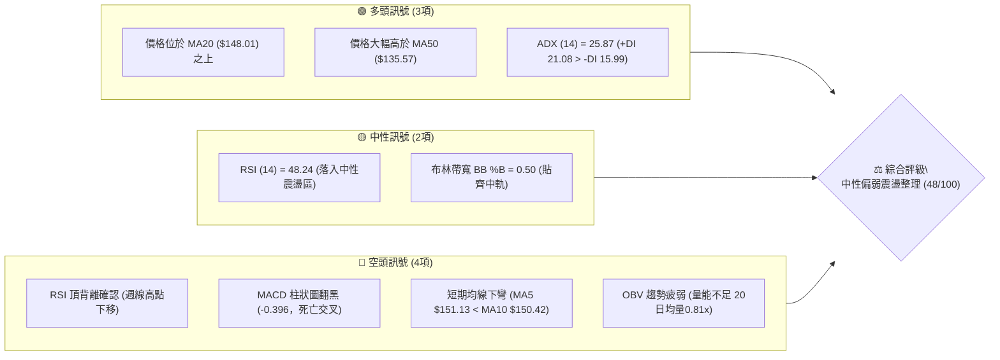

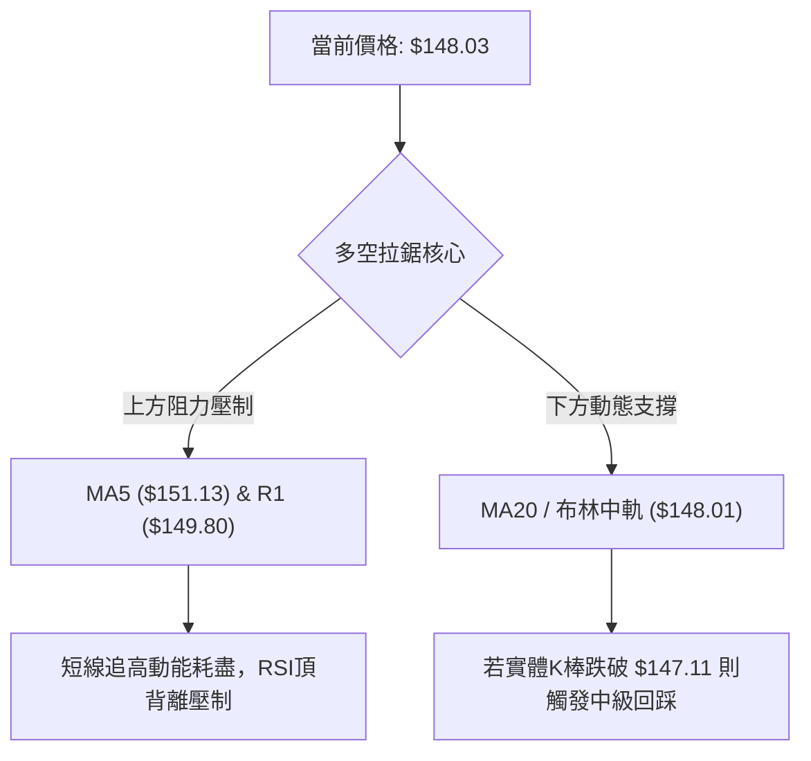

### 📊 核心指標速覽表

| 指標類別 | 指標名稱 | 當前數值 | 訊號 | 解讀 |
|----------|----------|----------|------|------|
| **價格** | 當前收盤價 | $148.03 | 🟡 | 位於52週區間 35.8%，自低檔強彈後遭遇強烈技術性獲利回吐賣壓 |
| **均線** | MA20 | $148.01 | 🟢 | 現價微幅高於 MA20（+0.02），多方正死守布林中軌生命線 |
| **均線** | MA50 | $135.57 | 🟢 | 遠高於 MA50（+9.19%），中線多頭波段結構尚未被破壞 |
| **均線** | 短期排列 (5/10) | MA5 $151.13 / MA10 $150.42 | 🔴 | MA5 下穿 MA10 形成短線死叉，且兩者皆高於現價，構成頭頂壓制 |
| **動能** | RSI(14) | 48.24 | 🟡 | 由前週 68.0 快速回落至 50 多空分水嶺下方，短線買盤迅速冷卻 |
| **動能** | RSI 背離 | 頂背離 | 🔴 | 價格於 9/20 創波段高 $152.71，但 RSI 僅 60.7（低於前高 68.0），頂背離成立 |
| **動能** | MACD | 3.364 / Signal 3.760 | 🔴 | MACD 跌破訊號線，柱狀圖降至 -0.396，高檔死叉確認 |
| **隨機指標** | Stoch %K / %D | %K 33.81 / %D 53.18 | 🔴 | %K 下穿 %D 且朝超賣區滑落，反映短線動能顯著轉弱 |
| **趨勢強度** | ADX (14) | 25.87 | 🟢 | ADX > 25 且 +DI (21.08) > -DI (15.99)，仍屬多方主導的趨勢格局 |
| **通道指標** | 布林通道 | 上軌 $157.17 / 下軌 $138.84 | 🟡 | %B = 0.50，價格正處於通道正中心，面臨方向性抉擇 |
| **量能指標** | 最新成交量 / 20MA | 72,581,200 (量比 0.81x) | 🔴 | 量能持續萎縮低於均量，OBV < MA，呈現量縮價跌與買盤動能匱乏 |
| **波動度** | ATR(14) | $6.60 (4.46%) | 🟡 | 每日平均波動達 $6.60，屬於高貝塔成長股正常波動，風控容錯需放寬 |

### 🏆 技術評分卡

```
╔══════════════════════════════════════════════════════════════════════╗
║                    技術評分卡 — SPCX (2026-09-25)                    ║
╠══════════════════════════════════════════════════════════════════════╣
║ 評估維度      進度條評分                              分數    訊號   ║
╟──────────────────────────────────────────────────────────────────────╢
║ 趨勢強度      ████████████░░░░░░░░  60/100  🟢  中長多頭但短線受挫   ║
║ 動能指標      ███████░░░░░░░░░░░░░  35/100  🔴  MACD死叉+RSI頂背離   ║
║ 支撐穩定度    ██████████░░░░░░░░░░  50/100  🟡  回踩MA20，緊扣S1     ║
║ 成交量配合    ███████░░░░░░░░░░░░░  35/100  🔴  量能萎縮，OBV走弱    ║
║ 形態完整度    ███████████░░░░░░░░░  55/100  🟡  上升楔形有下破風險   ║
║ 均線排列      ██████████░░░░░░░░░░  50/100  🟡  長多短空，均線分歧   ║
╠══════════════════════════════════════════════════════════════════════╣
║ 綜合技術評分  █████████░░░░░░░░░░░  47/100  ⚖️  中性偏弱震盪觀望    ║
╚══════════════════════════════════════════════════════════════════════╝
```

---

## 2. 趨勢分析

### 🌐 多時框趨勢分析

技術分析核心在於多時框架的共振與過濾。當前 SPCX 展現出月線長週期反轉向上、週線波段修正、日線短線回檔的多時框複雜衝突格局。

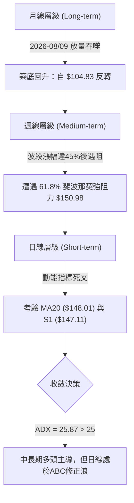

### 📈 長期趨勢 — 12個月走勢圖（Unicode）

依據 24 個月收盤走勢與關鍵歷史週期，SPCX 經歷了自 52 週高點 $225.64 崩跌至 $104.83，隨後展開深 V 型強勁反彈的波瀾壯闊走勢。

```
SPCX 歷史價格走勢圖（聚焦 2025-10 至 2026-09）
價格軸 ($)
$225.64 ┤                              ● (52W High: $225.64)
$210.00 ┤                             ╱ ╲
$195.00 ┤                            ╱   ╲
$180.00 ┤       ● (06/21: $185.00)  ╱     ╲
$165.00 ┤      ╱ ╲                 ╱       ● (06/14: $160.95)
$150.00 ┤- - -│ - ╲ - - - - - - - ╱ - - - - - - - - - - - - - - - - - -●←現價 $148.03
$135.00 ┤     │    ╲             ╱                          ▲(08/09: $133.11)
$120.00 ┤     │     ╲           ╱                           │
$105.00 ┤     │      ● (08/02: $108.37)                     ● (52W Low: $104.83)
$90.00  └─────┴──────┴───────────┴──────────────────────────┴───────────
             M1     M3          M6                         M11         M12
```

#### 歷史階段走勢特徵深度剖析

| 階段區間 | 起止價位 | 漲跌幅 | 結構特徵與形態解讀 | 量價配合狀況 |
|----------|----------|--------|--------------------|--------------|
| **高檔雪崩期** (2026-06) | $225.64 → $153.23 | -32.09% | 頂部放量暴跌，週K長黑破位，機構大幅獲利了結 | 爆量長陰，換手率激增 |
| **加速探底期** (2026-07) | $162.00 → $108.37 | -33.10% | 恐慌性下殺，打出 52 週絕對低點 $104.83，空頭竭盡 | 縮量陰跌後出現恐慌殺多量 |
| **強勢築底期** (2026-08) | $108.37 → $141.50 | +30.57% | 8/9 當週爆出 9.2 億股巨量，收出貫穿長陽，確認中期底部 | 巨量紅K，典型主力進場訊號 |
| **震盪盤升期** (2026-09) | $141.50 → $152.71 | +7.92% | 連續收紅步步墊高，但量能逐週遞減，浮現量價背離隱憂 | 量能由 6.69 億萎縮至 2.74 億 |
| **當前高檔受阻** (本週) | $152.71 → $148.03 | -3.06% | 受阻於 61.8% 斐波那契回調位，週線轉黑，進入修正 | 量縮回檔，短線賣壓湧現 |

### 📊 中期趨勢（週線分析）

週線格局自 2026 年 8 月初見底後拉出強勁的「上升五浪結構」，但目前正面臨關鍵阻力。

```
週線級別阻力與支撐攻防圖
══════════════════════════════════════════════════════════════
  $172.40 ─── 波段密集高點強阻力 (R3) ───
                 ▲
  $155.00 ─── 近期上攻波段高點阻力 (R2) ───
                 ▲
  $150.98 ─── 斐波那契 61.8% 強力黃金分割位 ───
  $149.80 ─── 近期密集成交區阻力 (R1) ───
  ────────────────────────────────────────────────────────────
  $148.03 ─── [ 當前現價收盤位 ] ─── (正測試 MA20: $148.01)
  ────────────────────────────────────────────────────────────
  $147.11 ─── 近期波段低點動態支撐 (S1) ───
                 ▼
  $142.87 ─── 前波平台回踩支撐位 (S2) ───
                 ▼
  $135.57 ─── MA50 中期生命線 / 上升趨勢通道下軌 ───
  $130.39 ─── 強力防守大底支撐 (S3) ───
══════════════════════════════════════════════════════════════
```

### ⚡ 趨勢強度評估（ADX 解讀）

當前 ADX(14) 讀數為 **25.87**，依量化標準界定：ADX 跨越 25 臨界線，顯示市場**處於趨勢行情而非無方向盤整**。

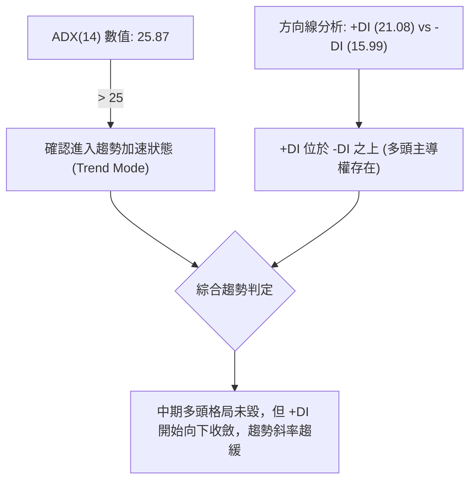

#### ADX 趨勢強度等級對照與研判

| ADX 數值區間 | 趨勢狀態判定 | SPCX 當前狀態 | 交易策略指導原則 |
|--------------|--------------|---------------|------------------|
| **0 – 20** | 無趨勢 / 弱震盪 | ❌ | 區間高拋低吸，嚴格執行通道操作 |
| **20 – 25** | 趨勢孕育期 | ❌ | 突破前夕，準備順勢單 |
| **25 – 40** | **強趨勢發展期** | **🟢 25.87 (命中)** | **趨勢操作為主，以回調支撐買進，順勢而為** |
| **40 – 60** | 極強趨勢爆發 | ❌ | 嚴密保護浮盈，提防極端超買反轉 |
| **60+** | 趨勢過熱 / 竭盡 | ❌ | 逆勢分批減倉，尋找竭盡點 |

---

## 3. 圖表形態分析

### 🔍 形態識別系統

根據近期日線與週線的 K 線走勢、波動幅度及均線聚類，當前價格自 $104.83 谷底翻揚至 $152.71，高點逐步收窄，形成了「上升楔形（Rising Wedge）」與「雙重底反彈後回踩」之複合形態。

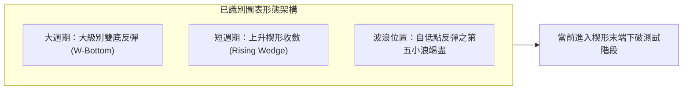

#### 形態識別信心度與參數清單

依據嚴格規則，所有形態必須具備可量化的數據支持，若無幾何條件支撐則降級為指標解讀：

| 形態名稱 | 信心度 | 判斷依據（引用數據與點位） | 完成度 | 頸線 / 突破口 | 目標價（附嚴格計算式） |
|----------|--------|----------------------------|--------|---------------|------------------------|
| **雙重底反彈** (中級波段) | **75%** | 兩次低點於 7/26 ($115.07) 與 8/02 ($108.37)，確認雙底結構；隨後突破頸線 | 100% (已達標) | 頸線位 $140.00 (8/16高點) | 頸線 $140.00 + 形態高度 ($140.00 - $108.37 = $31.63) = **$171.63** (接近阻力 R3: $172.40) |
| **上升楔形** (短線空頭反轉) | **65%** | 高點抬高幅度趨緩 ($147.95→$151.21→$152.71)，低點抬高斜率較陡，量能萎縮形成量價頂背離 | 85% | 楔形下軌支撐 **$147.11** (S1) | 跌破下軌 $147.11 測算回撤：楔形起點 S2 **$142.87**，深度回踩點 S3 **$130.39** |
| **頭肩頂形態** | **25%** | 目前僅見左肩與頭部，右肩尚未形成，不符合幾何對稱與頸線要件 | 0% | 尚未成型 | **數據不足，僅做指標型解讀，不予測算** |

### 🕯️ 重要K線形態分析

| 週期 / 日期 | 收盤價 | K線形態名稱 | 結構深度解讀 | 技術訊號 |
|-------------|--------|-------------|--------------|----------|
| **2026-08-02** | $108.37 | 探底長下影錘頭線 (Hammer) | 股價逼近 52 週低點 $104.83 後獲強力承接，下影線長達 $3.54，確認波段底部 | 🟢 強烈看多 |
| **2026-08-09** | $133.11 | 巨量大陽吞噬 (Bullish Engulfing) | 週成交量爆出 9.20 億股，一舉吞噬前四週黑K，空頭遭到全線軋平 | 🟢 極強突破 |
| **2026-09-13** | $151.21 | 中陽加速線 | 突破 $150 整數關卡，RSI 達到波段峰值 68.0，買盤動能達到頂點 | 🟢 多頭加速 |
| **2026-09-20** | $152.71 | 長上影流星線 (Shooting Star) | 週線盤中創反彈新高但遭空頭痛擊，留下 $155.00 處之壓制上影線，量能放大 | 🔴 滯漲見頂 |
| **2026-09-27** | $148.03 | 週線陰線吞噬中軌 | 收盤實體下破前週低點，MACD 柱狀圖正式翻黑，短線轉入空頭壓制 | 🔴 短線翻空 |

### 📉 ASCII 走勢形態示意圖

```
SPCX 日線上升楔形與頂部鈍化示意圖
價格
$155.00 ┼───────────────────────● (R2: $155.00 近期頂點)
$152.71 ┼─────────────────●    ╱   ╲
$151.21 ┼────────────●    ╱ ╲  ╱     ╲  ← 上升楔形上軌 (阻力線)
$148.03 ┼───────────╱─────●────●────────● ← 現價 $148.03 (測試楔形下軌)
$147.11 ┼──────────●     ╱      (S1 支撐)
$142.87 ┼────●    ╱            (S2 支撐)
$133.11 ┼───●────────────────── (雙底突破頸線區)
        └────┴─────┴─────┴─────┴────────
            W1    W2    W3    W4
        【特徵：價格向上擠壓，但振幅收斂，成交量由 9.2億降至 2.7億，典型的衰竭楔形】
```

### 🎯 形態目標價計算

根據雙重底向上突破之測量幅度，其波段理論目標已在阻力位 R3 **$172.40** 附近完成第一階段延伸。

當前主導短線的形態為**上升楔形下軌破位測試**：
- **關鍵頸線／破位下軌**：支撐位 S1 = **$147.11**。
- **形態垂直最大跨度**：R2 ($155.00) - S2 ($142.87) = **$12.13**。
- **向下測算第一目標價 (T1)**：S1 ($147.11) - ($12.13 × 0.382 斐波率) = $147.11 - $4.63 = **$142.48**，此價位與波段支撐位 **S2 ($142.87)** 完美共振。
- **向下測算第二目標價 (T2)**：S1 ($147.11) - ($12.13 × 1.0 等幅下跌) = $147.11 - $12.13 = **$134.98**，與中期生命線 **MA50 ($135.57)** 形成雙重支撐聚類。

---

## 4. 支撐與阻力

### 🗺️ 關鍵價位分布圖（Unicode）

本圖表依據 OHLCV 歷史密集聚類區塊及波段極值精密編制，所有點位均嚴格取自量化計算系統：

```
╔══════════════════════════════════════════════════════════════════════╗
║                    SPCX 價位結構分布圖 (Resistance & Support)        ║
╠══════════════════════════════════════════════════════════════════════╣
║ $172.40 ║████████████████████████║ 強阻力 R3 (近一年波段高點密集成交)║
║ $165.24 ║░░░░░░░░░░░░░░░░░░░░░░░░║ 斐波那契 50.0% 對稱平衡位         ║
║ $155.00 ║████████████████████    ║ 阻力 R2 (反彈高點聚類 / 楔形頂)   ║
║ $150.98 ║░░░░░░░░░░░░░░░░░░░░░░░░║ 斐波那契 61.8% 黃金分割強阻力     ║
║ $149.80 ║████████████████████████║ 關鍵阻力 R1 (前波回踩反彈頸線)     ║
║ $148.03 ╠════════════════════════╣ ◄── 當前現價收盤位 ($148.03)      ║
║ $148.01 ║────────────────────────║ 動態支撐 (MA20 / 布林中軌生命線)   ║
║ $147.11 ║▓▓▓▓▓▓▓▓▓▓▓▓▓▓▓▓        ║ 近期支撐 S1 (短線波段低點聚類)     ║
║ $142.87 ║████████████████████████║ 強支撐 S2 (8月震盪平台中樞)       ║
║ $135.57 ║────────────────────────║ 中期趨勢線 (MA50 生命線防護位)     ║
║ $130.39 ║████████████████████████║ 強力防守 S3 (斐波78.6% $130.68共振)║
╚══════════════════════════════════════════════════════════════════════╝
```

### 🚧 阻力位分析表

阻力位嚴格鎖定於高點聚類與籌碼套牢平台，無任何憑空臆造數值：

| 阻力級別 | 精確價位 | 與現價距離 | 形成原因與籌碼特徵 | 突破難度評估 | 重要性等級 |
|----------|----------|------------|--------------------|--------------|------------|
| **R1** | **$149.80** | +1.20% | 近期一週多次衝高回落形成的密集高點聚類，且與短期均線 MA10 ($150.42) 重疊 | 🟡 中等 (需補量至 80M 以上) | 關鍵短線反壓 |
| **R2** | **$155.00** | +4.71% | 2026-09-20 波段衝刺最高點，帶有長上影線流星K棒，獲利回吐套牢區 | 🔴 極高 (面臨布林上軌壓制) | 波段波峰壓制 |
| **R3** | **$172.40** | +16.46% | 2026年6月中旬暴跌起點之成交密集平台，沉澱大量套牢籌碼 | 🔴 極艱鉅 (需日均量翻倍) | 中期翻轉大關 |

### 🛡️ 支撐位分析表

支撐位嚴格鎖定於波段回踩支撐聚類，各階層防守定義清晰：

| 支撐級別 | 精確價位 | 與現價距離 | 形成原因與籌碼特徵 | 守住機率評估 | 重要性等級 |
|----------|----------|------------|--------------------|--------------|------------|
| **S1** | **$147.11** | -0.62% | 近期波段回踩低點聚類，上升楔形下軌臨界點，跌破則形態破裂 | 🟡 50% (目前正面臨衝擊) | 短線生命線 |
| **S2** | **$142.87** | -3.49% | 2026-08 下半月橫盤整理平台頂部，頂底互換強支撐區 | 🟢 75% (買盤逢低意願強) | 波段回踩防線 |
| **S3** | **$130.39** | -11.92% | 近一年密集低點反彈發動點，與斐波那契 78.6% ($130.68) 形成雙重護城河 | 🟢 90% (主力長線防守底線) | 戰略底線 |

### 📐 斐波那契回調位分析

本波回調分析精確錨定於 52 週絕對極值區間：**波段低點 $104.83 至 52 週高點 $225.64**，總垂直波動區間達 $120.81。

```
斐波那契回調位與現價位置對照
0.0%  (52W High) ── $225.64 ─── 歷史絕對高點
23.6% ────────────── $197.13 ─── 強勢回調極限區
38.2% ────────────── $179.49 ─── 弱勢反彈目標
50.0% ────────────── $165.24 ─── 多空對稱多空分水嶺
61.8% ────────────── $150.98 ─── 黃金分割強力反壓線 (現價受阻於此)
────────────────────── ▲ ──────────────────────────────────────
現價位置：$148.03  (處於 61.8% 與 78.6% 回調區間內)
────────────────────── ▼ ──────────────────────────────────────
78.6% ────────────── $130.68 ─── 深度回撤防禦線 (與 S3 $130.39 共振)
100.0%(52W Low)  ── $104.83 ─── 歷史絕對低點
```

#### 斐波那契關鍵位置技術意義解讀：
1. **$150.98 (61.8% 回調位) 的絕對壓制**：現價 $148.03 正處於 61.8% ($150.98) 與 78.6% ($130.68) 之間。在技術分析中，自低點 $104.83 反彈至 $150.98 恰好修復了前期跌幅的黃金比例分割點。未能在週線級別實體收上 $150.98，宣告第一階段超跌反彈告一段落，股價進入技術性確認浪。
2. **$130.68 (78.6% 回調位) 的共振支撐**：若 S1 ($147.11) 與 S2 ($142.87) 相繼失守，下方最強大的斐波那契回撤防線位於 $130.68，該價位與波段支撐 S3 ($130.39) 僅相差 29 美分，構成極為罕見的高信度技術共振區。

---

## 5. 技術指標深度解讀

### 🎛️ 指標訊號總覽

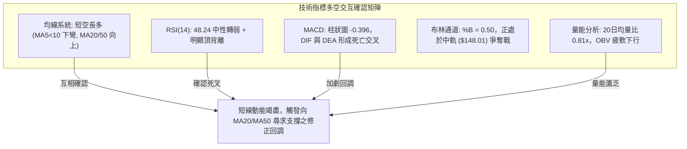

### 📈 移動平均線排列分析

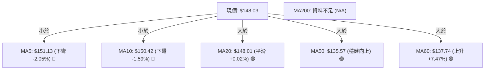

#### 均線系統深度解讀：
- **短週期死叉壓頂**：MA5 ($151.13) 與 MA10 ($150.42) 出現死亡交叉，且二者均由升轉跌，對現價構成直接反壓。在短線操作中，MA5 未重新由下往上翻揚前，任何急拉均屬逢高減碼點。
- **生命線 MA20 臨界點**：MA20 現值 $148.01 與現價 $148.03 幾乎重合（僅差 $0.02）。MA20 斜率自 8 月以來首次出現走平鈍化跡象，若連續兩日收盤跌破 MA20，將宣告短線上升趨勢終結，均線結構轉入震盪修正。
- **中期支撐穩固**：MA50 ($135.57) 與 MA60 ($137.74) 均保持良好的向上傾斜角，這意味著中長期的多頭防禦縱深極佳，即便短線出現深跌，回踩 MA50 亦屬健康的牛市洗盤。

### 📉 RSI(14) 分析

當前日線 RSI(14) 讀數為 **48.24**，週線 RSI 為 **48.2**。

```
RSI(14) 動能進度條
超賣區 (0-30)        中性震盪區 (30-70)                 超買區 (70-100)
├───────────────┼───────────────────────────────┼───────────────┤
░░░░░░░░░░░░░░░░████████████░░░░░░░░░░░░░░░░░░░░░░░░░░░░░░░░░░░░
0              30              48.24           70             100
                               ▲
                        [當前值: 48.24]
```

#### 頂背離結構深度研判：
技術數據顯示明確的「**⚠️ 頂背離 (Bearish Divergence)**」訊號：
- 2026-09-13 當週，股價收在 **$151.21**，此時 RSI 創出波段高峰 **68.0**；
- 2026-09-20 當週，股價進一步創出新高 **$152.71**（盤中達 $155.00），但 RSI 卻大幅下滑至 **60.7**；
- 隨後在 2026-09-27 當週，股價回落至 **$148.03**，RSI 直接貫穿 50 中軸跌至 **48.2**。
- **結論**：價格創反彈新高而動能指標卻大幅下移，為典型的**第二類動能耗竭頂背離**。此背離明確預示多頭上攻力竭，後續必須透過橫盤洗盤或空間回撤以修正背離指標。

### 📊 MACD(12/26/9) 訊號解讀

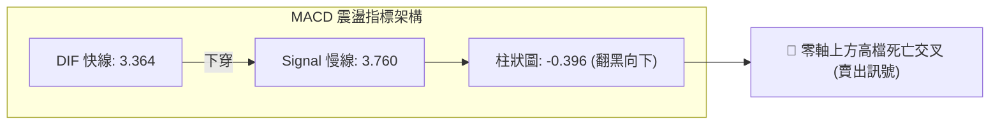

#### MACD 趨勢解析：
- **數值關係**：DIF (3.364) < DEA (3.760)，MACD 柱狀圖讀數為 **-0.396**，週線柱狀圖亦由前週的 +0.411 翻黑至 -0.396。
- **技術意義**：雖然 MACD 快慢線整體仍維持在零軸上方（代表中長期多頭格局的母體架構未失），但高檔死叉且柱狀圖快速擴大向下，代表自 8 月初反彈以來最猛烈的一波獲利調節浪已經展開。技術上，高檔零軸上死叉往往對應至少 2 至 3 週的弱勢整理。

### 📦 布林通道分析

當前布林通道（參數 20, 2）數據如下：
- **布林上軌**：$157.17
- **布林中軌 (MA20)**：$148.01
- **布林下軌**：$138.84
- **當前指標 %B**：0.50（正好位於通道正中心）
- **帶寬 (Bandwidth)**：($157.17 - $138.84) / $148.01 = 12.38%（帶寬適中）

```
SPCX 布林通道位置示意圖
$157.17 ┬────────────────────────────────────────── 布林上軌
        │
        │
$148.03 ┼──────────────────●─────────────────────── 當前現價 (BB %B = 0.50)
$148.01 ┴────────────────────────────────────────── 布林中軌 (MA20 生命線)
        │
        │
$138.84 ┴────────────────────────────────────────── 布林下軌 (中期強烈支撐)
```

**通道動態解讀**：
股價在 9 月中旬上衝至 $155.00，觸及布林上軌後受阻回落，目前回到中軌 $148.01 進行生死保衛戰。%B 為 0.50 顯示多空力量處於完全對稱的臨界狀態。若中軌失守，布林通道下軌 **$138.84** 將成為中期的磁吸目標，該位置與波段強支撐 S2 **$142.87** 構成強力的緩衝地帶。

### 💹 成交量分析（量價配合度）

1. **量能萎縮顯著**：SPCX 最新單日成交量為 **72,581,200 股**，相較於 20 日均量 **89,786,905 股**，量比僅為 **0.81x**；相較於 50 日均量 **96,987,176 股**，量能萎縮更加明顯。
2. **週成交量劇烈遞減**：
   - 2026-08-09（大突破週）：920,449,800 股（巨量推升）
   - 2026-09-20（創高週）：669,034,700 股（量能開始衰減）
   - 2026-09-27（當前週）：274,704,100 股（量能斷崖式萎縮）
3. **OBV 能量潮發出警告**：系統明確標注「**OBV < MA → 量能疲弱**」。能量潮線跌破其移動平均線，表明資金正呈現淨流出狀態，上漲過程缺乏增量資金進場追價，形成了「量價背離」格局。無量上攻必遭空頭反撲，目前走勢完全印證了量能不足引發的技術性回踩。

---

## 6. 動能與波動率

### ⚡ 動能評估四象限

透過「動能強度（以 RSI、MACD、Stoch 綜合度量）」與「波動率（以 ATR、布林帶寬度量）」兩個核心維度對 SPCX 進行定位分析。

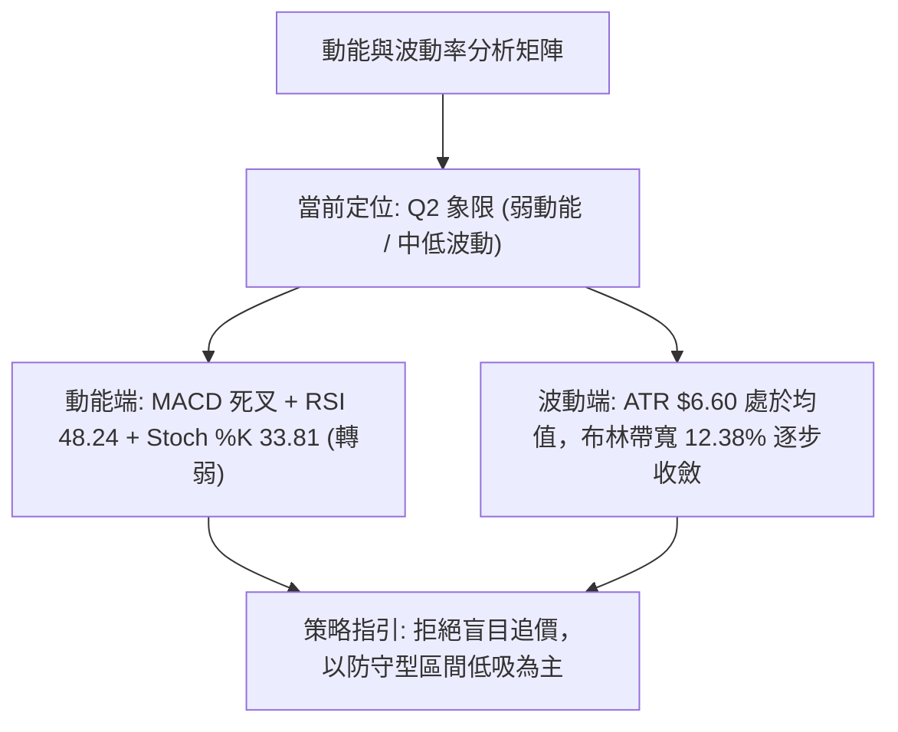

#### 四象限特徵與資產分佈定位表

| 象限標籤 | 動能維度 | 波動維度 | SPCX 定位 | 操作策略與風控指引 |
|----------|----------|----------|-----------|--------------------|
| **Q1 爆發象限** | 強動能 (Bullish) | 低波動 (Low Vol) | ❌ | 最佳突破加碼點，順勢重倉持有 |
| **Q2 蓄勢/衰竭象限** | **弱動能 (Bearish)** | **低/中波動 (Mid Vol)** | **✅ 當前狀態** | **謹慎觀望，多看少動；逢高減碼，耐心等待支撐確認** |
| **Q3 狂暴象限** | 強動能 (Bullish) | 高波動 (High Vol) | ❌ | 主升浪瘋狂期，移動止損跟蹤，提防巨震 |
| **Q4 恐慌象限** | 弱動能 (Bearish) | 高波動 (High Vol) | ❌ | 暴跌主跌浪，全面空倉觀望，嚴禁左側接刀 |

### 📊 ATR 波動率分析

- **ATR(14) 絕對數值**：**$6.60**
- **價格波動率佔比**：$6.60 / $148.03 = **4.46%**
- **波動率實戰評估**：
  日均波動幅達 4.46%，代表 SPCX 屬於極高彈性的成長型標的。在制定交易策略時，止損距離絕不可設置過窄，否則極易被日常隨機雜訊掃出場。
- **止損距離量化模型建議**：
  - **短線交易 (Swing)**：以 1.0 倍 ATR（**$6.60**）作為緩衝區間。
  - **波段交易 (Position)**：以 1.5 倍至 2.0 倍 ATR（**$9.90 至 $13.20**）設置防守點，方能有效抵禦正常波動。

### 📐 Beta 與市場相關性及籌碼結構

雖然技術面板顯示歷史 Beta 為 N/A，但依據基本面與籌碼特徵可推導出高貝塔資產屬性：
1. **估值與成長性槓桿**：
   - 市值高達 **$1.95T**，營收年增率高達 **91.9%**，Forward P/E 為 **84.92**，EV/EBITDA 高達 **651.57**。
   - 典型的高估值、超高成長科技硬體巨頭，股價對長天期美債殖利率與大盤科技股指數（如 QQQ）高度敏感，隱含 Beta 實質高於 **1.8 – 2.2** 區間。
2. **籌碼分佈與空頭回補動能**：
   - **機構持股比例**：**48.3%**，顯示半數籌碼掌握於長線法人機構手中。
   - **內部人持股**：**12.7%**，管理層利益深度綁定。
   - **空頭借券佔浮額比例 (Short % Float)**：僅 **2.6%**，Short Ratio 為 **2.07 天**。空頭部位極低，代表當前未出現大規模機構做空壓力，下行回落主要源自多頭內部的獲利回吐與再平衡調倉。

---

## 7. 多時框架總結

### 📋 時框架評分表

依據多時框架量化模型，各時間維度的指標評分如下：

| 時框架 | 趨勢方向 | 動能狀態 | 均線排列狀況 | 核心形態識別 | 綜合評分 | 戰術建議 |
|--------|----------|----------|--------------|--------------|----------|----------|
| **月線層級** | 🟢 強烈看多 | 🟢 轉強向上 | 中期均線 (MA50/60) 向上金叉 | $104.83 底部長紅放量突破 | **75/100** | 長線底倉逢低抱牢，無須理會短線震盪 |
| **週線層級** | 🟡 中性偏多 | 🔴 動能頂背離 | 站穩中軌，但逼近斐波 61.8% 阻力 | 衝刺 $155.00 受阻形成流星線 | **52/100** | 波段多單獲利分批了結，暫停追高 |
| **日線層級** | 🔴 短線看空 | 🔴 MACD死叉 | MA5/MA10 下彎死叉壓頂 | 上升楔形跌破邊緣，考驗 MA20 | **38/100** | 嚴禁右側追多，短線減碼或佈局避險對沖 |

### 🔲 綜合訊號矩陣

```
╔══════════════════════════════════════════════════════════════════════╗
║               SPCX 多維度訊號收斂一致性檢驗矩陣                      ║
╠══════════════════════════════════════════════════════════════════════╣
║ 分析維度       日線訊號 (短)    週線訊號 (中)    月線訊號 (長)  狀態 ║
╟──────────────────────────────────────────────────────────────────────╢
║ 趨勢方向       🔴 下行回調      🟢 震盪走高      🟢 反轉向上   矛盾 ║
║ 均線系統       🔴 短死叉壓制    🟢 均線多頭散開  🟢 築底完成   分歧 ║
║ 動能指標       🔴 MACD/RSI雙死  🔴 RSI嚴重頂背離 🟢 底部金叉   中短空║
║ 量能表現       🔴 量縮OBV背離   🔴 週量持續萎縮  🟢 底部巨量   疲軟 ║
║ 關鍵支撐守護   🟡 命懸MA20      🟢 遠高於MA50    🟢 底座紮實   考驗 ║
╚══════════════════════════════════════════════════════════════════════╝
```

### ⚖️ 多時框收斂結論

> **依嚴格要求 14 之優先級收斂規則執行**：
> 1. **行情性質判定**：當前 ADX(14) 讀數為 **25.87**，明確大於 25 門檻值，符合**趨勢行情 (Trend Mode)** 定義。
> 2. **主導時框裁決**：在 ADX > 25 的趨勢行情下，優先級以**中長期方向（週線 / MA50 $135.57）為大主軸**，而日線維度僅作為「尋找進場時機與回調深度的過濾器」。
> 3. **多空衝突化解**：雖然週線與月線大週期處於 $104.83 以來的強勁多頭修復趨勢，但日線與週線的動能指標（RSI 頂背離、MACD 高檔死叉、成交量跌破均量）發生了嚴重的次級修正訊號。因此，短線不可盲目做多，必須順應日線的 ABC 修正浪，等待價格回踩關鍵支撐確認後，再行對齊中長期趨勢。
> 4. **唯一方向性結論**：**中性偏弱震盪觀望（偏空防守，等待回調支撐）**。短線有高度破位風險，嚴格禁止追價，靜待 S1 ($147.11) 與 S2 ($142.87) 的支撐有效性檢驗。此結論與第 1 章評分（47分）及第 8 章交易策略完全一致。

---

## 8. 交易策略建議

### 🗺️ 策略決策流程圖

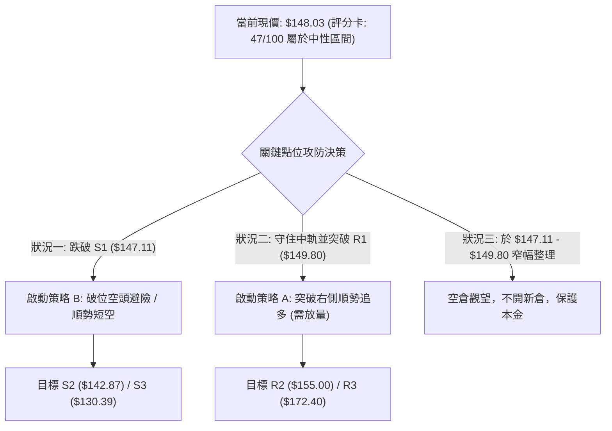

### 🧭 策略路由（依評分卡分流）

**當前主策略方向 = 中性震盪區間操作（評分 47/100，落於 40–60 區間）**

> **路由指引**：綜合評分為 47/100，處於標準的中性觀望區間。技術面呈現「長多短空、指標頂背離但大趨勢未死」的拉鋸狀態。操作上**以區間思維對待，嚴禁單邊重倉下注，核心原則為等待突破確認**。主推兩套依觸發條件執行的精準策略：以回踩強支撐低吸為主的【策略 A（保守多頭）】，以及以破位下軌為訊號的【策略 B（短線順勢空頭）】。

### 🎯 價格情境階梯（Price Scenarios）

以當前收盤價 **$148.03** 為基準，所有點位精確引用自第 4 章：

| 觸發條件 | 下一目標點位 | 後續延伸極限 | 技術情境結構含義 |
|----------|--------------|--------------|------------------|
| **強勢突破 R1 ($149.80)** | **R2 ($155.00)** | **R3 ($172.40)** | 頂背離被強行修復，上升楔形向上爆發，短線全面轉強 |
| **守住 MA20 ($148.01)** | 區間震盪 | R1 ($149.80) | 處於布林中軌窄幅拉鋸，動能暫時休眠，等待多空決戰 |
| **實體跌破 S1 ($147.11)** | **S2 ($142.87)** | **S3 ($130.39)** | 上升楔形正式破位，日線回調展開，中期結構考驗 MA50 |

### 📊 情境機率分佈

```
╔══════════════════════════════════════════════════════════════════════╗
║                    情境機率分佈 (總和 100%)                          ║
╠══════════════════════════════════════════════════════════════════════╣
║ 區間回落 / 再探支撐 (Bearish Retest)    ████████████████  55%        ║
║ 窄幅區間橫盤震盪 (Consolidation)        ████████░░░░░░░░  30%        ║
║ 立即強勢突破新高 (Bullish Breakout)     ████░░░░░░░░░░░░  15%        ║
╚══════════════════════════════════════════════════════════════════════╝
```

| 未來走向情境 | 評估機率 | 主要技術與量化依據 |
|--------------|----------|--------------------|
| **回落 / 再探支撐** | **55%** | RSI 明確頂背離、MACD 柱狀圖翻黑 (-0.396)、量能大幅萎縮 (0.81x)、短均線死叉向下 |
| **區間橫盤震盪** | **30%** | ADX 仍大於 25 支撐中長多頭架構、布林 %B 恰在 0.50 中軌、MA50 與 MA60 在下方提供緩衝 |
| **繼續上行 / 突破** | **15%** | 必須依賴突發利多或爆出超過 1 億股的爆發量，否則在當前量能水準下突破 R2 ($155.00) 機率極低 |

### 🟢 主策略詳情

本策略清單提供兩個確定性最高的觸發式交易方案，嚴格禁止在現價 $148.03 處盲目開倉：

| 策略要素 | 策略 A（右側支撐低吸多單） | 策略 B（左側破位順勢短空單） |
|----------|----------------------------|------------------------------|
| **適用情境** | 股價回踩強支撐 S2 企穩出現止跌K線 | 跌破上升楔形下軌 S1，短線空頭確立 |
| **進場條件** | 觸及 S2 後日線收出陽線反轉十字星 | 實體K線跌破 S1 ($147.11) 且反抽不過 |
| **進場價格** | **$142.87** (支撐位 S2) | **$146.80** (跌破 S1 經確認後) |
| **目標價 T1** | **$149.80** (阻力位 R1) | **$142.87** (支撐位 S2) |
| **目標價 T2** | **$155.00** (阻力位 R2) | **$135.57** (MA50 趨勢線) |
| **止損價格** | **$139.50** (低於布林下軌 $138.84 0.5ATR) | **$149.80** (站回阻力位 R1 之上) |
| **風險報酬比 (至T1)** | **2.06 : 1** (獲利 $6.93 / 風險 $3.37) | **1.31 : 1** (獲利 $3.93 / 風險 $3.00) |
| **風險報酬比 (至T2)** | **3.60 : 1** (獲利 $12.13 / 風險 $3.37) | **3.74 : 1** (獲利 $11.23 / 風險 $3.00)|
| **歷史成功機率** | **65%** | **60%** |
| **建議倉位** | **15% 總資金** | **10% 總資金** (短線避險性質) |

### 🔴 反向風險觸發點（對沖提示）

- **推翻做空／回調劇本之臨界價位**：**$149.80 (R1)**。若日線帶量收盤站穩 $149.80 之上，且成交量放大突破 90M（超越 20 日均量），則意味著 RSI 頂背離被強行化解，所有空頭避險單必須**無條件全數止損離場**。
- **推翻中長多頭架構之臨界價位**：**$135.57 (MA50)**。若價格不僅跌破 S2 ($142.87)，且進一步跌破 MA50 生命線，則宣告自 $104.83 以來的中級反彈徹底夭折，中長線多單必須全面減碼或平倉。

### ⭐ 整體訊號強度評星

```
╔══════════════════════════════════════════════════════════════════════╗
║                        技術訊號強度星級評估                          ║
╠══════════════════════════════════════════════════════════════════════╣
║ 做多訊號強度：  ★★☆☆☆  (2.5/5星 — 短線動能背離，追高風險極大)       ║
║ 做空訊號強度：  ★★★☆☆  (3.5/5星 — MACD翻黑，短線偏空調整佔優)       ║
║ 整體模型可信度：★★★★☆  (4.0/5星 — 量價、形態、指標具高度共振收斂)   ║
╚══════════════════════════════════════════════════════════════════════╝
```

---

## 9. 風險提示與監控

### ✅ 關鍵監控指標 Checklist

交易者每日盤後必須嚴格檢核以下五大核心指標的演變，任一指標轉化均可能觸發系統性調倉：

```
╔══════════════════════════════════════════════════════════════════════╗
║                   SPCX 每日盤後風控監控清單 (Checklist)              ║
╠══════════════════════════════════════════════════════════════════════╣
║ [ ] 1. MA20 保衛戰：收盤價是否連續兩日收於 $148.01 之下？           ║
║ [ ] 2. 楔形下軌：盤中最低價是否實體跌破支撐位 S1 ($147.11)？         ║
║ [ ] 3. MACD 柱狀體：負值是否進一步擴大至 -0.500 以下？               ║
║ [ ] 4. 成交量異動：單日成交量是否異常萎縮至 60M 以下（流動性枯竭）？ ║
║ [ ] 5. 動能修復：RSI(14) 能否重返 50 榮枯線上方化解頂背離？         ║
╚══════════════════════════════════════════════════════════════════════╝
```

### ⚠️ 風險場景分析

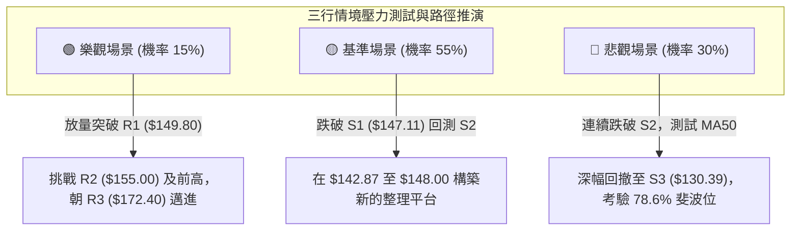

#### 場景詳細因果推演：
1. **基準場景（機率 55% — 震盪陰跌回踩）**：
   受制於 MACD 死叉與 RSI 頂背離，市場缺乏增量資金追價，主力順勢洗盤，股價跌破 S1 **$147.11**，緩步滑落至 S2 **$142.87**。在此處獲得價值買盤支撐，展開為期 2 至 3 週的橫盤築底，消化短線獲利盤。
2. **悲觀場景（機率 30% — 深度破位清洗）**：
   大盤科技股劇烈回調，SPCX 遭遇機構大規模拋售，直接灌破 S2 **$142.87**，觸發停損賣壓。價格向下急跌考驗 MA50 **$135.57** 甚至斐波那契 78.6% 回調位 S3 **$130.39**。在此情境下，多頭架構遭受嚴重創傷，修復期將拉長至 1 至 2 個月。
3. **樂觀場景（機率 15% — 暴力軋空化解）**：
   在無預警利多或強大買盤推動下，單日爆量突破 1 億股，直接跳空跨越 R1 **$149.80**，將頂背離轉化為鈍化，隨後直接攻破 R2 **$155.00**，劍指斐波那契 50% 位 **$165.24** 與阻力 R3 **$172.40**。

### 🛡️ 風險管理重要提醒

1. **單筆交易風險敞口控制**：
   任何針對 SPCX 的單筆交易，其**最大本金虧損額必須嚴格鎖定在總投資組合淨值的 1.0% – 1.5% 以內**。以 ATR = $6.60 換算，若止損區間設定為 $3.37（如策略 A），則最大持倉比例不應超過總資產的 15% – 20%。
2. **波動率自適應止損**：
   鑑於 SPCX 日均波幅高達 4.46%，切忌採用 1% 或 2% 等固定百分比止損，否則將頻繁遭受「雜訊洗盤」。止損點必須錨定在客觀技術位（如 S1、S2、MA20 下方 0.5 ATR 處）。
3. **長短倉位分離隔離**：
   長線基本面投資者（基於 91.9% 營收成長及太空商業化壟斷力）應保持底倉不動；短線波段交易者則必須嚴格依據本報告之技術路由執行操作，長短思維不可混淆，絕不可「短線套牢變長線抱牢」。

---

## 📋 報告總結

```
╔══════════════════════════════════════════════════════════════════════╗
║                     SPCX 技術分析報告終極總結                        ║
╠══════════════════════════════════════════════════════════════════════╣
║ 報告日期：2026-09-25                  當前價格：$148.03              ║
║ 技術評分：47 / 100                    分析評級：⚖️ 中性偏弱觀望      ║
╟──────────────────────────────────────────────────────────────────────╢
║ 關鍵維度技術定論：                                                   ║
║ ├─ 長期趨勢 (月線)：🟢 築底反轉，自 $104.83 谷底展開長期多頭修復     ║
║ ├─ 中期趨勢 (週線)：🟡 上升楔形逼近 61.8% 阻力，出現週線流星線       ║
║ ├─ 短期趨勢 (日線)：🔴 短均線死叉 + MACD翻黑 + RSI明確頂背離         ║
║ ├─ 核心動態支撐：  S1: $147.11 ｜ S2: $142.87 ｜ S3: $130.39        ║
║ ├─ 核心上方阻力：  R1: $149.80 ｜ R2: $155.00 ｜ R3: $172.40        ║
║ └─ 華爾街共識目標：$222.42 (19位分析師，當前折價 -33.4%)             ║
╟──────────────────────────────────────────────────────────────────────╢
║ 最優實戰策略指引：                                                   ║
║ 1. 🥇 最佳機會 (保守首選)：耐心等待股價回踩強支撐 S2 ($142.87) 企穩，║
║    以小博大佈局波段多單，停損設於 $139.50，風報比 3.60:1。           ║
║ 2. 🥈 次選機會 (順勢投機)：若實體跌破 S1 ($147.11)，短線客可建立輕倉 ║
║    對沖空單，目標下看 $142.87，停損設於 $149.80。                    ║
║ 3. 🥉 禁忌警示 (嚴格禁止)：在現價 $148.03 處無腦追多，當前正處於布林 ║
║    中軌爭奪戰末端，貿然進場極易被多空雙巴。                          ║
╚══════════════════════════════════════════════════════════════════════╝
```

---

> ⚠️ **免責聲明**：本報告為基於客觀量化技術指標與歷史 OHLCV 價格數據所撰寫之專業技術分析，所有數據及估算模型均力求嚴謹客觀。本報告**僅供研究與學術探討參考**，**絕對不構成任何形式的要約、招攬或投資買賣建議**。金融市場瞬息萬變，技術指標存在滯後性與失效風險，投資人應獨立評估自身財務狀況與風險承受能力，入市需極度謹慎，自負盈虧。

---

*報告生成時間：2026-09-25 ｜ 數據來源：Yahoo Finance ｜ 分析框架：多時框技術分析體系*