# SPCX 技術分析報告

> **報告日期**：2026-09-26 ｜ **語言**：繁體中文 ｜ **數據來源**：Yahoo Finance ｜ **當前價格**：$148.68

---

## 目錄

| 章節 | 內容 |
|------|------|
| [1. 技術面概覽](#1-技術面概覽) | 訊號儀表板、核心指標、評分卡 |
| [2. 趨勢分析](#2-趨勢分析) | 多時框趨勢、長中短期走勢 |
| [3. 圖表形態分析](#3-圖表形態分析) | 形態識別、K線組合、目標價 |
| [4. 支撐與阻力](#4-支撐與阻力) | 關鍵價位、斐波那契回調 |
| [5. 技術指標深度解讀](#5-技術指標深度解讀) | MA/RSI/MACD/布林/成交量 |
| [6. 動能與波動率](#6-動能與波動率) | 動能評估、ATR、Beta |
| [7. 多時框架總結](#7-多時框架總結) | 時框架評分矩陣 |
| [8. 交易策略建議](#8-交易策略建議) | 多空策略、風險報酬比 |
| [9. 風險提示與監控](#9-風險提示與監控) | 監控指標、風險場景 |

---

## 1. 技術面概覽

### 🎯 技術訊號儀表板

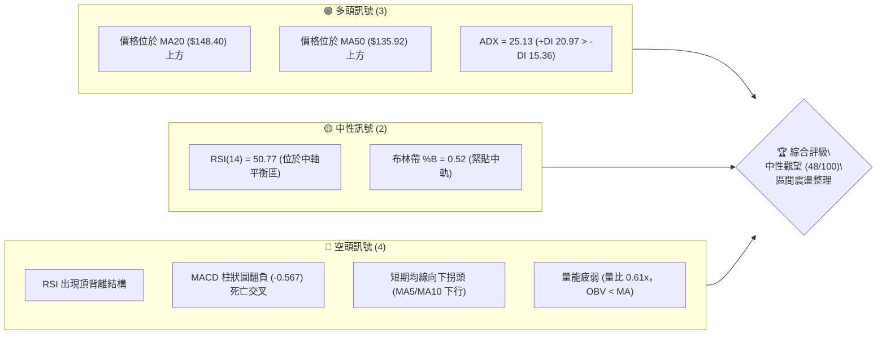

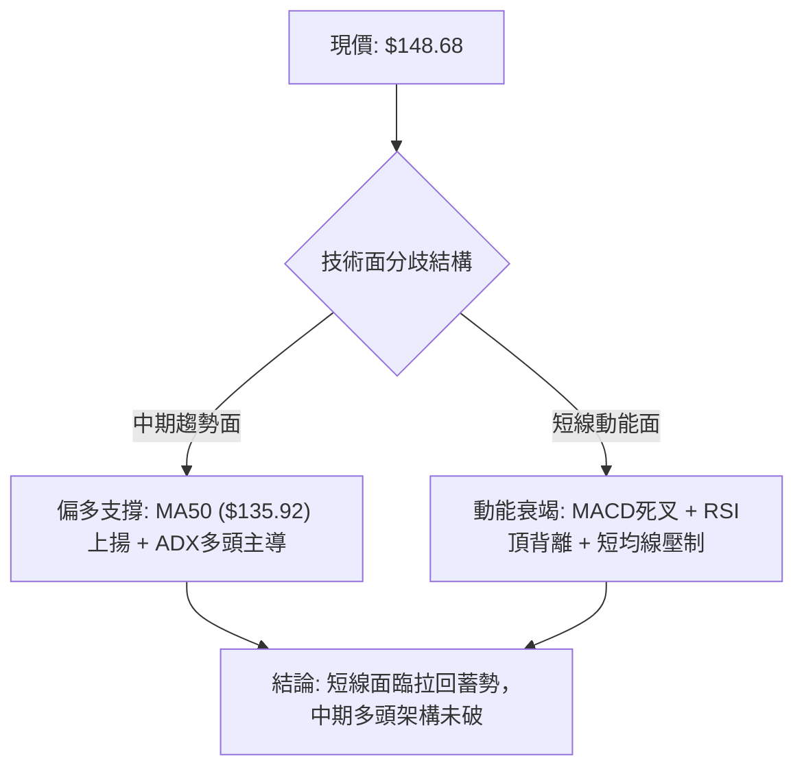

### 📊 核心指標速覽表

| 指標類別 | 指標名稱 | 當前數值 | 訊號 | 解讀 |
|----------|----------|----------|------|------|
| **價格** | 當前價格 | $148.68 | 🟡 | 位於 52 週區間 36.3% 位置，處於超跌反彈後的收斂中樞 |
| **均線** | MA20 | $148.40 | 🟢 | 現價略高於 MA20（+0.19%），中軌提供短線微弱支撐 |
| **均線** | MA50 | $135.92 | 🟢 | 現價高於 MA50（+9.39%），中期生命線保持斜率向上 |
| **均線** | MA200 | 資料不足 | 🟡 | 歷史資料不足 200 筆，長期均線指標從缺，以 MA60 ($137.59) 輔助 |
| **動能** | RSI(14) | 50.77 | 🔴 | 數值處於中性區，但日線與週線出現典型「頂背離」，警惕回檔 |
| **動能** | MACD(12,26,9) | 3.051 / 3.618 | 🔴 | DIF 下穿 DEA，柱狀圖轉負（-0.567），呈現死叉向下修正訊號 |
| **擺動** | KD (Stoch) | 38.07 / 38.23 | 🟡 | %K 與 %D 在 38 附近走平黏合，短期缺乏單邊動能推動 |
| **趨勢** | ADX(14) | 25.13 | 🟢 | 剛越過 25 強弱分水嶺，+DI (20.97) 高於 -DI (15.36)，多頭具主導權 |
| **通道** | Bollinger %B | 0.52 | 🟡 | 現價緊貼布林中軌（$148.40），處於上下軌中軸，等待方向選擇 |
| **量能** | 當日量 / 20日均量 | 54.42M / 89.75M | 🔴 | 成交量萎縮（量比 0.61x），OBV 低於均線，買盤追價意願薄弱 |
| **波動** | ATR(14) | $6.61 | 🟡 | 佔現價 4.44%，每日波動幅度中等，提供止損設定依據 |

### 🏆 技術評分卡

```
╔══════════════════════════════════════════════════════════════════╗
║                   技術評分卡 — SPCX (2026-09-26)                 ║
╠══════════════════════════════════════════════════════════════════╣
║ 趨勢強度 (Trend)   ████████████░░░░░░░░  60/100 🟢 中期偏多但短趨降速   ║
║ 動能指標 (Momentum)████████░░░░░░░░░░░░  40/100 🔴 MACD死叉+RSI頂背離   ║
║ 支撐穩定度 (Support)████████████░░░░░░░░  60/100 🟢 S1/S2防線清晰緊湊     ║
║ 成交量配合 (Volume) ██████░░░░░░░░░░░░░░  30/100 🔴 縮量反彈,OBV低迷     ║
║ 形態完整度 (Pattern)██████████░░░░░░░░░░  50/100 🟡 箱體收斂,等待突破   ║
║ 均線排列 (Moving A)████████░░░░░░░░░░░░  48/100 🟡 混合排列,短均下拐     ║
╠══════════════════════════════════════════════════════════════════╣
║ 綜合評分           █████████░░░░░░░░░░░  48/100 🟡 評級：中性觀望 (區間) ║
╚══════════════════════════════════════════════════════════════════╝
```

---

## 2. 趨勢分析

### 🌐 多時框趨勢分析

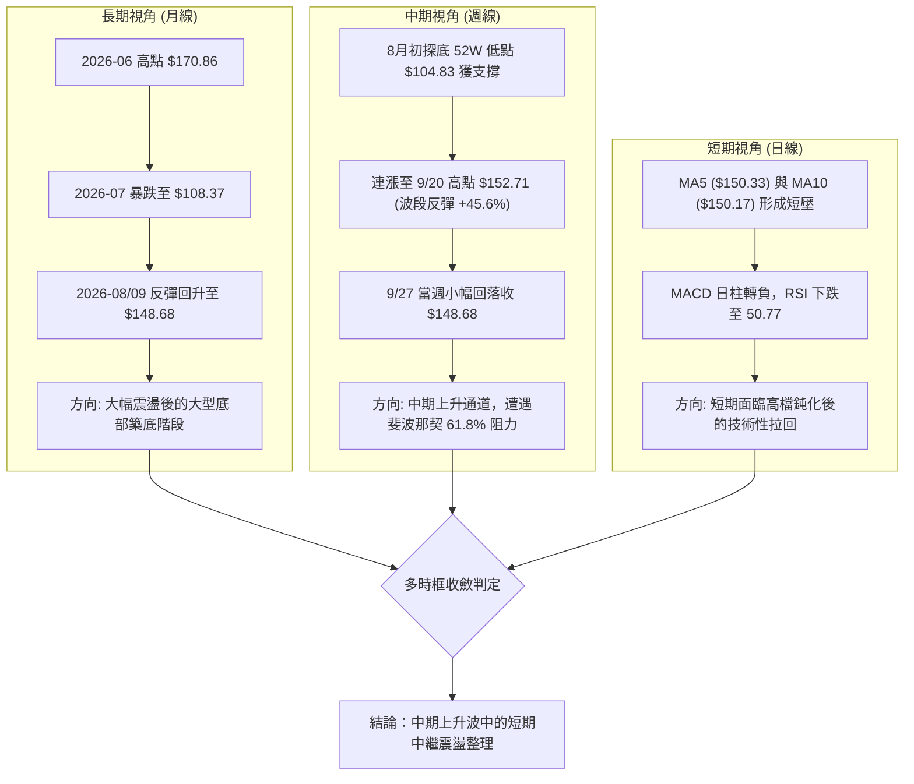

### 📈 長期趨勢 — 12個月走勢圖（Unicode）

```
SPCX 月線走勢示意圖（2025.10 - 2026.09）
價格軸 ($)
$225 ┤                                          ● 52W High ($225.64)
$200 ┤                             ●          ／ ╲
$175 ┤               ●           ／ ╲        ●     ● 2026-06 ($170.86)
$150 ┤  ●          ／ ╲         ／   ╲      ／       ╲        ● 現價 ($148.68)
$125 ┤   ╲        ／   ╲       ／     ╲    ／         ╲      ／
$100 ┤    ●──────●      ●─────●        ●──●           ●────● 2026-07/08 低點 ($108.37 / $104.83)
     └─────────────────────────────────────────────────────────────
       M-11 M-10 M-9   M-8   M-7  M-6  M-5  M-4  M-3  M-2  M-1  當前 (2026-09)
```

#### 走勢特徵分析表格

| 階段區間 | 起止價位 ($) | 漲跌幅 (%) | 量能特徵 | 結構屬性與形態解讀 |
|----------|--------------|------------|----------|--------------------|
| 2026-06 築頂下挫 | $170.86 → $153.23 | -10.32% | 放量殺跌 (週量達 925M) | 跌破高位整理平台，主力資金顯著派發 |
| 2026-07 探底崩跌 | $162.00 → $108.37 | -33.10% | 縮量陰跌後急殺 (量能降至 315M) | 恐慌盤湧出，摜穿波段低點，RSI 觸及 15.9 極度超賣 |
| 2026-08 暴力反彈 | $108.37 → $141.50 | +30.57% | 爆量長紅 (8/9 當週量達 920M) | 機構資金大舉抄底，形成「破底翻」V型反轉結構 |
| 2026-09 震盪蓄勢 | $141.50 → $148.68 | +5.07% | 量能階梯式遞減 (萎縮至 329M) | 逼近前高密集成交區，買盤跟進謹慎，動能趨緩 |

### 📊 中期趨勢（週線分析）

```
SPCX 週線波段架構與阻力支撐示意
$172.40 ────────────────────────────────────────── 阻力 R3 (強阻力 / 6月反彈高點聚類)
               ▲
$155.00 ───────┼────────────────────────────────── 阻力 R2 (波段頸線 / 前期高點)
               │          ┌───● $152.71 (9/20當週高點)
$149.80 ───────┼──────────┼─── 阻力 R1 (Fib 61.8% $150.98 聚類區)
$148.68 ───────┼──────────● 現價
               │
$147.11 ───────┼────────────────────────────────── 支撐 S1 (日線波段低點支撐)
               │
$142.87 ───────┼────────────────────────────────── 支撐 S2 (波段整理平台支撐)
               ▼
$130.39 ────────────────────────────────────────── 支撐 S3 (Fib 78.6% $130.68 聚類強支撐)
```

週線層面上，自 2026 年 8 月低點 $104.83 啟動強勁反彈以來，SPCX 連續收出多根陽線，最高觸及 9 月 20 日當週的 $152.71。然而，最新一週（9/27）收盤價回落至 $148.68，週線 MACD 柱狀圖從 +4.591（8/16 當週）一路遞減至 -0.567，週成交量也由 8 月初的 9.20 億股劇烈收縮至當前的 3.29 億股，顯示中級反彈波的高速推進期已經結束，進入阻力位消化期。

### ⚡ 趨勢強度評估（ADX 解讀）

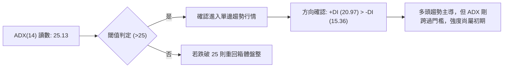

#### ADX 趨勢強度對照表

| 指標變數 | 當前讀數 | 門檻區間 | 趨勢判定 | 實戰操作指引 |
|----------|----------|----------|----------|--------------|
| **ADX(14)** | 25.13 | 25.00 – 50.00 | 強趨勢臨界點 | 趨勢剛越過盤整臨界線，順勢交易勝率優於逆勢摸頂抄底 |
| **+DI** | 20.97 | — | 多方力量佔優 | 買方動能依然領先空方 5.61 個點位，未出現空頭反轉信號 |
| **-DI** | 15.36 | — | 空方打壓有限 | 空方力道處於相對低檔，下跌多以獲利了結為主，非主力恐慌砸盤 |
| **方向差 (+DI - -DI)** | +5.61 | > 0 | 多頭結構 | 趨勢方向偏多，但差值未擴大至 15 以上，防範假突破震盪 |

---

## 3. 圖表形態分析

### 🔍 形態識別系統

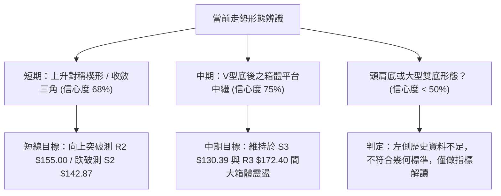

#### 圖表形態信心度評估表

| 形態類別 | 形態名稱 | 信心度 | 判斷依據（引用精確數據） | 完成度 | 形態量化目標價（附計算式） |
|----------|----------|--------|--------------------------|--------|----------------------------|
| 短期幾何 | 上升收斂三角形 / 楔形整理 | 68% | 上軌受壓於阻力 R2 ($155.00) 與 R1 ($149.80)，下軌由 S1 ($147.11) 及 S2 ($142.87) 墊高構成 | 75% | 若向上突破 R1 ($149.80)：<br>目標 = $149.80 + ($152.71 - $142.87) = **$159.64** (受制於布林上軌 $156.92) |
| 中期幾何 | V型反轉後的高位矩形箱體 | 75% | 自 8/2 低點 $108.37 垂直拉升至 9/20 高點 $152.71 後，近 4 週於 $142.87–$152.71 區間橫向築底震盪 | 80% | 箱體突破目標：<br>目標 = 頸線 $152.71 + 箱高 ($152.71 - $142.87) = **$162.55** |
| 幾何形態 | 大型頭肩底 / 雙底 | 35% | 數據中未偵測到完整的左肩與第二個底部點位，資料不足以驗證對稱性 | <40% | **訊號不足，僅做指標型解讀**（不強行預測目標） |

### 🕯️ 重要K線形態分析

| 週期/月份 | 收盤價 ($) | K線形態 | 量價關係與形態解讀 | 多空訊號 |
|-----------|------------|---------|--------------------|----------|
| 2026-07 | $108.37 | 破位長黑K | 單月暴跌逾 36%，實體大陰線摜穿所有均線，形成超賣恐慌底 | 🔴 極度看空 |
| 2026-08 | $143.69 | 低檔吞噬大陽線 | 月線級別大陽線吞沒 7 月跌幅逾 50%，伴隨 8/9 當週 9.20 億巨量，確認主力進場 | 🟢 強烈看多 |
| 2026-09-20 週 | $152.71 | 長上影線流星線 (Shooting Star) | 衝高至 $152.71 後遭遇強大獲利回吐賣壓，上影線顯示 R2 ($155.00) 附近解套壓力沉重 | 🔴 短線轉弱 |
| 2026-09-27 週 | $148.68 | 縮量小陰紡錘線 (Spinning Top) | 實體狹窄，成交量大幅萎縮（329M vs 前週 669M），顯示多空在 $148.40 (MA20) 展開拉鋸 | 🟡 變盤觀望 |

### 📉 ASCII 走勢形態示意圖

```
SPCX 日線收斂楔形整理形態 (2026.08 - 2026.09)
價格 ($)
$155.00 ┤                     阻力線 (Resistance) ───────── R2 ($155.00)
        │                         ● 9/20 高點 ($152.71)
$150.00 ┤                        ╱ ╲       ● R1 ($149.80)
        │                       ╱   ╲     ╱ ╲
$148.68 ┤──────────────────────╱─────●───╱───● 現價 ($148.68)
        │                     ╱       ╲ ╱
$145.00 ┤                    ╱         ● S1 ($147.11)
        │                   ╱
$142.87 ┤                  ● 8/30 支撐 ──────────────────── S2 ($142.87)
        │                 ╱   上升支撐線 (Ascending Support)
$135.00 ┤                ╱
        │               ● 8/09 突破點
$130.39 ┤              ╱ ───────────────────────────────── S3 ($130.39)
        └─────────────────────────────────────────────────────────────
         08/02        08/16       08/30       09/13       09/27 (時間)
```

### 🎯 形態目標價計算

根據已確認的「高位矩形/收斂楔形整理形態」，計算嚴謹之波段等距測量目標價：

$$形態高度 (Height) = 整理區間波段高點 ($152.71) - 波段關鍵支撐 S2 ($142.87) = \$9.84$$

1. **向上突破上頸線 ($152.71)**：
   $$\text{理論多頭目標 T1} = \$152.71 + \$9.84 = \$162.55$$
   *(該目標價略低於斐波那契 50.0% 回調位 $165.24)*
2. **向下跌破下支撐 S2 ($142.87)**：
   $$\text{理論空頭目標 T1} = \$142.87 - \$9.84 = \$133.03$$
   *(該目標價逼近關鍵支撐 S3 $130.39 及斐波那契 78.6% 回調位 $130.68)*

---

## 4. 支撐與阻力

### 🗺️ 關鍵價位分布圖（Unicode）

```
SPCX 價位結構分布圖
══════════════════════════════════════════════════════════════════
$172.40 ║████████████████████████████████████║ 強阻力 R3 (波段解套重壓區)
        ║                                    ║
$156.92 ║────────────────────────────────────║ 布林通道上軌
$155.00 ║████████████████████████            ║ 阻力 R2 (前高波段密集區)
$150.98 ║····································║ 斐波那契 61.8% 關鍵回調位
$149.80 ║████████████████                    ║ 關鍵阻力 R1 (短線突破臨界點)
$148.68 ╠════════════════════════════════════╣ ◄ 現價 ($148.68) / MA20 ($148.40)
$147.11 ║▓▓▓▓▓▓▓▓▓▓▓▓▓▓▓▓▓▓▓▓                ║ 近期支撐 S1 (短線防守點)
$142.87 ║████████████████████████            ║ 強支撐 S2 (波段多空分水嶺)
$139.87 ║────────────────────────────────────║ 布林通道下軌
$135.92 ║┈┈┈┈┈┈┈┈┈┈┈┈┈┈┈┈┈┈┈┈┈┈┈┈┈┈┈┈┈┈┈┈┈┈┈┈║ MA50 生命線支撐
$130.39 ║████████████████████████████████████║ 強支撐 S3 (Fib 78.6% $130.68 共振)
══════════════════════════════════════════════════════════════════
```

### 🚧 阻力位分析表

所有價位均嚴格引用歷史波段聚類數據計算：

| 阻力級別 | 精確價位 | 距現價幅標 | 形成原因與籌碼結構 | 突破難度 | 重要性權重 |
|----------|----------|------------|--------------------|----------|------------|
| **R1** | **$149.80** | +0.75% | 近期日線反彈高點聚類，與 MA5 ($150.33) 及 MA10 ($150.17) 形成短均共振反壓 | 🟡 中等 | ★★★☆☆ (短線多空分水嶺) |
| **R2** | **$155.00** | +4.25% | 近一年波段次高點聚類，逼近布林通道上軌 ($156.92)，為 9/20 高點 $152.71 延伸之強壓區 | 🔴 較高 | ★★★★☆ (波段多頭攻堅目標) |
| **R3** | **$172.40** | +15.95% | 2026 年 6 月大跌前之起跌平台高點聚類，歷史天量套牢密集區 | 🔴 極高 | ★★★★★ (中期反轉牛熊分水嶺) |

### 🛡️ 支撐位分析表

所有價位均嚴格引用歷史波段聚類數據計算：

| 支撐級別 | 精確價位 | 距現價幅標 | 形成原因與籌碼結構 | 守住機率 | 重要性權重 |
|----------|----------|------------|--------------------|----------|------------|
| **S1** | **$147.11** | -1.06% | 近期日線拉回波段低點聚類，緊鄰 MA20 / 布林中軌 ($148.40) 下方 | 🟢 70% | ★★★☆☆ (極短線防守底線) |
| **S2** | **$142.87** | -3.91% | 8 月底整理平台低點聚類，跌破將引發向布林下軌 ($139.87) 尋求支撐之賣壓 | 🟡 55% | ★★★★☆ (中期上升趨勢保護線) |
| **S3** | **$130.39** | -12.30% | 近一年大波段低點聚類，與斐波那契 78.6% ($130.68) 及 MA50 ($135.92) 構成強烈共振保護底 | 🟢 85% | ★★★★★ (中期多頭最後防線) |

### 📐 斐波那契回調位分析

依據 52 週極值區間：最低點 **$104.83** → 最高點 **$225.64**，總波幅 \$120.81，回調位精確計算如下：

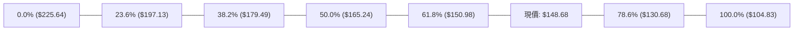

#### 斐波那契價位解讀表

| 回調比例 (%) | 精確價位 ($) | 當前相對位置 | 技術意義與多空攻防解讀 |
|--------------|--------------|--------------|------------------------|
| **0.0%** (52W High) | $225.64 | +51.76% | 歷史最高壓力，長期牛市極限目標 |
| **23.6%** | $197.13 | +32.59% | 強牛市回檔防守位 |
| **38.2%** | $179.49 | +20.72% | 強弱分界強阻力，靠近阻力 R3 ($172.40) |
| **50.0%** | $165.24 | +11.14% | 多空平衡中軸位，前期暴跌反彈之理論折半壓力 |
| **61.8%** | **$150.98** | **+1.55%** | **黃金分割關鍵阻力**。現價（$148.68）正受制於此水平下方，未能有效放量站穩前，仍屬弱勢反彈範疇 |
| **78.6%** | **$130.68** | **-12.11%** | **深度回調強支撐**。與波段支撐 S3 ($130.39) 僅差 $0.29，構成雙重共振黃金防線 |
| **100.0%** (52W Low) | $104.83 | -29.49% | 歷史週線雙底絕對防線 |

---

## 5. 技術指標深度解讀

### 🎛️ 指標訊號總覽

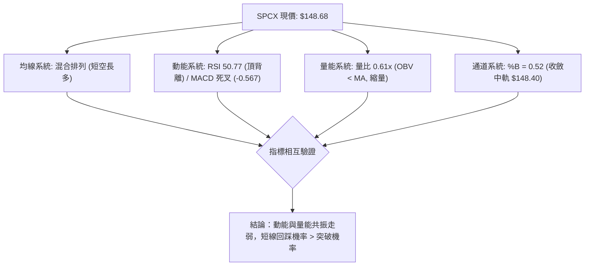

### 📈 移動平均線排列分析

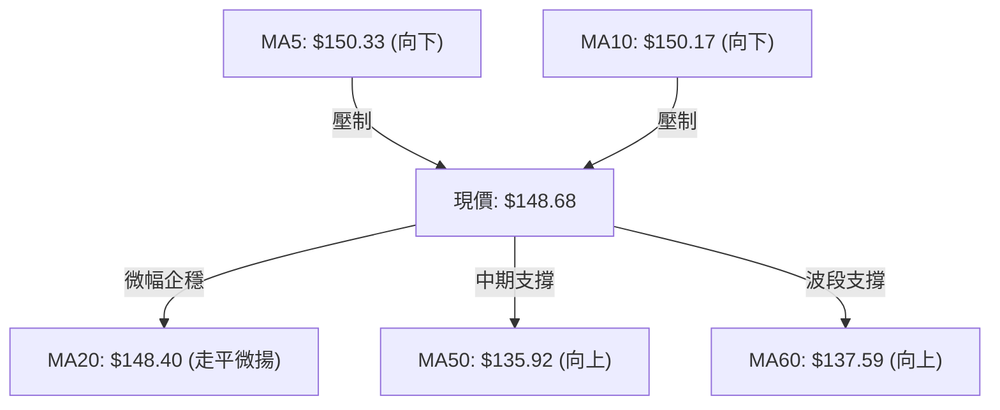

#### 均線數據分析矩陣

| 均線名稱 | 當前數值 ($) | 與現價乖離 | 方向斜率 | 排列狀態與技術解讀 |
|----------|--------------|------------|----------|--------------------|
| **MA 5** | $150.33 | -1.10% | 轉折向下 | 極短線空頭排列，上週衝高後獲利了結壓制股價 |
| **MA 10** | $150.17 | -0.99% | 轉折向下 | 短期均線死叉 MA5，於 $150.00 整數關卡形成短壓密集帶 |
| **MA 20** | $148.40 | +0.19% | 走平向上 | 現價僅高出 $0.28，中軌支撐岌岌可危，處於方向抉擇臨界點 |
| **MA 50** | $135.92 | +9.39% | 穩定上揚 | 中期上升趨勢線保持完好，中期多頭結構未遭破壞 |
| **MA 60** | $137.59 | +8.06% | 穩定上揚 | 與 MA50 形成多頭支撐帶，下檔安全墊充裕 |
| **MA 200** | N/A | N/A | 無數據 | 數據不足，長期均線指標缺省 |

### 📉 RSI(14) 分析

```
RSI(14) 當前水平：50.77
[0] ─────────────── [30] ────────────── [50] ──●──────────── [70] ─────────────── [100]
      極度超賣             弱勢區             │   強勢區             極度超買
                                           50.77 (中性平衡點)
進度條展示：
RSI 強度：██████████░░░░░░░░░░  50.77%
```

#### RSI 背離深度診斷
- **背離形態確認**：⚠️ **日線/週線頂背離 (Bearish Divergence)**。
- **背離證據**：
  1. SPCX 價格在 2026-09-13 當週收 $151.21（RSI 達 68.0），隨後於 2026-09-20 週創下新高 **$152.71**。
  2. 但 2026-09-20 當週之 RSI 卻降至 **60.7**，指標並未同步刷新高點。
  3. 最新一週（9/27）收盤價回檔至 $148.68，RSI 加速下滑至 **50.77**。
- **結論**：價格創波段新高而動能連續衰減，頂背離形態確立，預示價格短期內難以直接突破 R1/R2，需透過時間或空間回調修復指標超買。

### 📊 MACD(12/26/9) 訊號解讀

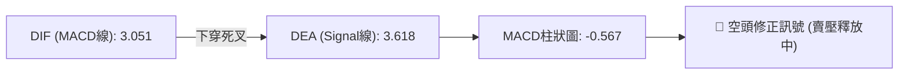

- **柱狀圖動態**：從 8/16 當週的歷史峰值 **+4.591**，一路遞減為 +2.143 → +1.082 → +0.888 → +0.411，至最新一週正式轉為負值 **-0.567**。
- **零軸關係**：DIF 與 DEA 仍在零軸上方（3.051 與 3.618），代表**整體大格局仍處於多頭市場的回檔修正期**，而非空頭主導之崩跌波。短線以死叉降溫看待。

### 📦 布林通道分析

```
SPCX 布林通道結構示意圖 (帶寬寬度：$17.05 / 11.47%)
$156.92 ────────────────────────────────────────── 布林上軌 (Upper Band)
               ▲
               │
$150.98 ───────┼────────────────────────────────── Fib 61.8% / 阻力 R1 ($149.80)
$148.68 ───────┼──────────● 現價 (%B = 0.52)
$148.40 ───────┼────────────────────────────────── 布林中軌 (Middle Band - MA20)
               │
               ▼
$139.87 ────────────────────────────────────────── 布林下軌 (Lower Band)
```

- **帶寬特徵**：布林帶目前呈現水平收縮收斂態勢，上下軌間距僅約 11.5%，顯示自 8 月初以來的劇烈單邊波動已逐漸平息，波動率大幅下降。
- **%B 位置**：當前 %B 為 **0.52**，現價精準壓在布林中軌（$148.40）之上，代表股價回到常態分佈平均值。若後續失守中軌，將下測布林下軌 **$139.87**。

### 💹 成交量分析（量價配合度）

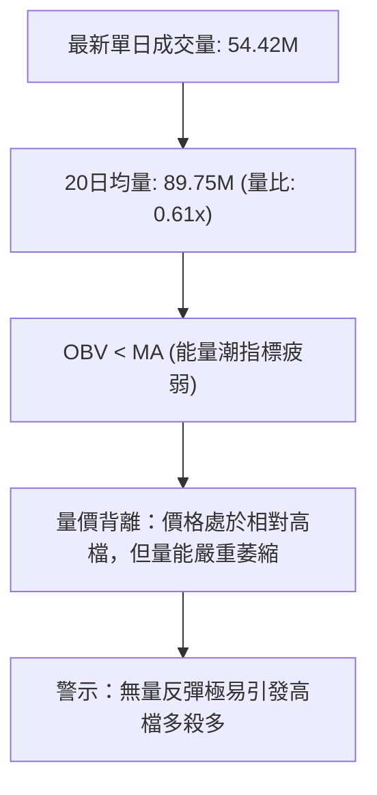

- **量比與均量對比**：最新單日成交量為 54,421,300 股，僅為 20 日均量（89,751,540 股）的 **0.61 倍**，相較 50 日均量（96,903,894 股）縮水更為明顯。
- **能量潮 (OBV) 分析**：OBV 線跌破其短期均線，呈現「價漲量縮、價跌量增」的弱勢資金徵兆。8 月中旬衝高時的巨量籌碼已被鎖定，但在 $150.00 阻力關卡前缺乏增量買盤接力，量能無法確認當前的價格突破。

---

## 6. 動能與波動率

### ⚡ 動能評估四象限

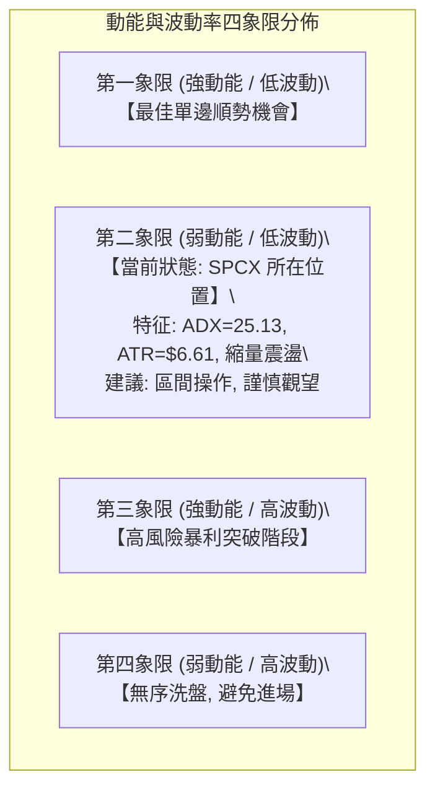

#### 動能與波動率狀態矩陣

| 象限 | 動能維度 | 波動維度 | SPCX當前落點 | 狀態評估與操盤指引 |
|------|----------|----------|--------------|--------------------|
| **Q1** | 強 | 低 | — | 趨勢穩健上行，適合回調加碼 |
| **Q2** | **弱/中性** | **中/低** | **✓ (SPCX)** | **動能高檔鈍化，波動度壓縮，行情轉入狹幅箱體整理，避免追高** |
| **Q3** | 強 | 高 | — | 8 月初 V 型反彈期之特徵，主升浪行情 |
| **Q4** | 弱 | 高 | — | 7 月恐慌破位期特徵，停損盤亂飛 |

### 📊 ATR 波動率分析

- **當前 ATR(14)**：**$6.61**（佔現價 $148.68 之 **4.44%**）。
- **ATR 波動特性解讀**：
  每日平均波動空間為 \$6.61，代表在常態分佈下，SPCX 單日波動在 $\pm\$6.61$ 區間內均屬合理雜訊，非趨勢轉向。
- **動態止損建議計算**：
  - **保守型進場止損 (1.0 × ATR)**：$\$6.61$，進場點下方需預留 \$6.61 緩衝空間。
  - **擺動型交易止損 (1.5 × ATR)**：$1.5 \times \$6.61 = \mathbf{\$9.92}$。若在現價 $148.68 進場，合理技術止損位應設於：
    $$\$148.68 - \$9.92 = \$138.76$$
    *(剛好跌破布林下軌 $139.87，具備強烈邏輯性)*
  - **長線趨勢防守 (2.0 × ATR)**：$2.0 \times \$6.61 = \mathbf{\$13.22}$，對應下檔強支撐防護。

### 📐 Beta 與市場相關性

- **Beta 狀態**：數據顯示為 **N/A**（因歷史資料限制未計算特定基底 Beta）。
- **空頭部位壓力 (Short Interest)**：
  - **Short Ratio (天數)**：**2.07 天**。
  - **Short % of Float**：僅 **2.6%**（浮動股數 3.70B 股，空頭未平倉籌碼相對受限）。
  - **解讀**：目前市場放空意願偏低，短期內不存在爆發大型「軋空（Short Squeeze）」行情的催化條件；市場主要由多頭獲利盤與解套盤的換手博弈所主導。

---

## 7. 多時框架總結

### 📋 時框架評分表

| 時框架 | 趨勢方向 | 動能狀態 | 均線排列特徵 | 形態完成度 | 綜合評分 | 操作建議 |
|--------|----------|----------|--------------|------------|----------|----------|
| **短期 (日線)** | 🟡 震盪整理 | 🔴 走弱 (MACD死叉) | 混合排列 (MA5/10死叉) | 收斂楔形整理 (75%) | 42/100 🔴 | 觀望防守，等待回踩支撐確認 |
| **中期 (週線)** | 🟢 多頭波段 | 🟡 鈍化 (柱狀翻負) | 偏多排列 (高於MA50) | V型底後中繼平台 (80%) | 62/100 🟢 | 逢低布局，依托 S2/MA50 建立部位 |
| **長期 (月線)** | 🟡 寬幅打底 | 🟡 築底修復 | 無MA200, MA60回勾 | 雙底/箱體築底初級 (50%) | 52/100 🟡 | 底部籌碼重組，維持防禦性配置 |

### 🔲 綜合訊號矩陣


### ⚖️ 多時框收斂結論

依據多時框收斂優先級規則進行嚴格裁決：

1. **行情屬性判定**：
   當前 **ADX(14) = 25.13**，剛突破 25 的趨勢分水嶺，+DI (20.97) 高於 -DI (15.36)。依規則，市場正處於由「盤整」轉向「單邊趨勢」的關鍵過渡期。
2. **時框優先級權重**：
   由於 ADX 剛跨越 25，趨勢強度尚未進入爆發期（未達 30 以上），日線層級的動能衰竭（MACD 死叉、RSI 頂背離、量比 0.61x）對短期價格具備極高的主導權；但中期週線 MA50 ($135.92) 與反彈通道並未跌破。
3. **收斂結論**：
   **唯一方向性結論：【中性偏多，短線觀望防守】**。
   日線的拉回是為了尋找更具性價比的波段進場點。短線交易者不可在此處追高做多，應耐心等待價格回測支撐 S1 ($147.11) 或 S2 ($142.87) 獲得企穩確認後，再行順勢做多。

---

## 8. 交易策略建議

### 🗺️ 策略決策流程圖

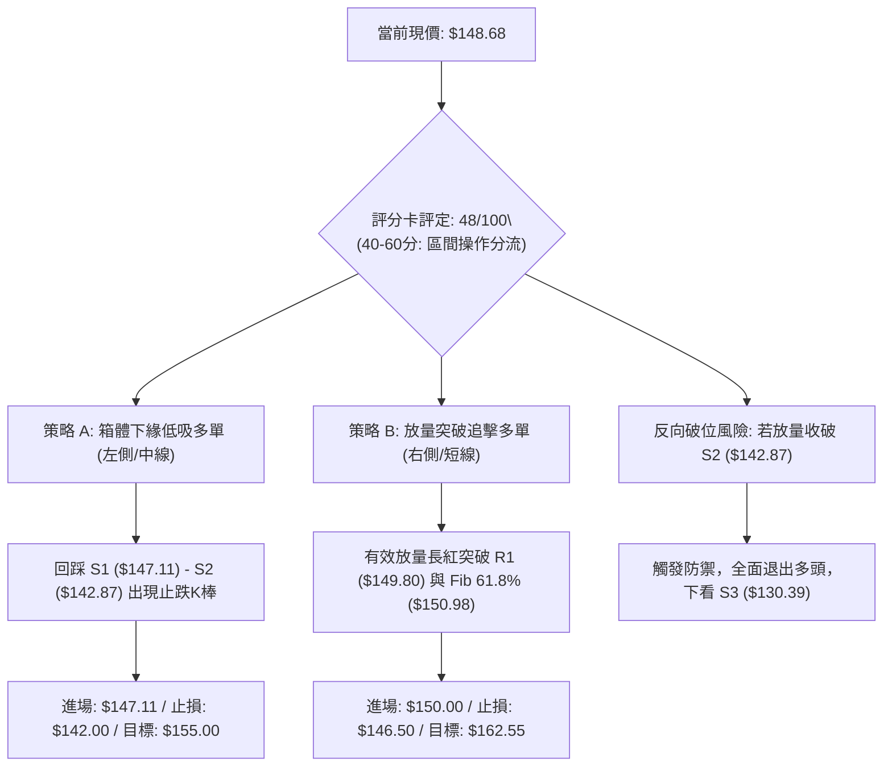

### 🧭 策略路由（依評分卡分流）

> **當前主策略方向 = 【中性區間波段操作，等待回踩確認】（依技術評分卡：48/100）**

因綜合評分處於 40–60 分的中性盤整區間，嚴禁在布林帶中軌附近進行單邊盲目重倉押注。交易方針以**「區間操作、低吸高拋、等待突破」**為核心原則，主推低吸策略（策略 A）與突破策略（策略 B）。

### 🎯 價格情境階梯（Price Scenarios）

所有價位均直接取自「關鍵價位」區塊之嚴格數據：

| 觸發條件 | 下一目標價 | 後續延伸目標 | 情境技術含義與市場行為解讀 |
|----------|------------|--------------|----------------------------|
| **向上突破 R1 ($149.80)** | **R2 ($155.00)** | **R3 ($172.40)** | 突破 Fib 61.8% ($150.98) 壓制，短線弱勢修復，開啟挑戰前高主升波 |
| **站穩現價區間 ($148.68)** | **R1 ($149.80)** | **S1 ($147.11)** | 於布林中軌 ($148.40) 展開縮量窄幅震盪，沉澱籌碼 |
| **跌破 S1 ($147.11)** | **S2 ($142.87)** | **S3 ($130.39)** | 均線系統轉弱，測試 8 月底整理平台，回探布林下軌 ($139.87) 與 MA50 ($135.92) |

### 📊 情境機率分佈

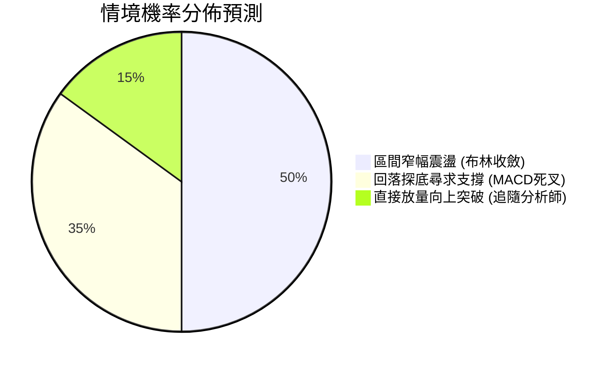

| 情境劃分 | 機率估計 | 主要技術指標支撐依據 |
|----------|----------|----------------------|
| **情境一：區間窄幅震盪** | **50%** | ADX 剛達 25.13，布林帶帶寬收窄至 11.5%，成交量能萎縮至 0.61x，多空雙方皆缺乏突破動能 |
| **情境二：回落測試支撐** | **35%** | 日線 MACD 柱狀轉負 (-0.567)，RSI 頂背離，MA5/10 下彎壓制，短線修正賣壓尚未釋放完畢 |
| **情境三：直接放量突破** | **15%** | 需依賴突發利多或華爾街分析師（目標均價 $222.42）資金強推，目前量能無法匹配 |

### 🟢 主策略詳情

本報告依嚴格風控原則，制定以下兩套互補的實戰交易策略：

| 策略要素 | 策略 A：波段支撐低吸策略 (主推薦) | 策略 B：放量突破跟進策略 (次推薦) |
|----------|-----------------------------------|-----------------------------------|
| **交易類型** | 左側 / 回調低吸 | 右側 / 順勢突破 |
| **進場條件** | 股價回踩 S1 不破，並於 15分/60分K 出現止跌陽線 | 日K收盤有效站上 R1 ($149.80)，單日成交量 > 90M (放量) |
| **精確進場價格** | **$147.11** (S1 支撐點位) | **$150.00** (突破 R1 後回測確認) |
| **第一目標價 T1** | **$155.00** (阻力位 R2，預期收益 +5.36%) | **$156.92** (布林通道上軌，預期收益 +4.61%) |
| **第二目標價 T2** | **$162.55** (形態測算目標，預期收益 +10.50%) | **$172.40** (阻力位 R3，預期收益 +14.93%) |
| **嚴格止損價格** | **$142.87** (跌破支撐位 S2 即停損) | **$146.50** (跌破 S1 緩衝區即停損) |
| **風險空間** | \$4.24 (-2.88%) | \$3.50 (-2.33%) |
| **風險報酬比 (R:R)**| **1 : 1.86** (至 T1) / **1 : 3.64** (至 T2) | **1 : 1.98** (至 T1) / **1 : 6.40** (至 T2) |
| **模型勝率預估** | 60% | 52% |
| **建議配置倉位** | **15% - 20%** 總資金 | **10% - 15%** 總資金 |

### 🔴 反向風險觸發點（對沖提示）

若市場出現極端利空導致以下情況發生，本報告之偏多主策略將**全面失效**，投資人應立即執行風控：

```
╔══════════════════════════════════════════════════════════════════╗
║               ⚠️ 核心多頭風控警報觸發條件                       ║
╠══════════════════════════════════════════════════════════════════╣
║ 1. 關鍵價位跌破：日K線收盤價跌破強支撐 S2 ($142.87)。           ║
║ 2. 均線破位：有效跌穿 MA50 生命線 ($135.92)。                    ║
║ 3. 動能惡化：ADX 轉向，-DI 向上穿過 +DI 形成死叉。              ║
║                                                                  ║
║ 應對操作：                                                       ║
║ 立即無條件結清多頭倉位，下看關鍵支撐 S3 ($130.39) 及 Fib 78.6%   ║
║ ($130.68)；具避險需求者可反手建立 5% 輕倉對沖空單。            ║
╚══════════════════════════════════════════════════════════════════╝
```

### ⭐ 整體訊號強度評星

```
做多訊號強度：★★☆☆☆  (2.5/5星 — 短線動能背離，做多勝率受限)
做空訊號強度：★★☆☆☆  (2.0/5星 — 中期MA50支撐強韌，非單邊跌勢)
整體可信度：  ★★★☆☆  (3.5/5星 — 指標數據高度收斂於區間震盪)
```

---

## 9. 風險提示與監控

### ✅ 關鍵監控指標 Checklist

```
╔══════════════════════════════════════════════════════════════════╗
║                    每日技術面盤後監控清單                         ║
╠══════════════════════════════════════════════════════════════════╣
║ [ ] 價格是否跌破布林中軌 MA20 ($148.40)？                        ║
║ [ ] 日成交量是否放大越過 20日均量 (89.75M)？                      ║
║ [ ] MACD 柱狀圖負值是否持續擴大 (當前 -0.567)？                  ║
║ [ ] RSI(14) 能否守穩 50.0 中軸而不跌入弱勢區？                 ║
║ [ ] ADX(14) 讀數是否維持在 25.0 之上？                           ║
║ [ ] 價格回踩 S1 ($147.11) 時是否伴隨長下影線？                   ║
╚══════════════════════════════════════════════════════════════════╝
```

### ⚠️ 風險場景分析

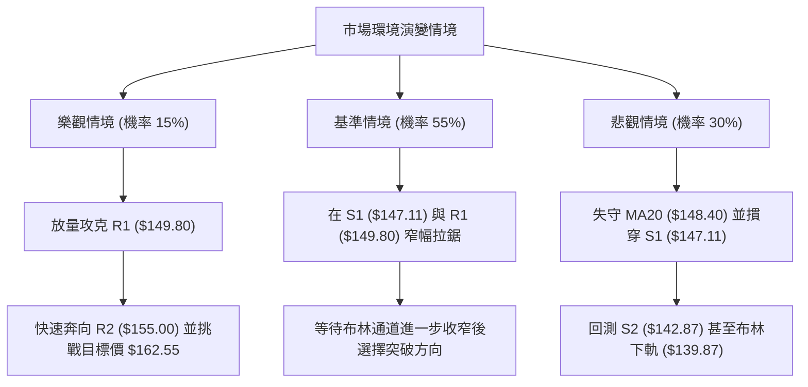

### 🛡️ 風險管理重要提醒

1. **基本面與籌碼面背離風險**：
   - 儘管華爾街共識為「買入（19 位分析師平均目標價高達 **$222.42**）」，且營收年增長達 **91.9%**，但公司目前 TTM 淨利率為 **-35.7%**，EPS 為 **$-1.05**，本益比仍處於虧損估值。
   - 財務面高估值疊加技術面量能背離，一旦大盤流動性收緊，容易引發高估值成長股的獲利回吐殺盤。
2. **波動度適應與部位管理**：
   - 目前每日 ATR 為 **$6.61**，佔股價達 4.44%。這意味著任何單日跳空均可能觸及窄幅止損。
   - 投資人**單筆交易虧損上限嚴格控制在總資金的 1.0% - 1.5% 以內**。以 \$100,000 美元帳戶為例，若使用策略 A（止損空間 \$4.24），最大允許持股上限為：
     $$\text{最大持股股數} = \frac{\$100,000 \times 1.5\%}{\$4.24} = 353 \text{ 股 (約佔資金 \$52,000，即半倉上限)}$$
3. **無量行情的流動性陷阱**：
   - 當前量比僅 0.61x，低成交量常伴隨偽突破（Bull Trap）或假跌破（Bear Trap）。盤中切忌看見突破 R1 即刻全倉市價追單，務必等待日K線收盤確認。

---

## 📋 報告總結

```
╔══════════════════════════════════════════════════════════════════╗
║                   SPCX 技術分析報告總結                          ║
╠══════════════════════════════════════════════════════════════════╣
║ 報告日期：2026-09-26                                             ║
║ 當前價格：$148.68                                                ║
║ 分析評級：⚖️ 中性觀望 (技術評分: 48/100) — 短期整理，中期向上   ║
╠══════════════════════════════════════════════════════════════════╣
║ 關鍵結論：                                                       ║
║ ├─ 長期趨勢：🟡 底部寬幅築底階段，脫離 52W 低點 $104.83         ║
║ ├─ 中期趨勢：🟢 站穩 MA50 ($135.92) 上方，波段上升架構未被破壞  ║
║ ├─ 短期趨勢：🔴 MACD 死叉、RSI 頂背離，面臨布林中軌考驗         ║
║ ├─ 關鍵支撐：S1: $147.11 ｜ S2: $142.87 ｜ S3: $130.39           ║
║ ├─ 關鍵阻力：R1: $149.80 ｜ R2: $155.00 ｜ R3: $172.40           ║
║ └─ 分析師目標均價：$222.42 (溢價空間 +49.6%)                     ║
╠══════════════════════════════════════════════════════════════════╣
║ 最優策略組合：                                                   ║
║ 1. 🥇 最佳機會：策略 A (逢低布局) — 回踩 S1 $147.11 企穩低吸，   ║
║    止損設於 S2 $142.87，目標上看 R2 $155.00 (風報比 1:1.86)。    ║
║ 2. 🥈 次選機會：策略 B (突破跟進) — 放量突破 R1 $149.80 後回測    ║
║    追多，目標上看測算價 $162.55 與 R3 $172.40。                 ║
║ 3. 🥉 保守選擇：空倉觀望 — 等待日線 MACD 柱狀圖由負轉正，以及量 ║
║    比恢復至 1.0x 以上再行進場。                                 ║
╚══════════════════════════════════════════════════════════════════╝
```

---

> ⚠️ **免責聲明**：本報告為技術分析研究，所有數據指標及價位估算均嚴格基於所提供之歷史 OHLCV 價格資訊。本報告**僅供研究與學術參考**，**不構成任何形式的投資建議、要約或承諾**。金融市場投資具高度風險，投資人應獨立評估自身財務狀況與風險承受能力，入市需極度謹慎。

---

*報告生成時間：2026-09-26 ｜ 數據來源：Yahoo Finance ｜ 分析框架：多時框技術分析模型*