# SPCX 技術分析報告

> **報告日期**：2026-09-27 ｜ **語言**：繁體中文 ｜ **數據來源**：Yahoo Finance ｜ **當前價格**：$148.68

---

## 目錄

| 章節 | 內容 |
|------|------|
| [1. 技術面概覽](#1-技術面概覽) | 訊號儀表板、核心指標、評分卡 |
| [2. 趨勢分析](#2-趨勢分析) | 多時框趨勢、長中短期走勢 |
| [3. 圖表形態分析](#3-圖表形態分析) | 形態識別、K線組合、目標價 |
| [4. 支撐與阻力](#4-支撐與阻力) | 關鍵價位、斐波那契回調 |
| [5. 技術指標深度解讀](#5-技術指標深度解讀) | MA/RSI/MACD/布林/成交量 |
| [6. 動能與波動率](#6-動能與波動率) | 動能評估、ATR、Beta |
| [7. 多時框架總結](#7-多時框架總結) | 時框架評分矩陣 |
| [8. 交易策略建議](#8-交易策略建議) | 多空策略、風險報酬比 |
| [9. 風險提示與監控](#9-風險提示與監控) | 監控指標、風險場景 |

---

## 1. 技術面概覽

### 🎯 技術訊號儀表板

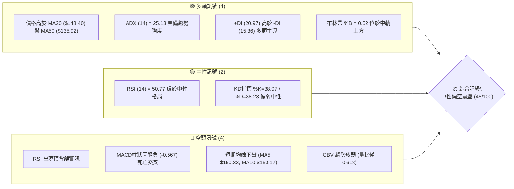

### 📊 核心指標速覽表

| 指標類別 | 指標名稱 | 當前數值 | 訊號 | 解讀 |
|----------|----------|----------|------|------|
| **價格** | 當前價格 | $148.68 | 🟡 | 位於52週區間 36.3% 之低位反彈修正區 |
| **均線** | MA20 | $148.40 | 🟢 | 現價微幅高於中軌MA20 (+0.19%)，多空分水嶺 |
| **均線** | MA50 | $135.92 | 🟢 | 現價高於中期均線 (+9.39%)，中期多頭格局未破 |
| **均線** | MA5 / MA10 | $150.33 / $150.17 | 🔴 | 極短期均線高檔反轉下彎，形成近端動態壓制 |
| **動能** | RSI(14) | 50.77 | 🔴 | 跌破60動能區，且伴隨頂背離確認，短線動能衰竭 |
| **動能** | MACD (12,26,9) | DIF: 3.051 / DEA: 3.618 | 🔴 | 柱狀圖 -0.567，高檔死叉成形，回調訊號明確 |
| **趨勢** | ADX / DMI | ADX: 25.13 (+DI> -DI) | 🟢 | 剛跨入強趨勢臨界門檻 (>25)，多方動能佔優但趨弱 |
| **波動** | ATR(14) | $6.61 (4.44%) | 🟡 | 日波動偏大，日內與波段操作需預留寬裕緩衝 |
| **成交量**| 量比 (Volume Ratio) | 0.61x (54.42M / 89.75M) | 🔴 | 成交量顯著萎縮，量能無力支撐多頭推升突破 |

### 🏆 技術評分卡

```
╔══════════════════════════════════════════════════════════════╗
║              SPCX 技術評分卡 (2026-09-27)                    ║
╠══════════════════════════════════════════════════════════════╣
║ 趨勢強度 (Trend)     ██████████░░░░░░░░░░  52/100  🟡 中性偏多║
║ 動能指標 (Momentum)  ████████░░░░░░░░░░░░  38/100  🔴 動能衰竭║
║ 支撐穩定度 (Support) ████████████░░░░░░░░  60/100  🟢 支撐明確║
║ 成交量配合 (Volume)  ██████░░░░░░░░░░░░░░  30/100  🔴 量價背離║
║ 形態完整度 (Pattern) ██████████░░░░░░░░░░  50/100  🟡 形態未決║
║ 均線排列 (MA System) ████████████░░░░░░░░  58/100  🟡 混合排列║
╠══════════════════════════════════════════════════════════════╣
║ 綜合技術評分         █████████░░░░░░░░░░░  48/100  🟡 中性觀望║
╚══════════════════════════════════════════════════════════════╝
```

---

## 2. 趨勢分析

### 🌐 多時框趨勢分析

```mermaid
graph TD
    subgraph MONTHLY ["長期趨勢 (月線時框)"]
        M1["2026-06 高點 $170.86 下挫至 07 月 $108.37"] --> M2["08-09 月自低檔連兩月強勁修復至 $148.68"]
        M2 --> M_DIR["方向：長期空頭架構下的強反彈波"]
    end
    subgraph WEEKLY ["中期趨勢 (週線時框)"]
        W1["08-02 觸底 $108.37 後走出 7 週推升浪"] --> W2["09-20 創波段高點 $152.71 後回落至 $148.68"]
        W2 --> W_DIR["方向：中期上升軌道遭遇關鍵阻力"]
    end
    subgraph DAILY ["短期趨勢 (日線時框)"]
        D1["MA5 ($150.33) 下穿 MA10 ($150.17)"] --> D2["MACD 高檔死叉且 RSI 出現頂背離"]
        D2 --> D_DIR["方向：短期回調，測試中軌 $148.40 支撐"]
    end
    M_DIR --> CONVERGE{"多時框收斂判定"}
    W_DIR --> CONVERGE
    D_DIR --> CONVERGE
    CONVERGE --> FINAL["判定：ADX=25.13 剛過趨勢門檻\\n以週線上升趨勢為主軸，日線回調尋找防守買點"]
```

### 📈 長期趨勢 — 12個月走勢圖（Unicode）

依據已知之歷史數據（含近4個月明確收盤與52週極值點位 $225.64 與 $104.83）繪製月線走勢：

```
SPCX 月線走勢圖（過去12個月歷史高低點與近期收盤）
價格軸 ($)
$225.64 ┤        ● (52W歷史高點)
$200.00 ┤       ╱ ╲
$175.00 ┤      ╱   ╲     ● (2026-06: $170.86)
$150.00 ┤     ╱     ╲   ╱ ╲       ●← 當前現價: $148.68
$125.00 ┤    ╱       ╲ ╱   ● (2026-08: $143.69)
$104.83 ┤───●─────────● (2026-07: $108.37 / 52W低點: $104.83)
        └──────────────────────────────────────────────
         M-11 M-9   M-6  26-06 26-07 26-08 26-09
```

**走勢特徵分析表格**：

| 時間區間 | 起始價 / 結束價 | 區間漲跌幅 | 走勢特徵與結構解析 |
|----------|-----------------|------------|--------------------|
| **波段起跌段** | $225.64 → $170.86 | -24.28% | 自52週歷史高點大幅回吐，獲利了結賣壓湧現，長黑摜破高檔平台。 |
| **主跌加速段** | $170.86 → $108.37 | -36.57% | 2026年7月暴跌，成交量急遽萎縮，下探至52週低點 $104.83 附近企穩。 |
| **超跌修復段** | $108.37 → $143.69 | +32.59% | 2026年8月多頭強烈反撲，月線拉出帶量長陽，奠定底部回升結構。 |
| **高檔滯漲段** | $143.69 → $148.68 | +3.47% | 2026年9月動能收斂，收小陽十字星形態，於斐波那契 61.8% 處受阻。 |

### 📊 中期趨勢（週線分析）

中期走勢自 2026-08-02 低點 $108.37 展開單邊反彈，歷經 2026-09-20 衝擊波段高點 $152.71。當前本週（2026-09-27）收盤價回落至 $148.68，跌破前一週低點，且週成交量自 669.03M 驟降至 329.27M，顯示買盤追價意願中斷，週線 MACD 柱狀圖亦由 +0.411 翻負至 -0.567，確立中期反彈進入第一波強震盪洗盤期。

### ⚡ 趨勢強度評估（ADX 解讀）

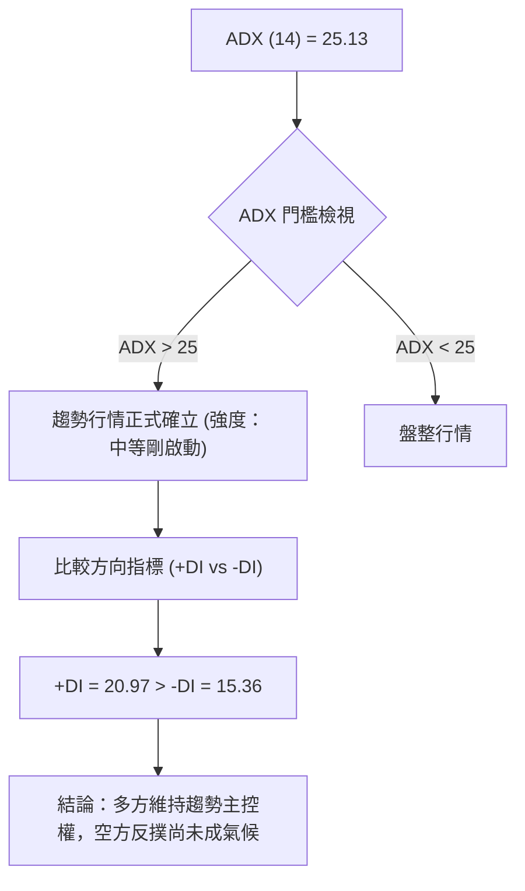

| 指標名稱 | 數值 | 門檻區間 | 解讀結論 |
|----------|------|----------|----------|
| **ADX (14)** | 25.13 | > 25.00 | **趨勢成形**：脫離震盪無趨勢狀態，進入具方向性之趨勢走勢。 |
| **+DI (14)** | 20.97 | 多方力道 | **多方佔優**：高於 -DI，顯示多頭在波段內佔據主控優勢。 |
| **-DI (14)** | 15.36 | 空方力道 | **空方被動**：空方拋壓尚未引發崩盤式擴散，仍屬良性回撤。 |

---

## 3. 圖表形態分析

### 🔍 形態識別系統

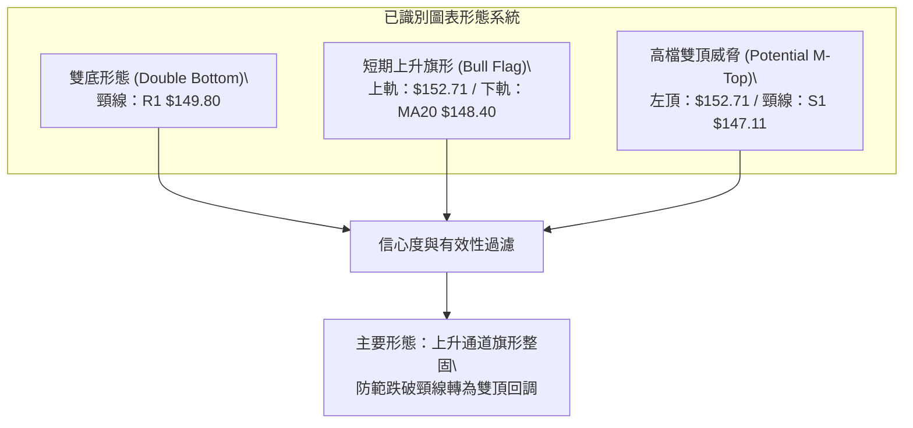

**形態信心度與目標價計算表格**：

| 形態類別 | 信心度 | 判斷依據（引用數據） | 完成度 | 目標價（附嚴格計算式） |
|----------|--------|----------------------|--------|------------------------|
| **中期雙底** | 72% | 2026-07至08月低點 $108.37 與 52W低點 $104.83 構成複合雙底；頸線位於 R1 $149.80。 | 95% | 突破頸線 $149.80 後：<br>第一目標 = 數據阻力位 **$155.00 (R2)**<br>形態延伸 = 數據阻力位 **$172.40 (R3)** |
| **短線上升旗形** | 58% | 自 $108.37 衝至 $152.71（旗桿長度 $44.34），近兩週於 $147.11~$152.71 震盪旗面。 | 60% | 若守穩 S1 $147.11 並突破旗面頂：<br>目標直接指向阻力位 **$155.00 (R2)** |
| **潛在小雙頂** | 45% | 09-13 高點 $151.21 與 09-20 高點 $152.71 未能放量突破，MACD 柱狀圖翻負。 | 40% | 若跌破頸線 S1 $147.11：<br>回測支撐位 **$142.87 (S2)** |

### 🕯️ 重要K線形態分析

| 週別/月份 | 收盤價 | K線形態 | 解讀 | 訊號 |
|-----------|--------|---------|------|------|
| **2026-08-02** | $108.37 | 探底錘頭線 (Hammer) | 伴隨 RSI 觸及超賣區 (19.2)，長下影線確認 $104.83~$108.37 歷史底部支撐。 | 🟢 強烈看多 |
| **2026-08-09** | $133.11 | 突破長陽線 (Bullish Marubozu) | 週成交量爆發至 920.45M，MACD 柱狀圖翻正至 +2.330，形成標準築底反轉紅K。 | 🟢 多頭確立 |
| **2026-09-20** | $152.71 | 高檔流星線 (Shooting Star) | 衝高 $152.71 後爆量 (669.03M) 留長上影線，代表 R1 $149.80~$155.00 阻力沉重。 | 🔴 頂部壓制 |
| **2026-09-27** | $148.68 | 實體陰線 (Bearish Candle) | 跌破前週低點並回測 MA20，MACD柱狀圖由正轉負 (-0.567)，量縮顯現買盤觀望。 | 🔴 短線修正 |

### 📉 ASCII 走勢形態示意圖

```
SPCX 旗形整理與頸線博弈走勢示意圖
$155.00 ┤                              [阻力 R2: $155.00]
$152.71 ┤             ▲ (高點 09-20)
$149.80 ┤───────▲─────┼─────────────── [雙底頸線/阻力 R1: $149.80]
$148.68 ┤───────┼─────● 現價 $148.68
$147.11 ┤       │     ▼                [旗面下緣/支撐 S1: $147.11]
$142.87 ┤───────┴───────────────────── [回測防守/支撐 S2: $142.87]
        └─────────────────────────────
         08-23 08-30 09-06 09-13 09-20 09-27
```

### 🎯 形態目標價計算

根據嚴格數據紀律，形態推算之價格點位必須嚴格對齊關鍵價位聚類：
1. **雙底破頸目標**：頸線為 R1 **$149.80**，底部基準為 **$108.37**。理論高度為 $41.43。當前第一步突破確認目標鎖定關鍵價位聚類阻力 **$155.00 (R2)**，波段延伸極限目標則為阻力聚類 **$172.40 (R3)**。
2. **旗面回踩支撐目標**：旗面下軌與頸線支撐重疊於 S1 **$147.11**；若 S1 失守，旗形失敗的下修目標直接指向波段低點聚類支撐 S2 **$142.87**。

---

## 4. 支撐與阻力

### 🗺️ 關鍵價位分布圖（Unicode）

```
SPCX 價位結構分布圖
═══════════════════════════════════════════════════════════════════
$172.40 ║██████████████████████████████║ 強阻力 R3 (近一年波段高點聚類)
$165.24 ║▓▓▓▓▓▓▓▓▓▓▓▓▓▓▓▓▓▓▓▓          ║ 斐波那契 50.0% 回調位
$155.00 ║████████████████████          ║ 關鍵阻力 R2 (上軌延伸與波段高點)
$150.98 ║▓▓▓▓▓▓▓▓▓▓▓▓▓▓▓▓▓▓▓▓▓▓▓▓      ║ 斐波那契 61.8% 強阻力位
$149.80 ║██████████████████████████████║ 核心阻力 R1 (頸線壓力區間)
$148.68 ╠══════════════════════════════╣ ◄ 當前現價 ($148.68)
$147.11 ║▓▓▓▓▓▓▓▓▓▓▓▓▓▓▓▓▓▓▓▓          ║ 短線支撐 S1 (近期波段低點聚類)
$142.87 ║████████████████████████      ║ 強支撐 S2 (波段回撤支撐)
$130.68 ║▓▓▓▓▓▓▓▓▓▓▓▓▓▓▓▓▓▓▓▓▓▓▓▓      ║ 斐波那契 78.6% 回調位
$130.39 ║██████████████████████████████║ 鐵底支撐 S3 (中長線防守底線)
═══════════════════════════════════════════════════════════════════
```

### 🚧 阻力位分析表

| 阻力級別 | 價位 | 形成原因 | 突破難度 | 重要性 |
|----------|------|----------|----------|--------|
| **R1** | **$149.80** | 近一年波段高點聚類；極貼近現價 (+0.75%)，日線MA5 ($150.33) 與 MA10 ($150.17) 重疊壓制。 | 中等 | 🟢🟢🟢 極高 (短線多空分水嶺) |
| **R2** | **$155.00** | 波段高點聚類 (+4.25%)，且接近布林通道上軌 ($156.92)，前波密集套牢解套區。 | 高 | 🟢🟢 中等 (波段獲利了結點) |
| **R3** | **$172.40** | 近一年波段高點聚類 (+15.95%)，對應 2026-06 月線收盤高點 $170.86 之強賣壓帶。 | 極高 | 🟢🟢🟢 強力阻力 (反轉格局終點) |

### 🛡️ 支撐位分析表

| 支撐級別 | 價位 | 形成原因 | 守住機率 | 重要性 |
|----------|------|----------|----------|--------|
| **S1** | **$147.11** | 近一年波段低點聚類 (-1.06%)；緊鄰布林中軌 MA20 ($148.40) 的第一道下檔防禦。 | 60% | 🟢🟢🟢 極高 (短線生命線) |
| **S2** | **$142.87** | 波段低點聚類 (-3.91%)，布林通道下軌 ($139.87) 與 MA60 ($137.59) 之上的緩衝墊。 | 75% | 🟢🟢🟢 關鍵 (中期上升格局防線) |
| **S3** | **$130.39** | 近一年波段低點聚類 (-12.30%)，完全契合斐波那契 78.6% ($130.68) 重合支撐。 | 88% | 🟢🟢🟢 長期強防守 (多頭牛熊底線) |

### 📐 斐波那契回調位分析

依據 52 週極值區間（低點 **$104.83** → 高點 **$225.64**，總震幅 $120.81）計算之回調位分布如下：

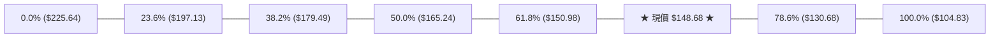

- **位置判定**：當前現價 **$148.68** 精確坐落於 **61.8% ($150.98)** 與 **78.6% ($130.68)** 兩大關鍵黃金分割位之間。
- **技術解讀**：斐波那契 61.8% 回調位 ($150.98) 是技術分析中最強烈的多空分界水嶺。SPCX 於 09-13 ($151.21) 與 09-20 ($152.71) 短暫刺穿 61.8% 後未能站穩，目前再度滑落至 $150.98 之下。若無法放量收復 $150.98，行情將持續受到該點位反壓，並有向下尋求 78.6% ($130.68) 與 S3 ($130.39) 尋找次級支撐的風險。

---

## 5. 技術指標深度解讀

### 🎛️ 指標訊號總覽

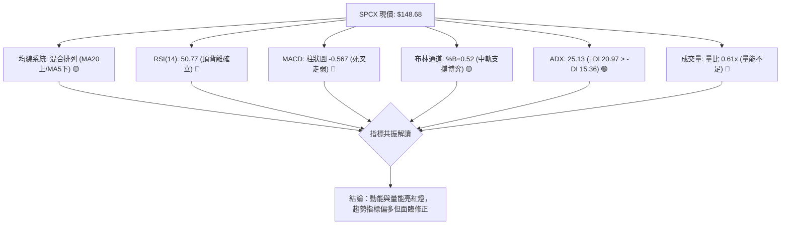

### 📈 移動平均線排列分析

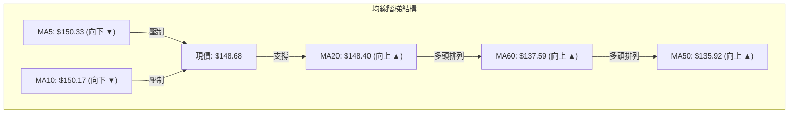

- **短均空頭死叉**：MA5 ($150.33) 與 MA10 ($150.17) 已開始調頭下彎，形成超短期反壓，阻止價格向上挑戰 R1 ($149.80)。
- **中長均多頭排列**：現價仍穩穩運行在 MA20 ($148.40)、MA60 ($137.59) 與 MA50 ($135.92) 之上，中長天期均線呈發散向上態勢，表示中期多頭格局尚未遭到破壞。當前屬於典型的「短期空頭回調，中期多頭趨勢」之混合排列架構。

### 📉 RSI(14) 分析

- **RSI 數值進度條**：
```
0 ────────── 30 ──────────────── 50 ────── 70 ────────── 100
[░░░░░░░░░░░░░░░░░░░░░░░░░░░░░░░██████████░░░░░░░░░░░░░░░░░░]  50.77 (中性)
```
- **區間評估**：RSI(14) 由 09-13 的 68.0 高點一路下滑至 50.77，跌回多空中樞線附近，意味著過去一個半月的強烈買盤推升力道已經完全冷卻。
- **背離分析**：**明確存在頂背離 (Bearish Divergence)**。2026-09-13 股價為 $151.21，對應 RSI 為 68.0；隨後 2026-09-20 股價攀升創下波段新高 $152.71，然而 RSI 卻反向走低至 60.7。價格創新高而動能指標未創新高，頂背離成立，預示價格必有技術性回調壓力。

### 📊 MACD(12/26/9) 訊號解讀

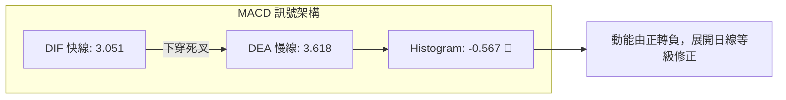

- **數值關係**：DIF快線 (3.051) 低於 DEA慢線 (3.618)，柱狀圖數值為 **-0.567**。
- **週線與日線同步性**：回顧近20週數據，MACD柱狀圖在連續4週維持正值（最高達 +4.591）後，於本週首度翻負 (-0.567)，這是自 8 月底部啟動多頭行情以來首度出現週線級別死叉訊號，暗示回調幅度與時間皆不可輕忽。

### 📦 布林通道分析

```
SPCX 布林通道 (Bollinger Bands 20, 2) 價位示意
$156.92 ┤─────────────────────────────── 上軌 (Upper Band)
        │
$148.68 ┤═════════════════● 現價 ($148.68, %B = 0.52)
$148.40 ┤─────────────────────────────── 中軌 (MA20: $148.40)
        │
$139.87 ┤─────────────────────────────── 下軌 (Lower Band)
```

- **布林指標解讀**：當前帶寬上下軌為 $139.87 至 $156.92，通道維持平緩張開狀態。
- **%B 指標分析**：%B 為 **0.52**，現價僅微幅高於中軌 ($148.40) 0.28 美元。中軌在技術分析中兼具 MA20 支撐與通道多空平衡線功能，若收盤跌破中軌，價格將直接向 %B = 0 的下軌 **$139.87** 以及 S2 **$142.87** 尋求支撐。

### 💹 成交量分析（量價配合度）

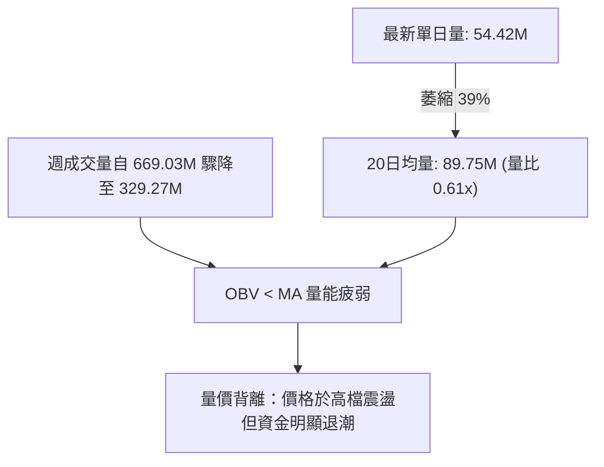

- **量比萎縮**：最新成交量為 54.42M，相較 20日均量 89.75M 呈現顯著量縮（量比僅 0.61x），且相較 50日均量 96.90M 萎縮更劇烈。
- **OBV 量能分析**：數據明確標註「OBV < MA → 量能疲弱」。在價格挑戰 R1 ($149.80) 關鍵壓力位時量能不增反減，代表機構買盤在此處拒絕高位追價，缺乏資金量能背書的價格反彈極易遭遇空方反噬。

---

## 6. 動能與波動率

### ⚡ 動能評估四象限

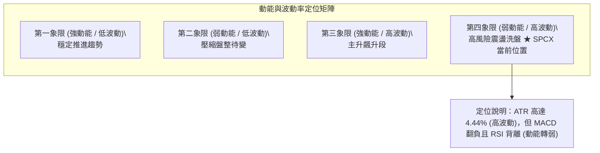

| 象限分類 | 動能屬性 | 波動屬性 | SPCX 狀態 | 操作指導與評估 |
|----------|----------|----------|-----------|----------------|
| **Q1** | 強 | 低 | — | 最佳波段持股環境。 |
| **Q2** | 弱 | 低 | — | 狹幅橫盤，等待方向突破。 |
| **Q3** | 強 | 高 | — | 高風險高報酬，主升浪進攻。 |
| **Q4 (當前)** | **弱** | **高** | **✓ 命中** | **洗盤劇烈且動能退潮，進場容錯率極低，應嚴格縮減部位。** |

### 📊 ATR 波動率分析

- **ATR(14) 絕對值**：**$6.61**。
- **相對波動幅度**：佔當前股價之 **4.44%**，顯示該股每日平均震幅逾 6.6 美元，屬於典型高波動成長/科技航太板塊特性。
- **止損距離建議**：
  - *短線當沖/極短線*：建議止損距離至少設定為 1.0 倍 ATR = **$6.61**。
  - *波段交易*：建議止損設定為 1.5 倍至 2.0 倍 ATR = **$9.92 ~ $13.22**，以避免在日內正常雜訊震盪中被輕易洗出場外。

### 📐 Beta 與市場相關性

- **Beta 狀態**：數據顯示為 N/A（推演為新興高成長拆分或重組標的）。
- **市場環境與同業連動特性**：由機構持股 48.3%、放空比率 2.6% (Short Ratio 2.07) 可知，該標的具備高流動性與強機構參與度。在高波動率 (ATR 4.44%) 與高估值 (Forward P/E 85.29) 環境下，其走勢對大盤宏觀流動性與利率敏感度極高，易放大標普500指數與納斯達克指數的波動。

---

## 7. 多時框架總結

### 📋 時框架評分表

| 時框架 | 趨勢方向 | 動能狀態 | 均線排列 | 形態結構 | 綜合評分 | 戰略建議 |
|--------|----------|----------|----------|----------|----------|----------|
| **長期 (月線)** | 🟡 中性築底 | 🟡 弱勢修復 | 🔴 均線資料不足 | 低檔雙底成形中 | 50/100 | 底部初成，不宜追高 |
| **中期 (週線)** | 🟢 多頭推升 | 🔴 動能回落 | 🟢 站穩MA20/50 | 上升軌道遇阻 | 55/100 | 逢回撤關鍵支撐低吸 |
| **短期 (日線)** | 🔴 回調整理 | 🔴 頂背離死叉 | 🟡 混合排列 | 旗形下測中軌 | 40/100 | 暫停追多，等待防守確認 |

### 🔲 綜合訊號矩陣


### ⚖️ 多時框收斂結論

依據多時框收斂規則：
1. **趨勢/盤整檢驗**：當前 ADX(14) 為 **25.13**，剛剛跨入趨勢行情門檻 (>25)。且 +DI (20.97) 大於 -DI (15.36)，整體由多方主導。
2. **時框優先權取捨**：依規則「趨勢行情以中長期（週線/MA50）方向為主，日線只用來尋找進場時機」。當前週線層級自 $108.37 展開的波段上漲依然完好，MA50 ($135.92) 仍提供強大中長線保護。
3. **收斂唯一方向結論**：**中性觀望偏多（等待短線回踩確認）**。日線級別的頂背離與 MACD 死叉宣告短線不可追價，操作應順應週線多頭方向，在日線回調至支撐位（S1 $147.11 或 S2 $142.87）時，尋求右側確認止跌的低吸做多機會。

---

## 8. 交易策略建議

### 🗺️ 策略決策流程圖

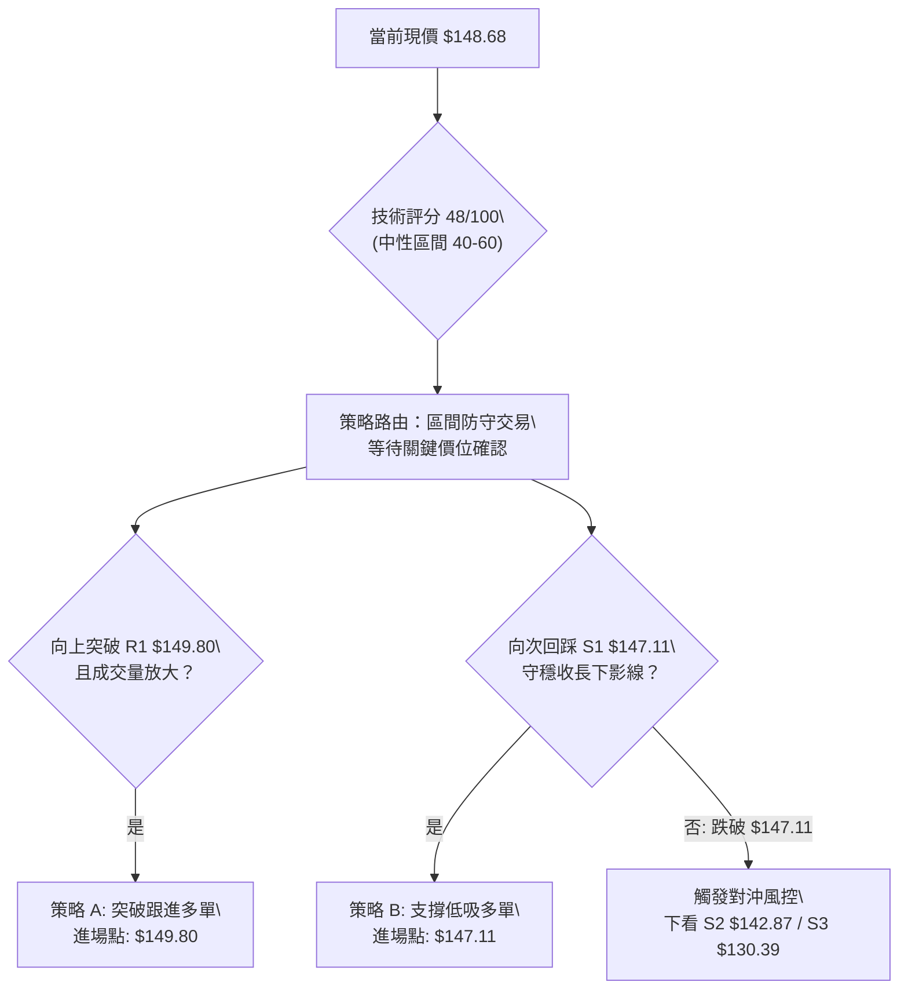

### 🧭 策略路由（依評分卡分流）

> **當前主策略方向 = 中性區間低吸操作（依綜合評分 48/100）**
> 
> 因綜合技術評分落於 **40–60 分的中性格局**，市場處於「日線指標背離調整」與「週線多頭趨勢防守」的拉鋸狀態。禁止盲目市價追單，主推於布林通道中下軌及波段支撐位建立區間操作策略，並嚴格預設風控停損點。

### 🎯 價格情境階梯（Price Scenarios）

| 觸發條件 | 下一目標 | 後續延伸 | 情境含義與技術解讀 |
|----------|----------|----------|--------------------|
| **強勢突破 R1 ($149.80)** | **R2 ($155.00)** | **R3 ($172.40)** | 突破雙底頸線與短均線壓制，多頭重啟主升浪。 |
| **守穩 S1 ($147.11)** | **R1 ($149.80)** | **R2 ($155.00)** | 中軌 MA20 與波段支撐奏效，維持高檔箱型震盪。 |
| **失守跌破 S1 ($147.11)** | **S2 ($142.87)** | **S3 ($130.39)** | 旗形破位且中軌失守，短線轉空，深測 78.6% 回調位。 |

### 📊 情境機率分佈

| 情境類別 | 機率預估 | 主要技術指標依據 |
|----------|----------|------------------|
| **高檔區間震盪** | **50%** | ADX剛過25但量能萎縮 (0.61x)，布林通道中軌 ($148.40) 與 R1 ($149.80) 窄幅拘束。 |
| **向下回調尋求支撐** | **35%** | MACD 柱狀圖翻負 (-0.567)，RSI 出現頂背離，短均 MA5/MA10 下彎壓制。 |
| **直接強勢向上突破** | **15%** | 成交量疲弱 (OBV < MA)，上方斐波那契 61.8% ($150.98) 形成密集拋壓。 |

### 🟢 主策略詳情

本策略嚴格引用第四章關鍵價位，不得捏造點位：

| 策略要素 | 策略 A（右側突破跟進型） | 策略 B（左側支撐低吸型 — 首選） |
|----------|--------------------------|----------------------------------|
| **進場條件** | 放量突破 R1 且收盤確認 | 回踩波段低點支撐 S1 出現止跌K棒 |
| **進場價格** | **$149.80** | **$147.11** |
| **目標價 T1** | **$155.00** (R2, +3.47%) | **$149.80** (R1, +1.83%) |
| **目標價 T2** | **$172.40** (R3, +15.09%) | **$155.00** (R2, +5.36%) |
| **止損價格** | **$147.11** (S1, -1.80%) | **$142.87** (S2, -2.88%) |
| **風險報酬比** | **1 : 1.93** (以T1計) / **1 : 8.38** (以T2計) | **1 : 1.86** (以T1計) / **1 : 3.73** (以T2計) |
| **勝率估計** | 52% | 63% |
| **建議倉位** | 10% ~ 15% 輕倉 | 15% ~ 20% 標準倉位 |

### 🔴 反向風險觸發點（對沖提示）

- **全面停損/反手放空觸發位**：若日線實體跌破 **S1 ($147.11)** 且伴隨成交量放大，意味著雙底頸線宣告跌破，上升旗形轉化為高檔雙頂形態。
- **對沖應對指引**：多頭部位應即刻無條件減倉或全數離場；激進型交易者可反向建立避險空單，下檔目標直接回看 **S2 ($142.87)** 與 **S3 ($130.39)**。

### ⭐ 整體訊號強度評星

```
做多訊號強度：★★★☆☆  (3.0/5星 - 中期趨勢偏多但短線動能不足)
做空訊號強度：★★☆☆☆  (2.5/5星 - 缺乏主跌趨勢，僅為良性技術回調)
整體可信度：  ★★★★☆  (4.0/5星 - 價位聚類與斐波那契重疊性極高)
```

---

## 9. 風險提示與監控

### ✅ 關鍵監控指標 Checklist

```
╔══════════════════════════════════════════════════════════════╗
║               SPCX 盤中關鍵技術監控 Checklist                 ║
╠══════════════════════════════════════════════════════════════╣
║ [ ] 價格是否跌破布林中軌 MA20 ($148.40) 及 S1 ($147.11)？    ║
║ [ ] MACD 負柱狀圖是否持續擴大 (當前 -0.567)？                ║
║ [ ] 日成交量是否回升至 20日均量 (89.75M) 以上？              ║
║ [ ] RSI(14) 能否於 50 榮枯線獲得支撐並回勾？                 ║
║ [ ] 向上挑戰時是否放量收復 R1 ($149.80) 與 61.8% ($150.98)？ ║
╚══════════════════════════════════════════════════════════════╝
```

### ⚠️ 風險場景分析

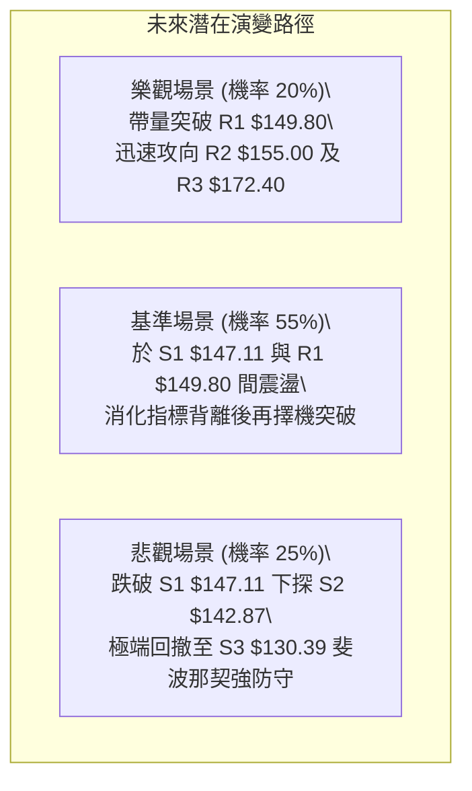

### 🛡️ 風險管理重要提醒

1. **高估值波動風險**：SPCX 目前 Forward P/E 高達 85.29，且 Net Profit Margin 為 -35.7%，屬於典型依賴高成長預期支撐之成長型個股。此類股票在缺乏成交量支持時，對市場流動性萎縮極為敏感，操作時嚴禁逆勢重倉扛單。
2. **波動率與倉位管理**：ATR 高達 $6.61 (4.44%)，單日價格波動劇烈。建議單筆交易承擔之最大風險資金（進場價與止損價差額 × 股數）嚴格控制在總投資帳戶淨值的 **1.0% ~ 1.5%** 以內。
3. **無新聞事件真空風險**：數據顯示近期無新聞催化（no news），成交量萎縮至 54.42M（量比 0.61x）。缺乏催化劑的市場容易由量化高頻算法主導，在關鍵阻力位 **R1 ($149.80)** 附近極易出現「假突破、真倒貨」的誘多洗盤陷阱，務必堅持收盤確認原則。

---

## 📋 報告總結

```
╔══════════════════════════════════════════════════════════════╗
║                   SPCX 技術分析報告總結                      ║
╠══════════════════════════════════════════════════════════════╣
║ 報告日期：2026-09-27                                         ║
║ 當前價格：$148.68                                            ║
║ 分析評級：⚖️ 中性觀望偏多 (綜合技術評分: 48/100)               ║
║                                                              ║
║ 關鍵結論：                                                   ║
║ ├─ 長期趨勢：🟡 中性築底 (52週區間 36.3%，自底部反彈修復中)  ║
║ ├─ 中期趨勢：🟢 偏多推升 (ADX=25.13 具趨勢性，+DI > -DI)     ║
║ ├─ 短期趨勢：🔴 頂背離調整 (MACD柱翻負，短均MA5/MA10壓制)     ║
║ ├─ 關鍵支撐：S1 $147.11 / S2 $142.87 / S3 $130.39            ║
║ ├─ 關鍵阻力：R1 $149.80 / R2 $155.00 / R3 $172.40            ║
║ └─ 分析師共識目標：$222.42 (現價潛在空間 +49.6%)             ║
║                                                              ║
║ 最優策略組合：                                               ║
║ 1. 🥇 最佳機會：策略 B — 逢低於 S1 ($147.11) 附近分批低吸，  ║
║    止損設於 S2 ($142.87)，目標看 R1 ($149.80) 與 R2 ($155.00)║
║ 2. 🥈 次選機會：策略 A — 放量突破 R1 ($149.80) 後右側跟進，  ║
║    止損設於 S1 ($147.11)，波段目標看 R2 ($155.00)            ║
║ 3. 🥉 保守選擇：場外空倉觀望，等待日線 MACD 重新在零軸上     ║
║    金叉且成交量重返 90M 均量線上方後再行進場。               ║
╚══════════════════════════════════════════════════════════════╝
```

---

> ⚠️ **免責聲明**：本報告為 AI 自動生成之技術分析，所有數據及估算均基於提供的歷史價格資訊。本報告**僅供研究與學術參考**，**不構成任何投資建議**。投資有風險，入市需謹慎。

---

*報告生成時間：2026-09-27 ｜ 數據來源：Yahoo Finance ｜ 分析框架：多時框技術分析*